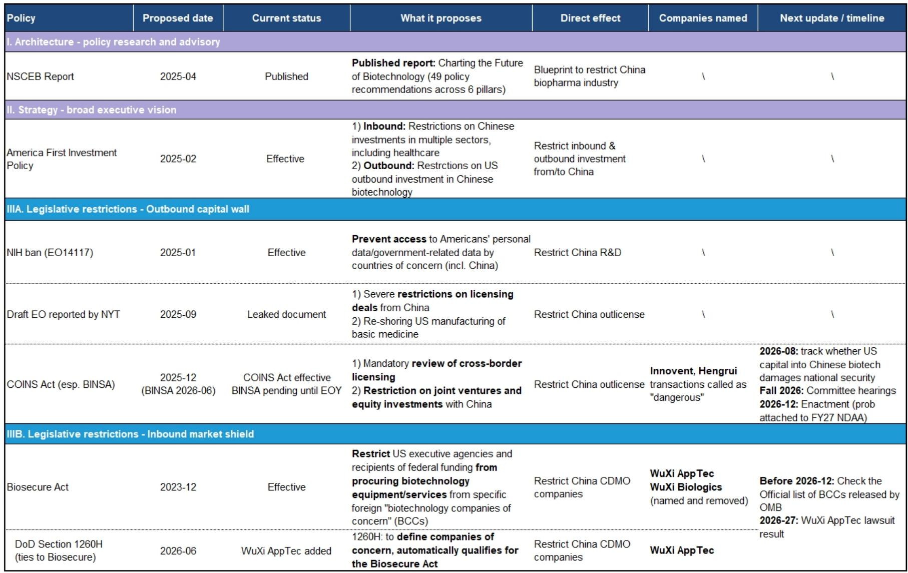
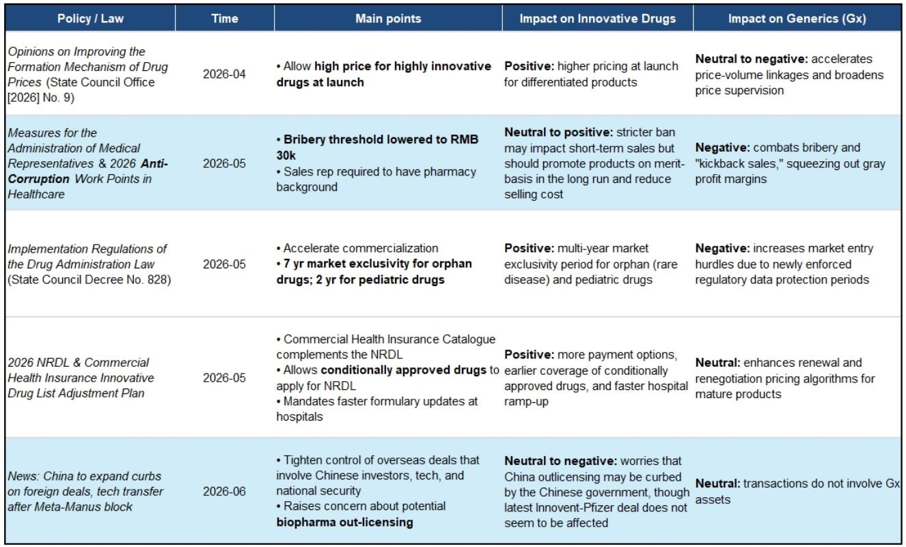
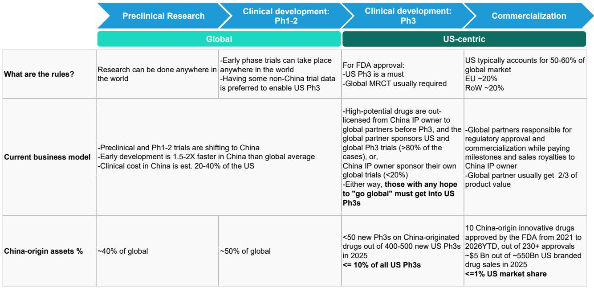

# Bernstein：中国生物医药被低估的不是创新能力，而是“全球价值转化”面临的真实阻力

过去一个月，港股和A股生物医药板块经历了一轮显著回调。市场的主流解读是“政策恐慌”——美国《生物安全法》推进、COINS/BINSA法案提出、以及中国国内反腐行动重启，三重压力叠加。但Bernstein在最新发布的这份研报中提出了一个更值得深思的判断：**市场定价反映的并非政策恐慌本身，而是对“中国创新药全球价值转化路径”的一次根本性重估。**

这轮下跌不是情绪驱动的短期波动，而是投资者在追问一个此前被忽视的问题——中国药企的早期研发优势，究竟有多少能真正转化为全球商业回报？答案取决于一整套正在收紧的制度安排，而市场目前可能定价了过于悲观的极端情景。

这份研报的价值，不在于罗列政策清单，而在于它为这个问题搭建了一个分析框架：从研发管线、交易结构到情景假设，层层拆解“价值转化”这一核心变量。以下是我们从中提炼出的五个关键洞察。

## 1. 中国在早期研发中的角色已不可逆，但“前重后轻”的结构性矛盾才是真正瓶颈

Bernstein的数据显示，中国在全球早期药物开发中的占比已经相当可观：约30%-40%的临床前项目、约50%的早期临床管线、以及2026年至今约55%的首次临床试验注册来自中国。这组数字直观地说明，中国生物医药的“创新供给”能力已经完成了质的跃迁。

然而，这种增长并未等比转化为后期阶段的全球存在感。中国原研资产在美国三期临床试验中的占比仍低于10%，FDA批准占比不到5%，美国商业销售额仅约1%。报告将这一落差归结为两个因素：一是时间滞后——近年加速的对外授权交易才刚刚开始进入美国后期管线；二是竞争力差距——美国FDA的审评标准和全球竞争强度，意味着比国内市场环境更高的淘汰率。

这里的核心含义是：中国生物医药当前面临的瓶颈不是“造不出分子”，而是“造出来的分子能否跨过全球商业化的门槛”。这个门槛由监管、临床设计、商业化能力、以及地缘政治共同决定，而最后一项正在成为最不确定的变量。

## 2. 美国政策不是“一刀切”，而是针对价值转化链条的逐层收紧

许多投资者将美国政策视为一个黑箱，但Bernstein将其拆解为三个层次：战略指引（美国优先投资政策）、架构设计（NSCEB报告）、以及具体立法（BINSA和生物安全法）。这种分层视角有助于理解政策的真实意图——它不是要全面封锁中国生物医药，而是要系统性地增加中国资产进入美国市场的摩擦。

具体而言，BINSA法案要求对跨境授权交易进行强制审查，限制中美合资企业和股权投资。值得注意的是，近期Innovent/辉瑞和恒瑞/BMS的合作已被美国议员公开称为“危险”交易。这表明，监管敏感性已经从CDMO（合同定制研发生产机构）扩展到了创新药授权层面。

同时，生物安全法的覆盖面也在扩大。药明康德在2026年6月被列入美国国防部1260H清单，这意味着它自动符合生物安全法的约束范围。如果OMB在年底发布正式的“关注生物技术公司”名单，中国CDMO与西方药企之间的结构性脱钩可能加速。

这些政策叠加在一起，指向一个共同的方向：中国生物医药进入美国市场的“通道”正在变窄、变贵、变不确定。

## 3. 中国国内政策对创新药总体友好，但“IP外流”监管正在成为新变量

在美国政策收紧的同时，中国国内政策环境对创新药总体保持支持。2026年4月发布的药品价格形成机制意见允许高创新度药物在上市时定高价；5月的NRDL调整方案引入了商业健康保险目录，为创新药提供更多支付渠道；罕见病和儿科药物的市场独占期也首次以法规形式确定。

但报告也指出一个尚未被充分定价的风险：中国政府对“技术外流”的监管正在加强。在Meta-Manus交易被叫停后，市场开始担忧生物医药领域的对外授权是否会受到类似限制。从目前情况看，纯产品级IP的转让（而非平台技术转移）似乎仍被允许——石药集团管理层在1Q业绩会上表示，政府对其产品级IP转让保持了灵活性。但这仍然是一个动态变量，需要持续追踪。

## 4. 情景分析揭示：当前市场定价隐含的假设比“温和摩擦”更悲观

Bernstein构建了两个情景来量化政策影响。在“间接进入”情景下，美国市场仍通过欧盟、日本等合作方对中国原研资产保持开放，但BD收入下降约50%，全球峰值销售额下降约20%。在“完全封锁”情景下，美国市场对中国资产实质关闭，BD收入下降约80%，全球销售额下降约60%。

对个股的影响差异显著。在完全封锁情景下，信达生物、恒瑞医药、翰森制药等全球敞口较大的公司估值可能面临约50%的下行空间。科伦博泰相对最具韧性，因为其旗舰产品sac-TMT是主要估值锚点，且已有17项美国临床试验在进行中，风险相对已释放。

关键判断在于：Bernstein认为完全封锁属于低概率情景，更可能的路径是“中间地带”——跨境合作持续但摩擦增加。而当前的市场定价，似乎已经反映了比这个基准情景更严重的假设。换句话说，**板块可能被过度惩罚了。**

## 5. 报告尚未完全回答的问题：估值修复的催化剂是什么？

这份报告在情景分析上做得相当扎实，但也留下了一些开放性问题，这些恰恰是决定投资时机的关键。

第一个问题是：如果市场定价已经反映了比基准情景更悲观的假设，那么触发估值修复的催化剂是什么？是BINSA法案在年底NDAA立法中未通过？是某笔重大授权交易顺利完成？还是中国创新药在美国三期临床取得突破性数据？报告没有给出明确的催化剂时间表，但暗示了几个关键节点：2026年8月的国家安全评估、年底的BCC名单发布、以及药明康德诉讼的结果。

第二个问题是：中国创新药企的“防御性估值”如何建立？在政策不确定性持续的环境下，哪些公司具备独立于中美关系的内生增长驱动力？报告提到了科伦博泰的韧性，但对于其他标的，如何区分“被低估”和“价值确实在缩水”，还需要更细致的个体分析。

第三个问题是：国内政策红利能否对冲美国市场的不确定性？2026年NRDL改革和商业保险目录的推进，理论上可以为中国创新药提供更大的本土市场空间。但国内商业化的利润天花板远低于美国市场，这种“替代效应”的量化边界在哪里？报告没有展开。

这些未解问题，恰恰是深入阅读完整报告、跟踪后续政策演变的必要前提。对于真正希望在这个板块中建立头寸的投资者，理解这些不确定性如何被定价、何时可能被修正，比简单判断“该买还是该卖”更为重要。

---

Personal reading notes and learning share only. Not investment advice.

