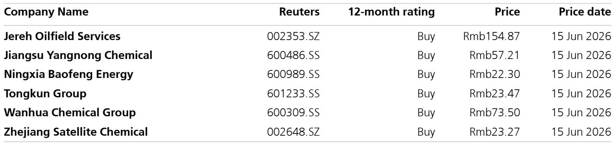
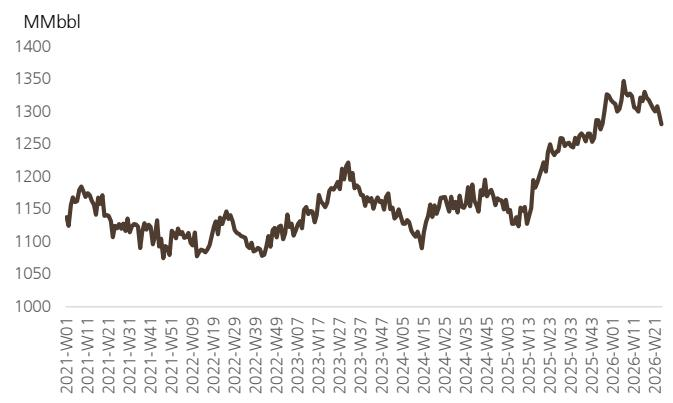

# UBS：中东局势缓和下，化工板块的真正机会不在油价，而在成本端的重新定价

市场当前正在消化一个关键信号：美国与伊朗就霍尔木兹海峡重新开放达成协议。这一事件的影响远不止于油价本身。UBS最新发布的每周跟踪报告给出了一个值得产业决策者反复推敲的判断——如果局势快速缓和，布伦特原油价格在2026年第三季度平均可能回落至85美元/桶。但这份报告最有价值的洞察，并非油价预测，而是它揭示了化工板块内部正在发生的结构性分化：哪些公司会在成本端受益，哪些公司反而可能面临短期压力。

对于化工行业投资者而言，当前需要回答的核心问题不是“油价会跌多少”，而是“当油价回归常态，哪些企业的盈利弹性被市场低估了”。UBS的报告为此提供了清晰的观察框架。

## 1. 成本端压力缓解带来的受益者，比市场想象的要更集中

UBS在报告中明确列出了受益于地缘政治缓和的化工企业类型。第一类是受原材料价格影响较大的公司，包括涤纶长丝（桐昆）和磷化工企业。这背后的逻辑并不复杂：这些企业的成本结构中，原油或原油衍生物占比较高，油价回落直接意味着成本下降。

但值得注意的，并非所有成本敏感型企业都会同等受益。报告给出了一组重要的运营数据作为参照：上周中国PTA开工率环比上升2个百分点至65%，而涤纶长丝开工率环比下降4个百分点至76%。这意味着下游需求端并未同步回暖。如果仅仅因为油价下跌就买入化工股，可能会忽略需求端的疲软。真正的受益者，必须是那些成本下降速度快于产品价格下降速度的企业。UBS的报告实际上在提醒：成本端受益，不等于利润端受益，中间还有一条“需求传导链条”需要验证。

## 2. 龙头企业的重新定价机会，可能被地缘政治噪音掩盖了

UBS特别提到了两类具备重新评级潜力的化工龙头：万华化学和扬农化工。这一判断值得深入拆解。

万华化学的MDI开工率上周环比大幅上升9个百分点至83%，这是报告中最引人注目的产能数据之一。在整体化工开工率普遍低迷的背景下——乙烯开工率环比下降2个百分点、PP开工率同比下降14个百分点——MDI的逆势提升显示出万华在聚氨酯领域的定价权和需求韧性。UBS将万华列为“re-rating potential”标的，其隐含逻辑是：当油价回落、成本端压力缓解时，万华这类拥有技术壁垒和规模优势的企业，其盈利改善幅度可能远超行业平均水平。

扬农化工的情况类似。作为农药龙头，其成本结构中原油衍生品占比较高，但产品定价更多取决于全球农产品周期和自身产品结构。UBS将其列为受益者，暗示的是当外部成本冲击消退后，市场可能重新聚焦其内生增长能力。

这里需要补充一点：UBS的报告没有完全展开的是，万华和扬农的re-rating逻辑是否成立，还取决于它们能否在行业景气低谷期维持产能利用率不降。MDI开工率的环比提升是一个积极信号，但需要更多季度的数据来确认趋势。

## 3. 替代路线生产商面临的短期压力，是报告里最容易被忽略的风险提示

UBS在报告中指出，拥有替代生产路线的烯烃生产商（宝丰能源和卫星化学）可能在短期内面临压力。这一判断初看反直觉：油价下跌，使用煤制烯烃（CTO）或乙烷裂解路线的企业，成本优势不是应该扩大吗？

但UBS的逻辑恰恰相反。当油价下跌时，石脑油裂解路线的成本随之下降，这会压缩煤制烯烃和乙烷裂解路线原本享有的成本溢价。换句话说，油价下跌反而削弱了这些替代路线的竞争优势。报告数据显示，上周石脑油基乙烯开工率环比下降2个百分点至77%，而MTO路线开工率持平于83%。这一数据暗示，替代路线的开工率并未因油价预期而提升，市场已经在提前定价这种竞争格局的变化。

对于持有宝丰能源和卫星化学的投资者来说，这是一个需要认真对待的短期风险。UBS的表述是“短期面临压力”，但报告没有给出压力持续时间的判断。这取决于油价回落的幅度和速度，以及这些企业能否通过产品结构差异化来对冲成本优势的收窄。

## 4. 库存数据揭示的真相：去库存周期尚未结束，但结构性差异正在扩大

报告提供的库存数据值得仔细解读。PP库存环比上升4%，但同比下降21%；PE库存环比下降1%，同比下降16%；PVC库存环比下降1%，同比下降22%；钛白粉库存环比上升27%，但同比下降49%。这些数据合在一起传达了一个重要信息：整体化工行业仍处于去库存周期中，但不同品种的去库存进度差异显著。

钛白粉库存的环比大幅上升尤其值得关注。尽管同比下降49%表明行业在过去一年经历了深度去库存，但环比27%的增幅可能意味着下游需求不足以支撑当前开工率水平。钛白粉开工率上周持平于79%，如果库存继续累积，开工率面临下行压力。

涤纶长丝库存环比下降16%，但同比上升66%。这一数据组合暗示：当前库存下降更多是季节性因素或短期订单驱动，而非需求趋势性回暖。UBS将涤纶长丝企业列为成本端受益者，但如果需求端不能同步改善，成本下降带来的利润弹性可能被高估。

## 5. 报告尚未完全回答的关键问题：AI驱动的化工材料需求，能否成为新的增长极？

UBS在报告末尾提到了几个值得关注的选股方向：杰瑞股份作为AI发展的受益者，以及部分MLCC企业和氟化工材料企业。这一部分内容在报告中着墨不多，但可能是未来最值得跟踪的变量。

报告提到UBS本周将与可能受益于AI发展的化工材料公司举行电话会议。这说明该机构正在积极评估AI对化工材料需求的影响。从逻辑上推演，AI基础设施建设（数据中心、服务器、冷却系统）对高端化工材料的需求正在上升，包括电子特气、高性能氟材料、MLCC用陶瓷粉体等。

但这里存在一个关键问题：UBS的报告没有给出这些AI相关化工材料需求的具体量化测算。市场目前对AI受益化工股的定价，更多是基于概念而非实际盈利贡献。如果这些材料企业的AI相关收入在未来几个季度能够兑现，其估值逻辑将发生根本性变化。反之，如果需求迟迟未能落地，当前的市场热情可能面临修正。

## 6. 投资者的观察框架：从“油价交易”转向“成本传导与需求验证”

基于UBS报告的框架，我们建议投资者从三个维度重新审视化工板块的投资逻辑。

第一，区分“成本受益”和“盈利受益”。油价下跌带来的成本下降，必须被产品价格和需求两个变量过滤。如果产品价格同步下跌且需求疲软，成本下降可能无法转化为利润增长。优先关注那些产品价格粘性强、下游需求刚性的细分领域，如MDI、部分农药品种。

第二，关注开工率与库存的组合信号。开工率上升伴随库存下降，是最健康的组合，表明需求在消化供给。MDI当前符合这一特征。开工率上升但库存上升，则可能是供给过剩的信号，钛白粉需要警惕。开工率下降但库存下降，则可能是主动去库存，PVC和PE属于此类，需要等待需求回暖信号。

第三，跟踪AI相关化工材料的订单数据。UBS的电话会议是一个重要的前瞻信号。如果这些材料公司能够披露AI相关收入的占比或增速，将是比油价波动更重要的估值驱动因素。

UBS这份报告的价值，不在于给出了多少具体标的，而在于它提供了一个在油价波动期保持理性的分析框架。中东局势的缓和是一个催化剂，但它不会改变化工行业的基本面逻辑——真正决定企业价值的，永远是成本控制能力、产品定价权和需求结构。

对于希望深入讨论这些化工龙头企业的竞争壁垒、AI材料需求的具体测算，以及UBS报告中未完全展开的替代路线压力持续时间的读者，我们欢迎您来知识星球微信群继续交流。在这里，您可以获取原始研报图表，并与产业界和投资界的同行一起，对这些关键问题进行更细致的拆解。

Personal reading notes and learning share only. Not investment advice.

