# Oil Tracker: 70% of Pre-War Hormuz Flows Might Become the New 100%

\- Spot Brent futures prices slipped below \$80/bbl this week as the US and Iran reached an interim deal that would lift the US blockade and reopen the Strait of Hormuz right after the deal is signed, with the US and Iran reportedly signing the Memorandum of Understanding Wednesday night electronically.

☐ The interim deal reportedly includes a waiver for exports of Iranian oil and petrochemicals and for related financial and transportation services, potentially unlocking over 50mb of Iranian oil on water overhang for immediate delivery.  
☐ We now assume that Persian Gulf exports normalize to pre-war levels by end of July and Persian Gulf crude production recover by October and see risks to the Mideast supply outlook as two-sided, but skewed to the downside on net.

☐ We estimate that this normalization in Gulf exports to pre-war levels might be achieved with a 13mb/d increase in Hormuz flows from current levels to around 70% of pre-war levels (Exhibit 3).

We estimate average visible Hormuz flows at 1.3mb/d over the 7 days, Gulf of Oman flows (which might be linked to “dark” Hormuz crossings) at 1.6mb/d, and redirections via Yanbu, Fujairah, and Ceyhan at 7.5mb/d.

☐ We do not see ship availability as a binding constraint on the recovery of flows as we estimate 860mb of empty tanker capacity within the Strait or within 5 days of navigation (Exhibit 6).

However, many shipowners reportedly remain cautious about clear guidelines for transit, and we see shippers' risk aversion as a potential constraint on the flows, along with Iran's geopolitical goals over the upcoming 60-day nuclear deal negotiations.

The IEA estimates in its latest Oil Market Report a Q2 deficit of 3.1mb/d, below our estimate of a 5.0mb/d deficit, given larger Q2 demand destruction of 5.5mb/d vs. GS at 4.9mb/d, peaking in May at 6.1mb/d (Exhibit 1).

☐ Across products, IEA demand loss estimates are concentrated in petrochemical feedstocks, consistent with our analysis.

\- The IEA downgraded LPG and ethane demand by -1.7mb/d or -11% (vs. February expectations) and naphtha demand by -1.1mb/d or 15%.

Yulia Zhestkova Grigsby

+1(646)446-3905

yulia.grigsby@gs.com

GS & Co. LLC

Filippo Cuscito

+44(20)7051-9073

filippo.cuscito@gs.com

GS International

Alexandra Paulus

+1(212)902-7111

alexandra.paulus@gs.com

GS & Co. LLC

Daan Struyven

+1(212)357-4172

daan.struyven@gs.com

GS & Co. LLC

☐ Across regions, demand losses are the largest in Asia and Middle East, as the IEA downgraded China total oil demand by -2.2mb/d or -13%, Asia ex China by -1.5mb/d or -7%, and Middle East demand by -10%.

☐ The IEA revised up its Persian Gulf production losses, with total liquids production from Iran, Iraq, Kuwait, Qatar, Saudi Arabia, and UAE declining in Q2 by 18.9mb/d from its February level.

\- The IEA keeps its assumption that Hormuz flows recovery starts in 2026Q3 and will take several months.

☐ The IEA also released their first 2027 balance and expects an average global surplus of 5.0mb/d (vs. GS at 3.2mb/d) on strong 7.9mb/d YoY supply growth and some lingering demand weakness.

While China accounts for $40\%$ of estimated global oil demand destruction at about 2mb/d, China crude imports dropped more sharply by 4.2mb/d YoY.

☐ Taking into account recent China crude net imports, production, and crude throughput, we estimate crude stock draws at 1.6mb/d in May vs. 0.3mb/d draws in visible stocks (Exhibit 2).

☐ This -1.3mb/d difference is likely driven by either meaningful invisible crude destocking (e.g. underground SPR) and/or even lower crude demand (lower refinery runs) than official data implies.

☐ Lower China oil demand would be consistent with weaker China April-May economic activity and our estimates of a 23% year-over-year drop in China gasoline and other retail oil products sales volumes in May (Exhibit 18).

## Charts of the Week

Exhibit 1: IEA Revises Down May World Oil Demand by 6.1mb/d in Latest Oil Market Report vs. the February Pre-War Estimates

<table><tr><td colspan="4">IEA May Demand Forecast Revisions (June vs. February Oil Market Report), mb/d</td></tr><tr><td>Total World Oil Deman</td><td colspan="3">-6.1</td></tr><tr><td colspan="2">by Product</td><td colspan="2">by Geography</td></tr><tr><td>LPG and Ethane</td><td>-1.7</td><td>China</td><td>-2.2</td></tr><tr><td>Diesel and Gasoil</td><td>-1.2</td><td>Asia ex China</td><td>-1.5</td></tr><tr><td>Naphtha</td><td>-1.1</td><td>Middle East</td><td>-1.0</td></tr><tr><td>Motor Gasoline</td><td>-0.8</td><td>Europe</td><td>-0.8</td></tr><tr><td>Jet Fuel and Kerosene</td><td>-0.5</td><td>Rest of World</td><td>-0.6</td></tr><tr><td></td><td></td><td>US</td><td>0.0</td></tr></table>

Source: IEA, GS Global Investment Research

Exhibit 2: China Implied Estimated Stock Draws Exceeded Visible Draws by 1.3mb/d in May, Suggesting Either Meaningful Invisible Strategic Destocking or Lower Crude Demand (i.e. Lower Refinery Runs)

<table><tr><td colspan="5">China Oil Balances, mb/d</td></tr><tr><td></td><td colspan="2">May</td><td colspan="2">May-March Average</td></tr><tr><td></td><td>Crude</td><td>Refined Products</td><td>Crude</td><td>Refined Products</td></tr><tr><td>1) Domestic Production</td><td>4.3</td><td>12.7</td><td>4.4</td><td>13.5</td></tr><tr><td>2) Net Imports</td><td>6.8</td><td>-0.1</td><td>8.4</td><td>0.0</td></tr><tr><td>3) Demand</td><td>12.7</td><td>12.5</td><td>13.5</td><td>12.9</td></tr><tr><td>4) Implied Change in Stocks: (1) + (2) - (3)</td><td>-1.6</td><td>0.2</td><td>-0.8</td><td>0.7</td></tr><tr><td>5) Visible Change in Stocks</td><td>-0.3</td><td>-0.1</td><td>0.2</td><td>0.1</td></tr><tr><td>Estimated Invisible Stock Changes: Implied Minus Visible Gap: (4) - (5)</td><td>-1.3</td><td>0.3</td><td>-1.0</td><td>0.6</td></tr></table>

We combine estimates of domestic production from the IEA, net imports and visible changes in stocks from Kpler and Oilchem, crude demand (i.e. refinery runs) from NBS, and refined products demand from S&P Global Market Intelligence.

Source: China National Bureau of Statistics, Kpler, S&P Global Market Intelligence, Oilchem, GS Global Investment Research

## 1) Persian Gulf Exports

Exhibit 3: Normalization in Oil Exports From Gulf Producers to Their Pre-War Level May Be Achieved With a 12.7mb/d Increase in Hormuz Flows From Current Levels  
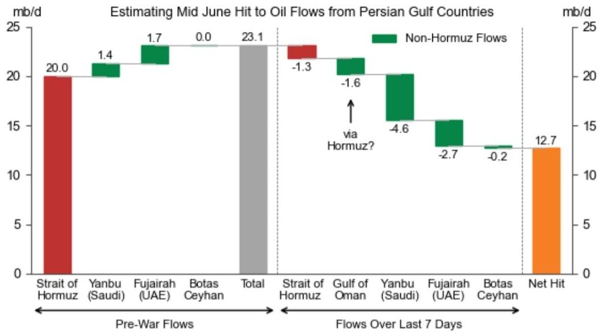

bar chart

Estimating Mid June Hit to Oil Flows from Persian Gulf Countries
| Flow | Non-Hormuz Flows (mb/d) | Pre-War Flows (mb/d) | Total (mb/d) |
| :--- | :--- | :--- | :--- |
| Strait of Hormuz | -1.3 | 20.0 | 23.1 |
| Gulf of Oman | -1.6 | 22.0 | 24.0 |
| Yanbu (Saudi) | -4.6 | 21.0 | 23.5 |
| Fujairah (UAE) | -2.7 | 20.0 | 23.5 |
| Botas Ceyhan | -0.2 | 20.0 | 23.5 |
| Net Hit | 12.7 | 20.0 | 13.0 |

Yanbu is on the west coast of Saudi Arabia, bordering the Red Sea and connected to Saudi eastern oil fields via the East-West pipeline. Fujairah lies east (outside) of the Strait of Hormuz and is connected to Abu Dhabi's onshore fields via the Abu Dhabi Crude Oil Pipeline (ADCOP). The Gulf of Oman connects the Strait to the Arabian Sea (southeast). The Kirkuk-Ceyhan pipeline allows northern Iraqi crude to be pumped through Turkey to the Mediterranean sea.

Source: Kpler, S&P Global Commodities at Sea, GS Global Investment Research

Exhibit 4: We Estimate That 1.3mb/d of Visible OECD SPR Releases Have Reduced the Estimated Hit to Global Commercial Oil Stocks Since March by 1.3mb/d to 4.3mb/d  
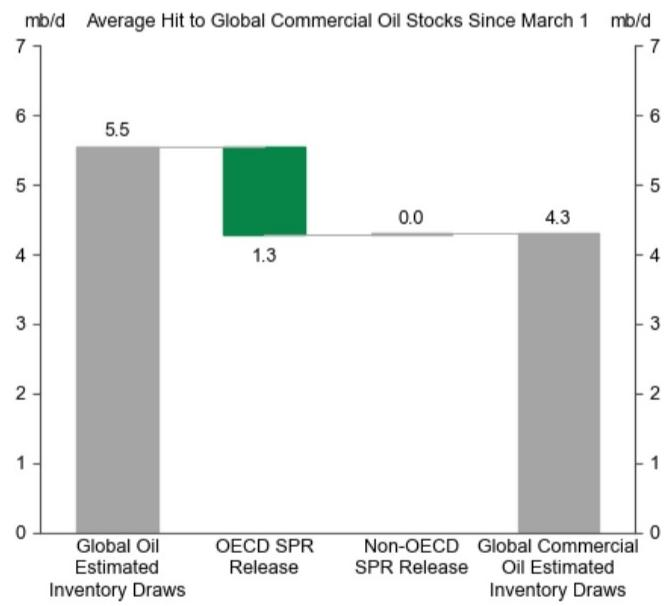

bar chart

Average Hit to Global Commercial Oil Stocks Since March 1 mb/d
| Category | Value (mb/d) |
|---|---|
| Global Oil Estimated Inventory Draws | 5.5 |
| OECD SPR Release | 1.3 |
| Non-OECD SPR Release | 0.0 |
| Global Commercial Oil Estimated Inventory Draws | 4.3 |

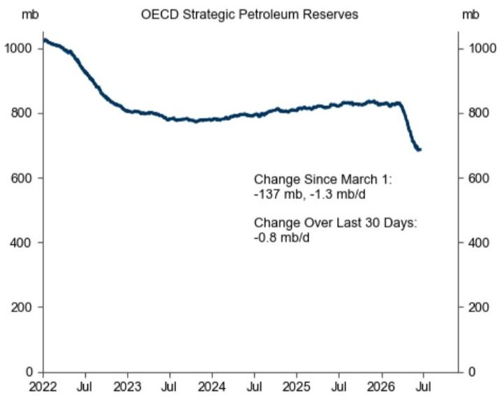

line chart

| Date       | Change Since March 1 (mb) | Change Over Last 30 Days (mb/d) |
| ---------- | ------------------------- | -------------------------------- |
| March 1    | -137                      | -1.3                             |
| Last 30    | -0.8                      | -0.8                             |

We estimate global oil inventory draws from latest GS oil balance.  
Source: Kpler, GS Global Investment Research

Exhibit 5: The Estimated Total Hit to Oil Flows from the Persian Gulf Is Currently at 14.8mb/d (4-Day Moving Average)  
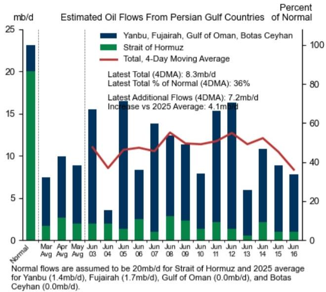

bar-line hybrid

Estimated Oil Flows From Persian Gulf Countries Percent of Normal
| Month | Strait of Hormuz (mb/d) | Strait of Hormuz (mb/d) | Yanbu, Fujairah, Gulf of Oman, Botas Ceyhan (mb/d) |
|---|---|---|---|
| Mar Avg | 1.5 | 20.0 | 7.3 |
| Apr Avg | 2.5 | 2.8 | 9.8 |
| May Avg | 2.0 | 2.0 | 8.8 |
| Jun 03 | 2.0 | 1.5 | 14.5 |
| Jun 04 | 1.5 | 1.5 | 3.5 |
| Jun 05 | 1.5 | 1.5 | 16.0 |
| Jun 06 | 2.5 | 2.5 | 8.2 |
| Jun 07 | 1.0 | 1.0 | 13.8 |
| Jun 08 | 3.0 | 2.8 | 12.5 |
| Jun 09 | 2.5 | 2.5 | 11.3 |
| Jun 10 | 1.5 | 1.5 | 7.8 |
| Jun 11 | 2.5 | 2.5 | 15.2 |
| Jun 12 | 1.5 | 1.5 | 16.0 |
| Jun 13 | 0.5 | 0.5 | 6.0 |
| Jun 14 | 2.0 | 2.0 | 10.8 |
| Jun 15 | 1.0 | 1.0 | 8.8 |
| Jun 16 | 1.0 | 1.0 | 7.8 |
Percent of Normal
Latest Total (4DMA): 8.3 mb/d
Latest Total % of Normal (4DMA): 36%
Latest Additional Flows (4DMA): 7.2 mb/d
Increase vs 2025 Average: 4.1 mb/d
Normal flows are assumed to be 20 mb/d for Strait of Hormuz and 2025 average for Yanbu (1.4 mb/d), Fujairah (1.7 mb/d), Gulf of Oman (0.0 mb/d), and Botas Ceyhan (0.0 mb/d).

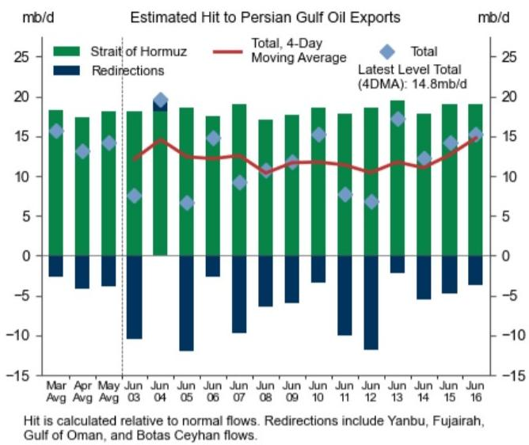

bar-line hybrid

Estimated Hit to Persian Gulf Oil Exports
| Month | Strait of Hormuz (mb/d) | Redirections (mb/d) | Total, 4-Day Moving Average (mb/d) | Latest Level Total (4DMA) (mb/d) |
|---|---|---|---|---|
| Mar Avg | 18.5 | -2.0 | 16.0 | 15.5 |
| Apr Avg | 17.5 | -3.5 | 13.5 | 13.0 |
| May Avg | 18.0 | -3.0 | 14.5 | 14.0 |
| Jun 03 | 18.0 | -10.5 | 7.5 | 7.0 |
| Jun 04 | 0.0 | 20.0 | 14.5 | 20.0 |
| Jun 05 | 18.5 | -12.0 | 7.0 | 6.5 |
| Jun 06 | 17.5 | -2.5 | 15.0 | 15.0 |
| Jun 07 | 19.0 | -9.5 | 9.5 | 9.0 |
| Jun 08 | 17.0 | -6.0 | 11.0 | 11.0 |
| Jun 09 | 17.5 | -5.5 | 12.0 | 12.0 |
| Jun 10 | 18.0 | -3.0 | 12.5 | 15.5 |
| Jun 11 | 18.0 | -9.5 | 8.0 | 8.0 |
| Jun 12 | 18.5 | -12.0 | 7.0 | 7.0 |
| Jun 13 | 20.0 | -2.5 | 12.5 | 17.5 |
| Jun 14 | 18.0 | -5.0 | 12.0 | 12.5 |
| Jun 15 | 19.5 | -4.5 | 14.5 | 14.5 |
| Jun 16 | 19.5 | -3.5 | 15.5 | 15.5 |
Hit is calculated relative to normal flows. Redirections include Yanbu, Fujairah, Gulf of Oman, and Botas Ceyhan flows.

Source: S&P Global Commodities at Sea, Kpler, GS Global Investment Research

Exhibit 6: We Estimate That Empty Oil Tankers Within the Strait or Within 5 Days of Navigation Have the Capacity to Load 861 Million Barrels  
Oil Tanker Capacity on Both Sides of Hormuz  
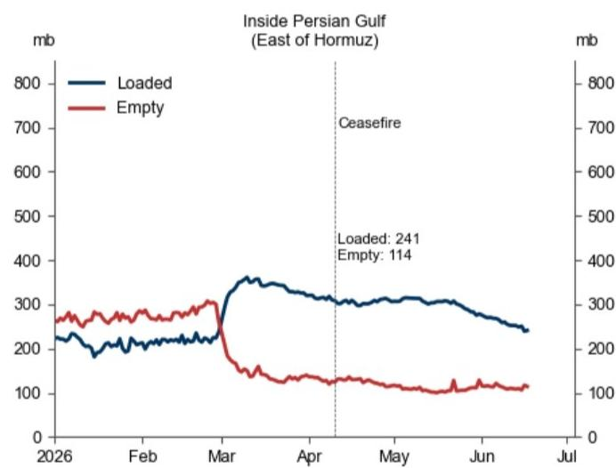

line chart

| Date       | Loaded (mb) | Empty (mb) |
| ---------- | ----------- | ---------- |
| March      | 350         | 300        |
| April      | 300         | 150        |
| May        | 300         | 120        |
| June       | 280         | 110        |
| July       | 241         | 114        |

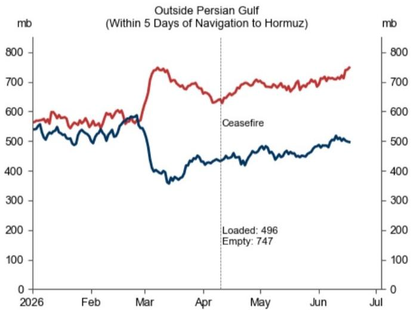

line chart

| Date       | Ceasefire (mb) | Loaded (mb) | Empty (mb) |
| ---------- | -------------- | ----------- | ---------- |
| Apr        | 650            | 496         | 747        |

We consider vessels in: Arabian Sea, Gulf of Oman, Yemeni waters.  
Source: Kpler, GS Global Investment Research

Exhibit 7: 28% of the Hit to Persian Gulf Crude/Condensate Exports Is Currently Being Offset, With Contributions From Higher Exports from the US/Americas Ex US/Russia of 16pp/8pp/5pp  
Global Oil Exports vs. 2025 Average  
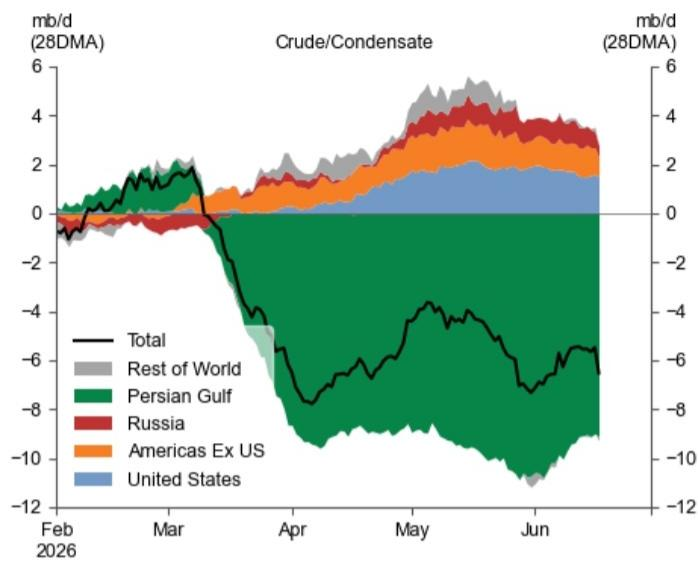

area chart

| Month    | Total (mb/d) | Rest of World (mb/d) | Persian Gulf (mb/d) | Russia (mb/d) | Americas Ex US (mb/d) | United States (mb/d) |
|----------|--------------|----------------------|---------------------|---------------|------------------------|----------------------|
| Feb 2026 | -1           | 0                    | 0                   | 0             | 0                      | 0                    |
| Mar      | 2            | 1                    | 1                   | 0             | 0                      | 0                    |
| Apr      | -6           | 1                    | -4                  | 0             | 0                      | 0                    |
| May      | -4           | 3                    | -8                  | 1             | 1                      | 1                    |
| Jun      | -6           | 2                    | -10                 | 1             | 1                      | 1                    |

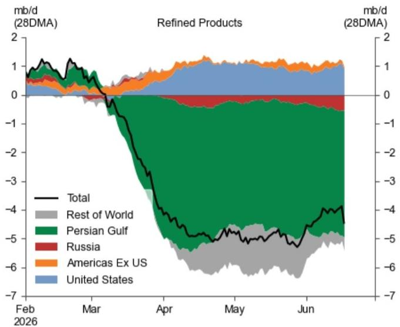

area chart

| Month    | Total | Rest of World | Persian Gulf | Russia | Americas Ex US | United States |
| -------- | ----- | ------------- | ------------ | ------ | -------------- | ------------- |
| Feb 2026 | 1.0   | 0.5           | 0.3          | 0.1    | 0.1            | 0.1           |
| Mar      | -0.5  | -0.3          | -0.2         | 0.1    | 0.1            | 0.1           |
| Apr      | -4.0  | -5.0          | -1.0         | 0.1    | 0.1            | 0.1           |
| May      | -5.0  | -5.5          | -1.5         | 0.1    | 0.1            | 0.1           |
| Jun      | -4.5  | -5.0          | -1.5         | 0.1    | 0.1            | 0.1           |

Refined products include LPG.  
Source: Kpler, GS Global Investment Research

## 2) Inventories

Exhibit 8: China Landed Visible Inventories Have Drawn by 0.5mb/d Over the Last 14 Days  
Global Visible Total Oil Inventories, Change Since Feb 27  
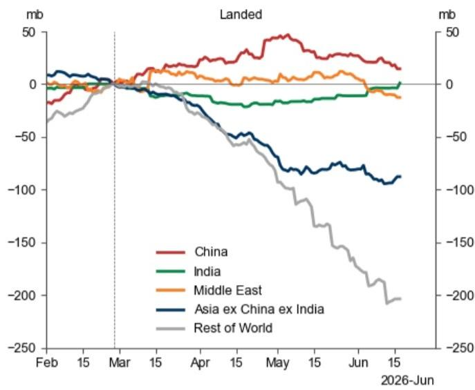

line chart

| Date    | China | India | Middle East | Asia ex China ex India | Rest of World |
|---------|-------|-------|-------------|--------------------------|---------------|
| Feb     | -10   | 0     | 0           | 0                        | -30           |
| Mar     | 0     | 0     | 0           | 0                        | 0             |
| Apr     | 20    | -10   | 10          | -50                      | -70           |
| May     | 40    | -20   | 20          | -80                      | -120          |
| Jun     | 10    | -10   | -10         | -100                     | -200          |

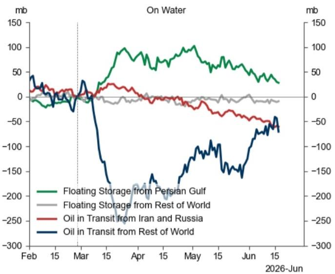

line chart

| Date       | Floating Storage from Persian Gulf (mb) | Floating Storage from Rest of World (mb) | Oil in Transit from Iran and Russia (mb) | Oil in Transit from Rest of World (mb) |
| ---------- | ---------------------------------------- | ------------------------------------------ | ---------------------------------------- | -------------------------------------- |
| Feb 15     | -10                                      | 0                                          | 10                                       | 40                                     |
| Mar 15     | 0                                        | 0                                          | 0                                        | -180                                   |
| Apr 15     | 100                                      | 0                                          | -20                                      | -150                                   |
| May 15     | 80                                       | 0                                          | -30                                      | -100                                   |
| Jun 15     | 40                                       | 0                                          | -40                                      | -70                                    |
| 2026-Jun   | 30                                       | 0                                          | -50                                      | -60                                    |

Source: IEA, Kpler, DOE, Euroilstocks, ARA PJK, PAJ, Haver, GS Global Investment Research

Exhibit 9: Global Visible Draws Have Averaged at 3.4mb/d Since March 1st

<table><tr><td colspan="5">Visible Oil Stocks, Month-Over-Month Changes (mb/d)</td></tr><tr><td></td><td>June</td><td>May</td><td>April</td><td>Average Since March 1st</td></tr><tr><td>Global Visible Stocks</td><td>-2.2</td><td>-5.5</td><td>-2.0</td><td>-3.4</td></tr><tr><td>Landed Crude Stocks</td><td>-2.0</td><td>-2.9</td><td>-2.2</td><td>-2.5</td></tr><tr><td>OECD</td><td>-1.1</td><td>-2.7</td><td>-2.6</td><td>-2.3</td></tr><tr><td>China</td><td>-0.5</td><td>-0.3</td><td>0.4</td><td>-0.1</td></tr><tr><td>Non-OECD Ex China</td><td>-0.4</td><td>0.1</td><td>0.0</td><td>0.0</td></tr><tr><td>Landed Products Stocks</td><td>-0.6</td><td>-0.7</td><td>-1.1</td><td>-0.8</td></tr><tr><td>OECD NGL</td><td>0.1</td><td>0.2</td><td>0.2</td><td>0.2</td></tr><tr><td>OECD Refined Products</td><td>0.1</td><td>-0.5</td><td>-1.4</td><td>-0.7</td></tr><tr><td>Non-OECD Total Products</td><td>-0.8</td><td>-0.3</td><td>0.1</td><td>-0.3</td></tr><tr><td>Oil on Water</td><td>0.5</td><td>-1.9</td><td>1.3</td><td>-0.1</td></tr><tr><td>Floating Crude</td><td>-0.7</td><td>-1.0</td><td>0.4</td><td>-0.4</td></tr><tr><td>Floating Products</td><td>-0.6</td><td>0.0</td><td>0.0</td><td>-0.1</td></tr><tr><td>Crude in Transit</td><td>2.4</td><td>-0.5</td><td>1.3</td><td>0.9</td></tr><tr><td>Products in Transit</td><td>-0.6</td><td>-0.4</td><td>-0.4</td><td>-0.5</td></tr></table>

Latest observation is today, and data is unsmoothed. "Crude" categories (landed and on water) include both crude and condensate. Month-over-month changes are calculated by taking the end-of-month level (or latest realized level, if the month isn't yet over), subtracting the previous month's end-of-month level, and dividing by the number of days.

Latest observation is today, and data is unsmoothed. “Crude” categories (landed and on water) include both crude and condensate. Month-over-month changes are calculated by taking the end-of-month level, subtracting the previous month’s end-of-month level, and dividing by the number of days.

Source: GS Global Investment Research

Exhibit 10: Global Diesel and Gasoline High-Frequency Visible Stocks Decreased to the Bottom of Their Seasonal Range  
Global Visible High-Frequency Gasoline and Diesel Stocks  
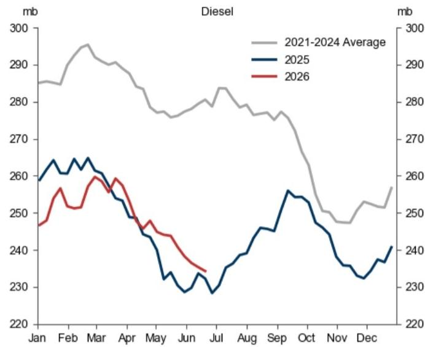

line chart

| Month | 2021-2024 Average (mb) | 2025 (mb) | 2026 (mb) |
|-------|--------------------------|-----------|-----------|
| Jan   | ~285                     | ~260      | ~248      |
| Feb   | ~295                     | ~265      | ~255      |
| Mar   | ~290                     | ~260      | ~260      |
| Apr   | ~285                     | ~250      | ~255      |
| May   | ~280                     | ~240      | ~245      |
| Jun   | ~275                     | ~230      | ~235      |
| Jul   | ~280                     | ~235      | ~238      |
| Aug   | ~275                     | ~240      | ~240      |
| Sep   | ~270                     | ~255      | ~245      |
| Oct   | ~260                     | ~250      | ~248      |
| Nov   | ~250                     | ~240      | ~245      |
| Dec   | ~255                     | ~245      | ~248      |

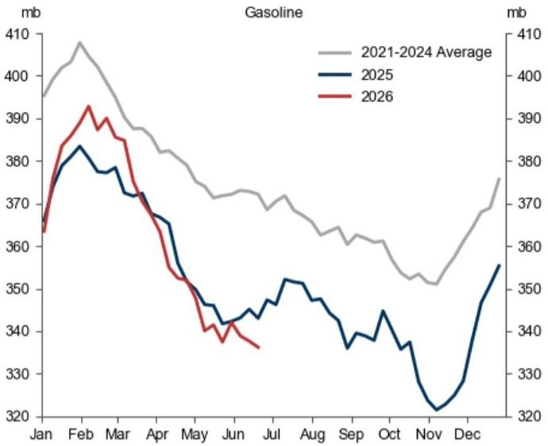

line chart

| Month | 2021-2024 Average (mb) | 2025 (mb) | 2026 (mb) |
|-------|--------------------------|-----------|-----------|
| Jan   | ~398                     | ~370      | ~365      |
| Feb   | ~410                     | ~385      | ~395      |
| Mar   | ~405                     | ~378      | ~390      |
| Apr   | ~395                     | ~370      | ~375      |
| May   | ~385                     | ~360      | ~355      |
| Jun   | ~375                     | ~345      | ~340      |
| Jul   | ~370                     | ~350      | ~345      |
| Aug   | ~365                     | ~345      | ~340      |
| Sep   | ~360                     | ~340      | ~335      |
| Oct   | ~355                     | ~335      | ~330      |
| Nov   | ~350                     | ~320      | ~325      |
| Dec   | ~375                     | ~355      | -         |

Source: DOE, Longzhong, ARA PJK, Fujairah, Singapore Enterprise, IEA, PAJ, GS Global Investment Research

## 3) Refining

Exhibit 11: Estimated Chinese Refineries Runs Have Declined by 1.9mb/d Since End of February  
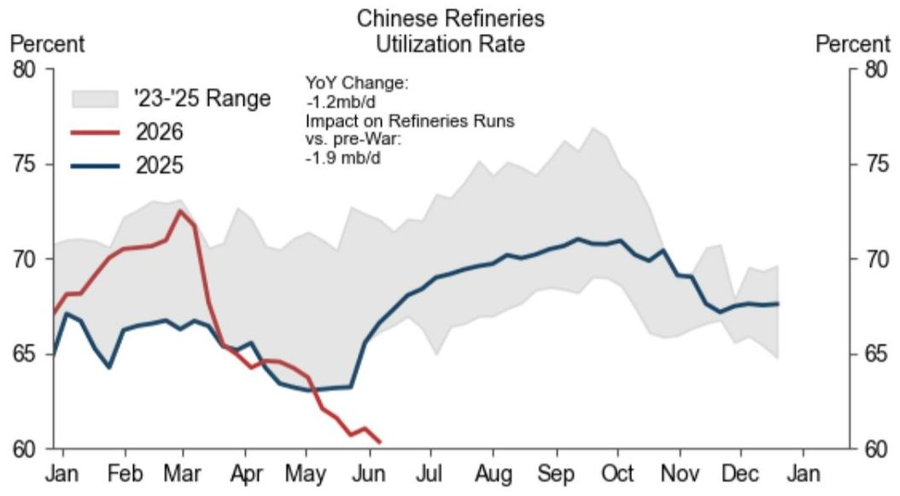

line chart

| Month | 2025 Utilization Rate | 2026 Utilization Rate | YoY Change (mb/d) |
|-------|------------------------|------------------------|-------------------|
| Jan   | ~65.5                  | ~67.0                  | -                 |
| Feb   | ~64.0                  | ~70.0                  | -                 |
| Mar   | ~66.5                  | ~72.5                  | -                 |
| Apr   | ~64.5                  | ~64.0                  | -                 |
| May   | ~63.0                  | ~62.0                  | -                 |
| Jun   | ~63.5                  | ~60.5                  | -                 |
| Jul   | ~68.0                  | -                      | -                 |
| Aug   | ~70.0                  | -                      | -                 |
| Sep   | ~71.0                  | -                      | -                 |
| Oct   | ~71.5                  | -                      | -                 |
| Nov   | ~70.0                  | -                      | -                 |
| Dec   | ~68.0                  | -                      | -                 |
| Jan   | ~67.5                  | -                      | -                 |

Source: Oilchem, GS Global Investment Research

Exhibit 12: Japanese Refineries Runs Are 0.5mb/d Lower Than Their End-of-February Levels  
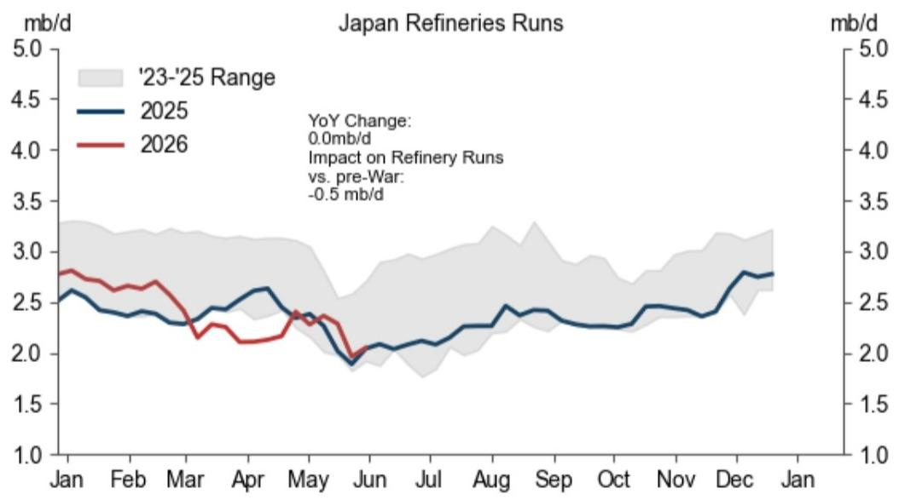

line chart

| Month | 2025 (mb/d) | 2026 (mb/d) |
|-------|-------------|-------------|
| Jan   | ~2.6        | ~2.8        |
| Feb   | ~2.4        | ~2.7        |
| Mar   | ~2.3        | ~2.2        |
| Apr   | ~2.5        | ~2.1        |
| May   | ~2.4        | ~2.3        |
| Jun   | ~1.9        | ~2.0        |
| Jul   | ~2.1        | —           |
| Aug   | ~2.3        | —           |
| Sep   | ~2.4        | —           |
| Oct   | ~2.3        | —           |
| Nov   | ~2.4        | —           |
| Dec   | ~2.7        | —           |
| Jan   | ~2.8        | —           |

Source: PAJ, GS Global Investment Research

Exhibit 13: The Utilization Rate of US Refineries Is Up 0.6pp Year-Over-Year as US Product Margins Remain High  
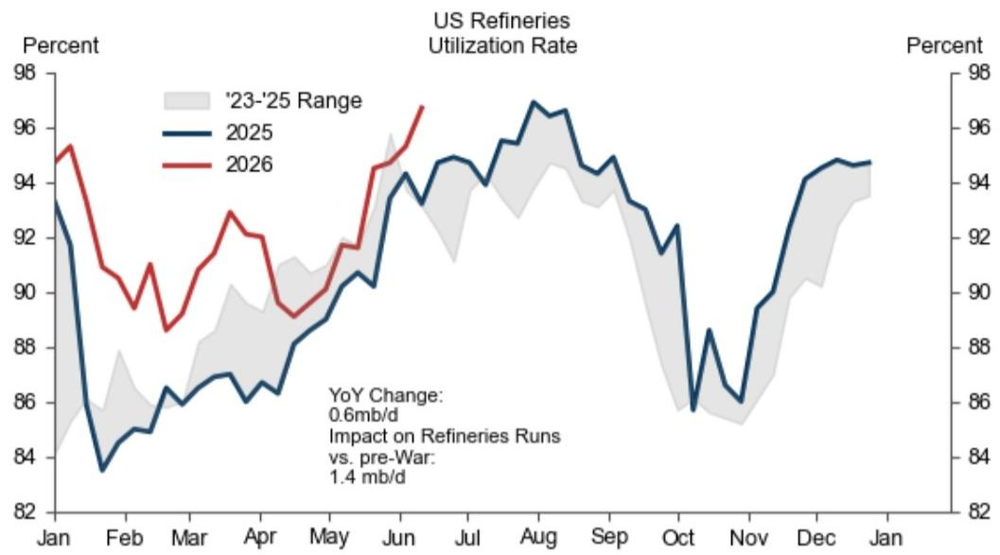

line chart

| Month | 2025 | 2026 |
|-------|------|------|
| Jan   | 93.5 | 95.0 |
| Feb   | 83.5 | 89.5 |
| Mar   | 86.0 | 91.0 |
| Apr   | 87.0 | 92.5 |
| May   | 89.0 | 93.0 |
| Jun   | 94.0 | 96.5 |
| Jul   | 95.0 | 97.0 |
| Aug   | 96.5 | 97.5 |
| Sep   | 94.5 | 96.0 |
| Oct   | 86.0 | 87.0 |
| Nov   | 86.5 | 88.0 |
| Dec   | 94.5 | 95.0 |
| Jan   | 94.5 | 95.0 |

Source: EIA, GS Global Investment Research

## 4) Energy Prices

Energy Prices Across Regions

Exhibit 14: US Wholesale Gasoline Prices Outperform Regional Counterparts and Products Across the Barrel on Strong Summer Demand  
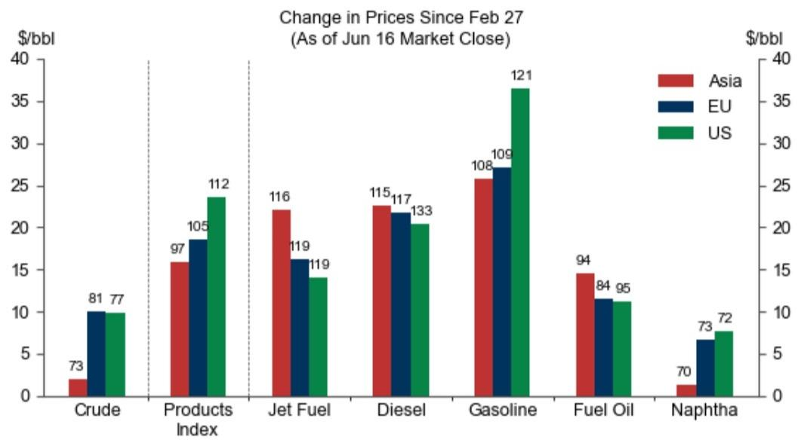

bar chart

Change in Prices Since Feb 27 (As of Jun 16 Market Close)
| Category | Asia ($/bbl) | EU ($/bbl) | US ($/bbl) |
| :--- | :--- | :--- | :--- |
| Crude | 73 | 81 | 77 |
| Products Index | 97 | 105 | 112 |
| Jet Fuel | 116 | 119 | 119 |
| Diesel | 115 | 117 | 133 |
| Gasoline | 108 | 109 | 121 |
| Fuel Oil | 94 | 84 | 95 |
| Naphtha | 70 | 73 | 72 |

Bar labels indicate crude/refined products prices as of June 16th market close. We consider cash or cash-equivalent prices.  
Source: ICE, Platts, GS Global Investment Research

Exhibit 15: While Global Wholesale Refined Products Prices Continue to Normalize, Retail Prices Remain Elevated  
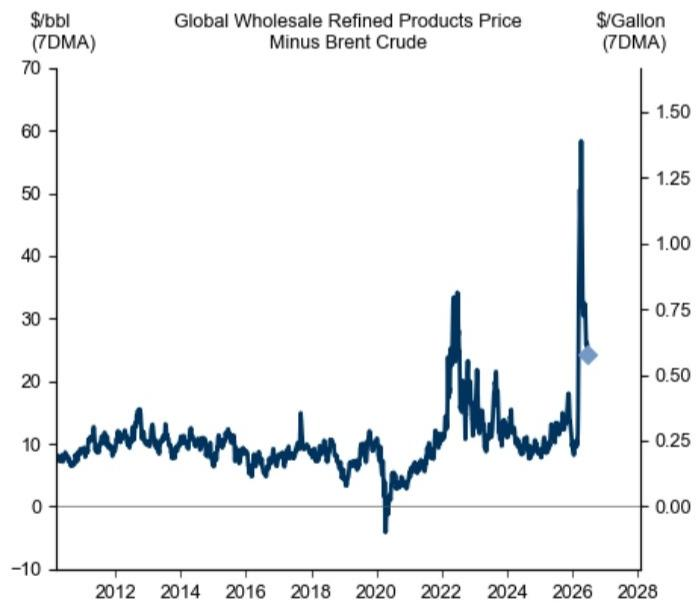

line chart

| Year | Global Wholesale Refined Products Price ($/bbl) | Brent Crude ($/gallon) |
|------|--------------------------------------------------|------------------------|
| 2026 | ~58                                              | ~0.75                  |
| 2027 | ~34                                              | ~0.50                  |

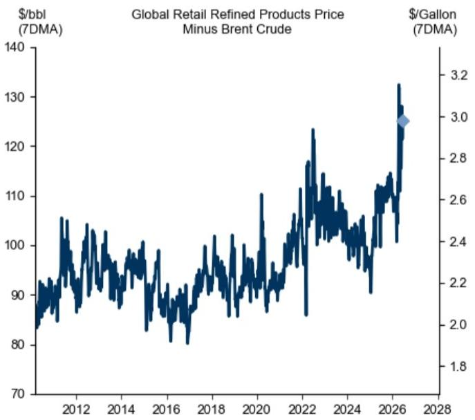

line chart

| Year | Global Retail Refined Products Price ($/bbl) | Brent Crude ($) | Gasoline ($) |
|------|-----------------------------------------------|-----------------|--------------|
| 2012 | ~95                                           | ~2.0            | ~2.4         |
| 2014 | ~100                                          | ~2.2            | ~2.6         |
| 2016 | ~95                                           | ~2.4            | ~2.8         |
| 2018 | ~105                                          | ~2.6            | ~3.0         |
| 2020 | ~110                                          | ~2.8            | ~3.2         |
| 2022 | ~125                                          | ~3.0            | ~3.2         |
| 2024 | ~115                                          | ~3.0            | ~3.2         |
| 2026 | ~130                                          | ~3.0            | ~3.2         |
| 2028 | -                                             | -               | -            |

The global retail refined product price is a simple average of global retail gasoline and diesel price indices, which are each demand-weighted averages of 40 country-level retail product prices. The global wholesale refined product price is a demand-weighted average of wholesale price indices in the US, Europe, and Asia, which are themselves demand-weighted averages of gasoline, diesel, jet fuel, naphtha, and fuel oil prices.  
Source: Platts, EIA, Government Sources, ICE, GS Global Investment Research

## Crude Prices

Exhibit 16: Dubai Prompt Timespreads Fall in Contango Potentially Reflecting Rising Crude Exports From the Gulf, the Expectation of Hormuz Reopening, and Weak China Crude Imports  
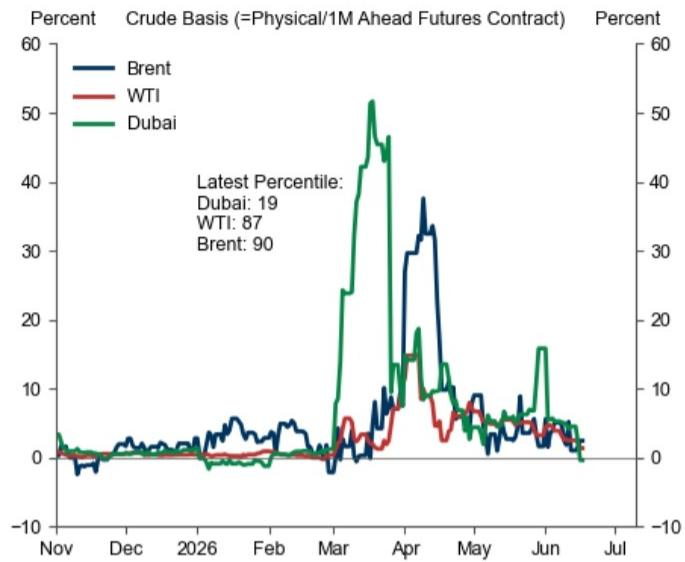

line chart

| Month   | Brent | WTI | Dubai |
|---------|-------|-----|-------|
| Nov     | -5    | 0   | 0     |
| Dec     | 0     | 0   | 0     |
| 2026    | 5     | 0   | 0     |
| Feb     | 0     | 0   | 0     |
| Mar     | 0     | 0   | 25    |
| Apr     | 35    | 10  | 50    |
| May     | 10    | 5   | 10    |
| Jun     | 5     | 5   | 15    |
| Jul     | 0     | 0   | 0     |

Percentiles over a sample from 2011 to the present.

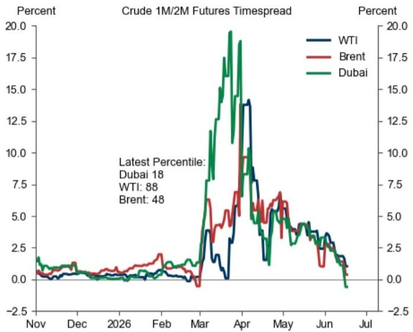

line chart

| Date       | WTI  | Brent | Dubai |
| ---------- | ---- | ----- | ----- |
| Latest Percentile | 18   | 88    | 48    |

Percentiles over a sample from 2011 to the present.

Basis represents the difference (in % of 1M ahead futures) between spot physical crude futures and 1M ahead financial futures. We include Brent, Dubai, and WTI in crude basis on the left panel and in 1M/2M timespreads on the right panel.

Source: Platts, CME, GS Global Investment Research

## 5) Demand

Exhibit 17: We Estimate That Global Jet Fuel Demand in June Will be 110kb/d Softer Year-Over-Year, or 6% Below Trend  
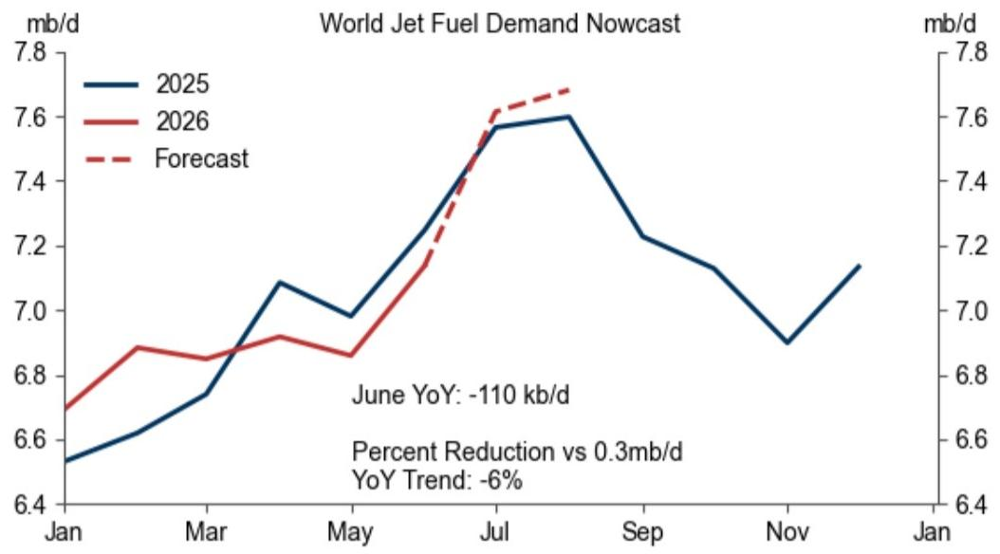

line chart

| Month | 2025 (mb/d) | 2026 (mb/d) | Forecast (mb/d) |
|-------|-------------|-------------|-----------------|
| Jan   | 6.5         | 6.7         |                 |
| Mar   | 6.8         | 6.9         |                 |
| May   | 7.0         | 6.9         |                 |
| Jul   | 7.6         | 7.6         | 7.6             |
| Sep   | 7.2         |                 |                 |
| Nov   | 6.9         |                 |                 |
| Jan   | 7.1         |                 |                 |

Source: EIA, OAG, GS Global Investment Research

Exhibit 18: China and European Road Fuels Retail Sales Decreased by $23.3\%$ and $3.5\%$ Respectively From Year-Ago Levels  
China and European Road Fuels: Real Retail Sales  
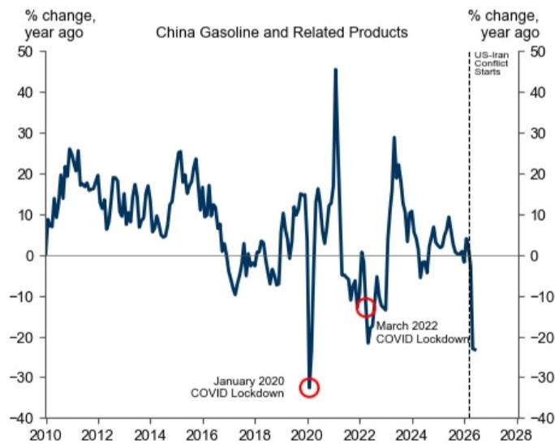

line chart

| Year | % change, year ago |
|------|---------------------|
| 2010 | ~10                 |
| 2012 | ~25                 |
| 2014 | ~15                 |
| 2016 | ~25                 |
| 2018 | ~-10                |
| 2020 | ~-35                |
| 2022 | ~-15                |
| 2024 | ~30                 |
| 2026 | ~-20                |
| 2028 | ~-30                |

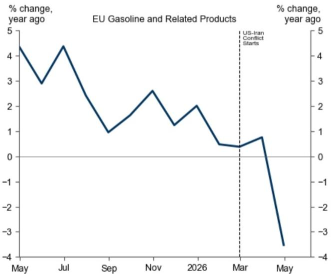

line chart

| Month | % change, year ago |
|-------|---------------------|
| May   | 4.5                 |
| Jul   | 3.0                 |
| Sep   | 1.0                 |
| Nov   | 2.5                 |
| 2026  | 1.5                 |
| Mar   | 0.5                 |
| May   | -3.5                |

Source: NBS, Statistical Office of the European Communities, Wind, GS Global Investment Research

Exhibit 19: Our US Gasoline Demand Nowcast Is Slightly Above Its Last Year Seasonal Levels  

line chart

| Region | Year | Latest Demand (mb/d) | YoY Change (mb/d) |
| :--- | :--- | :--- | :--- |
| OECD Europe Oil Demand Nowcast | 2025 (IEA Realized) | 13.0 | -0.7 |
| OECD Europe Oil Demand Nowcast | 2026 (GS Nowcast) | 13.0 | -0.7 |
| US Gasoline Demand Nowcast (Ethanol-Implied, 4-Week Moving Average) | 2024 | 9.2 | 0.1 |
| US Gasoline Demand Nowcast (Ethanol-Implied, 4-Week Moving Average) | 2025 | 9.2 | 0.1 |
| US Gasoline Demand Nowcast (Ethanol-Implied, 4-Week Moving Average) | 2026 | 9.2 | 0.1 |

Source: IEA, S&P, Kpler, GTT, Oilchem, MySteel, Bloomberg, GS Global Investment Research

Exhibit 20: Global Crude/Condensate Imports Are Down 5.8mb/d from 2025 Average Levels, and Refined Products Imports Are Down 4.5mb/d  

area chart

Global Oil Imports vs. 2025 Average
| Region | Total (mb/d 28DMA) | Rest of World (mb/d 28DMA) | Europe (mb/d 28DMA) | APAC Ex China (mb/d 28DMA) | China (mb/d 28DMA) |
|---|---|---|---|---|---|
| Crude/Condensate | -7.0 | -4.0 | -1.0 | -3.0 | -1.0 |
| Refined Products | -5.0 | -3.0 | -1.0 | -2.0 | -1.0 |
| Total | -6.0 | -4.0 | -1.0 | -2.0 | -1.0 |

Refined products include LPG.  
Source: Kpler, GS Global Investment Research

## Disclosure Appendix

## Reg AC

We, Yulia Zhestkova Grigsby, Filippo Cuscito, Alexandra Paulus and Daan Struyven, hereby certify that all of the views expressed in this report accurately reflect our personal views, which have not been influenced by considerations of the firm's business or client relationships.

Unless otherwise stated, the individuals listed on the cover page of this report are analysts in GS' Global Investment Research division.

Contributing Authors: Yulia Zhestkova Grigsby GS & Co. LLC, Filippo Cuscito GS International, Alexandra Paulus GS & Co. LLC, Daan Struyven GS & Co. LLC.

Unless otherwise stated, the individuals listed in the Contributing Authors disclosure of this report are analysts in GS' Global Investment Research division.

## Disclosures

## Disclosure

Iran is subject to comprehensive sanctions by the United States.

## Regulatory disclosures

## Disclosures required by United States laws and regulations

See company-specific regulatory disclosures above for any of the following disclosures required as to companies referred to in this report: manager or co-manager in a pending transaction; $1\%$ or other ownership; compensation for certain services; types of client relationships; managed/co-managed public offerings in prior periods; directorships; for equity securities, market making and/or specialist role. GS trades or may trade as a principal in debt securities (or in related derivatives) of issuers discussed in this report.

The following are additional required disclosures: Ownership and material conflicts of interest: GS policy prohibits its analysts, professionals reporting to analysts and members of their households from owning securities of any company in the analyst's area of coverage. Analyst compensation: Analysts are paid in part based on the profitability of GS, which includes investment banking revenues. Analyst as officer or director: GS policy generally prohibits its analysts, persons reporting to analysts or members of their households from serving as an officer, director or advisor of any company in the analyst's area of coverage. Non-U.S. Analysts: Non-U.S. analysts may not be associated persons of GS & Co. LLC and therefore may not be subject to FINRA Rule 2241 or FINRA Rule 2242 restrictions on communications with a subject company, public appearances and trading in securities covered by the analysts.

## Additional disclosures required under the laws and regulations of jurisdictions other than the United States

The following disclosures are those required by the jurisdiction indicated, except to the extent already made above pursuant to United States laws and regulations. Australia: GS Australia Pty Ltd and its affiliates are not authorised deposit-taking institutions (as that term is defined in the Banking Act 1959 (Cth)) in Australia and do not provide banking services, nor carry on a banking business, in Australia. This research, and any access to it, is intended only for “wholesale clients” within the meaning of the Australian Corporations Act, unless otherwise agreed by GS. In producing research reports, members of Global Investment Research of GS Australia may attend site visits and other meetings hosted by the companies and other entities which are the subject of its research reports. In some instances the costs of such site visits or meetings may be met in part or in whole by the issuers concerned if GS Australia considers it is appropriate and reasonable in the specific circumstances relating to the site visit or meeting. To the extent that the contents of this document contains any financial product advice, it is general advice only and has been prepared by GS without taking into account a client’s objectives, financial situation or needs. A client should, before acting on any such advice, consider the appropriateness of the advice having regard to the client’s own objectives, financial situation and needs. A copy of certain GS Australia and New Zealand disclosure of interests and a copy of GS’ Australian Sell-Side Research Independence Policy Statement are available at: https://www.goldmansachs.com/disclosures/australia-new-zealand/index.html. Brazil: Disclosure information in relation to CVM Resolution n. 20 is available at https://www.gs.com/worldwide/brazil/area/gir/index.html. Where applicable, the Brazil-registered analyst primarily responsible for the content of this research report, as defined in Article 20 of CVM Resolution n. 20, is the first author named at the beginning of this report, unless indicated otherwise at the end of the text. Canada: This information is being provided to you for information purposes only and is not, and under no circumstances should be construed as, an advertisement, offering or solicitation by GS & Co. LLC for purchasers of securities in Canada to trade in any Canadian security. GS & Co. LLC is not registered as a dealer in any jurisdiction in Canada under applicable Canadian securities laws and generally is not permitted to trade in Canadian securities and may be prohibited from selling certain securities and products in certain jurisdictions in Canada. If you wish to trade in any Canadian securities or other products in Canada please contact GS Canada Inc., an affiliate of The GS Group Inc., or another registered Canadian dealer. Hong Kong: Further information on the securities of covered companies referred to in this research may be obtained on request from GS (Asia) L.L.C. India: Further information on the subject company or companies referred to in this research may be obtained from GS (India) Securities Private Limited, Research Analyst - SEBI Registration Number INH000001493, 10th Floor, Ascent-Worli, Sudam Kalu Ahire Marg, Worli, Mumbai-400 025, India, Corporate Identity Number U74140MH2006FTC160634, Phone +91 22 6616 9000, Fax +91 22 6616 9001. GS may beneficially own 1% or more of the securities (as such term is defined in clause 2 (h) the Indian Securities Contracts (Regulation) Act, 1956) of the subject company or companies referred to in this research report. Investment in securities market are subject to market risks. Read all the related documents carefully before investing. Registration granted by SEBI and certification from NISM in no way guarantee performance of the intermediary or provide any assurance of returns to investors. GS (India) Securities Private Limited compliance officer and investor grievance contact details can be found at: https://www.goldmansachs.com/worldwide/india/documents/Grievance-Redressal-and-Escalation-Matrix.pdf, and a copy of the annual audit compliance report can be found at this link: https://publishing.gs.com/content/site/india-annual-compliance-report.html. Japan: See below. Korea: This research, and any access to it, is intended only for “professional investors” within the meaning of the Financial Services and Capital Markets Act, unless otherwise agreed by GS. Further information on the subject company or companies referred to in this research may be obtained from GS (Asia) L.L.C., Seoul Branch. New Zealand: GS New Zealand Limited and its affiliates are neither “registered banks” nor “deposit takers” (as defined in the Reserve Bank of New Zealand Act 1989) in New Zealand. This research, and any access to it, is intended for “wholesale clients” (as defined in the Financial Advisers Act 2008) unless otherwise agreed by GS. A copy of certain GS Australia and New Zealand disclosure of interests is available at: https://www.goldmansachs.com/disclosures/australia-new-zealand/index.html. Russia: Research reports distributed in the Russian Federation are not advertising as defined in the Russian legislation, but are information and analysis not having product promotion as their main purpose and do not provide appraisal within the meaning of the Russian legislation on appraisal activity. Research reports do not constitute a personalized investment recommendation as defined in Russian laws and regulations, are not addressed to a specific client, and are prepared without analyzing the financial circumstances, investment profiles or risk profiles of clients. GS assumes no responsibility for any investment decisions that may be taken by a client or any other person based on this research report. Singapore: GS (Singapore) Pte. (Company Number: 198602165W), which is regulated by the Monetary Authority of Singapore, accepts legal responsibility for this

research, and should be contacted with respect to any matters arising from, or in connection with, this research. Taiwan: This material is for reference only and must not be reprinted without permission. Investors should carefully consider their own investment risk. Investment results are the responsibility of the individual investor. United Kingdom: Persons who would be categorized as retail clients in the United Kingdom, as such term is defined in the rules of the Financial Conduct Authority, should read this research in conjunction with prior GS on the covered companies referred to herein and should refer to the risk warnings that have been sent to them by GS International. A copy of these risks warnings, and a glossary of certain financial terms used in this report, are available from GS International on request.

European Union and United Kingdom: Disclosure information in relation to Article 6 (2) of the European Commission Delegated Regulation (EU) (2016/958) supplementing Regulation (EU) No 596/2014 of the European Parliament and of the Council (including as that Delegated Regulation is implemented into United Kingdom domestic law and regulation following the United Kingdom's departure from the European Union and the European Economic Area) with regard to regulatory technical standards for the technical arrangements for objective presentation of investment recommendations or other information recommending or suggesting an investment strategy and for disclosure of particular interests or indications of conflicts of interest is available at https://www.gs.com/disclosures/europeanpolicy.html which states the European Policy for Managing Conflicts of Interest in Connection with Investment Research.

Japan: GS Japan Co., Ltd. is a Financial Instrument Dealer registered with the Kanto Financial Bureau under registration number Kinsho 69, and a member of Japan Securities Dealers Association, Financial Futures Association of Japan Type II Financial Instruments Firms Association, and Investment Management Association of Japan. Sales and purchase of equities are subject to commission pre-determined with clients plus consumption tax. See company-specific disclosures as to any applicable disclosures required by Japanese stock exchanges, the Japanese Securities Dealers Association or the Japanese Securities Finance Company.

## Global product; distributing entities

GS Global Investment Research produces and distributes research products for clients of GS on a global basis. Analysts based in GS offices around the world produce research on industries and companies, and research on macroeconomics, currencies, commodities and portfolio strategy. This research is disseminated in Australia by GS Australia Pty Ltd (ABN 21 006 797 897); in Brazil by GS do Brasil Corretora de Títulos e Valores Mobiliários S.A.; Public Communication Channel GS Brazil: 0800 727 5764 and / or contatogoldmanbrasil@gs.com. Available Weekdays (except holidays), from 9am to 6pm. Canal de Comunicação com o Público GS Brasil: 0800 727 5764 e/ou contatogoldmanbrasil@gs.com. Horário de funcionamento: segunda-feira à sexta-feira (exceto feriados), das 9h às 18h; in Canada by GS & Co. LLC; in Hong Kong by GS (Asia) L.L.C.; in India by GS (India) Securities Private Ltd.; in Japan by GS Japan Co., Ltd.; in the Republic of Korea by GS (Asia) L.L.C., Seoul Branch; in New Zealand by GS New Zealand Limited; in Russia by OOO GS; in Singapore by GS (Singapore) Pte. (Company Number: 198602165W); and in the United States of America by GS & Co. LLC. GS International has approved this research in connection with its distribution in the United Kingdom.

GS International (“GSI”), authorised by the Prudential Regulation Authority (“PRA”) and regulated by the Financial Conduct Authority (“FCA”) and the PRA, has approved this research in connection with its distribution in the United Kingdom.

European Economic Area: GS Bank Europe SE ("GSBE") is a credit institution incorporated in Germany and, within the Single Supervisory Mechanism, subject to direct prudential supervision by the European Central Bank and in other respects supervised by German Federal Financial Supervisory Authority (Bundesanstalt für Finanzdienstleistungsaufsicht, BaFin) and Deutsche Bundesbank and disseminates research within the European Economic Area.

## General disclosures

This research is for our clients only. Other than disclosures relating to GS, this research is based on current public information that we consider reliable, but we do not represent it is accurate or complete, and it should not be relied on as such. The information, opinions, estimates and forecasts contained herein are as of the date hereof and are subject to change without prior notification. We seek to update our research as appropriate, but various regulations may prevent us from doing so. Other than certain industry reports published on a periodic basis, the large majority of reports are published at irregular intervals as appropriate in the analyst's judgment.

GS conducts a global full-service, integrated investment banking, investment management, and brokerage business. We have investment banking and other business relationships with a substantial percentage of the companies covered by Global Investment Research. GS & Co. LLC, the United States broker dealer, is a member of SIPC (https://www.sipc.org).

Our salespeople, traders, and other professionals may provide oral or written market commentary or trading strategies to our clients and principal trading desks that reflect opinions that are contrary to the opinions expressed in this research. Our asset management area, principal trading desks and investing businesses may make investment decisions that are inconsistent with the recommendations or views expressed in this research.

We and our affiliates, officers, directors, and employees will from time to time have long or short positions in, act as principal in, and buy or sell, the securities or derivatives, if any, referred to in this research, unless otherwise prohibited by regulation or GS policy.

The views attributed to third party presenters at GS arranged conferences, including individuals from other parts of GS, do not necessarily reflect those of Global Investment Research and are not an official view of GS.

Any third party referenced herein, including any salespeople, traders and other professionals or members of their household, may have positions in the products mentioned that are inconsistent with the views expressed by analysts named in this report.

This research is focused on investment themes across markets, industries and sectors. It does not attempt to distinguish between the prospects or performance of, or provide analysis of, individual companies within any industry or sector we describe.

Any trading recommendation in this research relating to an equity or credit security or securities within an industry or sector is reflective of the investment theme being discussed and is not a recommendation of any such security in isolation.

This research is not an offer to sell or the solicitation of an offer to buy any security in any jurisdiction where such an offer or solicitation would be illegal. It does not constitute a personal recommendation or take into account the particular investment objectives, financial situations, or needs of individual clients. Clients should consider whether any advice or recommendation in this research is suitable for their particular circumstances and, if appropriate, seek professional advice, including tax advice. The price and value of investments referred to in this research and the income from them may fluctuate. Past performance is not a guide to future performance, future returns are not guaranteed, and a loss of original capital may occur. Fluctuations in exchange rates could have adverse effects on the value or price of, or income derived from, certain investments.

Certain transactions, including those involving futures, options, and other derivatives, give rise to substantial risk and are not suitable for all investors. Investors should review current options and futures disclosure documents which are available from GS sales representatives or at https://www.theocc.com/about/publications/character-risks.jsp and https://www.goldmansachs.com/disclosures/cftc\_fcm\_disclosures. Transaction costs may be significant in option strategies calling for multiple purchase and sales of options such as spreads. Supporting documentation will be

supplied upon request.

Differing Levels of Service provided by Global Investment Research: The level and types of services provided to you by GS Global Investment Research may vary as compared to that provided to internal and other external clients of GS, depending on various factors including your individual preferences as to the frequency and manner of receiving communication, your risk profile and investment focus and perspective (e.g., marketwide, sector specific, long term, short term), the size and scope of your overall client relationship with GS, and legal and regulatory constraints. As an example, certain clients may request to receive notifications when research on specific securities is published, and certain clients may request that specific data underlying analysts' fundamental analysis available on our internal client websites be delivered to them electronically through data feeds or otherwise. No change to an analyst's fundamental research views (e.g., ratings, price targets, or material changes to earnings estimates for equity securities), will be communicated to any client prior to inclusion of such information in a research report broadly disseminated through electronic publication to our internal client websites or through other means, as necessary, to all clients who are entitled to receive such reports.

All research reports are disseminated and available to all clients simultaneously through electronic publication to our internal client websites. Not all research content is redistributed to our clients or available to third-party aggregators, nor is GS responsible for the redistribution of our research by third party aggregators. For research, models or other data related to one or more securities, markets or asset classes (including related services) that may be available to you, please contact your GS representative or go to https://research.gs.com.

Disclosure information is also available at https://www.gs.com/research/hedge.html or from Research Compliance, 200 West Street, New York, NY 10282.

## © 2026 GS.

You are permitted to store, display, analyze, modify, reformat, and print the information made available to you via this service only for your own use. You may not resell or reverse engineer this information to calculate or develop any index for disclosure and/or marketing or create any other derivative works or commercial product(s), data or offering(s) without the express written consent of GS. You are not permitted to publish, transmit, or otherwise reproduce this information, in whole or in part, in any format to any third party without the express written consent of GS. This foregoing restriction includes, without limitation, using, extracting, downloading or retrieving this information, in whole or in part, to train or finetune a machine learning or artificial intelligence system, or to provide or reproduce this information, in whole or in part, as a prompt or input to any such system.