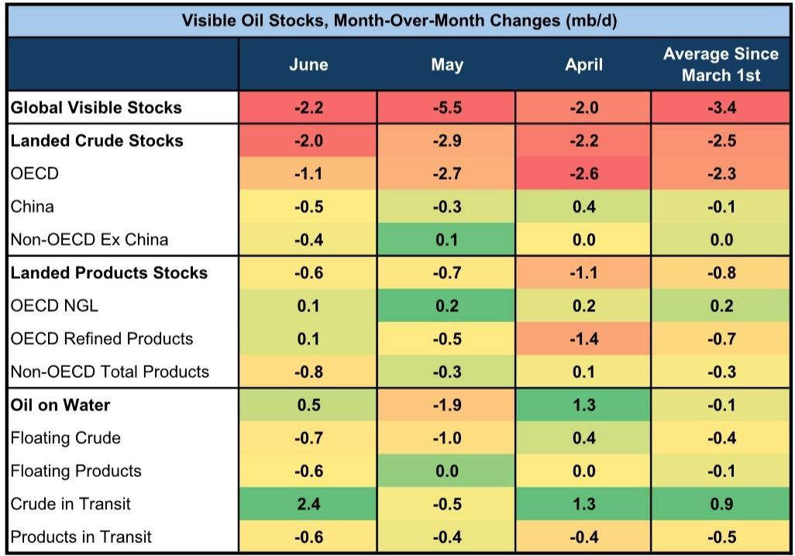
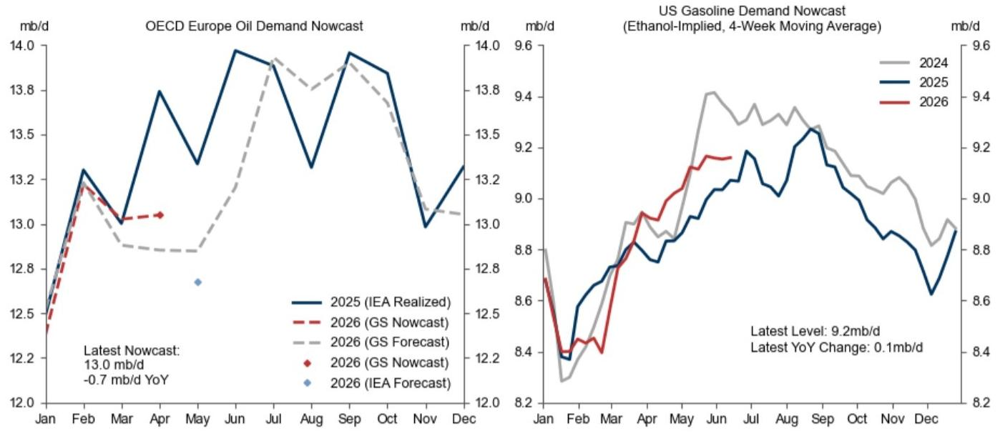
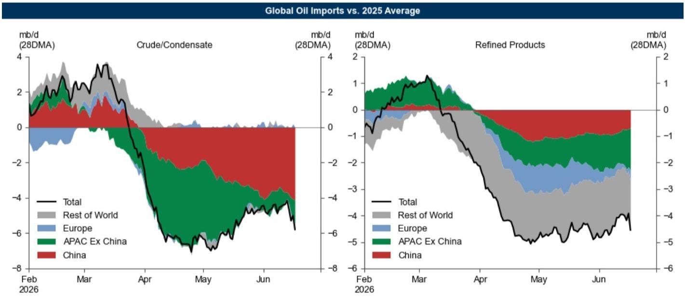

# GS：市场真正低估的不是需求崩塌，而是供给恢复的路径与节奏

布伦特原油现货价格本周跌破80美元/桶。触发因素是一次传闻中的美伊临时协议——如果协议落地，霍尔木兹海峡的封锁可能迅速解除，超过5000万桶伊朗海上浮仓原油将立即进入市场。GS在最新一期《石油追踪》报告中，用一个数字重新定义了市场正在定价的叙事：70%的战前霍尔木兹流量，可能成为新的“100%”。

这个数字背后，不是简单的供需再平衡，而是一套关于供给恢复速度、库存真实消耗、以及需求结构性错位的全新框架。市场目前的下跌，更多是在定价“协议达成”这一事件本身，但GS的测算表明，真正决定中期价格中枢的，是协议达成后供给恢复的路径、节奏，以及隐藏在库存数据之下的结构性变化。

这份报告的价值不在于给出一个方向性判断，而在于拆解了三个市场尚未充分定价的关键变量：霍尔木兹流量的实际恢复斜率、中国库存数据的“暗物质”缺口、以及IEA与GS在供需平衡表上的系统性分歧。理解这三个变量，比猜测油价下一个整数关口重要得多。

## 1. 霍尔木兹流量恢复至战前70%，可能就是一个新的供需平衡点

GS的核心测算框架建立在一个反直觉的假设上：波斯湾出口恢复至战前水平，可能不需要霍尔木兹海峡流量回到100%。报告指出，通过现有绕行路线——包括沙特的东西管道（Yanbu）、阿联酋的阿布扎比原油管道（Fujairah）、以及土耳其的基尔库克-杰伊汉管道——已经形成了每日750万桶的替代流量。加上阿曼湾的“暗渡”流量，当前实际绕过霍尔木兹的总流量约为每日910万桶。

这意味着，要让波斯湾总出口恢复到战前水平，霍尔木兹本身只需要额外增加每日1270万桶的流量，即恢复到战前约70%的水平。这个“70%即100%”的判断，直接降低了供给恢复的门槛。市场此前隐含的假设是，霍尔木兹必须完全恢复正常，供给压力才能缓解。GS的数据表明，即使海峡流量只恢复到七成，配合现有绕行能力，全球供应就能回到战前格局。

这个结论对资产定价的含义是：即便谈判出现波折，只要现有绕行路线不中断，供给冲击的烈度已经在边际上减弱。市场对“封锁解除”这一事件的定价，可能高估了其实际增量效果。

## 2. 船舶运力不是瓶颈，但船东的风险偏好可能是

供给恢复的另一个潜在约束是运输能力。GS测算了霍尔木兹海峡两侧5天航程内的空载油轮运力，结果显示有8.61亿桶的装载能力。从物理运力角度看，不存在瓶颈。

但报告也直言不讳地指出，许多船东对过境仍持谨慎态度，缺乏明确的过境指引是主要障碍。这意味着，即便政治协议达成，从“协议签署”到“船东愿意正常航行”，中间可能还有一段风险溢价消散的时间。船东的风险偏好，而非运力本身，将成为供给恢复速度的边际约束。

此外，伊朗在未来60天核谈判中的地缘政治目标，也可能影响其配合协议执行的意愿。供给恢复的路径不是一条直线，而是一个包含政策落地、商业信心重建、地缘博弈的多阶段过程。市场对“协议即通航”的线性外推，可能低估了中间环节的不确定性。

## 3. IEA与GS的供需缺口分歧，折射出对需求破坏程度的不同判断

报告中最值得关注的交叉验证，来自GS与国际能源署（IEA）在供需平衡表上的分歧。IEA最新《石油市场报告》估计二季度全球石油赤字为每日310万桶，而GS的估计是每日500万桶。差距的核心，在于对需求破坏规模的判断不同。

IEA认为二季度全球需求破坏高达每日550万桶，其中5月达到峰值每日610万桶。GS的对应数字是每日490万桶。这个约每日60万桶的差异，看似不大，但在一个全球供需本就紧平衡的市场中，足以改变库存变化的斜率。

更关键的是需求破坏的结构。IEA的数据显示，需求损失高度集中在石化原料领域：液化石油气和乙烷需求较战前预期下调每日170万桶（降幅11%），石脑油需求下调每日110万桶（降幅15%）。这与GS的分析一致——当前需求破坏并非全面性的经济衰退，而是特定产业链环节的调整。这意味着，一旦供给恢复，这些被压制的需求能否同步反弹，将决定库存回补的速度和幅度。市场可能过于关注总量需求，而忽略了结构性错配带来的二阶效应。

## 4. 中国库存数据出现“暗物质”缺口，真实需求可能比官方数据更弱

报告对中国市场的分析，揭示了当前全球石油平衡表中最大的未知数。GS通过中国原油净进口、国内产量和炼厂加工量推算，5月中国原油库存隐含去库速度为每日160万桶。但同期可见库存（包括商业库存和战略储备的公开数据）仅显示每日30万桶的去库。

两者之间每日130万桶的缺口，报告提出了两种可能解释：一是存在大量不可见的战略储备释放（如地下储备）；二是实际炼厂开工率低于官方数据，即真实需求比统计数字更弱。GS倾向于后一种解释，因为这与5月中国汽油及其他零售油品销量同比下降23%的数据相吻合。

这个“缺口”对全球市场的含义是：中国作为全球最大的原油进口国，其真实需求可能比官方数据暗示的更低。如果不可见去库持续，意味着中国在供给恢复后的补库需求可能弱于预期。反之，如果缺口来自统计口径问题，那么一旦需求真实回暖，补库力度可能超出市场想象。无论哪种情况，这个每日130万桶的“暗物质”都是当前全球石油平衡表上最大的不确定性来源。

## 5. 报告尚未完全回答：IEA对2027年巨大过剩的预测，是否过于激进？

IEA在最新报告中首次给出了2027年的供需平衡预测，预计全球将出现每日500万桶的过剩，而GS的预测仅为每日320万桶。分歧主要来自IEA假设2027年供给增长高达每日790万桶。

这个预测的激进之处在于，它隐含了对当前地缘政治冲击的完全逆转，以及非OPEC产油国持续增产的线性外推。但报告没有深入讨论的是，2027年的供给增长假设是否充分考虑了上游投资周期？当前的价格水平是否足以支撑如此大规模的产能扩张？地缘政治风险是否真的会在三年内完全消散？

IEA的预测更像是一个“无冲击情景”下的基准线，而非对现实路径的预判。GS的预测更为保守，但也没有完全展开讨论这个分歧背后的关键假设差异。对于长期投资者而言，这个分歧意味着2027年后的供需格局仍存在显著的不确定性，而不是一个可以线性外推的结论。

## 6. 市场真正需要关注的观察框架不是油价本身，而是三个领先指标

基于GS这份报告的分析框架，投资者不应将注意力集中在布伦特油价的绝对水平上，而应建立一套基于结构性变量的观察体系。

第一个领先指标是霍尔木兹海峡的实际流量变化率，而非绝对量。关注每周的4日移动平均流量数据，如果流量从当前水平开始加速恢复，且斜率超过市场预期，将意味着供给恢复正在“自我实现”。第二个指标是中国原油库存“暗物质”缺口的走向。如果未来几个月可见库存与隐含库存的差距持续扩大，说明真实需求仍在恶化；如果差距收窄，则可能是补库周期的开始。第三个指标是IEA与GS供需缺口预测的收敛方向。如果后续数据证明IEA的需求破坏估计过高，那么实际供需平衡将比当前定价的更紧；反之亦然。

这三个指标共同构成了一个比油价本身更早、更可靠的市场温度计。当市场情绪被单日新闻左右时，这些结构性变量才是决定中期价格中枢的锚。

这份报告的价值不在于提供一个“买”或“卖”的结论，而在于拆解了当前市场定价中隐含的若干线性假设。供给恢复的斜率、中国需求的真实强度、以及长期供需平衡的分歧，都是需要持续跟踪验证的关键变量。正是这些尚未被充分定价的“二阶效应”，构成了未来市场波动的主要来源。欢迎来星球微信群里继续讨论，一起跟踪这些变量的实际走向，而不是被每日价格波动牵着走。

Personal reading notes and learning share only. Not investment advice.

