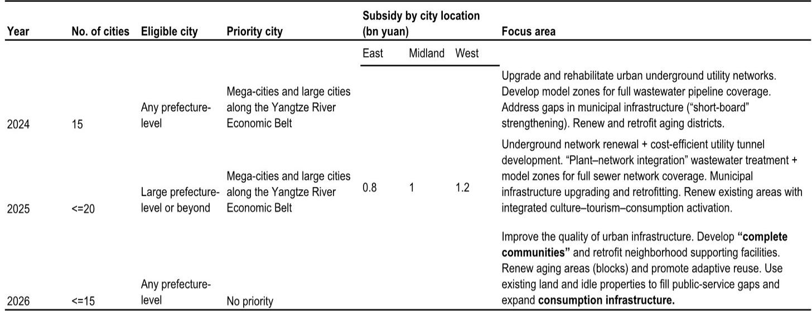
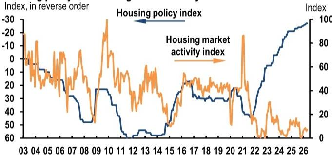

# JPM：中国楼市真正的分水岭不在价格，而在供给侧的“窄复苏”能否撑到政策显效

市场正在被两个相互矛盾的现象拉扯。一方面，5月JPM住房活动指数小幅回升，一线城市二手房价格连续录得环比正增长，部分核心区甚至出现“抢房”传闻。另一方面，全国新房销售面积同比跌幅从-6.5%扩大至-8.6%，房地产开发投资跌幅进一步加深至-24.3%，低线城市量价齐跌的格局毫无松动迹象。

这份由JPM中国房地产研究团队发布的月度跟踪报告，其核心判断并不复杂，但含义却比多数市场解读更为深远：当前中国楼市正在经历的，不是一轮周期性复苏的前夜，而是一场“窄基K型”的结构性再平衡。一线城市的回暖并非全国复苏的领先指标，而是政策资源、人口流动和存量资产重新定价的结果。真正决定行业走向的，不是房价何时见底，而是“十五五”城市更新规划能否在供给端建立起一个不同于过去二十年“卖地-开发-销售”循环的新均衡机制。

报告用一个词概括了这种状态——“量价调整的长期化”。这不是悲观，而是一种必要的清醒。

## 1. 一线城市二手房回暖的真实驱动不是需求爆发，而是库存出清和供给结构切换

市场最容易犯的错误，是把一线城市的局部量价改善直接等同于全国需求的底部确认。JPM的报告提供了两个关键数据，足以让这种乐观情绪降温。

第一，5月70城新房价格环比跌幅稳定在-0.20%，但一线城市录得+0.2%的环比正增长。更值得关注的是二手房市场：全国二手房价格环比跌幅从-0.23%小幅扩大至-0.26%，而一线城市却维持了+0.4%的环比涨幅。这意味着，一线城市和低线城市之间的差距不仅没有收敛，反而在拉大。

第二，报告指出，一线城市回暖的支撑因素并非居民购房意愿的全面回升，而是三个更具体的结构性条件：二手房市场库存较低、成交量改善带动换手率上升、以及部分业主开始试探性提价。此外，报告还含蓄地提到了“IPO活动和股市财富效应”可能对高端需求产生的边际影响——这是一个容易被忽视的变量，但它的可持续性高度依赖资本市场表现。

更深层的含义在于，一线城市二手房正在加速替代新房成为交易主力。报告明确提到“二手房市场正在从新房销售中不断夺取份额”。这意味着，即便整体交易量企稳，开发商层面的新屋销售、施工和投资仍会持续承压。对于投资者而言，一线城市二手房回暖更多是存量资产流动性的修复，而非开发商基本面的拐点信号。

## 2. 低线城市的困境不是周期性滞后，而是库存结构和信用传导机制的断裂

与一线城市的窄幅改善形成鲜明对比，低线城市面临的问题已经超出了简单的“需求不足”。JPM的图表清晰地展示了两条令人不安的曲线：在建库存月数从2021年的35个月一路攀升至2026年的75个月，而竣工库存月数也从3个月翻倍至7个月。这是历史级别的库存压力。

更关键的是，低线城市的问题不是“卖不掉”，而是“卖不掉之后”的连锁反应。报告指出，居民信贷需求疲弱、房地产开发投资持续下降，形成了一个负向循环：库存高企导致开发商减少新开工，新开工下降拖累土地出让收入，土地收入减少又削弱地方政府的财政能力和城市更新投入，最终进一步压低居民购房意愿和资产价格预期。

这种传导机制使得低线城市的调整具有极强的惯性。即便政策层面出台再多的“稳市场”措施，只要居民对未来收入和资产价格的预期没有根本性扭转，需求就很难被政策刺激有效激活。报告将其称为“时间不一致性陷阱”——政策制定者希望降低经济对房地产的依赖、改善居民可负担性，但又不敢让价格过快出清，以免冲击居民财富和地方财政，最终只能通过量的收缩来消化压力。

这意味着，低线城市的调整可能会比多数人预期的更为漫长。对于布局在这些市场的开发商、金融机构和地方政府而言，真正的挑战不是“何时见底”，而是如何在不引发系统性风险的前提下完成这一轮出清。

## 3. “十五五”城市更新规划的政策逻辑变了：从增量开发转向存量运营的系统性重构

这是整份报告中最值得细读的部分。JPM对6月初国务院发布的“十五五”城市更新规划给予了高度评价，认为其相比“十四五”版本发生了根本性的范式转换。

报告列出了几个关键变化：第一，规划从“试点式、增量式”改造转向以“民生、发展、安全”三大类项目为核心的系统性推进模式。第二，目标更加具体且更具雄心——危旧房改造规模翻倍，城中村改造维持高基数。第三，也是最重要的，资金和土地政策工具包显著扩容：财政预算投资、保障房专项债、超长期特别国债、税收优惠、REITs和社会资本都被纳入支持框架；土地政策方面，闲置土地再利用、混合用途开发、临时使用、用途转换和存量资产盘活的交易摩擦降低，都得到了明确支持。

这些变化的本质，是政策从“卖地-开发-销售”的增量循环，转向“存量盘活-资产运营-公共服务”的可持续模式。过去二十年，城市更新的核心驱动力是土地增值预期；未来，城市更新的核心驱动力将是财政可持续性和资产运营效率。

但报告也清醒地指出，这一规划的定位是“稳定而非复苏房地产市场”。换句话说，政策的目标不是让房价重新上涨，而是让市场在更低的量价水平上找到新的均衡。对于投资者而言，这意味着需要重新定义“利好”——不是看政策能否刺激需求，而是看政策能否加速供给出清、降低系统性风险溢价。

## 4. 报告没有完全回答的关键问题：城市更新的资金闭环能否跑通？

尽管“十五五”规划在政策工具上做出了显著升级，但报告并未详细展开一个核心问题：这些资金能否在实际操作层面形成闭环？

从报告提供的中央财政支持表格来看，2025年入选城市最高可获得东部8亿、中部10亿、西部12亿的补贴。对于单个项目而言，这笔资金或许可观，但放在全国数以万计的旧改和城中村项目面前，不过是杯水车薪。真正的大头仍然需要地方政府、社会资本和居民自身来承担。

问题在于，低线城市的地方政府财政已经捉襟见肘，社会资本在楼市下行周期中更倾向于避险而非冒险，而居民在收入预期不确定的情况下，是否愿意为“好房子”支付溢价？报告没有给出答案，因为这取决于三个尚未被验证的前提：地方政府的信用扩张能力能否恢复、REITs市场能否为存量资产提供有效的退出渠道、以及居民对“好房子”的支付意愿是否足以覆盖改造成本。

这里存在一个潜在的悖论：城市更新需要资金，而资金的主要来源之一是土地出让收入，但土地出让收入本身又高度依赖房地产市场的复苏。如果这个循环不能被打通，城市更新可能面临“规划很丰满，执行很骨感”的困境。

## 5. 投资者的观察框架：用“K型分化”而非“周期拐点”来校准判断

基于JPM这份报告的分析框架，投资者在评估中国房地产市场的投资机会时，需要建立一套不同于传统周期的观察指标。

第一个维度是城市层级的分化。不要再用“全国均价”或“全国销售面积”来作为投资决策的锚点。一线城市和强二线城市的二手房市场已经进入“窄复苏”阶段，但低线城市的库存出清可能需要数年时间。这意味着，不同城市的资产定价逻辑将彻底脱钩。

第二个维度是供给结构的切换。二手房市场份额的持续上升，正在改变整个房地产市场的定价权和利润分配格局。开发商不再是唯一的供给方，存量房业主和二手房中介正在成为越来越重要的市场参与者。这对于房地产服务类公司、物业管理公司和存量资产运营平台可能意味着结构性机会，但对于传统开发商而言，则是持续的压力。

第三个维度是政策效果的验证时点。“十五五”城市更新规划的落地效果，最早也要到2027-2028年才能看到实质性的数据验证。在此之前，投资者需要紧盯三个先行指标：地方专项债的发行进度和资金拨付效率、REITs市场对城市更新类资产的定价水平、以及低线城市二手房挂牌量的变化趋势。如果挂牌量持续攀升而成交量未能跟上，说明库存压力仍在加剧，政策的托底效果有限。

---

这份JPM报告最值得反复咀嚼的一句话是：“当前趋势看起来更像是在长期量价调整中的窄基K型企稳，而不是全国性可持续复苏的开端。”它既不是看多，也不是看空，而是一个关于“时间”和“结构”的判断。对于真正想理解中国楼市未来走向的决策者而言，这个判断的价值远远超过任何一个短期的价格预测。

报告的完整版本包含了更多关于城市更新资金分配机制的细节、各线城市二手房库存的实时数据、以及JPM对“十五五”规划执行概率的情景分析。这些内容在本篇导读中未能完全展开——它们恰恰是理解上述判断能否成立的关键拼图。

欢迎来星球微信群里继续讨论：城市更新的资金闭环究竟需要哪些条件才能跑通？一线城市的窄复苏是否会向二线城市扩散？以及，在“量价调整长期化”的背景下，哪些资产类别反而可能获得定价重估的机会。

Personal reading notes and learning share only. Not investment advice.

