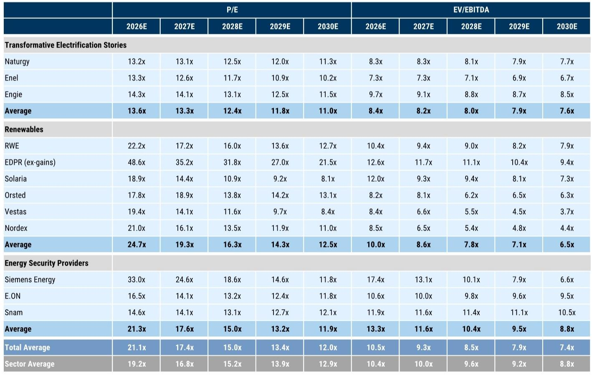
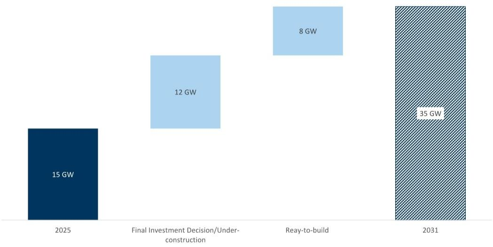
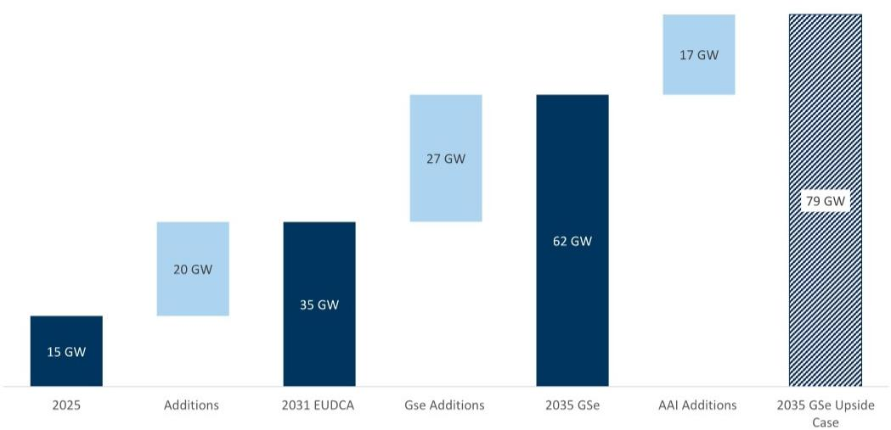

# GS：欧洲数据中心正在重塑电力行业的估值逻辑，而市场仍按旧地图定价

欧洲的电网运营商正在收到一个前所未有的信号。截至2026年5月，GS追踪的欧洲数据中心并网申请总量已飙升至约480吉瓦，相当于整个欧洲当前电力需求的1.5倍。六个月前这个数字是290吉瓦，十二个月前是170吉瓦。

这不是一个线性增长，而是一个指数级跳升。即便考虑到其中一部分申请可能带有投机性质，这个规模本身已经构成一个判断：欧洲正在进入一个数据中心大规模建设的物理阶段，而电力公用事业公司将成为这个阶段最核心的枢纽角色。

GS在最新发布的这份研报中，给出了一个清晰的逻辑链条：数据中心建设拉动电力需求，电力需求拉动电网和发电投资，投资拉动公用事业公司的盈利增长。但真正值得关注的，不是这个链条本身，而是这个链条如何改变市场对这些公司的定价方式。

当前GS筛选出的三大受益集群——变革性电气化故事、可再生能源、能源安全提供商——在2030年的平均市盈率仅为12倍，低于行业平均的12.9倍。这些公司拥有更高的增长前景，却以更低的估值在交易。这组数字指向一个核心问题：市场是否在用过去的框架，定价一个正在被数据中心重塑的未来？

以下是对这份研报核心逻辑的拆解。

## 1. 480吉瓦的并网申请意味着电力需求增长可能比市场预期的快一倍

GS的数据追踪方法比较直接：汇总欧洲主要电网运营商收到的数据中心并网请求。480吉瓦这个数字最惊人的地方不是它的大小，而是它的增速。从2025年1月的170吉瓦到2026年5月的480吉瓦，一年半时间增长了近两倍。

这个数字意味着什么？欧洲电力消费在过去十年基本停滞，年均增速在零附近。而数据中心一个单一品类，就可能在2028至2029年间推动欧洲电力需求年增长1.5个百分点。这还没有计入电气化、氢能、制造业回流等其他结构性因素。

GS还模拟了一个“超电气化”情景：如果欧洲同时实现其2030年电气化目标并加速数据中心建设，电力需求年增速可能达到5%。5%的年增速对于欧洲这样一个成熟电力市场而言，是一个代际级别的变化。

这个判断的关键含义是：电力公用事业公司的收入增长假设需要被重新校准。过去十年，市场对这些公司的定价基于一个“低增长、高股息”的稳定预期。如果电力需求进入一个结构性加速期，这些公司的资本开支周期、盈利增速和估值中枢都需要被重新审视。

## 2. 欧洲数据中心建设有较高的可见度，但480吉瓦中的大部分仍需验证

GS的分析将数据中心需求分成了两个层次。

第一个层次是欧洲数据中心协会的预测：到2031年新增20吉瓦，使总容量从当前的15吉瓦提升至35吉瓦。这20吉瓦中，约60%已经处于在建或已获得最终投资决定的状态，其余也基本完成了审批。这一部分的可预见性很高，对应的电力需求增量大约在每年1.5个百分点。

第二个层次是GS自己的预测：到2035年，欧洲数据中心IT容量将达到65至80吉瓦。这个预测的核心变量是人工智能代理的普及速度。GS引用行业文献指出，一次人工智能代理查询的能耗可能是传统人工智能聊天机器人的13到50倍。即便GS采用了相对保守的假设——将每次代理查询的能耗从15瓦时下调至2瓦时——每10个百分点的代理查询渗透率提升，仍将推动数据中心需求增加25%至30%。

这里有一个尚未完全回答的问题：480吉瓦的并网申请中，有多少最终会转化为实际建设？GS坦诚地指出部分申请可能具有投机性质，但报告没有给出具体的转化率假设。这个转化率将直接影响电力需求曲线的陡峭程度，也是投资者在阅读完整报告时需要重点关注的假设变量。

## 3. 受益公司的估值折价背后，是市场对“盈利质量”的定价分歧

GS筛选出的三个受益集群，其估值特征值得单独讨论。

变革性电气化故事（Naturgy、Enel、Engie）的2030年平均市盈率为11倍，可再生能源集群（RWE、EDPR、Solaria、Orsted、Vestas、Nordex）为12.5倍，能源安全提供商（Siemens Energy、E.ON、Snam）为11.9倍。三个集群的加权平均市盈率约为12倍，低于欧洲公用事业板块平均的12.9倍。

这个估值折价说明市场对两件事存在分歧。

第一，市场可能低估了数据中心带来的电力需求增量。如果电力消费增速从接近零提升到1.5%甚至更高，公用事业公司的发电资产利用小时数、电网输配收入和可再生能源项目的PPA定价能力都将受益。这些因素在当前的估值中可能没有被充分反映。

第二，市场可能对这些公司能否将需求转化为盈利持怀疑态度。数据中心建设需要大量的电网投资和发电投资，而这些投资往往伴随着监管审批、建设周期和融资成本等风险。市场可能认为，即便需求旺盛，公用事业公司的盈利增长也会被资本开支扩张和监管回报率限制所抵消。

GS对此的判断是：当前的估值折价提供了一个有吸引力的入场窗口。但这里仍需验证的一个关键问题是，哪些公司真正具备将规模转化为议价权的能力。

## 4. 报告尚未完全回答的关键问题：电网瓶颈和审批周期

GS的研报在逻辑上完整，但有一个重要的现实约束没有被充分展开：欧洲电网的实际承载能力。

480吉瓦的并网申请是一个理论数字，但欧洲的电网基础设施能否在2035年前消化这么多新增容量，是一个需要独立评估的问题。电网扩建的审批周期通常以年为单位，变压器和开关设备等关键设备的供应链也面临瓶颈。如果电网建设跟不上数据中心建设的节奏，那么一部分并网申请可能只是“纸上容量”。

另一个未被充分讨论的问题是电力定价机制的变化。数据中心的大规模接入将改变电力负荷曲线的形状，可能导致高峰时段的电价波动加剧。这对依赖固定电价或长期PPA的可再生能源开发商而言，既是风险也是机会。

这些未解问题并不削弱研报的价值，但它们构成了投资者在做出决策前需要进一步探讨的领域。报告的核心判断——数据中心正在改变欧洲电力行业的增长轨迹——是可靠的，但具体到个股层面的投资时机和风险敞口，需要更细致的分析。

## 5. 投资者需要建立一个新的观察框架

基于GS的这份研报，投资者在评估欧洲公用事业公司时，可能需要从三个维度重新建立分析框架。

第一个维度是数据中心敞口的可见度。不是所有公用事业公司都能从数据中心建设中同等受益。那些拥有强大电网资产、靠近数据中心热点区域（英国、意大利、德国、芬兰）的公司，以及那些能够提供一站式解决方案（土地、电网连接、电力供应）的公司，可能具有更强的议价能力。

第二个维度是资本开支纪律。数据中心带来的投资需求是巨大的，但公司能否在扩大资本开支的同时维持回报率，取决于其项目执行能力和监管环境。那些能够将资本开支转化为可预测的监管资产回报的公司，可能比那些依赖市场化电价的公司更具防御性。

第三个维度是估值与增长的匹配度。当前12倍的平均市盈率水平，隐含了市场对增长的高度怀疑。如果数据中心需求如期兑现，这些公司的盈利增长可能超出预期，从而触发估值重估。但投资者需要区分哪些公司的增长是可持续的，哪些只是周期性的资本开支驱动。

这三个维度并不是独立的。一家公司在数据中心敞口上的优势，如果伴随着资本开支纪律的缺失，最终可能无法转化为股东回报。反之，一家估值被低估但执行能力强的公司，可能成为数据中心时代最大的受益者。

GS的这份研报提供了一个清晰的起点，但它也留下了足够的空间让读者自己去深挖。480吉瓦的并网申请是一个数字，但这个数字背后的公司选择、区域差异、技术路径和政策环境，才是真正决定投资回报的关键。

如果你对这份报告中的具体公司估值、数据中心转化率假设或电网瓶颈分析感兴趣，欢迎来知识星球微信群里继续讨论。我们会在群里分享完整的研报解读和原始图表，也会定期组织对关键假设的专项讨论。

Personal reading notes and learning share only. Not investment advice.

