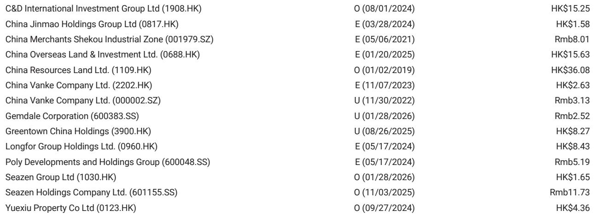
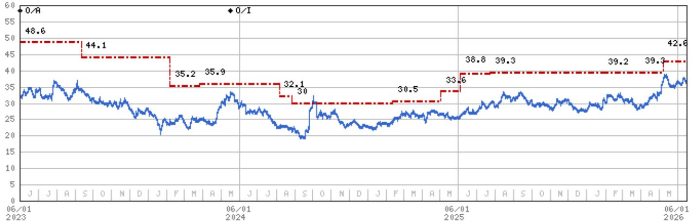
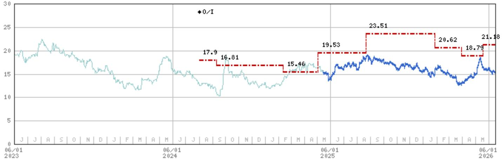

# 摩根斯坦利：市场低估了三季度销售二次探底的冲击力

5月的房地产销售数据，打破了市场此前两个月的微弱乐观。摩根斯坦利最新发布的这份研报，用一组清晰的数字给出了一个明确的判断：5月销售跌幅重新扩大，而更值得警惕的是，三季度可能迎来年内第二轮深度下滑。这不是一次简单的数据波动，而是行业结构性压力的再次确认。

这份报告的价值不在于告诉你“市场不好”——这已经是共识。它的核心洞察在于：市场正在低估两个关键变量——二手房销售从放缓转向负增长的传导效应，以及开发商在土地市场上近乎停摆的谨慎姿态。这两个因素叠加，正在重塑下半年的行业定价逻辑。

为什么现在必须认真对待这份判断？因为5月的数据并非孤立事件。全国销售金额同比降幅从4月的-7.6%扩大到-9.3%，销售面积降幅从-9.5%扩大到-13.2%。更关键的是，二手房市场的实时高频数据在5月中旬开始走弱，且近几周减速明显加快。摩根斯坦利据此判断，三季度二手房销售将转为同比负增长，这将直接拖累新房价格和销售。

这意味着什么？意味着此前市场期待的“政策底”到“市场底”的传导路径，可能比预期更长、更曲折。行业的出清过程，正在从“量”的收缩进入“价”的压力阶段。

## 1. 5月数据确认了复苏的脆弱性，而非趋势逆转

4月的数据曾让部分投资者燃起希望。销售金额和面积的同比降幅双双收窄，市场开始讨论“触底”的可能性。但5月的数据无情地打破了这种预期。

摩根斯坦利在报告中明确写道，5月销售跌幅的重新扩大“符合预期”。这个措辞本身就值得深思——这意味着该机构的预测模型早已将这种反复纳入考量。全国销售金额同比降幅从-7.6%扩大到-9.3%，销售面积从-9.5%扩大到-13.2%。累计来看，前5个月销售金额同比下降13.5%，销售面积下降10.8%。

更值得关注的是结构性的分化。国家统计局70城房价指数显示，5月新房价格环比下降0.2%，二手房下降0.3%，降幅较4月略有扩大。但一线城市却呈现出相反的走势：新房环比上涨0.2%，二手房上涨0.4%。这种K型分化——一线城市微弱回暖，二线及以下城市持续承压——正在成为本轮下行周期最显著的特征之一。

这里的含义很明确：市场不能再用“整体数据”来掩盖结构性风险。一线城市的韧性并不能代表全行业的健康状况。对于大多数开发商而言，核心战场在二线及以下城市，而这些区域的价格和销售压力仍在加剧。

## 2. 施工活动持续恶化，开发商用脚投票表达了最真实的判断

如果说销售数据还受到政策刺激和季节性因素的干扰，那么施工活动则更真实地反映了开发商对未来的判断。因为施工是开发商用真金白银做出的决策，而非市场情绪的短期波动。

5月的数据令人担忧。新开工面积同比下降25%，竣工面积下降20%。前5个月累计，新开工和竣工面积均下降约23%。房地产投资同比降幅从4月的-13.7%进一步扩大到5月的-16.2%。

这些数字的背后是一个清晰的逻辑链条：销售疲软导致回款困难，回款困难导致开发商无力或不愿新增投资，投资收缩又进一步恶化市场信心，形成负向循环。而打破这个循环的关键变量——土地市场——正在发出最刺耳的警报。

摩根斯坦利的数据显示，前5个月百强开发商的土地购置金额同比下降超过40%。这不是一个边际变化，而是近乎断崖式的收缩。开发商在土地市场上的集体撤退，意味着未来一到两年的可售资源将进一步减少。这不仅影响短期的销售规模，更意味着行业供给侧的深度收缩将持续更长时间。

对于投资者而言，这意味着什么？意味着即使需求端出现边际改善，供给端的制约也会限制销售反弹的幅度和持续性。行业正在经历的不是一个短周期的调整，而是供给侧的重新定价。

## 3. 三季度是真正的考验：二手房传导机制正在启动

摩根斯坦利这份报告中最具前瞻性的判断，是对三季度的展望。该机构预计，三季度二手房销售将转为同比负增长，新房销售降幅将在低基数基础上进一步扩大。

这个判断的底层逻辑值得仔细拆解。二手房市场在过去几个月一直扮演着“先行指标”的角色。当新房市场因限价、交付风险等因素而扭曲时，二手房价格和成交量往往更能反映真实的市场供需。5月中旬以来，高能级城市的二手房实时成交数据开始走弱，且减速在近几周明显加快。

摩根斯坦利列出了三个驱动因素：居民信心仍然脆弱、政策效应和积压需求正在消退、可售资源减少。这三个因素叠加，意味着三季度二手房市场的走弱不是偶然波动，而是趋势性的。

这里的关键传导机制是：二手房价格下跌会直接压制新房定价空间。当一个区域内的二手房挂牌价持续下探时，开发商在新房定价上几乎没有议价权。要么跟随降价，要么面临更严重的去化困难。而降价又会进一步侵蚀本就微薄的利润空间，并加剧购房者的观望情绪。

报告提到，三季度可能呈现“K型”房价走势：整体环比下跌，但部分一线城市因去库存进展较好，可能出现温和上涨。这种分化将更加考验投资者的选股能力——不是所有开发商都能在这一轮分化中幸存，更不用说受益。

## 4. 报告尚未完全回答的关键问题：二手房负增长的速度和深度

尽管摩根斯坦利对三季度的判断已经相当清晰，但报告中有几个关键变量并未完全展开。这正是值得深入探讨的地方。

第一个问题是二手房销售转为负增长的速度和幅度。报告指出“近期减速明显加快”，但没有给出具体的量化预测。如果二手房销售在三季度初就出现两位数的同比下滑，其对新房市场的冲击将远超预期。反之，如果下滑幅度较为温和，市场可能仍有时间调整预期。

第二个问题是政策应对的空间和时点。报告没有详细讨论如果三季度数据恶化，政策层面可能采取哪些措施。从历史经验看，当二手房市场出现系统性走弱时，放松限购、降低房贷利率、加大政府收储力度都是可能的选项。但这些政策能否有效阻断负向循环，取决于执行力度和市场信心的恢复程度。

第三个问题是一线城市的分化能否持续。一线城市二手房价格在5月仍保持环比上涨，这在整体下行的市场中显得格外突出。但这种韧性是可持续的结构性趋势，还是积压需求释放后的短期现象？如果一线城市也出现转弱，那么整个行业的底部将更加遥远。

这些问题正是研报价值的延伸空间。摩根斯坦利给出了框架和判断，但每一个投资者都需要结合自己的风险偏好和时间维度，对这些未解问题做出自己的判断。

## 5. 投资者的观察框架：从行业beta转向公司alpha

面对日益复杂和分化的市场环境，摩根斯坦利给出的建议是“保持选择性”。这不是一句空话，而是一个明确的投资框架：在行业整体风险回报仍然偏向下行的情况下，超额收益只能来自个股的alpha，而非行业的beta。

报告中明确提到，尽管股价自5月中旬以来已经回调约20%（同期恒生指数仅下跌7%），但行业风险回报仍然偏向下行。这意味着整体性的抄底时机尚未到来。投资者需要做的是筛选出那些即使在没有明显市场复苏的情况下，仍能提供稳健盈利前景和股息回报的公司。

摩根斯坦利将华润置地列为首选，其次是建发国际。这两家公司的共同特点是：盈利展望扎实、股息收益率具有吸引力、即使实物市场没有显著复苏也具备中期重估潜力。背后的逻辑是，在行业出清过程中，具备国企背景、低杠杆、高质量土储和强执行力的开发商，将获得市场份额和估值溢价。

这个框架的核心是：不要押注行业的整体反转，而要押注那些能够在逆境中证明自己的公司。衡量标准不是销售规模的增长，而是现金流的质量、负债的可控性、以及资产组合的韧性。

对于更广泛的投资者而言，这份报告提供了一个思考框架：在下行周期中，什么才是真正的安全边际？不是便宜的估值，而是能够在最差情景下仍能生存并积累优势的商业模式。

---

这份摩根斯坦利研报的价值，不在于它提供了多少新的数据——数据本身是公开的。它的价值在于提供了一个清晰的逻辑链条，把看似矛盾的信号串联成一个可操作的判断框架。但正如报告本身所暗示的，三季度才是真正的验证窗口。二手房销售是否会如预期般转负？开发商是否会进一步收缩土地投资？政策是否会加大力度？这些问题的答案，将在未来三个月内逐步揭晓。

欢迎来星球微信群里继续讨论，我们将围绕这份报告的未解问题——二手房负增长的量化路径、政策应对的时点与空间、一线城市分化的可持续性——进行更深度的拆解和推演。

Personal reading notes and learning share only. Not investment advice.

