## Asia Tech Hardware

# Asia Tech Hardware: Insights from a 15-year balance sheet & cash flow analysis; Chroma ATE and Sunny Optical model update

Alex Wang, CFA

+852 2123 2613

alex.wang@bernsteinsg.com

Ethan Xu

+852 2123 2634

ethan.xu@bernsteinsg.com

Shirley Yang, CFA

+852 2123 2660

shirley.yang@bernsteinsg.com

Following our 2025 balance sheet & cash flow deep dive, we update analysis across our coverage with a focus on business models, profitability, solvency, and efficiency.

AI demand is driving a sharp ROE upcycle, with AI-exposed names significantly outperforming consumer electronics peers. Chroma, Delta, and Quanta are all likely reaching 30%+ ROE in 2026E, and we expect Unimicron's ROE to recover from previous cyclical trough. In contrast, consumer names (Luxshare, Largan, Sunny) are set to improve more gradually to mid-teens to low-20% ROE, reflecting the nascent contribution of AI businesses. 3-year DuPont analysis shows Largan's high \~40% NPM is offset by low leverage and asset turnover (cash-heavy balance sheet). Chroma leads in both ROE and ROIC, supported by structurally high margins and low capital intensity. In PCB supply chain, Japanese leaders' dominance in raw material doesn't yield outstanding ROIC, likely due to a limited AI revenue mix. Server-exposed firms (Elite, Gold Circuit, WUS, Victory Giant; all not covered)) show higher ROIC.

Balance sheets remain strong across coverage: most companies maintain net cash positions, with stable to declining D/E ratios, except Quanta where leverage is rising with AI server expansion. Cash conversion cycles are generally under 120 days, reflecting solid operational efficiency and bargaining power; Chroma is an outlier due to longer inventory and qualification cycles. For capex intensity, Unimicron and Largan have demonstrated relatively high capex levels, driven by strong demand in PCB markets and Apple's stringent requirements for lens manufacturing equipment, respectively. On shareholder returns, Quanta and Chroma lead with 75–85% payout ratios, while none of our covered companies have established regular share buyback plans.

Model update: for Chroma, we model sales/operating profit CAGR of 46%/65% through 2028. We raise topline estimates meaningfully on surging AI datacenter power demand, ESS recovery, and semi/photonics growth. ATS revenue is projected to grow 80%/45% in 2026/2027 on AIDC power testing, while SLT revenue should rise \~80% in 2026 and reach record levels in 2027 on next-gen platforms for Rubin Ultra and Google. For CPO, we model Chroma's TAM to be NT\$5B+ in 2027 (mainly from insertion 3), and to likely contribute to 7% of company revenue. Our 2026-27 EPS are above consensus. We raise our price target to NT\$2,750 (38x P/E unchanged) based on 2027-28 avg. EPS estimate of NT\$72.4 (vs. old 2027 EPS NT\$43.7). Outperform.

For Sunny Optical, we forecast a 12% / 19% revenue / EPS CAGR over 2025-28, We raise 2027-28 revenue forecasts on iPhone camera module share gains. While we lower GM estimates due to memory cost pressure in 2026, we expect it to recover by \~1ppt in 2027. Communication optics remains early-stage; further updates expected at Investor Day and 1H26 results (CPO optics primer). Increasing target P/E to 18x from 17x on potential Apple camera module share gain and rolling forward to 2027 EPS of RMB4.5 (vs. prior 2026-27 avg. EPS of RMB3.9), we raise price target to HK\$94. Outperform.

BERNSTEIN TICKER TABLE

<table><tr><td rowspan="2">Ticker</td><td rowspan="2">Rating</td><td colspan="3">17 Jun 2026</td><td rowspan="2">TTMRel.</td><td colspan="4">Reported EPS</td><td colspan="3">Reported P/E (x)</td></tr><tr><td>Cur</td><td>Closing Price</td><td>Price Target</td><td>Cur</td><td>2025A</td><td>2026E</td><td>2027E</td><td>2025A</td><td>2026E</td><td>2027E</td></tr><tr><td>2308.TT (Delta)</td><td>O</td><td>TWD</td><td>2,155.00</td><td>2,620.00</td><td>400.7%</td><td>TWD</td><td>23.09</td><td>37.09</td><td>58.40</td><td>93.3</td><td>58.1</td><td>36.9</td></tr><tr><td>2360.TT (Chroma ATE)</td><td>O</td><td>TWD</td><td>2,230.00</td><td>2,750.00</td><td>479.8%</td><td>TWD</td><td>27.50</td><td>41.39</td><td>63.61</td><td>81.1</td><td>53.9</td><td>35.1</td></tr><tr><td>OLD</td><td></td><td></td><td></td><td>1,660.00</td><td></td><td></td><td></td><td>33.22</td><td>43.66</td><td></td><td></td><td></td></tr><tr><td>2382.TT (Quanta)</td><td>U</td><td>TWD</td><td>374.00</td><td>250.00</td><td>(12.7)%</td><td>TWD</td><td>18.91</td><td>21.07</td><td>23.08</td><td>19.8</td><td>17.7</td><td>16.2</td></tr><tr><td>3008.TT (Largan)</td><td>O</td><td>TWD</td><td>5,145.00</td><td>5,150.00</td><td>71.3%</td><td>TWD</td><td>158.08</td><td>187.55</td><td>208.38</td><td>32.5</td><td>27.4</td><td>24.7</td></tr><tr><td>002475.CH ( Luxshare )</td><td>O</td><td>CNY</td><td>67.32</td><td>86.00</td><td>61.2%</td><td>CNY</td><td>2.26</td><td>2.66</td><td>3.45</td><td>29.8</td><td>25.3</td><td>19.5</td></tr><tr><td>3037.TT (Unimicron)</td><td>O</td><td>TWD</td><td>988.00</td><td>990.00</td><td>836.1%</td><td>TWD</td><td>4.36</td><td>14.06</td><td>25.10</td><td>226.5</td><td>70.3</td><td>39.4</td></tr><tr><td>2382.HK (Sunny Optical)</td><td>O</td><td>HKD</td><td>79.35</td><td>94.00</td><td>(24.3)%</td><td>CNY</td><td>4.25</td><td>3.44</td><td>4.52</td><td>16.1</td><td>19.9</td><td>15.2</td></tr><tr><td>OLD</td><td></td><td></td><td></td><td>76.00</td><td></td><td></td><td></td><td>3.39</td><td>4.46</td><td></td><td></td><td></td></tr><tr><td>ASIAX</td><td></td><td></td><td>2,032.93</td><td></td><td></td><td></td><td></td><td></td><td></td><td></td><td></td><td></td></tr></table>

PRICE TARGET CHANGE / ESTIMATE CHANGE IN BOLD  
O - Outperform, M - Market-Perform, U - Underperform, NR - Not Rated, CS - Coverage Suspended  
Source: Bloomberg, Bernstein estimates and analysis.

## INVESTMENT IMPLICATIONS

Delta Electronics (model): We rate Delta Electronics Outperform, with PT = NT\$2,620.00.

Chroma ATE (model): We rate Chroma ATE Outperform, with PT = NT\$2,750.00.

Quanta Computer (model): We rate Quanta Computer Underperform, with PT = NT\$250.00.

Unimicron Technology (model): We rate Unimicron Technology Outperform, with PT = NT\$990.00.

Luxshare Precision (model): We rate Luxshare Precision Outperform, with PT = RMB86.00.

Sunny Optical (model): We rate Sunny Optical Outperform, with PT = HK\$94.00.

Largan Precision (model): We rate Largan Precision Market-Perform, with PT = NT\$5,150.00.

## Table Of Contents

Profitability....3

Return on equity (ROE)....3

Return on invested capital (ROIC; including cash in the invested capital)....7

Solvency....11

Operational efficiency....12

Capital Expenditure and depreciation....16

Shareholder return....18

Model update....19

Chroma ate (OP, PT=NT\$2,750.00)....19

Sunny Optical (OP, PT=HK\$94.00) 23

## DETAILS

## PROFITABILITY

## RETURN ON EQUITY (ROE)

The trend of ROE among companies reflects broader sector trends and cycles, and individual company competitiveness in each market (Exhibit 1):

\- Equipment supplier: Chroma's ROE has increased over the past 15 years primarily driving by its rising profitability. The company's NPM has risen from 12% in 2010 to 20%+ in 2021, partially attributed to the divestment of its low-margin material trading segment in 2022 (c. 15% of revenue in 2021). The ROE further increased to 40%+ starting from 2025. This is attributed to its ability to capitalize on strong demand from SLT and photonics testers for AI chips & optical transceiver, and its expertise in AI power testers. We project an 46%/65% CAGR for revenue/operating profit in 2025–28, fueled by the robust AI demand (for both semi and power testers) and significant operating leverage (more details are available in Model Update Section).

\- PCB supplier: Unimicron's ROE has been volatile over the past 15 years, reflecting the fluctuation in the HDI and substrate markets. The overall PCB market saw sluggish demand in 2010\~2016 due to declining PC market and FX headwind. Early investment for ABF substrate and intensifying competition on Apple HDI business further impact Unimicron's financial performance. Despite these challenges, its ROE began recovering in 2017 and saw a surge in 2021-22, due to severe shortage of ABF substrate. Although the market turned to oversupply post-COVID, the capacity digestion was over and ABF market turned tight in 2H25 due to rising demand from both AI accelerators and CPU this year. As we model Unimicron's gross margin to see a strong recovery from mid-teens in 2025 to mid-30s by 2028, ROE should rise from 7% last year to 30%+ (1Q26 PCB market update & Unimicron model update).

\- Power/cooling supplier: Prior to 2025, Delta Electronics' ROE fluctuate between mid-teens % to low-20s amid market volatility across consumer electronics, industrial and server. In 2014-18, Delta faced challenges with its OPM decreased from 12% to 7% and ROE dropping from 21% to 14% in the same period. During this period, the company has acquired Eltek (Telecom power), and VIVOTEK (building automation), resulting in a 6% CAGR in revenue. However, challenges such as pricing war in PC power electronics, rising material cost, slower-than-expected cost synergies from acquisition, and further investment in EV and factory automation have weighed on profitability. Since 2025, 40% of Delta's revenue comes from AI datacenter across different power components and cooling solutions. We expect its ROE to rise from 24% to 40%+ in 2025-26, driven by the accelerated revenue and profitability growth from surging AI demand (Delta Electronics 1Q26: adding capacity for long-term AI demand. PT raise to NT\$2,620).

- ODMs: Luxshare's ROE was stable in recent years as its diversification effort offset the slower growth in consumer electronics market. Management also follows a disciplined M&A strategy with a target of 20% and above ROE for acquired assets over the long term. We model its ROE to trended up to 24% as AI server components bear fruit and newly acquired Leoni business becomes more profitable (Luxshare deep dive: the Next AI Server Winner; PT raised to RMB 86, Outperform). As world's largest ODM for the PC market, Quanta's financial have been very much relied on the PC market before Gen-AI wave. The PC market downturn from 2011 to 2016 negatively impacted Quanta's ROE, but the surge in PC shipments during the work-from-home trend amid COVID-19 greatly improved it. Since 2H23, the robust AI server assembly business become the second growth engine, driving the ROE to low-30% last year. Despite the impressive ROE, we see downside risk for consensus estimates for Quanta and rate Quanta Underperform (Quanta 1Q26: a sharp decline in profitability; Reiterate Underperform).  
- Camera/lens suppliers: The global smartphone market witnessed strong growth until 2015, followed by a decline from 2018 due to longer replacement cycle. Nonetheless, the increasing number of camera per phone allowed total handset lens shipment to grow until 2021. This explains the exceptionally strong ROE demonstrated by Largan in early years, and Sunny Optical's aggressive market share gains in the Android market narrowed the gap. Both companies faced deteriorated ROE in 2022-23, impacted by the camera de-spec trend amid COVID, but showed signs of recovery in 2024-25. The inflationary memory price is a headwind to consumer electronics this year, particularly for Android camp. We recently upgraded Largan to Outperform as we expect the company will successfully expand to CPO area, which will likely contribute $5\%$ of revenue by 2028 (Largan: deep dive of communication optics (CPO) market; Upgrading to Outperform; PT=NT\$5,150).

EXHIBIT 1: The trend of ROE among companies reflects broader sector trends and cycles, and individual company competitiveness in each market  
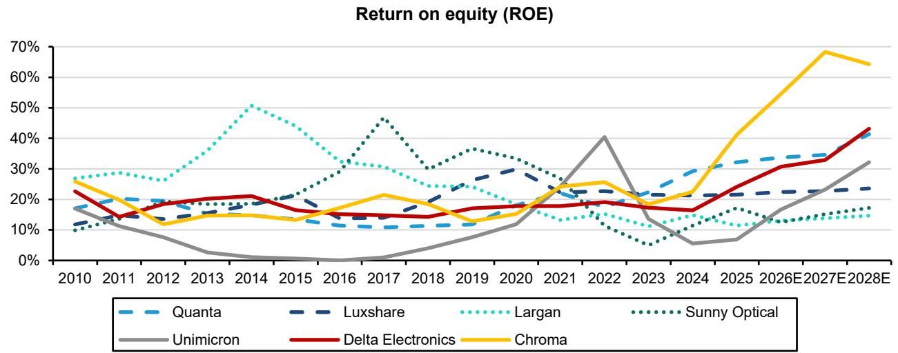

line chart

| Year | Quanta | Luxshare | Largan | Sunny Optical | Unimicron | Delta Electronics | Chroma |
| --- | --- | --- | --- | --- | --- | --- | --- |
| 2010 | 18% | 12% | 28% | 10% | 18% | 22% | 26% |
| 2011 | 19% | 13% | 29% | 11% | 14% | 15% | 24% |
| 2012 | 18% | 14% | 27% | 12% | 10% | 18% | 18% |
| 2013 | 19% | 15% | 30% | 13% | 5% | 19% | 15% |
| 2014 | 20% | 16% | 50% | 14% | 0% | 20% | 14% |
| 2015 | 19% | 17% | 45% | 15% | 0% | 19% | 13% |
| 2016 | 18% | 18% | 35% | 20% | 0% | 18% | 15% |
| 2017 | 17% | 19% | 30% | 45% | 0% | 17% | 20% |
| 2018 | 16% | 20% | 25% | 35% | 5% | 16% | 18% |
| 2019 | 15% | 22% | 20% | 30% | 8% | 15% | 15% |
| 2020 | 14% | 24% | 15% | 35% | 10% | 14% | 14% |
| 2021 | 13% | 26% | 14% | 30% | 25% | 13% | 20% |
| 2022 | 12% | 28% | 13% | 25% | 40% | 12% | 25% |
| 2023 | 11% | 30% | 12% | 5% | 15% | 11% | 20% |
| 2024 | 10% | 32% | 11% | 8% | 5% | 10% | 25% |
| 2025 | 9% | 34% | 10% | 15% | 7% | 9% | 35% |
| 2026E | 8% | 36% | 9% | 14% | 15% | 8% | 45% |
| 2027E | 7% | 38% | 8% | 13% | 25% | 7% | 55% |
| E* | - | - | - | - | - | - | - |
| E* | - | - | - | - | - | - | - |
| E* | - | - | - | - | - | - | - |
| E* | - | - | - | - | - | - | - |
| E* | - | - | - | - | - | ~43% | ~65% |
| E* | - | - | - | - | - | ~44% | ~63% |
| E* | - | - | - | - | - | ~43% | ~64% |
| E* | - | - | - | - | - | ~44% | ~63% |
| E* | - | - | - | - | - | ~44% | ~63% |
| E* | - | - | - | - | - | ~44% | ~63% |
| E* | - | - | - | - | - | ~44% | ~63% |

2026E - 2028E numbers are based on Bernstein estimates  
Source: Bloomberg, Bernstein analysis and estimates

EXHIBIT 2: Global PCB market has been highly cyclical over the past 16 years and is now experiencing a strong upcycle  
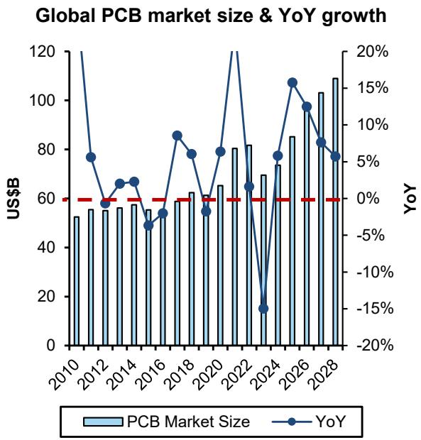

bar-line hybrid chart

Global PCB market size & YoY growth
| Year | PCB Market Size (US$B) | YoY (%) |
| :--- | :--- | :--- |
| 2010 | 52 | 120 |
| 2011 | 55 | 78 |
| 2012 | 56 | 58 |
| 2013 | 56 | 66 |
| 2014 | 58 | 67 |
| 2015 | 54 | -3 |
| 2016 | 55 | 54 |
| 2017 | 59 | 86 |
| 2018 | 62 | 79 |
| 2019 | 55 | 54 |
| 2020 | 66 | 79 |
| 2021 | 80 | 120 |
| 2022 | 82 | 65 |
| 2023 | 70 | -16 |
| 2024 | 73 | 77 |
| 2025 | 85 | 16 |
| 2026 | 103 | 13 |
| 2027 | 108 | 8 |
| 2028 | 110 | 6 |

2026 - 2028 numbers are estimates  
Source: Prismark estimates and Bernstein analysis

We further break down the 5-year average ROE with DuPont analysis to explore the drivers for each segment Exhibit 3: starting with profitability, the gross margin of the tech supply chain follows a smile curve Exhibit 4. Companies in the upstream (equipment and material) typically enjoy 30%+ gross margin due to technology leadership, engineering experience and resource control. They also need certain level of gross margin to compensate their high R&D investment and relatively smaller revenue scale compared to players in the other part of the supply chain. As we move along the supply chain, suppliers' revenue (bubble size) becomes bigger because it includes externally bought components from the upstream. Therefore, ODM/EMS companies typically face the lowest GM, which emphasizes the importance of business scale and operating efficiency in this sub-sector. The profitability then moves towards customers (OEM/brand) where design, branding and software demonstrate their values. Other observations for ROE drivers include:

- Equipment suppliers: Chroma delivers an impressive ROE, driving by a strong NPM from its customized products targeting niche markets.  
- Hardware component suppliers: over the past five years, Largan and Sunny Optical's ROEs were similar, despite significant difference in their NPM. Largan's asset turnover ratio was considerably lower than that of Sunny Optical's, indicating a heavier reliance on asset due to its focus on high-end lenses, particularly for Apple. Additionally, c.70% of Sunny's revenue comes from camera module, in which capex intensity is lighter than lens production due to a lower tech threshold. Moreover, Largan demonstrates lower equity leverage than Sunny Optical, bolstered by its substantial cash reserves. Sunny Optical saw significantly higher earnings volatility than Largan (Exhibit 5-Exhibit 6), reflecting greater GPM fluctuation amid Android-driven cycles and highly competitive module business, while Largan is supported by more resilient iPhone demand and higher tech threshold in lens market. Similarly, Unimicron exhibits high earnings volatility due to GPM fluctuations across the PCB cycle.  
- ODM suppliers: Luxshare and Quanta presented the highest 5-year average ROE in our Coverage, driven by their exceptional asset turnover and high equity multiplier, despite having lowest NPMs. This underscores that value creation in ODM companies stems from operation efficiency and capital leverage. Regarding the sales volatility in Exhibit 5, Quanta demonstrates the highest sales volatility, as buy-sell business model for AI server significantly boost reported revenue.

EXHIBIT 3: The DuPont analysis to break down the ROE drivers

<table><tr><td rowspan="3">Sub-sector</td><td rowspan="3">Sub-sector/Company</td><td colspan="13">Past 3 years average</td><td colspan="4">2022-2025</td><td colspan="2">2025-2028</td><td></td></tr><tr><td rowspan="2">ROE</td><td>=</td><td colspan="7">Net margin</td><td>X</td><td>Turnover</td><td>X</td><td>Leverage</td><td colspan="2">CAGR</td><td colspan="2">Earning volatility</td><td colspan="2">CAGR</td><td></td></tr><tr><td></td><td>NPM</td><td>=</td><td>(</td><td>GM</td><td>-</td><td>R&amp;D</td><td>-</td><td>SG&amp;A</td><td>-</td><td>Other</td><td>)</td><td>Sales/Asset</td><td></td><td>Asset/Equity</td><td>Sales</td><td>Net profit</td><td>Sales</td><td>Net profit</td></tr><tr><td>Equipments</td><td colspan="21">Equipment suppliers</td></tr><tr><td>Equip.</td><td>Chroma</td><td>27%</td><td></td><td>30%</td><td></td><td>59%</td><td></td><td>10%</td><td></td><td>22%</td><td></td><td>(2%)</td><td></td><td>58%</td><td></td><td>147%</td><td></td><td>9%</td><td>32%</td><td>22%</td><td>59%</td></tr><tr><td colspan="22">Smartphone c Hardware component suppliers</td></tr><tr><td rowspan="4">Hardware component</td><td>Largan</td><td>12%</td><td></td><td>39%</td><td></td><td>51%</td><td></td><td>9%</td><td></td><td>3%</td><td></td><td>(0%)</td><td></td><td>27%</td><td></td><td>117%</td><td></td><td>9%</td><td>(2%)</td><td>12%</td><td>19%</td></tr><tr><td>Sunny Optical</td><td>11%</td><td></td><td>7%</td><td></td><td>17%</td><td></td><td>8%</td><td></td><td>4%</td><td></td><td>(2%)</td><td></td><td>69%</td><td></td><td>210%</td><td></td><td>9%</td><td>25%</td><td>15%</td><td>63%</td></tr><tr><td>Unimicron</td><td>9%</td><td></td><td>7%</td><td></td><td>16%</td><td></td><td>4%</td><td></td><td>6%</td><td></td><td>(1%)</td><td></td><td>50%</td><td></td><td>232%</td><td></td><td>(2%)</td><td>(38%)</td><td>12%</td><td>41%</td></tr><tr><td>Delta Electronics</td><td>19%</td><td></td><td>11%</td><td></td><td>32%</td><td></td><td>9%</td><td></td><td>10%</td><td></td><td>2%</td><td></td><td>85%</td><td></td><td>192%</td><td></td><td>13%</td><td>22%</td><td>18%</td><td>33%</td></tr><tr><td>OEM/ODMs</td><td colspan="21">ODM suppliers</td></tr><tr><td rowspan="2">OEM/ODMs</td><td>Quanta</td><td>28%</td><td></td><td>4%</td><td></td><td>8%</td><td></td><td>2%</td><td></td><td>1%</td><td></td><td>0%</td><td></td><td>156%</td><td></td><td>429%</td><td></td><td>18%</td><td>37%</td><td>34%</td><td>30%</td></tr><tr><td>Luxshare</td><td>21%</td><td></td><td>5%</td><td></td><td>11%</td><td></td><td>3%</td><td></td><td>3%</td><td></td><td>(0%)</td><td></td><td>124%</td><td></td><td>263%</td><td></td><td>16%</td><td>20%</td><td>18%</td><td>20%</td></tr></table>

The future sales and profits are estimated by Bernstein  
Source: Bloomberg, Bernstein analysis and estimates

EXHIBIT 4: Profitability along the tech supply chain follows a smile curve reflecting the varying value add of each product/service offering  
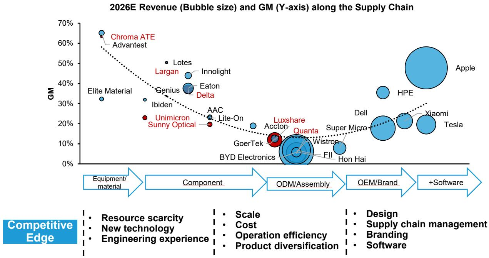

bubble chart

| Company | GM (%) | Bubble Size (Relative) | Category |
| --- | --- | --- | --- |
| Chroma ATE | 65 | Medium | Resource scarcity |
| Advantest | 60 | Medium | Resource scarcity |
| Elite Material | 32 | Medium | Resource scarcity |
| Lotes | 50 | Medium | Resource scarcity |
| Largan | 45 | Medium | Resource scarcity |
| Innolight | 40 | Medium | Resource scarcity |
| Genius | 35 | Medium | Resource scarcity |
| Eaton | 38 | Medium | Resource scarcity |
| Delta | 35 | Medium | Resource scarcity |
| Unimicron | 23 | Medium | Resource scarcity |
| Sunny Optical | 21 | Medium | Resource scarcity |
| AAC | 22 | Medium | Resource scarcity |
| Lite-On | 21 | Medium | Resource scarcity |
| Accton | 19 | Medium | ODM/Assembly |
| Luxshare | 13 | Medium | ODM/Assembly |
| Quanta | 12 | Medium | ODM/Assembly |
| Wistron | 11 | Medium | ODM/Assembly |
| GoerTek | 10 | Medium | ODM/Assembly |
| BYD Electronics | 7 | Medium | ODM/Assembly |
| FII | 8 | Medium | ODM/Assembly |
| Hon Hai | 7 | Medium | ODM/Assembly |
| Apple | 50 | Large | OEM/Brand |
| HPE | 35 | Medium | OEM/Brand |
| Xiaomi | 22 | Medium | OEM/Brand |
| Tesla | 20 | Medium | OEM/Brand |
| Dell | 18 | Medium | OEM/Brand |
| Super Micro | 17 | Medium | OEM/Brand |
| Blue Origin (Apple) | 50 | Large | +Software |
| Blue Origin (HPE) | 35 | Medium | +Software |
| Blue Origin (Tesla) | 20 | Medium | +Software |
| Blue Origin (Xiaomi) | 20 | Medium | +Software |
| Blue Origin (Dell) | 18 | Medium | +Software |
| Blue Origin (FII) | 10 | Medium | +Software |
| Blue Origin (Wistron) | 7 | Medium | +Software |
| Blue Origin (Quanta) | 6 | Medium | +Software |
| Blue Origin (Accton) | 5 | Medium | +Software |
| Blue Origin (Lime-On) | 4 | Medium | +Software |
| Blue Origin (Sunny Optical) | 3 | Medium | +Software |
| Blue Origin (Unimicron) | 2.5 | Medium | +Software |

Red bubble is our coverage. Xiaomi & Geely are covered by China Auto Team, Apple, Super Micro, Dell, HPE are covered by U.S. IT Hardware Team, Eaton is covered by U.S. Electrical Equipment Team, and Ibiden is covered by Japan Semiconductors team  
Source: Bloomberg estimates and Bernstein analysis

EXHIBIT 5: Our coverage companies exhibit similar level of sales volatility, except for Quanta  
Sales volatility (2023-2025)  
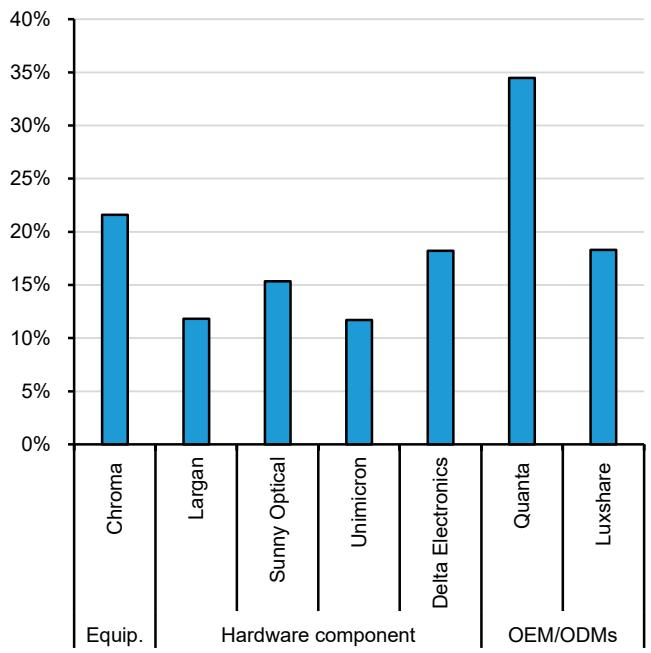

bar chart

| Company | Category | Value (%) |
| :--- | :--- | :--- |
| Chroma | Equip. | 21.5 |
| Largan | Hardware component | 11.8 |
| Sunny Optical | Hardware component | 15.3 |
| Unimicron | Hardware component | 11.7 |
| Delta Electronics | OEM/ODMs | 18.2 |
| Quanta | OEM/ODMs | 34.5 |
| Luxshare | OEM/ODMs | 18.3 |

Sales volatility are calculated as 2023-2025 standard deviation divided by the 2023-25 average sales  
Source: Bloomberg, Bernstein analysis

EXHIBIT 6: Net profit volatility is highest at Sunny Optical, mainly due to GM swings, followed by Chroma, which is structurally more cyclical  
Net profit volatility (2023-2025)  
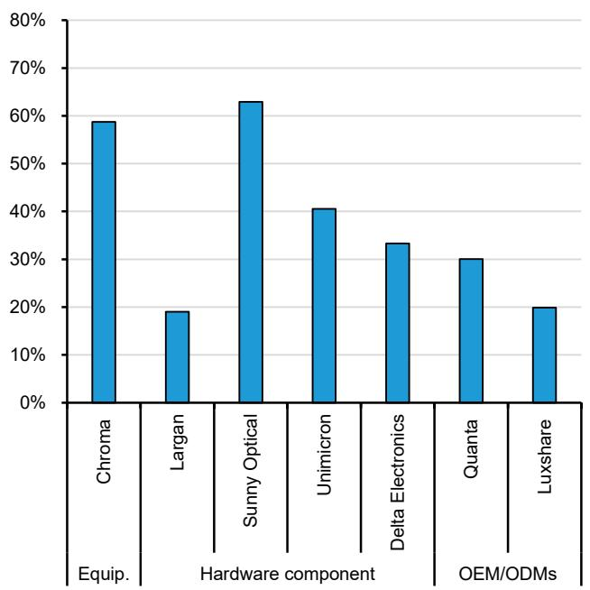

bar chart

| Category | Value (%) |
| :--- | :--- |
| Chroma | 59 |
| Largan | 19 |
| Sunny Optical | 63 |
| Unimicron | 40 |
| Delta Electronics | 33 |
| Quanta | 30 |
| Luxshare | 20 |

Net profit volatility are calculated as 2023-2025 standard deviation divided by the 2023-25 average net profit  
Source: Bloomberg, Bernstein analysis

## RETURN ON INVESTED CAPITAL (ROIC; INCLUDING CASH IN THE INVESTED CAPITAL)

The trends in ROIC and ROE generally align, as ROIC accounts for the impact of interest-bearing debts, compared to ROE. Quanta no longer leads our Coverage once debts is included in the calculation. As discussed in our Server ODM/OEM primer (2025), the buy-sell business model requires Quanta to procure all components (incl. GPU) prior to the assembly and sale of complete servers, which results in increased demand for debt. Facing the rising memory price and increasingly pricey AI accelerators for future generations of IT rack, many ODMs are discussing a shift from buy-sell model to consignment with their customers. Luxshare's ROIC dropped from 15% in 2021 to low-teens in 2025, while its ROE maintained 21\~22% during the same period. This decline is due to a RMB39B increase in debt to finance Capex for overseas expansion and M&A activities. (Exhibit 7-Exhibit 14)

We also analyzed the ROIC ratio across the supply chain of PCB and tester market:

\- PCB supply chain: The overall PCB market requires substantial capital investments as companies must expand capacities to meet changing demand, often cyclical in nature. ROIC for firms within this supply chain ranges from low-single-digit to low-20s. While Nittobo (3110 JT, not covered) and Ajinomoto (2802 JT, covered by APAC Food & Beverages team) dominates the T-glass and ABF film supply respectively, these products represent only 10%-30% their respective revenue. Companies with greater exposure to the server market, such as Elite material, Gold Circuit, WUS, Victory Giant Tech (2383 TT, 2368 TT, 002463 CH, 300476 CH, all not covered), show higher ROIC. In contrast, ABF substrate supplier like Unimicron, despite its significant exposure to AI servers, face financial pressure from an oversupply situation of low-mid end ABF, and yield issues in HDI until last year. However, its should recover rapidly this year driven by supply tightness in ABF market.

\- Tester market: Exhibit 12-Exhibit 14 include companies focusing on power and semiconductor testers, handlers and consumable parts in testing like socket and probe card. Regarding the profitability, tester companies typically maintain gross margins above 50% due to customized equipment/parts. OPM is typically 30%+ with semi tester companies carry higher profitability comparing to power tester suppliers. ROIC shows greater dispersion, but overall follows a similar trend to GPM and OPM.

EXHIBIT 7: In general, the ROIC trend parallels the ROE trend, except that Quanta's ranking appears lower with its debts included in ROIC calculation  
Return on invested capital (ROIC)  
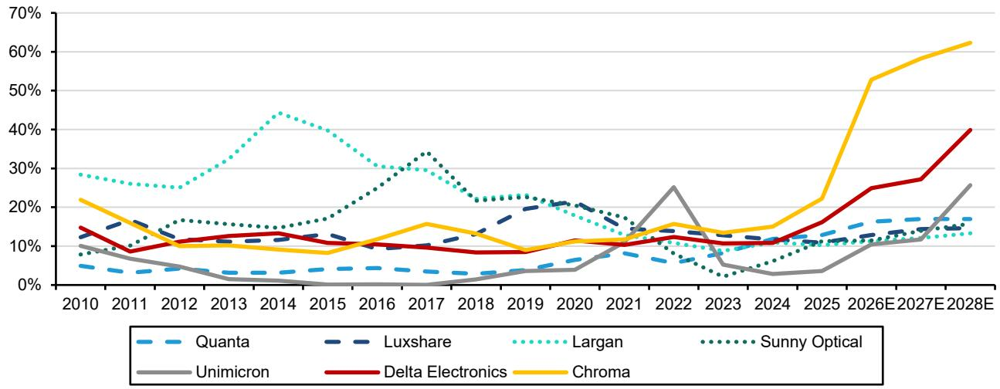

line chart

| Year   | Quanta | Luxshare | Largan | Sunny Optical | Unimicron | Delta Electronics | Chroma |
|--------|--------|----------|--------|---------------|-----------|-------------------|--------|
| 2010   | ~5%    | ~15%     | ~28%   | ~9%           | ~10%      | ~14%              | ~22%   |
| 2011   | ~4%    | ~14%     | ~26%   | ~10%          | ~8%       | ~10%              | ~18%   |
| 2012   | ~3%    | ~13%     | ~25%   | ~15%          | ~6%       | ~10%              | ~14%   |
| 2013   | ~2%    | ~12%     | ~30%   | ~14%          | ~3%       | ~10%              | ~12%   |
| 2014   | ~2%    | ~11%     | ~45%   | ~13%          | ~0%       | ~10%              | ~10%   |
| 2015   | ~3%    | ~10%     | ~40%   | ~15%          | ~0%       | ~10%              | ~8%    |
| 2016   | ~3%    | ~10%     | ~35%   | ~20%          | ~0%       | ~10%              | ~10%   |
| 2017   | ~3%    | ~10%     | ~30%   | ~35%          | ~0%       | ~10%              | ~15%   |
| 2018   | ~3%    | ~10%     | ~25%   | ~25%          | ~0%       | ~8%               | ~12%   |
| 2019   | ~3%    | ~15%     | ~22%   | ~22%          | ~3%       | ~8%               | ~8%    |
| 2020   | ~4%    | ~20%     | ~20%   | ~20%          | ~5%       | ~8%               | ~10%   |
| 2021   | ~5%    | ~18%     | ~15%   | ~15%          | ~10%      | ~8%               | ~10%   |
| 2022   | ~6%    | ~15%     | ~10%   | ~8%           | ~25%      | ~8%               | ~15%   |
| 2023   | ~7%    | ~12%     | ~8%    | ~5%           | ~5%       | ~8%               | ~15%   |
| 2024   | ~8%    | ~10%     | ~8%    | ~8%           | ~3%       | ~8%               | ~15%   |
| 2025   | ~9%    | ~10%     | ~8%    | ~10%          | ~3%       | ~15%              | ~22%   |
| 2026E  | ~10%   | ~10%     | ~8%    | ~10%          | ~5%       | ~25%              | ~55%   |
| 2027E  | ~12%   | ~10%     | ~8%    | ~12%          | ~10%      | ~30%              | ~60%   |
| 2028E  | ~15%   | ~15%     | ~8%    | ~15%          | ~25%      | ~40%              | ~65%   |

Source: Bloomberg, Bernstein analysis and estimates

EXHIBIT 8: The overall PCB industry is capex-intensive as companies need to expand capacities to meet changing demand, often cyclical in nature  
Capex as % of revenue (5-year avg.)  
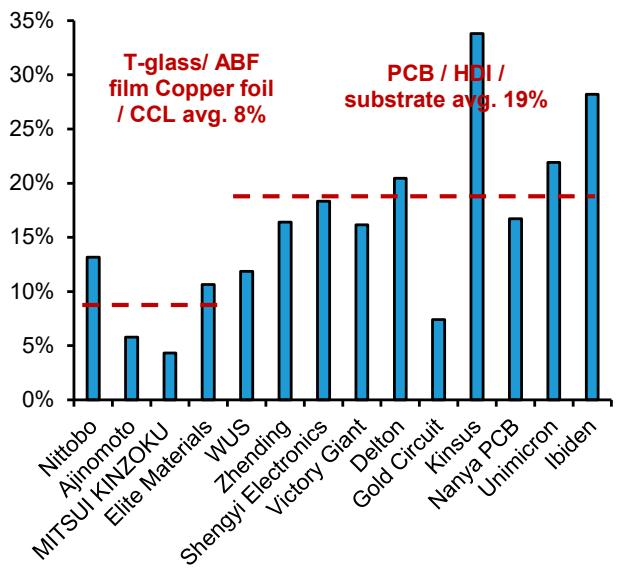

bar chart

| Material             | Value |
| -------------------- | ----- |
| Nittobo              | 13%   |
| Ajinomoto            | 6%    |
| MITSUI KINZOKU       | 4%    |
| Elite Materials      | 10%   |
| WUS                  | 12%   |
| Zhengling            | 16%   |
| Shengyi Electronics  | 18%   |
| Victory Giant        | 16%   |
| Delton               | 20%   |
| Gold Circuit         | 7%    |
| Kinsus               | 34%   |
| Nanya PCB            | 16%   |
| Unimicron            | 22%   |
| Ibiden               | 28%   |

Source: Bloomberg, Bernstein analysis

EXHIBIT 9: PCB in the server segment will likely grow faster than the overall market at a 17% CAGR in 2025-30E  
PCB Market Size by End Market  
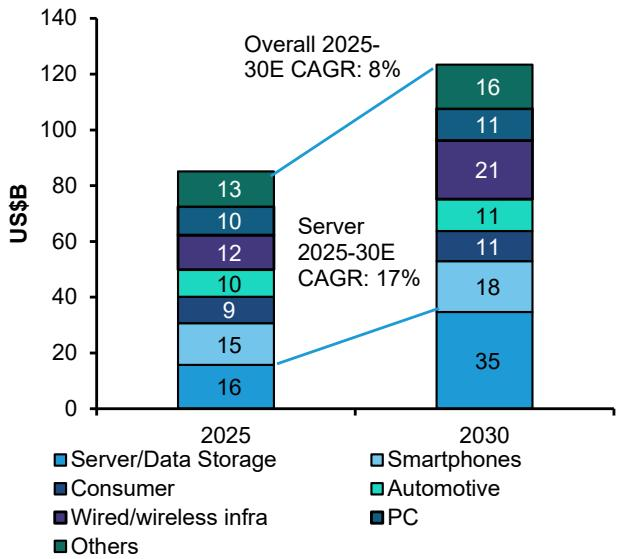

stacked bar chart

| Year | Server/Data Storage (US$B) | Smartphones (US$B) | Consumer (US$B) | Wired/wireless infra (US$B) | Automotive (US$B) | PC (US$B) | Others (US$B) |
| :--- | :--- | :--- | :--- | :--- | :--- | :--- | :--- |
| 2025 | 16 | 15 | 9 | 12 | 10 | 13 | 13 |
| 2030 | 35 | 18 | 11 | 21 | 11 | 11 | 16 |
Overall 2025-30E CAGR: 8%; Server 2025-30E CAGR: 17%

Source: Prismark data and estimates, Bernstein analysis

EXHIBIT 10: PCB supply chain companies with higher exposure to server market would present better ROIC. ABF companies had relatively low ROIC last year as low-end product was still oversupplied  
2025 ROIC (Y-axis) and Invested capital (Bubble size) - PCB supply chain  
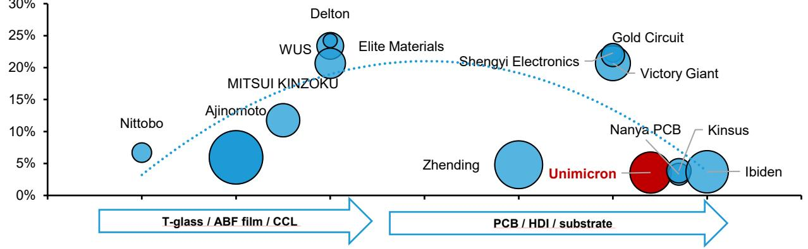

bubble chart

| Company | Label | Percentage (%) |
| :--- | :--- | :--- |
| Nittobo | | 6.5 |
| Ajinomoto | | 12.0 |
| MITSUI KINZOKU | | 12.0 |
| Delton | | 23.0 |
| WUS | | 21.0 |
| Elite Materials | | 24.0 |
| Shengyi Electronics | Gold Circuit | 21.0 |
| Victory Giant | | 21.0 |
| Zhending | | 4.5 |
| Unimicron | Nanya PCB | 3.5 |
| Kinsus | | 3.5 |
| Ibiden | | 3.5 |

Red bubble is our coverage. Ibiden is covered by Japan Semiconductors Team.  
Source: Bloomberg, Bernstein analysis

EXHIBIT 11: 5-year average ROIC reflects the last ABF upcycle during COVID  
5-year avg. ROIC (Y-axis) and 2025 Invested capital (Bubble size)  
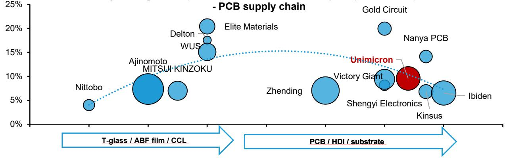

bubble chart

- PCB supply chain
| Company | Percentage (%) | Category |
| :--- | :--- | :--- |
| Nittobo | 4 | T-glass / ABF film / CCL |
| Ajinomoto | 8 | T-glass / ABF film / CCL |
| MITSUI | 7 | T-glass / ABF film / CCL |
| KINZOKU | 6.5 | T-glass / ABF film / CCL |
| Delton | 17 | T-glass / ABF film / CCL |
| WUS | 15.5 | T-glass / ABF film / CCL |
| Elite Materials | 20.5 | T-glass / ABF film / CCL |
| Zhending | 7.5 | T-glass / ABF film / CCL |
| Victory Giant | 9.5 | PCB / HDI / substrate |
| Shengyi Electronics | 9.5 | PCB / HDI / substrate |
| Unimicron | 10.0 | PCB / HDI / substrate |
| Gold Circuit | 20.0 | PCB / HDI / substrate |
| Nanya PCB | 14.0 | PCB / HDI / substrate |
| Ibiden | 6.5 | PCB / HDI / substrate |
| Kinsus | 6.5 | PCB / HDI / substrate |

Red bubble is our coverage. Ibiden is covered by Japan Semiconductors Team.  
Source: Bloomberg, Bernstein analysis

EXHIBIT 12: Testers' GPMs are relatively high, averaging c.56% in 2026E  
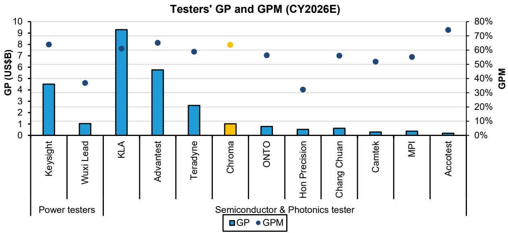

bar-line hybrid chart

Testers' GP and GPM (CY2026E)
| Tester | Power testers | Semiconductor & Photonics tester | GP (US$B) | GPM (%) |
| :--- | :--- | :--- | :--- | :--- |
| Keysight | | | 4.5 | 80 |
| Wuxi Lead | | | 1.0 | 45 |
| KLA | | | 9.3 | 75 |
| Advantest | | | 5.8 | 82 |
| Teradyne | | | 2.7 | 72 |
| Chroma | | | 1.0 | 80 |
| ONTO | | | 0.8 | 70 |
| Hon Precision | | | 0.5 | 35 |
| Chang Chuan | | | 0.6 | 68 |
| Camtek | | | 0.3 | 55 |
| MPI | | | 0.4 | 58 |
| Accotest | | | 0.2 | 75 |

Numbers adjusted to calendar year ending 2026; Chroma, KLA and Advantest are covered by Bernstein while others are not covered; Chomra numbers are based on Bernstein estimates; all others are based on Bloomberg consensus  
Source: Bloomberg, Bernstein analysis

EXHIBIT 13: In 2026E, testers' OPMs are typically $30\%+$ with semi tester companies carry higher profitability comparing to power tester suppliers  
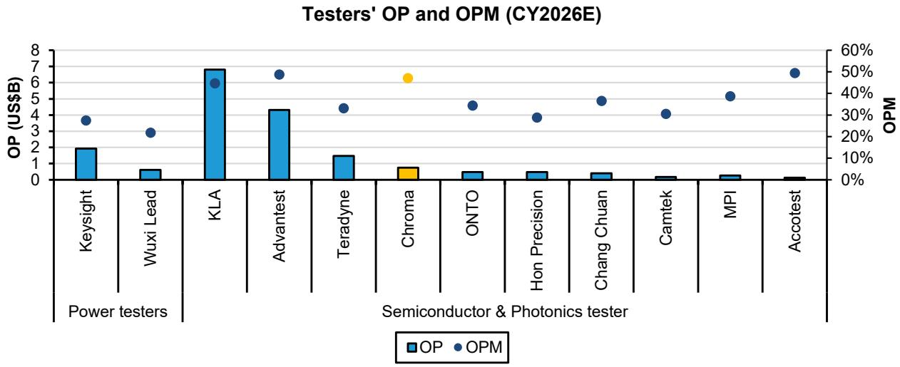

bar-line hybrid chart

Testers' OP and OPM (CY2026E)
| Category | Company | OP (US$B) | OPM (%) |
| :--- | :--- | :--- | :--- |
| Power testers | Keysight | 1.9 | 35 |
| Power testers | Wuxi Lead | 0.6 | 28 |
| Power testers | KLA | 6.8 | 60 |
| Semiconductor & Photonics tester | Advantest | 4.3 | 65 |
| Semiconductor & Photonics tester | Teradyne | 1.5 | 42 |
| Semiconductor & Photonics tester | Chroma | 0.7 | 50 |
| Semiconductor & Photonics tester | ONTO | 0.5 | 42 |
| Semiconductor & Photonics tester | Hon Precision | 0.5 | 30 |
| Semiconductor & Photonics tester | Chang Chuan | 0.4 | 42 |
| Semiconductor & Photonics tester | Camtek | 0.2 | 30 |
| Semiconductor & Photonics tester | MPI | 0.3 | 42 |
| Semiconductor & Photonics tester | Accotest | 0.1 | 50 |

OP = GP - R&D - SG&A; Chroma, KLA and Advantest are covered by Bernstein while others are not covered; Chomra numbers are based on Bernstein estimates; All others are based on Bloomberg consensus  
Source: Bloomberg, Bernstein analysis

EXHIBIT 14: ROIC shows greater dispersion, but overall follows a similar trend to GPM and OPM  
Testers' ROIC (CY2025)  
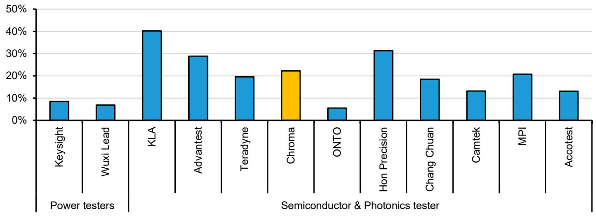

bar chart

| Category | Instrument | Value (%) |
| :--- | :--- | :--- |
| Power testers | Keysight | 8.5 |
| Power testers | Wuxi Lead | 6.8 |
| Power testers | KLA | 40.5 |
| Power testers | Advantest | 29.0 |
| Power testers | Teradyne | 19.5 |
| Power testers | Chroma | 22.0 |
| Semiconductor & Photonics tester | ONTO | 5.0 |
| Semiconductor & Photonics tester | Hon Precision | 31.5 |
| Semiconductor & Photonics tester | Chang Chuan | 18.5 |
| Semiconductor & Photonics tester | Camtek | 13.0 |
| Semiconductor & Photonics tester | MPI | 20.5 |
| Semiconductor & Photonics tester | Accotest | 13.0 |

Chroma, KLA and Advantest are covered by Bernstein while others are not covered  
Source: Bloomberg, Bernstein analysis

## SOLVENCY

## Debt to equity ratio (D/E ratio)

When it comes to debt to equity ratio (D/E ratio), we note that (Exhibit 15 - Exhibit 17):

- ODM suppliers: within our coverage, Quanta and Luxshare have the highest D/E ratio due to the substantial capital demands under the buy-sell model. Quanta has been reducing its D/E ratio from 2018 to 2023 by paying down debts, but we anticipate a rapid rebound in the next two years as the fast-growing AI server segment will likely require significant capital. Luxshare's D/E ratio saw a significant rise since 2019 due to M&A needs and its expansion into Apple supply chain and new sectors. However, given Luxshare's improving FCF in recent years, and its plan for HK IPO (Link), the company is likely to see a reduction in its D/E ratio in following years.  
- Other suppliers: D/E ratios of Unimicron, Delta, Chroma, Sunny Optical and Largan have all been below 50% over the past 3 years, reflecting their healthy financial position.

## Net debt to equity ratio (Net D/E ratio)

The net debt to equity ratio for our coverage companies have all been below $30\%$ in recent years, reflecting their solid financial status, except for Quanta. Largan's net debt to equity ratio was even lower than $-60\%$ over the past decade due to its substantial cash balance. Nonetheless, we expect Quanta's net debt to equity ratio to pick up significantly in the upcoming years due to working capital burden from AI server business. We model Quanta to face net interest expense, instead of income starting this year, weighting on EPS growth despite strong top line growth.

EXHIBIT 15: Quanta exhibits the highest D/E ratio within our coverage  
Debt to equity ratio  
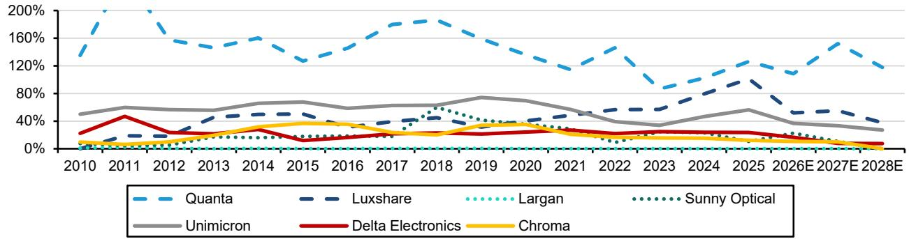

line chart

| Year   | Quanta | Luxshare | Largan | Unimicron | Delta Electronics | Chroma |
|--------|--------|----------|--------|-----------|-------------------|--------|
| 2010   | 150%   | 10%      | 5%     | 40%       | 30%               | 5%     |
| 2011   | 200%   | 20%      | 5%     | 50%       | 40%               | 10%    |
| 2012   | 160%   | 30%      | 5%     | 45%       | 35%               | 15%    |
| 2013   | 150%   | 40%      | 5%     | 50%       | 30%               | 20%    |
| 2014   | 160%   | 45%      | 5%     | 55%       | 35%               | 25%    |
| 2015   | 130%   | 40%      | 5%     | 50%       | 25%               | 30%    |
| 2016   | 140%   | 45%      | 5%     | 45%       | 30%               | 35%    |
| 2017   | 170%   | 40%      | 5%     | 40%       | 35%               | 40%    |
| 2018   | 180%   | 45%      | 5%     | 45%       | 40%               | 45%    |
| 2019   | 170%   | 40%      | 5%     | 50%       | 35%               | 40%    |
| 2020   | 160%   | 45%      | 5%     | 45%       | 30%               | 35%    |
| 2021   | 140%   | 40%      | 5%     | 40%       | 35%               | 30%    |
| 2022   | 130%   | 45%      | 5%     | 35%       | 30%               | 25%    |
| 2023   | 110%   | 50%      | 5%     | 30%       | 25%               | 20%    |
| 2024   | 120%   | 55%      | 5%     | 35%       | 30%               | 15%    |
| 2025   | 130%   | 60%      | 5%     | 40%       | 35%               | 10%    |
| 2026E  | 110%   | 45%      | 5%     | 35%       | 30%               | 5%     |
| 2027E  | 130%   | 40%      | 5%     | 30%       | 25%               | 5%     |
| 2028E  | 120%   | 35%      | 5%     | 25%       | 20%               | 5%     |

Source: Bloomberg, Bernstein analysis and estimates

EXHIBIT 16: Within our coverage, Quanta is the sole company with a notably high net debt-to-equity ratio  
Net debt to equity ratio  
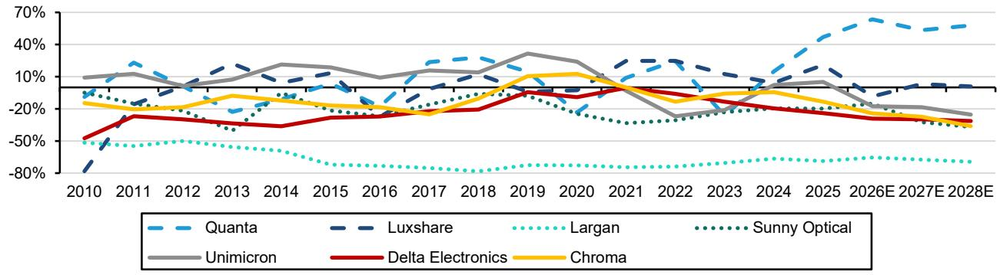

line chart

| Year | Quanta | Luxshare | Largan | Unimicron | Delta Electronics | Chroma | Sunny Optical |
|------|--------|----------|--------|-----------|-------------------|--------|---------------|
| 2010 | -10%   | -70%     | -50%   | 10%       | -40%              | -15%   | -15%          |
| 2011 | 10%    | -15%     | -55%   | 15%       | -35%              | -15%   | -10%          |
| 2012 | 5%     | -10%     | -60%   | 10%       | -30%              | -15%   | -5%           |
| 2013 | 0%     | 5%       | -65%   | 15%       | -25%              | -15%   | 0%            |
| 2014 | 5%     | 10%      | -70%   | 20%       | -20%              | -15%   | 5%            |
| 2015 | 10%    | 15%      | -75%   | 15%       | -15%              | -15%   | 10%           |
| 2016 | 15%    | 20%      | -80%   | 10%       | -10%              | -15%   | 15%           |
| 2017 | 20%    | 25%      | -80%   | 15%       | -5%               | -15%   | 20%           |
| 2018 | 25%    | 30%      | -80%   | 20%       | 0%                | -15%   | 25%           |
| 2019 | 30%    | 35%      | -80%   | 25%       | 5%                | -15%   | 30%           |
| 2020 | 25%    | 30%      | -80%   | 20%       | 10%               | -15%   | 25%           |
| 2021 | 20%    | 25%      | -80%   | 15%       | 15%               | -15%   | 20%           |
| 2022 | 15%    | 20%      | -80%   | 10%       | 20%               | -15%   | 15%           |
| 2023 | 10%    | 15%      | -80%   | 5%        | 25%               | -15%   | 10%           |
| 2024 | 5%     | 10%      | -80%   | 0%        | 30%               | -15%   | 5%            |
| 2025E| 0%     | 5%       | -80%   | -5%       | 35%               | -15%   | 0%            |
| 2026E| -5%    | 0%       | -80%   | -10%      | 40%               | -15%   | -5%           |
| 2027E| -10%   | -5%      | -80%   | -15%      | 45%               | -15%   | -10%          |
| 2028E| -15%   | -10%     | -80%   | -20%      | 50%               | -15%   | -15%          |

Source: Bloomberg, Bernstein analysis and estimates

EXHIBIT 17: Quanta incurred net interest expenses in 2025 for the first time since 2020, primarily due to increased working capital burden from its fast-growing AI server business  
Net interest expense as % of operating profit  
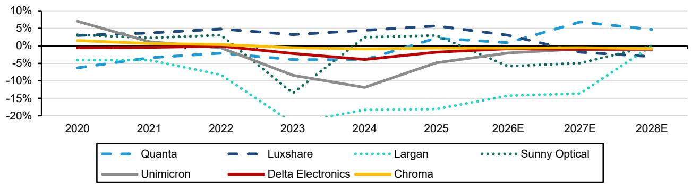

line chart

| Year   | Quanta | Luxshare | Largan | Unimicron | Delta Electronics | Chroma |
|--------|--------|----------|--------|-----------|-------------------|--------|
| 2020   | -5%    | 5%       | -5%    | 5%        | 0%                | 0%     |
| 2021   | -5%    | 5%       | -5%    | 0%        | 0%                | 0%     |
| 2022   | -5%    | 5%       | -10%   | -5%       | 0%                | 0%     |
| 2023   | -5%    | 5%       | -20%   | -10%      | -5%               | 0%     |
| 2024   | -5%    | 5%       | -20%   | -15%      | -5%               | 0%     |
| 2025   | -5%    | 5%       | -20%   | -5%       | -5%               | 0%     |
| 2026E  | -5%    | 5%       | -15%   | -5%       | -5%               | 0%     |
| 2027E  | -5%    | 5%       | -15%   | -5%       | -5%               | 0%     |
| 2028E  | -5%    | 5%       | -5%    | -5%       | -5%               | 0%     |

Source: Bloomberg, Bernstein analysis and estimates

## OPERATIONAL EFFICIENCY

Within our coverage, suppliers in mainland China have shorter cash conversion cycle due to proficient management of receivables and inventory, as well as different corporate structures (Exhibit 18 - Exhibit 23).

- Equipment supplier: Chroma exhibits the longest cash conversion cycle, mainly due to the prolonged inventory turnover days, reflecting testing equipment industry's characteristics of infrequent purchases and extensive inspection & trial processes. In 2025, inventory turnover days of Chroma was 224 days, higher than other companies within our coverage, yet still below the tester industry average. Despite this, Chroma's free cash flow margin ranked the top among our coverage, thanks to its strong NPM. Moreover, its cash on balance amounts to $20 - 30\%$ of revenue over the past 5 years, maintaining a healthy liquidity level. Notably, Chroma's inventory turnover days have risen significantly over the past five years, likely due to strategic stockpiling during the pandemic and the cessation of its high-turnover material trading business in 2022.  
- Component suppliers: Largan has maintained the highest cash flow generation capability over the past 15 years, driven by its superior NPM. Unimicron and Delta's cash conversion cycles have been stable. Sunny Optical's cash conversion cycle is the shortest among our coverage thanks to its extended accounts payable turnover days (including notes payable). However, this result should be viewed cautiously, as Sunny's operates through multiple subsidiaries, leading to significant internal transactions (e.g. some handset modules use internal-made lenses) and other inter-corporate activities. This structure tends to inflate notes payables, which saw a spike in 2023-24.  
- ODM suppliers: Luxshare has achieved an almost zero cash conversion cycle in recent years, demonstrating remarkable operational efficiency. Over the past decade, the accounts receivable turnover days of Luxshare have consistently declined and has now become the second shortest within our coverage, reflecting strong bargaining power against downstream customers. In comparison, Quanta's cash conversion cycle is longer due to the extended transportation process between its L6 sites in Asia and L10 sites in US and Germany (Apple and AI server supply chain in a deglobalizing world), and more time-consuming testing procedures of AI servers compared to consumer electronics.

EXHIBIT 18: Chroma exhibits the longest cash conversion cycle within our Coverage  
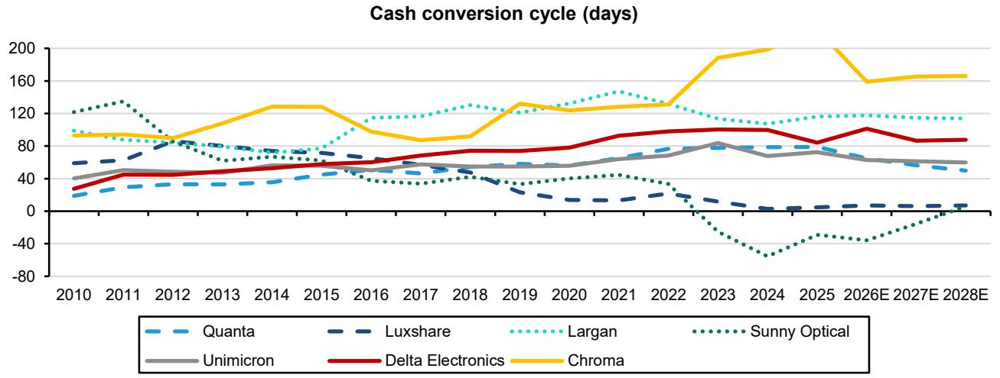

line chart

| Year   | Quanta | Luxshare | Largan | Sunny Optical | Unimicron | Delta Electronics | Chroma |
|--------|--------|----------|--------|---------------|-----------|-------------------|--------|
| 2010   | 30     | 50       | 90     | 120           | 40        | 35                | 90     |
| 2011   | 35     | 55       | 85     | 130           | 45        | 40                | 85     |
| 2012   | 40     | 60       | 80     | 110           | 50        | 45                | 80     |
| 2013   | 45     | 65       | 75     | 90            | 55        | 50                | 75     |
| 2014   | 50     | 70       | 70     | 80            | 60        | 55                | 70     |
| 2015   | 55     | 75       | 65     | 70            | 65        | 60                | 65     |
| 2016   | 60     | 80       | 60     | 60            | 70        | 65                | 60     |
| 2017   | 65     | 85       | 55     | 50            | 75        | 70                | 55     |
| 2018   | 70     | 90       | 50     | 40            | 80        | 75                | 50     |
| 2019   | 75     | 95       | 45     | 30            | 85        | 80                | 45     |
| 2020   | 80     | 100      | 40     | 20            | 90        | 85                | 40     |
| 2021   | 85     | 105      | 35     | 10            | 95        | 90                | 35     |
| 2022   | 90     | 110      | 30     | -10           | 100       | 95                | 30     |
| 2023   | 95     | 115      | 25     | -30           | 105       | 100               | 25     |
| 2024   | 100    | 120      | 20     | -40           | 110       | 105               | 20     |
| 2025E  | 105    | 125      | 15     | -50           | 115       | 110               | 15     |
| 2026E  | 110    | 130      | 10     | -60           | 120       | 115               | 10     |
| 2027E  | 115    | 135      | -5     | -70           | 125       | 120               | -5     |
| 2028E  | 120    | 140      | -10    | -80           | 130       | 125               | -10    |
| E: Data from chart center: Quanta, Luxshare, Largan, Sunny Optical, Unimicron, Delta Electronics, Chroma. Values are estimated based on the chart label 'E'.

Source: Bloomberg, Bernstein analysis and estimates

EXHIBIT 19: Sunny Optical's lengthy account payable days and Chroma's long inventory turnover days result in the shortest and the longest cash conversion cycle within our Coverage respectively  
Cash conversion cycle breakdown in 2025  
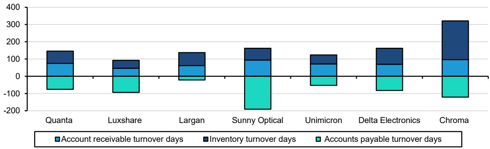

stacked bar chart

| Company | Accounts receivable turnover days | Inventory turnover days | Accounts payable turnover days |
| :--- | :--- | :--- | :--- |
| Quanta | 70 | 60 | -80 |
| Luxshare | 30 | 25 | -100 |
| Largan | 50 | 60 | -20 |
| Sunny Optical | 90 | 40 | -200 |
| Unimicron | 60 | 30 | -50 |
| Delta Electronics | 60 | 70 | -80 |
| Chroma | 90 | 210 | -130 |

Source: Bloomberg, Bernstein analysis

EXHIBIT 20: Over the past decade, the accounts receivable turnover days of Luxshare have consistently declined and now become the shortest within our coverage, indicating its strong bargaining power against downstream customers  
Account receivable turnover days  
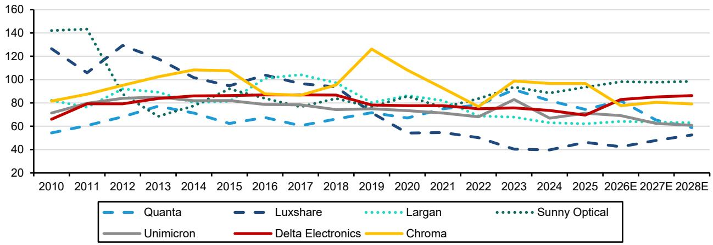

line chart

| Year   | Quanta | Luxshare | Largan | Sunny Optical | Unimicron | Delta Electronics | Chroma |
|--------|--------|----------|--------|---------------|-----------|-------------------|--------|
| 2010   | 55     | 130      | 80     | 145           | 70        | 65                | 80     |
| 2011   | 60     | 120      | 85     | 140           | 75        | 75                | 85     |
| 2012   | 65     | 130      | 90     | 90            | 80        | 80                | 90     |
| 2013   | 70     | 125      | 95     | 75            | 85        | 85                | 95     |
| 2014   | 75     | 115      | 90     | 70            | 85        | 85                | 100    |
| 2015   | 70     | 105      | 85     | 75            | 80        | 85                | 105    |
| 2016   | 65     | 100      | 80     | 80            | 75        | 85                | 100    |
| 2017   | 60     | 95       | 75     | 85            | 70        | 85                | 95     |
| 2018   | 65     | 90       | 70     | 90            | 75        | 85                | 90     |
| 2019   | 70     | 85       | 65     | 95            | 70        | 85                | 125    |
| 2020   | 75     | 80       | 60     | 85            | 75        | 85                | 110    |
| 2021   | 70     | 75       | 55     | 80            | 70        | 85                | 100    |
| 2022   | 65     | 70       | 50     | 75            | 65        | 85                | 80     |
| 2023   | 60     | 65       | 45     | 70            | 60        | 85                | 95     |
| 2024   | 55     | 60       | 40     | 65            | 55        | 85                | 95     |
| 2025   | 50     | 55       | 35     | 60            | 50        | 85                | 95     |
| 2026E  | 45     | 50       | 30     | 55            | 45        | 85                | 90     |
| 2027E  | 40     | 45       | 25     | 50            | 40        | 85                | 85     |
| 2028E  | 35     | 40       | 20     | 45            | 35        | 85                | 80     |
| E-2028E| -      | -        | -      | -             | -         | -                 | -      |

Source: Bloomberg, Bernstein analysis and estimates

EXHIBIT 21: Chroma exhibits the longest inventory turnover days, which reflects the nature of the testing equipment industry characterized by infrequent purchases and prolonged inspection and trial processes  
Inventory turnover days  
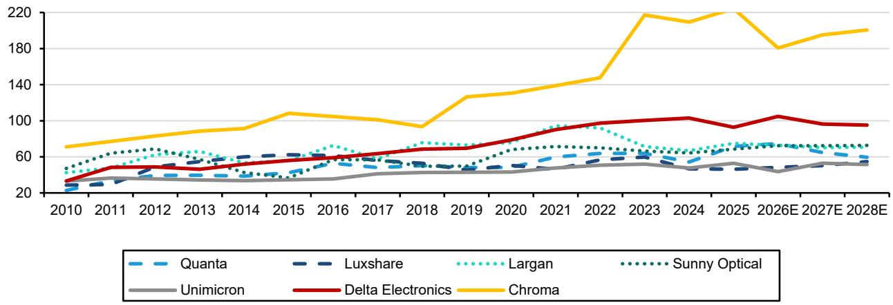

line chart

| Year | Quanta | Luxshare | Largan | Unimicron | Delta Electronics | Chroma |
| --- | --- | --- | --- | --- | --- | --- |
| 2010 | 25 | 25 | 50 | 25 | 25 | 65 |
| 2011 | 25 | 25 | 55 | 25 | 30 | 70 |
| 2012 | 25 | 25 | 60 | 25 | 35 | 75 |
| 2013 | 25 | 25 | 65 | 25 | 40 | 80 |
| 2014 | 25 | 25 | 70 | 25 | 45 | 85 |
| 2015 | 25 | 25 | 75 | 25 | 50 | 90 |
| 2016 | 25 | 25 | 80 | 25 | 55 | 95 |
| 2017 | 25 | 25 | 85 | 25 | 60 | 100 |
| 2018 | 25 | 25 | 90 | 25 | 65 | 95 |
| 2019 | 25 | 25 | 95 | 25 | 70 | 100 |
| 2020 | 25 | 25 | 100 | 25 | 75 | 105 |
| 2021 | 25 | 25 | 105 | 25 | 80 | 110 |
| 2022 | 25 | 25 | 110 | 25 | 85 | 115 |
| 2023 | 25 | 25 | 115 | 25 | 90 | 120 |
| 2024 | 25 | 25 | 120 | 25 | 95 | 115 |
| 2025E | 25 | 25 | 115 | 25 | 90 | 110 |
| 2026E | 25 | 25 | 110 | 25 | 85 | 105 |
| 2027E | 25 | 25 | 105 | 25 | 80 | 100 |
| 2028E | 25 | 25 | 100 | 25 | 75 | 95 |
| 2028E* | 25 | 25 | 95 | 25 | 70 | 90 |
| Unimicron | - | - | - | - | - | - |

Source: Bloomberg, Bernstein analysis and estimates

EXHIBIT 22: Chroma's inventory turnover days in 2025 was below industry average  
Testors' inventory turnover days in 2025  
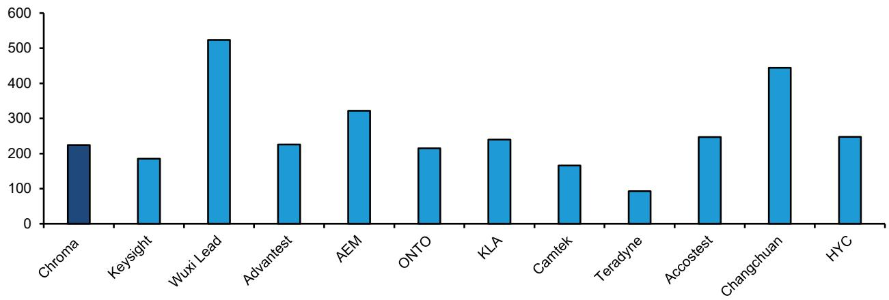

bar chart

| Company | Value |
| :--- | :--- |
| Chroma | 225 |
| Keysight | 185 |
| Wuxi Lead | 525 |
| Advantest | 225 |
| AEM | 325 |
| ONTO | 215 |
| KLA | 240 |
| Camtek | 165 |
| Teradyne | 90 |
| Accostest | 245 |
| Changchuan | 445 |
| HYC | 245 |

Source: Bloomberg, Bernstein analysis

EXHIBIT 23: Largan and Chroma showcased the most robust cash flow generation ability despite the longer cash conversion cycle, thanks to their high NPM  
Free cash flow margin  
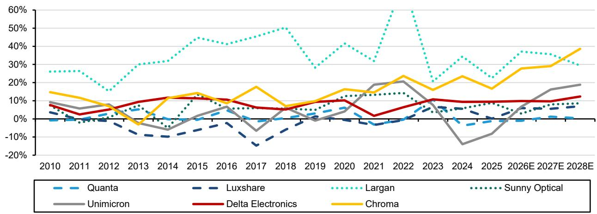

line chart

| Year   | Quanta | Luxshare | Largan | Unimicron | Delta Electronics | Chroma | Sunny Optical |
|--------|--------|----------|--------|-----------|-------------------|--------|---------------|
| 2010   | -      | 5%       | 25%    | 10%       | 10%               | 15%    | 5%            |
| 2011   | -      | 0%       | 25%    | 5%        | 5%                | 10%    | 0%            |
| 2012   | -      | -5%      | 15%    | 5%        | 5%                | 5%     | -5%           |
| 2013   | -      | -10%     | 30%    | -5%       | 10%               | -5%    | -10%          |
| 2014   | -      | -15%     | 35%    | -10%      | 10%               | 10%    | -15%          |
| 2015   | -      | -5%      | 45%    | 0%        | 10%               | 15%    | 10%           |
| 2016   | -      | -5%      | 40%    | 5%        | 10%               | 10%    | 5%            |
| 2017   | -      | -15%     | 45%    | -10%      | 5%                | 15%    | -5%           |
| 2018   | -      | -5%      | 50%    | 0%        | 5%                | 5%     | 0%            |
| 2019   | -      | -5%      | 30%    | 0%        | 10%               | 10%    | 5%            |
| 2020   | -      | -5%      | 40%    | 5%        | 10%               | 15%    | 10%           |
| 2021   | -      | -5%      | 30%    | 20%       | 5%                | 15%    | 15%           |
| 2022   | -      | -5%      | 60%    | 25%       | 10%               | 25%    | 15%           |
| 2023   | -      | -5%      | 20%    | 10%       | 10%               | 15%    | 10%           |
| 2024   | -      | -15%     | 35%    | -15%      | 10%               | 25%    | 5%            |
| 2025   | -      | -5%      | 30%    | -10%      | 10%               | 20%    | 5%            |
| 2026E  | -      | -5%      | 35%    | -5%       | 10%               | 30%    | 5%            |
| 2027E  | -      | -5%      | 35%    | 15%       | 10%               | 35%    | 5%            |
| 2028E  | -      | -5%      | 30%    | 20%       | 10%               | 40%    | 5%            |

Source: Bloomberg, Bernstein analysis and estimates

## CAPITAL EXPENDITURE AND DEPRECIATION

In terms of Capex, we noted that Largan and Unimicron were the most Capex-intensive companies within our coverage (Exhibit 24 - Exhibit 27):

- Equipment supplier: Chroma's Capex was among the lowest within our coverage, reflecting testing equipment industry's reliance on engineers rather than physical assets.  
- PCB and power components suppliers: The Capex as percentage of revenue for Delta Electronics was relatively low and stable, representing approximately 5% of its revenue over the last 15 years. In contrast, Unimicron's Capex as percentage of revenue was considerably high and volatile, indicating the cyclical and asset-intensive characteristics of PCB industry. Unimicron's Capex has increased significantly since 2021, driven by its ABF (Yangmei and KF sites) and PCB (Thailand site) segments. The company has also accelerated the capex spending this year, and targets to increase ABF capacity by 40% YoY end-2026 (1Q26 PCB market update & Unimicron model update).  
- Camera suppliers: Largan has ramped capex in recent years as rising camera specs demand more advanced equipment and larger production space. The utilization rate in existing sites are almost full, and the new site in Taichung started ramping up in late-2025, with 2x floor space of the latest site in Taichung starts in end-2023. We believe this additional space prepares for variable-aperture lenses for iPhone 18, plastic prisms, and CPO optics. By contrast, Sunny's capex intensity is lower, reflecting its relatively asset-light camera-module business. We forecast Sunny's capex to remain around RMB 2.5–3bn over the next two years, with capex as a share of revenue trending down as sales grow. From 2H27, we expect Apple to allocate part of its iPhone camera-module orders to Sunny, leveraging Sunny's advanced COB (chip-on-board) packaging, without imposing the heavy capex burden some investors fear. Across the camera supply chain, lens makers generally run structurally higher capex-to-sales than module vendors, and Apple camera suppliers tend to be particularly capex-intensive given complex processes, dedicated lines, and bespoke equipment.  
- ODM suppliers: Quanta has the lowest Capex across our coverage as server and NB assembly rely more on human labor than PP&E, and the buy-sell model enlarges the revenue size. Luxshare's Capex % of revenue decreased significantly as its fast-growing ODM business inflates the revenue yet require relatively small Capex investment. We model the company to reach peak of capex this year at RMB 21B, but capex as % of sales to gradually decrease to 3% by 2028.

EXHIBIT 24: Unimicron and Largan are the most capital intensive companies with our coverage  
Capex as % of revenue  
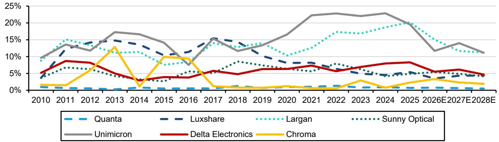

line chart

| Year   | Quanta | Luxshare | Largan | Sunny Optical | Unimicron | Delta Electronics | Chroma |
|--------|--------|----------|--------|---------------|-----------|-------------------|--------|
| 2010   | ~1%    | ~4%      | ~9%    | ~3%           | ~10%      | ~5%               | ~1%    |
| 2011   | ~1%    | ~8%      | ~14%   | ~6%           | ~13%      | ~8%               | ~1%    |
| 2012   | ~1%    | ~13%     | ~13%   | ~7%           | ~17%      | ~8%               | ~6%    |
| 2013   | ~1%    | ~14%     | ~12%   | ~5%           | ~18%      | ~6%               | ~13%   |
| 2014   | ~1%    | ~13%     | ~10%   | ~3%           | ~17%      | ~3%               | ~1%    |
| 2015   | ~1%    | ~12%     | ~8%    | ~4%           | ~14%      | ~4%               | ~10%   |
| 2016   | ~1%    | ~10%     | ~7%    | ~5%           | ~12%      | ~4%               | ~9%    |
| 2017   | ~1%    | ~15%     | ~14%   | ~6%           | ~15%      | ~5%               | ~1%    |
| 2018   | ~1%    | ~14%     | ~12%   | ~8%           | ~13%      | ~5%               | ~1%    |
| 2019   | ~1%    | ~12%     | ~10%   | ~9%           | ~12%      | ~6%               | ~1%    |
| 2020   | ~1%    | ~8%      | ~8%    | ~7%           | ~15%      | ~6%               | ~1%    |
| 2021   | ~1%    | ~8%      | ~10%   | ~6%           | ~22%      | ~6%               | ~1%    |
| 2022   | ~1%    | ~7%      | ~17%   | ~7%           | ~23%      | ~6%               | ~1%    |
| 2023   | ~1%    | ~6%      | ~17%   | ~6%           | ~22%      | ~7%               | ~3%    |
| 2024   | ~1%    | ~5%      | ~19%   | ~5%           | ~23%      | ~8%               | ~1%    |
| 2025E  | ~1%    | ~4%      | ~20%   | ~4%           | ~20%      | ~8%               | ~3%    |
| 2026E  | ~1%    | ~4%      | ~18%   | ~4%           | ~12%      | ~6%               | ~4%    |
| 2027E  | ~1%    | ~4%      | ~15%   | ~4%           | ~14%      | ~6%               | ~3%    |
| 2028E  | ~1%    | ~4%      | ~12%   | ~4%           | ~11%      | ~5%               | ~3%    |

Source: Bloomberg, Bernstein analysis and estimates

EXHIBIT 25: Luxshare has the highest Capex in 2025 within our coverage, followed by Delta  
Capex in 2025  
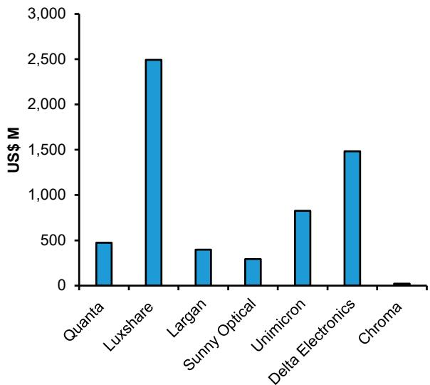

bar chart

| Company | Revenue (US$M) |
| :--- | :--- |
| Quanta | 480 |
| Luxshare | 2500 |
| Largan | 400 |
| Sunny Optical | 300 |
| Unimicron | 820 |
| Delta Electronics | 1500 |
| Chroma | 30 |

Source: Bloomberg, Bernstein analysis

EXHIBIT 26: Largan and Unimicron presented the highest D&A to revenue ratio as a result of substantial capex-intensity  
D&A as % of revenue in 2025  
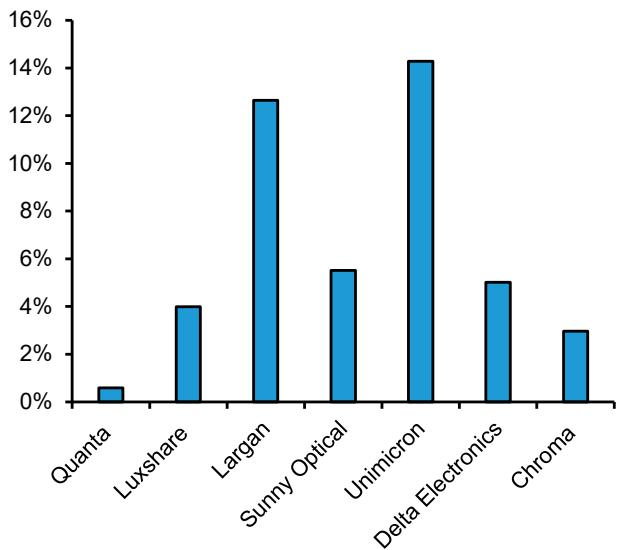

bar chart

| Company | Value (%) |
| :--- | :--- |
| Quanta | 0.5 |
| Luxshare | 4.0 |
| Largan | 12.5 |
| Sunny Optical | 5.5 |
| Unimicron | 14.2 |
| Delta Electronics | 5.0 |
| Chroma | 3.0 |

Source: Bloomberg, Bernstein analysis

EXHIBIT 27: The Lens sector demonstrates greater capex intensity compared to module sector, and Apple suppliers typically incur higher capex than Android suppliers  
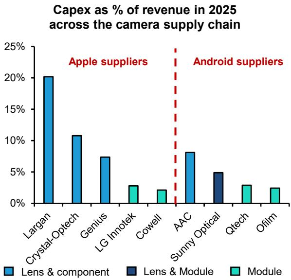

bar chart

Capex as % of revenue in 2025 across the camera supply chain
| Company | Lens & component (%) | Lens & Module (%) | Module (%) |
| :--- | :--- | :--- | :--- |
| Largan | 20.2 | | |
| Crystal-Optech | 10.8 | | |
| Genius | 7.4 | | |
| LG Innotek | | 2.8 | |
| Cowell | | 2.1 | |
| AAC | 8.2 | | |
| Sunny Optical | | 5.0 | |
| Qtech | | 3.0 | |
| Ofilm | | 2.5 | |

Source: Bloomberg, Bernstein analysis

## SHAREHOLDER RETURN

Geologically, Taiwanese companies typically have higher dividend payout ratios, while mainland China companies including Luxshare and Sunny Optical, tend to reserve more cash to fund future expansion and potential M&A, rather than paying out dividend. With the encouragement from regulators and the slowdown of business expansion, mainland China companies may increase the dividend pay-out ratio gradually in the future (Link). (Exhibit 28)

Among Taiwanese companies, Quanta has the highest dividend payout ratio, with Chroma second to it. When it comes to dividend yield, Quanta and Largan generate $>2\%$ dividend yield. For Largan, the TW\$119B cash on balance (nearly 2x of revenue) accounts for roughly one fourth of Largan's market capitalization, providing a safe cushion for investors. (Exhibit 29)

Compared to dividends, share buybacks are less favored by these companies. Over the past five years, only Sunny Optical, Luxshare and Largan announced share buyback plans during periods of low share prices, yet no companies in our Coverage have established regular share buyback policies. In particular, Largan has recently completed a buyback in 1Q26 as its share price hit a low level in Dec 2025.

EXHIBIT 28: Geologically, Taiwanese companies typically have higher dividend payout ratios than mainland China companies  
Dividend payout ratio  
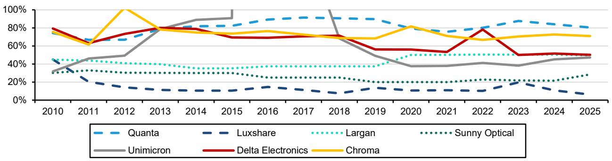

line chart

| Year | Quanta | Luxshare | Largan | Unimicron | Delta Electronics | Chroma |
|------|--------|----------|--------|-----------|-------------------|--------|
| 2010 | 70%    | 40%      | 45%    | 30%       | 80%               | 75%    |
| 2011 | 65%    | 35%      | 40%    | 45%       | 70%               | 60%    |
| 2012 | 75%    | 30%      | 40%    | 50%       | 75%               | 100%   |
| 2013 | 80%    | 25%      | 40%    | 80%       | 80%               | 80%    |
| 2014 | 85%    | 20%      | 40%    | 90%       | 80%               | 75%    |
| 2015 | 90%    | 15%      | 40%    | 95%       | 75%               | 70%    |
| 2016 | 85%    | 10%      | 40%    | 85%       | 75%               | 75%    |
| 2017 | 85%    | 10%      | 40%    | 85%       | 75%               | 75%    |
| 2018 | 85%    | 10%      | 40%    | 95%       | 75%               | 75%    |
| 2019 | 85%    | 10%      | 40%    | 70%       | 75%               | 75%    |
| 2020 | 80%    | 10%      | 45%    | 65%       | 75%               | 80%    |
| 2021 | 75%    | 10%      | 45%    | 60%       | 75%               | 75%    |
| 2022 | 80%    | 10%      | 45%    | 40%       | 80%               | 75%    |
| 2023 | 85%    | 15%      | 45%    | 40%       | 75%               | 75%    |
| 2024 | 85%    | 15%      | 45%    | 45%       | 75%               | 75%    |
| 2025 | 85%    | 10%      | 45%    | 45%       | 75%               | 75%    |

Source: Bloomberg, Bernstein analysis and estimates

EXHIBIT 29: Quanta and Largan generate >2% dividend yield  
Gross TTM dividend yield  
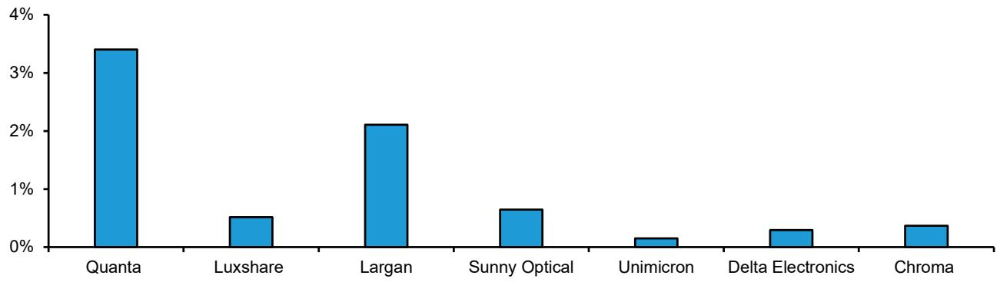

bar chart

| Company | Value (%) |
| :--- | :--- |
| Quanta | 3.4 |
| Luxshare | 0.5 |
| Largan | 2.1 |
| Sunny Optical | 0.6 |
| Unimicron | 0.1 |
| Delta Electronics | 0.2 |
| Chroma | 0.3 |

Source: Bloomberg, Bernstein analysis and estimates

## MODEL UPDATE

## CHROMA ATE (OP, PT=NT\$2,750.00)

All cylinders on fire in 2026-27. We forecast ATS revenue growth of 80% in 2026 and 45% in 2027, driven by surging AI datacenter power demand for PSU, BBU, and upcoming HVDC power rack testing. A strong recovery in China's ESS sector could further support power/battery tester growth, which will likely be classified under the overseas/subsidiary segment. Sales of ESS projets will likely be lumpy, and we believe the strong Apr-May monthly sales are partially attributed to this demand. For semi sector, robust demand from AI accelerators are photonics products remains a key growth driver. We expect AI SLT revenue to nearly triple in 2026 supported by Vera Rubin, AMD, and Google's new chips, lifting total SLT (auto + gaming) \~80% YoY. In 2027, next-generation SLT for Rubin Ultra and Google should drive record SLT sales. For metrology, strong capex guidance from TSMC and OSATs will likely double Chroma's metrology sales to \~NT\$3B in 2026 and NT\$5B in 2027, or 5-10% of company's revenue.

CPO revenue will commence in 2H26, and we expect it to contribute 7% of company revenue in 2027. Chroma offers a growing portfolio of CPO test systems, including PIC wafer testers (insertion 1), packaged optical engine tester (insertion 3) and testers for insertion 4 (Chroma focusing on optical I/O step). These systems combine automation, precise temperature control, and multi-channel optical/electrical measurement, and build on Chroma's long experience testing laser diodes and active optical components. Optical engine testers (insertion 3) will support pilot runs in 2H26, with meaningful revenue starting in 2027. For insertion 3 testers, we expect ASP is US\$1-1.5M. We expect CPO revenue will reach c. NT\$5B in 2027, or 7% of company's total revenue.

We project Chroma's sales / operating profit to grow at a 46% / 65% CAGR, respectively, over 2025-28. A higher AI revenue mix will likely sustain gross margins above 60%, with operating profit more than double this year, and further grew 35%+ CAGR in 2027-28. While EPS growth will likely appear softer due a one-off NT\$3.2B asset disposal gain in 3Q25, our 2026/2027 EPS forecasts remain above consensus. We kept our target P/E at 38x, applying this to average 2027-28 EPS estimate of NT \$72.4 (old 2027 EPS of NT\$43.7), we increase our price target to NT\$2,750 (from NT\$1660), Outperform.

EXHIBIT 30: Semi/Photonics represents \~40% of Chroma's revenue and Power tester represents \~55% (incl. the part under overseas & subsidiaries and Turnkey)  
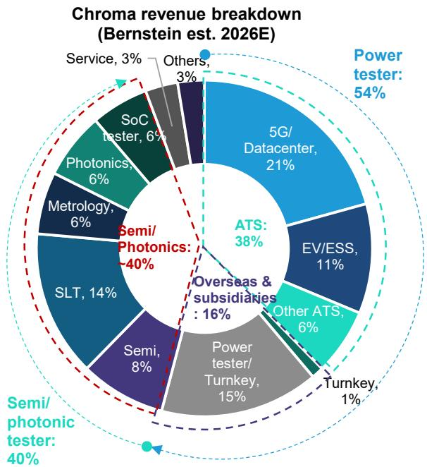

pie chart

Chroma revenue breakdown (Bernstein est. 2026E)
| Category | Percentage (%) |
| :--- | :--- |
| Power tester | 54 |
| 5G/ Datacenter | 21 |
| EV/ESS | 11 |
| Semi/ Photonics | -40 |
| Semi/ photonic tester | 40 |
| SEMI | 8 |
| Other ATS | 6 |
| Metrology | 6 |
| Photonics | 6 |
| SoC tester | 6 |
| Service | 3 |
| Others | 3 |
| Power tester/Turnkey | 15 |
| Overseas & subsidiaries | 16 |
ATS: 38
Total: 38
Note: The chart displays percentages for each category within a ring.

EXHIBIT 31: We expect Chroma's SLT revenue to grow by c.80% in 2026  
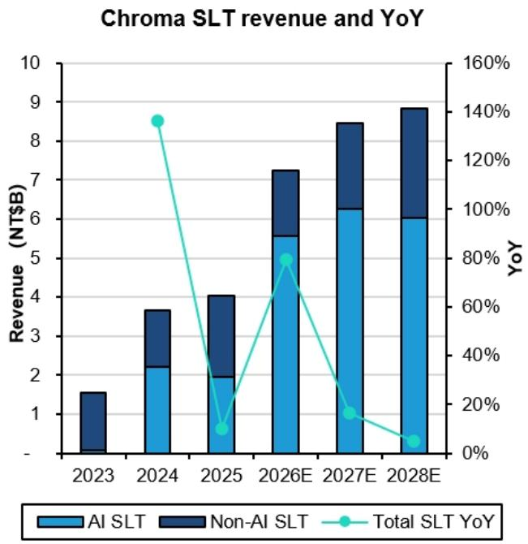

bar chart

| Year   | AI SLT | Non-AI SLT | Total SLT YoY |
|--------|--------|------------|---------------|
| 2023   | -      | 1.5        | -             |
| 2024   | 2.2    | 2.0        | 140%          |
| 2025   | 1.9    | 2.5        | 10%           |
| 2026E  | 5.5    | 2.5        | 80%           |
| 2027E  | 6.2    | 3.0        | 15%           |
| 2028E  | 6.0    | 3.5        | 5%            |

Company reports, Bernstein analysis and estimates  
Source: Company reports, Bernstein analysis and estimates

EXHIBIT 32: We expect robust demand from AI datacenter power and semi/photonic products will drive Chroma to grow topline at 46% in 2025-28  
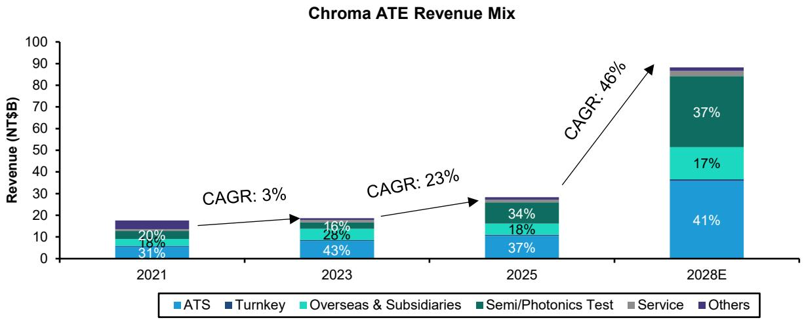

stacked bar chart

Chroma ATE Revenue Mix
| Year | Revenue (NT$B) | Segment | CAGR (%) |
| :--- | :--- | :--- | :--- |
| 2021 | 17 | ATS | 31 |
| 2021 | 18 | Turnkey | 20 |
| 2023 | 16 | Overseas & Subsidiaries | 28 |
| 2023 | 43 | ATS | 43 |
CAGR: 3% |
| 2025 | 23 | Semi/Photonics Test | 34 |
| 2025 | 18 | Overseas & Subsidiaries | 18 |
| 2025 | 37 | ATS | 37 |
CAGR: 46% |
| 2028E | 9 | Service | 4 |
| 2028E | 37 | Semi/Photonics Test | 37 |
| 2028E | 41 | ATS | 41 |
Others | 1 |
| 2028E | 1 | Service | 1 |
CAGR: 46%

Source: Company reports, Bernstein analysis and estimates

EXHIBIT 33: We project Chroma's revenue to grow at a 46% CAGR in 2025-28  
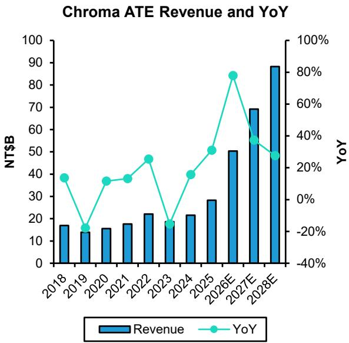

bar-line hybrid

Chroma ATE Revenue and YoY
| Year | Revenue (NT$B) | YoY (%) |
| :--- | :--- | :--- |
| 2018 | 17 | 38 |
| 2019 | 14 | -16 |
| 2020 | 15 | 16 |
| 2021 | 18 | 18 |
| 2022 | 22 | 46 |
| 2023 | 18 | -14 |
| 2024 | 21 | 39 |
| 2025 | 28 | 51 |
| 2026E | 50 | 80 |
| 2027E | 69 | 36 |
| 2028E | 88 | 27 |

Source: Company disclosure, Bernstein estimates and analysis

EXHIBIT 34: We model EPS to grow at 43% CAGR in 2025-28, driven by higher-margin AI related revenue  
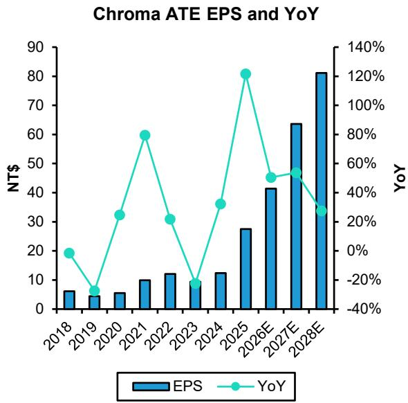

bar-line hybrid

Chroma ATE EPS and YoY
| Year | EPS (NT$) | YoY (%) |
| :--- | :--- | :--- |
| 2018 | 6 | 19 |
| 2019 | 5 | -24 |
| 2020 | 5 | 32 |
| 2021 | 10 | 60 |
| 2022 | 12 | 31 |
| 2023 | 9 | -11 |
| 2024 | 12 | 36 |
| 2025E | 27 | 120 |
| 2027E | 41 | 51 |
| 2028E | 81 | 30 |

Source: Company disclosure, Bernstein estimates and analysis

EXHIBIT 35: We model Chroma's revenue / EPS to grow at 46%/43% CAGR from 2025-28

<table><tr><td>Chroma Comparison Table</td><td>2025</td><td>2026E</td><td>2027E</td><td>2028E</td></tr><tr><td colspan="5">Revenue (NT$ B)</td></tr><tr><td>Bernstein Old</td><td></td><td>41.3</td><td>51.5</td><td></td></tr><tr><td>YoY</td><td></td><td></td><td>25%</td><td></td></tr><tr><td>Bernstein</td><td>28.3</td><td>50.4</td><td>69.2</td><td>88.3</td></tr><tr><td>YoY</td><td>31%</td><td>78%</td><td>37%</td><td>28%</td></tr><tr><td>Consensus</td><td></td><td>50.5</td><td>70.6</td><td>93.4</td></tr><tr><td>YoY</td><td></td><td>83%</td><td>40%</td><td>32%</td></tr><tr><td>New vs. old</td><td></td><td>22%</td><td>34%</td><td></td></tr><tr><td>BERN vs. consensus</td><td></td><td>0%</td><td>-2%</td><td>-6%</td></tr><tr><td colspan="5">GM</td></tr><tr><td>Bernstein Old</td><td></td><td>62.9%</td><td>63.4%</td><td></td></tr><tr><td>Bernstein</td><td>61.5%</td><td>63.7%</td><td>63.8%</td><td>61.9%</td></tr><tr><td>Consensus</td><td></td><td>63.3%</td><td>64.4%</td><td>64.9%</td></tr><tr><td>New vs. old</td><td></td><td>0.8%</td><td>0.3%</td><td></td></tr><tr><td>BERN vs. consensus</td><td></td><td>0.4%</td><td>-0.6%</td><td>-3.0%</td></tr><tr><td colspan="5">OPM</td></tr><tr><td>Bernstein Old</td><td></td><td>39.4%</td><td>41.3%</td><td></td></tr><tr><td>Bernstein</td><td>32.5%</td><td>43.4%</td><td>46.7%</td><td>46.6%</td></tr><tr><td>Consensus</td><td></td><td>41.3%</td><td>44.4%</td><td>46.5%</td></tr><tr><td>New vs. old</td><td></td><td>4.0%</td><td>5.4%</td><td>46.6%</td></tr><tr><td>BERN vs. consensus</td><td></td><td>2.1%</td><td>2.3%</td><td>0.1%</td></tr><tr><td colspan="5">Diluted EPS (NT$)</td></tr><tr><td>Bernstein Old</td><td></td><td>33.2</td><td>43.7</td><td></td></tr><tr><td>YoY</td><td></td><td></td><td>31%</td><td></td></tr><tr><td>Bernstein</td><td>27.5</td><td>41.4</td><td>63.6</td><td>81.1</td></tr><tr><td>YoY</td><td>122%</td><td>51%</td><td>54%</td><td>28%</td></tr><tr><td>Consensus</td><td></td><td>40.6</td><td>60.6</td><td>90.7</td></tr><tr><td>YoY</td><td></td><td>54%</td><td>49%</td><td>50%</td></tr><tr><td>New vs. old</td><td></td><td>25%</td><td>46%</td><td></td></tr><tr><td>BERN vs. consensus</td><td></td><td>2%</td><td>5%</td><td>-11%</td></tr></table>

EXHIBIT 36: Chroma is trading at 45x P/E  
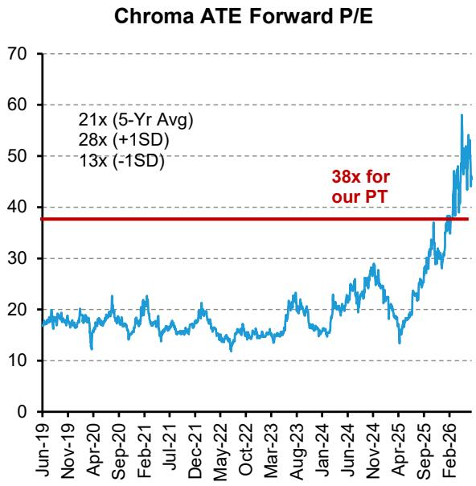

line chart

| Date     | P/E Multiple |
|----------|--------------|
| Jun-19   | 21x (5-Yr Avg) |
| Nov-19   | 28x (+1SD)   |
| Apr-20   | 13x (-1SD)   |
| Sep-20   | —            |
| Feb-21   | —            |
| Jul-21   | —            |
| Dec-21   | —            |
| May-22   | —            |
| Oct-22   | —            |
| Mar-23   | —            |
| Aug-23   | —            |
| Jan-24   | —            |
| Jun-24   | —            |
| Nov-24   | —            |
| Apr-25   | —            |
| Sep-25   | —            |
| Feb-26   | 38x for our PT |

Source: Bloomberg, Bernstein estimates and analysis  
Source: Company disclosure, Bloomberg, Bernstein estimates and analysis

EXHIBIT 37: Chroma is valued at 2.3x against TWSE  
Chroma ATE Relative P/E  
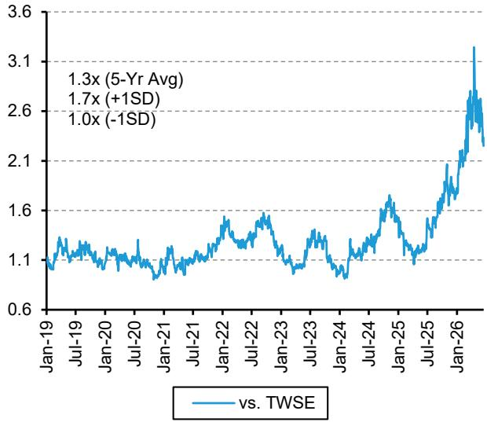

line chart

| Date    | Value |
|---------|-------|
| Jan-19  | 1.3x  |
| Jul-19  | 1.7x  |
| Jan-20  | 1.0x  |
| Jul-20  | 1.7x  |
| Jan-21  | 1.0x  |
| Jul-21  | 1.7x  |
| Jan-22  | 1.0x  |
| Jul-22  | 1.7x  |
| Jan-23  | 1.0x  |
| Jul-23  | 1.7x  |
| Jan-24  | 1.0x  |
| Jul-24  | 1.7x  |
| Jan-25  | 1.0x  |
| Jul-25  | 1.7x  |
| Jan-26  | 3.1x  |

Source: Bloomberg, Bernstein analysis

EXHIBIT 38: Chroma is valued at relatively higher P/E multiple vs. other Taiwanese equipment companies  
1BF P/E for Taiwanese Equipment Companies  
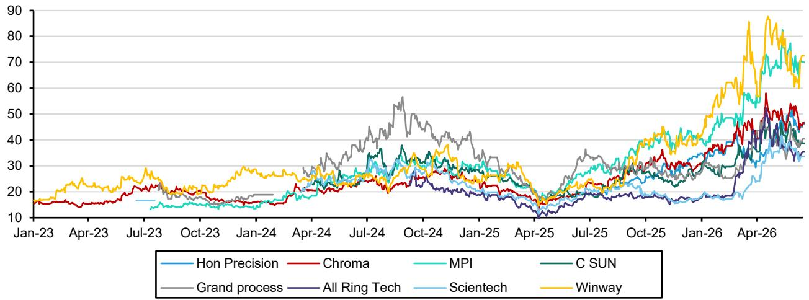

line chart

| Date | Hon Precision | Chroma | MPI | C SUN | Grand process | All Ring Tech | Scientech | Winway |
| --- | --- | --- | --- | --- | --- | --- | --- | --- |
| Jan-23 | ~15 | ~15 | ~15 | ~15 | ~15 | ~15 | ~15 | ~15 |
| Apr-23 | ~15 | ~15 | ~15 | ~15 | ~15 | ~15 | ~15 | ~20 |
| Jul-23 | ~15 | ~15 | ~15 | ~15 | ~15 | ~15 | ~15 | ~25 |
| Oct-23 | ~15 | ~15 | ~15 | ~15 | ~15 | ~15 | ~15 | ~20 |
| Jan-24 | ~15 | ~15 | ~15 | ~15 | ~15 | ~15 | ~15 | ~20 |
| Apr-24 | ~15 | ~15 | ~15 | ~15 | ~15 | ~15 | ~15 | ~20 |
| Jul-24 | ~15 | ~15 | ~15 | ~15 | ~15 | ~15 | ~15 | ~20 |
| Oct-24 | ~15 | ~15 | ~15 | ~15 | ~15 | ~15 | ~15 | ~20 |
| Jan-25 | ~15 | ~15 | ~15 | ~15 | ~15 | ~15 | ~15 | ~20 |
| Apr-25 | ~15 | ~15 | ~15 | ~15 | ~15 | ~15 | ~15 | ~20 |
| Jul-25 | ~15 | ~15 | ~15 | ~15 | ~15 | ~15 | ~15 | ~20 |
| Oct-25 | ~15 | ~15 | ~15 | ~15 | ~15 | ~15 | ~15 | ~20 |
| Jan-26 | ~15 | ~15 | ~15 | ~15 | ~15 | ~15 | ~15 | ~20 |
| Apr-26 | ~40 | ~40 | ~40 | ~40 | ~40 | ~40 | ~40 | ~80 |
| Jun-26 | ~40 | ~40 | ~40 | ~40 | ~40 | ~40 | ~40 | ~70 |
| Aug-26 | ~40 | ~40 | ~40 | ~40 | ~40 | ~40 | ~40 | ~60 |
| Oct-26 | ~40 | ~40 | ~40 | ~40 | ~40 | ~40 | ~40 | ~60 |
| Dec-26 | ~40 | ~40 | ~40 | ~40 | ~40 | ~40 | ~40 | ~60 |
| Dec-27 | ~40 | ~40 | ~40 | ~40 | ~40 | ~40 | ~40 | ~60 |
| Dec-28 | ~40 | ~40 | ~40 | ~40 | ~40 | ~40 | ~40 | ~60 |
| Dec-29 | ~40 | ~40 | ~40 | ~40 | ~40 | ~40 | ~40 | ~60 |
| Dec-30 | ~40 | ~40 | ~40 | ~40 | ~40 | ~40 | ~40 | ~60 |
| Dec-31 | ~40 | ~40 | ~40 | ~40 | ~40 | ~40 | ~40 | ~60 |
| Dec-32 | ~40 | ~40 | ~40 | ~40 | ~40 | ~40 | ~40 | ~60 |
| Dec-33 | ~40 | ~40 | ~40 | ~40 | ~40 | ~40 | ~40 | ~60 |
| Dec-34 | ~40 | ~40 | ~40 | ~40 | ~40 | ~40 | ~40 | ~60 |
| Dec-35 | ~40 | ~40 | ~40 | ~40 | ~40 | ~40 | ~40 | ~60 |
| Dec-36 | ~40 | ~40 | ~40 | ~40 | ~40 | ~40 | ~40 | ~60 |
| Dec-37 | ~40 | ~40 | ~40 | ~40 | ~40 | ~40 | ~40 | ~60 |
| Dec-38 | ~40 | ~40 | ~40 | ~40 | ~40 | ~40 | ~40 | ~60 |
| Dec-39 | ~40 | ~40 | ~40 | ~40 | ~40 | ~40 | ~40 | ~60 |
| Dec-40 | >30 | >30 | >30 | >30 | >30 | >30 | >30 | >30 |
| Dec-41 | >30 | >30 | >30 | >30 | >30 | >30 | >30 | >30 |
| Dec-42 | >30 | >30 | >30 | >30 | >30 | >30 | >30 | >30 |
| Dec-43 | >30 | >30 | >30 | >30 | >30 | >30 | >30 | >30 |
| Dec-44 | >30 | >30 | >30 | >30 | >30 | >30 | >30 | >30 |
| Dec-45 | >30 | >30 | >30 | >30 | >30 | >30 | >30 | >30 |
| Dec-46 | >30 | >30 | >30 | >30 | >30 | >30 | >30 | >30 |
| Dec-47 | >30 | >30 | >30 | >30 | >30 | >30 | >30 | >30 |
| Dec-48 | >30 | >30 | >30 | >30 | >30 | >30 | >30 | >30 |
| Dec-49 | >30 | >30 | >30 | >30 | >30 | >30 | >30 | >30 |
| Dec-50 | >30 | >30 | >30 | >30 | >30 | >30 | >30 | >30 |
| Dec-51 | >30 | >30 | >30 | >30 | >30 | >30 | >30 | >30 |
| Dec-52 | >30 | >30 | >30 | >30 | >30 | >30 | >30 | >30 |
| Dec-53 | >30 | >30 | >30 | >30 | >30 | >30 | >30 | >30 |
| Dec-54 | >30 | >30 | >30 | >30 | >30 | >30 | >30 | >30 |
| Dec-55 | >30 | >30 | >30 | >30 | >30 | >30 | >30 | >30 |

Source: Bloomberg and Bernstein analysis

## SUNNY OPTICAL (OP, PT=HK\$94.00)

We forecast Sunny Optical to deliver 12% revenue CAGR and 23% operating profit CAGR from 2025-2028, driven by handset share gains and structural growth in auto lenses and modules amid rising ADAS adoption. Compared with our prior model, we lower gross margin assumptions due to strong memory cost pressure in 2026. However, we raise 2027-28 revenue forecasts as we believe Sunny is likely to gain share in iPhone camera modules. We expect Apple to allocate part of its iPhone camera-module orders to Sunny, leveraging Sunny's advanced COB (chip-on-board) packaging, without imposing the heavy capex burden some investors fear. We expect corporate GM to recover by \~1ppt in 2027, supported by a richer mix of higher-margin auto and premium handset products and easing memory costs.

In communication optics (optical transceiver/CPO), Sunny has formed a dedicated team and appointed Dr. Gu Bo as CTO, an academician of the Canadian Academy of Engineering and Deputy Secretary-General of the Chinese Optical Society. We see the business at an early stage of product development and customer engagement, with further updates likely at the late-June Investor Day or 1H26 results in late August. (see more about CPO optical in deep dive of communication optics (CPO) market).

We estimate EPS to grow at a 19% CAGR through 2028 (excluding one-off RMB919m investment gain in 2025). Increasing target P/E to 18x from 17x on potential Apple camera module share gain and rolling valuation forward to 2027 EPS of RMB4.5 (vs. prior RMB3.9 based on 2026-27 average), we raise our price target to HK\$94 from HK\$76 (RMB/ HKD=1.16). Outperform. (Exhibit 39 - Exhibit 46)

EXHIBIT 39: We expect Sunny Optical to grow at 12% CAGR in 2025-28  
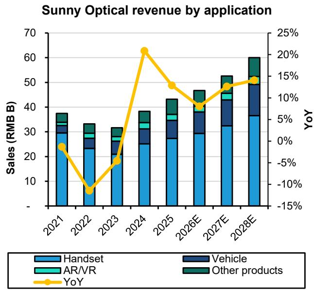

bar-line hybrid

Sunny Optical revenue by application
| Year | Handset (RMBB) | AR/VR (RMBB) | Vehicle (RMBB) | Other products (RMBB) | YoY (%) |
| :--- | :--- | :--- | :--- | :--- | :--- |
| 2021 | 30 | 2 | 3 | 7 | -2 |
| 2022 | 24 | 1 | 5 | 4 | -12 |
| 2023 | 19 | 2 | 6 | 5 | -5 |
| 2024 | 25 | 3 | 8 | 7 | 21 |
| 2025 | 28 | 3 | 10 | 10 | 13 |
| 2026E | 30 | 3 | 12 | 10 | 8 |
| 2027E | 33 | 3 | 14 | 10 | 13 |
| 2028E | 36 | 3 | 16 | 10 | 14 |

Source: Company reports, Bernstein analysis and estimates

EXHIBIT 40: We model Sunny Optical's GM to see slightly decline in 2026 due to memory price impact while to recover in 2027  
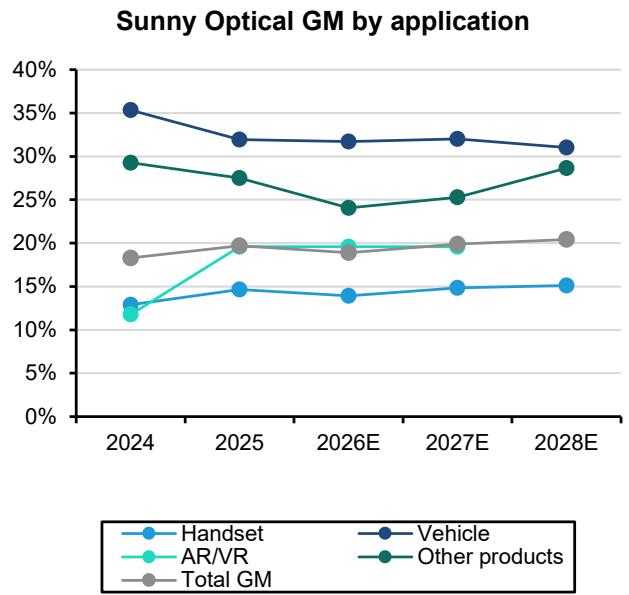

line chart

| Year   | Handset | Vehicle | AR/VR | Other products | Total GM |
|--------|---------|---------|-------|----------------|----------|
| 2024   | 13%     | 35%     | 12%   | 29%            | 18%      |
| 2025   | 14%     | 32%     | 20%   | 27%            | 19%      |
| 2026E  | 13%     | 32%     | 20%   | 24%            | 18%      |
| 2027E  | 14%     | 32%     | 19%   | 25%            | 19%      |
| 2028E  | 15%     | 31%     | 19%   | 28%            | 20%      |

Source: Company reports, Bernstein analysis and estimates

EXHIBIT 41: We expect Sunny Optical's handset module and overall GM to decline slightly in 2026 amid surging memory price, and to rebound in 2027 as memory price pressure easing  
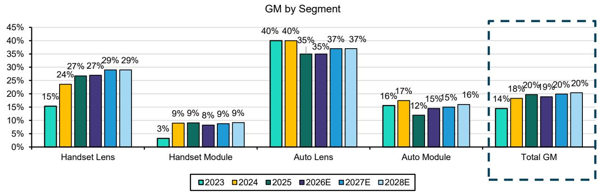

bar chart

GM by Segment
| Segment | 2023 (%) | 2024 (%) | 2025 (%) | 2026E (%) | 2027E (%) | 2028E (%) |
| :--- | :--- | :--- | :--- | :--- | :--- | :--- |
| Handset Lens | 15 | 24 | 27 | 27 | 29 | 29 |
| Handset Module | 3 | 9 | 9 | 8 | 9 | 9 |
| Auto Lens | 40 | 40 | 35 | 35 | 37 | 37 |
| Auto Module | 16 | 17 | 12 | 15 | 15 | 16 |
| Total GM | 14 | 18 | 20 | 19 | 20 | 20 |

Source: Company disclosure, Bernstein estimates and analysis

EXHIBIT 42: Overall we estimate Sunny Optical will achieve 12% revenue CAGR from 2025 to 2028...  
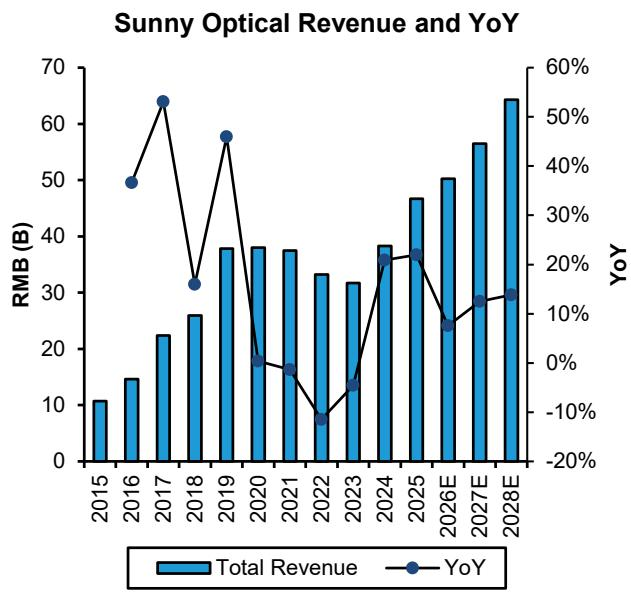

bar-line hybrid

Sunny Optical Revenue and YoY
| Year | Total Revenue (B) | YoY (%) |
| :--- | :--- | :--- |
| 2015 | 10.5 | 37.4 |
| 2016 | 14.9 | 51.4 |
| 2017 | 22.3 | 54.4 |
| 2018 | 26.1 | 31.6 |
| 2019 | 37.8 | 57.8 |
| 2020 | 38.0 | -1.4 |
| 2021 | 37.5 | -1.4 |
| 2022 | 33.3 | -11.6 |
| 2023 | 31.9 | -4.6 |
| 2024 | 38.3 | 21.6 |
| 2025 | 46.6 | 23.0 |
| 2026E | 50.3 | 6.4 |
| 2027E | 56.5 | 12.8 |
| 2028E | 64.4 | 13.4 |

Source: Company disclosure, Bernstein estimates and analysis

EXHIBIT 43: ... and have 10% EPS CAGR in EPS over the same period (2025 includes an one-off gain)  
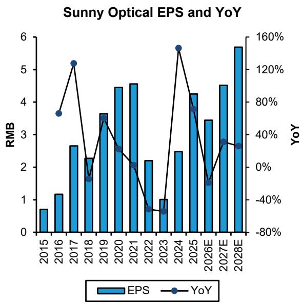

bar-line hybrid chart

Sunny Optical EPS and YoY
| Year | EPS (RMB) | YoY (%) |
| :--- | :--- | :--- |
| 2015 | 0.7 | 64 |
| 2016 | 1.2 | 73 |
| 2017 | 2.7 | 124 |
| 2018 | 2.3 | -19 |
| 2019 | 3.6 | 35 |
| 2020 | 4.5 | 25 |
| 2021 | 4.6 | 14 |
| 2022 | 2.2 | -33 |
| 2023 | 1.0 | -37 |
| 2024 | 2.5 | 156 |
| 2025 | 4.3 | 78 |
| 2026E | 3.5 | -19 |
| 2027E | 4.6 | 33 |
| 2028E | 5.7 | 31 |

Source: Company disclosure, Bernstein estimates and analysis

EXHIBIT 44: We expect Sunny Optical's GM to decline slightly in 2026 and rebound in 2027, with strong recovery of EPS in next year

<table><tr><td>Comparison Table</td><td>2025</td><td>2026E</td><td>2027E</td><td>2028E</td></tr><tr><td colspan="5">Revenue (RMB B)</td></tr><tr><td>Bernstein Old</td><td></td><td>46.6</td><td>50.7</td><td></td></tr><tr><td>YoY</td><td></td><td>8%</td><td>9%</td><td></td></tr><tr><td>Bernstein</td><td>43.2</td><td>46.7</td><td>52.6</td><td>60.0</td></tr><tr><td>YoY</td><td>13%</td><td>8%</td><td>13%</td><td>14%</td></tr><tr><td>Consensus</td><td></td><td>46.4</td><td>51.5</td><td>58.0</td></tr><tr><td>YoY</td><td></td><td>8%</td><td>11%</td><td>13%</td></tr><tr><td>New vs. old</td><td></td><td>0%</td><td>4%</td><td></td></tr><tr><td>BERN vs. consensus</td><td></td><td>1%</td><td>2%</td><td>3%</td></tr><tr><td colspan="5">GM</td></tr><tr><td>Bernstein Old</td><td></td><td>19.5%</td><td>21.1%</td><td></td></tr><tr><td>Bernstein</td><td>19.7%</td><td>18.9%</td><td>19.9%</td><td>20.4%</td></tr><tr><td>Consensus</td><td></td><td>19.7%</td><td>20.4%</td><td>21.0%</td></tr><tr><td>New vs. old</td><td></td><td>-0.6%</td><td>-1.2%</td><td></td></tr><tr><td>BERN vs. consensus</td><td></td><td>-0.8%</td><td>-0.5%</td><td>-0.5%</td></tr><tr><td colspan="5">OPM</td></tr><tr><td>Bernstein Old</td><td></td><td>8.3%</td><td>10.2%</td><td></td></tr><tr><td>Bernstein</td><td>8.1%</td><td>7.9%</td><td>9.6%</td><td>10.9%</td></tr><tr><td>Consensus</td><td></td><td>9.1%</td><td>9.9%</td><td>10.5%</td></tr><tr><td>New vs. old</td><td></td><td>-0.3%</td><td>-0.6%</td><td></td></tr><tr><td>BERN vs. consensus</td><td></td><td>-1.2%</td><td>-0.3%</td><td>0.4%</td></tr><tr><td colspan="5">EPS (RMB)</td></tr><tr><td>Bernstein Old</td><td></td><td>3.4</td><td>4.5</td><td></td></tr><tr><td>YoY</td><td></td><td>-20%</td><td>31%</td><td></td></tr><tr><td>Bernstein</td><td>4.2</td><td>3.4</td><td>4.5</td><td>5.7</td></tr><tr><td>YoY</td><td>71%</td><td>-19%</td><td>31%</td><td>26%</td></tr><tr><td>Consensus</td><td></td><td>3.8</td><td>4.4</td><td>5.3</td></tr><tr><td>YoY</td><td></td><td>11%</td><td>16%</td><td>22%</td></tr><tr><td>New vs. old</td><td></td><td>1%</td><td>1%</td><td></td></tr><tr><td>BERN vs. consensus</td><td></td><td>-9%</td><td>3%</td><td>7%</td></tr></table>

EXHIBIT 45: We set Sunny's target P/E at 18x  
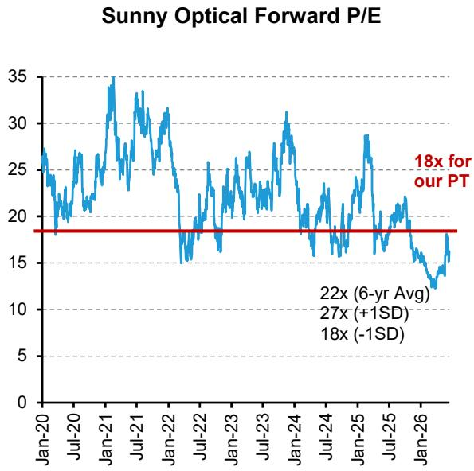

line chart

| Date    | Value |
|---------|-------|
| Jan-20  | 25.0  |
| Jul-20  | 20.0  |
| Jan-21  | 35.0  |
| Jul-21  | 30.0  |
| Jan-22  | 15.0  |
| Jul-22  | 25.0  |
| Jan-23  | 20.0  |
| Jul-23  | 25.0  |
| Jan-24  | 30.0  |
| Jul-24  | 15.0  |
| Jan-25  | 25.0  |
| Jul-25  | 20.0  |
| Jan-26  | 15.0  |

Source: Bloomberg, Bernstein estimates and analysis

EXHIBIT 46: Relative P/E against HSI index is at the lowest range compared to past 5 years  
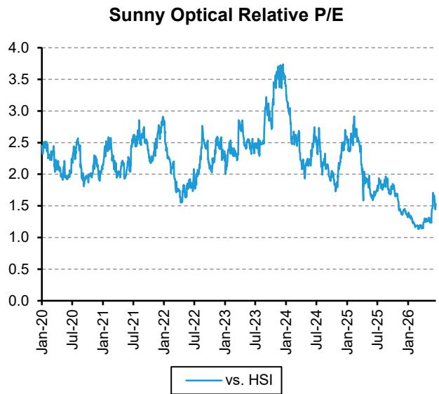

line chart

| Date   | vs. HSI |
|--------|---------|
| Jan-20 | 2.5     |
| Jul-20 | 2.0     |
| Jan-21 | 2.5     |
| Jul-21 | 2.8     |
| Jan-22 | 2.9     |
| Jul-22 | 1.6     |
| Jan-23 | 2.5     |
| Jul-23 | 3.0     |
| Jan-24 | 3.7     |
| Jul-24 | 2.8     |
| Jan-25 | 2.9     |
| Jul-25 | 1.8     |
| Jan-26 | 1.2     |

Source: Bloomberg and Bernstein analysis

## APPENDIX - FINANCIAL FORECASTS

EXHIBIT 47: Chroma ATE Financial Statements

<table><tr><td>TWD in Millions</td><td>2022</td><td>2023</td><td>2024</td><td>2025</td><td>2026E</td><td>2027E</td><td>2028E</td></tr><tr><td colspan="8">Income Statement</td></tr><tr><td>Net Sales</td><td>22,067</td><td>18,676</td><td>21,604</td><td>28,311</td><td>50,386</td><td>69,192</td><td>88,283</td></tr><tr><td>Gross Profit</td><td>11,357</td><td>10,757</td><td>12,746</td><td>17,425</td><td>32,080</td><td>44,129</td><td>54,661</td></tr><tr><td>SG&amp;A Expense</td><td>4,394</td><td>4,313</td><td>5,019</td><td>5,738</td><td>6,935</td><td>8,089</td><td>9,438</td></tr><tr><td>R&amp;D Expense</td><td>1,917</td><td>1,757</td><td>2,199</td><td>2,556</td><td>3,222</td><td>3,710</td><td>4,078</td></tr><tr><td>EBIT</td><td>5,039</td><td>4,673</td><td>5,482</td><td>9,197</td><td>21,864</td><td>32,330</td><td>41,145</td></tr><tr><td>EBITDA</td><td>5,723</td><td>5,420</td><td>6,257</td><td>10,038</td><td>22,788</td><td>33,369</td><td>42,363</td></tr><tr><td>Pretax Income</td><td>6,441</td><td>5,166</td><td>6,708</td><td>13,918</td><td>22,576</td><td>34,552</td><td>44,039</td></tr><tr><td>Tax</td><td>1,220</td><td>1,070</td><td>1,308</td><td>1,992</td><td>4,569</td><td>6,877</td><td>8,746</td></tr><tr><td>Net Income</td><td>5,106</td><td>3,979</td><td>5,264</td><td>11,692</td><td>17,625</td><td>27,087</td><td>34,543</td></tr><tr><td>Earnings Per Share (TWD) (Diluted)</td><td>12.1</td><td>9.4</td><td>12.4</td><td>27.5</td><td>41.4</td><td>63.6</td><td>81.1</td></tr><tr><td colspan="8">Margin Analysis</td></tr><tr><td>Gross Profit</td><td>51.5%</td><td>57.6%</td><td>59.0%</td><td>61.5%</td><td>63.7%</td><td>63.8%</td><td>61.9%</td></tr><tr><td>EBIT</td><td>22.8%</td><td>25.0%</td><td>25.4%</td><td>32.5%</td><td>43.4%</td><td>46.7%</td><td>46.6%</td></tr><tr><td>Net Income</td><td>23.1%</td><td>21.3%</td><td>24.4%</td><td>41.3%</td><td>35.0%</td><td>39.1%</td><td>39.1%</td></tr><tr><td colspan="8">Sequential Growth</td></tr><tr><td>Net Sales</td><td>25.5%</td><td>-15.4%</td><td>15.7%</td><td>31.0%</td><td>78.0%</td><td>37.3%</td><td>27.6%</td></tr><tr><td>Gross Profit</td><td>34.4%</td><td>-5.3%</td><td>18.5%</td><td>36.7%</td><td>84.1%</td><td>37.6%</td><td>23.9%</td></tr><tr><td>EBIT</td><td>63.9%</td><td>-7.3%</td><td>17.3%</td><td>67.8%</td><td>137.7%</td><td>47.9%</td><td>27.3%</td></tr><tr><td>Net Income</td><td>22.2%</td><td>-22.1%</td><td>32.3%</td><td>122.1%</td><td>50.7%</td><td>53.7%</td><td>27.5%</td></tr><tr><td>Earnings Per Share</td><td>21.8%</td><td>-22.3%</td><td>32.3%</td><td>121.6%</td><td>50.5%</td><td>53.7%</td><td>27.5%</td></tr><tr><td colspan="8">Balance Sheet</td></tr><tr><td>Cash and Cash Equivalents</td><td>5,942</td><td>4,132</td><td>4,099</td><td>6,222</td><td>11,358</td><td>15,994</td><td>25,639</td></tr><tr><td>Accounts Receivable</td><td>4,763</td><td>5,345</td><td>6,070</td><td>8,925</td><td>12,499</td><td>18,071</td><td>20,204</td></tr><tr><td>Inventory</td><td>4,753</td><td>4,675</td><td>5,458</td><td>7,919</td><td>10,204</td><td>16,605</td><td>20,366</td></tr><tr><td>Net Fixed Assets</td><td>7,018</td><td>7,170</td><td>6,956</td><td>7,232</td><td>8,061</td><td>9,331</td><td>11,058</td></tr><tr><td>Total Assets</td><td>33,829</td><td>33,482</td><td>37,308</td><td>47,150</td><td>60,514</td><td>80,735</td><td>99,257</td></tr><tr><td>Accounts Payable</td><td>1,657</td><td>1,190</td><td>778</td><td>1,133</td><td>1,578</td><td>2,413</td><td>2,863</td></tr><tr><td>Total Debt</td><td>3,189</td><td>3,126</td><td>3,526</td><td>3,318</td><td>3,272</td><td>4,730</td><td>5,490</td></tr><tr><td>Total Equity</td><td>21,873</td><td>22,517</td><td>25,450</td><td>32,563</td><td>33,817</td><td>48,274</td><td>63,251</td></tr><tr><td colspan="8">Cash Flow</td></tr><tr><td>Cash Flow From Operations</td><td>5,297</td><td>3,408</td><td>4,784</td><td>5,258</td><td>17,037</td><td>17,864</td><td>31,687</td></tr><tr><td>Cash Flow From Investments</td><td>902</td><td>(1,394)</td><td>(1,891)</td><td>1,428</td><td>(3,049)</td><td>(1,468)</td><td>(2,488)</td></tr><tr><td>Cash Flow From Financing</td><td>(3,471)</td><td>(3,832)</td><td>(2,997)</td><td>(4,548)</td><td>(8,875)</td><td>(11,760)</td><td>(19,555)</td></tr><tr><td>Capex</td><td>(689)</td><td>(1,621)</td><td>(2,005)</td><td>(2,301)</td><td>(1,677)</td><td>(2,303)</td><td>(2,938)</td></tr><tr><td>FCF</td><td>2,898</td><td>1,690</td><td>2,559</td><td>2,455</td><td>12,973</td><td>21,091</td><td>27,622</td></tr><tr><td>As % of EBITDA</td><td>51%</td><td>31%</td><td>41%</td><td>24%</td><td>57%</td><td>63%</td><td>65%</td></tr><tr><td colspan="8">Key Financial Metrics</td></tr><tr><td>ROE</td><td>25.6%</td><td>18.4%</td><td>22.5%</td><td>41.2%</td><td>54.5%</td><td>68.3%</td><td>64.3%</td></tr><tr><td>ROA</td><td>16.5%</td><td>12.2%</td><td>15.3%</td><td>28.2%</td><td>33.5%</td><td>39.2%</td><td>39.2%</td></tr><tr><td>Debt / Equity</td><td>14.6%</td><td>13.9%</td><td>13.9%</td><td>10.2%</td><td>9.7%</td><td>9.8%</td><td>8.7%</td></tr><tr><td>Net Debt / Equity</td><td>-13.5%</td><td>-4.5%</td><td>-2.4%</td><td>-10.0%</td><td>-24.4%</td><td>-27.4%</td><td>-36.1%</td></tr><tr><td>Debt / Capital</td><td>12.7%</td><td>12.2%</td><td>12.2%</td><td>9.2%</td><td>8.8%</td><td>8.9%</td><td>8.0%</td></tr><tr><td>Dividend Per Share (TWD)</td><td>7.2</td><td>8.3</td><td>6.7</td><td>9.3</td><td>20.7</td><td>31.2</td><td>47.9</td></tr><tr><td>Dividend Payout Ratio</td><td>72.7%</td><td>68.2%</td><td>70.9%</td><td>74.2%</td><td>75.0%</td><td>75.0%</td><td>75.0%</td></tr></table>

Source: Company reports, Bernstein analysis and estimates

EXHIBIT 48: Sunny Optical Financial Summary

<table><tr><td>RMB in Millions</td><td>2022</td><td>2023</td><td>2024</td><td>2025</td><td>2026E</td><td>2027E</td><td>2028E</td></tr><tr><td colspan="8">Income Statement</td></tr><tr><td>Net Sales</td><td>33,197</td><td>31,681</td><td>38,294</td><td>43,229</td><td>46,705</td><td>52,604</td><td>60,004</td></tr><tr><td>Gross Profit</td><td>6,605</td><td>4,590</td><td>7,006</td><td>8,516</td><td>8,830</td><td>10,467</td><td>12,253</td></tr><tr><td>SG&amp;A Expense</td><td>1,281</td><td>1,425</td><td>1,839</td><td>1,763</td><td>1,718</td><td>1,786</td><td>1,858</td></tr><tr><td>R&amp;D Expense</td><td>2,803</td><td>2,566</td><td>2,924</td><td>3,259</td><td>3,405</td><td>3,609</td><td>3,826</td></tr><tr><td>EBIT</td><td>2,520</td><td>599</td><td>2,243</td><td>3,494</td><td>3,707</td><td>5,071</td><td>6,569</td></tr><tr><td>EBITDA</td><td>4,400</td><td>2,547</td><td>4,344</td><td>5,726</td><td>5,769</td><td>7,229</td><td>8,826</td></tr><tr><td>Pretax Income</td><td>2,715</td><td>1,358</td><td>3,144</td><td>5,416</td><td>4,360</td><td>5,731</td><td>7,216</td></tr><tr><td>Tax</td><td>241</td><td>208</td><td>367</td><td>609</td><td>472</td><td>632</td><td>792</td></tr><tr><td>Net Income</td><td>2,408</td><td>1,099</td><td>2,699</td><td>4,639</td><td>3,761</td><td>4,933</td><td>6,214</td></tr><tr><td>Earnings Per Share (RMB) (Diluted)</td><td>2.2</td><td>1.0</td><td>2.5</td><td>4.2</td><td>3.4</td><td>4.5</td><td>5.7</td></tr><tr><td colspan="8">Margin Analysis</td></tr><tr><td>Gross Profit</td><td>19.9%</td><td>14.5%</td><td>18.3%</td><td>19.7%</td><td>18.9%</td><td>19.9%</td><td>20.4%</td></tr><tr><td>EBIT</td><td>7.6%</td><td>1.9%</td><td>5.9%</td><td>8.1%</td><td>7.9%</td><td>9.6%</td><td>10.9%</td></tr><tr><td>EBITDA</td><td>13.3%</td><td>8.0%</td><td>11.3%</td><td>13.2%</td><td>12.4%</td><td>13.7%</td><td>14.7%</td></tr><tr><td>Net Income</td><td>7.3%</td><td>3.5%</td><td>7.0%</td><td>10.7%</td><td>8.1%</td><td>9.4%</td><td>10.4%</td></tr><tr><td colspan="8">Sequential Growth</td></tr><tr><td>Net Sales</td><td>-11.5%</td><td>-4.6%</td><td>20.9%</td><td>12.9%</td><td>8.0%</td><td>12.6%</td><td>14.1%</td></tr><tr><td>Gross Profit</td><td>-24.4%</td><td>-30.5%</td><td>52.6%</td><td>21.6%</td><td>3.7%</td><td>18.5%</td><td>17.1%</td></tr><tr><td>EBIT</td><td>-50.2%</td><td>-76.2%</td><td>274.5%</td><td>55.8%</td><td>6.1%</td><td>36.8%</td><td>29.6%</td></tr><tr><td>Net Income</td><td>-51.7%</td><td>-54.3%</td><td>145.5%</td><td>71.9%</td><td>-18.9%</td><td>31.2%</td><td>26.0%</td></tr><tr><td>Earnings Per Share</td><td>-51.7%</td><td>-54.3%</td><td>146.3%</td><td>71.4%</td><td>-18.9%</td><td>31.2%</td><td>26.0%</td></tr><tr><td colspan="8">Balance Sheet</td></tr><tr><td>Cash and Cash Equivalents</td><td>7,033</td><td>13,085</td><td>4,509</td><td>7,482</td><td>8,113</td><td>8,336</td><td>8,473</td></tr><tr><td>Accounts Receivable</td><td>7,762</td><td>8,485</td><td>10,078</td><td>12,072</td><td>13,076</td><td>15,103</td><td>17,297</td></tr><tr><td>Inventory</td><td>4,721</td><td>5,137</td><td>5,870</td><td>7,180</td><td>7,822</td><td>8,890</td><td>10,132</td></tr><tr><td>Net Fixed Assets</td><td>10,120</td><td>9,927</td><td>10,525</td><td>9,818</td><td>10,278</td><td>10,750</td><td>11,493</td></tr><tr><td>Total Assets</td><td>43,001</td><td>50,297</td><td>53,807</td><td>59,215</td><td>61,099</td><td>65,643</td><td>70,857</td></tr><tr><td>Accounts Payable</td><td>12,927</td><td>20,336</td><td>21,035</td><td>22,001</td><td>21,669</td><td>22,000</td><td>22,081</td></tr><tr><td>Total Debt</td><td>2,020</td><td>5,562</td><td>5,826</td><td>3,176</td><td>3,333</td><td>3,746</td><td>4,275</td></tr><tr><td>Total Equity</td><td>22,182</td><td>22,882</td><td>25,293</td><td>29,764</td><td>31,525</td><td>34,769</td><td>38,776</td></tr><tr><td colspan="8">Cash Flow</td></tr><tr><td>Cash Flow From Operations</td><td>7,377</td><td>2,665</td><td>3,455</td><td>6,080</td><td>4,475</td><td>4,130</td><td>4,983</td></tr><tr><td>Cash Flow From Investments</td><td>(3,834)</td><td>(1,488)</td><td>(10,437)</td><td>(999)</td><td>(1,901)</td><td>(2,472)</td><td>(2,960)</td></tr><tr><td>Cash Flow From Financing</td><td>(2,159)</td><td>4,858</td><td>(1,574)</td><td>(2,094)</td><td>(1,943)</td><td>(1,435)</td><td>(1,887)</td></tr><tr><td>Depreciation &amp; Amortization</td><td>1,879</td><td>1,948</td><td>2,101</td><td>2,231</td><td>2,062</td><td>2,158</td><td>2,257</td></tr><tr><td>Capex</td><td>(3,047)</td><td>(2,245)</td><td>(2,084)</td><td>(2,894)</td><td>(2,522)</td><td>(2,630)</td><td>(3,000)</td></tr><tr><td>FCF</td><td>4,912</td><td>159</td><td>714</td><td>2,798</td><td>1,371</td><td>2,799</td><td>3,357</td></tr><tr><td>As % of EBITDA</td><td>112%</td><td>6%</td><td>16%</td><td>49%</td><td>24%</td><td>39%</td><td>38%</td></tr><tr><td colspan="8">Key Financial Metrics</td></tr><tr><td>ROE</td><td>11.4%</td><td>5.0%</td><td>11.4%</td><td>17.2%</td><td>12.5%</td><td>15.2%</td><td>17.2%</td></tr><tr><td>ROA</td><td>6.1%</td><td>2.5%</td><td>5.3%</td><td>8.5%</td><td>6.5%</td><td>8.0%</td><td>9.4%</td></tr><tr><td>Debt / Equity</td><td>9.1%</td><td>24.3%</td><td>23.0%</td><td>10.7%</td><td>10.6%</td><td>10.8%</td><td>11.0%</td></tr><tr><td>Net Debt / Equity</td><td>-22.6%</td><td>-32.9%</td><td>5.2%</td><td>-14.5%</td><td>-15.2%</td><td>-13.2%</td><td>-10.8%</td></tr><tr><td>Debt / Capital</td><td>8.3%</td><td>19.6%</td><td>18.7%</td><td>9.6%</td><td>9.6%</td><td>9.7%</td><td>9.9%</td></tr><tr><td>Dividend Per Share (RMB)</td><td>1.0</td><td>0.5</td><td>0.2</td><td>0.5</td><td>0.9</td><td>0.7</td><td>0.9</td></tr><tr><td>Dividend Payout Ratio</td><td>21.2%</td><td>21.0%</td><td>20.9%</td><td>20.3%</td><td>20.3%</td><td>20.3%</td><td>20.3%</td></tr></table>

Source: Company reports, Bernstein analysis and estimates

## I. REQUIRED DISCLOSURES

References to "Bernstein" or the "Firm" in these disclosures relate to the following entities: Bernstein Institutional Services LLC (April 1, 2024 onwards), Bernstein & Co., LLC (pre April 1, 2024), Bernstein Autonomous LLP, BSG France S.A. (April 1, 2024 onwards), Bernstein (Hong Kong) Limited 盛博香港有限公司, Bernstein (Canada) Limited, Bernstein (India) Private Limited (SEBI registration no. INH000006378), Bernstein (Singapore) Private Limited, Bernstein Japan KK (サンフォード・C・バーンスタイン株式会社) and analysts employed by SG Africa Technologies & Services to produce Bernstein under a Global Services Agreement in place between Bernstein and SG.

Bernstein is part of a joint venture between SG (SG) and AllianceBernstein, L.P. (AB). Unless specifically noted otherwise, for purposes of these disclosures, references to Bernstein's “affiliates” relate to both SG and AB and their respective affiliates.

## VALUATION METHODOLOGY

This research publication covers six or more companies. For valuation methodology and other company disclosures:

Please visit: https://bernstein-autonomous.bluematrix.com/sellside/Disclosures.action.

Or, you can also write to the Director of Compliance, Bernstein Institutional Services LLC, 245 Park Avenue, New York, NY 10167.

## RISKS

This research publication covers six or more companies. For risks and other company disclosures:

Please visit: https://bernstein-autonomous.bluematrix.com/sellside/Disclosures.action.

Or, you can also write to the Director of Compliance, Bernstein Institutional Services LLC, 245 Park Avenue, New York, NY 10167.

## RATINGS DEFINITIONS, BENCHMARKS AND DISTRIBUTION

## EQUITY RATINGS DEFINITIONS

## Bernstein brand

The Bernstein brand rates stocks based on forecasts of relative performance for the next 12 months versus the S&P 500 for stocks listed on the U.S. and Canadian exchanges, versus the Bloomberg Europe Developed Markets Large and Mid Cap Price Return Index EUR (EDME) for stocks listed on the European exchanges and emerging markets exchanges outside of the Asia Pacific region, versus the Bloomberg Japan Large and Mid Cap Price Return Index USD (JPL) for stocks listed on the Japanese exchanges, and versus the Bloomberg Asia ex-Japan Large and Mid Cap Price Return Index (ASIAX) for stocks listed on the Asian (ex-Japan) exchanges -unless otherwise specified.

The Bernstein brand has three categories of ratings:

- Outperform: Stock will outpace the market index by more than 15 pp  
• Market-Perform: Stock will perform in line with the market index to within +/-15 pp  
• Underperform: Stock will trail the performance of the market index by more than 15 pp

Coverage Suspended: Coverage of a company under the Bernstein brand has been suspended. Ratings and price targets are suspended temporarily, are no longer current, and should therefore not be relied upon.

Not Rated: A rating assigned when the stock cannot be accurately valued, or the performance of the company accurately predicted, at the present time. The covering analyst may continue to publish research reports on the company to update investors on events and developments.

Not Covered (NC) denotes companies that are not under coverage.

Bernstein brand stock ratings are based on a 12-month time horizon.

## Autonomous brand – common stocks

The Autonomous brand rates common stocks as indicated below. As our benchmarks we use the Bloomberg Europe 500 Banks And Financial Services Index (BEBANKS) and Bloomberg Europe Dev Mkt Financials Large and Mid Cap Price Ret Index EUR (EDMFI) index for developed European banks and Payments, the Bloomberg Europe 500 Insurance Index (BEINSUR) for European insurers, the S&P 500 and S&P Financials for US banks and Payments coverage, S5LIFE for US Insurance, the S&P Insurance Select Industry (SPSIINS) for US Non-Life Insurers coverage, and the Bloomberg Emerging Markets Financials Large, Mid and Small Cap Price Return Index (EMLSF) for emerging market banks and insurers and Payments. Ratings are stated relative to the sector (not the market).

The Autonomous brand has three categories of common stock ratings:

- Outperform (OP): Stock will outpace the relevant index by more than 10 pp  
- Neutral (N): Stock will perform in line with the market index to within +/-10 pp  
• Underperform (UP): Stock will trail the performance of the relevant index by more than 10 pp

Coverage Suspended: Coverage of a company under the Autonomous research brand has been suspended. Ratings and price targets are suspended temporarily, are no longer current, and should therefore not be relied upon.

Not Rated: A rating assigned when the stock cannot be accurately valued, or the performance of the company accurately predicted, at the present time. The covering analyst may continue to publish research reports on the company to update investors on events and developments.

Those denoted as ‘Feature’ (e.g., Feature Outperform FOP, Feature Under Outperform FUP) are our core ideas.

Not Covered (NC) denotes companies that are not under coverage.

Autonomous brand common stock ratings are based on a 12-month time horizon.

## Autonomous brand – preferred stocks

The Autonomous brand has three categories of preferred stock ratings:

- Outperform (OP): The total return of the preferred instrument is expected to outperform preferred securities of other issuers operating in similar sectors or rating categories over the next six months.  
- Neutral (N): The total return of the preferred instrument is expected to perform in line with preferred securities of other issuers operating in similar sectors or rating categories over the next six months.  
- Underperform (UP): The total return of the preferred instrument is expected to underperform preferred securities of other issuers operating in similar sectors or rating categories over the next six months.

Autonomous preferred stock ratings are based on a 6-month time horizon.

## AUTONOMOUS CREDIT RESEARCH

Where this report contains investment recommendations for credit instruments, as defined in article 3(1)(35) of the Market Abuse Regulation, the information below is presented to comply with its disclosure requirements.

The report may also include reference(s) to published opinions by other Autonomous or Bernstein analysts covering the equity securities of the issuer(s) referenced herein. Please note an investment recommendation for credit instruments published by the author(s) of this report may differ from the published view of the analyst covering equity securities for the issuer(s) contained in this report and vice versa.

## CREDIT RATINGS DEFINITIONS

The Autonomous brand has three categories of credit ratings:

\- Credit Outperform (C-OP): The total return of the Reference Credit Instrument is expected to outperform the credit spread of bonds of other issuers operating in similar sectors or rating categories over the next six months.

- Credit Neutral (C-N): The total return of the Reference Credit Instrument is expected to perform in line with the credit spread of bonds of other issuers operating in similar sectors or rating categories over the next six months.  
- Credit Underperform (C-UP): The total return of the Reference Credit Instrument is expected to underperform the credit spread of bonds of other issuers operating in similar sectors or rating categories over the next six months.

Autonomous credit ratings are based on a 6-month time horizon.

A list of all investment recommendations produced by the author(s) of this report alongside credit ratings history are available upon request.

It is at the sole discretion of the Firm as to when to initiate, update and cease research coverage. The Firm has established, maintains and relies on information barriers to control the flow of information contained in one or more areas (i.e. the private side) within the Firm, and into other areas, units, groups or affiliates (i.e. public side) of the Firm

DISTRIBUTION OF EQUITY RATINGS/INVESTMENT BANKING SERVICES

<table><tr><td>Equity Rating</td><td>Market Abuse Regulation (MAR) and FINRA Rating Category</td><td>Global Rating Distribution</td><td>Investment Banking Relationships*</td></tr><tr><td>Outperform</td><td>BUY</td><td>51.1%</td><td>16.5%</td></tr><tr><td>Market-Perform (Bernstein Brand) Neutral (Autonomous Brand)</td><td>HOLD</td><td>36.3%</td><td>17.8%</td></tr><tr><td>Underperform</td><td>SELL</td><td>12.6%</td><td>14.9%</td></tr></table>

\* These figures represent the percentage of companies within each equity rating category for which affiliates of Bernstein have provided investment banking services within the previous 12 months.
As of March 31, 2026. All figures are updated quarterly.

## PRICE CHARTS/ RATINGS AND PRICE TARGET HISTORY

This research publication covers six or more companies. For price chart and other company disclosures, please visit https://bernstein-autonomous.bluematrix.com/sellside/Disclosures.action or you can write to the Director of Compliance, Bernstein Institutional Services LLC, 245 Park Avenue, New York, NY 10167.

## OTHER MATTERS

The legal entity(ies) employing the analyst(s) listed in this report, and their location, can be determined by the country code of their phone number, as follows:

+1 Bernstein Institutional Services LLC; New York, New York, USA  
+44 Bernstein Autonomous LLP; London UK  
+212 SG Africa Technologies & Services; Casablanca, Morocco  
+33 BSG France S.A.; Paris, France  
+34 BSG France S.A.; Madrid, Spain  
+41 Bernstein Autonomous LLP; Geneva, Switzerland  
+49 BSG France S.A.; Frankfurt, Germany  
+91 Bernstein (India) Private Limited; Mumbai, India  
+852 Bernstein (Hong Kong) Limited 盛博香港有限公司; Hong Kong, China  
+65 Bernstein (Singapore) Private Limited; Singapore

+81 Bernstein Japan KK; Tokyo, Japan

Where this report has been prepared by research analyst(s) employed by a non-US affiliate, such analyst(s), is/are (unless otherwise expressly noted below) not registered as associated persons of Bernstein Institutional Services LLC or any other SEC-registered broker-dealer and are not licensed or qualified as research analysts with FINRA. Accordingly, such analyst(s) may not be subject to FINRA's restrictions regarding (among other things) communications by research analysts with a subject company, interactions between research analysts and investment banking personnel, participation by research analysts in solicitation and marketing activities relating to investment banking transactions, public appearances by research analysts, and trading securities held by a research analyst account.

Where this report has been prepared by research analyst(s) employed by SG Africa Technologies & Services (part of the SG group of companies), it has been prepared on behalf of a Bernstein company under a Global Services Agreement in place between Bernstein and SG.

## CERTIFICATION

Each research analyst listed in this report, who is primarily responsible for the preparation of the content of this report, certifies that all of the views expressed in this publication accurately reflect that analyst's personal views about any and all of the subject securities or issuers and that no part of that analyst's compensation was, is, or will be, directly or indirectly, related to the specific recommendations or views in this publication.

## II. ADDITIONAL GLOBAL CONFLICT DISCLOSURES

It is at the sole discretion of the Firm as to when to initiate, update and cease research coverage. The Firm has established, maintains and relies on information barriers to control the flow of information contained in one or more areas (i.e., the private side) within the Firm, and into other areas, units, groups or affiliates (i.e., public side) of the Firm.

## III. OTHER IMPORTANT INFORMATION AND DISCLOSURES

Separate branding is maintained for “Bernstein” and “Autonomous” research products.

- Bernstein produces a number of different types of research products including, among others, fundamental analysis and quantitative analysis under both the “Autonomous” and “Bernstein” brands. Recommendations contained within one type of research product may differ from recommendations contained within other types of research products, whether as a result of differing time horizons, methodologies or otherwise. Furthermore, views or recommendations within a research product issued under one brand may differ from views or recommendations under the same type of research product issued under the other brand. The Research Ratings System for the two brands and other information related to those Rating Systems are included in the previous section.  
- Autonomous operates as a separate business unit within the following entities: Bernstein Institutional Services LLC, Bernstein Autonomous LLP, Bernstein (Hong Kong) Limited 盛博香港有限公司 and Bernstein (India) Private Limited. For information relating to “Autonomous” branded products (including certain Sales materials) please visit: www.autonomous.com. For information relating to Bernstein branded products please visit: www.bernsteinresearch.com.

Analysts are compensated based on aggregate contributions to the research franchise as measured by account penetration, productivity and proactivity of investment ideas. No analysts are compensated based on performance in, or contributions to, generating investment banking revenues.

This report has been produced by an independent analyst as defined in Article 3 (1)(34)(i) of EU 596/2014 Market Abuse Regulation (“MAR”) and the same article of MAR as it forms part of United Kingdom domestic law by virtue of the European Union (Withdrawal) Act 2018.

To our readers in the United States: Bernstein Institutional Services LLC, a broker-dealer registered with the U.S. Securities and Exchange Commission (“SEC”) and a member of the U.S. Financial Industry Regulatory Authority, Inc. (“FINRA”) is distributing this publication in the United States and accepts responsibility for its contents. Where this material contains an analysis of debt product(s), such material is intended only for institutional investors and is not subject to the US independence and disclosure standards applicable to debt research prepared for retail investors.

Bernstein Institutional Services LLC may act as principal for its own account or as agent for another person (including an affiliate) in sales or purchases of any security which is a subject of this report. This report does not purport to meet the objectives or needs of any specific individuals, entities or accounts.

To our readers in Canada: If this publication pertains to a Canadian domiciled company, it is being distributed in Canada by Bernstein (Canada) Limited, which is licensed and regulated by the Canadian Investment Regulatory Organization. If the publication pertains to a non-Canadian domiciled company, it is being distributed by Bernstein Institutional Services LLC, which is licensed and regulated by both the SEC and FINRA, into Canada under the International Dealers Exemption.

This document may not be passed onto any person in Canada unless that person qualifies as "permitted client" as defined in Section 1.1 of NI 31-103.

To our readers in Brazil: This report has been prepared by Bernstein Institutional Services LLC, and Banco BTG Pactual S.A. ("BTG") is responsible for the distribution of this report in Brazil.

To readers in the United Kingdom: This publication has been issued or approved for issue in the United Kingdom by Bernstein Autonomous LLP, authorised and regulated by the Financial Conduct Authority and located at 60 London Wall, London EC2M 5SH, +44 (0)20-7170-5000. Registered in England & Wales No OC343985.

This document is for distribution only to persons who (i) have professional experience in matters relating to investments falling within Article 19(5) of the Financial Services and Markets Act 2000 (Financial Promotion) Order 2005 (as amended, the “Financial Promotion Order”), (ii) are persons falling within Article 49(2)(a) to (d) (“high net worth companies, unincorporated associations, etc.”) of the Financial Promotion Order, (iii) are outside the United Kingdom, or (iv) are persons to whom an invitation or inducement to engage in investment activity (within the meaning of section 21 of the FSMA) in connection with the issue or sale of any securities may otherwise lawfully be communicated or caused to be communicated (all such persons together being referred to as “relevant persons”). This document is directed only at relevant persons and must not be acted on or relied on by persons who are not relevant persons. Any investment or investment activity to which this document relates is available only to relevant persons and will be engaged in only with relevant persons.

To our readers in the member states of the EEA: This publication is being distributed by BSG France SA, which is authorised and regulated by the Autorité de Contrôle Prudentiel et de Résolution (ACPR) and Autorité des Marchés Financiers (AMF).

To our readers in Hong Kong: This publication is being distributed in Hong Kong by Bernstein (Hong Kong) Limited 盛博香港有限公司, which is licensed and regulated by the Hong Kong Securities and Futures Commission (Central Entity No. AXC846) to carry out Type 4 (Advising on Securities) regulated activities and subject to the licensing conditions mentioned in the SFC Public Register (https://www.sfc.hk/publicregWeb/corp/AXC846/details)). This publication is solely for professional investors, as defined in the Securities and Futures Ordinance (Cap. 571). The purpose of this report is solely to provide an analysis of the issuers referred to in this report and is not intended for any purpose contrary to the laws of Hong Kong.

To our readers in Singapore: This publication is being distributed in Singapore by Bernstein (Singapore) Private Limited, only to accredited investors or institutional investors, as defined in the Securities and Futures Act 2001 of Singapore ("SFA"). Recipients in Singapore should contact Bernstein (Singapore) Private Limited in respect of matters arising from, or in connection with, this publication. Bernstein (Singapore) Private Limited is regulated by the Monetary Authority of Singapore and licensed under the SFA as a capital markets services licence holder for dealing in capital markets products that are securities and collective investment schemes and an exempt financial adviser for advising on, issuing and promulgating analyses and reports on securities. Bernstein (Singapore) Private Limited is registered in Singapore with Company Registration No. 20213710W and located at 8 Marina Boulevard, #12-01, Marina Bay Financial Centre, Singapore 018981, +65-6326-7000.

To our readers in the People's Republic of China: The securities referred to in this document are not being offered or sold and may not be offered or sold, directly or indirectly, in the People's Republic of China (for such purposes, not including the Hong Kong and Macau Special Administrative Regions or Taiwan, the "PRC") in contravention of any applicable laws of the PRC.

This document does not constitute an offer to sell or the solicitation of an offer to buy any securities in the PRC to any person to whom it is unlawful to make the offer or solicitation in the PRC.

We do not represent that this document may be lawfully distributed, or that any securities may be lawfully offered, in compliance with any applicable registration or other requirements in the PRC, or pursuant to an exemption available thereunder, or assume any responsibility for facilitating any such distribution or offering. In particular, no action has been taken by us which would permit a public offering of any securities or distribution of this document in the PRC. Accordingly, the securities are not being offered or sold within the PRC by means of this document or any other document. Neither this document nor any advertisement or other offering material may be distributed or published in the PRC, except under circumstances that will result in compliance with any applicable laws and regulations.

To our readers in Japan: This publication is being distributed in Japan by Bernstein Japan KK (サンフォード・C・バーンスタイン株式会社), which is registered in Japan as a Financial Instruments Business Operator with the Kanto Local Finance Bureau (registration number: The Director-General of Kanto Local Finance Bureau (FIBO) No.3387) and regulated by the Financial Services Agency. It is also a member of Investment Management Association of Japan. This publication is solely for qualified institutional investors in Japan only, as defined in Article 2, paragraph (3), items (i) of the Financial Instruments and Exchange Act.

For the institutional client readers in Japan who have been granted access to the Bernstein website by Daiwa Group Inc. ("Daiwa"), your access to this document should not be construed as meaning that Bernstein is providing you with investment advice for any purposes. Whilst Bernstein has prepared this document, your relationship is, and will remain with, Daiwa, and Bernstein has neither any contractual relationship with you nor any obligations towards you.

To our readers in Australia: Bernstein (Hong Kong) Limited 盛博香港有限公司 is responsible for distributing research in Australia. It is regulated by the Securities and Exchange Commission under U.S. laws, by the Financial Conduct Authority under U.K. laws, which differs from Australian laws. Bernstein (Hong Kong) Limited 盛博香港有限公司 is exempt from the requirement to hold an Australian financial services license under the Corporations Act 2001 in respect of the provision of the following financial services to wholesale clients:

• providing financial product advice;  
• dealing in a financial product;  
- making a market for a financial product; and  
• providing a custodial or depository service.

To our readers in India: This publication is being distributed in India by Bernstein (India) Private Limited (SCB India) which is licensed and regulated by Securities and Exchange Board of India ("SEBI") as a research analyst entity under the SEBI (Research Analyst) Regulations, 2014, having registration no. INH000006378 and as a stock broker having registration no. INZ000213537. SCB India is currently engaged in the business of providing research and stock broking services. Please refer to www.bernsteinresearch.in for more information.

\- SCB India is a Private limited company incorporated under the Companies Act, 2013, on April 12, 2017 bearing corporate identification number U65999MH2017FTC293762, and registered office at Level 3A, 4th Floor, First International Financial Centre, Plot Nos C-54 and C-55, G Block, Near CBI Office, Bandra Kurla Complex, Bandra (East), Mumbai 400098, Maharashtra, India (Phone No: +91-22-68421401).

\- For details of Associates (i.e., affiliates/group companies) of SCB India, kindly email MUM-BERNSTEIN-InCompliance@bernsteinsg.com.

• SCB India does not have any disciplinary history as on the date of this report.

\- Except as noted above, SCB India and/or its Associates (i.e., affiliates/group companies), the Research Analysts authoring this report, and their relatives

• do not have any financial interest in the subject company  
• do not have actual/beneficial ownership of one percent or more in securities of the subject company;  
- is not engaged in any investment banking activities for Indian companies, as such;  
• have not managed or co-managed a public offering in the past twelve months for any Indian companies;

\- have not received any compensation for investment banking services or merchant banking services from the subject company in the past 12 months;

• have not received compensation for brokerage services from the subject company in the past twelve months;

\- have not received any compensation or other benefits from the subject company or third party related to the specific recommendations or views in this report; and

\- do not currently, but may in the future, act as a market maker in the financial instruments of the companies covered in the report.

\- do not have any conflict of interest in the subject company as of the date of this report.

- Except as noted above, the subject company has not been a client of SCB India during twelve months preceding the date of distribution of this research report. Neither SCB India nor its Associates (i.e., affiliates/group companies) have received compensation for products or services other than investment banking, merchant banking or brokerage services from the subject company in the past twelve months.  
- The principal research analyst(s) who prepared this report, members of the analysts' team, and members of their households are not an officer, director, employee or advisory board member of the companies covered in the report.  
- Our Compliance officer / Grievance officer is Ms. Rupal Talati, who can be reached at +91-22-68421451, or MUM-BERNSTEIN-InCompliance@bernsteinsg.com / Scbin-investorgrievance@bernsteinsg.com  
- The Research investor charter and Terms & Conditions of SCB India are available on its website and may be accessed at Bernstein (India) Private Limited (https://bernsteinresearch.in/) for your reference.  
- Disclaimer: Registration granted by SEBI, and certification from NISM, is in no way a guarantee of performance of the intermediary or provide any assurance of returns to investors. Investments in securities market are subject to market risks. Read all the related documents carefully before investing.

To our readers in Switzerland: This document is provided in Switzerland by or through Bernstein Autonomous LLP, and is provided only to qualified investors as defined in article 10 of the Swiss Collective Investment Scheme Act (“CISA”) and related provisions of the Collective Investment Scheme Ordinance and in strict compliance with applicable Swiss law and regulations. The products mentioned in this document may not be suitable for all types of investors. This document is based on the Directives on the Independence of Financial Research issued by the Swiss Bankers Association (SBA) in January 2008.

To our readers in the Middle East: Bernstein Autonomous LLP, DIFC branch has its principal office at Gate Village 06, DIFC, Dubai, UAE. Bernstein Autonomous LLP, DIFC branch is regulated by the Dubai Financial Services Authority (DFSA) with the registration number CL10040 and is provisioned for Arranging Deals in Investments and Advising on Financial Products. All communications and services are directed at Professional Clients and Market Counterparties only (as defined in the DFSA rulebook). Persons other than Professional Clients and Market Counterparties, such as Retail Clients, are not the intended recipients of our communications or services.

## LEGAL

All research publications are disseminated to our clients through posting on the firm's password protected websites, bernsteinresearch.com and autonomous.com. Certain, but not all, research publications are also made available to clients through third-party vendors or redistributed to clients through alternate electronic means as a convenience.

This publication has been published and distributed in accordance with the Firm's policy for management of conflicts of interest in investment research, a copy of which is available from Bernstein Institutional Services LLC, Director of Compliance, 245 Park Avenue, New York, NY 10167. Additional disclosures and information regarding Bernstein's business are available on our website www.bernsteinresearch.com.

The securities described herein may not be eligible for sale in all jurisdictions or to certain categories of investors where that permission profile is not consistent with the licenses held by the entities noted herein. This document is for distribution only as may be permitted by law. This publication is not directed to, or intended for distribution to or use by, any person or entity who is a citizen or resident of, or located in any locality, state, country or other jurisdiction where such distribution, publication, availability or use would be contrary to law or regulation or which would subject any of the entities referenced herein or any of their subsidiaries or affiliates to any registration or licensing requirement within such jurisdiction. This publication is based upon public sources we believe to be reliable, but no representation is made by us that the publication is accurate or complete. We do not undertake to advise you of any change in the reported information or in the opinions herein. This publication was prepared and issued by entity referred to herein for distribution to eligible counterparties or professional clients. This publication is not an offer to buy or sell any security, and it does not constitute investment, legal or tax advice. The investments referred to herein may not be suitable for you. Investors must make their own investment decisions in consultation with their professional advisors in light of their specific circumstances. The value of investments may fluctuate, and investments that are denominated in foreign currencies may fluctuate in value as a result of exposure to exchange rate movements. Information about past performance of an investment is not necessarily a guide to, indicator of, or assurance of, future performance.

This report is directed to and intended only for our clients who are “eligible counterparties”, “professional clients”, “institutional investors” and/or “professional investors” as defined by the aforementioned regulators, and must not be redistributed to retail clients as defined by the aforementioned regulators. Retail clients who receive this report should note that the services of the entities noted herein are not available to them and should not rely on the material herein to make an investment decision. The result of such act will not hold the entities noted herein liable for any loss thus incurred as the entities noted herein are not registered/ authorised/ licensed to deal with retail clients and will not enter into any contractual agreement/arrangement with retail clients. This report is provided subject to the terms and conditions of any agreement that the clients may have entered into with the entities noted herein. All research reports are disseminated on a simultaneous basis to eligible clients through electronic publication to our client portal.

The information in this report was prepared by Bernstein solely for the internal business use of our clients. Clients may store, display, analyze, reformat and print the information in this report for this limited use only. Clients may not copy, alter, create derivative works, resell, reverse engineer, commercially exploit, share or distribute any part of the information contained herein for any purpose without Bernstein's express written consent. These restrictions include extracting data or using the content to develop indices or other products. Further, you may not use this report, or any portion of this report, to train or finetune any third-party machine learning or artificial intelligence system, or as a prompt or input into any such system. You also may not, without Bernstein's express written consent, do any of the foregoing in connection with your own internal machine learning or artificial intelligence system.

Bernstein may use artificial intelligence tools in the preparation of its materials. Any such materials are reviewed by Bernstein's research analysts prior to publication.

This report has been prepared for information purposes only and is based on current public information that we consider reliable, but the entities noted herein do not warrant or represent (express or implied) as to the sources of information or data contained herein are accurate, complete, not misleading or as to its fitness for the purpose intended even though the entities noted herein rely on reputable or trustworthy data providers, it should not be relied upon as such. Opinions expressed are the author(s)' current opinions as of the date appearing on the material only and we do not undertake to advise you of any change in the reported information or in the opinions herein.

Any references to SG herein are purely factual, based upon publicly available information, and included for comparative purposes only. They do not constitute an opinion or recommendation with respect to the securities of SG.

This publication was prepared and issued by the entity referred to herein for distribution to eligible counterparties or professional clients. The information in this report is intended for general circulation and does not constitute an offer to buy or sell any security, investment, legal or tax advice nor a personal recommendation, as defined by any of the aforementioned regulators. It does not take into account the particular investment objectives, financial situations, or needs of individual investors. The report has not been reviewed by any of the aforementioned regulators and does not represent any official recommendation from the aforementioned regulators. The investments referred to herein may not be suitable for you. Investors must make their own investment decisions in consultation with advice sought from a financial adviser regarding the suitability of the investment product, taking into account the specific investment objectives, financial situation or particular needs of any recipient of the recommendation, before the recipient makes a commitment to purchase the investment product.

The analysis contained herein is based on numerous assumptions. Different assumptions could result in materially different results. The information in this report does not constitute, or form part of, any offer to sell or issue, or any offer to purchase or subscribe for shares, or to induce engagement in any other investment activity. The value of any securities or financial instruments mentioned in this report may fluctuate subject to market conditions. Information about past performance of an investment is not necessarily a guide to, indicative of, or assurance of future performance. Estimates of future performance mentioned by the research analyst in this report are based on assumptions that may not be realized due to unforeseen factors like market volatility/fluctuation. In relation to securities or financial instruments denominated in a foreign currency other than the clients' home currency, movements in exchange rates will have an effect on the value, either favorable or unfavorable. Before acting on any recommendations in this report, recipients should consider the appropriateness of investing in the subject securities or financial instruments mentioned in this report and, if necessary, seek independent professional advice.

The securities described herein may not be eligible for sale in all jurisdictions or to certain categories of investors where that permission profile is not consistent with the licenses held by the entities noted herein. This document is for distribution only as may be permitted by law. It is not directed to, or intended for distribution to or use by, any person or entity who is a citizen or resident of or located in any locality, state, country or other jurisdiction where such distribution, publication, availability or use would be contrary to law or regulation or would subject the entities noted herein to any regulation or licensing requirement within such jurisdiction.

Source: Bloomberg Index Services Limited. BLOOMBERG® is a trademark and service mark of Bloomberg Finance L.P. and its affiliates (collectively “Bloomberg”). Bloomberg or Bloomberg’s licensors own all proprietary rights in the Bloomberg Indices. Neither Bloomberg nor Bloomberg’s licensors approves or endorses this material, or guarantees the accuracy or completeness of any information herein, or makes any warranty, express or implied, as to the results to be obtained therefrom and, to the maximum extent allowed by law, neither shall have any liability or responsibility for injury or damages arising in connection therewith.

No part of this material may be reproduced, distributed or transmitted or otherwise made available without prior consent of the entities noted herein. Copyright Bernstein Institutional Services LLC Bernstein Autonomous LLP, BSG France S.A., Bernstein (Hong Kong) Limited 盛博香港有限公司, Bernstein (Canada) Limited, Bernstein (India) Private Limited (SEBI registration no. INH000006378), Bernstein (Singapore) Private Limited and Bernstein Japan KK (サンフォード・C・バーンスタイン株式会社). All rights reserved. The trademarks and service marks contained herein are the property of their respective owners. Any unauthorized use or disclosure is strictly prohibited. The entities noted herein may pursue legal action if the unauthorized use results in any defamation and/or reputational risk to the entities noted herein and research published under the Bernstein and Autonomous brands.