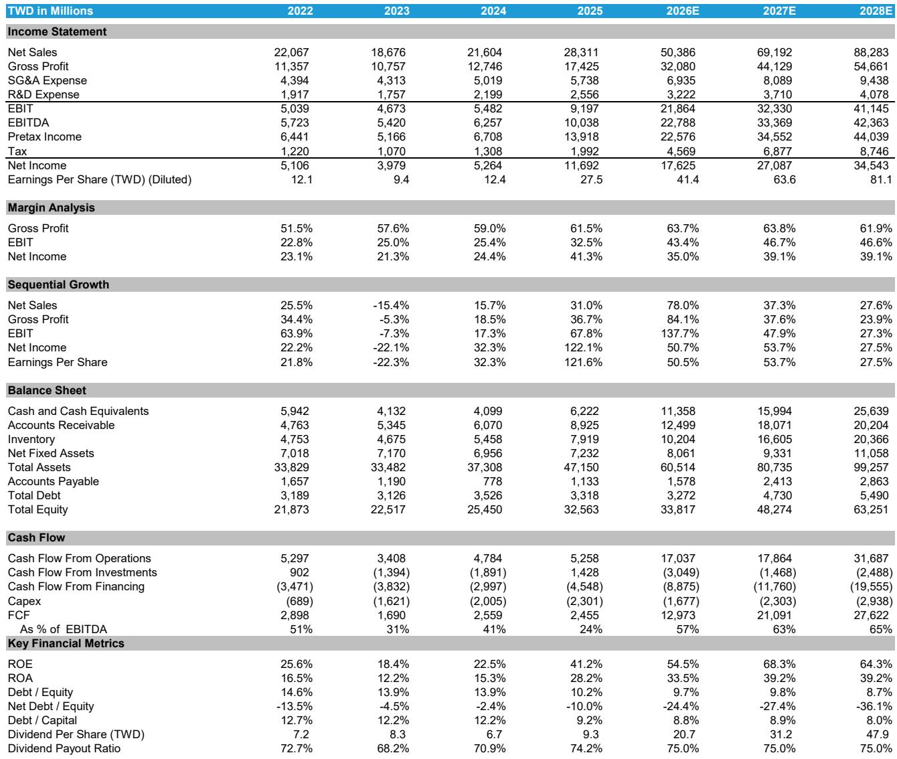
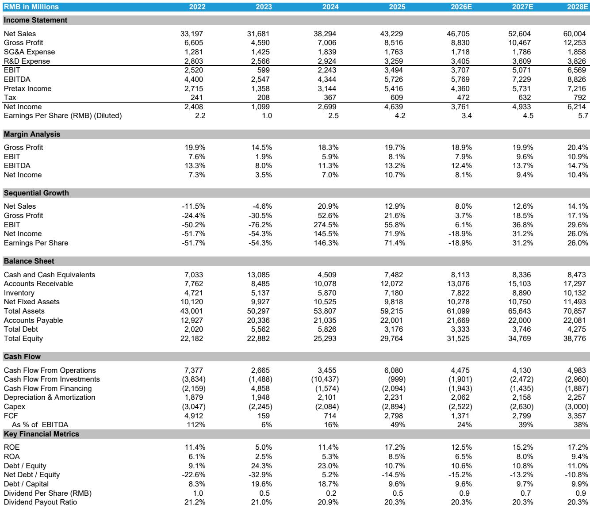
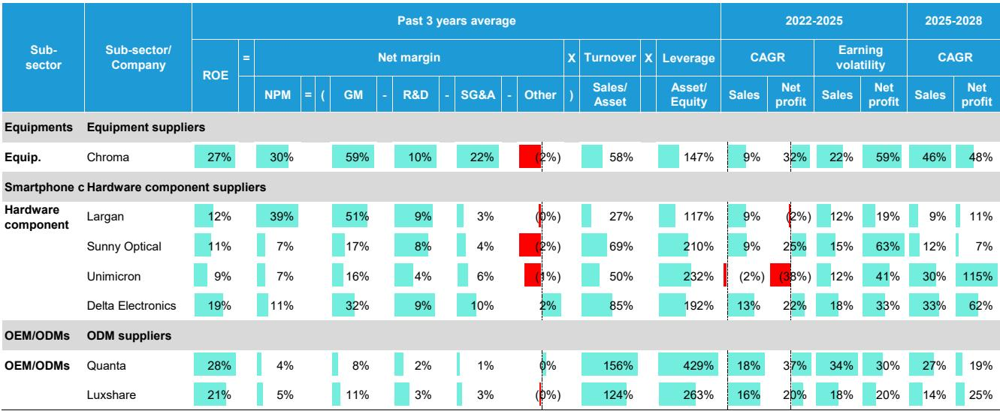

# Bernstein：亚洲硬件正在经历一轮由AI驱动的ROE结构性重定价

这份Bernstein研报的核心判断并不复杂，但它的支撑框架值得产业决策者和投资者仔细推敲：亚洲科技硬件公司正在经历一轮由AI需求驱动的ROE（净资产收益率）结构性上升周期，而市场对这一变化的定价，可能才刚刚开始。报告通过长达15年的资产负债表与现金流分析，揭示了不同细分赛道在盈利能力、资本效率和财务稳健性上的根本差异——这些差异在AI浪潮下正在被急剧放大。

报告覆盖的七家公司中，Chroma ATE、Delta Electronics、Unimicron等AI直接受益标的的ROE预计将在2026-2027年达到30%甚至40%以上，而消费电子相关公司（Luxshare、Largan、Sunny Optical）的改善则温和得多，仅能恢复到中双位数至低20%的水平。这不仅是增速差异，更是商业模式护城河的重新定价。

以下是我们从这份研报中提炼出的五个结构性洞察，以及一个报告尚未完全回答的关键问题。

## 1. 这轮ROE上升不是周期性的，而是由AI需求驱动的商业模式质变

报告最值得关注的一点，是它区分了“周期性反弹”和“结构性跃迁”。过去15年，亚洲硬件公司的ROE波动大多跟随全球PCB市场周期或消费电子换机周期。但当前这一轮上升，核心驱动力来自AI数据中心对测试设备、电源管理、散热方案和高端PCB的持续需求，而非库存回补或终端需求脉冲。

以Chroma ATE为例，其ROE从2024年的25%左右跃升至2026年预计的45%以上，背后是AI芯片测试、光收发器测试、以及AI数据中心电源测试三大业务的同时爆发。报告预计其2025-2028年营收和营业利润的复合年增长率分别达到46%和65%——这不是传统设备供应商能实现的增速，而是站在AI资本开支浪潮的浪尖上。

Delta Electronics同样如此。其ROE从2025年的24%左右预计上升至2026-2027年的40%以上，核心驱动是AI数据中心相关收入已占其总营收的约40%。这意味着，对于这些公司而言，AI不再是“增量业务”，而是正在成为“主干业务”。

对投资者的含义：传统上，市场对硬件公司的估值框架往往基于周期市盈率。但如果ROE的上升是结构性的，那么合理的估值中枢也应该上移。报告对Chroma给出了38倍市盈率的目标价，对Delta则没有明确给出倍数，但其隐含估值逻辑显然已经脱离了传统硬件公司的定价范式。

## 2. 杜邦分析揭示：高ROE的路径不止一条，但AI正在重塑每一条路径的权重

报告通过杜邦分析拆解了各公司的ROE驱动因素，结果极具启发性。

Chroma代表了“高利润率驱动”的模式：其近三年平均净利率约30%，远超同行。这得益于其定制化产品聚焦于利基市场，技术壁垒高、竞争强度低。它的资产周转率（58%）和杠杆率（147%）均处于中等水平，但净利率的绝对优势使其ROE达到27%。

Luxshare和Quanta则代表了另一条路：“高周转+高杠杆驱动”。作为ODM厂商，它们的净利率极低（Luxshare约3%，Quanta约2%），但资产周转率（Luxshare约140%，Quanta约200%）和权益乘数（Luxshare约300%，Quanta约400%）显著高于其他公司，从而实现了同样甚至更高的ROE。

Largan是一个有趣的对照案例。它的净利率高达约39%，与Chroma相当，但其资产周转率极低（约27%），且权益乘数也较低（约117%），导致ROE仅为12%左右。报告指出，这主要是因为Largan持有大量现金，且其高端镜头生产需要较高的资本投入（尤其是满足苹果的严格要求），导致资产效率偏低。

对投资者的含义：在AI需求爆发的背景下，不同ROE路径的可持续性正在被重新评估。高净利率模式（Chroma、Largan）的护城河更深，但增长天花板可能受限于细分市场空间。高周转模式（Luxshare、Quanta）的规模效应更强，但对运营效率和资本管理的要求极高，一旦AI服务器业务增速放缓，其ROE的弹性也会更大。投资者需要根据自身的风险偏好和持有周期，选择与ROE驱动因素相匹配的标的。

## 3. 资产负债表健康度并非铁板一块：Quanta的杠杆上升是一个值得警惕的信号

报告对覆盖公司的偿债能力和运营效率进行了详细分析，结论是整体健康，但存在结构性差异。

多数公司保持净现金状态，债务权益比率稳定或下降。现金转换周期普遍低于120天，反映了良好的运营效率和议价能力。但Quanta是一个例外。随着AI服务器业务的扩张，其杠杆率正在上升。报告给出的评级是“Underperform”，目标价250新台币，而当前股价为374新台币，隐含约33%的下行空间。

这一判断值得认真对待。Quanta是全球最大的PC ODM厂商，AI服务器组装业务正在成为其第二增长引擎。但问题在于，AI服务器业务的商业模式是“买进卖出”（buy-sell），即公司需要先垫付大量资金采购关键零部件（如GPU、内存等），再组装后交付给客户。这导致其报告营收大幅膨胀，但同时也带来了营运资金压力和杠杆率上升。报告指出，Quanta的营收波动性是覆盖公司中最高的，这正是买进卖出模式的直接后果。

对投资者的含义：在AI硬件投资热潮中，营收增速和订单能见度往往是最受关注的指标。但资产负债表的变化同样重要。Quanta的案例提醒我们，当一家公司的业务模式从“轻资产代工”向“重资产采购+组装”转变时，其财务风险特征也会随之改变。投资者需要关注现金流、杠杆率和营运资本效率，而不仅仅是营收和利润表。

## 4. PCB供应链的ROE图谱揭示了一个尚未被充分定价的结构性差异

报告对PCB供应链的ROE分析特别值得关注。日本企业在PCB原材料领域占据主导地位，但其ROIC（投入资本回报率）并未因此显著领先。报告认为，这可能是因为它们的AI收入占比仍然有限。

与此同时，服务器相关PCB厂商（如Elite、Gold Circuit、WUS、Victory Giant，这些公司不在Bernstein的覆盖范围内）显示出更高的ROIC。这表明，在AI驱动的PCB需求上升周期中，能够直接切入AI服务器供应链的厂商正在获得更高的资本回报率。

Unimicron是Bernstein覆盖的PCB供应商，其ROE经历了剧烈的周期性波动——从2010-2016年的低迷，到2021-2022年ABF载板短缺时的爆发，再到2023-2024年的回落。报告预计，随着ABF载板市场在2025年下半年重新趋紧（受AI加速器和CPU需求双重驱动），Unimicron的ROE将从2025年的7%左右回升至2027年的25%以上。

对投资者的含义：PCB行业的ROE分化正在加剧。能够切入AI供应链的公司，正在获得显著高于同行的资本回报率。但报告也暗示了一个尚未完全展开的问题：日本原材料企业的低ROIC是否意味着它们在AI供应链中的议价能力正在被侵蚀？如果答案是肯定的，那么整个PCB供应链的价值分配格局可能正在发生根本性变化。

## 5. 报告尚未完全回答的关键问题：AI资本开支的可持续性与ROE的峰值位置

这份报告最大的价值在于提供了详实的历史数据和清晰的财务框架，但它也留下了一个关键问题：AI驱动的ROE上升周期能持续多久？峰值在哪里？

报告对Chroma给出了到2028年的营收和利润预测，隐含的ROE将超过60%。对Delta的ROE预测也达到40%以上。这些数字在历史维度上是极为罕见的——过去15年，覆盖公司中没有任何一家能够长期维持40%以上的ROE。即使是Largan在2014-2015年智能手机黄金期，其ROE峰值也仅在50%左右，且随后迅速回落。

那么，这轮AI驱动的ROE上升是否会打破历史规律？答案取决于两个变量：一是AI资本开支的可持续性，二是竞争格局的变化。

从资本开支角度看，报告本身提供了一些线索。全球PCB市场在2025-2028年预计将保持增长，但增速从2025年的16%逐步放缓至2028年的6%。这意味着，行业整体需求并非无限增长。AI相关需求可能是其中增长最快的部分，但即使如此，随着基数的扩大，增速放缓是必然的。

从竞争格局看，报告指出Chroma的高ROE得益于其定制化产品和利基市场定位。但高利润率本身会吸引竞争者进入，尤其是在AI测试设备这个快速增长的细分市场。如果竞争加剧导致价格压力上升，Chroma的利润率能否维持高位，是一个需要持续跟踪的问题。

对投资者的含义：当前市场对AI硬件公司的定价，可能隐含了ROE持续上升甚至维持高位的假设。但历史表明，高ROE公司往往面临均值回归的压力。投资者需要密切关注AI资本开支的边际变化、竞争格局的演进以及各公司应对这些变化的战略调整。这些因素将决定当前的高ROE是结构性跃迁，还是周期性峰值。

## 顺着这些未解问题，我们可以继续深入

这份Bernstein报告的价值，不仅在于它提供了详实的数据和清晰的框架，更在于它揭示了亚洲科技硬件行业正在经历的结构性变化。但正如我们上面所讨论的，真正的投资判断往往来自于对未解问题的持续追问：AI资本开支的拐点何时到来？高ROE的可持续性如何验证？不同商业模式在周期下行时的韧性有何差异？

这些问题的答案，无法在一份研报中完全展开。它们需要持续的跟踪、多维度的数据交叉验证，以及不同市场参与者之间的讨论碰撞。如果你对这些话题感兴趣，欢迎来我们的知识星球和微信群继续讨论。我们会定期分享对关键变量的跟踪分析、对市场定价偏差的识别，以及对未解问题的深度拆解。这里没有标准答案，只有持续逼近真相的讨论。

Personal reading notes and learning share only. Not investment advice.

