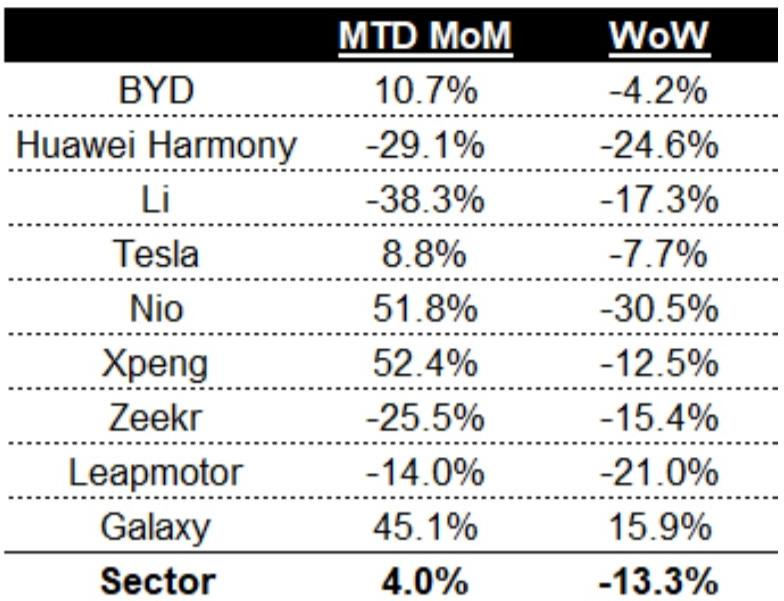
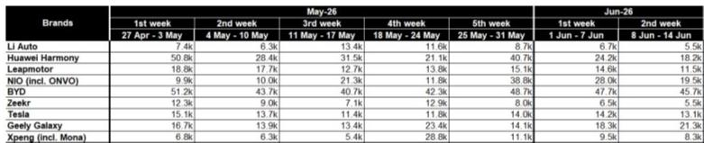

# Citi：市场低估的不是需求疲软，而是供给端策略的结构性拐点

这份来自Citi的周度订单追踪报告，表面上是在讨论6月第二周电动车订单环比下降13%的短期波动。但如果只读到“需求不及预期”就停下，就错过了这份报告真正有价值的判断。

真正值得关注的，不是订单数字本身，而是Citi在报告后半段提出的一个推演：如果中国政府满足于出口增长来对冲内需疲弱，不再加码消费刺激，那么车企将被迫放弃过去几年的激进策略——这意味着市场格局、价格战烈度、成本控制逻辑，都将进入一个与过去三年完全不同的阶段。

订单波动是表象，供给端策略的系统性调整才是内核。而市场对这个内核的定价，目前仍不充分。

## 1. 周度订单的“不及预期”本身不是新闻，但结构信号值得拆解

Citi数据显示，6月第二周（6月8日至14日）行业整体订单环比下降13%，半月累计环比增长仅4%，远低于历史同期10%的月环比增速。单独看这个数字，很容易得出“需求走弱”的简单结论。

但Citi的观察框架不止于此。报告指出，4月燃油车销量崩盘之后，新能源车需求其实并未显著受益于燃油车用户转化，而是维持了自身相对平坦的节奏。换句话说，新能源车需求并没有变差，它只是没有变好——而市场此前隐含的预期是“应该变好”。

更值得关注的是品牌间的分化。半月环比来看，小鹏（+52%）、蔚来（+52%）、吉利银河（+45%）、比亚迪（+11%）跑赢行业；但周度环比来看，只有比亚迪（-4%）和吉利银河（+16%）保持了相对稳定，其余品牌周度波动显著放大。

这种分化意味着什么？订单的稳定性正在成为比订单绝对值更重要的竞争维度。比亚迪和吉利银河的订单波动最小，说明它们的用户心智占据和渠道效率已经形成了某种“抗干扰”能力。而蔚来、小鹏尽管半月环比亮眼，但周度环比大幅下滑，暗示订单更多来自促销或新车型脉冲，而非稳定的自然流入。

## 2. Citi真正的核心判断：政府刺激缺位将迫使车企放弃“烧钱换份额”模式

这份报告最有价值的洞察，出现在Citi对下半年政策情景的推演中。

Citi提出一个关键假设：如果中国政府认为强劲的整车出口增长足以弥补国内需求疲弱，从而不再推出大规模消费刺激，那么车企将不得不调整过去几年“不惜代价抢份额”的激进策略。具体而言，Citi预期将出现三个变化：

第一，市场整合将变得温和而渐进，而非剧烈出清。这意味着过去那种“今年不赢就出局”的叙事需要修正——不是没有整合，而是整合的速度和烈度都会下降。

第二，价格战策略将趋于软化。不是不打价格战，而是降价幅度和频率都会收敛。车企会意识到，在缺乏政策催化的环境下，降价对需求的拉动边际递减，反而加速利润损耗。

第三，成本控制将变得前所未有的严格。2026下半年到2027年，车企的核心KPI将从“份额增长”转向“单位经济性改善”。

这三个变化合在一起，指向一个判断：过去三年“烧钱换份额”的竞争模式，正在接近尾声。而市场对“竞争格局改善”的定价，目前仍停留在预期阶段，尚未反映到估值中。

## 3. 数据背后的二阶效应：订单稳定性正在成为新的竞争壁垒

Citi提供的订单数据表格中，有一个容易被忽视的信号：品牌间的订单波动率正在系统性分化。

以比亚迪为例，5月至6月七周订单量分别为51.2k、43.7k、40.7k、42.3k、48.7k、47.7k、45.7k，周度波动幅度在15%以内。吉利银河的周度波动也相对可控。相比之下，蔚来、小鹏、华为鸿蒙等品牌的周度波动幅度可达30%-50%。

订单稳定性背后反映的是三重能力：品牌认知的牢固程度、渠道网络的覆盖深度、以及产品矩阵的宽度。当一个品牌能够在不依赖单款爆品或短期促销的情况下，持续吸引稳定的周度订单流入，说明它已经建立起了某种“需求基础设施”。

这个指标的产业含义是：在行业从“增量竞赛”转向“存量博弈”的过程中，订单稳定性高的企业将拥有更强的定价权和更低的营销费用率。而订单波动大的企业，要么依赖新品脉冲，要么依赖促销刺激，两者都不可持续。

Citi报告没有直接展开这一点，但数据本身已经提供了线索。

## 4. 报告尚未完全回答的关键问题：出口能否真正对冲内需缺口

Citi的判断建立在“政府可能不再加码刺激”这个情景假设之上。但这个假设本身存在一个需要验证的前提：出口增长能否持续且足够强劲地弥补国内需求的不足。

报告提到了“strong PV export growth”，但没有给出具体的出口数据或趋势判断。这里存在几个未解问题：

第一，出口的增长是否可持续？如果主要出口市场（如欧洲、东南亚）出现贸易壁垒或需求放缓，出口的支撑力就会减弱。

第二，出口的利润结构如何？如果出口以低价车型为主，即使量增长，对车企利润表的贡献也有限。

第三，政府是否会因为就业压力或消费数据进一步走弱而改变态度？Citi的“满足于出口”假设是一种情景推演，而非确定性判断。

这几个问题决定了Citi推演的三个变化（温和整合、价格战软化、成本控制强化）是否真的会发生，以及发生的节奏和幅度。如果出口不及预期或国内消费进一步恶化，政府刺激重回视野，那么竞争格局的改善逻辑可能被推迟甚至逆转。

## 5. 对投资者的观察框架：从“谁在增长”转向“谁在稳定”

基于Citi这份报告的信号，一个更务实的分析框架应该是：放弃对“谁增长最快”的追逐，转向对“谁最稳定”的评估。

具体而言，可以从三个维度来构建观察清单：

第一，订单稳定性指标。关注周度订单的波动率，而非月度总量的高低。波动率越低，说明品牌对促销和脉冲的依赖越小。

第二，成本控制能力。在价格战软化的假设下，成本控制能力将直接转化为利润弹性。关注单车折旧摊销、研发费用率、以及供应链管理效率。

第三，出口的利润贡献。如果出口是支撑内需缺口的核心变量，那么车企的出口产品结构和定价能力，将决定其能否在“温和整合”阶段获得超额利润。

这三个维度合在一起，可以帮助投资者区分哪些企业是在“烧钱抢份额”，哪些企业是在“稳健建壁垒”。Citi报告的数据虽然有限，但已经提供了这个分析框架的起点。

## 6. 顺着这些未解问题，我们可以继续深挖

Citi这份周度订单报告的价值，不在于它告诉了你6月第二周订单是多少，而在于它提出了一个值得认真对待的情景：如果政策不变，行业竞争逻辑将发生结构性转变。

但这个情景能否兑现，取决于出口的持续性、政策的态度、以及车企自身对成本控制的执行力。这些变量目前都还没有定论。Citi的推演是合理的，但远非确定的。

如果你对这些问题感兴趣——比如出口数据的真实支撑力、各品牌订单稳定性的定量比较、以及成本控制能力的拆解——欢迎来我们的星球微信群里继续讨论。我们会基于完整报告和更多一手数据，一起推演这个“温和整合”情景的置信度，以及哪些标的在这个情景下最受益。

Personal reading notes and learning share only. Not investment advice.

