你是财经类 AI Podcast 制作人，擅长把研报内容改写成中文、英文两条独立的访谈式播客脚本。

【目标】
- 基于下面研报解析内容，写两份 podcast 脚本：一份中文，一份英文。
- 每份目标时长约 5 分钟。
- 两份都要是“访谈聊天式”，不是单人念稿。
- 听感：像一位主持人和一位研究员围绕报告做深度但自然的讨论。
- 不要使用 emoji。
- 不要把全文讲完，要留下 1-2 个“完整报告里会继续展开”的悬念。

【输出格式必须严格遵守】
- 中文部分只能使用 `ZH_A:` 和 `ZH_B:` 开头。
- 英文部分只能使用 `EN_A:` 和 `EN_B:` 开头。
- 每一句独立成行。
- 不要输出 Markdown 标题。
- 不要输出舞台说明、音效说明或括号注释。
- 先输出完整中文脚本，再输出完整英文脚本。

【角色设定】
- A 是主持人：负责提问、转场、替听众追问“所以这意味着什么”。
- B 是研究员：负责解释报告逻辑、给出结构化判断和保留悬念。
- 两个角色必须频繁轮换，避免一个人连续说超过 3 句。
- 每句要适合 TTS 朗读：短句、自然、不要太书面。

【中文脚本结构】
1. 开场：A 用一个问题引出报告价值，B 给出主判断。
2. 第一部分：这份报告真正要回答的问题是什么。
3. 第二部分：2-3 个关键洞察，每个洞察都要有“这意味着什么”。
4. 第三部分：哪些问题仍然没有完全展开，为什么值得继续读完整报告。
5. 结尾：自然引导听众加入社群/阅读完整报告，不要硬广。

【英文脚本结构】
- 英文不是中文逐句翻译，而是面向英文听众重新组织。
- 保留同样的主线和洞察，但表达更口语、更 podcast。
- Use natural conversational English.
- Avoid long sentences and avoid reading like a research memo.

【内容边界】
- 可以基于研报内容做适度发散，但必须是从原文逻辑推出的判断。
- 不要编造具体数据、公司动作或引用。
- 对不确定内容要用“这里仍需要继续验证”或 “the report does not fully answer this yet” 表达。
- 默认避免出现具体投行品牌名，比如“GS”“GS”，统一写作“投行研报”或 “a global investment bank report”。

【研报解析内容】
"""
17 Jun 2026 05:00:00 ET | 20 pages

# US Semiconductor Equipment

\$250B Reasons to Stay Long; Lifting PTs on AMAT, LRCX, & KLAC

## CITI'S TAKE

We update our bull case WFE to \$145B/\$200B/\$250B in 2026/27/28, align AMAT/LRCX/KLAC estimates to our revised WFE model, and lift PTs to \$710/\$450/\$290 respectively as we roll forward our price targets based on CY28 earnings powers. Incrementally, we are bullish on NAND equipment demand as a widening gap between required DRAM and available supply helps adoption of complementary solutions such as KV cache off-loading.

Introducing 2028 WFE of \$250B — We update our top-down WFE analysis for 2026/2027, and introduce 2028 WFE forecasts based on Citi's updated hyperscaler capex model of 84%/56%/38% growth in CY26/27/28. We now see bull case WFE of \~\$145Bn/\$200Bn/\$250Bn in 2026/27/28, implying another solid 25% growth in 2028. We are more constructive on 2028 WFE given continued capacity constraints and expansion at both TSMC and memory makers, as well as recent progress at Intel and Samsung foundries.

DRAM Bottleneck is Good for NAND Demand — The rise of agentic AI is driving a structural increase in NAND demand as memory requirements surge and DRAM supply tightens. Multi-step inference workflows are dramatically expanding KV cache footprints, pushing total memory requirements well beyond what high-cost HBM and DRAM can efficiently support, especially in an environment of constrained DRAM supply and elevated pricing. This pressure is already driving architectural trade-offs, as evidenced by report that Nvidia has reduced SoCAMM2 DRAM capacity in its Vera Rubin NVL72 systems by roughly 50% due to supply limitations and cost considerations (see note). This underscores a widening gap between required and available memory, and we are seeing companies accelerating the adoption of complementary solutions as a result, such as KV cache offloading where intermediate model state is shifted to lower-cost, higher-capacity storage tiers. Assuming a modern 150k wspm NAND fab can do \~15EB per year, implies we need 2-4 new greenfield fabs or \$20-40Bn capex, or \$15-\$30Bn NAND WFE to overcome DRAM bottlenecks.

## Atif Malik $^{AC}$

+1-415-951-1892

atif.malik@citi.com

Elizabeth Sun, CFA

+1-212-816-3308

elizabeth.sun@citi.com

<table><tr><td rowspan="2" colspan="6"></td><td rowspan="2" colspan="2">Rating</td><td rowspan="3">Short-Term View</td><td rowspan="2" colspan="2">Target Price</td><td colspan="5">Current Fiscal Year</td><td colspan="2">Next Fiscal Year</td><td></td></tr><tr><td colspan="5">EPS</td><td colspan="2">EPS</td><td></td></tr><tr><td>Company</td><td>Ticker</td><td>Ccy</td><td>Price</td><td>Mkt Cap (M)</td><td>Date &amp; Time</td><td>Old</td><td>New</td><td>Old</td><td>New</td><td>ESPR (%)</td><td>Div Yld (%)</td><td>ETR (%)</td><td>Last Rpt Yr</td><td>Old</td><td>New</td><td>Old</td><td>New</td></tr><tr><td>Applied Materials</td><td>AMAT</td><td>US$</td><td>568.23</td><td>451,152</td><td>16 Jun 16:00</td><td>1</td><td>nc</td><td>-</td><td>550.00</td><td>710.00</td><td>24.9</td><td>0.3</td><td>25.2</td><td>Oct-25</td><td>13.58</td><td>nc</td><td>16.54</td><td>nc</td></tr><tr><td>KLA Corp</td><td>KLAC</td><td>US$</td><td>237.33</td><td>310,018</td><td>16 Jun 16:00</td><td>1</td><td>nc</td><td>-</td><td>206.40</td><td>290.00</td><td>22.2</td><td>0.3</td><td>22.5</td><td>Jun-25</td><td>3.69</td><td>nc</td><td>4.99</td><td>nc</td></tr><tr><td>Lam Research</td><td>LRCX</td><td>US$</td><td>369.34</td><td>461,886</td><td>16 Jun 16:00</td><td>1</td><td>nc</td><td>-</td><td>315.00</td><td>450.00</td><td>21.8</td><td>0.4</td><td>22.2</td><td>Jun-25</td><td>5.65</td><td>nc</td><td>7.63</td><td>7.69</td></tr></table>

1 = Buy, 2 = Neutral, 3 = Sell, H = High Risk  
Source: Citi  
ESPR = Expected Share Price Return, ETR = Expected Total Return, nc = no change  
^Catalyst Watch

Earnings Estimates

<table><tr><td colspan="4"></td><td colspan="4">Last Reported Year</td><td></td><td colspan="4">Current Fiscal Year</td><td></td><td colspan="4">Next Fiscal Year</td><td></td></tr><tr><td>Company Name</td><td>Ticker</td><td>Last Rpt Year</td><td>Currency</td><td>1Q</td><td>2Q</td><td>3Q</td><td>4Q</td><td>FY0</td><td>1Q</td><td>2Q</td><td>3Q</td><td>4Q</td><td>FY1</td><td>1Q</td><td>2Q</td><td>3Q</td><td>4Q</td><td>FY2</td></tr><tr><td>Applied Materials</td><td>AMAT</td><td>Oct-25</td><td>US$</td><td>2.38</td><td>2.54</td><td>2.85</td><td>2.82</td><td>10.58</td><td>2.96</td><td>3.70</td><td>3.36</td><td>3.56</td><td>13.58</td><td>3.61</td><td>3.96</td><td>4.37</td><td>4.60</td><td>16.54</td></tr><tr><td>KLA Corp</td><td>KLAC</td><td>Jun-25</td><td>US$</td><td>0.73</td><td>0.64</td><td>0.84</td><td>0.94</td><td>3.15</td><td>0.88</td><td>0.88</td><td>0.94</td><td>0.99</td><td>3.69</td><td>1.10</td><td>1.21</td><td>1.29</td><td>1.39</td><td>4.99</td></tr><tr><td>Lam Research</td><td>LRCX</td><td>Jun-25</td><td>US$</td><td>0.86</td><td>0.91</td><td>1.04</td><td>1.33</td><td>4.13</td><td>1.26</td><td>1.27</td><td>1.47</td><td>1.65</td><td>5.65</td><td>1.73</td><td>1.81</td><td>1.99</td><td>2.16</td><td>7.69</td></tr><tr><td>Old</td><td></td><td>Jun-25</td><td>US$</td><td>0.86</td><td>0.91</td><td>1.04</td><td>1.33</td><td>4.13</td><td>1.26</td><td>1.27</td><td>1.47</td><td>1.65</td><td>5.65</td><td>1.73</td><td>1.81</td><td>1.98</td><td>2.11</td><td>7.63</td></tr><tr><td colspan="19">Source: Citi</td></tr></table>

## Lifting TPs on AMAT, LRCX, & KLAC

## Updated Top-down WFE

We update our top-down WFE analysis for 2026/2027, and introduce 2028 WFE forecasts based on Citi's updated hyperscaler capex model of 84%/56%/38% growth in CY26/27/28. We now see bull case WFE of \~\$145Bn/\$200Bn/\$250Bn in 2026/27/28, implying another solid 25% growth in 2028. We are now more constructive on 2028 WFE given continued capacity constraints and expansion at both TSMC and memory makers, as well as recent progress at Intel and Samsung foundries. On the foundry side, in addition to the news on Terafab (see our prior note), Intel foundry is gaining traction at Google and Apple at various capacities, and Samsung is reported to be accelerating Taylor fab and working with Google TPU v10 on memory I/O die at 2nm, as well as in discussion with BYD on 2nm and 4nm autonomous driving chips. The capacity expansion plans and incremental customers engagement at Samsung/Intel all bode well for WFE, and the semi cap companies have been adding capacity for the past few years and will continue to do so to ensure they do not become a bottleneck for the industry.

Figure 1. WFE reaching \$200Bn/\$250Bn in CY27/28

<table><tr><td colspan="9">Base</td></tr><tr><td>WFE Mix</td><td>2025</td><td>2026 Growth</td><td>WFE 2026E</td><td>2027 Growth</td><td>WFE 2027E</td><td>2028 Growth</td><td>WFE 2028E</td><td>2028 WFE Mix</td></tr><tr><td>AI</td><td>$35</td><td>84%</td><td>$65</td><td>56%</td><td>$101</td><td>38%</td><td>$139</td><td>65%</td></tr><tr><td>China</td><td>$36</td><td>0%</td><td>$36</td><td>0%</td><td>$36</td><td>0%</td><td>$36</td><td>17%</td></tr><tr><td>Non-AI</td><td>$39</td><td>0%</td><td>$39</td><td>0%</td><td>$39</td><td>0%</td><td>$39</td><td>18%</td></tr><tr><td>Total WFE $b</td><td>$110</td><td>27%</td><td>$139</td><td>26%</td><td>$176</td><td>22%</td><td>$214</td><td></td></tr><tr><td colspan="9">Bull</td></tr><tr><td>WFE Mix</td><td>2025</td><td>2026 Growth</td><td>WFE 2026E</td><td>2027 Growth</td><td>WFE 2027E</td><td>2028 Growth</td><td>WFE 2028E</td><td>2028 WFE Mix</td></tr><tr><td>AI</td><td>$35</td><td>94%</td><td>$68</td><td>66%</td><td>$113</td><td>48%</td><td>$167</td><td>66%</td></tr><tr><td>China</td><td>$36</td><td>5%</td><td>$38</td><td>5%</td><td>$40</td><td>5%</td><td>$42</td><td>17%</td></tr><tr><td>Non-AI</td><td>$39</td><td>5%</td><td>$41</td><td>5%</td><td>$43</td><td>5%</td><td>$45</td><td>18%</td></tr><tr><td>Total WFE $b</td><td>$110</td><td>33%</td><td>$147</td><td>33%</td><td>$196</td><td>30%</td><td>$254</td><td></td></tr><tr><td colspan="9">Bear</td></tr><tr><td>WFE Mix</td><td>2025</td><td>2026 Growth</td><td>WFE 2026E</td><td>2027 Growth</td><td>WFE 2027E</td><td>2028 Growth</td><td>WFE 2028E</td><td>2028 WFE Mix</td></tr><tr><td>AI</td><td>$35</td><td>74%</td><td>$61</td><td>46%</td><td>$89</td><td>28%</td><td>$114</td><td>64%</td></tr><tr><td>China</td><td>$36</td><td>-5%</td><td>$34</td><td>-5%</td><td>$33</td><td>-5%</td><td>$31</td><td>17%</td></tr><tr><td>Non-AI</td><td>$39</td><td>-5%</td><td>$37</td><td>-5%</td><td>$35</td><td>-5%</td><td>$33</td><td>19%</td></tr><tr><td>Total WFE $b</td><td>$110</td><td>20%</td><td>$132</td><td>19%</td><td>$157</td><td>14%</td><td>$178</td><td></td></tr></table>

© 2026 Citi Inc. No redistribution without Citi's written permission.  
Source: Citi

## DRAM bottleneck is good for NAND demand

The rise of agentic AI is driving a structural increase in NAND demand as memory requirements surge and DRAM supply tightens. Multi-step inference workflows are dramatically expanding KV cache footprints, pushing total memory requirements well beyond what high-cost HBM and DRAM can efficiently support, especially in an environment of constrained DRAM supply and elevated pricing. This pressure is already driving architectural trade-offs, as evidenced by report that Nvidia has reduced SoCAMM2 DRAM capacity in its Vera Rubin NVL72 systems by roughly 50% due to supply limitations and cost considerations (see note). Rather than indicating weaker demand, this underscores a widening gap between required and available memory, and we are seeing companies accelerating the adoption of complementary solutions as a result, such as KV cache offloading (as demonstrated by Nvidia's CMX earlier this year), where intermediate model state is shifted to lower-cost, higher-capacity storage tiers. More recently on Jun 15, AMD acquired MEXT, which focuses on memory optimization and has developed a predictive memory software solution that makes flash storage appear as DRAM-speed memory, which could expand usable memory capacity and potentially also reduce costs. Moreover, Apple's AFM 3 announced on Jun 8 also highlighted a new architecture that stores the LLM models in NAND instead of DRAM in order to

maximizing on-device AI capabilities. Coupled with ongoing innovation in high-performance NAND such as HBF and XL-Flash, we view this transition as structurally positive for NAND demand, as both cloud computing and on-device applications are increasingly rely on NAND to scale capacity, manage costs, and support the growing complexity of agentic AI workloads.

KV Cache offloading - KV cache offloading refers to the architectural technique of dynamically transferring intermediate attention states (key-value tensors) from HBM into lower-cost, higher-capacity tiers such as DRAM and, increasingly, NAND flash, effectively extending the usable memory footprint for LLM inference. As KV cache grows with agentic AI workload, it can quickly overwhelm GPU memory, and offloading mitigates this “memory wall” by creating a hierarchical system in which hot data remains on-GPU with HBM, while colder, less frequently accessed context is migrated to DRAM and further to SSDs and reloaded on demand. This shift directly drives NAND demand because enterprise SSDs become an active inference memory tier rather than passive storage - they are needed to deliver high-throughput, low-latency access to massive, persistent KV datasets that can span petabytes at scale.

Samsung and Micron both talked about their solution of TLC based PCIe Gen6 SSD for such AI workload. Sandisk is in the development of HBF and the timeline has recently been pulled forward by 6 months to 2H 26 pilot line (see note)

Kioxia's XL-Flash – The memory bottleneck is also driving innovation for storage companies. Kioxia's XL-FLASH is a low-latency, high-performance NAND-based flash memory designed to bridge the widening gap between ultra-fast but expensive DRAM and higher-capacity but slower conventional flash, especially for AI workloads. It addresses growing challenges in the memory hierarchy—where DRAM is limited by cost and scalability, and traditional flash cannot deliver memory-like responsiveness—by offering a non-volatile solution that can serve as an intermediate performance tier. XL-FLASH is compatibility with the CXL protocol, which allows flash-based memory to be accessed coherently as an extension of host memory rather than just as storage. Through CXL, XL-FLASH can function as part of a tiered memory architecture, expanding effective system memory at lower cost than DRAM while delivering near-memory performance for certain workloads, helping overcome bottlenecks such as limited memory slots, PCIe bandwidth constraints, and the increasing data demands of GPUs.

Figure 2. Kioxia's XL-Flash  

```mermaid
graph TD
  A["KIOXIA XL-FLASH"] --> B["With CXL® technology, flash memory can leap over the memory semantic wall"]
  A --> C["Incorporating access to powerful GPUs enables scalable memory storage expansion"]
  A --> D["Storage access (Block access)"]
  A --> E["Higher Capacity Higher Latency"]
    
    subgraph Memory Scaling Challenges
        F["Modern AI server"]
        G["Super Chip"]
        H["LPDDR"]
        I["HBM"]
        J["CPU"]
        K["GPU"]
        L["SW"]
        M["STORAGE"]
        N["NIC"]
        O["Memory-scaling challenges"]
    end
    
    subgraph Effective Memory Expansion with XL-FLASH
        P["Super Chip"]
        Q["LPDDR"]
        R["HBM"]
        S["CPU"]
        T["GPU"]
        U["STORAGE"]
        V["NIC"]
        W["Higher IOPS and lower latency SSD with XL-FLASH"]
        X["STORAGE"]
        Y["NIC"]
    end
    
    subgraph CXL_Attached_Flash_Memory["CXL® Attached Flash Memory"]
        Z["Protocol: CXL®"]
        AA["Target: Average read latency less than 10us for tiered memory configurations"]
        AB["CPU"]
        AC["CXL® DRAM (Compress/Reused)"]
        AD["CXL® Attached Flash Memory (XL-FLASH)"]
        AE["SSD / HDD"]
    end
    
  F --> F1["Scaling with significant costs"]
  G --> G1["Storage & NIC"]
  H --> H1["Storage & NIC"]
  I --> I1["Storage & NIC"]
  J --> J1["Storage & NIC"]
  K --> K1["Storage & NIC"]
  L --> L1["Storage & NIC"]
  M --> M1["Storage & NIC"]
  N --> N1["Storage & NIC"]
  O --> O1["Storage & NIC"]
  P --> P1["Target PCle® bandwidth saturation through 512B rand read operations"]
  Q --> Q1
  R --> Q1
  S --> Q1
  T --> Q1
  U --> Q1
  V --> V1
  W --> W1
  X --> X1
  Y --> Y1
  Z --> Z1
  AA --> AA1
  AB --> AB1
  AC --> AB1
  AD --> AB1
  AE --> AE1
```

flowchart

© 2026 Citi Inc. No redistribution without Citi's written permission.  
Source: Citi, Kioxia

## Raising Estimates on AMAT/LRCX/KLAC

As investor focus shifts beyond 2027 toward 2028, we introduce CY28 estimates for AMAT, LRCX, and KLAC and roll forward our price targets based on CY28 earnings power.

AMAT – We model total revenue growth of 30%/22% Y/Y in CY27/28, including 35%/25% from Silicon, and 14%/13% from AGS. We lift our TP to \$710 from \$550 prior, based on 31x P/E applied to CY28 EPS. The 31x P/E is consistent with our prior valuation and 55% above historical average of 20x on group AI re-rating and extended strong WFE upcycle, but 15% below peak P/E of 36x.

LRCX - We model total revenue growth of 28%/22% Y/Y in CY27/28, including 36%/25% from Systems, and 12%/13% from CSBG. We lift our TP to \$450 from \$315 prior, based on 40x P/E applied to CY28 EPS. The 40x P/E is up from 37x prior, 67% above historical average of 24x on group AI re-rating, extended strong WFE upcycle, and over-indexed NAND exposure, and 15% below peak P/E of 48x.

KLAC - We model total revenue growth of 24%/22% in CY27/28, including 28%/25% from SPC-systems, and 14%14% for SPC-services, and 15%/15% for EPC. We lift our TP to \$290 from \$206.4 prior, based on 40x P/E applied to CY28 EPS. The 40x P/E is up from 36x prior, 60% above historical average of 25x on group AI re-rating and extended strong WFE upcycle, and 20% below peak P/E of 50x.

Figure 3. Big 5 Semi Cap Historical P/E  

line chart

|        | AMAT | KLAC | LRCX | ASML | TEL |
| ------ | ---- | ---- | ---- | ---- | --- |
| 3 yr average | 20   | 25   | 24   | 29   | 25  |
| 5 yr average | 18   | 22   | 21   | 30   | 22  |
| Current | 36   | 50   | 48   | 38   | 37  |
| Peak   | 36   | 50   | 48   | 46   | 41  |
| Trough | 10   | 12   | 10   | 19   | 12  |

© 2026 Citi Inc. No redistribution without Citi's written permission.  
Source: Citi, FactSet

## Bull/Bear: Applied Materials Inc (AMAT.O)

line chart

| Date       | Price     |
| ---------- | --------- |
| 16 Jun 26  | US$568.23 |
| Jun 27     | US$800.00 |
| Jun 27     | US$710.00 |
| Jun 27     | US$460.00 |

Spread 60pp  
Current Price and expected returns (upside/downside) as of 16 Jun 2026

## BULL Assumptions

WFE +30%/+40%/30% in 2026/27/28

• Market share gains in 3D logic deposition and etch drive revenue higher  
- 35x P/E multiple expansion on faster secular growth

## BASE Assumptions

WFE +25%/+35%/25% in 2026/27/28  
• Stable market share in dep and etch in 2026/27  
- 31x P/E

## BEAR Assumptions

WFE digest in 2028 due to macro slowdown and slower AI data center investment  
• 20x P/E - share loss

## Bull/Bear: KLA Corp (KLAC.O)

line chart

| Date       | Price     |
| ---------- | --------- |
| Jun 26     | US$237.33 |
| Jun 27     | US$183.00 |
| Jun 27     | US$330.00 |
| Jun 27     | US$290.00 |

Spread 62pp  
Current Price and expected returns (upside/downside) as of 16 Jun 2026

## BULL Assumptions

• WFE +30%/+35%/+30% in 2026/27/28

\- 45x P/E - Multiple expansion on share gains in new products and above average WFE growth led by SPC sales

## BASE Assumptions

![](images/b2aaf14ff4b778dcafd593a6a1d5b9ca822f7371554c16cfe0

[中间内容因长度限制已省略]

lar investor. Accordingly, investors should, before acting on the advice, consider the appropriateness of the advice, having regard to their objectives, financial situation and needs. Prior to acquiring any financial product, it is the client's responsibility to obtain the relevant offer document for the product and consider it before making a decision as to whether to purchase the product.

Card Insights. Where this report references Card Insights data, Card Insights consists of selected data from a subset of Citi's proprietary credit card transactions. Such data has undergone rigorous security protocols to keep all customer information confidential and secure; the data is highly aggregated and anonymized so that all unique customer identifiable information is removed from the data prior to receipt by the report's author or distribution to external parties. This data should be considered in the context of other economic indicators and publicly available information. Further, the selected data represents only a subset of Citi's proprietary credit card transactions due to the selection methodology or other limitations and should not be considered as indicative or predictive of the past or future financial performance of Citi or its credit card business.

Citi product may source data from dataCentral. dataCentral is a Citi proprietary database, which includes the Firm's estimates, data from company reports and feeds from LSEG Data & Analytics. The source for all referenced prices, unless otherwise stated, is DataCentral. Past performance is not a guarantee or reliable indicator of future results. Forecasts are not a guarantee or reliable indicator of future performance. The printed and printable version of the research report may not include all the information <(e.g. certain financial summary information and comparable company data) that is linked to the online version available on the Firm's proprietary electronic distribution platforms.

Where included in this report, MSCI sourced information is the exclusive property of MS Capital International Inc. (MSCI). Without prior written permission of MSCI, this information and any other MSCI intellectual property may not be reproduced, redisseminated or used to create any financial products, including any indices. This information is provided on an "as is" basis. The user assumes the entire risk of any use made of this information. MSCI, its affiliates and any third party involved in, or related to, computing or compiling the information hereby expressly disclaim all warranties of originality, accuracy, completeness, merchantability or fitness for a particular purpose with respect to any of this information. Without limiting any of the foregoing, in no event shall MSCI, any of its affiliates or any third party involved in, or related to, computing or compiling the information have any liability for any damages of any kind. MSCI, MS Capital International and the MSCI indexes are services marks of MSCI and its affiliates. Where data is attributed to Morningstar that data is © 2026 Morningstar, Inc. All Rights Reserved. That information: (1) is proprietary to Morningstar and/or its content providers; (2) may not be copied or distributed; and (3) is not warranted to be accurate, complete or timely. Neither Morningstar nor its content providers are responsible for any damages or losses arising from any use of this information.

The Firm accepts no liability whatsoever for the actions of third parties. The Product may provide the addresses of, or contain hyperlinks to, websites. Except to the extent to which the Product refers to website material of the Firm, the Firm has not reviewed the linked site. Equally, except to the extent to which the Product refers to website material of the Firm, the Firm takes no responsibility for, and makes no representations or warranties whatsoever as to, the data and information contained therein. Such address or hyperlink (including addresses or hyperlinks to website material of the Firm) is provided solely for your convenience and information and the content of the linked site does not in any way form part of this document. Accessing such website or following such link through the Product or the website of the Firm shall be at your own risk and the Firm shall have no liability arising out of, or in connection with, any such referenced website.

© 2026 Citi Global Markets Inc. Citi is a division of Citi Global Markets Inc. Citi and Citi and Arc Design are trademarks and service marks of Citi Inc. and its affiliates and are used and registered throughout the world. All rights reserved. The research data in this report are not intended to be used for the purpose of (a) determining the price of or amounts due in respect of (or to value) one or more financial products or instruments and/or (b) measuring or comparing the performance of, or defining the asset allocation of a financial product, a portfolio of financial instruments, or a collective investment undertaking, and any such use is strictly prohibited without the prior written consent of Citi. Any unauthorized use, duplication, redistribution or disclosure of this report (the “Product”), including, but not limited to, redistribution of the Product by electronic mail, posting of the Product on a website or page, and/or providing to a third party a link to the Product, is prohibited by law and will result in prosecution. The information contained in the Product is intended solely for the recipient and may not be further distributed by the recipient to any third party.

ADDITIONAL INFORMATION IS AVAILABLE UPON REQUEST
"""
