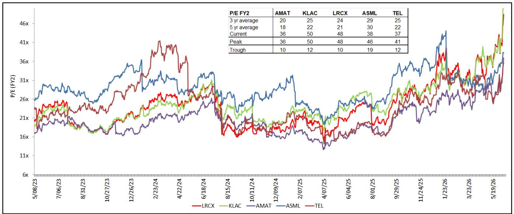
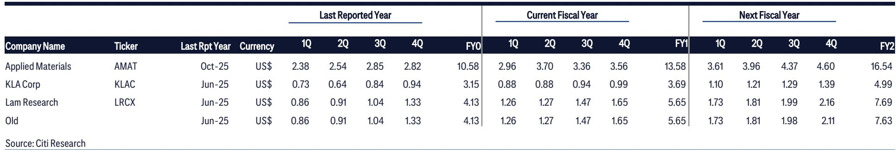
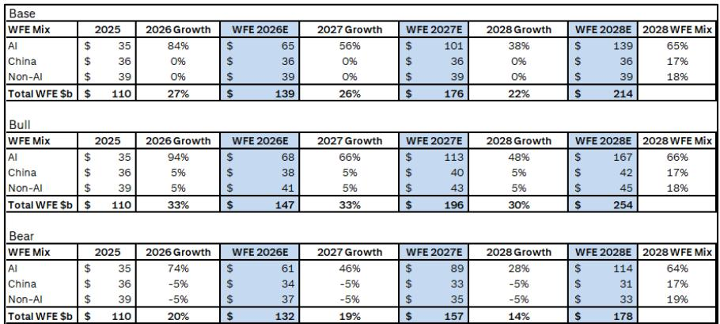

# The Semiconductor Equipment Bull Case Is No Longer About AI Chips Alone: The Memory Hierarchy Is the New Bottleneck

The conventional narrative for semiconductor equipment investors has been straightforward for the past two years: artificial intelligence drives wafer fabrication equipment spending, and the three major US equipment companies ride that wave. That narrative is now incomplete. A global investment bank report published in June 2026 introduces a bull case for wafer fabrication equipment reaching $250 billion by 2028, but the more important argument is not about the total dollar figure. It is about what is changing beneath the surface.

The report argues that the next phase of growth will be driven not simply by more AI chips, but by a structural shift in how those chips are built and supported. The critical insight is that the memory hierarchy is breaking under the weight of agentic AI workloads. DRAM supply is tightening, and the industry is being forced to adopt NAND-based solutions in ways that were not anticipated even twelve months ago. This is not a marginal trend. It is a re-architecting of the data center memory stack that will require billions of dollars in new NAND fabrication capacity.

For investors who have been positioned in Applied Materials, Lam Research, and KLA Corporation, the report provides fresh justification for holding those positions. But the real value lies in understanding why the bull case has shifted from a simple AI volume story to a more complex, and potentially more durable, equipment demand cycle driven by memory architecture constraints.

The timing matters. We are entering a period where hyperscaler capital expenditure growth, while still robust, is decelerating from 84 percent in 2026 to 56 percent in 2027 and 38 percent in 2028. A naive reading would suggest that equipment demand peaks soon after. The report challenges that assumption by showing that the composition of spending is changing in ways that sustain overall wafer fabrication equipment growth even as hyperscaler growth rates moderate. The equipment cycle is becoming less dependent on the pace of hyperscaler buildout and more dependent on the structural requirements of next-generation AI inference.

## The Memory Hierarchy Is Breaking, and That Break Creates a New Equipment Demand Driver

The most analytically powerful section of the report is not about the total wafer fabrication equipment forecast. It is about the DRAM bottleneck and its consequences for NAND demand. The report identifies a specific mechanism: agentic AI workflows, which involve multi-step inference processes, dramatically expand the size of key-value cache footprints. These caches store intermediate model states during inference, and as models become more complex and workflows become multi-step, the memory required to hold these states grows beyond what high-bandwidth memory and DRAM can efficiently support.

The report cites a concrete example that makes this tangible. Nvidia has reduced the DRAM capacity in its Vera Rubin NVL72 systems by approximately 50 percent due to supply limitations and cost constraints. This is not a sign of weakening demand. It is a sign that the industry is hitting a physical and economic ceiling on DRAM. When the leading AI chip designer is forced to cut DRAM allocation by half, it signals that the current memory architecture is unsustainable at scale.

The response to this constraint is already visible. Companies are accelerating adoption of KV cache offloading, where intermediate model states are shifted from expensive, fast memory to lower-cost, higher-capacity storage tiers. This technique effectively makes enterprise solid-state drives an active part of the inference memory hierarchy rather than passive storage. The report estimates that a modern NAND fab with 150,000 wafer starts per month can produce approximately 15 exabytes per year. To overcome the DRAM bottleneck, the industry will need two to four new greenfield NAND fabs, representing $20 billion to $40 billion in capital expenditure and $15 billion to $30 billion in NAND wafer fabrication equipment spending.

This is not a speculative forecast. The report points to specific product developments that confirm the trend. Samsung and Micron have discussed their TLC-based PCIe Gen6 solid-state drives for AI workloads. Sandisk has pulled forward the timeline for its high-bandwidth flash product by six months, now targeting a pilot line in the second half of 2026. Kioxia is developing XL-Flash, a low-latency NAND product designed to bridge the gap between DRAM and conventional flash, with compatibility for the CXL protocol that allows flash to be accessed as coherent memory rather than block storage.

The implication is clear: the NAND equipment cycle is no longer tied to consumer electronics or enterprise storage refreshes. It is now tied to the core infrastructure requirements of AI inference. This is a structural shift that extends the equipment cycle beyond what a simple hyperscaler capex model would suggest.

## The Bull Case Extends Beyond 2027 Because Foundry Capacity Constraints Are Becoming Structural

The report introduces a 2028 wafer fabrication equipment forecast of $250 billion in the bull case, implying 25 percent growth in 2028 alone. This is a bold number, and the justification rests on more than just AI chip demand. The report identifies three specific capacity expansion drivers that are becoming structural rather than cyclical.

First, TSMC continues to face capacity constraints that require sustained equipment investment. The foundry leader is not building ahead of demand in a speculative way. It is reacting to confirmed customer commitments that exceed available capacity. This is a fundamental shift from the historical pattern where foundries built capacity and then waited for demand to materialize.

Second, Intel Foundry is gaining traction with major customers. The report notes that Intel has secured engagements with Google and Apple at various capacity levels. This is significant because it represents a credible third option in advanced logic manufacturing. If Intel Foundry continues to win business, it will require its own equipment spending to ramp those customer programs. The report does not quantify this impact, but the strategic implication is that the foundry equipment market is becoming less concentrated and therefore less vulnerable to a single customer's spending decisions.

Third, Samsung is accelerating its Taylor fab construction and is reported to be working with Google on a TPU v10 memory I/O die at 2 nanometers. More notably, Samsung is in discussions with BYD on 2-nanometer and 4-nanometer autonomous driving chips. The automotive angle is worth watching because it represents a new demand vector for leading-edge nodes. Autonomous driving chips require advanced process technology for power efficiency and performance, but they also require reliability and long product lifecycles. If Samsung can capture this business, it would add a persistent equipment demand stream that is less correlated with hyperscaler capital expenditure cycles.

The report also references the Terafab concept, though it does not provide details. The broader point is that the foundry landscape is becoming more dynamic, and each new entrant or expansion creates incremental equipment demand. The equipment companies have been adding capacity for years to ensure they do not become the bottleneck for the industry, and that investment is now paying off as demand broadens across multiple customers and geographies.

## The Valuation Framework Has Shifted, But the Risk Is That Peak Multiples Are Already Priced In

The report raises price targets for all three companies based on rolling forward to calendar year 2028 earnings power. Applied Materials receives a target of $710 based on 31 times earnings, Lam Research receives $450 based on 40 times earnings, and KLA Corporation receives $290 based on 40 times earnings. These multiples represent significant premiums to historical averages: 55 percent above the historical average for Applied Materials, 67 percent for Lam Research, and 60 percent for KLA.

The justification for these multiples is that the wafer fabrication equipment upcycle is extended and AI-driven re-rating is structural. The report argues that the current multiples are still 15 to 20 percent below peak multiples reached during prior cycles. This framing is analytically valid, but it raises an uncomfortable question: what if the peak multiples of the past are no longer relevant benchmarks?

The semiconductor equipment industry has historically been cyclical, with boom-and-bust patterns tied to memory and logic investment cycles. The current cycle is different because it is driven by AI infrastructure buildout, which appears more durable. But the multiples already embed an assumption that this cycle is different. The report shows that current price-to-earnings ratios are already at or near historical peaks for all three companies. Applied Materials trades at 36 times, which matches its historical peak. Lam Research and KLA trade at 48 and 50 times respectively, which also match their historical peaks.

The bull case requires that these multiples hold or expand further. The report's price targets assume multiples that are slightly below current levels, which provides some cushion. But the margin of safety is thin. If the market begins to doubt the durability of the wafer fabrication equipment cycle, the multiple compression could be severe. The report acknowledges this in its bear case, which assumes a digestion period in 2028 due to macroeconomic slowdown or slower AI data center investment, with multiples falling to 20 times.

This is the central tension in the report. The fundamental thesis is compelling: memory hierarchy disruption, foundry capacity expansion, and sustained AI investment create a multiyear equipment demand cycle. But the valuation already reflects much of that optimism. Investors need to decide whether the cycle is long enough and strong enough to justify multiples that have never been sustained for extended periods in this industry.

## What the Report Does Not Fully Answer: The Shape of the Memory Transition and the China Risk

The report is analytically rigorous, but it leaves several important questions unresolved. The most significant is the pace and magnitude of the NAND demand transition. The report estimates that overcoming the DRAM bottleneck requires $15 billion to $30 billion in NAND wafer fabrication equipment spending. But this is a range, not a point estimate, and the difference between $15 billion and $30 billion is enormous for the equipment companies.

Lam Research is the most exposed to NAND equipment, and the report explicitly notes that its higher multiple reflects an over-index to NAND exposure. But if the transition is slower than expected, or if alternative memory technologies emerge that reduce the need for NAND-based KV cache offloading, the equipment demand could fall short of the bull case. The report mentions that AMD acquired MEXT, a memory optimization software company, which could make flash storage appear as DRAM-speed memory. If software solutions can meaningfully reduce the need for hardware-based memory expansion, the NAND equipment thesis weakens.

The second unresolved question is China. The report assumes China wafer fabrication equipment spending remains flat in the base case at $36 billion per year through 2028, with modest 5 percent growth in the bull case and 5 percent decline in the bear case. This assumption is critical because China represents roughly 17 percent of total wafer fabrication equipment spending. If export controls tighten further or if China's domestic equipment capabilities improve faster than expected, the actual spending could deviate significantly from this assumption.

The report does not explore the second-order implications of a China equipment market that either collapses or becomes self-sufficient. Both scenarios would have significant consequences for the US equipment companies, which currently benefit from China's dependence on imported equipment. The report's assumption of stability is reasonable as a baseline, but it is also the assumption most vulnerable to policy changes.

## A Decision Framework for Investors: Three Questions to Determine Your Position

The report provides enough information to construct a decision framework for investors considering positions in semiconductor equipment stocks. The framework rests on three questions that determine which scenario is most likely.

First, how quickly will the memory hierarchy transition occur? If KV cache offloading becomes standard practice within the next twelve to eighteen months, the NAND equipment demand will accelerate rapidly. Lam Research would be the primary beneficiary. If the transition takes three to five years, the equipment demand will be more gradual and the current multiples may be harder to justify.

Second, will foundry capacity expansion broaden beyond TSMC? The bull case depends on Intel and Samsung becoming credible second and third sources for advanced logic. If Intel Foundry fails to convert its customer engagements into volume production, or if Samsung's automotive ambitions take longer to materialize, the wafer fabrication equipment growth in 2028 could fall short of the 25 percent bull case.

Third, what is the correct multiple for a structurally different equipment cycle? The historical average multiples are 20 to 25 times. Current multiples are 36 to 50 times. The bull case assumes these multiples hold. The bear case assumes they revert. An investor who believes the cycle is genuinely structural can justify current multiples. An investor who believes the cycle will eventually normalize should wait for multiple compression before entering.

The report's own bull-bear analysis provides a useful framework. For Applied Materials, the bull case target is $800, the base case is $710, and the bear case is $460. The spread is 60 percentage points. For KLA, the bull case is $330, the base case is $290, and the bear case is $183, a spread of 62 percentage points. For Lam Research, the bull case is $600, the base case is $450, and the bear case is $250, a spread of 78 percentage points. The wide spreads reflect genuine uncertainty about the trajectory of the cycle.

The most prudent approach is to treat the base case as the central scenario but to monitor the memory hierarchy transition as the key leading indicator. If NAND equipment orders accelerate and foundry capacity announcements continue, the bull case becomes more likely. If hyperscaler capital expenditure guidance disappoints or memory prices decline sharply, the bear case becomes more plausible.

The report makes a compelling argument that the semiconductor equipment cycle has entered a new phase driven by structural changes in memory architecture and foundry competition. The investment thesis is no longer simply about AI chip volume. It is about the infrastructure required to support AI inference at scale, and that infrastructure requires a fundamentally different memory hierarchy. The equipment companies are positioned to benefit from this transition, but the valuation already reflects significant optimism. The next twelve months will determine whether that optimism is justified or whether the market has gotten ahead of the fundamentals.

Join the community to read the full report and review the original charts.

*This article is for learning and discussion only and does not constitute investment advice.*

Personal reading notes and learning share only. Not investment advice.

