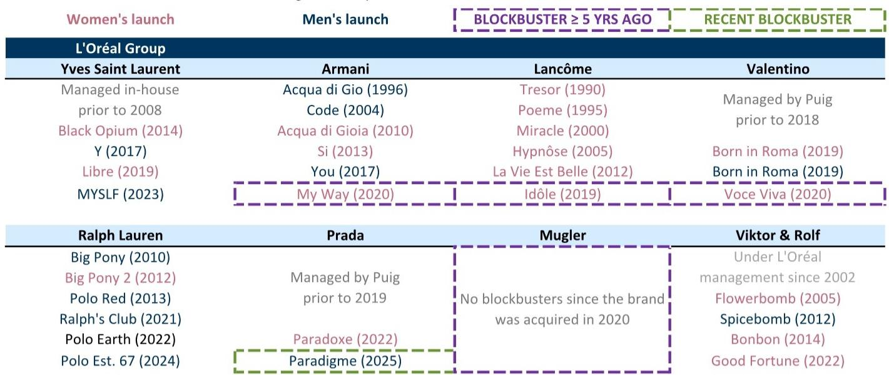
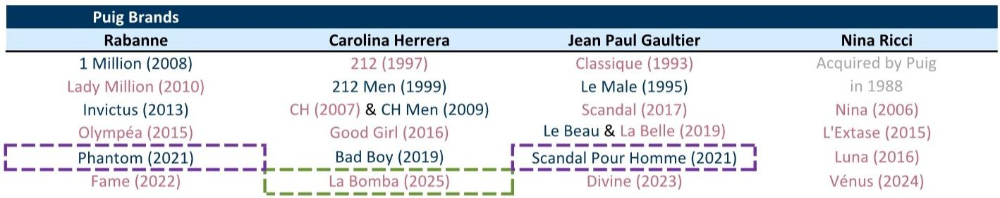

# GS：香水市场的下一个增长波，不是品类红利，而是打造爆款的能力

香水行业的增长正在回归常态。疫情后那波由消费者基数扩张和使用频率提升驱动的增长，已经让位于一个更考验内功的阶段。GS欧洲消费品团队在最新发布的研报中给出了一个清晰判断：当品类增速从2023年的8%回落至2025年的3.5%，竞争强度却从2019年的2500个新品翻倍至2025年的6000个时，香水品牌的价值分化将不再取决于“是否站在风口上”，而取决于能否持续创造出新的爆款支柱。

这份报告的核心贡献，不是预测行业增速，而是提供了一个分析框架：在供给驱动的品类里，增长本质上是一场“新品转化率”的竞赛。谁能在未来三年内推出并规模化新的爆款，谁就能在估值中获得重新定价。

## 1. 品类增长正常化后，真正的变量从“需求扩张”转向“供给质量”

疫情后的香水市场经历了一轮罕见的量价齐升。消费者首次购买香水的年龄提前了，使用频率也显著增加。GS引用的波士顿咨询数据显示，从2000年代到2020年代，美国消费者首次购买香水的平均年龄从13岁下降到了11.5岁。这个“年轻化+扩圈”的组合，是过去几年行业高增长的底层逻辑。

但这一结构性红利正在边际递减。当渗透率已经提升、消费者基数不再快速扩大时，增长动力就必须从“让更多人买”转向“让更多人买我的产品”。这正是GS报告的核心逻辑切换点：当行业进入存量博弈阶段，供给质量——即新品能否成为爆款——将成为区分赢家与输家的关键。

数据显示，2019年欧莱雅推出Libre等三款新品，当年香水销售增长8%。六年后，Libre成为全球女性香水第一品牌，超越香奈儿。这不是偶然。在2010年代中期，欧莱雅推出La Vie Est Belle，带动女性香水在2014年实现两位数增长，2015年增长超过9%，至今仍是兰蔻的支柱产品。GS将这类产品定义为“爆款支柱”——不是一次性促销，而是能够持续贡献销售、提升品牌势能的长期资产。

所以呢？投资者需要关注的核心指标，不再是行业增速或市场份额的静态数据，而是一家公司新品转化为爆款的“命中率”和“规模化能力”。

## 2. 未来三年，三大头部公司的新品管线已经清晰可辨

GS对欧莱雅、Puig和Interparfums未来三年的新品节奏给出了具体预判，这是报告中最具操作价值的部分。

欧莱雅方面，阿玛尼自2020年My Way之后没有推出过新的爆款支柱，未来三年内推出新品的概率很高。华伦天奴自2019年Born in Roma之后也需要拓宽产品矩阵。兰蔻自2019年Idole之后同样没有重大新品。此外，欧莱雅还肩负着培育Kering Beauty香水组合（包括葆蝶家、巴黎世家）的任务，最晚到FY28需要推出古驰香水。GS特别提到，欧莱雅美国奢侈品部门CEO已暗示2026年下半年将有新品发布。

Puig的看点更为集中。Jean Paul Gaultier将在2026年下半年推出女性爆款，以缩小其在女香领域的弱势。Rabanne预计在2027年推出新的男性支柱，因为自2021年Phantom之后该品牌在男香领域没有重大动作。Carolina Herrera的La Bomba刚刚上市，GS认为其搜索热度在上市前12个月的表现已超过Good Girl同期水平，这是一个积极信号。

Interparfums的战略则更加稳健——在其四大品牌Jimmy Choo、Coach、Montblanc和Lacoste之外，即将推出Longchamp香水。Jimmy Choo的案例尤其值得关注：通过持续推出新支柱（如I Want Choo），该品牌销售额已从2011年的2900万欧元增长到2025年的2.28亿欧元，即使在上市四年后，I Want Choo在2025年仍实现了27%的增长。

但这里有一个关键问题报告没有完全回答：这些新品究竟是在吸引新消费者，还是在蚕食现有产品线？Puig方面认为La Bomba吸引的是与Good Girl不同的客群，这归因于其独特的香型。但这一判断仍需更多数据验证。

## 3. 市场可能低估了爆款对估值的支撑作用

GS报告中最具洞察力的部分，是它将新品管线与估值缺口直接挂钩。

目前Puig和Interparfums的估值分别为13倍和16倍CY27市盈率。GS认为，如果它们能够持续执行新品战略，这个估值水平并未完全反映增长潜力。欧莱雅虽然享有26倍市盈率的溢价，部分由其无与伦比的执行力和更广泛的品类布局支撑，但与其历史水平相比，这一溢价空间仍然可观。

为什么市场可能低估了这些公司？原因在于，香水行业的新品效应并非线性。一个成功的爆款可以在上市后持续贡献增长数年，甚至十年以上。Good Girl用了六年时间才达到3%的市场份额，但此后一直保持在高位。1 Million在第一年就达到1%的份额，随后十年持续攀升。这种“长尾效应”意味着，当前投入的新品，其价值可能要到三到五年后才在财务数据中充分体现。而市场往往只关注短期业绩。

GS给出的催化剂明确：Puig将于10月28日举行资本市场日，预计将阐述其在女性香水领域的战略以及重振Rabanne的计划。欧莱雅的资本市场日则定于12月1日，预计将聚焦AI议程。这两个事件可能成为市场重新定价的触发点。

## 4. 报告尚未完全回答的关键问题：爆款的可复制性是否存在边界？

尽管GS对几大头部公司的新品管线给出了乐观预判，但报告本身也隐含了一个尚未完全解答的问题：爆款的可复制性是否存在边界？

从历史数据看，欧莱雅和Puig都展现了持续打造爆款的能力。但竞争环境正在发生变化——2025年6000个新品投放量是2019年的2.4倍。当每个品牌都在争夺消费者的注意力时，单个新品的“命中率”是否会下降？GS没有给出明确的概率判断。

另一个未解问题是“香雾”品类的竞争格局。香雾被视为吸引年轻消费者的重要渠道，其毛利率与高端香水部门相当。但目前这一品类仍由非香水品牌主导，如L'Occitane、Bath & Body Works和Victoria's Secret。传统香水品牌能否成功切入并建立优势，仍是一个开放性问题。

此外，GS对Interparfums的乐观预期建立在其稳定的新品节奏上，但这家公司完全依赖香水业务，缺乏其他品类的缓冲。如果某个爆款失败，其业绩波动性将远高于欧莱雅这样的多元化巨头。这可能是市场给予其较低估值倍数的原因之一，但报告并未深入讨论这一风险定价逻辑。

## 5. 投资者需要建立的观察框架：从“份额”到“命中率”

基于GS的分析逻辑，投资者评估香水公司时，传统上关注的“市场份额”指标可能已经不够。更有效的观察框架应该包括三个维度：

第一，新品转化率。即公司过去三到五年推出的新品中，有多少个成为了能够持续贡献增长的支柱产品。这比单一年度的销售增速更能反映公司的核心竞争力。

第二，品牌组合的健康度。如果一个公司过度依赖单一爆款（如Puig对Good Girl的依赖），其风险溢价应该更高。反之，像欧莱雅这样拥有多个品牌、多个爆款的组合，其估值溢价是合理的。

第三，新品与现有产品的差异化程度。GS报告中提到的“La Bomba吸引不同客群”这一点值得持续跟踪。如果新品只是对现有产品的简单复制，那么增长将很快遭遇天花板。

这些维度，报告本身并没有完全展开。例如，GS对Puig和Interparfums的估值判断，很大程度上依赖于“执行持续”这一假设。但如何衡量“执行持续”？报告没有给出量化框架。这恰恰是完整报告中可能包含的细节——也是为什么值得进一步阅读原始报告的原因。

---

香水行业的下一波增长，不再是“水涨船高”的故事，而是“造船能力”的比拼。GS这份报告的价值，在于它提供了一个从供需两端拆解行业逻辑的分析框架。但对于那些真正想基于此做出投资决策的读者来说，关键假设的验证、竞争优势的量化、以及图表背后的二阶影响，仍然需要更深入的讨论。

欢迎来星球微信群里继续讨论这些未解问题——比如，如何量化“爆款命中率”？La Bomba的搜索热度数据是否真的能预测销售转化？以及，当品类增速进一步放缓到3%以下时，这个分析框架是否仍然有效？

Personal reading notes and learning share only. Not investment advice.

