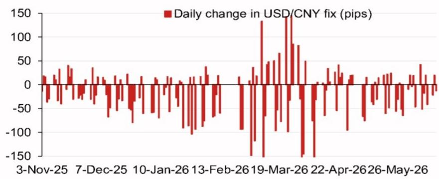
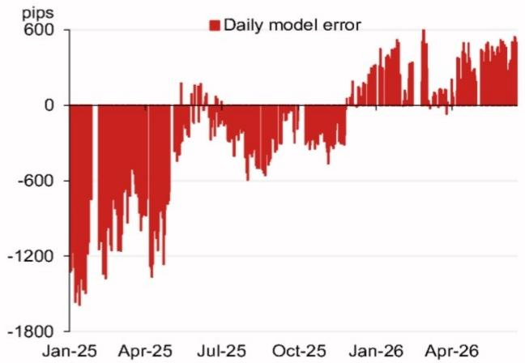

# The USD/CNY Fix Model Is Signaling a Strategic Shift — Not Just a Technical Adjustment

The People's Bank of China does not set the daily USD/CNY fixing rate by accident. Every morning, the fix communicates a deliberate policy signal to global markets. And according to the latest model projection from a major Asia-focused research desk, that signal has just changed meaningfully. The model-projected fix has dropped to 6.7761 from 6.8096 — a shift of 335 pips lower, representing the largest single directional move in the projection in recent memory. Even after incorporating the counter-cyclical factor, which the PBOC uses to smooth volatility, the projection lands at 6.7992, still 104 pips below the previous fix.

This is not a rounding error. It is not noise. It is a structural recalibration of how the PBOC is managing the renminbi's valuation against a dollar that remains strong and a global trade environment that remains fractured.

The timing of this shift is what demands attention. We are entering a period dense with high-stakes political and economic events: the July Politburo meeting, the APEC summit in Shenzhen, the Central Economic Work Conference in December, and a potential visit by President Xi to Washington. Each of these events creates a different incentive structure for currency policy. The fix model is telling us that the PBOC is already positioning for a world in which the renminbi needs to be more flexible, more credible, and more aligned with market forces — but not at the cost of stability.

The question every serious investor should be asking is not whether the fix will move again. It is what the PBOC is trying to achieve with this move, and what it means for portfolio positioning across Asian currencies, Chinese equities, and fixed income markets.

## The Model Projection Decline Reveals a Deliberate Policy Pivot, Not a Passive Market Response

The raw model projection — 6.7761 versus 6.8096 — is derived from a basket of currency movements weighted by their contribution to the renminbi's trade-weighted index. The top four contributors to the projected change are the euro (60 pips), the Korean won (46 pips), the Australian dollar (13 pips), and the British pound (9 pips). This is not a broad dollar weakness story. The euro and won are driving the overwhelming majority of the adjustment.

What this tells us is that the PBOC's fix model is responding to a specific set of competitive dynamics. The euro has been under pressure from a European Central Bank that remains cautious on rate cuts, while the won has been buffeted by Korea's export sensitivity to global trade policy uncertainty. By allowing the fix to move lower — meaning a weaker renminbi against the dollar — the PBOC is effectively acknowledging that China's trading partners are seeing currency depreciation, and that maintaining an artificially strong fix would harm Chinese export competitiveness.

The strategic implication is clear. The PBOC is prioritizing external competitiveness over the symbolic stability of a flat fix. This is a notable departure from the pattern observed over much of late 2025 and early 2026, when the daily change in the fix hovered near zero for extended periods. The model is now telling us that the era of fix rigidity is over, at least for now.

## The Counter-Cyclical Factor Is the PBOC's Safety Valve, and Its Current Magnitude Signals Caution

The counter-cyclical factor is the PBOC's tool for leaning against the wind. When the model produces a projection that the PBOC considers too extreme — either too weak or too strong — the counter-cyclical factor is adjusted to bring the fix back toward a more comfortable level. In this latest projection, the counter-cyclical factor adds back 231 pips to the raw model projection, resulting in a final fix of 6.7992.

This is a substantial adjustment. It tells us that the PBOC is not yet ready to fully validate the market's pricing of renminbi depreciation. The central bank wants a weaker fix, but it does not want to signal panic or capitulation. The counter-cyclical factor is being used to communicate a message of managed adjustment, not disorderly weakness.

The so-what for investors is that the PBOC retains significant control over the fix, and it is using that control to shape expectations. A raw model projection of 6.7761 would have been a strong signal of policy accommodation toward depreciation. The actual fix of 6.7992 is a more moderate signal. This creates a range within which the market can trade — roughly 6.77 to 6.80 — and any break beyond that range would require either a further shift in the model inputs or a change in the PBOC's tolerance for depreciation.

For currency traders, this means that the fix is now a two-way signal. A move below 6.78 would be aggressive; a move above 6.80 would be defensive. The PBOC is giving itself room to maneuver.

## The Calendar of Upcoming Events Creates a Sequence of Pressure Points for Renminbi Policy

The report includes a calendar of events that runs from late July 2026 through the end of the year. This is not a passive list. It is a roadmap of policy catalysts that will directly influence how the PBOC manages the fix in the months ahead.

The July Politburo meeting is the first major test. Historically, the July meeting produces a readout that includes a to-do list for the economy and clues to the priorities of the top leadership. If the readout emphasizes export support or currency stability, the fix will likely remain in the current range. If it signals a more aggressive stimulus posture, the fix could move lower to accommodate a weaker renminbi that supports growth.

The APEC summit in Shenzhen in November is a different kind of event. China is hosting the 31st APEC Economic Leaders' Meeting, and the optics of hosting a major international gathering while allowing the renminbi to depreciate sharply would be problematic. The PBOC will want the fix to be stable and predictable during the summit period. This suggests that any depreciation pressure will need to be front-loaded into the third quarter, before the political calendar becomes too crowded.

The potential Xi visit to Washington toward the end of 2026 adds another layer of complexity. A weaker renminbi ahead of a high-stakes bilateral meeting could be interpreted as a negotiating tactic or a sign of economic weakness. The PBOC will need to calibrate the fix carefully in the weeks leading up to that visit.

The strategic conclusion is that the window for meaningful renminbi depreciation is narrowing. The third quarter of 2026 is the most likely period for further fix adjustment. By the fourth quarter, the political calendar will constrain the PBOC's flexibility.

## What the Model Does Not Answer: The Unresolved Questions About Market Depth and Policy Credibility

The model projection is a powerful tool, but it leaves several critical questions unanswered. The first is about market depth. The fix is only one part of the renminbi ecosystem. What matters equally is whether the offshore market — the CNH market in Hong Kong and Singapore — will validate the fix or trade through it. If the offshore market pushes the spot rate significantly weaker than the fix, the PBOC will face a credibility problem. It will have to either adjust the fix further or intervene directly in the spot market.

The second unresolved question is about the PBOC's tolerance for volatility. The model error chart in the report shows that daily model errors have been shrinking over time, from peaks of around 1800 pips in early 2025 to much lower levels in 2026. This suggests that the model is becoming more accurate, but it also means that any large error going forward will be more noticeable and more consequential. The PBOC has less room for error when the model is already converging on market reality.

The third question is about the relationship between the fix and capital flows. A weaker fix makes Chinese assets cheaper for foreign investors, but it also increases the incentive for domestic capital to flow out. The PBOC cannot simultaneously manage the fix lower and maintain capital controls that are fully effective. There is a tension here that the model does not capture.

These are not flaws in the model. They are the natural limits of any quantitative framework. The model tells us what the fix should be based on past relationships. It does not tell us how the PBOC will behave when those relationships break down.

## A Decision Framework for Investors: How to Position Around the Fix Signal

For investors who need to act on this information, the fix model provides a clear decision framework organized around three scenarios.

Scenario one is continuation. If the PBOC continues to allow the fix to drift lower at a measured pace — say, 50 to 100 pips per week — then the renminbi is in a managed depreciation cycle. The appropriate positioning is to be short the renminbi against a basket of Asian currencies, particularly the Korean won and the Singapore dollar, which are likely to follow the renminbi lower. Chinese equities become a relative value trade: cheaper in dollar terms, but only if earnings can hold up.

Scenario two is acceleration. If the PBOC drops the counter-cyclical factor and allows the raw model projection to become the actual fix, the renminbi could move quickly toward 6.75 or lower. This would be a shock to the market. The appropriate response is to reduce exposure to China-sensitive assets and to increase hedges on renminbi-denominated bonds. The PBOC would likely respond with capital control measures, so liquidity management becomes critical.

Scenario three is reversal. If the PBOC suddenly tightens the fix — perhaps in response to political pressure or a deterioration in the global risk environment — the renminbi could strengthen sharply. This is the tail risk that most investors are not pricing. The appropriate hedge is to hold long renminbi positions in the offshore market, where the valuation is most compressed.

Each scenario requires a different portfolio response. The fix model gives you the data to diagnose which scenario is unfolding. The calendar gives you the timing to act before the crowd.

## The Full Report Contains the Charts and Data That Make This Analysis Actionable

The analysis above is built on a single set of model projections and a calendar of events. But the full report from which this data is drawn contains three charts that are essential for any investor who wants to trade around the fix: the top four weighted contributions to the projected change, the recent model error history, and the daily change in the USD/CNY fix over the past year. These charts show the pattern of PBOC behavior in a way that numbers alone cannot.

Join the community to read the full report and review the original charts.

*This article is for learning and discussion only and does not constitute investment advice.*

Personal reading notes and learning share only. Not investment advice.

