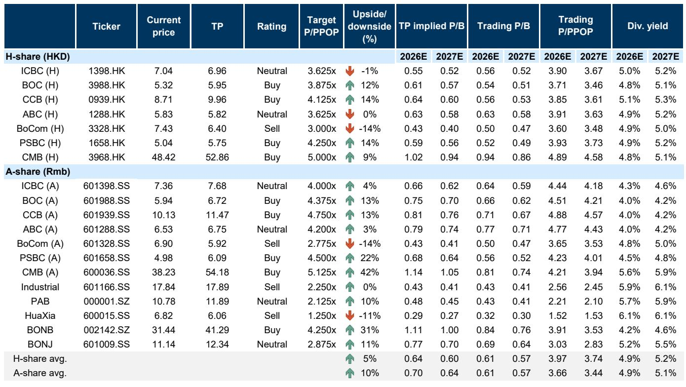
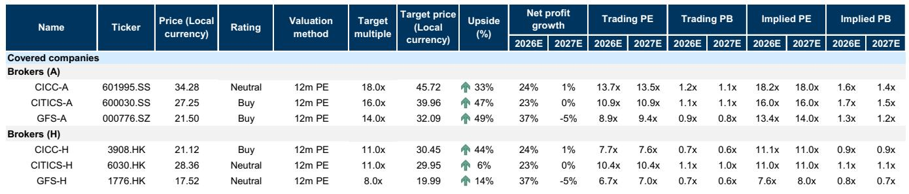
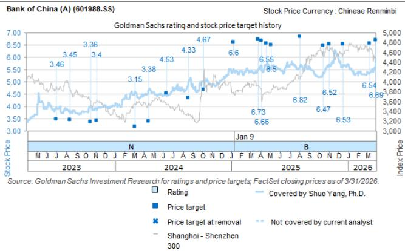

# Slower Credit Growth Is Not a Problem for China’s Banks—It Is the New Foundation for Balance Sheet Resilience

The narrative that slower loan growth in China signals weakness for the banking sector is incomplete and misleading. A global investment bank’s analysis of the recent Lujiazui Forum reveals a more nuanced reality: the deceleration is structural, intentional, and accompanied by a suite of new policy tools that will enhance the defensiveness of bank balance sheets. The real story is not about volume—it is about quality, stability, and the strategic repositioning of financial intermediation.

The forum, which brought together heads of China’s major financial regulatory bodies, delivered a coherent message: the era of credit-driven expansion is giving way to an era of credit efficiency. For investors, this shift demands a fundamental reassessment of how to evaluate bank stocks. The old metrics—loan growth rates, total asset expansion—are losing relevance. What matters now is the composition of liabilities, the resilience of investment income, and the ability to navigate a tightening regulatory landscape.

Three policy initiatives stand out: the narrowing of the short-term interest rate corridor, the pilot for offshore RMB FX trading in the Shanghai Free Trade Zone, and the study of a macro-prudential tool for non-bank liquidity support. Each of these has direct, measurable implications for bank profitability and risk profiles. But the most important takeaway is that these policies are not reactive—they are forward-looking, designed to build a more shock-absorbent financial system.

This article unpacks the strategic logic behind these changes, identifies the banks best positioned to benefit, and highlights the analytical questions that remain unresolved. The argument is clear: the market is underestimating how these structural shifts will reinforce balance sheet strength for select institutions.

## The Shift from Quantity to Quality in Credit Growth Creates a New Valuation Framework for Banks

The People’s Bank of China’s diagnosis of the financing structure transformation is the single most important strategic signal in the forum. Direct financing—through bonds and equity—now accounts for 55% of total social financing increments, up from less than 20% two decades ago. This is not a cyclical fluctuation; it is a structural response to the economy’s evolution from asset-heavy, traditional industries to asset-light, technology-driven sectors.

The implication for banks is profound. When the economy’s most dynamic sectors require equity, venture capital, and bond financing rather than traditional loans, maintaining historical credit growth rates becomes both impractical and undesirable. The PBOC has explicitly stated that “slower, higher-quality loan growth” is the new normal. This is not a concession to weakness—it is a strategic realignment.

For investors, this means that banks should no longer be judged primarily on loan growth momentum. Instead, the focus must shift to balance sheet composition, funding stability, and the ability to generate fee income from non-lending activities. Banks with larger, more diversified balance sheets—particularly those with strong deposit franchises and lower reliance on interbank funding—will have a structural advantage. The report points to CCB and BOC as examples of institutions with this profile.

But there is a second, less obvious implication. As loan growth slows, the marginal return on each new loan becomes more important. Banks that can maintain underwriting discipline and avoid the race to the bottom on pricing will emerge stronger. The new normal is not just about slower growth—it is about smarter growth.

## Narrowing the Interest Rate Corridor Directly Stabilizes Interbank Funding Costs, Especially for Mid-Sized Banks

The PBOC’s decision to narrow the short-term interest rate corridor from 70 basis points to 50 basis points is a technical adjustment with real economic consequences. By setting the operating rate at the 7-day reverse repurchase operation rate plus or minus 25 basis points, the central bank has effectively lowered the ceiling for short-term rate volatility.

Why does this matter? Because interbank funding costs are a significant driver of net interest margins, particularly for banks that lack deep deposit bases. During periods of liquidity stress—quarter-ends, tax payment seasons, or market dislocations—short-term rates can spike, compressing margins for banks that rely on wholesale funding.

The report identifies a clear pattern: among covered banks, Industrial Bank, Huaxia Bank, and BONB have the highest proportions of interbank liabilities, at 29%, 26%, and 22% respectively, compared to 15% for the large state-owned banks. This means that the policy change will have a disproportionate benefit for these mid-sized institutions. By reducing the ceiling on short-term rates, the PBOC is effectively providing a backstop for their funding costs.

This is not a one-time event. The narrowing of the corridor is a structural change in the monetary policy framework. It signals that the central bank is willing to accept a tighter range for short-term rates in exchange for greater stability. For investors, this creates a more predictable environment for forecasting net interest income, which in turn supports higher valuation multiples for banks that are most exposed to interbank funding.

The strategic question is whether the market has fully priced in this benefit. Many mid-sized banks trade at significant discounts to their larger peers, partly due to perceived funding fragility. If the new policy framework reduces that fragility, the valuation gap should narrow.

## The Macro-Prudential Liquidity Tool for Non-Banks Will Reduce Bond Market Contagion Risk and Protect Investment Income

The most forward-looking policy initiative announced at the forum is the study of a macro-prudential tool to provide liquidity support to non-bank financial institutions in specific scenarios. The language is carefully calibrated: this is not a standing facility, but an emergency mechanism designed to prevent systemic crises when normal liquidity channels are blocked.

To understand why this matters for banks, consider the dynamics of the 2022 wealth management product redemption wave. When bond prices fell, non-bank institutions—including wealth managers and securities firms—faced redemption pressures. Banks, worried about credit risk, restricted interbank lending. Non-banks were forced to sell liquid assets into a falling market, exacerbating the decline and triggering further net asset value drops. Banks with large trading books and investment portfolios suffered mark-to-market losses.

The proposed tool would break this feedback loop. By providing emergency liquidity through swaps—secured by high-quality collateral—the PBOC would allow non-banks to meet redemption demands without fire-selling assets. This would stabilize bond prices, reduce volatility, and protect the investment income of banks that hold significant trading account assets.

The report identifies BONB, BONJ, and BOC as having the highest proportions of trading accounts within their investment portfolios, at 67%, 67%, and 55% respectively. For these banks, the policy is not just a theoretical benefit—it is a direct enhancement to the stability of their earnings. In a world where bond market volatility has become more frequent, this tool effectively provides an insurance policy against the most severe scenarios.

The unresolved question is how the PBOC will define “specific scenarios” and what collateral requirements will be imposed. If the criteria are too restrictive, the tool may be ineffective. If they are too loose, it could create moral hazard. The details matter enormously, and investors should watch for further clarification.

## The Offshore RMB FX Trading Pilot Expands International Business but Will Not Drive Near-Term Earnings

The authorization of six banks to conduct offshore RMB FX trading in the Shanghai Free Trade Zone is a strategic step toward internationalizing the renminbi and deepening the foreign exchange market. For the participating banks—ICBC, ABC, BOC, CCB, BoCom, and CITIC Bank—this creates an opportunity to serve the hedging needs of overseas investors onshore.

However, the report is careful to temper expectations. Cross-referencing data from the largest international business player, BOC, reveals that its entire international settlement business contributes less than 7% of fee income and less than 1% of total revenue. Even if the pilot is successful, the financial impact in the near term will be marginal.

This does not mean the initiative is unimportant. It signals a long-term direction: Chinese regulators are committed to opening the capital account in a controlled manner. Banks that build early capabilities in cross-border FX and derivatives will be well-positioned as the market expands. But for investors focused on the next 12 to 18 months, this is not a needle-moving catalyst.

The more interesting strategic question is whether the pilot will eventually be expanded to more banks and whether it will include more complex products. If it does, the fee income potential could grow significantly. For now, it is a useful reminder that not every policy initiative translates into immediate earnings.

## What the Report Does Not Fully Answer: How Will the Regulatory Tightening for Brokers Affect Market Structure?

The forum also delivered clear signals for the capital markets: supply-side tools will be expanded, but regulatory constraints will be tightened. For brokers, this creates a bifurcated environment. Leading institutions with strong institutional capabilities, cross-border platforms, and robust risk management will capture incremental opportunities. Smaller players will struggle.

The report identifies CICC-H as a beneficiary, given its advantages in institutional business and cross-border services. But it does not fully address the broader question of how the tightening of regulatory constraints will reshape the competitive landscape. Will we see consolidation in the brokerage industry? Will the cost of compliance become a barrier to entry that favors the largest firms? How will the expansion of supply-side tools—such as new derivatives or structured products—interact with tighter oversight?

These are open questions that the report leaves for investors to explore. The implication is clear: the days of easy growth in the capital markets are over. The winners will be those with the scale, expertise, and risk culture to navigate a more demanding regulatory environment. For banks with brokerage subsidiaries, this adds another layer of complexity to the investment thesis.

## A Decision Framework for Investors: Three Questions to Ask About Any Bank Stock

Based on the report’s analysis, investors should evaluate bank stocks through three lenses:

First, how exposed is the bank to interbank funding costs? Banks with higher proportions of interbank liabilities will benefit more from the narrowing of the interest rate corridor. This is a near-term positive for net interest margins, particularly during periods of liquidity stress.

Second, how large is the bank’s trading book relative to its investment portfolio? Banks with higher proportions of FVTPL and FVTOCI assets will benefit from the macro-prudential liquidity tool, which reduces the risk of fire-sale losses during bond market dislocations. This is a structural enhancement to earnings stability.

Third, does the bank have the balance sheet size and diversification to thrive in a slower-growth environment? As loan growth decelerates, the ability to generate fee income, manage funding costs, and maintain underwriting discipline becomes paramount. Banks with larger, more diversified balance sheets—and stronger deposit franchises—are better positioned.

These three questions create a simple but powerful framework for differentiating between banks. The report suggests that BONB scores highly on all three dimensions, which explains its Buy rating. CCB and BOC score highly on balance sheet size and diversification. But the framework also identifies banks that may be vulnerable, particularly those with high interbank reliance and limited trading book benefits.

The unresolved analytical question is how these factors interact over a full credit cycle. The policies announced at the Lujiazui Forum are designed to enhance resilience, but they have not been tested in a severe downturn. Investors should monitor how the new tools perform when liquidity conditions tighten and credit quality deteriorates.

Join the community to read the full report and review the original charts.

*This article is for learning and discussion only and does not constitute investment advice.*

Personal reading notes and learning share only. Not investment advice.

