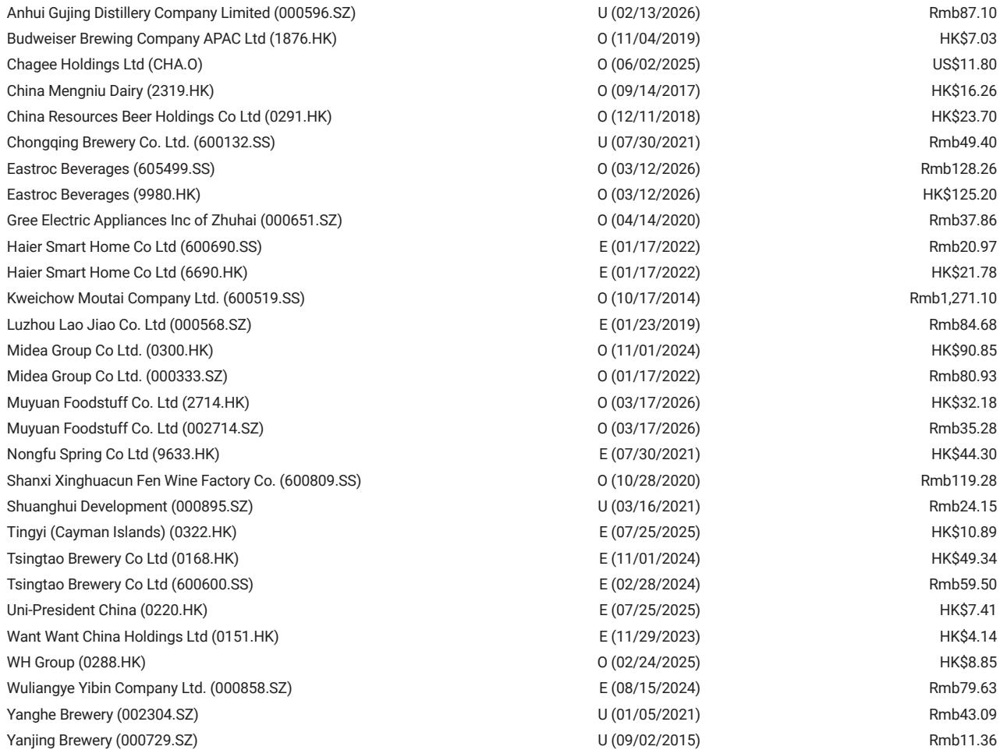
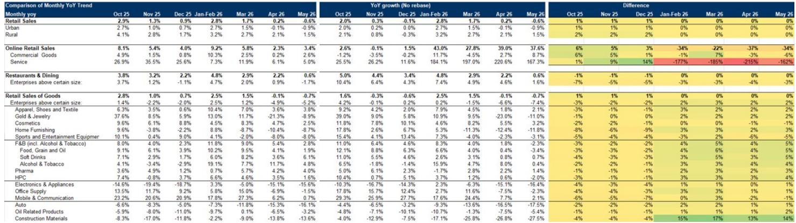
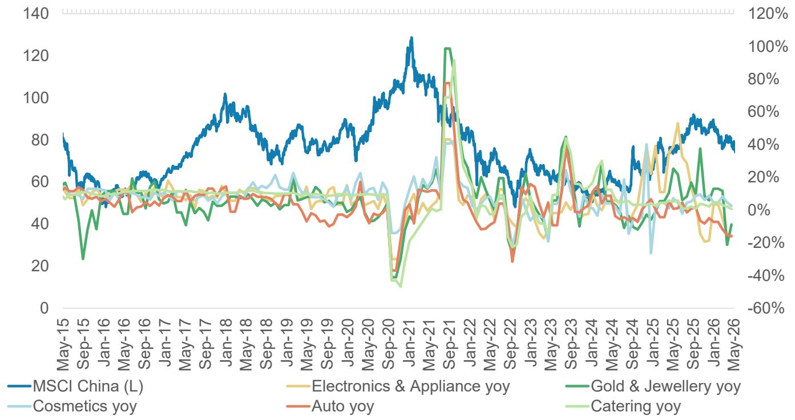

# 摩根斯坦利：消费复苏的真正考验不在总量，而在结构分化的再定价

2026年5月的中国零售数据，是疫后首个同比负增长的月份——同比下降0.6%，低于市场预期的-0.2%和4月的+0.2%。这个数字本身并不令人震惊，但它揭示了一个比“消费疲软”更值得深挖的结构性事实：总量数字掩盖了供给端和渠道端正在发生的重新定价，而市场对这一重新定价的认知仍停留在需求侧叙事上。

这份摩根斯坦利研报的价值，不在于它告诉你消费不好，而在于它提供了足够精细的颗粒度，让读者看清“哪里在加速出清、哪里在积蓄动能、哪里只是暂时性扰动”。以下是我们从中提取的五个关键判断。

## 1. 总量负增长背后的真正信号：补贴退坡后的真实需求压力测试

5月零售总额同比下降0.6%，但更值得关注的是扣除汽车后的同比增速仍为正（+1.1%），以及对比2019年的CAGR从4月的2.9%小幅回升至3.2%。这说明总量下滑的主因并非消费意愿全面崩塌，而是特定品类的基数效应和补贴政策到期产生了集中拖累。

电子与家电品类同比-15.6%，与4月的-15.1%基本持平，连续多月处于深度负增长区间。这一品类的疲软可以追溯到两个叠加因素：一是2024-2025年以旧换新补贴的刺激效应正在快速衰减，二是房地产相关需求（装修、家电配套）尚未出现实质性回暖。汽车品类同比-16.1%，同样受到去年高基数和新一轮价格战的不确定性压制。

从MECE的角度看，5月数据可以被拆解为三类：政策驱动型需求的退潮、房地产关联需求的持续低迷、以及日常消费的韧性测试。三者的分化程度远超市场此前预期。

这意味着，对于投资者而言，盯住总量数字做判断的风险正在上升。真正重要的是识别哪些品类正在经历“真实需求支撑的调整”，哪些只是“政策退出的噪音”。

## 2. 黄金珠宝的跌幅收窄并非消费回暖，而是价格效应掩盖了量价双杀

黄金珠宝品类从4月的-21.3%收窄至5月的-8.9%，看起来是一个积极的边际改善。但这份研报的数据结构提示我们：这个改善需要谨慎解读。

黄金珠宝的零售额同比增速同时受金价和销量两个变量影响。2025年二季度金价处于高位调整期，而2026年5月的金价基数有所回落，这意味着同比跌幅收窄可能更多来自价格效应，而非销量复苏。结合该品类对比2019年的CAGR从4月的3.0%微降至5月的2.8%，量的动能仍在走弱。

更重要的是，黄金珠宝属于典型的“可选消费+资产属性”双重定位品类。当消费者信心处于修复初期，这类品类的购买决策往往被推迟而非取消。摩根斯坦利在报告中提到的最新消费者调查显示“情绪温和改善但谨慎依旧”，这与黄金珠宝数据反映的“边际改善但动能不足”高度一致。

这一品类的真正拐点，需要等到量价同时企稳的信号出现，而不是单纯依赖同比跌幅的算术变化。

## 3. 线上零售的加速是消费降级还是渠道重构？答案决定投资方向

5月线上零售同比增长3.4%，较4月的2.3%明显加速，而同期线下零售（限额以上企业）同比-5.2%。这一反差在过去几个月中持续存在，但5月的差距进一步拉大。

一种常见的解读是“消费者在降级，转向更便宜的线上渠道”。但这份研报的数据并不完全支持这个结论。对比2019年的CAGR，线上零售从4月的9.8%提升至11.8%，而线下限额以上企业从3.0%微降至3.8%。两者都在改善，只是线上改善的斜率更陡。

更合理的解释是：渠道结构本身正在发生不可逆的变化。疫情后消费者养成的线上购物习惯并未消退，叠加直播电商、即时零售等新业态的渗透率仍在上升，线上渠道的增速高于线下并非周期性现象，而是结构性趋势。真正值得关注的是：哪些品类正在被线上渠道侵蚀利润，哪些品类正在通过线上渠道实现增量。

报告中没有直接展开的是，不同消费品类在线上线下的利润率差异巨大。对于品牌商而言，线上占比的提升可能意味着营销费用率上升、客单价下降，这将对盈利能力产生长期压制。对于渠道商而言，谁能在线下体验和线上效率之间找到新的平衡点，谁就能在下一轮竞争中占得先机。

## 4. 软饮料的逆势增长提供了“供给创造需求”的典型案例

在所有品类中，软饮料是少数实现同比增速加快的品类：从4月的+3.6%提升至5月的+6.1%。对比2019年的CAGR也从6.9%小幅上升至7.0%。

这一表现与餐饮收入的明显放缓（从+2.2%降至+0.6%）形成对比，说明软饮料的增长并非单纯依靠餐饮渠道的拉动。更可能的原因是：头部企业通过产品创新和渠道下沉，在存量市场中创造了新的消费场景和需求。这份研报中提到的蒙牛（2319.HK）和伊利（600887.SS）被列为“供给重新校准与需求改善”的代表，正是基于这一逻辑。

软饮料品类的案例揭示了一个更通用的投资框架：在消费总量增长放缓的环境下，能够通过产品迭代、渠道变革或品牌升级来“创造需求”的企业，将获得超越行业平均水平的回报。反之，依赖行业β增长的企业将面临持续的压力测试。

## 5. 报告尚未完全回答的关键问题：补贴退坡后的“真空期”会持续多久？

摩根斯坦利在报告中明确指出了补贴政策对电子、家电、汽车等品类的支撑作用正在减弱，但并未给出一个清晰的“政策真空期”持续时间判断。这是一个值得深入讨论的未解问题。

从历史经验看，消费品补贴政策的退坡通常会经历三个阶段：第一个月出现明显的销量下滑，第二至第三个月出现渠道库存调整（经销商主动去库存），第四个月后真实需求开始显现。如果真实需求足够强劲，市场会在第三至第四个月自发企稳；如果真实需求只是被补贴提前透支，则下滑可能持续更长时间。

当前，电子与家电品类已经连续三个月处于深度负增长，暗示可能正处于第二阶段向第三阶段过渡的过程中。但房地产需求的持续疲软，使得“补贴退坡后能否靠真实需求接住”这个问题变得更加不确定。

另一个未完全展开的维度是：消费者信心调查中的“温和改善”与零售数据中的“负增长”之间存在明显背离。这种背离通常意味着：信心改善尚未转化为实际购买行为，或者消费者的购买意愿集中在特定品类（如线上、低价、刚需），而整体消费意愿仍处于修复初期。

这两个问题，构成了理解未来3-6个月消费板块走势的核心变量。

---

对于已经读到这里的读者，你可能已经注意到：这份研报的价值不在于告诉你“消费不好”，而在于帮你拆解出“哪里不好、哪里在变好、哪里需要等待更多数据”。这种精细化的分析框架，正是机构投资者与普通投资者之间的认知差距所在。

如果你希望进一步讨论以下问题：补贴退坡后的政策真空期如何跟踪、软饮料和化妆品等逆势品类的竞争格局变化、以及摩根斯坦利报告中提到的具体标的（蒙牛、伊利、海底捞、巨子生物、茶颜悦色等）的估值与风险收益比，欢迎来星球微信群里继续讨论。我们会在群内分享更完整的原始图表、数据拆解工具，以及每周的消费数据跟踪更新。

Personal reading notes and learning share only. Not investment advice.

