## Energy | North America

# Is Peace Mispriced?

With a MoU between the US and Iran set to be formally signed on Friday, we refresh sensitivities for our E&P & Integrated coverage and revisit what's priced in. Oil E&Ps currently trade at a 13% median '27 FCF yield near strip (\$72 WTI). Intrinsically, valuations reflect \$66 WTI.

## Key Takeaways

Including today's move, WTI has now fallen by 29% since the US and Iran first announced a cease fire in early April, a \~\$30/bbl decline.  
Fully restoring production & inventories will take time. MS oil strategist expects Brent to be supported around \$90 in 3Q and at or above \$80 into next year.  
At strip (\~\$72 WTI), we estimate median 2027 FCF yield of 11% for our oil coverage (13% for US oil E&Ps, 8% for US Majors, and 9% for Canada).  
Intrinsically, we estimate oil producer valuations reflect an average WTI price of \~\$66/bbl, or \~13% below 12-month strip of \~\$75/bbl.  
With strong FCF & attractive valuations, the pull-back creates an opportunity to add exposure to Majors and high-quality E&Ps

Peace deal, pending release. Over the weekend, President Trump announced that the United States and Iran have reached a MoU (memorandum of understanding) to end the conflict with a formal signing ceremony taking place in Switzerland this Friday (see here and here for more). The full text of the agreement has yet to be released, but reports indicate it calls for an end to hostilities and re-opening of the Strait of Hormuz. Both sides have indicated that discussions surrounding Iran's nuclear capabilities will take place over the next 60 days.

Restoring production and replenishing inventories will take time. Including today's 5% move, WTI has now fallen by 29% since the US and Iran first announced a cease fire in early April, a \~\$30/bbl decline. Assuming a near-term re-opening of the Strait, MS Oil Strategist Martijn Rats expects it to take several weeks for tanker flow to be restored (more here); with 50% of production back by Sept, and 80% by December. On these assumptions, the summer still appears tight, with a \~3.4 mb/d average deficit in 3Q (1.1 mb/d looking at just OECD). The market screens closer to balance by 4Q, assuming no further disruptions to global supply, but at this point the world will still need to replenish the substantial inventory draws that have occurred since the start of the conflict. Martijn expects Brent to be supported around \$90 in 3Q and at or above \$80/bbl into next year.

Sensitizing commodity prices. Broadly speaking, FCF yields and intrinsic valuations screen attractive across much of our producer coverage. The pull-back creates an opportunity to add exposure to Majors and high-quality E&Ps.

\- Oil Producers: At strip (\~\$72 WTI), we estimate median 2027 FCF yield of

MS & CO. LLC

## Devin McDermott

Equity Analyst and Commodities Strategist

Devin.McDermott@morganstanley.com +1 212 761-1125

## Joe Laetsch, CFA

Equity Analyst

Joe.Laetsch@morganstanley.com +1 212 761-8804

## Svetlana Do

Research Associate

Svetlana.DO@morganstanley.com +1 212 761-2409

## Helen Lin

Research Associate

Helen.Lin@morganstanley.com +1 212 761-0766

## Justin W Latran, CFA

Research Associate

Justin.Latran@morganstanley.com +1 212 761-2869

## Jacqueline M Kenny

Research Associate

Jacqueline.Kenny@morganstanley.com +1 212 761-2253

EXPLORATION & PRODUCTION

<table><tr><td colspan="2">North America</td></tr><tr><td>Industry View</td><td>In-Line</td></tr></table>

INTEGRATED OIL

<table><tr><td>North AmericaIndustry View</td><td>Attractive</td></tr></table>

DIVERSIFIED NATURAL GAS

<table><tr><td colspan="2">North America</td></tr><tr><td>Industry View</td><td>In-Line</td></tr></table>

MS does and seeks to do business with companies covered in MS. As a result, investors should be aware that the firm may have a conflict of interest that could affect the objectivity of MS. Investors should consider MS as only a single factor in making their investment decision.

For analyst certification and other important disclosures, refer to the Disclosure Section, located at the end of this report.

11% for our oil coverage (13% for oil E&Ps, 8% for US majors, and 9% for Canada). This would fall to 5% at \$55 and rise to 19% at \$105, implying a \~3 percentage points change for every \$10/bbl move in WTI. Intrinsically, we estimate oil producer valuations reflect an average WTI price of \~\$66/bbl, or \~13% below 12-month strip of \~\$75/bbl.

\- Gas E&Ps: Our median 2027 FCF yield for gas E&Ps sits at \~9% at prices near strip (\$3.50 Henry Hub), rising to 14% at \$4.50 and falling to 4% at \$2.50. Each \$0.50 move in Henry Hub changes the average FCF yield across our gas coverage by \~3 percentage points in '27. Intrinsically, we estimate gas E&Ps reflect a median Henry Hub price of \~\$3.38/mmbtu, in-line with the forward strip.

Exhibit 1: We estimate that oil E&Ps currently discount an average WTI price of \~\$65/bbl, well below the current 12-month strip of \~\$75.  
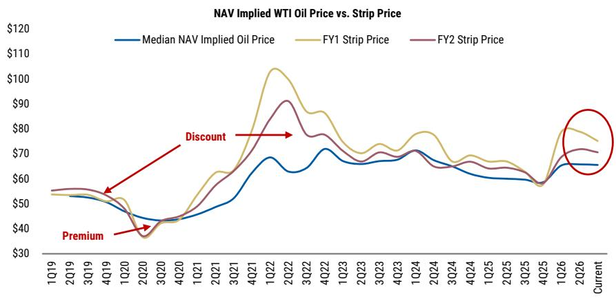

line chart

| Quarter | Median NAV Implied Oil Price | FY1 Strip Price | FY2 Strip Price |
|---------|------------------------------|-----------------|-----------------|
| 1Q19    | ~$55                         | ~$55            | ~$55            |
| 2Q19    | ~$53                         | ~$53            | ~$53            |
| 3Q19    | ~$52                         | ~$52            | ~$52            |
| 4Q19    | ~$50                         | ~$50            | ~$50            |
| 1Q20    | ~$48                         | ~$48            | ~$48            |
| 2Q20    | ~$45                         | ~$45            | ~$45            |
| 3Q20    | ~$43                         | ~$43            | ~$43            |
| 4Q20    | ~$45                         | ~$45            | ~$45            |
| 1Q21    | ~$48                         | ~$48            | ~$48            |
| 2Q21    | ~$50                         | ~$50            | ~$50            |
| 3Q21    | ~$55                         | ~$55            | ~$55            |
| 4Q21    | ~$60                         | ~$60            | ~$60            |
| 1Q22    | ~$65                         | ~$70            | ~$70            |
| 2Q22    | ~$68                         | ~$75            | ~$75            |
| 3Q22    | ~$65                         | ~$70            | ~$70            |
| 4Q22    | ~$68                         | ~$75            | ~$75            |
| 1Q23    | ~$65                         | ~$70            | ~$70            |
| 2Q23    | ~$68                         | ~$75            | ~$75            |
| 3Q23    | ~$65                         | ~$70            | ~$70            |
| 4Q23    | ~$68                         | ~$75            | ~$75            |
| 1Q24    | ~$70                         | ~$78            | ~$78            |
| 2Q24    | ~$68                         | ~$75            | ~$75            |
| 3Q24    | ~$65                         | ~$70            | ~$70            |
| 4Q24    | ~$68                         | ~$75            | ~$75            |
| 1Q25    | ~$65                         | ~$70            | ~$70            |
| 2Q25    | ~$68                         | ~$75            | ~$75            |
| 3Q25    | ~$65                         | ~$70            | ~$70            |
| 4Q25    | ~$68                         | ~$75            | ~$75            |
| 1Q26    | ~$70                         | ~$80            | ~$80            |
| 2Q26    | ~$68                         | ~$78            | ~$78            |
| Current | ~$65                         | ~$75            | ~$75            |

Source: Company data, Bloomberg, FactSet, MS estimates

## Key Charts

Exhibit 2: Seaborne net exports from the US sit \~4 mb/d higher than last year...  
United States  
Seaborne net exports (crude + products, 30-day avg, mb/d)  
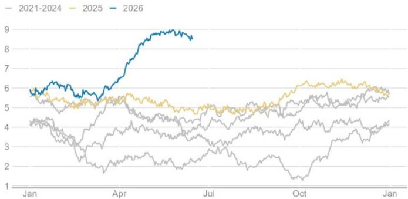

line chart

| Month | 2021-2024 | 2025 | 2026 |
|-------|-----------|------|------|
| Jan   | ~4.5      | ~5.5 | ~5.8 |
| Apr   | ~3.0      | ~5.0 | ~7.0 |
| Jul   | ~3.5      | ~5.5 | ~9.0 |
| Oct   | ~1.5      | ~6.0 | ~8.5 |
| Jan   | ~4.0      | ~5.8 | ~5.5 |

Source: Vortexa, MS  
Source: Vortexa, MS

Exhibit 4: Based on known tanker movements, it appears net seaborne oil imports into China will be down even further in June vs May.  
China seaborne total-petroleum net imports: firming fan  
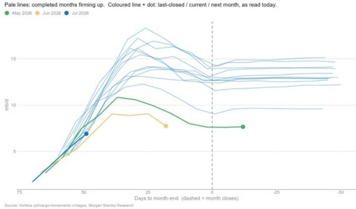

line chart

| Days to month-end (dashed = month closes) | May 2026 (mb/d) | Jun 2026 (mb/d) | Jul 2026 (mb/d) |
| ----------------------------------------- | ---------------- | ---------------- | ---------------- |
| 75                                        | ~3               | ~3               | ~3               |
| 50                                        | ~7               | ~7               | ~7               |
| 25                                        | ~11              | ~9               | ~17              |
| 0                                         | ~8               | ~8               | ~14              |
| -25                                       | ~8               | ~8               | ~14              |
| -50                                       | ~8               | ~8               | ~14              |

Source: Vortexa, MS

Exhibit 3: While net seaborne imports into China have maintained their downward trend.  
China  
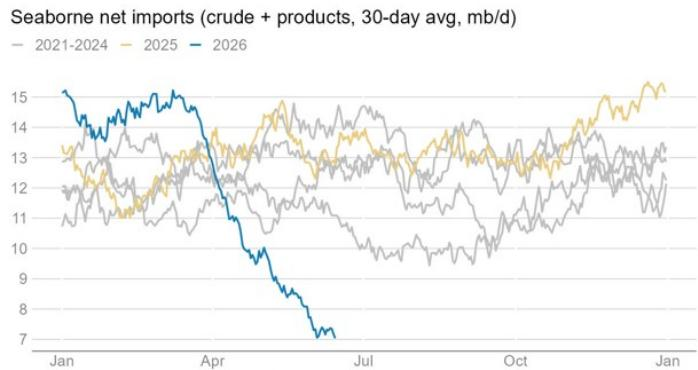

line chart

| Month | 2021-2024 | 2025 | 2026 |
|-------|-----------|------|------|
| Jan   | ~13.5     | ~13.0 | ~15.0 |
| Apr   | ~12.0     | ~13.5 | ~10.0 |
| Jul   | ~11.0     | ~13.0 | ~7.0  |
| Oct   | ~11.5     | ~13.5 | -    |
| Jan   | ~12.5     | ~15.0 | -    |

Source: Vortexa, MS  
Source: Vortexa, MS

Exhibit 5: Global SPR releases are running at 2.5 mb/d during Apr-Jun, but are set to fall sharply to 0.7 mb/d in July and August.  
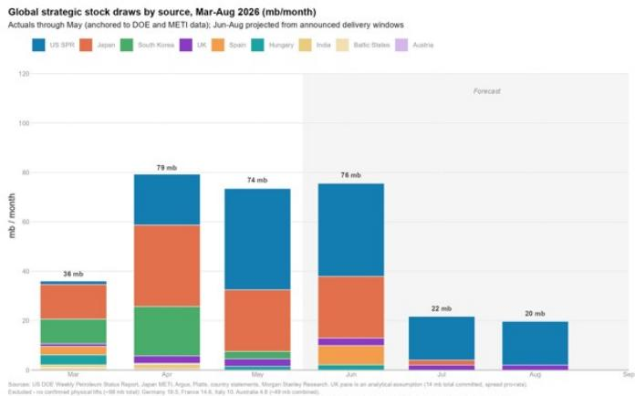

stacked bar chart

Global strategic stock draws by source, Mar-Aug 2026 (mb/month)
| Month | US SPR (mb/month) | Japan (mb/month) | South Korea (mb/month) | UK (mb/month) | Spain (mb/month) | Hungary (mb/month) | India (mb/month) | Baltic States (mb/month) | Austria (mb/month) |
|---|---|---|---|---|---|---|---|---|---|
| Mar | 36 | 15 | 10 | 2 | 1 | 4 | 1 | 0 | 0 |
| Apr | 79 | 48 | 25 | 3 | 1 | 3 | 1 | 0 | 0 |
| May | 74 | 30 | 5 | 2 | 1 | 2 | 1 | 0 | 0 |
| Jun | 76 | 35 | 5 | 3 | 1 | 2 | 1 | 0 | 0 |
| Jul | 22 | 1 | 1 | 0 | 0 | 0 | 0 | 0 | 0 |
| Aug | 20 | 0 | 1 | 0 | 0 | 0 | 0 | 0 | 0 |
Forecast

Additional IEA contributors also excluded: Canada 23.6, Turkiye 11.7, Poland 7.5, Netherlands 5.4, Mexico 3.9 (\~52 mb; Canada and Mexico are production-increase commitments, not stock releases).  
Source: US DOE Weekly Petroleum Status Report, Japan METI, Agrus, Platts, MS

Exhibit 6: Global oil and refined product inventories have been drawing rapidly since the start of the conflict.

Observable crude oil and oil products inventories  
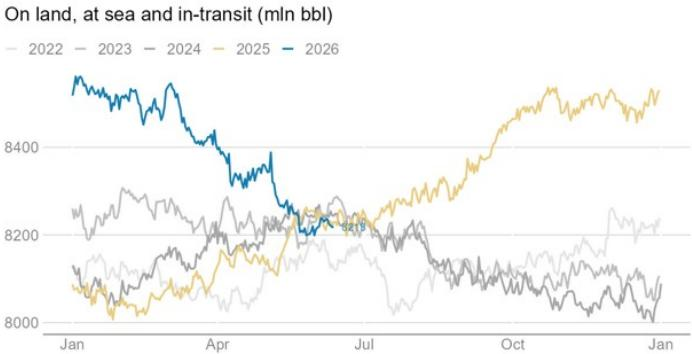

line chart

| Month | 2022  | 2023  | 2024  | 2025  | 2026  |
|-------|-------|-------|-------|-------|-------|
| Jan   | ~8150 | ~8180 | ~8170 | ~8160 | ~8550 |
| Apr   | ~8180 | ~8200 | ~8190 | ~8170 | ~8400 |
| Jul   | ~8150 | ~8190 | ~8180 | ~8250 | ~8250 |
| Oct   | ~8170 | ~8180 | ~8160 | ~8450 | ~8350 |
| Jan   | ~8160 | ~8170 | ~8150 | ~8500 | ~8300 |

Note: Inventories include SPR  
Source: IEA, EIA/DOE, PJK, IE, Genscape, PAJ, Platts, Vortexa, MS  
Source: IEA, EIA/DOE, PJK, IE, Genscape, PAJ, Platts, Vortexa, MS

Exhibit 8: OECD oil stocks have fallen further below 5-year averages, driven by a large draw in the US...  
Total Crude Oil Inventories (mln bbls)  
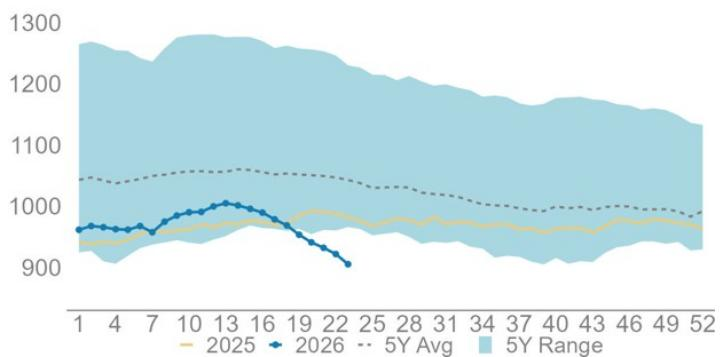

line chart

| Month | 2025 | 2026 | 5Y Avg | 5Y Range |
|-------|------|------|--------|----------|
| 1     | 950  | 970  | 1050   | 1280     |
| 4     | 960  | 975  | 1045   | 1275     |
| 7     | 970  | 980  | 1040   | 1270     |
| 10    | 980  | 990  | 1035   | 1265     |
| 13    | 990  | 1000 | 1030   | 1260     |
| 16    | 1000 | 1005 | 1025   | 1255     |
| 19    | 995  | 1000 | 1020   | 1250     |
| 22    | 990  | 995  | 1015   | 1245     |
| 25    | 985  | 990  | 1010   | 1240     |
| 28    | 980  | 985  | 1005   | 1235     |
| 31    | 975  | 980  | 1000   | 1230     |
| 34    | 970  | 975  | 995    | 1225     |
| 37    | 965  | 970  | 990    | 1220     |
| 40    | 960  | 965  | 985    | 1215     |
| 43    | 955  | 960  | 980    | 1210     |
| 46    | 950  | 955  | 975    | 1205     |
| 49    | 945  | 950  | 970    | 1200     |
| 52    | 940  | 945  | 965    | 1195     |

Source:  
EIA, PJK International, IE Singapore, PAJ, Genscape, FEDCom/Platts. Includes US SPR.

Exhibit 10: Implied US product demand has held up well so far...  
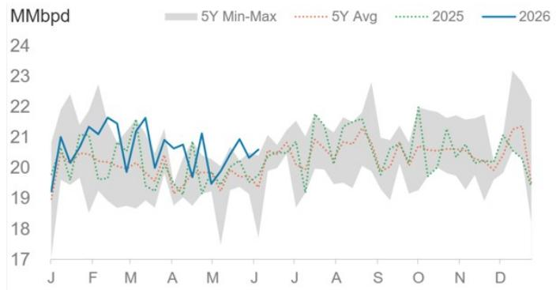

line chart

| Month | 5Y Min-Max | 5Y Avg | 2025 | 2026 |
|-------|------------|--------|------|------|
| J     | ~19        | ~19    | ~19  | ~19  |
| F     | ~22        | ~20    | ~20  | ~21  |
| M     | ~21        | ~19    | ~19  | ~21  |
| A     | ~20        | ~19    | ~19  | ~20  |
| M     | ~18        | ~19    | ~19  | ~21  |
| J     | ~20        | ~19    | ~19  | ~20  |
| J     | ~21        | ~20    | ~20  | ~21  |
| A     | ~21        | ~20    | ~20  | ~21  |
| S     | ~23        | ~21    | ~21  | ~22  |
| O     | ~21        | ~20    | ~20  | ~21  |
| N     | ~20        | ~19    | ~19  | ~20  |
| D     | ~23        | ~21    | ~20  | ~21  |

Source:  
US EIA, MS.

Exhibit 7: ...including large draws in commercial storage.  
Observable crude oil and oil products inventories  
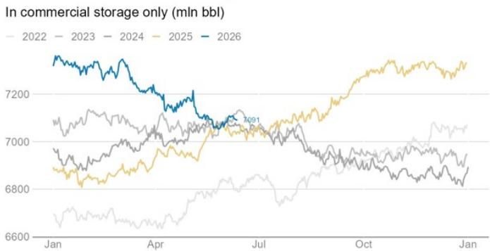

line chart

| Month | 2022  | 2023  | 2024  | 2025  | 2026  |
|-------|-------|-------|-------|-------|-------|
| Jan   | ~6850 | ~7050 | ~6950 | ~6880 | ~7350 |
| Apr   | ~6750 | ~7000 | ~6980 | ~6950 | ~7150 |
| Jul   | ~6850 | ~6950 | ~6900 | ~7050 | ~7100 |
| Oct   | ~6950 | ~6900 | ~6850 | ~7250 | ~7150 |
| Jan   | ~6850 | ~6850 | ~6800 | ~7300 | ~7150 |

Note: inventories on land, at sea and in-transit, not including SPR in OECD countries  
Source: IEA, EIA/DOE, PJK, IE, Genscape, PAJ, Platts, Vortexa, MS  
Source: IEA, EIA/DOE, PJK, IE, Genscape, PAJ, Platts, Vortexa, MS

Exhibit 9: ...While refined product stocks have continued to grind lower as well  
Total Refined Products Inventories (mln bbls)  
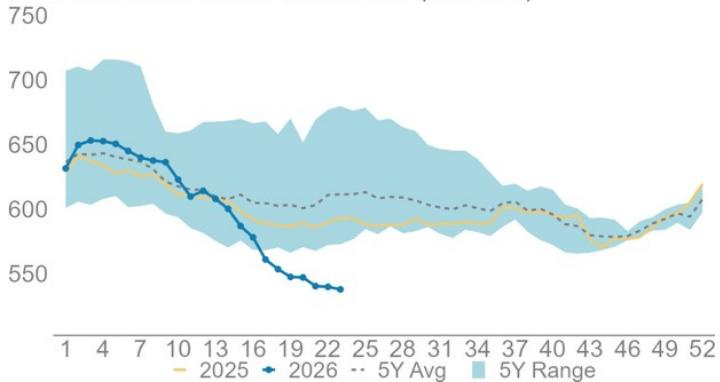

line chart

| Month | 2025 | 2026 | 5Y Avg | 5Y Range |
|-------|------|------|--------|----------|
| 1     | 630  | 640  | 630    | 630-710  |
| 4     | 640  | 650  | 640    | 640-720  |
| 7     | 630  | 640  | 630    | 630-710  |
| 10    | 610  | 620  | 610    | 610-680  |
| 13    | 600  | 610  | 600    | 600-670  |
| 16    | 590  | 580  | 590    | 590-660  |
| 19    | 580  | 570  | 580    | 580-650  |
| 22    | 570  | 560  | 570    | 570-640  |
| 25    | 580  | 570  | 580    | 580-650  |
| 28    | 590  | 580  | 590    | 590-660  |
| 31    | 600  | 590  | 600    | 600-670  |
| 34    | 610  | 600  | 610    | 610-680  |
| 37    | 620  | 610  | 620    | 620-690  |
| 40    | 630  | 620  | 630    | 630-700  |
| 43    | 640  | 630  | 640    | 640-710  |
| 46    | 650  | 640  | 650    | 650-720  |
| 49    | 660  | 650  | 660    | 660-730  |
| 52    | 670  | 660  | 670    | 670-740  |

Source:  
EIA, PJK International, IE Singapore, PAJ, Genscape, FEDCom/Platts

Exhibit 11: ...with gasoline consumption still within normal  
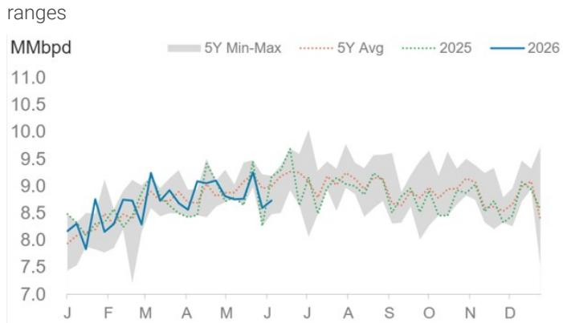

line chart

| Month | 5Y Min-Max | 5Y Avg | 2025 | 2026 |
| --- | --- | --- | --- | --- |
| J | 7.5 | 8.0 | 8.5 | 8.0 |
| F | 8.0 | 8.5 | 8.0 | 8.5 |
| M | 8.5 | 9.0 | 8.5 | 9.0 |
| A | 9.0 | 9.5 | 9.0 | 9.5 |
| M | 9.5 | 10.0 | 9.5 | 10.0 |
| J | 10.0 | 10.5 | 10.0 | 10.5 |
| J | 10.5 | 11.0 | 10.5 | 11.0 |
| A | 11.0 | 11.5 | 11.0 | 11.5 |
| S | 11.5 | 12.0 | 11.5 | 12.0 |
| O | 12.0 | 12.5 | 12.0 | 12.5 |
| N | 12.5 | 13.0 | 12.5 | 13.0 |
| D | 13.0 | 13.5 | 13.0 | 13.5 |
| D | 13.5 | 14.0 | 13.5 | 14.0 |
| D | 14.0 | 14.5 | 14.0 | 14.5 |
| D | 14.5 | 15.0 | 14.5 | 15.0 |
| D | 15.0 | 15.5 | 15.0 | 15.5 |
| D | 15.5 | 16.0 | 15.5 | 16.0 |
| D | 16.0 | 16.5 | 16.0 | 16.5 |
| D | 16.5 | 17.0 | 16.5 | 17.0 |
| D | 17.0 | 17.5 | 17.0 | 17.5 |
| D | 17.5 | 18.0 | 17.5 | 18.0 |
| D | 18.0 | 18.5 | 18.0 | 18.5 |
| D | 18.5 | 19.0 | 18.5 | 19.0 |
| D | 19.0 | 19.5 | 19.0 | 19.5 |
| D | 19.5 | 20.0 | 19.5 | 20.0 |
| D | 20.0 | 20.5 | 20.0 | 20.5 |
| D | 20.5 | 21.0 | 20.5 | 21.0 |
| D | 21.0 | 21.5 | 21.0 | 21.5 |
| D | 21.5 | 22.0 | 21.5 | 22.0 |
| D | 22.0 | 22.5 | 22.0 | 22.5 |
| D | 22.5 | 23.0 | 22.5 | 23.0 |
| D | 23.0 | 23.5 | 23.0 | 23.5 |
| D | 23.5 | 24.0 | 23.5 | 24.0 |
| D | 24.0 | 24.5 | 24.0 | 24.5 |
| D | 24.5 | 25.0 | 24.5 | 25.0 |
| D | 25.0 | 25.5 | 25.0 | 25.5 |
| D | 25.5 | 26.0 | 25.5 | 26.0 |
| D | 26.0 | 26.5 | 26.0 | 26.5 |
| D | 26.5 | 27.0 | 26.5 | 27.0 |
| D | 27.0 | 27.5 | 27.0 | 27.5 |
| D | 27.5 | 28.0 | 27.5 | 28.0 |
| D | 28.0 | 28.5 | 28.0 | 28.5 |
| D | 28.5 | 29.0 | 28.5 | 29.0 |
| D | 29.0 | 29.5 | 29.0 | 29.5 |
| D | 29.5 | 30.0 | 29.5 | 30.0 |
| D | 30.0 | 30.5 | 30.0 | 30.5 |
| D | 30.5 | 31.0 | 30.5 | 31.0 |
| D | 31.0 | 31.5 | 31.0 | 31.5 |
| D | 31.5 | 32.0 | 31.5 | 32.0 |
| D | 32.0 | 32.5 | 32.0 | 32.5 |
| D | 32.5 | 33.0 | 32.5 | 33.0 |
| D | 33.0 | 33.5 | 33.0 | 33.5 |
| D | 33.5 | 34.0 | 33.5 | 34.0 |
| D | 34.0 | 34.5 | 34.0 | 34.5 |
| D | 34.5 | 35.0 | 34.5 | 35.0 |
| D | 35.0 | 35.5 | 35.0 | 35.5 |
| D | 35.5 | 36.0 | 35.5 | 36.0 |
| D | 36.0 | 36.5 | 36.0 | 36.5 |
| D | 36.5 | 37.0 | 36.5 | 37.0 |
| D | 37.0 | 37.5 | 37.0 | 37.5 |
| D | 37.5 | 38.0 | 37.5 | 38.0 |
| D | 38.0 | 38.5 | 38.0 | 38.5 |
| D | 38.5 | 39.0 | 38.5 | 39.0 |
| D | 39.0 | 39.5 | 39.0 | 39.5 |
| D | 39.5 | 40.0 | 39.5 | 40.0 |

Source:  
US EIA, MS.

Exhibit 12: Our oil-weighted coverage would offer an average 2027 FCF yield of 11% near the current strip (\~\$72), 13% looking just at E&Ps. This would rise to 19% at \$105, and fall to 5% at \$55.  
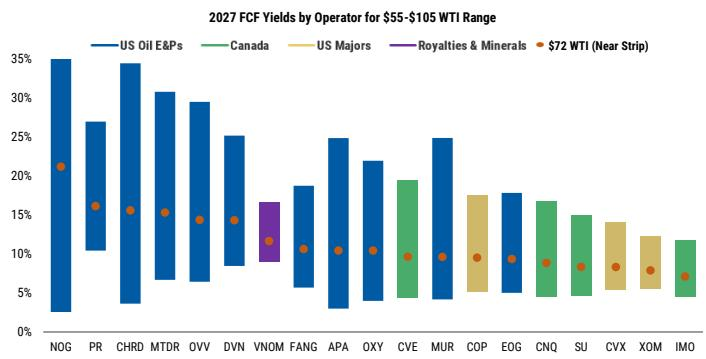

bar chart

| Operator | US Oil E&P's | Canada | US Majors | Royalties & Minerals | $72 WTI (Near Strip) |
| -------- | ------------ | ------ | --------- | --------------------- | -------------------- |
| NOG      | 35%          | -      | -         | -                     | 21%                  |
| PR       | 27%          | -      | -         | -                     | 16%                  |
| CHRD     | 34%          | -      | -         | -                     | 15%                  |
| MTDR     | 31%          | -      | -         | -                     | 15%                  |
| OVV      | 29%          | -      | -         | -                     | 14%                  |
| DVN      | 25%          | -      | -         | -                     | 14%                  |
| VNOM     | -            | -      | -         | 10%                   | 12%                  |
| FANG     | 19%          | -      | -         | -                     | 11%                  |
| APA      | 25%          | -      | -         | -                     | 10%                  |
| OXY      | 22%          | -      | -         | -                     | 10%                  |
| CVE      | -            | 20%    | -         | -                     | 9%                   |
| MUR      | 25%          | -      | -         | -                     | 9%                   |
| COP      | -            | -      | 18%       | -                     | 9%                   |
| EOG      | 18%          | -      | -         | -                     | 9%                   |
| CNQ      | -            | 17%    | -         | -                     | 9%                   |
| SU       | -            | -      | -         | -                     | 8%                   |
| CVX      | -            | -      | 14%       | -                     | 8%                   |
| XOM      | -            | -      | 12%       | -                     | 8%                   |
| IMO      | -            | 12%    | -         | -                     | 7%                   |

Source: FactSet, MS estimates. Note: Y-axis was cut off at 35%.

Exhibit 14: We estimate total shareholder return yield of 8% at current strip for our oil-weighted coverage. This would increase to 13% at \$105 WTI and decrease to 5% at \$55.  
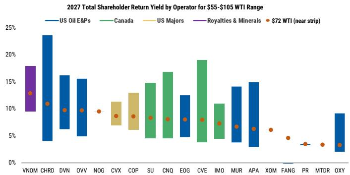

bar chart

| Operator | US Oil E&P's | Canada | US Majors | Royalties & Minerals | $72 WTI (near strip) |
| -------- | ------------ | ------ | --------- | --------------------- | -------------------- |
| VNOM     | -            | -      | -         | 18%                   | 13%                  |
| CHRD     | 24%          | -      | -         | -                     | 11%                  |
| DVN      | 16%          | -      | -         | -                     | 10%                  |
| OVV      | 15%          | -      | -         | -                     | 10%                  |
| NOG      | -            | -      | -         | -                     | 9%                   |
| CVX      | -            | 11%    | -         | -                     | 8%                   |
| COP      | -            | -      | 13%       | -                     | 8%                   |
| SU       | -            | 15%    | -         | -                     | 8%                   |
| CNQ      | -            | 17%    | -         | -                     | 8%                   |
| EOG      | 12%          | -      | -         | -                     | 8%                   |
| CVE      | -            | 19%    | -         | -                     | 8%                   |
| IMO      | -            | 11%    | -         | -                     | 7%                   |
| MUR      | 14%          | -      | -         | -                     | 6%                   |
| APA      | 15%          | -      | -         | -                     | 6%                   |
| XOM      | -            | -      | -         | -                     | 6%                   |
| FANG     | -            | -      | -         | -                     | 4%                   |
| PR       | -            | -      | -         | -                     | 3%                   |
| MTDR     | -            | -      | -         | -                     | 3%                   |
| OXY      | 9%           | -      | -         | -                     | 3%                   |

Source: FactSet, MS estimates

Exhibit 16: Gas E&Ps offer an average 2027 FCF yield of 9% at \$3.50 (near the HH strip). This would rise to 14% at \$4.50 and fall to 4% at \$2.50.  
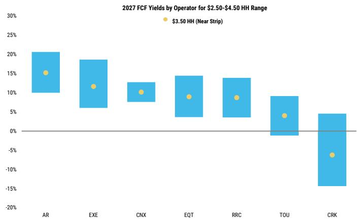

bar chart

| Operator | Yield |
| -------- | ----- |
| AR       | 15%   |
| EXE      | 12%   |
| CNX      | 10%   |
| EQT      | 9%    |
| RRC      | 8%    |
| TOU      | 4%    |
| CRK      | -6%   |

Source: FactSet, MS estimates

Exhibit 13: We estimate consensus is currently pricing in \~\$72 WTI (near strip) in 2027 for our oil-weighted coverage.  
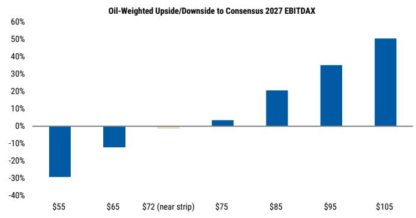

bar chart

Oil-Weighted Upside/Downside to Consensus 2027 EBITDAX
| Price Range | Change (%) |
| :--- | :--- |
| $55 | -30 |
| $65 | -10 |
| $72 (near strip) | -1 |
| $75 | 3 |
| $85 | 20 |
| $95 | 35 |
| $105 | 50 |

Source: FactSet, MS estimates

Exhibit 15: Oil E&Ps have roughly 5% of their production hedged in 2027.  
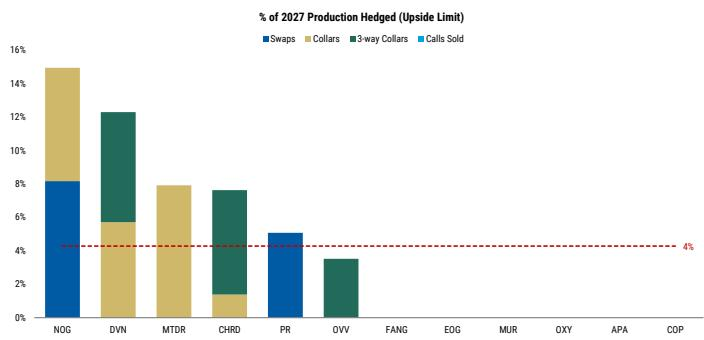

bar chart

| Company | Swaps | Collars | 3-way Collars | Calls Sold |
|---------|-------|---------|---------------|------------|
| NOG     | 8%    | 9%      | -             | -          |
| DVN     | -     | 6%      | -             | -          |
| MTDR    | -     | 8%      | -             | -          |
| CHRD    | -     | 2%      | -             | -          |
| PR      | 5%    | -       | -             | -          |
| OVV     | -     | -       | 3%            | -          |
| FANG    | -     | -       | -             | -          |
| EDG     | -     | -       | -             | -          |
| MUR     | -     | -       | -             | -          |
| OXY     | -     | -       | -             | -          |
| APA     | -     | -       | -             | -          |
| COP     | -     | -       | -             | -          |

Source: Company filings, MS estimates

Exhibit 17: Gas E&Ps have hedged \~30% of estimated 2027 production on average.  
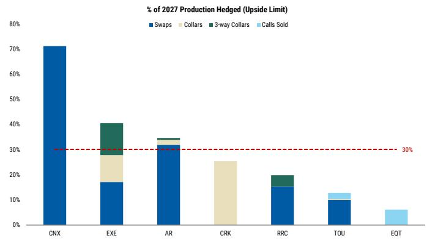

stacked bar chart

% of 2027 Production Hedged (Upside Limit)
| Company | Swaps (%) | Collars (%) | 3-way Collars (%) | Calls Sold (%) |
| :--- | :--- | :--- | :--- | :--- |
| CNX | 71 | 0 | 0 | 0 |
| EXE | 17 | 14 | 15 | 0 |
| AR | 31 | 1 | 1 | 0 |
| CRK | 0 | 25 | 0 | 0 |
| RRC | 15 | 0 | 5 | 0 |
| TOU | 10 | 0 | 0 | 3 |
| EQT | 0 | 0 | 0 | 6 |
The red dashed line at 30% indicates a threshold for the production hedging. The legend defines four categories: Swaps, Collars, 3-way Collars, and Calls Sold.

Source: Company filings, MS estimates

Exhibit 18: The US Oil E&P sector reflects an average WTI price of \~\$66/bbl, or \~13% below 12-month strip of \~\$75/bbl.  
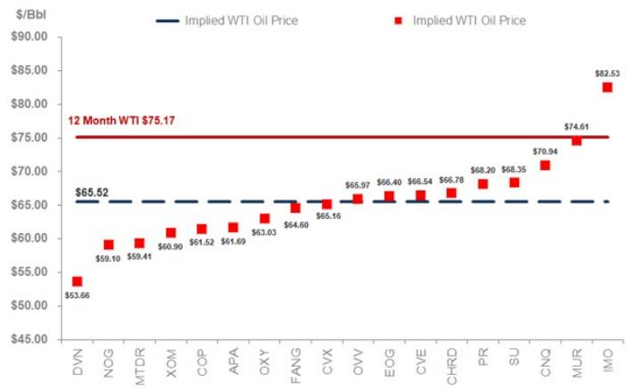

bar-line hybrid chart

| Ticker | Implied WTI Oil Price ($/Bbl) |
| :--- | :--- |
| DVN | 65.52 |
| NOG | 59.10 |
| MTDR | 59.41 |
| XOM | 60.90 |
| COP | 61.52 |
| APA | 61.69 |
| OXY | 63.03 |
| FANG | 64.60 |
| CVX | 65.16 |
| OVV | 65.97 |
| EOG | 66.40 |
| CVE | 66.54 |
| CHRD | 66.78 |
| PR | 68.20 |
| SU | 68.35 |
| CNQ | 70.94 |
| MUR | 74.61 |
| IMO | 82.53 |
12 Month WTI $75.17

Source: Bloomberg, FactSet, MS estimates. Note: Intraday prices as of 6.15.2026.

Exhibit 19: Gas E&Ps reflect a median Henry Hub price of \~\$3.38/mmbtu, in-line with 12-month strip.  
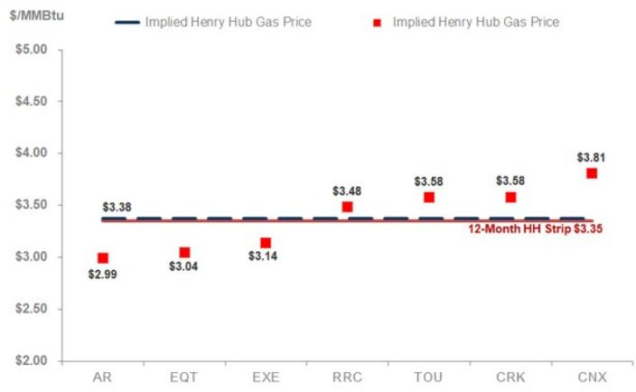

bar-line hybrid

| Entity | Implied Henry Hub Gas Price ($/MMBtu) | Implied Henry Hub Gas Price ($/MMBtu) |
| :--- | :--- | :--- |
| AR | 3.38 | 2.99 |
| EQT | 3.38 | 3.04 |
| EXE | 3.38 | 3.14 |
| RRC | 3.38 | 3.48 |
| TOU | 3.38 | 3.58 |
| CRK | 3.38 | 3.58 |
| CNX | 3.38 | 3.81 |
12-Month HH Strip $3.35

Source: Bloomberg, FactSet, MS estimates. Note: Intraday prices as of 6.15.2026.

## Sensitizing Oil Prices

# \$80 WTI in 2026 (near the average of YTD actual prices and the balance of year strip)

Exhibit 20: We estimate a median 2026 FCF yield of 12% for oil producers.  
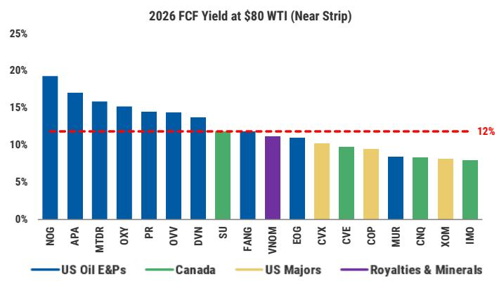

bar chart

| Ticker | Yield |
| ------ | ----- |
| NOG    | 19%   |
| APA    | 17%   |
| MTDR   | 16%   |
| OXY    | 15%   |
| PR     | 14%   |
| OVV    | 14%   |
| DVN    | 13%   |
| SU     | 12%   |
| FANG   | 12%   |
| VNOM   | 11%   |
| EOG    | 11%   |
| CVX    | 10%   |
| CVE    | 10%   |
| COP    | 9%    |
| MUR    | 8%    |
| CNQ    | 8%    |
| XOM    | 8%    |
| IMO    | 8%    |

Source: FactSet, MS estimates.

Exhibit 22: The median EV/EBITDAX at \$80 WTI is 4.7x.  
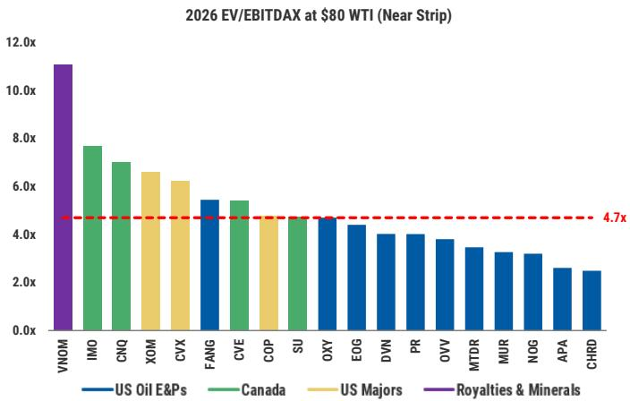

bar chart

| Ticker | US Oil E&P's | Canada | US Majors | Royalties & Minerals |
| ------ | ------------ | ------ | --------- | --------------------- |
| VNOM   | -            | -      | -         | 11.0x                 |
| IMO    | -            | 7.5x   | -         | -                     |
| CNQ    | -            | 7.0x   | -         | -                     |
| XOM    | -            | -      | 6.5x      | -                     |
| CVX    | -            | -      | 6.0x      | -                     |
| FANG   | -            | -      | -         | -                     |
| CVE    | -            | 5.0x   | -         | -                     |
| COP    | -            | -      | 4.5x      | -                     |
| SU     | -            | 4.5x   | -         | -                     |
| OXY    | -            | -      | -         | 4.5x                  |
| EOG    | -            | -      | -         | 4.0x                  |
| DVN    | -            | -      | -         | 4.0x                  |
| PR     | -            | -      | -         | 4.0x                  |
| OVV    | -            | -      | -         | 3.5x                  |
| MTDR   | -            | -      | -         | 3.0x                  |
| MUR    | -            | -      | -         | 3.0x                  |
| NOG    | -            | -      | -         | 3.0x                  |
| APA    | -            | -      | -         | 2.5x                  |
| CHRD   | -            | -      | -         | 2.5x                  |
4.7x   |

Source: FactSet, MS estimates.

\$72 WTI in 2027 (near strip)

Exhibit 21: The median for total shareholder return sits at 8%.  
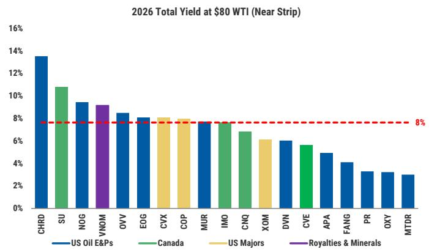

bar chart

| Ticker | US Oil E&Ps | Canada | US Majors | Royalties & Minerals |
| ------ | ----------- | ------ | --------- | --------------------- |
| CHRD   | 13.5%       | -      | -         | -                     |
| SU     | -           | 10.8%  | -         | -                     |
| NOG    | 9.4%        | -      | -         | -                     |
| VNOM   | -           | -      | -         | 9.2%                  |
| OVV    | 8.5%        | -      | -         | -                     |
| EOG    | 8.1%        | -      | -         | -                     |
| CVX    | -           | -      | 8.1%      | -                     |
| COP    | -           | -      | 7.9%      | -                     |
| MUR    | 7.7%        | -      | -         | -                     |
| IMO    | -           | 7.6%   | -         | -                     |
| CNQ    | -           | -      | -         | -                     |
| XOM    | -           | -      | 6.1%      | -                     |
| DVN    | -           | -      | -         | -                     |
| CVE    | -           | -      | -         | -                     |
| APA    | 4.9%        | -      | -         | -                     |
| FANG   | 4.1%        | -      | -         | -                     |
| PR     | 3.2%        | -      | -         | -                     |
| OXY    | 3.1%        | -      | -         | -                     |
| MTDR   | 2.9%        | -      | -         | -                     |

Source: FactSet, MS estimates.

Exhibit 23: Net leverage for the group sits at 0.5x.  
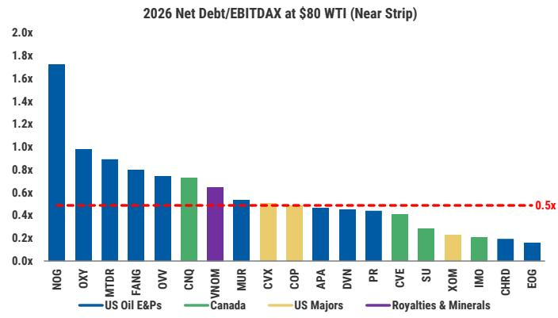

bar chart

| Ticker | Net Debt/EBITDAX |
| ------ | ---------------- |
| NOG    | 1.7x             |
| OXY    | 1.0x             |
| MTDR   | 0.9x             |
| FANG   | 0.8x             |
| OVV    | 0.7x             |
| CNQ    | 0.7x             |
| VNOM   | 0.6x             |
| MUR    | 0.5x             |
| CVX    | 0.5x             |
| COP    | 0.5x             |
| APA    | 0.5x             |
| DVN    | 0.5x             |
| PR     | 0.4x             |
| CVE    | 0.4x             |
| SU     | 0.3x             |
| XOM    | 0.2x             |
| IMO    | 0.2x             |
| CHRD   | 0.2x             |
| EOG    | 0.2x             |

Source: FactSet, MS estimates.

Exhibit 24: We estimate median 2027 FCF yield of 11% for our oil producer coverage ( $\sim$ 13% for just E&Ps), with the highest from PR, CHRD & DVN.  
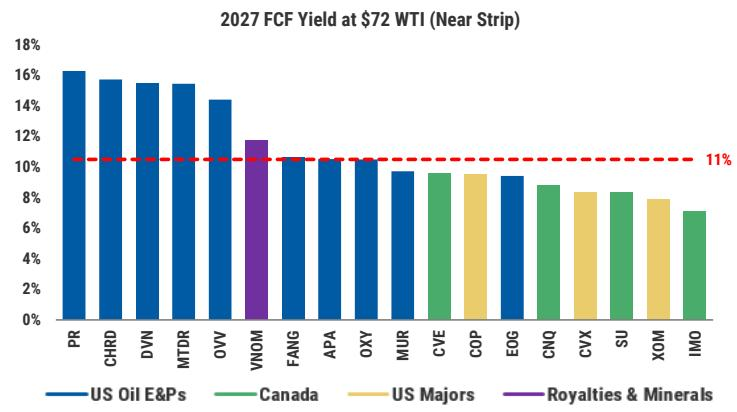

bar chart

| Ticker | Yield |
| ------ | ----- |
| PR     | 16%   |
| CHRD   | 15%   |
| DVN    | 15%   |
| MTDR   | 15%   |
| OVV    | 14%   |
| VNOM   | 12%   |
| FANG   | 10%   |
| APA    | 10%   |
| OXY    | 10%   |
| MUR    | 10%   |
| CVE    | 10%   |
| COP    | 10%   |
| EOG    | 10%   |
| CNQ    | 10%   |
| CVX    | 10%   |
| SU     | 10%   |
| XOM    | 10%   |
| IMO    | 8%    |

Source: FactSet, MS estimates.

Exhibit 25: The median total shareholder return yield for the group sits at 8%.  
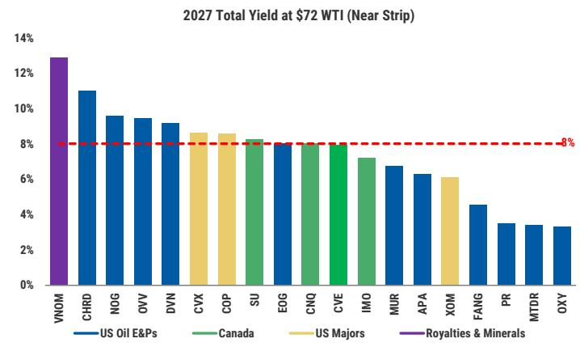

bar chart

| Ticker | US Oil E&Ps | Canada | US Majors | Royalties & Minerals |
| ------ | ----------- | ------ | --------- | --------------------- |
| VNOM   | -           | -      | -         | 13%                   |
| CHRD   | -           | -      | -         | -                     |
| NOG    | -           | -      | -         | -                     |
| OVV    | -           | -      | -         | -                     |
| DVN    | -           | -      | -         | -                     |
| CVX    | -           | -      | 8.5%      | -                     |
| COP    | -           | -      | 8.5%      | -                     |
| SU     | -           | 8.5%   | -         | -                     |
| EOG    | -           | -      | -         | 8%                    |
| CNQ    | -           | 8%     | -         | -                     |
| CVE    | -           | 8%     | -         | -                     |
| IMO    | -           | 7.5%   | -         | -                     |
| MUR    | -           | -      | -         | -                     |
| APA    | -           | -      | -         | -                     |
| XOM    | -           | -      | 6%        | -                     |
| FANG   | -           | -      | -         | 4.5%                  |
| PR     | -           | -      | -         | 3.5%                  |
| MTDR   | -           | -      | -         | 3.5%                  |
| OXY    | -           | -      | -         | 3.5%                  |

Source: FactSet, MS estimates.

Exhibit 26: We estimate EV/EBITDAX for oil producers next year at roughly 4.7x.  
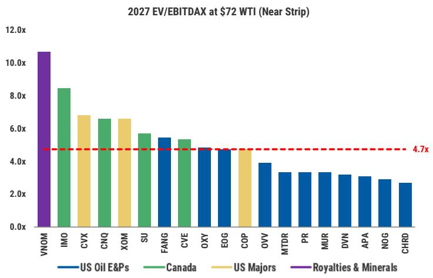

bar chart

| Ticker | US Oil E&Ps | Canada | US Majors | Royalties & Minerals |
| ------ | ----------- | ------ | --------- | -------------------- |
| VNOM   | -           | -      | -         | 10.8x                |
| IMO    | -           | 8.5x   | -         | -                    |
| CVX    | -           | -      | 6.8x      | -                    |
| CNQ    | -           | -      | 6.6x      | -                    |
| XOM    | -           | -      | 6.5x      | -                    |
| SU     | -           | -      | -         | -                    |
| FANG   | -           | -      | -         | -                    |
| CVE    | -           | -      | -         | -                    |
| OXY    | -           | -      | -         | -                    |
| EOG    | -           | -      | -         | -                    |
| COP    | -           | -      | 4.7x      | -                    |
| OVV    | -           | -      | -         | -                    |
| MTDR   | -           | -      | -         | -                    |
| PR     | -           | -      | -         | -                    |
| MUR    | -           | -      | -         | -                    |
| DVN    | -           | -      | -         | -                    |
| APA    | -           | -      | -         | -                    |
| NOG    | -           | -      | -         | -                    |
| CHRD   | -           | -      | -         | 2.7x                 |
4.7x   |

Source: FactSet, MS estimates.

Exhibit 27: Net debt/EBITDAX sits at 0.5x, with the lowest from PR, CHRD and EOG.  
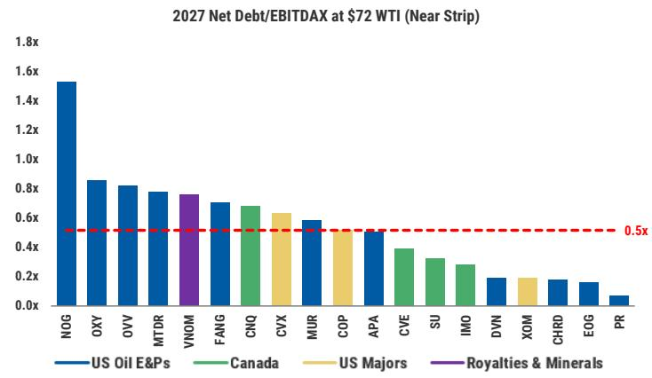

bar chart

| Ticker | Net Debt/EBITDAX |
| ------ | ---------------- |
| NOG    | 1.5x             |
| OXY    | 0.9x             |
| OVV    | 0.8x             |
| MTDR   | 0.8x             |
| VNOM   | 0.7x             |
| FANG   | 0.7x             |
| CNQ    | 0.6x             |
| CVX    | 0.6x             |
| MUR    | 0.5x             |
| COP    | 0.5x             |
| APA    | 0.5x             |
| CVE    | 0.4x             |
| SU     | 0.3x             |
| IMO    | 0.3x             |
| DVN    | 0.2x             |
| XOM    | 0.2x             |
| CHRD   | 0.2x             |
| EOG    | 0.2x             |
| PR     | 0.1x             |

Source: FactSet, MS estimates.

Exhibit 28:  
Sensitivities - FCF yields across \$55-105 WTI

<table><tr><td rowspan="2">Company</td><td rowspan="2">Ticker</td><td colspan="5">2026E FCF/Equity yield (Pre-Div)</td><td colspan="6">2027E FCF/Equity yield (Pre-Div)</td></tr><tr><td>$65 WTI</td><td>$75 WTI</td><td>$85 WTI</td><td>$95 WTI</td><td>$105 WTI</td><td>$55 WTI</td><td>$65 WTI</td><td>$75 WTI</td><td>$85 WTI</td><td>$95 WTI</td><td>$105 WTI</td></tr><tr><td colspan="13">US Majors</td></tr><tr><td>Chevron Corp.</td><td>CVX</td><td>8%</td><td>10%</td><td>11%</td><td>12%</td><td>14%</td><td>5%</td><td>7%</td><td>9%</td><td>11%</td><td>12%</td><td>14%</td></tr><tr><td>Exxon Mobil Corporation</td><td>XOM</td><td>6%</td><td>7%</td><td>9%</td><td>10%</td><td>12%</td><td>6%</td><td>7%</td><td>8%</td><td>10%</td><td>11%</td><td>12%</td></tr><tr><td>US Majors Median</td><td></td><td>7%</td><td>9%</td><td>10%</td><td>11%</td><td>13%</td><td>5%</td><td>7%</td><td>9%</td><td>10%</td><td>12%</td><td>13%</td></tr><tr><td colspan="13">Canada</td></tr><tr><td>Canadian Natural Resources Ltd</td><td>CNQ</td><td>5%</td><td>7%</td><td>10%</td><td>12%</td><td>14%</td><td>5%</td><td>7%</td><td>10%</td><td>12%</td><td>14%</td><td>17%</td></tr><tr><td>Cenovus Energy Inc</td><td>CVE</td><td>6%</td><td>8%</td><td>11%</td><td>14%</td><td>17%</td><td>4%</td><td>8%</td><td>11%</td><td>13%</td><td>16%</td><td>19%</td></tr><tr><td>Imperial Oil Ltd</td><td>IMO</td><td>6%</td><td>7%</td><td>9%</td><td>10%</td><td>12%</td><td>5%</td><td>6%</td><td>7%</td><td>9%</td><td>10%</td><td>12%</td></tr><tr><td>Suncor Energy Inc</td><td>SU</td><td>9%</td><td>11%</td><td>13%</td><td>15%</td><td>17%</td><td>5%</td><td>7%</td><td>9%</td><td>11%</td><td>13%</td><td>15%</td></tr><tr><td>Canada Median</td><td></td><td>6%</td><td>8%</td><td>10%</td><td>13%</td><td>16%</td><td>5%</td><td>7%</td><td>9%</td><td>11%</td><td>14%</td><td>16%</td></tr><tr><td colspan="13">Oil E&amp;Ps</td></tr><tr><td>APA Corp.</td><td>APA</td><td>11%</td><td>15%</td><td>19%</td><td>24%</td><td>28%</td><td>3%</td><td>7%</td><td>12%</td><td>16%</td><td>21%</td><td>25%</td></tr><tr><td>Chord Energy Corp.</td><td>CHRD</td><td>11%</td><td>17%</td><td>22%</td><td>28%</td><td>33%</td><td>4%</td><td>11%</td><td>18%</td><td>24%</td><td>30%</td><td>35%</td></tr><tr><td>ConocoPhillips</td><td>COP</td><td>6%</td><td>8%</td><td>11%</td><td>13%</td><td>15%</td><td>5%</td><td>8%</td><td>10%</td><td>13%</td><td>15%</td><td>18%</td></tr><tr><td>Devon Energy Corp.</td><td>DVN</td><td>14%</td><td>14%</td><td>14%</td><td>15%</td><td>17%</td><td>8%</td><td>14%</td><td>16%</td><td>19%</td><td>22%</td><td>25%</td></tr><tr><td>Diamondback Energy, Inc.</td><td>FANG</td><td>8%</td><td>11%</td><td>13%</td><td>16%</td><td>18%</td><td>6%</td><td>9%</td><td>11%</td><td>14%</td><td>16%</td><td>19%</td></tr><tr><td>EOG Resources Inc.</td><td>EOG</td><td>7%</td><td>10%</td><td>12%</td><td>15%</td><td>17%</td><td>5%</td><td>8%</td><td>10%</td><td>13%</td><td>15%</td><td>18%</td></tr><tr><td>Matador Resources Co.</td><td>MTDR</td><td>12%</td><td>15%</td><td>17%</td><td>19%</td><td>22%</td><td>7%</td><td>12%</td><td>17%</td><td>22%</td><td>27%</td><td>31%</td></tr><tr><td>Murphy Oil Corp.</td><td>MUR</td><td>0%</td><td>6%</td><td>11%</td><td>16%</td><td>21%</td><td>4%</td><td>7%</td><td>11%</td><td>16%</td><td>21%</td><td>25%</td></tr><tr><td>Northern Oil and Gas, Inc</td><td>NOG</td><td>12%</td><td>17%</td><td>22%</td><td>25%</td><td>27%</td><td>3%</td><td>14%</td><td>25%</td><td>36%</td><td>44%</td><td>51%</td></tr><tr><td>Occidental Petroleum Corp.</td><td>OXY</td><td>10%</td><td>14%</td><td>17%</td><td>20%</td><td>22%</td><td>4%</td><td>8%</td><td>12%</td><td>15%</td><td>19%</td><td>22%</td></tr><tr><td>Ovintiv Inc</td><td>OVV</td><td>9%</td><td>13%</td><td>16%</td><td>20%</td><td>23%</td><td>6%</td><td>11%</td><td>16%</td><td>20%</td><td>25%</td><td>30%</td></tr><tr><td>Permian Resources Corp.</td><td>PR</td><td>11%</td><td>13%</td><td>16%</td><td>18%</td><td>21%</td><td>11%</td><td>14%</td><td>17%</td><td>21%</td><td>24%</td><td>27%</td></tr><tr><td>Oil E&amp;Ps Median</td><td></td><td>10%</td><td>13%</td><td>16%</td><td>19%</td><td>21%</td><td>5%</td><td>10%</td><td>14%</td><td>17%</td><td>21%</td><td>25%</td></tr><tr><td colspan="13">Royalties &amp; Minerals</td></tr><tr><td>Viper Energy, Inc.</td><td>VNOM</td><td>9%</td><td>11%</td><td>12%</td><td>13%</td><td>15%</td><td>9%</td><td>11%</td><td>12%</td><td>14%</td><td>15%</td><td>17%</td></tr></table>

Source: FactSet, MS estimates

Exhibit 29:  
Total Yield (Dividends + Buybacks)

<table><tr><td rowspan="2">Company</td><td rowspan="2">Ticker</td><td colspan="5">2026E Total Shareholder Return Yield</td><td colspan="6">2027E Total Shareholder Return Yield</td></tr><tr><td>$65 WTI</td><td>$75 WTI</td><td>$85 WTI</td><td>$95 WTI</td><td>$105 WTI</td><td>$55 WTI</td><td>$65 WTI</td><td>$75 WTI</td><td>$85 WTI</td><td>$95 WTI</td><td>$105 WTI</td></tr><tr><td colspan="13">US Majors</td></tr><tr><td>Chevron Corp.</td><td>CVX</td><td>7%</td><td>8%</td><td>8%</td><td>9%</td><td>10%</td><td>7%</td><td>8%</td><td>9%</td><td>9%</td><td>10%</td><td>11%</td></tr><tr><td>Exxon Mobil Corporation</td><td>XOM</td><td>6%</td><td>6%</td><td>6%</td><td>6%</td><td>6%</td><td>6%</td><td>6%</td><td>6%</td><td>6%</td><td>6%</td><td>6%</td></tr><tr><td>US Majors Median</td><td></td><td>7%</td><td>7%</td><td>7%</td><td>8%</td><td>8%</td><td>7%</td><td>7%</td><td>7%</td><td>8%</td><td>8%</td><td>9%</td></tr><tr><td colspan="13">Canada</td></tr><tr><td>Canadian Natural Resources Ltd</td><td>CNQ</td><td>4%</td><td>6%</td><td>8%</td><td>9%</td><td>11%</td><td>5%</td><td>6%</td><td>9%</td><td>11%</td><td>14%</td><td>17%</td></tr><tr><td>Cenovus Energy Inc</td><td>CVE</td><td>3%</td><td>5%</td><td>7%</td><td>9%</td><td>11%</td><td>4%</td><td>6%</td><td>9%</td><td>11%</td><td>15%</td><td>19%</td></tr><tr><td>Imperial Oil Ltd</td><td>IMO</td><td>5%</td><td>7%</td><td>8%</td><td>10%</td><td>12%</td><td>4%</td><td>6%</td><td>8%</td><td>9%</td><td>10%</td><td>11%</td></tr><tr><td>Suncor Energy Inc</td><td>SU</td><td>7%</td><td>9%</td><td>12%</td><td>15%</td><td>17%</td><td>5%</td><td>7%</td><td>9%</td><td>11%</td><td>13%</td><td>15%</td></tr><tr><td>Canada Median</td><td></td><td>5%</td><td>6%</td><td>8%</td><td>10%</td><td>12%</td><td>4%</td><td>6%</td><td>9%</td><td>11%</td><td>13%</td><td>16%</td></tr><tr><td colspan="13">Oil E&amp;Ps</td></tr><tr><td>APA Corp.</td><td>APA</td><td>4%</td><td>5%</td><td>5%</td><td>6%</td><td>7%</td><td>3%</td><td>4%</td><td>7%</td><td>10%</td><td>12%</td><td>15%</td></tr><tr><td>Chord Energy Corp.</td><td>CHRD</td><td>8%</td><td>12%</td><td>16%</td><td>19%</td><td>22%</td><td>4%</td><td>8%</td><td>12%</td><td>17%</td><td>20%</td><td>24%</td></tr><tr><td>ConocoPhillips</td><td>COP</td><td>6%</td><td>7%</td><td>8%</td><td>10%</td><td>11%</td><td>6%</td><td>8%</td><td>9%</td><td>10%</td><td>12%</td><td>13%</td></tr><tr><td>Devon Energy Corp.</td><td>DVN</td><td>6%</td><td>6%</td><td>6%</td><td>7%</td><td>7%</td><td>6%</td><td>8%</td><td>10%</td><td>11%</td><td>14%</td><td>16%</td></tr><tr><td>Diamondback Energy, Inc.</td><td>FANG</td><td>5%</td><td>4%</td><td>4%</td><td>4%</td><td>4%</td><td>4%</td><td>5%</td><td>4%</td><td>3%</td><td>3%</td><td>3%</td></tr><tr><td>EOG Resources Inc.</td><td>EOG</td><td>6%</td><td>7%</td><td>9%</td><td>10%</td><td>12%</td><td>5%</td><td>7%</td><td>8%</td><td>10%</td><td>11%</td><td>13%</td></tr><tr><td>Matador Resources Co.</td><td>MTDR</td><td>3%</td><td>3%</td><td>3%</td><td>3%</td><td>3%</td><td>3%</td><td>3%</td><td>3%</td><td>3%</td><td>3%</td><td>3%</td></tr><tr><td>Murphy Oil Corp.</td><td>MUR</td><td>5%</td><td>7%</td><td>9%</td><td>11%</td><td>13%</td><td>4%</td><td>5%</td><td>7%</td><td>10%</td><td>12%</td><td>14%</td></tr><tr><td>Northern Oil and Gas, Inc</td><td>NOG</td><td>9%</td><td>9%</td><td>9%</td><td>9%</td><td>9%</td><td>10%</td><td>10%</td><td>10%</td><td>10%</td><td>10%</td><td>10%</td></tr><tr><td>Occidental Petroleum Corp.</td><td>OXY</td><td>2%</td><td>3%</td><td>4%</td><td>5%</td><td>6%</td><td>2%</td><td>2%</td><td>4%</td><td>6%</td><td>7%</td><td>9%</td></tr><tr><td>Ovintiv Inc</td><td>OVV</td><td>6%</td><td>8%</td><td>9%</td><td>10%</td><td>12%</td><td>5%</td><td>8%</td><td>10%</td><td>12%</td><td>14%</td><td>16%</td></tr><tr><td>Permian Resources Corp.</td><td>PR</td><td>3%</td><td>3%</td><td>3%</td><td>3%</td><td>3%</td><td>3%</td><td>4%</td><td>4%</td><td>4%</td><td>4%</td><td>4%</td></tr><tr><td>Oil E&amp;Ps Median</td><td></td><td>5%</td><td>6%</td><td>7%</td><td>8%</td><td>8%</td><td>4%</td><td>6%</td><td>8%</td><td>10%</td><td>11%</td><td>13%</td></tr><tr><td colspan="13">Royalties &amp; Minerals</td></tr><tr><td>Viper Energy, Inc.</td><td>VNOM</td><td>7%</td><td>9%</td><td>10%</td><td>11%</td><td>12%</td><td>10%</td><td>12%</td><td>13%</td><td>15%</td><td>16%</td><td>18%</td></tr></table>

Source: FactSet, MS estimates

Exhibit 30:  
EV/EBITDAX Multiples

<table><tr><td rowspan="2">Company</td><td rowspan="2">Ticker</td><td colspan="5">2026E EV/EBITDAX</td><td colspan="6">2027E EV/EBITDAX</td></tr><tr><td>$65 WTI</td><td>$75 WTI</td><td>$85 WTI</td><td>$95 WTI</td><td>$105 WTI</td><td>$55 WTI</td><td>$65 WTI</td><td>$75 WTI</td><td>$85 WTI</td><td>$95 WTI</td><td>$105 WTI</td></tr><tr><td colspan="13">US Majors</td></tr><tr><td>Chevron Corp.</td><td>CVX</td><td>7.7x</td><td>6.7x</td><td>5.8x</td><td>5.2x</td><td>4.6x</td><td>9.1x</td><td>7.5x</td><td>6.5x</td><td>5.5x</td><td>4.8x</td><td>4.2x</td></tr><tr><td>Exxon Mobil Corporation</td><td>XOM</td><td>8.0x</td><td>7.0x</td><td>6.1x</td><td>5.5x</td><td>5.0x</td><td>8.5x</td><td>7.2x</td><td>6.3x</td><td>5.4x</td><td>4.8x</td><td>4.2x</td></tr><tr><td>US Majors Median</td><td></td><td>7.8x</td><td>6.9x</td><td>6.0x</td><td>5.4x</td><td>4.8x</td><td>8.8x</td><td>7.4x</td><td>6.4x</td><td>5.5x</td><td>4.8x</td><td>4.2x</td></tr><tr><td colspan="13">Canada</td></tr><tr><td>Canadian Natural Resources Ltd</td><td>CNQ</td><td>9.7x</td><td>7.9x</td><td>6.1x</td><td>5.3x</td><td>4.4x</td><td>10.1x</td><td>7.5x</td><td>6.2x</td><td>4.9x</td><td>4.2x</td><td>3.5x</td></tr><tr><td>Cenovus Energy Inc</td><td>CVE</td><td>7.5x</td><td>6.1x</td><td>4.7x</td><td>4.1x</td><td>3.4x</td><td>8.6x</td><td>6.2x</td><td>5.0x</td><td>3.9x</td><td>3.3x</td><td>2.7x</td></tr><tr><td>Imperial Oil Ltd</td><td>IMO</td><td>9.9x</td><td>8.4x</td><td>7.0x</td><td>6.2x</td><td>5.4x</td><td>12.2x</td><td>9.5x</td><td>8.0x</td><td>6.6x</td><td>5.7x</td><td>4.8x</td></tr><tr><td>Suncor Energy Inc</td><td>SU</td><td>5.8x</td><td>5.1x</td><td>4.4x</td><td>4.0x</td><td>3.6x</td><td>8.3x</td><td>6.4x</td><td>5.4x</td><td>4.5x</td><td>3.9x</td><td>3.3x</td></tr><tr><td>Canada Median</td><td></td><td>8.6x</td><td>7.0x</td><td>5.4x</td><td>4.7x</td><td>4.0x</td><td>9.3x</td><td>6.9x</td><td>5.8x</td><td>4.7x</td><td>4.1x</td><td>3.4x</td></tr><tr><td colspan="13">Oil E&amp;Ps</td></tr><tr><td>APA Corp.</td><td>APA</td><td>3.3x</td><td>2.8x</td><td>2.4x</td><td>2.1x</td><td>1.8x</td><td>4.5x</td><td>3.5x</td><td>2.9x</td><td>2.3x</td><td>2.0x</td><td>1.6x</td></tr><tr><td>Chord Energy Corp.</td><td>CHRD</td><td>3.4x</td><td>2.8x</td><td>2.2x</td><td>1.9x</td><td>1.6x</td><td>5.0x</td><td>3.3x</td><td>2.5x</td><td>1.7x</td><td>1.3x</td><td>0.8x</td></tr><tr><td>ConocoPhillips</td><td>COP</td><td>6.1x</td><td>5.2x</td><td>4.3x</td><td>3.8x</td><td>3.3x</td><td>6.7x</td><td>5.3x</td><td>4.5x</td><td>3.6x</td><td>3.1x</td><td>2.6x</td></tr><tr><td>Devon Energy Corp.</td><td>DVN</td><td>3.9x</td><td>4.0x</td><td>4.1x</td><td>3.8x</td><td>3.5x</td><td>5.1x</td><td>3.5x</td><td>3.1x</td><td>2.7x</td><td>2.4x</td><td>2.0x</td></tr><tr><td>Diamondback Energy, Inc.</td><td>FANG</td><td>7.1x</td><td>6.0x</td><td>4.9x</td><td>4.3x</td><td>3.7x</td><td>7.9x</td><td>6.2x</td><td>5.2x</td><td>4.1x</td><td>3.6x</td><td>3.0x</td></tr><tr><td>EOG Resources Inc.</td><td>EOG</td><td>5.6x</td><td>4.8x</td><td>4.0x</td><td>3.6x</td><td>3.1x</td><td>6.5x</td><td>5.3x</td><td>4.5x</td><td>3.7x</td><td>3.2x</td><td>2.8x</td></tr><tr><td>Matador Resources Co.</td><td>MTDR</td><td>3.9x</td><td>3.6x</td><td>3.3x</td><td>3.1x</td><td>2.9x</td><td>4.6x</td><td>3.8x</td><td>3.2x</td><td>2.6x</td><td>2.2x</td><td>1.8x</td></tr><tr><td>Murphy Oil Corp.</td><td>MUR</td><td>4.3x</td><td>3.6x</td><td>2.9x</td><td>2.5x</td><td>2.1x</td><td>5.5x</td><td>3.9x</td><td>3.1x</td><td>2.4x</td><td>2.0x</td><td>1.5x</td></tr><tr><td>Northern Oil and Gas, Inc</td><td>NOG</td><td>3.7x</td><td>3.4x</td><td>3.1x</td><td>2.9x</td><td>2.7x</td><td>4.2x</td><td>3.3x</td><td>2.8x</td><td>2.2x</td><td>1.9x</td><td>1.6x</td></tr><tr><td>Occidental Petroleum Corp.</td><td>OXY</td><td>6.1x</td><td>5.2x</td><td>4.2x</td><td>3.8x</td><td>3.3x</td><td>7.5x</td><td>5.6x</td><td>4.6x</td><td>3.6x</td><td>3.0x</td><td>2.5x</td></tr><tr><td>Ovintiv Inc</td><td>OVV</td><td>4.8x</td><td>4.1x</td><td>3.5x</td><td>3.1x</td><td>2.7x</td><td>5.8x</td><td>4.5x</td><td>3.7x</td><td>2.9x</td><td>2.4x</td><td>2.0x</td></tr><tr><td>Permian Resources Corp.</td><td>PR</td><td>4.8x</td><td>4.3x</td><td>3.8x</td><td>3.4x</td><td>3.0x</td><td>4.6x</td><td>3.8x</td><td>3.2x</td><td>2.6x</td><td>2.2x</td><td>1.9x</td></tr><tr><td>Oil E&amp;Ps Median</td><td></td><td>4.6x</td><td>4.1x</td><td>3.6x</td><td>3.2x</td><td>3.0x</td><td>5.3x</td><td>3.8x</td><td>3.2x</td><td>2.7x</td><td>2.3x</td><td>1.9x</td></tr><tr><td colspan="13">Royalties &amp; Minerals</td></tr><tr><td>Viper Energy, Inc.</td><td>VNOM</td><td>13.6x</td><td>11.9x</td><td>10.2x</td><td>9.2x</td><td>8.1x</td><td>13.9x</td><td>11.7x</td><td>10.3x</td><td>8.8x</td><td>7.9x</td><td>7.0x</td></tr></table>

Source: FactSet, MS estimates.

Exhibit 31:  
Leverage - Net debt/EBITDAX

<table><tr><td rowspan="2">Company</td><td rowspan="2">Ticker</td><td colspan="5">2026E Net Debt/EBITDAX</td><td colspan="6">2027E Net Debt/EBITDAX</td></tr><tr><td>$65 WTI</td><td>$75 WTI</td><td>$85 WTI</td><td>$95 WTI</td><td>$105 WTI</td><td>$55 WTI</td><td>$65 WTI</td><td>$75 WTI</td><td>$85 WTI</td><td>$95 WTI</td><td>$105 WTI</td></tr><tr><td colspan="13">US Majors</td></tr><tr><td>Chevron Corp.</td><td>CVX</td><td>0.7x</td><td>0.6x</td><td>0.4x</td><td>0.4x</td><td>0.3x</td><td>1.0x</td><td>0.8x</td><td>0.6x</td><td>0.4x</td><td>0.3x</td><td>0.2x</td></tr><tr><td>Exxon Mobil Corporation</td><td>XOM</td><td>0.4x</td><td>0.3x</td><td>0.2x</td><td>0.1x</td><td>0.0x</td><td>0.6x</td><td>0.3x</td><td>0.1x</td><td>-0.1x</td><td>-0.2x</td><td>-0.3x</td></tr><tr><td>US Majors Median</td><td></td><td>0.5x</td><td>0.4x</td><td>0.3x</td><td>0.2x</td><td>0.2x</td><td>0.8x</td><td>0.5x</td><td>0.4x</td><td>0.2x</td><td>0.1x</td><td>-0.1x</td></tr><tr><td colspan="13">Canada</td></tr><tr><td>Canadian Natural Resources Ltd</td><td>CNQ</td><td>1.1x</td><td>0.8x</td><td>0.6x</td><td>0.5x</td><td>0.4x</td><td>1.3x</td><td>0.8x</td><td>0.6x</td><td>0.5x</td><td>0.4x</td><td>0.4x</td></tr><tr><td>Cenovus Energy Inc</td><td>CVE</td><td>0.7x</td><td>0.5x</td><td>0.3x</td><td>0.3x</td><td>0.2x</td><td>0.8x</td><td>0.5x</td><td>0.3x</td><td>0.2x</td><td>0.2x</td><td>0.2x</td></tr><tr><td>Imperial Oil Ltd</td><td>IMO</td><td>0.3x</td><td>0.2x</td><td>0.2x</td><td>0.2x</td><td>0.2x</td><td>0.4x</td><td>0.3x</td><td>0.3x</td><td>0.2x</td><td>0.2x</td><td>0.1x</td></tr><tr><td>Suncor Energy Inc</td><td>SU</td><td>0.3x</td><td>0.3x</td><td>0.3x</td><td>0.3x</td><td>0.3x</td><td>0.6x</td><td>0.3x</td><td>0.3x</td><td>0.3x</td><td>0.3x</td><td>0.3x</td></tr><tr><td>Canada Median</td><td></td><td>0.5x</td><td>0.4x</td><td>0.3x</td><td>0.3x</td><td>0.2x</td><td>0.7x</td><td>0.4x</td><td>0.3x</td><td>0.3x</td><td>0.3x</td><td>0.2x</td></tr><tr><td colspan="13">Oil E&amp;Ps</td></tr><tr><td>APA Corp.</td><td>APA</td><td>0.7x</td><td>0.5x</td><td>0.4x</td><td>0.3x</td><td>0.2x</td><td>1.0x</td><td>0.6x</td><td>0.4x</td><td>0.2x</td><td>0.1x</td><td>0.0x</td></tr><tr><td>Chord Energy Corp.</td><td>CHRD</td><td>0.4x</td><td>0.3x</td><td>0.1x</td><td>0.0x</td><td>0.0x</td><td>0.9x</td><td>0.4x</td><td>0.1x</td><td>-0.1x</td><td>-0.3x</td><td>-0.5x</td></tr><tr><td>ConocoPhillips</td><td>COP</td><td>0.7x</td><td>0.6x</td><td>0.4x</td><td>0.3x</td><td>0.3x</td><td>0.9x</td><td>0.6x</td><td>0.5x</td><td>0.3x</td><td>0.2x</td><td>0.1x</td></tr><tr><td>Devon Energy Corp.</td><td>DVN</td><td>0.4x</td><td>0.4x</td><td>0.5x</td><td>0.4x</td><td>0.3x</td><td>0.7x</td><td>0.2x</td><td>0.2x</td><td>0.1x</td><td>0.1x</td><td>0.0x</td></tr><tr><td>Diamondback Energy, Inc.</td><td>FANG</td><td>1.2x</td><td>0.9x</td><td>0.7x</td><td>0.5x</td><td>0.4x</td><td>1.4x</td><td>1.0x</td><td>0.6x</td><td>0.2x</td><td>0.1x</td><td>-0.1x</td></tr><tr><td>EOG Resources Inc.</td><td>EOG</td><td>0.3x</td><td>0.2x</td><td>0.1x</td><td>0.1x</td><td>0.0x</td><td>0.3x</td><td>0.2x</td><td>0.1x</td><td>0.0x</td><td>-0.1x</td><td>-0.1x</td></tr><tr><td>Matador Resources Co.</td><td>MTDR</td><td>1.0x</td><td>0.9x</td><td>0.9x</td><td>0.8x</td><td>0.7x</td><td>1.2x</td><td>1.0x</td><td>0.7x</td><td>0.4x</td><td>0.3x</td><td>0.1x</td></tr><tr><td>Murphy Oil Corp.</td><td>MUR</td><td>0.9x</td><td>0.6x</td><td>0.4x</td><td>0.3x</td><td>0.2x</td><td>1.2x</td><td>0.7x</td><td>0.5x</td><td>0.3x</td><td>0.2x</td><td>0.0x</td></tr><tr><td>Northern Oil and Gas, Inc</td><td>NOG</td><td>2.0x</td><td>1.8x</td><td>1.6x</td><td>1.5x</td><td>1.4x</td><td>2.4x</td><td>1.8x</td><td>1.4x</td><td>1.0x</td><td>0.8x</td><td>0.6x</td></tr><tr><td>Occidental Petroleum Corp.</td><td>OXY</td><td>1.4x</td><td>1.1x</td><td>0.8x</td><td>0.7x</td><td>0.6x</td><td>1.7x</td><td>1.0x</td><td>0.8x</td><td>0.5x</td><td>0.4x</td><td>0.2x</td></tr><tr><td>Ovintiv Inc</td><td>OVV</td><td>1.0x</td><td>0.8x</td><td>0.6x</td><td>0.5x</td><td>0.4x</td><td>1.4x</td><td>1.0x</td><td>0.7x</td><td>0.5x</td><td>0.3x</td><td>0.2x</td></tr><tr><td>Permian Resources Corp.</td><td>PR</td><td>0.7x</td><td>0.5x</td><td>0.4x</td><td>0.3x</td><td>0.2x</td><td>0.5x</td><td>0.2x</td><td>0.0x</td><td>-0.2x</td><td>-0.3x</td><td>-0.4x</td></tr><tr><td>Oil E&amp;Ps Median</td><td></td><td>0.8x</td><td>0.6x</td><td>0.4x</td><td>0.4x</td><td>0.3x</td><td>1.1x</td><td>0.7x</td><td>0.5x</td><td>0.3x</td><td>0.1x</td><td>0.0x</td></tr><tr><td colspan="13">Royalties &amp; Minerals</td></tr><tr><td>Viper Energy, Inc.</td><td>VNOM</td><td>0.9x</td><td>0.7x</td><td>0.6x</td><td>0.5x</td><td>0.4x</td><td>1.0x</td><td>0.8x</td><td>0.7x</td><td>0.6x</td><td>0.5x</td><td>0.4x</td></tr></table>

Source: FactSet, MS estimates.

## Sensitizing 2027 Natural Gas prices

Exhibit 32: At \$3.50 Henry Hub in 2027 (near strip), our gas-weighted coverage would offer a median FCF/equity yield of 9%, with the highest for AR and EXE...  
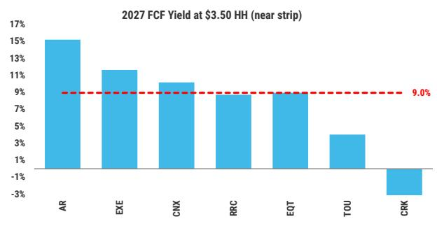

bar chart

| Category | FCF Yield |
| -------- | --------- |
| AR       | 15%       |
| EXE      | 11%       |
| CNX      | 9%        |
| RRC      | 8%        |
| EQT      | 8%        |
| TOU      | 4%        |
| CRK      | -3%       |

Source: FactSet, MS estimates

Exhibit 33: ...with FCF/EV sitting at a median of \~7%.  
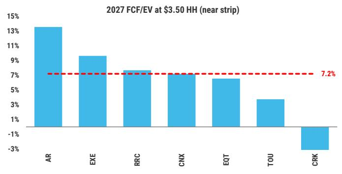

bar chart

| Category | FCF/EV |
| -------- | ------ |
| AR       | 13%    |
| EXE      | 9%     |
| RRC      | 7%     |
| CNX      | 7%     |
| EQT      | 6%     |
| TOU      | 4%     |
| CRK      | -3%    |

Source: FactSet, MS estimates

Exhibit 34: Net Debt/EBITDAX would sit at a median of 0.3x at \$3.50...  
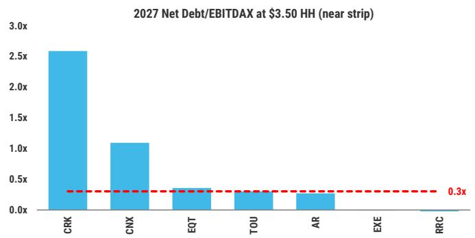

bar chart

| Category | Net Debt/EBITDAX at $3.50 HH (near strip) |
| -------- | ---------------------------------------- |
| CRK      | 2.6x                                     |
| CNX      | 1.1x                                     |
| EQT      | 0.4x                                     |
| TOU      | 0.3x                                     |
| AR       | 0.3x                                     |
| EXE      | 0.0x                                     |
| RRC      | 0.0x                                     |

Source: FactSet, MS estimates

Exhibit 35: ...with EV/EBITDAX at 5.2x  
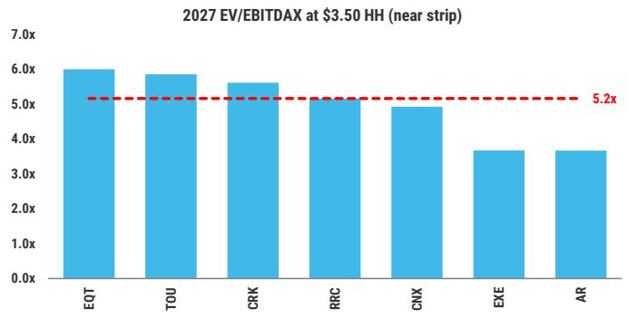

bar chart

| Category | Value |
| -------- | ----- |
| EQT      | 6.0x  |
| TOU      | 5.8x  |
| CRK      | 5.6x  |
| RRC      | 5.1x  |
| CNX      | 4.9x  |
| EXE      | 3.7x  |
| AR       | 3.7x  |

Source: FactSet, MS estimates

Exhibit 36:  
FCF yield

<table><tr><td rowspan="2">Company</td><td rowspan="2">Ticker</td><td colspan="3">2027E FCF/Equity yield (Pre-Div)</td></tr><tr><td>$2.50 HH</td><td>$3.50 HH</td><td>$4.50 HH</td></tr><tr><td colspan="5">Gas E&amp;Ps</td></tr><tr><td>Antero Resources Corp.</td><td>AR</td><td>10%</td><td>15%</td><td>21%</td></tr><tr><td>CNX Resources Corp.</td><td>CNX</td><td>8%</td><td>10%</td><td>13%</td></tr><tr><td>Comstock Resources Inc.</td><td>CRK</td><td>-14%</td><td>-6%</td><td>5%</td></tr><tr><td>EQT Corp.</td><td>EQT</td><td>4%</td><td>9%</td><td>14%</td></tr><tr><td>Expand Energy Corp.</td><td>EXE</td><td>6%</td><td>12%</td><td>19%</td></tr><tr><td>Range Resources Corp.</td><td>RRC</td><td>4%</td><td>9%</td><td>14%</td></tr><tr><td>Tourmaline Oil Corp.</td><td>TOU</td><td>-1%</td><td>4%</td><td>9%</td></tr><tr><td>Gas E&amp;Ps Median</td><td></td><td>4%</td><td>9%</td><td>14%</td></tr></table>

Source: FactSet, MS estimates.

Exhibit 37: FCF/EV

<table><tr><td colspan="5">2027E FCF/EV(Pre-Div)</td></tr><tr><td>Company</td><td>Ticker</td><td>$2.50 HH</td><td>$3.50 HH</td><td>$4.50 HH</td></tr><tr><td colspan="5">Gas E&amp;Ps</td></tr><tr><td>Antero Resources Corp.</td><td>AR</td><td>9%</td><td>14%</td><td>18%</td></tr><tr><td>CNX Resources Corp.</td><td>CNX</td><td>5%</td><td>7%</td><td>9%</td></tr><tr><td>Comstock Resources Inc.</td><td>CRK</td><td>-8%</td><td>-3%</td><td>3%</td></tr><tr><td>EQT Corp.</td><td>EQT</td><td>3%</td><td>7%</td><td>11%</td></tr><tr><td>Expand Energy Corp.</td><td>EXE</td><td>5%</td><td>10%</td><td>15%</td></tr><tr><td>Range Resources Corp.</td><td>RRC</td><td>3%</td><td>8%</td><td>12%</td></tr><tr><td>Tourmaline Oil Corp.</td><td>TOU</td><td>-1%</td><td>4%</td><td>9%</td></tr><tr><td>Gas E&amp;Ps Median</td><td></td><td>3%</td><td>7%</td><td>11%</td></tr></table>

Source: FactSet, MS estimates.

Exhibit 38: EV/EBITDAX

<table><tr><td colspan="5">2027E EV/EBITDAX</td></tr><tr><td>Company</td><td>Ticker</td><td>$2.50 HH</td><td>$3.50 HH</td><td>$4.50 HH</td></tr><tr><td colspan="5">Gas E&amp;Ps</td></tr><tr><td>Antero Resources Corp.</td><td>AR</td><td>5.1x</td><td>3.7x</td><td>2.8x</td></tr><tr><td>CNX Resources Corp.</td><td>CNX</td><td>5.7x</td><td>4.9x</td><td>4.3x</td></tr><tr><td>Comstock Resources Inc.</td><td>CRK</td><td>8.4x</td><td>5.6x</td><td>3.8x</td></tr><tr><td>EQT Corp.</td><td>EQT</td><td>9.8x</td><td>6.0x</td><td>4.2x</td></tr><tr><td>Expand Energy Corp.</td><td>EXE</td><td>5.1x</td><td>3.7x</td><td>2.6x</td></tr><tr><td>Range Resources Corp.</td><td>RRC</td><td>8.4x</td><td>5.2x</td><td>3.6x</td></tr><tr><td>Tourmaline Oil Corp.</td><td>TOU</td><td>8.5x</td><td>5.9x</td><td>4.5x</td></tr><tr><td>Gas E&amp;Ps Median</td><td></td><td>8.4x</td><td>5.2x</td><td>3.8x</td></tr></table>

Source: FactSet, MS estimates.

Exhibit 39: Net debt/EBITDAX

<table><tr><td colspan="5">2027E Net Debt/EBITDAX</td></tr><tr><td>Company</td><td>Ticker</td><td>$2.50 HH</td><td>$3.50 HH</td><td>$4.50 HH</td></tr><tr><td colspan="5">Gas E&amp;Ps</td></tr><tr><td>Antero Resources Corp.</td><td>AR</td><td>0.6x</td><td>0.3x</td><td>0.1x</td></tr><tr><td>CNX Resources Corp.</td><td>CNX</td><td>1.3x</td><td>1.1x</td><td>1.0x</td></tr><tr><td>Comstock Resources Inc.</td><td>CRK</td><td>4.0x</td><td>2.6x</td><td>1.6x</td></tr><tr><td>EQT Corp.</td><td>EQT</td><td>1.0x</td><td>0.4x</td><td>0.1x</td></tr><tr><td>Expand Energy Corp.</td><td>EXE</td><td>0.2x</td><td>0.0x</td><td>-0.2x</td></tr><tr><td>Range Resources Corp.</td><td>RRC</td><td>0.2x</td><td>-0.1x</td><td>-0.2x</td></tr><tr><td>Tourmaline Oil Corp.</td><td>TOU</td><td>0.9x</td><td>0.3x</td><td>0.0x</td></tr><tr><td>Gas E&amp;Ps Median</td><td></td><td>0.9x</td><td>0.3x</td><td>0.1x</td></tr></table>

Source: FactSet, MS estimates.

## Performance & Key Industry Metrics

Exhibit 40: WoW Energy Subsector Performance  
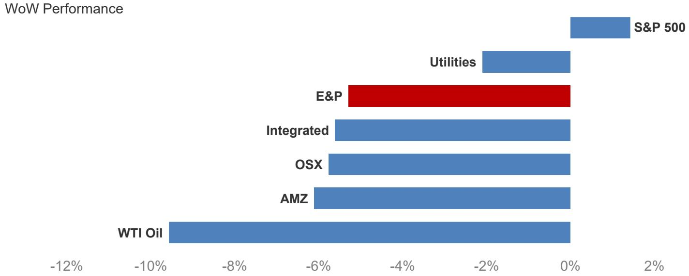

bar chart

WoW Performance
| Category | Performance (%) |
| :--- | :--- |
| S&P 500 | 1.5 |
| Utilities | -1.8 |
| E&P | -4.8 |
| Integrated | -5.2 |
| OSX | -5.5 |
| AMZ | -6.0 |
| WTI Oil | -9.5 |

Source: Bloomberg, MS

Exhibit 41: YTD Energy Subsector Performance  
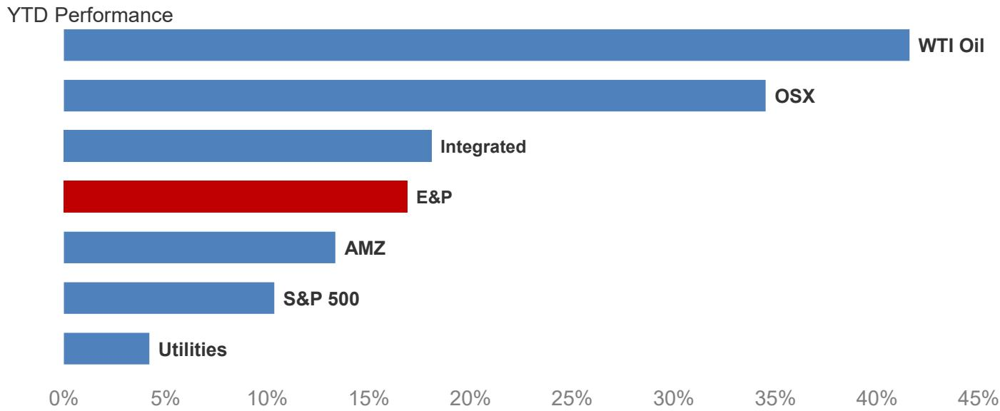

bar chart

YTD Performance
| Company | YTD Performance (%) |
| :--- | :--- |
| WTI Oil | 41.5 |
| OSX | 34.8 |
| Integrated | 18.2 |
| E&P | 16.7 |
| AMZ | 13.5 |
| S&P 500 | 10.3 |
| Utilities | 4.2 |

Source: Bloomberg, MS

Exhibit 42: Best and Worst E&P WoW Performance  
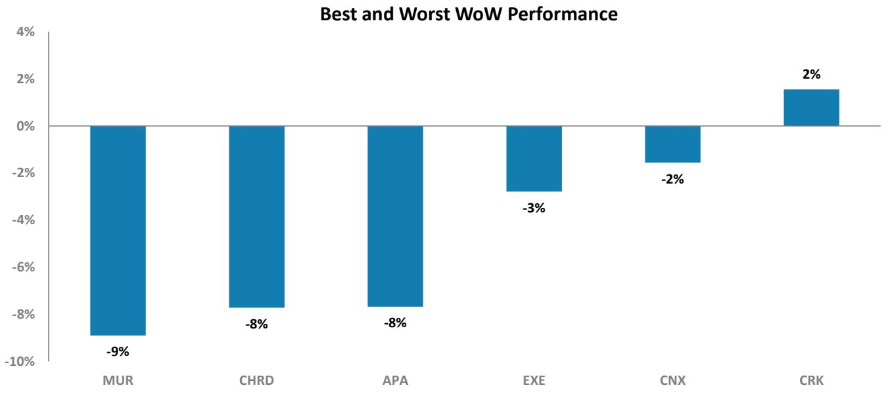

bar chart

Best and Worst WoW Performance
| Company | Performance (%) |
| :--- | :--- |
| MUR | -9 |
| CHRD | -8 |
| APA | -8 |
| EXE | -3 |
| CNX | -2 |
| CRK | 2 |

Source: FactSet, MS

Exhibit 43: WoW Performance by E&P Subsector  
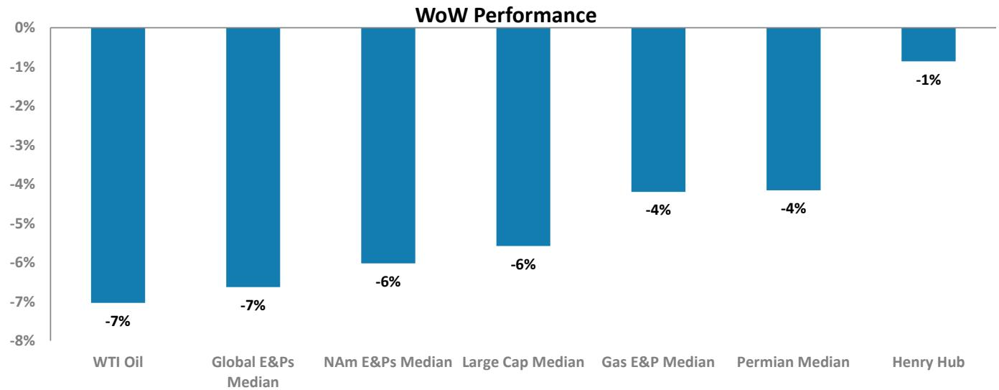

bar chart

WoW Performance
| Category | Performance (%) |
| :--- | :--- |
| WTI Oil | -7 |
| Global E&Ps Median | -7 |
| NAm E&Ps Median | -6 |
| Large Cap Median | -6 |
| Gas E&P Median | -4 |
| Permian Median | -4 |
| Henry Hub | -1 |

Source: FactSet, MS

Exhibit 44: At our price deck of \~\$88 WTI in 2026, we forecast a median realized price of \~\$85/bbl for our oil coverage. EOG, MUR and APA have the highest realized prices due to limited hedges and/or geographic mix.  
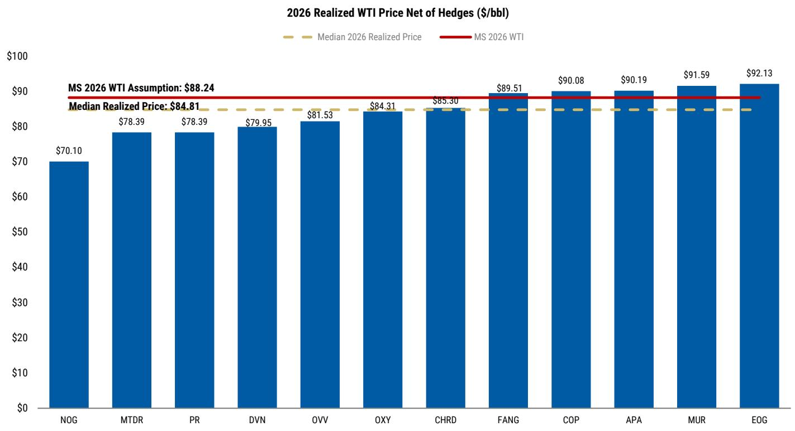

bar chart

2026 Realized WTI Price Net of Hedges ($/bbl)
| Company | Median Realized Price ($) | MS 2026 WTI ($) |
| :--- | :--- | :--- |
| NOG | 70.10 | 88.24 |
| MTDR | 78.39 | 84.81 |
| PR | 78.39 | 84.81 |
| DVN | 79.95 | 84.81 |
| OVV | 81.53 | 84.81 |
| OXY | 84.31 | 84.81 |
| CHRD | 85.30 | 84.81 |
| FANG | 89.51 | 84.81 |
| COP | 90.08 | 84.81 |
| APA | 90.19 | 84.81 |
| MUR | 91.59 | 84.81 |
| EOG | 92.13 | 84.81 |

Source: Company data, MS estimates

## Comps

Exhibit 45: Comp Sheet

<table><tr><td colspan="4">Commodity Benchmark Prices</td></tr><tr><td></td><td>2026E</td><td>2027E</td><td>2028E</td></tr><tr><td>WTI Cushing Oil ($/Bbl)</td><td>88.19</td><td>70.00</td><td>70.00</td></tr><tr><td>WCS ($/Bbl)</td><td>67.66</td><td>55.62</td><td>55.00</td></tr><tr><td>Brent Oil ($/Bbl)</td><td>97.26</td><td>76.05</td><td>75.00</td></tr><tr><td>US Henry Hub ($/MMBtu)</td><td>3.66</td><td>3.80</td><td>3.75</td></tr><tr><td>Mont Belvieu NGL ($/Bbl)</td><td>31.65</td><td>28.26</td><td>28.04</td></tr><tr><td>GC 321 Brent ($/Bbl)</td><td>21.19</td><td>14.20</td><td>14.20</td></tr></table>

<table><tr><td rowspan="2">Company</td><td rowspan="2">Ticker</td><td rowspan="2">Rating</td><td rowspan="2">Price 6/15/26</td><td rowspan="2">Market Cap ($MM)</td><td rowspan="2">Price Target</td><td rowspan="2">PT Upside</td><td colspan="3">EV/EBITDAX</td><td colspan="3">EV/ Debt-Adjusted Cash Flow</td><td colspan="3">FCF yield (Pre-Div)</td><td colspan="3">Total Yield (Dividends + Buybacks)</td><td colspan="3">Net Debt/ EBITDAX</td><td colspan="3">Prod Growth YoY</td></tr><tr><td>2026E</td><td>2027E</td><td>2028E</td><td>2026E</td><td>2027E</td><td>2028E</td><td>2026E</td><td>2027E</td><td>2028E</td><td>2026E</td><td>2027E</td><td>2028E</td><td>2026E</td><td>2027E</td><td>2028E</td><td>2026E</td><td>2027E</td><td>2028E</td></tr><tr><td colspan="25">US Majors</td></tr><tr><td>Chevron Corp.</td><td>CVX</td><td>OW</td><td>$180.40</td><td>351,065</td><td>$214</td><td>19%</td><td>5.5x</td><td>6.7x</td><td>6.3x</td><td>6.8x</td><td>7.9x</td><td>7.4x</td><td>11%</td><td>8%</td><td>8%</td><td>7%</td><td>8%</td><td>8%</td><td>0.3x</td><td>0.4x</td><td>0.4x</td><td>7%</td><td>3%</td><td>-0%</td></tr><tr><td>Exxon Mobil Corporation</td><td>XOM</td><td>OW</td><td>$140.92</td><td>603,842</td><td>$171</td><td>21%</td><td>5.9x</td><td>6.5x</td><td>6.0x</td><td>7.2x</td><td>7.8x</td><td>7.1x</td><td>9%</td><td>8%</td><td>8%</td><td>6%</td><td>6%</td><td>6%</td><td>0.1x</td><td>0.0x</td><td>-0.1x</td><td>-2%</td><td>8%</td><td>3%</td></tr><tr><td>US Majors Median</td><td></td><td></td><td></td><td></td><td></td><td>20%</td><td>5.7x</td><td>6.6x</td><td>6.2x</td><td>7.0x</td><td>7.8x</td><td>7.3x</td><td>10%</td><td>8%</td><td>8%</td><td>7%</td><td>7%</td><td>7%</td><td>0.2x</td><td>0.2x</td><td>0.2x</td><td>3%</td><td>5%</td><td>2%</td></tr><tr><td colspan="25">Canada</td></tr><tr><td>Canadian Natural Resources Ltd</td><td>CNQ</td><td>EW</td><td>C$61.69</td><td>C$129,178</td><td>C$67</td><td>9%</td><td>5.8x</td><td>6.4x</td><td>6.2x</td><td>6.5x</td><td>7.4x</td><td>7.2x</td><td>10%</td><td>8%</td><td>8%</td><td>8%</td><td>7%</td><td>8%</td><td>0.6x</td><td>0.6x</td><td>0.6x</td><td>5%</td><td>2%</td><td>-1%</td></tr><tr><td>Cenovus Energy Inc</td><td>CVE</td><td>OW</td><td>C$37.96</td><td>C$73,516</td><td>C$43</td><td>13%</td><td>4.5x</td><td>5.1x</td><td>4.5x</td><td>5.2x</td><td>5.9x</td><td>5.2x</td><td>12%</td><td>9%</td><td>10%</td><td>6%</td><td>7%</td><td>10%</td><td>0.3x</td><td>0.2x</td><td>0.2x</td><td>17%</td><td>5%</td><td>5%</td></tr><tr><td>Imperial Oil Ltd</td><td>IMO</td><td>EW</td><td>C$168.35</td><td>C$85,034</td><td>C$141</td><td>-16%</td><td>6.6x</td><td>8.3x</td><td>7.5x</td><td>8.2x</td><td>10.1x</td><td>9.2x</td><td>9%</td><td>7%</td><td>7%</td><td>7%</td><td>7%</td><td>6%</td><td>0.1x</td><td>0.1x</td><td>0.0x</td><td>2%</td><td>4%</td><td>1%</td></tr><tr><td>Suncor Energy Inc</td><td>SU</td><td>EW</td><td>C$83.39</td><td>C$101,069</td><td>C$93</td><td>12%</td><td>4.1x</td><td>5.5x</td><td>4.8x</td><td>4.9x</td><td>6.5x</td><td>5.6x</td><td>13%</td><td>8%</td><td>9%</td><td>7%</td><td>8%</td><td>9%</td><td>0.0x</td><td>0.0x</td><td>0.0x</td><td>0%</td><td>6%</td><td>6%</td></tr><tr><td>Canada Median</td><td></td><td></td><td></td><td></td><td></td><td>10%</td><td>5.1x</td><td>6.0x</td><td>5.5x</td><td>5.8x</td><td>7.0x</td><td>6.4x</td><td>11%</td><td>8%</td><td>9%</td><td>7%</td><td>7%</td><td>9%</td><td>0.2x</td><td>0.2x</td><td>0.1x</td><td>3%</td><td>5%</td><td>3%</td></tr><tr><td colspan="25">Oil E&amp;Ps</td></tr><tr><td>APA Corp.</td><td>APA</td><td>UW</td><td>$34.77</td><td>12,309</td><td>$44</td><td>27%</td><td>2.2x</td><td>2.9x</td><td>2.8x</td><td>2.7x</td><td>3.4x</td><td>3.2x</td><td>21%</td><td>10%</td><td>11%</td><td>5%</td><td>6%</td><td>6%</td><td>0.3x</td><td>0.3x</td><td>0.2x</td><td>-7%</td><td>0%</td><td>4%</td></tr><tr><td>Chord Energy Corp.</td><td>CHRD</td><td>OW</td><td>$127.60</td><td>7,244</td><td>$175</td><td>37%</td><td>2.1x</td><td>2.4x</td><td>2.2x</td><td>2.2x</td><td>2.6x</td><td>2.4x</td><td>24%</td><td>14%</td><td>14%</td><td>17%</td><td>10%</td><td>10%</td><td>0.1x</td><td>0.1x</td><td>0.0x</td><td>0%</td><td>-1%</td><td>0%</td></tr><tr><td>ConocoPhillips</td><td>COP</td><td>OW</td><td>$112.26</td><td>137,514</td><td>$153</td><td>36%</td><td>4.1x</td><td>4.5x</td><td>4.1x</td><td>5.2x</td><td>5.5x</td><td>5.0x</td><td>12%</td><td>9%</td><td>10%</td><td>9%</td><td>8%</td><td>8%</td><td>0.4x</td><td>0.4x</td><td>0.3x</td><td>-3%</td><td>4%</td><td>2%</td></tr><tr><td>Devon Energy Corp.</td><td>DVN</td><td>OW</td><td>$43.53</td><td>50,103</td><td>$66</td><td>52%</td><td>3.9x</td><td>3.5x</td><td>3.0x</td><td>4.4x</td><td>3.9x</td><td>3.4x</td><td>14%</td><td>14%</td><td>15%</td><td>6%</td><td>8%</td><td>10%</td><td>0.4x</td><td>0.2x</td><td>0.1x</td><td>63%</td><td>22%</td><td>0%</td></tr><tr><td>Diamondback Energy, Inc.</td><td>FANG</td><td>OW</td><td>$189.96</td><td>53,719</td><td>$229</td><td>21%</td><td>4.7x</td><td>5.4x</td><td>5.0x</td><td>5.4x</td><td>6.1x</td><td>5.7x</td><td>14%</td><td>10%</td><td>10%</td><td>4%</td><td>6%</td><td>6%</td><td>0.6x</td><td>0.6x</td><td>0.4x</td><td>6%</td><td>1%</td><td>1%</td></tr><tr><td>EOG Resources Inc.</td><td>EOG</td><td>EW</td><td>$131.98</td><td>70,609</td><td>$160</td><td>21%</td><td>3.8x</td><td>4.7x</td><td>4.7x</td><td>4.5x</td><td>5.4x</td><td>5.3x</td><td>13%</td><td>9%</td><td>9%</td><td>9%</td><td>8%</td><td>8%</td><td>0.1x</td><td>0.1x</td><td>0.1x</td><td>14%</td><td>3%</td><td>3%</td></tr><tr><td>Matador Resources Co.</td><td>MTDR</td><td>EW</td><td>$51.38</td><td>6,384</td><td>$75</td><td>46%</td><td>3.2x</td><td>3.3x</td><td>3.0x</td><td>3.5x</td><td>3.6x</td><td>3.2x</td><td>18%</td><td>15%</td><td>16%</td><td>3%</td><td>3%</td><td>4%</td><td>0.8x</td><td>0.7x</td><td>0.4x</td><td>3%</td><td>3%</td><td>2%</td></tr><tr><td>Murphy Oil Corp.</td><td>MUR</td><td>UW</td><td>$36.45</td><td>5,263</td><td>$37</td><td>2%</td><td>2.7x</td><td>3.1x</td><td>3.1x</td><td>3.0x</td><td>3.4x</td><td>3.4x</td><td>13%</td><td>8%</td><td>7%</td><td>9%</td><td>6%</td><td>5%</td><td>0.4x</td><td>0.4x</td><td>0.4x</td><td>-5%</td><td>7%</td><td>3%</td></tr><tr><td>Northern Oil and Gas, Inc</td><td>NOG</td><td>UW</td><td>$19.96</td><td>2,002</td><td>$29</td><td>45%</td><td>3.0x</td><td>2.8x</td><td>2.7x</td><td>3.7x</td><td>3.5x</td><td>3.3x</td><td>23%</td><td>20%</td><td>20%</td><td>9%</td><td>10%</td><td>10%</td><td>1.6x</td><td>1.4x</td><td>1.3x</td><td>9%</td><td>-0%</td><td>0%</td></tr><tr><td>Occidental Petroleum Corp.</td><td>OXY</td><td>EW</td><td>$54.46</td><td>54,836</td><td>$74</td><td>36%</td><td>4.0x</td><td>4.7x</td><td>4.2x</td><td>4.2x</td><td>5.3x</td><td>4.8x</td><td>18%</td><td>10%</td><td>11%</td><td>2%</td><td>2%</td><td>2%</td><td>0.7x</td><td>0.6x</td><td>0.3x</td><td>-0%</td><td>2%</td><td>3%</td></tr><tr><td>Ovintiv Inc</td><td>OVV</td><td>EW</td><td>$54.31</td><td>14,566</td><td>$68</td><td>25%</td><td>3.3x</td><td>3.7x</td><td>3.5x</td><td>3.5x</td><td>3.7x</td><td>4.0x</td><td>18%</td><td>14%</td><td>11%</td><td>11%</td><td>11%</td><td>9%</td><td>0.6x</td><td>0.8x</td><td>0.8x</td><td>2%</td><td>-2%</td><td>0%</td></tr><tr><td>Permian Resources Corp.</td><td>PR</td><td>OW</td><td>$18.90</td><td>16,109</td><td>$25</td><td>32%</td><td>3.6x</td><td>3.3x</td><td>3.0x</td><td>4.1x</td><td>3.9x</td><td>3.7x</td><td>16%</td><td>15%</td><td>14%</td><td>3%</td><td>4%</td><td>4%</td><td>0.3x</td><td>-0.1x</td><td>-0.4x</td><td>5%</td><td>0%</td><td>1%</td></tr><tr><td>Oil E&amp;Ps Median</td><td></td><td></td><td></td><td></td><td></td><td>34%</td><td>3.5x</td><td>3.4x</td><td>3.1x</td><td>3.9x</td><td>3.8x</td><td>3.6x</td><td>17%</td><td>12%</td><td>11%</td><td>7%</td><td>7%</td><td>7%</td><td>0.4x</td><td>0.4x</td><td>0.3x</td><td>3%</td><td>1%</td><td>1%</td></tr><tr><td colspan="25">Gas E&amp;Ps</td></tr><tr><td>Antero Resources Corp.</td><td>AR</td><td>OW</td><td>$34.03</td><td>10,598</td><td>$56</td><td>65%</td><td>4.4x</td><td>3.4x</td><td>2.8x</td><td>4.7x</td><td>3.9x</td><td>3.6x</td><td>15%</td><td>17%</td><td>14%</td><td>1%</td><td>6%</td><td>5%</td><td>0.6x</td><td>0.2x</td><td>-0.1x</td><td>19%</td><td>9%</td><td>4%</td></tr><tr><td>CNX Resources Corp.</td><td>CNX</td><td>UW</td><td>$32.96</td><td>5,283</td><td>$34</td><td>3%</td><td>5.7x</td><td>4.7x</td><td>4.4x</td><td>7.8x</td><td>5.8x</td><td>5.9x</td><td>6%</td><td>12%</td><td>10%</td><td>5%</td><td>6%</td><td>4%</td><td>1.3x</td><td>1.1x</td><td>1.0x</td><td>-3%</td><td>0%</td><td>0%</td></tr><tr><td>Comstock Resources Inc.</td><td>CRK</td><td>EW</td><td>$13.05</td><td>3,802</td><td>$18</td><td>38%</td><td>6.6x</td><td>4.9x</td><td>4.5x</td><td>7.5x</td><td>5.7x</td><td>5.2x</td><td>-12%</td><td>-3%</td><td>-2%</td><td>0%</td><td>0%</td><td>1%</td><td>3.0x</td><td>2.2x</td><td>2.1x</td><td>5%</td><td>21%</td><td>13%</td></tr><tr><td>EQT Corp.</td><td>EQT</td><td>OW</td><td>$50.75</td><td>31,932</td><td>$74</td><td>46%</td><td>6.0x</td><td>5.3x</td><td>4.3x</td><td>6.0x</td><td>6.0x</td><td>4.9x</td><td>12%</td><td>11%</td><td>14%</td><td>1%</td><td>3%</td><td>3%</td><td>0.6x</td><td>0.3x</td><td>-0.2x</td><td>-0%</td><td>1%</td><td>5%</td></tr><tr><td>Expand Energy Corp.</td><td>EXE</td><td>OW</td><td>$87.90</td><td>21,163</td><td>$139</td><td>58%</td><td>3.8x</td><td>3.4x</td><td>3.1x</td><td>3.8x</td><td>3.5x</td><td>3.3x</td><td>14%</td><td>13%</td><td>13%</td><td>4%</td><td>5%</td><td>8%</td><td>0.3x</td><td>0.0x</td><td>-0.2x</td><td>5%</td><td>2%</td><td>1%</td></tr><tr><td>Range Resources Corp.</td><td>RRC</td><td>EW</td><td>$37.46</td><td>8,855</td><td>$50</td><td>33%</td><td>5.2x</td><td>4.5x</td><td>4.3x</td><td>5.5x</td><td>5.0x</td><td>5.2x</td><td>11%</td><td>11%</td><td>9%</td><td>2%</td><td>3%</td><td>6%</td><td>0.2x</td><td>-0.1x</td><td>-0.2x</td><td>6%</td><td>9%</td><td>2%</td></tr><tr><td>Tourmaline Oil Corp.</td><td>TOU</td><td>EW</td><td>C$61.26</td><td>C$24,568</td><td>C$70</td><td>14%</td><td>5.7x</td><td>5.3x</td><td>4.5x</td><td>5.9x</td><td>5.6x</td><td>4.8x</td><td>5%</td><td>6%</td><td>9%</td><td>5%</td><td>6%</td><td>6%</td><td>0.2x</td><td>0.2x</td><td>0.0x</td><td>-1%</td><td>7%</td><td>5%</td></tr><tr><td>Gas E&amp;Ps Median</td><td></td><td></td><td></td><td></td><td></td><td>38%</td><td>5.7x</td><td>4.7x</td><td>4.3x</td><td>5.9x</td><td>5.6x</td><td>4.9x</td><td>11%</td><td>11%</td><td>10%</td><td>2%</td><td>5%</td><td>5%</td><td>0.6x</td><td>0.2x</td><td>-0.1x</td><td>5%</td><td>7%</td><td>4%</td></tr><tr><td colspan="25">Royalties &amp; Minerals</td></tr><tr><td>Viper Energy, Inc.</td><td>VNOM</td><td>OW</td><td>$43.69</td><td>15,491</td><td>$49</td><td>12%</td><td>9.8x</td><td>10.7x</td><td>9.6x</td><td>10.8x</td><td>11.3x</td><td>10.0x</td><td>12%</td><td>11%</td><td>12%</td><td>10%</td><td>13%</td><td>13%</td><td>0.5x</td><td>0.7x</td><td>0.7x</td><td>36%</td><td>4%</td><td>6%</td></tr><tr><td>Total Coverage Median</td><td></td><td></td><td></td><td></td><td></td><td>27%</td><td>4.3x</td><td>4.7x</td><td>4.3x</td><td>5.0x</td><td>5.4x</td><td>4.9x</td><td>13%</td><td>10%</td><td>10%</td><td>6%</td><td>6%</td><td>6%</td><td>0.4x</td><td>0.3x</td><td>0.2x</td><td>4%</td><td>3%</td><td>2%</td></tr></table>

Source: FactSet, MS estimates

## Disclosure Section

The information and opinions in MS were prepared by MS & Co. LLC, and/or MS C.T.V.M. S.A., and/or MS Mexico, Casa de Bolsa, S.A. de C.V., and/or MS Canada Limited. As used in this disclosure section, "MS" includes MS & Co. LLC, MS C.T.V.M. S.A., MS Mexico, Casa de Bolsa, S.A. de C.V., MS Canada Limited and their affiliates as necessary.

For important disclosures, stock price charts and equity rating histories regarding companies that are the subject of this report, please see the MS Disclosure Website at www.morganstanley.com/eqr/disclosures/webapp/generalresearch, or contact your investment representative or MS at 1585 Broadway, (Attention: Research Management), New York, NY, 10036 USA.

For valuation methodology and risks associated with any recommendation, rating or price target referenced in this research report, please contact the Client Support Team as follows: US/Canada +1 800 303-2495; Hong Kong +852 2848-5999; Latin America +1 718 754-5444 (U.S.); London +44 (0)20-7425-8169; Singapore +65 6834-6860; Sydney +61 (0)2-9770-1505; Tokyo +81 (0)3-6836-9000. Alternatively you may contact your investment representative or MS at 1585 Broadway, (Attention: Research Management), New York, NY 10036 USA.

## Analyst Certification

The following analysts hereby certify that their views about the companies and their securities discussed in this report are accurately expressed and that they have not received and will not receive direct or indirect compensation in exchange for expressing specific recommendations or views in this report: Svetlana Do; Jacqueline M Kenny; Joe Laetsch, CFA; Justin W Latran, CFA; Helen Lin; Devin McDermott.

## Global Research Conflict Management Policy

MS has been published in accordance with our conflict management policy, which is available at www.morganstanley.com/institutional/research/conflictpolicies. A Portuguese version of the policy can be found at www.morganstanley.com.br

## Important Regulatory Disclosures on Subject Companies

The analyst or strategist (or a household member) identified below owns the following securities (or related derivatives): Devin McDermott - Exxon Mobil Corporation(common or preferred stock).

As of May 29, 2026, MS beneficially owned 1% or more of a class of common equity securities of the following companies covered in MS: Antero Resources Corp, APA Corp, Cheniere Energy Inc, Chevron Corporation, Chord Energy Corporation, CNX Resources Corp, ConocoPhillips, Devon Energy Corp, Diamondback Energy Inc, EOG Resources Inc, EQT Corp., Excelerate Energy Inc, Expand Energy Corp, Exxon Mobil Corporation, Matador Resources Co, Murphy Oil Corporation, Northern Oil & Gas Inc., Occidental Petroleum Corp, Permian Resources Corp, Range Resources Corp., Tourmaline Oil Corp..

Within the last 12 months, MS managed or co-managed a public offering (or 144A offering) of securities of Cheniere Energy Inc, Cheniere Energy Partners LP, Chevron Corporation, CNX Resources Corp, Diamondback Energy Inc, EOG Resources Inc, Murphy Oil Corporation, Northern Oil & Gas Inc., Permian Resources Corp, Viper Energy Inc.

Within the last 12 months, MS has received compensation for investment banking services from Cheniere Energy Inc, Cheniere Energy Partners LP, Chevron Corporation, CNX Resources Corp, Devon Energy Corp, Diamondback Energy Inc, EOG Resources Inc, Expand Energy Corp, Murphy Oil Corporation, Northern Oil & Gas Inc., Permian Resources Corp, Viper Energy Inc.

In the next 3 months, MS expects to receive or intends to seek compensation for investment banking services from Antero Resources Corp, APA Corp, Cenovus Energy, Cheniere Energy Inc, Chevron Corporation, Chord Energy Corporation, CNX Resources Corp, Comstock Resources Inc., ConocoPhillips, Devon Energy Corp, Diamondback Energy Inc, EOG Resources Inc, EQT Corp., Excelerate Energy Inc, Expand Energy Corp, Exxon Mobil Corporation, Matador Resources Co, Murphy Oil Corporation, Northern Oil & Gas Inc., Occidental Petroleum Corp, Permian Resources Corp, Range Resources Corp., Suncor Energy Inc, Tourmaline Oil Corp., Venture Global Inc, Viper Energy Inc.

Within the last 12 months, MS has received compensation for products and services other than investment banking services from Antero Resources Corp, APA Corp, Cenovus Energy, Cheniere Energy Inc, Cheniere Energy Partners LP, Chevron Corporation, CNX Resources Corp, Comstock Resources Inc., ConocoPhillips, Devon Energy Corp, Diamondback Energy Inc, EOG Resources Inc, EQT Corp., Expand Energy Corp, Exxon Mobil Corporation, Northern Oil & Gas Inc., Occidental Petroleum Corp, Ovintiv Inc, Permian Resources Corp, Range Resources Corp., Suncor Energy Inc, Tourmaline Oil Corp., Venture Global Inc, Viper Energy Inc.

Within the last 12 months, MS has provided or is providing investment banking services to, or has an investment banking client relationship with, the following company: Antero Resources Corp, APA Corp, Cenovus Energy, Cheniere Energy Inc, Cheniere Energy Partners LP, Chevron Corporation, Chord Energy Corporation, CNX Resources Corp, Comstock Resources Inc., ConocoPhillips, Devon Energy Corp, Diamondback Energy Inc, EOG Resources Inc, EQT Corp., Excelerate Energy Inc, Expand Energy Corp, Exxon Mobil Corporation, Matador Resources Co, Murphy Oil Corporation, Northern Oil & Gas Inc., Occidental Petroleum Corp, Permian Resources Corp, Range Resources Corp., Suncor Energy Inc, Tourmaline Oil Corp., Venture Global Inc, Viper Energy Inc.

Within the last 12 months, MS has either provided or is providing non-investment banking, securities-related services to and/or in the past has entered into an agreement to provide services or has a client relationship with the following company: Antero Resources Corp, APA Corp, Canadian Natural Resources Ltd, Cenovus Energy, Cheniere Energy Inc, Cheniere Energy Partners LP, Chevron Corporation, Chord Energy Corporation, CNX Resources Corp, Comstock Resources Inc., ConocoPhillips, Devon Energy Corp, Diamondback Energy Inc, EOG Resources Inc, EQT Corp., Excelerate Energy Inc, Expand Energy Corp, Exxon Mobil Corporation, Northern Oil & Gas Inc., Occidental Petroleum Corp, Ovintiv Inc, Permian Resources Corp, Range Resources Corp., Suncor Energy Inc, Tourmaline Oil Corp., Venture Global Inc, Viper Energy Inc.

An employee, director or consultant of MS is a director of Occidental Petroleum Corp. This person is not a research analyst or a member of a research analyst's household. MS & Co. LLC makes a market in the securities of Cheniere Energy Partners LP, Chord Energy Corporation, CNX Resources Corp, Comstock Resources Inc., Excelerate Energy Inc, Matador Resources Co, Murphy Oil Corporation, NextDecade Corporation.

The equity research analysts or strategists principally responsible for the preparation of MS have received compensation based upon various factors, including quality of research, investor client feedback, stock picking, competitive factors, firm revenues and overall investment banking revenues. Equity Research analysts' or strategists' compensation is not linked to investment banking or capital markets transactions performed by MS or the profitability or revenues of particular trading desks.

MS and its affiliates do business that relates to companies/instruments covered in MS, including market making, providing liquidity, fund management, commercial banking, extension of credit, investment services and investment banking. MS sells to and buys from customers the securities/instruments of companies covered in MS on a principal basis. MS may have a position in the debt of the Company or instruments discussed in this report. MS trades or may trade as principal in the debt securities (or in related derivatives) that are the subject of the debt research report.

Certain disclosures listed above are also for compliance with applicable regulations in non-US jurisdictions.

## STOCK RATINGS

MS uses a relative rating system using terms such as Overweight, Equal-weight, Not-Rated or Underweight (see definitions below). MS does not assign ratings of Buy, Hold or Sell to the stocks we cover. Overweight, Equal-weight, Not-Rated and Underweight are not the equivalent of buy, hold and sell. Investors should carefully read the definitions of all ratings used in MS. In addition, since MS contains more complete information concerning the analyst's views, investors should carefully read MS, in its entirety, and not infer the contents from the rating alone. In any case, ratings (or research) should not be used or relied upon as investment advice. An investor's decision to buy or sell a stock should depend on individual circumstances (such as the investor's existing holdings) and other considerations.

## Global Stock Ratings Distribution

(as of May 31, 2026)

The Stock Ratings described below apply to MS's Fundamental Equity Research and do not apply to Debt Research produced by the Firm.

For disclosure purposes only (in accordance with FINRA requirements), we include the category headings of Buy, Hold, and Sell alongside our ratings of Overweight, Equal-weight, Not-Rated and Underweight. MS does not assign ratings of Buy, Hold or Sell to the stocks we cover. Overweight, Equal-weight, Not-Rated and Underweight are not the equivalent of buy, hold, and sell but represent recommended relative weightings (see definitions below). To satisfy regulatory requirements, we correspond Overweight, our most positive stock rating, with a buy recommendation; we correspond Equal-weight and Not-Rated to hold and Underweight to sell recommendations, respectively.

<table><tr><td></td><td colspan="2">Coverage Universe</td><td colspan="3">Investment Banking Clients (IBC)</td><td colspan="2">Other Material Investment ServicesClients (MISC)</td></tr><tr><td>Stock RatingCategory</td><td>Count</td><td>% of Total</td><td>Count</td><td>% of Total IBC</td><td>% of RatingCategory</td><td>Count</td><td>% of Total OtherMISC</td></tr><tr><td>Overweight/Buy</td><td>1542</td><td>42%</td><td>465</td><td>51%</td><td>30%</td><td>707</td><td>43%</td></tr><tr><td>Equal-weight/Hold</td><td>1571</td><td>43%</td><td>369</td><td>40%</td><td>23%</td><td>723</td><td>44%</td></tr><tr><td>Not-Rated/Hold</td><td>3</td><td>0%</td><td>0</td><td>0%</td><td>0%</td><td>1</td><td>0%</td></tr><tr><td>Underweight/Sell</td><td>551</td><td>15%</td><td>86</td><td>9%</td><td>16%</td><td>201</td><td>12%</td></tr><tr><td>Total</td><td>3,667</td><td></td><td>920</td><td></td><td></td><td>1632</td><td></td></tr></table>

Data include common stock and ADRs currently assigned ratings. Investment Banking Clients are companies from whom MS received investment banking compensation in the last 12 months. Due to rounding off of decimals, the percentages provided in the "% of total" column may not add up to exactly 100 percent.

## Analyst Stock Ratings

Overweight (O). The stock's total return is expected to exceed the average total return of the analyst's industry (or industry team's) coverage universe, on a risk-adjusted basis, over the next 12-18 months.

Equal-weight (E). The stock's total return is expected to be in line with the average total return of the analyst's industry (or industry team's) coverage universe, on a risk-adjusted basis, over the next 12-18 months.

Not-Rated (NR). Currently the analyst does not have adequate conviction about the stock's total return relative to the average total return of the analyst's industry (or industry team's) coverage universe, on a risk-adjusted basis, over the next 12-18 months.

Underweight (U). The stock's total return is expected to be below the average total return of the analyst's industry (or industry team's) coverage universe, on a risk-adjusted basis, over the next 12-18 months.

Unless otherwise specified, the time frame for price targets included in MS is 12 to 18 months.

## Analyst Industry Views

Attractive (A): The analyst expects the performance of his or her industry coverage universe over the next 12-18 months to be attractive vs. the relevant broad market benchmark, as indicated below.

In-Line (I): The analyst expects the performance of his or her industry coverage universe over the next 12-18 months to be in line with the relevant broad market benchmark, as indicated below. Cautious (C): The analyst views the performance of his or her industry coverage universe over the next 12-18 months with caution vs. the relevant broad market benchmark, as indicated below. Benchmarks for each region are as follows: North America - S&P 500; Latin America - relevant MSCI country index or MSCI Latin America Index; Europe - MSCI Europe; Japan - TOPIX; Asia - relevant MSCI country index or MSCI sub-regional index or MSCI AC Asia Pacific ex Japan Index.

## Important Disclosures for MS Smith Barney LLC Customers

Important disclosures regarding any material conflict of interest that can reasonably be expected to have influenced MS Smith Barney LLC's choice of a third-party research provider or the subject company of a third-party research report, are available on the MS Wealth Management disclosure website at www.morganstanley.com/online/researchdisclosures. For MS specific disclosures, you may refer to https://www.morganstanley.com/eqr/disclosures/webapp/generalresearch.

Each MS report is reviewed and approved on behalf of MS Smith Barney LLC. This review and approval is conducted by the same person who reviews the research report on behalf of MS. This could create a conflict of interest.

## Other Important Disclosures

MS policy is to update research reports as and when the Research Analyst and Research Management deem appropriate, based on developments with the issuer, the sector, or the market that may have a material impact on the research views or opinions stated therein. In addition, certain Research publications are intended to be updated on a regular periodic basis (weekly/monthly/quarterly/annual) and will ordinarily be updated with that frequency, unless the Research Analyst and Research Management determine that a different publication schedule is appropriate based on current conditions.

MS is not acting as a municipal advisor and the opinions or views contained herein are not intended to be, and do not constitute, advice within the meaning of Section 975 of the Dodd-Frank Wall Street Reform and Consumer Protection Act.

MS produces an equity research product called a "Tactical Idea." Views contained in a "Tactical Idea" on a particular stock may be contrary to the recommendations or views expressed in research on the same stock. This may be the result of differing time horizons, methodologies, market events, or other factors. For all research available on a particular stock, please contact your sales representative or go to Matrix at http://www.morganstanley.com/matrix.

MS is provided to our clients through our proprietary research portal on Matrix and also distributed electronically by MS to clients. Certain, but not all, MS products are also made available to clients through third-party vendors or redistributed to clients through alternate electronic means as a convenience. For access to all available MS, please contact your sales representative or go to Matrix at http://www.morganstanley.com/matrix.

Any access and/or use of MS is subject to MS's Terms of Use (http://www.morganstanley.com/terms.html). By accessing and/or using MS, you are indicating that you have read and agree to be bound by our Terms of Use (http://www.morganstanley.com/terms.html). In addition you consent to MS processing your personal data and using cookies in accordance with our Privacy Policy and our Global Cookies Policy (http://www.morganstanley.com/privacy\_pledge.html), including for the purposes of setting your preferences and to collect readership data so that we can deliver better and more personalized service and products to you. To find out more information about how MS processes personal data, how we use cookies and how to reject cookies see our Privacy Policy and our Global Cookies Policy (http://www.morganstanley.com/privacy\_pledge.html). Please use the provided link to review the Terms and Conditions and Most Important Terms and Conditions for MS India Company Private Limited (https://www.morganstanley.com/assets/pdfs/about-us-global-offices/india/Terms\_and\_conditions.pdf) and the following link to review the audit report (https://ny.matrix.ms.com/eqr/research/webapp/researchdocs/MSICPL\_Morgan\_Stanley\_Research\_Audit\_Report.pdf).

If you do not agree to our Terms of Use and/or if you do not wish to provide your consent to MS processing your personal data or using cookies please do not access our research. MS does not provide individually tailored investment advice. MS has been prepared without regard to the circumstances and objectives of those who receive it. MS recommends that investors independently evaluate particular investments and strategies, and encourages investors to seek the advice of a financial adviser. The appropriateness of an investment or strategy will depend on an investor's circumstances and objectives. The securities, instruments, or strategies discussed in MS may not be suitable for all investors, and certain investors may not be eligible to purchase or participate in some or all of them. MS is not an offer to buy or sell or the solicitation of an offer to buy or sell any security/instrument or to participate in any particular trading strategy. The value of and income from your investments may vary because of changes in interest rates, foreign exchange rates, default rates, prepayment rates, securities/instruments prices, market indexes, operational or financial conditions of companies or other factors. There may be time limitations on the exercise of options or other rights in securities/instruments transactions. Past performance is not necessarily a guide to future performance. Estimates of future performance are based on assumptions that may not be realized. If provided, and unless otherwise stated, the closing price on the cover page is that of the primary exchange for the subject company's securities/instruments.

The fixed income research analysts, strategists or economists principally responsible for the preparation of MS have received compensation based upon various factors, including quality, accuracy and value of research, firm profitability or revenues (which include fixed income trading and capital markets profitability or revenues), client feedback and competitive factors. Fixed Income Research analysts', strategists' or economists' compensation is not linked to investment banking or capital markets transactions performed by MS or the profitability or revenues of particular trading desks.

The "Important Regulatory Disclosures on Subject Companies" section in MS lists all companies mentioned where MS owns 1% or more of a class of common equity securities of the companies. For all other companies mentioned in MS, MS may have an investment of less than 1% in securities/instruments or derivatives of securities/instruments of companies and may trade them in ways different from those discussed in MS. Employees of MS not involved in the preparation of MS may have investments in securities/instruments or derivatives of securities/instruments of companies mentioned and may trade them in ways different from those discussed in MS. Derivatives may be issued by MS or associated persons.

With the exception of information regarding MS, MS is based on public information. MS makes every effort to use reliable, comprehensive information, but we make no representation that it is accurate or complete. We have no obligation to tell you when opinions or information in MS change apart from when we intend to discontinue equity research coverage of a subject company. Facts and views presented in MS have not been reviewed by, and may not reflect information known to, professionals in other MS business areas, including investment banking personnel.

MS personnel may participate in company events such as site visits and are generally prohibited from accepting payment by the company of associated expenses unless pre-approved by authorized members of Research management.

MS may make investment decisions that are inconsistent with the recommendations or views in this report.

To our readers based in Taiwan or trading in Taiwan securities/instruments: Information on securities/instruments that trade in Taiwan is distributed by MS Taiwan Limited ("MSTL"). Such information is for your reference only. The reader should independently evaluate the investment risks and is solely responsible for their investment decisions. MS may not be distributed to the public media or quoted or used by the public media without the express written consent of MS. Any non-customer reader within the scope of Article 7-1 of the Taiwan Stock Exchange Recommendation Regulations accessing and/or receiving MS is not permitted to provide MS to any third party (including but not limited to related parties, affiliated companies and any other third parties) or engage in any activities regarding MS which may create or give the appearance of creating a conflict of interest. Information on securities/instruments that do not trade in Taiwan is for informational purposes only and is not to be construed as a recommendation or a solicitation to trade in such securities/instruments. MSTL may not execute transactions for clients in these securities/instruments.

MS is not incorporated under PRC law and the research in relation to this report is conducted outside the PRC. MS does not constitute an offer to sell or the solicitation of an offer to buy any securities in the PRC. PRC investors shall have the relevant qualifications to invest in such securities and shall be responsible for obtaining all relevant approvals, licenses, verifications and/or registrations from the relevant governmental authorities themselves. Neither this report nor any part of it is intended as, or shall constitute, provision of any consultancy or advisory service of securities investment as defined under PRC law. Such information is provided for your reference only.

MS is disseminated in Brazil by MS C.T.V.M. S.A. located at Av. Brigadeiro Faria Lima, 3600, 6th floor, São Paulo - SP, Brazil; and is regulated by the Comissão de Valores Mobiliários; in Mexico by MS México, Casa de Bolsa, S.A. de C.V which is regulated by Comision Nacional Bancaria y de Valores. Paseo de los Tamarindos 90, Torre 1, Col. Bosques de las Lomas Floor 29, 05120 Mexico City; in Japan by MS MUFG Securities Co., Ltd. and, for Commodities related research reports only, MS Capital Group Japan Co., Ltd; in Hong Kong by MS Asia Limited (which accepts responsibility for its contents) and by MS Bank Asia Limited; in Singapore by MS Asia (Singapore) Pte. (Registration number 199206298Z) and/or MS Asia (Singapore) Securities Pte Ltd (Registration number 200008434H), regulated by the Monetary Authority of Singapore (which accepts legal responsibility for its contents and should be contacted with respect to any matters arising from, or in connection with, MS) and by MS Bank Asia Limited, Singapore Branch (Registration number T14FCO118J); in Australia to "wholesale clients" within the meaning of the Australian Corporations Act by MS Australia Limited A.B.N. 67 003 734 576, holder of Australian financial services license No. 233742, which accepts responsibility for its contents; in Australia to "wholesale clients" and "retail clients" within the meaning of the Australian Corporations Act by MS Wealth Management Australia Pty Ltd (A.B.N. 19 009 145 555, holder of Australian financial services license No. 240813, which accepts responsibility for its contents; in Korea by MS & Co International plc, Seoul Branch; in India by MS India Company Private Limited having

Corporate Identification No (CIN) U22990MH1998PTC115305, regulated by the Securities and Exchange Board of India ("SEBI") and holder of licenses as a Research Analyst (SEBI Registration No. INH000001105); Stock Broker (SEBI Stock Broker Registration No. INZ000244438), Merchant Banker (SEBI Registration No. INM000011203), and depository participant with National Securities Depository Limited (SEBI Registration No. IN-DP-NSDL-567-2021) having registered office at Altimus, Level 39 & 40, Pandurang Budhkar Marg, Worli, Mumbai 400018, India; Telephone no. +91-22-61181000; Compliance Officer Details: Mr. Tejarshi Hardas, Tel. No.: +91-22-61181000 or Email: tejarshi.hardas@morganstanley.com; Grievance officer details: Mr. Tejarshi Hardas, Tel. No.: +91-22-61181000 or Email: msic-compliance@morganstanley.com. MS India Company Private Limited (MSICPL) may use AI tools in providing research services. All recommendations contained herein are made by the duly qualified research analysts; in Canada by MS Canada Limited; in Germany and the European Economic Area where required by MS Europe S.E., authorised and regulated by Bundesanstalt fuer Finanzdienstleistungsaufsicht (BaFin) under the reference number 149169; in the US by MS & Co. LLC, which accepts responsibility for its contents. MS & Co. International plc, authorized by the Prudential Regulation Authority and regulated by the Financial Conduct Authority and the Prudential Regulation Authority, disseminates in the UK research that it has prepared, and research which has been prepared by any of its affiliates, only to persons who (i) are investment professionals falling within Article 19(5) of the Financial Services and Markets Act 2000 (Financial Promotion) Order 2005 (as amended, the "Order"); (ii) are persons who are high net worth entities falling within Article 49(2)(a) to (d) of the Order; or (iii) are persons to whom an invitation or inducement to engage in investment activity (within the meaning of section 21 of the Financial Services and Markets Act 2000, as amended) may otherwise lawfully be communicated or caused to be communicated. RMB MS Proprietary Limited is a member of the JSE Limited and A2X (Pty) Ltd. RMB MS Proprietary Limited is a joint venture owned equally by MS International Holdings Inc. and RMB Investment Advisory (Proprietary) Limited, which is wholly owned by FirstRand Limited. The information in MS is being disseminated by MS Saudi Arabia, regulated by the Capital Market Authority in the Kingdom of Saudi Arabia, and is directed at Sophisticated investors only.

The information in MS is being communicated by MS & Co. International plc (DIFC Branch), regulated by the Dubai Financial Services Authority (the DFSA) or by MS & Co. International plc (ADGM Branch), regulated by the Financial Services Regulatory Authority Abu Dhabi (the FSRA), and is directed at Professional Clients only, as defined by the DFSA or the FSRA, respectively. The financial products or financial services to which this research relates will only be made available to a customer who we are satisfied meets the regulatory criteria of a Professional Client. A distribution of the different MS Research ratings or recommendations, in percentage terms for Investments in each sector covered, is available upon request from your sales representative.

The information in MS is being communicated by MS & Co. International plc (QFC Branch), regulated by the Qatar Financial Centre Regulatory Authority (the QFCRA), and is directed at business customers and market counterparties only and is not intended for Retail Customers as defined by the QFCRA.

As required by the Capital Markets Board of Turkey, investment information, comments and recommendations stated here, are not within the scope of investment advisory activity. Investment advisory service is provided exclusively to persons based on their risk and income preferences by the authorized firms. Comments and recommendations stated here are general in nature. These opinions may not fit to your financial status, risk and return preferences. For this reason, to make an investment decision by relying solely to this information stated here may not bring about outcomes that fit your expectations.

The trademarks and service marks contained in MS are the property of their respective owners. Third-party data providers make no warranties or representations relating to the accuracy, completeness, or timeliness of the data they provide and shall not have liability for any damages relating to such data. The Global Industry Classification Standard (GICS) was developed by and is the exclusive property of MSCI and S&P.

MS, or any portion thereof may not be reprinted, sold or redistributed without the written consent of MS.

Indicators and trackers referenced in MS may not be used as, or treated as, a benchmark under Regulation EU 2016/1011, or any other similar framework.

The issuers and/or fixed income products recommended or discussed in certain fixed income research reports may not be continuously followed. Accordingly, investors should regard those fixed income research reports as providing stand-alone analysis and should not expect continuing analysis or additional reports relating to such issuers and/or individual fixed income products. MS may hold, from time to time, material financial and commercial interests regarding the company subject to the Research report.

Registration granted by SEBI and certification from the National Institute of Securities Markets (NISM) in no way guarantee performance of the intermediary or provide any assurance of returns to investors. Investment in securities market are subject to market risks. Read all the related documents carefully before investing.

INDUSTRY COVERAGE: Exploration & Production

<table><tr><td>COMPANY (TICKER)</td><td>RATING (AS OF)</td><td>PRICE* (06/15/2026)</td></tr><tr><td colspan="3">Devin McDermott</td></tr><tr><td>Antero Resources Corp (AR.N)</td><td>O (04/17/2024)</td><td>$34.03</td></tr><tr><td>APA Corp (APA.O)</td><td>U (04/15/2024)</td><td>$34.77</td></tr><tr><td>Chord Energy Corporation (CHRD.O)</td><td>O (03/27/2026)</td><td>$127.60</td></tr><tr><td>CNX Resources Corp (CNX.N)</td><td>U (01/10/2025)</td><td>$32.96</td></tr><tr><td>Comstock Resources Inc. (CRK.N)</td><td>E (01/10/2025)</td><td>$13.05</td></tr><tr><td>ConocoPhillips (COP.N)</td><td>O (12/16/2024)</td><td>$112.26</td></tr><tr><td>Devon Energy Corp (DVN.N)</td><td>O (12/11/2023)</td><td>$43.53</td></tr><tr><td>Diamondback Energy Inc (FANG.O)</td><td>O (12/11/2020)</td><td>$189.96</td></tr><tr><td>EOG Resources Inc (EOG.N)</td><td>E (12/11/2023)</td><td>$131.98</td></tr><tr><td>EQT Corp. (EQT.N)</td><td>O (11/18/2021)</td><td>$50.75</td></tr><tr><td>Expand Energy Corp (EXE.O)</td><td>O (01/10/2025)</td><td>$87.90</td></tr><tr><td>Matador Resources Co (MTDR.N)</td><td>E (01/10/2025)</td><td>$51.38</td></tr><tr><td>Murphy Oil Corporation (MUR.N)</td><td>U (01/22/2025)</td><td>$36.45</td></tr><tr><td>Northern Oil &amp; Gas Inc. (NOG.N)</td><td>U (08/18/2025)</td><td>$19.96</td></tr><tr><td>Occidental Petroleum Corp (OXY.N)</td><td>E (08/18/2025)</td><td>$54.46</td></tr><tr><td>Ovintiv Inc (OVV.N)</td><td>E (03/27/2026)</td><td>$54.31</td></tr><tr><td>Permian Resources Corp (PR.N)</td><td>O (01/10/2025)</td><td>$18.90</td></tr><tr><td>Range Resources Corp. (RRC.N)</td><td>E (03/26/2025)</td><td>$37.46</td></tr><tr><td>Tourmaline Oil Corp. (TOU.TO)</td><td>E (01/10/2025)</td><td>C$61.26</td></tr><tr><td>Viper Energy Inc (VNOM.O)</td><td>O (08/18/2025)</td><td>$43.69</td></tr></table>

Stock Ratings are subject to change. Please see latest research for each company.  
\* Historical prices are not split adjusted.

INDUSTRY COVERAGE: Integrated Energy

<table><tr><td>COMPANY (TICKER)</td><td>RATING (AS OF)</td><td>PRICE* (06/15/2026)</td></tr><tr><td colspan="3">Devin McDermott</td></tr><tr><td>Canadian Natural Resources Ltd (CNQ.TO)</td><td>E (10/07/2021)</td><td>C$61.69</td></tr><tr><td>Cenovus Energy (CVE.TO)</td><td>O (10/07/2021)</td><td>C$37.96</td></tr><tr><td>Chevron Corporation (CVX.N)</td><td>O (08/04/2025)</td><td>$180.40</td></tr><tr><td>Exxon Mobil Corporation (XOM.N)</td><td>O (05/14/2024)</td><td>$140.92</td></tr><tr><td>Imperial Oil Ltd (IMO.TO)</td><td>E (10/07/2021)</td><td>C$168.35</td></tr><tr><td>Suncor Energy Inc (SU.TO)</td><td>E (12/16/2024)</td><td>C$83.39</td></tr></table>

Stock Ratings are subject to change. Please see latest research for each company.  
\* Historical prices are not split adjusted.

INDUSTRY COVERAGE: Diversified Natural Gas

<table><tr><td>COMPANY (TICKER)</td><td>RATING (AS OF)</td><td>PRICE* (06/15/2026)</td></tr><tr><td>Devin McDermott</td><td></td><td></td></tr><tr><td>Cheniere Energy Inc (LNG.N)</td><td>O (03/23/2026)</td><td>$235.25</td></tr><tr><td>Cheniere Energy Partners LP (CQP.N)</td><td>E (09/20/2019)</td><td>$60.34</td></tr><tr><td>Excelerate Energy Inc (EE.N)</td><td>E (11/06/2025)</td><td>$35.04</td></tr><tr><td>NextDecade Corporation (NEXT.O)</td><td>E (09/12/2025)</td><td>$7.73</td></tr><tr><td>Venture Global Inc (VG.N)</td><td>O (03/23/2026)</td><td>$11.70</td></tr></table>

Stock Ratings are subject to change. Please see latest research for each company.  
\* Historical prices are not split adjusted.

© 2026 MS