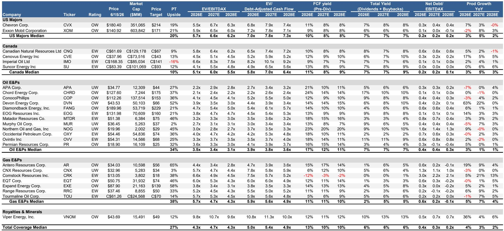
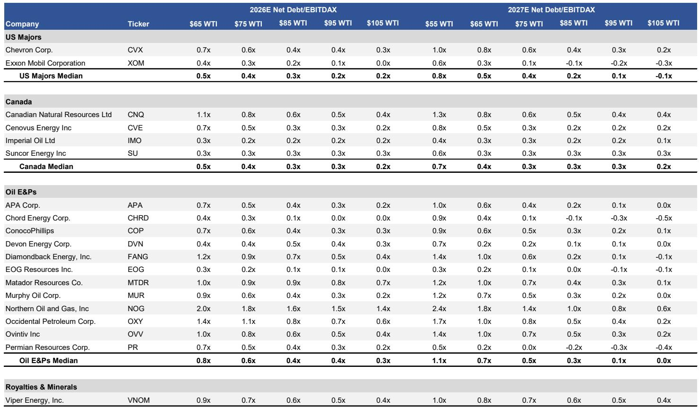
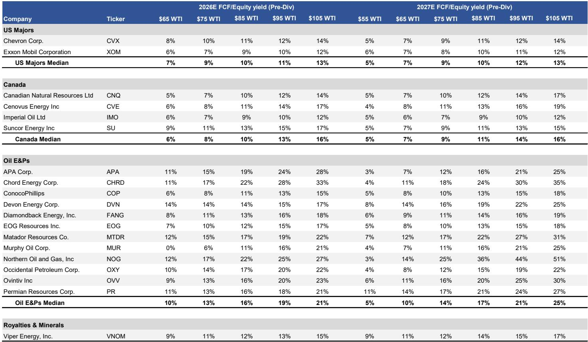

# 摩根斯坦利：市场对“和平”的定价已经过头，但油价真正的支撑尚未被计入

这份摩根斯坦利研报的标题本身就是一句判断：“Is Peace Mispriced?”——和平是否被错误定价？在美伊谅解备忘录即将签署、WTI自4月初已下跌29%的背景下，市场似乎已经在为“和平溢价”买单。但摩根斯坦利的分析揭示了一个更微妙的图景：当前股价所隐含的油价预期（约66美元/桶WTI）已经显著低于12个月远期曲线（约75美元），而基本面——尤其是三季度仍将存在的供需缺口——并没有被充分反映。真正被市场低估的，不是冲突持续的概率，而是即便和平到来，供给恢复的速度与库存重建的规模。

这份报告的核心价值不在于判断地缘政治走向，而在于提供了一个量化框架：把“和平”拆解为可追踪的变量——产量恢复节奏、库存回补需求、以及不同油价情景下的企业现金流。对于产业决策者和长期投资者而言，当前的回调可能不是风险出清，而是重新评估资产定价的窗口。

## 1. 和平协议签署只是第一步，供给恢复的物理约束才是三季度油价的真正支撑

市场对美伊达成谅解备忘录的反应是直观的：油价下跌。但摩根斯坦利原油策略师Martijn Rats的假设条件值得仔细拆解。该机构预计，即便霍尔木兹海峡近期重新开放，油轮运输恢复正常需要数周时间；到9月伊朗产量恢复50%，到12月恢复80%。这意味着三季度全球原油市场仍将维持约340万桶/日的平均缺口（仅OECD国家看，缺口约110万桶/日）。

这个测算的隐含意义是：和平协议本身并不等于供给立即释放。从协议签署到实际产量回流，中间存在一个数月的“真空期”。而在此期间，全球库存已经因冲突期间的大规模释放而处于低位。摩根斯坦利的图表显示，OECD原油库存已经跌至5年平均水平以下，且仍在加速去库。三季度的高温需求、叠加供给恢复的时滞，意味着油价在90美元附近仍将获得支撑，即便在和平情景下。

对投资者的含义：当前市场对“和平”的线性外推可能过度。三季度供需基本面并不支持油价持续下行，而库存重建的需求将在四季度及之后形成新的价格底部。

## 2. 当前股价隐含的油价预期已低于远期曲线13%，但市场并未为“库存重建”定价

摩根斯坦利通过逆向测算发现，美国油气生产商的当前估值隐含的WTI均价约为66美元/桶，比12个月远期曲线（约75美元）低约13%。这个差距在历史上并不罕见，但当前的特殊性在于：远期曲线本身可能已经包含了过多的“和平折价”。

更关键的是，该机构指出，即便在和平情景下，全球仍需补充自冲突以来消耗的大量库存。这并非一个线性过程。库存重建意味着额外的需求增量，而这一增量在当前的远期曲线中可能并未被充分定价。摩根斯坦利的敏感性分析显示，WTI每变动10美元/桶，覆盖范围内生产商的2027年自由现金流收益率将变动约3个百分点。在72美元的远期曲线下，美国油气生产商的2027年自由现金流收益率中位数为13%，这一水平在历史上属于有吸引力的区间。

这意味着：当前股价已经为“和平”支付了溢价，但尚未为“和平后的库存重建”定价。如果库存重建推动实际油价高于当前远期曲线，则当前估值可能低估了企业的真实盈利潜力。

## 3. 美国油气生产商的现金流韧性被低估，但这一判断依赖于两个尚未验证的假设

摩根斯坦利对美国油气生产商的整体判断是偏积极的：强劲的自由现金流叠加有吸引力的估值，回调创造了增加配置的机会。但这一判断依赖于两个尚未充分验证的假设。

第一，需求韧性。报告中的图表显示，美国隐含成品油需求迄今表现良好，汽油消费仍在正常范围内。但中国海运石油净进口量持续下降，6月可能进一步走低。全球需求的分化——美国强、中国弱——能否持续，是影响油价中枢的关键变量。如果中国需求疲软进一步蔓延，或美国经济出现放缓迹象，当前的需求假设可能需要下调。

第二，生产商资本纪律。过去几年美国页岩油生产商在资本纪律上的坚持是支撑股价的重要因素。但油价若持续在70美元附近震荡，生产商是否有动力维持当前的产量克制？如果部分生产商开始增产以弥补价格下跌带来的收入缺口，供给端的额外压力可能抵消库存重建的利好。

这两个假设的验证需要时间，而报告对此并未给出明确结论。这是当前框架中最大的不确定性来源。

## 4. 战略储备释放的节奏变化是一个被忽视的边际变量，三季度后可能成为新的价格催化剂

报告中一个容易被忽略的细节是全球战略石油储备（SPR）释放的节奏变化。数据显示，4-6月全球SPR释放量约为250万桶/日，但7-8月将骤降至约70万桶/日。这个变化的意义在于：过去几个月，SPR释放是抑制油价上涨的重要力量；而一旦释放大幅减少，市场将失去一个重要的缓冲机制。

结合前述三季度仍将存在的供需缺口，SPR释放的减少意味着市场将更加依赖商业库存和新增产量来满足需求。而商业库存目前已经处于低位，新增产量（尤其是伊朗产量）又需要时间才能完全恢复。这个组合在三季度末至四季度初可能形成一个供给紧张的窗口。

对投资者的含义：不应只关注地缘政治事件的短期影响，而应跟踪SPR释放节奏、库存水平、以及产量恢复的月度数据。这些“慢变量”的累积效应可能比和平协议本身对油价有更持久的影响。

## 5. 一个尚未被充分讨论的关键问题：天然气市场的结构性变化是否被低估？

摩根斯坦利的报告主要聚焦于原油，但对天然气生产商也进行了敏感性分析。在3.50美元/百万英热单位的远期曲线下，天然气生产商的2027年自由现金流收益率中位数为9%，略低于原油生产商。但天然气市场的定价逻辑与原油存在根本差异：天然气更多受区域供需、LNG出口能力、以及季节性因素的影响。

报告提到，天然气生产商的当前估值隐含的亨利港价格约为3.38美元，与远期曲线基本一致。但这里存在一个未被充分展开的问题：美国LNG出口能力的持续扩张，是否正在改变天然气的定价结构？如果LNG出口将美国天然气市场与全球市场更紧密地联系在一起，那么亨利港价格的中枢可能面临上移压力，尤其是在欧洲和亚洲需求保持韧性的情况下。

这一判断需要更多数据支持，但报告并未深入展开。对于关注天然气产业链的读者而言，这可能是比油价更值得深入研究的结构性主题。

---

这份摩根斯坦利报告的核心价值，在于它提供了一个“和平情景下的量化框架”，而非对地缘政治的预测。它告诉读者：即便和平到来，油价的支撑因素并未消失，只是从“冲突溢价”转变为“供给恢复溢价”和“库存重建溢价”。当前市场的定价可能过度反映了前者的消退，而低估了后者的持续性。

但正如前述分析所示，这一框架的有效性依赖于需求韧性和生产商资本纪律两个关键假设。这些假设的验证需要时间，而报告对此并未给出明确的置信区间。对于希望深入理解这些假设如何影响具体公司估值、以及如何跟踪关键变量的读者，完整的原始报告提供了更详细的敏感性分析和公司层面的数据拆解。

欢迎来星球微信群里继续讨论：在当前的油价曲线下，哪些生产商的现金流对油价弹性最大？库存重建的节奏如何影响不同公司的相对估值？以及，天然气市场的结构性变化是否正在创造新的投资机会？这些问题的答案，或许就藏在报告没有明确写出的那部分分析中。

Personal reading notes and learning share only. Not investment advice.

