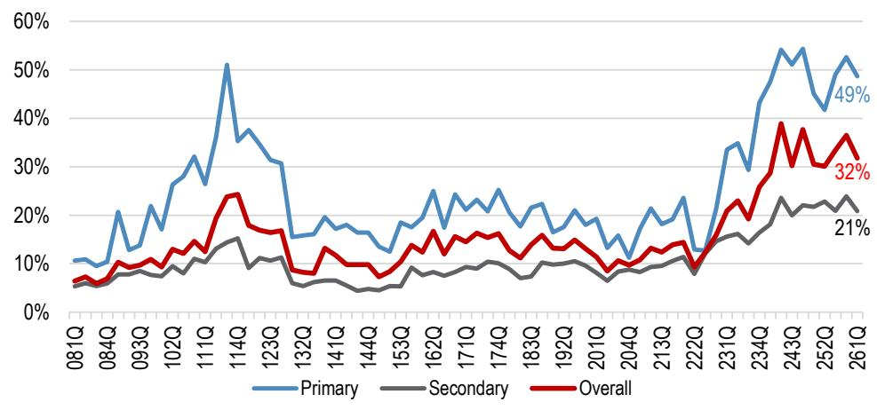
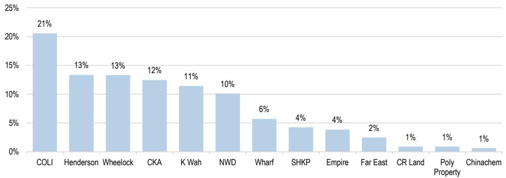
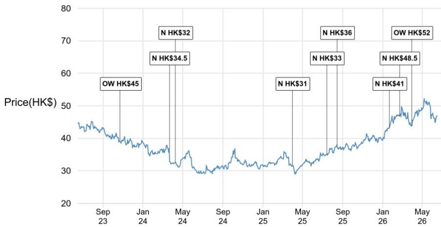
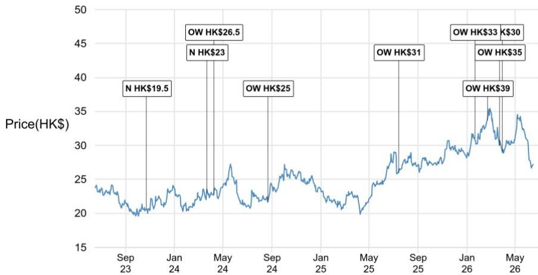
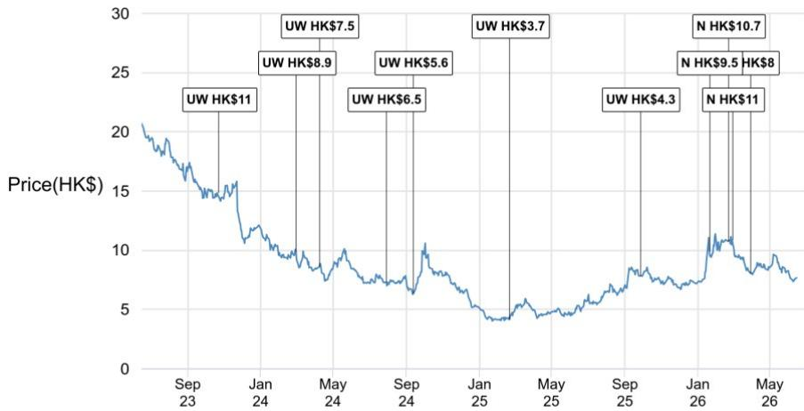
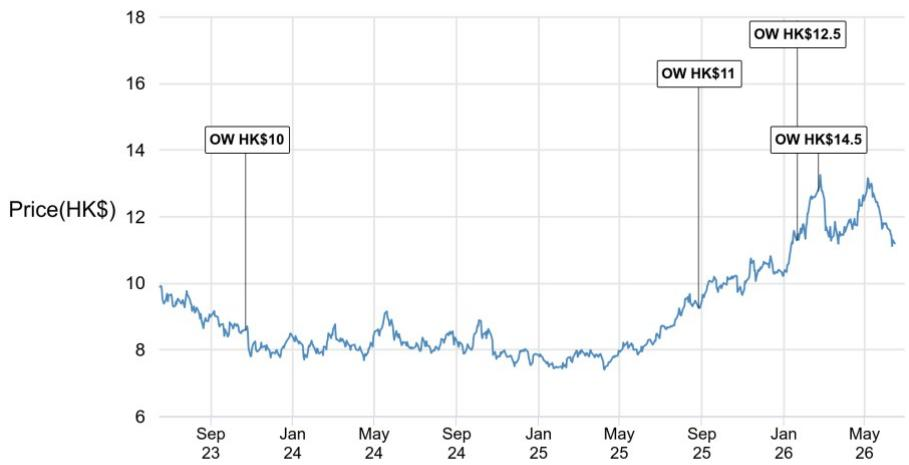
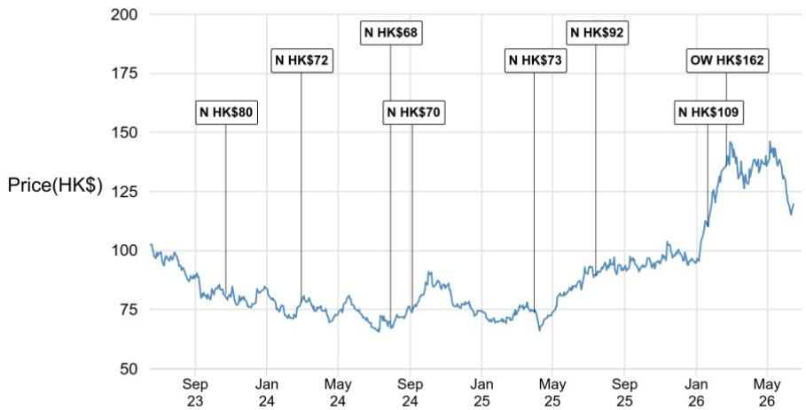

## Hong Kong Property

Takeaways from legal expert call on cross-border home purchase

The State Council's Regulations on Outbound Direct Investment (“Document 837”) (report) have triggered investors' concerns about the eligibility of Mainland Chinese to purchase property in Hong Kong. To address the legal implications, we hosted an expert call with a Beijing-based lawyer. Our 6 key takeaways:

1. For Mainland Chinese, money remittance to Hong Kong for the purpose of buying property has never been—and is unlikely to be—allowed.  
2. However, there is no ban on Mainland Chinese buying property in Hong Kong if the funding source is offshore.  
3. Document 837 does not appear to be targeted at curbing Mainland Chinese purchases of property in Hong Kong.  
4. Including real estate in CRS is complex and may not be realistic in the near term.  
5. For Mainland Chinese classified as “Mainland tax residents”, they are theoretically subject to 20% tax on rental income/capital gains from HK property, but this is not a new rule.  
6. Even if some Mainland Chinese are found to have violated laws to fund purchases of HK property, penalties are likely but forced disposals are unlikely.

While we believe the overhang may persist for some time, we came out of the call marginally less concerned, as it appears Document 837 is not (at least for now) targeted at Mainland Chinese purhcases of property in HK, and the regulations are, more or less, the status quo. However, the expert call still highlighted the risk of the Chinese government potentially requiring HK-based Mainland Chinese (if defined as “Mainland tax residents”) to report their offshore asset holdings (including real estate), which might be subject to additional taxes. This would then make holding HK property financially less attractive. In the HK housing market, we estimate 5-10% of all transactions (10-15% by value) are from non-HK-based Mainland Chinese buyers, who may potentially be impacted by the tighter enforcement (although if they can prove the funding source is offshore, they theoretically should not be impacted). This alone, in our view, should not derail the property upcycle (more discussion in our previous report). However, the sector is currently confronted by two other headwinds: (1) rising expectations of a rate hike (report); (2) a lackluster Hang Seng Index, which has historically shown a strong correlation to HK home prices. In the near term, we expect the sector to trade range-bound until: (1) proof of minimal impact on primary sell-through rates, secondary sales volumes and home prices; (2) easing expectations for a rate hike. In the near term, we expect CKA/Sino to outperform and Henderson/NWD to underperform. On dips, we would accumulate SHKP.

## Mainland China/Hong Kong Property & Conglomerates

Karl Chan AC

(852) 2800-8513

karl.chan@JPM.com

Venus Choi

(852) 2800-8599

venus.choi@JPM.com

Jocelyn Gao

(852) 2800-8529

jocelyn.gao@JPM.com

JPM Securities (Asia Pacific) Limited/ JPM Broking (Hong Kong) Limited

## 20 Q&As from expert call

Q1) What is the background of Document 837? Why was this rolled out at this juncture?

- The introduction of Document 837 was primarily triggered by a representative cross-border case involving a US company's proposed acquisition of a Chinese AI company. This case raised two key regulatory concerns: (1) individual outbound investment: The controlling shareholder held equity offshore in a personal capacity; and (2) technology export: The company transferred its core operations and personnel offshore, which Chinese regulators deemed an unapproved technology export. Document 837 represents a top-down regulatory response prompted by real-world cases.  
- Another key driver is tax supervision. Chinese individuals have accumulated significant offshore assets (e.g. equities), but the lack of a unified State Council-level framework previously made it difficult to coordinate supervision and tax enforcement. The new regulations aim to address this gap. Document 837 is a framework-level policy that consolidates existing rules across ministries, without materially changing the current regime.

\*\*\*\*\*\*\*\*\*\*\*\*\*\*\*\*\*\*\*\*\*\*\*\*\*\*\*\*\*\*\*\*\*\*\*\*\*\*\*\*\*\*\*\*\*\*\*\*\*\*\*\*\*\*\*\*\*\*\*\*\*\*\*\*\*\*\*\*\*\*\*\*\*\*\*\*\*\*\*\*\*\*\*\*\*\*\*\*

Q2) Will more explicit measures be introduced to regulate Mainland Chinese residents purchasing property in Hong Kong?

Under the current legal framework, Mainland residents' use of onshore funds to purchase overseas properties (including HK) has not been formally liberalized, and no fully compliant channel exists.

- SAFE has explicitly stated that outbound transfers for overseas property purchases (including the annual US\$50,000 FX quota) under the capital account are not permitted.  
- Overseas property falls under the capital account, which remains tightly controlled (with only limited openings for equity investments).

China's FX regime distinguishes between:

- Current account (largely open): trade in goods and services.  
- Capital account (restricted): including overseas investments, lending, guarantees, and real estate.

\*\*\*\*\*\*\*\*\*\*\*\*\*\*\*\*\*\*\*\*\*\*\*\*\*\*\*\*\*\*\*\*\*\*\*\*\*\*\*\*\*\*\*\*\*\*\*\*\*\*\*\*\*\*\*\*\*\*\*\*\*\*\*\*\*\*\*\*\*\*\*\*\*\*\*\*\*\*\*\*\*\*\*\*\*\*\*\*

Q3) Under the current framework, are Mainland residents prohibited from purchasing overseas property?

The key distinction lies in the source of funds:

\- Onshore funds: RMB cannot be legally converted or remitted offshore for property purchases.

\- Offshore funds: If an individual already has legitimate offshore income (e.g., salary or investment income), and no onshore funds are involved, overseas purchases are allowed.

The regulatory focus is on whether the funds originate from the Chinese Mainland:

\- If no cross-border transfer of onshore funds is involved, restrictions generally do not apply.

\- If RMB is converted and remitted offshore for property purchases, it falls under restricted capital-account activity.

\*\*\*\*\*\*\*\*\*\*\*\*\*\*\*\*\*\*\*\*\*\*\*\*\*\*\*\*\*\*\*\*\*\*\*\*\*\*\*\*\*\*\*\*\*\*\*\*\*\*\*\*\*\*\*\*\*\*\*\*\*\*\*\*\*\*\*\*\*\*\*\*\*\*\*\*\*\*\*\*\*\*\*\*\*\*\*\*\*\*

Q4) For Mainland individuals working in Hong Kong, are there any restrictions on property purchases? What are the tax implications?

This needs to be analyzed from two dimensions: FX regulation and taxation.

From an FX perspective, restrictions apply only if both conditions are met:

1. The individual is still a Mainland resident (e.g., holds a Mainland ID); and

2. the funds originate from the Mainland.

If either condition is not met (e.g., use of income generated in Hong Kong), then FX restrictions typically do not apply.

From a tax perspective, the key is whether the individual is a Mainland Chinese tax resident. If so, global income (including offshore rental income and capital gains) is subject to a 20% individual income tax (with foreign tax credits to avoid double taxation). Typically, if a person still holds a Mainland Chinese hukou (household registration), he or she would be classified as a Mainland Chinese tax resident (long-term working/living in HK alone does not necessarily change that status).

\*\*\*\*\*\*\*\*\*\*\*\*\*\*\*\*\*\*\*\*\*\*\*\*\*\*\*\*\*\*\*\*\*\*\*\*\*\*\*\*\*\*\*\*\*\*\*\*\*\*\*\*\*\*\*\*\*\*\*\*\*\*\*\*\*\*\*\*\*\*\*\*\*\*\*\*\*\*\*\*\*\*\*\*\*\*\*\*

Q5) Will real estate be included under the common reporting standard (“CRS”) in the future?

\- CRS is designed for information exchange between tax authorities and financial institutions, covering financial accounts (balances, interest, dividends, etc.).

• Real estate is currently not categorized as a financial asset under CRS.

\- Including real estate would require coordination among global property registries or a major expansion of the CRS framework, which is operationally complex.

However, indirect monitoring is possible:

• Account-level data may reveal large outflows or asset growth;

• tax authorities may request explanations; and

\- public property registries (e.g., Hong Kong Land Registry) may enable cross-checking.

\*\*\*\*\*\*\*\*\*\*\*\*\*\*\*\*\*\*\*\*\*\*\*\*\*\*\*\*\*\*\*\*\*\*\*\*\*\*\*\*\*\*\*\*\*\*\*\*\*\*\*\*\*\*\*\*\*\*\*\*\*\*\*\*\*\*\*\*\*\*\*\*\*\*\*\*\*\*\*\*\*\*\*\*\*\*\*\*\*\*

## Q6) If funds were previously transferred offshore in violation of FX rules to purchase HK property, what are the risks?

Enforcement focuses on illegal cross-border fund transfers, not the property purchase itself.

Common violations include:

• Underground banking channels  
- Matching transactions (“对敲”)  
- Aggregation of multiple USD50k quotas.

Penalties generally involve fines of approximately 5–10% (or higher for illegal funds).

Forced disposal of offshore assets is unlikely, in practice.

\*\*\*\*\*\*\*\*\*\*\*\*\*\*\*\*\*\*\*\*\*\*\*\*\*\*\*\*\*\*\*\*\*\*\*\*\*\*\*\*\*\*\*\*\*\*\*\*\*\*\*\*\*\*\*\*\*\*\*\*\*\*\*\*\*\*\*\*\*\*\*\*\*\*\*\*\*\*\*\*\*\*\*\*\*\*\*\*

## Q7) How does the Chinese government view Mainland residents holding assets in Hong Kong?

The key concern remains compliance with capital outflows, rather than asset location.

In practice:

- Existing offshore assets are generally treated as a fait accompli.  
• Authorities typically do not require repatriation.  
- Hong Kong is viewed as relatively more acceptable compared to other offshore jurisdictions (as it is part of China).

For corporates, however, policy tends to favor investment in strategic outbound regions (e.g., Southeast Asia, Middle East, Latin America).

\*\*\*\*\*\*\*\*\*\*\*\*\*\*\*\*\*\*\*\*\*\*\*\*\*\*\*\*\*\*\*\*\*\*\*\*\*\*\*\*\*\*\*\*\*\*\*\*\*\*\*\*\*\*\*\*\*\*\*\*\*\*\*\*\*\*\*\*\*\*\*\*\*\*\*\*\*\*\*\*\*\*\*\*\*\*\*\*\*\*

## Q8) Can offshore income (e.g., IPO proceeds, stock compensation) be used to purchase property in HK?

- Yes. Such income is generally considered legitimate offshore funds under FX rules and can be used for offshore investment.  
- However, if the individual is a Chinese tax resident, the income may still be subject to taxation in China.  
- There is currently no requirement for individuals to repatriate offshore investment income.

\*\*\*\*\*\*\*\*\*\*\*\*\*\*\*\*\*\*\*\*\*\*\*\*\*\*\*\*\*\*\*\*\*\*\*\*\*\*\*\*\*\*\*\*\*\*\*\*\*\*\*\*\*\*\*\*\*\*\*\*\*\*\*\*\*\*\*\*\*\*\*\*\*\*\*\*\*\*\*\*\*\*\*\*\*\*\*\*

Q9) Will more detailed rules follow the Document 837?

Document 837 is a framework/coordination regulation, and further detailed rules are likely.

Its three core elements are:

- Unified oversight of corporate ODI: consolidating and standardizing regulation of corporate outbound investment.  
• Stronger technology export controls: tighter rules for key areas (e.g., AI).  
- Bringing individual outbound investment into the regulatory system: for the first time at the national level, explicitly proposing standardized management of individuals' overseas investment.

Following typical legislative practice, after the State Council issues a framework regulation, implementing agencies (NDRC, MOFCOM, SAFE, etc.) would issue supporting rules and operational guidance. Thus, regulatory standards and operational pathways—especially for individual outbound investment—are expected to become clearer. Exact timeline is, however, uncertain.

\*\*\*\*\*\*\*\*\*\*\*\*\*\*\*\*\*\*\*\*\*\*\*\*\*\*\*\*\*\*\*\*\*\*\*\*\*\*\*\*\*\*\*\*\*\*\*\*\*\*\*\*\*\*\*\*\*\*\*\*\*\*\*\*\*\*\*\*\*\*

## Q10) After paying penalties for FX violations, are the funds considered “legal”?

\- In practice, penalties apply to the FX violation itself. Once fines are paid, the funds typically remain offshore and are not required to be repatriated.

\*\*\*\*\*\*\*\*\*\*\*\*\*\*\*\*\*\*\*\*\*\*\*\*\*\*\*\*\*\*\*\*\*\*\*\*\*\*\*\*\*\*\*\*\*\*\*\*\*\*\*\*\*\*\*\*\*\*\*\*\*\*\*\*\*\*\*\*\*\*\*\*\*\*\*\*\*\*\*\*\*\*\*\*\*\*\*\*

## Q11) Will Document 837 make it even harder for funds to go to Hong Kong for home purchases in the future?

- Common methods used in practice include: using the annual USD50k quota, netting/ offset arrangements (or underground channels), shifting funds via service fees between related Mainland–Hong Kong companies, and using ODI structures to remit funds and then divert them to property purchases or personal use (the last one has the highest compliance risk). Many of these are grey areas and may not be legitimate.  
- Supervision over outbound remittances is tightening, and these channels are expected to face stricter scrutiny and higher execution difficulty. Bank compliance reviews for cross-border transfers have become more demanding.  
- In practice, “netting” risks concentrate around centralized fund flows.

\*\*\*\*\*\*\*\*\*\*\*\*\*\*\*\*\*\*\*\*\*\*\*\*\*\*\*\*\*\*\*\*\*\*\*\*\*\*\*\*\*\*\*\*\*\*\*\*\*\*\*\*\*\*\*\*\*\*\*\*\*\*\*\*\*\*\*\*\*\*\*\*\*\*\*\*\*\*\*\*\*\*\*\*\*\*\*\*\*\*

## Q12) Can gifted offshore funds be used for home purchases in HK?

\- Yes, if the gift (e.g. from a HK-based relative) is genuinely offshore and does not involve disguised cross-border transfers.

\*\*\*\*\*\*\*\*\*\*\*\*\*\*\*\*\*\*\*\*\*\*\*\*\*\*\*\*\*\*\*\*\*\*\*\*\*\*\*\*\*\*\*\*\*\*\*\*\*\*\*\*\*\*\*\*\*\*\*\*\*\*\*\*\*\*\*\*\*\*\*\*\*\*\*\*\*\*\*\*\*\*\*\*\*\*\*\*\*\*

## Q13) Can company/trust structures avoid CRS or tax obligations?

\- For a company structure, CRS typically focuses on the account holder and its controlling persons (e.g., shareholders). The exact disclosure depends on structuring and reporting positions, and there are relatively few public practical cases, so the effect is uncertain.

- For trusts, CRS requires reporting key parties including the settlor, trustee, and beneficiaries. There is practice showing such information can be exchanged to Mainland tax authorities and trigger inquiries.  
- From a tax perspective, authorities generally apply “substance over form.” If the main purpose of the structure is tax avoidance, tax authorities may look through it and impose tax obligations.

\*\*\*\*\*\*\*\*\*\*\*\*\*\*\*\*\*\*\*\*\*\*\*\*\*\*\*\*\*\*\*\*\*\*\*\*\*\*\*\*\*\*\*\*\*\*\*\*\*\*\*\*\*\*\*\*\*\*\*\*\*\*\*\*\*\*\*\*\*\*\*\*\*\*\*\*\*\*\*\*\*\*\*\*\*\*\*\*

## Q14) Will “Property Connect” (购房通) progress?

- “Property Connect” (i.e. establishing a legal way for HK-based Mainland Chinese to remit funds from the Chinese Mainland for home purchases in HK) is a proposal from Hong Kong, but whether it can truly land depends on whether the Mainland side addresses the core issue: outbound fund remittance. Since FX conversion and capital-account flows are regulated on the Mainland, without Mainland policy support, Hong Kong alone cannot roll this out.  
- A pilot is not impossible under specific conditions (e.g., limited cities, targeted groups such as high taxpayers, quota-based opening), but it would more likely be a cautious, limited pilot rather than a full opening. However, so far there is no sign of the Chinese government pushing for “Property Connect”.

\*\*\*\*\*\*\*\*\*\*\*\*\*\*\*\*\*\*\*\*\*\*\*\*\*\*\*\*\*\*\*\*\*\*\*\*\*\*\*\*\*\*\*\*\*\*\*\*\*\*\*\*\*\*\*\*\*\*\*\*\*\*\*\*\*\*\*\*\*\*\*\*\*\*\*\*\*\*\*\*\*\*\*\*\*\*\*\*

## Q15) Is RMB settlement in the Mainland for Hong Kong property purchases considered compliant?

\- Not compliant. Regulators would view this as a cross-border transaction that is paid in FX, which is explicitly restricted under FX administration.

\*\*\*\*\*\*\*\*\*\*\*\*\*\*\*\*\*\*\*\*\*\*\*\*\*\*\*\*\*\*\*\*\*\*\*\*\*\*\*\*\*\*\*\*\*\*\*\*\*\*\*\*\*\*\*\*\*\*\*\*\*\*\*\*\*\*\*\*\*\*\*\*\*\*\*\*\*\*\*\*\*\*\*\*\*\*\*\*

## Q16) Are fines limited to transferred funds? Would assets be confiscated?

- Fines are typically calculated only on the amount of funds remitted out in violation of rules. For example, if USD1 million was remitted out in violation, the fine is generally around 5%–10% of that amount, and does not extend to other funds that never left the Chinese Mainland.  
- As for asset disposal, public cases have not shown confiscation, forced sale, or mandatory repatriation. Although rules (especially State Council regulations) in theory mention disposal of offshore assets/rights for illegal outbound investment, market understanding is that this mainly targets corporate ODI.

\*\*\*\*\*\*\*\*\*\*\*\*\*\*\*\*\*\*\*\*\*\*\*\*\*\*\*\*\*\*\*\*\*\*\*\*\*\*\*\*\*\*\*\*\*\*\*\*\*\*\*\*\*\*\*\*\*\*\*\*\*\*\*\*\*\*\*\*\*\*\*\*\*\*\*\*\*\*\*\*\*\*\*\*\*\*\*\*

## Q17) Would there be a grace period for past violations?

\- A “grace period” or “transition period” is unlikely. FX violations are generally handled under existing rules, and there has been no clear policy offering penalty waivers for voluntary disclosure.

\- From a tax compliance perspective, enforcement is generally subject to a practical limitations period and typically focuses on matters arising within the most recent 3 years; issues from earlier periods are less likely to be pursued on a retroactive basis.

\*\*\*\*\*\*\*\*\*\*\*\*\*\*\*\*\*\*\*\*\*\*\*\*\*\*\*\*\*\*\*\*\*\*\*\*\*\*\*\*\*\*\*\*\*\*\*\*\*\*\*\*\*\*\*\*\*\*\*\*\*\*\*\*\*\*\*\*\*\*\*\*\*\*\*\*\*\*\*\*\*\*\*\*\*\*\*\*

Q18) When Document 837's implementing rules come out, could they explicitly open up overseas real estate investment, or at least mention related arrangements?

- The detailed rules are unlikely to substantively open up overseas real estate investment.  
- Two possible approaches in wording: (1) not mentioning real estate, maintaining the current “not opened” status; or (2) explicitly reiterating that overseas real estate investment is not allowed through fund remittance. Either way, a substantive shift is not expected.

\*\*\*\*\*\*\*\*\*\*\*\*\*\*\*\*\*\*\*\*\*\*\*\*\*\*\*\*\*\*\*\*\*\*\*\*\*\*\*\*\*\*\*\*\*\*\*\*\*\*\*\*\*\*\*\*\*\*\*\*\*\*\*\*\*\*\*\*\*\*\*\*\*\*\*\*\*\*\*\*\*\*\*\*\*\*\*\*

Q19) If someone previously remitted funds out in violation of FX rules and bought a home in Hong Kong, then later canceled their Mainland identity/hukou, is there still retroactive risk?

\- Tax liability depends on when the gain is realized. If the person is no longer a Mainland Chinese tax resident at the time of the sale, the gain may not be taxable in China.

\*\*\*\*\*\*\*\*\*\*\*\*\*\*\*\*\*\*\*\*\*\*\*\*\*\*\*\*\*\*\*\*\*\*\*\*\*\*\*\*\*\*\*\*\*\*\*\*\*\*\*\*\*\*\*\*\*\*\*\*\*\*\*\*\*\*\*\*\*\*\*\*\*\*\*\*\*\*\*\*\*\*\*\*\*\*\*\*

Q20) What are the penalties for a Mainland Chinese failing to declare rental income or capital gains from HK properties?

- Late payment charges are typically calculated at $0.05\%$ per day.  
- Based on current practice, this is usually treated as a tax compliance matter handled by back taxes and late fees.  
- There have been no cases leading to criminal punishment (e.g., imprisonment).

# Mainland Chinese buyers in HK residential market

Table 1: HK private residential market – % of buyers who are not holders of Hong Kong Identity Card (HKID)

<table><tr><td rowspan="2"></td><td colspan="4">Individual buyers who are not HKID holders</td></tr><tr><td colspan="2">Volume(units) as % of total</td><td colspan="2">Value(HK$ bn) as % of total</td></tr><tr><td>FY20/21</td><td>110</td><td>0.1%</td><td>1.1</td><td>0.2%</td></tr><tr><td>FY21/22</td><td>153</td><td>0.2%</td><td>1.6</td><td>0.2%</td></tr><tr><td>FY22/23</td><td>168</td><td>0.3%</td><td>1.6</td><td>0.4%</td></tr><tr><td>FY23/24</td><td>700</td><td>1.6%</td><td>6.8</td><td>2.0%</td></tr><tr><td>FY24/25</td><td>2,997</td><td>5.5%</td><td>31.3</td><td>7.2%</td></tr></table>

Source: HK Inland Revenue Department  
Note: FY denotes HK government's fiscal year (year ending 31 March). For example, FY24/25 refers to the period from 2Q24 to 1Q25.

Figure 1: HK private residential market – % of “Mainland Chinese” buyers with a last name in Mandarin pinyin (by volume)  

line chart

| Quarter | Primary | Secondary | Overall |
| ------- | ------- | --------- | ------- |
| 261Q    | 36%     | 17%       | 23%     |

Source: Centraline.  
Note: “Mainland Chinese” is defined here using the Mandarin pinyin of the buyer’s last name and does not distinguish the buyer’s current residence or identity. As a result, “Mainland Chinese” who are residing in Hong Kong—as well as local Hong Kong residents with Mandarin-pinyin last names—are also classified as “Mainland Chinese” in this dataset.

Figure 2: HK private residential market – % of “Mainland Chinese” buyers with a last name in Mandarin pinyin (by value)  

line chart

| Quarter | Primary | Secondary | Overall |
| ------- | ------- | --------- | ------- |
| 261Q    | 49%     | 21%       | 32%     |

Source: Centraline.  
Note: “Mainland Chinese” is defined here using the Mandarin pinyin of the buyer’s last name and does not distinguish the buyer’s current residence or identity. As a result, “Mainland Chinese” who are residing in Hong Kong—as well as local Hong Kong residents with Mandarin-pinyin last names—are also classified as “Mainland Chinese” in this dataset.

Table 2: Personal cross-boundary remittance regulations from Mainland China to Hong Kong SAR

<table><tr><td>Category</td><td>Quota</td><td>Details</td></tr><tr><td>Facilitative foreign exchange arrangement購匯便利化額度</td><td>US$50,000 per person per year</td><td>Directly conduct currency conversion at Mainland banks with identity document and remit outside the Mainland.If a remitter prefers not to use the quota / the conversion quota is reached, remitter shall provide the bank with supporting documents for verification of the use of funds (e.g. travel, study abroad, daily life, and medical care.)</td></tr><tr><td>Payment Connect跨境支付通</td><td>Follow the facilitative foreign exchange arrangement (US$50,000 per year)</td><td>Real-time and small-value cross-boundary remittances at participating institutions in the Mainland</td></tr><tr><td>Withdraw cash using debt/credit cards issued in Mainland</td><td>Annual limit of RMB100,000, and a daily limit of RMB10,000</td><td></td></tr><tr><td>Cross-border cash carrying</td><td>Rmb 20,000 per person per trip; or USD 5,000 for foreign currency</td><td></td></tr></table>

Source: HKMA

# Districts with the most “Mainland Chinese” buyers in Hong Kong

Table 3: Top 5 districts ranked by no. of Mainland Chinese buyers (primary units) since the lifting of the additional stamp duties (Mar 2024 to Feb 2026)

<table><tr><td>District</td><td></td><td>Total</td><td>Primary</td><td>Secondary</td></tr><tr><td>Kai Tak</td><td>啟德</td><td>3,050</td><td>2,786</td><td>264</td></tr><tr><td>Wong Chuk Hang</td><td>黃竹坑</td><td>1,162</td><td>1,131</td><td>31</td></tr><tr><td>Cheung Sha Wan / Sham Shui Po</td><td>長沙灣/深水埗</td><td>1,376</td><td>838</td><td>538</td></tr><tr><td>Tseung Kwan O</td><td>將軍澳</td><td>1,544</td><td>777</td><td>767</td></tr><tr><td>Central &amp; Western</td><td>中西區</td><td>1,971</td><td>731</td><td>1,240</td></tr></table>

Source: Midland  
Note: “Mainland Chinese” is defined here using the Mandarin pinyin of the buyer’s last name and does not distinguish the buyer’s current residence or identity. As a result, “Mainland Chinese” who are residing in Hong Kong—as well as local Hong Kong residents with Mandarin-pinyin last names—are also classified as “Mainland Chinese” in this dataset.

Figure 3: Developers' exposure in Kai Tak Runway Area based on attributable number of unsold units  

bar chart

| Company | Percentage (%) |
| :--- | :--- |
| COLI | 21 |
| Henderson | 13 |
| Wheelock | 13 |
| CKA | 12 |
| K Wah | 11 |
| NWD | 10 |
| Wharf | 6 |
| SHKP | 4 |
| Empire | 4 |
| Far East | 2 |
| CR Land | 1 |
| Poly Property | 1 |
| Chinachem | 1 |

Source: Centraline, JPM  
Note: For projects involving a consortium, we assume an equal split among the developers.

## Valuation Summary

Table 4: Hong Kong Property & Conglomerates – Valuation Summary

<table><tr><td rowspan="2">Company</td><td rowspan="2">Stock Code</td><td rowspan="2">JPM Rating</td><td rowspan="2">Last Close (HK$)</td><td rowspan="2">Market Cap US$M</td><td rowspan="2">ADV US$M</td><td rowspan="2">NAV Discount</td><td colspan="2">P/E</td><td colspan="2">Dvd Yield</td><td colspan="2">P/B</td><td colspan="4">Share Price Return</td></tr><tr><td>1FY (x)</td><td>2FY (x)</td><td>1FY (%)</td><td>2FY (%)</td><td>1FY (x)</td><td>2FY (x)</td><td>5D</td><td>YTD</td><td>1Y</td><td>Peak</td></tr><tr><td colspan="7">Hong Kong Property</td><td colspan="10"></td></tr><tr><td>Sun Hung Kai Properties</td><td>0016.HK</td><td>OW</td><td>119.60</td><td>44,234</td><td>92.9</td><td>-43%</td><td>15.2</td><td>14.2</td><td>3.3%</td><td>3.5%</td><td>0.6</td><td>0.5</td><td>2%</td><td>27%</td><td>42%</td><td>-19%</td></tr><tr><td>CK Asset</td><td>1113.HK</td><td>OW</td><td>46.98</td><td>20,985</td><td>36.6</td><td>-49%</td><td>14.6</td><td>14.5</td><td>3.6%</td><td>3.6%</td><td>0.4</td><td>0.4</td><td>5%</td><td>23%</td><td>45%</td><td>-9%</td></tr><tr><td>Henderson Land</td><td>0012.HK</td><td>N</td><td>27.20</td><td>16,807</td><td>40.0</td><td>-56%</td><td>17.0</td><td>14.3</td><td>4.6%</td><td>4.6%</td><td>0.4</td><td>0.4</td><td>0%</td><td>-1%</td><td>6%</td><td>-22%</td></tr><tr><td>Sino Land</td><td>0083.HK</td><td>OW</td><td>11.20</td><td>13,703</td><td>14.0</td><td>-39%</td><td>21.9</td><td>23.5</td><td>5.2%</td><td>5.2%</td><td>0.6</td><td>0.6</td><td>-2%</td><td>11%</td><td>43%</td><td>-16%</td></tr><tr><td>New World Development</td><td>0017.HK</td><td>N</td><td>7.67</td><td>2,464</td><td>6.8</td><td>-61%</td><td>-11.5</td><td>-9.0</td><td>0.0%</td><td>0.0%</td><td>0.1</td><td>0.1</td><td>4%</td><td>6%</td><td>44%</td><td>-87%</td></tr><tr><td>Wharf Holdings</td><td>0004.HK</td><td>NC</td><td>19.41</td><td>7,571</td><td>13.7</td><td>-</td><td>13.0</td><td>12.4</td><td>2.1%</td><td>2.2%</td><td>0.4</td><td>0.4</td><td>-5%</td><td>-10%</td><td>-16%</td><td>-37%</td></tr><tr><td>Kerry Properties</td><td>0683.HK</td><td>NC</td><td>19.91</td><td>3,688</td><td>5.5</td><td>-</td><td>14.2</td><td>6.8</td><td>6.8%</td><td>6.8%</td><td>0.3</td><td>0.3</td><td>0%</td><td>3%</td><td>9%</td><td>-20%</td></tr><tr><td colspan="5">Developers</td><td>53.7</td><td>-41%</td><td>15.4</td><td>14.5</td><td>3.8%</td><td>3.8%</td><td>0.5</td><td>0.5</td><td>1%</td><td>16%</td><td>32%</td><td>-20%</td></tr><tr><td>Swire Properties</td><td>1972.HK</td><td>OW</td><td>21.66</td><td>15,916</td><td>10.2</td><td>-54%</td><td>15.5</td><td>14.0</td><td>5.6%</td><td>5.8%</td><td>0.5</td><td>0.5</td><td>0%</td><td>7%</td><td>23%</td><td>-18%</td></tr><tr><td>Wharf REIC</td><td>1997.HK</td><td>N</td><td>22.50</td><td>8,719</td><td>15.0</td><td>-59%</td><td>10.8</td><td>10.9</td><td>5.7%</td><td>5.7%</td><td>0.4</td><td>0.4</td><td>-1%</td><td>-6%</td><td>13%</td><td>-50%</td></tr><tr><td>HK Land (in US$)</td><td>HKLD.SI</td><td>OW</td><td>7.44</td><td>15,955</td><td>22.9</td><td>-44%</td><td>34.7</td><td>32.8</td><td>3.5%</td><td>3.7%</td><td>0.5</td><td>0.5</td><td>3%</td><td>10%</td><td>37%</td><td>-17%</td></tr><tr><td>Hang Lung Properties</td><td>0101.HK</td><td>OW</td><td>7.75</td><td>5,002</td><td>9.9</td><td>-72%</td><td>12.3</td><td>11.5</td><td>6.7%</td><td>6.7%</td><td>0.3</td><td>0.3</td><td>1%</td><td>-6%</td><td>18%</td><td>-61%</td></tr><tr><td>Hysan</td><td>0014.HK</td><td>NC</td><td>17.28</td><td>2,265</td><td>6.3</td><td>-</td><td>8.4</td><td>10.0</td><td>6.3%</td><td>6.3%</td><td>0.3</td><td>0.3</td><td>-2%</td><td>-5%</td><td>28%</td><td>-40%</td></tr><tr><td colspan="5">Landlords</td><td>15.1</td><td>-51%</td><td>20.4</td><td>19.2</td><td>5.1%</td><td>5.2%</td><td>0.4</td><td>0.4</td><td>1%</td><td>4%</td><td>26%</td><td>-29%</td></tr><tr><td>Link REIT</td><td>0823.HK</td><td>N</td><td>36.98</td><td>12,188</td><td>54.3</td><td>-</td><td>14.7</td><td>14.7</td><td>6.6%</td><td>6.7%</td><td>0.6</td><td>0.6</td><td>1%</td><td>10%</td><td>-3%</td><td>-43%</td></tr><tr><td>Fortune REIT</td><td>778.HK</td><td>NC</td><td>4.79</td><td>1,258</td><td>1.8</td><td>-</td><td>26.8</td><td>26.8</td><td>7.2%</td><td>7.2%</td><td>0.4</td><td>0.4</td><td>2%</td><td>1%</td><td>11%</td><td>-31%</td></tr><tr><td>Champion REIT</td><td>2778.HK</td><td>NC</td><td>2.38</td><td>1,864</td><td>0.4</td><td>-</td><td>19.3</td><td>19.3</td><td>5.9%</td><td>6.1%</td><td>0.4</td><td>0.4</td><td>1%</td><td>-4%</td><td>29%</td><td>-46%</td></tr><tr><td colspan="5">REITs</td><td>43.4</td><td>-</td><td>16.3</td><td>16.3</td><td>6.6%</td><td>6.7%</td><td>0.5</td><td>0.5</td><td>1%</td><td>8%</td><td>2%</td><td>-43%</td></tr><tr><td colspan="5">Hong Kong Property (Overall)</td><td>42.1</td><td>-40%</td><td>16.9</td><td>16.0</td><td>4.4%</td><td>4.5%</td><td>0.5</td><td>0.5</td><td>1%</td><td>12%</td><td>28%</td><td>-24%</td></tr><tr><td>CK Hutchison</td><td>0001.HK</td><td>OW</td><td>70.05</td><td>34,243</td><td>70.3</td><td>-38%</td><td>9.1</td><td>11.2</td><td>4.4%</td><td>3.5%</td><td>0.5</td><td>0.4</td><td>5%</td><td>35%</td><td>51%</td><td>-10%</td></tr><tr><td>Jardine Matheson</td><td>JARD.SI</td><td>OW</td><td>66.00</td><td>19,456</td><td>25.9</td><td>-43%</td><td>11.0</td><td>10.5</td><td>3.7%</td><td>3.9%</td><td>0.6</td><td>0.6</td><td>8%</td><td>-1%</td><td>49%</td><td>-18%</td></tr><tr><td>Swire Pacific</td><td>19.HK</td><td>NC</td><td>83.55</td><td>13,154</td><td>12.4</td><td>-</td><td>10.1</td><td>9.2</td><td>4.8%</td><td>5.1%</td><td>0.4</td><td>0.4</td><td>2%</td><td>37%</td><td>28%</td><td>-9%</td></tr><tr><td colspan="5">Conglomerates</td><td>46.0</td><td>-40%</td><td>9.9</td><td>10.6</td><td>4.3%</td><td>3.9%</td><td>0.5</td><td>0.5</td><td>5%</td><td>25%</td><td>46%</td><td>-12%</td></tr></table>

Source: Bloomberg Finance L.P., JPM estimates.  
Note: Share prices as of 15 Jun 2026. Bloomberg consensus estimates for Not Covered (NC) companies. Past performance is not an indicator of future results.

Companies Discussed in This Report (all prices in this report as of market close on 15 June 2026, unless otherwise indicated) CK Asset Holdings Ltd (1113)(1113.HK/HK\$46.98/OW), Henderson Land Development (0012)(0012.HK/HK\$27.20/N), New World Development (0017)(0017.HK/HK\$7.67/N), Sino Land (0083)(0083.HK/HK\$11.20/OW), Sun Hung Kai Properties (0016)(0016.HK/HK\$119.60/OW)

Analyst Certification: The Research Analyst(s) denoted by an “AC” on the cover of this report certifies (or, where multiple Research Analysts are primarily responsible for this report, the Research Analyst denoted by an “AC” on the cover or within the document individually certifies, with respect to each security or issuer that the Research Analyst covers in this research) that: (1) all of the views expressed in this report accurately reflect the Research Analyst’s personal views about any and all of the subject securities or issuers; and (2) no part of any of the Research Analyst's compensation was, is, or will be directly or indirectly related to the specific recommendations or views expressed by the Research Analyst(s) in this report. For all Korea-based Research Analysts listed on the front cover, if applicable, they also certify, as per KOFIA requirements, that the Research Analyst’s analysis was made in good faith and that the views reflect the Research Analyst’s own opinion, without undue influence or intervention.

All authors named within this report are Research Analysts who produce independent research unless otherwise specified. In Europe, Sector Specialists (Sales and Trading) may be shown on this report as contacts but are not authors of the report or part of the Research Department.

## Important Disclosures

- Market Maker/ Liquidity Provider (Hong Kong): JPM Securities (Asia Pacific) Limited and/or JPM Broking (Hong Kong) Limited and/or an affiliate is a market maker and/or liquidity provider in the securities of CK Asset Holdings Ltd (1113), Henderson Land Development (0012), Sun Hung Kai Properties (0016) or related entities and/or warrants or options thereon, which are listed or traded on The Stock Exchange of Hong Kong Limited.  
- Beneficial Ownership (1% or more): JPM beneficially owns 1% or more of a class of common equity securities of New World Development (0017) or related entities.  
- Client: JPM currently has, or had within the past 12 months, the following entity(ies) as clients: CK Asset Holdings Ltd (1113), New World Development (0017), Sino Land (0083), Sun Hung Kai Properties (0016) or related entities.  
- Client/Non-Investment Banking, Securities-Related: JPM currently has, or had within the past 12 months, the following entity(ies) as clients, and the services provided were non-investment-banking, securities-related: CK Asset Holdings Ltd (1113), New World Development (0017), Sino Land (0083), Sun Hung Kai Properties (0016) or related entities.  
- Client/Non-Securities-Related: JPM currently has, or had within the past 12 months, the following entity(ies) as clients, and the services provided were non-securities-related: New World Development (0017), Sun Hung Kai Properties (0016) or related entities.  
- Potential Investment Banking Compensation: JPM expects to receive, or intends to seek, compensation for investment banking services in the next three months from CK Asset Holdings Ltd (1113), New World Development (0017), Sino Land (0083), Sun Hung Kai Properties (0016) or related entities.  
• Non-Investment Banking Compensation Received: JPM has received compensation in the past 12 months for products or services other than investment banking from CK Asset Holdings Ltd (1113), New World Development (0017), Sino Land (0083), Sun Hung Kai Properties (0016) or related entities.  
- Debt Position: JPM may hold a position in the debt securities of CK Asset Holdings Ltd (1113), Henderson Land Development (0012), New World Development (0017), Sino Land (0083), Sun Hung Kai Properties (0016) or related entities, if any.

Company-Specific Disclosures: JPM does and seeks to do business with companies covered in its research reports. As a result, investors should be aware that the firm may have a conflict of interest that could affect the objectivity of this report. Investors should consider this report as only a single factor in making their investment decision. Important disclosures, including price charts and credit opinion history tables (if applicable), are available for compendium reports and all JPM-covered companies, and certain non-covered companies, by visiting https://www.jpmm.com/research/disclosures, calling 1-800-477-0406, or e-mailing research.disclosure.inquiries@JPM.com with your request.

CK Asset Holdings Ltd (1113) (1113.HK, 1113 HK) Price Chart  

line chart

| Date       | Price(HK$) |
| ---------- | ---------- |
| Sep 23     | 45         |
| Jan 24     | 34.5       |
| May 24     | 32         |
| May 25     | 31         |
| Sep 25     | 33         |
| Jan 26     | 41         |
| May 26     | 48.5       |
| May 26     | 52         |

<table><tr><td>Date</td><td>Rating</td><td>Price (HK$)</td><td>Price Target (HK$)</td></tr><tr><td>24-Oct-23</td><td>OW</td><td>39.25</td><td>45</td></tr><tr><td>22-Mar-24</td><td>N</td><td>36.80</td><td>34.5</td></tr><tr><td>09-Apr-24</td><td>N</td><td>32.45</td><td>32</td></tr><tr><td>01-Apr-25</td><td>N</td><td>31.45</td><td>31</td></tr><tr><td>15-Jul-25</td><td>N</td><td>35.05</td><td>33</td></tr><tr><td>15-Aug-25</td><td>N</td><td>38.00</td><td>36</td></tr><tr><td>21-Jan-26</td><td>N</td><td>43.34</td><td>41</td></tr><tr><td>22-Feb-26</td><td>N</td><td>46.80</td><td>48.5</td></tr><tr><td>31-Mar-26</td><td>OW</td><td>43.78</td><td>52</td></tr></table>

Source: Bloomberg Finance L.P. and JPM; price data adjusted for stock splits and dividends. Initiated coverage Jun 03, 2015. All share prices are as of market close on the previous business day.

Henderson Land Development (0012) (0012.HK, 12 HK) Price Chart  

line chart

| Date       | Price(HK$) |
| ---------- | ---------- |
| Sep 23     | 19.5       |
| Jan 24     | 23         |
| May 24     | 26.5       |
| Sep 24     | 25         |
| May 25     | 31         |
| Sep 25     | 33         |
| Jan 26     | 35         |
| May 26     | 39         |

<table><tr><td>Date</td><td>Rating</td><td>Price (HK$)</td><td>Price Target(HK$)</td></tr><tr><td>24-Oct-23</td><td>N</td><td>20.55</td><td>19.5</td></tr><tr><td>22-Mar-24</td><td>N</td><td>23.00</td><td>23</td></tr><tr><td>09-Apr-24</td><td>OW</td><td>22.70</td><td>26.5</td></tr><tr><td>22-Aug-24</td><td>OW</td><td>21.65</td><td>25</td></tr><tr><td>15-Jul-25</td><td>OW</td><td>26.00</td><td>31</td></tr><tr><td>21-Jan-26</td><td>OW</td><td>31.12</td><td>33</td></tr><tr><td>22-Feb-26</td><td>OW</td><td>33.68</td><td>39</td></tr><tr><td>24-Mar-26</td><td>OW</td><td>30.02</td><td>35</td></tr><tr><td>31-Mar-26</td><td>N</td><td>29.10</td><td>30</td></tr></table>

Source: Bloomberg Finance L.P. and JPM; price data adjusted for stock splits and dividends. Initiated coverage Mar 21, 2001. All share prices are as of market close on the previous business day.

New World Development (0017) (0017.HK, 17 HK) Price Chart  

line chart

| Date       | Price(HK$) |
| ---------- | ---------- |
| Sep 23     | 11         |
| Jan 24     | 8.9        |
| May 24     | 7.5        |
| Sep 24     | 5.6        |
| Jan 25     | 3.7        |
| May 25     | 4.3        |
| Sep 25     | 9.5        |
| Jan 26     | 10.7       |
| May 26     | 8          |

<table><tr><td>Date</td><td>Rating</td><td>Price (HK$)</td><td>Price Target(HK$)</td></tr><tr><td>24-Oct-23</td><td>UW</td><td>14.84</td><td>11</td></tr><tr><td>01-Mar-24</td><td>UW</td><td>9.87</td><td>8.9</td></tr><tr><td>09-Apr-24</td><td>UW</td><td>8.61</td><td>7.5</td></tr><tr><td>30-Jul-24</td><td>UW</td><td>7.31</td><td>6.5</td></tr><tr><td>13-Sep-24</td><td>UW</td><td>6.34</td><td>5.6</td></tr><tr><td>21-Feb-25</td><td>UW</td><td>4.16</td><td>3.7</td></tr><tr><td>28-Sep-25</td><td>UW</td><td>7.84</td><td>4.3</td></tr><tr><td>21-Jan-26</td><td>N</td><td>9.90</td><td>9.5</td></tr><tr><td>22-Feb-26</td><td>N</td><td>10.76</td><td>10.7</td></tr><tr><td>01-Mar-26</td><td>N</td><td>10.86</td><td>11</td></tr><tr><td>31-Mar-26</td><td>N</td><td>8.05</td><td>8</td></tr></table>

Source: Bloomberg Finance L.P. and JPM; price data adjusted for stock splits and dividends. Initiated coverage Sep 13, 2000. All share prices are as of market close on the previous business day.

Sino Land (0083) (0083.HK, 83 HK) Price Chart  

line chart

| Date       | Price(HK$) |
| ---------- | ---------- |
| Sep 23     | 10         |
| Sep 25     | 11         |
| Jan 26     | 12.5       |
| May 26     | 14.5       |

<table><tr><td>Date</td><td>Rating</td><td>Price (HK$)</td><td>Price Target (HK$)</td></tr><tr><td>24-Oct-23</td><td>OW</td><td>8.60</td><td>10</td></tr><tr><td>28-Aug-25</td><td>OW</td><td>9.26</td><td>11</td></tr><tr><td>21-Jan-26</td><td>OW</td><td>11.29</td><td>12.5</td></tr><tr><td>22-Feb-26</td><td>OW</td><td>12.76</td><td>14.5</td></tr></table>

Source: Bloomberg Finance L.P. and JPM; price data adjusted for stock splits and dividends. Initiated coverage May 04, 2000. All share prices are as of market close on the previous business day.

Sun Hung Kai Properties (0016) (0016.HK, 16 HK) Price Chart  

line chart

| Date       | Price(HK$) |
| ---------- | ---------- |
| Sep 23     | 80         |
| Jan 24     | 72         |
| May 24     | 68         |
| Sep 24     | 70         |
| Jan 25     | 73         |
| May 25     | 92         |
| Sep 25     | 109        |
| Jan 26     | 162        |

<table><tr><td>Date</td><td>Rating</td><td>Price (HK$)</td><td>Price Target(HK$)</td></tr><tr><td>24-Oct-23</td><td>N</td><td>81.50</td><td>80</td></tr><tr><td>29-Feb-24</td><td>N</td><td>78.00</td><td>72</td></tr><tr><td>30-Jul-24</td><td>N</td><td>69.90</td><td>68</td></tr><tr><td>06-Sep-24</td><td>N</td><td>75.15</td><td>70</td></tr><tr><td>01-Apr-25</td><td>N</td><td>73.90</td><td>73</td></tr><tr><td>15-Jul-25</td><td>N</td><td>89.40</td><td>92</td></tr><tr><td>21-Jan-26</td><td>N</td><td>110.20</td><td>109</td></tr><tr><td>22-Feb-26</td><td>OW</td><td>135.70</td><td>162</td></tr></table>

Source: Bloomberg Finance L.P. and JPM; price data adjusted for stock splits and dividends. Initiated coverage Jan 16, 2000. All share prices are as of market close on the previous business day.  
The chart(s) show JPM's continuing coverage of the stocks; the current analysts may or may not have covered it over the entire period. JPM ratings or designations: OW = Overweight, N = Neutral, UW = Underweight, NR = Not Rated

## Explanation of Equity Research Ratings, Designations and Analyst(s) Coverage Universe:

JPM uses the following rating system: Overweight (over the duration of the price target indicated in this report, we expect this stock will outperform the average total return of the stocks in the Research Analyst's, or the Research Analyst's team's, coverage universe); Neutral (over the duration of the price target indicated in this report, we expect this stock will perform in line with the average total return of the stocks in the Research Analyst's, or the Research Analyst's team's, coverage universe); and Underweight (over the duration of the price target indicated in this report, we expect this stock will underperform the average total return of the stocks in the Research Analyst's, or the Research Analyst's team's, coverage universe. NR is Not Rated. In this case, JPM has removed the rating and, if applicable, the price target, for this stock because of either a lack of a sufficient fundamental basis or for legal, regulatory or policy reasons. The previous rating and, if applicable, the price target, no longer should be relied upon. An NR designation is not a recommendation or a rating. Some stocks under coverage have a rating but no price target; in these cases, we expect the stock will outperform/perform in line/underperform the average total return of the stocks in the Research Analyst's, or the Research Analyst's team's, coverage universe of the relevant duration of the region. In our Asia (ex-Australia and ex-India) and U.K. small- and mid-cap Equity Research, each stock's expected total return is compared to the expected total return of a benchmark country market index, not to those Research Analysts' coverage universe. If it does not appear in the Important Disclosures section of this report, the certifying Research Analyst's coverage universe can be found on JPM's Research website, https://www.JPMmarkets.com.

Coverage Universe: Chan, Karl Man Ho: A-Living Smart City Services (3319.HK), CK Asset Holdings Ltd (1113) (1113.HK), CK Hutchison Holdings (0001) (0001.HK), China Jinmao (0817) (0817.HK), China Merchants Shekou Industrial Zone Holdings - A (001979.SZ), China Overseas Land & Investment (0688) (0688.HK), China Overseas Property Holdings (2669.HK), China Resources Land (1109) (1109.HK),

China Resources Mixc Lifestyle Services (1209.HK), China Vanke - A (000002.SZ), China Vanke - H (2202.HK), Country Garden Holdings (2007) (2007.HK), Country Garden Services (6098.HK), Greentown Service (2869.HK), Hang Lung Properties (0101) (0101.HK), Henderson Land Development (0012) (0012.HK), Hongkong Land (HKLD.SI), Jardine Matheson (JARD.SI), Link REIT (0823) (0823.HK), Longfor Group (0960) (0960.HK), New World Development (0017) (0017.HK), Poly Developments & Holdings - A (600048.SS), Poly Property Services (6049.HK), SUNAC China (1918.HK), Seazen Group (1030.HK), Seazen Holdings - A (601155.SS), Shimao Group Holdings (0813) (0813.HK), Sino Land (0083) (0083.HK), Sun Hung Kai Properties (0016) (0016.HK), Sunac Services (1516.HK), Swire Properties (1972) (1972.HK), Wharf REIC (1997) (1997.HK)

JPM Equity Research Ratings Distribution, as of April 04, 2026

<table><tr><td></td><td>Overweight (buy)</td><td>Neutral (hold)</td><td>Underweight (sell)</td></tr><tr><td>JPM Global Equity Research Coverage*</td><td>51%</td><td>37%</td><td>12%</td></tr><tr><td>IB clients**</td><td>83%</td><td>79%</td><td>74%</td></tr><tr><td>JPMS Equity Research Coverage*</td><td>49%</td><td>39%</td><td>13%</td></tr><tr><td>IB clients**</td><td>94%</td><td>93%</td><td>85%</td></tr></table>

\*Please note that the percentages may not add to 100% because of rounding.

\*\*Percentage of subject companies within each of the "buy," "hold" and "sell" categories for which JPM has provided investment banking services within the previous 12 months.

For purposes of FINRA ratings distribution rules only, our Overweight rating falls into a buy rating category; our Neutral rating falls into a hold rating category; and our Underweight rating falls into a sell rating category. Please note that stocks with an NR designation are not included in the table above. This information is current as of the end of the most recent calendar quarter.

Equity Valuation and Risks: For valuation methodology and risks associated with covered companies or price targets for covered companies, please see the most recent company-specific research report at http://www.JPMmarkets.com, contact the primary analyst or your JPM representative, or email research.disclosure.inquiries@JPM.com. For material information about the proprietary models used, please see the Summary of Financials in company-specific research reports and the Company Tearsheets, which are available to download on the company pages of our client website, http://www.JPMmarkets.com. This report also sets out within it the material underlying assumptions used.

## History of Investment Recommendations:

A history of JPM investment recommendations disseminated during the preceding 12 months can be accessed on the Research & Commentary page of http://www.JPMmarkets.com where you can also search by analyst name, sector or financial instrument.

Analysts' Compensation: The research analysts responsible for the preparation of this report receive compensation based upon various factors, including the quality and accuracy of research, client feedback, competitive factors, and overall firm revenues.

Registration of non-US Analysts: Unless otherwise noted, the non-US analysts listed on the front of this report are employees of non-US affiliates of JPM Securities LLC, may not be registered as research analysts under FINRA rules, may not be associated persons of JPM Securities LLC, and may not be subject to FINRA Rule 2241 or 2242 restrictions on communications with covered companies, public appearances, and trading securities held by a research analyst account.

## Other Disclosures

JPM is a marketing name for investment banking businesses of JPM Chase & Co. and its subsidiaries and affiliates worldwide.

UK MIFID FICC research unbundling exemption: UK clients should refer to UK MIFID Research Unbundling exemption for details of JPM's implementation of the FICC research exemption and guidance on relevant FICC research categorisation.

All research material made available to clients are simultaneously available on our client website, JPM Markets, unless specifically permitted by relevant laws. Not all research content is redistributed, e-mailed or made available to third-party aggregators. For all research material available on a particular stock, please contact your sales representative.

Any long form nomenclature for references to China; Hong Kong; Taiwan; and Macau within this research material are Mainland China; Hong Kong SAR (China); Taiwan (China); and Macau SAR (China).

JPM may, from time to time, write on issuers or securities targeted by economic or financial sanctions imposed or administered by the governmental authorities of the U.S., EU, UK or other relevant jurisdictions (Sanctioned Securities). Nothing in this report is intended to be read or construed as encouraging, facilitating, promoting or otherwise approving investment or dealing in such Sanctioned Securities. Clients should be aware of their own legal and compliance obligations when making investment decisions.

Any digital or crypto assets discussed in this research report are subject to a rapidly changing regulatory landscape. For relevant regulatory advisories on crypto assets, including bitcoin and ether, please see https://www.JPM.com/disclosures/cryptoasset-disclosure.

The author(s) of this research report may not be licensed to carry on regulated activities in your jurisdiction and, if not licensed, do not hold themselves out as being able to do so.

Exchange-Traded Funds (ETFs): JPM Securities LLC (“JPMS”) acts as authorized participant for substantially all U.S.-listed ETFs. To the extent that any ETFs are mentioned in this report, JPMS may earn commissions and transaction-based compensation in connection with the distribution of those ETF shares and may earn fees for performing other trade-related services, such as securities lending to short sellers of the ETF shares. JPMS may also perform services for the ETFs themselves, including acting as a broker or dealer to the ETFs. In addition, affiliates of JPMS may perform services for the ETFs, including trust, custodial, administration, lending, index calculation and/or maintenance and other services.

Options and Futures related research: If the information contained herein regards options- or futures-related research, such information is available only to persons who have received the proper options or futures risk disclosure documents. Please contact your JPM Representative or visit https://www.theocc.com/components/docs/riskstoc.pdf for a copy of the Option Clearing Corporation's Characteristics and Risks of Standardized Options or https://www.finra.org/sites/default/files/2020-08/Security\_Futures\_Risk\_Disclosure\_Statement\_2020.pdf for a copy of the Security Futures Risk Disclosure Statement.

Changes to Interbank Offered Rates (IBORs) and other benchmark rates: Certain interest rate benchmarks are, or may in the future become, subject to ongoing international, national and other regulatory guidance, reform and proposals for reform. For more information, please consult: https://www.JPM.com/global/disclosures/interbank\_offered\_rates

Private Bank Clients: Where you are receiving research as a client of the private banking businesses offered by JPM Chase & Co. and its subsidiaries (“JPM Private Bank”), research is provided to you by JPM Private Bank and not by any other division of JPM, including, but not limited to, the JPM Corporate and Investment Bank and its Global Research division.

Legal entity responsible for the production and distribution of research: The legal entity identified below the name of the Reg AC Research Analyst who authored this material is the legal entity responsible for the production of this research. Where multiple Reg AC Research Analysts authored this material with different legal entities identified below their names, these legal entities are jointly responsible for the production of this research. Where more than one legal entity is listed under an analyst's name, the first legal entity is responsible for the production unless stated otherwise. Research Analysts from various JPM affiliates may have contributed to the production of this material but may not be licensed to carry out regulated activities in your jurisdiction (and do not hold themselves out as being able to do so). Unless otherwise stated below in the legal entity disclosures, this material has been distributed by the legal entity responsible for production, or where more than one legal entity is listed under the analyst's name, the first legal entity will be responsible for distribution. If you have any queries, please contact the relevant Research Analyst in your jurisdiction or the entity in your jurisdiction that has distributed this research material.

## Legal Entities Disclosures and Country-/Region-Specific Disclosures:

Argentina: JPM Chase Bank N.A Sucursal Buenos Aires is regulated by Banco Central de la República Argentina (“BCRA”- Central Bank of Argentina) and Comisión Nacional de Valores (“CNV”- Argentinian Securities Commission - ALYC y AN Integral N°51).

Australia: JPM Securities Australia Limited (“JPMSAL”) (ABN 61 003 245 234/AFS Licence No: 238066) is regulated by the Australian Securities and Investments Commission and is a Market Participant of ASX Limited, a Clearing and Settlement Participant of ASX Clear Pty Limited and a Clearing Participant of ASX Clear (Futures) Pty Limited. This material is issued and distributed in Australia by or on behalf of JPMSAL only to "wholesale clients" (as defined in section 761G of the Corporations Act 2001). A list of all financial products covered can be found by visiting https://www.jpmm.com/research/disclosures. JPM seeks to cover companies of relevance to the domestic and international investor base across all Global Industry Classification Standard (GICS) sectors, as well as across a range of market capitalisation sizes. If applicable, in the course of conducting public side due diligence on the subject company(ies), the Research Analyst team may at times perform such diligence through corporate engagements such as site visits, discussions with company representatives, management presentations, etc. Research issued by JPMSAL has been prepared in accordance with JPM Australia’s Research Independence Policy which can be found at the following link: JPM Australia - Research Independence Policy.

Brazil: Banco JPM S.A. is regulated by the Comissao de Valores Mobiliarios (CVM) and by the Central Bank of Brazil. Ombudsman JPM: 0800-7700847 / 0800-7700810 (For Hearing Impaired) / ouvidoria.jp.morgan@jpmchase.com.

Canada: JPM Securities Canada Inc. is a registered investment dealer, regulated by the Canadian Investment Regulatory Organization and the Ontario Securities Commission and is the participating member on Canadian exchanges. This material is distributed in Canada by or on behalf of JPM Securities Canada Inc.

Chile: Inversiones JPM Limitada is an unregulated entity incorporated in Chile.

China: JPM Securities (China) Company Limited has been approved by CSRC to conduct the securities investment consultancy business.

Colombia: Banco JPM Colombia S.A. is supervised by the Superintendencia Financiera de Colombia (SFC). Any reference in this material to products or services offered abroad by entities other than the Bank in Colombia is included exclusively for descriptive purposes. Such references do not constitute, and should not be construed as, promotional activity or the provision of financial products or services within Colombian territory, as defined under applicable Colombian regulation.

Dubai International Financial Centre (DIFC): JPM Chase Bank, N.A., Dubai Branch is regulated by the Dubai Financial Services Authority (DFSA) and its registered address is Dubai International Financial Centre - The Gate, West Wing, Level 3 and 9 PO Box 506551, Dubai, UAE. This material has been distributed by JPM Chase Bank, N.A., Dubai Branch to persons regarded as professional clients or market counterparties as defined under the DFSA rules.

European Economic Area (EEA): Unless specified to the contrary, research is distributed in the EEA by JPM SE (“JPM SE”), which is authorised as a credit institution by the Federal Financial Supervisory Authority (Bundesanstalt für Finanzdienstleistungsaufsicht, BaFin) and jointly supervised by the BaFin, the German Central Bank (Deutsche Bundesbank) and the European Central Bank (ECB). JPM SE is a company headquartered in Frankfurt with registered address at TaunusTurm, Taunustor 1, Frankfurt am Main, 60310, Germany. The material has been distributed in the EEA to persons regarded as professional investors (or equivalent) pursuant to Art. 4 para. 1 no. 10 and Annex II of MiFID II and its respective implementation in their home jurisdictions (“EEA professional investors”). This material must not be acted on or relied on by persons who are not EEA professional investors. Any investment or investment activity to which this material relates is only available to EEA relevant persons and will be engaged in only with EEA relevant persons.

Hong Kong: JPM Securities (Asia Pacific) Limited (CE number AAJ321) is regulated by the Hong Kong Monetary Authority and the Securities and Futures Commission in Hong Kong, and JPM Broking (Hong Kong) Limited (CE number AAB027) is regulated by the Securities and Futures Commission in Hong Kong. JPM Chase Bank, N.A., Hong Kong Branch (CE Number AAL996) is regulated by the Hong Kong Monetary Authority and the Securities and Futures Commission, is organized under the laws of the United States with limited liability. Where the distribution of this material is a regulated activity in Hong Kong, the material is distributed in Hong Kong by or through JPM Securities (Asia Pacific) Limited and/or JPM Broking (Hong Kong) Limited.

India: JPM India Private Limited (Corporate Identity Number - U67120MH1992FTC068724), having its registered office at JPM Tower, Off. C.S.T. Road, Kalina, Santacruz - East, Mumbai – 400098, is registered with the Securities and Exchange Board of India (SEBI) as a 'Research Analyst' having registration number INH000001873. JPM India Private Limited is also registered with SEBI as a member of the National Stock Exchange of India Limited and the Bombay Stock Exchange Limited (SEBI Registration Number – INZ000239730) and as a Merchant Banker (SEBI Registration Number - MB/INM000002970). Telephone: 91-22-6157 3000, Facsimile: 91-22-6157 3990 and Website: http://www.jpmipl.com. JPM Chase Bank, N.A. - Mumbai Branch is licensed by the Reserve Bank of India (RBI) (Licence No. 53/Licence No. BY.4/94; SEBI - IN/CUS/014/ CDSL : IN-DP-CDSL-444-2008/ IN-DP-NSDL-285-2008/ INBI00000984/ INE231311239) as a Scheduled Commercial Bank in India, which is its primary license allowing it to carry on Banking business in India and other activities, which a Bank branch in India are permitted to undertake. For non-local research material, this material is not distributed in India by JPM India Private Limited. Compliance Officer: Ashutosh Sharma; ashutosh.j.sharma@jpmchase.com; +912261575002. Grievance Officer: Ramprasadh K, jpmipl.research.feedback@JPM.com; +912261573000. Registration granted by SEBI and certification from NISM in no way guarantee performance of the intermediary or provide any assurance of returns to investors. Please visit Terms and Conditions and Most Important Terms and Conditions (MITC). The annual Compliance audit report is available at http://www.jpmipl.com/#research.

Indonesia: PT JPM Sekuritas Indonesia is a member of the Indonesia Stock Exchange and is registered and supervised by the Otoritas Jasa Keuangan (OJK).

Korea: JPM Securities (Far East) Limited, Seoul Branch, is a member of the Korea Exchange (KRX). JPM Chase Bank, N.A., Seoul Branch, is licensed as a branch office of foreign bank (JPM Chase Bank, N.A.) in Korea. Both entities are regulated by the Financial Services Commission (FSC) and the Financial Supervisory Service (FSS). For non-macro research material, the material is distributed in Korea by or through JPM Securities (Far East) Limited, Seoul Branch.

Japan: JPM Securities Japan Co., Ltd. and JPM Chase Bank, N.A., Tokyo Branch are regulated by the Financial Services Agency in Japan.

Malaysia: This material is issued and distributed in Malaysia by JPM Securities (Malaysia) Sdn Bhd (18146-X), which is a Participating Organization of Bursa Malaysia Berhad and holds a Capital Markets Services License issued by the Securities Commission in Malaysia.

Mexico: JPM Casa de Bolsa, S.A. de C.V., JPM Grupo Financiero is member of the Mexican Stock Exchange (“Bolsa Mexicana de Valores”) and the Institutional Stock Exchange (“Bolsa Institucional de Valores”), and it is authorized to act as a broker dealer by the National Banking and Securities Exchange Commission (“Comisión Nacional Bancaria y de Valores”).

New Zealand: This material is issued and distributed by JPMSAL in New Zealand only to "wholesale clients" (as defined in the Financial Markets Conduct Act 2013). JPMSAL is registered as a Financial Service Provider under the Financial Service providers (Registration and Dispute Resolution) Act of 2008.

Philippines: JPM Securities Philippines Inc. is a Trading Participant of the Philippine Stock Exchange and a member of the Securities Clearing Corporation of the Philippines and the Securities Investor Protection Fund. It is regulated by the Securities and Exchange Commission.

Singapore: This material is issued and distributed in Singapore by or through JPM Securities Singapore Private Limited (JPMSS) [MDDI (P) 057/08/2025 and Co. Reg. No.: 199405335R], which is a member of the Singapore Exchange Securities Trading Limited, and/or JPM Chase Bank, N.A., Singapore branch (JPMCB Singapore), both of which are regulated by the Monetary Authority of Singapore. This material is issued and distributed in Singapore only to accredited investors, expert investors and institutional investors, as defined in Section 4A of the Securities and Futures Act, Cap. 289 (SFA). This material is not intended to be issued or distributed to any retail investors or any other investors that do not fall into the classes of “accredited investors,” “expert investors” or “institutional investors,” as defined under Section 4A of the SFA. Recipients of this material in Singapore are to contact JPMSS or JPMCB Singapore in respect of any matters arising from, or in connection with, the material.

South Africa: JPM Equities South Africa Proprietary Limited and JPM Chase Bank, N.A., Johannesburg Branch are members of the Johannesburg Securities Exchange and are regulated by the Financial Services Conduct Authority (FSCA).

Taiwan: JPM Securities (Taiwan) Limited is a participant of the Taiwan Stock Exchange (company-type) and regulated by the Taiwan Securities and Futures Bureau. Material relating to equity securities is issued and distributed in Taiwan by JPM Securities (Taiwan) Limited, subject to the license scope and the applicable laws and the regulations in Taiwan. To the extent that JPM Securities (Taiwan) Limited produces research materials on securities not listed on the Taiwan Stock Exchange or Taipei Exchange (“Non-Taiwan Listed Securities”), these materials shall not constitute securities recommendations for the purpose of applicable Taiwan regulations, and, for the avoidance of doubt, JPM Securities (Taiwan) Limited does not act as broker for Non-Taiwan Listed Securities. According to Paragraph 2, Article 7-1 of Operational Regulations Governing Securities Firms Recommending Trades in Securities to Customers (as amended or supplemented) and/or other applicable laws or regulations, please note that the recipient of this material is not permitted to engage in any activities in connection with the material that may give rise to conflicts of interests, unless otherwise disclosed in the “Important Disclosures” in this material.

Thailand: This material is issued and distributed in Thailand by JPM Securities (Thailand) Ltd., which is a member of the Stock Exchange of Thailand and is regulated by the Ministry of Finance and the Securities and Exchange Commission. The registered address is 548 One City Center Building, 50th Floor, Ploenchit Road, Lymphini, Pathum Wan, Bangkok 10330.

UK: Research is produced in the UK by JPM Securities plc (“JPMS plc”) which is a member of the London Stock Exchange and is authorised by the Prudential Regulation Authority and regulated by the Financial Conduct Authority and the Prudential Regulation Authority or JPM Markets Limited (“JPMML Ltd”) which is authorised and regulated by the Financial Conduct Authority. Unless specified to the contrary, this material is distributed in the UK by JPMS plc and is directed in the UK only to: (a) persons having professional experience in matters relating to investments falling within article 19(5) of the Financial Services and Markets Act 2000 (Financial Promotion) (Order) 2005 (“the FPO”); (b) persons outlined in article 49 of the FPO (high net worth companies, unincorporated associations or partnerships, the trustees of high value trusts, etc.); or (c) any persons to whom this communication may otherwise lawfully be made; all such persons being referred to as "UK relevant persons". This material must not be acted on or relied on by persons who are not UK relevant persons. Any investment or investment activity to which this material relates is only available to UK relevant persons and will be engaged in only with UK relevant persons. A description of JPM EMEA’s policy for prevention and avoidance of conflicts of interest related to the production of Research can be found at the following link: JPM EMEA - Research Independence Policy.

U.S.: JPM Securities LLC (“JPMS”) is a member of the NYSE, FINRA, SIPC, and the NFA. JPM Chase Bank, N.A. is a member of the FDIC. Material published by non-U.S. affiliates is distributed in the U.S. by JPMS who accepts responsibility for its content.

General: Additional information is available upon request. The information in this material has been obtained from sources believed to be reliable. While all reasonable care has been taken to ensure that the facts stated in this material are accurate and that the forecasts, opinions and expectations contained herein are fair and reasonable, JPM Chase & Co. or its affiliates and/or subsidiaries (collectively JPM) make no representations or warranties whatsoever to the completeness or accuracy of the material provided, except with respect to any disclosures relative to JPM and the Research Analyst's involvement with the issuer that is the subject of the material. Accordingly, no reliance should be placed on the accuracy, fairness or completeness of the information contained in this material. There may be certain discrepancies with data and/or limited content in this material as a result of calculations, adjustments, translations to different languages, and/or local regulatory restrictions, as applicable. These discrepancies should not impact the overall investment analysis, views and/or recommendations of the subject company(ies) that may be discussed in the material. Artificial intelligence tools may have been used in the preparation of this material, including assisting in data analysis, pattern recognition, and content drafting for research material. JPM accepts no liability whatsoever for any loss arising from any use of this material or its contents, and neither JPM nor any of its respective directors, officers or employees, shall be in any way responsible for the contents hereof, apart from the liabilities and responsibilities that may be imposed on them by the relevant regulatory authority in the jurisdiction in question, or the regulatory regime thereunder. Opinions, forecasts or projections contained in this material represent JPM's current opinions or judgment as of the date of the material only and are therefore subject to change without notice. Periodic updates may be provided on companies/industries based on company-specific developments or announcements, market conditions or any other publicly available information. There can be no assurance that future results or events will be consistent with any such opinions, forecasts or projections, which represent only one possible outcome. Furthermore, such opinions, forecasts or projections are subject to certain risks, uncertainties and assumptions that have not been verified, and future actual results or events could differ materially. The value of, or income from, any investments referred to in this material may fluctuate and/or be affected by changes in exchange rates. All pricing is indicative as of the close of market for the securities discussed, unless otherwise stated. Past performance is not indicative of future results. Accordingly, investors may receive back less than originally invested. This material is not intended as an offer or solicitation for the purchase or sale of any financial instrument. The opinions and recommendations herein do not take into account individual client circumstances, objectives, or needs and are not intended as recommendations of particular securities, financial instruments or strategies to particular clients. This material may include views on structured securities, options, futures and other derivatives. These are complex instruments, may involve a high degree of risk and may be appropriate investments only for sophisticated investors who are capable of understanding and assuming the risks involved. The recipients of this material must make their own independent decisions regarding any securities or financial instruments mentioned herein and should seek advice from such independent financial, legal, tax or other adviser as they deem necessary. JPM may trade as a principal on the basis of the Research Analysts' views and research, and it may also engage in transactions for its own account or for its clients' accounts in a manner inconsistent with the views taken in this material, and JPM is under no obligation to ensure that such other communication is brought to the attention of any recipient of this material. Others within JPM, including Strategists, Sales staff and other Research Analysts, may take views that are inconsistent with those taken in this material. Employees of JPM not involved in the preparation of this material may have investments in the securities (or derivatives of such securities) mentioned in this material and may trade them in ways different from those discussed in this material. This material is not an advertisement for or marketing of any issuer, its products or services, or its securities in any jurisdiction.

Confidentiality and Security Notice: This transmission may contain information that is privileged, confidential, legally privileged, and/or exempt from disclosure under applicable law. If you are not the intended recipient, you are hereby notified that any disclosure, copying, distribution, or use of the information contained herein (including any reliance thereon) is STRICTLY PROHIBITED. Although this transmission and any attachments are believed to be free of any virus or other defect that might affect any computer system into which it is received and opened, it is the responsibility of the recipient to ensure that it is virus free and no responsibility is accepted by JPM Chase & Co., its subsidiaries and affiliates, as applicable, for any loss or damage arising in any way from its use. If you received this transmission in error, please immediately contact the sender and destroy the material in its entirety, whether in electronic or hard copy format. This message is subject to electronic monitoring: https://www.JPM.com/disclosures/email

MSCI: Certain information herein (“Information”) is reproduced by permission of MSCI Inc., its affiliates and information providers (“MSCI”) ©2026. No reproduction or dissemination of the Information is permitted without an appropriate license. MSCI MAKES NO EXPRESS OR IMPLIED WARRANTIES (INCLUDING MERCHANTABILITY OR FITNESS) AS TO THE INFORMATION AND DISCLAIMS ALL LIABILITY TO THE EXTENT PERMITTED BY LAW. No Information constitutes investment advice, except for any applicable Information from MSCI ESG Research. Subject also to msci.com/disclaimer

Sustainalytics: Certain information, data, analyses and opinions contained herein are reproduced by permission of Sustainalytics and: (1) includes the proprietary information of Sustainalytics; (2) may not be copied or redistributed except as specifically authorized; (3) do not constitute investment advice nor an endorsement of any product or project; (4) are provided solely for informational purposes; and (5) are not warranted to be complete, accurate or timely. Sustainalytics is not responsible for any trading decisions, damages or other losses related to it or its use. The use of the data is subject to conditions available at https://www.sustainalytics.com/legal-disclaimers. ©2026 Sustainalytics. All Rights Reserved.

"Other Disclosures" last revised May 16, 2026.

Copyright 2026 JPM Chase & Co. All rights reserved. This material or any portion hereof may not be reprinted, sold or redistributed without the written consent of JPM. It is strictly prohibited to use or share without prior written consent from JPM any research material received from JPM or an authorized third-party (“JPM Data”) in any third-party artificial intelligence (“AI”) systems or models when such JPM Data is accessible by a third-party.

Completed 16 Jun 2026 12:23 PM HKT

Disseminated 16 Jun 2026 12:23 PM HKT