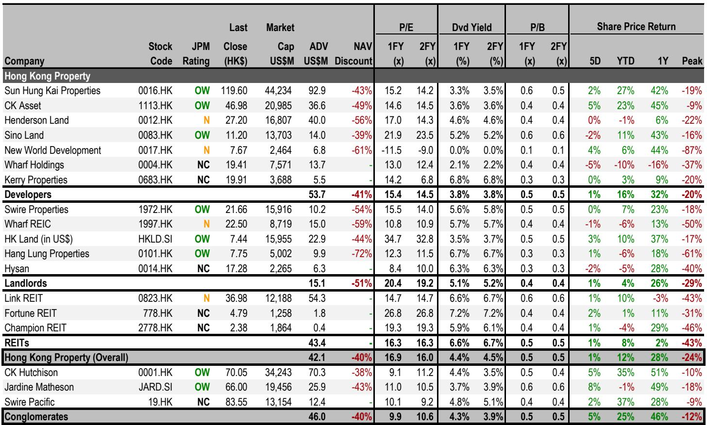
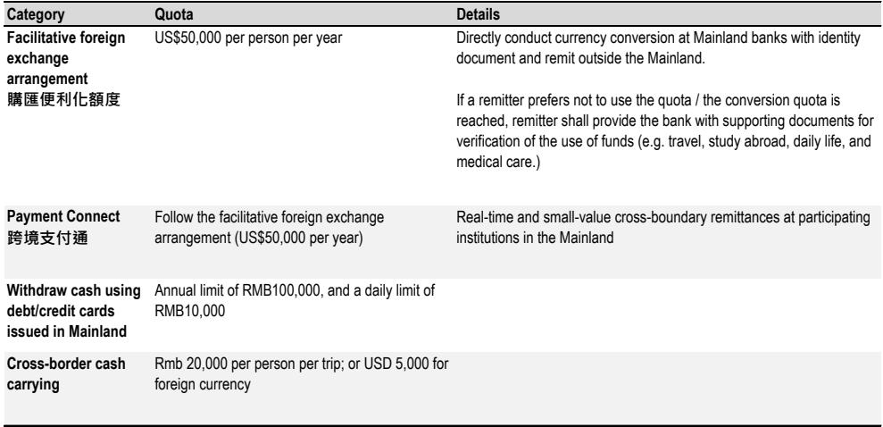
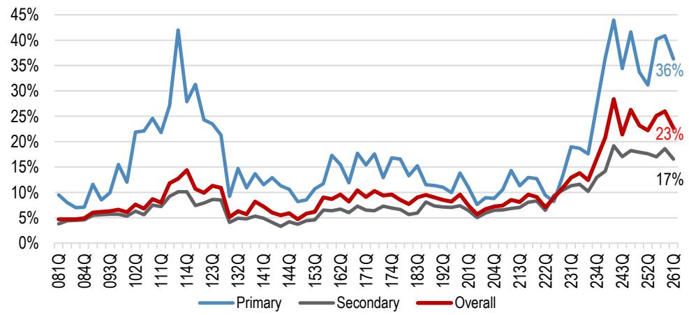

# JPM：市场对内地资金买港楼的恐慌，可能高估了政策冲击

一份来自JPM的专家电话会纪要，正在香港地产投资圈内流传。触发点是中国国务院发布的《境外直接投资条例》（即“837号文”）。这份文件让不少投资者担忧：内地居民购买香港物业的通道是否会被彻底堵死？香港楼市刚刚开始的复苏周期，是否会被政策“截胡”？

JPM在6月16日发布的这份研报，核心判断出乎许多人的意料：**837号文并非针对内地居民购买香港物业，现行监管框架实质上没有发生根本性变化。** 但报告同时指出，真正值得关注的，不是政策本身，而是执行层面可能带来的“寒蝉效应”——尤其是对“内地税务居民”的全球收入征税风险，以及CRS信息交换对资产透明度的潜在影响。

这篇研报的价值，不在于它给出了一个简单的“利好”或“利空”结论，而在于它通过一场与北京律师的深度对话，拆解了一个高度模糊的监管灰色地带。本文尝试提炼这份报告中最具洞察力的六个层次，并留下一个关键问题供读者自行判断。

## 1. 837号文并非针对香港楼市，它的真正靶点是跨境科技并购与个人境外投资监管空白

许多市场参与者将837号文直接解读为“打压内地人买港楼”，这可能是误读。JPM邀请的北京律师明确指出，这份文件的出台背景，源于一个标志性跨境案例：一家美国公司拟收购某中国AI公司，交易暴露出两个监管漏洞——个人境外持股的合规性，以及核心技术未经审批的跨境转移。

837号文本质上是一次“顶层设计”的补丁。它首次在国家层面将个人境外投资纳入监管框架，并强化了技术出口管制。对于香港物业购买，该文件并未设置新的禁令。律师的观点很清晰：内地居民用境内资金购买境外房产，在现行外汇管制框架下“从未被允许过，未来也不太可能被允许”。837号文只是重申了现状，而非收紧。

这意味着，市场此前对“政策突变”的定价可能过度。但“未收紧”不等于“无风险”——接下来的问题在于，执行层面的穿透力度是否会加强。

## 2. “资金源头”是唯一的合规分水岭，但灰色地带的清理正在加速

JPM研报反复强调一个核心逻辑：监管关注的是“资金是否从境内流出”，而非“资产是否在香港”。只要购买香港物业的资金来源是合法的境外收入（如港股IPO收益、境外薪酬、股票期权行权所得），内地居民在香港购房并不受限制。反之，任何涉及人民币兑换后跨境转移用于购房的行为，均属资本项目下的违规操作。

实践中，大量内地买家通过“对敲”（境内人民币换境外港币）、分拆5万美元购汇额度、或通过关联公司服务贸易转移资金等方式完成交易。律师指出，这些方式大多处于灰色地带，合规风险正在上升。银行的跨境汇款合规审查已明显趋严，“对敲”等模式的集中资金流动更容易触发监管关注。

这里的关键洞察是：**监管的“靶心”不是资产本身，而是资金跨境流动的合规性。** 对于已经持有香港物业的内地买家，只要资金来源问题不涉及重大违规，被强制处置资产的可能性极低。罚款通常为违规汇出金额的5%-10%，且不要求资金回流。

## 3. “内地税务居民”身份才是最大的潜在风险变量，而非837号文本身

研报中最具前瞻性的洞察，可能不是对外汇管制的分析，而是对税收风险的提示。律师指出，一个持有香港物业的内地居民，如果被界定为“内地税务居民”，其全球收入（包括香港物业的租金收入和资本利得）理论上需按20%的税率在中国缴纳个人所得税。

问题在于，很多人并未意识到自己仍是“内地税务居民”。只要持有内地户口（户籍），即使长期在香港工作生活，税务居民身份通常不会自动改变。这意味着，未来如果内地税务机关加强对境外资产的税务稽查，持有香港物业的隐形成本可能显著上升——20%的税率足以大幅降低香港物业的净回报率。

这一风险目前尚未被市场充分定价。它与837号文无关，但可能成为比外汇管制更实质的“灰犀牛”。

## 4. CRS短期内不会直接穿透房地产，但间接监控手段已经存在

另一个让市场紧张的议题是：房地产是否会被纳入CRS（共同申报准则）？如果会，内地税务机关将能直接获取内地居民在港持有物业的信息。

律师的判断相对乐观：CRS设计初衷是金融账户信息交换，房地产不属于金融资产，将其纳入需要全球房产登记系统的协调，操作上极为复杂，短期内不现实。但间接监控手段已经存在：银行账户层面的资金流动数据可能暴露大额资金出境；香港土地注册处是公开数据库，税务机关可以进行交叉比对。

这意味着，**资产透明化的趋势不可逆，但过程是渐进的。** 真正需要担心的，不是某一天房地产突然被纳入CRS，而是税务机关通过资金流与公开信息的交叉验证，逐步构建起对个人境外资产的监控能力。

## 5. 对香港楼市的影响：短期扰动而非趋势逆转，但需警惕利率与股市的叠加效应

JPM估算，非香港本地的内地买家占香港住宅交易量的5%-10%（按金额计约10%-15%）。即使这部分需求因政策不确定性受到抑制，报告认为也不足以逆转香港楼市的复苏周期。真正需要关注的，是另外两个在研报中并列提及的逆风因素：利率上升预期的升温，以及恒生指数持续低迷对楼价的传导效应。

历史数据显示，香港房价与恒生指数高度相关。当前港股表现疲弱，叠加美联储降息预期推迟，这两个因素对楼市的压制可能远大于837号文本身。JPM预期，香港地产股短期将维持区间震荡，直到市场看到：一手房销售率、二手成交量与房价未受明显冲击；或者利率预期出现松动。

在选股层面，报告给出了相对清晰的排序：短期看好长实集团与会德丰，看淡恒基地产与新世界发展，逢低建议吸纳新鸿基地产。

## 6. 报告尚未完全回答的关键问题：实施细则是“靴子落地”还是“新一轮博弈”？

837号文是框架性文件，后续各部委（发改委、商务部、外管局）将出台配套细则。律师判断，细则不太可能实质性开放境外房地产投资，但有两种可能的措辞方向：要么不提房地产，维持“未开放”状态；要么明确重申不允许通过资金汇出方式进行境外房产投资。

真正的不确定性在于：**细则是否会首次明确对个人境外投资的操作路径？** 如果细则只堵不疏，灰色空间将被进一步压缩；如果细则在特定条件下（如限定城市、高净值人群、额度试点）打开一扇小窗，则可能重塑市场预期。目前没有任何迹象表明内地政府正在推动“购房通”等计划，但律师也承认，在特定条件下的有限试点并非完全不可能。

此外，报告没有深入展开的一个问题是：如果内地税务机关开始系统性地对“内地税务居民”的境外房产收益征税，香港物业的估值模型是否需要重置？20%的资本利得税，在房价涨幅有限的情况下，可能彻底改变投资逻辑。这个问题，需要每一位持有或计划持有香港物业的投资者自行判断。

---

**顺着这些未解问题继续讨论**

837号文的实施细则何时出台？内地税务居民身份如何认定与规避？CRS信息交换的实操边界在哪里？这些问题的答案，将直接决定香港楼市未来12-18个月的走向。我们已在星球微信群中整理了JPM这份专家电话会的完整Q&A原文（20个问答），以及香港地产股的估值对比表。欢迎来星球微信群里继续讨论，一起追踪政策细则的落地节奏。

Personal reading notes and learning share only. Not investment advice.

