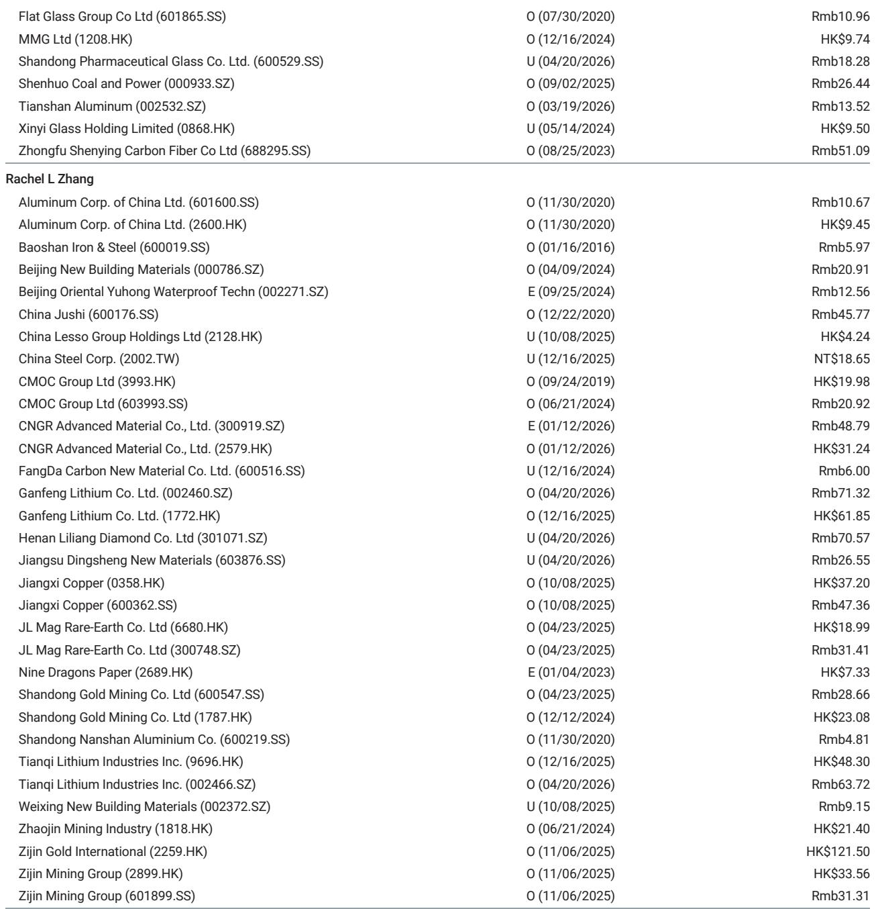
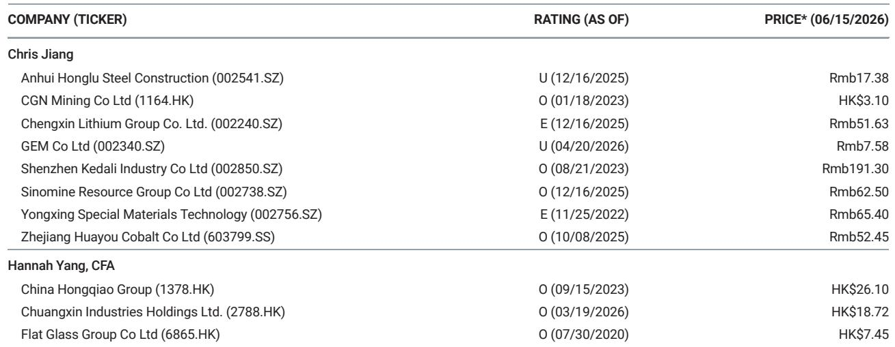
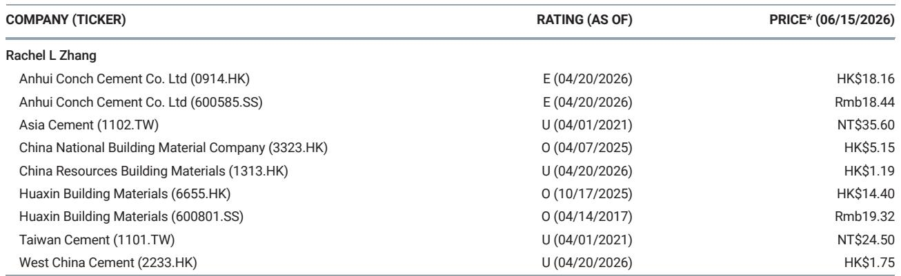

# China’s Materials Divergence Is the Real Story: Aluminum Rises While the Rest Contracts

The May 2026 industrial production data from China tells a story that is not about a uniform slowdown. It is about a strategic divergence within the country’s materials sector, and that divergence carries profound implications for investors and corporate strategists alike. While crude steel, cement, coal, and glass all posted year-on-year production declines, aluminum output continued its upward trajectory, rising 1.7% year-on-year and 0.5% month-on-month to 3.9 million metric tons. This is not a random fluctuation. It reflects a structural realignment in which one commodity benefits from capacity ceilings, solid profitability, and a demand profile that is increasingly decoupled from China’s beleaguered property sector.

The timing of this divergence matters. China’s property market, the traditional engine of materials demand, is showing renewed weakness. New housing starts fell 24.7% year-on-year in May, only marginally better than April’s 27.1% decline. Floor space sold dropped 14.1%, and property completions remained in negative territory. The report’s China property team expects a weaker third quarter, citing fragile resident sentiment, diminishing policy effects, and reduced new saleable resources. Secondary home sales in high-tier cities began weakening in mid-May and have decelerated even faster in recent weeks. For anyone tracking the materials complex, this is the critical context: the largest demand driver is not merely slowing; it is actively deteriorating.

Yet within this deteriorating demand environment, one commodity is thriving. Aluminum production is running at elevated levels, driven by capacity resumption in Liaoning and new capacity in Inner Mongolia. The report notes that operating capacity has reached its ceiling, and given solid industry profitability, overall aluminum production is expected to remain at an elevated level for the remainder of the year. This is not a cyclical bounce. It is a structural outcome of supply-side discipline combined with demand that is less exposed to property.

The implication for investors is clear: a blanket view of "China materials" is no longer sufficient. The sector is fracturing along lines that reflect different end-market exposures, different regulatory environments, and different profitability dynamics. Understanding which commodities are structurally supported and which are cyclically depressed is now the central analytical task.

## The Property-Driven Collapse in Steel, Cement, and Glass Masks a Deeper Structural Problem

The headline numbers for crude steel, cement, and glass are alarming, but the real insight lies in what they reveal about the nature of the downturn. Crude steel output fell 2.7% year-on-year in May, and the five-month cumulative figure is down 3.9%. Domestic steel apparent consumption is estimated to have plunged 8.5% year-on-year in May, a dramatic reversal from the 1.2% gain recorded in April. This collapse in apparent consumption is happening even as net exports slow by 2%, suggesting that the domestic demand weakness is not being offset by external markets.

Cement production fell 8.1% year-on-year in May, though this represents a narrowing from April’s 10.8% decline due to lower base numbers. Yet the narrowing should not be interpreted as a recovery. Cement prices in east China remained weak in early June, undermined by weak downstream demand, wet weather, and the disruption caused by college entrance examinations. The fact that a seasonal event like examinations can meaningfully affect pricing underscores how fragile demand truly is.

Glass production tells a similar story. Output fell 6.3% year-on-year in May, and while month-on-month production rose 3.6% due to volume contributions from resumed production lines, the fundamentals remain weak. Inventory remains high amid muted demand, and oversupply pressure continues to weigh on both prices and margins.

The common thread across steel, cement, and glass is their heavy exposure to property construction and infrastructure investment. Fixed asset investment fell 12.5% year-on-year in May, accelerating from April’s 9.4% decline. Highway FAI slipped 13.8%. The property sector is not just a contributor to demand; it is the dominant driver for these commodities. When property starts, sales, and completions are all declining by double digits, it is mathematically impossible for steel, cement, and glass to avoid contraction.

The deeper structural problem, however, is that this contraction may not be cyclical in the traditional sense. The report highlights diminishing policy effects and pent-up demand, suggesting that the stimulus measures implemented to date have not been sufficient to reverse the trend. If policy effectiveness is waning even as the base of comparison becomes easier, then the property sector may be experiencing a structural downshift rather than a temporary trough. For steel, cement, and glass, that would mean a prolonged period of demand weakness, not a sharp V-shaped recovery.

## Aluminum’s Resilience Is Not Just About Supply Constraints; It Reflects a Different Demand Profile

Aluminum’s production growth stands in stark contrast to the rest of the materials complex. Output rose 1.7% year-on-year in May, and the five-month cumulative figure is up 3.5% to 19.2 million metric tons. The drivers are well understood: capacity resumption in Liaoning and new capacity in Inner Mongolia. But the more important question is why aluminum demand is holding up when property-related demand is collapsing.

The answer lies in aluminum’s end-market diversification. Unlike steel and cement, which are heavily dependent on construction and infrastructure, aluminum has significant exposure to automotive manufacturing, renewable energy infrastructure, electrical transmission, and consumer durables. These sectors are not immune to China’s economic slowdown, but they are less directly tied to the property cycle. In particular, China’s continued investment in solar, wind, and electric vehicle production provides a structural demand floor for aluminum that steel and cement do not enjoy.

The report notes that operating capacity has reached its ceiling, which means that further production increases will require new capacity approvals. This supply constraint, combined with solid industry profitability, creates a favorable environment for aluminum producers. The key risk is that if property weakness deepens and begins to spill over into other industrial sectors, aluminum demand could eventually be affected. But for now, aluminum is benefiting from a combination of supply discipline and demand diversity that its peers lack.

This divergence has important implications for portfolio construction. Investors who treat all Chinese materials as a single asset class are missing a critical distinction. Aluminum is behaving more like a specialty material with structural support, while steel, cement, and glass are behaving like cyclical commodities facing a prolonged demand headwind. The appropriate investment response is not to avoid Chinese materials entirely, but to differentiate between those that are structurally supported and those that are cyclically challenged.

## Coal’s Contradiction: Production Constraints Meet Seasonal Demand, But the Energy Transition Looms

Coal production fell 1.7% year-on-year in May, though it rose 3% month-on-month to 397.2 million metric tons. The month-on-month recovery follows a seasonal pattern, as power plants restock in preparation for the summer peak consumption season. However, a mine accident in late May and tighter safety controls in June are expected to keep domestic coal production constrained in the near term.

The contradiction in coal is that short-term supply constraints are supporting prices, but the long-term demand outlook is deteriorating. Thermal power generation rose 2.1% year-on-year in May, but its share of total power generation fell to 60% from 62% in April. This decline in share, even as absolute generation rises, reflects the continued expansion of renewable energy capacity. Coal’s role in China’s energy mix is gradually being eroded, and this trend will accelerate as battery storage costs decline and grid integration improves.

For investors, coal presents a classic value trap. The near-term supply constraints and seasonal demand create the illusion of pricing power, but the structural trend is unmistakable. The report’s cautious industry view on China coal is consistent with this assessment. The key question that remains unanswered is how quickly the transition away from coal will accelerate. If renewable energy deployment continues at its current pace, coal demand could peak sooner than most market participants expect. But if grid constraints or policy shifts slow the transition, coal could retain its importance for longer.

The analytical challenge is that coal’s near-term dynamics are dominated by regulatory and safety factors, while its long-term trajectory is dominated by energy transition policy. These two time horizons produce conflicting signals, and investors need to decide which time horizon matters more for their investment thesis.

## What the Report Does Not Fully Answer: The Transmission Mechanism from Property to Broader Industrial Demand

The report provides granular data on production and demand across multiple commodities, but it leaves a critical question partially unanswered. How exactly does the property downturn transmit to broader industrial demand, and at what point does it begin to affect commodities like aluminum that are currently seen as insulated?

The property sector’s direct demand for materials is well understood. But property also drives demand indirectly through employment, household wealth, and local government finances. When property sales decline, local governments lose land sale revenue, which in turn reduces their capacity to invest in infrastructure. When property prices fall, household wealth declines, which reduces consumption of durables like automobiles and appliances. These second-order effects could eventually reach aluminum, even if the direct exposure is lower.

The report provides hints but not a complete picture. It notes that secondary home sales in high-tier cities have decelerated rapidly, and that the property team expects primary home sales to drop further in the third quarter despite a low base. But it does not quantify the potential spillover effects on industrial production. This is not a criticism of the report; it is a recognition that the transmission mechanism is complex and uncertain.

For investors, this uncertainty creates both risk and opportunity. The risk is that the property downturn proves deeper and more persistent than currently expected, eventually dragging down aluminum and other currently resilient commodities. The opportunity is that if the property sector stabilizes or recovers, the current divergence could widen, creating significant upside for commodities that are currently undervalued due to association with the broader materials complex.

The unanswered question is whether the property downturn is a cyclical correction within a stable long-term trend, or a structural shift that permanently reduces the size of China’s construction-driven materials demand. The answer to this question will determine whether the current divergence is a temporary anomaly or the beginning of a new equilibrium.

## A Decision Framework for Navigating China’s Fractured Materials Landscape

For investors and corporate strategists facing this complex landscape, a structured decision framework is essential. The first step is to classify each commodity along two dimensions: its exposure to property and infrastructure demand, and the degree of supply-side discipline in its industry.

Commodities with high property exposure and low supply discipline, such as cement and glass, are likely to face prolonged pressure. The low barriers to entry and fragmented industry structure in these sectors mean that excess capacity is slow to exit, prolonging the downturn. For these commodities, the appropriate strategy is to wait for clear signs of capacity rationalization before committing capital.

Commodities with high property exposure but improving supply discipline, such as steel, offer a more nuanced opportunity. China’s steel industry has made progress in consolidating capacity and enforcing production curbs, but the demand headwind remains powerful. The key signal to watch is whether production cuts accelerate in response to falling demand, which would support margins even as volumes decline.

Commodities with low property exposure and strong supply discipline, such as aluminum, are the most attractive in the current environment. The capacity ceiling, solid profitability, and diversified demand base create a favorable risk-reward profile. The main risk is that property weakness eventually spills over into other industrial sectors, but this risk is manageable if monitored carefully.

Commodities with low property exposure but weak supply discipline, such as coal, require careful timing. The near-term supply constraints are supportive, but the long-term demand erosion from the energy transition creates a structural headwind. For these commodities, the appropriate strategy is to trade the cycle rather than invest for the long term.

The second dimension of the framework is time horizon. Short-term investors should focus on supply-side dynamics and seasonal demand patterns. Medium-term investors should focus on the trajectory of property demand and infrastructure spending. Long-term investors should focus on structural shifts in end-market demand, particularly the energy transition and industrial upgrading.

This framework is not a substitute for detailed fundamental analysis, but it provides a systematic way to evaluate opportunities across China’s fragmented materials landscape. The key insight is that the sector is no longer a single asset class. It is a collection of sub-sectors with fundamentally different drivers, and the investment approach must reflect that reality.

## The Analytical Frontier: Why This Divergence Demands a Deeper Look

The May 2026 industrial production data reveals a China materials sector that is more complex and more interesting than the headline numbers suggest. The divergence between aluminum and the rest of the complex is not a statistical anomaly; it is a signal of structural change. Understanding this signal requires moving beyond aggregate data and into the specific dynamics of each sub-sector.

The report provides an excellent starting point, but it also raises questions that deserve deeper exploration. How sustainable is aluminum’s profitability if property weakness persists? Will steel capacity cuts accelerate enough to offset demand declines? Can cement prices recover without a meaningful improvement in construction activity? How quickly will the energy transition erode coal demand?

These are not questions that can be answered with a single data release. They require ongoing analysis, cross-referencing of multiple data sources, and a willingness to challenge conventional wisdom. The investors and strategists who develop a nuanced understanding of these dynamics will be better positioned to navigate the risks and capture the opportunities in China’s evolving materials sector.

Join the community to read the full report and review the original charts.

*This article is for learning and discussion only and does not constitute investment advice.*

Personal reading notes and learning share only. Not investment advice.

