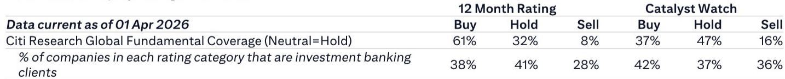

# Citi：市场低估的不是需求疲软，而是供给端正在发生的结构性出清

5月中国乘用车市场销量不及预期，燃油车大幅下滑，新能源车环比持平。如果只看这个表面数据，很容易得出“需求不行”的结论。但Citi在6月16日组织的一场产业专家电话会中，提供了一个更具穿透力的观察框架：真正值得关注的不是短期订单波动，而是供给端正在发生的几重结构性变化——合资品牌面临生存抉择、增程式电动车的技术天花板开始显现、以及头部企业正在通过海外渠道和成本优势重构竞争边界。

这份研报的核心价值不在于给出了多少家车企的周度订单数据，而在于它揭示了这些数据背后的一个关键判断：中国汽车市场的竞争逻辑，正在从“谁能造出更好的车”转向“谁能把规模优势和成本优势转化为定价权和出清能力”。

## 1. 豪华车市场正在经历的不是周期波动，而是份额的永久性转移

Citi专家电话会披露的一组数据值得反复推敲：BBA（奔驰、宝马、奥迪）上周在华订单已降至不到7000台，而去年同期为11000-12000台。这意味着德系豪华品牌在一年内失去了超过三分之一的订单量。同期，蔚来ES9稳态周订单维持在2000台左右，问界系列周订单约7500台，理想L系列约2000台。

这不是简单的“消费降级”或“观望情绪”。这是豪华车市场正在发生的一次结构性权力交接。BBA的订单下滑与国内高端新能源品牌订单的韧性同时发生，说明高端消费需求并未消失，只是转移了去向。过去支撑BBA溢价的品牌认知、经销商网络和服务体系，在电动化与智能化的双重冲击下，正在失去对消费者的说服力。

Citi专家更指出，BBA的周订单已降至“低于7000台”的水平，且没有看到任何企稳迹象。这意味着德系三强在中国市场可能已经越过了某个临界点——当订单量持续低于某个阈值，经销商的现金流、库存周转和定价体系都会进入负向循环。这为后续的合资品牌战略抉择埋下了伏笔。

## 2. 增程式电动车的增长故事正在触及天花板，这不是一个假设，而是正在发生的事实

Citi专家在问答环节提出了一个容易被忽视却极具冲击力的判断：增程式电动车（EREV）的渗透率下降趋势将持续，因为其电池容量已经触及技术天花板——纯电续航约400公里。而入门级纯电动车（约10万元人民币）已经可以实现600-700公里的续航里程。

这个判断的逻辑链条非常清晰：增程式电动车本质上是一种“过渡方案”，其存在的前提是纯电续航不足以覆盖大部分日常场景。当10万元级别的纯电动车都能做到600公里以上续航时，增程式的“里程焦虑解决方案”价值就被大幅削弱了。更关键的是，增程式同时背负着内燃机和电池两套系统的成本与重量，在纯电续航优势不再明显的情况下，其性价比优势正在被侵蚀。

这一趋势对理想汽车、问界等依赖增程技术路线的品牌影响深远。Citi专家电话会中提及理想L系列周订单约2000台，其中L9不到1000台，并明确表示问界M9和蔚来ES9对L9的销售形成了压制。这并非孤立的竞争事件，而是技术路线演进带来的系统性压力。

## 3. 比亚迪正在通过海外市场建立第二增长曲线，这是竞争格局中尚未被充分定价的因素

Citi专家电话会揭示了一个有趣的细节：比亚迪上周5万台的订单中，包含了“BYD从经销商回购用于海外销售的小电池插电混动车型”，数量不到5000台。这意味着比亚迪的海外需求不仅真实存在，而且已经强到需要从国内经销渠道“回购”车辆来满足海外订单。

这个操作看似是临时性的库存调配，但背后透露的信号远比数据本身重要。当一家车企的海外需求强到需要“回购”国内经销商库存时，说明其海外渠道的销售速度已经超过了产能的全球调配节奏。更重要的是，这种回购行为实际上为国内经销商提供了一个“价格托底”——如果国内市场需求波动，海外渠道可以成为有效的缓冲池。

Citi专家还提到，比亚迪第二代刀片电池的月产能正在以每月2-3万台的速度爬坡，且已经获得了不错的客户反馈。这暗示比亚迪不仅在规模上领先，在核心电池技术上也保持着迭代节奏。当一家企业同时拥有成本优势、技术迭代能力和海外需求缓冲时，它在国内市场的定价策略就拥有了更大的灵活性——这恰恰是竞争对手最难以复制的结构性优势。

## 4. 合资品牌正站在“要么全面本地化，要么退出中国”的十字路口

Citi专家在问答环节中给出了一个非常直接的判断：今年一些合资车企可能面临停产，它们需要在“完全本地化以适应中国市场”和“彻底退出中国市场”之间做出选择。

这个判断的背景是5月燃油车销量的“崩盘式”下滑——Citi专家用“collapsed”来形容燃油车销量，而新能源车仅环比持平，说明燃油车下滑的份额并没有被新能源车完全承接，而是直接消失了。这背后的含义是：燃油车市场的需求萎缩并非简单的“消费者转向新能源”，而是整体购车意愿下降与燃油车竞争力丧失的叠加效应。

对于合资品牌而言，传统的“拿来主义”模式——将海外车型引入中国、进行小幅本地化调整——已经彻底失效。中国市场的电动化、智能化节奏远超全球其他市场，合资品牌母公司的产品规划周期（通常3-5年）与中国市场的迭代速度（通常12-18个月）之间存在巨大的时间错配。如果不能在中国建立独立的研发体系和供应链能力，合资品牌将无法跟上竞争节奏。

Citi专家的“二选一”判断虽然直接，但逻辑上成立。值得注意的是，报告本身并未给出具体的退出时间表或名单，这恰恰是需要投资者自行判断的关键变量。

## 5. 原材料成本上涨正在改变定价逻辑，下半年的价格战可能以“明降暗升”的方式出现

Citi专家在电话会中提到，部分车型可能在2026年下半年提价，一些车型实际上已经提价。零跑A10和比亚迪新车型的上市价格都高于预期，原因是原材料成本上涨已经被计入定价。

这是一个容易被忽略的反直觉信号。2024年以来，市场一直沉浸在“价格战不断升级”的叙事中。但Citi专家提示，原材料成本上涨正在从供给侧改变定价逻辑。如果成本压力持续，下半年可能出现“明降暗升”的局面——终端促销力度可能维持甚至加大，但新车上市定价会系统性上调，通过配置调整、版本精简等方式实现实际成交价的温和抬升。

这对投资者的含义是：不能简单用“价格战是否结束”来判断行业盈利拐点。真正需要关注的是，哪些企业能够通过规模效应和供应链管理消化成本压力，哪些企业会在成本上涨和价格竞争的双重挤压下出现盈利恶化。

---

Citi这份专家电话会纪要提供了大量周度订单数据，但对于这些数据背后的二阶效应——比如订单转化率从60-70%降至35-40%意味着什么、经销商的库存压力如何传导至车企的定价策略、第二代刀片电池产能爬坡对成本曲线的影响——报告并未完全展开。这些恰恰是判断行业拐点的关键变量。

欢迎来星球微信群里继续讨论：这些未解问题中，哪些最可能成为下半年市场的超预期变量？合资品牌的退出路径会对供应链和渠道格局产生什么连锁反应？增程式技术路线的天花板何时会真正反映到相关公司的估值中？

Personal reading notes and learning share only. Not investment advice.

