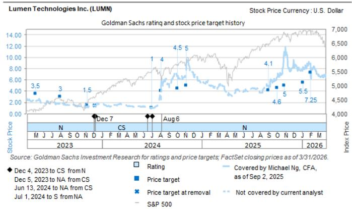
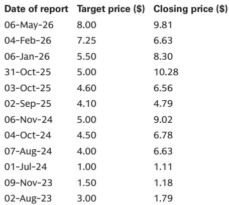

# GS：AI基础设施定价权正在经历结构性重估，但企业级需求仍处于“等待爆发”的临界点

市场对AI基础设施的讨论，大多聚焦于GPU算力是否过剩、资本开支何时见顶。但一份来自GS的最新实地调研报告，给出了一个更具穿透力的判断：当前真正被低估的，不是需求总量，而是供给侧约束正在重塑的定价结构。

这份报告基于GS在丹佛举办的第二届年度AI基础设施投资者之旅，核心内容包括对私有数据中心运营商Flexential的实地考察，以及对光纤网络运营商Lumen Technologies管理层的深度访谈。报告揭示了一个清晰但尚未被市场充分定价的信号：供给侧的物理瓶颈——从电力到设备到选址——正在将数据中心的定价权推向一个前所未有的水平，而这一趋势的持续性，可能远超市场预期。

与此同时，企业级AI基础设施的规模化采用，仍然处于“早期乐观但尚未落地”的阶段。这构成了当前AI基础设施投资的核心张力：一边是供给侧驱动的定价重估，一边是需求侧的结构性等待。理解这两者之间的错位，才是理解未来12-18个月相关资产表现的关键。

## 1. 供给约束已从短期扰动演变为结构性壁垒，数据中心定价权进入加速上行通道

GS调研中来自Flexential的信息，可能是这份报告最值得关注的信号。Flexential是一家专注于多租户和批发业务的数据中心运营商，其管理层的表述直接且具体：当前每千瓦的租赁价格已接近200美元，预计到今年晚些时候将向250美元迈进。作为对比，2021年这一价格仅为70美元左右。

这意味着，在过去四年中，数据中心单位容量的租赁价格已经上涨了近两倍，且涨价仍在加速。这不是一个周期性的波动，而是一个由供给侧结构性变化驱动的趋势。

核心的供给约束来自三个层面，且每一个都在恶化而非缓解：

第一，电力基础设施的交付周期已拉长至不可忽视的程度。Flexential指出，变电站的建设周期已达四年，发电机组的交付周期为两年。这意味着，即便今天做出投资决策，新增电力容量也需要数年才能就位。第二，数据中心设备本身的供应链瓶颈仍然存在，导致新建项目从启动到交付的时间已从2021年的约18个月延长至约三年。第三，选址难度在增加——社区反对、环保审批、土地竞争等因素都在收窄可开发空间。

这些约束叠加在一起，产生了一个关键的商业后果：数据中心运营商正在系统性地改变其销售策略。Flexential明确表示，为了避免在价格快速上升的环境中“贱卖”产能，其新产能的预销售窗口被限制在9个月以内。换句话说，他们宁可承担暂时的空置风险，也不愿锁定在未来的更高价格之下。

这一策略转变的行业含义是深远的。它意味着，数据中心的定价将从“成本加成”模式，逐步转向“稀缺定价”模式。对于拥有现成产能或快速交付能力的运营商而言，这直接转化为利润率的结构性提升。

## 2. 租赁续约中的价格爬升机制，正在成为数据中心运营商最稳定的利润引擎

如果说新产能定价体现的是市场对未来的预期，那么存量产能的续约定价，则直接反映了当前供需关系的紧张程度。Flexential的数据提供了一个清晰的量化基准：批发业务的年度续约价格爬升为3-4%，多租户业务则达到5-6%。

这些数字在传统商业地产租赁中并不常见。通常，商业地产的年租金涨幅在1-2%之间，且往往受限于长期合约条款。数据中心之所以能够实现更高的续约涨幅，根本原因在于客户的粘性和转换成本。一旦企业的IT系统部署在一个数据中心内，物理迁移的成本和风险极高，这使得运营商在续约谈判中拥有显著的议价优势。

更重要的是，这一续约价格爬升机制具有自我强化的特征。随着新产能的定价不断走高，存量客户在续约时面对的“市场参考价”也在提升。Flexential管理层提到，续约谈判通常在租约到期前6-8个月启动，这意味着当前市场的高定价将很快传导到未来12-18个月的续约合同上。

对于投资者而言，这意味着数据中心的收入可见度和利润弹性可能被系统性低估。市场习惯于将数据中心视为类似REITs的稳定收益资产，但当前的环境正在赋予它更多“周期成长股”的特征——至少在供给约束解除之前。

## 3. Lumen的转型揭示了AI基础设施投资的另一条路径：光纤网络的价值重估

GS调研的另一家核心企业是Lumen Technologies。这家传统的电信运营商正在经历一场由AI驱动的业务转型。其核心逻辑在于：AI工作负载的爆发，不仅需要数据中心内部的算力，更需要数据中心之间、以及数据中心与云端之间的高速、低延迟连接。

Lumen管理层提出的一个关键数字是：东西向（East-West）连接市场的总可寻址市场规模为580亿美元，年复合增长率约为13%。所谓“东西向流量”，指的是数据中心之间的数据交换，而非传统的用户到数据中心的“南北向流量”。AI训练和推理任务，特别是大规模分布式训练，会产生大量的东西向流量，这正是Lumen光纤网络的核心价值所在。

Lumen的差异化优势在于其物理网络的不可复制性。管理层强调，其最近签署的PCF（Private Connectivity Fabric）协议，使其能够在超大规模客户几乎全额预付的情况下扩建物理网络，从而大幅降低了建设成本。同时，其光纤与超大规模数据中心的地理接近性，使其能够提供多云端直连服务，绕过传统的托管中心交叉连接费用，显著降低延迟并提升安全性。

Lumen的Networking-as-a-Service平台是这一转型的载体。数据显示，2026年第一季度，超过20%的NaaS净新增用户是新客户，超过60%的现有客户在扩展其使用规模。同时，NaaS客户的流失率明显低于传统业务。

然而，GS对Lumen的评级为中性，12个月目标价为8美元。这背后反映了市场对其转型节奏的审慎态度。企业级AI基础设施的采用仍处于早期阶段，Lumen的业务能否从“与超大规模客户合作建设”顺利过渡到“企业客户大规模采用”，仍需要时间验证。

## 4. 企业级AI基础设施的规模化采用，仍处于“乐观但未落地”的尴尬区间

这可能是这份报告中最容易被忽视，但也是最重要的判断。无论是Flexential还是Lumen，管理层都承认：企业级AI基础设施的大规模需求尚未真正到来。

Flexential观察到，其当前的客户流失主要来自小型企业，这些企业正在将工作负载迁移到公有云。而Lumen管理层则明确表示，企业级用户的使用仍处于“相对初期”的阶段。尽管他们对未来增长持乐观态度，但乐观不是订单。

这一观察与市场叙事形成了有趣的张力。一方面，超大规模云服务商的资本开支仍在快速增长，AI芯片的出货量屡创新高。但另一方面，这些投资主要集中在少数几个头部玩家手中，真正的企业级应用——即中小企业将AI嵌入核心业务流程——尚未形成对基础设施的持续、大规模需求。

这意味着，当前AI基础设施的投资热潮，本质上是由供给侧（超大规模云服务商）驱动的，而非由需求侧（企业用户）拉动的。这是一个重要的区别。供给驱动的投资具有集中、快速、易追踪的特点，但也更容易受到资本成本变化或技术路线调整的影响。而需求驱动的增长则更加分散、缓慢、但具有更强的持续性。

对于投资者而言，这意味着两件事：第一，短期内，数据中心和光纤网络等基础设施资产，其定价和利润率仍将受益于供给约束，这一逻辑在未来12-18个月仍然有效。第二，中期内，企业级需求的能否如期爆发，将是决定这些资产能否从“稀缺溢价”过渡到“规模溢价”的关键变量。这一过渡目前尚未被充分定价，但值得持续跟踪。

## 5. 报告尚未完全回答的关键问题：定价权能持续多久，以及谁将最终受益

GS的这份调研提供了丰富的实地信息，但也留下了几个悬而未决的问题。

第一个问题是：数据中心的定价权周期能持续多久？Flexential管理层指出，新建项目需要大约三年时间。这意味着，如果当前的高价格能够有效刺激供给，那么三年后市场可能面临供给拐点。但问题是，电力基础设施的建设周期更长（变电站四年），且选址难度在增加。供给能否真正跟上需求，存在显著的不确定性。

第二个问题是：定价权上升的收益，最终会流向谁？是数据中心运营商、光纤网络运营商，还是设备供应商？Flexential和Lumen的案例表明，不同环节的受益程度和可持续性可能差异很大。数据中心运营商受益于稀缺定价，但同时也面临建设成本的上升。光纤网络运营商受益于流量增长，但传统业务的拖累仍在。

第三个问题是：企业级AI需求何时从“乐观”变成“落地”？GS报告中提到的Lumen NaaS平台数据，虽然显示了增长势头，但绝对规模仍然有限。真正需要关注的信号，不是超大规模客户的资本开支计划，而是中小企业是否开始将AI基础设施支出纳入常态化IT预算。

这些问题恰恰是完整报告中最有价值的部分。GS的分析师在报告中提供了详细的财务模型、估值框架和风险分析，包括Lumen基于NTM+1年EBITDA的6倍估值，以及上行和下行风险的详细拆解。这些内容对于做出具体的投资决策至关重要，但受限于文章篇幅，无法在此一一展开。

---

以上讨论的定价权重估、续约价格爬升、企业级需求临界点，每一个判断背后都有更细致的财务数据和竞争格局分析作为支撑。例如，Flexential的客户结构变化如何影响其长期ROIC，Lumen的Alkira收购如何改变东西向连接市场的竞争态势，以及GS对这些公司给出的具体估值假设和风险清单。

这些细节，恰恰是做出独立判断最需要的信息。欢迎来星球微信群里继续讨论，我们将基于GS这份完整的调研报告，逐层拆解其定价模型、竞争分析和风险框架，帮助你在当前AI基础设施投资的复杂叙事中，建立自己的分析锚点。

Personal reading notes and learning share only. Not investment advice.

