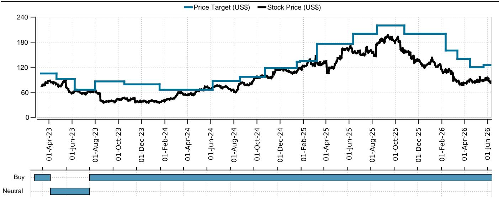
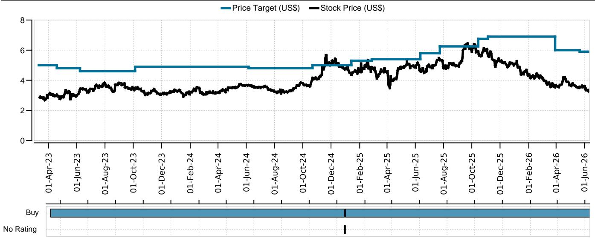

# UBS：东南亚外卖与电商的增长故事并未结束，但竞争正在重新定价龙头门槛

市场对东南亚互联网平台的担忧并非没有根据。宏观放缓、季节性退潮、以及折扣力度回升——这些信号叠加在一起，很容易让人产生“增长见顶”的直觉判断。但UBS最新发布的5月外卖与电商收据追踪数据，提供了一个截然不同的叙事框架：真正需要被关注的，不是增长是否在放缓，而是这种放缓的结构性含义——它正在检验哪些平台真正拥有定价权与用户粘性。

这份基于UBS Evidence Lab高频数据的报告，覆盖Grab与Shopee在东盟六国的核心运营指标。结论简洁但有力：两家公司均维持了20%以上的同比GMV/订单增速，但竞争烈度确实在环比回升。市场低估的不是它们能否继续增长，而是它们在增长放缓时，能否将规模优势转化为不可逆的竞争壁垒。

## 1. 5月数据揭示了一个关键拐点：增长节奏从“爆发”切换为“韧性测试”

5月历来是东南亚消费的季节性低点，叠加今年开斋节时间调整，同比基数效应更为复杂。但UBS数据表明，Grab的外卖订单量同比仍增长21%，虽然从3-4月的26%-28%有所回落。Shopee的GMV增速同样健康，同比+20.6%，较4月的33%和3月的23%有所放缓。

这里需要区分两个概念：减速与恶化。减速是节奏调整，是季节性、基数效应和宏观噪音共同作用的结果；恶化则是结构性的需求崩塌或竞争失衡。UBS的数据支持前者。Grab的日均订单量环比仍增长2.8%，Shopee日均订单环比增长6%，说明用户活跃度并未出现断崖式下降。

关键在于，这种韧性是否能持续。印尼市场是Grab唯一录得订单同比下滑（-2.6%）的地区，UBS将其归因于宏观疲软。如果印尼的疲软从个别市场扩散为东盟趋势，那么当前的韧性测试可能演变为真正的压力测试。这是报告没有完全展开，但值得密切跟踪的变量。

## 2. 折扣回升不是价格战重启，而是平台在主动调整用户结构

竞争烈度上升是5月数据中最容易引起误读的信号。Grab的折扣占AOV比例环比上升5-140个基点，Shopee的平台补贴同样环比走高。乍看之下，似乎回到了2021-2022年烧钱换增长的旧逻辑。

但UBS的解读提供了一个更精细的视角：Grab的AOV环比仅微降0.3%，同比降幅也仅为1.1%。这说明折扣的增加并没有导致客单价系统性下降。更可能的解释是，平台正在利用折扣工具调整用户结构——通过补贴吸引价格敏感型用户，扩大可触达市场总量（TAM），同时维持核心用户的客单价稳定。

Shopee的情况类似。其AOV同比下降5.6%，但订单量同比增长28%。量增价减，意味着平台在主动向低客单价、高频次的消费场景渗透。这种策略在电商领域并不新鲜，但关键在于执行效率：如果折扣能有效转化为复购率和用户生命周期价值，那么当前的补贴就是投资而非成本。

报告没有直接讨论的另一个问题是：折扣回升是否反映了来自TikTok Shop等新进入者的竞争压力？UBS的收据数据主要覆盖传统电商和外卖平台，对社交电商的渗透率变化缺乏直接观测。这可能是竞争格局中最大的盲区。

## 3. Grab正在证明：市场份额增长与盈利改善可以并行

UBS对Grab的评级为买入，目标价5.9美元。支撑这一判断的核心论据，并非简单的增长数字，而是Grab在关键市场的份额变化。

在菲律宾和马来西亚，Grab分别从foodpanda手中夺取了69和136个基点的市场份额。这并非偶然。Grab在菲律宾的折扣环比大幅下降390个基点，说明其增长并非依赖补贴，而是产品力或运营效率的提升。在印尼，虽然订单同比下滑，但Grab的折扣环比仅微增5个基点，显示出其在弱势市场并未盲目跟投补贴。

这组数据指向一个更重要的结论：Grab正在从“依赖补贴维持份额”的阶段，过渡到“通过运营效率自然获得份额”的阶段。如果这一趋势持续，那么Grab的利润率扩张将不再是线性改善，而是可能加速。

但这里仍有一个未解问题：Grab在新加坡丢失了17个基点的份额。新加坡是成熟市场，竞争格局更为固化。如果Grab在高端市场无法维持份额，是否意味着其增长动能更多来自渗透率较低的新兴市场？这种地域结构对整体盈利能力的含义，报告没有充分展开。

## 4. Shopee的护城河正在从规模转向生态锁定

Shopee的GMV增速虽然从4月高点回落，但21%的同比增速在电商行业仍属顶尖水平。更重要的是，UBS指出Shopee正在通过ShopeeVIP会员体系、物流网络和规模效应构建差异化壁垒。

数据层面，Shopee的平台补贴虽然在多数市场环比上升，但在印尼和菲律宾反而下降。这暗示Shopee在这两个核心市场的用户粘性已经足够强，不需要持续的补贴刺激。同时，卖家端补贴在所有东盟市场环比上升，说明Shopee正在从“补贴消费者”转向“赋能卖家”，这是一种更可持续的竞争策略。

报告没有深入讨论的是，Shopee的AOV持续下行（同比-5.6%）是否会对单位经济模型产生压力。如果订单增长完全依赖低客单价商品，那么即使GMV增速健康，单均履约成本和收入结构可能面临挑战。这是判断Shopee估值逻辑是否成立的核心变量。

## 5. 报告尚未回答的关键问题：宏观放缓是否会被竞争加剧放大

UBS在报告中多次提及“宏观疲软”和“需要密切关注”，但并未给出具体的压力测试场景。这是当前分析框架中最薄弱的环节。

具体而言，有三个问题值得进一步拆解：第一，印尼的订单下滑是周期性的还是结构性的？如果是结构性，Grab是否需要调整其资源分配策略？第二，如果东盟整体消费增速从当前水平进一步放缓，平台是否有能力在不牺牲市场份额的前提下削减补贴？第三，TikTok Shop等社交电商平台对传统电商的份额侵蚀，在收据数据中是否被低估了？

这些问题并非UBS的疏忽，而是高频数据本身的局限。收据数据能反映“发生了什么”，但无法直接回答“为什么发生”和“接下来会怎样”。这正是深度研究报告与数据追踪之间的互补关系——数据提供信号，分析提供框架。

## 6. 对决策者而言，当前需要关注的是“成本结构弹性”，而非“增长斜率”

对于持有或考虑配置东南亚互联网资产的投资者，UBS这份报告最重要的启示可能不是增长数字本身，而是竞争环境变化对成本结构的影响。

Grab和Sea（Shopee母公司）目前都处于从“追求规模”向“追求利润”转型的关键阶段。如果竞争烈度持续上升，两家公司可能需要重新调整补贴预算，这将对短期利润率造成压力。但如果它们能在不牺牲份额的前提下控制补贴增速，那么市场对盈利拐点的预期就需要上调。

换句话说，当前阶段最值得跟踪的指标，不是GMV增速，而是“每单位GMV的补贴成本”和“用户获取成本的变化趋势”。UBS的收据数据提供了部分信息，但要构建完整的成本结构模型，还需要更多维度的数据——包括履约成本、营销费用、以及用户留存率的变化。

这些变量的不确定性，正是我们选择在社群中持续追踪和讨论的原因。数据的价值不仅在于结论，更在于它打开的追问空间。

欢迎来星球微信群里继续讨论。我们会在社群中分享完整研报的PDF、原始数据表格，以及针对印尼市场、竞争动态和估值模型的进一步拆解。如果你对Grab的份额变化、Shopee的AOV下行风险，或是TikTok Shop对传统电商的真实冲击有更深入的兴趣，这些话题在社群中都有持续的讨论和更新。

Personal reading notes and learning share only. Not investment advice.

