## Asian Autos

# Chinese Autos: Another soft month – Domestic sales -20% YoY, EV penetration holds at 61%; XPEV and LI model updates

Eunice Lee, CFA

+852 2123 2606

eunice.lee@bernsteinsg.com

Ethan Xu

+852 2123 2634

ethan.xu@bernsteinsg.com

China auto wholesale -4.2% YoY in May, with domestic retail volume -20.0% and retail SAAR declined to 19.2mn units. We track mandatory first-time auto insurance volumes in China, which we believe gives the most accurate read on retail sell-through. May retail passenger vehicle sales totaled 1.51mn units, -20.0% yoy. The May retail SAAR of 19.2mn units is lower than 19.6 mn in April 2026 and our estimate of normalized annual demand of c.22mn units. May continued to reflect demand pulled forward by the 2024–2025 subsidy programs (which we estimate shifted over 5mn units), compounded by a high base. Absent policy support, domestic demand is likely to remain weak until at least November-December, when the base effect begins to normalize. (Links to monthly sales volume trackers: PV Wholesale, and PV Retail.)

May EV penetration edged higher to 61.0%, with BEVs accounting for 41.9% and PHEVs 19.1%. EV sales declined -5.1% YoY, with BEVs up +8.3% and PHEVs down -25.4%. The continuous strength in EV momentum suggests consumers are gradually adjusting to the higher purchase tax (raised to 5% from January 1, 2026, vs. nil. previously), alongside the impact of newly launched EV models that offer stronger pricing and product competitiveness. Rising gasoline prices also boost the operating economics of EVs. BYD Group reach 198k units with market share at 21.4%. Geely Group ranked second with 111k units and 12.0% share, followed by Leapmotor at 63k units (6.8%). Meanwhile, ICE demand slumped -35.8% YoY. Premium brand sales saw a -13.5% yoy decline in May and mass market brand cars plunged -21.1% yoy, reflecting ongoing weakness driven by a high comparison base and demand pulled forward by last year's subsidies.

Exports grew +73% yoy in May, with ICE +38% and EV +119%. Exports made up 35.9% of total PV wholesale, partially offsetting the weak domestic demand. BEV & PHEV exports contributed c.55% of total export volume. Chery continued to lead with 179k units (+79% yoy), followed by BYD with 156k (+85%) and Geely with 84k units (+180%).

Following a review of recent performance, we lowered our price targets for both XPeng and Li Auto while maintaining Market-Perform ratings. For XPeng, we lowered price targets to US\$20.00 for XPEV.US (Old: US\$22.00) and HK\$78.00 for 9868.HK (Old: HK\$86.00), based on a 1-year forward EV/sales multiple of 0.8x (previously 1.0x), reflecting weaker earnings visibility amid elevated AI investments. While we acknowledge XPeng's strong autonomous driving capabilities, and meaningful progress in robotaxi and humanoids, near-term monetization remains limited. That said, we turn tactically positive on upcoming MONA launches. The MONA brand is well positioned in the mass market with strong tech at accessible prices: the M03 sedan has shown resilient volumes, the L03 compact SUV (launching in July) marks its SUV entry, and the planned L05 mid-large SUV should further refresh the lineup, support traffic, and drive interest. For Li Auto, we lowered our targets to US\$15.50 for LI.US (from US\$19.00) and HK\$61.00 for 2015.HK (from HK\$74.00), based on lower earnings forecast and an unchanged blended valuation of 0.5x 1-year forward EV/sales and 15x P/E. Despite new-generation L-series EREVs and global expansion, we see limited upside due to intensifying competition, margin pressure, and rising investment, and expect the company to post a net loss this year.

BERNSTEIN TICKER TABLE

<table><tr><td rowspan="2">Ticker</td><td rowspan="2">Rating</td><td colspan="3">16 Jun 2026</td><td colspan="2">TTM</td><td colspan="4">Reported EPS</td><td colspan="3">Reported P/E (x)</td></tr><tr><td></td><td>Closing Price</td><td>Price Target</td><td>Rel. Perf.</td><td>Cur</td><td>2025A</td><td>2026E</td><td>2027E</td><td>2025A</td><td>2026E</td><td>2027E</td><td></td></tr><tr><td>1211.HK (BYD)</td><td>O</td><td>HKD</td><td>84.05</td><td>136.00</td><td>(79.0)%</td><td>CNY</td><td>3.58</td><td>4.90</td><td>6.90</td><td>20.2</td><td>14.8</td><td>10.5</td><td></td></tr><tr><td>002594.CH (BYD)</td><td>O</td><td>CNY</td><td>89.64</td><td>124.00</td><td>(65.7)%</td><td>CNY</td><td>3.58</td><td>4.90</td><td>6.90</td><td>25.0</td><td>18.3</td><td>13.0</td><td></td></tr><tr><td>1810.HK (Xiaomi)</td><td>O</td><td>HKD</td><td>25.62</td><td>43.00</td><td>(79.1)%</td><td>CNY</td><td>1.62</td><td>1.02</td><td>1.77</td><td>13.6</td><td>21.6</td><td>12.5</td><td></td></tr><tr><td>175.HK (Geely)</td><td>O</td><td>HKD</td><td>19.52</td><td>25.00</td><td>(24.9)%</td><td>CNY</td><td>1.67</td><td>1.82</td><td>2.26</td><td>10.1</td><td>9.3</td><td>7.4</td><td></td></tr><tr><td>LI (Li Auto)</td><td>M</td><td>USD</td><td>14.38</td><td>15.50</td><td>(75.4)%</td><td>CNY</td><td>1.13</td><td>(4.88)</td><td>2.27</td><td>85.9</td><td>(19.9)</td><td>42.8</td><td></td></tr><tr><td>OLD</td><td></td><td></td><td></td><td>19.00</td><td></td><td></td><td></td><td>(2.33)</td><td>6.40</td><td></td><td></td><td></td><td></td></tr><tr><td>2015.HK (Li Auto)</td><td>M</td><td>HKD</td><td>55.95</td><td>61.00</td><td>(93.4)%</td><td>CNY</td><td>0.57</td><td>(2.44)</td><td>1.13</td><td>85.3</td><td>(19.8)</td><td>42.5</td><td></td></tr><tr><td>OLD</td><td></td><td></td><td></td><td>74.00</td><td></td><td></td><td></td><td>(1.17)</td><td>3.20</td><td></td><td></td><td></td><td></td></tr><tr><td>XPEV (XPeng)</td><td>M</td><td>USD</td><td>14.49</td><td>20.00</td><td>(48.7)%</td><td>CNY</td><td>(1.20)</td><td>(2.03)</td><td>0.45</td><td>(81.8)</td><td>(48.2)</td><td>216.8</td><td></td></tr><tr><td>OLD</td><td></td><td></td><td></td><td>22.00</td><td></td><td></td><td></td><td>(2.99)</td><td>0.60</td><td></td><td></td><td></td><td></td></tr><tr><td>9868.HK (XPeng)</td><td>M</td><td>HKD</td><td>55.20</td><td>78.00</td><td>(69.0)%</td><td>CNY</td><td>(0.60)</td><td>(1.02)</td><td>0.23</td><td>(79.6)</td><td>(46.8)</td><td>210.8</td><td></td></tr><tr><td>OLD</td><td></td><td></td><td></td><td>86.00</td><td></td><td></td><td></td><td>(1.50)</td><td>0.30</td><td></td><td></td><td></td><td></td></tr><tr><td>NIO (NIO)</td><td>M</td><td>USD</td><td>5.20</td><td>6.00</td><td>21.3%</td><td>CNY</td><td>(6.85)</td><td>(1.62)</td><td>(0.49)</td><td>(5.1)</td><td>(21.7)</td><td>(71.4)</td><td></td></tr><tr><td>9866.HK (NIO)</td><td>M</td><td>HKD</td><td>40.68</td><td>47.00</td><td>4.4%</td><td>CNY</td><td>(6.85)</td><td>(1.62)</td><td>(0.49)</td><td>(5.1)</td><td>(21.7)</td><td>(71.3)</td><td></td></tr><tr><td>2333.HK (Great Wall-H)</td><td>M</td><td>HKD</td><td>10.37</td><td>13.00</td><td>(58.5)%</td><td>CNY</td><td>1.16</td><td>1.21</td><td>1.40</td><td>7.7</td><td>7.4</td><td>6.4</td><td></td></tr><tr><td>2238.HK (GAC)</td><td>M</td><td>HKD</td><td>2.39</td><td>3.00</td><td>(59.6)%</td><td>CNY</td><td>(0.85)</td><td>(0.13)</td><td>(0.01)</td><td>(2.4)</td><td>(15.9)</td><td>(323.9)</td><td></td></tr><tr><td>600104.CH (SAIC)</td><td>M</td><td>CNY</td><td>10.65</td><td>15.00</td><td>(77.1)%</td><td>CNY</td><td>0.89</td><td>0.97</td><td>1.05</td><td>12.0</td><td>10.9</td><td>10.1</td><td></td></tr><tr><td>ASIAX</td><td></td><td></td><td>2,021.18</td><td></td><td></td><td></td><td></td><td></td><td></td><td></td><td></td><td></td><td></td></tr><tr><td>SPX</td><td></td><td></td><td>7,554.29</td><td></td><td></td><td></td><td></td><td></td><td></td><td></td><td></td><td></td><td></td></tr></table>

PRICE TARGET CHANGE / ESTIMATE CHANGE IN BOLD  
O - Outperform, M - Market-Perform, U - Underperform, NR - Not Rated, CS - Coverage Suspended  
Source: Bloomberg, Bernstein estimates and analysis.

## INVESTMENT IMPLICATIONS

We maintain a cautious outlook for the sector. The reduction in subsidies and a 5% purchase tax hike on EVs are expected to slow market momentum. This follows strong demand pulled forward into 2024-2025 and a high comparison base, while macro headwinds and weak consumer sentiment persist. The industry will also face pressure from material cost inflation headwinds. We expect industry wholesale volumes to reach 28-29 mn units, falling 4-8% yoy. We forecast domestic retail demand of 21-22mn units, declining 5-9% yoy. Exports should remain a growth driver, arriving at 6.5-7mn units, growing 10-20% yoy.

The long term secular growth outlook for EVs remains intact and even though EV transition has come to the mass adoption phase in China, we forecast domestic EV sales growth will be c.5-10% for 2026 and drive EV penetration to 61%. We believe competition within the domestic market will remain intense and overseas markets are increasingly important as a strategic growth opportunity. For our EV names, we rate BYD and Xiaomi Outperform, and XPeng, Li Auto, and NIO Market-Perform. Within our traditional Chinese OEMs coverage, we rate Geely Outperform and Great Wall, GAC, and SAIC Market-Perform.

## Recent research highlights:

4 Jun 2026 - China Smartphone Tracker (April): Pressure spreading to mid-end & price hikes facing resistance

3 Jun 2026 - EV TRACKER - April 2026: New markets lead recovery in global EV sales

29 May 2026 - Li Auto: Q1 margin slump on i6, widened losses; International expansion accelerates but turnaround unclear

29 May 2026 - XPeng: Q1 Resilient gross margin; Bullish tone on GX

27 May 2026 - Xiaomi Q1: Resilience on display amid memory cycle; fundamentals reinforced — reiterate Outperform

22 May 2026 - NIO: Q1 clean beat, Q2 strong guide — mix wins, R&D risks

21 May 2026 - Artificial Intelligence: Sooner or Later

19 May 2026 - Chinese Autos: April SAAR 19.6mn units; Volumes -20% yoy, ICE slumps (-34%), while EV surges (60% penetration) and export robust (+85%)  
18 May 2026 - China Autos Export Tracker: Q1 2026 exports +63% yoy, EV surges with BEV +113% and PHEV +146%; Chinese brands extend global footprint  
11 May 2026 - China Smart Driving Chips Tracker (1Q26): NOA penetration temporarily dropped to 32% with weaker EV sales

EXHIBIT 1: Global autos comps sheet

<table><tr><td rowspan="2"></td><td rowspan="2">Market cap$m</td><td rowspan="2">EV$m</td><td rowspan="2">Cars Soldm</td><td colspan="3">P/E</td><td colspan="3">EV/EBITDA</td><td colspan="3">EV/SALES</td><td colspan="3">Dividend yield</td><td rowspan="2">FCF YieldFY+2</td><td rowspan="2">EBIT%FY+1</td><td rowspan="2">ROCEFY+1</td><td rowspan="2">Net debt / EBITDACY</td><td rowspan="2">FY+1</td><td rowspan="2">FY+2</td></tr><tr><td>CY</td><td>NTM+1</td><td>NTM+2</td><td>CY</td><td>NTM+1</td><td>NTM+2</td><td>CY</td><td>NTM+1</td><td>NTM+2</td><td>CY</td><td>FY+1</td><td>FY+2</td></tr><tr><td>BYD</td><td>113,271</td><td>126,845</td><td>4.6</td><td>19.0x</td><td>14.8x</td><td>12.5x</td><td>6.8x</td><td>5.8x</td><td>5.0x</td><td>0.9x</td><td>0.8x</td><td>0.8x</td><td>1.3%</td><td>1.3%</td><td>1.3%</td><td>6.5%</td><td>5.9%</td><td>15.1%</td><td>-0.1x</td><td>-0.4x</td><td>-0.9x</td></tr><tr><td>Xiaomi</td><td>86,616</td><td>77,519</td><td>0.4</td><td>19.0x</td><td>14.3x</td><td>11.5x</td><td>13.7x</td><td>10.3x</td><td>8.1x</td><td>1.1x</td><td>0.9x</td><td>0.8x</td><td>0.0%</td><td>0.0%</td><td>0.0%</td><td>7.4%</td><td>7.6%</td><td>13.9%</td><td>-0.2x</td><td>-0.8x</td><td>-0.8x</td></tr><tr><td>Li</td><td>15,212</td><td>6,798</td><td>0.4</td><td>n.a.</td><td>19.8x</td><td>12.6x</td><td>21.6x</td><td>5.6x</td><td>4.0x</td><td>0.4x</td><td>0.3x</td><td>0.3x</td><td>0.0%</td><td>0.0%</td><td>0.0%</td><td>8.4%</td><td>2.2%</td><td>4.0%</td><td>-32.0x</td><td>-9.0x</td><td>-7.3x</td></tr><tr><td>XPeng</td><td>13,870</td><td>13,369</td><td>0.4</td><td>n.a.</td><td>61.2x</td><td>23.4x</td><td>n.a.</td><td>28.3x</td><td>14.9x</td><td>1.0x</td><td>0.8x</td><td>0.7x</td><td>0.0%</td><td>0.0%</td><td>0.0%</td><td>7.2%</td><td>0.3%</td><td>0.7%</td><td>62.7x</td><td>-7.3x</td><td>-5.0x</td></tr><tr><td>NIO</td><td>13,055</td><td>13,773</td><td>0.3</td><td>n.a.</td><td>32.7x</td><td>17.3x</td><td>14.0x</td><td>9.1x</td><td>7.2x</td><td>0.7x</td><td>0.6x</td><td>0.5x</td><td>0.0%</td><td>0.0%</td><td>0.0%</td><td>8.2%</td><td>1.2%</td><td>5.1%</td><td>-2.1x</td><td>-2.0x</td><td>-2.0x</td></tr><tr><td>China EVs</td><td>242,024</td><td>238,305</td><td>6.2</td><td>23.6x</td><td>16.0x</td><td>12.6x</td><td>9.3x</td><td>7.3x</td><td>6.1x</td><td>0.9x</td><td>0.8x</td><td>0.7x</td><td>0.6%</td><td>0.6%</td><td>0.6%</td><td>7.0%</td><td>5.4%</td><td>12.4%</td><td>-0.7x</td><td>-1.0x</td><td>-1.3x</td></tr><tr><td>Geely</td><td>27,587</td><td>26,256</td><td>3.0</td><td>8.8x</td><td>7.3x</td><td>6.2x</td><td>5.1x</td><td>4.4x</td><td>3.8x</td><td>0.4x</td><td>0.4x</td><td>0.3x</td><td>3.3%</td><td>3.3%</td><td>3.3%</td><td>14.7%</td><td>5.5%</td><td>21.2%</td><td>-1.5x</td><td>-1.7x</td><td>-1.9x</td></tr><tr><td>Great Wall</td><td>19,489</td><td>18,881</td><td>1.3</td><td>12.0x</td><td>10.0x</td><td>9.0x</td><td>6.2x</td><td>5.6x</td><td>5.1x</td><td>0.5x</td><td>0.4x</td><td>0.4x</td><td>4.2%</td><td>4.2%</td><td>4.2%</td><td>4.8%</td><td>5.3%</td><td>11.3%</td><td>-1.0x</td><td>-0.5x</td><td>-0.7x</td></tr><tr><td>SAIC</td><td>18,354</td><td>29,635</td><td>4.5</td><td>10.5x</td><td>9.0x</td><td>8.3x</td><td>5.9x</td><td>5.4x</td><td>4.8x</td><td>0.3x</td><td>0.3x</td><td>0.3x</td><td>3.1%</td><td>3.1%</td><td>3.1%</td><td>7.7%</td><td>3.5%</td><td>4.5%</td><td>-2.8x</td><td>-2.7x</td><td>-2.2x</td></tr><tr><td>GAC</td><td>7,330</td><td>10,462</td><td>1.7</td><td>n.a.</td><td>n.a.</td><td>30.7x</td><td>17.8x</td><td>13.3x</td><td>9.1x</td><td>0.6x</td><td>0.6x</td><td>0.5x</td><td>0.0%</td><td>0.0%</td><td>0.0%</td><td>-12.9%</td><td>-3.4%</td><td>-3.0%</td><td>1.2x</td><td>2.2x</td><td>0.6x</td></tr><tr><td>China OEMs</td><td>72,759</td><td>85,234</td><td>10.6</td><td>11.4x</td><td>9.4x</td><td>8.1x</td><td>6.2x</td><td>5.4x</td><td>4.8x</td><td>0.4x</td><td>0.4x</td><td>0.3x</td><td>3.2%</td><td>3.2%</td><td>3.2%</td><td>7.5%</td><td>3.9%</td><td>6.6%</td><td>-1.7x</td><td>-1.6x</td><td>-1.6x</td></tr><tr><td>Mercedes-Benz</td><td>§ 55,169</td><td>25,486</td><td>2.2</td><td>8.7x</td><td>7.0x</td><td>6.2x</td><td>1.4x</td><td>1.3x</td><td>1.2x</td><td>0.2x</td><td>0.2x</td><td>0.2x</td><td>7.0%</td><td>7.0%</td><td>7.0%</td><td>10.1%</td><td>6.3%</td><td>4.2%</td><td>-2.4x</td><td>-2.2x</td><td>-2.2x</td></tr><tr><td>Volkswagen</td><td>§ 53,127</td><td>48,262</td><td>9.0</td><td>4.8x</td><td>3.9x</td><td>3.5x</td><td>0.9x</td><td>0.8x</td><td>0.8x</td><td>0.1x</td><td>0.1x</td><td>0.1x</td><td>6.2%</td><td>6.2%</td><td>6.2%</td><td>16.6%</td><td>5.2%</td><td>3.6%</td><td>-0.7x</td><td>-0.9x</td><td>0.3x</td></tr><tr><td>BMW</td><td>§ 49,326</td><td>35,243</td><td>2.5</td><td>6.8x</td><td>5.9x</td><td>5.3x</td><td>1.7x</td><td>1.6x</td><td>1.5x</td><td>0.2x</td><td>0.2x</td><td>0.2x</td><td>5.7%</td><td>5.7%</td><td>5.7%</td><td>13.0%</td><td>7.7%</td><td>5.1%</td><td>3.0x</td><td>1.9x</td><td>0.5x</td></tr><tr><td>Stellantis</td><td>* 20,011</td><td>15,656</td><td>5.5</td><td>9.6x</td><td>4.4x</td><td>3.3x</td><td>1.3x</td><td>1.1x</td><td>0.9x</td><td>0.1x</td><td>0.1x</td><td>0.1x</td><td>1.5%</td><td>1.5%</td><td>1.5%</td><td>4.2%</td><td>3.2%</td><td>5.4%</td><td>-0.4x</td><td>-0.3x</td><td>-0.1x</td></tr><tr><td>Renault</td><td>§ 9,954</td><td>5,693</td><td>2.3</td><td>5.0x</td><td>4.8x</td><td>4.4x</td><td>0.8x</td><td>0.8x</td><td>0.8x</td><td>0.1x</td><td>0.1x</td><td>0.1x</td><td>7.6%</td><td>7.6%</td><td>7.6%</td><td>17.7%</td><td>5.0%</td><td>3.2%</td><td>-1.3x</td><td>-1.4x</td><td>-1.5x</td></tr><tr><td>Volvo Cars &amp;</td><td>&amp; 7,027</td><td>5,991</td><td>0.7</td><td>8.4x</td><td>5.7x</td><td>4.8x</td><td>1.6x</td><td>1.4x</td><td>1.3x</td><td>0.2x</td><td>0.2x</td><td>0.2x</td><td>0.0%</td><td>0.0%</td><td>0.0%</td><td>17.0%</td><td>4.7%</td><td>8.7%</td><td>-0.7x</td><td>-0.7x</td><td>-0.8x</td></tr><tr><td>EU OEMs</td><td>194,614</td><td>136,330</td><td>22.1</td><td>6.6x</td><td>5.2x</td><td>4.5x</td><td>1.2x</td><td>1.1x</td><td>1.0x</td><td>0.1x</td><td>0.1x</td><td>0.1x</td><td>5.7%</td><td>5.7%</td><td>5.7%</td><td>13%</td><td>5.4%</td><td>4.2%</td><td>-0.3x</td><td>-0.6x</td><td>-0.2x</td></tr><tr><td>GM</td><td>* 73,486</td><td>72,220</td><td>6.2</td><td>6.4x</td><td>6.0x</td><td>6.5x</td><td>3.3x</td><td>3.2x</td><td>3.2x</td><td>0.4x</td><td>0.4x</td><td>0.4x</td><td>0.8%</td><td>0.8%</td><td>0.8%</td><td>13.2%</td><td>8.1%</td><td>7.1%</td><td>-0.2x</td><td>-0.3x</td><td>-0.4x</td></tr><tr><td>Ford</td><td>* 59,133</td><td>56,980</td><td>4.4</td><td>8.9x</td><td>8.2x</td><td>7.8x</td><td>4.3x</td><td>4.0x</td><td>3.6x</td><td>0.3x</td><td>0.3x</td><td>0.2x</td><td>4.1%</td><td>4.1%</td><td>4.1%</td><td>5.0%</td><td>5.7%</td><td>5.8%</td><td>-0.3x</td><td>-0.4x</td><td>-0.5x</td></tr><tr><td>US OEMs</td><td>132,619</td><td>129,200</td><td>10.6</td><td>7.3x</td><td>6.8x</td><td>7.0x</td><td>3.7x</td><td>3.5x</td><td>3.4x</td><td>0.4x</td><td>0.3x</td><td>0.3x</td><td>2.3%</td><td>2.3%</td><td>2.3%</td><td>10%</td><td>6.9%</td><td>6.5%</td><td>-0.3x</td><td>-0.4x</td><td>-0.4x</td></tr><tr><td>Tesla</td><td>* 1,526,439</td><td>1,498,272</td><td>1.6</td><td>232.9x</td><td>177.6x</td><td>128.5x</td><td>102.0x</td><td>79.8x</td><td>61.5x</td><td>14.6x</td><td>12.7x</td><td>10.9x</td><td>0.0%</td><td>0.0%</td><td>0.0%</td><td>-0.2%</td><td>6.9%</td><td>7.7%</td><td>-1.4x</td><td>-1.0x</td><td>-0.5x</td></tr><tr><td>Rivian</td><td>* 21,125</td><td>22,897</td><td>0.0</td><td>n.a.</td><td>n.a.</td><td>n.a.</td><td>n.a.</td><td>n.a.</td><td>520.4x</td><td>3.3x</td><td>2.0x</td><td>1.4x</td><td>0.0%</td><td>0.0%</td><td>0.0%</td><td>-16.6%</td><td>-28.2%</td><td>-33.6%</td><td>0.8x</td><td>3.0x</td><td>-42.5x</td></tr><tr><td>Polestar</td><td>* 2,449</td><td>5,281</td><td>n.a.</td><td>n.a.</td><td>n.a.</td><td>n.a.</td><td>n.a.</td><td>n.a.</td><td>n.a.</td><td>1.4x</td><td>1.0x</td><td>0.7x</td><td>0.0%</td><td>0.0%</td><td>0.0%</td><td>-20.6%</td><td>-14.1%</td><td>61.5%</td><td>-4.1x</td><td>-5.2x</td><td>-39.5x</td></tr><tr><td>Lucid</td><td>* 2,029</td><td>6,887</td><td>0.0</td><td>n.a.</td><td>n.a.</td><td>n.a.</td><td>n.a.</td><td>n.a.</td><td>n.a.</td><td>3.4x</td><td>1.7x</td><td>1.0x</td><td>0.0%</td><td>0.0%</td><td>0.0%</td><td>-126.9%</td><td>-62.3%</td><td>-41.0%</td><td>-0.4x</td><td>-1.4x</td><td>-4.7x</td></tr><tr><td>US EVs</td><td>1,552,042</td><td>1,533,336</td><td>1.7</td><td>n.a.</td><td>659.0x</td><td>213.8x</td><td>167.8x</td><td>99.7x</td><td>65.4x</td><td>13.3x</td><td>11.0x</td><td>9.1x</td><td>0.0%</td><td>0.0%</td><td>0.0%</td><td>-0.6%</td><td>1.1%</td><td>1.3%</td><td>-2.0x</td><td>-1.1x</td><td>-0.3x</td></tr><tr><td>Toyota</td><td>% 286,298</td><td>223,601</td><td>9.6</td><td>12.5x</td><td>11.1x</td><td>10.5x</td><td>5.9x</td><td>5.3x</td><td>5.1x</td><td>0.7x</td><td>0.7x</td><td>0.6x</td><td>3.6%</td><td>3.6%</td><td>3.6%</td><td>3.4%</td><td>8.4%</td><td>5.3%</td><td>5.5x</td><td>3.5x</td><td>4.6x</td></tr><tr><td>Honda</td><td>% 41,273</td><td>96,279</td><td>2.7</td><td>16.9x</td><td>8.3x</td><td>6.9x</td><td>11.5x</td><td>7.6x</td><td>6.4x</td><td>0.7x</td><td>0.7x</td><td>0.6x</td><td>4.9%</td><td>4.9%</td><td>4.9%</td><td>4.5%</td><td>4.8%</td><td>4.3%</td><td>6.2x</td><td>4.1x</td><td>4.2x</td></tr><tr><td>Suzuki</td><td>% 23,715</td><td>27,153</td><td>3.6</td><td>9.5x</td><td>8.8x</td><td>7.9x</td><td>5.1x</td><td>4.6x</td><td>4.3x</td><td>0.6x</td><td>0.6x</td><td>0.6x</td><td>2.7%</td><td>2.7%</td><td>2.7%</td><td>7.6%</td><td>9.4%</td><td>13.3%</td><td>-0.8x</td><td>-1.0x</td><td>-1.2x</td></tr><tr><td>Subaru</td><td>% 11,504</td><td>2,085</td><td>0.9</td><td>10.6x</td><td>8.8x</td><td>8.0x</td><td>0.9x</td><td>0.7x</td><td>0.7x</td><td>0.1x</td><td>0.1x</td><td>0.1x</td><td>4.7%</td><td>4.7%</td><td>4.7%</td><td>12.6%</td><td>4.7%</td><td>8.0%</td><td>-1.5x</td><td>-1.5x</td><td>-1.5x</td></tr><tr><td>Nissan</td><td>% 8,278</td><td>3,700</td><td>2.4</td><td>51.6x</td><td>8.5x</td><td>7.6x</td><td>1.1x</td><td>0.9x</td><td>0.9x</td><td>0.0x</td><td>0.0x</td><td>0.0x</td><td>0.8%</td><td>0.8%</td><td>0.8%</td><td>18.7%</td><td>2.0%</td><td>1.8%</td><td>12.0x</td><td>9.7x</td><td>10.3x</td></tr><tr><td>Mazda</td><td>% 4,666</td><td>2,120</td><td>1.1</td><td>8.4x</td><td>6.4x</td><td>5.6x</td><td>1.3x</td><td>1.2x</td><td>1.1x</td><td>0.1x</td><td>0.1x</td><td>0.1x</td><td>4.7%</td><td>4.7%</td><td>4.7%</td><td>10.2%</td><td>3.0%</td><td>5.8%</td><td>-1.4x</td><td>-1.3x</td><td>-1.4x</td></tr><tr><td>Mitsubishi</td><td>* 3,074</td><td>3,076</td><td>1.0</td><td>16.1x</td><td>10.6x</td><td>8.4x</td><td>2.7x</td><td>2.5x</td><td>2.5x</td><td>0.2x</td><td>0.2x</td><td>0.1x</td><td>3.1%</td><td>3.1%</td><td>3.1%</td><td>1.2%</td><td>3.5%</td><td>8.5%</td><td>-0.6x</td><td>-0.7x</td><td>-0.9x</td></tr><tr><td>Japanese OEMs</td><td>378,808</td><td>358,013</td><td>21.3</td><td>12.7x</td><td>10.3x</td><td>9.5x</td><td>5.9x</td><td>5.1x</td><td>4.7x</td><td>0.5x</td><td>0.5x</td><td>0.5x</td><td>3.7%</td><td>3.7%</td><td>3.7%</td><td>4.5%</td><td>6.4%</td><td>5.1%</td><td>4.8x</td><td>3.3x</td><td>3.8x</td></tr><tr><td>Hyundai</td><td>* 87,875</td><td>199,633</td><td>4.1</td><td>12.5x</td><td>11.4x</td><td>10.6x</td><td>16.8x</td><td>15.2x</td><td>14.2x</td><td>1.6x</td><td>1.5x</td><td>1.4x</td><td>1.8%</td><td>1.8%</td><td>1.8%</td><td>2.3%</td><td>6.8%</td><td>4.3%</td><td>7.4x</td><td>6.8x</td><td>6.7x</td></tr><tr><td>Kia</td><td>* 43,604</td><td>29,754</td><td>3.1</td><td>7.8x</td><td>7.2x</td><td>6.7x</td><td>3.4x</td><td>3.2x</td><td>3.0x</td><td>0.4x</td><td>0.4x</td><td>0.3x</td><td>4.0%</td><td>4.0%</td><td>4.0%</td><td>12.3%</td><td>8.6%</td><td>16.0%</td><td>-1.6x</td><td>-1.8x</td><td>-2.0x</td></tr><tr><td>Korean OEMs</td><td>131,479</td><td>229,387</td><td>7.3</td><td>10.4x</td><td>9.6x</td><td>8.9x</td><td>11.1x</td><td>10.2x</td><td>9.5x</td><td>1.1x</td><td>1.1x</td><td>1.0x</td><td>2.5%</td><td>2.5%</td><td>2.5%</td><td>6%</td><td>7.5%</td><td>6.3%</td><td>3.6x</td><td>3.2x</td><td>3.1x</td></tr><tr><td>Ferrari</td><td>§ 62,644</td><td>55,032</td><td>0.014</td><td>31.8x</td><td>29.1x</td><td>27.0x</td><td>16.1x</td><td>14.8x</td><td>13.9x</td><td>6.3x</td><td>5.8x</td><td>5.5x</td><td>1.2%</td><td>1.2%</td><td>1.2%</td><td>3.1%</td><td>30.1%</td><td>35.4%</td><td>0.1x</td><td>-0.1x</td><td>-0.3x</td></tr><tr><td>Porsche AG</td><td>§ 53,057</td><td>49,924</td><td>0.3</td><td>27.6x</td><td>21.5x</td><td>16.9x</td><td>6.9x</td><td>6.2x</td><td>5.7x</td><td>1.2x</td><td>1.2x</td><td>1.1x</td><td>1.9%</td><td>1.9%</td><td>1.9%</td><td>3.7%</td><td>8.4%</td><td>7.9%</td><td>1.3x</td><td>1.3x</td><td>1.5x</td></tr><tr><td colspan="22">Aston Martin &amp; Luxury OEMs</td></tr><tr><td></td><td></td><td></td><td></td><td></td><td></td><td></td><td></td><td></td><td></td><td></td><td></td><td></td><td></td><td></td><td></td><td></td><td></td><td></td><td></td><td></td><td></td></tr><tr><td></td><td></td><td></td><td></td><td></td><td></td><td></td><td></td><td></td><td></td><td></td><td></td><td></td><td></td><td></td><td></td><td></td><td></td><td></td><td></td><td></td><td></td></tr><tr><td></td><td></td><td></td><td></td><td></td><td></td><td></td><td></td><td></td><td></td><td></td><td></td><td></td><td></td><td></td><td></td><td></td><td></td><td></td><td></td><td></td><td></td></tr><tr><td></td><td></td><td></td><td></td><td></td><td></td><td></td><td></td><td></td><td></td><td></td><td></td><td></td><td></td><td></td><td></td><td></td><td></td><td></td><td></td><td></td><td></td></tr><tr><td></td><td></td><td></td><td></td><td></td><td></td><td></td><td></td><td></td><td></td><td></td><td></td><td></td><td></td><td></td><td></td><td></td><td></td><td></td><td></td><td></td><td></td></tr><tr><td colspan="22"></td></tr><tr><td></td><td></td><td></td><td></td><td></td><td></td><td></td><td></td><td></td><td></td><td></td><td></td><td></td><td></td><td></td><td></td><td></td><td></td><td></td><td></td><td></td><td></td></tr><tr><td></td><td></td><td></td><td></td><td></td><td></td><td></td><td></td><td></td><td></td><td></td><td></td><td></td><td></td><td></td><td></td><td></td><td></td><td></td><td></td><td></td><td></td></tr><tr><td></td><td></td><td></td><td></td><td></td><td></td><td></td><td></td><td></td><td></td><td></td><td></td><td></td><td></td><td></td><td></td><td></td><td></td><td></td><td></td><td></td><td></td></tr></table>

Pricing date: Jun 15, 2026; § covered by Bernstein's Stephen Reitman; & covered by Bernstein's Harry Martin; % covered by Bernstein's Masahiro Akita\* not covered by Bernstein; calculated EVs exclude finco debt Source: Bloomberg, Bernstein analysis

## DETAILS

## CHINESE AUTOS RETAIL SELL-THROUGH WAS 1.51MN UNITS, -20.0% YOY, IN MAY 2026

Chinese autos retail sales, as measured by mandatory first-time insurance volumes, came in at 1.51mn units in May 2026, -20.0% yoy. Retail SAAR for May 2026 registered at 19.2mn units, lower than 19.6 mn in April 2026, 24.1mn units in May 2025 and our full year forecast of c.22mn units for Chinese autos demand. (Exhibit 2)

May volumes weak, pressured by the pull-forward effects of last year's subsidy program. Consumer demand remains subdued, with buyers exhibiting high price sensitivity and waiting for more attractive discounts or policy support.

Across OEMs, mass market EV makers recorded some of the steepest declines, with BYD -30% and XPeng -15% yoy. Performance of premium EV brands diverged: NIO +41%, supported by a strong product cycle and low comparison base, Tesla grew +22%, and Xiaomi grew +18% driven by the deliveries of the new SU7; while Huawei-backed AITO -3%. Among traditional Chinese automakers, SGM Wuling declined -20%, Chery -27%, Geely +6%, and Changan -7%. Select JVs showed signs of stabilization, with VW -29%, FAW Toyota -15%, GAC Toyota -10%, Dongfeng Nissan 1% (partially driven by channel inventory build up), while Honda continued to lag, posting a -45% decline across both of its JVs. (Exhibit 3 - Exhibit 4)

EXHIBIT 2: Chinese autos retail sales came in at 1.51mn units in May 2026, -20.0% yoy  
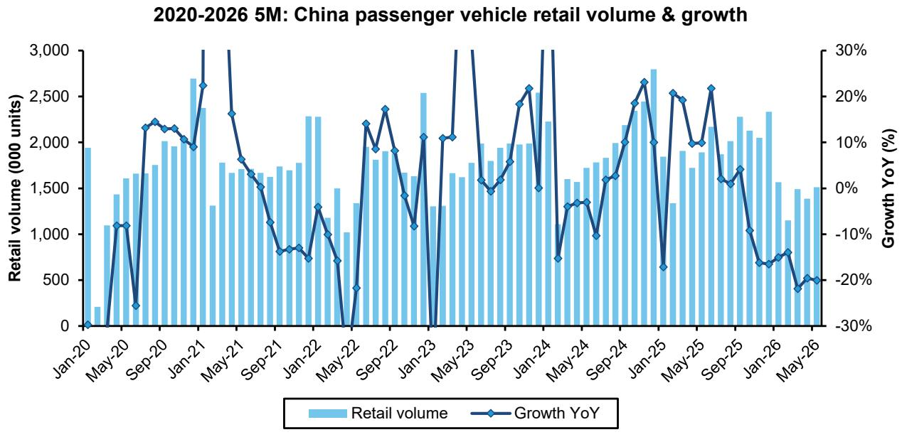

bar-line hybrid chart

2020-2026 5M: China passenger vehicle retail volume & growth
| Date | Retail volume (000 units) | Growth YoY (%) |
|---|---|---|
| Jan-20 | 1937 | -1.8 |
| Feb-20 | 1114 | -11.4 |
| Mar-20 | 1438 | -1.8 |
| Apr-20 | 1614 | -1.8 |
| May-20 | 1655 | -1.8 |
| Jun-20 | 1734 | -1.8 |
| Jul-20 | 1984 | -1.8 |
| Aug-20 | 2035 | -1.8 |
| Sep-20 | 2095 | -1.8 |
| Oct-20 | 2035 | -1.8 |
| Nov-20 | 1955 | -1.8 |
| Dec-20 | 1955 | -1.8 |
| Jan-21 | 2700 | -1.8 |
| Feb-21 | 2375 | -1.8 |
| Mar-21 | 1305 | -1.8 |
| Apr-21 | 1775 | -1.8 |
| May-21 | 1665 | -1.8 |
| Jun-21 | 1665 | -1.8 |
| Jul-21 | 1665 | -1.8 |
| Aug-21 | 1575 | -1.8 |
| Sep-21 | 1575 | -1.8 |
| Oct-21 | 1735 | -1.8 |
| Nov-21 | 1735 | -1.8 |
| Dec-21 | 1735 | -1.8 |
| Jan-22 | 2275 | -1.8 |
| Feb-22 | 2275 | -1.8 |
| Mar-22 | 1505 | -1.8 |
| Apr-22 | 1005 | -1.8 |
| May-22 | 1335 | -1.8 |
| Jun-22 | 1335 | -1.8 |
| Jul-22 | 2005 | -1.8 |
| Aug-22 | 1905 | -1.8 |
| Sep-22 | 1905 | -1.8 |
| Oct-22 | 1905 | -1.8 |
| Nov-22 | 1665 | -1.8 |
| Dec-22 | 1665 | -1.8 |
| Jan-23 | 2535 | -1.8 |
| Feb-23 | 1305 | -1.8 |
| Mar-23 | 1665 | -1.8 |
| Apr-23 | 1665 | -1.8 |
| May-23 | 1735 | -1.8 |
| Jun-23 | 1735 | -1.8 |
| Jul-23 | 1905 | -1.8 |
| Aug-23 | 1905 | -1.8 |
| Sep-23 | 1905 | -1.8 |
| Oct-23 | 2005 | -1.8 |
| Nov-23 | 2005 | -1.8 |
| Dec-23 | 2535 | -1.8 |
| Jan-24 | 2535 | -1.8 |
| Feb-24 | 2275 | -1.8 |
| Mar-24 | 1665 | -1.8 |
| Apr-24 | 1665 | -1.8 |
| May-24 | 1665 | -1.8 |
| Jun-24 | 1665 | -1.8 |
| Jul-24 | 1735 | -1.8 |
| Aug-24 | 1735 | -1.8 |
| Sep-24 | 2005 | -1.8 |
| Oct-24 | 2005 | -1.8 |
| Nov-24 | 2375 | -1.8 |
| Dec-24 | 2775 | -1.8 |
| Jan-25 | 2775 | -1.8 |
| Feb-25 | 647 | -1.8 |
| Mar-25 | 647 | -1.8 |
| Apr-25 | 647 | -1.8 |
| May-25 | 647 | -1.8 |
| Jun-25 | 647 | -1.8 |
| Jul-25 | 647 | -1.8 |
| Aug-25 | 647 | -1.8 |
| Sep-25 | 647 | -1.8 |
| Oct-25 | 647 | -1.8 |
| Nov-25 | 647 | -1.8 |
| Dec-25 | 647 | -1.8 |
| Jan-26 | 647 | -1.8 |
| Feb-26 | 647 | -1.8 |
| Mar-26 | 647 | -1.8 |
| Apr-26 | 647 | -1.8 |
| May-26 | 647 | -1.8 |
| Jun-26 (estimated) : Sales volume in thousands, Growth YoY (%) for the period ending June 30, 2020; Year-over-Year growth rates are also displayed on the right axis.

Source: C.A.D. and Bernstein analysis

EXHIBIT 3: BYD Group (incl. BYD, Denza, Fangchengbao, and Yangwang) came back to the top with 186k units, 13.4% share, followed by Geely Group (incl. Galaxy, Geometry, Zeekr, and Lynk&Co) with 144k units, 10.4% PV market share, and Changan with 87k units, 6.3% share  
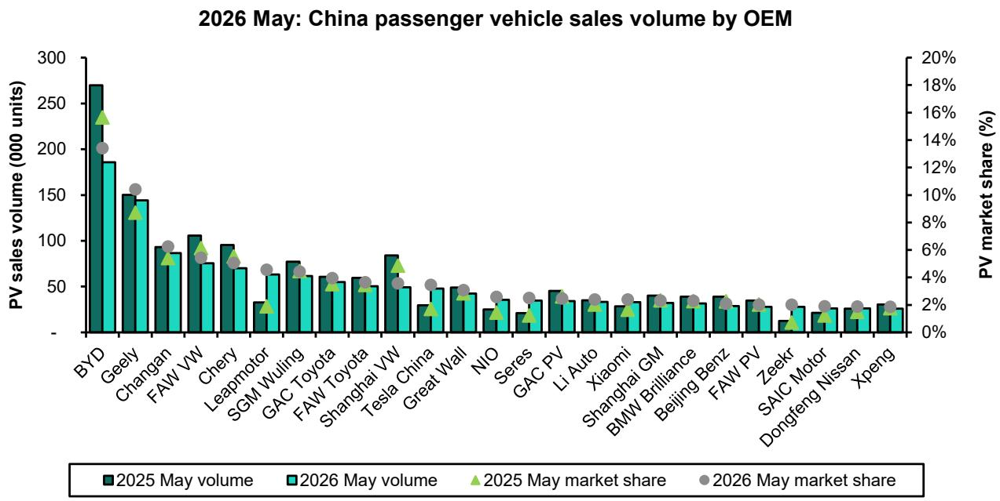

bar chart

| OEM              | 2025 May volume | 2026 May volume | 2025 May market share | 2026 May market share |
| ---------------- | --------------- | --------------- | --------------------- | --------------------- |
| BYD              | 270             | 185             | 16%                   | 14%                   |
| Geely            | 150             | 145             | 10%                   | 10%                   |
| Changan          | 90              | 85              | 8%                    | 6%                    |
| FAW VW           | 105             | 75              | 7%                    | 6%                    |
| Chery            | 95              | 70              | 6%                    | 5%                    |
| Leapmotor        | 35              | 60              | 4%                    | 4%                    |
| SGM Wuling       | 75              | 60              | 4%                    | 4%                    |
| GAC Toyota       | 60              | 55              | 3%                    | 3%                    |
| FAW Toyota       | 55              | 50              | 3%                    | 3%                    |
| Shanghai VW      | 85              | 50              | 4%                    | 3%                    |
| Tesla China      | 30              | 45              | 2%                    | 2%                    |
| Great Wall       | 50              | 40              | 2%                    | 2%                    |
| NIO              | 25              | 35              | 1%                    | 1%                    |
| Seres            | 20              | 30              | 1%                    | 1%                    |
| GAC PV           | 45              | 35              | 2%                    | 2%                    |
| Li Auto          | 35              | 30              | 1%                    | 1%                    |
| Xiaomi           | 30              | 35              | 1%                    | 1%                    |
| Shanghai GM      | 40              | 35              | 1%                    | 1%                    |
| BMW Brilliance   | 35              | 30              | 1%                    | 1%                    |
| Beijing Benz     | 40              | 35              | 1%                    | 1%                    |
| FAW PV           | 35              | 30              | 1%                    | 1%                    |
| Zeekr            | 10              | 20              | 1%                    | 1%                    |
| SAIC Motor       | 20              | 25              | 1%                    | 1%                    |
| Dongfeng Nissan   | 25              | 30              | 1%                    | 1%                    |
| Xpeng            | 25              | 25              | 1%                    | 1%                    |

Source: C.A.D. and Bernstein analysis

EXHIBIT 4: BYD Group remained the largest EV seller in China with volume and share stabilizing to 198k units and 21.4%; Geely Group ranked second with 111k units and 12% share, followed by Leapmotor at 63k units (6.8%)  
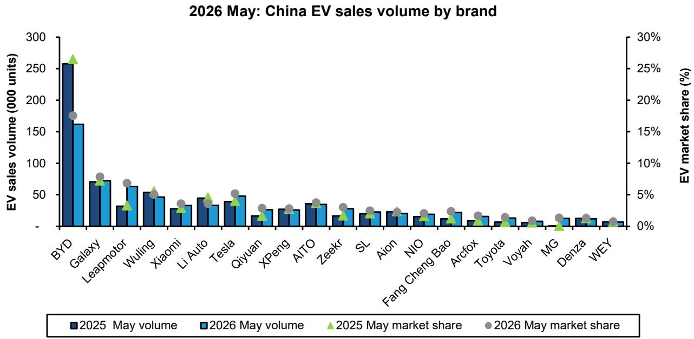

bar chart

| Brand         | 2025 May volume | 2026 May volume | 2025 May market share | 2026 May market share |
| ------------- | --------------- | --------------- | --------------------- | --------------------- |
| BYD           | 255             | 160             | 27%                   | 18%                   |
| Galaxy        | 70              | 70              | -                     | -                     |
| Leapmotor     | 35              | 60              | 4%                    | 8%                    |
| Wuling        | 55              | 45              | 6%                    | 7%                    |
| Xiaomi        | 30              | 35              | 4%                    | 4%                    |
| Li Auto       | 45              | 35              | 5%                    | 5%                    |
| Tesla         | 40              | 50              | 4%                    | 6%                    |
| Qiyuan        | 20              | -               | 3%                    | 3%                    |
| XPeng         | 30              | -               | 3%                    | 3%                    |
| AITO          | 35              | -               | -                     | 4%                    |
| Zeekr         | 20              | -               | -                     | 3%                    |
| SL            | 25              | -               | -                     | 3%                    |
| Aion          | 25              | -               | -                     | 3%                    |
| NIO           | 20              | -               | -                     | 2%                    |
| Fang Cheng Bao| -               | -               | -                     | -                     |
| Arcfox        | -               | -               | -                     | -                     |
| Toyota        | -               | -               | -                     | -                     |
| Voyah         | -               | -               | -                     | -                     |
| MG            | -               | -               | -                     | -                     |
| Denza         | -               | -               | -                     | -                     |
| WEY           | -               | -               | -                     | -                     |

Source: C.A.D. and Bernstein analysis

## 19.6MN UNITS OF RETAIL SAAR FOR MAY 2026

We maintain an estimate of retail SAAR in China, based on historical monthly seasonality, adjusted for the timing of Lunar New Year holidays. We calculated that average retail SAAR for May 2026 came in at 19.2mn units (Exhibit 5), lower than 19.5 mn units in April 2026, and trending below our estimate of c.22mn units for normalized annual Chinese autos demand. Excluding both imports and exports, we estimate that the average of aggregate SAAR of cars produced and sold domestically in China reached 18.0mn units in April, lower than the domestic retail SAAR of 18.2mn units (Exhibit 6). On a 6-month rolling basis, our estimate for domestic-only wholesale SAAR was 18.2mn units, lower vs. domestic-only retail SAAR of 18.4mn units.

EXHIBIT 5: After a sharp decline during COVID, China's PV SAAR rebounded strongly. However, growth has slowed in recent months, with April 2026 dropping to 19.6mn units, down from 20.7mn in March 2026 and well below 23.6mn in April 2025  
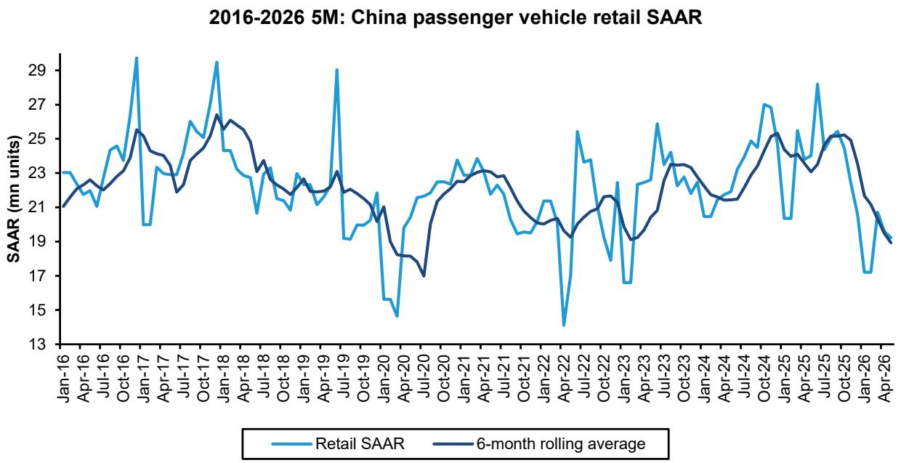

line chart

| Date    | Retail SAAR | 6-month rolling average |
|---------|-------------|--------------------------|
| Jan-16  | 23.0        | 21.0                     |
| Apr-16  | 22.5        | 21.5                     |
| Jul-16  | 24.0        | 22.0                     |
| Oct-16  | 29.0        | 25.0                     |
| Jan-17  | 21.0        | 23.0                     |
| Apr-17  | 23.0        | 24.0                     |
| Jul-17  | 25.0        | 23.0                     |
| Oct-17  | 29.0        | 26.0                     |
| Jan-18  | 24.0        | 25.0                     |
| Apr-18  | 23.0        | 24.0                     |
| Jul-18  | 21.0        | 23.0                     |
| Oct-18  | 23.0        | 22.0                     |
| Jan-19  | 21.0        | 23.0                     |
| Apr-19  | 29.0        | 23.0                     |
| Jul-19  | 19.0        | 22.0                     |
| Oct-19  | 21.0        | 21.0                     |
| Jan-20  | 15.0        | 18.0                     |
| Apr-20  | 19.0        | 17.0                     |
| Jul-20  | 23.0        | 21.0                     |
| Oct-20  | 24.0        | 23.0                     |
| Jan-21  | 23.0        | 23.0                     |
| Apr-21  | 21.0        | 23.0                     |
| Jul-21  | 19.0        | 21.0                     |
| Oct-21  | 21.0        | 19.0                     |
| Jan-22  | 14.0        | 19.0                     |
| Apr-22  | 25.0        | 19.0                     |
| Jul-22  | 18.0        | 21.0                     |
| Oct-22  | 17.0        | 19.0                     |
| Jan-23  | 26.0        | 23.0                     |
| Apr-23  | 19.0        | 19.0                     |
| Jul-23  | 23.0        | 23.0                     |
| Oct-23  | 25.0        | 23.0                     |
| Jan-24  | 19.0        | 21.0                     |
| Apr-24  | 24.0        | 23.0                     |
| Jul-24  | 27.0        | 25.0                     |
| Oct-24  | 19.0        | 23.0                     |
| Jan-25  | 25.0        | 24.0                     |
| Apr-25  | 19.0        | 23.0                     |
| Jul-25  | 28.0        | 25.0                     |
| Oct-25  | 17.0        | 19.0                     |
| Jan-26  | 19.0        | 19.0                     |
| Apr-26  |         |                          |

Note: For January and February of each year we've shown aggregate 2M retail SAAR, to minimize the volatility driven by Lunar New Year timing. Source: C.A.D., Bernstein estimates and analysis

EXHIBIT 6: Excluding both imports and exports, we estimate that the average of aggregate SAAR of cars produced and sold domestically in China reached 18.0mn units in May, lower than the domestic retail SAAR of 18.2mn units  
2016-2026 5M: China domestic wholesale vs. retail SAAR  
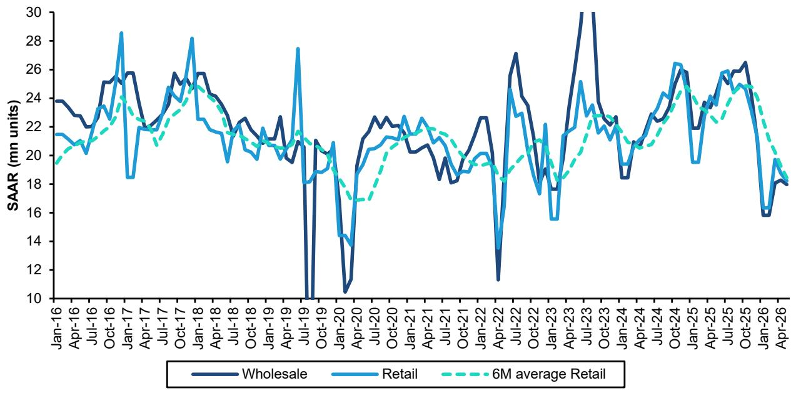

line chart

| Month    | Wholesale | Retail | 6M average Retail |
| -------- | --------- | ------ | ----------------- |
| Jan-16   | 24        | 21     | 19                |
| Apr-16   | 23        | 20     | 20                |
| Jul-16   | 25        | 23     | 21                |
| Oct-16   | 26        | 28     | 24                |
| Jan-17   | 25        | 18     | 23                |
| Apr-17   | 22        | 22     | 21                |
| Jul-17   | 24        | 25     | 23                |
| Oct-17   | 25        | 28     | 25                |
| Jan-18   | 26        | 24     | 24                |
| Apr-18   | 24        | 22     | 23                |
| Jul-18   | 23        | 20     | 21                |
| Oct-18   | 22        | 20     | 20                |
| Jan-19   | 21        | 19     | 19                |
| Apr-19   | 20        | 27     | 21                |
| Jul-19   | 10        | 18     | 19                |
| Oct-19   | 10        | 14     | 17                |
| Jan-20   | 10        | 14     | 17                |
| Apr-20   | 10        | 14     | 17                |
| Jul-20   | 23        | 20     | 19                |
| Oct-20   | 23        | 21     | 20                |
| Jan-21   | 22        | 23     | 21                |
| Apr-21   | 20        | 22     | 20                |
| Jul-21   | 18        | 19     | 19                |
| Oct-21   | 18        | 19     | 19                |
| Jan-22   | 23        | 20     | 19                |
| Apr-22   | 11        | 13     | 18                |
| Jul-22   | 27        | 24     | 20                |
| Oct-22   | 18        | 17     | 19                |
| Jan-23   | 18        | 15     | 18                |
| Apr-23   | 30        | 25     | 23                |
| Jul-23   | 30        | 24     | 23                |
| Oct-23   | 23        | 20     | 20                |
| Jan-24   | 18        | 19     | 19                |
| Apr-24   | 23        | 24     | 23                |
| Jul-24   | 26        | 26     | 25                |
| Oct-24   | 26        | 19     | 24                |
| Jan-25   | 24        | 24     | 23                |
| Apr-25   | 26        | 25     | 24                |
| Jul-25   | 26        | 25     | 24                |
| Oct-25   | 16        | 16     | 16                |
| Jan-26   | 18        | 18     | 18                |
| Apr-26   | 18        | 18     | 18                |

Note: For January and February of each year we've shown aggregate 2M retail SAAR, to minimize the volatility driven by Lunar New Year timing. Source: CAAM, C.A.D., and Bernstein estimates and analysis

## PREMIUM BRAND SALES -13.5% VS. MASS MARKET -21.1% YOY IN MAY 2026

Premium brand sales saw a $-13.5\%$ yoy decline in May (Exhibit 7). Overall premium penetration increased to $15.7\%$ in May from $15.1\%$ in April 2026, and higher than $14.5\%$ in May 2025. Retail sales volume of mass market brand cars plunged $-21.1\%$ yoy, reflecting ongoing weakness driven by a high comparison base and demand pulled forward by last year's subsidies. The sales of locally-built premium brand cars dropped by $-8.8\%$ yoy and import premium retail sales tumbled $-38.4\%$ yoy in May 2026 (Exhibit 8). Among major traditional premium brands, BMW posted the weakest performance with a $-34\%$ decline, while Audi fell $-33\%$ and Mercedes $-26\%$ . Porsche also reported a $-31\%$ drop.

EXHIBIT 7: Retail volumes of premium market brand cars declined by -13.5% yoy for May  
2020-2026 5M: China premium brand retail sales volume & growth  
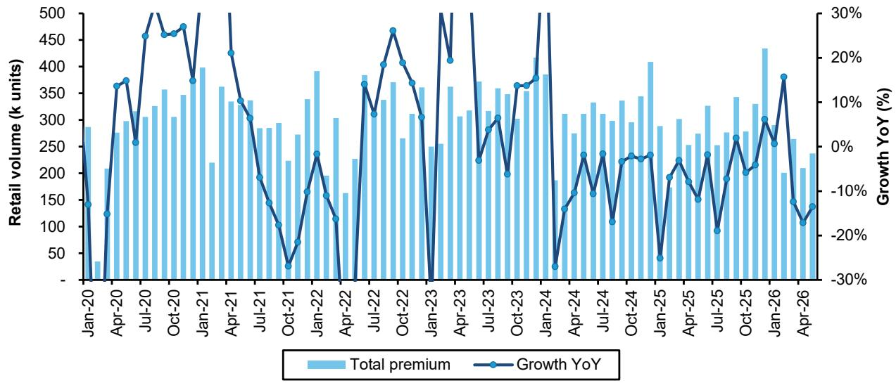

bar-line hybrid chart

| Month    | Total premium (k units) | Growth YoY (%) |
|----------|--------------------------|----------------|
| Jan-20   | 280                      | 14%            |
| Apr-20   | 270                      | 12%            |
| Jul-20   | 310                      | 26%            |
| Oct-20   | 350                      | 46%            |
| Jan-21   | 390                      | 37%            |
| Apr-21   | 340                      | 30%            |
| Jul-21   | 280                      | 19%            |
| Oct-21   | 290                      | 10%            |
| Jan-22   | 390                      | 24%            |
| Apr-22   | 300                      | -10%           |
| Jul-22   | 380                      | 37%            |
| Oct-22   | 370                      | 47%            |
| Jan-23   | 360                      | -30%           |
| Apr-23   | 310                      | 5%             |
| Jul-23   | 350                      | 15%            |
| Oct-23   | 380                      | 37%            |
| Jan-24   | 380                      | -30%           |
| Apr-24   | 310                      | -15%           |
| Jul-24   | 340                      | -5%            |
| Oct-24   | 350                      | -5%            |
| Jan-25   | 410                      | -15%           |
| Apr-25   | 300                      | -10%           |
| Jul-25   | 330                      | -5%            |
| Oct-25   | 340                      | -15%           |
| Jan-26   | 430                      | 15%            |
| Apr-26   | 260                      | -15%           |

Source: C.A.D. and Bernstein analysis

EXHIBIT 8: Retail sales volume of mass market brand cars plunged -21.1% yoy in May  
2020-2026 5M: Mass market brand retail volume & growth  
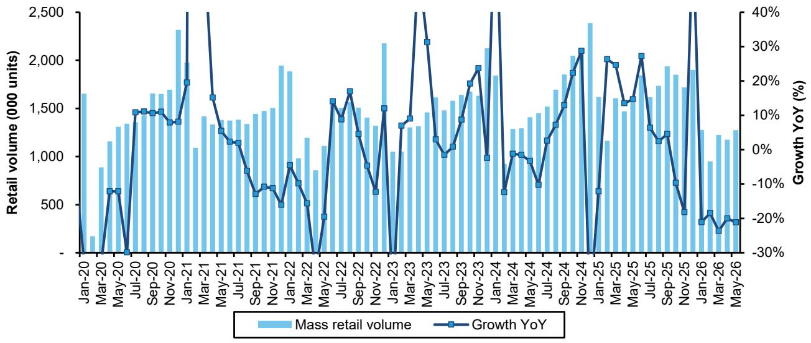

bar-line hybrid chart

| Month | Mass retail volume (000 units) | Growth YoY (%) |
| --- | --- | --- |
| Jan-20 | ~1650 | ~-10% |
| Feb-20 | ~900 | ~-15% |
| Mar-20 | ~1150 | ~-10% |
| Apr-20 | ~1350 | ~-15% |
| May-20 | ~1350 | ~-15% |
| Jun-20 | ~1450 | ~-10% |
| Jul-20 | ~1450 | ~-10% |
| Aug-20 | ~1450 | ~-10% |
| Sep-20 | ~1650 | ~-10% |
| Oct-20 | ~1700 | ~-10% |
| Nov-20 | ~1750 | ~-10% |
| Dec-20 | ~2300 | ~-10% |
| Jan-21 | ~1950 | ~-10% |
| Feb-21 | ~1100 | ~-15% |
| Mar-21 | ~1450 | ~-15% |
| Apr-21 | ~1350 | ~-15% |
| May-21 | ~1350 | ~-15% |
| Jun-21 | ~1350 | ~-15% |
| Jul-21 | ~1350 | ~-15% |
| Aug-21 | ~1450 | ~-15% |
| Sep-21 | ~1450 | ~-15% |
| Oct-21 | ~1450 | ~-15% |
| Nov-21 | ~1950 | ~-15% |
| Dec-21 | ~850 | ~-20% |
| Jan-22 | ~950 | ~-20% |
| Feb-22 | ~750 | ~-25% |
| Mar-22 | ~850 | ~-30% |
| Apr-22 | ~1150 | ~-30% |
| May-22 | ~1650 | ~-30% |
| Jun-22 | ~1450 | ~-30% |
| Jul-22 | ~1750 | ~-30% |
| Aug-22 | ~1450 | ~-30% |
| Sep-22 | ~950 | ~-30% |
| Oct-22 | ~650 | ~-30% |
| Nov-22 | ~650 | ~-30% |
| Dec-22 | ~1550 | ~-30% |
| Jan-23 | ~1350 | ~-30% |
| Feb-23 | ~1350 | ~-30% |
| Mar-23 | ~1350 | ~-30% |
| Apr-23 | ~1450 | ~-30% |
| May-23 | ~1650 | ~-30% |
| Jun-23 | ~1450 | ~-30% |
| Jul-23 | ~1450 | ~-30% |
| Aug-23 | ~1650 | ~-30% |
| Sep-23 | ~1750 | ~-30% |
| Oct-23 | ~1850 | ~-30% |
| Nov-23 | ~1650 | ~-30% |
| Dec-23 | ~950 | ~-30% |
| Jan-24 | ~650 | ~-30% |
| Feb-24 | ~650 | ~-30% |
| Mar-24 | ~750 | ~-30% |
| Apr-24 | ~750 | ~-30% |
| May-24 | ~750 | ~-30% |
| Jun-24 | ~750 | ~-30% |
| Jul-24 | ~750 | ~-30% |
| Aug-24 | ~750 | ~-30% |
| Sep-24 | ~750 | ~-30% |
| Oct-24 | ~750 | ~-30% |
| Nov-24 | ~750 | ~-30% |
| Dec-24 | ~750 | ~-30% |
| Jan-25 | ~650 | ~-30% |
| Feb-25 | ~650 | ~-30% |
| Mar-25 | ~750 | ~-30% |
| Apr-25 | ~750 | ~-30% |
| May-25 | ~750 | ~-30% |
| Jun-25 | ~750 | ~-30% |
| Jul-25 | ~750 | ~-30% |
| Aug-25 | ~750 | ~-30% |
| Sep-25 | ~750 | ~-30% |
| Oct-25 | ~750 | ~-30% |
| Nov-25 | ~750 | ~-30% |
| Dec-25 | ~750 | ~-30% |
| Jan-26 | ~75 | -30% |
| Feb-26 | ~75 | -30% |
| Mar-26 | ~75 | -30% |
| Apr-26 | ~75 | -30% |
| May-26 | ~75 | -30% |
| Jun-26 | ~75 | -30% |
| Jul-26 | ~75 | -30% |
| Aug-26 | ~75 | -30% |
| Sep-26 | ~75 | -30% |
| Oct-26 | ~75 | -30% |
| Nov-26 | ~75 | -30% |
| Dec-26 | ~75 | -30% |
| Jan-Mar | ~7 | -3 |
| Feb-Apr | ~7 | -3 |
| Mar-Apr | ~7 | -3 |
| Apr-Apr | ~7 | -3 |
| May-Apr | ~7 | -3 |
| Jun-Apr | ~7 | -3 |
| Jul-Apr | ~7 | -3 |
| Aug-Apr | ~7 | -3 |
| Sep-Apr | ~7 | -3 |
| Oct-Apr | ~7 | -3 |
| Nov-Apr | ~7 | -3 |
| Dec-Apr | ~7 | -3 |
| Jan-May | ~7 | -3 |
| Feb-Jun | ~7 | -3 |
| Mar-Jun | ~7 | -3 |
| Apr-Jun | ~7 | -3 |
| May-Jun | ~7 | -3 |
| Jun-Jun | ~7 | -3 |
| Jul-Jun | ~7 | -3 |
| Aug-Jun | ~7 | -3 |
| Sep-Jun | ~7 | -3 |
| Oct-Jun | ~7 | -3 |
| Nov-Jun | ~7 | -3 |
| Dec-Jun | ~7 | -3 |
| Jan-Jul | >7 (approx) | >7 |
| Feb-Jul | >7 (approx) | >7 |
| Mar-Jul | >7 (approx) | >7 |
| Apr-Jul | >7 (approx) | >7 |
| May-Jul | >7 (approx) | >7 |
| Jun-Jul | >7 (approx) | >7 |
| Jul-Jul | >7 (approx) | >7 |
| Aug-Jul | >7 (approx) | >7 |
| Sep-Jul | >7 (approx) | >7 |
| Oct-Jul | >7 (approx) | >7 |
| Nov-Jul | >7 (approx) | >7 |
| Dec-Jul | >7 (approx) | >7 |
| Jan-Aug | >7 (approx) | >7 |
| Feb-Aug | >7 (approx) | >7 |
| Mar-Aug | >7 (approx) | >7 |
| Apr-Aug | >7 (approx) | >7 |
| May-Aug | >7 (approx) | >7 |
| Jun-Aug | >7 (approx) | >7 |
| Jul-Aug | >7 (approx) | >7 |
| Aug-Aug | >7 (approx) | >7 |
| Sep-Aug | >7 (approx) | >7 |
| Oct-Aug | >7 (approx) | >7 |
| Nov-Aug | >7 (approx) | >7 |
| Dec-Aug | >7 (approx) | >7 |
| Jan-Sep | >7 (approx) | >7 |
| Feb-Sep | >7 (approx) | >7 |
| Mar-Sep | >7 (approx) | >7 |
| Apr-Sep | >7 (approx) | >7 |
| May-Sep | >7 (approx) | >7 |
| Jun-Sep | >7 (approx) | >7 |
| Jul-Sep | >7 (approx) | >7 |
| Aug-Sep | >7 (approx) | >7 |
| Sep-Sep | >7 (approx) | >7 |
| Oct-Sep | >7 (approx) | >7 |
| Nov-Sep | >7 (approx) | >7 |
| Dec-Sep | >7 (approx) | >7 |
| Jan-Oct | >7 (approx) | >7 |
| Feb-Oct | >7 (approx) | >7 |
| Mar-Oct | >7 (approx) | >7 |
| Apr-Oct | >7 (approx) | >7 |
| May-Oct | >7 (approx) | >7 |
| Jun-Oct | >7 (approx) | >7 |
| Jul-Oct | >7 (approx) | >7 |
| Aug-Oct | >7 (approx) | >7 |
| Sep-Oct | >7 (approx) | >7 |
| Oct-Oct | >7 (approx) | >7 |
| Nov-Oct | >7 (approx) | >7 |
| Dec-Oct | >7 (approx) | >7 |
| Jan-Nov | <value> | <value> |
| Feb-Nov | <value> | <value> |
| Mar-Nov | <value> | <value> |
| Apr-Nov | <value> | <value> |
| May-Nov | <value> | <value> |
| Jun-Nov | <value> | <value> |
| Jul-Nov | <value> | <value> |
| Aug-Nov | <value> | <value> |
| Sep-Nov | <value> | <value> |
| Oct-Nov | <value> | <value> |
| Nov-Nov | <value> | <value> |
| Dec-Nov | <value> | <value> |
| Jan-Dec | <value> | <value> |
| Feb-Dec | <value> | <value> |
| Mar-Dec | <value> | <value> |
| Apr-Dec | <value> | <value> |
| May-Dec | <value> | <value> |
| Jun-Dec | <value> | <value> |
| Jul-Dec | <value> | <value> |
| Aug-Dec | <value> | <value> |
| Sep-Dec | <value> | <value> |
| Oct-Dec | <value> | <value> |
| Nov-Dec | <value> | <value> |
| Dec-Dec | <value> | <value> |

Source: C.A.D. and Bernstein analysis

## OVERALL EV SALES PENETRATION REACHED 61% IN MAY 2026

Overall EV sales (BEV & PHEV) fell -5.1% YoY to 923k units in May, but showed improvement from April (-5.8% YoY), as consumers get used to higher purchase tax rate (5%) and welcome the rollout of new models. Rising oil price also help. BEV sales grew +8.3% yoy while PHEV fell -25.4% yoy. Overall EV sales penetration grew to 61.0% in May 2026, with BEV penetration reaching 41.9% and PHEV at 19.1%. As of May 2026, BEV penetration rates in tier 1, 2, and 3 cities came in at 42%, 37%, and 32%, respectively; and PHEV penetration maintained 17% across Tier 1, 2, and 3 cities. (Exhibit 9 — Exhibit 12)

BYD Group remained the largest EV seller in China volume and share stabilizing at 198k units and 21.4%. Geely Group ranked second with 111k units and 12.0% share, followed by Leapmotor at 63k units (6.8%). Other EV pure-plays included Tesla 48k (5.2%), NO 36k (3.9%), AITO 35k (3.8%), Xiaomi 33k (3.6%), Li Auto 33k (3.6%), XPeng 25k (3.1%). (Exhibit 4)

EXHIBIT 9: Overall EV sales (BEV & PHEV) growth fell -5.8% YoY to 828k units in April, but improved from March (-17.7%), underpinned by the rollout of new models and rising oil prices  
2020-2026 5M: China EV sales volume and penetration  
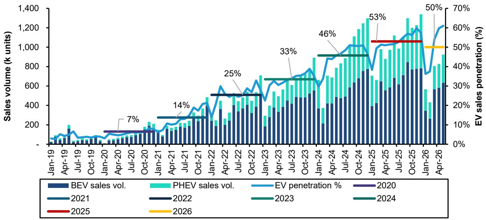

bar-line hybrid chart

| Year | BEV sales vol. (k units) | PHEV sales vol. (k units) | EV penetration % (%) |
|------|--------------------------|---------------------------|----------------------|
| 2021 | ~100                     | ~50                       | ~10%                 |
| 2022 | ~150                     | ~80                       | ~15%                 |
| 2023 | ~200                     | ~120                      | ~20%                 |
| 2024 | ~250                     | ~150                      | ~25%                 |
| 2025 | ~300                     | ~180                      | ~30%                 |
| 2026 | ~350                     | ~200                      | ~35%                 |

Source: C.A.D. and Bernstein analysis

EXHIBIT 10: By city tier, BEV penetration rates in Tier 1, 2, and 3 cities came at 42%, 37%, and 32% as of May 2026  
EXHIBIT 11: PHEV penetration maintained 17% across Tier 1, 2, and 3 cities  
2023-2026 5M: BEV penetration by city tier  
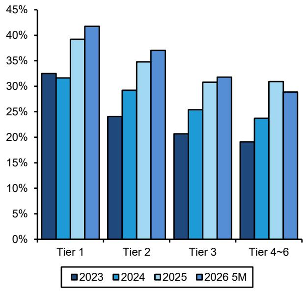

bar chart

| Category | 2023 (%) | 2024 (%) | 2025 (%) | 2026 5M (%) |
| :--- | :--- | :--- | :--- | :--- |
| Tier 1 | 32.5 | 31.5 | 39.2 | 41.8 |
| Tier 2 | 24.3 | 29.3 | 34.7 | 37.1 |
| Tier 3 | 20.6 | 25.4 | 30.6 | 31.8 |
| Tier 4~6 | 19.2 | 23.7 | 30.9 | 29.0 |

Source: C.A.D. and Bernstein analysis

2023-2026 5M: PHEV penetration by city tier  
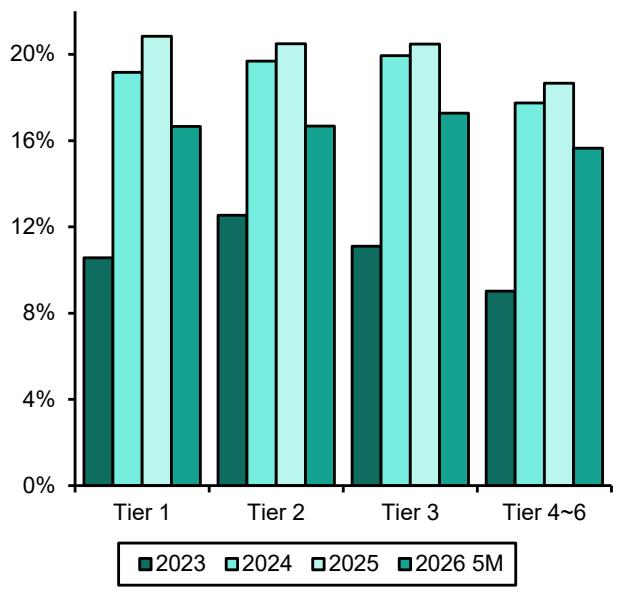

bar chart

| Category | 2023 (%) | 2024 (%) | 2025 (%) | 2026 5M (%) |
| :--- | :--- | :--- | :--- | :--- |
| Tier 1 | 11.2 | 19.5 | 20.8 | 16.3 |
| Tier 2 | 12.3 | 19.7 | 20.5 | 16.4 |
| Tier 3 | 11.5 | 19.9 | 20.4 | 16.7 |
| Tier 4~6 | 8.5 | 17.0 | 19.3 | 15.8 |

Source: Z:\Industry data\Sales Volume/CAM NEV INSURANCE.xlsx

EXHIBIT 12: In May 2026, BEV sales grew +8.3% yoy and PHEV decelerated to -25.4% yoy  
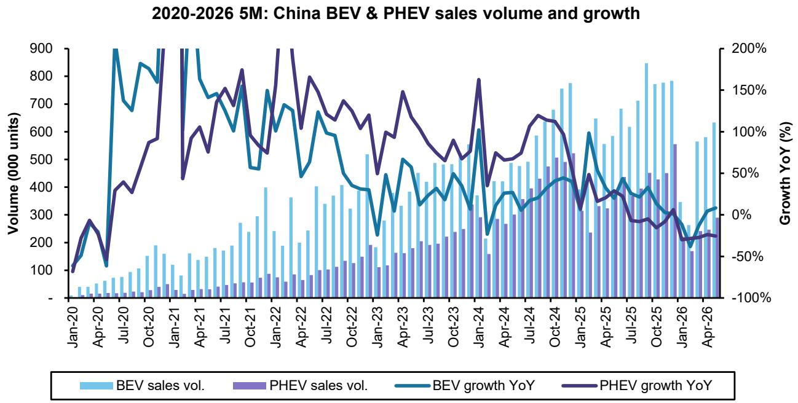

bar-line hybrid chart

2020-2026 5M: China BEV & PHEV sales volume and growth
| Date | BEV sales vol. (in 1000 units) | PHEV sales vol. (in 1000 units) | BEV growth YoY (%) | PHEV growth YoY (%) |
|---|---|---|---|---|
| Jan-20 | 30 | 10 | -70 | -80 |
| Apr-20 | 40 | 15 | -60 | -90 |
| Jul-20 | 80 | 20 | 180 | 150 |
| Oct-20 | 180 | 30 | 80 | 60 |
| Jan-21 | 120 | 40 | 90 | 120 |
| Apr-21 | 150 | 50 | 70 | 80 |
| Jul-21 | 180 | 60 | 60 | 70 |
| Oct-21 | 250 | 70 | 45 | 55 |
| Jan-22 | 350 | 80 | 75 | 95 |
| Apr-22 | 200 | 90 | 45 | 75 |
| Jul-22 | 350 | 100 | 65 | 65 |
| Oct-22 | 320 | 110 | 40 | 60 |
| Jan-23 | 280 | 120 | 25 | 45 |
| Apr-23 | 350 | 130 | 50 | 75 |
| Jul-23 | 450 | 140 | 35 | 65 |
| Oct-23 | 480 | 150 | 45 | 75 |
| Jan-24 | 420 | 160 | 25 | 55 |
| Apr-24 | 480 | 170 | 35 | 65 |
| Jul-24 | 580 | 180 | 30 | 65 |
| Oct-24 | 750 | 190 | 45 | 75 |
| Jan-25 | 780 | 200 | 35 | 65 |
| Apr-25 | 650 | 210 | 30 | 55 |
| Jul-25 | 700 | 220 | 35 | 65 |
| Oct-25 | 850 | 230 | 45 | 75 |
| Jan-26 | 780 | 240 | -15 | -15 |
| Apr-26 | 630 | 250 | -15 | -15 |
The chart displays the absolute sales volume for each period from Jan-20 to Apr-26, with a secondary axis showing the year-over-year growth rate. The data is already in English. The chart type is a bar chart.

Source: C.A.D. and Bernstein analysis

## INVENTORY LEVELS IN CHECK

May retail volume stood at 1.48mn units, vs. 1.44mn units of domestic wholesale volumes reported by CAAM, which implies 40k units of net channel inventory de-stocking in April (vs.23k de-stocking in April). On the other hand, EVs saw a restocking of 120k units during the same period. (Exhibit 13 - Exhibit 14)

Like-for-like retail pricing declined 1,114 bps yoy in May 2026, compared with a 1,020 bps decline in April 2026, likely due to increasing competition pressure and de-stocking activities. We anticipate a moderation in pricing pressure in the longer term, supported by the government's anti-involution position and newly introduced rules that prohibit OEMs from pricing vehicles below cost (LINK). (Exhibit 15 - Exhibit 17)

Dongfeng Nissan, SGM Wuling, and Geely have seen the most restocking on a cumulative LTM basis. Among EV pure players, Denza, Ora, and BYD's channel inventory levels are relatively high and above the 1.5 months benchmark, except for BYD. (Exhibit 18 – Exhibit 19)

EXHIBIT 13: There were 40k units of net channel inventory destocking in May, compared to 23k net destocking in April  
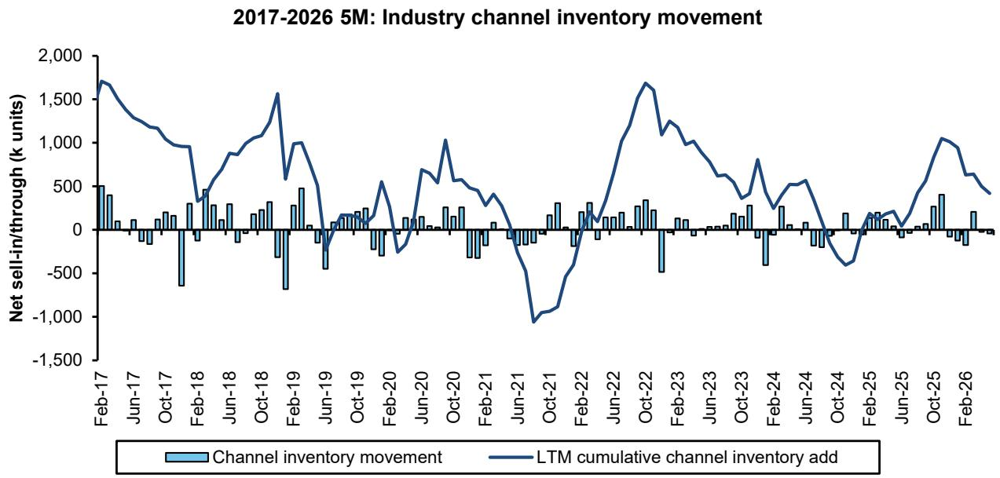

line chart

| Date    | Channel inventory movement | LTM cumulative channel inventory add |
|---------|-----------------------------|--------------------------------------|
| Feb-17  | ~400                        | ~1700                                |
| Jun-17  | ~100                        | ~1300                                |
| Oct-17  | ~200                        | ~1000                                |
| Feb-18  | ~300                        | ~500                                 |
| Jun-18  | ~200                        | ~900                                 |
| Oct-18  | ~300                        | ~1500                                |
| Feb-19  | ~400                        | ~1000                                |
| Jun-19  | ~100                        | ~500                                 |
| Oct-19  | ~200                        | ~200                                 |
| Feb-20  | ~100                        | ~500                                 |
| Jun-20  | ~200                        | ~700                                 |
| Oct-20  | ~300                        | ~1000                                |
| Feb-21  | ~100                        | ~500                                 |
| Jun-21  | ~-100                       | ~-1100                               |
| Oct-21  | ~300                        | ~-900                                |
| Feb-22  | ~200                        | ~-500                                |
| Jun-22  | ~300                        | ~1500                                |
| Oct-22  | ~400                        | ~1700                                |
| Feb-23  | ~100                        | ~1200                                |
| Jun-23  | ~20                         | ~800                                 |
| Oct-23  | ~30                         | ~500                                 |
| Feb-24  | ~20                         | ~300                                 |
| Jun-24  | ~10                         | ~500                                 |
| Oct-24  | ~-50                        | ~-400                                |
| Feb-25  | ~20                         | ~200                                 |
| Jun-25  | ~10                         | ~300                                 |
| Oct-25  | ~400                        | ~1100                                |
| Feb-26  | ~20                         | ~600                                 |

Source: CAAM, C.A.D. and Bernstein analysis

EXHIBIT 14: EV net channel inventory increased by 120k units in May and 87k units in April  
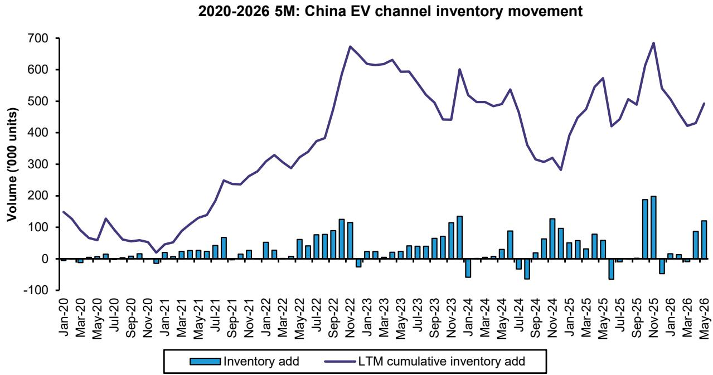

bar-line hybrid

2020-2026 5M: China EV channel inventory movement
| Date | Inventory add (1000 units) | LTM cumulative inventory add (1000 units) |
|---|---|---|
| Jan-20 | 0 | 150 |
| Mar-20 | 5 | 80 |
| May-20 | 10 | 60 |
| Jul-20 | 5 | 130 |
| Sep-20 | 10 | 60 |
| Nov-20 | -10 | 40 |
| Jan-21 | 20 | 40 |
| Mar-21 | 25 | 80 |
| May-21 | 30 | 130 |
| Jul-21 | 70 | 240 |
| Sep-21 | 15 | 230 |
| Nov-21 | 30 | 270 |
| Jan-22 | 55 | 330 |
| Mar-22 | 15 | 290 |
| May-22 | 60 | 340 |
| Jul-22 | 80 | 380 |
| Sep-22 | 120 | 670 |
| Nov-22 | -30 | 670 |
| Jan-23 | 25 | 610 |
| Mar-23 | 15 | 630 |
| May-23 | 30 | 600 |
| Jul-23 | 45 | 550 |
| Sep-23 | 70 | 440 |
| Nov-23 | 115 | 600 |
| Jan-24 | -60 | 500 |
| Mar-24 | -15 | 490 |
| May-24 | 35 | 540 |
| Jul-24 | -65 | 330 |
| Sep-24 | 15 | 310 |
| Nov-24 | 125 | 315 |
| Jan-25 | 95 | 440 |
| Mar-25 | 55 | 570 |
| May-25 | -65 | 420 |
| Jul-25 | -15 | 490 |
| Sep-25 | 185 | 685 |
| Nov-25 | -55 | 685 |
| Jan-26 | 15 | 540 |
| Mar-26 | -15 | 420 |
| May-26 | 90 | 490 |

Source: CAAM, C.A.D., and Bernstein analysis

EXHIBIT 15: Retail pricing sees moderate pressure due to the weak end-market demand; like-for-like pricing was -1,114 basis points in May, vs. -1,020 basis points yoy in April 2026  
2020-2026 5M: China estimated like-for-like retail pricing change YoY  
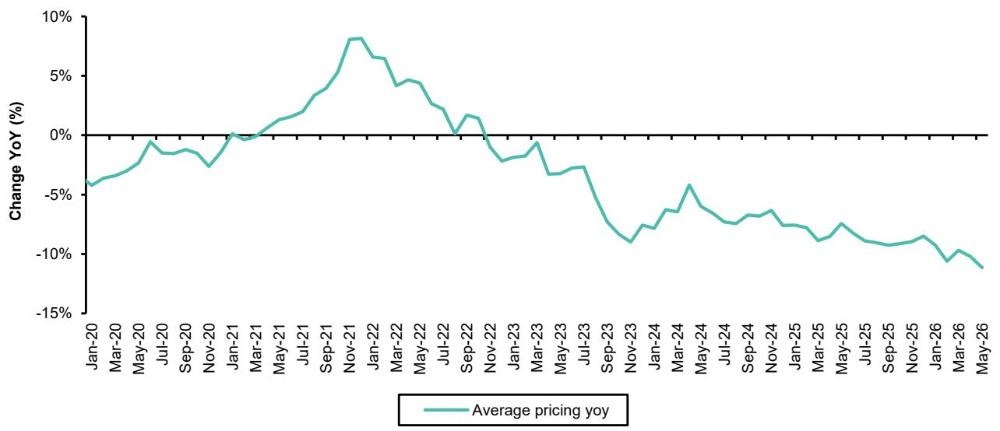

line chart

| Month    | Average pricing yoy (%) |
| -------- | ------------------------ |
| Jan-20   | -4.5                     |
| Mar-20   | -3.0                     |
| May-20   | -1.5                     |
| Jul-20   | -2.0                     |
| Sep-20   | -1.0                     |
| Nov-20   | -3.5                     |
| Jan-21   | -0.5                     |
| Mar-21   | 0.5                      |
| May-21   | 1.5                      |
| Jul-21   | 3.0                      |
| Sep-21   | 5.0                      |
| Nov-21   | 8.0                      |
| Jan-22   | 7.0                      |
| Mar-22   | 5.0                      |
| May-22   | 4.0                      |
| Jul-22   | 2.0                      |
| Sep-22   | 1.0                      |
| Nov-22   | -1.0                     |
| Jan-23   | -2.0                     |
| Mar-23   | -1.5                     |
| May-23   | -3.0                     |
| Jul-23   | -4.0                     |
| Sep-23   | -7.0                     |
| Nov-23   | -9.0                     |
| Jan-24   | -7.5                     |
| Mar-24   | -5.0                     |
| May-24   | -6.0                     |
| Jul-24   | -7.0                     |
| Sep-24   | -6.5                     |
| Nov-24   | -7.5                     |
| Jan-25   | -8.0                     |
| Mar-25   | -9.0                     |
| May-25   | -7.0                     |
| Jul-25   | -8.5                     |
| Sep-25   | -9.0                     |
| Nov-25   | -8.5                     |
| Jan-26   | -10.0                    |
| Mar-26   | -9.5                     |
| May-26   | -11.0                    |

Source: C.A.D. and Bernstein analysis

EXHIBIT 16: Both imported and domestic premium brand discounts increased moderately in May  
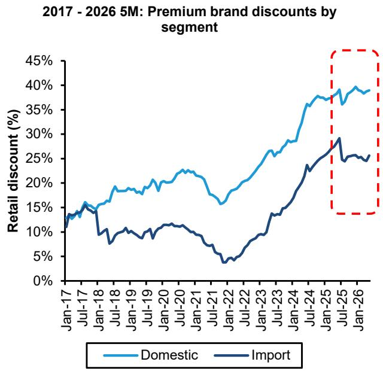

line chart

| Date   | Domestic | Import |
|--------|----------|--------|
| Jan-17 | 12%      | 13%    |
| Jul-17 | 15%      | 14%    |
| Jan-18 | 16%      | 10%    |
| Jul-18 | 18%      | 9%     |
| Jan-19 | 19%      | 10%    |
| Jul-19 | 20%      | 11%    |
| Jan-20 | 22%      | 12%    |
| Jul-20 | 23%      | 11%    |
| Jan-21 | 21%      | 9%     |
| Jul-21 | 18%      | 6%     |
| Jan-22 | 16%      | 4%     |
| Jul-22 | 20%      | 7%     |
| Jan-23 | 25%      | 10%    |
| Jul-23 | 28%      | 15%    |
| Jan-24 | 30%      | 20%    |
| Jul-24 | 35%      | 25%    |
| Jan-25 | 38%      | 30%    |
| Jul-25 | 39%      | 28%    |
| Jan-26 | 40%      | 25%    |

Source: C.A.D. and Bernstein analysis

EXHIBIT 17: Mass market EV discounts declined moderately in April 2026, while IC discounts increased  
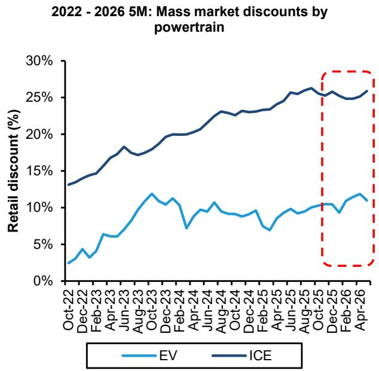

line chart

| Date    | EV   | ICE  |
|---------|------|------|
| Oct-22  | 3%   | 13%  |
| Dec-22  | 4%   | 14%  |
| Feb-23  | 6%   | 15%  |
| Apr-23  | 8%   | 17%  |
| Jun-23  | 10%  | 18%  |
| Aug-23  | 12%  | 19%  |
| Oct-23  | 11%  | 20%  |
| Dec-23  | 10%  | 21%  |
| Feb-24  | 7%   | 22%  |
| Apr-24  | 9%   | 23%  |
| Jun-24  | 10%  | 24%  |
| Aug-24  | 9%   | 25%  |
| Oct-24  | 8%   | 26%  |
| Dec-24  | 9%   | 27%  |
| Feb-25  | 7%   | 28%  |
| Apr-25  | 9%   | 29%  |
| Jun-25  | 10%  | 30%  |
| Aug-25  | 11%  | 31%  |
| Oct-25  | 10%  | 32%  |
| Dec-25  | 9%   | 33%  |
| Feb-26  | 11%  | 34%  |
| Apr-26  | 10%  | 35%  |

Source: C.A.D. and Bernstein analysis

EXHIBIT 18: Dongfeng Nissan, SGM Wuling, and Geely have seen the most restocking on a cumulative LTM basis  
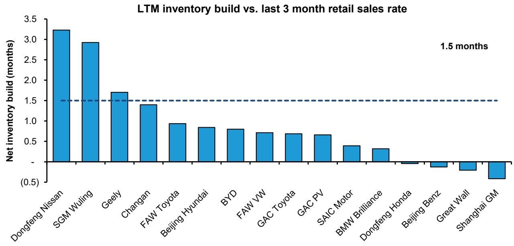

bar chart

LTM inventory build vs. last 3 month retail sales rate
| Manufacturer | Net inventory build (months) |
| :--- | :--- |
| Dongfeng Nissan | 3.25 |
| SGM Wuling | 2.95 |
| Geely | 1.7 |
| Changan | 1.4 |
| FAW Toyota | 0.95 |
| Beijing Hyundai | 0.85 |
| BYD | 0.8 |
| FAW VW | 0.7 |
| GAC Toyota | 0.7 |
| GAC PV | 0.65 |
| SAIC Motor | 0.4 |
| BMW Brilliance | 0.35 |
| Dongfeng Honda | -0.1 |
| Beijing Benz | -0.2 |
| Great Wall | -0.3 |
| Shanghai GM | -0.6 |
1.5 months

Source: CAAM, C.A.D., and Bernstein analysis

EXHIBIT 19: Among EV pure players, Denza, Ora, BYD, Leapmotor and Zeeker's channel inventory levels are relatively high; conversely, Wey and Tesla destocked the most recently  
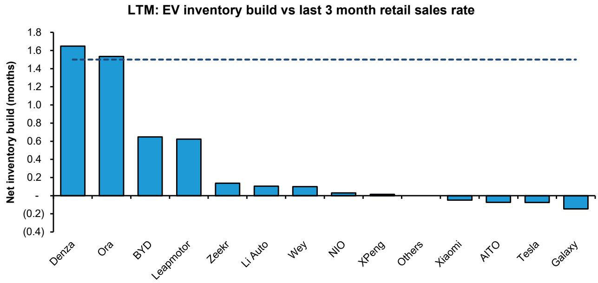

bar chart

LTM: EV inventory build vs last 3 month retail sales rate
| Company | Net inventory build (months) |
| :--- | :--- |
| Denza | 1.65 |
| Ora | 1.52 |
| BYD | 0.64 |
| Leapmotor | 0.62 |
| Zeekr | 0.15 |
| Li Auto | 0.12 |
| Wey | 0.11 |
| NIO | -0.05 |
| XPeng | -0.03 |
| Others | -0.02 |
| Xiaomi | -0.08 |
| AITO | -0.10 |
| Tesla | -0.10 |
| Galaxy | -0.18 |

Source: CAAM, C.A.D., and Bernstein analysis

## CHINA EXPORT MOMENTUM REMAINED STRONG, +73% YOY IN MAY

China's passenger vehicle exports grew +73% yoy in May, with ICE exports +38% and EV exports +119%. Exports made up 35.9% of total PV wholesale, partially offsetting the weak domestic demand. BEV & PHEV exports contributed c.55% of total export volume. Chery led with 179k units (+79% yoy), followed by BYD with 156k (+85%). Geely maintained the third place with 84k units (+180%), while SAIC ranked fourth with 72k units (+41%). Great Wall exported 45k units, +58% yoy. (Exhibit 20)

EXHIBIT 20: Export volume in May 2026 grew +73% yoy – ICE +38%, EV +119%  
2022 - 2026 5M: China new passenger vehicle export volume by powertrain  
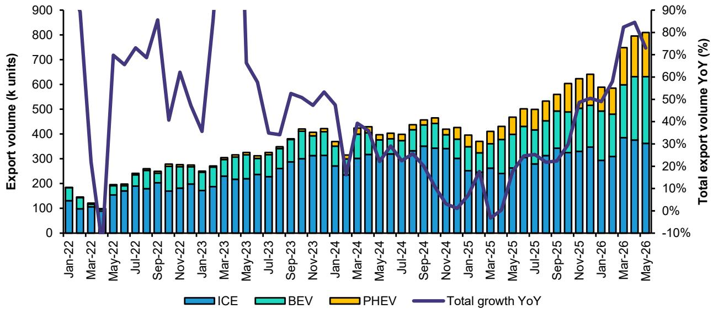

bar-line hybrid chart

| Month    | ICE  | BEV  | PHEV | Total export volume YoY (%) |
|----------|------|------|------|-----------------------------|
| Jan-22   | 130  | 150  | 0    | 90%                         |
| Mar-22   | 110  | 140  | 0    | -10%                        |
| May-22   | 140  | 160  | 0    | 70%                         |
| Jul-22   | 170  | 180  | 0    | 75%                         |
| Sep-22   | 180  | 190  | 0    | 85%                         |
| Nov-22   | 190  | 200  | 0    | 65%                         |
| Jan-23   | 180  | 190  | 0    | 40%                         |
| Mar-23   | 200  | 210  | 0    | 90%                         |
| May-23   | 210  | 220  | 0    | 85%                         |
| Jul-23   | 220  | 230  | 0    | 65%                         |
| Sep-23   | 230  | 240  | 0    | 55%                         |
| Nov-23   | 240  | 250  | 0    | 50%                         |
| Jan-24   | 250  | 260  | 0    | 45%                         |
| Mar-24   | 260  | 270  | 0    | 40%                         |
| May-24   | 270  | 280  | 0    | 35%                         |
| Jul-24   | 280  | 290  | 0    | 30%                         |
| Sep-24   | 290  | 300  | 0    | 25%                         |
| Nov-24   | 300  | 310  | 0    | 20%                         |
| Jan-25   | 310  | 320  | 0    | 15%                         |
| Mar-25   | 320  | 330  | 0    | 10%                         |
| May-25   | 330  | 340  | 0    | 5%                          |
| Jul-25   | 340  | 350  | 0    | -5%                         |
| Sep-25   | 350  | 360  | 0    | -15%                        |
| Nov-25   | 360  | 370  | 0    | -25%                        |
| Jan-26   | 370  | 380  | 0    | -35%                        |
| Mar-26   | 380  | 390  | 0    | -45%                        |
| May-26   | 390  | 400  | 0    | -55%                        |

Source: CAAM and Bernstein analysis

## CREDIT IMPULSE REMAINS WEAK

Our estimate for China's credit impulse came to 20.2% in May 2026, declining from 21.7% a year ago. 12 month change in Bloomberg's credit impulse deteriorated further to -2.3% this month, marking a continued downturn after its first negative print in March, which ended an 11-month period of positive momentum. (Exhibit 21 and Exhibit 22). We encourage monitoring credit levels closely. Historically, we have measured a meaningful positive correlation (c. 0.6) between China's auto demand and credit availability.

EXHIBIT 21: We estimate China's credit impulse was 20.2% in May 2026...  
2011-2026 5M: China credit impulse  
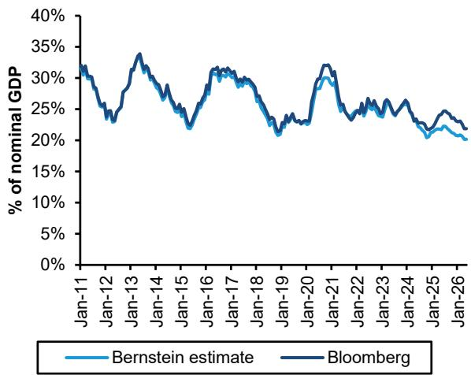

line chart

| Date   | Bernstein estimate | Bloomberg |
|--------|--------------------|---------|
| Jan-11 | ~32%               | ~32%    |
| Jan-12 | ~25%               | ~25%    |
| Jan-13 | ~34%               | ~34%    |
| Jan-14 | ~28%               | ~28%    |
| Jan-15 | ~22%               | ~22%    |
| Jan-16 | ~31%               | ~31%    |
| Jan-17 | ~30%               | ~30%    |
| Jan-18 | ~28%               | ~28%    |
| Jan-19 | ~21%               | ~21%    |
| Jan-20 | ~28%               | ~28%    |
| Jan-21 | ~32%               | ~32%    |
| Jan-22 | ~25%               | ~25%    |
| Jan-23 | ~24%               | ~24%    |
| Jan-24 | ~22%               | ~22%    |
| Jan-25 | ~20%               | ~20%    |
| Jan-26 | ~18%               | ~18%    |

Source: PBOC, Bloomberg L.P., and Bernstein analysis

EXHIBIT 22: ... declining from $21.7\%$ a year ago. 12 month change in Bloomberg's credit impulse deteriorated further to $-2.3\%$ this month, marking a continued downturn after its first negative print in March, which ended an 11-month period of positive momentum  
2011-2026 5M: China credit impulse 12 month change  
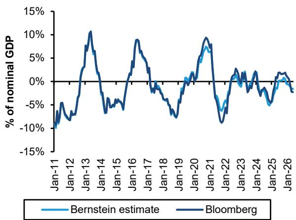

line chart

| Date   | Bernstein estimate | Bloomberg |
|--------|--------------------|---------|
| Jan-11 | -10%               | -10%    |
| Jan-12 | -5%                | -5%     |
| Jan-13 | 10%                | 10%     |
| Jan-14 | -5%                | -5%     |
| Jan-15 | 0%                 | 0%      |
| Jan-16 | 5%                 | 5%      |
| Jan-17 | 0%                 | 0%      |
| Jan-18 | -5%                | -5%     |
| Jan-19 | -10%               | -10%    |
| Jan-20 | 0%                 | 0%      |
| Jan-21 | 5%                 | 5%      |
| Jan-22 | -5%                | -5%     |
| Jan-23 | 0%                 | 0%      |
| Jan-24 | 5%                 | 5%      |
| Jan-25 | 0%                 | 0%      |
| Jan-26 | -5%                | -5%     |

Source: PBOC, Bloomberg L.P., and Bernstein analysis

EXHIBIT 23: Auto loan issuance volume rebounded in April 2026  
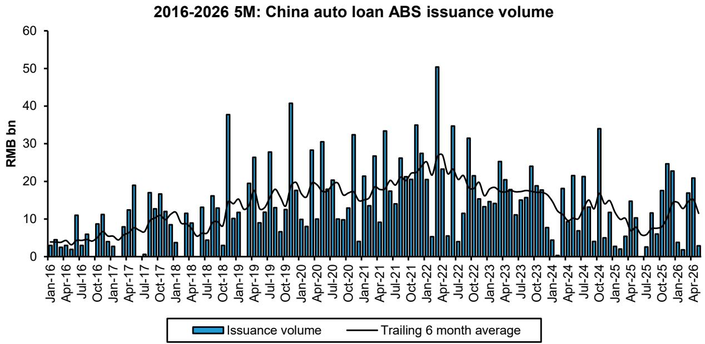

bar-line hybrid chart

2016-2026 5M: China auto loan ABS issuance volume
| Date | Issuance volume (RMB bn) | Trailing 6 month average (RMB bn) |
|---|---|---|
| Jan-16 | 3.5 | 4.0 |
| Apr-16 | 2.8 | 3.5 |
| Jul-16 | 10.8 | 4.5 |
| Oct-16 | 5.7 | 5.0 |
| Jan-17 | 8.9 | 4.0 |
| Apr-17 | 12.8 | 6.0 |
| Jul-17 | 17.0 | 7.0 |
| Oct-17 | 16.5 | 9.0 |
| Jan-18 | 3.8 | 8.0 |
| Apr-18 | 11.5 | 7.0 |
| Jul-18 | 13.5 | 6.0 |
| Oct-18 | 3.5 | 8.0 |
| Jan-19 | 10.5 | 13.0 |
| Apr-19 | 19.5 | 15.0 |
| Jul-19 | 27.5 | 17.0 |
| Oct-19 | 40.5 | 19.0 |
| Jan-20 | 9.5 | 18.0 |
| Apr-20 | 28.0 | 19.0 |
| Jul-20 | 30.5 | 20.0 |
| Oct-20 | 32.5 | 18.0 |
| Jan-21 | 4.5 | 17.0 |
| Apr-21 | 26.5 | 19.0 |
| Jul-21 | 33.5 | 20.0 |
| Oct-21 | 25.5 | 22.0 |
| Jan-22 | 27.5 | 25.0 |
| Apr-22 | 50.5 | 27.0 |
| Jul-22 | 34.5 | 23.0 |
| Oct-22 | 31.0 | 21.0 |
| Jan-23 | 14.5 | 19.0 |
| Apr-23 | 25.5 | 18.0 |
| Jul-23 | 15.5 | 17.0 |
| Oct-23 | 24.0 | 18.0 |
| Jan-24 | 7.5 | 16.0 |
| Apr-24 | 18.0 | 13.0 |
| Jul-24 | 6.5 | 14.0 |
| Oct-24 | 34.0 | 16.0 |
| Jan-25 | 4.5 | 13.0 |
| Apr-25 | 5.5 | 12.0 |
| Jul-25 | 14.5 | 9.0 |
| Oct-25 | 24.5 | 14.0 |
| Jan-26 | 3.5 | 13.0 |
| Apr-26 | 21.0 | 13.0 |

Source: Wind and Bernstein analysis

## XPENG: MARKET-PERFORM, PT US\$20.00/ HK\$78.00 (OLD: US\$22.00/HK\$86.00)

Tactically positive on the new MONA launches. XPeng's stock has underperformed recently, largely due to concerns around GX deliveries tracking below expectations. However, we are turning more constructive on the stock from a tactical perspective. We see upcoming product launches as key near-term catalysts, starting with the new MONA L03 SUV. The company is set to unveil the L03 on July 2, with a market launch expected within the same month. We view this launch positively. XPeng's MONA brand is uniquely positioned in the mass-market segment, differentiated by its strong technology offering at an accessible

price point. The MONA M03 sedan has demonstrated relatively resilient volumes, and the L03 marks the brand's first SUV entry. Looking ahead, XPeng also plans to introduce the L05. We expect the L03 to be a compact coupe SUV priced in the RMB100-150k range, closely aligned with or slightly above the M03. The L05, a mid-to-large SUV slightly larger than the XPeng G6, is likely to be priced between RMB150-200k. Both models are expected to offer BEV and EREV variants. While we remain mindful of potential cannibalization risk to the G6, we believe these new launches will inject product freshness, drive consumer interest, and support showroom traffic.

Strong tech offering, but limited visibility on profitability keeps us from turning more positive. Despite our tactical positivity, we maintain a Market-Perform rating. Our caution primarily reflects limited visibility on achieving sustainable profitability. We acknowledge XPeng's technological progress—particularly in ADAS and its VLA 2.0 platform, which are among industry leaders. The company is also advancing in robotaxi and humanoid development, offering differentiated long-term opportunities. However, these initiatives are capital-intensive. Hence, although XPeng reported profitability in Q4 25, we expect the company to remain loss-making for the full year 2026. We have lowered our price target to US\$20.00 (from US \$22.00), reflecting a reduced EV/sales multiple as we factor in a longer path to sustained profitability amid increased AI-related investments, including autonomous driving, robotaxi, and humanoid initiatives, with limited near-term monetization visibility.

We maintain Market-Perform on XPeng. We now project 2026/2027 vehicle sales volumes of 504k / 576k units. Revenue is expected to reach RMB95.7bn / RMB115.0bn, with gross margins of 18.9% / 19.6%, and EPS of RMB -1.02 / 0.23, respectively. Our revised price targets are US\$20.00 for XPEV.US (Old: US\$22.00) and HK\$78.00 for 9868.HK (Old: HK \$86.00), based on a 1-year forward EV/sales multiple of 0.8x (previously 1.0x). The lower multiple reflects reduced earnings visibility due to elevated AI-related investments. (Exhibit 24, Exhibit 25, Exhibit 28)

## Related research:

29 May 2026 - XPeng: Q1 Resilient gross margin; Bullish tone on GX

9 Mar 2026 - XPeng: VLA 2.0 delivers strong step-up in ADAS capability — Guangzhou test ride takeaways

EXHIBIT 24: XPeng has introduced EREV trims for the X9, P7+, G7, and G6 through Q1 2026; it also launched the new GX SUV in May, and plans to roll out two MONA SUVs and a G9L SUV in the rest of 2026

<table><tr><td rowspan="2">Brand Nameplate</td><td rowspan="2">Powertrain</td><td rowspan="2">Class</td><td rowspan="2">Segment</td><td colspan="4">2023</td><td colspan="4">2024</td><td colspan="4">2025</td><td colspan="4">2026E</td><td colspan="4">2027E</td></tr><tr><td>Q1</td><td>Q2</td><td>Q3</td><td>Q4</td><td>Q1</td><td>Q2</td><td>Q3</td><td>Q4</td><td>Q1</td><td>Q2</td><td>Q3</td><td>Q4</td><td>Q1</td><td>Q2</td><td>Q3</td><td>Q4</td><td>Q1</td><td>Q2</td><td>Q3</td><td>Q4</td></tr><tr><td colspan="24">XPeng</td></tr><tr><td>G3/G3i</td><td>BEV</td><td>A</td><td>SUV</td><td></td><td></td><td></td><td></td><td>Retired</td><td></td><td></td><td></td><td></td><td></td><td></td><td></td><td></td><td></td><td></td><td></td><td></td><td></td><td></td><td></td></tr><tr><td>P7/P7i</td><td>BEV</td><td>B</td><td>Sedan</td><td>Facelift</td><td></td><td></td><td></td><td></td><td></td><td></td><td></td><td></td><td></td><td>Coupe Version</td><td></td><td></td><td></td><td></td><td></td><td></td><td></td><td></td><td></td></tr><tr><td>P5</td><td>BEV</td><td>A</td><td>Sedan</td><td></td><td></td><td></td><td></td><td></td><td></td><td></td><td></td><td>Retired</td><td></td><td></td><td></td><td></td><td></td><td></td><td></td><td></td><td></td><td></td><td></td></tr><tr><td>G9</td><td>BEV</td><td>C</td><td>SUV</td><td></td><td>Facelift</td><td></td><td></td><td></td><td></td><td></td><td></td><td>Facelift</td><td></td><td></td><td></td><td>Facelift</td><td></td><td></td><td></td><td></td><td></td><td></td><td></td></tr><tr><td>G6</td><td>BEV / EREV</td><td>B</td><td>SUV</td><td></td><td>BEV</td><td></td><td></td><td></td><td></td><td></td><td></td><td>Facelift</td><td></td><td></td><td></td><td>Facelift / EREV</td><td></td><td></td><td></td><td></td><td></td><td></td><td></td></tr><tr><td>X9</td><td>BEV / EREV</td><td>C</td><td>MPV</td><td></td><td></td><td></td><td></td><td>BEV</td><td></td><td></td><td></td><td></td><td>Facelift</td><td></td><td>EREV</td><td></td><td></td><td></td><td></td><td></td><td></td><td></td><td></td></tr><tr><td>MONA M03</td><td>BEV</td><td>A</td><td>Sedan</td><td></td><td></td><td></td><td></td><td></td><td></td><td>BEV</td><td></td><td></td><td>Max Version</td><td></td><td></td><td></td><td></td><td></td><td></td><td></td><td></td><td></td><td></td></tr><tr><td>P7+</td><td>BEV</td><td>B</td><td>Sedan</td><td></td><td></td><td></td><td></td><td></td><td></td><td></td><td>BEV</td><td></td><td></td><td></td><td></td><td>Facelift / EREV</td><td></td><td></td><td></td><td></td><td></td><td></td><td></td></tr><tr><td>G7</td><td>BEV</td><td>B</td><td>SUV</td><td></td><td></td><td></td><td></td><td></td><td></td><td></td><td></td><td></td><td>BEV</td><td></td><td></td><td>Facelift / EREV</td><td></td><td></td><td></td><td></td><td></td><td></td><td></td></tr><tr><td>GX</td><td>BEV / EREV</td><td>D</td><td>SUV</td><td></td><td></td><td></td><td></td><td></td><td></td><td></td><td></td><td></td><td></td><td></td><td></td><td></td><td>BEV / EREV-New</td><td></td><td></td><td></td><td></td><td></td><td></td></tr><tr><td>MONA L03</td><td>BEV / EREV</td><td>A</td><td>SUV</td><td></td><td></td><td></td><td></td><td></td><td></td><td></td><td></td><td></td><td></td><td></td><td></td><td></td><td></td><td>BEV / EREV-New</td><td></td><td></td><td></td><td></td><td></td></tr><tr><td>MONA L05</td><td>BEV / EREV</td><td>C</td><td>SUV</td><td></td><td></td><td></td><td></td><td></td><td></td><td></td><td></td><td></td><td></td><td></td><td></td><td></td><td></td><td>BEV / EREV-New</td><td></td><td></td><td></td><td></td><td></td></tr><tr><td>G9L</td><td>BEV / EREV</td><td>D</td><td>SUV</td><td></td><td></td><td></td><td></td><td></td><td></td><td></td><td></td><td></td><td></td><td></td><td></td><td></td><td></td><td></td><td>BEV / EREV-New</td><td></td><td></td><td></td><td></td></tr></table>

Source: Company reports, media report, Bernstein estimates and analysis

EXHIBIT 25: XPeng: Summary of estimates  
XPeng: Summary of estimates

<table><tr><td rowspan="2"></td><td colspan="4">Revenue (RMB mn)</td><td colspan="4">EBIT (RMB mn)</td><td colspan="4">Earnings/(loss) per share (RMB)</td></tr><tr><td>2025</td><td>2026E</td><td>2027E</td><td>2028E</td><td>2025</td><td>2026E</td><td>2027E</td><td>2028E</td><td>2025</td><td>2026E</td><td>2027E</td><td>2028E</td></tr><tr><td>Bernstein - New</td><td>76,720</td><td>95,742</td><td>115,042</td><td>128,705</td><td>(2,771)</td><td>(2,655)</td><td>(292)</td><td>969</td><td>(0.60)</td><td>(1.02)</td><td>0.23</td><td>0.79</td></tr><tr><td>Bernstein - Old</td><td></td><td>92,508</td><td>112,985</td><td>126,150</td><td></td><td>(3,777)</td><td>(132)</td><td>558</td><td></td><td>(1.50)</td><td>0.30</td><td>0.60</td></tr><tr><td>Difference</td><td></td><td>3%</td><td>2%</td><td>2%</td><td></td><td>30%</td><td>-122%</td><td>74%</td><td></td><td>32%</td><td>-24%</td><td>30%</td></tr><tr><td>Consensus</td><td></td><td>93,137</td><td>119,066</td><td>135,725</td><td></td><td>(2,797)</td><td>311</td><td>2,900</td><td></td><td>(0.55)</td><td>1.14</td><td>2.07</td></tr><tr><td>Difference</td><td></td><td>3%</td><td>-3%</td><td>-5%</td><td></td><td>5%</td><td>-194%</td><td>-67%</td><td></td><td>-86%</td><td>-80%</td><td>-62%</td></tr></table>

Source: Company reports, Bloomberg, Bernstein estimates and analysis

## LI AUTO: MARKET-PERFORM, PT US\$15.50/HK\$61.00 (OLD: US\$19.00/HK\$74.00)

We maintain our Market-Perform rating on Li Auto. While the company is rolling out a new generation of L-series EREVs and accelerating global expansion, we see limited upside due to intensifying competition, margin pressure, and rising investment. We expect Li Auto to turn net loss this year.

The roll-out of new generation L-series EREVs is a positive, but may not be enough. Li Auto launched the next-generation L9, including the premium Livis trim, in May, with over 10k orders in the first two weeks. A five-seater L8 will launch on June 23 $^{rd}$ , with L7 updates later this year. Despite strong product competitiveness, we do not expect these launches to drive a meaningful turnaround given increasing competition in the PHEV/EREV SUV space—from Huawei as well as new entrants such as XPeng and Xiaomi. As a result, returning to prior peak volumes will be challenging. Li Auto is also stepping up overseas expansion, with L-series EREVs planned for the Middle East and Central Asia in Q3 26, the i6 BEV in Europe in 2H 26, and MEGA entering ASEAN markets (including Hong Kong and Singapore) by year-end. While strategically positive with good product-market fit, international growth will take time to scale and is unlikely to offset near-term pressure.

Margins to likely remain under strain. The i6 delivers only single-digit gross margins (below mid-teens targets), while rising battery and memory costs further weigh on profitability. At the same time, increased R&D spending—particularly on AI—continues to pressure earnings. Although Li Auto's strong cash position provides some valuation support, ongoing operating losses imply continued cash burn, which may erode this floor over time.

We maintain Market-Perform on Li Auto. We now forecast 2026/2027 sales volumes of 426k/474k units and revenue of RMB110.8bn/ RMB127.2bn. Gross margin is revised down to 12.9%/16.7%, with EPS at RMB -2.44 / RMB 1.13. The downgrade reflects weaker volumes amid heightened competition and softer profitability due to cost inflation and higher R&D. We reiterate our Market-Perform rating and lower our price targets to US\$15.50 (Old: US\$19.00) for LI.US and HK\$61.00 (Old: HK\$74.00) for 2015.HK, based on a blended 0.5x 1-year forward EV/sales and 15x P/E (unchanged). We also factored in cash balance in our consideration. (Exhibit 26, Exhibit 27, Exhibit 29)

## Related research:

29 May 2026 - Li Auto: Q1 margin slump on i6, widened losses; International expansion accelerates but turnaround unclear

19 Aug 2025 - Li Auto: Bumpier road ahead — Downgrade to Market-Perform, Lower PT to US\$26.00

EXHIBIT 26: Li Auto launched the new generation L9, including the introduction of the premium Livis trim, in May; it is also set to launch a new 5-seater version of the L8 on June 23rd, with updates to the L7 expected later in the year

<table><tr><td rowspan="2">Nameplate</td><td rowspan="2">Powertrain</td><td rowspan="2">Class</td><td rowspan="2">Segment</td><td colspan="4">2023</td><td colspan="4">2024</td><td colspan="4">2025</td><td colspan="4">2026E</td><td colspan="4">2027E</td></tr><tr><td>Q1</td><td>Q2</td><td>Q3</td><td>Q4</td><td>Q1</td><td>Q2</td><td>Q3</td><td>Q4</td><td>Q1</td><td>Q2</td><td>Q3</td><td>Q4</td><td>Q1</td><td>Q2</td><td>Q3</td><td>Q4</td><td>Q1</td><td>Q2</td><td>Q3</td><td>Q4</td></tr><tr><td>LI</td><td></td><td></td><td></td><td></td><td></td><td></td><td></td><td></td><td></td><td></td><td></td><td></td><td></td><td></td><td></td><td></td><td></td><td></td><td></td><td></td><td></td><td></td><td></td></tr><tr><td>One</td><td>EREV</td><td>C</td><td>SUV</td><td colspan="20">Retired (from Oct 2022)</td></tr><tr><td>L9</td><td>EREV</td><td>D</td><td>SUV</td><td colspan="4">Gen 1 (from Jun 2022)</td><td colspan="4">Refresh</td><td colspan="4">Facelift</td><td colspan="8">Gen 2</td></tr><tr><td>L8</td><td>EREV</td><td>C</td><td>SUV</td><td colspan="4">Gen 1 (from Sep 2022)</td><td colspan="4">Refresh</td><td colspan="4">Facelift</td><td colspan="8">Gen 2</td></tr><tr><td>L7</td><td>EREV</td><td>C</td><td>SUV</td><td colspan="4">New</td><td colspan="4">Refresh</td><td colspan="4">Facelift</td><td colspan="8">Gen 2</td></tr><tr><td>MEGA</td><td>BEV</td><td>E</td><td>MPV</td><td colspan="4"></td><td colspan="4">New</td><td colspan="12">Facelift; Home trim</td></tr><tr><td>L6</td><td>EREV</td><td>C</td><td>SUV</td><td colspan="4"></td><td colspan="4">New</td><td colspan="8">Facelift</td><td colspan="4">Gen 2</td></tr><tr><td>i8</td><td>BEV</td><td>C</td><td>SUV</td><td colspan="9"></td><td colspan="11">New</td></tr><tr><td>i6</td><td>BEV</td><td>C</td><td>SUV</td><td colspan="9"></td><td colspan="11">New</td></tr><tr><td>i9</td><td>BEV</td><td>D</td><td>SUV</td><td colspan="15"></td><td colspan="5">New</td></tr></table>

Source: Company reports, IHS, media reports, Bernstein estimates and analysis

EXHIBIT 27: Li Auto: Summary of estimates  
Li Auto: Summary of estimates

<table><tr><td rowspan="2"></td><td colspan="4">Revenue (RMB mn)</td><td colspan="4">Operating income (RMB mn)</td><td colspan="4">Earnings/(loss) per share (RMB)</td></tr><tr><td>2025</td><td>2026E</td><td>2027E</td><td>2028E</td><td>2025</td><td>2026E</td><td>2027E</td><td>2028E</td><td>2025</td><td>2026E</td><td>2027E</td><td>2028E</td></tr><tr><td>Bernstein - New</td><td>112,313</td><td>110,811</td><td>127,232</td><td>139,854</td><td>(521)</td><td>(7,170)</td><td>706</td><td>4,144</td><td>0.57</td><td>(2.44)</td><td>1.13</td><td>2.58</td></tr><tr><td>Bernstein - Old</td><td></td><td>123,293</td><td>145,764</td><td>160,701</td><td></td><td>(4,140)</td><td>5,606</td><td>6,733</td><td></td><td>(1.17)</td><td>3.20</td><td>3.67</td></tr><tr><td>Difference</td><td></td><td>-10%</td><td>-13%</td><td>-13%</td><td></td><td>73%</td><td>-87%</td><td>-38%</td><td></td><td>109%</td><td>-65%</td><td>-30%</td></tr><tr><td>Consensus</td><td></td><td>125,513</td><td>155,852</td><td>173,238</td><td></td><td>(2,432)</td><td>3,421</td><td>6,438</td><td></td><td>(0.37)</td><td>2.12</td><td>3.18</td></tr><tr><td>Difference</td><td></td><td>-12%</td><td>-18%</td><td>-19%</td><td></td><td>195%</td><td>-79%</td><td>-36%</td><td></td><td>559%</td><td>-46%</td><td>-19%</td></tr></table>

Source: Company reports, Bloomberg, Bernstein estimates and analysis

## APPENDIX - FINANCIAL FORECASTS

EXHIBIT 28: XPeng's financial statements

<table><tr><td>RMB million</td><td>2023</td><td>2024</td><td>2025</td><td>2026E</td><td>2027E</td><td>2028E</td></tr><tr><td colspan="7">INCOME STATEMENT</td></tr><tr><td>Revenue</td><td>30,676</td><td>40,866</td><td>76,720</td><td>95,742</td><td>115,042</td><td>128,705</td></tr><tr><td>Growth %</td><td>14.2%</td><td>33.2%</td><td>87.7%</td><td>24.8%</td><td>20.2%</td><td>11.9%</td></tr><tr><td>Cost of goods sold</td><td>(30,225)</td><td>(35,021)</td><td>(62,247)</td><td>(77,640)</td><td>(92,481)</td><td>(102,653)</td></tr><tr><td>Gross profit / (loss)</td><td>451</td><td>5,846</td><td>14,473</td><td>18,102</td><td>22,561</td><td>26,052</td></tr><tr><td>Margin %</td><td>1.5%</td><td>14.3%</td><td>18.9%</td><td>18.9%</td><td>19.6%</td><td>20.2%</td></tr><tr><td>Research and development expenses</td><td>(5,277)</td><td>(6,457)</td><td>(9,490)</td><td>(12,407)</td><td>(13,500)</td><td>(14,500)</td></tr><tr><td>Selling, general and administrative expenses</td><td>(6,559)</td><td>(6,871)</td><td>(9,398)</td><td>(9,183)</td><td>(10,354)</td><td>(11,583)</td></tr><tr><td>EBIT</td><td>(10,889)</td><td>(6,658)</td><td>(2,771)</td><td>(2,655)</td><td>(292)</td><td>969</td></tr><tr><td>Margin %</td><td>-35.5%</td><td>-16.3%</td><td>-3.6%</td><td>-2.8%</td><td>-0.3%</td><td>0.8%</td></tr><tr><td>Other income/(loss), net</td><td>496</td><td>827</td><td>1,615</td><td>862</td><td>800</td><td>800</td></tr><tr><td>Profit/ (loss) before income tax expense</td><td>(10,394)</td><td>(5,831)</td><td>(1,157)</td><td>(1,794)</td><td>508</td><td>1,769</td></tr><tr><td>Margin %</td><td>-33.9%</td><td>-14.3%</td><td>-1.5%</td><td>-1.9%</td><td>0.4%</td><td>1.4%</td></tr><tr><td>Income tax expense</td><td>(37)</td><td>70</td><td>(14)</td><td>(136)</td><td>(76)</td><td>(265)</td></tr><tr><td>Net profit/ (loss)</td><td>(10,376)</td><td>(5,790)</td><td>(1,139)</td><td>(1,942)</td><td>431</td><td>1,503</td></tr><tr><td>Accretion on convertible redeemable preferred shares to redemption value</td><td>-</td><td>-</td><td>-</td><td>-</td><td>-</td><td>-</td></tr><tr><td>Net profit/ (loss) attributable to ordinary shareholders</td><td>(10,376)</td><td>(5,790)</td><td>(1,139)</td><td>(1,942)</td><td>431</td><td>1,503</td></tr><tr><td>Earnings/ (loss) per ordinary share</td><td>(5.96)</td><td>(3.06)</td><td>(0.60)</td><td>(1.02)</td><td>0.23</td><td>0.79</td></tr><tr><td>Earnings/ (loss) per ADS</td><td>(11.92)</td><td>(6.12)</td><td>(1.20)</td><td>(2.03)</td><td>0.45</td><td>1.57</td></tr><tr><td>CASH FLOW STATEMENT</td><td>2023</td><td>2024</td><td>2025</td><td>2026E</td><td>2027E</td><td>2028E</td></tr><tr><td>Net profit/ (loss) from continuing operations</td><td>(10,376)</td><td>(5,790)</td><td>(1,139)</td><td>(1,942)</td><td>431</td><td>1,503</td></tr><tr><td>Depreciation and amortization</td><td>1,646</td><td>1,572</td><td>1,805</td><td>2,068</td><td>2,234</td><td>2,401</td></tr><tr><td>Share of losses of equity method investees</td><td>(97)</td><td>50</td><td>(286)</td><td>-</td><td>-</td><td>-</td></tr><tr><td>Other adjustments</td><td>2,431</td><td>2,600</td><td>1,984</td><td>583</td><td>583</td><td>583</td></tr><tr><td>Cash flows before change in net working capital</td><td>(6,396)</td><td>(1,569)</td><td>2,363</td><td>709</td><td>3,249</td><td>4,488</td></tr><tr><td>Total net change in working capital</td><td>7,352</td><td>(443)</td><td>5,896</td><td>2,178</td><td>6,147</td><td>4,466</td></tr><tr><td>Net cash used in continuing operating activities</td><td>956</td><td>(2,012)</td><td>8,259</td><td>2,887</td><td>9,396</td><td>8,953</td></tr><tr><td>% of revenue</td><td>3.1%</td><td>-4.9%</td><td>10.8%</td><td>3.0%</td><td>8.2%</td><td>7.0%</td></tr><tr><td>Purchase of property, plant and equipment and intangible assets</td><td>(2,096)</td><td>(2,226)</td><td>(3,156)</td><td>(2,000)</td><td>(2,000)</td><td>(2,000)</td></tr><tr><td>Other</td><td>2,727</td><td>971</td><td>(4,179)</td><td>-</td><td>-</td><td>-</td></tr><tr><td>Net cash used in investing activities</td><td>631</td><td>(1,255)</td><td>(7,334)</td><td>(2,000)</td><td>(2,000)</td><td>(2,000)</td></tr><tr><td>Net cash provided by financing activities</td><td>8,015</td><td>669</td><td>515</td><td>-</td><td>-</td><td>-</td></tr><tr><td>Effects of exchange rate changes on cash and cash equivalents</td><td>(15)</td><td>36</td><td>223</td><td>-</td><td>-</td><td>-</td></tr><tr><td>Net (decrease)/ increase in cash, cash equivalents and restricted cash</td><td>9,588</td><td>(2,562)</td><td>1,661</td><td>887</td><td>7,396</td><td>6,953</td></tr><tr><td>Free cash flow</td><td>(1,132)</td><td>(4,069)</td><td>5,155</td><td>887</td><td>7,396</td><td>6,953</td></tr><tr><td>BALANCE SHEET</td><td>2023</td><td>2024</td><td>2025</td><td>2026E</td><td>2027E</td><td>2028E</td></tr><tr><td>Cash and cash equivalents, time deposits and short-term investments</td><td>34,059</td><td>34,782</td><td>35,086</td><td>35,973</td><td>43,370</td><td>50,323</td></tr><tr><td>Trade receivable</td><td>2,716</td><td>2,450</td><td>1,997</td><td>2,775</td><td>3,334</td><td>3,730</td></tr><tr><td>Inventory</td><td>5,526</td><td>5,563</td><td>10,381</td><td>9,943</td><td>11,844</td><td>13,146</td></tr><tr><td>Prepayments and other current assets</td><td>2,489</td><td>3,135</td><td>5,297</td><td>3,305</td><td>1,986</td><td>1,111</td></tr><tr><td>Short-term investments</td><td>781</td><td>751</td><td>3,217</td><td>3,217</td><td>3,217</td><td>3,217</td></tr><tr><td>Other current assets</td><td>8,950</td><td>3,055</td><td>7,276</td><td>8,157</td><td>9,051</td><td>9,684</td></tr><tr><td>Total current assets</td><td>54,522</td><td>49,736</td><td>63,254</td><td>63,370</td><td>72,801</td><td>81,211</td></tr><tr><td>Property, plant and equipment, net</td><td>10,954</td><td>11,522</td><td>13,527</td><td>13,460</td><td>13,225</td><td>12,824</td></tr><tr><td>Operating lease right of use assets, net</td><td>1,456</td><td>1,262</td><td>3,731</td><td>3,731</td><td>3,731</td><td>3,731</td></tr><tr><td>Intangible assets, net</td><td>4,949</td><td>4,610</td><td>4,253</td><td>3,670</td><td>3,087</td><td>2,503</td></tr><tr><td>Other non-current assets</td><td>12,282</td><td>15,576</td><td>18,397</td><td>18,397</td><td>18,397</td><td>18,397</td></tr><tr><td>Total non-current assets</td><td>29,641</td><td>32,970</td><td>39,909</td><td>39,258</td><td>38,440</td><td>37,456</td></tr><tr><td>Total assets</td><td>84,163</td><td>82,706</td><td>103,163</td><td>102,628</td><td>111,241</td><td>118,667</td></tr><tr><td>Short-term borrowings</td><td>3,889</td><td>4,609</td><td>4,282</td><td>4,282</td><td>4,282</td><td>4,282</td></tr><tr><td>Trade and notes payable</td><td>22,210</td><td>23,080</td><td>37,163</td><td>37,571</td><td>44,752</td><td>49,675</td></tr><tr><td>Accruals and other liabilities</td><td>7,580</td><td>8,651</td><td>12,539</td><td>13,539</td><td>14,539</td><td>15,539</td></tr><tr><td>Other current liabilities</td><td>2,432</td><td>3,525</td><td>4,129</td><td>4,129</td><td>4,129</td><td>4,129</td></tr><tr><td>Total current liabilities</td><td>36,112</td><td>39,865</td><td>58,113</td><td>59,521</td><td>67,702</td><td>73,625</td></tr><tr><td>Long-term borrowings</td><td>5,651</td><td>5,665</td><td>6,589</td><td>6,589</td><td>6,589</td><td>6,589</td></tr><tr><td>Operating lease liabilities, non-current</td><td>1,491</td><td>1,346</td><td>4,247</td><td>4,247</td><td>4,247</td><td>4,247</td></tr><tr><td>Other non-current liabilities</td><td>4,581</td><td>4,556</td><td>3,845</td><td>3,845</td><td>3,845</td><td>3,845</td></tr><tr><td>Total liabilities</td><td>47,834</td><td>51,431</td><td>72,794</td><td>74,202</td><td>82,383</td><td>88,305</td></tr><tr><td>Total shareholders&#x27; (deficit)/equity</td><td>36,329</td><td>31,275</td><td>30,369</td><td>28,427</td><td>28,858</td><td>30,361</td></tr><tr><td>Total liabilities, mezzanine equity and shareholders&#x27; (deficit)/equity</td><td>84,163</td><td>82,706</td><td>103,163</td><td>102,628</td><td>111,241</td><td>118,667</td></tr></table>

Source: Company reports, Bernstein estimates and analysis

EXHIBIT 29: Li Auto's financial statements

<table><tr><td>RMB million</td><td>2023</td><td>2024</td><td>2025</td><td>2026E</td><td>2027E</td><td>2028E</td></tr><tr><td colspan="7">INCOME STATEMENT</td></tr><tr><td>Revenue</td><td>123,851</td><td>144,460</td><td>112,313</td><td>110,811</td><td>127,232</td><td>139,854</td></tr><tr><td>Growth %</td><td>173.5%</td><td>16.6%</td><td>-22.3%</td><td>-1.3%</td><td>14.8%</td><td>9.9%</td></tr><tr><td>Cost of goods sold</td><td>(96,355)</td><td>(114,804)</td><td>(91,327)</td><td>(96,550)</td><td>(106,033)</td><td>(113,833)</td></tr><tr><td>Vehicle sales</td><td>25,812</td><td>27,417</td><td>19,092</td><td>12,122</td><td>18,736</td><td>23,313</td></tr><tr><td>Other sales and services</td><td>1,684</td><td>2,239</td><td>1,893</td><td>2,139</td><td>2,464</td><td>2,708</td></tr><tr><td>Gross profit / (loss)</td><td>27,497</td><td>29,656</td><td>20,985</td><td>14,261</td><td>21,200</td><td>26,021</td></tr><tr><td>Margin %</td><td>22.2%</td><td>20.5%</td><td>18.7%</td><td>12.9%</td><td>16.7%</td><td>18.6%</td></tr><tr><td>Vehicle gross margin</td><td>21.5%</td><td>19.8%</td><td>17.9%</td><td>11.6%</td><td>15.6%</td><td>17.6%</td></tr><tr><td>Other sales gross margin</td><td>47.4%</td><td>37.8%</td><td>33.6%</td><td>34.9%</td><td>35.0%</td><td>35.0%</td></tr><tr><td>Research and development expenses</td><td>(10,586)</td><td>(11,071)</td><td>(11,315)</td><td>(11,922)</td><td>(11,451)</td><td>(12,587)</td></tr><tr><td>Selling, general and administrative expenses</td><td>(9,768)</td><td>(12,229)</td><td>(10,665)</td><td>(9,849)</td><td>(9,542)</td><td>(9,790)</td></tr><tr><td>EBIT</td><td>7,407</td><td>7,019</td><td>(521)</td><td>(7,170)</td><td>706</td><td>4,144</td></tr><tr><td>Margin %</td><td>6.0%</td><td>4.9%</td><td>-0.5%</td><td>-6.5%</td><td>0.6%</td><td>3.0%</td></tr><tr><td>Other income/(loss), net</td><td>3,045</td><td>2,297</td><td>1,818</td><td>1,898</td><td>2,000</td><td>2,000</td></tr><tr><td>Profit/loss before income tax expense</td><td>10,452</td><td>9,316</td><td>1,297</td><td>(5,273)</td><td>2,706</td><td>6,144</td></tr><tr><td>Margin %</td><td>8.4%</td><td>6.4%</td><td>1.2%</td><td>-4.8%</td><td>2.1%</td><td>4.4%</td></tr><tr><td>Income tax expense</td><td>1,357</td><td>(1,270)</td><td>(158)</td><td>325</td><td>(406)</td><td>(922)</td></tr><tr><td>Net profit/ (loss) from continuing operations</td><td>11,809</td><td>8,045</td><td>1,139</td><td>(4,948)</td><td>2,300</td><td>5,222</td></tr><tr><td>Net profit/ (loss) from discontinued operations, net of tax</td><td>-</td><td>-</td><td>-</td><td>-</td><td>-</td><td>-</td></tr><tr><td>Net profit/ (loss)</td><td>11,809</td><td>8,045</td><td>1,139</td><td>(4,948)</td><td>2,300</td><td>5,222</td></tr><tr><td>Accretion on convertible redeemable preferred shares to redemption value</td><td>-</td><td>-</td><td>-</td><td>-</td><td>-</td><td>-</td></tr><tr><td>Deemed dividend to preferred shareholders upon extinguishment, net</td><td>-</td><td>-</td><td>-</td><td>-</td><td>-</td><td>-</td></tr><tr><td>Effect of FX changes on convertible redeemable preferred shares</td><td>-</td><td>-</td><td>-</td><td>-</td><td>-</td><td>-</td></tr><tr><td>Net profit/ (loss) attributable to ordinary shareholders</td><td>11,704</td><td>8,045</td><td>1,139</td><td>(4,948)</td><td>2,300</td><td>5,222</td></tr><tr><td>Earnings/(loss) per ordinary share</td><td>5.95</td><td>4.04</td><td>0.57</td><td>(2.44)</td><td>1.13</td><td>2.58</td></tr><tr><td>Earnings/(loss) per ADS</td><td>11.90</td><td>8.07</td><td>1.13</td><td>(4.88)</td><td>2.27</td><td>5.15</td></tr><tr><td colspan="7">CASH FLOW STATEMENT</td></tr><tr><td>Net profit/ (loss) from continuing operations</td><td>11,809</td><td>8,045</td><td>1,139</td><td>(4,948)</td><td>2,300</td><td>5,222</td></tr><tr><td>Depreciation and amortization</td><td>1,805</td><td>3,058</td><td>4,635</td><td>4,986</td><td>5,354</td><td>5,770</td></tr><tr><td>Share of losses of equity method investees</td><td>10</td><td>4</td><td>1</td><td>-</td><td>-</td><td>-</td></tr><tr><td>Other adjustments</td><td>458</td><td>2,756</td><td>739</td><td>-</td><td>-</td><td>-</td></tr><tr><td>Cash flows before change in net working capital</td><td>14,081</td><td>13,863</td><td>6,515</td><td>38</td><td>7,654</td><td>10,993</td></tr><tr><td>Total net change in working capital</td><td>36,612</td><td>2,070</td><td>(15,126)</td><td>1,161</td><td>4,213</td><td>3,862</td></tr><tr><td>Net cash used in operating activities</td><td>50,694</td><td>15,933</td><td>(8,611)</td><td>1,198</td><td>11,867</td><td>14,855</td></tr><tr><td>Purchase of property, plant and equipment and intangible assets</td><td>(6,507)</td><td>(7,730)</td><td>(4,206)</td><td>(4,416)</td><td>(5,000)</td><td>(5,000)</td></tr><tr><td>Other</td><td>6,495</td><td>(33,407)</td><td>3,502</td><td>-</td><td>-</td><td>-</td></tr><tr><td>Net cash used in investing activities</td><td>(12)</td><td>(41,137)</td><td>(703)</td><td>(4,416)</td><td>(5,000)</td><td>(5,000)</td></tr><tr><td>Net cash provided by financing activities</td><td>185</td><td>(416)</td><td>767</td><td>-</td><td>-</td><td>-</td></tr><tr><td>Effects of exchange rate changes on cash and cash equivalents</td><td>45</td><td>198</td><td>(453)</td><td>-</td><td>-</td><td>-</td></tr><tr><td>Net (decrease)/ increase in cash, cash equivalents and restricted cash</td><td>50,911</td><td>(25,422)</td><td>(9,000)</td><td>(3,217)</td><td>6,867</td><td>9,855</td></tr><tr><td>Free cash flow</td><td>44,186</td><td>8,203</td><td>(12,817)</td><td>(3,217)</td><td>6,867</td><td>9,855</td></tr><tr><td colspan="7">BALANCE SHEET</td></tr><tr><td>Cash and cash equivalents, time deposits and short-term investments</td><td>103,263</td><td>112,813</td><td>101,239</td><td>98,022</td><td>104,889</td><td>114,744</td></tr><tr><td>Trade receivable</td><td>144</td><td>135</td><td>120</td><td>121</td><td>139</td><td>153</td></tr><tr><td>Inventory</td><td>6,872</td><td>8,186</td><td>8,752</td><td>9,258</td><td>10,168</td><td>10,916</td></tr><tr><td>Prepayments and other current assets</td><td>4,247</td><td>5,177</td><td>5,174</td><td>5,105</td><td>5,862</td><td>6,443</td></tr><tr><td>Assets held for sale, current</td><td>-</td><td>-</td><td>-</td><td>-</td><td>-</td><td>-</td></tr><tr><td>Total current assets</td><td>114,526</td><td>126,310</td><td>115,286</td><td>112,507</td><td>121,058</td><td>132,256</td></tr><tr><td>Total non-current assets</td><td>28,942</td><td>36,039</td><td>39,010</td><td>38,440</td><td>38,087</td><td>37,316</td></tr><tr><td>Total assets</td><td>143,467</td><td>162,349</td><td>154,296</td><td>150,947</td><td>159,144</td><td>169,573</td></tr><tr><td>Short-term borrowings</td><td>6,975</td><td>281</td><td>6,218</td><td>6,218</td><td>6,218</td><td>6,218</td></tr><tr><td>Trade and notes payable</td><td>51,870</td><td>53,596</td><td>40,579</td><td>39,678</td><td>43,575</td><td>46,781</td></tr><tr><td>Accruals and other liabilities</td><td>11,215</td><td>12,397</td><td>13,412</td><td>15,912</td><td>17,912</td><td>19,912</td></tr><tr><td>Convertible debts, current</td><td>-</td><td>-</td><td>-</td><td>-</td><td>-</td><td>-</td></tr><tr><td>Other current liabilities</td><td>2,683</td><td>2,941</td><td>3,338</td><td>3,338</td><td>3,338</td><td>3,338</td></tr><tr><td>Total current liabilities</td><td>72,743</td><td>69,216</td><td>63,548</td><td>65,146</td><td>71,044</td><td>76,249</td></tr><tr><td>Total liabilities</td><td>82,892</td><td>91,029</td><td>81,156</td><td>82,755</td><td>88,652</td><td>93,858</td></tr><tr><td>Total shareholders&#x27; (deficit)/equity</td><td>60,575</td><td>71,320</td><td>73,140</td><td>68,192</td><td>70,493</td><td>75,715</td></tr><tr><td>Total liabilities, mezzanine equity and shareholders&#x27; (deficit)/equity</td><td>143,467</td><td>162,349</td><td>154,296</td><td>150,947</td><td>159,144</td><td>169,573</td></tr></table>

Source: Company reports, Bernstein estimates and analysis

## I. REQUIRED DISCLOSURES

References to "Bernstein" or the "Firm" in these disclosures relate to the following entities: Bernstein Institutional Services LLC (April 1, 2024 onwards), Bernstein & Co., LLC (pre April 1, 2024), Bernstein Autonomous LLP, BSG France S.A. (April 1, 2024 onwards), Bernstein (Hong Kong) Limited 盛博香港有限公司, Bernstein (Canada) Limited, Bernstein (India) Private Limited (SEBI registration no. INH000006378), Bernstein (Singapore) Private Limited, Bernstein Japan KK (サンフォード・C・バーンスタイン株式会社) and analysts employed by SG Africa Technologies & Services to produce Bernstein under a Global Services Agreement in place between Bernstein and SG.

Bernstein is part of a joint venture between SG (SG) and AllianceBernstein, L.P. (AB). Unless specifically noted otherwise, for purposes of these disclosures, references to Bernstein's “affiliates” relate to both SG and AB and their respective affiliates.

## VALUATION METHODOLOGY

This research publication covers six or more companies. For valuation methodology and other company disclosures:

Please visit: https://bernstein-autonomous.bluematrix.com/sellside/Disclosures.action.

Or, you can also write to the Director of Compliance, Bernstein Institutional Services LLC, 245 Park Avenue, New York, NY 10167.

## RISKS

This research publication covers six or more companies. For risks and other company disclosures:

Please visit: https://bernstein-autonomous.bluematrix.com/sellside/Disclosures.action.

Or, you can also write to the Director of Compliance, Bernstein Institutional Services LLC, 245 Park Avenue, New York, NY 10167.

## RATINGS DEFINITIONS, BENCHMARKS AND DISTRIBUTION

## EQUITY RATINGS DEFINITIONS

## Bernstein brand

The Bernstein brand rates stocks based on forecasts of relative performance for the next 12 months versus the S&P 500 for stocks listed on the U.S. and Canadian exchanges, versus the Bloomberg Europe Developed Markets Large and Mid Cap Price Return Index EUR (EDME) for stocks listed on the European exchanges and emerging markets exchanges outside of the Asia Pacific region, versus the Bloomberg Japan Large and Mid Cap Price Return Index USD (JPL) for stocks listed on the Japanese exchanges, and versus the Bloomberg Asia ex-Japan Large and Mid Cap Price Return Index (ASIAX) for stocks listed on the Asian (ex-Japan) exchanges -unless otherwise specified.

The Bernstein brand has three categories of ratings:

- Outperform: Stock will outpace the market index by more than 15 pp  
• Market-Perform: Stock will perform in line with the market index to within +/-15 pp  
• Underperform: Stock will trail the performance of the market index by more than 15 pp

Coverage Suspended: Coverage of a company under the Bernstein brand has been suspended. Ratings and price targets are suspended temporarily, are no longer current, and should therefore not be relied upon.

Not Rated: A rating assigned when the stock cannot be accurately valued, or the performance of the company accurately predicted, at the present time. The covering analyst may continue to publish research reports on the company to update investors on events and developments.

Not Covered (NC) denotes companies that are not under coverage.

Bernstein brand stock ratings are based on a 12-month time horizon.

## Autonomous brand – common stocks

The Autonomous brand rates common stocks as indicated below. As our benchmarks we use the Bloomberg Europe 500 Banks And Financial Services Index (BEBANKS) and Bloomberg Europe Dev Mkt Financials Large and Mid Cap Price Ret Index EUR (EDMFI) index for developed European banks and Payments, the Bloomberg Europe 500 Insurance Index (BEINSUR) for European insurers, the S&P 500 and S&P Financials for US banks and Payments coverage, S5LIFE for US Insurance, the S&P Insurance Select Industry (SPSIINS) for US Non-Life Insurers coverage, and the Bloomberg Emerging Markets Financials Large, Mid and Small Cap Price Return Index (EMLSF) for emerging market banks and insurers and Payments. Ratings are stated relative to the sector (not the market).

The Autonomous brand has three categories of common stock ratings:

- Outperform (OP): Stock will outpace the relevant index by more than 10 pp  
- Neutral (N): Stock will perform in line with the market index to within +/-10 pp  
• Underperform (UP): Stock will trail the performance of the relevant index by more than 10 pp

Coverage Suspended: Coverage of a company under the Autonomous research brand has been suspended. Ratings and price targets are suspended temporarily, are no longer current, and should therefore not be relied upon.

Not Rated: A rating assigned when the stock cannot be accurately valued, or the performance of the company accurately predicted, at the present time. The covering analyst may continue to publish research reports on the company to update investors on events and developments.

Those denoted as ‘Feature’ (e.g., Feature Outperform FOP, Feature Under Outperform FUP) are our core ideas.

Not Covered (NC) denotes companies that are not under coverage.

Autonomous brand common stock ratings are based on a 12-month time horizon.

## Autonomous brand – preferred stocks

The Autonomous brand has three categories of preferred stock ratings:

- Outperform (OP): The total return of the preferred instrument is expected to outperform preferred securities of other issuers operating in similar sectors or rating categories over the next six months.  
- Neutral (N): The total return of the preferred instrument is expected to perform in line with preferred securities of other issuers operating in similar sectors or rating categories over the next six months.  
- Underperform (UP): The total return of the preferred instrument is expected to underperform preferred securities of other issuers operating in similar sectors or rating categories over the next six months.

Autonomous preferred stock ratings are based on a 6-month time horizon.

## AUTONOMOUS CREDIT RESEARCH

Where this report contains investment recommendations for credit instruments, as defined in article 3(1)(35) of the Market Abuse Regulation, the information below is presented to comply with its disclosure requirements.

The report may also include reference(s) to published opinions by other Autonomous or Bernstein analysts covering the equity securities of the issuer(s) referenced herein. Please note an investment recommendation for credit instruments published by the author(s) of this report may differ from the published view of the analyst covering equity securities for the issuer(s) contained in this report and vice versa.

## CREDIT RATINGS DEFINITIONS

The Autonomous brand has three categories of credit ratings:

\- Credit Outperform (C-OP): The total return of the Reference Credit Instrument is expected to outperform the credit spread of bonds of other issuers operating in similar sectors or rating categories over the next six months.

- Credit Neutral (C-N): The total return of the Reference Credit Instrument is expected to perform in line with the credit spread of bonds of other issuers operating in similar sectors or rating categories over the next six months.  
- Credit Underperform (C-UP): The total return of the Reference Credit Instrument is expected to underperform the credit spread of bonds of other issuers operating in similar sectors or rating categories over the next six months.

Autonomous credit ratings are based on a 6-month time horizon.

A list of all investment recommendations produced by the author(s) of this report alongside credit ratings history are available upon request.

It is at the sole discretion of the Firm as to when to initiate, update and cease research coverage. The Firm has established, maintains and relies on information barriers to control the flow of information contained in one or more areas (i.e. the private side) within the Firm, and into other areas, units, groups or affiliates (i.e. public side) of the Firm

DISTRIBUTION OF EQUITY RATINGS/INVESTMENT BANKING SERVICES

<table><tr><td>Equity Rating</td><td>Market Abuse Regulation (MAR) and FINRA Rating Category</td><td>Global Rating Distribution</td><td>Investment Banking Relationships*</td></tr><tr><td>Outperform</td><td>BUY</td><td>51.1%</td><td>16.5%</td></tr><tr><td>Market-Perform (Bernstein Brand) Neutral (Autonomous Brand)</td><td>HOLD</td><td>36.3%</td><td>17.8%</td></tr><tr><td>Underperform</td><td>SELL</td><td>12.6%</td><td>14.9%</td></tr></table>

\* These figures represent the percentage of companies within each equity rating category for which affiliates of Bernstein have provided investment banking services within the previous 12 months.
As of March 31, 2026. All figures are updated quarterly.

## PRICE CHARTS/ RATINGS AND PRICE TARGET HISTORY

This research publication covers six or more companies. For price chart and other company disclosures, please visit https://bernstein-autonomous.bluematrix.com/sellside/Disclosures.action or you can write to the Director of Compliance, Bernstein Institutional Services LLC, 245 Park Avenue, New York, NY 10167.

## CONFLICTS OF INTEREST

SG and/or its affiliates beneficially own 1% or more of a class of common equity securities of the following company: Great Wall Motor Co Ltd.

Bernstein and/or affiliates have received compensation for non-investment banking securities-related products or services in the previous twelve months from the following clients: BYD Co Ltd, Geely Automobile Holdings Ltd and SAIC Motor Corp Ltd.

An affiliate of Bernstein has received compensation for non-investment banking securities-related products or services in the previous twelve months from the following clients: Li Auto Inc.

Certain affiliates of Bernstein act as market maker or liquidity provider in the debt securities of: Geely Automobile Holdings Ltd.

Ethan Xu has a financial interest in the equity or debt securities of XPeng Inc (XPEV and 9868.HK).

## OTHER MATTERS

The legal entity(ies) employing the analyst(s) listed in this report, and their location, can be determined by the country code of their phone number, as follows:

+1 Bernstein Institutional Services LLC; New York, New York, USA  
+44 Bernstein Autonomous LLP; London UK

+212 SG Africa Technologies & Services; Casablanca, Morocco  
+33 BSG France S.A.; Paris, France  
+34 BSG France S.A.; Madrid, Spain  
+41 Bernstein Autonomous LLP; Geneva, Switzerland  
+49 BSG France S.A.; Frankfurt, Germany  
+91 Bernstein (India) Private Limited; Mumbai, India  
+852 Bernstein (Hong Kong) Limited 盛博香港有限公司; Hong Kong, China  
+65 Bernstein (Singapore) Private Limited; Singapore  
+81 Bernstein Japan KK; Tokyo, Japan

Where this report has been prepared by research analyst(s) employed by a non-US affiliate, such analyst(s), is/are (unless otherwise expressly noted below) not registered as associated persons of Bernstein Institutional Services LLC or any other SEC-registered broker-dealer and are not licensed or qualified as research analysts with FINRA. Accordingly, such analyst(s) may not be subject to FINRA's restrictions regarding (among other things) communications by research analysts with a subject company, interactions between research analysts and investment banking personnel, participation by research analysts in solicitation and marketing activities relating to investment banking transactions, public appearances by research analysts, and trading securities held by a research analyst account.

Where this report has been prepared by research analyst(s) employed by SG Africa Technologies & Services (part of the SG group of companies), it has been prepared on behalf of a Bernstein company under a Global Services Agreement in place between Bernstein and SG.

## CERTIFICATION

Each research analyst listed in this report, who is primarily responsible for the preparation of the content of this report, certifies that all of the views expressed in this publication accurately reflect that analyst's personal views about any and all of the subject securities or issuers and that no part of that analyst's compensation was, is, or will be, directly or indirectly, related to the specific recommendations or views in this publication.

## II. ADDITIONAL GLOBAL CONFLICT DISCLOSURES

It is at the sole discretion of the Firm as to when to initiate, update and cease research coverage. The Firm has established, maintains and relies on information barriers to control the flow of information contained in one or more areas (i.e., the private side) within the Firm, and into other areas, units, groups or affiliates (i.e., public side) of the Firm.

## III. OTHER IMPORTANT INFORMATION AND DISCLOSURES

Separate branding is maintained for “Bernstein” and “Autonomous” research products.

- Bernstein produces a number of different types of research products including, among others, fundamental analysis and quantitative analysis under both the “Autonomous” and “Bernstein” brands. Recommendations contained within one type of research product may differ from recommendations contained within other types of research products, whether as a result of differing time horizons, methodologies or otherwise. Furthermore, views or recommendations within a research product issued under one brand may differ from views or recommendations under the same type of research product issued under the other brand. The Research Ratings System for the two brands and other information related to those Rating Systems are included in the previous section.  
- Autonomous operates as a separate business unit within the following entities: Bernstein Institutional Services LLC, Bernstein Autonomous LLP, Bernstein (Hong Kong) Limited 盛博香港有限公司 and Bernstein (India) Private Limited. For information relating to “Autonomous” branded products (including certain Sales materials) please visit: www.autonomous.com. For information relating to Bernstein branded products please visit: www.bernsteinresearch.com.

Analysts are compensated based on aggregate contributions to the research franchise as measured by account penetration, productivity and proactivity of investment ideas. No analysts are compensated based on performance in, or contributions to,

generating investment banking revenues.

This report has been produced by an independent analyst as defined in Article 3 (1)(34)(i) of EU 596/2014 Market Abuse Regulation (“MAR”) and the same article of MAR as it forms part of United Kingdom domestic law by virtue of the European Union (Withdrawal) Act 2018.

To our readers in the United States: Bernstein Institutional Services LLC, a broker-dealer registered with the U.S. Securities and Exchange Commission (“SEC”) and a member of the U.S. Financial Industry Regulatory Authority, Inc. (“FINRA”) is distributing this publication in the United States and accepts responsibility for its contents. Where this material contains an analysis of debt product(s), such material is intended only for institutional investors and is not subject to the US independence and disclosure standards applicable to debt research prepared for retail investors.

Bernstein Institutional Services LLC may act as principal for its own account or as agent for another person (including an affiliate) in sales or purchases of any security which is a subject of this report. This report does not purport to meet the objectives or needs of any specific individuals, entities or accounts.

To our readers in Canada: If this publication pertains to a Canadian domiciled company, it is being distributed in Canada by Bernstein (Canada) Limited, which is licensed and regulated by the Canadian Investment Regulatory Organization. If the publication pertains to a non-Canadian domiciled company, it is being distributed by Bernstein Institutional Services LLC, which is licensed and regulated by both the SEC and FINRA, into Canada under the International Dealers Exemption.

This document may not be passed onto any person in Canada unless that person qualifies as "permitted client" as defined in Section 1.1 of NI 31-103.

To our readers in Brazil: This report has been prepared by Bernstein Institutional Services LLC, and Banco BTG Pactual S.A. ("BTG") is responsible for the distribution of this report in Brazil.

To readers in the United Kingdom: This publication has been issued or approved for issue in the United Kingdom by Bernstein Autonomous LLP, authorised and regulated by the Financial Conduct Authority and located at 60 London Wall, London EC2M 5SH, +44 (0)20-7170-5000. Registered in England & Wales No OC343985.

This document is for distribution only to persons who (i) have professional experience in matters relating to investments falling within Article 19(5) of the Financial Services and Markets Act 2000 (Financial Promotion) Order 2005 (as amended, the “Financial Promotion Order”), (ii) are persons falling within Article 49(2)(a) to (d) (“high net worth companies, unincorporated associations, etc.”) of the Financial Promotion Order, (iii) are outside the United Kingdom, or (iv) are persons to whom an invitation or inducement to engage in investment activity (within the meaning of section 21 of the FSMA) in connection with the issue or sale of any securities may otherwise lawfully be communicated or caused to be communicated (all such persons together being referred to as “relevant persons”). This document is directed only at relevant persons and must not be acted on or relied on by persons who are not relevant persons. Any investment or investment activity to which this document relates is available only to relevant persons and will be engaged in only with relevant persons.

To our readers in the member states of the EEA: This publication is being distributed by BSG France SA, which is authorised and regulated by the Autorité de Contrôle Prudentiel et de Résolution (ACPR) and Autorité des Marchés Financiers (AMF).

To our readers in Hong Kong: This publication is being distributed in Hong Kong by Bernstein (Hong Kong) Limited 盛博香港有限公司, which is licensed and regulated by the Hong Kong Securities and Futures Commission (Central Entity No. AXC846) to carry out Type 4 (Advising on Securities) regulated activities and subject to the licensing conditions mentioned in the SFC Public Register (https://www.sfc.hk/publicregWeb/corp/AXC846/details)). This publication is solely for professional investors, as defined in the Securities and Futures Ordinance (Cap. 571). The purpose of this report is solely to provide an analysis of the issuers referred to in this report and is not intended for any purpose contrary to the laws of Hong Kong.

To our readers in Singapore: This publication is being distributed in Singapore by Bernstein (Singapore) Private Limited, only to accredited investors or institutional investors, as defined in the Securities and Futures Act 2001 of Singapore ("SFA"). Recipients in Singapore should contact Bernstein (Singapore) Private Limited in respect of matters arising from, or in connection with, this publication. Bernstein (Singapore) Private Limited is regulated by the Monetary Authority of Singapore and licensed under the SFA as a capital markets services licence holder for dealing in capital markets products that are securities and collective investment schemes and an exempt financial adviser for advising on, issuing and promulgating analyses and reports on securities. Bernstein (Singapore) Private Limited is registered in Singapore with Company Registration No. 20213710W and located at 8 Marina Boulevard, #12-01, Marina Bay Financial Centre, Singapore 018981, +65-6326-7000.

To our readers in the People's Republic of China: The securities referred to in this document are not being offered or sold and may not be offered or sold, directly or indirectly, in the People's Republic of China (for such purposes, not including the Hong Kong and Macau Special Administrative Regions or Taiwan, the “PRC”) in contravention of any applicable laws of the PRC.

This document does not constitute an offer to sell or the solicitation of an offer to buy any securities in the PRC to any person to whom it is unlawful to make the offer or solicitation in the PRC.

We do not represent that this document may be lawfully distributed, or that any securities may be lawfully offered, in compliance with any applicable registration or other requirements in the PRC, or pursuant to an exemption available thereunder, or assume any responsibility for facilitating any such distribution or offering. In particular, no action has been taken by us which would permit a public offering of any securities or distribution of this document in the PRC. Accordingly, the securities are not being offered or sold within the PRC by means of this document or any other document. Neither this document nor any advertisement or other offering material may be distributed or published in the PRC, except under circumstances that will result in compliance with any applicable laws and regulations.

To our readers in Japan: This publication is being distributed in Japan by Bernstein Japan KK (サンフォード・C・バーンスタイン株式会社), which is registered in Japan as a Financial Instruments Business Operator with the Kanto Local Finance Bureau (registration number: The Director-General of Kanto Local Finance Bureau (FIBO) No.3387) and regulated by the Financial Services Agency. It is also a member of Investment Management Association of Japan. This publication is solely for qualified institutional investors in Japan only, as defined in Article 2, paragraph (3), items (i) of the Financial Instruments and Exchange Act.

For the institutional client readers in Japan who have been granted access to the Bernstein website by Daiwa Group Inc. ("Daiwa"), your access to this document should not be construed as meaning that Bernstein is providing you with investment advice for any purposes. Whilst Bernstein has prepared this document, your relationship is, and will remain with, Daiwa, and Bernstein has neither any contractual relationship with you nor any obligations towards you.

To our readers in Australia: Bernstein (Hong Kong) Limited 盛博香港有限公司 is responsible for distributing research in Australia. It is regulated by the Securities and Exchange Commission under U.S. laws, by the Financial Conduct Authority under U.K. laws, which differs from Australian laws. Bernstein (Hong Kong) Limited 盛博香港有限公司 is exempt from the requirement to hold an Australian financial services license under the Corporations Act 2001 in respect of the provision of the following financial services to wholesale clients:

• providing financial product advice;  
• dealing in a financial product;  
• making a market for a financial product; and  
• providing a custodial or depository service.

To our readers in India: This publication is being distributed in India by Bernstein (India) Private Limited (SCB India) which is licensed and regulated by Securities and Exchange Board of India ("SEBI") as a research analyst entity under the SEBI (Research Analyst) Regulations, 2014, having registration no. INH000006378 and as a stock broker having registration no. INZ000213537. SCB India is currently engaged in the business of providing research and stock broking services. Please refer to www.bernsteinresearch.in for more information.

- SCB India is a Private limited company incorporated under the Companies Act, 2013, on April 12, 2017 bearing corporate identification number U65999MH2017FTC293762, and registered office at Level 3A, 4th Floor, First International Financial Centre, Plot Nos C-54 and C-55, G Block, Near CBI Office, Bandra Kurla Complex, Bandra (East), Mumbai 400098, Maharashtra, India (Phone No: +91-22-68421401).  
- For details of Associates (i.e., affiliates/group companies) of SCB India, kindly email MUM-BERNSTEIN-InCompliance@bernsteinsg.com.  
• SCB India does not have any disciplinary history as on the date of this report.  
- Except as noted above, SCB India and/or its Associates (i.e., affiliates/group companies), the Research Analysts authoring this report, and their relatives

• do not have any financial interest in the subject company  
• do not have actual/beneficial ownership of one percent or more in securities of the subject company;  
• is not engaged in any investment banking activities for Indian companies, as such;

• have not managed or co-managed a public offering in the past twelve months for any Indian companies;  
- have not received any compensation for investment banking services or merchant banking services from the subject company in the past 12 months;  
• have not received compensation for brokerage services from the subject company in the past twelve months;  
- have not received any compensation or other benefits from the subject company or third party related to the specific recommendations or views in this report; and  
- do not currently, but may in the future, act as a market maker in the financial instruments of the companies covered in the report.  
• do not have any conflict of interest in the subject company as of the date of this report.

- Except as noted above, the subject company has not been a client of SCB India during twelve months preceding the date of distribution of this research report. Neither SCB India nor its Associates (i.e., affiliates/group companies) have received compensation for products or services other than investment banking, merchant banking or brokerage services from the subject company in the past twelve months.  
- The principal research analyst(s) who prepared this report, members of the analysts' team, and members of their households are not an officer, director, employee or advisory board member of the companies covered in the report.  
- Our Compliance officer / Grievance officer is Ms. Rupal Talati, who can be reached at +91-22-68421451, or MUM-BERNSTEIN-InCompliance@bernsteinsg.com / Scbin-investorgrievance@bernsteinsg.com  
- The Research investor charter and Terms & Conditions of SCB India are available on its website and may be accessed at Bernstein (India) Private Limited (https://bernsteinresearch.in/) for your reference.  
- Disclaimer: Registration granted by SEBI, and certification from NISM, is in no way a guarantee of performance of the intermediary or provide any assurance of returns to investors. Investments in securities market are subject to market risks. Read all the related documents carefully before investing.

To our readers in Switzerland: This document is provided in Switzerland by or through Bernstein Autonomous LLP, and is provided only to qualified investors as defined in article 10 of the Swiss Collective Investment Scheme Act (“CISA”) and related provisions of the Collective Investment Scheme Ordinance and in strict compliance with applicable Swiss law and regulations. The products mentioned in this document may not be suitable for all types of investors. This document is based on the Directives on the Independence of Financial Research issued by the Swiss Bankers Association (SBA) in January 2008.

To our readers in the Middle East: Bernstein Autonomous LLP, DIFC branch has its principal office at Gate Village 06, DIFC, Dubai, UAE. Bernstein Autonomous LLP, DIFC branch is regulated by the Dubai Financial Services Authority (DFSA) with the registration number CL10040 and is provisioned for Arranging Deals in Investments and Advising on Financial Products. All communications and services are directed at Professional Clients and Market Counterparties only (as defined in the DFSA rulebook). Persons other than Professional Clients and Market Counterparties, such as Retail Clients, are not the intended recipients of our communications or services.

## LEGAL

All research publications are disseminated to our clients through posting on the firm's password protected websites, bernsteinresearch.com and autonomous.com. Certain, but not all, research publications are also made available to clients through third-party vendors or redistributed to clients through alternate electronic means as a convenience.

This publication has been published and distributed in accordance with the Firm's policy for management of conflicts of interest in investment research, a copy of which is available from Bernstein Institutional Services LLC, Director of Compliance, 245 Park Avenue, New York, NY 10167. Additional disclosures and information regarding Bernstein's business are available on our website www.bernsteinresearch.com.

The securities described herein may not be eligible for sale in all jurisdictions or to certain categories of investors where that permission profile is not consistent with the licenses held by the entities noted herein. This document is for distribution only as may be permitted by law. This publication is not directed to, or intended for distribution to or use by, any person or entity who is a citizen or resident of, or located in any locality, state, country or other jurisdiction where such distribution, publication, availability or use would be contrary to law or regulation or which would subject any of the entities referenced herein or any of their subsidiaries or affiliates to any registration or licensing requirement within such jurisdiction. This publication is based upon public sources we believe to be reliable, but no representation is made by us that the publication is accurate or complete. We do not undertake to advise you of any change in the reported information or in the opinions herein. This publication was prepared and issued by entity referred to herein for distribution to eligible counterparties or professional clients. This publication is not an offer to buy or sell any security, and it does not constitute investment, legal or tax advice. The investments referred to herein may not be suitable for you. Investors must make their own investment decisions in consultation with their professional advisors in light of their specific circumstances. The value of investments may fluctuate, and investments that are denominated in foreign currencies may fluctuate in value as a result of exposure to exchange rate movements. Information about past performance of an investment is not necessarily a guide to, indicator of, or assurance of, future performance.

This report is directed to and intended only for our clients who are “eligible counterparties”, “professional clients”, “institutional investors” and/or “professional investors” as defined by the aforementioned regulators, and must not be redistributed to retail clients as defined by the aforementioned regulators. Retail clients who receive this report should note that the services of the entities noted herein are not available to them and should not rely on the material herein to make an investment decision. The result of such act will not hold the entities noted herein liable for any loss thus incurred as the entities noted herein are not registered/authorised/licensed to deal with retail clients and will not enter into any contractual agreement/arrangement with retail clients. This report is provided subject to the terms and conditions of any agreement that the clients may have entered into with the entities noted herein. All research reports are disseminated on a simultaneous basis to eligible clients through electronic publication to our client portal.

The information in this report was prepared by Bernstein solely for the internal business use of our clients. Clients may store, display, analyze, reformat and print the information in this report for this limited use only. Clients may not copy, alter, create derivative works, resell, reverse engineer, commercially exploit, share or distribute any part of the information contained herein for any purpose without Bernstein's express written consent. These restrictions include extracting data or using the content to develop indices or other products. Further, you may not use this report, or any portion of this report, to train or finetune any third-party machine learning or artificial intelligence system, or as a prompt or input into any such system. You also may not, without Bernstein's express written consent, do any of the foregoing in connection with your own internal machine learning or artificial intelligence system.

Bernstein may use artificial intelligence tools in the preparation of its materials. Any such materials are reviewed by Bernstein's research analysts prior to publication.

This report has been prepared for information purposes only and is based on current public information that we consider reliable, but the entities noted herein do not warrant or represent (express or implied) as to the sources of information or data contained herein are accurate, complete, not misleading or as to its fitness for the purpose intended even though the entities noted herein rely on reputable or trustworthy data providers, it should not be relied upon as such. Opinions expressed are the author(s)' current opinions as of the date appearing on the material only and we do not undertake to advise you of any change in the reported information or in the opinions herein.

Any references to SG herein are purely factual, based upon publicly available information, and included for comparative purposes only. They do not constitute an opinion or recommendation with respect to the securities of SG.

This publication was prepared and issued by the entity referred to herein for distribution to eligible counterparties or professional clients. The information in this report is intended for general circulation and does not constitute an offer to buy or sell any security, investment, legal or tax advice nor a personal recommendation, as defined by any of the aforementioned regulators. It does not take into account the particular investment objectives, financial situations, or needs of individual investors. The report has not been reviewed by any of the aforementioned regulators and does not represent any official recommendation from the aforementioned regulators. The investments referred to herein may not be suitable for you. Investors must make their own investment decisions in consultation with advice sought from a financial adviser regarding the suitability of the investment product, taking into account the specific investment objectives, financial situation or particular needs of any recipient of the recommendation, before the recipient makes a commitment to purchase the investment product.

The analysis contained herein is based on numerous assumptions. Different assumptions could result in materially different results. The information in this report does not constitute, or form part of, any offer to sell or issue, or any offer to purchase or subscribe for shares, or to induce engagement in any other investment activity. The value of any securities or financial instruments mentioned in this report may fluctuate subject to market conditions. Information about past performance of an investment is not necessarily a guide to, indicative of, or assurance of future performance. Estimates of future performance mentioned by the research analyst in this report are based on assumptions that may not be realized due to unforeseen factors like market volatility/fluctuation. In relation to securities or financial instruments denominated in a foreign currency other than the clients' home currency, movements in exchange rates will have an effect on the value, either favorable or unfavorable. Before acting on any recommendations in this report, recipients should consider the appropriateness of investing in the subject securities or financial instruments mentioned in this report and, if necessary, seek independent professional advice.

The securities described herein may not be eligible for sale in all jurisdictions or to certain categories of investors where that permission profile is not consistent with the licenses held by the entities noted herein. This document is for distribution only as may be permitted by law. It is not directed to, or intended for distribution to or use by, any person or entity who is a citizen or resident of or located in any locality, state, country or other jurisdiction where such distribution, publication, availability or use would be contrary to law or regulation or would subject the entities noted herein to any regulation or licensing requirement within such jurisdiction.

Source: Bloomberg Index Services Limited. BLOOMBERG® is a trademark and service mark of Bloomberg Finance L.P. and its affiliates (collectively “Bloomberg”). Bloomberg or Bloomberg’s licensors own all proprietary rights in the Bloomberg Indices. Neither Bloomberg nor Bloomberg’s licensors approves or endorses this material, or guarantees the accuracy or completeness of any information herein, or makes any warranty, express or implied, as to the results to be obtained therefrom and, to the maximum extent allowed by law, neither shall have any liability or responsibility for injury or damages arising in connection therewith.

No part of this material may be reproduced, distributed or transmitted or otherwise made available without prior consent of the entities noted herein. Copyright Bernstein Institutional Services LLC Bernstein Autonomous LLP, BSG France S.A., Bernstein (Hong Kong) Limited 盛博香港有限公司, Bernstein (Canada) Limited, Bernstein (India) Private Limited (SEBI registration no. INH000006378), Bernstein (Singapore) Private Limited and Bernstein Japan KK (サンフォード・C・バーンスタイン株式会社). All rights reserved. The trademarks and service marks contained herein are the property of their respective owners. Any unauthorized use or disclosure is strictly prohibited. The entities noted herein may pursue legal action if the unauthorized use results in any defamation and/or reputational risk to the entities noted herein and research published under the Bernstein and Autonomous brands.