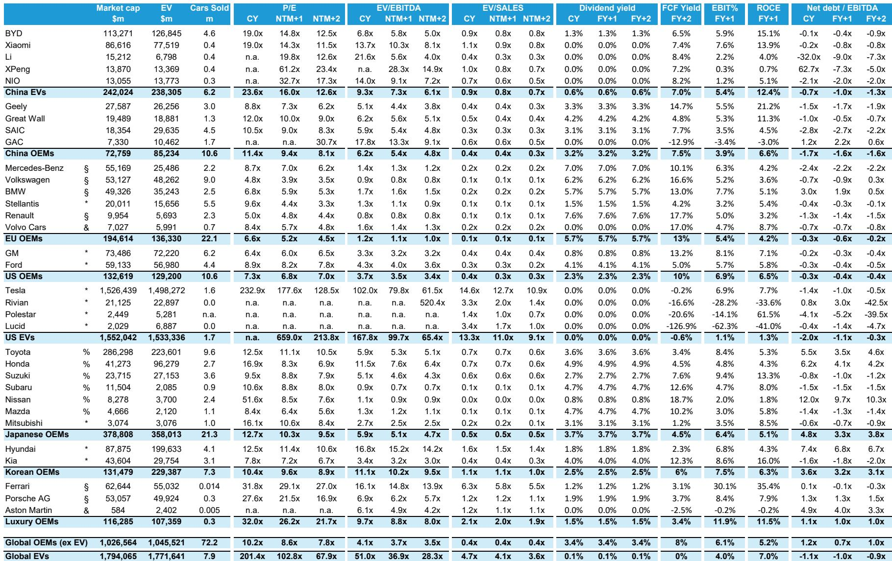
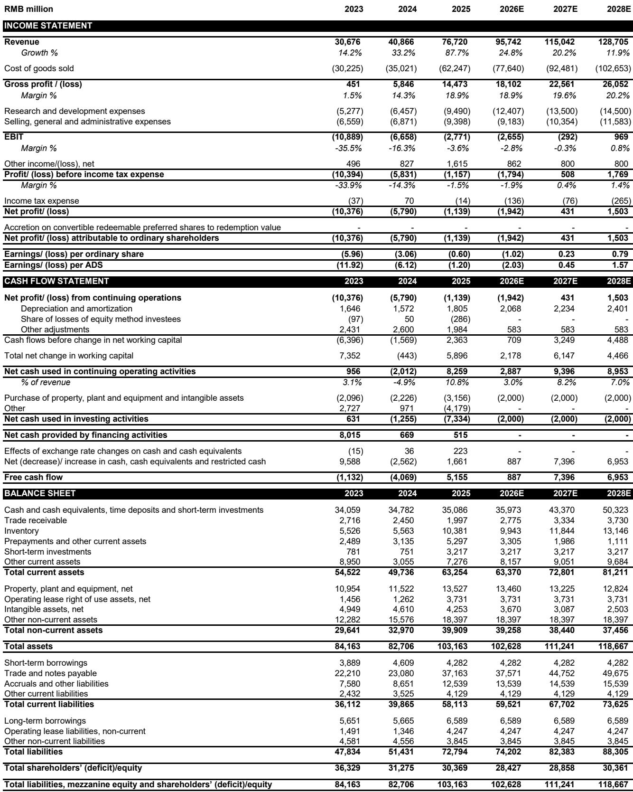
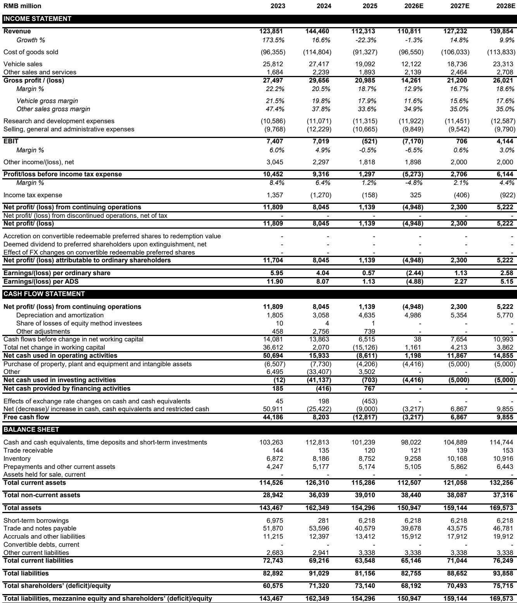

# China’s Auto Market Is Not Slowing Down—It’s Shifting Into a New Structural Reality That Demands a Different Investment Playbook

The headline numbers from May 2026 look alarming. Domestic retail sales in China fell 20% year-over-year. The seasonally adjusted annualized selling rate dropped to 19.2 million units, well below what most analysts consider normalized demand of roughly 22 million. A casual observer would conclude that China’s automotive market is in trouble. That conclusion would be correct only if you ignore what is actually happening beneath the surface.

The real story is not about demand collapsing. It is about demand being fundamentally reshaped by three forces that will define the next phase of the industry: the hangover from pulled-forward subsidy demand, the irreversible migration of consumer preference toward electric vehicles, and the growing strategic importance of exports as a profit buffer. Each of these forces carries different implications for different players. The market is not shrinking uniformly. It is fragmenting into winners and losers at a pace that many investors have not yet fully priced in.

The May data, parsed carefully, reveals a pattern that is more instructive than any single monthly print. EV penetration held steady at 61%, even as total EV sales declined modestly. That seeming contradiction is explained by the collapse in ICE demand, which fell nearly 36% year-over-year. The market is not just transitioning to EVs. It is actively abandoning internal combustion. The question for investors is no longer whether the transition will happen. It is which companies will survive the transition with margins intact.

This report argues that the current weakness is a buying opportunity for select names, a warning signal for others, and a strategic inflection point for the entire sector. The next twelve months will separate the companies that have the product cycle, cost structure, and export capability to navigate a low-growth domestic environment from those that do not. The May data provides the clearest lens yet for making that distinction.

## The Post-Subsidy Hangover Is Worse Than Expected, But It Is Also Temporary, and It Masks a More Important Structural Shift

The 20% year-over-year decline in domestic retail sales is the most visible data point in the May report, and it demands a clear interpretation. This is not a demand problem in the classical sense. It is a base-effect problem amplified by a policy-driven demand pull-forward that is now unwinding. The report estimates that subsidy programs in 2024 and 2025 pulled forward over 5 million units of demand. That is a staggering number. It means that roughly one in every four vehicles sold in those two years was borrowed from future demand.

When you pull demand forward, you create a vacuum in the periods that follow. That vacuum is now showing up in the data. The May SAAR of 19.2 million is 2.8 million units below the estimated normalized demand of 22 million. That gap will not persist indefinitely. As the base effect normalizes toward the end of 2026, the year-over-year comparisons will improve. The report explicitly notes that demand is likely to remain weak until at least November or December. That timeline is consistent with the math of the pull-forward.

But here is where the story gets more interesting, and more strategic. The weakness in total demand is not evenly distributed. It is overwhelmingly concentrated in ICE vehicles. Premium brand sales fell 13.5% year-over-year. Mass market brand cars plunged 21.1%. In both cases, the decline is driven by the same high comparison base and subsidy hangover. But the ICE decline is structural, not cyclical. Consumers who bought subsidized ICE vehicles in 2024 and 2025 are not going to return to ICE when the base effect normalizes. They are either out of the market for several years or, more likely, they will be replaced by first-time buyers who will overwhelmingly choose EVs.

This is the critical insight that the headline numbers obscure. The domestic market is not losing 20% of its volume permanently. It is losing ICE volume permanently and replacing it with EV volume at a slower pace than the optimists hoped. The EV penetration rate of 61% is impressive, but it masks the fact that EV sales themselves declined 5.1% year-over-year. That decline is not a sign of EV fatigue. It is a sign that the absolute number of EV buyers is temporarily constrained by the same subsidy hangover that is crushing ICE. When the base effect normalizes, EV sales will resume growth from a higher penetration base.

The implication for investors is clear. Do not extrapolate the May weakness into a long-term bearish thesis on Chinese auto demand. The structural story remains intact. The cyclical headwind is real, but it is finite. The companies that are best positioned to benefit from the resumption of demand are those that have the product lineup, cost advantage, and brand strength to capture the EV buyer when the cycle turns.

## Export Growth Is Not a Diversion—It Is the Single Most Important Profit Driver for Chinese Automakers in 2026 and 2027

The export data in the May report is extraordinary and deserves more attention than it typically receives. Exports grew 73% year-over-year in May. ICE exports rose 38%. EV exports surged 119%. Exports now account for 35.9% of total passenger vehicle wholesale volumes. That is up from roughly 20% a year ago. The growth trajectory is accelerating, not decelerating.

This is not a marginal story. It is a fundamental reshaping of the Chinese auto industry’s business model. Domestic demand is weak and will remain weak for the next six months. Exports are filling the gap. But more importantly, exports are changing the profit equation for the companies that can execute on international expansion.

Consider the composition of export volumes. BEV and PHEV exports now contribute approximately 55% of total export volume. That means Chinese automakers are not just exporting cheap ICE vehicles to emerging markets. They are exporting their most technologically advanced, highest-margin products to markets that are themselves transitioning to EVs. The report highlights Chery, BYD, and Geely as the export leaders. Chery grew exports 79% year-over-year. BYD grew 85%. Geely grew 180%. These are not incremental gains. They are exponential growth rates that reflect genuine product competitiveness and expanding distribution networks.

The strategic implication is profound. For the first time, Chinese automakers have a genuine second source of demand that can offset domestic weakness. This is not the same as the export story of the 2010s, when Chinese brands sold low-margin vehicles to price-sensitive markets in Africa and the Middle East. The current export wave is driven by EVs that are competitive on technology, performance, and price in developed markets. The report notes that global EV sales are recovering, led by new markets. Chinese automakers are the primary beneficiaries of that recovery.

For investors, the export story creates a clear framework for stock selection. Companies that have both the product quality and the distribution capability to capture export growth will see their earnings supported even if domestic demand remains soft. Companies that are domestically focused will face margin pressure. The report’s ratings reflect this distinction. BYD and Geely, both of which have strong export momentum, are rated Outperform. Li Auto and XPeng, which are more domestically focused and face competitive pressure, are rated Market-Perform.

## The EV Penetrate-and-Hold Story Is Real, But the Battle Has Shifted from Volume to Margin, and That Is Where the Divergence Will Be Most Pronounced

EV penetration in China has stabilized at around 61%. That is a remarkable achievement. It means that nearly two out of every three new vehicles sold in the world’s largest auto market are now electrified. But the easy gains are behind the industry. The early adopters have been captured. The remaining 39% of the market is composed of consumers who are more price-sensitive, more brand-loyal to ICE, or more hesitant about EV infrastructure and resale value.

The report notes that EV sales declined 5.1% year-over-year in May. That decline is driven by PHEVs, which fell 25.4%, while BEVs actually rose 8.3%. This divergence is worth examining. PHEV demand was artificially inflated by the subsidy programs because PHEVs offered the best of both worlds: electric driving for daily commutes and ICE range for longer trips. As subsidies have been reduced and purchase tax on EVs has been raised to 5% from nil, the value proposition of PHEVs has weakened. BEVs, by contrast, continue to benefit from improving battery technology, falling costs, and a wider range of compelling new models.

The report highlights that new EV models are offering stronger pricing and product competitiveness. This is the key competitive dynamic to watch. The EV market in China is no longer a growth market in the traditional sense. It is a replacement market. The total number of vehicles sold is declining, but the EV share is rising. That means every EV sale is a direct loss of an ICE sale. The competition is not between EVs and other modes of transport. It is between EV brands for the shrinking pool of new car buyers.

In this environment, volume is not the right metric. Market share within the EV segment matters, but margin is what will determine long-term survival. The report’s price target adjustments for XPeng and Li Auto are instructive. Both companies have strong product offerings and credible technology. XPeng is recognized for its autonomous driving capabilities and progress in robotaxis and humanoids. Li Auto has a successful EREV lineup and is expanding globally. Yet the report lowered price targets for both, citing weaker earnings visibility, competitive pressure, and rising investment requirements.

The message is clear. Having a good product is no longer enough. The market is entering a phase where cost structure, scale, and the ability to generate positive unit economics will separate the winners from the survivors. BYD, with its vertical integration and massive scale, is the clear leader. Xiaomi, with its ecosystem and brand, is also well positioned. The others face a more uncertain path.

## The Report Does Not Fully Answer How Chinese EV Makers Will Fund the AI and Autonomy Investment Cycle While Domestic Margins Are Under Pressure

One of the most important strategic questions raised by the report is left largely unanswered, and it deserves careful consideration. The report acknowledges XPeng’s strong autonomous driving capabilities and meaningful progress in robotaxis and humanoids. It also notes that near-term monetization of these investments remains limited. The same tension applies across the sector. Every Chinese EV maker is investing heavily in autonomous driving technology, AI capabilities, and smart cockpit features. These investments are necessary for long-term competitiveness, but they are also a significant drag on near-term profitability.

The report’s valuation methodology for XPeng provides a window into how the market is thinking about this tradeoff. The price target was lowered in part because of weaker earnings visibility amid elevated AI investments. The EV/sales multiple was reduced from 1.0x to 0.8x. That multiple compression reflects the market’s skepticism that these investments will generate near-term returns.

But the question that the report does not fully address is whether these investments are optional or mandatory. If every major player is investing in autonomy and AI, then no single player gains a competitive advantage from doing so. The investments become a cost of staying in the game, not a source of differentiation. The risk is that the industry collectively overspends on technology that consumers are not yet willing to pay for, compressing margins across the board.

The counterargument, which the report hints at but does not develop, is that the companies that successfully commercialize autonomy first will capture disproportionate market share and pricing power. The robotaxi opportunity alone could be transformative. But the timeline for that commercialization is uncertain, and the capital requirements in the interim are substantial. Investors need to decide whether they are willing to fund a multiyear investment cycle with uncertain returns. The report’s ratings suggest that the market is willing to do so for BYD and Xiaomi, but not for XPeng, Li Auto, or NIO.

## A Decision Framework for Investors: Three Questions to Determine Which Chinese Auto Stocks Deserve a Premium

The May data and the report’s analysis provide the raw material for a decision framework that investors can use to evaluate Chinese auto stocks over the next 12 to 18 months. The framework consists of three questions, each of which maps to a different dimension of competitive advantage.

First, does the company have a product cycle that can sustain volume growth in a weak domestic market? The answer to this question determines whether the company can maintain market share and generate the scale needed to spread fixed costs. The report highlights the MONA brand for XPeng as a positive factor. The M03 sedan has shown resilient volumes, and the upcoming L03 and L05 SUVs should refresh the lineup. For Li Auto, the new-generation L-series EREVs are positive, but the competitive intensity is high. For BYD and Geely, the product cycle is strong across multiple segments.

Second, does the company have an export strategy that can meaningfully offset domestic weakness? This is the most important question in the current environment. The report shows that exports are growing at 73% year-over-year and now represent 36% of wholesale volumes. Companies that are leaders in export markets will have a significant earnings advantage. BYD, Geely, and Chery are the clear leaders. Li Auto and XPeng are earlier in their export journeys and face higher execution risk.

Third, does the company have the cost structure and balance sheet to fund the AI and autonomy investment cycle without diluting shareholders or taking on excessive debt? This question separates the haves from the have-nots. BYD has the scale and vertical integration to generate strong cash flow. Xiaomi has the ecosystem and brand to cross-subsidize its auto business. Li Auto and XPeng are more dependent on capital markets and face higher financial risk. The report’s price target reductions for both names reflect this concern.

Investors who can answer these three questions for each company in their portfolio will have a clear framework for allocating capital. The companies that score highly on all three dimensions deserve a valuation premium. The companies that score poorly on even one dimension carry significant downside risk.

## The Full Report Contains the Charts and Data You Need to Make These Judgments for Yourself

The analysis in this article is based on a close reading of the May 2026 Chinese auto report, but it is necessarily selective. The full report contains detailed monthly sales trackers for wholesale and retail volumes, a comprehensive global auto comps sheet with valuation multiples across Chinese, European, US, and EV-specific manufacturers, and specific price target changes and estimate revisions for XPeng and Li Auto. The charts that accompany the report provide visual context for the trends discussed here, including the trajectory of EV penetration, the collapse in ICE demand, and the explosive growth in exports.

The report also includes the full ticker table with ratings, price targets, and earnings estimates for every major Chinese automaker. Understanding how the analysts arrived at their ratings requires examining the underlying assumptions about volume, margin, and investment spending. The full report provides that detail.

For serious investors who want to make informed decisions about the Chinese auto sector, the original charts and data are essential. The trends discussed in this article are directional. The numbers in the full report are specific and actionable.

Join the community to read the full report and review the original charts.

*This article is for learning and discussion only and does not constitute investment advice.*

Personal reading notes and learning share only. Not investment advice.

