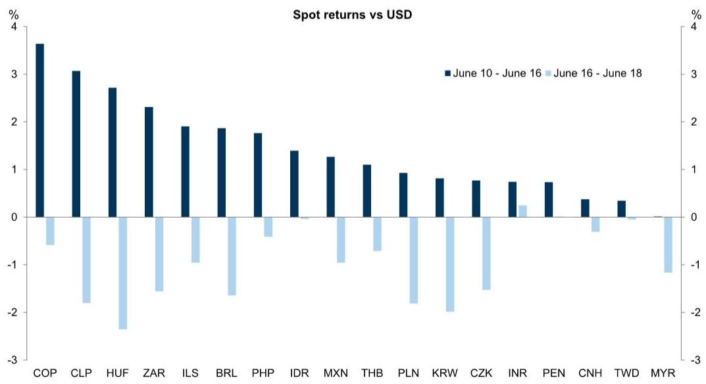
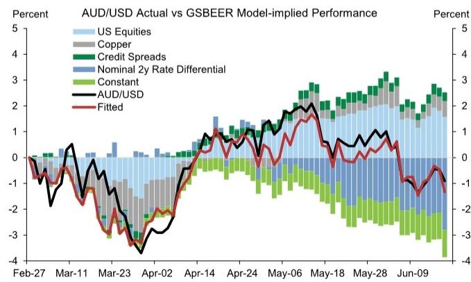
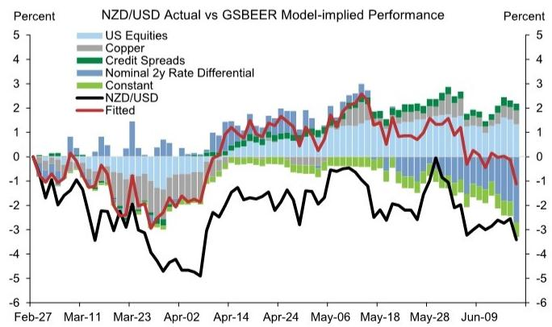
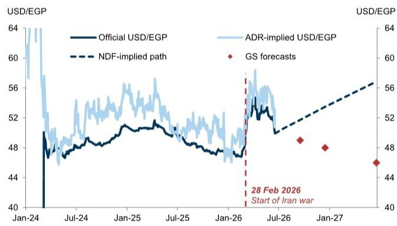
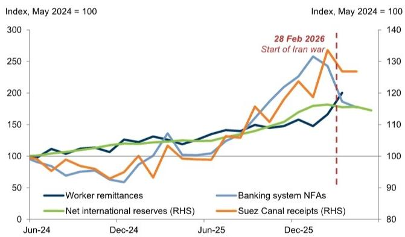

GLOBAL FX TRADER

# From Energy Relief to New Fed Chief

## Our thoughts on USD, EM Carry, JPY, CHF, AUD & NZD and EGP

USD: Something new and some things we’re used to. This FOMC meeting was very different from the last one, and from what was expected. We think, on net, the more hawkish FOMC stance matters more than the US-Iran MOU for the near-term Dollar outlook because it comes as a bigger surprise (after all, there has always been a baseline that the Conflict would come to a resolution at some point, and markets never priced a significant amount of stress), and because rate differentials have a larger and more consistent correlation with the Dollar than oil prices. So unless the Fed’s more hawkish stance proves fleeting as oil prices move lower, we see this as replacing one positive Dollar factor with another, more powerful one. And in this context we think it is worth noting that, while oil prices were the initial catalyst for FOMC participants to begin their reassessment, strong AI-led US demand has been a major factor behind higher growth, inflation and pricing for the neutral rate since the start of the year. This degree of Fed support is new, but comes in part from factors that we believe have been helping Dollar demand for some time. This can create some indigestion for procyclical carry trades, but typically bear flattening puts most of the pressure on lower yielding currencies. Finally, it is worth noting that the message delivery was very different to what we have come to expect from the FOMC, but from an FX perspective we have seen a number of iterations of global central banks that have offered less transparency and a greater tendency to surprise. It can lead to higher volatility on the day of policy decisions. This could be more disruptive for the Fed given the Dollar’s global role, which is a key reason why the Fed has generally tried to limit hawkish policy surprises even in times when it was providing less policy guidance. If communication about future policy decisions will be more limited on meeting days, it should transfer the volatility to both data releases and other forms of communication like policy speeches. That said, we expect that the less-centralized format of the FOMC will lead to less of a “regime shift” around both speeches and what data will drive policy decisions compared to some leadership transitions at other central banks.

EM Carry: From trade tailwinds to hike headwinds. EM currencies have been on a round-trip over the last week, initially rallying on a conflict resolution but then depreciating following the more hawkish-than-expected FOMC (Exhibit 1). There is some correlation between the relative outperformance and subsequent

## Kamakshya Trivedi

+44(20)7051-4005

kamakshya.trivedi@gs.com

GS International

## Michael Cahill

+44(20)7552-8314

michael.e.cahill@gs.com

GS International

## Danny Suwanapruti

+65-6889-1987

danny.suwanapruti@gs.com

GS (Singapore) Pte

## Teresa Alves

+44(20)7051-7566

teresa.alves@gs.com

GS International

## Karen Reichgott Fishman

+1(212)855-6006

karen.fishman@gs.com

GS & Co. LLC

## Stuart Jenkins

+44(20)7051-4700

stuart.jenkins@gs.com

GS International

## Victor Engel

+44(20)7051-3862

victor.engel@gs.com

GS International

## Lexi Kanter

+1(212)855-9701

alexandra.kanter@gs.com

GS & Co. LLC

underperformance, but notably lower-yielding currencies such as KRW, CZK and MYR have depreciated by more than they had appreciated on the resolution. We think this is consistent with the typical implications of a front-end-led US rates repricing, which is more negative for lower-yielding currencies. In this context, we think carry strategies can continue to deliver positive total returns even as the Fed path reprices further, as long as risk remains supported. However, the choice of funder becomes even more important in this setup: as we have shown before, in an ‘equities up, rates down’ regime, USD-funding typically outperforms, but in an ‘equities up, rates up’ backdrop, low-yielding funders like EUR or JPY help deliver positive spot returns (and higher total returns). Within EM, currencies like CLP and ILS can help neutralise the risk exposure and USD beta of carry baskets without a decline in carry returns. And, looking back, this divergence in high- vs. low-yielding currencies was a key feature of the 2021-2023 hiking cycles. One noteworthy feature of yesterday’s price action was the relative outperformance of MXN, consistent with its broad Dollar beta. We have argued for including the Peso in a diversified carry basket given its sensitivity to US-specific cyclical pricing, and we think this is increasingly a stronger proposition if US relative outperformance remains in focus. The upcoming USMCA discussions are the main risk to this MXN outperformance view, but we have argued that this should be a more important driver for CAD than MXN. Elsewhere in LatAm, we think it makes sense to rotate some BRL length into COP if Colombian local developments remain supportive after the second round this weekend, whereas in Brazil, we expect rising political noise ahead of the October elections to lead to a deterioration of carry-to-vol ratios. And, to the extent that a hawkish COPOM has been an anchor of BRL stability, a more dovish delivery this week raises the risks of less central bank support into a noisier period.

Exhibit 1: EM currencies have been on a round-trip over the last week, initially rallying on a conflict resolution but then depreciating following the more hawkish-than-expected FOMC  

bar chart

Spot returns vs USD
| Currency | June 10 - June 16 (%) | June 16 - June 18 (%) |
| :--- | :--- | :--- |
| COP | 3.6 | -0.5 |
| CLP | 3.05 | -1.7 |
| HUF | 2.7 | -2.4 |
| ZAR | 2.3 | -1.5 |
| ILS | 1.9 | -0.9 |
| BRL | 1.85 | -1.6 |
| PHP | 1.75 | -0.4 |
| IDR | 1.35 | -0.05 |
| MXN | 1.25 | -0.9 |
| THB | 1.05 | -0.6 |
| PLN | 0.9 | -1.8 |
| KRW | 0.8 | -2.0 |
| CZK | 0.75 | -1.5 |
| INR | 0.7 | 0.25 |
| PEN | 0.7 | -0.05 |
| CNH | 0.35 | -0.3 |
| TWD | 0.3 | -0.05 |
| MYR | 0.0 | -1.2 |

Source: Bloomberg, GS Global Investment Research

JPY: Grinding weaker. The BoJ hiked rates at its June meeting and continued to signal additional hikes, but the pace remains too slow to offset broader JPY-negative fundamentals. Higher odds of more imminent Fed hikes have now added further upward pressure to USD/JPY. The Yen tends to weaken less versus the Dollar than most other currencies in a hawkish policy shock given the offsetting impulses of higher yields and weaker equities. But our GSBEER model suggests that the Yen still outperformed by roughly 15bp what fundamentals would have implied. That said, it underperformed the subsequent day—consistent with the diminishing effect from elevated intervention risk over the past month and likely in part due to the lack of policy response above 160 (Exhibit 2). The potential for additional operations still leaves outright USD/JPY longs less attractive though, despite the broader backdrop arguing for a weaker Yen. For that reason, we have preferred being short JPY against high-carry EM currencies. We continue to see the risks as skewed to the upside in USD/JPY as the incoming US data have remained resilient, the odds of Fed hikes have gone up, and domestic fiscal risks remain. A sharp reversal lower would likely require a rise in recession risk or shift towards a more hawkish BoJ, both of which continue to feel less imminent.

Exhibit 2: As macro fundamentals continue to justify a weaker Yen the impact of intervention risk has diminished  

line chart

| Date     | USD/JPY Actual | USD/JPY GSBEER Model Implied |
|----------|----------------|------------------------------|
| 01-Apr   | 0.0            | 0.0                          |
| 08-Apr   | 0.6            | 0.2                          |
| 15-Apr   | 0.3            | -0.2                         |
| 22-Apr   | 0.5            | 0.1                          |
| 29-Apr   | 1.0            | 1.0                          |
| 06-May   | -1.5           | 0.5                          |
| 13-May   | -0.5           | 1.5                          |
| 20-May   | 0.2            | 2.5                          |
| 27-May   | 0.4            | 1.8                          |
| 03-Jun   | 0.8            | 1.6                          |
| 10-Jun   | 1.1            | 1.4                          |
| 17-Jun   | 1.3            | 1.5                          |

Source: GS FICC and Equities, Bloomberg, GS Global Investment Research

CHF: A tweak too weak. The SNB remained on hold for a fifth consecutive meeting this week, in line with our economists' forecast and consensus expectations. We noted that we would be focused on the meeting statement for any incremental shift towards a more neutral currency stance though it was likely too soon to remove the CHF weaker bias completely given the still-low level of inflation. The SNB did soften its intervention bias slightly, adding "if necessary" to the previous language that it has an increased willingness to intervene to counter CHF appreciation. However, as we had outlined, this marginal change is likely insufficient to provide any tailwind to the Franc. In a backdrop where many other central banks are hiking or considering hikes, a firmly on hold stance puts the SNB on the dovish end of the central bank spectrum and this dovish divergence should weigh on currency performance. In fact, Chair Schlegel noted that interest rate differentials to other major central banks had widened and were exerting downward pressure on the Franc. We agree and think the language change will prove mostly symbolic as it is not enough to shift this dynamic and expect continued CHF underperformance in the near term.

AUD & NZD: New headwinds. The RBA unanimously voted to remain on-hold at the June meeting and maintained a tightening bias in the statement. Focus remained on upside risks to inflation while the recent string of softer activity and labor market data was somewhat discounted. Governor Bullock argued that slower growth should not be alarming and is necessary to lower inflation, but left the timing of any further tightening data-dependent, noting that “if inflation doesn’t respond in the way we expect it to, we might have to do more.” Our economists note that the RBA’s latest projections were calibrated on one additional hike in this cycle, and they maintain their call for a final 25bp hike in August. The deterioration in recent Australian macro data and an RBA nearing the peak of its cycle stand in contrast to New Zealand. There, data has improved, including the recent GDP print which showed an encouraging economic recovery prior to the energy shock and more hikes are priced for the RBNZ this year than for any other G10 central bank. Relative domestic conditions pushing in the same direction as a relaxation in energy prices is key to our view that AUDNZD should trend lower in the more medium term. But AUDUSD has moved more in line with fundamentals recently (Exhibit 3) while NZDUSD looks to have more room for catch up (Exhibit 4), making NZD longs vs the Dollar look more tactically attractive on de-escalation in our view. That said, NZD is typically an underperformer in a hawkish policy shock backdrop that sees equities move lower alongside higher yields, and yesterday’s FOMC meeting introduced a new headwind to any NZD outperformance.

Exhibit 3: AUDUSD has moved more in line with fundamentals recently...  

line chart

| Date    | US Equities | Copper | Credit Spreads | Nominal 2y Rate Differential | Constant | AUD/USD | Fitted |
|---------|-------------|--------|----------------|------------------------------|----------|---------|--------|
| Feb-27  | ~0.5        | ~0.3   | ~0.1           | ~0.2                         | ~0.1     | ~0.0    | ~0.0   |
| Mar-11  | ~0.8        | ~0.6   | ~0.3           | ~0.4                         | ~0.2     | ~-0.5   | ~-0.5  |
| Mar-23  | ~0.2        | ~0.1   | ~-0.5          | ~0.0                         | ~-0.5    | ~-1.5   | ~-1.5  |
| Apr-02  | ~-0.5       | ~-0.8  | ~-1.0          | ~-0.8                        | ~-1.0    | ~-2.5   | ~-2.5  |
| Apr-14  | ~0.5        | ~0.3   | ~0.2           | ~0.4                         | ~0.1     | ~0.8    | ~0.8   |
| Apr-24  | ~1.0        | ~0.8   | ~0.6           | ~0.7                         | ~0.3     | ~1.2    | ~1.2   |
| May-06  | ~1.5        | ~1.2   | ~1.0           | ~1.1                         | ~0.5     | ~1.8    | ~1.8   |
| May-18  | ~1.8        | ~1.5   | ~1.3           | ~1.4                         | ~0.7     | ~2.0    | ~2.0   |
| May-28  | ~2.0        | ~1.8   | ~1.5           | ~1.6                         | ~0.9     | ~2.2    | ~2.2   |
| Jun-09  | ~2.2        | ~2.0   | ~1.7           | ~1.8                         | ~1.1     | ~2.5    | ~2.5   |

Source: GS FICC and Equities, GS Global Investment Research

Exhibit 4: ...while NZDUSD looks to have more room for catch up  

line chart

| Date    | US Equities | Copper | Credit Spreads | Nominal 2y Rate Differential | Constant | NZD/USD | Fitted |
|---------|-------------|--------|----------------|------------------------------|----------|---------|--------|
| Feb-27  | -0.5        | -0.3   | -0.2           | -0.1                         | -0.4     | -0.6    | -0.7   |
| Mar-11  | 0.2         | 0.1    | 0.3            | 0.2                          | 0.0      | -0.8    | -0.9   |
| Mar-23  | 0.5         | 0.4    | 0.6            | 0.5                          | 0.2      | -1.2    | -1.3   |
| Apr-02  | 0.8         | 0.7    | 0.9            | 0.8                          | 0.4      | -1.5    | -1.6   |
| Apr-14  | 1.2         | 1.1    | 1.3            | 1.2                          | 0.6      | -1.8    | -1.9   |
| Apr-24  | 1.5         | 1.4    | 1.6            | 1.5                          | 0.8      | -2.0    | -2.1   |
| May-06  | 1.8         | 1.7    | 1.9            | 1.8                          | 1.0      | -2.2    | -2.3   |
| May-18  | 2.0         | 1.9    | 2.1            | 2.0                          | 1.2      | -2.4    | -2.5   |
| May-28  | 2.2         | 2.1    | 2.3            | 2.2                          | 1.4      | -2.6    | -2.7   |
| Jun-09  | 2.5         | 2.4    | 2.6            | 2.5                          | 1.6      | -2.8    | -2.9   |

Source: GS FICC and Equities, GS Global Investment Research

■ EGP: More upside, but more gradually from here. We stepped back into a long Egyptian Pound (EGP) view after the ceasefire announcement in April given limited retracement and still solid fundamentals for a carry trade. In anticipation of an Iran-US deal earlier this week, EGP had partly retraced its war-related weakening, falling from \~52 to \~50 against the Dollar, i.e. more than 3%, in two sessions, albeit moving back a touch post the hawkish Fed. We remain constructive on EGP in the medium term, and reflecting this, we have introduced USD/EGP forecasts for a gradual appreciation, at 49/48/46 in 3/6/12 months (Exhibit 5). We see three reasons justifying further appreciation from here. First, even with the recent appreciation, EGP has only partly retraced its weakening since the war began, which was one of the largest on a volatility-adjusted basis in the EM and Frontier FX space. Second, despite the recent strengthening, EGP is still significantly undervalued according to our GSDEER and REER metrics. And third, in a good, but not great, macro backdrop for EM carry, Egypt's fundamentals and carry levels justify further increases in foreign positioning in local markets, supporting spot returns. The major risks to our view stem from a sustained hawkish pivot from the Fed and renewed focus on deep-tail growth and geopolitical risks. But we think the likelihood of a more front-footed rate hiking response to higher inflation and the resilience of external fundamentals (Exhibit 6) through the shock can limit spot volatility in such a scenario. Further, a high level of carry, particularly in local debt instruments, can amplify spot returns in the current benign environment and support total returns in a ‘muddle through’ scenario in which spot returns remain contained but tail-risk probabilities compress further, and we have extended the total return target of our short USD/EGP trade recommendation.

Exhibit 5: We forecast a gradual appreciation in EGP against the Dollar, and therefore see it outperforming forwards over the medium term  

line chart

| Date       | Official USD/EGP | ADR-implied USD/EGP | NDF-implied path | GS forecasts |
| ---------- | ---------------- | ------------------- | ---------------- | ------------ |
| 28 Feb 2026| -                | -                   | -                | 48           |
| Jan-27     | -                | -                   | -                | 48           |

Source: Bloomberg, GS Global Investment Research

Exhibit 6: Key measures of Egypt's external fundamentals have remained strong despite the Iran war  

line chart

| Date       | Worker remittances | Banking system NFAs | Net international reserves (RHS) | Suez Canal receipts (RHS) |
| ---------- | ------------------ | ------------------- | --------------------------------- | ------------------------- |
| Jun-24     | 100                | 100                 | 100                               | 100                       |
| Dec-24     | 120                | 130                 | 110                               | 90                        |
| Jun-25     | 140                | 150                 | 120                               | 110                       |
| Dec-25     | 160                | 250                 | 170                               | 130                       |
| May 2024   | 180                | 260                 | 170                               | 130                       |

Source: Haver Analytics, GS Global Investment Research

Global FX Forecasts

<table><tr><td rowspan="2"></td><td rowspan="2">Current Spot</td><td colspan="2">3-Month Horizon</td><td colspan="2">6-Month Horizon</td><td colspan="2">12-Month Horizon</td></tr><tr><td>Forward</td><td>Forecast</td><td>Forward</td><td>Forecast</td><td>Forward</td><td>Forecast</td></tr><tr><td colspan="8">G10</td></tr><tr><td>EUR/$</td><td>1.15</td><td>1.15</td><td>1.14</td><td>1.16</td><td>1.18</td><td>1.17</td><td>1.20</td></tr><tr><td>£/$</td><td>1.33</td><td>1.33</td><td>1.33</td><td>1.33</td><td>1.34</td><td>1.33</td><td>1.33</td></tr><tr><td>AUD/$</td><td>0.70</td><td>0.70</td><td>0.72</td><td>0.70</td><td>0.73</td><td>0.70</td><td>0.74</td></tr><tr><td>NZD/$</td><td>0.58</td><td>0.58</td><td>0.60</td><td>0.58</td><td>0.61</td><td>0.58</td><td>0.62</td></tr><tr><td>$/CAD</td><td>1.41</td><td>1.40</td><td>1.40</td><td>1.40</td><td>1.38</td><td>1.39</td><td>1.38</td></tr><tr><td>$/CHF</td><td>0.80</td><td>0.79</td><td>0.80</td><td>0.78</td><td>0.76</td><td>0.77</td><td>0.73</td></tr><tr><td>$/NOK</td><td>9.62</td><td>9.63</td><td>9.30</td><td>9.64</td><td>8.98</td><td>9.66</td><td>8.75</td></tr><tr><td>$/SEK</td><td>9.51</td><td>9.46</td><td>9.65</td><td>9.42</td><td>9.15</td><td>9.32</td><td>8.75</td></tr><tr><td>$/JPY</td><td>161</td><td>159</td><td>160</td><td>158</td><td>158</td><td>156</td><td>155</td></tr><tr><td colspan="8">EMEA</td></tr><tr><td>$/CZK</td><td>21.0</td><td>21.0</td><td>21.5</td><td>21.0</td><td>20.7</td><td>20.9</td><td>20.2</td></tr><tr><td>$/HUF</td><td>305</td><td>306</td><td>311</td><td>307</td><td>297</td><td>308</td><td>288</td></tr><tr><td>$/PLN</td><td>3.69</td><td>3.69</td><td>3.77</td><td>3.69</td><td>3.60</td><td>3.69</td><td>3.54</td></tr><tr><td>$/RON</td><td>4.55</td><td>4.57</td><td>4.52</td><td>4.60</td><td>4.39</td><td>4.64</td><td>4.38</td></tr><tr><td>$/RUB</td><td>75.18</td><td>75.18</td><td>80.0</td><td>77.33</td><td>85.0</td><td>81.23</td><td>90.0</td></tr><tr><td>$/UAH</td><td>44.8</td><td>46.0</td><td>44.0</td><td>47.3</td><td>46.0</td><td>50.0</td><td>48.0</td></tr><tr><td>$/TRY</td><td>46.38</td><td>50.04</td><td>48.0</td><td>54.12</td><td>50.0</td><td>63.28</td><td>54.0</td></tr><tr><td>$/ILS</td><td>2.95</td><td>2.95</td><td>3.00</td><td>2.94</td><td>3.05</td><td>2.92</td><td>3.10</td></tr><tr><td>$/EGP</td><td>49.9</td><td>51.7</td><td>49.0</td><td>53.4</td><td>48.0</td><td>56.7</td><td>46.0</td></tr><tr><td>$/ZAR</td><td>16.39</td><td>16.51</td><td>16.50</td><td>16.62</td><td>16.00</td><td>16.84</td><td>15.75</td></tr><tr><td>$/NGN</td><td>1360</td><td>1398</td><td>1325</td><td>1435</td><td>1300</td><td>1507</td><td>1250</td></tr><tr><td colspan="8">Americas</td></tr><tr><td>$/ARS</td><td>1441</td><td>1514</td><td>1500</td><td>1604</td><td>1600</td><td>1795</td><td>1800</td></tr><tr><td>$/BRL</td><td>5.11</td><td>5.23</td><td>4.90</td><td>5.34</td><td>5.00</td><td>5.56</td><td>5.00</td></tr><tr><td>$/MXN</td><td>17.31</td><td>17.44</td><td>17.75</td><td>17.57</td><td>18.00</td><td>17.84</td><td>18.00</td></tr><tr><td>$/CLP</td><td>891</td><td>890</td><td>920</td><td>890</td><td>900</td><td>890</td><td>860</td></tr><tr><td>$/PEN</td><td>3.38</td><td>3.39</td><td>3.40</td><td>3.40</td><td>3.35</td><td>3.43</td><td>3.30</td></tr><tr><td>$/COP</td><td>3444</td><td>3517</td><td>3600</td><td>3594</td><td>3700</td><td>3750</td><td>3750</td></tr><tr><td colspan="8">Asia</td></tr><tr><td>$/CNY</td><td>6.76</td><td>6.72</td><td>6.80</td><td>6.67</td><td>6.70</td><td>6.58</td><td>6.50</td></tr><tr><td>$/HKD</td><td>7.84</td><td>7.81</td><td>7.80</td><td>7.79</td><td>7.80</td><td>7.76</td><td>7.80</td></tr><tr><td>$/INR</td><td>94.53</td><td>95.54</td><td>96.00</td><td>96.24</td><td>96.00</td><td>97.71</td><td>97.00</td></tr><tr><td>$/KRW</td><td>1517</td><td>1511</td><td>1460</td><td>1508</td><td>1440</td><td>1501</td><td>1420</td></tr><tr><td>$/MYR</td><td>4.07</td><td>4.05</td><td>3.90</td><td>4.05</td><td>3.80</td><td>4.02</td><td>3.70</td></tr><tr><td>$/SGD</td><td>1.29</td><td>1.28</td><td>1.28</td><td>1.27</td><td>1.25</td><td>1.26</td><td>1.24</td></tr><tr><td>$/TWD</td><td>31.6</td><td>31.7</td><td>31.5</td><td>31.8</td><td>31.0</td><td>31.8</td><td>30.5</td></tr><tr><td>$/THB</td><td>32.58</td><td>32.53</td><td>34.00</td><td>32.39</td><td>33.50</td><td>32.08</td><td>33.00</td></tr><tr><td>$/IDR</td><td>17738</td><td>17962</td><td>17000</td><td>18079</td><td>17100</td><td>18331</td><td>17200</td></tr><tr><td>$/PHP</td><td>60.39</td><td>60.52</td><td>62.00</td><td>60.73</td><td>61.00</td><td>61.11</td><td>61.00</td></tr><tr><td colspan="8">Euro Crosses</td></tr><tr><td>EUR/GBP</td><td>0.87</td><td>0.87</td><td>0.86</td><td>0.87</td><td>0.88</td><td>0.88</td><td>0.90</td></tr><tr><td>EUR/CHF</td><td>0.92</td><td>0.91</td><td>0.91</td><td>0.91</td><td>0.90</td><td>0.90</td><td>0.88</td></tr><tr><td>EUR/NOK</td><td>11.06</td><td>11.12</td><td>10.60</td><td>11.17</td><td>10.60</td><td>11.28</td><td>10.50</td></tr><tr><td>EUR/SEK</td><td>10.94</td><td>10.93</td><td>11.00</td><td>10.91</td><td>10.80</td><td>10.88</td><td>10.50</td></tr><tr><td>EUR/CZK</td><td>24.15</td><td>24.23</td><td>24.50</td><td>24.30</td><td>24.40</td><td>24.42</td><td>24.20</td></tr><tr><td>EUR/HUF</td><td>351</td><td>354</td><td>355</td><td>356</td><td>350</td><td>359</td><td>345</td></tr><tr><td>EUR/PLN</td><td>4.25</td><td>4.26</td><td>4.30</td><td>4.28</td><td>4.25</td><td>4.31</td><td>4.25</td></tr><tr><td>EUR/RON</td><td>5.23</td><td>5.28</td><td>5.15</td><td>5.33</td><td>5.18</td><td>5.42</td><td>5.25</td></tr><tr><td>EUR/RUB</td><td>86.5</td><td>86.8</td><td>91.2</td><td>89.6</td><td>100.3</td><td>94.8</td><td>108.0</td></tr></table>

See dynamic table here (or click image above): https://publishing.gs.com/content/themes/fx-forecasts.html  
Source: GS Global Investment Research

Return Forecasts & Valuations

<table><tr><td rowspan="3"></td><td rowspan="3">Current Spot</td><td rowspan="2" colspan="4">Forecast: 12-Month Return (%)</td><td colspan="3">GSDEER</td><td colspan="3">GSFEER</td><td rowspan="3">Average Estimate</td><td rowspan="3">PPP*</td></tr><tr><td rowspan="2">Estimate</td><td colspan="2">Misalignment</td><td rowspan="2">Estimate</td><td colspan="2">Misalignment</td></tr><tr><td>Spot</td><td>Carry</td><td>Total</td><td>NEER</td><td>Bilateral</td><td>Trade-Weighted</td><td>Bilateral</td><td>Trade-Weighted</td></tr><tr><td colspan="14">G10</td></tr><tr><td>EUR/$</td><td>1.15</td><td>4.3</td><td>-1.5</td><td>2.8</td><td>2.6</td><td>1.20</td><td>-4%</td><td>8%</td><td>1.15</td><td>0%</td><td>1%</td><td>1.18</td><td>1.52</td></tr><tr><td>GBP/$</td><td>1.33</td><td>0.3</td><td>0.0</td><td>0.3</td><td>-2.4</td><td>1.22</td><td>9%</td><td>23%</td><td>1.27</td><td>5%</td><td>7%</td><td>1.24</td><td>1.50</td></tr><tr><td>AUD/$</td><td>0.70</td><td>5.5</td><td>0.6</td><td>6.1</td><td>1.9</td><td>0.81</td><td>-13%</td><td>9%</td><td>0.69</td><td>1%</td><td>12%</td><td>0.76</td><td>0.70</td></tr><tr><td>NZD/$</td><td>0.58</td><td>7.5</td><td>-1.0</td><td>6.3</td><td>3.9</td><td>0.67</td><td>-13%</td><td>3%</td><td>0.61</td><td>-5%</td><td>2%</td><td>0.64</td><td>0.67</td></tr><tr><td>$/CAD</td><td>1.41</td><td>2.2</td><td>-1.6</td><td>0.5</td><td>1.2</td><td>1.21</td><td>-14%</td><td>-9%</td><td>1.35</td><td>-4%</td><td>-1%</td><td>1.27</td><td>1.17</td></tr><tr><td>$/CHF</td><td>0.80</td><td>9.0</td><td>-4.1</td><td>4.6</td><td>6.4</td><td>0.84</td><td>6%</td><td>15%</td><td>0.810</td><td>1%</td><td>3%</td><td>0.83</td><td>0.92</td></tr><tr><td>$/NOK</td><td>9.62</td><td>9.9</td><td>0.5</td><td>10.5</td><td>6.4</td><td>6.38</td><td>-34%</td><td>-27%</td><td>8.92</td><td>-7%</td><td>-5%</td><td>7.40</td><td>8.87</td></tr><tr><td>$/SEK</td><td>9.51</td><td>8.7</td><td>-2.0</td><td>6.5</td><td>4.6</td><td>7.41</td><td>-22%</td><td>-13%</td><td>9.23</td><td>-3%</td><td>-2%</td><td>8.14</td><td>8.26</td></tr><tr><td>$/JPY</td><td>160.7</td><td>3.6</td><td>-3.0</td><td>0.5</td><td>1.0</td><td>93</td><td>-42%</td><td>-32%</td><td>132</td><td>-18%</td><td>-13%</td><td>109</td><td>93</td></tr><tr><td colspan="14">EMEA</td></tr><tr><td>$/CZK</td><td>21.00</td><td>4.1</td><td>-0.4</td><td>3.7</td><td>0.7</td><td>25.4</td><td>21%</td><td>31%</td><td>21.9</td><td>4%</td><td>4%</td><td>23.98</td><td>15.82</td></tr><tr><td>$/HUF</td><td>305</td><td>6.2</td><td>0.8</td><td>7.0</td><td>2.8</td><td>318</td><td>4%</td><td>12%</td><td>352</td><td>15%</td><td>13%</td><td>332</td><td>261</td></tr><tr><td>$/PLN</td><td>3.69</td><td>4.2</td><td>0.1</td><td>4.3</td><td>1.5</td><td>3.92</td><td>6%</td><td>16%</td><td>3.86</td><td>5%</td><td>4%</td><td>3.89</td><td>2.43</td></tr><tr><td>$/RON</td><td>4.55</td><td>4.0</td><td>1.9</td><td>6.0</td><td>--</td><td>--</td><td>--</td><td>--</td><td>5.41</td><td>19%</td><td>16%</td><td>--</td><td>--</td></tr><tr><td>$/RUB</td><td>75.2</td><td>-16.5</td><td>8.0</td><td>-9.7</td><td>-18.8</td><td>76.80</td><td>2%</td><td>19%</td><td>75.52</td><td>0%</td><td>5%</td><td>76.29</td><td>40.15</td></tr><tr><td>$/UAH</td><td>44.80</td><td>-6.7</td><td>11.6</td><td>4.9</td><td>--</td><td>--</td><td>--</td><td>--</td><td>--</td><td>--</td><td>--</td><td>--</td><td>--</td></tr><tr><td>$/TRY</td><td>46.38</td><td>-14.1</td><td>36.4</td><td>17.2</td><td>-15.4</td><td>32.15</td><td>-31%</td><td>-27%</td><td>47.07</td><td>1%</td><td>2%</td><td>38.12</td><td>29.15</td></tr><tr><td>$/ILS</td><td>2.95</td><td>-4.7</td><td>-1.2</td><td>-5.9</td><td>-6.4</td><td>3.54</td><td>20%</td><td>34%</td><td>3.06</td><td>4%</td><td>7%</td><td>3.35</td><td>4.70</td></tr><tr><td>$/EGP</td><td>49.92</td><td>8.5</td><td>13.6</td><td>22.2</td><td>--</td><td>--</td><td></td><td>--</td><td>--</td><td></td><td>--</td><td>--</td><td>--</td></tr><tr><td>$/ZAR</td><td>16.39</td><td>4.1</td><td>2.8</td><td>6.9</td><td>1.2</td><td>12.97</td><td>-21%</td><td>-12%</td><td>16</td><td>-3%</td><td>0%</td><td>14.12</td><td>18.40</td></tr><tr><td>$/NGN</td><td>1360</td><td>8.8</td><td>10.8</td><td>19.6</td><td>--</td><td>--</td><td>--</td><td>--</td><td>--</td><td>--</td><td>--</td><td>--</td><td>--</td></tr><tr><td colspan="14">Americas</td></tr><tr><td>$/ARS</td><td>1441</td><td>-19.9</td><td>24.5</td><td>4.6</td><td>-21.8</td><td>--</td><td>--</td><td>--</td><td>--</td><td>--</td><td>--</td><td>--</td><td>--</td></tr><tr><td>$/BRL</td><td>5.11</td><td>2.2</td><td>8.8</td><td>11.3</td><td>1.2</td><td>4.22</td><td>-17%</td><td>-3%</td><td>5.31</td><td>4%</td><td>9%</td><td>4.66</td><td>5.28</td></tr><tr><td>$/MXN</td><td>17.31</td><td>-3.9</td><td>3.1</td><td>-0.9</td><td>-5.2</td><td>19.33</td><td>12%</td><td>20%</td><td>17.49</td><td>1%</td><td>3%</td><td>18.59</td><td>20.29</td></tr><tr><td>$/CLP</td><td>891</td><td>3.6</td><td>-0.1</td><td>3.4</td><td>1.9</td><td>673</td><td>-24%</td><td>-11%</td><td>847</td><td>-5%</td><td>0%</td><td>743</td><td>787</td></tr><tr><td>$/PEN</td><td>3.38</td><td>2.4</td><td>1.5</td><td>3.9</td><td>1.0</td><td>2.75</td><td>-19%</td><td>-7%</td><td>2.91</td><td>-14%</td><td>-12%</td><td>2.81</td><td>4.24</td></tr><tr><td>$/COP</td><td>3444</td><td>-8.2</td><td>8.9</td><td>0.0</td><td>-9.2</td><td>3502</td><td>2%</td><td>16%</td><td>3773.4</td><td>10%</td><td>8%</td><td>3610</td><td>3298</td></tr><tr><td colspan="14">Asia</td></tr><tr><td>$/CNY</td><td>6.76</td><td>4.0</td><td>-2.7</td><td>1.3</td><td>1.6</td><td>5.02</td><td>-26%</td><td>-16%</td><td>5.84</td><td>-14%</td><td>-10%</td><td>5.35</td><td>5.82</td></tr><tr><td>$/HKD</td><td>7.84</td><td>0.5</td><td>-0.9</td><td>-0.5</td><td>-3.0</td><td>6.93</td><td>-12%</td><td>10%</td><td>6.64</td><td>-15%</td><td>-7%</td><td>6.81</td><td>5.85</td></tr><tr><td>$/INR</td><td>95</td><td>-2.5</td><td>3.4</td><td>0.7</td><td>-4.7</td><td>85.85</td><td>-9%</td><td>-1%</td><td>89.11</td><td>-6%</td><td>-5%</td><td>87.16</td><td>57.50</td></tr><tr><td>$/KRW</td><td>1517</td><td>6.8</td><td>-1.0</td><td>5.7</td><td>4.4</td><td>1169</td><td>-23%</td><td>-7%</td><td>1159</td><td>-24%</td><td>-23%</td><td>1165</td><td>929</td></tr><tr><td>$/MYR</td><td>4.07</td><td>10.0</td><td>-1.2</td><td>8.7</td><td>6.6</td><td>3.26</td><td>-20%</td><td>-3%</td><td>4.01</td><td>-1%</td><td>6%</td><td>3.56</td><td>1.95</td></tr><tr><td>$/SGD</td><td>1.29</td><td>3.9</td><td>-2.6</td><td>1.2</td><td>0.2</td><td>1.36</td><td>6%</td><td>26%</td><td>1.30</td><td>1%</td><td>7%</td><td>1.34</td><td>0.57</td></tr><tr><td>$/TWD</td><td>31.6</td><td>3.5</td><td>0.8</td><td>4.4</td><td>0.1</td><td>24.87</td><td>-21%</td><td>-2%</td><td>23.81</td><td>-25%</td><td>-20%</td><td>24.45</td><td>13.21</td></tr><tr><td>$/THB</td><td>32.58</td><td>-1.3</td><td>-1.5</td><td>-2.8</td><td>-4.5</td><td>30.99</td><td>-5%</td><td>16%</td><td>33.75</td><td>4%</td><td>9%</td><td>32.10</td><td>18.82</td></tr><tr><td>$/IDR</td><td>17738</td><td>3.1</td><td>3.3</td><td>6.6</td><td>0.0</td><td>14113</td><td>-20%</td><td>-4%</td><td>15918</td><td>-10%</td><td>-6%</td><td>14835</td><td>10885</td></tr><tr><td>$/PHP</td><td>60.39</td><td>-1.0</td><td>1.2</td><td>0.2</td><td>-4.2</td><td>58.94</td><td>-2%</td><td>20%</td><td>62.52</td><td>4%</td><td>12%</td><td>60.37</td><td>52.56</td></tr><tr><td colspan="14">Euro Crosses</td></tr><tr><td>EUR/GBP</td><td>0.87</td><td>-3.9</td><td>1.5</td><td>-2.4</td><td>-2.4</td><td>0.98</td><td>14%</td><td>23%</td><td>0.91</td><td>5%</td><td>7%</td><td>0.95</td><td>1.01</td></tr><tr><td>EUR/CHF</td><td>0.92</td><td>4.5</td><td>-2.6</td><td>1.9</td><td>6.4</td><td>1.01</td><td>10%</td><td>15%</td><td>0.93</td><td>1%</td><td>3%</td><td>0.98</td><td>1.40</td></tr><tr><td>EUR/NOK</td><td>11.06</td><td>5.3</td><td>2.0</td><td>7.3</td><td>6.4</td><td>7.65</td><td>-31%</td><td>-27%</td><td>10.25</td><td>-7%</td><td>-5%</td><td>8.69</td><td>13.46</td></tr><tr><td>EUR/SEK</td><td>10.94</td><td>4.2</td><td>-0.5</td><td>3.7</td><td>4.6</td><td>8.89</td><td>-19%</td><td>-13%</td><td>10.59</td><td>-3%</td><td>-2%</td><td>9.57</td><td>12.54</td></tr><tr><td>EUR/CZK</td><td>24.15</td><td>-0.2</td><td>1.1</td><td>0.9</td><td>0.7</td><td>30.45</td><td>26%</td><td>31%</td><td>25.10</td><td>4%</td><td>4%</td><td>28.31</td><td>24.02</td></tr><tr><td>EUR/HUF</td><td>351</td><td>1.7</td><td>2.3</td><td>4.1</td><td>2.8</td><td>381</td><td>9%</td><td>12%</td><td>405</td><td>15%</td><td>13%</td><td>391</td><td>396</td></tr><tr><td>EUR/PLN</td><td>4.25</td><td>-0.1</td><td>1.6</td><td>1.5</td><td>1.5</td><td>4.70</td><td>11%</td><td>16%</td><td>4.43</td><td>4%</td><td>4%</td><td>4.59</td><td>3.68</td></tr><tr><td>EUR/RON</td><td>5.23</td><td>-0.3</td><td>3.4</td><td>3.1</td><td>--</td><td>--</td><td>--</td><td>--</td><td>6.21</td><td>19%</td><td>16%</td><td>--</td><td>--</td></tr><tr><td>EUR/RUB</td><td>86.5</td><td>-19.9</td><td>9.5</td><td>-10.4</td><td>-18.8</td><td>92.10</td><td>7%</td><td>19%</td><td>86.7</td><td>0%</td><td>5%</td><td>89.9</td><td>--</td></tr><tr><td colspan="14">Addendum</td></tr><tr><td>USD</td><td>--</td><td>-1.9</td><td>-1.8</td><td>-3.5</td><td>-2.5</td><td>--</td><td>--</td><td>16%</td><td>--</td><td>--</td><td>4%</td><td>--</td><td>--</td></tr></table>

See dynamic table here (or click image above): https://publishing.gs.com/content/themes/table.html?criteriaKey=1k2HGqqS2h  
Source: GS Global Investment Research

## Disclosure Appendix

## Reg AC

We, Kamakshya Trivedi, Michael Cahill, Danny Suwanapruti, Teresa Alves, Karen Reichgott Fishman, Stuart Jenkins, Victor Engel and Lexi Kanter, hereby certify that all of the views expressed in this report accurately reflect our personal views, which have not been influenced by considerations of the firm's business or client relationships.

Unless otherwise stated, the individuals listed on the cover page of this report are analysts in GS' Global Investment Research division.

Contributing Authors: Kamakshya Trivedi GS International, Michael Cahill GS International, Danny Suwanapruti GS (Singapore) Pte, Teresa Alves GS International, Karen Reichgott Fishman GS & Co. LLC, Stuart Jenkins GS International, Victor Engel GS International, Lexi Kanter GS & Co. LLC.

Unless otherwise stated, the individuals listed in the Contributing Authors disclosure of this report are analysts in GS' Global Investment Research division.

## Disclosures

## Regulatory disclosures

## Disclosures required by United States laws and regulations

See company-specific regulatory disclosures above for any of the following disclosures required as to companies referred to in this report: manager or co-manager in a pending transaction; $1\%$ or other ownership; compensation for certain services; types of client relationships; managed/co-managed public offerings in prior periods; directorships; for equity securities, market making and/or specialist role. GS trades or may trade as a principal in debt securities (or in related derivatives) of issuers discussed in this report.

The following are additional required disclosures: Ownership and material conflicts of interest: GS policy prohibits its analysts, professionals reporting to analysts and members of their households from owning securities of any company in the analyst's area of coverage. Analyst compensation: Analysts are paid in part based on the profitability of GS, which includes investment banking revenues. Analyst as officer or director: GS policy generally prohibits its analysts, persons reporting to analysts or members of their households from serving as an officer, director or advisor of any company in the analyst's area of coverage. Non-U.S. Analysts: Non-U.S. analysts may not be associated persons of GS & Co. LLC and therefore may not be subject to FINRA Rule 2241 or FINRA Rule 2242 restrictions on communications with a subject company, public appearances and trading in securities covered by the analysts.

## Additional disclosures required under the laws and regulations of jurisdictions other than the United States

The following disclosures are those required by the jurisdiction indicated, except to the extent already made above pursuant to United States laws and regulations. Australia: GS Australia Pty Ltd and its affiliates are not authorised deposit-taking institutions (as that term is defined in the Banking Act 1959 (Cth)) in Australia and do not provide banking services, nor carry on a banking business, in Australia. This research, and any access to it, is intended only for “wholesale clients” within the meaning of the Australian Corporations Act, unless otherwise agreed by GS. In producing research reports, members of Global Investment Research of GS Australia may attend site visits and other meetings hosted by the companies and other entities which are the subject of its research reports. In some instances the costs of such site visits or meetings may be met in part or in whole by the issuers concerned if GS Australia considers it is appropriate and reasonable in the specific circumstances relating to the site visit or meeting. To the extent that the contents of this document contains any financial product advice, it is general advice only and has been prepared by GS without taking into account a client’s objectives, financial situation or needs. A client should, before acting on any such advice, consider the appropriateness of the advice having regard to the client’s own objectives, financial situation and needs. A copy of certain GS Australia and New Zealand disclosure of interests and a copy of GS’ Australian Sell-Side Research Independence Policy Statement are available at: https://www.goldmansachs.com/disclosures/australia-new-zealand/index.html. Brazil: Disclosure information in relation to CVM Resolution n. 20 is available at https://www.gs.com/worldwide/brazil/area/gir/index.html. Where applicable, the Brazil-registered analyst primarily responsible for the content of this research report, as defined in Article 20 of CVM Resolution n. 20, is the first author named at the beginning of this report, unless indicated otherwise at the end of the text. Canada: This information is being provided to you for information purposes only and is not, and under no circumstances should be construed as, an advertisement, offering or solicitation by GS & Co. LLC for purchasers of securities in Canada to trade in any Canadian security. GS & Co. LLC is not registered as a dealer in any jurisdiction in Canada under applicable Canadian securities laws and generally is not permitted to trade in Canadian securities and may be prohibited from selling certain securities and products in certain jurisdictions in Canada. If you wish to trade in any Canadian securities or other products in Canada please contact GS Canada Inc., an affiliate of The GS Group Inc., or another registered Canadian dealer. Hong Kong: Further information on the securities of covered companies referred to in this research may be obtained on request from GS (Asia) L.L.C. India: Further information on the subject company or companies referred to in this research may be obtained from GS (India) Securities Private Limited, Research Analyst – SEBI Registration Number INH000001493, 10th Floor, Ascent-Worli, Sudam Kalu Ahire Marg, Worli, Mumbai-400 025, India, Corporate Identity Number U74140MH2006FTC160634, Phone +91 22 6616 9000, Fax +91 22 6616 9001. GS may beneficially own 1% or more of the securities (as such term is defined in clause 2 (h) the Indian Securities Contracts (Regulation) Act, 1956) of the subject company or companies referred to in this research report. Investment in securities market are subject to market risks. Read all the related documents carefully before investing. Registration granted by SEBI and certification from NISM in no way guarantee performance of the intermediary or provide any assurance of returns to investors. GS (India) Securities Private Limited compliance officer and investor grievance contact details can be found at: https://www.goldmansachs.com/worldwide/india/documents/Grievance-Redressal-and-Escalation-Matrix.pdf, and a copy of the annual audit compliance report can be found at this link: https://publishing.gs.com/content/site/india-annual-compliance-report.html. Japan: See below. Korea: This research, and any access to it, is intended only for “professional investors” within the meaning of the Financial Services and Capital Markets Act, unless otherwise agreed by GS. Further information on the subject company or companies referred to in this research may be obtained from GS (Asia) L.L.C., Seoul Branch. New Zealand: GS New Zealand Limited and its affiliates are neither “registered banks” nor “deposit takers” (as defined in the Reserve Bank of New Zealand Act 1989) in New Zealand. This research, and any access to it, is intended for “wholesale clients” (as defined in the Financial Advisers Act 2008) unless otherwise agreed by GS. A copy of certain GS Australia and New Zealand disclosure of interests is available at: https://www.goldmansachs.com/disclosures/australia-new-zealand/index.html. Russia: Research reports distributed in the Russian Federation are not advertising as defined in the Russian legislation, but are information and analysis not having product promotion as their main purpose and do not provide appraisal within the meaning of the Russian legislation on appraisal activity. Research reports do not constitute a personalized investment recommendation as defined in Russian laws and regulations, are not addressed to a specific client, and are prepared without analyzing the financial circumstances, investment profiles or risk profiles of clients. GS assumes no responsibility for any investment decisions that may be taken by a client or any other person based on this research report. Singapore: GS (Singapore) Pte. (Company Number: 198602165W), which is regulated by the Monetary Authority of Singapore, accepts legal responsibility for this research, and should be contacted with respect to any matters arising from, or in connection with, this research. Taiwan: This material is for reference only and must not be reprinted without permission. Investors should carefully consider their own investment risk. Investment results are the responsibility of the individual investor. United Kingdom: Persons who would be categorized as retail clients in the United Kingdom, as such term is defined in the rules of the Financial Conduct Authority, should read this research in conjunction with prior GS on the covered companies referred to herein and should refer to the risk warnings that have been sent to them by GS International. A copy of these risks warnings, and a glossary of certain financial terms used in this report, are available from GS International on request.

European Union and United Kingdom: Disclosure information in relation to Article 6 (2) of the European Commission Delegated Regulation (EU) (2016/958) supplementing Regulation (EU) No 596/2014 of the European Parliament and of the Council (including as that Delegated Regulation is implemented into United Kingdom domestic law and regulation following the United Kingdom's departure from the European Union and the European Economic Area) with regard to regulatory technical standards for the technical arrangements for objective presentation of investment recommendations or other information recommending or suggesting an investment strategy and for disclosure of particular interests or indications of conflicts of interest is available at https://www.gs.com/disclosures/europeanpolicy.html which states the European Policy for Managing Conflicts of Interest in Connection with Investment Research.

Japan: GS Japan Co., Ltd. is a Financial Instrument Dealer registered with the Kanto Financial Bureau under registration number Kinsho 69, and a member of Japan Securities Dealers Association, Financial Futures Association of Japan Type II Financial Instruments Firms Association, and Investment Management Association of Japan. Sales and purchase of equities are subject to commission pre-determined with clients plus consumption tax. See company-specific disclosures as to any applicable disclosures required by Japanese stock exchanges, the Japanese Securities Dealers Association or the Japanese Securities Finance Company.

## Global product; distributing entities

GS Global Investment Research produces and distributes research products for clients of GS on a global basis. Analysts based in GS offices around the world produce research on industries and companies, and research on macroeconomics, currencies, commodities and portfolio strategy. This research is disseminated in Australia by GS Australia Pty Ltd (ABN 21 006 797 897); in Brazil by GS do Brasil Corretora de Títulos e Valores Mobiliários S.A.; Public Communication Channel GS Brazil: 0800 727 5764 and / or contatogoldmanbrasil@gs.com. Available Weekdays (except holidays), from 9am to 6pm. Canal de Comunicação com o Público GS Brasil: 0800 727 5764 e/ou contatogoldmanbrasil@gs.com. Horário de funcionamento: segunda-feira à sexta-feira (exceto feriados), das 9h às 18h; in Canada by GS & Co. LLC; in Hong Kong by GS (Asia) L.L.C.; in India by GS (India) Securities Private Ltd.; in Japan by GS Japan Co., Ltd.; in the Republic of Korea by GS (Asia) L.L.C., Seoul Branch; in New Zealand by GS New Zealand Limited; in Russia by OOO GS; in Singapore by GS (Singapore) Pte. (Company Number: 198602165W); and in the United States of America by GS & Co. LLC. GS International has approved this research in connection with its distribution in the United Kingdom.

GS International (“GSI”), authorised by the Prudential Regulation Authority (“PRA”) and regulated by the Financial Conduct Authority (“FCA”) and the PRA, has approved this research in connection with its distribution in the United Kingdom.

European Economic Area: GS Bank Europe SE ("GSBE") is a credit institution incorporated in Germany and, within the Single Supervisory Mechanism, subject to direct prudential supervision by the European Central Bank and in other respects supervised by German Federal Financial Supervisory Authority (Bundesanstalt für Finanzdienstleistungsaufsicht, BaFin) and Deutsche Bundesbank and disseminates research within the European Economic Area.

## General disclosures

This research is for our clients only. Other than disclosures relating to GS, this research is based on current public information that we consider reliable, but we do not represent it is accurate or complete, and it should not be relied on as such. The information, opinions, estimates and forecasts contained herein are as of the date hereof and are subject to change without prior notification. We seek to update our research as appropriate, but various regulations may prevent us from doing so. Other than certain industry reports published on a periodic basis, the large majority of reports are published at irregular intervals as appropriate in the analyst's judgment.

GS conducts a global full-service, integrated investment banking, investment management, and brokerage business. We have investment banking and other business relationships with a substantial percentage of the companies covered by Global Investment Research. GS & Co. LLC, the United States broker dealer, is a member of SIPC (https://www.sipc.org).

Our salespeople, traders, and other professionals may provide oral or written market commentary or trading strategies to our clients and principal trading desks that reflect opinions that are contrary to the opinions expressed in this research. Our asset management area, principal trading desks and investing businesses may make investment decisions that are inconsistent with the recommendations or views expressed in this research.

We and our affiliates, officers, directors, and employees will from time to time have long or short positions in, act as principal in, and buy or sell, the securities or derivatives, if any, referred to in this research, unless otherwise prohibited by regulation or GS policy.

The views attributed to third party presenters at GS arranged conferences, including individuals from other parts of GS, do not necessarily reflect those of Global Investment Research and are not an official view of GS.

Any third party referenced herein, including any salespeople, traders and other professionals or members of their household, may have positions in the products mentioned that are inconsistent with the views expressed by analysts named in this report.

This research is focused on investment themes across markets, industries and sectors. It does not attempt to distinguish between the prospects or performance of, or provide analysis of, individual companies within any industry or sector we describe.

Any trading recommendation in this research relating to an equity or credit security or securities within an industry or sector is reflective of the investment theme being discussed and is not a recommendation of any such security in isolation.

This research is not an offer to sell or the solicitation of an offer to buy any security in any jurisdiction where such an offer or solicitation would be illegal. It does not constitute a personal recommendation or take into account the particular investment objectives, financial situations, or needs of individual clients. Clients should consider whether any advice or recommendation in this research is suitable for their particular circumstances and, if appropriate, seek professional advice, including tax advice. The price and value of investments referred to in this research and the income from them may fluctuate. Past performance is not a guide to future performance, future returns are not guaranteed, and a loss of original capital may occur. Fluctuations in exchange rates could have adverse effects on the value or price of, or income derived from, certain investments.

Certain transactions, including those involving futures, options, and other derivatives, give rise to substantial risk and are not suitable for all investors. Investors should review current options and futures disclosure documents which are available from GS sales representatives or at https://www.theocc.com/about/publications/character-risks.jsp and https://www.goldmansachs.com/disclosures/cftc\_fcm\_disclosures. Transaction costs may be significant in option strategies calling for multiple purchase and sales of options such as spreads. Supporting documentation will be supplied upon request.

Differing Levels of Service provided by Global Investment Research: The level and types of services provided to you by GS Global Investment Research may vary as compared to that provided to internal and other external clients of GS, depending on various factors including your individual preferences as to the frequency and manner of receiving communication, your risk profile and investment focus and perspective (e.g., marketwide, sector specific, long term, short term), the size and scope of your overall client relationship with GS, and legal and regulatory constraints. As an example, certain clients may request to receive notifications when research on specific securities is published, and certain clients may request that specific data underlying analysts' fundamental analysis available on our internal client websites be delivered to them electronically through data feeds or otherwise. No change to an analyst's fundamental research views (e.g., ratings, price targets, or material changes to earnings estimates for equity securities), will be communicated to any client prior to inclusion of such information in a research report broadly disseminated through electronic publication to our internal client websites or through other means, as necessary, to all clients who are entitled to receive such reports.

All research reports are disseminated and available to all clients simultaneously through electronic publication to our internal client websites. Not all research content is redistributed to our clients or available to third-party aggregators, nor is GS responsible for the redistribution of our research by third party aggregators. For research, models or other data related to one or more securities, markets or asset classes (including related services) that may be available to you, please contact your GS representative or go to https://research.gs.com.

Disclosure information is also available at https://www.gs.com/research/hedge.html or from Research Compliance, 200 West Street, New York, NY 10282.

## © 2026 GS.

You are permitted to store, display, analyze, modify, reformat, and print the information made available to you via this service only for your own use. You may not resell or reverse engineer this information to calculate or develop any index for disclosure and/or marketing or create any other derivative works or commercial product(s), data or offering(s) without the express written consent of GS. You are not permitted to publish, transmit, or otherwise reproduce this information, in whole or in part, in any format to any third party without the express written consent of GS. This foregoing restriction includes, without limitation, using, extracting, downloading or retrieving this information, in whole or in part, to train or finetune a machine learning or artificial intelligence system, or to provide or reproduce this information, in whole or in part, as a prompt or input to any such system.