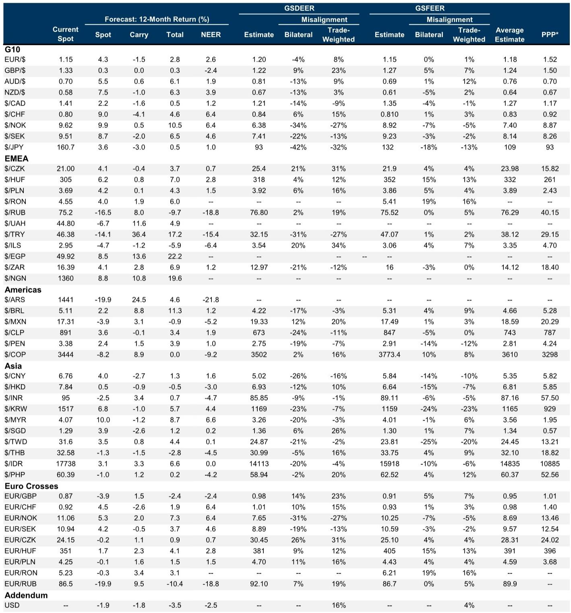
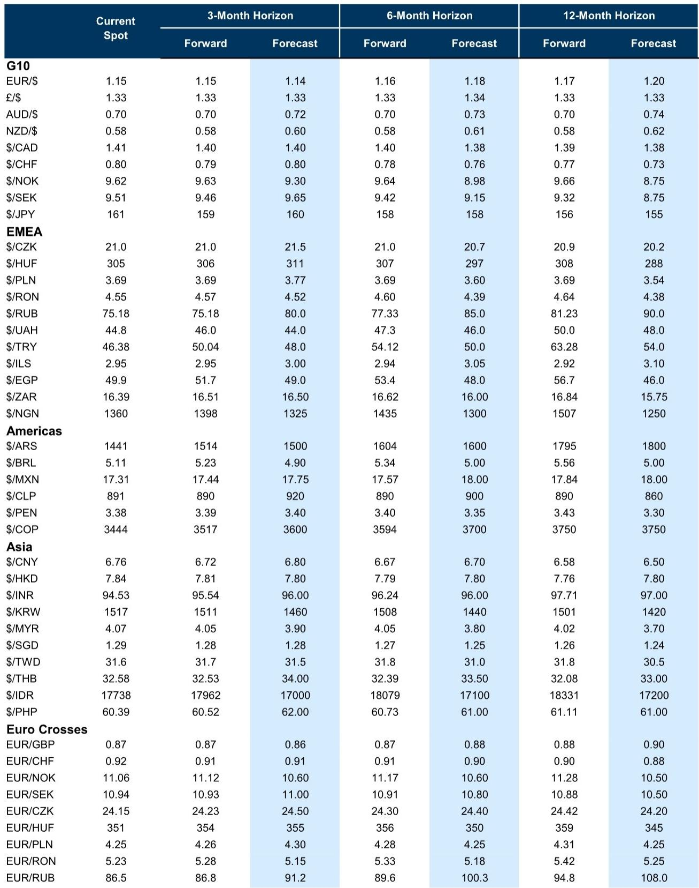
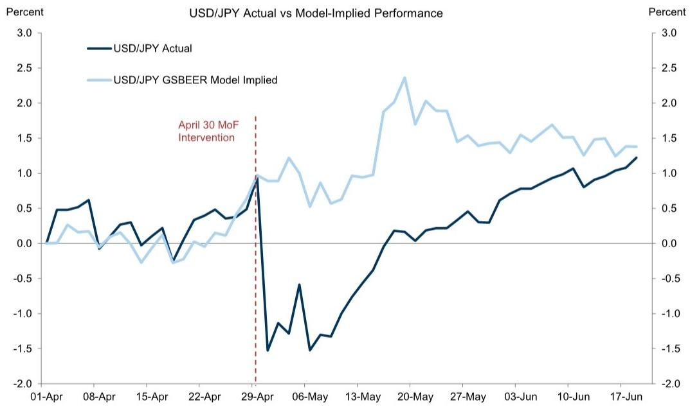

# The Fed’s Hawkish Pivot Has Replaced One Dollar Support With Another, More Powerful One

The Federal Reserve’s June meeting was not merely a shift in policy stance. It was a fundamental change in how the central bank communicates, prioritizes, and positions itself relative to the global economy. For currency markets, this matters far more than any single data point or geopolitical development. The immediate catalyst for the Fed’s reassessment was the decline in oil prices following the US-Iran agreement, but the deeper driver is something more structural: strong, AI-led US demand that has been pushing up growth, inflation, and the neutral rate since the start of the year. This is not a temporary adjustment. It is a regime recalibration.

The near-term Dollar outlook now hinges on which force dominates: the hawkish Fed surprise or the energy-related geopolitical relief. The answer is clear. Rate differentials have a larger and more consistent correlation with the Dollar than oil prices do. Markets never priced significant geopolitical stress into the currency, so the resolution was always a modest factor. The Fed’s hawkish pivot, by contrast, was a genuine surprise. Unless the central bank’s tougher stance proves fleeting as energy prices move lower, we are looking at a scenario where one positive Dollar factor has been replaced by another, more powerful one.

This creates a complex environment for global FX strategies. The bear flattening of the yield curve that typically follows such a shift puts most pressure on lower-yielding currencies, not the high-yield carry trades that have performed well. But the implications go beyond simple rate differentials. The Fed’s new communication style—less transparency, greater tendency to surprise—introduces a volatility regime that could be particularly disruptive given the Dollar’s global role. This is the key analytical question that market participants must now grapple with: how do you position for a world where the world’s most important central bank becomes less predictable?

## The Fed’s New Communication Regime Transfers Volatility to Data Releases and Speeches, Creating a Less Stable Trading Environment

The FOMC’s message delivery at this meeting was strikingly different from what markets have come to expect. Historically, the Fed has tried to limit hawkish policy surprises precisely because of the Dollar’s global role. Even during periods when it provided less policy guidance, the central bank generally avoided shocking markets on the hawkish side. This meeting broke that pattern.

From an FX perspective, we have seen iterations of this playbook before at other central banks. Less transparency and a greater tendency to surprise typically lead to higher volatility on policy decision days. For the Fed, this could be even more consequential. If future policy decisions will be communicated with less detail on meeting days, the volatility will not disappear—it will simply migrate to data releases and other forms of communication like policy speeches.

The critical insight here is that the less-centralized format of the FOMC will likely lead to less of a regime shift around both speeches and data compared to leadership transitions at other central banks. This is not a wholesale transformation of how the Fed operates. It is a tactical change in communication style that creates pockets of uncertainty. For currency traders, this means the traditional playbook of positioning ahead of FOMC meetings may need to be revised. The volatility that was previously concentrated on meeting days may now be distributed across the calendar, making it harder to hedge and easier to be caught wrong-footed.

## EM Carry Strategies Can Still Deliver Positive Returns, But the Choice of Funder Becomes Decisive in a Rising Rate, Rising Equity Environment

The round-trip in EM currencies over the past week illustrates a crucial dynamic. Initially, currencies rallied on the conflict resolution, then depreciated following the hawkish FOMC. But the pattern was not uniform. Lower-yielding currencies such as the Korean won, Czech koruna, and Malaysian ringgit depreciated by more than they had appreciated on the resolution. This is consistent with the typical implications of a front-end-led US rates repricing, which is more negative for lower-yielding currencies.

The implication for carry strategies is nuanced but powerful. Carry can continue to deliver positive total returns even as the Fed path reprices further, as long as risk appetite remains supported. The key variable is the choice of funder. In an equities-up, rates-down regime, USD-funding typically outperforms. But in an equities-up, rates-up backdrop—which is precisely what we are seeing now—low-yielding funders like the euro or yen help deliver positive spot returns and higher total returns.

This divergence between high-yielding and low-yielding currencies was a defining feature of the 2021-2023 hiking cycles. We are seeing it again. Within EM, currencies like the Chilean peso and Israeli shekel can help neutralize the risk exposure and USD beta of carry baskets without sacrificing carry returns. The Mexican peso stands out for its relative outperformance, consistent with its broad Dollar beta. If US relative outperformance remains in focus, including the peso in a diversified carry basket becomes an increasingly strong proposition.

The main risk to this view is the upcoming USMCA discussions, but these are likely to be a more important driver for the Canadian dollar than for Mexico. In Latin America more broadly, the case for rotating some Brazilian real length into Colombian pesos is compelling if local developments remain supportive. In Brazil, rising political noise ahead of elections will likely deteriorate carry-to-vol ratios, while a more dovish central bank delivery raises the risk of less policy support into a noisier period.

## The Yen’s Weakening Trend Remains Intact as Intervention Risk Diminishes, But Outright USD/JPY Longs Are Less Attractive

The Bank of Japan hiked rates at its June meeting and continued to signal additional hikes, but the pace remains too slow to offset broader JPY-negative fundamentals. The higher odds of more imminent Fed hikes have now added further upward pressure on USD/JPY. The yen tends to weaken less versus the Dollar than most other currencies in a hawkish policy shock, given the offsetting impulses of higher yields and weaker equities. But even accounting for this, the yen has actually outperformed what fundamentals would imply by roughly 15 basis points.

The more important development is the diminishing effect of intervention risk. The lack of policy response above 160 has reduced the deterrent value of potential operations. The potential for additional intervention still makes outright USD/JPY longs less attractive, despite the broader backdrop arguing for a weaker yen. This is why the preferred expression has been to be short yen against high-carry EM currencies rather than outright dollar-yen longs.

The risks remain skewed to the upside in USD/JPY. Incoming US data have remained resilient, the odds of Fed hikes have gone up, and domestic fiscal risks in Japan persist. A sharp reversal lower would likely require a rise in recession risk or a shift towards a more hawkish BoJ, both of which feel less imminent. The yen’s path of least resistance is still weaker, but the expression of that view requires careful vehicle selection.

## The Swiss Franc and Antipodean Currencies Face Divergent Headwinds From Central Bank Stances and Domestic Conditions

The Swiss National Bank remained on hold for a fifth consecutive meeting, softening its intervention bias slightly by adding “if necessary” to its language about willingness to intervene. This marginal change is likely insufficient to provide any tailwind to the franc. In a backdrop where many other central banks are hiking or considering hikes, a firmly on-hold stance puts the SNB on the dovish end of the central bank spectrum. Chair Schlegel explicitly noted that interest rate differentials to other major central banks had widened and were exerting downward pressure on the franc. We agree. The language change will prove mostly symbolic and insufficient to shift this dynamic.

For the Australian and New Zealand dollars, the story is more nuanced. The RBA maintained a tightening bias but left the timing of any further tightening data-dependent. The deterioration in recent Australian macro data and an RBA nearing the peak of its cycle stand in contrast to New Zealand, where data has improved and more hikes are priced for the RBNZ than for any other G10 central bank. This relative domestic dynamic, combined with the relaxation in energy prices, supports the view that AUDNZD should trend lower over the medium term.

However, the tactical picture is more interesting. AUDUSD has moved more in line with fundamentals recently, while NZDUSD looks to have more room for catch-up. This makes NZD longs versus the Dollar look more tactically attractive on de-escalation. But the hawkish FOMC introduces a new headwind. The New Zealand dollar is typically an underperformer in a hawkish policy shock backdrop that sees equities move lower alongside higher yields. The tactical opportunity exists, but it comes with significant caveats about timing and risk appetite.

## What the Report Does Not Fully Answer: How Durable Is the Fed’s Hawkish Pivot When Energy Prices Continue to Fall?

The report makes a compelling case that the Fed’s hawkish stance matters more than the energy relief for the Dollar outlook. But it leaves open a critical question: how durable is this pivot if oil prices continue to decline? The Fed’s reassessment was initially catalyzed by lower energy prices, but the underlying driver is strong AI-led US demand. If energy prices keep falling, the inflation impulse from the supply side diminishes, potentially reducing the urgency for further tightening.

This creates a tension in the analysis. The report argues that the hawkish stance is more powerful because it comes as a bigger surprise and because rate differentials correlate more strongly with the Dollar than oil prices do. But if the Fed’s hawkishness was partly a response to energy-driven disinflation, then further declines in oil prices could actually reduce the need for tightening. The net effect on the Dollar would then depend on which force dominates: the direct impact of lower energy prices (which is modest) or the indirect impact through the Fed’s reaction function (which could be significant).

The report also does not fully address the implications of the Fed’s new communication style for the Dollar’s role as a safe haven. If the Fed becomes less predictable, does that erode the Dollar’s safe-haven premium over time? Or does the Dollar’s global role make it resilient to communication shocks? The historical evidence from other central banks suggests that less transparency leads to higher volatility, but the Dollar’s unique status may buffer it from the full impact. This is an open question that warrants further investigation.

## A Decision Framework for Positioning in the New Fed Regime

For readers trying to translate this analysis into actionable positioning, a structured framework is essential. The key variables are: the direction of US rates, the trajectory of risk appetite, and the relative central bank stance of each currency.

**Step 1: Assess the US Rates Regime.** If the Fed’s hawkish pivot proves durable, the front end of the yield curve will continue to reprice higher. This favors the Dollar against low-yielding currencies and creates headwinds for carry trades funded in USD. If the pivot proves fleeting, the Dollar weakens and carry trades funded in low-yielding currencies benefit.

**Step 2: Evaluate Risk Appetite.** The report shows that carry strategies can work in both equities-up/rates-down and equities-up/rates-up regimes, but the choice of funder differs. In a risk-on environment with rising rates, fund carry trades in low-yielding currencies like EUR or JPY. In a risk-on environment with falling rates, fund in USD.

**Step 3: Identify Relative Central Bank Stance.** The SNB is on the dovish end of the spectrum, the RBNZ is on the hawkish end, and the BoJ is somewhere in between. Currencies with central banks that are more hawkish relative to the Fed will outperform, all else equal.

**Step 4: Consider Tail Risks.** The main tail risks to this framework are: a sharp recession that forces the Fed to reverse course, a geopolitical shock that disrupts energy markets, or a fiscal crisis in Japan that forces the BoJ to act more aggressively. Each of these would upend the current dynamics.

This framework does not provide a single answer. It provides a structure for thinking about how different scenarios would play out. The current configuration—rising US rates, supportive risk appetite, and a hawkish Fed relative to most G10 central banks—favors the Dollar and high-carry EM currencies funded in low-yielding currencies. But this configuration is fragile and subject to change.

Join the community to read the full report and review the original charts.

*This article is for learning and discussion only and does not constitute investment advice.*

Personal reading notes and learning share only. Not investment advice.

