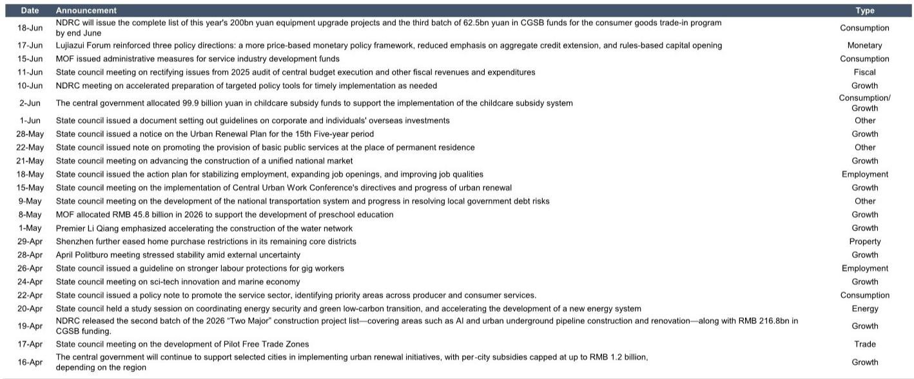
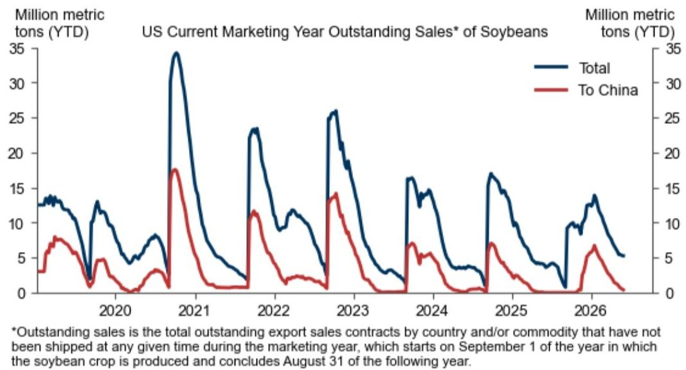

# GS：中国经济的真实温度，藏在每周高频数据的边际变化里

当市场还在为月度PMI的读数争论不休时，一份来自GS的每周经济追踪报告揭示了一个更微妙的现实：中国经济正在经历的不是简单的“复苏”或“放缓”，而是一个由多重力量拉扯、板块剧烈分化的“再均衡”过程。这份6月18日发布的报告，通过四大类高频指标——消费与出行、生产与投资、其他宏观活动、市场与政策——拼凑出一幅比任何单一数据都更立体的图景。

核心判断是：经济活动的“量”在边际上企稳，但“价”的信号依然疲弱，且结构性分化正在加剧。这意味着，对于产业决策者和投资者而言，整体宏观数字的参考价值正在下降，真正重要的是捕捉不同板块内部边际变化的拐点。这份报告的价值不在于给出一个“好”或“坏”的结论，而在于提供了每周更新、可交叉验证的观察框架，让读者有能力在官方数据发布之前，提前感知水温的变化。

## 1. 房地产市场出现了一个值得警惕的背离：交易量回暖未能阻止价格继续探底

报告中最引人注目的信号来自房地产市场。30城新房成交量在最近一周小幅上升，并且高于去年同期水平；16城二手房成交量也基本持平于高位。从“量”的角度看，政策松绑后的脉冲效应似乎仍在持续，市场并没有出现断崖式下跌。

然而，量稳的背后是价的持续疲软。国家统计局70城二手房价格指数在5月继续下降。更令人担忧的是，报告追踪的多个独立数据源——中原、贝壳、诸葛、国信达——所构建的房价指数均显示，当前价格水平已显著低于2025年，甚至逼近或低于2019年基准。这意味着，以价换量仍然是市场的主旋律。卖方为了促成交易，正在不断下调预期价格。

这个背离的含义是深远的。交易量的企稳，更多反映的是积压需求的释放和业主的主动降价，而非市场信心的根本性修复。只要价格下跌预期没有扭转，潜在购房者就会继续持币观望，等待更低的“底部”。房地产市场的真正企稳，需要看到“量价齐稳”甚至“量稳价升”的信号，而目前我们只看到了前半段。对于持有资产或从事相关行业的人来说，量稳价跌的阶段可能是最消耗耐心的——既看不到崩盘的恐慌，也看不到反转的希望。

## 2. 能源价格冲击的滞后效应正在显现，但传导路径并非线性的

GS这份报告从5月起改为周度发布，一个明确的原因是为了“更紧密地追踪能源价格上涨对经济活动的供给冲击”。报告中的数据显示，6月18日，国内汽油和柴油价格分别下调了515元/吨和495元/吨，这是在前期国际油价（Brent）大幅攀升后的首次调降。但更值得关注的是，硫酸、甲醇、聚丙烯等基础化工品的价格在过去一周继续上行，其中硫酸价格已较年初翻倍有余。

这意味着，上游能源成本的上涨，正在通过产业链条逐步向下游传导。但传导并非同步且均匀的。化肥、聚丙烯等与农业、包装、汽车相关的化工品价格涨幅温和，而硫酸这种工业基础原料的价格则出现了剧烈波动。这种非线性的传导，会给不同行业带来截然不同的成本压力。

对于制造业企业而言，当前最需要警惕的不是某一周的价格波动，而是成本压力的累积效应。如果能源价格维持高位，而下游终端需求无法同步提价，那么中游制造环节的利润将面临持续的挤压。这份报告提供的数据，恰好可以用来判断这种挤压是正在加剧还是边际缓和。例如，通过对比化工品价格指数与钢价、煤耗等生产指标，可以初步评估工业企业的“成本-产出”剪刀差是否在扩大。

## 3. 消费场景恢复的“天花板”效应已现，结构升级而非总量扩张成为新主线

报告中的出行数据提供了关于消费的另一个视角。国内客运航班量在过去一周有所上升，但依然低于去年同期水平。同时，航班取消率虽然下降，但仍处于高位。交通拥堵指数则小幅上升。将这些信号综合起来，可以看到一个矛盾的现象：人们在出行，但出行的效率和意愿似乎没有完全恢复。

更值得玩味的是Morning Consult消费者信心指数。该指数在经历了2025年初的低谷后持续回升，到2026年7月已高于2024年同期水平。然而，这一信心改善并未完全转化为更强的消费支出，尤其是在房地产等大宗消费领域。这暗示，当前消费者信心的修复，更多是低基数效应和短期情绪提振的结果，而非收入预期或就业前景的根本性改善。

对于消费领域的参与者而言，这意味着“总量增长”的黄金时代可能已经过去。未来的机会将更多来自结构性升级和细分赛道。例如，高端出行、体验式消费、健康相关产品等，可能比传统的商品消费更具韧性。GS报告中的高频指标，如航班量、拥堵指数，恰恰是判断这种结构变化是否发生的有效工具。如果商务出行恢复慢于休闲出行，如果一线城市拥堵指数恢复快于二线，这些细节都在讲述一个关于消费偏好迁移的故事。

## 4. 基建和出口的韧性，正在成为对冲地产下行的重要力量，但可持续性需要进一步验证

报告中的生产与投资数据，描绘了一个相对稳健但缺乏惊喜的图景。钢铁需求和产量在最近一周均小幅回升，但绝对量仍低于疫情前的2019年水平。沿海省份的日均煤炭消费量则保持在高于去年同期的水平，显示电力需求依然旺盛。

最引人注目的是地方政府专项债券的发行进度。截至报告发布时，2026年累计发行规模已达1.67万亿元人民币，节奏明显快于2025年同期。这直接支撑了基建投资的资金来源。同时，官方港口集装箱吞吐量和20个主要港口离港船舶货运量均保持在高位，且高于去年同期水平，表明出口活动依然强劲。

这几组数据合在一起，形成了一个重要的判断：在房地产投资持续疲软的背景下，基建和出口正在充当经济稳定器的角色。但这里有两个关键问题报告没有完全回答。第一，专项债的加速发行能否持续？如果后续发行节奏放缓，基建投资的支撑力将减弱。第二，出口的韧性更多是价格因素（出口商品涨价）还是数量因素（全球需求仍旺）？如果是前者，那么对国内就业和制造业利润的拉动效应可能有限。这两个问题的答案，将决定当前的经济韧性是可持续的，还是暂时的。

## 5. 这份报告没有完全回答的关键问题：资产价格与实体经济的“脱钩”是否正在扩大

报告中的一组数据值得单独拎出来讨论：大城市的租金收益率在4月至5月保持稳定，约为1.9%，而30年期国债收益率则小幅下降。租金收益率与国债收益率的利差正在收窄。

从资产定价的角度看，这通常意味着房地产的相对吸引力在提升。但问题在于，当前1.9%的租金收益率，仍然远低于多数投资者对房地产投资的预期回报。市场之所以还在关注房地产，更多是基于“房价上涨”的资本利得预期，而非租金现金流。只要房价下跌预期未消，租金收益率的稳定就无法转化为实际购买力。

这引出了一个更深层的疑问：金融市场的定价（如国债收益率下行、部分资产价格上涨）与实体经济的真实温度（如房价下跌、消费信心波动）之间，是否存在脱钩？如果存在，那么以金融资产价格作为经济领先指标的可靠性就需要打折扣。GS的报告提供了大量实体高频数据，但并未直接回答这个资产定价层面的问题。对于投资者而言，这恰恰是需要自行研判的核心课题。

## 6. 一个可操作的观察框架：每周追踪这四个信号，比等月度数据更有价值

基于GS这份报告的框架，我们可以提炼出一个更简洁的观察体系，用于判断经济周期的边际变化：

第一，看“量”的边际变化。重点关注30城新房和16城二手房成交量、港口集装箱吞吐量、钢铁表观消费量。如果这些指标连续三周环比改善，说明需求端在企稳。如果只是单周波动，则不必过度解读。

第二，看“价”的传导链条。重点关注化工品价格指数、国内成品油价格调整、以及70城房价指数。价格信号是判断企业利润和消费者购买力的关键。如果上游价格持续上涨而下游价格停滞，那么中游制造的压力将加剧。

第三，看“政策”的落地节奏。重点关注地方政府专项债的周度发行量。这是观察财政政策是否真正转化为实物工作量的最直接窗口。发行加速，基建预期就会升温；发行放缓，则需警惕。

第四，看“信心”的交叉验证。将Morning Consult消费者信心指数与航班取消率、拥堵指数等行为数据结合起来看。信心指数可以反映预期，而行为数据则反映实际行动。两者如果出现背离，通常意味着市场预期即将修正。

这个框架的价值在于，它不依赖任何单一数据，而是通过多维度的交叉验证，来识别真正的趋势信号。当多个指标同时指向同一个方向时，判断的置信度就会显著提升。

---

这份GS报告提供了大量原始数据和图表，但真正的洞见往往藏在数据与数据之间的空白处。例如，当钢铁产量回升但价格疲软时，意味着什么？当集装箱吞吐量创新高但大豆出口下滑时，又该如何解读？这些二阶效应，以及报告背后更完整的分析框架和预测模型，正是我们社群中持续讨论和拆解的内容。

如果你希望获得这份报告的完整解读，包括原始图表、数据表格以及我们基于这些数据所做的进一步推演，欢迎加入我们的知识星球和微信群。在那里，我们不仅分享报告本身，更会围绕这些未解问题展开持续、深入的讨论。

Personal reading notes and learning share only. Not investment advice.

