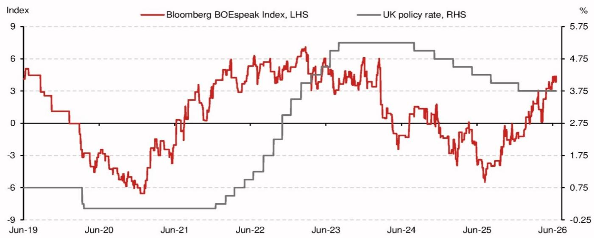
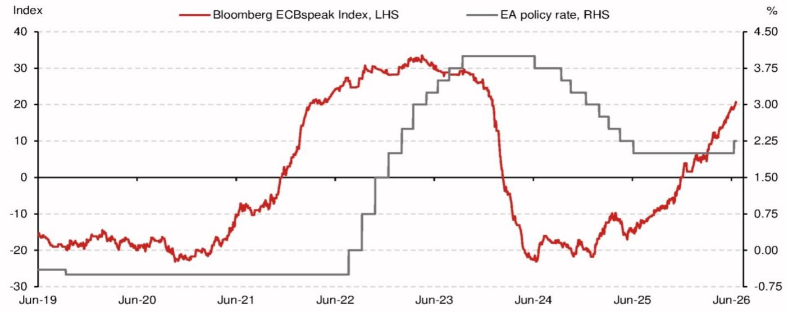
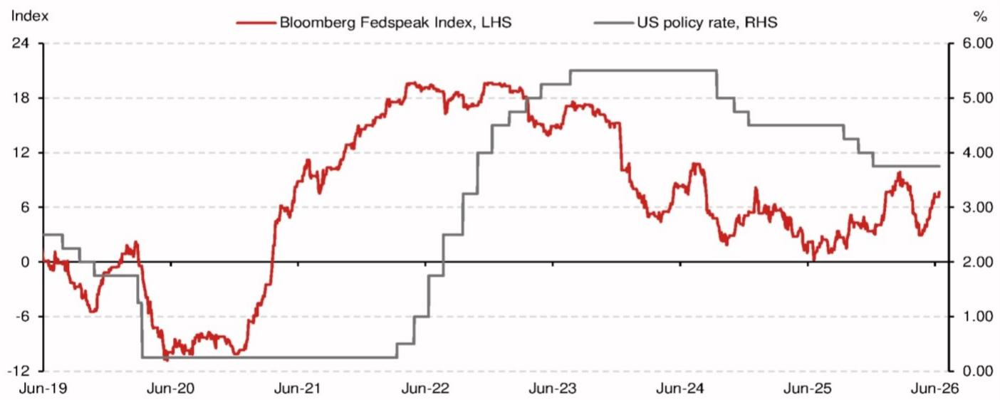

# NOM：央行“叫得凶”和“咬得狠”正在分岔，市场低估了这种分化

理解全球央行当前的政策节奏，不能只看加息还是降息。NOM最新一份研报提供了一个更精细的观察框架：用彭博的央行沟通情绪指数，去衡量央行“说了什么”，再与其实际行动对比，看“做了什么”。结论是清晰的——三大央行的言行一致性正在显著分化，而这种分化背后是各自经济基本面和政策约束的根本差异。对于资产定价而言，这意味着一刀切的“全球央行转向”叙事可能已经失效，投资者需要重新校准对不同市场的利率风险定价。

这份报告最值得关注的判断不是某个具体的利率预测，而是它揭示了一个正在发生的结构性变化：央行沟通本身正在成为独立的政策工具，且其可信度和有效性正在因央行的“兑现记录”而出现分化。欧洲央行正在用行动强化其鹰派沟通的可信度，英国央行则在用“按兵不动”削弱其鹰派信号的威慑力，而美联储的新任主席则可能让这类沟通指数本身失去意义。这三条线索，每一条都指向不同的资产配置含义。

## 1. 欧洲央行正在用行动证明“鹰派不是空话”，这是当前最值得追踪的定价信号

NOM编制的ECBspeak指数已经升至20.7，这是2022年3月以来的最高水平。但更关键的是，与上次加息周期不同，这次欧洲央行在鹰派沟通升温后迅速跟进——在指数达到这一水平时，欧洲央行已经完成了25个基点的加息。而在2022年3月，指数达到类似水平后，欧洲央行等了四个月才启动首次加息。

这种“言行一致”的转变，直接推动了NOM欧洲经济团队上调加息预测：在9月和12月各加25个基点，并延续到2027年3月。这并非简单的预测调整，而是对央行行为模式变化的确认——欧洲央行正在从“落后于曲线”转向“主动管理预期”。

这一变化的底层逻辑在于，欧元区的通胀粘性比预期更强，尤其是第二轮通胀效应的担忧仍在主导决策者的思维。NOM报告虽然没有完全展开，但这里需要指出的是，欧洲央行的这一行为模式变化，意味着欧元区利率的“上限”可能高于市场当前定价。如果市场仍在按“欧洲央行很快会转向宽松”来定价，那么这种定价偏差本身就构成了交易机会。

## 2. 英国央行正在用“按兵不动”证明其鹰派沟通的“空转”，政策可信度面临侵蚀

与欧洲央行形成鲜明对比的是英国央行。BOEspeak指数目前为4.4，虽然较此前有所上升，但英国央行在昨天的会议上以7比2的投票结果维持利率不变。NOM欧洲经济团队已经将今年的加息预测从一次25个基点调整为“零加息”，并预计2027年下半年将进行两次25个基点的降息。

这里的关键比较是，在上次加息周期中，BOEspeak指数达到3.7时，英国央行就启动了首次加息。而这次指数已经升至4.4，央行却选择按兵不动。NOM报告给出的解释是，英国的政策利率（3.75%）起点远高于欧洲央行（2.25%），且被认为已经处于中性利率之上。同时，英国劳动力市场正在趋势性走弱，通胀涨幅也低于预期。

但更深层的含义在于，英国央行的“鹰派沟通”正在失去市场约束力。如果市场开始相信“英国央行只会叫不会咬”，那么通胀预期锚定的难度就会上升。这反过来可能迫使英国央行在未来采取更激进的行动来重建信誉。对于英镑和英国国债的投资者而言，这意味着一个两难局面：如果相信英国央行的沟通，则利率应上行；如果不相信，则通胀风险溢价需要重新定价。

## 3. 美联储的“沟通工具”可能正在失效，新主席的风格让指数本身失去意义

Fedspeak指数目前为7.7，从历史标准看，这是一个非常温和的上升。在上个周期，Fedspeak指数在2021年5月就达到了7.7，但美联储直到10个月后才开始加息，事实证明这一反应严重落后于曲线。NOM报告暗示，当前类似的风险正在积聚：通胀上升、金融条件宽松，叠加财政主导和美国政治周期，可能导致历史重演。

但报告提出的一个更具颠覆性的观点是：彭博的Fedspeak指数可能变得毫无用处，因为新任美联储主席“厌恶前瞻指引”。如果美联储不再通过公开讲话来管理市场预期，那么所有基于“央行沟通”的分析框架都需要重构。这不是一个边缘问题，而是对过去十年央行沟通范式的一次根本性挑战。

对于投资者而言，这意味着美联储的政策路径将变得更加难以预测。市场将不得不从“听央行说什么”转向“看数据做什么”，这本质上是一种信息效率的下降。在这种环境下，利率波动率可能系统性上升，而依赖于“央行看跌期权”的资产定价逻辑需要重新审视。

## 4. 报告尚未完全回答的关键问题：能源价格下跌能否成为改变欧洲央行行为的变量？

NOM报告承认，如果近期能源价格的下跌能够持续，欧洲央行可能会降低对通胀的担忧，从而软化其鹰派立场。但报告也明确指出，“目前几乎没有这种迹象”。

这里存在一个尚未被充分讨论的二阶效应：能源价格下跌本身可能改变欧洲央行的通胀预期锚定机制，但前提是这种下跌被视为结构性而非周期性。如果市场认为能源价格下跌是需求疲软的结果（而非供给改善），那么欧洲央行反而可能将其视为经济走弱的信号，从而在鹰派沟通与实际政策之间产生新的张力。

换句话说，能源价格下跌对欧洲央行的影响方向并非单向的“宽松信号”。它是通过需求渠道还是供给渠道传导，决定了最终的政策含义。NOM报告没有展开这一讨论，而这恰恰是当前市场定价中最容易产生分歧的环节。

## 5. 一个可供读者自行验证的观察框架：用“言行差距”追踪央行可信度

基于NOM报告的框架，投资者可以建立一个简单的追踪体系：对于任何一家央行，定期比较其沟通情绪指数与政策利率的变化幅度和时滞。如果沟通指数上升后，央行在1-2次议息会议内没有跟进加息（或降息），那么该央行的沟通可信度就处于下降通道。

当前，欧洲央行属于“高可信度”组，英国央行属于“低可信度”组，美联储则处于“框架失效”的灰色地带。这一分类本身就对应着不同的资产定价逻辑：对于高可信度央行，利率路径的可预测性更高，债券定价可以更多依赖央行的前瞻指引；对于低可信度央行，通胀风险溢价需要上调；对于框架失效的央行，波动率溢价需要上调。

NOM报告提供了这一框架的初始数据点，但真正的价值在于持续追踪。能源价格走势、劳动力市场数据、以及各国财政政策的演变，都将不断修正这一框架中的参数。对于希望深度理解全球利率环境的读者，这份报告只是一个起点——更完整的图表、历史对比数据，以及NOM对各央行政策路径的详细推演，都在原始报告中。

欢迎来星球微信群里继续讨论，我们可以一起追踪ECBspeak指数是否会在下一次议息会议前突破前高，以及英国央行的“按兵不动”策略何时会触发市场的重新定价。这些问题的答案，将直接影响未来6个月的全球利率交易框架。

Personal reading notes and learning share only. Not investment advice.

