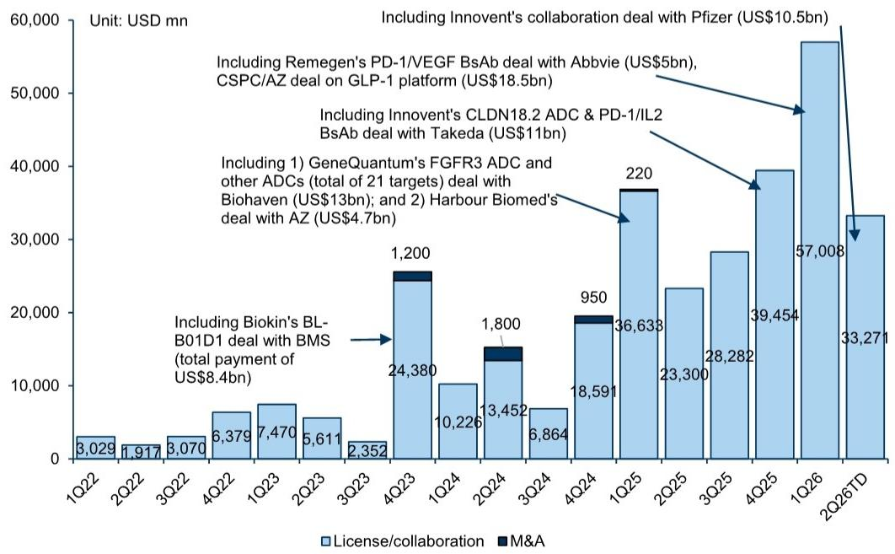
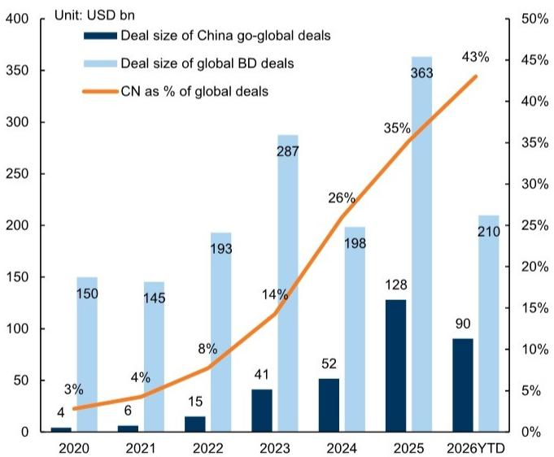
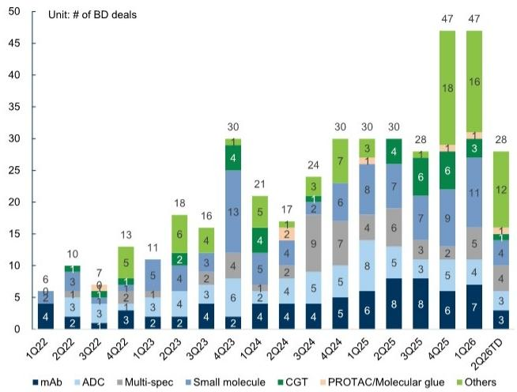

# GS：中国医药资产被低估的不是基本面，而是全球定价权的再校准

当一家全球顶级投行在参加了2026年6月的全球医疗健康大会、与30多家机构投资者交流后，得出了一个看似矛盾的结论——中国医药股年内平均下跌11%，但基本面（临床数据、BD活动）依然强劲——这通常意味着市场正在犯一个经典错误：用短期情绪定价长期资产。

GS这份研报的核心判断值得每一个关注中国医药产业的决策者认真对待：当前中国医药资产的风险回报正在向有利方向倾斜，但驱动下一阶段行情的逻辑，将从“板块整体重估”转向“公司层面的全球竞争力验证”。这不是一个简单的抄底信号，而是一个结构性分化的起点。

## 1. 市场真正担心的不是基本面，而是两个“看不见”的政策变量

投资者对中国医药板块的谨慎态度，并非源于对临床数据或研发管线的否定。GS在与投资者的交流中发现，真正压制情绪的是两个政策层面的不确定性。

第一个是中国与美国之间关于BD交易的监管审查。虽然目前尚未出现实质性的阻断案例，但双边监管趋严的预期已经影响了投资者的风险偏好。GS的调研显示，投资者的讨论更多集中在中国监管一侧，因为政策透明度较低。一个值得关注的细节是：多数投资者认为，如果中国监管审查聚焦于平台级技术输出（而非单一资产），结构性变化的概率不大。这意味着，近期的BD交易趋势将成为判断政策影响的关键观测窗口。

第二个是国内医疗反腐对盈利的潜在冲击。这一变量在2023-2024年已经对行业产生过显著影响，但市场仍在评估其持续时间和影响深度。

这两个变量的共同特点是：它们不是对行业长期价值的否定，而是对短期可见度的干扰。GS的判断是，随着催化剂可见度的提升（即将到来的临床数据、BD公告、二季度财报），市场将重新关注基本面本身。

## 2. 中国创新在全球药企战略版图中的位置，比市场认知的更核心

研报中最具信息量的部分，并非来自GS自己的分析，而是来自全球大型药企在大会上的表态。这些表态揭示了一个正在发生的结构性变化：中国已经不再只是“低成本制造基地”，而是正在成为全球创新药研发的“战略伙伴”。

Gilead明确表示，其优先发展的企业项目中约有一半源自中国或与中国创新相关。辉瑞则给出了一个更具时间维度的判断：当前中国生物科技公司仍依赖欧美药企进行全球临床试验和商业化，但到2030年前后，它们可能具备自主建立这些能力的基础。AstraZeneca和Novartis也分别强调了持续合作意愿和对中国创新资产的开放态度。

这些信息叠加在一起，指向一个清晰的结论：全球大型药企对中国创新的依赖不是短期的交易性行为，而是结构性的战略布局。这种依赖的深度和广度，远未被当前股价所反映。

GS同时指出，全球大型药企对中国资产的偏好正在发生变化——它们更倾向于那些能够“干净地”融入全球开发战略和合作伙伴管线的资产。这意味着，不是所有中国创新都能享受全球化溢价，只有那些具备全球竞争力和可转化数据的资产才能获得认可。

## 3. CDMO板块的韧性被低估，但分化已经开始

在CDMO（合同研发生产组织）领域，GS的调研显示投资者情绪正在改善，但改善是不均匀的。这背后反映了一个核心问题：在经历了两年多的地缘政治压力后，哪些公司真正证明了自身的结构性竞争力？

药明康德虽然因被列入美国1260H清单而经历了短期股价波动，但投资者的注意力已经转向了其多元化的增长驱动——除了GLP-1相关的多肽业务外，订单动能依然强劲，二季度可能出现的指引上调被视为关键催化剂。药明生物的特许权使用费收入被视为中期盈利的支撑，尽管可见度较低。药明合联的订单动能保持强劲，但投资者正在关注新加坡工厂的商业化进展。

康龙化成则因其GLP-1相关的产能扩张而持续受到关注，但投资者讨论的焦点已经转向了扩产后的产能利用率和利润率轨迹。

这些细节揭示了一个重要逻辑：在CDMO领域，决定估值分化的关键不再是“是否拥有GLP-1概念”，而是“能否将产能扩张转化为实际的盈利增长”。那些能够在商业化规模、客户多元化和利润率之间取得平衡的公司，将获得持续溢价。

## 4. 数据可转化性正成为资产定价的核心变量，而非附属条件

这是研报中一个被低估但极其重要的洞察：投资者正在从“对所有中国数据打折”转向“在资产/试验层面评估数据可转化性”。

这一转变的背景是，中国临床试验的质量正在获得更广泛的认可。GS在交流中发现，对于PD-1/VEGF双抗（如依沃西单抗）和ADC（如sac-TMT）等核心资产，投资者的关注点已经从“中国数据是否可信”转向了“这些数据能否支持全球注册和商业化”。

具体而言，那些采用随机对照设计（以全球标准疗法为对照组）、患者基线特征与国际接轨、使用全球标准终点、并获得FDA/EMA早期沟通的临床试验，被认为具有更高的可转化性。这意味着一件事：对于中国生物科技公司而言，临床开发策略的重要性已经与生物学机制本身相当。

GS据此判断，下一阶段的行情将由公司层面的具体验证驱动：可信的全球数据包、成功的BD执行、以及监管可转化性的证据。这将对资产定价产生深远影响——拥有高质量全球资产、明确BD期权价值和严谨试验设计的公司将获得溢价，而拥挤的机制或可转化性较低的数据集可能面临估值分化。

## 5. 报告尚未完全回答的关键问题：估值修复的触发点在哪里？

尽管GS整体看好中国医药板块的风险回报，但报告中有几个关键问题并未完全展开，而这些恰恰是投资者最需要关注的。

第一个问题是：政策不确定性何时能够转化为确定性？无论是中美BD监管审查还是国内医疗反腐，其影响路径和时间表都不清晰。GS提到“催化剂可见度改善”，但并未给出明确的触发时间点。这意味着，即使基本面完好，估值修复可能仍需要等待一个“政策靴子落地”的信号。

第二个问题是：中国创新资产的全球化定价能否在二级市场实现？当前，中国生物科技公司的估值仍然显著低于全球同行。GS认为“结构性机会”存在，但并未说明这种折价何时以及如何收窄。如果全球药企对中国创新的依赖继续加深，但二级市场定价体系仍然以地缘政治风险为主导，那么估值修复可能需要更长时间。

第三个问题是：AI在医疗健康领域的商业化进展仍然早期。GS指出，当前AI的应用主要集中在效率提升而非直接收入创造，投资者对AI药物发现公司的关注度有限，正在等待更清晰的数据验证和价值创造证明。这意味着，AI概念短期内不太可能成为驱动板块估值提升的核心变量。

## 顺着这些未解问题，继续讨论

GS这份研报的价值，不仅在于它提供了对中国医药板块的正面判断，更在于它揭示了一个正在发生的结构性变化——中国创新资产正在从“被观察”转向“被整合”。但正如报告所暗示的，从“被整合”到“被定价”，中间还有一段路要走。

政策不确定性的消除路径、全球化定价的实现机制、以及AI商业化的验证节点，这些恰恰是我们在星球微信群里持续跟踪和讨论的核心议题。如果你对这些未解问题感兴趣，欢迎来星球微信群里继续交流，我们会在第一时间分享对关键催化剂事件的解读和行业变化的深度分析。

---

Personal reading notes and learning share only. Not investment advice.

