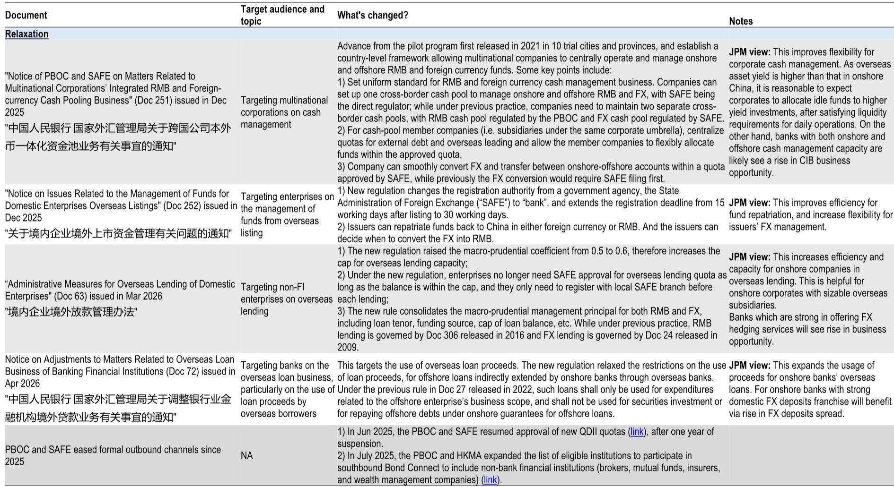
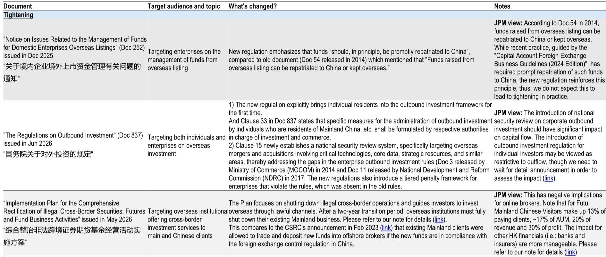
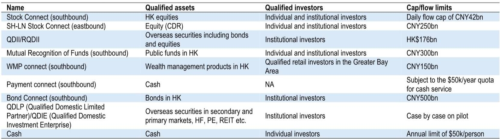

# China’s Capital Flow Reforms Are Not a Crackdown: They Are a Framework Upgrade with Clear Winners and Losers

The prevailing narrative that Beijing is tightening capital controls misses the point entirely. Over the past twelve months, Chinese policymakers have released a series of regulatory updates that simultaneously relax some channels and tighten others. This is not a one-directional clampdown. It is a deliberate, systematic effort to build a comprehensive governance framework for cross-border capital flows—one that aligns with the long-term goals of RMB internationalization and financial market opening. For investors, the critical question is not whether capital controls are tightening or loosening, but which institutions and strategies are positioned to benefit from the new architecture.

The timing of this framework upgrade matters. China’s current external backdrop does not suggest an urgent macro need to restrict outflows. The renminbi is facing appreciation pressure, not depreciation pressure. Cumulative resident outflows via unofficial channels have stabilized at approximately $500 billion since mid-2025, signaling that the most intense period of capital flight has passed. Meanwhile, returns on Chinese equities, when adjusted for currency effects, now compare more favorably with US markets than they have in years. This is not a crisis-driven response. It is a structural recalibration.

The implications for currencies, banks, and cross-border investment strategies are substantial. In the near term, the tightening of outbound investment rules should provide a modest tailwind for the renminbi by reducing outflow pressure and encouraging repatriation. But the medium-term picture is more complex. Chinese investors remain structurally underexposed to global assets relative to regional peers, and the underlying demand for diversification will persist. The framework upgrade does not eliminate this demand; it redirects it through approved channels while closing unregulated ones. This creates a bifurcated environment where some banks and financial institutions gain, while others face headwinds.

## The Regulatory Mix Is Not Contradictory—It Is a Coherent Two-Pronged Strategy

The most common analytical error is to treat each regulatory change in isolation. When viewed together, the pattern is clear: Beijing is simultaneously opening the "front door" for controlled, transparent outflows while closing the "back door" for informal or unregulated capital movement.

On the relaxation side, several changes are noteworthy. Multinational corporations operating in China now have greater flexibility in currency conversion and fund management for their onshore and offshore RMB and foreign currency liquidity, thanks to the new national framework for integrated cash pooling. Onshore corporates can extend loans overseas with increased quotas and a simplified filing process rather than requiring prior approval from the State Administration of Foreign Exchange. The People’s Bank of China and the Hong Kong Monetary Authority have expanded the list of eligible institutions for southbound Bond Connect, and the PBOC has resumed approving QDII quota expansions. Onshore banks have also seen the removal of strict criteria on indirect offshore lending to overseas corporates.

On the tightening side, the June outbound investment rule has brought corporate and individual outbound investments into a more explicit regulatory scope. Cross-border securities trading enforcement has been strengthened jointly by the CSRC and seven other agencies. And companies are now required to repatriate offshore IPO proceeds to China unless they obtain specific approval for overseas use.

The so-what here is critical: this is not a regime of capital controls in the traditional sense. It is a governance upgrade designed to improve the composition, transparency, and traceability of cross-border flows. The policy intent is to channel outbound investment through regulated, monitorable pathways while discouraging the opaque, unrecorded flows that have historically complicated macro management and financial stability.

## The Renminbi Will Benefit in the Near Term, but Structural Diversification Demand Remains a Medium-Term Headwind

From a foreign exchange perspective, the recent tightening measures should provide a modest tailwind for the renminbi in the coming quarters. Reduced outflow pressure and increased repatriation incentives support the currency. The macro backdrop reinforces this view: China’s current account surplus remains significant, and the renminbi is not under depreciation pressure.

However, the medium-term outlook is less straightforward. Chinese residents have been systematically increasing their exposure to global assets, and the cumulative stock of outflows over 2023-2025 is estimated at around $1.3 trillion. Even with tighter back-door controls, the structural desire for international diversification will not disappear. What will change is the channel through which this demand is expressed.

Policymakers have already demonstrated their preferred approach. Since last year, they have selectively eased formal outbound channels—expanding southbound Bond Connect, resuming QDII quota approvals, and broadening eligible institutions. The message is clear: Beijing wants outflows to happen through regulated, transparent mechanisms where it can monitor and, if necessary, intervene. The recent tightening should therefore be interpreted as a shift in the composition of flows, not a reduction in their total volume.

For currency investors, this implies that renminbi strength may be more pronounced in the near term but could face headwinds as structural diversification continues through formal channels. The key variable to watch is whether Beijing expands compliant channels—through more approved routes, higher quotas, or both—to keep the framework consistent with its RMB internationalization agenda.

## Bank of China Benefits from a NIM Tailwind as FX Deposit Spreads Widen

The regulatory changes have direct and differentiated implications for China’s banking sector. The most immediate and quantifiable beneficiary is Bank of China.

The removal of loan proceeds use restrictions for onshore banks' overseas corporate loans, under Document 72, should improve related loan demand. This benefits banks with strong domestic FX deposit franchises, as they can allocate those FX deposits to fund overseas corporate lending, thereby improving deposit spreads. Among China’s major banks, BOC stands out: its FX deposits account for approximately 16% of group liabilities, compared to an average of just 4% for peers.

All else equal, this should become a tailwind for BOC’s net interest margin. In an environment where domestic loan yields are under pressure, the ability to earn higher spreads on FX-funded overseas lending provides a meaningful competitive advantage. This is not a speculative story—it is a structural benefit embedded in BOC’s balance sheet composition.

The question investors should ask is whether this tailwind is fully priced. BOC’s FX deposit franchise is a well-known feature, but the specific regulatory catalyst from Document 72 may not yet be fully reflected in market expectations. The margin improvement will depend on the pace of overseas lending uptake and the trajectory of offshore asset returns relative to onshore.

## Standard Chartered and HSBC Are Underappreciated Beneficiaries of the CIB Opportunity

While the wealth management headwinds for Hong Kong banks tied to Mainland Chinese Visitor business have been well-flagged, the tailwind from corporate and investment banking activity appears significantly underappreciated.

Three specific regulatory changes create a favorable environment for banks with strong CIB franchises. First, the relaxation of cash management rules for multinational corporations operating in China benefits institutions with integrated onshore and offshore RMB and foreign currency cash management capabilities. Second, the relaxation of onshore corporate overseas lending creates demand for advisory services and currency hedging. Third, the acceleration of RMB internationalization—evidenced by the rapid growth of Dim Sum bond issuance and the expansion of southbound Bond Connect—generates underwriting, trading, and custody opportunities.

Among the banks covered in the report, Standard Chartered and HSBC are best positioned to capture this CIB opportunity. Both have deep onshore and offshore franchises, established RMB capabilities, and the balance sheet strength to support multinational clients navigating the new framework. Bank of China also benefits, but its relative advantage is more concentrated in the FX deposit and lending story.

The critical insight here is that the regulatory framework upgrade is not just about compliance costs or operational friction. For the right institutions, it creates a structural revenue opportunity as clients seek trusted partners to navigate the increasingly complex cross-border environment. The market may be underestimating this tailwind because it is focused on the headline-grabbing tightening measures rather than the underlying expansion of regulated channels.

## What the Report Does Not Fully Answer: The Implementation Risk and the Individual Investor Question

For all its analytical depth, the report leaves several meaningful open questions that investors should monitor closely.

First, the implementation rules remain undefined for several key measures. The June outbound investment rule, for example, brings individual investors’ outbound investments into regulatory scope, but the specific details are yet to be released. The practical boundaries of the new framework will be determined not by the high-level documents but by the follow-up implementation rules. Investors need to watch for whether these rules are applied strictly or flexibly, and whether they create unintended consequences for legitimate cross-border activity.

Second, the report does not fully resolve the tension between the tightening of back-door channels and the long-term RMB internationalization agenda. If Beijing truly wants the renminbi to become a global reserve currency, it must eventually allow two-way capital flows that are both deep and accessible. The current framework upgrade may be a transitional phase, but the endpoint remains unclear. Will the front-door channels expand fast enough to absorb the pent-up diversification demand? Or will the back-door tightening simply create new, more opaque pathways?

Third, the impact on individual investors is the least analyzed dimension. The regulatory updates have expanded the scope of oversight to include individual outbound investments, but the report focuses primarily on institutional and corporate flows. Given that individual investors have been a significant source of unofficial outflows in recent years, how they adapt to the new framework will have meaningful implications for both the renminbi and the banking sector.

## A Decision Framework for Investors Navigating the New Capital Flow Regime

For portfolio managers and strategists, the regulatory changes create a clear but nuanced opportunity set. The following framework can help guide asset allocation and stock selection decisions.

First, assess the direction of flows by channel. The tightening of back-door channels suggests reduced pressure on the renminbi in the near term, but the expansion of front-door channels implies that total outflows may not decline. The net impact on the currency depends on the relative speed of these two forces. Investors should monitor monthly data on southbound Bond Connect flows, QDII quota utilization, and unofficial outflow estimates to gauge which channel is dominant.

Second, identify the banking beneficiaries by their balance sheet characteristics. Banks with high FX deposit ratios, like Bank of China, benefit from the lending relaxation. Banks with strong onshore-offshore CIB franchises, like Standard Chartered and HSBC, benefit from the expansion of regulated channels and the acceleration of RMB internationalization. Banks that are heavily exposed to the Mainland Chinese Visitor wealth management business face headwinds that may already be priced in.

Third, consider the asymmetric risk in the renminbi. The near-term tailwind from tightening is relatively straightforward, but the medium-term outlook is more complex. If front-door channels expand faster than expected, the structural diversification demand could re-emerge as a headwind. Investors should consider hedging currency exposure selectively, particularly if the renminbi strengthens significantly in the near term.

Fourth, watch the implementation rules for the individual investor outbound framework. This is the most uncertain variable and could have the largest impact on both the currency and the banking sector. If the rules are restrictive, it could further support the renminbi but create headwinds for Hong Kong banks. If they are accommodative, it could accelerate outflows and benefit institutions with retail cross-border capabilities.

## The Framework Is Still Being Built—Join the Community to Read the Full Report and Review the Original Charts

The regulatory changes discussed here represent the most significant evolution in China's capital flow management in years. But the story is far from over. The implementation rules, the pace of front-door channel expansion, and the response of individual investors will determine whether this framework upgrade succeeds in its stated goals of improving transparency and supporting RMB internationalization.

Join the community to read the full report and review the original charts. The detailed analysis includes the specific regulatory documents, the historical flow data, and the bank-level balance sheet comparisons that underpin the conclusions above. Understanding the full picture requires seeing the data, not just the narrative.

*This article is for learning and discussion only and does not constitute investment advice.*

Personal reading notes and learning share only. Not investment advice.

