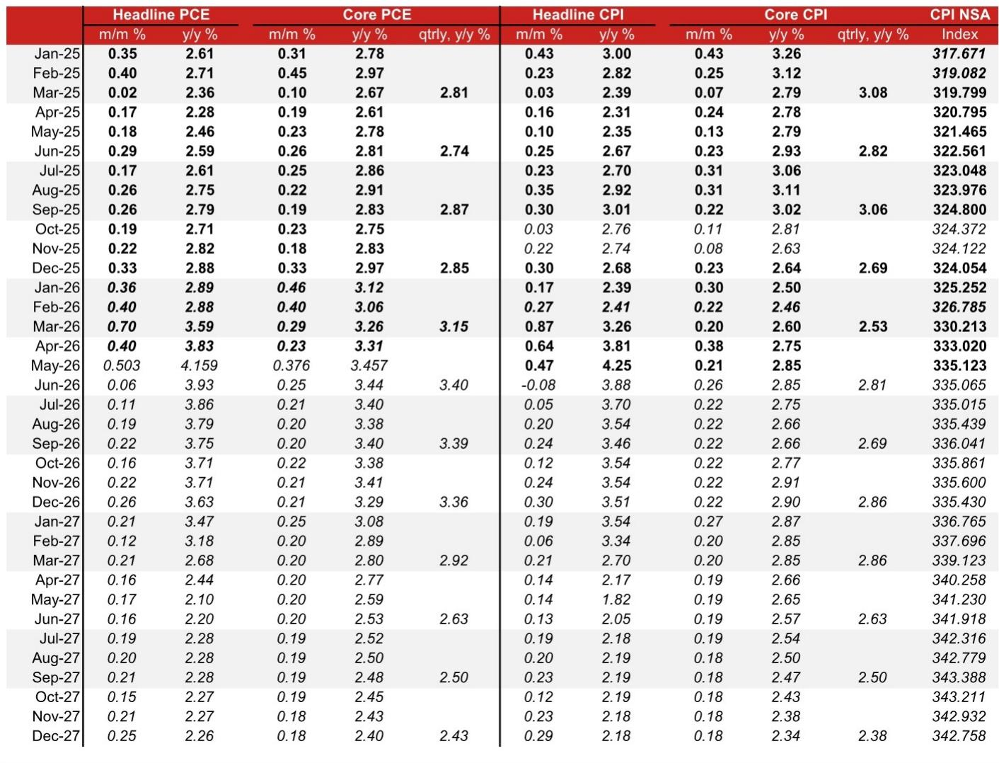
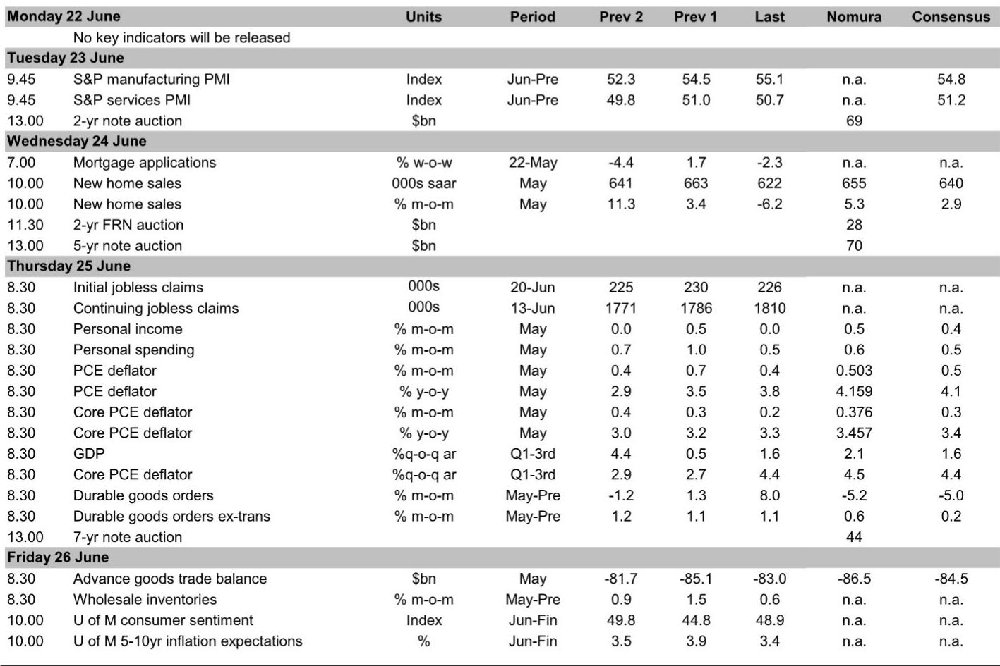

# NOM：鲍威尔之后，美联储正经历一场更深刻的权力重构

市场对6月FOMC会议的解读大多聚焦于“点阵图转鹰”与“沃什偏鸽”的表层矛盾。但NOM这份研报揭示了一个更值得关注的信号：美联储正在发生的不只是利率路径的摇摆，而是一场围绕数据定义权、通胀框架和机构治理的深层重构。真正重要的不是2026年会不会加息，而是谁来决定“什么算通胀”。

## 1. 点阵图的鹰派偏移被沃什的措辞对冲，但真正重要的是框架的不确定性

6月点阵图的中位数显示，2026年政策利率将升至3.75%，比当前水平高出半个加息幅度。这一结果明显比市场预期更鹰派。然而，沃什在新闻发布会上的表态却呈现出相反的温度。他将点阵图形容为“用铅笔画的——那种带大橡皮的铅笔”，暗示这些预测随时可能被擦除。他还刻意强调“一半的同事认为利率应该维持在当前水平或更低”，尽管实际上只有一位参与者预期2026年降息。

这种“鹰派数据、鸽派叙事”的组合并非简单的沟通技巧，而是反映出沃什正在尝试重新定义美联储对外沟通的锚点。他更倾向于用定性判断来对冲量化预测的刚性，这本身就是在削弱点阵图作为政策信号的市场权重。

对投资者的含义是：点阵图的参考价值正在下降，沃什的措辞将成为更重要的政策风向标。未来市场对美联储的解读，可能需要从“数点”转向“听词”。

## 2. 沃什的“小数点左侧”通胀观，可能系统性降低加息门槛

研报中一个容易被忽略的细节是沃什对通胀目标的表述。当被问及2%的通胀目标时，他回答：“我倾向于关注小数点的左侧。”这意味着他可能将2.0%至2.9%的通胀区间都视为符合2%目标的范畴。

这一表述的潜在影响不容低估。如果美联储正式或非正式地将通胀容忍区间上移，那么当前核心PCE在3.4%左右的水平就不再构成加息的紧迫理由。NOM预计5月核心PCE同比将加速至3.457%，但沃什的框架恰恰可能将这一数字“正常化”。

然而，这里有一个关键问题尚未解决：沃什的个人观点能否转化为FOMC的共识。报告指出，许多FOMC参与者近期对沃什偏好的“截尾均值PCE”指标提出了质疑，认为它在低估通胀趋势。如果沃什试图通过新成立的“通胀框架工作组”来推动这一转变，可能面临来自委员会内部的强烈阻力。

## 3. 五个工作组的设立，本质上是沃什在重新塑造美联储的“数据基础设施”

沃什宣布成立五个工作组，分别聚焦于：美联储沟通、数据测量、资产负债表政策、生产率与就业、以及通胀框架。这些工作组的名称看似技术性，但其战略意图非常清晰——沃什正在试图绕过FOMC内部的分歧，通过建立新的政策知识基础设施来推动变革。

最值得关注的是“数据测量”工作组。沃什在新闻发布会上公开批评联邦政府的统计数据“大多采用过时的调查方法”，并表示倾向于使用来自私人部门的“实时数据”。这一立场与前任主席鲍威尔形成对比：鲍威尔虽然也指出过调查回应率下降的问题，但多数FOMC参与者仍然将联邦统计机构的数据视为“黄金标准”。

如果沃什成功推动数据源的多元化，那么通胀的判断标准、劳动力市场的评估方式、乃至GDP的测算方法都可能发生系统性变化。这不仅是技术问题，更是权力问题——谁的数据被采纳，谁的叙事就占主导。

但报告也指出，这些工作组要到“今年秋季”才会提供初步见解，最终建议预计在年底前完成。这意味着在2026年下半年，市场将面临一个政策真空期：加息的门槛可能因工作组未完成而被人为抬高，但通胀压力却在持续积累。

## 4. 核心PCE加速背后的结构性问题：金融服务业价格反弹比商品通胀更难治理

NOM预计5月核心PCE环比将从4月的0.230%加速至0.376%，同比从3.307%升至3.457%。推动这一加速的主要动力并非商品价格——核心CPI商品通胀在5月甚至转为负值——而是来自PPI数据的服务业分项，特别是金融服务价格和进口航空票价的强劲上涨。

更值得警惕的是“超级核心PCE”的走势。NOM预计5月超级核心PCE环比将加速至0.5%，创下1月以来的最高水平。这一指标的构成中，金融服务价格的反弹是主要推手。

从政策含义看，商品通胀的回落可以通过供应链修复和需求正常化来缓解，但服务业通胀，尤其是金融服务价格，更依赖于劳动力成本、资产价格和金融市场的内生动力。这意味着即便整体通胀读数出现阶段性改善，服务业通胀的粘性仍可能使美联储难以放松政策。

此外，美伊初步和平协议的签署导致原油价格大幅下跌，零售汽油价格持续下行，这将对6月整体通胀形成下行压力。但NOM并未完全展开这一地缘政治变量对通胀路径的长期影响，这可能是完整报告中的重要伏笔。

## 5. 报告尚未完全回答的关键问题：沃什的“再分配”策略能否成功

研报中有一段值得反复推敲的分析：沃什将货币政策的限制性描述为“不均匀的”，认为利率工具对房地产市场形成压制，而资产负债表政策却在支撑金融市场。他暗示，当前的政策组合存在内在矛盾——利率偏紧、资产负债表偏松。

这一判断引出一个核心问题：沃什是否在试图通过调整资产负债表政策（如放缓缩表或提前结束MBS减持）来为利率政策争取空间？如果他的策略是通过“工具再分配”来降低利率的紧缩压力，那么市场需要关注的不只是点阵图，还有联储的资产负债表路径。

NOM的基准预期是美联储在2027年底前维持利率不变，同时资产负债表将以每月约200亿美元的速度温和扩张，且新增购买将偏向短期国债。但这一路径高度依赖于沃什能否在FOMC内部获得足够的支持来推进他的框架改革。

如果沃什的工作组最终提出的建议——例如采用替代通胀数据、扩大资产负债表工具的适用范围——未能获得多数委员支持，那么他可能面临“有愿景、无执行”的困境。反之，如果这些建议得以落地，美联储的政策框架将发生自沃尔克时代以来最深刻的变革。

---

沃什正在做一件比“鹰派或鸽派”更根本的事情：他在重新定义美联储的“操作系统”。点阵图的鹰派偏移可能只是旧框架的最后一次挣扎，而真正决定利率路径的，将是工作组能否在年底前交出一份足以改变政策逻辑的答卷。

这些工作组的具体成员构成、工作方法以及初步发现，将是判断美联储未来走向的关键变量。NOM研报对这些细节的讨论极为克制，但恰恰是这些“未展开的部分”最具阅读价值。

欢迎来星球微信群里继续讨论：沃什的五个工作组中，哪一个对资产定价的冲击最大？如果美联储正式采用“小数点左侧”的通胀目标，长端利率和美元会如何重定价？

Personal reading notes and learning share only. Not investment advice.

