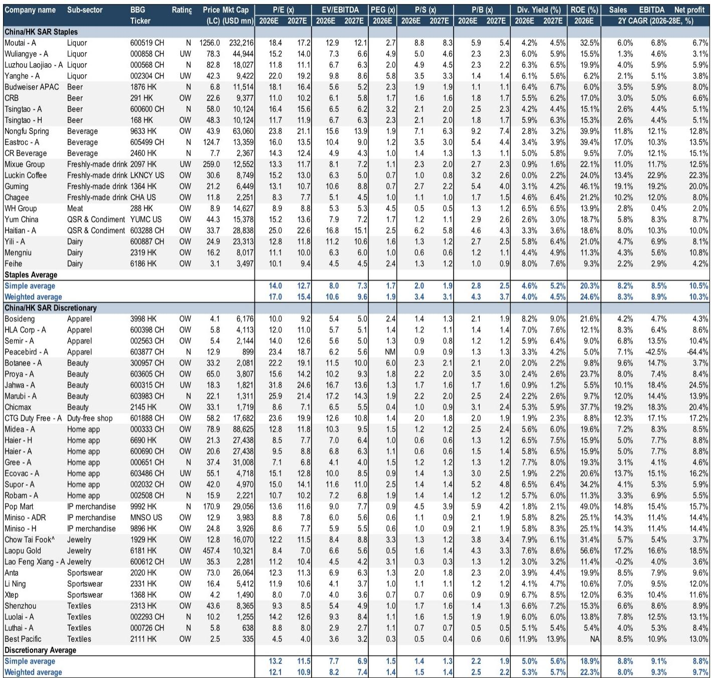
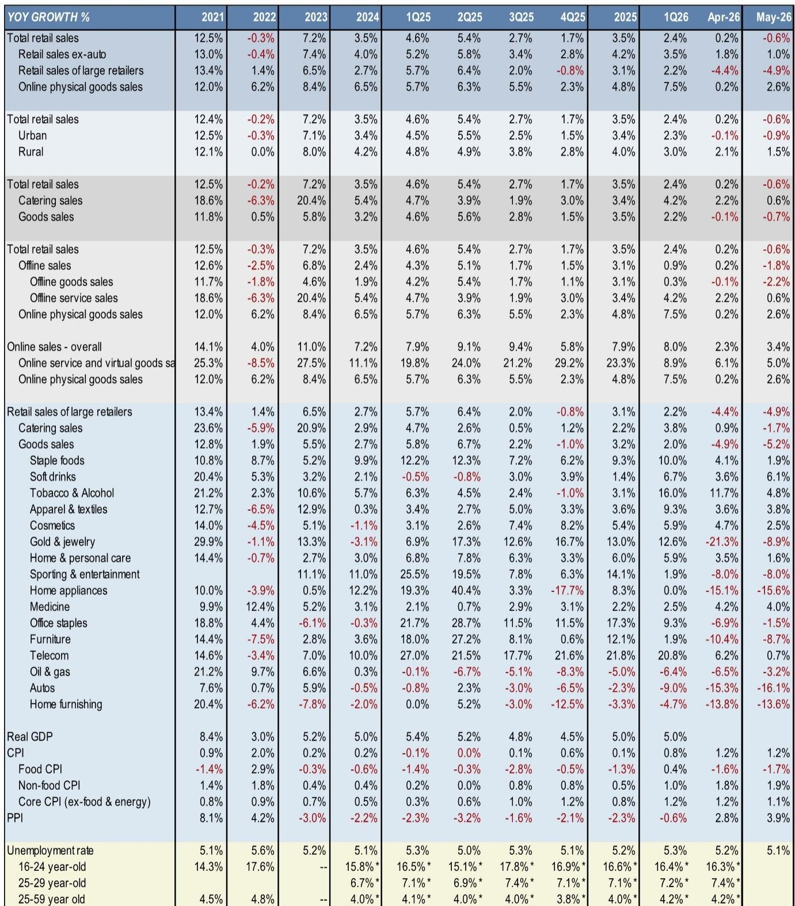
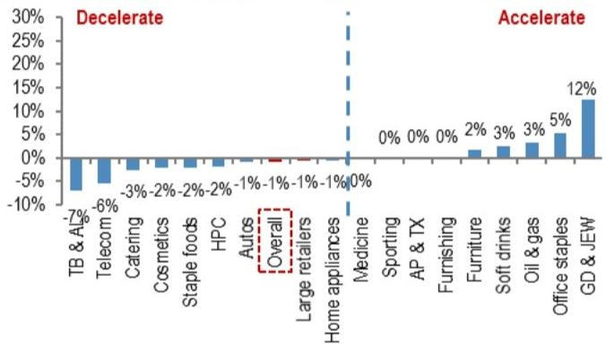

# China's May Retail Contraction Is Not a Blip — It Is a Structural Demand Reset That Demands a New Investment Playbook

The headline number is jarring, but the real story is deeper. China's May 2026 retail sales fell 0.6% year-on-year, the first decline since December 2022 and a sequential deterioration from April's 0.2% growth and March's 1.7% expansion. The Bloomberg consensus had already braced for weakness at negative 0.2%, but the actual miss signals something more than a seasonal slowdown or a high-base effect. This is not a cyclical dip that will self-correct in a quarter. It is a structural demand reset driven by a persistent contraction in durable goods, a widening divergence between online and offline channels, and a consumer base that is increasingly cautious, selective, and unwilling to be stimulated by price cuts alone.

For investors who have been waiting for a "bottom" to buy the dip, the data carries an uncomfortable message: the bottom is not yet visible, and the risk of further earnings downgrades in the upcoming 2Q26 results season is rising. The report from a global investment bank makes this point explicitly, noting that more companies may guide down during the 2Q26 results season. This is not a time for broad-based exposure to Chinese consumer equities. It is a time for surgical selectivity, a focus on quality names with identifiable earnings stabilization, and a willingness to embrace turnaround stories where the risk-reward has shifted from speculative to calculable.

The analysis that follows is not a summary of the data. It is an argument for why the current environment requires a new investment framework — one that abandons the old playbook of "buy the macro dip" and replaces it with a company-specific, category-aware, and valuation-disciplined approach. The report provides the raw material, but the strategic implications demand interpretation.

## The Collapse in Durable Goods Is Not Cyclical; It Is a Consumer Sentiment Earthquake That Has Not Yet Registered in Valuations

The most alarming part of the May retail data is not the headline decline but the composition of weakness. Durable goods categories — home durables, home appliances, furniture, and autos — are not just weak; they are in freefall. Home durables fell 15% year-on-year, home appliances dropped 16%, home furnishing contracted 14%, furniture declined 9%, and autos plunged 16%. These are not categories where consumers defer purchases for a month or two. Durable goods purchases represent significant financial commitments, and the depth and breadth of the decline indicate that households are not just postponing — they are rethinking their entire spending hierarchy.

The pattern is unmistakable: consumers are prioritizing immediate needs and small indulgences over big-ticket items. The top-performing categories in May were soft drinks (+6%), tobacco and alcohol (+5%), medicine (+4%), apparel and textile (+4%), and cosmetics (+3%). These are low-ticket, high-frequency items with relatively inelastic demand. The bottom five categories were all durables. This is not a rotation within consumption; it is a structural shift in consumer priorities. When households stop buying cars and sofas but continue to buy soft drinks and lipstick, the message is clear: confidence in future income is low, and the willingness to take on long-term financial commitments has evaporated.

The valuation data in the report reinforces this concern. China consumer staples and discretionary sectors have seen their forward P/E de-rate by 9.6% and 6.5% respectively over the past month, to 15.2x and 12.1x. The broader MSCI China and HSI indices have de-rated by only 3% and 3.7%. In other words, the consumer sector is being repriced faster than the market, but the question is whether the repricing has gone far enough. Given that the durable goods weakness is structural and that earnings downgrades are likely to accelerate in the 2Q26 results season, current valuations may not yet reflect the full extent of the damage. Investors who rely on historical P/E ranges as a guide to "fair value" may be making a category error. The historical range was built on a different consumer psychology and a different macro backdrop. The current environment demands a lower valuation floor.

## Online Resilience Masks a Deeper Offline Crisis That Will Reshape the Retail Landscape

The May data reveals a stark divergence between online and offline channels. Online retail sales grew 3.4% year-on-year, while offline sales contracted 1.8%. At first glance, this looks like the continuation of a long-term trend — e-commerce penetration rising at the expense of brick-and-mortar. But the magnitude of the divergence in May is unusual and carries implications that go beyond channel shift.

Offline goods sales fell 2.2% year-on-year, while offline service sales (primarily catering) grew only 0.6%. The catering number is particularly telling. Catering has been a bright spot in Chinese consumption for years, driven by social gatherings and the "experience economy." A slowdown to 0.6% growth suggests that even the most resilient offline categories are now feeling the pressure. The report notes that large retailers' sales fell 4.9% year-on-year, and catering sales at large retailers declined 1.7%. This is not just about mom-and-pop stores struggling; it is about the most established players in the offline ecosystem losing momentum.

The strategic implication is that the offline channel is not simply losing share to online — it is losing absolute demand. Consumers are not just shifting where they buy; they are buying less overall, and the offline channel is bearing the brunt of the contraction. This has second-order effects on real estate, employment, and local government revenues that are not captured in the retail sales data alone. For investors, the key question is whether online growth can continue to compensate for offline weakness, or whether the offline drag will eventually pull the entire consumer ecosystem down. The report's data suggests the latter is more likely, especially given that online physical goods sales growth has already decelerated from 7.5% in 1Q26 to 2.6% in May.

## The Gold and Jewelry Rebound Is a False Signal — It Reflects Price Volatility, Not Consumer Confidence

One category that appears to have improved in May is gold and jewelry, which narrowed its decline from negative 21% in April to negative 9% in May. Some investors may interpret this as a sign that consumer sentiment is stabilizing. That would be a mistake.

The gold and jewelry category is heavily influenced by gold price volatility, not by underlying consumer demand. When gold prices are volatile, consumers delay purchases because they expect prices to adjust. When prices stabilize, even temporarily, pent-up demand can produce a one-month bounce. The May improvement is consistent with this pattern — gold prices experienced significant volatility in April, which crushed sales, and the May stabilization allowed some deferred purchases to materialize. But the year-on-year decline is still 9%, and the category remains one of the worst performers in the retail basket.

The more important signal from the gold and jewelry data is what it says about consumer psychology. Gold is traditionally a "safe" purchase in China, a store of value and a gift item. If consumers are hesitating to buy gold even when prices stabilize, it suggests that the broader caution is not just about price sensitivity — it is about a fundamental reluctance to spend on anything that is not an immediate necessity. The gold category's recovery, if it comes, will lag behind a recovery in consumer confidence, not lead it.

## The Report's Stock Picks Offer a Framework, But the Real Insight Is in What It Does Not Say

The report provides specific stock recommendations that are worth examining for the logic they reveal, not just for the names. The first group — quality names with limited downside and earlier earnings stabilization — includes Anta, Nongfu, and Guming. The second group — turnaround stories — includes Chagee and Luckin. The common thread is that all of these companies have identifiable catalysts that are independent of the macro environment: brand momentum, network expansion, overseas upside, or shareholder return programs.

What the report does not fully address, and what investors need to think through on their own, is the timing of the turnaround. The report notes that investors agree it is too early to call the bottom. If that is true, then even the best-selected stocks may face headwinds from further macro deterioration. The quality names may hold up better, but they are not immune to a broader de-rating. The turnaround names may deliver outsized returns if their catalysts materialize, but the risk of execution failure is higher in a weak demand environment.

The report also does not address the question of raw material cost inflation. It warns investors to avoid companies highly exposed to raw material hikes, citing CR Beverage as an example. But the PPI data in the report shows that producer prices rose 3.9% year-on-year in May, up from 2.8% in April. This is a significant acceleration that will squeeze margins across the consumer sector, especially for companies that cannot pass through cost increases to price-sensitive consumers. The report's avoidance of this topic in its stock recommendations is notable. Investors should assume that raw material pressure will be a major theme in the 2Q26 earnings season, and that companies without pricing power will face significant earnings risk.

## A Decision Framework for Navigating the Current Environment

Based on the data and analysis in the report, investors should apply a three-step framework to any Chinese consumer stock they are considering.

First, assess the company's exposure to durable goods categories. If a company derives a significant portion of its revenue from autos, home appliances, furniture, or home furnishing, the stock should be avoided unless there is a very specific catalyst that can offset category weakness. The data shows that these categories are in structural decline, not cyclical weakness, and there is no sign of a near-term recovery.

Second, evaluate the company's pricing power in the context of rising PPI. The acceleration in producer prices to 3.9% year-on-year means that input costs are rising. Companies that can pass through these costs to consumers without losing volume are rare. Companies that cannot will see margin compression. The report's preference for Nongfu, which has a margin buffer, is consistent with this logic. Investors should look for companies with strong brand equity, essential product categories, and a history of pricing discipline.

Third, consider the company's channel exposure. The offline channel is in crisis, with large retailers down nearly 5% year-on-year. Companies that are heavily dependent on offline distribution, especially in lower-tier cities, face a structural headwind that will not be solved by cost-cutting alone. Companies with strong online presence and digital-native business models, like Guming and Luckin, are better positioned to navigate the current environment.

This framework is not exhaustive, but it provides a disciplined way to filter the universe of Chinese consumer stocks. The report's stock picks pass this filter, but investors should apply it to their own portfolios and be prepared to exit positions that fail any of the three tests.

## What the Report Does Not Yet Answer — And Why That Matters

The report is valuable for its data and its stock-specific analysis, but it leaves several critical questions unanswered. The most important is the trajectory of consumer confidence. The report documents the weakness but does not provide a framework for predicting when confidence will recover. Is this a function of the labor market, where the unemployment rate remains elevated at 5.1% and the youth unemployment rate is a persistent concern? Is it a function of housing wealth effects, where falling property prices have destroyed household balance sheets? Or is it a function of a broader cultural shift toward saving and away from consumption? The report does not answer these questions, and investors should not assume that the answers are knowable in advance.

Another unanswered question is the role of policy. The report does not discuss potential stimulus measures or regulatory changes that could affect consumer spending. This is a deliberate choice, as the report is focused on the data and its immediate implications. But investors need to think about the policy dimension. If the government introduces significant fiscal stimulus or consumption subsidies, the trajectory of retail sales could change quickly. If policy remains passive, the current weakness could persist for several more quarters. The report does not take a view on this, and investors should be cautious about assuming any particular policy outcome.

Finally, the report does not address the implications of the consumer weakness for the broader Chinese economy. Retail sales are a significant component of GDP, and a sustained contraction in consumption will have ripple effects on investment, employment, and government revenues. The report is focused on stock selection, not macroeconomic forecasting, but investors should be aware that the consumer weakness could be a leading indicator of broader economic challenges.

## Join the community to read the full report and review the original charts.

The data and analysis in this article are based on a detailed research report that includes comprehensive charts on retail sales trends, category breakdowns, unemployment data, and sector valuations. The full report provides the granularity that serious investors need to make informed decisions. Join the community to access the complete analysis and the original charts that underpin the arguments presented here.

*This article is for learning and discussion only and does not constitute investment advice.*

Personal reading notes and learning share only. Not investment advice.

