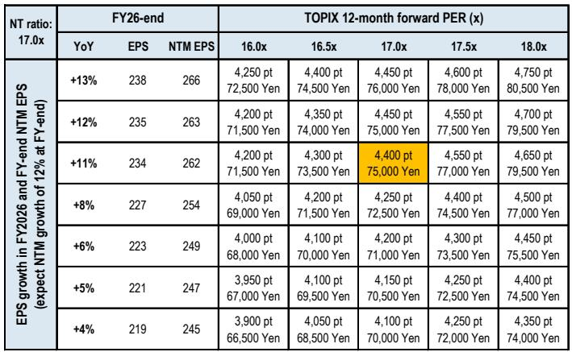
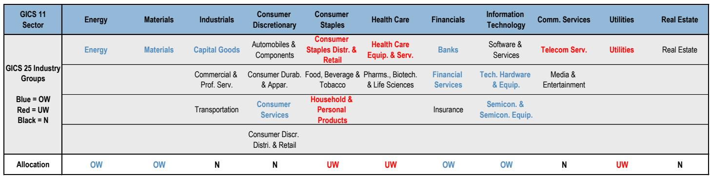
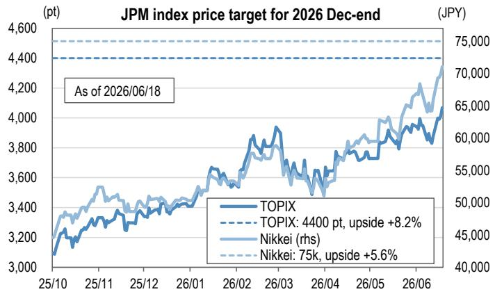

# Japan's Equity Rally Is No Longer Just About AI Hype — It Is Now Anchored by Earnings, Structural Reform, and a New Valuation Cycle

The Japanese equity market has entered a phase that many global investors have been waiting for but few fully anticipated. As of mid-June 2026, the TOPIX has surged 18% year-to-date, outperforming the S&P 500, MSCI World, and STOXX 600. The Nikkei 225 has risen an extraordinary 39%, driven by a concentrated cluster of AI-related stocks that now account for roughly half of its market capitalization. Yet the narrative has shifted. What began as a policy-driven rebound following the Liberal Democratic Party's landslide victory in February has evolved into something more structurally durable: an earnings-led rally supported by improving corporate profitability, a cooling valuation multiple, and a broadening of the AI supercycle beyond semiconductors. The question is no longer whether Japanese equities can sustain their momentum, but whether the market is properly pricing the depth of the transformation underway.

The key argument of this analysis is straightforward: the Japanese equity market is transitioning from a reflationary policy trade to a structural earnings cycle, and investors who treat this as a repeat of past rallies risk missing the most consequential shift in Japanese corporate behavior in decades. The report from which this analysis draws raises its 2026 year-end targets to 75,000 for the Nikkei 225 and 4,400 for the TOPIX, implying upside of roughly 5-8% from current levels. But the real insight lies not in the target numbers, but in the conditions that make them credible: earnings per share estimates have been revised upward significantly, valuations have cooled to a reasonable 16-17x forward P/E, and the composition of growth is broadening beyond the AI semiconductor names that dominated the first half.

This is not a market that needs to be rescued by central bank easing or fiscal stimulus. It is a market that is being reshaped by corporate reforms, capital discipline, and a global technology cycle that has found a natural home in Japan's industrial base. The implications for portfolio construction are profound, and the risks — while real — are increasingly manageable.

## The AI Supercycle Is Real, but Its Market Impact Is Becoming More Differentiated

The most important development in the first half of 2026 was not the pace of the rally itself, but the fact that it was driven by earnings rather than multiple expansion. The TOPIX's forward P/E has actually cooled from elevated levels earlier in the year, settling around 16.6x as of mid-June. This is a critical signal. When a market rises on multiple expansion alone, it is vulnerable to any shift in sentiment or interest rates. When it rises on earnings upgrades, the foundation is far more stable. And the earnings picture in Japan is improving faster than consensus anticipated.

The report's analysis shows that FY2026 TOPIX EPS is now expected to grow 11% year-on-year, with the estimate raised from ¥198 at the end of 2025 to ¥234 currently. That is a nearly 20% upward revision in less than six months. The drivers are concentrated but not narrow. Semiconductor and semiconductor production equipment companies have been the primary beneficiaries, but the earnings momentum is spreading to electric wire and cable manufacturers, memory producers, and increasingly to sectors such as banks and automakers, where large-cap names are expected to see upward revisions during the autumn results season.

What this means for investors is that the AI theme is no longer a speculative bet on future demand. It is a realized earnings cycle that is now being priced into forward estimates. But the differentiation within the AI supply chain is widening. The report identifies that within the semiconductor space, signs of overheating are appearing in some business domains while others lag. This creates a tactical opportunity: toward year-end, semiconductor production equipment and memory makers are expected to deliver earnings above current estimates, while lagging areas such as physical AI — robotics, automation, and industrial AI applications — may begin to catch up. The market is not yet pricing this convergence, which suggests that the rotation within the AI trade has further to run.

## Structural Reforms Are Reshaping Corporate Japan in Ways That Outlast Any Single Policy Cycle

The LDP's electoral victory in February provided the initial catalyst for the rally, but the sustained momentum has come from something more fundamental: a structural improvement in corporate governance and capital allocation. The report highlights that corporate reforms are improving balance sheets and profitability, and that this is attracting larger fund inflows from individual investors, pension funds, and financial institutions. This is not a cyclical phenomenon. It is the result of years of pressure from the Tokyo Stock Exchange, activist investors, and a generational shift in management attitudes.

The data on return on equity is instructive. The report's forecasts show TOPIX ROE rising from 9.4% in FY2024 to 10.0% in FY2026 and 11.4% by FY2028. Even when excluding foreign exchange effects, the trajectory is similar. This is not a market that is simply benefiting from a weak yen. It is a market where companies are genuinely becoming more profitable, more efficient, and more shareholder-oriented. The implications for valuation are significant. A market that can sustain ROE above 10% while maintaining a P/E of 16-17x is not expensive by historical or cross-border standards. It is reasonably priced for the earnings growth it is delivering.

The structural reform story also has a self-reinforcing quality. As more capital flows into Japanese equities, companies feel greater pressure to maintain improved governance standards and capital discipline. This creates a virtuous cycle: better governance leads to higher profits, which attract more capital, which forces further improvements. The report's reference to "larger fund inflows into Japanese equities" as a positive catalyst is not a vague hope. It is a mechanism that is already in motion and is likely to accelerate as global investors reallocate toward markets that offer both growth and valuation discipline.

## The Risk Landscape Is Shifting from Macro Uncertainty to Sector-Specific Execution

Every market rally generates its own set of anxieties, and the Japanese equity story is no exception. The report identifies three primary risks: excessive yen depreciation, sharp increases in interest rates, and fiscal policy uncertainty. But the way these risks are framed is revealing. The report does not treat them as existential threats. Instead, it argues that the positive factors — structural reforms, growth strategies, and the AI semiconductor cycle — outweigh the negatives. This is a nuanced but important distinction.

Consider the yen. The report notes that depreciation beyond ¥160 per dollar would be negative for households and for overseas investors' equity returns. But it also observes that a more hawkish Federal Reserve under Chairman Warsh could lead to a moderate correction in yen depreciation, which would actually be positive for Japanese equities. This is not a contradiction. It reflects the reality that the yen's impact on the market is nonlinear. Moderate weakness benefits exporters and supports earnings, but extreme weakness creates inflation and political risk. The market is currently somewhere in the middle of this range, and the report's analysis suggests that the risk of a disorderly move is manageable as long as the Bank of Japan maintains a credible path toward normalizing policy.

On interest rates, the report acknowledges that rising rates are a risk for equities, but it also notes that underlying inflation in Japan is finally approaching 2%, which gives the Bank of Japan room to act. The key variable is the pace of rate hikes. A gradual normalization that reflects genuine economic strength would be supportive of financials and consistent with the earnings cycle. A sharp acceleration driven by exogenous inflation shocks would be problematic. The report's view is that the former scenario is more likely, and that the market's concern about fiscal expansion is overdone given that economic growth under inflation can absorb higher debt service costs.

The more interesting risks are the ones the report does not dwell on, because they are harder to model. What happens if the AI supercycle experiences a demand shock, not from a recession, but from a technology shift that renders current semiconductor architectures obsolete? What happens if the anticipated large IPOs from companies like SpaceX, Anthropic, and OpenAI — which the report cites as supportive of risk-taking sentiment — are delayed or downsized? These are not tail risks in the traditional sense, but they are second-order uncertainties that could alter the narrative quickly. The report's bullish case does not require these IPOs to succeed, but it does rely on the continued expansion of AI-related capital expenditure by US hyperscalers. Any signal that this spending is peaking would have outsized consequences for the Japanese semiconductor supply chain.

## A Decision Framework for the Second Half of 2026: Core Positions and Tactical Rotations

For investors trying to translate the report's analysis into actionable portfolio decisions, the framework is surprisingly clear. The report recommends positioning AI semiconductors and financials as the core of Japanese equity portfolios. This is not a diversified bet. It is a conviction call that the two most powerful drivers of the market — technology cycle and structural reform — are best captured through these two sectors.

On the semiconductor side, the logic is straightforward. The AI supercycle is in its early to middle stages, with inference — the deployment of AI models into real-world applications — emerging as the main growth area. This phase of the cycle tends to be more capital-intensive and more geographically dispersed than the training phase, which benefits Japanese companies in semiconductor production equipment, memory, and electronic components. The report's data shows that semiconductor and SPE companies are expected to see net profit growth of approximately 300% over FY2026-2028, a magnitude that is difficult to replicate in any other sector or market.

On the financials side, the logic is more structural. Japanese banks are benefiting from rising interest rates, improving loan demand, and a regulatory environment that is encouraging consolidation and efficiency gains. The report expects large-cap banks to see upward earnings revisions during the autumn results season. This is not a speculative trade. It is a reflection of the fact that Japan's financial system is emerging from decades of low profitability and is now positioned to generate sustainable returns on equity above 8-10%.

The tactical overlay is equally important. The report identifies several sectors that could see short-term rebounds if the Middle East situation stabilizes and crude oil prices decline: construction, transportation, chemicals, and defense. It also expects the food sector to recover as higher crude oil prices are passed through to consumers and as a potential consumption tax cut on food takes effect. These are not long-term structural plays. They are tactical positions that could benefit from a normalization of energy prices and a shift in the political calendar.

The most intriguing recommendation is the expectation that the AI-dominated market will partially correct toward year-end, with lagging domains such as physical AI catching up. This suggests that investors should not simply buy the AI theme indiscriminately. They should differentiate between domains that are already pricing in high growth expectations and those that are still undervalued relative to their potential. The report's Figure 7, which shows sector allocation, indicates an overweight position in semiconductors and financials, but also in energy and materials. This is not a narrow bet. It is a portfolio that is positioned for both the AI cycle and the broader economic recovery that rising wages and inflation are beginning to generate.

## What the Report Leaves Unanswered — And Why That Matters

No analysis, no matter how rigorous, can resolve every uncertainty. The report's bullish case is compelling, but it rests on several assumptions that deserve scrutiny. First, the earnings estimates assume that the global AI supercycle continues at its current pace, with US hyperscalers maintaining or increasing their capital expenditure plans. Any slowdown in data center investment, whether due to regulatory constraints, energy shortages, or a shift in corporate strategy, would have immediate consequences for Japanese semiconductor and SPE companies.

Second, the report's view on fiscal policy is that the upcoming release of the Basic Policy on Economic and Fiscal Management and Reform will not trigger an uncontrollable surge in long-term interest rates. This is a reasonable assumption, but it is not guaranteed. Japan's debt-to-GDP ratio remains the highest in the developed world, and any loss of confidence in the government's fiscal trajectory could lead to a rapid repricing of JGBs that would hurt both financials and the broader market.

Third, the report does not fully address the question of how Japanese equities would perform in a global recession. The earnings cycle is currently supported by strong domestic demand and a robust technology cycle, but Japan remains an export-dependent economy. A synchronized global downturn would hit automakers, machinery companies, and semiconductor firms simultaneously. The report's bullish stance implicitly assumes that the AI cycle is strong enough to offset cyclical weakness elsewhere. That may be true, but it is a high-conviction bet.

Finally, the report's discussion of yen depreciation is careful but incomplete. The report acknowledges that yen weakness beyond ¥160 per dollar would be negative, but it does not model the probability of that scenario or the mechanisms through which it would unfold. If the Bank of Japan is forced to raise rates aggressively to defend the currency, the impact on equity valuations could be severe, particularly for domestic sectors such as real estate and utilities that are sensitive to higher discount rates.

These open questions are not reasons to dismiss the report's analysis. They are reasons to treat it as a framework rather than a forecast. The report is most valuable not for its price targets, but for its identification of the structural forces that are reshaping Japanese equities. Investors who understand those forces can make their own judgments about the timing and magnitude of the risks.

## Why This Moment Demands a Deeper Engagement with the Data

The Japanese equity market has been a source of false dawns for three decades. Every rally was met with skepticism, and every correction confirmed the narrative that Japan was a structural underperformer. This time is different, not because the market has risen, but because the composition of the rise is fundamentally healthier. Earnings are driving the rally. Corporate reforms are improving returns. The technology cycle is creating genuine demand. And valuations remain reasonable.

But the window for entry is narrowing. As the report's upward revisions to EPS estimates demonstrate, the market is becoming more efficient at pricing in the good news. The easy gains from the policy-driven rebound in the first half are behind us. The second half will require more precision, more differentiation, and a willingness to hold conviction positions through periods of volatility.

The report's analysis provides the intellectual foundation for that approach. It identifies the sectors that matter, the risks that are manageable, and the uncertainties that require monitoring. But the full picture — the charts, the sector-level data, the earnings revision trajectories, and the detailed valuation analysis — can only be understood by engaging with the original material. The numbers tell a story that words alone cannot capture.

Join the community to read the full report and review the original charts.

*This article is for learning and discussion only and does not constitute investment advice.*

Personal reading notes and learning share only. Not investment advice.

