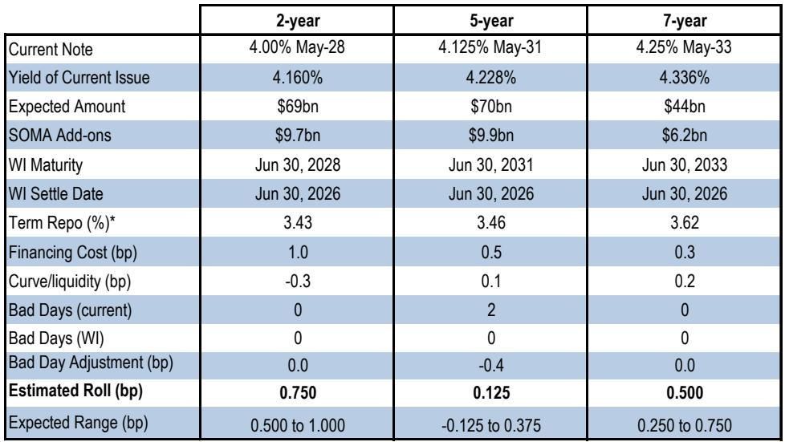
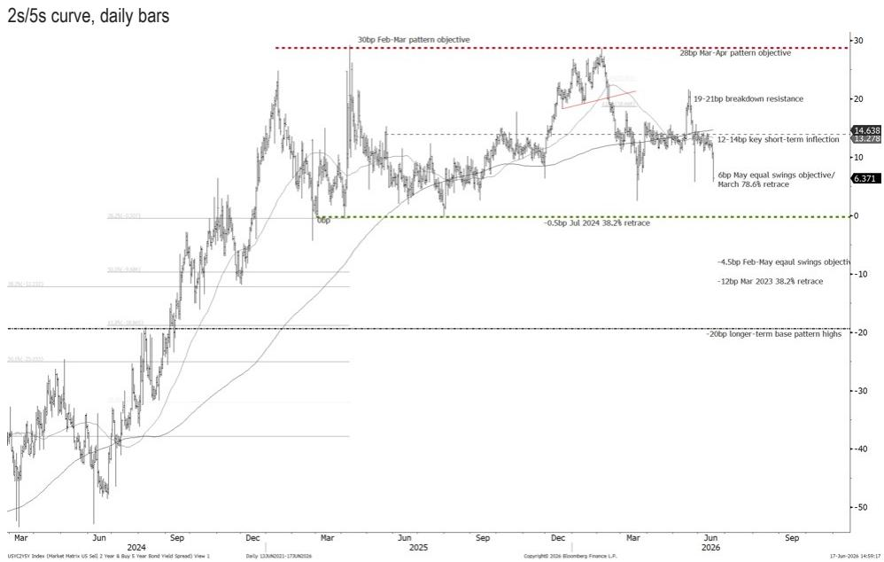
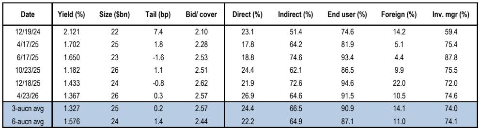

# The Fed’s New Hawkish Orthodoxy Is Not a Pause — It Is a Regime Shift That Demands a Portfolio Repricing

The market’s immediate reaction to Chair Warsh’s first FOMC meeting was a sharp and unambiguous repricing: front-end yields rose 11 basis points, the curve flattened, and OIS forwards now price a full hike by October and more than 45 basis points of tightening by next spring. This is not a temporary adjustment. It is the market correctly absorbing the arrival of a fundamentally different Federal Reserve — one that has abandoned forward guidance, embraced a more discretionary and hawkish stance, and signaled that policy is not yet restrictive enough. The implications extend far beyond the next few meetings. Investors must recognize that the Fed’s communication regime has shifted, and with it, the structural drivers of term premium, real yields, and breakeven inflation have all changed. The old playbook of leaning against hawkish rhetoric with the expectation of eventual dovish reversals no longer applies.

This report, based on a detailed post-FOMC analysis from a leading global investment bank, provides the framework for understanding what has changed and what comes next. The data is clear: the dots have moved higher, the statement has been rewritten in the style of a pre-crisis era, and the Chair himself has explicitly argued that policy is not restrictive. For fixed-income investors, the path of least resistance is higher yields, wider term premium, and continued flattening. But the strategic question is not whether to be bearish — it is how to position for a regime whose contours are still being defined.

## The New FOMC Communication Regime Eliminates a Key Suppressant of Term Premium and Will Keep Volatility Elevated

The most consequential change from this FOMC meeting is not the level of the funds rate or the dots — it is the elimination of forward guidance. The statement was completely overhauled to resemble the Greenspan era, offering no forward guidance and instead stating simply that “The Committee will deliver price stability.” The prepared remarks and press conference were scored as the most hawkish in over a year by the bank’s NLP model. But the deeper point is structural: by removing forward guidance, the Fed has removed one of the key anchors that had kept term premium compressed for over a decade.

The report explicitly notes that improvements in the transparency of Fed communications since the Global Financial Crisis likely supported moderating term premium. That era is now over. Reduced forward guidance means that each FOMC meeting, each data release, and each speech will carry greater weight. The implied distribution from options on December 2026 SOFR futures already shows both tails strengthening, indicating elevated policy uncertainty. This is not a temporary volatility spike — it is a structural increase in the information content of event days. For portfolio construction, this means that duration exposure must be sized with a wider range of outcomes in mind, and that hedging tail risks is no longer optional.

## The Hawkish Dots Are Credible Because the Chair Has Argued Policy Is Not Restrictive, Creating Room for Multiple Hikes

The September dot plot showed 12.5 basis points of rate hikes for 2026, with six of eighteen participants projecting two or more hikes. But the more important signal came from Chair Warsh’s characterization of the current policy stance. When asked whether policy is restrictive, he described it as “uneven,” noting restrictiveness in housing but adding that “it’s hard to use those same words anywhere else.” This is a direct statement that the Fed believes the current funds rate is not sufficiently restraining the economy.

This matters because it reframes the hawkish dots as a baseline, not a tail. If the Chair himself believes policy is not restrictive, then the median dot of a single hike is a floor, not a ceiling. The market is already ahead of this logic, pricing more than 45 basis points of tightening by next spring. The report warns that there is risk of further bearish follow-through, especially if FOMC members who forecast multiple hikes elaborate on their views in coming weeks. For investors, the implication is that the front end of the curve is repricing toward a higher terminal rate, and that the risk of additional hikes beyond what is currently priced is asymmetric to the upside.

## Real Yields Are Biased Higher and Breakevens Lower, Making Inflation-Linked Assets a Complex Bet

The inflation market reaction to the FOMC was consistent with the hawkish nominal repricing: five-, ten-, and thirty-year breakevens fell by three, two, and one basis point respectively. But the magnitude of the move in real yields was larger — ten basis points in the five-year tenor alone. This divergence is instructive. The market is pricing higher real rates as the Fed commits to tighter policy, while breakevens are falling on the expectation that this tightening will reduce inflation.

The report highlights that Chair Warsh now has the opportunity to lean on falling energy prices as a disinflationary force, which could push breakevens lower than previously assumed. Brent crude has fallen from highs above 118 to below 80, and the Fed Chair explicitly downplayed the inflationary impact of geopolitical conflicts. For TIPS investors, this creates a difficult environment: real yields are rising, which improves entry points, but breakevens are falling and are now roughly 44 basis points cheap to the bank’s fair value model. The report notes that tomorrow’s five-year TIPS auction will likely require more of a concession to be digested smoothly. This suggests that while TIPS may eventually offer value, the near-term path is for further cheapening as the market absorbs the new hawkish regime.

## The Balance Sheet Is a 2027 Story, but the Task Force on Composition Could Reshape the Treasury Market

The FOMC meeting provided no material new details on balance sheet policy. Chair Warsh announced that one of five task forces will focus on the balance sheet, with assessments occurring in the second half of 2026 and any resulting changes potentially coming in 2027. This timeline is consistent with the report’s expectation of no near-term changes. But the composition question is strategically important.

The report notes that roughly $1.9 trillion of coupon-bearing Treasuries held in the Fed’s SOMA portfolio will mature between 2026 and 2030. While a full reinvestment of these maturities into T-bills is unlikely, a more plausible scenario is that a portion — perhaps half — is directed into bills. This would reduce the weighted average maturity of the SOMA portfolio toward that of the overall Treasury market by mid-2029. For investors, this matters because a shift in Fed holdings from long-duration coupons to short-duration bills would reduce the Fed’s role as a suppressor of long-term yields, further contributing to higher term premium. The balance sheet normalization story is not imminent, but the direction of travel is clear, and it reinforces the bearish bias in long-end yields.

## What the Report Does Not Fully Answer: The Transmission Mechanism from Reduced Guidance to Real Economy

The report makes a compelling case that reduced forward guidance will increase term premium and volatility. But it leaves open a critical question: how will this transmission to the real economy play out? If higher term premium translates into higher mortgage rates, corporate borrowing costs, and equity risk premiums, the Fed’s hawkish stance could tighten financial conditions more than intended. Chair Warsh has argued that policy is not restrictive, but that assessment may change if the market’s repricing of term premium feeds through to the real economy faster than expected.

The report does not model this feedback loop. It focuses on the immediate market implications — flatteners, higher yields, elevated volatility — but does not address the point at which the Fed’s hawkish communication becomes self-defeating by tightening conditions too much. This is the unresolved analytical question. If the economy slows in response to higher long-term rates, the Fed may find itself in a position where it has communicated hawkishness so effectively that it no longer needs to follow through with actual hikes. The distribution of outcomes is wider than the report’s base case suggests, and investors should consider scenarios where the hawkish regime shift is reversed more quickly than the dots imply.

## A Decision Framework for Positioning in the New Regime

For investors navigating this environment, the report provides enough evidence to build a clear decision framework. The first question is whether the regime shift is real. The evidence is overwhelming: the statement has been rewritten, the dots have moved, the Chair has explicitly argued policy is not restrictive, and forward guidance has been eliminated. The regime shift is real.

The second question is what positioning this regime shift supports. The report explicitly recommends maintaining 10s/30s flatteners, arguing that the curve remains 12 basis points too steep relative to fundamental drivers. This is a direct expression of the view that term premium will rise and that the long end will underperform. For outright duration, the bias is toward higher yields, though the report warns that the front end may find some stability as the market prices in a significantly more hawkish path than the bank’s own forecast of a single hike in the third quarter of 2027.

The third question is what to do about inflation-linked assets. The report suggests that breakevens are cheap to fair value, but that the near-term catalyst is negative given the Fed’s ability to lean on falling energy prices. This argues for patience. TIPS may offer value, but the timing of entry depends on whether breakevens cheapen further or whether the Fed’s task force on inflation data gathering, expected by year-end, introduces new uncertainty about the inflation target itself.

The fourth question is about volatility. The report notes that reduced forward guidance will increase the weight on event days, keeping volatility supported across the surface, especially in the upper left. This argues for maintaining options-based hedges, particularly in the front end, where the distribution of outcomes has become more symmetric and both tails have strengthened.

## Join the Community to Read the Full Report and Review the Original Charts

The analysis above draws on a detailed post-FOMC report that includes proprietary NLP scoring, implied probability distributions from SOFR options, breakeven fair value models, and SOMA maturity projections. These charts and data points are essential for any investor seeking to calibrate their positioning to the new regime. The full report provides the granularity that a strategic overview cannot capture — including the specific auction dynamics for the five-year TIPS reopening, the distribution of dots across FOMC participants, and the model-implied fair value for the 10s/30s curve. Join the community to read the full report and review the original charts. The regime has shifted, and the data to navigate it is available for those who seek it.

*This article is for learning and discussion only and does not constitute investment advice.*

Personal reading notes and learning share only. Not investment advice.

