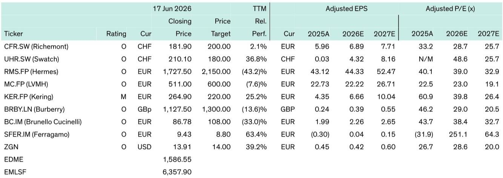
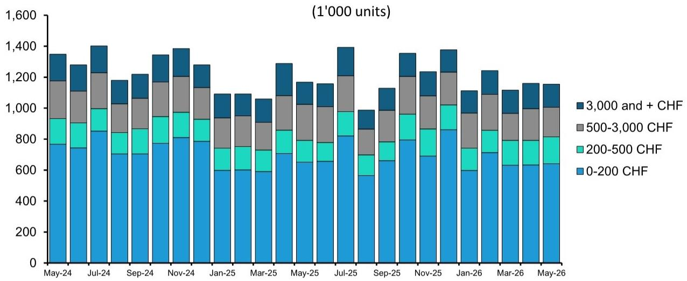
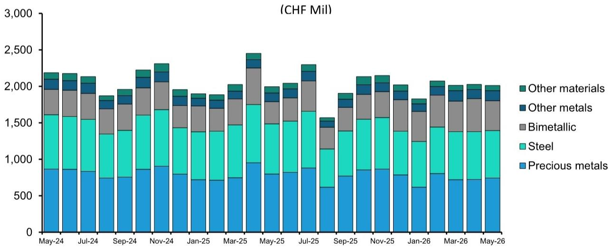

# Swiss Watch Exports Are Recovering, But the Real Story Is Not the Headline Number

The headline looks encouraging. Swiss watch exports grew marginally by 0.4% year-on-year in May 2026. Adjust for calendar effects—two fewer working days—and the figure jumps to a striking 10.4% increase. After a painful 16.6% decline in April, this appears to be the rebound the luxury industry has been waiting for.

It is not.

The recovery is real, but it is narrow, fragile, and overwhelmingly driven by arithmetic rather than demand. Strip out the United States, and total exports actually declined 1.2% year-on-year. The US market alone accounted for the entire headline gain and then some. This is not a broad-based recovery. It is a statistical rebound from a brutal comparison base, concentrated in one geography, and masking a deeper structural uncertainty across the rest of the world.

For investors tracking the luxury goods sector, the May data from Swiss watch exports offers a critical lens into the health of global luxury demand. Watches are a leading indicator for high-end discretionary spending, and the pattern emerging is one of bifurcation. The US consumer is holding, China is stabilizing at low levels, the Middle East is weakening, and Europe is being distorted by logistics flows. Beneath the surface, every data point needs to be read with a careful eye on base effects, inventory cycles, and geopolitical risk.

The question is not whether luxury demand is recovering. The question is where the recovery is real, where it is borrowed, and where it is at risk of reversing.

## The US Market Is the Engine of the Recovery, But Its Supportive Comparisons Will Not Last Forever

Exports to the United States grew 12.3% year-on-year in May. That sounds strong. But it follows a 25% decline in the same month last year. The comparison base is so low that almost any positive number would look like a recovery. On a last-twelve-month basis, exports to the US are still down 19% year-on-year. The improvement from 21% in April is marginal.

The critical insight here is timing. The US comparison base will remain supportive for the rest of 2026, with double-digit negative comparisons in nearly every month except July, when prior-year pull-forward shipments created a 45% base. That means the headline US export numbers are likely to look positive for most of the year, regardless of what underlying demand is doing.

This creates a dangerous illusion. Investors who track monthly export data as a proxy for consumer health risk overestimating the strength of US luxury demand. The reality is that US consumers have absorbed tariff-related price increases, according to company commentary, but the question is how much more they can absorb. Wage growth is moderating, savings are declining, and credit card debt is rising. The luxury sector is betting that high-end consumers are immune to these pressures. That bet has worked so far, but it has not been tested by a sustained economic slowdown.

The real test will come when the base effects normalize in 2027. If US demand is genuinely strong, the year-on-year comparisons will show it. If it is merely holding on, the data will reveal a sudden deceleration. Investors should watch US luxury spending data with a skeptical eye for the next six months, knowing that the numbers are being flattered by arithmetic.

## Greater China Is Stabilizing, But Stabilization Is Not Recovery

The Greater China story is more nuanced than the headline numbers suggest. Exports to Hong Kong grew 3.4% year-on-year, while Mainland China declined 21.4%. On a last-twelve-month basis, exports to Greater China declined 0.9%, a gradual improvement from 1.4% in the prior month.

This is stabilization, not recovery. The Chinese luxury consumer has not returned to pre-2024 spending levels. What has changed is that the rate of decline is slowing. The comparable base is becoming easier, and the destocking cycle in the trade channel appears to be nearing its end. But demand at the consumer level remains subdued, with property market weakness, youth unemployment, and a cautious consumer mindset all weighing on discretionary spending.

The risk for luxury brands is that China becomes a drag for longer than expected. The Chinese consumer has historically been the marginal driver of global luxury growth, and their absence has been masked by US strength. If the US softens at the same time that China fails to rebound, the luxury sector faces a demand vacuum that no other region can fill.

The Middle East adds another layer of concern. Exports to the UAE and Saudi Arabia declined 13.5% and 5.9% year-on-year, respectively. The Middle East was a rare bright spot for luxury in 2025, driven by tourism, wealth migration, and regional stability. That growth is now reversing. If the current geopolitical tensions escalate, the indirect effects—reduced travel, higher oil prices, weaker consumer confidence—could spread well beyond the region and threaten the early signs of recovery elsewhere.

## Price Segment Performance Is Driven by Base Effects, Not Consumer Behavior Shifts

The breakdown by price segment is revealing, but not for the reasons most observers would assume. Watches priced between CHF 200 and 500 saw export value grow 23.6% and volume grow 22.2%. Watches above CHF 3,000 saw value grow 3.7% and volume grow 3.0%. In contrast, watches below CHF 200 declined 4.5% in value and 17.2% in volume, while the CHF 500 to 3,000 segment declined 1.4% and 17.4%, respectively.

It would be tempting to conclude that consumers are trading up or that the mid-market is being squeezed. That would be wrong. The variations across price segments are almost entirely explained by differences in year-on-year volume growth, which in turn reflect base distortions from prior year inventory movements and shipment timing.

On a rolling twelve-month basis, overall export volumes increased by 1.2% year-on-year, compared to 0% in April and 0.4% in the first quarter. The improvement is consistent across all price segments. There is no evidence of a structural shift in consumer preference toward higher-priced watches. The data simply shows that the destocking cycle has ended and volumes are slowly normalizing.

The material breakdown tells a similar story. Bimetallic watches showed the strongest growth at 34% year-on-year, while precious metals declined 7.2% and steel declined 5.4%. Again, base effects dominate. Bimetallic watches had a particularly weak comparable period, making the current rebound look dramatic. Precious metals had a strong prior year, making the current decline look worse than it is.

The lesson for investors is to avoid reading too much into any single month of segment data. The real signal is the rolling twelve-month trend, and that trend is one of gradual, unspectacular improvement.

## What the Report Does Not Fully Answer: The Sustainability of the US Consumer and the Risk of a Middle East Spillover

The report provides excellent data and a clear analytical framework, but it leaves two critical questions unresolved.

First, how sustainable is US luxury demand? The report notes that US consumers have absorbed tariff-related price increases, but it does not model what happens if tariffs increase further or if the US economy enters a recession. The US luxury consumer has been remarkably resilient, but resilience is not immunity. The high-end consumer is less sensitive to interest rates and inflation than the mass market, but they are not insensitive to wealth effects. If equity markets decline or housing wealth stagnates, even the affluent consumer may pull back.

Second, what is the full range of outcomes for the Middle East? The report mentions that a drawn-out conflict could threaten recovery through reduced travel, higher oil prices, and weaker consumer confidence. But it does not quantify these risks or map them to specific brand exposures. For investors with significant exposure to Richemont, LVMH, or Hermes, the Middle East is not a marginal market. It has been a growth driver, and its reversal could have a material impact on earnings.

These are not criticisms of the report. They are the natural limits of any data-driven analysis. The data can tell you what is happening, but it cannot tell you what will happen next. That is where judgment, scenario analysis, and a clear investment framework become essential.

## A Decision Framework for Navigating the Luxury Recovery

For investors trying to position in luxury stocks today, the May export data supports three strategic conclusions.

First, take a defensive posture with core exposure to high-quality names at fair value. The recovery is gradual and fragile, not robust and broad-based. This is not the time to chase momentum or bet on high-beta names. Richemont stands out for its strong jewelry momentum and leadership position, which provides earnings visibility that most luxury peers cannot match. Brunello Cucinelli offers quality and the potential for mean reversion if the recovery broadens.

Second, look for self-help stories where company-specific actions can drive performance regardless of the macro environment. LVMH sits at the intersection of high quality and self-help, with Dior's revival, cost efficiencies, and Louis Vuitton's strength offsetting concerns about the Wines and Spirits turnaround and succession dynamics. Burberry's turnaround is well on track, with the one-year anniversary of the Burberry Forward strategy showing improved brand momentum and stronger full-price sell-through. The next leg will focus on driving store productivity by extending momentum from core outerwear into other categories. Ferragamo is at an earlier stage but showing signs of a possible turnaround under a team of experienced executives addressing brand, assortment, and retail network issues.

Third, be prepared for volatility. The report identifies two sources: underlying demand gyrations as consumers navigate a fragile macro environment, and short-term investors playing the sector long and short, amplifying swings beyond natural news flow. This means that even if the fundamentals are slowly improving, stock prices will be volatile. Position sizing and entry points matter more than usual.

The luxury sector is in a recovery, but it is a recovery that requires active management, not passive optimism. The data supports a selective, quality-focused approach with a clear eye on the risks that the headline numbers do not show.

Join the community to read the full report and review the original charts.

*This article is for learning and discussion only and does not constitute investment advice.*

Personal reading notes and learning share only. Not investment advice.

