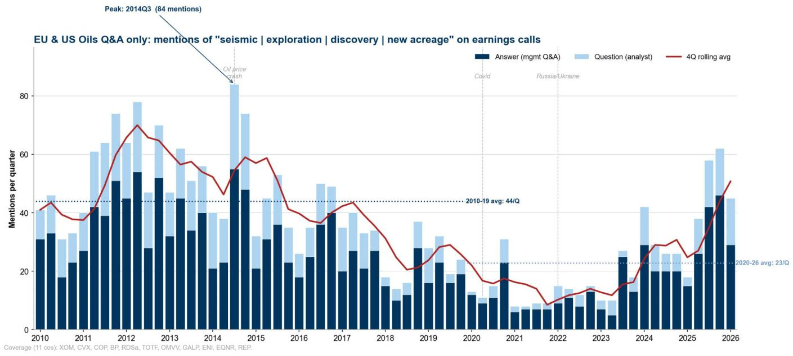
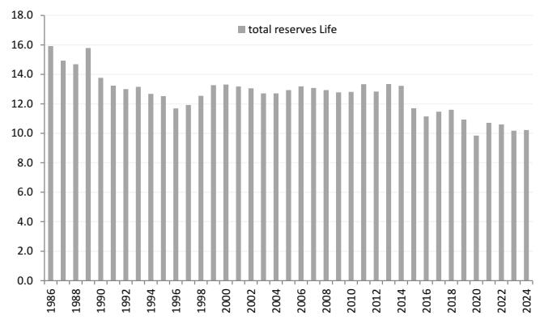
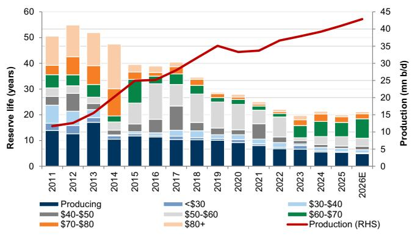
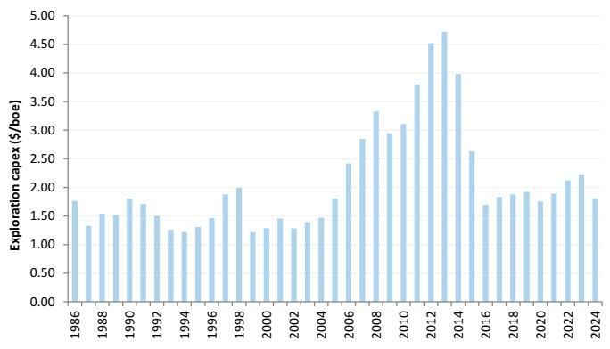
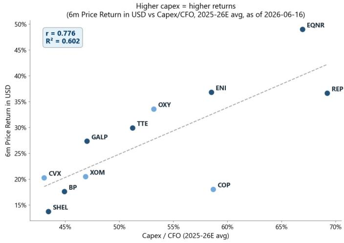
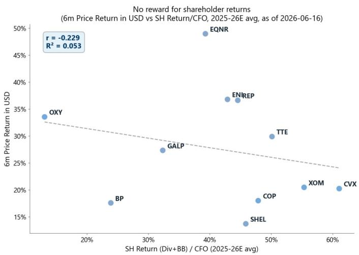
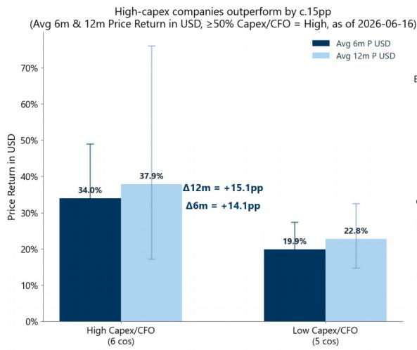
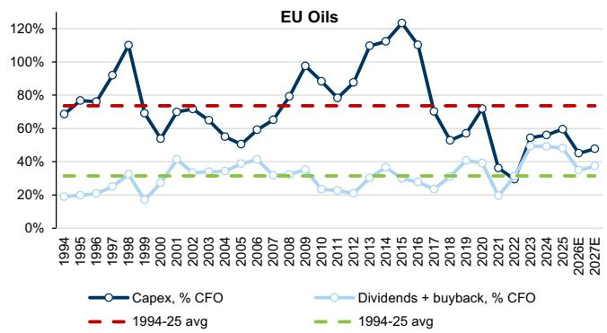
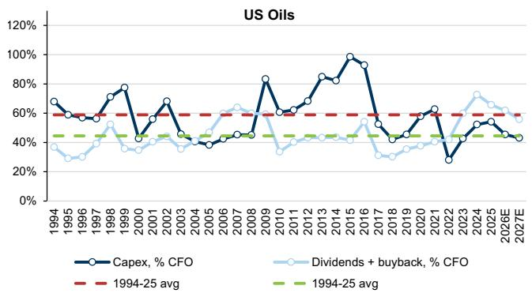
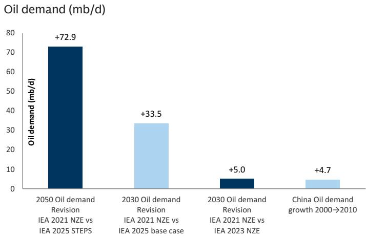

ENERGY: OIL SERVICES

# Key takeaways from call with Viridien post EAGE conference: “Frontier Exploration is back”

The 86th EAGE Annual Conference & Exhibition was held in Aberdeen on 8–11 June 2026, bringing together the full seismic and subsurface supply chain. On 16 June, we hosted Viridien (ex-CGG) CFO Jerome Serve for a fireside chat to share feedback from the event and discuss the broader state of the seismic market post-consolidation. Key takeaways include:

1. EAGE 2026 was the strongest signal in years. Record attendance of >6k delegates, with C-suite engagement stepping up vs 2025, underpinned by reserve replacement and reserve life firmly back on the agenda and reinforced by post-war energy security concerns. This has not yet flowed into seismic revenues — 2026 budgets were locked pre-war — with the inflection expected by Viridien in 2027 (Equinor CMD +9% capex a directional positive); we see this as a disciplined multi-year up-cycle, not a repeat of 2010–15.  
2. The dominant theme was the return of frontier exploration. According to Viridien, historically \~80% of activity was near-field, but near-field alone is insufficient to offset falling reserve life; the last few months show a clear reopening of frontier work, with rising client interest across Uruguay, Equatorial Margin Brazil, Angola, Egypt, Liberia and a broadening GoA. Majors will need time to rebuild frontier expertise after years of underinvestment according to the company.  
3. Reprocessing-led demand was the clear second theme and plays directly to seismic companies. According to Viridien, it's clients' own budgets show more reprocessing in frontier basins, often ahead of drilling, as they look to lock up data early. Behavioural shifts reinforce the trend: prefunding traction is rising, exploration success rates remain low (\~20–25%, basin-dependent) so image quality remains the differentiator, and NOCs increasingly outsource the full image-to-prospect stack to seismic players rather than build it in-house.  
4. Vessel availability is not a constraint today according to the company; day rates stable but with upside if capacity tightens. Streamer fleet consolidated at \~16–17 active vessels (TGS/Shearwater dominant) with stacked capacity reactivatable on a lag; OBN supply is unconstrained but \~4–5x more expensive than streamer-equivalent. Pricing has not increased yet despite consolidation,

Michele Della Vigna, CFA

+39(02)8022-2242

michele.dellavigna@gs.com

GS Bank Europe SF - Milan

branch

Anastasia Shalaeva

+971(4)214-9908

anastasia.shalaeva@gs.com

GS International

Will Chen

+971(4)214-9942 | will.y.chen@gs.com

GS International

Yulia Bocharnikova

+44(20)7051-6299

yulia.bocharnikova@gs.com

GS International

Quentin Marbach

+44(20)7774-7644

quentin.marbach@gs.com

GS International

with Viridien expecting streamer cost inflation to pass through into MCL pricing and OBN pricing to fall over time as deployment efficiency improves.

## 5. AI in seismic is accretive, not substitutive — image quality remains the moat.

Viridien believes that AI cannot solve the physics-based wave equations underpinning imaging; HPC capacity is the structural moat. Its contribution is concentrated in denoising, workflow acceleration and faster delivery, while end-clients increasingly layer their own AI on top of the underlying images, raising rather than commoditising the value of high-quality data. Disintermediation risk is low, in Viridien's view, as its in-house computing still requires data from the multi-client library, while NOCs and independent players will likely choose to rely on seismic player's specialized capabilities.

## Key takeaways from the fireside chat with Viridien post EAGE conference

EAGE 2026 was the strongest signal in years; exploration is “back, or soon to be back”.

Record attendance of >6k delegates (all-time high per organisers), with EAGE the largest seismic event globally alongside IMAGE in Houston, and all key service players and key clients were present.  
C-suite engagement stepped up vs 2025, with the improved sentiment underpinned by reserve replacement and reserve life firmly back on the agenda and reinforced by post-war energy-security concerns.  
This has not yet translated into seismic companies revenues, as 2026 client budgets were locked pre-war, with the inflection expected by Viridien in 2027 budgets (Equinor's CMD +9% capex guide a directional positive).

Main themes: return of frontier exploration, with reprocessing-led demand a clear second and regional interest broadening

- Appetite for genuine frontier work has clearly increased: According to Viridien, historically \~80% of activity was near-field; near-field exploration continues but is not sufficient to offset the falling reserve life, with it’s clients’ own budgets showing more reprocessing in frontier basins, often ahead of drilling, as they look to lock up data early. The last few months show a genuine return to frontier, per Viridien, but majors have lost frontier-basin expertise after years of underinvestment and will need time to rebuild it.  
Viridien flagged rising client interest across Uruguay (Namibia analogue), Equatorial Margin Brazil (completely unexplored, massive area, Petrobras drilling its first well), Angola (multiple majors back in), Egypt, Liberia, and a broadening US Gulf of America as more independents return — with MoUs being signed including with countries Viridien had never engaged before.  
Viridien believes its Earth Data library is best positioned in Norway, GoM and Brazil, all currently seeing significant client interest.  
Reprocessing is the near-term workhorse and plays directly into Viridien's edge (proprietary AI + in-house HPC), offering clients a cheaper route to better basin understanding than new acquisition.

Cycle outlook: a disciplined multi-year up-cycle, not a repeat of 2010–15

■ Management was explicit and believes that the industry will not return to the spending exuberance of 10–15 years ago, when the prior cycle peaked at \~60 active streamer vessels — a level unlikely to be revisited. It believes clients are permanently more shareholder-return focused and selective.  
■ Management is convinced that 2027 budgets will be set materially higher, marking the inflection point for the new cycle.  
A sustained, multi-year up-cycle through the decade is plausible, per the company, supported by reserve-replacement pressure, frontier re-engagement, a rising

sovereign MoU pipeline, growing prefunding, and replacement-driven new streamer/OBN technology sales.

## Client appetite for seismic is shifting to reprocessing first, with a behavioural shift toward prefunding and outsourcing.

Viridien said that refunding traction is rising (the ability to assemble prefunded surveys is itself a signal of client intent), and the outsourcing trend is accelerating, with NOCs (e.g. ADNOC) increasingly handing the full image-to-prospect workflow to Viridien rather than building it in-house.  
Exploration success rates remain low (\~20–25%, basin-dependent), so image quality remains the differentiator.

## Vessel availability is not a constraint today; day rates stable but with potential for upside if capacity tightens

The streamer fleet is consolidated at \~16–17 active vessels, dominated by TGS and Shearwater (PXGEO, Dubai, Chinese players on the fringe); no issue sourcing vessels and stacked capacity can be reactivated (with a lag) if the market tightens, according to Viridien.  
- OBN is a different supply curve: no specialised vessels needed and competition small, but absolute price remains \~4–5x more expensive than streamer-equivalent; its clients want more OBN but are price-restrained, and the industry is working to reduce sensor deployment time.  
- Pricing has not increased yet despite consolidation; if streamer costs rise, Viridien will pass through into MCL pricing, while OBN pricing is expected to fall over time.

## AI in seismic is accretive, not substitutive — image quality remains the moat, and Viridien is positioned to capture it.

At the industry level, Viridien believes that AI cannot solve the physics-based wave equations that underpin imaging — those remain iterative, HPC-intensive problems — so HPC capacity is still the structural moat.  
AI's contribution is concentrated in denoising, data cleaning and workflow acceleration, while end-clients increasingly layer their own AI tools on top of seismic images to refine prospectivity — image quality is the binding constraint on the value those tools can extract, which raises (rather than commoditises) the value of high-quality underlying data.  
For Viridien specifically, AI is being deployed across its processing workflow and a new cloud delivery interface now ships terabyte-scale image volumes in \~1 day vs \~4 weeks historically, accelerating client re-engagement.  
Sophisticated clients combine Viridien images with their own interpretation tools; less sophisticated NOCs outsource the full image-to-prospect stack to Viridien, supporting the structural outsourcing trend.  
- Disintermediation risk is low, according to the company, as their in-house computing still requires data from the multi-client library, while NOCs and

## independent players will likely choose to rely on seismic player's specialized capabilities.

E&P spending cycle: the beginning of a new oil capex upcycle?

The seismic industry is an amplified derivative of the E&P capital expenditure cycle, in our view, with exploration expenses acting as one of the most volatile components of upstream budgets. The sector experienced a severe, multi-year contraction between 2014 and 2021, during which time the global seismic market shrank. The marine seismic industry has seen a c.85%-90% contraction in streamer fleet capacity since 2014.

## The revival of exploration

We are starting to see early signs of a revival in exploration activity, with both management commentary and analyst questions turning incrementally more constructive on new resource discovery, seismic work and frontier acreage. As shown in Exhibit 1, mentions of exploration-related themes—which troughed in 2020-22 following years of capital discipline—are now clearly inflecting upwards and approaching the high levels of 2014. This shift is consistent with a gradual rebalancing of capital allocation as balance sheets have strengthened and companies look to replenish resource bases after a prolonged period of underinvestment. While still early-cycle, the change in tone suggests that exploration is moving back up the agenda for the majors, supporting a recovery in seismic demand over time.

Exhibit 1: While still early cycle, the change in tone suggests that exploration is moving back up the agenda for the majors, supporting a recovery in seismic demand over time  

bar-line hybrid chart

| Year | Answer (mgmt Q&A) | Question (analyst) | 4Q rolling avg |
|---|---|---|---|
| 2010 | 31 | 25 | 42 |
| 2011 | 27 | 28 | 39 |
| 2012 | 50 | 35 | 60 |
| 2013 | 32 | 28 | 57 |
| 2014 | 21 | 38 | 46 |
| 2015 | 21 | 28 | 58 |
| 2016 | 18 | 25 | 41 |
| 2017 | 20 | 28 | 43 |
| 2018 | 15 | 18 | 33 |
| 2019 | 16 | 25 | 21 |
| 2020 | 12 | 15 | 17 |
| 2021 | 7 | 8 | 16 |
| 2022 | 8 | 9 | 9 |
| 2023 | 7 | 9 | 13 |
| 2024 | 30 | 30 | 30 |
| 2025 | 20 | 18 | 25 |
| 2026 | 30 | 35 | 51 |
Peak: 2014Q3 (84 mentions)
Oil price crash
Coverage (11 cos): XOM, CVX, COP, BP, RDSa, TOTF, OMVV, GALP, ENI, EQNR, REP.

Source: GS Data Works, Data compiled by GS Global Investment Research

We believe the sector is poised for a significant oil capex upcycle, similar to that of the early 2000s. With OPEC global spare capacity running down, US shale reaching maturity, and reserve life eroded by under-investment, we were already seeing increasing signs of a new oil capex cycle returning, similar to the 2000s. The escalation of geopolitical tensions in the Middle East since late-February has acted as a catalyst to

accelerate and bring forward what we see as a structural capex upcycle coming in 2027E, driven by the following:

1) The industry needs to re-invest in reserve life with more exploration capex: The resource life of Top Projects (recoverable resources/production) has fallen to c.20 years in 2026E from c.55 years in 2012, a 60% decrease over the past decade, as the industry has focused on short-cycle and brownfield (to support lower decline rates in the near term, at the expense of longer reserve life).

Exhibit 2: Industry reserve life was broadly flat at 10.2 years in 2024  
Reserve life (year) per FAS69 data  

bar chart

| Year | total reserves Life |
| ---- | ------------------- |
| 1986 | 16.0                |
| 1988 | 15.0                |
| 1990 | 16.0                |
| 1992 | 13.0                |
| 1994 | 13.0                |
| 1996 | 12.0                |
| 1998 | 13.0                |
| 2000 | 13.0                |
| 2002 | 13.0                |
| 2004 | 13.0                |
| 2006 | 13.0                |
| 2008 | 13.0                |
| 2010 | 13.0                |
| 2012 | 13.0                |
| 2014 | 13.0                |
| 2016 | 11.0                |
| 2018 | 11.0                |
| 2020 | 10.0                |
| 2022 | 11.0                |
| 2024 | 10.0                |

Source: Company data, GS Global Investment Research

Exhibit 3: Top Projects oil reserve life has fallen 35 years since 2012  
Top Projects reserve life, by year of report and breakeven  

bar-line hybrid

| Year   | Producing | <$30 | $30-$40 | $40-$50 | $50-$60 | $60-$70 | $70-$80 | $80+ |
|--------|------------|------|---------|---------|---------|---------|---------|------|
| 2011   | 14         | 6    | 4       | 4       | 4       | 4       | 4       | 10   |
| 2012   | 14         | 6    | 4       | 4       | 4       | 4       | 4       | 12   |
| 2013   | 14         | 6    | 4       | 4       | 4       | 4       | 4       | 12   |
| 2014   | 14         | 6    | 4       | 4       | 4       | 4       | 4       | 16   |
| 2015   | 14         | 6    | 4       | 4       | 4       | 4       | 4       | 18   |
| 2016   | 14         | 6    | 4       | 4       | 4       | 4       | 4       | 18   |
| 2017   | 14         | 6    | 4       | 4       | 4       | 4       | 4       | 20   |
| 2018   | 14         | 6    | 4       | 4       | 4       | 4       | 4       | 22   |
| 2019   | 14         | 6    | 4       | 4       | 4       | 4       | 4       | 25   |
| 2020   | 14         | 6    | 4       | 4       | 4       | 4       | 4       | 25   |
| 2021   | 14         | 6    | 4       | 4       | 4       | 4       | 4       | 25   |
| 2022   | 14         | 6    | 4       | 4       | 4       | 4       | 4       | 25   |
| 2023   | 14         | 6    | 4       | 4       | 4       | 4       | 4       | 25   |
| 2024   | 14         | 6    | 4       | 4       | 4       | 4       | 4       | 25   |
| 2025   | 14         | 6    | 4       | 4       | 4       | 4       | 4       | 25   |
| 2026E  | 14         | 6    | 4       | 4       | 4       | 4       | 4       | 25   |
The chart includes a line graph (Production) on the right Y-axis and a stacked bar chart (Reserve Life) on the left Y-axis. The legend indicates categories: Production (RHS). The X-axis represents years from '2011 to '2026E. Values are estimated based on the chart's axis labels.

Source: GS Global Investment Research

Conventional discoveries have remained low, with Oil & Gas capex/boe still c.40% below the peak and exploration down c.60%, tilting the sources of new reserves increasingly toward revisions and M&A, rather than organic, exploration-led additions. Total capex per barrel continued its downward trend to \$14.7/boe in 2024, down 39% from its \$24.2/boe peak in 2013. In particular, exploration capex was down 59% from its peak at \$1.8/boe in 2024.

Exhibit 4: Exploration capex was down 59% from its peak at \$1.8/boe in 2024  
Exploration capex per bboe per FAS69 data  

bar chart

| Year | Exploration capex ($/boe) |
| ---- | -------------------------- |
| 1986 | 1.75                       |
| 1987 | 1.35                       |
| 1988 | 1.55                       |
| 1989 | 1.50                       |
| 1990 | 1.80                       |
| 1991 | 1.70                       |
| 1992 | 1.50                       |
| 1993 | 1.30                       |
| 1994 | 1.25                       |
| 1995 | 1.30                       |
| 1996 | 1.45                       |
| 1997 | 1.85                       |
| 1998 | 2.00                       |
| 1999 | 1.25                       |
| 2000 | 1.35                       |
| 2001 | 1.45                       |
| 2002 | 1.30                       |
| 2003 | 1.40                       |
| 2004 | 1.50                       |
| 2005 | 1.80                       |
| 2006 | 2.40                       |
| 2007 | 2.85                       |
| 2008 | 3.35                       |
| 2009 | 3.00                       |
| 2010 | 3.15                       |
| 2011 | 3.75                       |
| 2012 | 4.50                       |
| 2013 | 4.75                       |
| 2014 | 4.00                       |
| 2015 | 2.65                       |
| 2016 | 1.75                       |
| 2017 | 1.85                       |
| 2018 | 1.90                       |
| 2019 | 1.85                       |
| 2020 | 1.75                       |
| 2021 | 1.85                       |
| 2022 | 2.15                       |
| 2023 | 2.25                       |
| 2024 | 1.85                       |

Source: Company data, GS Global Investment Research

2) The market is rewarding reinvestment again: After years of demanding capital discipline and cash returns, the market appears to be shifting back towards rewarding capex and growth. Across our integrated oil universe, companies with higher

reinvestment ratios (Capex/CFO) have outperformed lower-reinvestment peers by 14pp over the past 6 months. Among the supermajors, TotalEnergies (+30%) has outperformed Shell (+14%) and BP (+18%) in Europe; in the US the relationship is more pronounced over the last 12m while 6m shows a more limited dispersion, with ExxonMobil (+26%/+21%) and Chevron (+23%/+20%). Capex intensity shows a strong positive correlation with 6-month share price performance (r = +0.78), while the relationship with shareholder distributions (dividends + buybacks) has been negligible. At the same time, the reinvestment ratio is still c.15pp below the long-term average (c.60%/45% of CFO for EU/US Oils vs. historical averages of c.75%/60%).

Exhibit 5: Capex reinvestment is being rewarded by the market and has correlated with higher total return in the last 12 months  
12-month share price returns in USD  

scatterplot

| Company | 6m Price Return in USD | Capex / CFO (2025-26E avg) |
|---------|------------------------|-----------------------------|
| SHEL    | 14%                    | 43%                         |
| BP      | 18%                    | 45%                         |
| CVX     | 20%                    | 43%                         |
| XOM     | 20%                    | 47%                         |
| GALP    | 28%                    | 47%                         |
| OXY     | 34%                    | 53%                         |
| TTE     | 30%                    | 51%                         |
| ENI     | 37%                    | 58%                         |
| COP     | 18%                    | 59%                         |
| REP     | 37%                    | 69%                         |
| EQNR    | 49%                    | 67%                         |

scatterplot

No reward for shareholder returns (6m Price Return in USD vs SH Return/CFO, 2025-26E avg, as of 2026-06-16)
| Company | SH Return (Div+BB) / CFO (2025-26E avg) (%) | 6m Price Return in USD (%) |
| :--- | :--- | :--- |
| OXY | 15 | 33.5 |
| BP | 24 | 17.8 |
| GALP | 33 | 27.5 |
| EQNR | 40 | 49.5 |
| ENREP | 43 | 37.0 |
| TTE | 50 | 30.0 |
| COP | 48 | 18.0 |
| SHEL | 47 | 14.0 |
| XOM | 55 | 20.5 |
| CVX | 61 | 20.5 |

Source: LSEG Data & Analytics, GS Global Investment Research

Exhibit 6: Longer reserve-life companies have outperformed as the market rewarded resource depth  

bar chart

High-capex companies outperform by c.15pp (Avg 6m & 12m Price Return in USD, ≥50% Capex/CFO = High, as of 2026-06-16)
| Category | Avg 6m P USD (%) | Avg 12m P USD (%) |
|---|---|---|
| High Capex/CFO (6 cos) | 34.0 | 37.9 |
| Low Capex/CFO (5 cos) | 19.9 | 22.8 |
Δ12m = +15.1pp; Δ6m = +14.1pp

bar chart

Company returns ranked by capex intensity (6m & 12m Price Return in USD, sorted by Capex/CFO low → high, as of 2026-06-16)
| Company | 6m P USD (%) | 12m P USD (%) |
| :--- | :--- | :--- |
| REP (Capex/CFO=69%) | 37 | 84 |
| EQNR (Capex/CFO=67%) | 49 | 24 |
| COP (Capex/CFO=59%) | 18 | 17 |
| ENI (Capex/CFO=59%) | 37 | 57 |
| OXY (Capex/CFO=53%) | 34 | 18 |
| TTE (Capex/CFO=51%) | 30 | 34 |
| GALP (Capex/CFO=47%) | 28 | 17 |
| XOM (Capex/CFO=47%) | 20 | 26 |
| BP (Capex/CFO=45%) | 18 | 32 |
| SHEL (Capex/CFO=43%) | 14 | 15 |
| CVX (Capex/CFO=43%) | 20 | 23 |

Source: LSEG Data & Analytics, GS Global Investment Research

Exhibit 7: Capital allocation remains skewed towards distributions with payout levels >10 pp above history and reinvestment levels remaining c.15 pp below historical norms  
EU Oils vs. US Oils capex intensity and payout, % CFO  

line chart

| Year | Capex, % CFO | Dividends + buyback, % CFO | 1994-25 avg | 1994-25 avg |
| --- | --- | --- | --- | --- |
| 1994 | 70% | 20% | 70% | 30% |
| 1995 | 75% | 25% | 70% | 30% |
| 1996 | 80% | 30% | 70% | 30% |
| 1997 | 90% | 35% | 70% | 30% |
| 1998 | 110% | 40% | 70% | 30% |
| 1999 | 70% | 20% | 70% | 30% |
| 2000 | 55% | 30% | 70% | 30% |
| 2001 | 70% | 40% | 70% | 30% |
| 2002 | 75% | 35% | 70% | 30% |
| 2003 | 70% | 30% | 70% | 30% |
| 2004 | 65% | 35% | 70% | 30% |
| 2005 | 55% | 40% | 70% | 30% |
| 2006 | 60% | 35% | 70% | 30% |
| 2007 | 70% | 30% | 70% | 30% |
| 2008 | 80% | 35% | 70% | 30% |
| 2009 | 95% | 30% | 70% | 30% |
| 2010 | 85% | 25% | 70% | 30% |
| 2011 | 80% | 20% | 70% | 30% |
| 2012 | 95% | 35% | 70% | 30% |
| 2013 | 110% | 40% | 70% | 30% |
| 2014 | 115% | 35% | 70% | 30% |
| 2015 | 125% | 30% | 70% | 30% |
| 2016 | 115% | 25% | 70% | 30% |
| 2017 | 75% | 20% | 70% | 30% |
| 2018 | 55% | 35% | 70% | 30% |
| 2019 | 65% | 40% | 70% | 30% |
| 2020 | 75% | 35% | 70% | 30% |
| 2021 | 35% | 25% | 70% | 30% |
| 2022 | 55% | 45% | 70% | 30% |
| 2023E | 65% | 45% | 70% | 30% |
| 2024E | 65% | 45% | 70% | 30% |
| 2025E | 65% | 45% | 70% | 30% |
| 2026E | 65% | 45% | 70% | 30% |

line chart

| Year | Capex, % CFO | Dividends + buyback, % CFO | 1994-25 avg |
|------|--------------|----------------------------|-------------|
| 1994 | 65%          | 35%                        | 60%         |
| 1995 | 60%          | 30%                        | 60%         |
| 1996 | 55%          | 35%                        | 60%         |
| 1997 | 60%          | 40%                        | 60%         |
| 1998 | 70%          | 45%                        | 60%         |
| 1999 | 75%          | 50%                        | 60%         |
| 2000 | 40%          | 35%                        | 60%         |
| 2001 | 50%          | 35%                        | 60%         |
| 2002 | 65%          | 40%                        | 60%         |
| 2003 | 40%          | 35%                        | 60%         |
| 2004 | 35%          | 35%                        | 60%         |
| 2005 | 35%          | 40%                        | 60%         |
| 2006 | 40%          | 45%                        | 60%         |
| 2007 | 45%          | 50%                        | 60%         |
| 2008 | 85%          | 45%                        | 60%         |
| 2009 | 60%          | 35%                        | 60%         |
| 2010 | 60%          | 35%                        | 60%         |
| 2011 | 65%          | 40%                        | 60%         |
| 2012 | 75%          | 45%                        | 60%         |
| 2013 | 85%          | 50%                        | 60%         |
| 2014 | 95%          | 45%                        | 60%         |
| 2015 | 100%         | 50%                        | 60%         |
| 2016 | 95%          | 45%                        | 60%         |
| 2017 | 50%          | 35%                        | 60%         |
| 2018 | 45%          | 35%                        | 60%         |
| 2019 | 50%          | 40%                        | 60%         |
| 2020 | 60%          | 45%                        | 60%         |
| 2021 | 65%          | 50%                        | 60%         |
| 2022 | 30%          | 35%                        | 60%         |
| 2023 | 45%          | 45%                        | 60%         |
| 2024E| 55%          | 75%                        | 60%         |
| 2025E| 50%          | 75%                        | 60%         |
| 2026E| 45%          | 75%                        | 60%         |
| 2027E| 45%          | 75%                        | 60%         |

Source: Company data, GS Global Investment Research

3) We are seeing structural upward revisions to the long-term oil demand outlook at a time when OPEC spare capacity is at a multi-year low and US shale production is flattening out. Nearly all the world's global crude spare capacity (which our commodities team estimate at 3.7mb/d before the war) is currently constrained by disruptions in the Strait of Hormuz (SoH). However, assuming no large persistent losses in potential oil output, history suggests OPEC is likely to deploy its spare capacity after SoH's reopening to help stabilize tight markets and make up for some production losses during the disruption, when production dropped below the quota. Separately, OPEC+ members will conduct an annual capacity audit in November 2026 to reset 2027 baselines to ensure that the group sets output quotas that are more closely aligned with each country's real capacity. At the same time, the IEA has increased the 2030 oil demand forecast by 5 mn bl/d vs. the 2021 NZE report - equivalent to growth in China demand in the first decade of the 2000s.

Exhibit 8: IEA's NZE +5 mboed upward revision to 2030 oil demand is comparable in scale to China's oil demand growth over 2000-10  

bar chart

Oil demand (mb/d)
| Scenario | Oil demand (mb/d) |
| :--- | :--- |
| 2050 Oil demand Revision IEA 2021 NZE vs IEA 2025 STEPS | +72.9 |
| 2030 Oil demand Revision IEA 2021 NZE vs IEA 2025 base case | +33.5 |
| 2030 Oil demand Revision IEA 2021 NZE vs IEA 2023 NZE | +5.0 |
| China Oil demand growth 2000→2010 | +4.7 |

Source: IEA, Statistical Review of World Energy

## Competition analysis

Seismic services: Since 2014, the marine seismic industry has undergone a super consolidation phase, moving from eight meaningful global players to three players by

2026, following a prolonged downturn marked by bankruptcies, asset sales and restructuring. Between 2015 and 2022, Dolphin, Polarcus and ION Geophysical withdrew from the market following liquidation or Chapter 11, while CGG and WesternGeco transitioned away from the acquisition models. The consolidation phase accelerated post restructuring: Shearwater acquired the WesternGeco fleet (2018), Polarcus assets and CGG vessels; TGS acquired ION's data library (2022) and Magseis Fairfield (2023), and merged with PGS in July 2024, absorbing its entire fleet; CGG changed its name to Viridien in 2024 and fully exited vessel ownership by early 2025. As a result, ownership of high-end streamer and OBN capacity is now concentrated among TGS and Shearwater, alongside Chinese state-backed COSL/BGP.

This consolidation has been accompanied by a significant contraction in supply. Global active 3D seismic vessel capacity has fallen by c.70%, from c.60 vessels in 2013 to c.17-20 today, with no newbuilds since 2017 and an ageing fleet. The industry has bifurcated into two distinct models: capital-intensive, fully integrated operators (TGS and Shearwater) controlling the vast majority of Western streamer and OBN capacity, and asset-light data and technology players such as Viridien and SLB (WesternGeco) focused on multi-client libraries, imaging and digital solutions. High replacement costs, limited shipyard availability and disciplined capital allocation have materially raised barriers to entry. With exploration activity recovering, this structurally tighter market supports improved utilisation, pricing power and cash generation for the remaining operators, marking a break from the fragmented, excess capacity model that defined the pre-2014 cycle.

Exhibit 9: Seismic services: 2014 vs now

<table><tr><td colspan="7">Seismic Services</td></tr><tr><td>2014 Players</td><td>Status</td><td>Comments</td><td>2026 Players</td><td>Status</td><td>2014 →</td><td>Now</td></tr><tr><td>CGG</td><td>Restructured</td><td>renamed Viridien</td><td>TGS</td><td>Consolidator</td><td>8</td><td>3</td></tr><tr><td>WesternGeco (SLB)</td><td>Merged</td><td>with Shearwater</td><td>Viridien</td><td>Restructured</td><td>players</td><td>players</td></tr><tr><td>TGS-NOPEC</td><td>Active</td><td></td><td>Shearwater</td><td>Active</td><td colspan="2">-60% consolidation</td></tr><tr><td>PGS</td><td>Merged</td><td>with TGS</td><td>COSL (seismic)</td><td>Active</td><td></td><td></td></tr><tr><td>ION Geophysical</td><td>Restructured</td><td>Pivoted</td><td></td><td></td><td></td><td></td></tr><tr><td>Delphin</td><td>Bankrupt</td><td></td><td></td><td></td><td></td><td></td></tr><tr><td>Polareus</td><td>Bankrupt</td><td></td><td></td><td></td><td></td><td></td></tr><tr><td>COSL (seismic)</td><td>Active</td><td>CNOOC subsid.</td><td></td><td></td><td></td><td></td></tr></table>

Source: Company data, GS Global Investment Research

## Disclosure Appendix

## Reg AC

We, Michele Della Vigna, CFA, Anastasia Shalaeva, Will Chen, Yulia Bocharnikova and Quentin Marbach, hereby certify that all of the views expressed in this report accurately reflect our personal views about the subject company or companies and its or their securities. We also certify that no part of our compensation was, is or will be, directly or indirectly, related to the specific recommendations or views expressed in this report.

Unless otherwise stated, the individuals listed on the cover page of this report are analysts in GS' Global Investment Research division.

Contributing Authors: Michele Della Vigna, CFA GS Bank Europe SE - Milan branch, Anastasia Shalaeva GS International, Will Chen GS International, Yulia Bocharnikova GS International, Quentin Marbach GS International.

Unless otherwise stated, the individuals listed in the Contributing Authors disclosure of this report are analysts in GS' Global Investment Research division.

## GS Factor Profile

The GS Factor Profile provides investment context for a stock by comparing key attributes to the market (i.e. our universe of rated stocks) and its sector peers. The four key attributes depicted are: Growth, Financial Returns, Multiple (e.g. valuation) and Integrated (a composite of Growth, Financial Returns and Multiple). Growth, Financial Returns and Multiple are calculated by using normalized ranks for specific metrics for each stock. The normalized ranks for the metrics are then averaged and converted into percentiles for the relevant attribute. The precise calculation of each metric may vary depending on the fiscal year, industry and region, but the standard approach is as follows:

Growth is based on a stock's forward-looking sales growth, EBITDA growth and EPS growth (for financial stocks, only EPS and sales growth), with a higher percentile indicating a higher growth company. Financial Returns is based on a stock's forward-looking ROE, ROCE and CROCI (for financial stocks, only ROE), with a higher percentile indicating a company with higher financial returns. Multiple is based on a stock's forward-looking P/E, P/B, price/dividend (P/D), EV/EBITDA, EV/FCF and EV/Debt Adjusted Cash Flow (DACF) (for financial stocks, only P/E, P/B and P/D), with a higher percentile indicating a stock trading at a higher multiple. The Integrated percentile is calculated as the average of the Growth percentile, Financial Returns percentile and (100% - Multiple percentile).

Financial Returns and Multiple use the GS analyst forecasts at the fiscal year-end at least three quarters in the future. Growth uses inputs for the fiscal year at least seven quarters in the future compared with the year at least three quarters in the future (on a per-share basis for all metrics).

For a more detailed description of how we calculate the GS Factor Profile, please contact your GS representative.

## M&A Rank

Across our global coverage, we examine stocks using an M&A framework, considering both qualitative factors and quantitative factors (which may vary across sectors and regions) to incorporate the potential that certain companies could be acquired. We then assign a M&A rank as a means of scoring companies under our rated coverage from 1 to 3, with 1 representing high (30%-50%) probability of the company becoming an acquisition target, 2 representing medium (15%-30%) probability and 3 representing low (0%-15%) probability. For companies ranked 1 or 2, in line with our standard departmental guidelines we incorporate an M&A component into our target price. M&A rank of 3 is considered immaterial and therefore does not factor into our price target, and may or may not be discussed in research.

## Quantum

Quantum is GS' proprietary database providing access to detailed financial statement histories, forecasts and ratios. It can be used for in-depth analysis of a single company, or to make comparisons between companies in different sectors and markets.

## Disclosures

## Distribution of ratings/investment banking relationships

GS Investment Research global Equity coverage universe

<table><tr><td rowspan="2"></td><td colspan="3">Rating Distribution</td><td colspan="3">Investment Banking Relationships</td></tr><tr><td>Buy</td><td>Hold</td><td>Sell</td><td>Buy</td><td>Hold</td><td>Sell</td></tr><tr><td>Global</td><td>50%</td><td>34%</td><td>16%</td><td>65%</td><td>60%</td><td>45%</td></tr></table>

As of April 1, 2026, GS Global Investment Research had investment ratings on 3,074 equity securities. GS assigns stocks as Buys and Sells on various regional Investment Lists; stocks not so assigned are deemed Neutral. Such assignments equate to Buy, Hold and Sell for the purposes of the above disclosure required by the FINRA Rules. See ‘Ratings, Coverage universe and related definitions’ below. The Investment Banking Relationships chart reflects the percentage of subject companies within each rating category for whom GS has provided investment banking services within the previous twelve months.

## Regulatory disclosures

## Disclosures required by United States laws and regulations

See company-specific regulatory disclosures above for any of the following disclosures required as to companies referred to in this report: manager or co-manager in a pending transaction; 1% or other ownership; compensation for certain services; types of client relationships; managed/co-managed public offerings in prior periods; directorships; for equity securities, market making and/or specialist role. GS trades or may trade as a principal in debt securities (or in related derivatives) of issuers discussed in this report.

The following are additional required disclosures: Ownership and material conflicts of interest: GS policy prohibits its analysts, professionals reporting to analysts and members of their households from owning securities of any company in the analyst's area of coverage. Analyst compensation: Analysts are paid in part based on the profitability of GS, which includes investment banking revenues. Analyst as officer or director: GS policy generally prohibits its analysts, persons reporting to analysts or members of their households from serving as an officer, director or advisor of any company in the analyst's area of coverage. Non-U.S. Analysts: Non-U.S. analysts may not be associated persons of GS & Co. LLC and therefore may not be subject to FINRA Rule 2241 or FINRA Rule 2242 restrictions on communications with a subject company, public appearances and trading in securities covered by the analysts.

Distribution of ratings: See the distribution of ratings disclosure above. Price chart: See the price chart, with changes of ratings and price targets in prior periods, above, or, if electronic format or if with respect to multiple companies which are the subject of this report, on the GS website at https://www.gs.com/research/hedge.html.

## Additional disclosures required under the laws and regulations of jurisdictions other than the United States

The following disclosures are those required by the jurisdiction indicated, except to the extent already made above pursuant to United States laws and regulations. Australia: GS Australia Pty Ltd and its affiliates are not authorised deposit-taking institutions (as that term is defined in the Banking Act 1959 (Cth)) in Australia and do not provide banking services, nor carry on a banking business, in Australia. This research, and any access to it, is intended only for “wholesale clients” within the meaning of the Australian Corporations Act, unless otherwise agreed by GS. In producing research reports, members of Global Investment Research of GS Australia may attend site visits and other meetings hosted by the companies and other entities which are the subject of its research reports. In some instances the costs of such site visits or meetings may be met in part or in whole by the issuers concerned if GS Australia considers it is appropriate and reasonable in the specific circumstances relating to the site visit or meeting. To the extent that the contents of this document contains any financial product advice, it is general advice only and has been prepared by GS without taking into account a client’s objectives, financial situation or needs. A client should, before acting on any such advice, consider the appropriateness of the advice having regard to the client’s own objectives, financial situation and needs. A copy of certain GS Australia and New Zealand disclosure of interests and a copy of GS’ Australian Sell-Side Research Independence Policy Statement are available at: https://www.goldmansachs.com/disclosures/australia-new-zealand/index.html. Brazil: Disclosure information in relation to CVM Resolution n. 20 is available at https://www.gs.com/worldwide/brazil/area/gir/index.html. Where applicable, the Brazil-registered analyst primarily responsible for the content of this research report, as defined in Article 20 of CVM Resolution n. 20, is the first author named at the beginning of this report, unless indicated otherwise at the end of the text. Canada: This information is being provided to you for information purposes only and is not, and under no circumstances should be construed as, an advertisement, offering or solicitation by GS & Co. LLC for purchasers of securities in Canada to trade in any Canadian security. GS & Co. LLC is not registered as a dealer in any jurisdiction in Canada under applicable Canadian securities laws and generally is not permitted to trade in Canadian securities and may be prohibited from selling certain securities and products in certain jurisdictions in Canada. If you wish to trade in any Canadian securities or other products in Canada please contact GS Canada Inc., an affiliate of The GS Group Inc., or another registered Canadian dealer. Hong Kong: Further information on the securities of covered companies referred to in this research may be obtained on request from GS (Asia) L.L.C. India: Further information on the subject company or companies referred to in this research may be obtained from GS (India) Securities Private Limited, Research Analyst - SEBI Registration Number INH000001493, 10th Floor, Ascent-Worli, Sudam Kalu Ahire Marg, Worli, Mumbai-400 025, India, Corporate Identity Number U74140MH2006FTC160634, Phone +91 22 6616 9000, Fax +91 22 6616 9001. GS may beneficially own 1% or more of the securities (as such term is defined in clause 2 (h) the Indian Securities Contracts (Regulation) Act, 1956) of the subject company or companies referred to in this research report. Investment in securities market are subject to market risks. Read all the related documents carefully before investing. Registration granted by SEBI and certification from NISM in no way guarantee performance of the intermediary or provide any assurance of returns to investors. GS (India) Securities Private Limited compliance officer and investor grievance contact details can be found at: https://www.goldmansachs.com/worldwide/india/documents/Grievance-Redressal-and-Escalation-Matrix.pdf, and a copy of the annual audit compliance report can be found at this link: https://publishing.gs.com/content/site/india-annual-compliance-report.html. Japan: See below. Korea: This research, and any access to it, is intended only for “professional investors” within the meaning of the Financial Services and Capital Markets Act, unless otherwise agreed by GS. Further information on the subject company or companies referred to in this research may be obtained from GS (Asia) L.L.C., Seoul Branch. New Zealand: GS New Zealand Limited and its affiliates are neither “registered banks” nor “deposit takers” (as defined in the Reserve Bank of New Zealand Act 1989) in New Zealand. This research, and any access to it, is intended for “wholesale clients” (as defined in the Financial Advisers Act 2008) unless otherwise agreed by GS. A copy of certain GS Australia and New Zealand disclosure of interests is available at: https://www.goldmansachs.com/disclosures/australia-new-zealand/index.html. Russia: Research reports distributed in the Russian Federation are not advertising as defined in the Russian legislation, but are information and analysis not having product promotion as their main purpose and do not provide appraisal within the meaning of the Russian legislation on appraisal activity. Research reports do not constitute a personalized investment recommendation as defined in Russian laws and regulations, are not addressed to a specific client, and are prepared without analyzing the financial circumstances, investment profiles or risk profiles of clients. GS assumes no responsibility for any investment decisions that may be taken by a client or any other person based on this research report. Singapore: GS (Singapore) Pte. (Company Number: 198602165W), which is regulated by the Monetary Authority of Singapore, accepts legal responsibility for this research, and should be contacted with respect to any matters arising from, or in connection with, this research. Taiwan: This material is for reference only and must not be reprinted without permission. Investors should carefully consider their own investment risk. Investment results are the responsibility of the individual investor. United Kingdom: Persons who would be categorized as retail clients in the United Kingdom, as such term is defined in the rules of the Financial Conduct Authority, should read this research in conjunction with prior GS on the covered companies referred to herein and should refer to the risk warnings that have been sent to them by GS International. A copy of these risks warnings, and a glossary of certain financial terms used in this report, are available from GS International on request.

European Union and United Kingdom: Disclosure information in relation to Article 6 (2) of the European Commission Delegated Regulation (EU) (2016/958) supplementing Regulation (EU) No 596/2014 of the European Parliament and of the Council (including as that Delegated Regulation is implemented into United Kingdom domestic law and regulation following the United Kingdom's departure from the European Union and the European Economic Area) with regard to regulatory technical standards for the technical arrangements for objective presentation of investment recommendations or other information recommending or suggesting an investment strategy and for disclosure of particular interests or indications of conflicts of interest is available at https://www.gs.com/disclosures/europeanpolicy.html which states the European Policy for Managing Conflicts of Interest in Connection with Investment Research.

Japan: GS Japan Co., Ltd. is a Financial Instrument Dealer registered with the Kanto Financial Bureau under registration number Kinsho 69, and a member of Japan Securities Dealers Association, Financial Futures Association of Japan Type II Financial Instruments Firms Association, and Investment Management Association of Japan. Sales and purchase of equities are subject to commission pre-determined with clients plus consumption tax. See company-specific disclosures as to any applicable disclosures required by Japanese stock exchanges, the Japanese Securities Dealers Association or the Japanese Securities Finance Company.

## Ratings, coverage universe and related definitions

Buy (B), Neutral (N), Sell (S) Analysts recommend stocks as Buys or Sells for inclusion on various regional Investment Lists. Being assigned a Buy or Sell on an Investment List is determined by a stock's total return potential relative to its coverage universe. Any stock not assigned as a Buy or a Sell on an Investment List with an active rating (i.e., a stock that is not Rating Suspended, Not Rated, Early-Stage Biotech, Coverage Suspended or Not Covered), is deemed Neutral. Each region manages Regional Conviction Lists, which are selected from Buy rated stocks on the respective region's Investment Lists and represent investment recommendations focused on the size of the total return potential and/or the likelihood of the realization of the return across their respective areas of coverage. The addition or removal of stocks from such Conviction Lists are managed by the Investment Review Committee or other designated committee in each respective region and do not represent a change in the analysts' investment rating for such stocks.

Total return potential represents the upside or downside differential between the current share price and the price target, including all paid or anticipated dividends, expected during the time horizon associated with the price target. Price targets are required for all covered stocks. The total return potential, price target and associated time horizon are stated in each report adding or reiterating an Investment List membership.

Coverage Universe: A list of all stocks in each coverage universe is available by primary analyst, stock and coverage universe at https://www.gs.com/research/hedge.html.

Not Rated (NR). The investment rating, target price and earnings estimates (where relevant) are removed pursuant to GS policy when GS is acting in an advisory capacity in a merger or in a strategic transaction involving this company, when there are legal, regulatory or policy constraints due to GS' involvement in a transaction, and in certain other circumstances. Early-Stage Biotech (ES). An investment rating and a target price are not assigned pursuant to GS policy when this company has neither a drug, treatment or medical device that has passed a Phase II clinical trial nor a license to distribute a post-Phase II drug, treatment or medical device. Rating Suspended (RS). GS has suspended the investment rating and price target for this stock, because there is not a sufficient fundamental basis for determining an investment rating or target price. The previous investment rating and target price, if any, are no longer in effect for this stock and should not be relied upon. Coverage Suspended (CS). GS has suspended coverage of this company. Not Covered (NC). GS does not cover this company.

## Global product; distributing entities

GS Global Investment Research produces and distributes research products for clients of GS on a global basis. Analysts based in GS offices around the world produce research on industries and companies, and research on macroeconomics, currencies, commodities and portfolio strategy. This research is disseminated in Australia by GS Australia Pty Ltd (ABN 21 006 797 897); in Brazil by GS do Brasil Corretora de Títulos e Valores Mobiliários S.A.; Public Communication Channel GS Brazil: 0800 727 5764 and / or contatogoldmanbrasil@gs.com. Available Weekdays (except holidays), from 9am to 6pm. Canal de Comunicação com o Público GS Brasil: 0800 727 5764 e/ou contatogoldmanbrasil@gs.com. Horário de funcionamento: segunda-feira à sexta-feira (exceto feriados), das 9h às 18h; in Canada by GS & Co. LLC; in Hong Kong by GS (Asia) L.L.C.; in India by GS (India) Securities Private Ltd.; in Japan by GS Japan Co., Ltd.; in the Republic of Korea by GS (Asia) L.L.C., Seoul Branch; in New Zealand by GS New Zealand Limited; in Russia by OOO GS; in Singapore by GS (Singapore) Pte. (Company Number: 198602165W); and in the United States of America by GS & Co. LLC. GS International has approved this research in connection with its distribution in the United Kingdom.

GS International (“GSI”), authorised by the Prudential Regulation Authority (“PRA”) and regulated by the Financial Conduct Authority (“FCA”) and the PRA, has approved this research in connection with its distribution in the United Kingdom.

European Economic Area: GS Bank Europe SE (“GSBE”) is a credit institution incorporated in Germany and, within the Single Supervisory Mechanism, subject to direct prudential supervision by the European Central Bank and in other respects supervised by German Federal Financial Supervisory Authority (Bundesanstalt für Finanzdienstleistungsaufsicht, BaFin) and Deutsche Bundesbank and disseminates research within the European Economic Area.

## General disclosures

This research is for our clients only. Other than disclosures relating to GS, this research is based on current public information that we consider reliable, but we do not represent it is accurate or complete, and it should not be relied on as such. The information, opinions, estimates and forecasts contained herein are as of the date hereof and are subject to change without prior notification. We seek to update our research as appropriate, but various regulations may prevent us from doing so. Other than certain industry reports published on a periodic basis, the large majority of reports are published at irregular intervals as appropriate in the analyst's judgment.

GS conducts a global full-service, integrated investment banking, investment management, and brokerage business. We have investment banking and other business relationships with a substantial percentage of the companies covered by Global Investment Research. GS & Co. LLC, the United States broker dealer, is a member of SIPC (https://www.sipc.org).

Our salespeople, traders, and other professionals may provide oral or written market commentary or trading strategies to our clients and principal trading desks that reflect opinions that are contrary to the opinions expressed in this research. Our asset management area, principal trading desks and investing businesses may make investment decisions that are inconsistent with the recommendations or views expressed in this research.

The analysts named in this report may have from time to time discussed with our clients, including GS salespersons and traders, or may discuss in this report, trading strategies that reference catalysts or events that may have a near-term impact on the market price of the equity securities discussed in this report, which impact may be directionally counter to the analyst's published price target expectations for such stocks. Any such trading strategies are distinct from and do not affect the analyst's fundamental equity rating for such stocks, which rating reflects a stock's return potential relative to its coverage universe as described herein.

We and our affiliates, officers, directors, and employees will from time to time have long or short positions in, act as principal in, and buy or sell, the securities or derivatives, if any, referred to in this research, unless otherwise prohibited by regulation or GS policy.

The views attributed to third party presenters at GS arranged conferences, including individuals from other parts of GS, do not necessarily reflect those of Global Investment Research and are not an official view of GS.

Any third party referenced herein, including any salespeople, traders and other professionals or members of their household, may have positions in the products mentioned that are inconsistent with the views expressed by analysts named in this report.

This research is not an offer to sell or the solicitation of an offer to buy any security in any jurisdiction where such an offer or solicitation would be illegal. It does not constitute a personal recommendation or take into account the particular investment objectives, financial situations, or needs of individual clients. Clients should consider whether any advice or recommendation in this research is suitable for their particular circumstances and, if appropriate, seek professional advice, including tax advice. The price and value of investments referred to in this research and the income from them may fluctuate. Past performance is not a guide to future performance, future returns are not guaranteed, and a loss of original capital may occur. Fluctuations in exchange rates could have adverse effects on the value or price of, or income derived from, certain investments.

Certain transactions, including those involving futures, options, and other derivatives, give rise to substantial risk and are not suitable for all investors. Investors should review current options and futures disclosure documents which are available from GS sales representatives or at https://www.theocc.com/about/publications/character-risks.jsp and https://www.goldmansachs.com/disclosures/cftc\_fcm\_disclosures. Transaction costs may be significant in option strategies calling for multiple purchase and sales of options such as spreads. Supporting documentation will be supplied upon request.

Differing Levels of Service provided by Global Investment Research: The level and types of services provided to you by GS Global Investment Research may vary as compared to that provided to internal and other external clients of GS, depending on various factors including your individual preferences as to the frequency and manner of receiving communication, your risk profile and investment focus and perspective (e.g., marketwide, sector specific, long term, short term), the size and scope of your overall client relationship with GS, and legal and regulatory constraints. As an example, certain clients may request to receive notifications when research on specific securities is published, and certain clients may request that specific data underlying analysts' fundamental analysis available on our internal client websites be delivered to them electronically through data feeds or otherwise. No change to an analyst's fundamental research views (e.g., ratings, price targets, or material changes to earnings estimates for equity securities), will be communicated to any client prior to inclusion of such information in a research report broadly disseminated through electronic publication to our internal client websites or through other means, as necessary, to all clients who are entitled to receive such reports.

All research reports are disseminated and available to all clients simultaneously through electronic publication to our internal client websites. Not all research content is redistributed to our clients or available to third-party aggregators, nor is GS responsible for the redistribution of our research by third party aggregators. For research, models or other data related to one or more securities, markets or asset classes (including related services) that may be available to you, please contact your GS representative or go to https://research.gs.com.

Disclosure information is also available at https://www.gs.com/research/hedge.html or from Research Compliance, 200 West Street, New York, NY 10282.

## © 2026 GS.

You are permitted to store, display, analyze, modify, reformat, and print the information made available to you via this service only for your own use. You may not resell or reverse engineer this information to calculate or develop any index for disclosure and/or marketing or create any other derivative works or commercial product(s), data or offering(s) without the express written consent of GS. You are not permitted to publish, transmit, or otherwise reproduce this information, in whole or in part, in any format to any third party without the express written consent of GS. This foregoing restriction includes, without limitation, using, extracting, downloading or retrieving this information, in whole or in part, to train or finetune a machine learning or artificial intelligence system, or to provide or reproduce this information, in whole or in part, as a prompt or input to any such system.