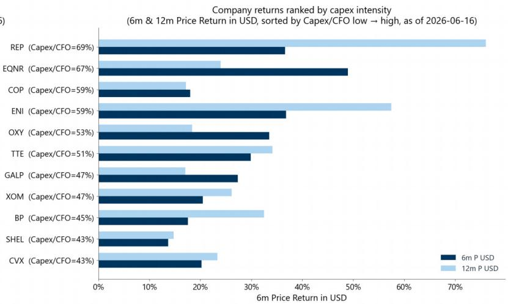
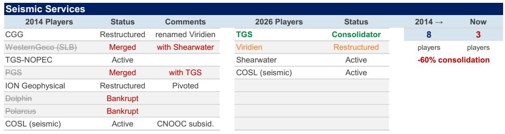

# GS：地震勘探行业正在进入一个被低估的、有纪律的多年度上行周期

市场对油服板块的关注，大多停留在油价波动和短期资本开支上。但一份来自GS的研报，通过与Viridien（原CGG）管理层的深度对话，揭示了一个更关键的结构性信号：全球地震勘探行业，正在经历一场从“资本纪律”到“资源重置”的范式转换。这并非2010-2015年那种由高油价驱动的狂欢，而是一个由储量寿命衰竭、能源安全焦虑和技术壁垒共同支撑的、更可持续的周期起点。

这份报告最值得看的判断是：市场真正低估的不是需求是否回升，而是供给侧的再定价能力以及行业竞争格局的质变。地震勘探行业，尤其是海洋拖缆领域，已经从“产能过剩的苦海”变成了“寡头定价的棋局”。而AI技术的渗透，非但没有削弱核心企业的护城河，反而让高质量成像数据成为了更稀缺的资产。

## 1. EAGE 2026的“爆满”不是噪音，而是储量焦虑的集体投票

2026年6月在阿伯丁举行的第86届EAGE年会，创下了超过6000人的历史参会纪录。这不仅仅是行业聚会的规模扩大。GS报告明确指出，C-level管理层的参与度较2025年显著提升。背后驱动力是“储量替换”和“储量寿命”这两个最根本的行业指标，重新回到了董事会的核心议程。

这意味着什么？过去十年，行业被“资本纪律”和“股东回报”的叙事主导，上游企业普遍削减勘探开支，专注于短周期、低风险的棕地项目。但代价是储量寿命的持续下降。GS数据显示，全球主要油企的储量寿命从2012年的约55年，骤降至2026年预计的约20年。这是一个系统性的“寅吃卯粮”。EAGE的火爆，正是这种深层焦虑的集体宣泄。它告诉我们，行业共识已经形成：不勘探，就没有未来。

## 2. 前沿勘探回归，但“手艺”已经断代，这构成了先发者的时间窗口

报告中最具洞察力的判断之一是“前沿勘探的回归”。根据Viridien的说法，历史上约80%的地震活动集中在近场区域。但近场勘探已无法弥补储量寿命的缺口。客户预算中，针对前沿盆地的再处理工作正在增加。

更关键的是，GS敏锐地捕捉到了一个“能力断层”：主要石油公司在经历了多年的投资不足后，已经失去了前沿盆地勘探的专业知识，重建需要时间。这意味着，那些在过去十年中坚持投入、积累了大型前沿盆地多客户数据库的地震服务公司，如Viridien，拥有了一个宝贵的“时间窗口”。客户需求已经转向，但客户自身的执行能力尚未恢复，这为拥有数据资产和成像技术的服务商创造了议价权。报告点名了乌拉圭、巴西赤道边缘、安哥拉、埃及、利比亚等地区，这些不再是远期概念，而是正在签署谅解备忘录的现实战场。

## 3. 再处理需求是近期的“现金牛”，但它的战略意义被低估了

如果说前沿勘探是长期叙事，那么“再处理”就是当前最确定的增长引擎。报告指出，客户预算中，针对前沿盆地的再处理工作正在增加，这通常发生在钻探之前，目的是尽早锁定数据。

这背后的含义是：在资本开支依然谨慎的背景下，油公司选择了一种“低成本、高信息密度”的勘探策略。他们不急于立刻去打昂贵的野猫井，而是先通过更先进的成像技术，重新解读已有的地震数据，以降低钻探风险。这对地震服务公司是双重利好：一是带来了直接的再处理收入；二是强化了其作为“地下信息入口”的平台价值。GS报告提到，国家石油公司（如ADNOC）越来越多地将从成像到圈闭的完整工作流程外包给地震服务商，而不是自己建立内部团队。这标志着行业价值链的重塑。

## 4. 船队供给已经“硬约束”，定价权正在向寡头转移，但价格传导仍有滞后

这是报告最具投资启示的部分。海洋拖缆船队已从2014年高峰期的约60艘活跃船只，整合至目前的约16-17艘，由TGS和Shearwater主导。尽管目前船队利用率尚未绷紧，日费率稳定，但GS和Viridien都认为，一旦需求上行，供给端的弹性将非常有限。闲置产能可以重启，但存在时滞。

这意味着什么？行业已经从一个充分竞争、产能过剩的市场，变成了一个高度集中的寡头市场。定价权正在发生转移。尽管目前价格尚未上涨，但Viridien明确表示，如果成本上升，将传导至多客户许可定价。这是一个典型的“周期底部信号”：整合完成后，龙头公司不再需要为了市场份额而亏本接单。报告同时指出，OBN（海底节点）市场虽然供给无约束，但价格是拖缆的4-5倍，且效率提升将导致其价格长期下降。这进一步强化了拖缆公司在成本效益上的竞争优势。

## 5. AI不是颠覆者，而是护城河的加固者：高质量成像数据的稀缺性正在被重估

面对AI浪潮，市场普遍担忧技术替代风险。但GS报告给出了一个反直觉的结论：AI在地震勘探中是“增值的”，而非“替代的”。核心逻辑在于，物理驱动的波动方程成像问题，AI无法解决，这依然是一个需要巨大HPC（高性能计算）算力的迭代过程。

AI的真正价值在于加速和优化：去噪、工作流自动化、交付提速。报告提到，Viridien的云交付平台已将TB级成像数据的交付时间从4周缩短至大约1天。这极大地提升了客户粘性。更关键的是，最终客户正在将自己的AI工具叠加在地震图像之上，以优化勘探前景。这意味着，图像质量成为了AI工具价值的“瓶颈约束”。高质量的基础数据越稀缺，其价值就越高。那些拥有庞大、高质量多客户数据库和专有成像算法的公司，不仅不会被AI取代，反而会成为整个AI勘探生态的“基础设施”。

## 报告尚未完全回答的关键问题：这一轮上行周期的价格弹性究竟有多大？

尽管报告对周期启动和竞争格局的分析令人信服，但它也留下了一个关键悬念：当需求真正在2027年预算中体现时，定价的弹性有多大？目前，日费率尚未上涨，船队供给也非绝对紧张。历史经验（2010-2015）告诉我们，价格爆发往往滞后于需求启动。但这一次，由于客户和油服公司都更加注重资本纪律，价格传导的速度和幅度是否会超出预期？报告提到了“有纪律的多年度上行周期”，但“纪律”最终是否能转化为可持续的定价能力，仍需要2027年实际订单数据的验证。此外，OBN技术效率的提升是否会意外地抑制拖缆市场的增长？这些二阶效应，报告并未完全展开。

## 结束语：一个值得在微信群中继续探讨的资产定价问题

GS这份报告的价值，不仅在于它确认了地震勘探行业的周期拐点，更在于它提供了一个新的分析框架：从关注“油价和资本开支总量”，转向关注“供给侧的再定价能力”和“数据资产的稀缺性”。我们正处于一个从“量的竞争”转向“质的定价”的转折点。但正如报告所暗示，最大的不确定性在于，市场何时会开始为这种结构性的变化进行定价。欢迎来到我们的星球微信群，与更多产业和投资领域的伙伴一起，持续追踪2027年预算的风向，拆解这份报告背后的更详细图表与数据，共同探讨这个被低估的“新周期”中，真正的价值锚点究竟在哪里。

Personal reading notes and learning share only. Not investment advice.

