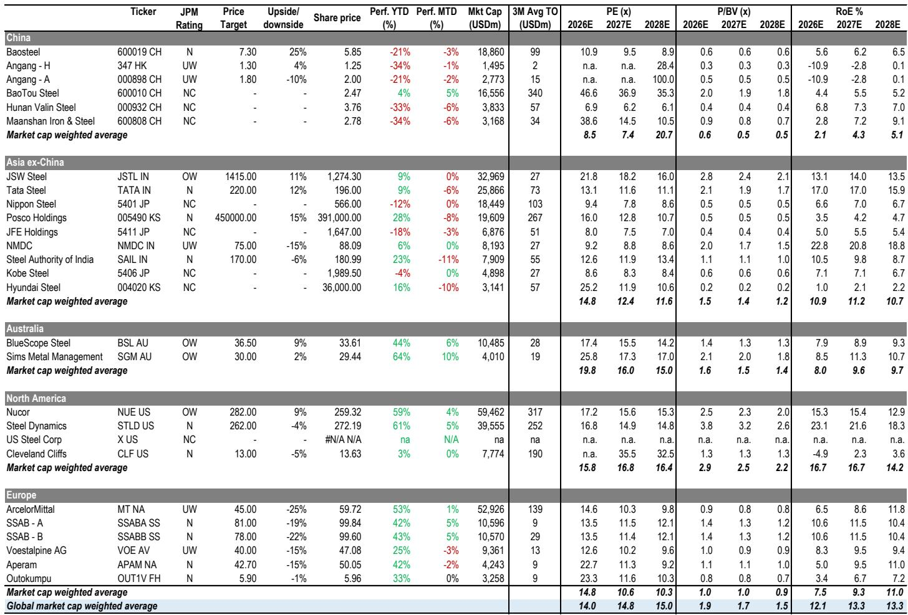
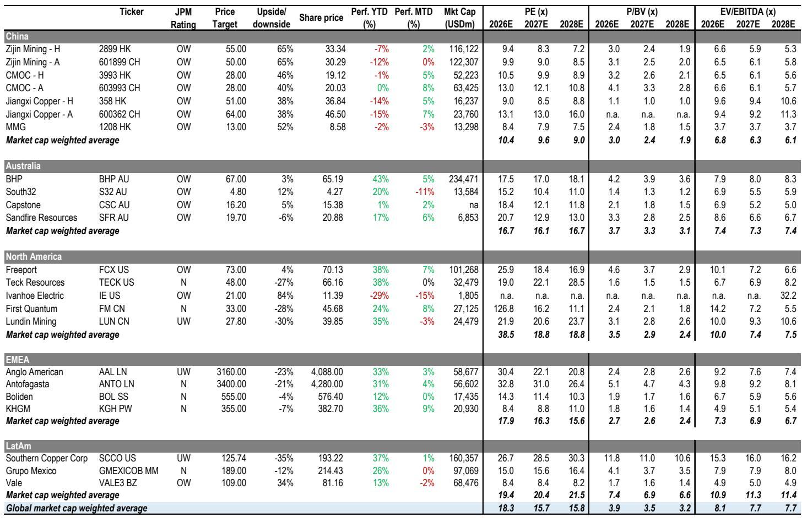
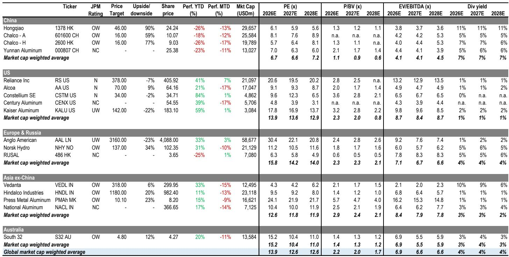

# China's Commodity Markets Are Pivoting From Domestic Demand to Geopolitical Triggers

The narrative driving China's basic materials sector has shifted. For most of 2026, the dominant question has been how deeply the domestic property downturn would drag down demand. The May National Bureau of Statistics data provides a clear, if grim, answer: new starts fell 25% year-on-year, completions moderated for a third consecutive month, and real estate investment declined by 25% year-on-year. Fixed asset investment contracted sharply by 17% year-on-year. This is not a temporary soft patch; it is a structural trough that has now been priced into many metal and mining stocks.

Yet the most important insight from the latest analysis is not the weakness itself, but what it implies for the next phase of investment strategy. With domestic demand providing a persistently low floor rather than a catalyst, the market's attention is pivoting decisively toward two external triggers: the potential reopening of the Strait of Hormuz and shifting interest rate expectations. These geopolitical and macro factors are now the primary vectors for share-price recovery in Chinese basic materials, and they separate the winners from the laggards.

The report makes a clear argument that a tactical rebound is building for metals names that have been oversold on risk-off sentiment since the onset of the US-Iran conflict. Copper and gold offer the greatest recovery potential. Aluminum is more nuanced but remains constructive over the medium term. Lithium is range-bound. Coal is being driven by supply-side disruptions that are proving more persistent than expected. The key for investors is to understand which commodities are most exposed to which external catalyst, and to position accordingly.

## Copper and Gold Are the Primary Beneficiaries of a Hormuz Reopening and Rate Easing

The logic connecting a reopening of the Strait of Hormuz to copper and gold prices is not immediately obvious. The strait is not a major physical conduit for either metal. The connection is indirect but powerful: the US-Iran conflict has injected a sustained risk premium into global markets, compressing valuations across the basic materials complex. Since the conflict began, the Hang Seng Index has fallen 8%, but the sell-off in metals stocks has been far more severe. Zijin Mining shares have dropped 23% on the A-share market and 26% on the H-share market. Chalco has fallen 27% on the A-share market and 36% on the H-share market. Aluminum producer China Hongqiao has declined 32%. Gold-focused Zijin Gold has fallen 49%.

These drawdowns reflect a blanket risk-off repricing, not a fundamental deterioration in the underlying commodity outlook. If the Strait of Hormuz reopens and the US-Iran situation de-escalates, the risk premium should compress rapidly. Copper and gold, which have the most liquid and globally integrated markets, would see the fastest share-price recovery. This is not a call on copper or gold prices rising further; it is a call on the valuation discount created by geopolitical fear being unwound.

For gold, the additional catalyst is interest rate expectations. A de-escalation that reduces safe-haven demand for the dollar could accelerate the timeline for rate cuts, which would further support gold prices. The report identifies Zijin Mining and Zijin Gold as the top picks in this scenario, and the logic is sound: they have the most direct exposure to both the geopolitical risk-premium unwind and the rate-sensitive re-rating.

## Aluminum Faces a Near-Term Headwind From Inventory Releases but Remains Structurally Bullish

Aluminum presents a more complex picture. A reopening of the Strait of Hormuz would release constrained inventories from the Middle East, which could pressure LME prices in the near term. Current LME aluminum prices are around $3,360 per ton, and a sudden influx of supply from the region would create downward pressure. This is the key risk for aluminum names in the short term.

However, the medium-term outlook is constructive for three reasons. First, the market appears to have already priced in Indonesia's new capacity expansion well ahead of any material impact in 2027. The sell-off in Chalco and Hongqiao has been driven in part by fears of Indonesian supply, but the actual production ramp-up is still years away. Second, the report's commodities team forecasts a primary aluminum deficit of approximately 1.7 million metric tons in 2026, which provides a fundamental floor under prices. Third, destocking progress in China is a catalyst to monitor. If inventories continue to decline, it would signal that domestic demand is stabilizing even in a weak property environment, which would support a valuation re-rating versus overseas peers.

The strategic implication is clear: aluminum investors need to distinguish between the near-term inventory overhang and the medium-term structural deficit. The near-term headwind from a Hormuz reopening is real, but it is a tactical trading event, not a reason to abandon the sector. The report continues to favor Chalco and China Hongqiao as key beneficiaries of the medium-term thesis.

## Lithium Is Range-Bound With Volatility Driven by Supply Headlines, Not Demand

Lithium prices have found support around RMB 165,000 per ton, but the signals remain mixed. The report expects prices to stay broadly range-bound near current levels, with volatility driven by supply-response headlines, inventory data, and downstream demand signals. This is a market that is waiting for a catalyst, and none is clearly visible.

The lack of a strong demand signal from the Chinese electric vehicle or energy storage sectors is notable. With downstream demand growing but not accelerating, and with supply continuing to come online from Australian and South American producers, the lithium market is in a waiting pattern. The upside risk would come from a supply cut announcement or a demand surprise, but neither appears imminent. The downside risk would come from a further deterioration in Chinese industrial activity, which would compress the range lower.

For investors, lithium is currently a tactical trading market rather than a strategic allocation. The report does not highlight lithium names as top picks, and the analysis suggests that patience is required until either supply discipline or demand momentum provides a clearer direction.

## Coal Prices Are Being Driven Higher by Supply Disruptions, Not Demand Recovery

The coal story is entirely different. It is not about demand at all. China's May coal data showed modest domestic supply pressure and weaker imports: raw coal output declined 2% year-on-year, and imports fell 8% year-on-year. Domestic prices have remained firm, with QHD 5,500 kcal coal around RMB 860 per ton in mid-June, roughly RMB 100 per ton higher than in May.

The catalyst is the Shanxi mine accident. While nearly 70% of suspended capacity had resumed by June 15, many mines are still operating conservatively, suggesting actual output recovery may lag reported resumptions. The report has updated its supply-demand model and now expects a 32 million metric ton deficit in 2026. This has led to a revision upward of 2026-2028 domestic thermal coal price assumptions by 4-15%, with the full-year 2026 forecast now at RMB 805 per ton.

The implications for steel margins are negative. Coking coal prices have continued to move higher following the accident, and the report expects prices to remain elevated into the third quarter of 2026. This will keep steel margins under pressure, which is a headwind for steel producers and a tailwind for coal producers. The report has revised up earnings forecasts for Shenhua by 2-7% and Yankuang by 20-31% for 2026-2028.

The key open question is whether the supply disruption is temporary or structural. If the conservative operating posture persists, the deficit could widen further, pushing prices higher. If resumption accelerates, the deficit could narrow. The report leans toward the view that supply will remain constrained, but this is an area where close monitoring of weekly production data is essential.

## What the Report Does Not Fully Answer: The Interaction Between Reopening and Domestic Demand

The report makes a compelling case for a tactical rebound driven by geopolitical de-escalation and rate expectations. What it does not fully address is the interaction between these external catalysts and the persistent weakness in Chinese domestic demand.

Consider the following scenario: the Strait of Hormuz reopens, risk premiums compress, and copper and gold stocks rally. But what if Chinese property data continues to deteriorate? What if infrastructure investment, which has already slowed to just 0.8% year-to-date growth, turns negative? In that scenario, the rally in copper and gold would be a valuation recovery, not a fundamental one. It would be a trade, not an investment.

The report acknowledges that China's May activity data remains soft and reinforces a still-cautious domestic demand backdrop. But it does not fully explore how a sustained domestic demand downturn could cap the upside for even the most favored names. If the property sector continues to decline at 25% year-on-year, the demand destruction for steel, cement, and even aluminum will eventually overwhelm the positive catalysts from geopolitics and rates.

This is the unresolved analytical tension. The report's top picks — Zijin Mining, Zijin Gold, Chalco, and China Hongqiao — are all positioned for a recovery that is driven by external factors. But if domestic demand continues to weaken, the recovery may be shallower and shorter than the report anticipates. Investors need to monitor not just the Hormuz situation and interest rate expectations, but also the trajectory of Chinese fixed asset investment and property starts. The two narratives are not independent.

## A Decision Framework for Positioning in Chinese Basic Materials

For investors looking to act on the report's analysis, the following decision framework can help allocate capital across the commodity complex.

First, determine your view on the Strait of Hormuz. If you believe a reopening is likely within the next three to six months, your primary exposure should be to copper and gold. These are the most direct beneficiaries of a risk-premium unwind. Zijin Mining and Zijin Gold are the clear picks. If you believe the situation remains unresolved or escalates, then the risk-off environment will persist, and you should avoid the names that have been most heavily sold off.

Second, assess your time horizon for aluminum. If you are trading a three-month horizon, the near-term headwind from Middle East inventory releases is a risk, and you may want to reduce exposure. If you are investing with a twelve-month horizon, the structural deficit story remains intact, and the sell-off in Chalco and Hongqiao represents an entry point. The key catalyst to watch is destocking progress in China.

Third, decide whether you want to bet on supply constraints or demand recovery. Coal is a supply-constraint story. The report's revised price forecasts are driven by the Shanxi accident and the resulting deficit. If you believe the supply disruption is persistent, coal names like Shenhua and Yankuang offer a clear earnings upgrade path. If you believe supply will normalize, the upside is limited. Lithium and steel, by contrast, are demand-dependent. Without a recovery in Chinese industrial activity, they are likely to remain range-bound or under pressure.

Fourth, monitor the rate environment. The report highlights interest rate expectations as a key catalyst for gold. If the market begins to price in rate cuts, gold stocks will benefit regardless of the Hormuz situation. This is a separate and independent catalyst that can support gold even if the geopolitical risk premium does not compress.

Finally, be clear about what you are trading. The report's analysis suggests that the next move in Chinese basic materials will be driven by external factors, not domestic fundamentals. This means the trade is tactical and event-driven, not strategic and structural. Position sizes should reflect that.

Join the community to read the full report and review the original charts.

*This article is for learning and discussion only and does not constitute investment advice.*

Personal reading notes and learning share only. Not investment advice.

