# Semiconductor/SPE sector

# Raising our 2026–27 WFE market forecasts

We raise our wafer fab equipment (WFE) market growth forecasts for CY2026 from 21% to 28% YoY and for CY2027 from 18% to 29%. We newly estimate a 16% YoY increase in CY2028. Driven by rising and broadening AI-related demand, cloud services providers (CSPs) are further accelerating their investments. We expect total investment by the top four US CSPs to increase 80% YoY in 2026 and 50% in 2027 (see a report by Samik Chatterjee et al.). Although demand is strong, chipmakers' shortage of cleanrooms had been a concern to some extent for CY2026, but the outlook is improving owing to such factors as creative use of factory space. From 2027 onward, we expect demand to increase as cleanroom expansions get underway in earnest.

\- Raising our 2026–27 WFE market forecasts: The global WFE market remained strong in CY2025, growing 11% YoY, although China, which accounts for 35-40% of the total WFE market, saw a slight YoY decline, reflecting a pullback from the previous year. Our bottom-up forecasts for WFE market growth are now 28% YoY (previously 21%) for CY2026 and 29% (previously 18%) for CY2027, and we introduce our CY2028 forecast of 16% growth (see Figure 21 for details). DRAM and TSMC are the main reasons for the upward revisions. We also raise our forecasts for logic chip and NAND flash memory equipment, albeit to a lesser degree, and view the business environment as generally favorable. As AI workloads shift from training to inference, the demand structure is broadening beyond accelerators, and the weighting of memory chip investment in particular is on an uptrend. We expect the memory chip weighting of CSP investment to rise from the previous single-digit-to-15% range to about 50% in 2026 (see a global memory chip report by Jay Kwon et al. for details), and we think companies with a high weighting of sales to TSMC and equipment makers with a high memory chip weighting will likely continue to be favored.

\- Semiconductor shipments: Global semiconductor shipments increased 106% YoY in April 2026, marking the 32nd consecutive month of growth since September 2023, and the strongest increase since at least 1994. While volume also grew in the double-digit %, the increase was largely driven by memory chip prices (with both NAND flash memory and DRAM prices seeing triple-digit growth). Even excluding memory chips, the growth was high at 33% YoY. We think AI accelerators (GPUs and ASICs) and HBM continued to drive this strong demand (see a WSTS report by Gokul Hariharan et al. for details).

## Japan Equity Research

## Technology - Semiconductor/Technical Materials

## Mio Shikanai AC

(81-3) 6736 1313

mio.shikanai@JPM.com

JPM Securities Japan Co., Ltd.

## Harlan Sur

(1-415) 315-6700

harlan.sur@JPM.com

JPM Securities LLC

## Junya Ayada

(81-3) 6736 8631

junya.ayada@JPM.com

JPM Securities Japan Co., Ltd.

## Gokul Hariharan

(852) 2800-8564

gokul.hariharan@JPM.com

JPM Securities (Asia Pacific) Limited/ JPM Broking (Hong Kong) Limited

## Jay Kwon

(82-2) 758-5725

jay.h.kwon@JPM.com

JPM Securities (Far East) Limited, Seoul Branch

## Sandeep Deshpande

(44-20) 7134-5276

sandeep.s.deshpande@JPM.com

JPM Securities plc

## Billy Feng

(86-21) 6106 6359

billy.feng@JPM.com

SAC Registration Number: S1730520030005

JPM Securities (China) Company Limited

## Mayur Ramdhani

(1-212) 622-1664

mayur.ramdhani@JPM.com

JPM Securities LLC

## Jimmy Huang

(886-2) 2725-9865

jimmy.huang@JPM.com

JPM Securities (Taiwan) Limited

## Contributing Authors

<table><tr><td>Technology - Semiconductor / Technical MaterialsMio ShikanaiACmio.shikanai@JPM.com(81-3) 6736-1313</td><td>Semiconductors &amp; Semiconductor Capital Equipment/ IT HardwareHarlan Surharlan.sur@JPM.com(1-415) 315-6700</td><td>Technology - Consumer Electronics / Industrial Electronics / PrecisionJunya Ayadajunya.ayada@JPM.com(81-3) 6736-8631</td></tr><tr><td>Technology and TelecomsGokul Hariharangokul.hariharan@JPM.com(852) 2800 -8564</td><td>Technology - SemiconductorsJay Kwonjay.h.kwon@JPM.com(82-2) 758-5725</td><td>European Tech Hardware &amp; PaymentsSandeep Deshpandesandeep.s.deshpande@JPM.com(44-20) 7134-5276</td></tr><tr><td>TechnologyBilly Fengbilly.feng@JPM.com(86-21) 6106-6359</td><td>Semiconductors &amp; Semiconductor Capital Equipment/ IT HardwareMayur Ramdhanimayur.ramdhani@JPM.com(1-212) 622-1664</td><td>TechnologyJimmy Huangjimmy.huang@JPM.com(886-2) 2725-9865</td></tr><tr><td>Technology - HardwareAlbert Hungalbert.hung@jpmchase.com(886-2) 2725-9875</td><td>Technology - SemiconductorsSangsik Leesangsik.lee@JPM.com(82-2) 758 5146</td><td>Technology - SemiconductorsNeelay Y Kamathneelay.kamath@jpmchase.com(91-22) 6157-3764</td></tr><tr><td>Technology and TelecomsSubham Singhaniasubham.singhania@JPM.com(91-22) 6157-3801</td><td>TechnologyRi Xuri.xu@jpmchase.com(86-21) 6106 6318</td><td></td></tr></table>

Top picks of JPM tech team analysts within SPE

<table><tr><td>Billy Feng</td><td>AMEC-A (688012 CH), NAURA-A (002371 CH)</td></tr><tr><td>Gokul Hariharan</td><td>ASMPT Ltd (522 HK)</td></tr><tr><td>Harlan Sur</td><td>KLA Corporation (KLAC US)</td></tr><tr><td>Jimmy Huang</td><td>Hon. Precision (7769 TT), Grand Process Tech (3131 TT)</td></tr><tr><td>Mio Shikanai</td><td>Tokyo Electron (8035 JT), Advantest (6857 JT)</td></tr><tr><td>Sandeep Deshpande</td><td>ASML (ASML NA)</td></tr></table>

Our global tech team's main assumptions for end demand are for (1) iPhone sales volume to increase $1.3\%$ YoY in CY2026 and decrease $0.4\%$ in CY2027, (2) notebook PC shipment volume to decrease $8.4\%$ YoY in CY2026 and increase $1.5\%$ in CY2027, (3) server shipments to increase $14.6\%$ YoY in CY2026 and rise $8.3\%$ in CY2027, and (4) smartphone shipment volume to decline $11.3\%$ YoY in CY2026 and decrease $2.6\%$ in CY2027 (see Figure 35for details). Based on aggregate capex by major semiconductor makers, we forecast the WFE market will grow $28\%$ YoY in CY2026, $29\%$ YoY in CY2027 and $16\%$ YoY in CY2028 (see Figure 21for details).

Figure 1: Shipment value of semiconductors and SPE (YoY)  
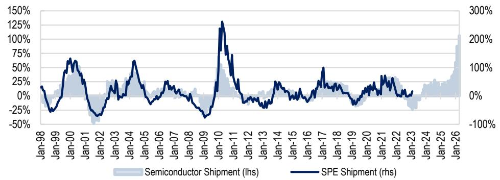

line chart

| Date   | Semiconductor Shipment (lhs) | SPE Shipment (rhs) |
|--------|-----------------------------|--------------------|
| Jan-98 | -                           | 20%                |
| Jan-99 | -                           | -25%               |
| Jan-00 | -                           | 75%                |
| Jan-01 | -                           | 50%                |
| Jan-02 | -                           | -30%               |
| Jan-03 | -                           | 25%                |
| Jan-04 | -                           | 60%                |
| Jan-05 | -                           | -10%               |
| Jan-06 | -                           | 25%                |
| Jan-07 | -                           | 10%                |
| Jan-08 | -                           | -10%               |
| Jan-09 | -                           | -30%               |
| Jan-10 | -                           | 125%               |
| Jan-11 | -                           | 75%                |
| Jan-12 | -                           | -10%               |
| Jan-13 | -                           | -25%               |
| Jan-14 | -                           | 25%                |
| Jan-15 | -                           | 10%                |
| Jan-16 | -                           | 5%                 |
| Jan-17 | -                           | 50%                |
| Jan-18 | -                           | 25%                |
| Jan-19 | -                           | 10%                |
| Jan-20 | -                           | 25%                |
| Jan-21 | -                           | 30%                |
| Jan-22 | -                           | 25%                |
| Jan-23 | -                           | 10%                |
| Jan-24 | -                           | 25%                |
| Jan-25 | -                           | 30%                |
| Jan-26 | -                           | 100%               |

Source: WSTS, SEMI, SEAJ, JPM.

Figure 2: SPE shipment trend by region  
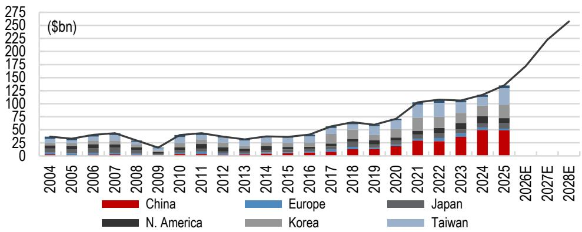

stacked bar chart

| Year | China ($bn) | Europe ($bn) | Japan ($bn) | N. America ($bn) | Korea ($bn) | Taiwan ($bn) |
| --- | --- | --- | --- | --- | --- | --- |
| 2004 | 10 | 15 | 10 | 5 | 5 | 5 |
| 2005 | 10 | 15 | 10 | 5 | 5 | 5 |
| 2006 | 10 | 15 | 10 | 5 | 5 | 5 |
| 2007 | 10 | 15 | 10 | 5 | 5 | 5 |
| 2008 | 10 | 15 | 10 | 5 | 5 | 5 |
| 2009 | 10 | 15 | 10 | 5 | 5 | 5 |
| 2010 | 10 | 15 | 10 | 5 | 5 | 5 |
| 2011 | 10 | 15 | 10 | 5 | 5 | 5 |
| 2012 | 10 | 15 | 10 | 5 | 5 | 5 |
| 2013 | 10 | 15 | 10 | 5 | 5 | 5 |
| 2014 | 10 | 15 | 10 | 5 | 5 | 5 |
| 2015 | 10 | 15 | 10 | 5 | 5 | 5 |
| 2016 | 10 | 15 | 10 | 5 | 5 | 5 |
| 2017 | 10 | 15 | 10 | 5 | 5 | 5 |
| 2018 | 10 | 15 | 10 | 5 | 5 | 5 |
| 2019 | 10 | 15 | 10 | 5 | 5 | 5 |
| 2020 | 10 | 15 | 10 | 5 | 5 | 5 |
| 2021 | 30 | 30 | 30 | 30 | 30 | 30 |
| 2022 | 30 | 30 | 30 | 30 | 30 | 30 |
| 2023 | 30 | 30 | 30 | 30 | 30 | 30 |

Source: SEMI, JPM estimates.

Figure 3: Global SPE shipment trend excluding China  
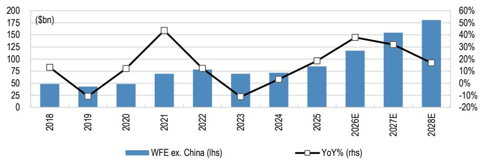

bar-line hybrid chart

| Year | WFE ex. China (Ihs) ($bn) | YoY% (rhs) (%) |
| :--- | :--- | :--- |
| 2018 | 50 | 80 |
| 2019 | 40 | -10 |
| 2020 | 50 | 10 |
| 2021 | 70 | 50 |
| 2022 | 80 | 15 |
| 2023 | 70 | -10 |
| 2024 | 75 | 5 |
| 2025 | 90 | 15 |
| 2026E | 120 | 35 |
| 2027E | 155 | 30 |
| 2028E | 180 | 15 |

Source: Gartner®, JPM estimates.

\- CoWoS/advanced packaging: We expect TSMC's CoWoS production capacity to expand to 115,000 wafers per month at end-2026, 175,000 at end-2027, and 220,000 at end-2028 (previous estimates: 115,000, 145,000, N/A). The accelerated ramp-up of the company's own production capacity and the utilization of OSATs and VIS (for interposer manufacturing) will also likely be an upside factor. CoPoS progress is slower than we expected, and we think TSMC will absorb demand for the time being by extending the life of CoWoS and using larger reticles (up to 14x in 2028). In addition, the pace of CoWoS production capacity expansion will also likely accelerate (TSMC said it plans to expand its CoWoS production capacity at a CAGR of 80%+ in 2022–28). We slightly raise our outlook for Nvidia's CoWoS demand, owing to the strength of the Blackwell GB300, Spectrum X, and Vera CPUs, but are somewhat conservative on Rubin given HBM4 uncertainties. We expect production to ramp up in 3Q 2026 and reach full-scale mass levels in 4Q 2026. We significantly raise our 2027 estimate of AMD's CoWoS demand to reflect the ramp-up of the MI450 and Venice (we assume Venice will be transferred to OSATs by 2027). Google's TPUs are also on an uptrend, and we expect increased CoWoS allocations for both Broadcom and MediaTek. The direction of the TPU v9 architecture is likely to be finalized by year-end between two options: EMIB and CoWoS-L + 3D SoIC. Demand for AWS Trainium (Trn3) remains strong even under supply constraints, and we see upside potential heading into 2027. On the technology front, 3D SoIC adoption will likely expand in 2H 2027 onward. We estimate SoIC capacity of 40,000 wafers per month at end-2027 and 65,000 at end-2028. In addition, CPUs, LPUs, and networks (CPO/NPO) could become new drivers of CoWoS demand; WMCM capacity is likely to expand to 75,000 wafers per month at end-2027 and 90,000 at end-2028; and companies other than Apple could consider similar solutions in 2028 (reference: May 17 report by Gokul Hariharan et al.)

\- Capex at TSMC: We expect capex to increase 37% in 2026 to \$56 billion, 16% in 2027 to \$65 billion, and 11% in 2028 to \$72 billion (previous estimates: \$54 billion, \$56 billion, N/A). We think the supply shortage in the area of advanced nodes (N5 and below) will last until 2027 or early 2028 and expect TSMC to accelerate its production capacity expansion. We expect the company's production capacity of N5 and below to grow at a 25% CAGR in 2025–28, with the majority ramping up in 2027–28. For N3, TSMC plans to ramp up three new fabs (Tainan Fab 18 P9, Arizona Phase 2, and JASM's second fab) from 1H 2027 through 2028. For N2, it has a strong pipeline, including iPhone processors, AMD's Venice and MI450, Google's TPUs, and Nvidia's Feynman. We expect capacity expansion centered on Kaohsiung P1-5 and AZ Phase 2 (we estimate \~60,000 wafers per month at end-2026 and \~150,000 at end-2027) (reference: April 17 report by Gokul Hariharan et al.).

\- Foundry trends: TSMC reported strong 1Q 2026 revenue of \~\$36 billion (+6% QoQ), with N3/N5 production at over 100% capacity and blended ASP rising 11% YoY. Management raised its 2026 USD revenue growth guidance to over 30% from close to 30% previously. Along with the earnings results announcement in July, management could raise its guidance because of strong demand for networks/CPUs in addition to AI accelerators. We expect the shortage in the area of advanced nodes (N5 and below) to last until 2027 or early 2028 and N3/N2 capacity expansions to accelerate (e.g., for N3 to 213,000 wafers per month at end-2027 and to 237,000 at end-2028 and for N2 to \~150,000 wafers per month at end-2028). On pricing, TSMC raised prices by 6-10% for advanced-node chips in 1Q 2026. We think

discussions on additional price hikes for 2027 (likely to be 5-10% for N3 and below) could begin in 2Q 2026 (reference: June 10 report by Gokul Hariharan et al.)

\- Memory chip capex: We expect memory chip industry capex to accelerate over the next three years, driven by a strong improvement in memory chip prices and the likelihood that supply shortages will continue for several years. We estimate total capex over the next three years of \$450 billion, up from our previous estimate of \$300 billion in the end-2025 model. Of the total, we assume DRAM capex of \$364 billion, with EUV procurement and infrastructure development likely the main bottlenecks. We expect WSPM to increase to 2.8 million at end-2028 (+880,000 from end-2025). For NAND flash memory, we assume WSPM of 1.44 million (+165,000) at end-2028 and cumulative capex of \$86 billion over three years. The focus of spending is likely to be on technology transitions, and contributions from greenfield investments will probably come in 2H 2028 onward (reference: May 29 report by Jay Kwon et al.)

\- Cloud capex: We raise our capex growth forecasts for the top four US CSPs (Google, Amazon, Microsoft, and Meta) from 63% to 80% in 2026 and from over 40% to 50% in 2027, driven by accelerating investments to expand AI-related data centers and power capacity in North America. In value terms, we expect the largest step-up ever, exceeding +\$250 billion YoY in 2026 and +\$285 billion YoY in 2027, despite a slowdown in growth. Backing this up, planned power capacity in North America exceeded 175 GW at end-1Q 2026 (and we think it is likely to rise to over 205 GW by year-end). We expect installed capacity to increase from 48 GW in 2025 to 65 GW (previously 62 GW) in 2026 and to 85 GW (previously 78 GW) in 2027. We estimate total capex will exceed \$575 billion in 2026 and \$860 billion in 2027, assuming this will be financed by operating cash flows. Until 2023, the top four US CSPs used 25-30% of their operating cash flows to finance capex. We expect this ratio to rise to 82% in 2026 and to 94% in 2027 (reference: May 26 report by Samik Chatterjee et al.)

\- Summary of TMT conference (US semiconductors/SPE): The biggest takeaway from the 54th Annual JPM Global Technology, Media and Communications Conference held in Boston over May 18-20 was that demand is gaining even more momentum, with almost all companies noting that orders, backlogs, and customer escalations have built up even more in the weeks following their results announcements. In the SPE space, KLAC noted that visibility on demand next year as of now (May) is the highest it has been in over a decade and expects the WFE market to be bigger in 2027 than in 2026. MKSI is also strengthening its structure in anticipation of a WFE market of \$165-180 billion in 2027 onward. In the semiconductor business, AI demand is broadening from a heavy focus on accelerators to the full stack (led by inference), boosting custom silicon growth, an acceleration of advanced packaging, and an extension of the memory chip upcycle (SanDisk indicated pricing conditions are strong owing to supply shortages and long-term contracts lasting until 2027) (reference: May 21 report by Harlan Sur et al.)

\- SPE: We raise our WFE market growth forecasts from 21% to 28% YoY for 2026 and from 18% to 29% YoY for 2027, and introduce our estimate of a 16% YoY increase in 2028. With semiconductor demand strengthening further, driven by accelerating CSP investment, we again raise our forecasts, mainly for DRAM and TSMC (see Figure 21for details), following our previous update (in March 2026). We also raise our forecasts for logic chip and NAND flash memory equipment, although not by as much as for DRAM and TSMC. It is apparent that companies are keen on capex. While profitability on memory chips, especially NAND flash memory, is improving significantly thanks to sharp price increases, chip companies are maintaining disciplined investment stances. We thus expect the supply-demand environment to remain tight. Kioxia is considering cleanroom investments in anticipation of increased demand from FY2029 onward but notes that it can meet demand at least through 2028 to early 2029 (bit growth of around 22%) with its existing buildings. Brownfield investments centered on technology transitions are thus likely to be the main focus for the time being. We accordingly expect equipment unit prices to rise along with value added. Our Japan team still expects stocks with a high presence in the DRAM and foundry businesses to be favored. Among Japanese SPE makers, our top pick is Tokyo Electron (8035; Overweight), which has also developed its own pricing measures. In the back-end processing area, we expect Advantest (6857; Overweight) to continue to benefit from high demand.

Figure 4: Tokyo Electron SPE sales  
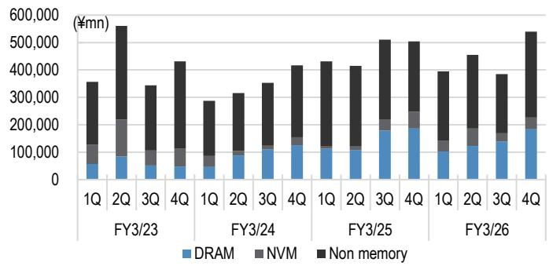

stacked bar chart

| Period | Quarter | DRAM (¥mn) | NVM (¥mn) | Non memory (¥mn) |
| :--- | :--- | :--- | :--- | :--- |
| FY3/23 | 1Q | 50,00 | 70,00 | 200,00 |
| FY3/23 | 2Q | 80,00 | 120,00 | 250,00 |
| FY3/23 | 3Q | 40,00 | 60,00 | 180,00 |
| FY3/23 | 4Q | 40,00 | 80,00 | 220,00 |
| FY3/24 | 1Q | 50,00 | 60,00 | 180,00 |
| FY3/24 | 2Q | 90,00 | 70,00 | 150,00 |
| FY3/24 | 3Q | 110,00 | 80,00 | 160,00 |
| FY3/24 | 4Q | 140,00 | 90,00 | 190,00 |
| FY3/25 | 1Q | 110,00 | 75,00 | 210,00 |
| FY3/25 | 2Q | 115,00 | 85,00 | 215,00 |
| FY3/25 | 3Q | 175,00 | 95,00 | 245,00 |
| FY3/25 | 4Q | 185,00 | 115,00 | 245,00 |
| FY3/26 | 1Q | 115,00 | 75,00 | 215,00 |
| FY3/26 | 2Q | 125,00 | 85,00 | 235,00 |
| FY3/26 | 3Q | 145,00 | 95,00 | 215,00 |
| FY3/26 | 4Q | 185,00 | 115,00 | 265,00 |

Source: Company reports, JPM.

Figure 5: SCREEN HD SPE sales  
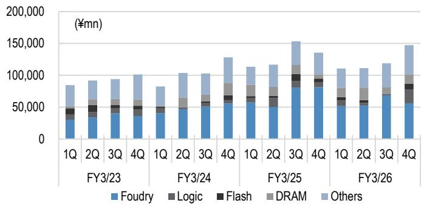

stacked bar chart

| Quarter | Foudry (¥mn) | Logic (¥mn) | Flash (¥mn) | DRAM (¥mn) | Others (¥mn) |
|---|---|---|---|---|---|
| FY3/23 | 35,000 | 15,000 | 10,000 | 15,000 | 45,000 |
| FY3/24 | 40,000 | 15,000 | 10,000 | 15,000 | 50,000 |
| FY3/25 | 75,000 | 15,000 | 15,000 | 15,000 | 65,000 |
| FY3/26 | 75,000 | 15,000 | 15,000 | 15,000 | 65,000 |

Source: Company reports, JPM.

Figure 6: KOKUSAI Electric equipment sales  
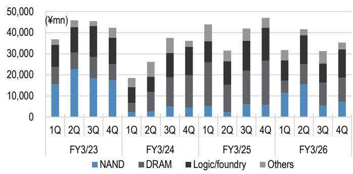

stacked bar chart

| Period | Quarter | NAND (¥mn) | DRAM (¥mn) | Logic/foundry (¥mn) | Others (¥mn) |
| :--- | :--- | :--- | :--- | :--- | :--- |
| FY3/23 | 1Q | 15000 | 8000 | 9000 | 7000 |
| FY3/23 | 2Q | 22000 | 10000 | 10000 | 6000 |
| FY3/23 | 3Q | 18000 | 8000 | 11000 | 4000 |
| FY3/23 | 4Q | 17000 | 7000 | 10000 | 4500 |
| FY3/24 | 1Q | 3000 | 4000 | 6000 | 1800 |
| FY3/24 | 2Q | 3500 | 7500 | 7500 | 6500 |
| FY3/24 | 3Q | 5500 | 11500 | 11500 | 8500 |
| FY3/24 | 4Q | 4500 | 12500 | 12500 | 7500 |
| FY3/25 | 1Q | 6000 | 11500 | 9500 | 7500 |
| FY3/25 | 2Q | 3500 | 8500 | 11500 | 5500 |
| FY3/25 | 3Q | 6500 | 11500 | 12500 | 6500 |
| FY3/25 | 4Q | 6500 | 12500 | 13500 | 7500 |
| FY3/26 | 1Q | 12500 | 8500 | 9500 | 6500 |
| FY3/26 | 2Q | 15500 | 9500 | 11500 | 6500 |
| FY3/26 | 3Q | 6500 | 9500 | 9500 | 6500 |
| FY3/26 | 4Q | 8500 | 9500 | 11500 | 6500 |

Source: Company reports, JPM.

Figure 7: Ulvac semiconductor & electronic device production equipment sales  
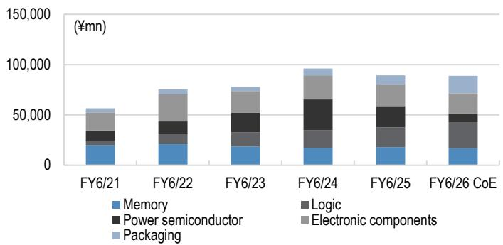

stacked bar chart

| Fiscal Year | Memory (¥mn) | Power semiconductor (¥mn) | Packaging (¥mn) | Logic (¥mn) | Electronic components (¥mn) |
|---|---|---|---|---|---|
| FY6/21 | 20000 | 10000 | 5000 | 10000 | 20000 |
| FY6/22 | 25000 | 15000 | 5000 | 15000 | 30000 |
| FY6/23 | 25000 | 25000 | 5000 | 25000 | 25000 |
| FY6/24 | 20000 | 45000 | 10000 | 35000 | 35000 |
| FY6/25 | 20000 | 35000 | 10000 | 35000 | 35000 |
| FY6/26 CoE | 20000 | 35000 | 25000 | 45000 | 35000 |

Source: Company reports, JPM.

Figure 8: Disco precision processing equipment shipments  
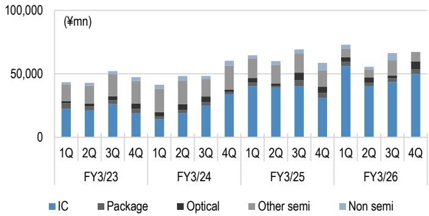

stacked bar chart

| Period | Quarter | IC (¥mn) | Package (¥mn) | Optical (¥mn) | Other semi (¥mn) | Non semi (¥mn) |
| :--- | :--- | :--- | :--- | :--- | :--- | :--- |
| FY3/23 | 1Q | 25000 | 5000 | 5000 | 20000 | 5000 |
| FY3/23 | 2Q | 25000 | 5000 | 5000 | 20000 | 5000 |
| FY3/23 | 3Q | 28000 | 7000 | 6000 | 25000 | 5000 |
| FY3/23 | 4Q | 25000 | 8000 | 7000 | 25000 | 5000 |
| FY3/24 | 1Q | 15000 | 4000 | 5000 | 15000 | 5000 |
| FY3/24 | 2Q | 18000 | 6000 | 6000 | 25000 | 5000 |
| FY3/24 | 3Q | 22000 | 9000 | 7000 | 25000 | 5000 |
| FY3/24 | 4Q | 35000 | 15000 | 8000 | 35000 | 5000 |
| FY3/25 | 1Q | 42000 | 12000 | 7000 | 18000 | 6500 |
| FY3/25 | 2Q | 42000 | 12000 | 7500 | 18500 | 6555 |
| FY3/25 | 3Q | 43500 | 13500 | 8500 | 19500 | 7555 |
| FY3/25 | 4Q | 31500 | 11500 | 7555 | 19555 | 6755 |
| FY3/26 | 1Q | 61561 | 18561 | 9561 | 19561 | 7777 |
| FY3/26 | 2Q | 41799 | 8799 | 7777 | 19799 | 6887 |
| FY3/26 | 3Q | 44899 | 11899 | 8887 | 19899 | 7987 |
| FY3/26 | 4Q | 51499 | 14899 | 9887 | 19899 | 8487 |

Source: Company reports, JPM.

Figure 9: Advantest test system sales  
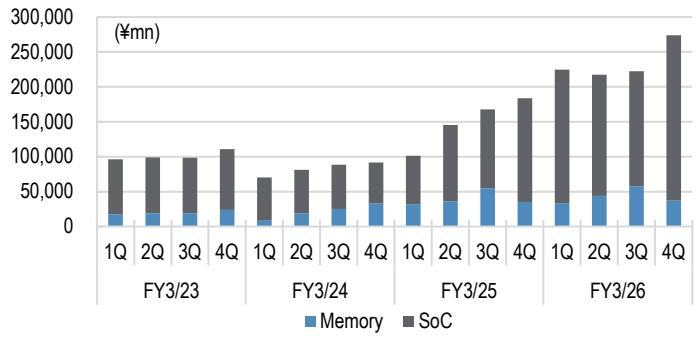

stacked bar chart

| Period | Quarter | Memory (¥mn) | SoC (¥mn) |
| :--- | :--- | :--- | :--- |
| FY3/23 | 1Q | 15,000 | 75,000 |
| FY3/23 | 2Q | 15,000 | 80,000 |
| FY3/23 | 3Q | 15,000 | 80,000 |
| FY3/23 | 4Q | 25,000 | 95,000 |
| FY3/24 | 1Q | 15,000 | 65,000 |
| FY3/24 | 2Q | 15,000 | 75,000 |
| FY3/24 | 3Q | 25,000 | 85,000 |
| FY3/24 | 4Q | 35,000 | 90,000 |
| FY3/25 | 1Q | 35,000 | 75,000 |
| FY3/25 | 2Q | 45,000 | 115,000 |
| FY3/25 | 3Q | 55,000 | 145,000 |
| FY3/25 | 4Q | 45,000 | 175,000 |
| FY3/26 | 1Q | 35,000 | 185,000 |
| FY3/26 | 2Q | 45,000 | 195,000 |
| FY3/26 | 3Q | 55,000 | 195,000 |
| FY3/26 | 4Q | 45,000 | 245,000 |

Source: Company reports, JPM.

## Sector data

Figure 10: Discretes global net billings  
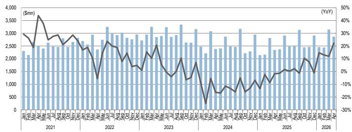

bar-line hybrid chart

| Month | Revenue ($mn) | YoY (%) |
| --- | --- | --- |
| Jan | 2,500 | 30 |
| Feb | 3,500 | 45 |
| Mar | 3,000 | 35 |
| Apr | 2,800 | 30 |
| May | 2,700 | 25 |
| Jun | 2,600 | 20 |
| Jul | 2,500 | 15 |
| Aug | 2,400 | 10 |
| Sep | 2,300 | 5 |
| Oct | 2,200 | 0 |
| Nov | 2,100 | -5 |
| Dec | 2,000 | -10 |
| Jan | 1,900 | -15 |
| Feb | 1,800 | -20 |
| Mar | 1,700 | -25 |
| Apr | 1,600 | -30 |
| May | 1,500 | -25 |
| Jun | 1,400 | -20 |
| Jul | 1,300 | -15 |
| Aug | 1,200 | -10 |
| Sep | 1,100 | -5 |
| Oct | 1,000 | 0 |
| Nov | 900 | 5 |
| Dec | 800 | 10 |
| Jan | 700 | 15 |
| Feb | 600 | 20 |
| Mar | 500 | 25 |
| Apr | 400 | 30 |
| May | 300 | 35 |
| Jun | 200 | 40 |
| Jul | 100 | 45 |
| Aug | 50 | 50 |
| Sep | 100 | 45 |
| Oct | 150 | 40 |
| Nov | 200 | 35 |
| Dec | 250 | 30 |
| Jan | 300 | 25 |
| Feb | 350 | 20 |
| Mar | 400 | 15 |
| Apr | 450 | 10 |
| May | 500 | 5 |
| Jun | 550 | 0 |
| Jul | 600 | -5 |
| Aug | 650 | -10 |
| Sep | 700 | -15 |
| Oct | 750 | -20 |
| Nov | 800 | -25 |
| Dec | 850 | -30 |
| Jan | 900 | -25 |
| Feb | 950 | -20 |
| Mar | 1,000 | -15 |
| Apr | 1,100 | -10 |
| May | 1,200 | -5 |
| Jun | 1,300 | 0 |
| Jul | 1,400 | 5 |
| Aug | 1,500 | 10 |
| Sep | 1,600 | 15 |
| Oct | 1,700 | 20 |
| Nov | 1,800 | 25 |
| Dec | 1,900 | 30 |
| Jan | 2,000 | 35 |
| Feb | 2,100 | 40 |
| Mar | 2,200 | 45 |
| Apr | 2,300 | 50 |
| May | 2,400 | 45 |
| Jun | 2,500 | 40 |
| Jul | 2,600 | 35 |
| Aug | 2,700 | 30 |
| Sep | 2,800 | 25 |
| Oct | 2,900 | 20 |
| Nov | 3,000 | 15 |
| Dec | 3,100 | 10 |
| Jan | 3,200 | 5 |
| Feb | 3,300 | 0 |
| Mar | 3,400 | -5 |
| Apr | 3,500 | -10 |
| May | 3,600 | -15 |
| Jun | 3,700 | -20 |
| Jul | 3,800 | -25 |
| Aug | 3,900 | -30 |
| Sep | 4,000 | -25 |
| Oct | 4,100 | -20 |
| Nov | 4,200 | -15 |
| Dec | 4,300 | -10 |
| Jan | 4,400 | -5 |
| Feb | 4,500 | 0 |
| Mar | 4,600 | 5 |
| Apr | 4,700 | 10 |
| May | 4,800 | 15 |
| Jun | 4,900 | 20 |
| Jul | 5,000 | 25 |
| Aug | 5,100 | 30 |
| Sep | 5,200 | 35 |
| Oct | 5,300 | 40 |
| Nov | 5,400 | 45 |
| Dec | 5,500 | 50 |
| Jan | 5,600 | 45 |
| Feb | 5,700 | 40 |
| Mar | 5,800 | 35 |
| Apr | 5,900 | 30 |
| May | 6,000 | 25 |
| Jun | 6,100 | 20 |
| Jul | 6,200 | 15 |
| Aug | 6,300 | 10 |
| Sep | 6,400 | -5 |
| Oct | 6,500 | -15 |
| Nov | 6,600 | -25 |
| Dec | 6,700 | -35 |
| Jan | 6,800 | -38 |
| Feb | 6,900 | -35 |
| Mar | 7,000 | -38 |
| Apr | 7,100 | -35 |
| May | 7,200 | -38 |
| Jun | 7,300 | -35 |
| Jul | 7,400 | -38 |
| Aug | 7,500 | -38 |

Source: Compiled by JPM based on WSTS data.  
Note: Line graph shows YoY.

Figure 12: Optoelectronics global net billings  
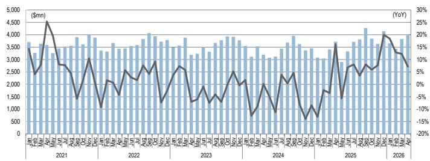

bar-line hybrid chart

| Month | Revenue ($mn) | YoY (%) |
| --- | --- | --- |
| Jan | 3,500 | 5.0 |
| Feb | 3,700 | 7.0 |
| Mar | 4,500 | 18.0 |
| Apr | 3,800 | 10.0 |
| May | 3,600 | 6.0 |
| Jun | 3,900 | 8.0 |
| Jul | 3,700 | 5.0 |
| Aug | 3,800 | 6.0 |
| Sep | 3,900 | 7.0 |
| Oct | 3,700 | 4.0 |
| Nov | 3,600 | 3.0 |
| Dec | 3,500 | 2.0 |
| Jan | 3,400 | 1.0 |
| Feb | 3,500 | 2.0 |
| Mar | 3,600 | 3.0 |
| Apr | 3,700 | 4.0 |
| May | 3,800 | 5.0 |
| Jun | 3,900 | 6.0 |
| Jul | 4,000 | 7.0 |
| Aug | 4,100 | 8.0 |
| Sep | 4,200 | 9.0 |
| Oct | 4,100 | 8.0 |
| Nov | 4,000 | 7.0 |
| Dec | 3,900 | 6.0 |
| Jan | 3,800 | 5.0 |
| Feb | 3,700 | 4.0 |
| Mar | 3,600 | 3.0 |
| Apr | 3,500 | 2.0 |
| May | 3,400 | 1.0 |
| Jun | 3,300 | 2.0 |
| Jul | 3,200 | 3.0 |
| Aug | 3,100 | 4.0 |
| Sep | 3,200 | 5.0 |
| Oct | 3,300 | 6.0 |
| Nov | 3,400 | 7.0 |
| Dec | 3,500 | 8.0 |
| Jan | 3,600 | 9.0 |
| Feb | 3,700 | 10.0 |
| Mar | 3,800 | 11.0 |
| Apr | 3,900 | 12.0 |
| May | 4,000 | 13.0 |
| Jun | 4,100 | 14.0 |
| Jul | 4,200 | 15.0 |
| Aug | 4,300 | 16.0 |
| Sep | 4,400 | 17.0 |
| Oct | 4,500 | 18.0 |
| Nov | 4,400 | 17.0 |
| Dec | 4,300 | 16.0 |
| Jan | 4,200 | 15.0 |
| Feb | 4,100 | 14.0 |
| Mar | 4,200 | 15.0 |
| Apr | 4,300 | 16.0 |
| May | 4,400 | 17.0 |
| Jun | 4,500 | 18.0 |
| Jul | 4,400 | 17.0 |
| Aug | 4,300 | 16.0 |
| Sep | 4,200 | 15.0 |
| Oct | 4,100 | 14.0 |
| Nov | 4,250 | 15.5 |
| Dec | 4,350 | 16.5 |
| Jan | 4,450 | 17.5 |
| Feb | 4,550 | 18.5 |
| Mar | 4,650 | 19.5 |
| Apr | 4,750 | 21.5 |
| May | 4,850 | 23.5 |
| Jun | 4,950 | 25.5 |
| Jul | 5,150 | 27.5 |
| Aug | 5,250 | 29.5 |
| Sep | 5,350 | 31.5 |
| Oct | 5,450 | 33.5 |
| Nov | 5,550 | 35.5 |
| Dec | 5,650 | 37.5 |
| Jan | 5,750 | 39.5 |
| Feb | 5,850 | 41.5 |
| Mar | 5,950 | 43.5 |
| Apr | 6,150 | 45.5 |
| May | 6,250 | 47.5 |
| Jun | 6,350 | 49.5 |
| Jul | 6,450 | 51.5 |
| Aug | 6,550 | 53.5 |
| Sep | 6,650 | 55.5 |
| Oct | 6,750 | 57.5 |
| Nov | 6,850 | 59.5 |
| Dec | 6,950 | 61.5 |
| Jan | 7,15 | - |
| Feb | - | - |
| Mar | - | - |
| Apr | - | - |
| May | - | - |
| Jun | - | - |
| Jul | - | - |
| Aug | - | - |
| Sep | - | - |
| Oct | - | - |
| Nov | - | - |
| Dec | - | - |
| Jan | - | - |
| Feb | - | - |
| Mar | - | - |
| Apr | - | - |
| May | - | - |
| Jun | - | - |
| Jul | - | - |
| Aug | - | - |
| Sep | - | - |
| Oct | - | - |
| Nov | - | - |
| Dec | - | - |
| Jan | - | - |
| Feb | - | - |
| Mar | - | - |
| Apr | - | - |
| May | - | - |
| Jun | - | - |
| Jul | - | - |
| Aug | - | - |
| Sep | - | - |
| Oct | - | - |
| Nov | - | - |
| Dec | - | - |
| Jan | - | - |
| Feb | - | - |
| Mar | - | - |
| Apr | - | - |
| May | - | - |
| Jun | - | - |

Source: Compiled by JPM based on WSTS data.  
Note: Line graph shows YoY.

Figure 14: Analog global net billings  
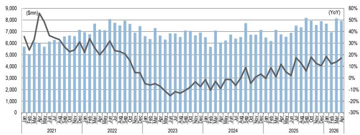

bar-line hybrid chart

| Month | Revenue ($mm) | YoY (%) |
| :--- | :--- | :--- |
| Jan 2021 | 5,800 | 30 |
| Feb 2021 | 8,500 | 45 |
| Mar 2021 | 7,200 | 35 |
| Apr 2021 | 6,800 | 30 |
| May 2021 | 6,500 | 25 |
| Jun 2021 | 6,300 | 20 |
| Jul 2021 | 6,100 | 15 |
| Aug 2021 | 6,400 | 18 |
| Sep 2021 | 6,700 | 22 |
| Oct 2021 | 6,900 | 25 |
| Nov 2021 | 7,100 | 28 |
| Dec 2021 | 7,300 | 30 |
| Jan 2022 | 7,500 | 35 |
| Feb 2022 | 7,700 | 38 |
| Mar 2022 | 7,900 | 40 |
| Apr 2022 | 8,100 | 45 |
| May 2022 | 8,300 | 48 |
| Jun 2022 | 8,500 | 50 |
| Jul 2022 | 8,700 | 55 |
| Aug 2022 | 8,900 | 58 |
| Sep 2022 | 9,100 | 60 |
| Oct 2022 | 9,300 | 65 |
| Nov 2022 | 9,500 | 68 |
| Dec 2022 | 9,700 | 70 |
| Jan 2023 | 9,900 | 75 |
| Feb 2023 | 1,500 | -15 |
| Mar 2023 | 1,700 | -18 |
| Apr 2023 | 1,900 | -15 |
| May 2023 | 2,100 | -10 |
| Jun 2023 | 2,300 | -5 |
| Jul 2023 | 2,500 | 5 |
| Aug 2023 | 2,700 | 15 |
| Sep 2023 | 3,100 | 18 |
| Oct 2023 | 3,300 | 25 |
| Nov 2023 | 3,500 | 35 |
| Dec 2023 | 3,700 | 45 |
| Jan 2024 | 3,900 | 55 |
| Feb 2024 | 4,100 | 65 |
| Mar 2024 | 4,300 | 75 |
| Apr 2024 | 4,500 | 85 |
| May 2024 | 4,700 | 95 |
| Jun 2024 | 4,900 | 115 |
| Jul 2024 | 5,100 | 135 |
| Aug 2024 | 5,300 | 155 |
| Sep 2024 | 5,500 | 175 |
| Oct 2024 | 5,700 | 195 |
| Nov 2024 | 5,900 | 215 |
| Dec 2024 | 6,100 | 235 |
| Jan 2025 | 6,300 | 255 |
| Feb 2025 | 6,500 | 275 |
| Mar 2025 | 6,700 | 315 |
| Apr 2025 | 6,900 | 345 |
| May 2025 | 7,100 | 375 |
| Jun 2025 | 7,300 | 415 |
| Jul 2025 | 7,500 | 445 |
| Aug 2025 | 7,700 | 475 |
| Sep 2025 | 7,900 | 515 |
| Oct 2025 | 8,100 | 545 |
| Nov 2025 | 8,300 | 575 |
| Dec 2025 | 8,500 | 615 |
| Jan 2026 | 8,700 | 645 |
| Feb 2026 | 8,900 | 675 |
| Mar 2026 | 9,100 | 715 |
| Apr 2026 | 9,300 | 745 |

Source: Compiled by JPM based on WSTS data.  
Note: Line graph shows YoY.

Figure 16: MOS DRAM global net billings  
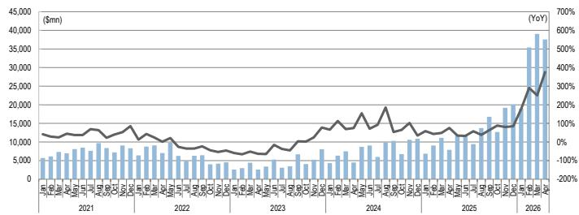

bar-line hybrid chart

| Month | Revenue ($mn) | YoY (%) |
| --- | --- | --- |
| Jan | ~5,000 | - |
| Feb | ~6,000 | - |
| Mar | ~7,000 | - |
| Apr | ~8,000 | - |
| May | ~9,000 | - |
| Jun | ~10,000 | - |
| Jul | ~11,000 | - |
| Aug | ~12,000 | - |
| Sep | ~13,000 | - |
| Oct | ~14,000 | - |
| Nov | ~15,000 | - |
| Dec | ~16,000 | - |
| Jan | ~17,000 | - |
| Feb | ~18,000 | - |
| Mar | ~19,000 | - |
| Apr | ~20,000 | - |
| May | ~21,000 | - |
| Jun | ~22,000 | - |
| Jul | ~23,000 | - |
| Aug | ~24,000 | - |
| Sep | ~25,000 | - |
| Oct | ~26,000 | - |
| Nov | ~27,000 | - |
| Dec | ~28,000 | - |
| Jan | ~29,000 | - |
| Feb | ~30,000 | - |
| Mar | ~31,000 | - |
| Apr | ~32,000 | - |
| May | ~33,000 | - |
| Jun | ~34,000 | - |
| Jul | ~35,000 | - |
| Aug | ~36,000 | - |
| Sep | ~37,000 | - |
| Oct | ~38,000 | - |
| Nov | ~39,000 | - |
| Dec | ~40,000 | - |
| Jan | ~41,000 | - |
| Feb | ~42,000 | - |
| Mar | ~43,000 | - |
| Apr | ~44,000 | - |
| May | ~45,000 | - |
| Jun | ~46,000 | - |
| Jul | ~47,000 | - |
| Aug | ~48,000 | - |
| Sep | ~49,000 | - |
| Oct | ~50,000 | - |
| Nov | ~51,000 | - |
| Dec | ~52,000 | - |
| Jan | ~53,000 | - |
| Feb | ~54,000 | - |
| Mar | ~55,000 | - |
| Apr | ~56,000 | - |
| May | ~57,000 | - |
| Jun | ~58,000 | - |
| Jul | ~59,000 | - |
| Aug | ~60,000 | - |
| Sep | ~61,000 | - |
| Oct | ~62,000 | - |
| Nov | ~63,000 | - |
| Dec | ~64,000 | - |
| Jan | ~65,000 | - |
| Feb | ~66,000 | - |
| Mar | ~67,000 | - |
| Apr | ~68,000 | - |
| May | ~69,000 | - |
| Jun | ~70,000 | - |
| Jul | ~71,000 | - |
| Aug | ~72,000 | - |
| Sep | ~73,000 | - |
| Oct | ~74,000 | - |
| Nov | ~75,000 | - |
| Dec | ~76,000 | - |
| Jan | ~77,000 | - |
| Feb | ~78,000 | - |
| Mar | ~79,000 | - |
| Apr | ~80,000 | - |
| May | ~81,000 | - |
| Jun | ~82,000 | - |
| Jul | ~83,000 | - |
| Aug | ~84,000 | - |
| Sep | ~85,000 | - |
| Oct | ~86,000 | - |
| Nov | ~87,000 | - |
| Dec | ~88,000 | - |
| Jan | ~89,000 | - |
| Feb | ~90,000 | - |
| Mar | ~91,000 | - |
| Apr | ~92,000 | - |
| May | ~93,000 | - |
| Jun | ~94,000 | - |
| Jul | ~95,000 | - |
| Aug | ~96,000 | - |
| Sep | ~97,000 | - |
| Oct | ~98,000 | - |
| Nov | ~99,000 | - |
| Dec | ~1.1x | 1.1x |
| Jan | ~1.2x | 1.2x |
| Feb | ~1.3x | 1.3x |
| Mar | ~1.4x | 1.4x |
| Apr | ~1.5x | 1.5x |
| May | ~1.6x | 1.6x |
| Jun | ~1.7x | 1.7x |
| Jul | ~1.8x | 1.8x |
| Aug | ~1.9x | 1.9x |
| Sep | ~2.1x | 2.1x |
| Oct | ~2.3x | 2.3x |
| Nov | ~2.5x | 2.5x |
| Dec | ~2.7x | 2.7x |
| Jan | ~2.9x | 2.9x |
| Feb | ~3.1x | 3.1x |
| Mar | ~3.3x | 3.3x |
| Apr | ~3.5x | 3.5x |
| May | ~3.7x | 3.7x |
| Jun | ~3.9x | 3.9x |
| Jul | ~4.1x | 4.1x |
| Aug | ~4.3x | 4.3x |
| Sep | ~4.5x | 4.5x |
| Oct | ~4.7x | 4.7x |
| Nov | ~4.9x | 4.9x |
| Dec | ~5.1x | 5.1x |
| Jan | ~5.3x | 5.3x |
| Feb | ~5.5x | 5.5x |
| Mar | ~5.7x | 5.7x |
| Apr | ~5.9x | 5.9x |
| May | ~6.1x | 6.1x |
| Jun | ~6.3x | 6.3x |
| Jul | ~6.5x | 6.5x |
| Aug | ~6.7x | 6.7x |
| Sep | ~6.9x | 6.9x |
| Oct | ~7.1x | 7.1x |
| Nov | ~7.3x | 7.3x |
| Dec | ~7.5x | 7.5x |
| Jan | ~7.7x | 7.7x |
| Feb | ~7.9x | 7.9x |
| Mar | ~8.1x | 8.1x |
| Apr | ~8.3x | 8.3x |
| May | ~8.5x | 8.5x |
| Jun | ~8.7x | 8.7x |
| Jul | ~8.9x | 8.9x |
| Aug | ~9.1x | 9.1x |
| Sep | ~9.3x | 9.3x |
| Oct | ~9.5x | 9.5x |
| Nov | ~9.7x | 9.7x |
| Dec | ~9.9x | 9.9x |
| Jan | ~11.1m | 11.1m |
| Feb | ~11.3m | 11.3m |
| Mar | ~11.5m | 11.5m |
| Apr | ~11.7m | 11.7m |
| May | ~11.9m | 11.9m |
| Jun | ~12.1m | 12.1m |
| Jul | ~12.3m | 12.3m |
| Aug | ~12.5m | 12.5m |
| Sep | ~12.7m | 12.7m |
| Oct | ~12.9m | 12.9m |
| Nov | ~13.1m | 13.1m |
| Dec | ~13.3m | 13.3m |
| Jan | ~13.5m | 13.5m |
| Feb | ~13.7m | 13.7m |
| Mar | ~13.9m | 13.9m |
| Apr | ~14.1m | 14.1m |
| May | ~14.3m | 14.3m |
| Jun | ~14.5m | 14.5m |
| Jul | ~14.7m | 14.7m |
| Aug | ~14.9m | 14.9m |
| Sep | ~15.1m | 15.1m |
| Oct | ~15.3m | 15.3m |
| Nov | ~15.5m | 15.5m |
| Dec | ~15.7m | 15.7m |

Source: Compiled by JPM based on WSTS data.  
Note: Line graph shows YoY.

Figure 11: IGBT (Insulated Gate Bipolar Trans) global net billings  
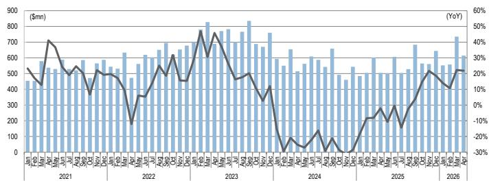  
Source: Compiled by JPM based on WSTS data.  
Note: Line graph shows YoY.

Figure 13: Sensors & Actuators global net billings  
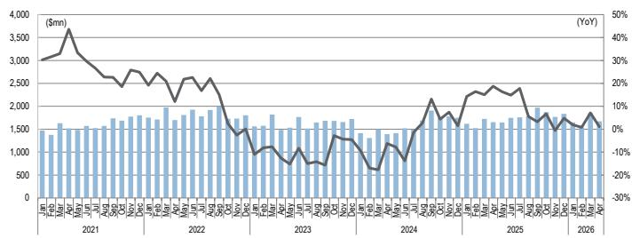

bar-line hybrid chart

| Month-Year | Revenue ($mn) | YoY (%) |
|------------|---------------|---------|
| Jan 2021   | 3,000         | 10      |
| Feb 2021   | 3,500         | 15      |
| Mar 2021   | 3,200         | 12      |
| Apr 2021   | 3,000         | 8       |
| May 2021   | 2,800         | 5       |
| Jun 2021   | 2,600         | 3       |
| Jul 2021   | 2,500         | 1       |
| Aug 2021   | 2,400         | -1      |
| Sep 2021   | 2,300         | -3      |
| Oct 2021   | 2,200         | -5      |
| Nov 2021   | 2,100         | -7      |
| Dec 2021   | 2,000         | -9      |
| Jan 2022   | 1,900         | -11     |
| Feb 2022   | 1,800         | -13     |
| Mar 2022   | 1,700         | -15     |
| Apr 2022   | 1,600         | -17     |
| May 2022   | 1,500         | -19     |
| Jun 2022   | 1,400         | -21     |
| Jul 2022   | 1,300         | -23     |
| Aug 2022   | 1,200         | -25     |
| Sep 2022   | 1,100         | -27     |
| Oct 2022   | 1,000         | -29     |
| Nov 2022   | 900           | -31     |
| Dec 2022   | 800           | -33     |
| Jan 2023   | 700           | -35     |
| Feb 2023   | 600           | -37     |
| Mar 2023   | 500           | -39     |
| Apr 2023   | 400           | -41     |
| May 2023   | 300           | -43     |
| Jun 2023   | 200           | -45     |
| Jul 2023   | 100           | -47     |
| Aug 2023   | 50            | -49     |
| Sep 2023   | 30            | -51     |
| Oct 2023   | 15            | -53     |
| Nov 2023   | 5             | -55     |
| Dec 2023   | 3             | -57     |
| Jan 2024   | 1             | -59     |
| Feb 2024   | 5             | -61     |
| Mar 2024   | 15            | -63     |
| Apr 2024   | 35            | -65     |
| May 2024   | 65            | -67     |
| Jun 2024   | 1,55          | -69     |
| Jul 2024   | 4,55          | -71     |
| Aug 2024   | 8,55          | -73     |
| Sep 2024   | 1,55          | -75     |
| Oct 2024   | 4,55          | -77     |
| Nov 2024   | 8,55          | -79     |
| Dec 2024   | 1,55          | -81     |
| Jan 2025   | 4,55          | -83     |
| Feb 2025   | 8,55          | -85     |
| Mar 2025   | 1,55          | -87     |
| Apr 2025   | 4,55          | -89     |
| May 2025   | 8,55          | -91     |
| Jun 2025   | 1,55          | -93     |
| Jul 2025   | 4,55          | -95     |
| Aug 2025   | 8,55          | -97     |
| Sep 2025   | 1,55          | -99     |
| Oct 2025   | 4,55          | -101    |
| Nov 2025   | 8,55          | -103    |
| Dec 2025   | 1,55          | -105    |
| Jan 2026   | 4,55          | -107    |
| Feb 2026   | 8,55          | -109    |
| Mar 2026   | 1,55          | -111    |
| Apr 2026   | 4,55          | -113    |

Source: Compiled by JPM based on WSTS data.  
Note: Line graph shows YoY.

Figure 15: Logic global net billings  
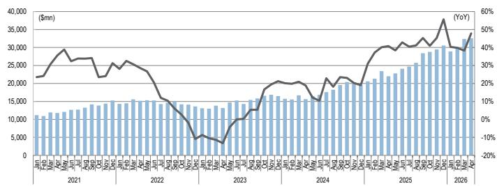  
Source: Compiled by JPM based on WSTS data.  
Note: Line graph shows YoY.

Figure 17: NAND Flash Memory global net billings  
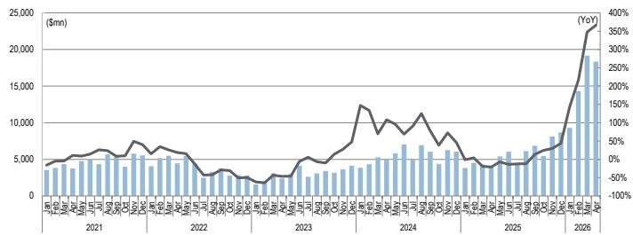

bar-line hybrid chart

| Month | Revenue ($mn) | YoY (%) |
| --- | --- | --- |
| Jan | ~3,500 | - |
| Feb | ~4,000 | - |
| Mar | ~4,500 | - |
| Apr | ~5,000 | - |
| May | ~5,500 | - |
| Jun | ~6,000 | - |
| Jul | ~6,500 | - |
| Aug | ~7,000 | - |
| Sep | ~7,500 | - |
| Oct | ~8,000 | - |
| Nov | ~7,500 | - |
| Dec | ~7,000 | - |
| Jan | ~6,500 | - |
| Feb | ~6,000 | - |
| Mar | ~5,500 | - |
| Apr | ~5,000 | - |
| May | ~4,500 | - |
| Jun | ~4,000 | - |
| Jul | ~3,500 | - |
| Aug | ~3,000 | - |
| Sep | ~2,500 | - |
| Oct | ~2,000 | - |
| Nov | ~1,500 | - |
| Dec | ~1,000 | - |
| Jan | ~1,500 | - |
| Feb | ~2,000 | - |
| Mar | ~2,500 | - |
| Apr | ~3,000 | - |
| May | ~3,500 | - |
| Jun | ~4,000 | - |
| Jul | ~4,500 | - |
| Aug | ~5,000 | - |
| Sep | ~5,500 | - |
| Oct | ~6,000 | - |
| Nov | ~6,500 | - |
| Dec | ~7,000 | - |
| Jan | ~7,500 | - |
| Feb | ~8,000 | - |
| Mar | ~8,500 | - |
| Apr | ~9,000 | - |
| May | ~9,500 | - |
| Jun | ~10,000 | - |
| Jul | ~11,000 | - |
| Aug | ~12,000 | - |
| Sep | ~13,000 | - |
| Oct | ~14,000 | - |
| Nov | ~15,000 | - |
| Dec | ~16,000 | - |
| Jan | ~17,000 | - |
| Feb | ~18,000 | - |
| Mar | ~19,000 | - |
| Apr | ~20,000 | - |
| May | ~21,000 | - |
| Jun | ~22,000 | - |
| Jul | ~23,000 | - |
| Aug | ~24,000 | - |
| Sep | ~25,000 | - |
| Oct | ~24,500 | - |
| Nov | ~24,000 | - |
| Dec | ~23,500 | - |
| Jan | ~23,000 | - |
| Feb | ~22,500 | - |
| Mar | ~22,000 | - |
| Apr | ~21,500 | - |
| May | ~21,000 | - |
| Jun | ~21,500 | - |
| Jul | ~22,500 | - |
| Aug | ~23,500 | - |
| Sep | ~24,500 | - |
| Oct | ~25,500 | - |
| Nov | ~26,500 | - |
| Dec | ~27,500 | - |
| Jan | ~28,500 | - |
| Feb | ~29,500 | - |
| Mar | ~31,500 | - |
| Apr | ~33,500 | - |
| May | ~35,500 | - |
| Jun | ~37,500 | - |
| Jul | ~39,500 | - |
| Aug | ~41,500 | - |
| Sep | ~43,500 | - |
| Oct | ~45,500 | - |
| Nov | ~47,500 | - |
| Dec | ~49,500 | - |
| Jan | ~51,500 | - |
| Feb | ~53,500 | - |
| Mar | ~55,500 | - |
| Apr | ~57,500 | - |
| May | ~59,500 | - |
| Jun | ~61,500 | - |
| Jul | ~63,500 | - |
| Aug | ~65,500 | - |
| Sep | ~67,500 | - |
| Oct | ~69,5q | - |
| Nov | ~71,5q | - |
| Dec | ~73,5q | - |
| Jan | ~75,5q | - |
| Feb | ~77,5q | - |
| Mar | ~79,5q | - |
| Apr | ~81,5q | - |
| May | ~83,5q | - |
| Jun | ~85,5q | - |
| Jul | ~87,5q | - |
| Aug | ~89,5q | - |
| Sep | ~91,5q | - |
| Oct | ~93,5q | - |
| Nov | ~95,5q | - |
| Dec | ~97,5q | - |
| Jan | ~99,5q | - |
| Feb | ~1.1M | - |
| Mar | ~1.3M | - |
| Apr | ~1.5M | - |
| May | ~1.7M | - |
| Jun | ~1.9M | - |
| Jul | ~2.1M | - |
| Aug | ~2.3M | - |
| Sep | ~2.5M | - |
| Oct | ~2.7M | - |
| Nov | ~2.9M | - |
| Dec | ~3.1M | - |
| Jan | ~3.3M | - |
| Feb | ~3.5M | - |
| Mar | ~3.7M | - |
| Apr | ~3.9M | - |
| May | ~4.1M | - |
| Jun | ~4.3M | - |
| Jul | ~4.5M | - |
| Aug | ~4.7M | - |
| Sep | ~4.9M | - |
| Oct | ~5.1M | - |
| Nov | ~5.3M | - |
| Dec | ~5.5M | - |
| Jan | ~5.7M | - |
| Feb | ~5.9M | - |
| Mar | ~6.1M | - |
| Apr | ~6.3M | - |
| May | ~6.5M | - |
| Jun | ~6.7M | - |
| Jul | ~6.9M | - |
| Aug | ~7.1M | - |
| Sep | ~7.3M | - |
| Oct | ~7.5M | - |
| Nov | ~7.7M | - |
| Dec | ~7.9M | - |
| Jan | ~8.1M | - |
| Feb | ~8.3M | - |
| Mar | ~8.5M | - |
| Apr | ~8.7M | - |
| May | ~8.9M | - |
| Jun | ~9.1M | - |
| Jul | ~9.3M | - |
| Aug | ~9.5M | - |
| Sep | ~9.7M | - |
| Oct | ~9.9M | - |

Source: Compiled by JPM based on WSTS data.  
Note: Line graph shows YoY.

Figure 18: Monthly semiconductor shipments

<table><tr><td>Unit:$bn</td><td></td><td>Jan</td><td>Feb</td><td>Mar</td><td>Apr</td><td>May</td><td>Jun</td><td>Jul</td><td>Aug</td><td>Sep</td><td>Oct</td><td>Nov</td><td>Dec</td></tr><tr><td></td><td>2026</td><td>80.8</td><td>101.6</td><td>116.2</td><td>113.7</td><td></td><td></td><td></td><td></td><td></td><td></td><td></td><td></td></tr><tr><td></td><td>(YoY)</td><td>58.9%</td><td>87.7%</td><td>88.1%</td><td>106.4%</td><td></td><td></td><td></td><td></td><td></td><td></td><td></td><td></td></tr><tr><td></td><td>2025</td><td>50.8</td><td>54.1</td><td>61.8</td><td>55.1</td><td>60.3</td><td>64.5</td><td>61.6</td><td>68.6</td><td>78.2</td><td>71.5</td><td>80.6</td><td>84.5</td></tr><tr><td></td><td>(YoY)</td><td>15.2%</td><td>20.9%</td><td>18.9%</td><td>23.4%</td><td>18.8%</td><td>18.4%</td><td>26.4%</td><td>22.2%</td><td>28.0%</td><td>34.5%</td><td>37.4%</td><td>43.0%</td></tr><tr><td></td><td>2024</td><td>44.1</td><td>44.7</td><td>52.0</td><td>44.6</td><td>50.8</td><td>54.5</td><td>48.7</td><td>56.2</td><td>61.1</td><td>53.2</td><td>58.7</td><td>59.1</td></tr><tr><td></td><td>(YoY)</td><td>17.8%</td><td>17.2%</td><td>18.4%</td><td>16.6%</td><td>22.6%</td><td>15.9%</td><td>18.1%</td><td>28.0%</td><td>23.3%</td><td>14.7%</td><td>22.6%</td><td>14.1%</td></tr><tr><td></td><td>2023</td><td>37.5</td><td>38.2</td><td>43.9</td><td>38.3</td><td>41.4</td><td>47.0</td><td>41.2</td><td>43.9</td><td>49.6</td><td>46.3</td><td>47.8</td><td>51.8</td></tr><tr><td></td><td>(YoY)</td><td>-20.1%</td><td>-24.1%</td><td>-19.6%</td><td>-20.2%</td><td>-21.0%</td><td>-6.1%</td><td>-7.3%</td><td>-7.0%</td><td>0.3%</td><td>5.3%</td><td>11.7%</td><td>19.4%</td></tr></table>

Source: WSTS, JPM.

Figure 19: Quarterly semiconductor shipments

<table><tr><td rowspan="4">Unit:$bn</td><td></td><td>1Q23</td><td>2Q23</td><td>3Q23</td><td>4Q23</td><td>1Q24</td><td>2Q24</td><td>3Q24</td><td>4Q24</td><td>1Q25</td><td>2Q25</td><td>3Q25</td><td>4Q25</td><td>1Q26</td></tr><tr><td></td><td>119.5</td><td>126.7</td><td>134.7</td><td>146.0</td><td>140.8</td><td>149.9</td><td>166.0</td><td>170.9</td><td>166.7</td><td>179.9</td><td>208.4</td><td>236.6</td><td>298.5</td></tr><tr><td>(YoY)</td><td>-21.3%</td><td>-15.8%</td><td>-4.5%</td><td>12.1%</td><td>17.8%</td><td>18.3%</td><td>23.2%</td><td>17.1%</td><td>18.4%</td><td>20.0%</td><td>25.6%</td><td>38.5%</td><td>79.1%</td></tr><tr><td>(QoQ)</td><td>-8.2%</td><td>6.0%</td><td>6.3%</td><td>8.4%</td><td>-3.5%</td><td>6.5%</td><td>10.7%</td><td>3.0%</td><td>-2.5%</td><td>7.9%</td><td>15.8%</td><td>13.6%</td><td>26.2%</td></tr></table>

Source: WSTS, JPM.

Figure 20: TSMC sales trend

<table><tr><td rowspan="2" colspan="2"></td><td colspan="4">FY24</td><td colspan="4">FY25</td><td colspan="4">FY26E</td><td rowspan="2">FY23</td><td rowspan="2">FY24</td><td rowspan="2">FY25</td><td rowspan="2">FY26E</td><td rowspan="2">FY27E</td><td rowspan="2">FY28E</td></tr><tr><td>1Q</td><td>2Q</td><td>3Q</td><td>4Q</td><td>1Q</td><td>2Q</td><td>3Q</td><td>4Q</td><td>1Q</td><td>2QE</td><td>3QE</td><td>4QE</td></tr><tr><td rowspan="3">NT$bn</td><td>Sales</td><td>592.6</td><td>673.5</td><td>759.7</td><td>868.5</td><td>839.3</td><td>933.8</td><td>989.9</td><td>1,046.1</td><td>1,134.1</td><td>1,262.1</td><td>1,394.8</td><td>1,529.4</td><td>2,161.7</td><td>2,894.3</td><td>3,809.1</td><td>5,320.4</td><td>7,023.1</td><td>8,190.6</td></tr><tr><td>(YoY)</td><td>16.5%</td><td>40.1%</td><td>39.0%</td><td>38.8%</td><td>41.6%</td><td>38.6%</td><td>30.3%</td><td>20.5%</td><td>35.1%</td><td>35.2%</td><td>40.9%</td><td>46.2%</td><td>-4.5%</td><td>33.9%</td><td>31.6%</td><td>39.7%</td><td>32.0%</td><td>16.6%</td></tr><tr><td>(QoQ)</td><td>-5.3%</td><td>13.6%</td><td>12.8%</td><td>14.3%</td><td>-3.4%</td><td>11.3%</td><td>6.0%</td><td>5.7%</td><td>8.4%</td><td>11.3%</td><td>10.5%</td><td>9.7%</td><td></td><td></td><td></td><td></td><td></td><td></td></tr><tr><td rowspan="3">US$mn</td><td>Sales</td><td>18,844.6</td><td>20,814.3</td><td>23,513.3</td><td>26,835.0</td><td>25,524.8</td><td>30,073.8</td><td>33,096.6</td><td>33,730.7</td><td>35,898.4</td><td>37,743.9</td><td>42,419.9</td><td>46,450.0</td><td>69,302.1</td><td>90,013.1</td><td>122,456.5</td><td>167,960.5</td><td>221,549.9</td><td>258,378.9</td></tr><tr><td>(YoY)</td><td>12.6%</td><td>33.0%</td><td>36.3%</td><td>36.6%</td><td>35.4%</td><td>44.5%</td><td>40.8%</td><td>25.7%</td><td>40.6%</td><td>25.5%</td><td>28.2%</td><td>37.7%</td><td>-8.6%</td><td>29.9%</td><td>36.0%</td><td>37.2%</td><td>31.9%</td><td>16.6%</td></tr><tr><td>(QoQ)</td><td>-4.1%</td><td>10.5%</td><td>13.0%</td><td>14.1%</td><td>-4.9%</td><td>17.8%</td><td>10.1%</td><td>1.9%</td><td>6.4%</td><td>5.1%</td><td>12.4%</td><td>9.5%</td><td></td><td></td><td></td><td></td><td></td><td></td></tr></table>

Source: Company data, JPM estimates (covered by Gokul Hariharan, forecast as of April 16, 2026).

Figure 21: Capex estimates for semiconductor companies

<table><tr><td>CY (US$mn)</td><td>2018</td><td>2019</td><td>2020</td><td>2021</td><td>2022</td><td>2023</td><td>2024</td><td>2025</td><td>2026E</td><td>2027E</td><td>2028E</td><td>2026E (old)</td><td>2027E (old)</td></tr><tr><td colspan="14">Logic</td></tr><tr><td>Intel</td><td>11,900</td><td>14,400</td><td>12,759</td><td>19,000</td><td>26,000</td><td>25,750</td><td>23,220</td><td>17,000</td><td>19,000</td><td>21,000</td><td>24,000</td><td>16,000</td><td>17,000</td></tr><tr><td>Texas Instruments</td><td>1,130</td><td>925</td><td>900</td><td>1,700</td><td>3,300</td><td>5,000</td><td>4,820</td><td>5,000</td><td>2,750</td><td>2,900</td><td>3,100</td><td>3,000</td><td>3,500</td></tr><tr><td>Others</td><td>4,850</td><td>4,825</td><td>4,930</td><td>6,300</td><td>8,800</td><td>8,000</td><td>8,980</td><td>8,000</td><td>8,500</td><td>9,000</td><td>9,500</td><td>8,500</td><td>9,000</td></tr><tr><td>Total</td><td>17,880</td><td>20,150</td><td>18,589</td><td>27,000</td><td>38,100</td><td>38,750</td><td>37,020</td><td>30,000</td><td>30,250</td><td>32,900</td><td>36,600</td><td>27,500</td><td>29,500</td></tr><tr><td>Y/Y % changes</td><td>20%</td><td>13%</td><td>-8%</td><td>45%</td><td>41%</td><td>2%</td><td>-4%</td><td>-19%</td><td>1%</td><td>9%</td><td>11%</td><td>-8%</td><td>7%</td></tr><tr><td colspan="14">Foundry</td></tr><tr><td>TSMC</td><td>10,460</td><td>15,000</td><td>17,500</td><td>30,040</td><td>36,000</td><td>30,450</td><td>29,800</td><td>40,900</td><td>56,000</td><td>65,000</td><td>72,000</td><td>54,000</td><td>56,000</td></tr><tr><td>Samsung Logic</td><td>2,500</td><td>4,500</td><td>7,500</td><td>10,100</td><td>9,300</td><td>11,300</td><td>5,900</td><td>3,416</td><td>10,400</td><td>8,600</td><td>8,600</td><td>5,797</td><td>5,507</td></tr><tr><td>Globalfoundries</td><td>1,150</td><td>588</td><td>449</td><td>1,698</td><td>3,059</td><td>1,804</td><td>625</td><td>722</td><td>1,310</td><td>1,387</td><td>1,456</td><td>938</td><td>1,163</td></tr><tr><td>UMC</td><td>651</td><td>574</td><td>1,000</td><td>1,713</td><td>2,690</td><td>2,935</td><td>2,756</td><td>1,542</td><td>1,520</td><td>1,620</td><td>1,630</td><td>1,500</td><td>1,500</td></tr><tr><td>SMIC</td><td>1,800</td><td>1,870</td><td>5,251</td><td>4,500</td><td>6,172</td><td>7,630</td><td>7,664</td><td>8,400</td><td>8,200</td><td>7,000</td><td>7,000</td><td>7,250</td><td>7,000</td></tr><tr><td>Hua Hong</td><td>239</td><td>922</td><td>1,087</td><td>939</td><td>996</td><td>907</td><td>2,780</td><td>1,814</td><td>1,741</td><td>2,506</td><td>2,123</td><td>--</td><td>--</td></tr><tr><td>Others</td><td>410</td><td>661</td><td>240</td><td>831</td><td>1,285</td><td>1,761</td><td>1,227</td><td>2,315</td><td>2,600</td><td>1,900</td><td>1,200</td><td>4,204</td><td>2,720</td></tr><tr><td>Total</td><td>17,211</td><td>24,114</td><td>33,027</td><td>49,820</td><td>59,502</td><td>56,786</td><td>50,751</td><td>59,109</td><td>81,771</td><td>88,013</td><td>94,009</td><td>73,689</td><td>73,890</td></tr><tr><td>Y/Y % changes</td><td>-21%</td><td>40%</td><td>37%</td><td>51%</td><td>19%</td><td>-5%</td><td>-11%</td><td>16%</td><td>38%</td><td>8%</td><td>7%</td><td>26%</td><td>0%</td></tr><tr><td colspan="14">DRAM</td></tr><tr><td>Samsung</td><td>11,819</td><td>7,291</td><td>9,204</td><td>14,008</td><td>13,652</td><td>16,702</td><td>19,083</td><td>19,824</td><td>30,423</td><td>42,143</td><td>51,071</td><td>25,155</td><td>29,821</td></tr><tr><td>SK hynix</td><td>6,818</td><td>7,162</td><td>5,204</td><td>6,522</td><td>8,705</td><td>4,294</td><td>10,034</td><td>17,314</td><td>26,409</td><td>37,493</td><td>45,986</td><td>25,084</td><td>32,786</td></tr><tr><td>Micron Technology</td><td>4,400</td><td>4,000</td><td>3,250</td><td>5,000</td><td>5,626</td><td>3,300</td><td>5,500</td><td>13,300</td><td>23,200</td><td>30,800</td><td>37,500</td><td>17,500</td><td>22,700</td></tr><tr><td>Others</td><td>1,799</td><td>1,282</td><td>1,741</td><td>2,949</td><td>5,339</td><td>6,553</td><td>10,500</td><td>8,789</td><td>11,400</td><td>14,600</td><td>17,000</td><td>9,800</td><td>9,000</td></tr><tr><td>Total</td><td>24,836</td><td>19,735</td><td>19,399</td><td>28,479</td><td>33,323</td><td>30,849</td><td>45,117</td><td>59,226</td><td>91,432</td><td>125,036</td><td>151,557</td><td>77,539</td><td>94,307</td></tr><tr><td>Y/Y % changes</td><td>78%</td><td>-21%</td><td>-2%</td><td>47%</td><td>17%</td><td>-7%</td><td>46%</td><td>31%</td><td>54%</td><td>37%</td><td>21%</td><td>30%</td><td>22%</td></tr><tr><td colspan="14">NAND</td></tr><tr><td>Samsung</td><td>6,364</td><td>6,605</td><td>9,494</td><td>10,931</td><td>9,677</td><td>8,798</td><td>5,652</td><td>5,483</td><td>6,223</td><td>7,143</td><td>8,214</td><td>5,669</td><td>6,071</td></tr><tr><td>SK hynix</td><td>7,569</td><td>4,632</td><td>3,303</td><td>4,268</td><td>5,733</td><td>1,936</td><td>1,463</td><td>1,548</td><td>2,611</td><td>3,211</td><td>5,418</td><td>2,367</td><td>2,659</td></tr><tr><td>Micron Technology</td><td>4,996</td><td>3,981</td><td>3,500</td><td>4,700</td><td>5,000</td><td>3,000</td><td>3,000</td><td>3,000</td><td>4,300</td><td>5,000</td><td>7,000</td><td>4,100</td><td>4,300</td></tr><tr><td>Kioxia/SanDisk</td><td>5,200</td><td>5,500</td><td>5,800</td><td>5,800</td><td>6,000</td><td>5,300</td><td>2,300</td><td>3,450</td><td>5,000</td><td>5,500</td><td>6,100</td><td>4,100</td><td>4,700</td></tr><tr><td>Intel</td><td>2,763</td><td>2,951</td><td>750</td><td>650</td><td>1,000</td><td>770</td><td>720</td><td>600</td><td>0</td><td>0</td><td>0</td><td>500</td><td>500</td></tr><tr><td>YMTC</td><td>3,000</td><td>2,180</td><td>2,350</td><td>2,500</td><td>3,500</td><td>3,000</td><td>2,500</td><td>4,000</td><td>5,300</td><td>6,500</td><td>7,500</td><td>3,500</td><td>3,500</td></tr><tr><td>Total</td><td>29,891</td><td>25,849</td><td>25,197</td><td>28,849</td><td>30,910</td><td>22,804</td><td>15,634</td><td>18,081</td><td>23,434</td><td>27,354</td><td>34,232</td><td>20,235</td><td>21,731</td></tr><tr><td>Y/Y % changes</td><td>5%</td><td>-14%</td><td>-3%</td><td>14%</td><td>7%</td><td>-26%</td><td>-31%</td><td>16%</td><td>30%</td><td>17%</td><td>25%</td><td>10%</td><td>7%</td></tr><tr><td colspan="14"></td></tr><tr><td>Grand Total</td><td>89,818</td><td>89,849</td><td>96,212</td><td>134,149</td><td>161,835</td><td>149,189</td><td>148,522</td><td>166,416</td><td>226,887</td><td>273,302</td><td>316,398</td><td>198,963</td><td>219,428</td></tr><tr><td>Y/Y % changes</td><td>13%</td><td>0%</td><td>7%</td><td>39%</td><td>21%</td><td>-8%</td><td>0%</td><td>12%</td><td>36%</td><td>20%</td><td>16%</td><td>20%</td><td>10%</td></tr><tr><td colspan="14"></td></tr><tr><td>WFE %Capex</td><td>66%</td><td>62%</td><td>67%</td><td>69%</td><td>62%</td><td>69%</td><td>75%</td><td>75%</td><td>70%</td><td>75%</td><td>75%</td><td>70%</td><td>75%</td></tr><tr><td>WFE estimates</td><td>58,944</td><td>55,480</td><td>64,905</td><td>92,335</td><td>101,101</td><td>102,820</td><td>111,777</td><td>124,452</td><td>158,800</td><td>205,000</td><td>237,300</td><td>139,300</td><td>164,600</td></tr><tr><td>Y/Y % changes</td><td></td><td>-6%</td><td>17%</td><td>42%</td><td>9%</td><td>2%</td><td>9%</td><td>11%</td><td>28%</td><td>29%</td><td>16%</td><td>21%</td><td>18%</td></tr></table>

Source: Company data, Gartner®, JPM estimates.

Figure 22: Semiconductor shipments, SPE shipments, and SPE ratio trend

<table><tr><td rowspan="2">CY (US$mn)</td><td colspan="2">Semiconductor (Global)</td><td colspan="2">SPE (Global)</td><td rowspan="2">SPE/Semi Ratio (%)</td></tr><tr><td>Shipment</td><td>YoY</td><td>Shipment</td><td>YoY</td></tr><tr><td>2025</td><td>791,694</td><td>26.1%</td><td>120,826</td><td>1.8%</td><td>15.3%</td></tr><tr><td>2024</td><td>627,635</td><td>19.1%</td><td>118,737</td><td>8.6%</td><td>18.9%</td></tr><tr><td>2023</td><td>526,828</td><td>-8.1%</td><td>109,360</td><td>1.7%</td><td>20.8%</td></tr><tr><td>2022</td><td>573,477</td><td>3.4%</td><td>107,532</td><td>4.8%</td><td>18.8%</td></tr><tr><td>2021</td><td>554,677</td><td>26.0%</td><td>102,641</td><td>44.5%</td><td>18.5%</td></tr><tr><td>2020</td><td>440,389</td><td>6.8%</td><td>71,028</td><td>18.9%</td><td>16.1%</td></tr><tr><td>2019</td><td>412,307</td><td>-12.0%</td><td>59,753</td><td>-7.4%</td><td>14.5%</td></tr><tr><td>2018</td><td>468,778</td><td>13.7%</td><td>64,494</td><td>13.8%</td><td>13.8%</td></tr><tr><td>2017</td><td>412,221</td><td>21.6%</td><td>56,687</td><td>38.2%</td><td>13.8%</td></tr><tr><td>2016</td><td>338,931</td><td>1.2%</td><td>41,007</td><td>12.3%</td><td>12.1%</td></tr><tr><td>2015</td><td>335,007</td><td>-0.2%</td><td>36,527</td><td>-2.4%</td><td>10.9%</td></tr><tr><td>2014</td><td>335,843</td><td>9.8%</td><td>37,410</td><td>18.5%</td><td>11.1%</td></tr><tr><td>2013</td><td>305,952</td><td>4.9%</td><td>31,580</td><td>-14.8%</td><td>10.3%</td></tr><tr><td>2012</td><td>291,562</td><td>-2.7%</td><td>37,078</td><td>-14.8%</td><td>12.7%</td></tr><tr><td>2011</td><td>299,521</td><td>0.4%</td><td>43,526</td><td>9.0%</td><td>14.5%</td></tr><tr><td>2010</td><td>298,315</td><td>31.8%</td><td>39,929</td><td>151.1%</td><td>13.4%</td></tr><tr><td>2009</td><td>226,313</td><td>-9.0%</td><td>15,900</td><td>-46.4%</td><td>7.0%</td></tr><tr><td>2008</td><td>248,603</td><td>-2.8%</td><td>29,664</td><td>-31.5%</td><td>11.9%</td></tr><tr><td>2007</td><td>255,645</td><td>3.2%</td><td>43,316</td><td>7.0%</td><td>16.9%</td></tr><tr><td>2006</td><td>247,716</td><td>8.9%</td><td>40,474</td><td>23.1%</td><td>16.3%</td></tr><tr><td>2005</td><td>227,484</td><td>6.8%</td><td>32,882</td><td>-11.3%</td><td>14.5%</td></tr><tr><td>2004</td><td>213,027</td><td>28.0%</td><td>37,081</td><td>67.1%</td><td>17.4%</td></tr><tr><td>2003</td><td>166,426</td><td>18.3%</td><td>22,189</td><td>12.4%</td><td>13.3%</td></tr><tr><td>2002</td><td>140,713</td><td>1.3%</td><td>19,749</td><td>-29.6%</td><td>14.0%</td></tr><tr><td>2001</td><td>138,963</td><td>-32.0%</td><td>28,038</td><td>-41.2%</td><td>20.2%</td></tr><tr><td>2000</td><td>204,394</td><td>36.8%</td><td>47,680</td><td>87.0%</td><td>23.3%</td></tr><tr><td>1999</td><td>149,379</td><td>18.9%</td><td>25,497</td><td>18.4%</td><td>17.1%</td></tr><tr><td>1998</td><td>125,612</td><td>-7.4%</td><td>21,531</td><td>-22.0%</td><td>17.1%</td></tr><tr><td>1997</td><td>135,609</td><td>4.2%</td><td>27,588</td><td>4.7%</td><td>20.3%</td></tr><tr><td>1996</td><td>130,104</td><td>-9.9%</td><td>26,337</td><td>9.6%</td><td>20.2%</td></tr><tr><td>1995</td><td>144,404</td><td>41.7%</td><td>24,027</td><td>65.6%</td><td>16.6%</td></tr><tr><td>1994</td><td>101,879</td><td>31.8%</td><td>14,507</td><td>40.1%</td><td>14.2%</td></tr><tr><td>1993</td><td>77,310</td><td>29.1%</td><td>10,352</td><td>28.3%</td><td>13.4%</td></tr><tr><td>1992</td><td>59,865</td><td>9.6%</td><td>8,067</td><td>-9.3%</td><td>13.5%</td></tr></table>

Source: WSTS, SEMI, JPM.

Figure 23: DRAM spot price trend  
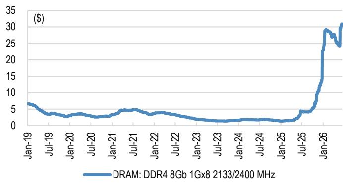

line chart

| Date     | Price ($) |
| -------- | --------- |
| Jan-19   | 7         |
| Jul-19   | 5         |
| Jan-20   | 4         |
| Jul-20   | 3         |
| Jan-21   | 4         |
| Jul-21   | 5         |
| Jan-22   | 4         |
| Jul-22   | 3         |
| Jan-23   | 2         |
| Jul-23   | 1         |
| Jan-24   | 1         |
| Jul-24   | 1         |
| Jan-25   | 1         |
| Jul-25   | 3         |
| Jan-26   | 30        |

Source: Bloomberg Finance L.P., JPM.

Figure 24: NAND spot price trend  
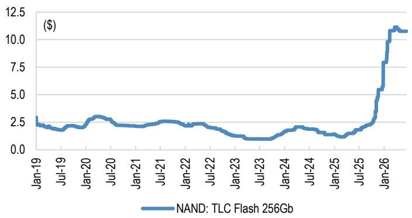

line chart

| Date   | Value |
|--------|-------|
| Jan-19 | 2.5   |
| Jul-19 | 2.0   |
| Jan-20 | 2.8   |
| Jul-20 | 2.5   |
| Jan-21 | 2.3   |
| Jul-21 | 2.4   |
| Jan-22 | 2.2   |
| Jul-22 | 1.8   |
| Jan-23 | 1.0   |
| Jul-23 | 0.8   |
| Jan-24 | 1.5   |
| Jul-24 | 1.7   |
| Jan-25 | 1.2   |
| Jul-25 | 1.8   |
| Jan-26 | 11.0  |

Source: Bloomberg Finance L.P., JPM.

Figure 25: DRAM quarterly growth rate (YoY)  
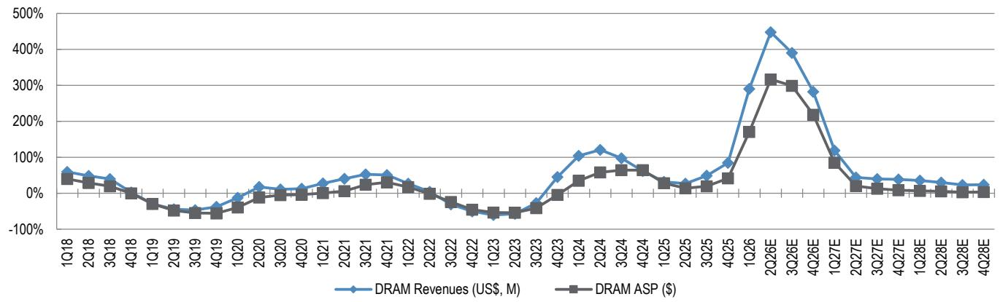

line chart

| Quarter | DRAM Revenues (US$, M) | DRAM ASP ($) |
|---------|------------------------|--------------|
| 1Q18    | ~50%                   | ~30%         |
| 2Q18    | ~40%                   | ~20%         |
| 3Q18    | ~30%                   | ~10%         |
| 4Q18    | ~20%                   | ~0%          |
| 1Q19    | ~-10%                  | ~-20%        |
| 2Q19    | ~-20%                  | ~-30%        |
| 3Q19    | ~-30%                  | ~-40%        |
| 4Q19    | ~-20%                  | ~-30%        |
| 1Q20    | ~-10%                  | ~-20%        |
| 2Q20    | ~20%                   | ~-10%        |
| 3Q20    | ~10%                   | ~-5%         |
| 4Q20    | ~5%                    | ~-10%        |
| 1Q21    | ~10%                   | ~-5%         |
| 2Q21    | ~20%                   | ~-10%        |
| 3Q21    | ~30%                   | ~-5%         |
| 4Q21    | ~40%                   | ~-10%        |
| 1Q22    | ~30%                   | ~-5%         |
| 2Q22    | ~20%                   | ~-10%        |
| 3Q22    | ~10%                   | ~-5%         |
| 4Q22    | ~5%                    | ~-10%        |
| 1Q23    | ~-5%                   | ~-15%        |
| 2Q23    | ~-10%                  | ~-20%        |
| 3Q23    | ~-5%                   | ~-15%        |
| 4Q23    | ~5%                    | ~-10%        |
| 1Q24    | ~10%                   | ~-5%         |
| 2Q24    | ~15%                   | ~5%          |
| 3Q24    | ~10%                   | ~10%         |
| 4Q24    | ~5%                    | ~5%          |
| 1Q25    | ~0%                    | ~0%          |
| 2Q25    | ~5%                    | ~5%          |
| 3Q25    | ~10%                   | ~10%         |
| 4Q25    | ~5%                    | ~5%          |
| 1Q26    | ~300%                  | ~170%        |
| 2Q26E   | ~450%                  | ~320%        |
| 3Q26E   | ~400%                  | ~300%        |
| 4Q26E   | ~300%                  | ~200%        |
| 1Q27E   | ~150%                  | ~80%         |
| 2Q27E   | ~50%                   | ~30%         |
| 3Q27E   | ~30%                   | ~20%         |
| 4Q27E   | ~30%                   | ~15%         |
| 1Q28E   | ~30%                   | ~10%         |
| 2Q28E   | ~30%                   | ~5%          |
| 3Q28E   | ~30%                   | ~5%          |
| 4Q28E   | ~30%                   | ~5%          |

Source: WSTS, Gartner®, JPM estimates.  
Note: JPM Global Memory Model.

Figure 26: DRAM supply/demand forecasts

<table><tr><td></td><td>2016</td><td>2017</td><td>2018</td><td>2019</td><td>2020</td><td>2021</td><td>2022</td><td>2023</td><td>2024</td><td>2025</td><td>2026E</td><td>2027E</td><td>2028E</td></tr><tr><td>DRAM Demand (mn units)</td><td>8,992</td><td>11,166</td><td>13,651</td><td>15,928</td><td>19,376</td><td>22,957</td><td>23,600</td><td>25,776</td><td>31,364</td><td>37,920</td><td>50,226</td><td>67,504</td><td>81,771</td></tr><tr><td>YoY (%)</td><td>27%</td><td>24%</td><td>22%</td><td>17%</td><td>22%</td><td>18%</td><td>3%</td><td>9%</td><td>22%</td><td>21%</td><td>32%</td><td>34%</td><td>21%</td></tr><tr><td>DRAM Supply (mn units)</td><td>9,525</td><td>11,410</td><td>13,056</td><td>15,689</td><td>19,248</td><td>23,630</td><td>23,665</td><td>27,258</td><td>32,131</td><td>38,351</td><td>47,138</td><td>57,379</td><td>71,035</td></tr><tr><td>YoY (%)</td><td>33%</td><td>20%</td><td>14%</td><td>20%</td><td>23%</td><td>23%</td><td>0%</td><td>15%</td><td>18%</td><td>19%</td><td>23%</td><td>22%</td><td>24%</td></tr><tr><td>DRAM ASP ($)</td><td>4.33</td><td>6.40</td><td>7.69</td><td>3.94</td><td>3.32</td><td>3.84</td><td>3.28</td><td>1.88</td><td>2.90</td><td>3.72</td><td>12.90</td><td>16.02</td><td>16.73</td></tr><tr><td>YoY (%)</td><td>-34%</td><td>48%</td><td>20%</td><td>-49%</td><td>-16%</td><td>15%</td><td>-15%</td><td>-43%</td><td>54%</td><td>28%</td><td>246%</td><td>24%</td><td>4%</td></tr></table>

Source: iSuppli, Gartner®, WSTS, JPM estimates.  
Note: 8GB equivalent for DRAM. JPM Global Memory Model.

Figure 27: DRAM (8GB): Quarterly forecasts

<table><tr><td rowspan="2"></td><td colspan="4">2024</td><td colspan="4">2025</td><td colspan="3">2026</td><td colspan="4">2027</td><td colspan="6">2028</td></tr><tr><td>1Q</td><td>2Q</td><td>3Q</td><td>4Q</td><td>1Q</td><td>2Q</td><td>3Q</td><td>4Q</td><td>1Q</td><td>2QE</td><td>3QE</td><td>4QE</td><td>1QE</td><td>2QE</td><td>3QE</td><td>4QE</td><td>1QE</td><td>2QE</td><td>3QE</td><td>4QE</td><td></td></tr><tr><td colspan="22">DRAM (8GB Eq.)</td></tr><tr><td>Volume (consumption) (WSTS) (mn units)</td><td>7,803</td><td>8,323</td><td>8,276</td><td>8,267</td><td>8,019</td><td>9,254</td><td>10,286</td><td>10,781</td><td>11,581</td><td>12,165</td><td>12,640</td><td>12,933</td><td>13,708</td><td>14,608</td><td>15,728</td><td>16,522</td><td>17,392</td><td>18,018</td><td>18,820</td><td>19,697</td><td></td></tr><tr><td>YoY (%)</td><td>52%</td><td>39%</td><td>20%</td><td>-1%</td><td>3%</td><td>11%</td><td>24%</td><td>30%</td><td>44%</td><td>31%</td><td>23%</td><td>20%</td><td>18%</td><td>20%</td><td>24%</td><td>28%</td><td>27%</td><td>23%</td><td>20%</td><td>19%</td><td></td></tr><tr><td>Revenue (US$ mn)</td><td>18,811</td><td>22,937</td><td>25,126</td><td>27,890</td><td>24,773</td><td>29,104</td><td>37,352</td><td>51,478</td><td>96,707</td><td>159,479</td><td>183,101</td><td>196,727</td><td>211,643</td><td>230,039</td><td>256,346</td><td>271,976</td><td>286,306</td><td>298,093</td><td>316,341</td><td>336,043</td><td></td></tr><tr><td>YoY (%)</td><td>104%</td><td>121%</td><td>97%</td><td>62%</td><td>32%</td><td>27%</td><td>49%</td><td>85%</td><td>290%</td><td>448%</td><td>390%</td><td>282%</td><td>119%</td><td>44%</td><td>40%</td><td>38%</td><td>35%</td><td>30%</td><td>23%</td><td>24%</td><td></td></tr><tr><td>ASP ($)</td><td>2.41</td><td>2.76</td><td>3.04</td><td>3.37</td><td>3.09</td><td>3.15</td><td>3.63</td><td>4.77</td><td>8.35</td><td>13.11</td><td>14.49</td><td>15.21</td><td>15.44</td><td>15.75</td><td>16.30</td><td>16.46</td><td>16.46</td><td>16.54</td><td>16.81</td><td>17.06</td><td></td></tr><tr><td>YoY (%)</td><td>35%</td><td>58%</td><td>64%</td><td>64%</td><td>28%</td><td>14%</td><td>20%</td><td>42%</td><td>170%</td><td>317%</td><td>299%</td><td>219%</td><td>85%</td><td>20%</td><td>13%</td><td>8%</td><td>7%</td><td>5%</td><td>3%</td><td>4%</td><td></td></tr></table>

Source: iSuppli, Gartner®, WSTS, JPM estimates  
Note: JPM Global Memory Model.

Figure 28: NAND quarterly growth rate (YoY)  
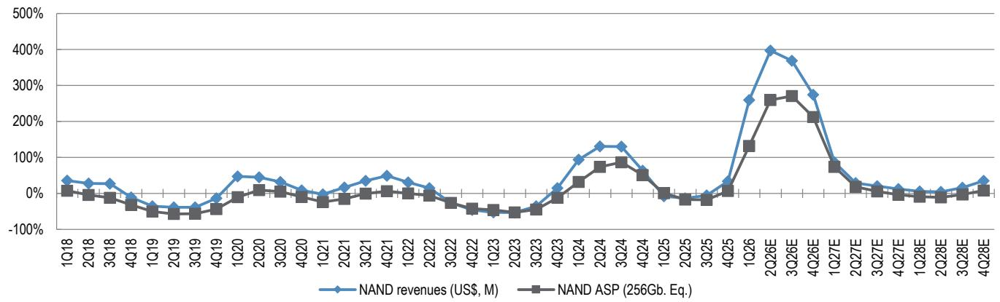

line chart

| Quarter | NAND revenues (US$, M) | NAND ASP (256Gb. Eq.) |
|---------|--------------------------|------------------------|
| 1Q18    | ~30%                     | ~10%                   |
| 2Q18    | ~20%                     | ~5%                    |
| 3Q18    | ~10%                     | ~0%                    |
| 4Q18    | ~-10%                    | ~-5%                   |
| 1Q19    | ~-20%                    | ~-10%                  |
| 2Q19    | ~-30%                    | ~-15%                  |
| 3Q19    | ~-20%                    | ~-10%                  |
| 4Q19    | ~-10%                    | ~-5%                   |
| 1Q20    | ~50%                     | ~10%                   |
| 2Q20    | ~40%                     | ~15%                   |
| 3Q20    | ~30%                     | ~10%                   |
| 4Q20    | ~20%                     | ~5%                    |
| 1Q21    | ~10%                     | ~0%                    |
| 2Q21    | ~20%                     | ~5%                    |
| 3Q21    | ~30%                     | ~10%                   |
| 4Q21    | ~40%                     | ~15%                   |
| 1Q22    | ~30%                     | ~10%                   |
| 2Q22    | ~20%                     | ~5%                    |
| 3Q22    | ~10%                     | ~0%                    |
| 4Q22    | ~-5%                     | ~-5%                   |
| 1Q23    | ~-10%                    | ~-10%                  |
| 2Q23    | ~-5%                     | ~-5%                   |
| 3Q23    | ~-10%                    | ~-5%                   |
| 4Q23    | ~-5%                     | ~-5%                   |
| 1Q24    | ~10%                     | ~5%                    |
| 2Q24    | ~15%                     | ~10%                   |
| 3Q24    | ~10%                     | ~5%                    |
| 4Q24    | ~5%                      | ~0%                    |
| 1Q25    | ~-5%                     | ~-5%                   |
| 2Q25    | ~-10%                    | ~-5%                   |
| 3Q25    | ~-5%                     | ~-5%                   |
| 4Q25    | ~5%                      | ~0%                    |
| 1Q26    | ~250%                    | ~150%                  |
| 2Q26E   | ~400%                    | ~250%                  |
| 3Q26E   | ~350%                    | ~275%                  |
| 4Q26E   | ~275%                    | ~200%                  |
| 1Q27E   | ~75%                     | ~75%                   |
| 2Q27E   | ~25%                     | ~25%                   |
| 3Q27E   | ~10%                     | ~10%                   |
| 4Q27E   | ~5%                      | ~5%                    |
| 1Q28E   | ~0%                      | ~0%                    |
| 2Q28E   | ~5%                      | ~5%                    |
| 3Q28E   | ~10%                     | ~10%                   |
| 4Q28E   | ~30%                     | ~30%                   |

Source: iSuppli, Gartner®, WSTS, JPM estimates.  
Note: 256GB equivalent for NAND. JPM Global Memory Model.

Figure 29: NAND supply/demand forecasts

<table><tr><td></td><td>2016</td><td>2017</td><td>2018</td><td>2019</td><td>2020</td><td>2021</td><td>2022</td><td>2023</td><td>2024</td><td>2025</td><td>2026E</td><td>2027E</td><td>2028E</td></tr><tr><td>NAND Demand (mn units)</td><td>4,287</td><td>5,558</td><td>7,269</td><td>10,413</td><td>14,220</td><td>18,797</td><td>19,637</td><td>21,440</td><td>25,746</td><td>30,710</td><td>37,788</td><td>48,916</td><td>59,817</td></tr><tr><td>YoY (%)</td><td>38%</td><td>30%</td><td>31%</td><td>43%</td><td>37%</td><td>32%</td><td>4%</td><td>9%</td><td>20%</td><td>19%</td><td>23%</td><td>29%</td><td>22%</td></tr><tr><td>NAND Supply (mn units)</td><td>4,192</td><td>5,388</td><td>7,389</td><td>10,785</td><td>13,934</td><td>19,472</td><td>21,432</td><td>23,651</td><td>27,060</td><td>30,982</td><td>37,106</td><td>44,984</td><td>54,407</td></tr><tr><td>YoY (%)</td><td>45%</td><td>29%</td><td>37%</td><td>46%</td><td>29%</td><td>40%</td><td>10%</td><td>10%</td><td>14%</td><td>14%</td><td>20%</td><td>21%</td><td>21%</td></tr><tr><td>NAND ASP ($)</td><td>7.80</td><td>8.78</td><td>7.71</td><td>3.68</td><td>3.64</td><td>3.33</td><td>2.70</td><td>1.57</td><td>2.50</td><td>2.34</td><td>7.42</td><td>8.69</td><td>8.37</td></tr><tr><td>YoY (%)</td><td>-24%</td><td>12%</td><td>-12%</td><td>-52%</td><td>-1%</td><td>-8%</td><td>-19%</td><td>-42%</td><td>60%</td><td>-6%</td><td>217%</td><td>17%</td><td>-4%</td></tr></table>

Source: WSTS, Gartner®, JPM estimates.  
Note: JPM Global Memory Model.

Figure 30: NAND (256GB): Quarterly forecasts

<table><tr><td rowspan="2"></td><td colspan="4">2024</td><td colspan="4">2025</td><td colspan="3">2026</td><td colspan="4">2027</td><td colspan="5">2028</td></tr><tr><td>1Q</td><td>2Q</td><td>3Q</td><td>4Q</td><td>1Q</td><td>2Q</td><td>3Q</td><td>4Q</td><td>1Q</td><td>2QE</td><td>3QE</td><td>4QE</td><td>1QE</td><td>2QE</td><td>3QE</td><td>4QE</td><td>1QE</td><td>2QE</td><td>3QE</td><td>4QE</td></tr><tr><td colspan="21">NAND (256GB Eq.)</td></tr><tr><td>Volume (consumption) (WSTS) (mn units)</td><td>6,837</td><td>7,026</td><td>7,058</td><td>6,914</td><td>6,254</td><td>7,317</td><td>8,120</td><td>8,669</td><td>9,683</td><td>10,119</td><td>10,269</td><td>10,394</td><td>10,399</td><td>10,999</td><td>11,737</td><td>12,151</td><td>12,095</td><td>12,895</td><td>14,088</td><td>15,201</td></tr><tr><td>YoY (%)</td><td>47%</td><td>33%</td><td>23%</td><td>8%</td><td>-9%</td><td>4%</td><td>15%</td><td>25%</td><td>55%</td><td>38%</td><td>26%</td><td>20%</td><td>7%</td><td>9%</td><td>14%</td><td>17%</td><td>16%</td><td>17%</td><td>20%</td><td>25%</td></tr><tr><td>Revenue (US$ mn)</td><td>14,819</td><td>17,991</td><td>19,083</td><td>17,799</td><td>13,626</td><td>15,558</td><td>18,077</td><td>23,815</td><td>49,000</td><td>77,319</td><td>84,739</td><td>89,208</td><td>91,482</td><td>99,657</td><td>102,096</td><td>100,410</td><td>96,445</td><td>103,858</td><td>118,567</td><td>135,616</td></tr><tr><td>YoY (%)</td><td>94%</td><td>130%</td><td>130%</td><td>63%</td><td>-8%</td><td>-14%</td><td>-5%</td><td>34%</td><td>260%</td><td>397%</td><td>369%</td><td>275%</td><td>87%</td><td>29%</td><td>20%</td><td>13%</td><td>5%</td><td>4%</td><td>16%</td><td>35%</td></tr><tr><td>ASP ($)</td><td>2.17</td><td>2.56</td><td>2.70</td><td>2.57</td><td>2.18</td><td>2.13</td><td>2.23</td><td>2.75</td><td>5.06</td><td>7.64</td><td>8.25</td><td>8.58</td><td>8.80</td><td>9.06</td><td>8.70</td><td>8.26</td><td>7.97</td><td>8.05</td><td>8.42</td><td>8.92</td></tr><tr><td>YoY (%)</td><td>32%</td><td>74%</td><td>87%</td><td>51%</td><td>1%</td><td>-17%</td><td>-18%</td><td>7%</td><td>132%</td><td>259%</td><td>271%</td><td>212%</td><td>74%</td><td>19%</td><td>5%</td><td>-4%</td><td>-9%</td><td>-11%</td><td>-3%</td><td>8%</td></tr></table>

Source: iSuppli, Gartner®, WSTS, JPM estimates  
Note: JPM Global Memory Model.

Figure 31: DRAM (8GB) yearly forecasts

<table><tr><td></td><td>2018</td><td>2019</td><td>2020</td><td>2021</td><td>2022</td><td>2023</td><td>2024</td><td>2025</td><td>2026E</td><td>2027E</td><td>2028E</td></tr><tr><td colspan="12">DRAM (8GB Eq.)</td></tr><tr><td>Volume (consumption) (WSTS) (mn units)</td><td>12,983</td><td>15,149</td><td>19,112</td><td>23,716</td><td>23,470</td><td>26,378</td><td>32,669</td><td>38,340</td><td>49,319</td><td>60,566</td><td>73,927</td></tr><tr><td>YoY (%)</td><td>12%</td><td>17%</td><td>26%</td><td>24%</td><td>-1%</td><td>12%</td><td>24%</td><td>17%</td><td>29%</td><td>23%</td><td>22%</td></tr><tr><td>Revenue (US$ mn)</td><td>99,780</td><td>59,664</td><td>63,522</td><td>91,034</td><td>76,886</td><td>49,536</td><td>94,764</td><td>142,707</td><td>636,015</td><td>970,004</td><td>1,236,783</td></tr><tr><td>YoY (%)</td><td>34%</td><td>-40%</td><td>6%</td><td>43%</td><td>-16%</td><td>-36%</td><td>91%</td><td>51%</td><td>346%</td><td>53%</td><td>28%</td></tr><tr><td>ASP ($)</td><td>7.69</td><td>3.94</td><td>3.32</td><td>3.84</td><td>3.28</td><td>1.88</td><td>2.90</td><td>3.72</td><td>12.90</td><td>16.02</td><td>16.73</td></tr><tr><td>YoY (%)</td><td>20%</td><td>-49%</td><td>-16%</td><td>15%</td><td>-15%</td><td>-43%</td><td>54%</td><td>28%</td><td>246%</td><td>24%</td><td>4%</td></tr></table>

Source: iSuppli, Gartner®, WSTS, JPM estimates  
Note: JPM Global Memory Model.

Figure 32: DRAM (8GB) demand model by use

<table><tr><td></td><td>2018</td><td>2019</td><td>2020</td><td>2021</td><td>2022</td><td>2023</td><td>2024</td><td>2025</td><td>2026E</td><td>2027E</td><td>2028E</td></tr><tr><td colspan="12">Volume (Demand; mn units)</td></tr><tr><td>PC DRAM</td><td>2,953</td><td>3,067</td><td>3,448</td><td>4,354</td><td>4,526</td><td>4,675</td><td>5,332</td><td>5,883</td><td>5,374</td><td>5,151</td><td>5,081</td></tr><tr><td>Desktop</td><td>510</td><td>577</td><td>517</td><td>629</td><td>620</td><td>587</td><td>617</td><td>718</td><td>606</td><td>584</td><td>574</td></tr><tr><td>Notebooks</td><td>967</td><td>1,082</td><td>1,510</td><td>2,045</td><td>1,856</td><td>1,827</td><td>2,050</td><td>2,346</td><td>2,055</td><td>2,009</td><td>2,051</td></tr><tr><td>Upgrades + other EDP</td><td>1,477</td><td>1,408</td><td>1,420</td><td>1,680</td><td>2,050</td><td>2,260</td><td>2,665</td><td>2,819</td><td>2,713</td><td>2,558</td><td>2,456</td></tr><tr><td>Server</td><td>3,423</td><td>3,720</td><td>5,964</td><td>6,912</td><td>7,447</td><td>7,804</td><td>10,902</td><td>14,454</td><td>27,309</td><td>44,853</td><td>58,985</td></tr><tr><td>Mobile DRAM</td><td>5,312</td><td>6,840</td><td>7,471</td><td>8,844</td><td>8,648</td><td>9,198</td><td>10,683</td><td>12,201</td><td>11,298</td><td>11,193</td><td>11,500</td></tr><tr><td>Others</td><td>1,962</td><td>1,999</td><td>2,123</td><td>2,624</td><td>3,103</td><td>3,588</td><td>4,070</td><td>4,526</td><td>4,815</td><td>5,033</td><td>5,269</td></tr><tr><td>Total</td><td>13,650</td><td>15,626</td><td>19,007</td><td>22,734</td><td>23,724</td><td>25,265</td><td>30,987</td><td>37,064</td><td>48,796</td><td>66,230</td><td>80,836</td></tr><tr><td colspan="12">YoY</td></tr><tr><td>PC DRAM</td><td>5%</td><td>4%</td><td>12%</td><td>26%</td><td>4%</td><td>3%</td><td>14%</td><td>10%</td><td>-9%</td><td>-4%</td><td>-1%</td></tr><tr><td>Desktop</td><td>1%</td><td>13%</td><td>-10%</td><td>22%</td><td>-1%</td><td>-5%</td><td>5%</td><td>16%</td><td>-16%</td><td>-4%</td><td>-2%</td></tr><tr><td>Notebooks</td><td>5%</td><td>12%</td><td>40%</td><td>35%</td><td>-9%</td><td>-2%</td><td>12%</td><td>14%</td><td>-12%</td><td>-2%</td><td>2%</td></tr><tr><td>Upgrades + other EDP</td><td>7%</td><td>-5%</td><td>1%</td><td>18%</td><td>22%</td><td>10%</td><td>18%</td><td>6%</td><td>-4%</td><td>-6%</td><td>-4%</td></tr><tr><td>Server</td><td>54%</td><td>9%</td><td>60%</td><td>16%</td><td>8%</td><td>5%</td><td>40%</td><td>33%</td><td>89%</td><td>64%</td><td>32%</td></tr><tr><td>Mobile DRAM</td><td>24%</td><td>29%</td><td>9%</td><td>18%</td><td>-2%</td><td>6%</td><td>16%</td><td>14%</td><td>-7%</td><td>-1%</td><td>3%</td></tr><tr><td>Others</td><td>21%</td><td>2%</td><td>6%</td><td>24%</td><td>18%</td><td>16%</td><td>13%</td><td>11%</td><td>6%</td><td>5%</td><td>5%</td></tr><tr><td>Total</td><td>25%</td><td>14%</td><td>22%</td><td>20%</td><td>4%</td><td>6%</td><td>23%</td><td>20%</td><td>32%</td><td>36%</td><td>22%</td></tr><tr><td colspan="12">Composition ratio</td></tr><tr><td>PC DRAM</td><td>22%</td><td>20%</td><td>18%</td><td>19%</td><td>19%</td><td>19%</td><td>17%</td><td>16%</td><td>11%</td><td>8%</td><td>6%</td></tr><tr><td>Desktop</td><td>4%</td><td>4%</td><td>3%</td><td>3%</td><td>3%</td><td>2%</td><td>2%</td><td>2%</td><td>1%</td><td>1%</td><td>1%</td></tr><tr><td>Notebooks</td><td>7%</td><td>7%</td><td>8%</td><td>9%</td><td>8%</td><td>7%</td><td>7%</td><td>6%</td><td>4%</td><td>3%</td><td>3%</td></tr><tr><td>Upgrades + other EDP</td><td>11%</td><td>9%</td><td>7%</td><td>7%</td><td>9%</td><td>9%</td><td>9%</td><td>8%</td><td>6%</td><td>4%</td><td>3%</td></tr><tr><td>Server</td><td>25%</td><td>24%</td><td>31%</td><td>30%</td><td>31%</td><td>31%</td><td>35%</td><td>39%</td><td>56%</td><td>68%</td><td>73%</td></tr><tr><td>Mobile DRAM</td><td>0%</td><td>0%</td><td>0%</td><td>0%</td><td>0%</td><td>1%</td><td>4%</td><td>6%</td><td>8%</td><td>9%</td><td>11%</td></tr><tr><td>Others</td><td>39%</td><td>44%</td><td>39%</td><td>39%</td><td>36%</td><td>36%</td><td>34%</td><td>33%</td><td>23%</td><td>17%</td><td>14%</td></tr><tr><td>Total</td><td>100%</td><td>100%</td><td>100%</td><td>100%</td><td>100%</td><td>100%</td><td>100%</td><td>100%</td><td>100%</td><td>100%</td><td>100%</td></tr></table>

Source: iSuppli, Gartner®, WSTS, JPM estimates  
Note: JPM Global Memory Model.

Figure 33: NAND (256GB): Yearly forecasts

<table><tr><td></td><td>2018</td><td>2019</td><td>2020</td><td>2021</td><td>2022</td><td>2023</td><td>2024</td><td>2025</td><td>2026E</td><td>2027E</td><td>2028E</td></tr><tr><td colspan="12">NAND (256GB Eq.)</td></tr><tr><td>Volume (consumption) (WSTS) (mn units)</td><td>7,212</td><td>10,283</td><td>13,669</td><td>18,570</td><td>20,500</td><td>22,095</td><td>27,836</td><td>30,360</td><td>40,465</td><td>45,287</td><td>54,279</td></tr><tr><td>YoY (%)</td><td>34%</td><td>43%</td><td>33%</td><td>36%</td><td>10%</td><td>8%</td><td>26%</td><td>9%</td><td>33%</td><td>12%</td><td>20%</td></tr><tr><td>Revenue (US$ mn)</td><td>55,631</td><td>37,808</td><td>49,792</td><td>61,914</td><td>55,290</td><td>34,652</td><td>69,691</td><td>71,077</td><td>300,265</td><td>393,645</td><td>454,485</td></tr><tr><td>YoY (%)</td><td>18%</td><td>-32%</td><td>32%</td><td>24%</td><td>-11%</td><td>-37%</td><td>101%</td><td>2%</td><td>322%</td><td>31%</td><td>15%</td></tr><tr><td>ASP ($)</td><td>7.71</td><td>3.68</td><td>3.64</td><td>3.33</td><td>2.70</td><td>1.57</td><td>2.50</td><td>2.34</td><td>7.42</td><td>8.69</td><td>8.37</td></tr><tr><td>YoY (%)</td><td>-12%</td><td>-52%</td><td>-1%</td><td>-8%</td><td>-19%</td><td>-42%</td><td>60%</td><td>-6%</td><td>217%</td><td>17%</td><td>-4%</td></tr></table>

Source: iSuppli, Gartner®, WSTS, JPM estimates  
Note: JPM Global Memory Model.

Figure 34: NAND (256GB) demand model by use

<table><tr><td></td><td>2018</td><td>2019</td><td>2020</td><td>2021</td><td>2022</td><td>2023</td><td>2024</td><td>2025</td><td>2026E</td><td>2027E</td><td>2028E</td></tr><tr><td colspan="12">Volume (Demand; mn units)</td></tr><tr><td>USB</td><td>367</td><td>407</td><td>422</td><td>489</td><td>523</td><td>550</td><td>564</td><td>639</td><td>652</td><td>657</td><td>683</td></tr><tr><td>Flash cards</td><td>503</td><td>568</td><td>510</td><td>538</td><td>520</td><td>541</td><td>529</td><td>586</td><td>603</td><td>620</td><td>639</td></tr><tr><td>SSDs</td><td>2,840</td><td>4,576</td><td>7,056</td><td>9,464</td><td>10,240</td><td>10,279</td><td>13,769</td><td>16,335</td><td>23,744</td><td>34,309</td><td>45,460</td></tr><tr><td>Enterprise SSD</td><td>1,272</td><td>1,758</td><td>2,939</td><td>3,950</td><td>4,743</td><td>3,194</td><td>7,344</td><td>8,934</td><td>16,082</td><td>26,372</td><td>37,174</td></tr><tr><td>Client SSD/Others</td><td>1,568</td><td>2,818</td><td>4,117</td><td>5,514</td><td>5,497</td><td>7,085</td><td>6,424</td><td>7,400</td><td>7,661</td><td>7,937</td><td>8,285</td></tr><tr><td>Smartphones</td><td>2,586</td><td>3,472</td><td>4,004</td><td>5,831</td><td>5,961</td><td>6,891</td><td>7,607</td><td>8,761</td><td>8,462</td><td>8,297</td><td>8,281</td></tr><tr><td>Tablets</td><td>239</td><td>325</td><td>548</td><td>706</td><td>723</td><td>722</td><td>850</td><td>926</td><td>848</td><td>805</td><td>812</td></tr><tr><td>Feature phones</td><td>4</td><td>4</td><td>5</td><td>7</td><td>8</td><td>8</td><td>8</td><td>9</td><td>8</td><td>8</td><td>8</td></tr><tr><td>Others</td><td>559</td><td>883</td><td>1,147</td><td>1,515</td><td>1,824</td><td>2,021</td><td>2,310</td><td>2,603</td><td>2,832</td><td>3,072</td><td>3,340</td></tr><tr><td>Total</td><td>7,099</td><td>10,236</td><td>13,693</td><td>18,550</td><td>19,800</td><td>21,011</td><td>25,636</td><td>29,858</td><td>37,149</td><td>47,769</td><td>59,222</td></tr><tr><td colspan="12">YoY</td></tr><tr><td>USB</td><td>34%</td><td>43%</td><td>33%</td><td>36%</td><td>10%</td><td>8%</td><td>26%</td><td>9%</td><td>33%</td><td>12%</td><td>20%</td></tr><tr><td>Flash cards</td><td>18%</td><td>-32%</td><td>32%</td><td>24%</td><td>-11%</td><td>-37%</td><td>101%</td><td>2%</td><td>322%</td><td>31%</td><td>15%</td></tr><tr><td>SSDs</td><td>43%</td><td>61%</td><td>54%</td><td>34%</td><td>8%</td><td>0%</td><td>34%</td><td>19%</td><td>45%</td><td>44%</td><td>32%</td></tr><tr><td colspan="12">Enterprise SSD</td></tr><tr><td colspan="12">Client SSD/Others</td></tr><tr><td>Smartphones</td><td>44%</td><td>34%</td><td>15%</td><td>46%</td><td>2%</td><td>16%</td><td>10%</td><td>15%</td><td>-3%</td><td>-2%</td><td>0%</td></tr><tr><td>Tablets</td><td>-2%</td><td>36%</td><td>69%</td><td>29%</td><td>2%</td><td>0%</td><td>18%</td><td>9%</td><td>-8%</td><td>-5%</td><td>1%</td></tr><tr><td>Feature phones</td><td>-5%</td><td>14%</td><td>26%</td><td>36%</td><td>13%</td><td>-4%</td><td>3%</td><td>9%</td><td>-10%</td><td>0%</td><td>0%</td></tr><tr><td>Others</td><td>14%</td><td>58%</td><td>30%</td><td>32%</td><td>20%</td><td>11%</td><td>14%</td><td>13%</td><td>9%</td><td>8%</td><td>9%</td></tr><tr><td>Total</td><td>31%</td><td>44%</td><td>34%</td><td>35%</td><td>7%</td><td>6%</td><td>22%</td><td>16%</td><td>24%</td><td>29%</td><td>24%</td></tr><tr><td colspan="12">Composition ratio</td></tr><tr><td>USB</td><td>5%</td><td>4%</td><td>3%</td><td>3%</td><td>3%</td><td>3%</td><td>2%</td><td>2%</td><td>2%</td><td>1%</td><td>1%</td></tr><tr><td>Flash cards</td><td>7%</td><td>6%</td><td>4%</td><td>3%</td><td>3%</td><td>3%</td><td>2%</td><td>2%</td><td>2%</td><td>1%</td><td>1%</td></tr><tr><td>SSDs</td><td>40%</td><td>45%</td><td>52%</td><td>51%</td><td>52%</td><td>49%</td><td>54%</td><td>55%</td><td>64%</td><td>72%</td><td>77%</td></tr><tr><td>Enterprise SSD</td><td>18%</td><td>17%</td><td>21%</td><td>21%</td><td>24%</td><td>15%</td><td>29%</td><td>30%</td><td>43%</td><td>55%</td><td>63%</td></tr><tr><td>Client SSD/Others</td><td>22%</td><td>28%</td><td>30%</td><td>30%</td><td>28%</td><td>34%</td><td>25%</td><td>25%</td><td>21%</td><td>17%</td><td>14%</td></tr><tr><td>Smartphones</td><td>36%</td><td>34%</td><td>29%</td><td>31%</td><td>30%</td><td>33%</td><td>30%</td><td>29%</td><td>23%</td><td>17%</td><td>14%</td></tr><tr><td>Tablets</td><td>3%</td><td>3%</td><td>4%</td><td>4%</td><td>4%</td><td>3%</td><td>3%</td><td>3%</td><td>2%</td><td>2%</td><td>1%</td></tr><tr><td>Feature phones</td><td>0%</td><td>0%</td><td>0%</td><td>0%</td><td>0%</td><td>0%</td><td>0%</td><td>0%</td><td>0%</td><td>0%</td><td>0%</td></tr><tr><td>Others</td><td>8%</td><td>9%</td><td>8%</td><td>8%</td><td>9%</td><td>10%</td><td>9%</td><td>9%</td><td>8%</td><td>6%</td><td>6%</td></tr><tr><td>Total</td><td>100%</td><td>100%</td><td>100%</td><td>100%</td><td>100%</td><td>100%</td><td>100%</td><td>100%</td><td>100%</td><td>100%</td><td>100%</td></tr></table>

Source: iSuppli, Gartner®, WSTS, JPM estimates  
Note: JPM Global Memory Model.

Figure 35: End products: Market assumptions

<table><tr><td>(mn unit, %)</td><td>CY2018</td><td>CY2019</td><td>CY2020</td><td>CY2021</td><td>CY2022</td><td>CY2023</td><td>CY2024</td><td>CY2025</td><td>CY2026E</td><td>CY2027E</td><td>CY2028E</td><td>Estimated by</td></tr><tr><td>Desktop PC</td><td>100</td><td>100</td><td>80</td><td>85</td><td>76</td><td>62</td><td>61</td><td>67</td><td>62</td><td>63</td><td>64</td><td>Albert Hung</td></tr><tr><td>YoY</td><td>-2.5</td><td>0.5</td><td>-20.4</td><td>6.9</td><td>-10.9</td><td>-17.9</td><td>-2.2</td><td>9.8</td><td>-7.7</td><td>2.0</td><td>1.8</td><td></td></tr><tr><td>Notebook PC</td><td>160</td><td>162</td><td>196</td><td>221</td><td>189</td><td>163</td><td>168</td><td>182</td><td>167</td><td>169</td><td>173</td><td>Albert Hung</td></tr><tr><td>YoY</td><td>-0.3</td><td>1.3</td><td>20.9</td><td>13.0</td><td>-14.6</td><td>-13.5</td><td>3.1</td><td>8.2</td><td>-8.4</td><td>1.5</td><td>2.2</td><td></td></tr><tr><td>Server</td><td>13</td><td>13</td><td>13</td><td>13</td><td>14</td><td>11</td><td>12</td><td>12</td><td>14</td><td>15</td><td>16</td><td>Albert Hung</td></tr><tr><td>YoY</td><td>13.1</td><td>-3.2</td><td>1.1</td><td>1.9</td><td>7.0</td><td>-17.9</td><td>6.5</td><td>0.2</td><td>14.6</td><td>8.3</td><td>5.0</td><td></td></tr><tr><td>Automotive</td><td>94</td><td>90</td><td>77</td><td>80</td><td>79</td><td>87</td><td>89</td><td>92</td><td>88</td><td>89</td><td>89</td><td>Akira Kishimoto</td></tr><tr><td>YoY</td><td>-0.6</td><td>-4.2</td><td>-14.1</td><td>4.0</td><td>-1.6</td><td>9.8</td><td>2.3</td><td>3.4</td><td>-4.4</td><td>1.0</td><td>0.5</td><td></td></tr><tr><td>iPhone</td><td>205</td><td>195</td><td>201</td><td>246</td><td>231</td><td>228</td><td>228</td><td>241</td><td>244</td><td>243</td><td>245</td><td>Samik Chatterjee</td></tr><tr><td>YoY</td><td>-5.1</td><td>-4.6</td><td>2.8</td><td>22.4</td><td>-5.9</td><td>-1.3</td><td>-0.2</td><td>5.6</td><td>1.3</td><td>-0.4</td><td>0.9</td><td></td></tr><tr><td>Apple Watch</td><td>25</td><td>31</td><td>39</td><td>40</td><td>46</td><td>43</td><td>40</td><td>38</td><td>39</td><td>39</td><td>--</td><td>Samik Chatterjee</td></tr><tr><td>YoY</td><td>39.7</td><td>26.8</td><td>25.0</td><td>1.6</td><td>16.7</td><td>-6.9</td><td>-8.1</td><td>-3.2</td><td>1.0</td><td>1.0</td><td>--</td><td></td></tr><tr><td>LCD TV</td><td>289</td><td>287</td><td>272</td><td>261</td><td>263</td><td>236</td><td>--</td><td>--</td><td>--</td><td>--</td><td>--</td><td>--</td></tr><tr><td>YoY</td><td>--</td><td>-0.4</td><td>-5.4</td><td>-3.9</td><td>0.6</td><td>-10.0</td><td>--</td><td>--</td><td>--</td><td>--</td><td>--</td><td></td></tr><tr><td>OLED TV</td><td>3</td><td>3</td><td>4</td><td>7</td><td>7</td><td>5</td><td>--</td><td>--</td><td>--</td><td>--</td><td>--</td><td>--</td></tr><tr><td>YoY</td><td>--</td><td>11.5</td><td>35.8</td><td>65.9</td><td>0.5</td><td>-29.0</td><td>--</td><td>--</td><td>--</td><td>--</td><td>--</td><td></td></tr><tr><td>Smartphone</td><td>1,410</td><td>1,387</td><td>1,265</td><td>1,351</td><td>1,193</td><td>1,142</td><td>1,223</td><td>1,245</td><td>1,104</td><td>1,075</td><td>--</td><td>Samik Chatterjee</td></tr><tr><td>YoY</td><td>-2.4</td><td>-1.7</td><td>-8.8</td><td>6.9</td><td>-11.7</td><td>-4.3</td><td>7.1</td><td>1.8</td><td>-11.3</td><td>-2.6</td><td>--</td><td></td></tr><tr><td>DSLR</td><td>10.8</td><td>8.5</td><td>5.3</td><td>5.4</td><td>5.9</td><td>6.0</td><td>6.6</td><td>7.0</td><td>--</td><td>--</td><td>--</td><td>--</td></tr><tr><td>YoY</td><td>-7.8</td><td>-21.4</td><td>-37.3</td><td>0.9</td><td>10.7</td><td>1.2</td><td>10.2</td><td>5.9</td><td>--</td><td>--</td><td>--</td><td></td></tr></table>

Source: Omdia, CIPA, company data, and JPM estimates.  
Note: Apple as of May 1, 2026, Smartphone as of March 9, 2026, PC/Server as of January 12, 2026, Automotive as of June 3, 2026.

Figure 36: PC shipments by region  
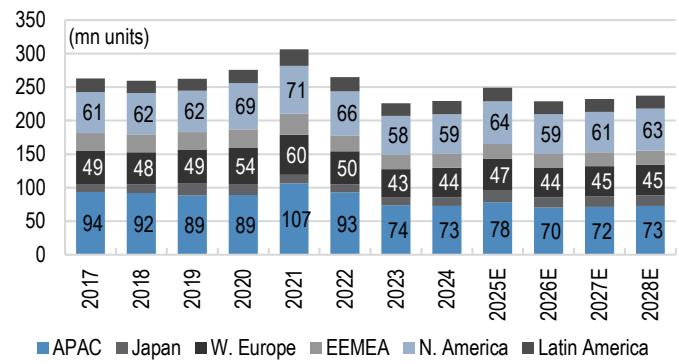

stacked bar chart

| Year | APAC (mn units) | Japan (mn units) | W. Europe (mn units) | EEMEA (mn units) | N. America (mn units) | Latin America (mn units) |
| :--- | :--- | :--- | :--- | :--- | :--- | :--- |
| 2017 | 94 | 49 | 61 | 0 | 0 | 0 |
| 2018 | 92 | 48 | 62 | 0 | 0 | 0 |
| 2019 | 89 | 49 | 62 | 0 | 0 | 0 |
| 2020 | 89 | 54 | 69 | 0 | 0 | 0 |
| 2021 | 107 | 60 | 71 | 0 | 0 | 0 |
| 2022 | 93 | 50 | 66 | 0 | 0 | 0 |
| 2023 | 74 | 43 | 58 | 0 | 0 | 0 |
| 2024 | 73 | 44 | 59 | 0 | 0 | 0 |
| 2025E | 78 | 47 | 64 | 0 | 0 | 0 |
| 2026E | 70 | 44 | 59 | 0 | 0 | 0 |
| 2027E | 72 | 45 | 61 | 0 | 0 | 0 |
| 2028E | 73 | 45 | 63 | 0 | 0 | 0 |
The chart displays a stacked bar chart with values in million units. The x-axis represents years from '2017 to '2028, and the y-axis represents production volume in million units. The legend identifies six regions: APAC, Japan, Western Europe, EEMEA, North America, and Latin America. The data is already in English.

Source: Gartner®, JPM estimates.

Figure 37: Server shipments by region  
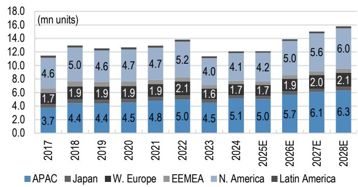

stacked bar chart

| Year | APAC (mn units) | Japan (mn units) | W. Europe (mn units) | EEMEA (mn units) | N. America (mn units) | Latin America (mn units) |
| :--- | :--- | :--- | :--- | :--- | :--- | :--- |
| 2017 | 3.7 | 1.7 | 1.9 | 4.6 | 5.0 | 0.0 |
| 2018 | 4.4 | 1.9 | 1.9 | 5.0 | 4.6 | 0.0 |
| 2019 | 4.4 | 1.9 | 1.9 | 4.6 | 4.7 | 0.0 |
| 2020 | 4.5 | 1.9 | 1.9 | 4.7 | 4.7 | 0.0 |
| 2021 | 4.8 | 1.9 | 2.1 | 5.2 | 5.2 | 0.0 |
| 2022 | 5.0 | 2.1 | 1.6 | 4.0 | 5.2 | 0.0 |
| 2023 | 4.5 | 1.6 | 1.7 | 4.1 | 4.1 | 0.0 |
| 2024 | 5.1 | 1.7 | 1.7 | 4.2 | 4.1 | 0.0 |
| 2025E | 5.0 | 1.7 | 1.7 | 4.2 | 4.2 | 0.0 |
| 2026E | 5.7 | 1.9 | 2.0 | 5.0 | 5.6 | 0.0 |
| 2027E | 6.1 | 2.0 | 2.1 | 5.6 | 6.0 | 0.0 |
| 2028E | 6.3 | 2.1 | - | - | - | - |
The chart displays a stacked bar chart with each bar representing a total of sales in millions of units for each year from 2017 to 2028E. The legend indicates the categories: APAC, Japan, W. Europe, EEMEA, N. America, and Latin America. The data is presented in a table format with years as rows and sales values as columns on the right side.

Source: Gartner®, JPM estimates.

Figure 38: Smartphone volume trend by region

<table><tr><td>Millions of units</td><td>2017</td><td>2018</td><td>2019</td><td>2020</td><td>2021</td><td>2022</td><td>2023</td><td>2024</td><td>2025</td><td>2026E</td><td>2027E</td></tr><tr><td>China</td><td>439.2</td><td>390.8</td><td>360.8</td><td>330.3</td><td>332.9</td><td>287.3</td><td>272.5</td><td>284.6</td><td>282.3</td><td>254.1</td><td>238.8</td></tr><tr><td>India</td><td>122.7</td><td>140.1</td><td>158.3</td><td>144.7</td><td>161.5</td><td>151.6</td><td>148.6</td><td>155.9</td><td>154.2</td><td>137.3</td><td>140.3</td></tr><tr><td>Rest of Asia Pacific</td><td>211.4</td><td>221.2</td><td>214.5</td><td>217.4</td><td>234.5</td><td>210.9</td><td>193.4</td><td>220.1</td><td>225.8</td><td>197.8</td><td>189.8</td></tr><tr><td>North America</td><td>180.1</td><td>166.7</td><td>159.4</td><td>151.0</td><td>163.1</td><td>148.9</td><td>135.2</td><td>136.6</td><td>141.2</td><td>129.9</td><td>127.3</td></tr><tr><td>South and Central America</td><td>125.5</td><td>115.2</td><td>110.2</td><td>107.6</td><td>129.4</td><td>116.5</td><td>118.9</td><td>137.0</td><td>140.5</td><td>125.9</td><td>119.6</td></tr><tr><td>Western Europe</td><td>119.4</td><td>121.0</td><td>119.8</td><td>126.2</td><td>114.0</td><td>104.7</td><td>94.2</td><td>99.0</td><td>98.7</td><td>88.3</td><td>84.8</td></tr><tr><td>Central and Eastern Europe</td><td>94.1</td><td>92.4</td><td>92.5</td><td>86.0</td><td>87.6</td><td>70.4</td><td>67.9</td><td>66.8</td><td>63.5</td><td>56.8</td><td>55.7</td></tr><tr><td>Middle East and Africa</td><td>152.1</td><td>162.2</td><td>171.0</td><td>101.7</td><td>128.3</td><td>103.0</td><td>111.2</td><td>123.1</td><td>139.3</td><td>114.2</td><td>118.8</td></tr><tr><td>Total</td><td>1,444.5</td><td>1,409.7</td><td>1,386.5</td><td>1,264.7</td><td>1,351.4</td><td>1,193.4</td><td>1,141.9</td><td>1,223.2</td><td>1,245.5</td><td>1,104.3</td><td>1,075.1</td></tr><tr><td>Y/Y Growth</td><td></td><td></td><td></td><td></td><td></td><td></td><td></td><td></td><td></td><td></td><td></td></tr><tr><td>China</td><td>-7.7%</td><td>-11.0%</td><td>-8%</td><td>-8%</td><td>1%</td><td>-14%</td><td>-5%</td><td>4%</td><td>-1%</td><td>-10%</td><td>-6%</td></tr><tr><td>India</td><td>22.0%</td><td>14.2%</td><td>13%</td><td>-9%</td><td>12%</td><td>-6%</td><td>-2%</td><td>5%</td><td>-1%</td><td>-11%</td><td>2%</td></tr><tr><td>Rest of Asia Pacific</td><td>11.5%</td><td>4.7%</td><td>-3%</td><td>1%</td><td>8%</td><td>-10%</td><td>-8%</td><td>14%</td><td>3%</td><td>-12%</td><td>-4%</td></tr><tr><td>North America</td><td>2.2%</td><td>-7.5%</td><td>-4%</td><td>-5%</td><td>8%</td><td>-9%</td><td>-9%</td><td>1%</td><td>3%</td><td>-8%</td><td>-2%</td></tr><tr><td>South and Central America</td><td>8.3%</td><td>-8.2%</td><td>-4%</td><td>-2%</td><td>20%</td><td>-10%</td><td>2%</td><td>15%</td><td>3%</td><td>-10%</td><td>-5%</td></tr><tr><td>Western Europe</td><td>5.8%</td><td>1.4%</td><td>-1%</td><td>5%</td><td>-10%</td><td>-8%</td><td>-10%</td><td>5%</td><td>0%</td><td>-10%</td><td>-4%</td></tr><tr><td>Central and Eastern Europe</td><td>2.8%</td><td>-1.8%</td><td>0%</td><td>-7%</td><td>2%</td><td>-20%</td><td>-4%</td><td>-2%</td><td>-5%</td><td>-11%</td><td>-2%</td></tr><tr><td>Middle East and Africa</td><td>10.3%</td><td>6.7%</td><td>5%</td><td>-41%</td><td>26%</td><td>-20%</td><td>8%</td><td>11%</td><td>13%</td><td>-18%</td><td>4%</td></tr><tr><td>Total</td><td>3.2%</td><td>-2.4%</td><td>-2%</td><td>-9%</td><td>7%</td><td>-12%</td><td>-4%</td><td>7%</td><td>2%</td><td>-11%</td><td>-3%</td></tr></table>

Source: Omdia, JPM estimates  
Note: JPM smartphone model.

Figure 39: Smartphone shipment volume by region (2024, volume)  
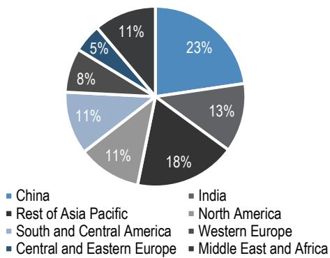

pie chart

| Region | Percentage (%) |
| :--- | :--- |
| China | 23 |
| Rest of Asia Pacific | 18 |
| South and Central America | 11 |
| Central and Eastern Europe | 11 |
| India | 13 |
| North America | 11 |
| Western Europe | 8 |
| Middle East and Africa | 5 |

Source: Omdia, JPM.

Figure 40: Smartphone market value mix by region (2024, value)  
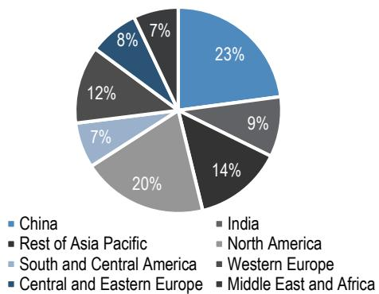

pie chart

| Region | Percentage (%) |
| :--- | :--- |
| China | 23 |
| Rest of Asia Pacific | 14 |
| South and Central America | 20 |
| Central and Eastern Europe | 8 |
| India | 9 |
| North America | 7 |
| Western Europe | 7 |
| Middle East and Africa | 7 |

Source: IDC, Omdia, JPM.

Figure 41: iPhone forecasts

<table><tr><td>FY (US$ mn)</td><td>2016</td><td>2017</td><td>2018</td><td>2019</td><td>2020</td><td>2021</td><td>2022</td><td>2023</td><td>2024</td><td>2025E</td><td>2026E</td><td>2027E</td><td>2028E</td></tr><tr><td>Revenue</td><td>136,700</td><td>141,319</td><td>164,888</td><td>142,381</td><td>137,781</td><td>191,973</td><td>205,489</td><td>200,583</td><td>201,183</td><td>209,586</td><td>252,268</td><td>265,406</td><td>257,742</td></tr><tr><td>YoY (%)</td><td>-11.8%</td><td>3.4%</td><td>16.7%</td><td>-13.6%</td><td>-3.2%</td><td>39.3%</td><td>7.0%</td><td>-2.4%</td><td>0.3%</td><td>4.2%</td><td>20.4%</td><td>5.2%</td><td>-2.9%</td></tr><tr><td>Units (&#x27;000s)</td><td>211,884</td><td>216,756</td><td>217,722</td><td>189,537</td><td>189,989</td><td>241,460</td><td>242,790</td><td>223,500</td><td>229,461</td><td>233,399</td><td>253,698</td><td>244,250</td><td>246,190</td></tr><tr><td>YoY (%)</td><td>-8.4%</td><td>2.3%</td><td>0.4%</td><td>-12.9%</td><td>0.2%</td><td>27.1%</td><td>0.6%</td><td>-7.9%</td><td>2.7%</td><td>1.7%</td><td>8.7%</td><td>-3.7%</td><td>0.8%</td></tr><tr><td>ASP ($)</td><td>645</td><td>652</td><td>757</td><td>751</td><td>725</td><td>795</td><td>846</td><td>897</td><td>877</td><td>898</td><td>994</td><td>1,087</td><td>1,047</td></tr><tr><td>YoY (%)</td><td>-3.8%</td><td>1.1%</td><td>16.2%</td><td>-0.8%</td><td>-3.5%</td><td>9.6%</td><td>6.5%</td><td>6.0%</td><td>-2.3%</td><td>2.4%</td><td>10.7%</td><td>9.3%</td><td>-3.7%</td></tr></table>

Source: Company data, JPM estimates (Apple covered by Samik Chatterjee, forecasts as of May 1, 2026).  
Note: Apple's fiscal year ends in September, fiscal year basis.

Figure 42: 8CSP (top 8 cloud service providers) capex forecasts  
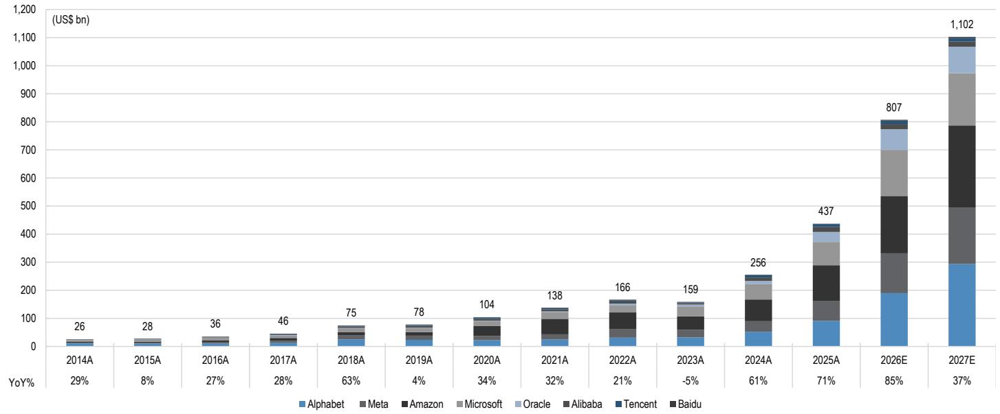

stacked bar chart

| Year | Alphabet (US$ bn) | Meta (US$ bn) | Amazon (US$ bn) | Microsoft (US$ bn) | Oracle (US$ bn) | Alibaba (US$ bn) | Tencent (US$ bn) | Baidu (US$ bn) | YoY% (%) |
| :--- | :--- | :--- | :--- | :--- | :--- | :--- | :--- | :--- | :--- |
| 2014A | 26 | 0 | 0 | 0 | 0 | 0 | 0 | 0 | 29 |
| 2015A | 28 | 0 | 0 | 0 | 0 | 0 | 0 | 0 | 8 |
| 2016A | 36 | 0 | 0 | 0 | 0 | 0 | 0 | 0 | 27 |
| 2017A | 46 | 0 | 0 | 0 | 0 | 0 | 0 | 0 | 28 |
| 2018A | 75 | 0 | 0 | 0 | 0 | 0 | 0 | 0 | 63 |
| 2019A | 78 | 0 | 0 | 0 | 0 | 0 | 0 | 0 | 4 |
| 2020A | 104 | 0 | 0 | 0 | 0 | 0 | 0 | 0 | 34 |
| 2021A | 138 | 0 | 0 | 0 | 0 | 0 | 0 | 0 | 32 |
| 2022A | 166 | 0 | 0 | 0 | 0 | 0 | 0 | 0 | 21 |
| 2023A | 159 | 0 | 0 | 0 | 0 | 0 | 0 | 0 | -5 |
| 2024A | 256 | 0 | 0 | 0 | 0 | 0 | 0 | 0 | 61 |
| 2025A | 437 | 0 | 0 | 0 | 0 | 0 | 0 | 0 | 71 |
| 2026E | 807 | 0 | 0 | 0 | 0 | 0 | 0 | 0 | 85 |
| 2027E | 1,102 | 0 | 0 | 0 | 0 | 0 | 0 | 0 | 37 |
The chart displays stacked bars representing total revenue per year and the year-over-year growth percentages for each company from the previous year to the next year. The legend identifies companies: Alphabet, Meta, Amazon, Microsoft, Oracle, Alibaba, Tencent, and Baidu. The data is presented in a table format with years on the left and corresponding growth percentages on the right. The values for the top of each bar are explicitly labeled on the chart.

Source: Company data, JPM estimates (Alphabet, Meta, Amazon covered by Doug Anmuth, Microsoft, Oracle covered by Arti Vula, Alibaba, Tencent, Baidu covered by Alex Yao). Note: Estimates as of June, 2026.

Figure 43: 8CSP (top 8 cloud service providers) capex forecasts

<table><tr><td>$bn</td><td>Alphabet</td><td>Meta</td><td>Amazon</td><td>Microsoft</td><td>Oracle</td><td>Alibaba</td><td>Tencent</td><td>Baidu</td></tr><tr><td>2014A</td><td>10.96</td><td>1.83</td><td>4.89</td><td>5.29</td><td>0.73</td><td>1.25</td><td>0.70</td><td>0.78</td></tr><tr><td>2015A</td><td>9.93</td><td>2.52</td><td>4.59</td><td>6.55</td><td>1.61</td><td>1.73</td><td>0.87</td><td>0.83</td></tr><tr><td>2016A</td><td>10.21</td><td>4.49</td><td>6.74</td><td>9.11</td><td>1.60</td><td>2.64</td><td>1.26</td><td>0.63</td></tr><tr><td>2017A</td><td>13.18</td><td>6.73</td><td>10.06</td><td>8.70</td><td>2.04</td><td>4.42</td><td>1.79</td><td>0.71</td></tr><tr><td>2018A</td><td>25.14</td><td>13.98</td><td>11.32</td><td>14.22</td><td>1.47</td><td>7.50</td><td>2.98</td><td>1.33</td></tr><tr><td>2019A</td><td>23.55</td><td>15.10</td><td>12.69</td><td>13.55</td><td>1.59</td><td>6.57</td><td>3.30</td><td>0.93</td></tr><tr><td>2020A</td><td>22.28</td><td>15.12</td><td>35.05</td><td>17.59</td><td>1.83</td><td>6.26</td><td>4.94</td><td>0.74</td></tr><tr><td>2021A</td><td>24.64</td><td>18.57</td><td>55.40</td><td>23.22</td><td>3.12</td><td>8.27</td><td>4.54</td><td>1.69</td></tr><tr><td>2022A</td><td>31.49</td><td>31.19</td><td>58.32</td><td>24.77</td><td>6.68</td><td>5.10</td><td>3.37</td><td>1.23</td></tr><tr><td>2023A</td><td>32.25</td><td>27.05</td><td>48.13</td><td>35.20</td><td>6.94</td><td>4.65</td><td>2.96</td><td>1.58</td></tr><tr><td>2024A</td><td>52.54</td><td>37.26</td><td>77.66</td><td>55.55</td><td>10.75</td><td>11.94</td><td>8.74</td><td>1.13</td></tr><tr><td>2025A</td><td>91.45</td><td>69.69</td><td>128.32</td><td>83.09</td><td>35.48</td><td>17.10</td><td>11.02</td><td>1.68</td></tr><tr><td>2026E</td><td>190.02</td><td>142.05</td><td>204.22</td><td>163.89</td><td>73.50</td><td>17.46</td><td>13.00</td><td>2.93</td></tr><tr><td>2027E</td><td>293.44</td><td>202.14</td><td>290.66</td><td>186.81</td><td>94.56</td><td>17.85</td><td>13.64</td><td>3.07</td></tr></table>

<table><tr><td>Total</td><td>YoY</td></tr><tr><td>26.43</td><td>29%</td></tr><tr><td>28.62</td><td>8%</td></tr><tr><td>36.69</td><td>28%</td></tr><tr><td>47.62</td><td>30%</td></tr><tr><td>77.94</td><td>64%</td></tr><tr><td>77.28</td><td>-1%</td></tr><tr><td>103.80</td><td>34%</td></tr><tr><td>139.44</td><td>34%</td></tr><tr><td>162.14</td><td>16%</td></tr><tr><td>158.76</td><td>-2%</td></tr><tr><td>255.56</td><td>61%</td></tr><tr><td>437.83</td><td>71%</td></tr><tr><td>807.09</td><td>84%</td></tr><tr><td>1,102.17</td><td>37%</td></tr></table>

Source: Company data, JPM estimates (Alphabet, Meta, Amazon covered by Doug Anmuth; Microsoft, Oracle covered by Arti Vula; Alibaba, Tencent, Baidu covered by Alex Yao). Note: Estimates as of June, 2026.

Figure 44: CSP (cloud service providers) capex forecasts

<table><tr><td>$bn</td><td>Alphabet</td><td>Meta</td><td>Amazon</td><td>Microsoft</td><td>Oracle</td></tr><tr><td>2022Q1A</td><td>9.79</td><td>5.32</td><td>13.74</td><td>5.34</td><td>1.10</td></tr><tr><td>2022Q2A</td><td>6.83</td><td>7.53</td><td>14.10</td><td>6.87</td><td>1.42</td></tr><tr><td>2022Q3A</td><td>7.28</td><td>9.36</td><td>15.04</td><td>6.28</td><td>1.72</td></tr><tr><td>2022Q4A</td><td>7.60</td><td>8.99</td><td>15.44</td><td>6.27</td><td>2.43</td></tr><tr><td>2022A</td><td>31.49</td><td>31.19</td><td>58.32</td><td>24.77</td><td>6.68</td></tr><tr><td>2023Q1A</td><td>6.29</td><td>6.82</td><td>13.07</td><td>6.61</td><td>2.63</td></tr><tr><td>2023Q2A</td><td>6.89</td><td>6.13</td><td>10.41</td><td>8.94</td><td>1.91</td></tr><tr><td>2023Q3A</td><td>8.06</td><td>6.50</td><td>11.30</td><td>9.92</td><td>1.31</td></tr><tr><td>2023Q4A</td><td>11.02</td><td>7.59</td><td>13.35</td><td>9.74</td><td>1.08</td></tr><tr><td>2023A</td><td>32.25</td><td>27.05</td><td>48.13</td><td>35.20</td><td>6.94</td></tr><tr><td>2024Q1A</td><td>12.01</td><td>6.40</td><td>13.94</td><td>10.95</td><td>1.67</td></tr><tr><td>2024Q2A</td><td>13.19</td><td>8.17</td><td>16.39</td><td>13.87</td><td>2.80</td></tr><tr><td>2024Q3A</td><td>13.06</td><td>8.26</td><td>21.28</td><td>14.92</td><td>2.30</td></tr><tr><td>2024Q4A</td><td>14.28</td><td>14.43</td><td>26.05</td><td>15.80</td><td>3.97</td></tr><tr><td>2024A</td><td>52.54</td><td>37.26</td><td>77.66</td><td>55.55</td><td>10.75</td></tr><tr><td>2025Q1A</td><td>17.20</td><td>12.94</td><td>24.26</td><td>16.75</td><td>5.86</td></tr><tr><td>2025Q2A</td><td>22.45</td><td>16.54</td><td>31.37</td><td>17.08</td><td>9.08</td></tr><tr><td>2025Q3A</td><td>23.95</td><td>18.83</td><td>34.23</td><td>19.39</td><td>8.50</td></tr><tr><td>2025Q4A</td><td>27.85</td><td>21.38</td><td>38.47</td><td>29.88</td><td>12.03</td></tr><tr><td>2025A</td><td>91.45</td><td>69.69</td><td>128.32</td><td>83.09</td><td>35.48</td></tr><tr><td>2026E</td><td>190.02</td><td>142.05</td><td>204.22</td><td>163.89</td><td>73.50</td></tr><tr><td>2027E</td><td>293.44</td><td>202.14</td><td>290.66</td><td>186.81</td><td>94.56</td></tr></table>

<table><tr><td>Total</td><td>YoY</td></tr><tr><td>34.18</td><td>29%</td></tr><tr><td>35.33</td><td>20%</td></tr><tr><td>37.96</td><td>20%</td></tr><tr><td>38.30</td><td>12%</td></tr><tr><td>145.76</td><td>20%</td></tr><tr><td>32.79</td><td>-4%</td></tr><tr><td>32.38</td><td>-8%</td></tr><tr><td>35.77</td><td>-6%</td></tr><tr><td>41.70</td><td>9%</td></tr><tr><td>142.63</td><td>-2%</td></tr><tr><td>43.30</td><td>32%</td></tr><tr><td>51.63</td><td>59%</td></tr><tr><td>57.52</td><td>61%</td></tr><tr><td>70.56</td><td>69%</td></tr><tr><td>223.00</td><td>56%</td></tr><tr><td>71.14</td><td>64%</td></tr><tr><td>87.43</td><td>69%</td></tr><tr><td>96.40</td><td>68%</td></tr><tr><td>117.58</td><td>67%</td></tr><tr><td>372.55</td><td>67%</td></tr><tr><td>700.19</td><td>88%</td></tr><tr><td>973.05</td><td>39%</td></tr></table>

Source: Company data, JPM estimates (Alphabet, Meta, Amazon covered by Doug Anmuth; Microsoft, Oracle covered by Arti Vula).  
Note: Estimates as of June, 2026.

Figure 45: 8CSP (top 8 cloud service providers) capex breakdown  
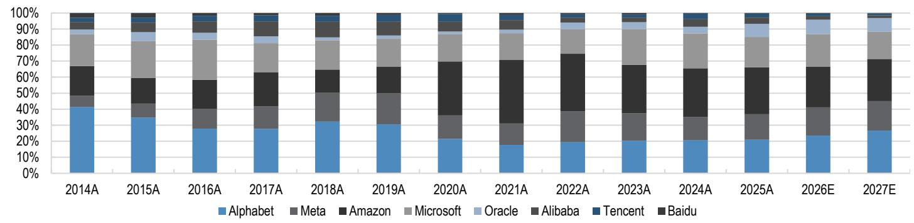

stacked bar chart

| Year | Alphabet (%) | Meta (%) | Amazon (%) | Microsoft (%) | Oracle (%) | Alibaba (%) | Tencent (%) | Baidu (%) |
|---|---|---|---|---|---|---|---|---|
| 2014A | 40 | 5 | 20 | 15 | 3 | 3 | 0 | 3 |
| 2015A | 35 | 8 | 20 | 15 | 4 | 3 | 0 | 3 |
| 2016A | 27 | 12 | 18 | 20 | 4 | 3 | 0 | 3 |
| 2017A | 27 | 13 | 18 | 18 | 4 | 4 | 0 | 3 |
| 2018A | 32 | 15 | 15 | 18 | 3 | 4 | 0 | 3 |
| 2019A | 30 | 17 | 16 | 16 | 3 | 4 | 0 | 3 |
| 2020A | 20 | 15 | 20 | 18 | 3 | 4 | 0 | 3 |
| 2021A | 17 | 14 | 25 | 18 | 3 | 4 | 0 | 3 |
| 2022A | 18 | 16 | 25 | 16 | 3 | 4 | 0 | 3 |
| 2023A | 19 | 16 | 25 | 18 | 3 | 4 | 0 | 3 |
| 2024A | 20 | 16 | 25 | 18 | 3 | 4 | 0 | 3 |
| 2025A | 20 | 16 | 25 | 18 | 4 | 4 | 0 | 3 |
| 2026E | 23 | 17 | 25 | 18 | 3 | 4 | 0 | 3 |
| 2027E | 26 | 17 | 25 | 18 | 4 | 4 | 0 | 3 |
The chart displays the percentage shares of various companies over time, with each segment labeled by its corresponding company name. The x-axis represents years from '2014A' to '2027E', and the y-axis represents the percentage share. There are no labels for the data series. The legend is implicit in the legend labels. The chart includes a legend box for the top three companies: Alphabet, Meta, Amazon, and Microsoft. The data is presented in a single column format with percentages shown on each segment. The chart is titled implicitly by axis labels and the legend is provided in the image.

Source: Company data, JPM estimates (Alphabet, Meta, Amazon covered by Doug Anmuth, Microsoft, Oracle covered by Arti Vula, Alibaba, Tencent, Baidu covered by Alex Yao).  
Note: Estimates as of June, 2026.

Figure 46: Inventory trend (TSMC)  
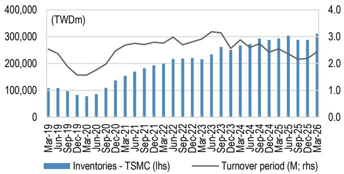

bar-line hybrid chart

| Date    | Inventories - TSMC (lhs) | Turnover period (M; rhs) |
|---------|--------------------------|--------------------------|
| Mar-19  | 100,000                  | 2.5                      |
| Jun-19  | 100,000                  | 2.3                      |
| Sep-19  | 80,000                   | 2.0                      |
| Dec-19  | 80,000                   | 1.8                      |
| Mar-20  | 80,000                   | 1.7                      |
| Jun-20  | 100,000                  | 1.9                      |
| Sep-20  | 120,000                  | 2.1                      |
| Dec-20  | 140,000                  | 2.3                      |
| Mar-21  | 160,000                  | 2.5                      |
| Jun-21  | 180,000                  | 2.6                      |
| Sep-21  | 190,000                  | 2.7                      |
| Dec-21  | 200,000                  | 2.8                      |
| Mar-22  | 210,000                  | 2.9                      |
| Jun-22  | 220,000                  | 3.0                      |
| Sep-22  | 230,000                  | 3.1                      |
| Dec-22  | 240,000                  | 3.2                      |
| Mar-23  | 250,000                  | 3.3                      |
| Jun-23  | 260,000                  | 3.4                      |
| Sep-23  | 270,000                  | 3.5                      |
| Dec-23  | 280,000                  | 3.6                      |
| Mar-24  | 290,000                  | 3.7                      |
| Jun-24  | 300,000                  | 3.8                      |
| Sep-24  | 310,000                  | 3.9                      |
| Dec-24  | 320,000                  | 4.0                      |
| Mar-25  | 330,000                  | 4.1                      |
| Jun-25  | 340,000                  | 4.2                      |
| Sep-25  | 350,000                  | 4.3                      |
| Dec-25  | 360,000                  | 4.4                      |
| Mar-26  | 370,000                  | 4.5                      |

Source: Company reports, JPM.

Figure 47: Inventory trend (Intel)  
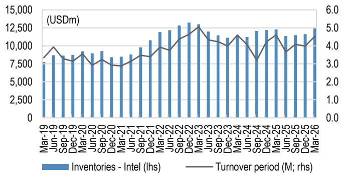

bar-line hybrid

| Date | Inventories - Intel (lhs) (USDm) | Turnover period (M; rhs) |
|---|---|---|
| Mar-19 | 7500 | 3.8 |
| Jun-19 | 8500 | 4.0 |
| Sep-19 | 8000 | 3.7 |
| Dec-19 | 8500 | 3.6 |
| Mar-20 | 8800 | 3.5 |
| Jun-20 | 9000 | 3.4 |
| Sep-20 | 9200 | 3.3 |
| Dec-20 | 8500 | 3.2 |
| Mar-21 | 8800 | 3.1 |
| Jun-21 | 9000 | 3.2 |
| Sep-21 | 9500 | 3.3 |
| Dec-21 | 10500 | 3.5 |
| Mar-22 | 11500 | 3.7 |
| Jun-22 | 12000 | 3.9 |
| Sep-22 | 12500 | 4.1 |
| Dec-22 | 13000 | 4.3 |
| Mar-23 | 12500 | 4.5 |
| Jun-23 | 11500 | 4.3 |
| Sep-23 | 11000 | 4.2 |
| Dec-23 | 11500 | 4.1 |
| Mar-24 | 12000 | 4.3 |
| Jun-24 | 12500 | 3.5 |
| Sep-24 | 12800 | 4.4 |
| Dec-24 | 12500 | 4.5 |
| Mar-25 | 12800 | 4.3 |
| Jun-25 | 12500 | 4.1 |
| Sep-25 | 12800 | 4.2 |
| Dec-25 | 13000 | 4.3 |
| Mar-26 | 13500 | 4.4 |

Source: Company reports, JPM.

Figure 48: Inventory trend (Samsung Electronics)  
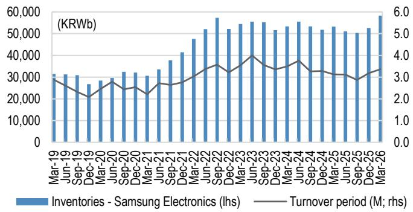

bar-line hybrid chart

| Month    | Inventories - Samsung Electronics (Ihs) | Turnover period (M; rhs) |
|----------|----------------------------------------|--------------------------|
| Mar-19   | 30,000                                 | 3.0                      |
| Jun-19   | 30,000                                 | 2.5                      |
| Sep-19   | 30,000                                 | 2.0                      |
| Dec-19   | 28,000                                 | 2.5                      |
| Mar-20   | 30,000                                 | 3.0                      |
| Jun-20   | 32,000                                 | 2.5                      |
| Sep-20   | 32,000                                 | 2.5                      |
| Dec-20   | 32,000                                 | 2.5                      |
| Mar-21   | 32,000                                 | 2.5                      |
| Jun-21   | 35,000                                 | 3.0                      |
| Sep-21   | 40,000                                 | 3.5                      |
| Dec-21   | 45,000                                 | 3.5                      |
| Mar-22   | 50,000                                 | 4.0                      |
| Jun-22   | 55,000                                 | 4.5                      |
| Sep-22   | 58,000                                 | 4.5                      |
| Dec-22   | 55,000                                 | 4.5                      |
| Mar-23   | 55,000                                 | 4.5                      |
| Jun-23   | 55,000                                 | 4.5                      |
| Sep-23   | 55,000                                 | 4.5                      |
| Dec-23   | 55,000                                 | 4.5                      |
| Mar-24   | 55,000                                 | 4.5                      |
| Jun-24   | 55,000                                 | 4.5                      |
| Sep-24   | 55,000                                 | 4.5                      |
| Dec-24   | 55,000                                 | 4.5                      |
| Mar-25   | 55,000                                 | 4.5                      |
| Jun-25   | 55,000                                 | 4.5                      |
| Sep-25   | 55,000                                 | 4.5                      |
| Dec-25   | 55,000                                 | 4.5                      |
| Mar-26   | 60,000                                 | 4.5                      |

Source: Company reports, JPM.

Figure 49: Inventory trend (SK Hynix, Micron)  
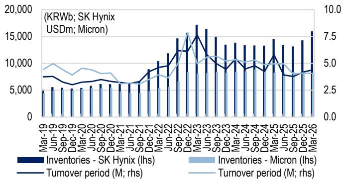

bar-line hybrid chart

(KRWb; SK Hynix
USDm; Micron)
| Date | Inventories - SK Hynix (lhs) | Inventories - Micron (lhs) | Turnover period (M; rhs) | Turnover period (M; rhs) |
|---|---|---|---|---|
| Mar-19 | 4500 | 7000 | 4.5 | 5.0 |
| Jun-19 | 5000 | 7500 | 4.8 | 5.2 |
| Sep-19 | 5500 | 7200 | 4.3 | 4.9 |
| Dec-19 | 5200 | 7300 | 4.6 | 5.1 |
| Mar-20 | 5800 | 7100 | 4.4 | 4.8 |
| Jun-20 | 6000 | 7400 | 4.7 | 5.0 |
| Sep-20 | 6200 | 7600 | 4.5 | 4.7 |
| Dec-20 | 6500 | 7800 | 4.6 | 4.9 |
| Mar-21 | 6300 | 7700 | 4.4 | 4.6 |
| Jun-21 | 6800 | 8200 | 4.7 | 5.1 |
| Sep-21 | 7200 | 8500 | 4.8 | 5.3 |
| Dec-21 | 7800 | 9200 | 5.1 | 5.6 |
| Mar-22 | 8500 | 10500 | 5.5 | 6.1 |
| Jun-22 | 9500 | 12500 | 6.2 | 7.3 |
| Sep-22 | 11500 | 15500 | 7.8 | 8.9 |
| Dec-22 | 13500 | 16500 | 8.5 | 9.6 |
| Mar-23 | 16500 | 14500 | 7.9 | 8.3 |
| Jun-23 | 15500 | 13500 | 7.3 | 7.9 |
| Sep-23 | 14500 | 12500 | 6.8 | 7.4 |
| Dec-23 | 13500 | 11500 | 6.3 | 6.9 |
| Mar-24 | 14500 | 12800 | 6.7 | 7.2 |
| Jun-24 | 13800 | 12200 | 6.4 | 6.8 |
| Sep-24 | 14200 | 13200 | 6.6 | 7.1 |
| Dec-24 | 13800 | 12800 | 6.3 | 6.7 |
| Mar-25 | 14800 | 13800 | 6.9 | 7.4 |
| Jun-25 | 13500 | 12500 | 6.4 | 6.9 |
| Sep-25 | 14500 | 13500 | 6.7 | 7.2 |
| Dec-25 | 15500 | 14500 | 7.1 | 7.6 |
| Mar-26 | 16500 | 15800 | 7.5 | 8.1 |
The chart displays a stacked bar chart with two series: 'Inventories - SK Hynix (lhs)' on the left Y-axis and 'Turnover period (M; rhs)' on the right Y-axis, both plotted against time (Mar-19 to Mar-26) on the X-axis. The bars are grouped by year, with each bar representing a year's total inventory value for SK Hynix and Micron respectively, and the line represents the turnover period for each year.

Source: Company reports, JPM.  
Note: Micron's quarterly period ends in Feb./May/Aug./Nov.

Figure 50: Inventory trend (Broadcom, MediaTek)  
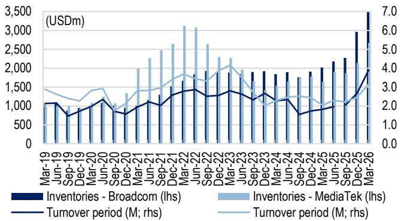

bar-line hybrid chart

| Month | Inventories - Broadcom (lhs) (USDm) | Inventories - MediaTek (lhs) (USDm) | Turnover period (M; rhs) (USDm) | Turnover period (M; rhs) (USDm) |
|---|---|---|---|---|
| Mar-19 | 1050 | 1300 | 3.0 | 2.8 |
| Jun-19 | 1000 | 1000 | 2.8 | 2.6 |
| Sep-19 | 750 | 900 | 2.6 | 2.4 |
| Dec-19 | 1000 | 1100 | 2.8 | 2.6 |
| Mar-20 | 1100 | 1200 | 3.0 | 2.8 |
| Jun-20 | 1050 | 1150 | 2.8 | 2.6 |
| Sep-20 | 850 | 1050 | 2.6 | 2.4 |
| Dec-20 | 1050 | 1300 | 3.0 | 2.8 |
| Mar-21 | 1150 | 1450 | 3.2 | 3.0 |
| Jun-21 | 1250 | 1600 | 3.4 | 3.2 |
| Sep-21 | 1350 | 1750 | 3.6 | 3.4 |
| Dec-21 | 1450 | 1900 | 3.8 | 3.6 |
| Mar-22 | 1550 | 2150 | 4.0 | 3.8 |
| Jun-22 | 1450 | 2350 | 3.8 | 3.6 |
| Sep-22 | 1550 | 2550 | 3.6 | 3.4 |
| Dec-22 | 1650 | 2750 | 3.4 | 3.2 |
| Mar-23 | 1750 | 2950 | 3.2 | 3.0 |
| Jun-23 | 1850 | 3150 | 3.0 | 2.8 |
| Sep-23 | 1950 | 3350 | 2.8 | 2.6 |
| Dec-23 | 2050 | 3550 | 2.6 | 2.4 |
| Mar-24 | 2150 | 3750 | 2.4 | 2.2 |
| Jun-24 | 2250 | 3950 | 2.2 | 2.0 |
| Sep-24 | 2350 | 4150 | 2.0 | 1.8 |
| Dec-24 | 2450 | 4350 | 1.8 | 1.6 |
| Mar-25 | 2550 | 4550 | 1.6 | 1.4 |
| Jun-25 | 2650 | 4750 | 1.4 | 1.2 |
| Sep-25 | 2750 | 4950 | 1.2 | 1.0 |
| Dec-25 | 2850 | 5150 | 1.0 | 0.8 |
| Mar-26 | 3950 | 6950 | 4.8 | 4.6 |
The chart displays a bar chart with two data series: 'Inventories - Broadcom (lhs)' and 'Inventories - MediaTek (lhs)', and 'Turnover period (M; rhs)' as a line graph on the right axis.

Source: Company reports, JPM.  
Note: Broadcom's quarterly period ends in Jan./Apr./July/Oct.

Figure 51: Inventory trend (Infineon, Renesas Electronics)  
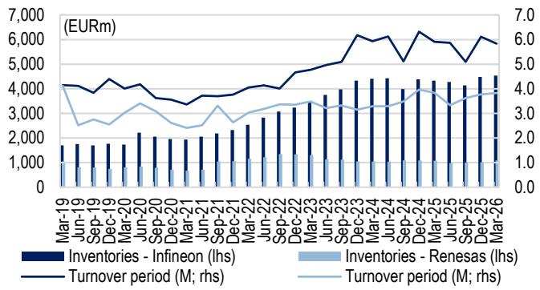

bar-line hybrid chart

| Date | Inventories - Infineon (lhs) (EURm) | Inventories - Renesas (lhs) (EURm) | Turnover period (M; rhs) (EURm) | Turnover period (M; rhs) (EURm) |
| --- | --- | --- | --- | --- |
| Mar-19 | 1500 | 800 | 4.0 | 3.0 |
| Jun-19 | 1500 | 800 | 3.5 | 2.5 |
| Sep-19 | 1500 | 800 | 4.0 | 2.5 |
| Dec-19 | 1500 | 800 | 4.0 | 2.5 |
| Mar-20 | 1500 | 800 | 4.0 | 2.5 |
| Jun-20 | 1500 | 800 | 4.0 | 2.5 |
| Sep-20 | 1500 | 800 | 4.0 | 2.5 |
| Dec-20 | 1500 | 800 | 4.0 | 2.5 |
| Mar-21 | 1500 | 800 | 4.0 | 2.5 |
| Jun-21 | 1500 | 800 | 4.0 | 2.5 |
| Sep-21 | 1500 | 800 | 4.0 | 2.5 |
| Dec-21 | 1500 | 800 | 4.0 | 2.5 |
| Mar-22 | 1500 | 800 | 4.0 | 2.5 |
| Jun-22 | 1500 | 800 | 4.0 | 2.5 |
| Sep-22 | 1500 | 800 | 4.0 | 2.5 |
| Dec-22 | 1500 | 800 | 4.0 | 2.5 |
| Mar-23 | 1500 | 800 | 4.5 | 3.0 |
| Jun-23 | 1500 | 800 | 4.5 | 3.0 |
| Sep-23 | 1500 | 800 | 4.5 | 3.0 |
| Dec-23 | 1500 | 800 | 6.5 | 3.5 |
| Mar-24 | 1500 | 800 | 6.5 | 3.5 |
| Jun-24 | 1500 | 800 | 6.5 | 3.5 |
| Sep-24 | 1500 | 800 | 6.5 | 3.5 |
| Dec-24 | 1500 | 800 | 6.5 | 3.5 |
| Mar-25 | 1500 | 800 | 6.5 | 3.5 |
| Jun-25 | 1500 | 800 | 6.5 | 3.5 |
| Sep-25 | 1500 | 800 | 6.5 | 3.5 |
| Dec-25 | 1500 | 800 | 6.5 | 3.5 |
| Mar-26 | 1500 | 800 | 6.5 | 3.5 |

Source: Company reports, JPM.

Figure 52: Inventory trend (Texas Instruments, STMicroelectronics)  
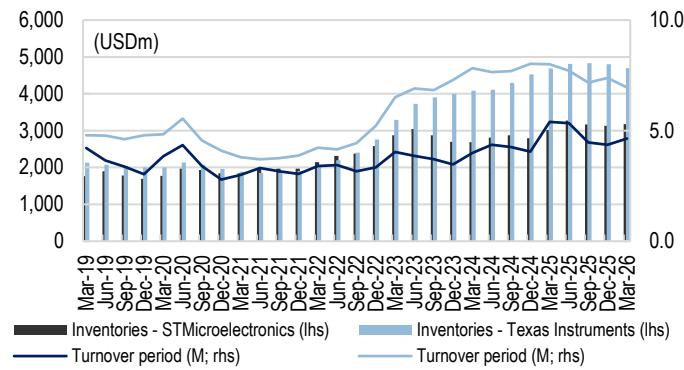

bar-line hybrid chart

| Date    | Inventories - STMicroelectronics (lhs) | Inventories - Texas Instruments (lhs) | Turnover period (M; rhs) |
|---------|----------------------------------------|----------------------------------------|--------------------------|
| Mar-19  | 2,000                                  | 3,000                                  | 5.0                      |
| Jun-19  | 2,000                                  | 3,000                                  | 5.0                      |
| Sep-19  | 2,000                                  | 3,000                                  | 5.0                      |
| Dec-19  | 2,000                                  | 3,000                                  | 5.0                      |
| Mar-20  | 2,000                                  | 3,500                                  | 5.0                      |
| Jun-20  | 2,500                                  | 3,500                                  | 5.0                      |
| Sep-20  | 2,500                                  | 3,500                                  | 5.0                      |
| Dec-20  | 2,500                                  | 3,500                                  | 5.0                      |
| Mar-21  | 2,500                                  | 3,500                                  | 5.0                      |
| Jun-21  | 2,500                                  | 3,500                                  | 5.0                      |
| Sep-21  | 2,500                                  | 3,500                                  | 5.0                      |
| Dec-21  | 2,500                                  | 3,500                                  | 5.0                      |
| Mar-22  | 2,500                                  | 3,500                                  | 5.0                      |
| Jun-22  | 2,500                                  | 3,500                                  | 5.0                      |
| Sep-22  | 2,500                                  | 3,500                                  | 5.0                      |
| Dec-22  | 2,500                                  | 3,500                                  | 5.0                      |
| Mar-23  | 2,500                                  | 4,000                                  | 5.0                      |
| Jun-23  | 2,500                                  | 4,500                                  | 5.0                      |
| Sep-23  | 2,500                                  | 4,500                                  | 5.0                      |
| Dec-23  | 2,500                                  | 4,500                                  | 5.0                      |
| Mar-24  | 2,500                                  | 4,500                                  | 5.0                      |
| Jun-24  | 2,500                                  | 4,500                                  | 5.0                      |
| Sep-24  | 2,500                                  | 4,500                                  | 5.0                      |
| Dec-24  | 2,500                                  | 4,500                                  | 5.0                      |
| Mar-25  | 3,500                                  | 4,750                                  | 5.0                      |
| Jun-25  | 3,500                                  | 4,750                                  | 5.0                      |
| Sep-25  | 3,500                                  | 4,750                                  | 5.0                      |
| Dec-25  | 3,500                                  | 4,750                                  | 5.0                      |
| Mar-26  | 3,500                                  | 4,750                                  | 5.0                      |

Source: Company reports, JPM.

Figure 54: Inventory trend (Lam Research, AMAT, TEL)  
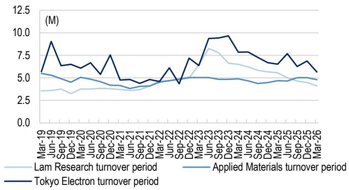

line chart

| Date     | Lam Research turnover period | Applied Materials turnover period | Tokyo Electron turnover period |
|----------|-------------------------------|-----------------------------------|--------------------------------|
| Mar-19   | ~3.5                          | ~5.5                              | ~5.5                           |
| Jun-19   | ~3.0                          | ~5.0                              | ~9.0                           |
| Sep-19   | ~3.5                          | ~4.5                              | ~6.5                           |
| Dec-19   | ~3.0                          | ~4.0                              | ~6.0                           |
| Mar-20   | ~3.5                          | ~4.5                              | ~6.5                           |
| Jun-20   | ~3.0                          | ~4.0                              | ~7.0                           |
| Sep-20   | ~3.5                          | ~4.5                              | ~7.5                           |
| Dec-20   | ~3.0                          | ~4.0                              | ~5.0                           |
| Mar-21   | ~3.5                          | ~4.5                              | ~4.5                           |
| Jun-21   | ~3.0                          | ~4.0                              | ~4.0                           |
| Sep-21   | ~3.5                          | ~4.5                              | ~4.5                           |
| Dec-21   | ~3.0                          | ~4.0                              | ~4.0                           |
| Mar-22   | ~3.5                          | ~4.5                              | ~6.0                           |
| Jun-22   | ~3.0                          | ~4.0                              | ~4.5                           |
| Sep-22   | ~3.5                          | ~4.5                              | ~7.0                           |
| Dec-22   | ~3.0                          | ~4.0                              | ~8.0                           |
| Mar-23   | ~3.5                          | ~4.5                              | ~9.0                           |
| Jun-23   | ~3.0                          | ~4.0                              | ~9.5                           |
| Sep-23   | ~3.5                          | ~4.5                              | ~9.5                           |
| Dec-23   | ~3.0                          | ~4.0                              | ~8.0                           |
| Mar-24   | ~3.5                          | ~4.5                              | ~7.5                           |
| Jun-24   | ~3.0                          | ~4.0                              | ~7.0                           |
| Sep-24   | ~3.5                          | ~4.5                              | ~6.5                           |
| Dec-24   | ~3.0                          | ~4.0                              | ~6.0                           |
| Mar-25   | ~3.5                          | ~4.5                              | ~7.5                           |
| Jun-25   | ~3.0                          | ~4.0                              | ~6.5                           |
| Sep-25   | ~3.5                          | ~4.5                              | ~7.0                           |
| Dec-25   | ~3.0                          | ~4.0                              | ~6.5                           |
| Mar-26   | ~3.5                          | ~4.5                              | ~6.0                           |

Source: Company reports, JPM.

Figure 53: Inventory trend (Sony Group Semi business)  
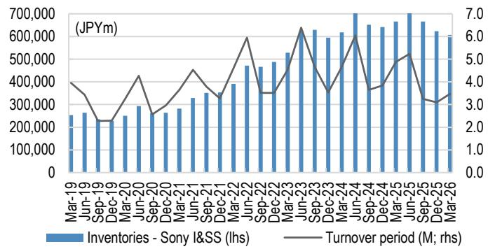

bar-line hybrid chart

| Date | Inventories - Sony I&SS (JPYm) | Turnover period (M; rhs) |
|---|---|---|
| Mar-19 | 250,000 | 4.0 |
| Jun-19 | 270,000 | 3.5 |
| Sep-19 | 240,000 | 2.5 |
| Dec-19 | 250,000 | 2.5 |
| Mar-20 | 280,000 | 4.2 |
| Jun-20 | 300,000 | 2.5 |
| Sep-20 | 260,000 | 2.8 |
| Dec-20 | 270,000 | 3.0 |
| Mar-21 | 290,000 | 3.5 |
| Jun-21 | 330,000 | 4.5 |
| Sep-21 | 350,000 | 3.5 |
| Dec-21 | 340,000 | 3.2 |
| Mar-22 | 380,000 | 5.8 |
| Jun-22 | 470,000 | 3.5 |
| Sep-22 | 490,000 | 3.5 |
| Dec-22 | 510,000 | 3.8 |
| Mar-23 | 550,000 | 4.5 |
| Jun-23 | 630,000 | 6.2 |
| Sep-23 | 610,000 | 5.5 |
| Dec-23 | 590,000 | 3.7 |
| Mar-24 | 610,000 | 6.1 |
| Jun-24 | 710,000 | 5.8 |
| Sep-24 | 660,000 | 3.7 |
| Dec-24 | 640,000 | 3.8 |
| Mar-25 | 680,000 | 5.1 |
| Jun-25 | 710,000 | 5.3 |
| Sep-25 | 670,000 | 3.1 |
| Dec-25 | 610,000 | 3.1 |
| Mar-26 | 615,000 | 3.3 |

Source: Company reports, JPM.  
Note: Inventory turnover period is calculated based on sales.

Figure 55: Inventory trend (Advantest, Disco, SCREEN HD, HOYA, Ulvac)  
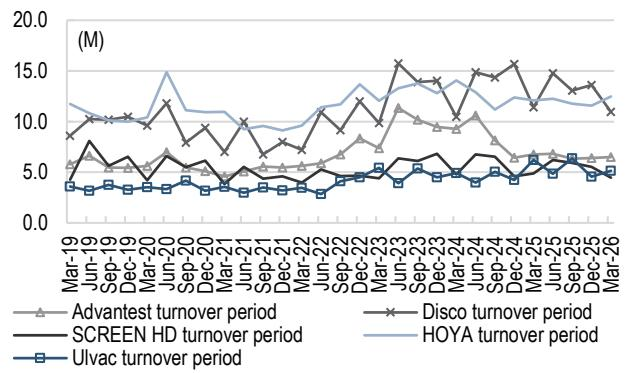  
Source: Company reports, JPM.

Figure 56: DRAM wafer capacity (300mm)

<table><tr><td>DRAM wafer output (12&quot; eq., 300mm, K wspm)</td><td>2019</td><td>2020</td><td>2021</td><td>2022</td><td>2023</td><td>2024</td><td>2025</td><td>2026E</td><td>2027E</td><td>2028E</td></tr><tr><td>SK hynix</td><td>354</td><td>354</td><td>363</td><td>386</td><td>338</td><td>405</td><td>518</td><td>558</td><td>621</td><td>705</td></tr><tr><td>Samsung</td><td>483</td><td>495</td><td>574</td><td>689</td><td>570</td><td>604</td><td>635</td><td>690</td><td>760</td><td>870</td></tr><tr><td>Micron</td><td>324</td><td>324</td><td>325</td><td>325</td><td>288</td><td>301</td><td>305</td><td>308</td><td>358</td><td>451</td></tr><tr><td>Nanya</td><td>69</td><td>70</td><td>70</td><td>69</td><td>63</td><td>60</td><td>61</td><td>62</td><td>66</td><td>72</td></tr><tr><td>Winbond</td><td>27</td><td>27</td><td>27</td><td>25</td><td>23</td><td>26</td><td>26</td><td>32</td><td>35</td><td>35</td></tr><tr><td>Powerchip</td><td>50</td><td>45</td><td>45</td><td>40</td><td>34</td><td>38</td><td>40</td><td>40</td><td>40</td><td>40</td></tr><tr><td>CXMT</td><td>13</td><td>28</td><td>48</td><td>74</td><td>88</td><td>168</td><td>245</td><td>293</td><td>360</td><td>445</td></tr><tr><td>Total DRAM capacity</td><td>1,318</td><td>1,343</td><td>1,451</td><td>1,607</td><td>1,402</td><td>1,601</td><td>1,830</td><td>1,982</td><td>2,241</td><td>2,618</td></tr><tr><td colspan="11"></td></tr><tr><td>Sequential change (%)</td><td>2019</td><td>2020</td><td>2021</td><td>2022</td><td>2023</td><td>2024</td><td>2025</td><td>2026E</td><td>2027E</td><td>2028E</td></tr><tr><td>SK hynix</td><td>6%</td><td>0%</td><td>2%</td><td>7%</td><td>-13%</td><td>20%</td><td>28%</td><td>8%</td><td>11%</td><td>13%</td></tr><tr><td>Samsung</td><td>2%</td><td>3%</td><td>16%</td><td>20%</td><td>-17%</td><td>6%</td><td>5%</td><td>9%</td><td>10%</td><td>14%</td></tr><tr><td>Micron</td><td>7%</td><td>0%</td><td>0%</td><td>0%</td><td>-12%</td><td>5%</td><td>1%</td><td>1%</td><td>16%</td><td>26%</td></tr><tr><td>Nanya</td><td>2%</td><td>2%</td><td>-1%</td><td>-1%</td><td>-9%</td><td>-4%</td><td>2%</td><td>2%</td><td>6%</td><td>9%</td></tr><tr><td>Winbond</td><td>45%</td><td>0%</td><td>0%</td><td>-9%</td><td>-7%</td><td>14%</td><td>1%</td><td>21%</td><td>10%</td><td>0%</td></tr><tr><td>Powerchip</td><td>121%</td><td>-10%</td><td>0%</td><td>-11%</td><td>-15%</td><td>10%</td><td>7%</td><td>0%</td><td>0%</td><td>0%</td></tr><tr><td>CXMT</td><td>1150%</td><td>120%</td><td>73%</td><td>55%</td><td>19%</td><td>91%</td><td>46%</td><td>19%</td><td>23%</td><td>24%</td></tr><tr><td>Total</td><td>8%</td><td>2%</td><td>8%</td><td>11%</td><td>-13%</td><td>14%</td><td>14%</td><td>8%</td><td>13%</td><td>17%</td></tr><tr><td colspan="11"></td></tr><tr><td>Capacity share (%)</td><td>2019</td><td>2020</td><td>2021</td><td>2022</td><td>2023</td><td>2024</td><td>2025</td><td>2026E</td><td>2027E</td><td>2028E</td></tr><tr><td>SK hynix</td><td>27%</td><td>26%</td><td>25%</td><td>24%</td><td>24%</td><td>25%</td><td>28%</td><td>28%</td><td>28%</td><td>27%</td></tr><tr><td>Samsung</td><td>37%</td><td>37%</td><td>40%</td><td>43%</td><td>41%</td><td>38%</td><td>35%</td><td>35%</td><td>34%</td><td>33%</td></tr><tr><td>Micron</td><td>25%</td><td>24%</td><td>22%</td><td>20%</td><td>21%</td><td>19%</td><td>17%</td><td>16%</td><td>16%</td><td>17%</td></tr><tr><td>Nanya</td><td>5%</td><td>5%</td><td>5%</td><td>4%</td><td>4%</td><td>4%</td><td>3%</td><td>3%</td><td>3%</td><td>3%</td></tr><tr><td>Winbond</td><td>2%</td><td>2%</td><td>2%</td><td>2%</td><td>2%</td><td>2%</td><td>1%</td><td>2%</td><td>2%</td><td>1%</td></tr><tr><td>Powerchip</td><td>4%</td><td>3%</td><td>3%</td><td>2%</td><td>2%</td><td>2%</td><td>2%</td><td>2%</td><td>2%</td><td>2%</td></tr><tr><td>CXMT</td><td>1%</td><td>2%</td><td>3%</td><td>5%</td><td>6%</td><td>10%</td><td>13%</td><td>15%</td><td>16%</td><td>17%</td></tr><tr><td>Total capacity</td><td>100%</td><td>100%</td><td>100%</td><td>100%</td><td>100%</td><td>100%</td><td>100%</td><td>100%</td><td>100%</td><td>100%</td></tr><tr><td colspan="11"></td></tr><tr><td>HBM capacity (k wspm)</td><td>2019</td><td>2020</td><td>2021</td><td>2022</td><td>2023</td><td>2024</td><td>2025</td><td>2026E</td><td>2027E</td><td>2028E</td></tr><tr><td>Samsung</td><td></td><td></td><td></td><td></td><td>51</td><td>99</td><td>145</td><td>188</td><td>245</td><td>308</td></tr><tr><td>SK hynix</td><td></td><td></td><td></td><td></td><td>46</td><td>99</td><td>158</td><td>205</td><td>260</td><td>335</td></tr><tr><td>Micron</td><td></td><td></td><td></td><td></td><td>4</td><td>16</td><td>49</td><td>83</td><td>128</td><td>180</td></tr><tr><td>Total</td><td></td><td></td><td></td><td></td><td>101</td><td>214</td><td>351</td><td>475</td><td>633</td><td>823</td></tr><tr><td>HBM as % of total WSPM</td><td></td><td></td><td></td><td></td><td>7%</td><td>13%</td><td>19%</td><td>24%</td><td>28%</td><td>31%</td></tr></table>

Source: IHS, company data, JPM estimates  
Note: JPM Global Memory Model.

Figure 57: NAND wafer capacity (300mm)  
Wafer capacity (12" Eq. 300mm, K wspm)

<table><tr><td></td><td>2019</td><td>2020</td><td>2021</td><td>2022</td><td>2023</td><td>2024</td><td>2025</td><td>2026E</td><td>2027E</td><td>2028E</td></tr><tr><td>SK hynix</td><td>207</td><td>201</td><td>230</td><td>248</td><td>159</td><td>168</td><td>163</td><td>165</td><td>165</td><td>173</td></tr><tr><td>Samsung</td><td>424</td><td>458</td><td>570</td><td>629</td><td>463</td><td>423</td><td>395</td><td>393</td><td>395</td><td>395</td></tr><tr><td>Micron</td><td>184</td><td>179</td><td>175</td><td>164</td><td>110</td><td>109</td><td>104</td><td>108</td><td>113</td><td>123</td></tr><tr><td>Kioxia</td><td>498</td><td>518</td><td>610</td><td>601</td><td>429</td><td>401</td><td>395</td><td>415</td><td>430</td><td>430</td></tr><tr><td>Intel</td><td>61</td><td>63</td><td>60</td><td>59</td><td>45</td><td>50</td><td>52</td><td>55</td><td>55</td><td>60</td></tr><tr><td>YMTC</td><td>17</td><td>35</td><td>64</td><td>81</td><td>63</td><td>108</td><td>148</td><td>160</td><td>194</td><td>220</td></tr><tr><td>Total</td><td>1,391</td><td>1,452</td><td>1,709</td><td>1,781</td><td>1,268</td><td>1,258</td><td>1,256</td><td>1,295</td><td>1,351</td><td>1,400</td></tr></table>

<table><tr><td>Sequential change (%)</td><td>2019</td><td>2020</td><td>2021</td><td>2022</td><td>2023</td><td>2024</td><td>2025</td><td>2026E</td><td>2027E</td><td>2028E</td></tr><tr><td>SK hynix</td><td>-2%</td><td>-3%</td><td>14%</td><td>8%</td><td>-36%</td><td>6%</td><td>-3%</td><td>2%</td><td>0%</td><td>5%</td></tr><tr><td>Samsung</td><td>-5%</td><td>8%</td><td>25%</td><td>10%</td><td>-26%</td><td>-9%</td><td>-7%</td><td>-1%</td><td>1%</td><td>0%</td></tr><tr><td>Micron</td><td>-10%</td><td>-3%</td><td>-2%</td><td>-6%</td><td>-33%</td><td>-1%</td><td>-5%</td><td>4%</td><td>5%</td><td>9%</td></tr><tr><td>Kioxia</td><td>-8%</td><td>4%</td><td>18%</td><td>-1%</td><td>-29%</td><td>-6%</td><td>-2%</td><td>5%</td><td>4%</td><td>0%</td></tr><tr><td>Intel</td><td>23%</td><td>2%</td><td>-4%</td><td>-2%</td><td>-23%</td><td>11%</td><td>4%</td><td>6%</td><td>0%</td><td>9%</td></tr><tr><td>YMTC</td><td>282%</td><td>101%</td><td>83%</td><td>27%</td><td>-23%</td><td>72%</td><td>37%</td><td>8%</td><td>21%</td><td>14%</td></tr><tr><td>Total</td><td>-5%</td><td>4%</td><td>18%</td><td>4%</td><td>-29%</td><td>-1%</td><td>0%</td><td>3%</td><td>4%</td><td>4%</td></tr></table>

<table><tr><td>Capacity share (%)</td><td>2019</td><td>2020</td><td>2021</td><td>2022</td><td>2023</td><td>2024</td><td>2025</td><td>2026E</td><td>2027E</td><td>2028E</td></tr><tr><td>SK hynix</td><td>15%</td><td>14%</td><td>13%</td><td>14%</td><td>13%</td><td>13%</td><td>13%</td><td>13%</td><td>12%</td><td>12%</td></tr><tr><td>Samsung</td><td>30%</td><td>32%</td><td>33%</td><td>35%</td><td>36%</td><td>34%</td><td>31%</td><td>30%</td><td>29%</td><td>28%</td></tr><tr><td>Micron</td><td>13%</td><td>12%</td><td>10%</td><td>9%</td><td>9%</td><td>9%</td><td>8%</td><td>8%</td><td>8%</td><td>9%</td></tr><tr><td>Kioxia</td><td>36%</td><td>36%</td><td>36%</td><td>34%</td><td>34%</td><td>32%</td><td>31%</td><td>32%</td><td>32%</td><td>31%</td></tr><tr><td>Intel</td><td>4%</td><td>4%</td><td>4%</td><td>3%</td><td>4%</td><td>4%</td><td>4%</td><td>4%</td><td>4%</td><td>4%</td></tr><tr><td>YMTC</td><td>1%</td><td>2%</td><td>4%</td><td>5%</td><td>5%</td><td>9%</td><td>12%</td><td>12%</td><td>14%</td><td>16%</td></tr></table>

<table><tr><td>Bit shipment share (%)</td><td>2019</td><td>2020</td><td>2021</td><td>2022</td><td>2023</td><td>2024</td><td>2025</td><td>2026E</td><td>2027E</td><td>2028E</td></tr><tr><td>SK hynix</td><td>11%</td><td>12%</td><td>14%</td><td>19%</td><td>21%</td><td>18%</td><td>17%</td><td>17%</td><td>17%</td><td>16%</td></tr><tr><td>Samsung</td><td>37%</td><td>35%</td><td>35%</td><td>32%</td><td>34%</td><td>34%</td><td>29%</td><td>28%</td><td>27%</td><td>27%</td></tr><tr><td>Micron</td><td>12%</td><td>11%</td><td>11%</td><td>10%</td><td>11%</td><td>11%</td><td>12%</td><td>12%</td><td>11%</td><td>11%</td></tr><tr><td>Kioxia/SanDisk</td><td>35%</td><td>35%</td><td>34%</td><td>31%</td><td>31%</td><td>30%</td><td>31%</td><td>31%</td><td>30%</td><td>30%</td></tr><tr><td>Intel</td><td>5%</td><td>5%</td><td>4%</td><td>5%</td><td>0%</td><td>0%</td><td>0%</td><td>0%</td><td>0%</td><td>0%</td></tr><tr><td>YMTC</td><td>5%</td><td>6%</td><td>7%</td><td>8%</td><td>4%</td><td>8%</td><td>12%</td><td>12%</td><td>14%</td><td>16%</td></tr></table>

Source: IHS, company data, JPM estimates  
Note: JPM Global Memory Model.

Figure 58: Samsung Electronics capex breakdown estimates

<table><tr><td>(Wtrn)</td><td>2014</td><td>2015</td><td>2016</td><td>2017</td><td>2018</td><td>2019</td><td>2020</td><td>2021</td><td>2022</td><td>2023</td><td>2024</td><td>2025</td><td>2026E</td><td>2027E</td><td>2028E</td></tr><tr><td>Won/US$</td><td>1,053</td><td>1,126</td><td>1,159</td><td>1,130</td><td>1,100</td><td>1,166</td><td>1,180</td><td>1,144</td><td>1,292</td><td>1,307</td><td>1,364</td><td>1,422</td><td>1,446</td><td>1,400</td><td>1,400</td></tr><tr><td>Semiconductor</td><td>13.5</td><td>14.7</td><td>12.7</td><td>27.0</td><td>23.5</td><td>22.7</td><td>32.9</td><td>43.0</td><td>45.3</td><td>51.8</td><td>43.7</td><td>40.8</td><td>68.0</td><td>81.0</td><td>95.0</td></tr><tr><td>Memory</td><td>7.0</td><td>6.5</td><td>4.5</td><td>6.8</td><td>13.0</td><td>8.5</td><td>10.7</td><td>16.0</td><td>17.8</td><td>21.9</td><td>26.0</td><td>28.2</td><td>44.0</td><td>59.0</td><td>71.5</td></tr><tr><td>DRAM</td><td>3.5</td><td>4.7</td><td>5.5</td><td>13.5</td><td>7.0</td><td>7.7</td><td>11.2</td><td>12.5</td><td>12.5</td><td>11.5</td><td>7.7</td><td>7.8</td><td>9.0</td><td>10.0</td><td>11.5</td></tr><tr><td>NAND</td><td>3.0</td><td>3.5</td><td>2.7</td><td>6.7</td><td>3.5</td><td>6.5</td><td>11.0</td><td>14.5</td><td>15.0</td><td>18.4</td><td>10.0</td><td>4.8</td><td>15.0</td><td>12.0</td><td>12.0</td></tr><tr><td>System LSI</td><td>3.7</td><td>4.8</td><td>9.4</td><td>13.9</td><td>3.9</td><td>1.8</td><td>4.2</td><td>2.9</td><td>2.6</td><td>2.4</td><td>4.7</td><td>3.2</td><td>2.7</td><td>3.2</td><td>3.4</td></tr><tr><td>Display</td><td>1.5</td><td>1.3</td><td>0.5</td><td>0.5</td><td>0.4</td><td>0.1</td><td>0.0</td><td>0.0</td><td>0.0</td><td>0.0</td><td>0.0</td><td>0.0</td><td>0.0</td><td>0.0</td><td>0.0</td></tr><tr><td>LCD</td><td>2.2</td><td>3.5</td><td>8.9</td><td>13.4</td><td>3.5</td><td>1.7</td><td>4.2</td><td>2.9</td><td>2.6</td><td>2.4</td><td>4.7</td><td>3.2</td><td>2.7</td><td>3.2</td><td>3.4</td></tr><tr><td>OLED</td><td>4.3</td><td>5.4</td><td>1.6</td><td>1.4</td><td>1.5</td><td>0.7</td><td>0.3</td><td>1.0</td><td>1.2</td><td>2.6</td><td>2.1</td><td>2.2</td><td>3.0</td><td>2.9</td><td>3.5</td></tr><tr><td>DX</td><td>0.6</td><td>1.0</td><td>0.5</td><td>0.5</td><td>0.6</td><td>0.2</td><td>0.2</td><td>0.3</td><td>0.4</td><td>0.9</td><td>0.9</td><td>1.4</td><td>2.0</td><td>2.2</td><td>2.4</td></tr><tr><td>Others</td><td>22.0</td><td>25.9</td><td>24.1</td><td>42.8</td><td>29.6</td><td>25.4</td><td>37.6</td><td>47.1</td><td>49.4</td><td>57.6</td><td>51.4</td><td>47.5</td><td>75.7</td><td>89.3</td><td>104.3</td></tr><tr><td>Total (W in trillion)</td><td>22.0</td><td>25.9</td><td>24.1</td><td>42.8</td><td>29.6</td><td>25.4</td><td>37.6</td><td>47.1</td><td>49.4</td><td>57.6</td><td>51.4</td><td>47.5</td><td>75.7</td><td>89.3</td><td>104.3</td></tr><tr><td>Total (US$ in billion)</td><td>20.9</td><td>23.0</td><td>20.8</td><td>37.9</td><td>26.9</td><td>21.8</td><td>31.9</td><td>41.2</td><td>38.3</td><td>44.1</td><td>37.7</td><td>33.4</td><td>52.3</td><td>63.8</td><td>74.5</td></tr><tr><td>YoY%</td><td>-1%</td><td>10%</td><td>-9%</td><td>82%</td><td>-29%</td><td>-19%</td><td>46%</td><td>29%</td><td>-7%</td><td>15%</td><td>-14%</td><td>-11%</td><td>57%</td><td>22%</td><td>42%</td></tr></table>

Source: Company data, JPM estimates.  
Note: Samsung Electronics is covered by Jay Kwon. Based on report published on May 17, 2026.

Figure 59: ASML: Stepper sales estimates

<table><tr><td></td><td>2015</td><td>2016</td><td>2017</td><td>2018</td><td>2019</td><td>2020</td><td>2021</td><td>2022</td><td>2023</td><td>2024</td><td>2025</td><td>2026E</td><td>2027E</td><td>2028E</td></tr><tr><td colspan="15">Orders by Units</td></tr><tr><td>High NA EUV</td><td></td><td></td><td></td><td></td><td></td><td></td><td></td><td>10</td><td>2</td><td>2</td><td>2</td><td>4</td><td>14</td><td></td></tr><tr><td>EUV</td><td>5</td><td>13</td><td>21</td><td>20</td><td>45</td><td>24</td><td>78</td><td>74</td><td>53</td><td>37</td><td>74</td><td>80</td><td>80</td><td></td></tr><tr><td>Immersion, new</td><td>71</td><td>70</td><td>119</td><td>83</td><td>79</td><td>93</td><td>144</td><td>203</td><td>126</td><td>127</td><td>134</td><td>100</td><td>105</td><td></td></tr><tr><td>Dry, new</td><td>71</td><td>54</td><td>94</td><td>108</td><td>92</td><td>164</td><td>394</td><td>234</td><td>148</td><td>181</td><td>168</td><td>190</td><td>160</td><td></td></tr><tr><td>Refurbs</td><td>18</td><td>20</td><td>21</td><td>30</td><td>19</td><td>22</td><td>40</td><td>32</td><td>23</td><td>22</td><td>46</td><td>40</td><td>40</td><td></td></tr><tr><td>Total</td><td>165</td><td>157</td><td>255</td><td>241</td><td>235</td><td>303</td><td>657</td><td>553</td><td>352</td><td>369</td><td>424</td><td>414</td><td>399</td><td></td></tr><tr><td colspan="15">Revenue by Units</td></tr><tr><td>High NA EUV</td><td></td><td></td><td></td><td>10</td><td>10</td><td>10</td><td>10</td><td>10</td><td>10</td><td>10</td><td>10</td><td>10</td><td>10</td><td>10</td></tr><tr><td>EUV</td><td>1</td><td>5</td><td>11</td><td>18</td><td>26</td><td>31</td><td>42</td><td>40</td><td>53</td><td>42</td><td>44</td><td>61</td><td>90</td><td>105</td></tr><tr><td>Immersion, new</td><td>71</td><td>74</td><td>86</td><td>86</td><td>82</td><td>68</td><td>81</td><td>81</td><td>125</td><td>129</td><td>131</td><td>127</td><td>200</td><td>210</td></tr><tr><td>ArF dry</td><td></td><td></td><td>14</td><td>72</td><td>72</td><td>72</td><td>72</td><td>72</td><td>72</td><td>72</td><td>72</td><td>72</td><td>72</td><td>72</td></tr><tr><td>KrF</td><td></td><td></td><td>71</td><td>202</td><td>202</td><td>202</td><td>202</td><td>202</td><td>202</td><td>202</td><td>202</td><td>202</td><td>202</td><td>202</td></tr><tr><td>i-line</td><td>25</td><td>18</td><td>26</td><td>81</td><td>81</td><td>81</td><td>81</td><td>81</td><td>81</td><td>81</td><td>81</td><td>81</td><td>81</td><td>81</td></tr><tr><td>DUV units</td><td>143</td><td>136</td><td>171</td><td>206</td><td>203</td><td>227</td><td>267</td><td>305</td><td>396</td><td>374</td><td>279</td><td>325</td><td>537</td><td>565</td></tr><tr><td>Total</td><td>169</td><td>159</td><td>198</td><td>224</td><td>229</td><td>258</td><td>309</td><td>345</td><td>449</td><td>418</td><td>327</td><td>390</td><td>633</td><td>680</td></tr><tr><td colspan="15">ASP on Units Revenued (EUR mn)</td></tr><tr><td>High NA EUV</td><td></td><td></td><td></td><td></td><td>€ 0.0</td><td>€ 0.0</td><td>€ 0.0</td><td>€ 0.0</td><td>€ 0.0</td><td>€ 0.0</td><td>€ 377.5</td><td>€ 390.0</td><td>€ 390.0</td><td>€ 400.0</td></tr><tr><td>EUV</td><td>€ 68.0</td><td>€ 65.8</td><td>€ 99.3</td><td>€ 104.8</td><td>€ 107.6</td><td>€ 145.0</td><td>€ 149.2</td><td>€ 177.0</td><td>€ 171.50</td><td>€ 185.3</td><td>€ 230.5</td><td>€ 220.8</td><td>€ 240.0</td><td>€ 250.0</td></tr><tr><td>Immersion, new</td><td>€ 45.9</td><td>€ 47.1</td><td>€ 46.4</td><td>€ 56.0</td><td>€ 57.5</td><td>€ 57.5</td><td>€ 61.7</td><td>€ 64.6</td><td>€ 72.5</td><td>€ 75.1</td><td>€ 78.0</td><td>€ 81.5</td><td>€ 75.0</td><td>€ 75.0</td></tr><tr><td>ArF dry</td><td></td><td></td><td></td><td>€ 17.8</td><td>€ 17.8</td><td>€ 17.8</td><td>€ 19.9</td><td>€ 22.2</td><td>€ 24.0</td><td>€ 27.6</td><td>€ 30.6</td><td>€ 28.0</td><td>€ 28.5</td><td>€ 28.5</td></tr><tr><td>KrF</td><td></td><td></td><td></td><td>€ 11.2</td><td>€ 10.5</td><td>€ 10.2</td><td>€ 9.9</td><td>€ 11.2</td><td>€ 11.9</td><td>€ 13.0</td><td>€ 13.5</td><td>€ 13.3</td><td>€ 13.5</td><td>€ 13.5</td></tr><tr><td>i-line</td><td></td><td></td><td></td><td>€ 3.2</td><td>€ 4.1</td><td>€ 4.0</td><td>€ 4.1</td><td>€ 3.9</td><td>€ 4.0</td><td>€ 6.1</td><td>€ 4.5</td><td>€ 4.9</td><td>€ 4.9</td><td>€ 4.9</td></tr><tr><td>DUV units</td><td></td><td></td><td></td><td>€ 33.2</td><td>€ 34.2</td><td>€ 27.7</td><td>€ 28.8</td><td>€ 29.0</td><td>€ 30.9</td><td>€ 34.3</td><td>€ 43.1</td><td>€ 40.1</td><td>€ 37.0</td><td>€ 37.0</td></tr><tr><td>Average ASP, New Systems Only</td><td>€ 28.5</td><td>€ 31.9</td><td>€ 34.6</td><td>€ 35.4</td><td>€ 38.1</td><td>€ 38.7</td><td>€ 42.5</td><td>€ 42.9</td><td>€ 47.5</td><td>€ 50.7</td><td>€ 72.4</td><td>€ 71.9</td><td>€ 68.5</td><td>€ 75.3</td></tr><tr><td colspan="15">Revenue Breakdown (EUR mn)</td></tr><tr><td>High NA EUV</td><td></td><td></td><td></td><td></td><td></td><td>€ 0</td><td>€ 0</td><td>€ 0</td><td>€ 0</td><td>€ 580</td><td>€ 1,510</td><td>€ 1,560</td><td>€ 2,340</td><td>€ 4,000</td></tr><tr><td>EUV</td><td>€ 68</td><td>€ 329</td><td>€ 1,092</td><td>€ 1,886</td><td>€ 2,797</td><td>€ 4,494</td><td>€ 6,267</td><td>€ 7,079</td><td>€ 9,090</td><td>€ 7,783</td><td>€ 10,142</td><td>€ 13,469</td><td>€ 21,600</td><td>€ 26,250</td></tr><tr><td>Immersion, new</td><td>€ 3,257</td><td>€ 3,483</td><td>€ 3,993</td><td>€ 4,812</td><td>€ 4,711</td><td>€ 3,913</td><td>€ 5,001</td><td>€ 5,232</td><td>€ 9,057</td><td>€ 9,689</td><td>€ 10,222</td><td>€ 10,354</td><td>€ 15,000</td><td>€ 15,750</td></tr><tr><td>ArF dry</td><td></td><td></td><td></td><td>€ 285</td><td>€ 393</td><td>€ 392</td><td>€ 437</td><td>€ 620</td><td>€ 769</td><td>€ 772</td><td>€ 489</td><td>€ 867</td><td>€ 1,881</td><td>€ 2,052</td></tr><tr><td>KrF</td><td></td><td></td><td></td><td>€ 872</td><td>€ 683</td><td>€ 1,049</td><td>€ 1,303</td><td>€ 1,684</td><td>€ 2,198</td><td>€ 1,979</td><td>€ 1,057</td><td>€ 1,568</td><td>€ 2,579</td><td>€ 2,727</td></tr><tr><td>i-line</td><td></td><td></td><td></td><td>€ 83</td><td>€ 138</td><td>€ 135</td><td>€ 137</td><td>€ 177</td><td>€ 219</td><td>€ 396</td><td>€ 245</td><td>€ 241</td><td>€ 394</td><td>€ 399</td></tr><tr><td>DUV total</td><td>€ 4,041</td><td>€ 4,168</td><td>€ 4,863</td><td>€ 5,969</td><td>€ 5,787</td><td>€ 5,354</td><td>€ 6,741</td><td>€ 7,536</td><td>€ 12,243</td><td>€ 12,836</td><td>€ 12,013</td><td>€ 13,030</td><td>€ 19,854</td><td>€ 20,928</td></tr><tr><td>Refurbs</td><td>€ 128</td><td>€ 73</td><td>€ 142</td><td>€ 0</td><td>€ 0</td><td>€ 0</td><td>€ 0</td><td>€ 0</td><td>€ 0</td><td>€ 0</td><td>€ 0</td><td>€ 0</td><td>€ 0</td><td>€ 0</td></tr><tr><td>Service</td><td>€ 2,050</td><td>€ 2,224</td><td>€ 2,679</td><td>€ 2,685</td><td>€ 2,824</td><td>€ 3,662</td><td>€ 4,958</td><td>€ 5,743</td><td>€ 5,620</td><td>€ 6,494</td><td>€ 8,193</td><td>€ 9,788</td><td>€ 10,600</td><td>€ 11,500</td></tr><tr><td>HMI + Metrology + Other inspection tools</td><td></td><td></td><td>€ 277</td><td>€ 321</td><td>€ 288</td><td>€ 334</td><td>€ 508</td><td>€ 638</td><td>€ 606</td><td>€ 570</td><td>€ 810</td><td>€ 946</td><td>€ 1,040</td><td>€ 1,092</td></tr><tr><td>Total Revenue</td><td>€ 10,328</td><td>€ 10,962</td><td>€ 13,916</td><td>€ 10,944</td><td>€ 11,834</td><td>€ 13,978</td><td>€ 18,611</td><td>€ 21,174</td><td>€ 27,559</td><td>€ 28,263</td><td>€ 32,667</td><td>€ 38,793</td><td>€ 55,434</td><td>€ 63,770</td></tr><tr><td>YoY %</td><td>7%</td><td>6%</td><td>27%</td><td>-21%</td><td>8%</td><td>18%</td><td>33%</td><td>14%</td><td>30%</td><td>3%</td><td>16%</td><td>19%</td><td>43%</td><td>15%</td></tr></table>

Source: Company data, JPM estimates.  
Note: ASML is covered by Sandeep Deshpande. Based on report on June 3, 2026.

Figure 60: Global SPE shipment trend by category

<table><tr><td>CY ($mn)</td><td>Mask</td><td>YoY</td><td>Wafer Mfg.</td><td>YoY</td><td>Wafer Process</td><td>YoY</td><td>Assemble</td><td>YoY</td><td>Test</td><td>YoY</td><td>Fab</td><td>YoY</td><td>Total</td><td>YoY</td></tr><tr><td>2011</td><td>1,113</td><td>36.4%</td><td>107</td><td>19.5%</td><td>34,345</td><td>14.8%</td><td>3,338</td><td>-14.0%</td><td>3,772</td><td>-9.1%</td><td>852</td><td>-21.1%</td><td>43,526</td><td>9.0%</td></tr><tr><td>2012</td><td>1,262</td><td>13.4%</td><td>87</td><td>-18.5%</td><td>28,340</td><td>-17.5%</td><td>3,051</td><td>-8.6%</td><td>3,541</td><td>-6.1%</td><td>796</td><td>-6.5%</td><td>37,078</td><td>-14.8%</td></tr><tr><td>2013</td><td>682</td><td>-46.0%</td><td>53</td><td>-38.8%</td><td>25,183</td><td>-11.1%</td><td>2,288</td><td>-25.0%</td><td>2,691</td><td>-24.0%</td><td>683</td><td>-14.2%</td><td>31,580</td><td>-14.8%</td></tr><tr><td>2014</td><td>802</td><td>17.6%</td><td>58</td><td>8.6%</td><td>29,165</td><td>15.8%</td><td>3,071</td><td>34.2%</td><td>3,555</td><td>32.1%</td><td>760</td><td>11.2%</td><td>37,410</td><td>18.5%</td></tr><tr><td>2015</td><td>963</td><td>20.1%</td><td>61</td><td>5.4%</td><td>28,796</td><td>-1.3%</td><td>2,504</td><td>-18.4%</td><td>3,328</td><td>-6.4%</td><td>875</td><td>15.1%</td><td>36,527</td><td>-2.4%</td></tr><tr><td>2016</td><td>734</td><td>-23.7%</td><td>64</td><td>5.0%</td><td>32,545</td><td>13.0%</td><td>2,993</td><td>19.5%</td><td>3,690</td><td>10.9%</td><td>981</td><td>12.2%</td><td>41,007</td><td>12.3%</td></tr><tr><td>2017</td><td>953</td><td>29.9%</td><td>68</td><td>6.2%</td><td>45,508</td><td>39.8%</td><td>3,881</td><td>29.7%</td><td>4,697</td><td>27.3%</td><td>1,580</td><td>61.0%</td><td>56,687</td><td>38.2%</td></tr><tr><td>2018</td><td>1,054</td><td>10.6%</td><td>110</td><td>61.1%</td><td>52,155</td><td>14.6%</td><td>4,014</td><td>3.4%</td><td>5,633</td><td>19.9%</td><td>1,529</td><td>-3.2%</td><td>64,494</td><td>13.8%</td></tr><tr><td>2019</td><td>1,336</td><td>26.7%</td><td>122</td><td>11.5%</td><td>48,575</td><td>-6.9%</td><td>2,859</td><td>-28.8%</td><td>5,008</td><td>-11.1%</td><td>1,456</td><td>-4.7%</td><td>59,356</td><td>-8.0%</td></tr><tr><td>2020</td><td>1,559</td><td>16.7%</td><td>130</td><td>6.7%</td><td>58,140</td><td>19.7%</td><td>3,761</td><td>31.6%</td><td>6,004</td><td>19.9%</td><td>1,434</td><td>-1.5%</td><td>71,028</td><td>19.7%</td></tr><tr><td>2021</td><td>1,548</td><td>-0.7%</td><td>138</td><td>5.6%</td><td>83,814</td><td>44.2%</td><td>7,175</td><td>90.8%</td><td>7,829</td><td>30.4%</td><td>2,137</td><td>49.0%</td><td>102,641</td><td>44.5%</td></tr><tr><td>2022</td><td>2,144</td><td>38.5%</td><td>235</td><td>70.4%</td><td>89,941</td><td>7.3%</td><td>5,845</td><td>-18.5%</td><td>7,504</td><td>-4.2%</td><td>1,863</td><td>-12.8%</td><td>107,532</td><td>4.8%</td></tr></table>

Source: SEMI, JPM.

Figure 61: SPE shipment trend by geographic location

<table><tr><td>CY ($mn)</td><td>Japan</td><td>YoY</td><td>N. America</td><td>YoY</td><td>Europe</td><td>YoY</td><td>Korea</td><td>YoY</td><td>Taiwan</td><td>YoY</td><td>China</td><td>YoY</td><td>Others</td><td>YoY</td><td>Shipment</td><td>YoY</td></tr><tr><td>2011</td><td>5,807</td><td>30.8%</td><td>9,256</td><td>60.9%</td><td>4,215</td><td>80.4%</td><td>8,655</td><td>0.3%</td><td>8,525</td><td>-24.2%</td><td>3,654</td><td>-0.7%</td><td>3,414</td><td>-11.1%</td><td>43,526</td><td>9.0%</td></tr><tr><td>2012</td><td>3,367</td><td>-42.0%</td><td>8,159</td><td>-11.9%</td><td>2,523</td><td>-40.2%</td><td>8,920</td><td>3.1%</td><td>9,539</td><td>11.9%</td><td>2,487</td><td>-31.9%</td><td>2,084</td><td>-39.0%</td><td>37,078</td><td>-14.8%</td></tr><tr><td>2013</td><td>3,380</td><td>0.4%</td><td>5,255</td><td>-35.6%</td><td>1,913</td><td>-24.2%</td><td>5,130</td><td>-42.5%</td><td>10,568</td><td>10.8%</td><td>3,267</td><td>31.3%</td><td>2,068</td><td>-0.7%</td><td>31,580</td><td>-14.8%</td></tr><tr><td>2014</td><td>4,177</td><td>23.6%</td><td>8,185</td><td>55.7%</td><td>2,383</td><td>24.6%</td><td>6,743</td><td>31.4%</td><td>9,392</td><td>-11.1%</td><td>4,370</td><td>33.8%</td><td>2,161</td><td>4.5%</td><td>37,410</td><td>18.5%</td></tr><tr><td>2015</td><td>5,486</td><td>31.3%</td><td>5,121</td><td>-37.4%</td><td>1,944</td><td>-18.4%</td><td>7,467</td><td>10.7%</td><td>9,636</td><td>2.6%</td><td>4,904</td><td>12.2%</td><td>1,971</td><td>-8.8%</td><td>36,527</td><td>-2.4%</td></tr><tr><td>2016</td><td>4,633</td><td>-15.5%</td><td>4,475</td><td>-12.6%</td><td>2,171</td><td>11.7%</td><td>7,610</td><td>1.9%</td><td>12,150</td><td>26.1%</td><td>6,428</td><td>31.1%</td><td>3,540</td><td>79.6%</td><td>41,007</td><td>12.3%</td></tr><tr><td>2017</td><td>6,453</td><td>39.3%</td><td>5,621</td><td>25.6%</td><td>3,657</td><td>68.4%</td><td>18,068</td><td>137.4%</td><td>11,492</td><td>-5.4%</td><td>8,208</td><td>27.7%</td><td>3,189</td><td>-9.9%</td><td>56,687</td><td>38.2%</td></tr><tr><td>2018</td><td>9,466</td><td>46.7%</td><td>5,818</td><td>3.5%</td><td>4,218</td><td>15.4%</td><td>17,727</td><td>-1.9%</td><td>10,127</td><td>-11.9%</td><td>13,109</td><td>59.7%</td><td>4,028</td><td>26.3%</td><td>64,494</td><td>13.8%</td></tr><tr><td>2019</td><td>6,275</td><td>-33.7%</td><td>8,148</td><td>40.0%</td><td>2,275</td><td>-46.1%</td><td>9,969</td><td>-43.8%</td><td>17,116</td><td>69.0%</td><td>13,451</td><td>2.6%</td><td>2,519</td><td>-37.5%</td><td>59,753</td><td>-7.4%</td></tr><tr><td>2020</td><td>7,565</td><td>20.6%</td><td>6,463</td><td>-20.7%</td><td>2,621</td><td>15.2%</td><td>16,046</td><td>61.0%</td><td>17,100</td><td>-0.1%</td><td>18,734</td><td>39.3%</td><td>2,498</td><td>-0.8%</td><td>71,028</td><td>18.9%</td></tr><tr><td>2021</td><td>7,839</td><td>3.6%</td><td>7,598</td><td>17.6%</td><td>3,209</td><td>22.4%</td><td>24,992</td><td>55.7%</td><td>24,959</td><td>46.0%</td><td>29,618</td><td>58.1%</td><td>4,420</td><td>76.9%</td><td>102,641</td><td>44.5%</td></tr><tr><td>2022</td><td>8,349</td><td>6.5%</td><td>10,432</td><td>37.3%</td><td>6,235</td><td>94.3%</td><td>21,485</td><td>-14.0%</td><td>26,850</td><td>7.6%</td><td>28,207</td><td>-4.8%</td><td>5,974</td><td>35.2%</td><td>107,532</td><td>4.8%</td></tr></table>

Source: SEMI, JPM.

Figure 62: SPE shipment trends

<table><tr><td rowspan="2">(¥bn)</td><td colspan="3">Japan-based SPE</td><td colspan="3">Japan-based FPD Equipment</td></tr><tr><td>Shipment</td><td>YoY</td><td>MoM</td><td>Shipment</td><td>YoY</td><td>MoM</td></tr><tr><td>2021</td><td>3,076.8</td><td>37.1%</td><td></td><td>516.4</td><td>25.2%</td><td></td></tr><tr><td>2022</td><td>3,851.7</td><td>25.2%</td><td></td><td>435.4</td><td>-15.7%</td><td></td></tr><tr><td>2023</td><td>3,608.9</td><td>-6.3%</td><td></td><td>300.1</td><td>-31.1%</td><td></td></tr><tr><td>2024</td><td>4,435.6</td><td>22.9%</td><td></td><td>303.9</td><td>1.3%</td><td></td></tr><tr><td>2025</td><td>4,214.4</td><td>-5.0%</td><td></td><td>308.4</td><td>1.5%</td><td></td></tr><tr><td>Jan-22</td><td>306.3</td><td>69.4%</td><td>1.0%</td><td>44.0</td><td>-1.2%</td><td>13.6%</td></tr><tr><td>Feb-22</td><td>294.0</td><td>56.8%</td><td>-4.0%</td><td>43.9</td><td>-6.1%</td><td>-0.2%</td></tr><tr><td>Mar-22</td><td>314.9</td><td>30.8%</td><td>7.1%</td><td>35.6</td><td>-26.3%</td><td>-18.8%</td></tr><tr><td>Apr-22</td><td>306.2</td><td>8.6%</td><td>-2.8%</td><td>29.6</td><td>-43.2%</td><td>-16.9%</td></tr><tr><td>May-22</td><td>307.7</td><td>0.8%</td><td>0.5%</td><td>26.7</td><td>-41.7%</td><td>-9.6%</td></tr><tr><td>Jun-22</td><td>284.6</td><td>14.1%</td><td>-7.5%</td><td>24.7</td><td>-46.7%</td><td>-7.7%</td></tr><tr><td>Jul-22</td><td>320.6</td><td>31.8%</td><td>12.6%</td><td>29.6</td><td>-30.5%</td><td>20.2%</td></tr><tr><td>Aug-22</td><td>347.4</td><td>38.5%</td><td>8.4%</td><td>45.6</td><td>5.9%</td><td>54.0%</td></tr><tr><td>Sep-22</td><td>380.9</td><td>36.1%</td><td>9.7%</td><td>49.2</td><td>24.0%</td><td>7.9%</td></tr><tr><td>Oct-22</td><td>347.1</td><td>27.6%</td><td>-8.9%</td><td>45.6</td><td>24.7%</td><td>-7.4%</td></tr><tr><td>Nov-22</td><td>335.5</td><td>19.1%</td><td>-3.3%</td><td>33.6</td><td>5.4%</td><td>-26.3%</td></tr><tr><td>Dec-22</td><td>306.6</td><td>1.1%</td><td>-8.6%</td><td>27.3</td><td>-29.5%</td><td>-18.8%</td></tr><tr><td>Jan-23</td><td>299.8</td><td>-2.1%</td><td>-2.2%</td><td>24.5</td><td>-44.2%</td><td>-10.1%</td></tr><tr><td>Feb-23</td><td>294.5</td><td>0.2%</td><td>-1.8%</td><td>24.3</td><td>-44.6%</td><td>-0.9%</td></tr><tr><td>Mar-23</td><td>337.0</td><td>7.0%</td><td>14.4%</td><td>41.5</td><td>16.7%</td><td>70.9%</td></tr><tr><td>Apr-23</td><td>336.2</td><td>9.8%</td><td>-0.3%</td><td>41.6</td><td>40.5%</td><td>0.0%</td></tr><tr><td>May-23</td><td>315.7</td><td>2.6%</td><td>-6.1%</td><td>37.5</td><td>40.5%</td><td>-9.7%</td></tr><tr><td>Jun-23</td><td>260.9</td><td>-8.3%</td><td>-17.4%</td><td>21.2</td><td>-14.1%</td><td>-43.6%</td></tr><tr><td>Jul-23</td><td>281.6</td><td>-12.2%</td><td>7.9%</td><td>19.4</td><td>-34.4%</td><td>-8.2%</td></tr><tr><td>Aug-23</td><td>287.8</td><td>-17.1%</td><td>2.2%</td><td>17.7</td><td>-61.2%</td><td>-9.0%</td></tr><tr><td>Sep-23</td><td>299.5</td><td>-21.4%</td><td>4.1%</td><td>13.7</td><td>-72.1%</td><td>-22.5%</td></tr><tr><td>Oct-23</td><td>289.2</td><td>-16.7%</td><td>-3.4%</td><td>14.5</td><td>-68.3%</td><td>5.4%</td></tr><tr><td>Nov-23</td><td>300.2</td><td>-10.5%</td><td>3.8%</td><td>16.9</td><td>-49.6%</td><td>17.0%</td></tr><tr><td>Dec-23</td><td>306.4</td><td>-0.1%</td><td>2.1%</td><td>27.2</td><td>-0.2%</td><td>60.9%</td></tr><tr><td>Jan-24</td><td>314.9</td><td>5.0%</td><td>2.8%</td><td>28.3</td><td>15.4%</td><td>3.9%</td></tr><tr><td>Feb-24</td><td>317.4</td><td>7.8%</td><td>0.8%</td><td>28.8</td><td>18.5%</td><td>1.8%</td></tr><tr><td>Mar-24</td><td>365.7</td><td>8.5%</td><td>15.2%</td><td>23.8</td><td>-42.7%</td><td>-17.4%</td></tr><tr><td>Apr-24</td><td>389.1</td><td>15.7%</td><td>6.4%</td><td>27.5</td><td>-33.8%</td><td>15.7%</td></tr><tr><td>May-24</td><td>401.0</td><td>27.0%</td><td>3.0%</td><td>28.6</td><td>-23.9%</td><td>3.8%</td></tr><tr><td>Jun-24</td><td>344.0</td><td>31.8%</td><td>-14.2%</td><td>33.8</td><td>59.6%</td><td>18.3%</td></tr><tr><td>Jul-24</td><td>348.1</td><td>23.6%</td><td>1.2%</td><td>31.2</td><td>60.3%</td><td>-7.8%</td></tr><tr><td>Aug-24</td><td>351.1</td><td>22.0%</td><td>0.9%</td><td>31.6</td><td>78.3%</td><td>1.3%</td></tr><tr><td>Sep-24</td><td>369.6</td><td>23.4%</td><td>5.3%</td><td>24.4</td><td>77.5%</td><td>-22.8%</td></tr><tr><td>Oct-24</td><td>385.7</td><td>33.4%</td><td>4.4%</td><td>23.7</td><td>64.0%</td><td>-2.7%</td></tr><tr><td>Nov-24</td><td>405.8</td><td>35.2%</td><td>5.2%</td><td>25.0</td><td>47.9%</td><td>5.6%</td></tr><tr><td>Dec-24</td><td>443.4</td><td>44.7%</td><td>9.3%</td><td>29.5</td><td>8.3%</td><td>17.8%</td></tr><tr><td>Jan-25</td><td>416.8</td><td>32.4%</td><td>-6.0%</td><td>29.5</td><td>4.3%</td><td>0.1%</td></tr><tr><td>Feb-25</td><td>412.1</td><td>29.8%</td><td>-1.1%</td><td>29.2</td><td>1.4%</td><td>-1.0%</td></tr><tr><td>Mar-25</td><td>432.4</td><td>18.2%</td><td>4.9%</td><td>25.3</td><td>6.3%</td><td>-13.4%</td></tr><tr><td>Apr-25</td><td>447.0</td><td>14.9%</td><td>3.4%</td><td>26.5</td><td>-3.6%</td><td>4.9%</td></tr><tr><td>May-25</td><td>446.3</td><td>11.3%</td><td>-0.2%</td><td>27.9</td><td>-2.2%</td><td>5.3%</td></tr><tr><td>Jun-25</td><td>404.6</td><td>17.6%</td><td>-9.3%</td><td>35.0</td><td>3.5%</td><td>25.1%</td></tr><tr><td>Jul-25</td><td>410.9</td><td>18.1%</td><td>1.6%</td><td>36.9</td><td>18.5%</td><td>5.6%</td></tr><tr><td>Aug-25</td><td>405.8</td><td>15.6%</td><td>-1.3%</td><td>32.7</td><td>3.7%</td><td>-11.4%</td></tr><tr><td>Sep-25</td><td>424.6</td><td>14.9%</td><td>4.6%</td><td>30.3</td><td>24.6%</td><td>-7.3%</td></tr><tr><td>Oct-25</td><td>413.9</td><td>7.3%</td><td>-2.5%</td><td>27.8</td><td>17.1%</td><td>-8.5%</td></tr></table>

Source: SEAJ, JPM.  
Note: Preliminary figures for April 2026.

Figure 63: Wafer and mask fabrication (before the front-end process) SPE and material makers  
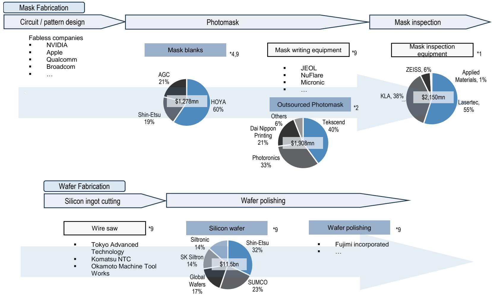

stacked bar chart

| Category | Company | Value (mn) | Percentage (%) |
| --- | --- | --- | --- |
| Photomask | HOYA | 1,278 | 60% |
| Photomask | Photronics | 1,908 | 33% |
| Photomask | Photronics | 1,908 | 21% |
| Photomask | Photronics | 1,908 | 6% |
| Mask Fabrication | Nanoparko | - | - |
| Mask Fabrication | Nanoparko | - | - |
| Mask Fabrication | Nanoparko | - | - |
| Mask Fabrication | Nanoparko | - | - |
| Mask Fabrication | Nanoparko | - | - |
| Mask Fabrication | Nanoparko | - | - |
| Mask Fabrication | Nanoparko | - | - |
| Mask Inspection | Lasertec | 2,150 | 55% |
| Mask Inspection | KLA | 2,150 | 38% |
| Mask Inspection | ZEISS | 2,150 | 6% |
| Mask Inspection | Applied Materials | - | 1% |
| Mask Inspection | Nanoparko | - | - |
| Mask Inspection | Nanoparko | - | - |
| Mask Inspection | Nanoparko | - | - |
| Mask Inspection | Nanoparko | - | - |
| Mask Inspection | Nanoparko | - | - |
| Mask Inspection | Nanoparko | - | - |
| Mask Inspection | Nanoparko | - | - |
| Mask Inspection | Nanoparko (Others) | - | 6% |
| Mask Blanks | AGC | 19 | 21% |
| Mask Blanks | HOYA | 19 | 60% |
| Mask Blanks | Shin-Etsu | 19 | 19% |
| Mask Blanks | Thin-Etsu (Others) | 19 | 21% |
| Mask writing equipment | JEOL | 19 | 6% |
| Mask writing equipment | NuFlare | 19 | 6% |
| Mask writing equipment | Micronic | 19 | 6% |
| Mask writing equipment | ... | 19 | 6% |
| Mask writing equipment (Outsourced Photomask) | Photronics (Others) | 19 | 21% |
| Mask writing equipment (Outsourced Photomask) | Photronics (Others) (Others) | 19 | 21% |
| Mask writing equipment (Outsourced Photomask) (Others) | Photronics (Others) (Others) (Others) | 19 | 21% |
| Mask writing equipment (Wafer polishing) | Photronics (Others) (Others) | 19 | 21% |
| Wafer Fabrication (Silicon ingot cutting) | Silicon wafer (Siltronic) | $11.5bn | 14% |
| Wafer Fabrication (Silicon wafer) | Silicon wafer (SK Siltron) | $11.5bn | 14% |
| Wafer Fabrication (Silicon wafer) | Silicon wafer (Global Wafers) | $11.5bn | 17% |
| Wafer Fabrication (Silicon wafer) | Silicon wafer (Shin-Etsu) | $11.5bn | 32% |
| Wafer Fabrication (Silicon wafer) | Silicon wafer (Sumco) | $11.5bn | 23% |
| Wafer Fabrication (Silicon wafer) | Nanoparko (Others) | $11.5bn | 60% |
| Wafer Fabrication (Applied Materials) | Nanoparko (ZEISS) | $2,150 | 1% |
| Wafer Fabrication (Applied Materials) | Nanoparko (KLA) | $2,150 | 38% |
| Wafer Fabrication (Applied Materials) | Nanoparko (ZEISS) | $2,150 | 6% |
| Wafer Fabrication (Applied Materials) | Nanoparko (Applied Materials) | $2,150 | 1% |
| Wafer Fabrication (Applied Materials) | Nanoparko (Applied Materials) | $2,150 | 6% |
| Wafer Fabrication (Applied Materials) | Nanoparko (Applied Materials) | $2,150 | 1% |
| Wafer Fabrication (Applied Materials) | Nanoparko (Applied Materials) | $2,150 | 6% |
| Wafer Fabrication (Applied Materials) | Nanoparko & Nanoparko (Others) | $2,150 | 2% |
| Wafer Fabrication (Applied Materials) | Nanoparko & Nanoparko (Others) | $2,150 | 2% |
| Wafer Fabrication (Applied Materials) | Nanoparko & Nanoparko (Others) | $2,150 | 2% |

Source: \*1: Gartner®(2025), \*2: Electronic Device Industry Newspaper (2025), \*3: Fuji Keizai (2024), \*4: The Nikkei (2024), \*5: Chemical Industry Daily (2024), \*6: Nikkan Kogyo Shimbun (2024), \*7: Nikkei Sangyo Shimbun (2024), \*8: Company reports, \*9: JPM. Note: Market share estimates are JPM estimates as of CY2024.

Figure 64: Front-end process SPE and material makers  
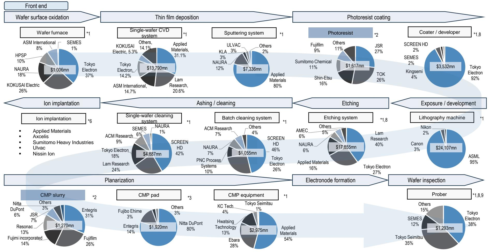

pie chart

| Category | Sub-category | Value (mn) | Percentage (%) |
| --- | --- | --- | --- |
| Front end | Wafer surface oxidation | $1,006 | 37 |
| Front end | Wafer furnace | 1 | *1 |
| Front end | ASM International | 8 |  |
| Front end | SEMES | 1 |  |
| Front end | Tokyo Electron | 37 |  |
| Front end | HPSP | 10 |  |
| Front end | NAURA | 18 |  |
| Front end | KOKUSAI Electric | 26 |  |
| Front end | Others | 14.1 |  |
| Thin film deposition | Single-wafer CVD system | $13,790 | 31.1 |
| Thin film deposition | KOKUSAI Electric | 5.3 |  |
| Thin film deposition | Tokyo Electron | 14.2 |  |
| Thin film deposition | ASM International | 14.7 |  |
| Thin film deposition | Lam Research | 20.6 |  |
| Thin film deposition | Applied Materials | 31.1 |  |
| Thin film deposition | Others | 14.1 |  |
| Photoresist coating | Photoreasist coating | $7,336 | 80 |
| Photoresist coating | Photoreasist coating | 1617 | 11 |
| Photoresist coating | Photoreasist coating | 80 | 2 |
| Photoresist coating | Photoreasist coating | 26 | 27 |
| Photoresist coating | Photoreasist coating | 9 | 11 |
| Photoresist coating | Photoreasist coating | 26 | 11 |
| Photoresist coating | Photoreasist coating | 26 | 2 |
| Photoresist coating | Photoreasist coating | 26 | 2 |
| Photoresist coating | Photoreasist coating | 26 | 2 |
| Photoresist coating | Photoreasist coating | 26 | 2 |
| Coater / developer | Coater / developer | $3,532 | 92 |
| Coater / developer | Tokyo Electron (1,8) | - | - |
| Ion implantation: - | Single-wafer cleaning system (NaURA) | $4,887 | 42 |
| Ion implantation: - | Single-wafer cleaning system (ACM Research) | $4,887 | 42 |
| Ion implantation: - | Single-wafer cleaning system (NAURA) (SEMES) | $4,887 | 42 |
| Ion implantation: - | Single-wafer cleaning system (Lam Research) | $4,887 | 42 |
| Ion implantation: - | Batch cleaning system (NAURA) (PNC Process Systems) | $1,055 | 26 |

Source: \*1: Gartner®(2025), \*2: Electronic Device Industry Newspaper (2025), \*3: Fuji Keizai (2024), \*4: The Nikkei (2024), \*5: Chemical Industry Daily (2024), \*6: Nikkan Kogyo Shimbun (2024), \*7: Nikkei Sangyo Shimbun (2024), \*8: Company reports, \*9: JPM. Note: Market share for CMP slurry and CPM pad on CY2023 estimates, while others are based on JPM CY2024 actual estimates.

Figure 65: Back-end process SPE, material makers and inspection equipment makers  
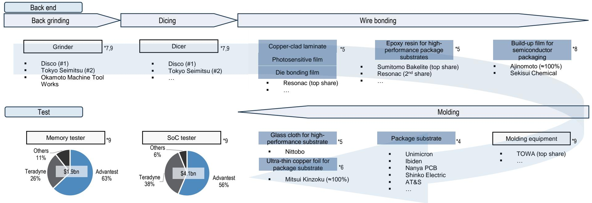

flowchart

| Stage | Category | Value | Percentage |
|-------|----------|-------|----------|
| Back end | Dicing | - | - |
| Back grinding | Dicing | - | - |
| Wire bonding | - | - | - |
| Grinder | - | 7.9 | *7.9 |
| Grinder | - | Disco (#1) | - |
| Grinder | - | Tokyo Seimitsu (#2) | - |
| Grinder | - | Okamoto Machine Tool Works | - |
| Dicer | - | 7.9 | *7.9 |
| Dicer | - | Disco (#1) | - |
| Dicer | - | Tokyo Seimitsu (#2) | - |
| Dicer | - | ... | - |
| Copper-clad laminate | - | 5 | *5 |
| Photosensitive film | - | - | - |
| Die bonding film | - | - | - |
| Resonac (top share) | - | ... | - |
| Epoxy resin for high-performance package substrates | - | 5 | *5 |
| Build-up film for semiconductor packaging | - | - | *8 |
| Sumitomo Bakelite (top share) | - | - | - |
| Resonac (2ndshare) | - | - | - |
| Ajinomoto (~100%) | - | - | - |
| Sekisui Chemical | - | - | - |
| Memory tester | - | 9 | *9 |
| Memory tester (Advantest) | - | 63% | 63% |
| SoC tester | - | 9 | *9 |
| SoC tester (Advantest) | - | 56% | 56% |
| Glass cloth for high-performance substrate | - | 5 | *5 |
| Glass cloth for high-performance substrate (Nittobo) | - | - | - |
| Glass cloth for high-performance substrate (Ultra-thin copper foil for package substrate) | - | 6 | *6 |
| Package substrate | - | 4 | *4 |
| Package substrate (Unimicron) | - | - | - |
| Package substrate (Ibiden) | - | - | - |
| Package substrate (Nanya PCB) | - | - | - |
| Package substrate (Shinko Electric) | - | - | - |
| Package substrate (AT&S) | - | - | - |
| Package substrate (... ) | - | - | - |
| Molding equipment (TOWA top share) | - | 9 | *9 |
| Molding equipment (... ) | - | - | - |
The chart includes a pie chart below showing the percentage distribution of two test types: Memory tester and SoC tester. The chart displays the breakdown of the total value into three segments: Memory tester, SoC tester, and Molding equipment.

Source: \*1: Gartner®(2025), \*2: Electronic Device Industry Newspaper (2025), \*3: Fuji Keizai (2024), \*4: The Nikkei (2024), \*5: Chemical Industry Daily (2024), \*6: Nikkan Kogyo Shimbun (2024), \*7: Nikkei Sangyo Shimbun (2024), \*8: Company reports, \*9: JPM. Note: Market share estimates are JPM estimates as of CY2024.

Companies Discussed in This Report (all prices in this report as of market close on 17 June 2026, unless otherwise indicated) AMEC - A(688012.SS/Rmb351.00/OW), ASML(ASML.AS/€1,591.20[16 June 2026]/OW), ASMPT Ltd (0522)(0522.HK/HK \$194.40[16 June 2026]/OW), Advantest (6857)(6857.T/¥30,060/OW), Grand Process Technology(3131.TW/NT\$3,245.00/OW), Hon. Precision(7769.TW/NT\$7,330.00/OW), KLA Corporation(KLAC/\$237.33[16 June 2026]/OW), NAURA - A(002371.SZ/Rmb704.22/OW), Tokyo Electron (8035)(8035.T/¥72,640/OW)

Analyst Certification: The Research Analyst(s) denoted by an “AC” on the cover of this report certifies (or, where multiple Research Analysts are primarily responsible for this report, the Research Analyst denoted by an “AC” on the cover or within the document individually certifies, with respect to each security or issuer that the Research Analyst covers in this research) that: (1) all of the views expressed in this report accurately reflect the Research Analyst’s personal views about any and all of the subject securities or issuers; and (2) no part of any of the Research Analyst's compensation was, is, or will be directly or indirectly related to the specific recommendations or views expressed by the Research Analyst(s) in this report. For all Korea-based Research Analysts listed on the front cover, if applicable, they also certify, as per KOFIA requirements, that the Research Analyst’s analysis was made in good faith and that the views reflect the Research Analyst’s own opinion, without undue influence or intervention.

All authors named within this report are Research Analysts who produce independent research unless otherwise specified. In Europe, Sector Specialists (Sales and Trading) may be shown on this report as contacts but are not authors of the report or part of the Research Department.

## Important Disclosures

- Market Maker/ Liquidity Provider: JPM is a market maker and/or liquidity provider in the financial instruments of/related to Advantest (6857), Tokyo Electron (8035) or related entities.  
- Beneficial Ownership (1% or more): JPM beneficially owns 1% or more of a class of common equity securities of Tokyo Electron (8035) or related entities.  
- Client: JPM currently has, or had within the past 12 months, the following entity(ies) as clients: Advantest (6857), Tokyo Electron (8035) or related entities.  
- Client/Non-Investment Banking, Securities-Related: JPM currently has, or had within the past 12 months, the following entity(ies) as clients, and the services provided were non-investment-banking, securities-related: Advantest (6857), Tokyo Electron (8035) or related entities.  
- Client/Non-Securities-Related: JPM currently has, or had within the past 12 months, the following entity(ies) as clients, and the services provided were non-securities-related: Advantest (6857), Tokyo Electron (8035) or related entities.  
- Potential Investment Banking Compensation: JPM expects to receive, or intends to seek, compensation for investment banking services in the next three months from Advantest (6857), Tokyo Electron (8035) or related entities.  
• Non-Investment Banking Compensation Received: JPM has received compensation in the past 12 months for products or services other than investment banking from Advantest (6857), Tokyo Electron (8035) or related entities.  
- Debt Position: JPM may hold a position in the debt securities of Advantest (6857), Tokyo Electron (8035) or related entities, if any.  
- Gartner: All statements in this report attributable to Gartner represent JPM's interpretation of data, research opinion or viewpoints published as part of a syndicated subscription service by Gartner, Inc., and have not been reviewed by Gartner. Each Gartner publication speaks as of its original publication date (and not as of the date of this presentation or report). The opinions expressed in Gartner publications are not representations of fact and are subject to change without notice.

Company-Specific Disclosures: JPM does and seeks to do business with companies covered in its research reports. As a result, investors should be aware that the firm may have a conflict of interest that could affect the objectivity of this report. Investors should consider this report as only a single factor in making their investment decision. Important disclosures, including price charts and credit opinion history tables (if applicable), are available for compendium reports and all JPM-covered companies, and certain non-covered companies, by visiting https://www.jpmm.com/research/disclosures, calling 1-800-477-0406, or e-mailing research.disclosure.inquiries@JPM.com with your request.

## Explanation of Equity Research Ratings, Designations and Analyst(s) Coverage Universe:

JPM uses the following rating system: Overweight (over the duration of the price target indicated in this report, we expect this stock will outperform the average total return of the stocks in the Research Analyst's, or the Research Analyst's team's, coverage universe); Neutral (over the duration of the price target indicated in this report, we expect this stock will perform in line with the average total return of the stocks in the Research Analyst's, or the Research Analyst's team's, coverage universe); and Underweight (over the duration of the price target indicated in this report, we expect this stock will underperform the average total return of the stocks in the Research Analyst's, or the Research Analyst's team's, coverage universe. NR is Not Rated. In this case, JPM has removed the rating and, if applicable, the price target, for this stock because of either a lack of a sufficient fundamental basis or for legal, regulatory or policy reasons. The previous rating and, if applicable, the price target, no longer should be relied upon. An NR designation is not a recommendation or a rating. Some stocks under coverage have a rating but no price target; in these cases, we expect the stock will outperform/perform in line/underperform the average total return of the stocks in the

Research Analyst's, or the Research Analyst's team's, coverage universe of the relevant duration of the region. In our Asia (ex-Australia and ex-India) and U.K. small- and mid-cap Equity Research, each stock's expected total return is compared to the expected total return of a benchmark country market index, not to those Research Analysts' coverage universe. If it does not appear in the Important Disclosures section of this report, the certifying Research Analyst's coverage universe can be found on JPM's Research website, https://www.JPMmarkets.com.

Coverage Universe: Shikanai, Mio : AGC (5201) (5201.T), Advantest (6857) (6857.T), Disco (6146) (6146.T), HOYA (7741) (7741.T), JX Advanced Metals (5016) (5016.T), KIOXIA Holdings (285A) (285A.T), Kaneka (4118) (4118.T), Lasertec (6920) (6920.T), Nikon (7731) (7731.T), Nippon Electric Glass (5214) (5214.T), Nippon Sheet Glass (5202) (5202.T), Nittobo (3110) (3110.T), Rigaku Holdings (268A) (268A.T), SCREEN Holdings (7735) (7735.T), Sumitomo Osaka Cement (5232) (5232.T), Taiheiyo Cement (5233) (5233.T), Tokyo Electron (8035) (8035.T), ULVAC (6728) (6728.T)

JPM Equity Research Ratings Distribution, as of April 04, 2026

<table><tr><td></td><td>Overweight (buy)</td><td>Neutral (hold)</td><td>Underweight (sell)</td></tr><tr><td>JPM Global Equity Research Coverage*</td><td>51%</td><td>37%</td><td>12%</td></tr><tr><td>IB clients**</td><td>83%</td><td>79%</td><td>74%</td></tr><tr><td>JPMS Equity Research Coverage*</td><td>49%</td><td>39%</td><td>13%</td></tr><tr><td>IB clients**</td><td>94%</td><td>93%</td><td>85%</td></tr></table>

\*Please note that the percentages may not add to 100% because of rounding.

\*\*Percentage of subject companies within each of the "buy," "hold" and "sell" categories for which JPM has provided investment banking services within the previous 12 months.

For purposes of FINRA ratings distribution rules only, our Overweight rating falls into a buy rating category; our Neutral rating falls into a hold rating category; and our Underweight rating falls into a sell rating category. Please note that stocks with an NR designation are not included in the table above. This information is current as of the end of the most recent calendar quarter.

Equity Valuation and Risks: For valuation methodology and risks associated with covered companies or price targets for covered companies, please see the most recent company-specific research report at http://www.JPMmarkets.com, contact the primary analyst or your JPM representative, or email research.disclosure.inquiries@JPM.com. For material information about the proprietary models used, please see the Summary of Financials in company-specific research reports and the Company Tearsheets, which are available to download on the company pages of our client website, http://www.JPMmarkets.com. This report also sets out within it the material underlying assumptions used.

## History of Investment Recommendations:

A history of JPM investment recommendations disseminated during the preceding 12 months can be accessed on the Research & Commentary page of http://www.JPMmarkets.com where you can also search by analyst name, sector or financial instrument.

Analysts' Compensation: The research analysts responsible for the preparation of this report receive compensation based upon various factors, including the quality and accuracy of research, client feedback, competitive factors, and overall firm revenues.

Registration of non-US Analysts: Unless otherwise noted, the non-US analysts listed on the front of this report are employees of non-US affiliates of JPM Securities LLC, may not be registered as research analysts under FINRA rules, may not be associated persons of JPM Securities LLC, and may not be subject to FINRA Rule 2241 or 2242 restrictions on communications with covered companies, public appearances, and trading securities held by a research analyst account.

## Other Disclosures

JPM is a marketing name for investment banking businesses of JPM Chase & Co. and its subsidiaries and affiliates worldwide.

UK MIFID FICC research unbundling exemption: UK clients should refer to UK MIFID Research Unbundling exemption for details of JPM's implementation of the FICC research exemption and guidance on relevant FICC research categorisation.

All research material made available to clients are simultaneously available on our client website, JPM Markets, unless specifically permitted by relevant laws. Not all research content is redistributed, e-mailed or made available to third-party aggregators. For all research material available on a particular stock, please contact your sales representative.

Any long form nomenclature for references to China; Hong Kong; Taiwan; and Macau within this research material are Mainland China; Hong Kong SAR (China); Taiwan (China); and Macau SAR (China).

JPM may, from time to time, write on issuers or securities targeted by economic or financial sanctions imposed or administered by the governmental authorities of the U.S., EU, UK or other relevant jurisdictions (Sanctioned Securities). Nothing in this report is intended to be read or construed as encouraging, facilitating, promoting or otherwise approving investment or dealing in such Sanctioned Securities. Clients should be aware of their own legal and compliance obligations when making investment decisions.

Any digital or crypto assets discussed in this research report are subject to a rapidly changing regulatory landscape. For relevant regulatory advisories on crypto assets, including bitcoin and ether, please see https://www.JPM.com/disclosures/cryptoasset-disclosure.

The author(s) of this research report may not be licensed to carry on regulated activities in your jurisdiction and, if not licensed, do not hold themselves out as being able to do so.

Exchange-Traded Funds (ETFs): JPM Securities LLC (“JPMS”) acts as authorized participant for substantially all U.S.-listed ETFs. To the extent that any ETFs are mentioned in this report, JPMS may earn commissions and transaction-based compensation in connection with the distribution of those ETF shares and may earn fees for performing other trade-related services, such as securities lending to short sellers of the ETF shares. JPMS may also perform services for the ETFs themselves, including acting as a broker or dealer to the ETFs. In addition, affiliates of JPMS may perform services for the ETFs, including trust, custodial, administration, lending, index calculation and/or maintenance and other services.

Options and Futures related research: If the information contained herein regards options- or futures-related research, such information is available only to persons who have received the proper options or futures risk disclosure documents. Please contact your JPM Representative or visit https://www.theocc.com/components/docs/riskstoc.pdf for a copy of the Option Clearing Corporation's Characteristics and Risks of Standardized Options or https://www.finra.org/sites/default/files/2020-08/Security\_Futures\_Risk\_Disclosure\_Statement\_2020.pdf for a copy of the Security Futures Risk Disclosure Statement.

Changes to Interbank Offered Rates (IBORs) and other benchmark rates: Certain interest rate benchmarks are, or may in the future become, subject to ongoing international, national and other regulatory guidance, reform and proposals for reform. For more information, please consult: https://www.JPM.com/global/disclosures/interbank\_offered\_rates

Notification for Credit Ratings: If this material includes credit ratings, such credit ratings provided by Japan Credit Rating Agency, Ltd. (JCR) and Rating and Investment Information, Inc. (R&I), are credit ratings provided by Registered Credit Rating Agencies (credit rating agencies registered under the Financial Instruments and Exchange Law of Japan (FIEL)). With respect to credit ratings that are provided by credit rating agencies other than JCR and R&I and have no stipulation that such credit ratings are provided by Registered Credit Rating Agencies, this means that such credit ratings are Non Registered Ratings (credit ratings provided by credit rating agencies not registered under the FIEL). Among the Non Registered Ratings, with respect to those credit ratings provided by S&P Global Ratings (S&P), Moody's Investors Service (Moody's), or Fitch Ratings (Fitch), prior to making investment decision based on such Non Registered Ratings, please carefully read the “Explanation Letter regarding Non Registered Ratings” for the corresponding credit rating agency, which we separately have sent or will send.

Private Bank Clients: Where you are receiving research as a client of the private banking businesses offered by JPM Chase & Co. and its subsidiaries (“JPM Private Bank”), research is provided to you by JPM Private Bank and not by any other division of JPM, including, but not limited to, the JPM Corporate and Investment Bank and its Global Research division.

Legal entity responsible for the production and distribution of research: The legal entity identified below the name of the Reg AC Research Analyst who authored this material is the legal entity responsible for the production of this research. Where multiple Reg AC Research Analysts authored this material with different legal entities identified below their names, these legal entities are jointly responsible for the production of this research. Where more than one legal entity is listed under an analyst's name, the first legal entity is responsible for the production unless stated otherwise. Research Analysts from various JPM affiliates may have contributed to the production of this material but may not be licensed to carry out regulated activities in your jurisdiction (and do not hold themselves out as being able to do so). Unless otherwise stated below in the legal entity disclosures, this material has been distributed by the legal entity responsible for production, or where more than one legal entity is listed under the analyst's name, the first legal entity will be responsible for distribution. If you have any queries, please contact the relevant Research Analyst in your jurisdiction or the entity in your jurisdiction that has distributed this research material.

## Legal Entities Disclosures and Country-/Region-Specific Disclosures:

Argentina: JPM Chase Bank N.A Sucursal Buenos Aires is regulated by Banco Central de la República Argentina (“BCRA”- Central Bank of Argentina) and Comisión Nacional de Valores (“CNV”- Argentinian Securities Commission - ALYC y AN Integral N°51).

Australia: JPM Securities Australia Limited (“JPMSAL”) (ABN 61 003 245 234/AFS Licence No: 238066) is regulated by the Australian Securities and Investments Commission and is a Market Participant of ASX Limited, a Clearing and Settlement Participant of ASX Clear Pty Limited and a Clearing Participant of ASX Clear (Futures) Pty Limited. This material is issued and distributed in Australia by or on behalf of JPMSAL only to "wholesale clients" (as defined in section 761G of the Corporations Act 2001). A list of all financial products covered can be found by visiting https://www.jpmm.com/research/disclosures. JPM seeks to cover companies of relevance to the domestic and international investor base across all Global Industry Classification Standard (GICS) sectors, as well as across a range of market capitalisation sizes. If applicable, in the course of conducting public side due diligence on the subject company(ies), the Research Analyst team may at times perform such diligence through corporate engagements such as site visits, discussions with company representatives, management presentations, etc. Research issued by JPMSAL has been prepared in accordance with JPM Australia’s Research Independence Policy which can be found at the following link: JPM Australia - Research Independence Policy.

Brazil: Banco JPM S.A. is regulated by the Comissao de Valores Mobiliarios (CVM) and by the Central Bank of Brazil. Ombudsman JPM: 0800-7700847 / 0800-7700810 (For Hearing Impaired) / ouvidoria.jp.morgan@jpmchase.com.

Canada: JPM Securities Canada Inc. is a registered investment dealer, regulated by the Canadian Investment Regulatory Organization and the Ontario Securities Commission and is the participating member on Canadian exchanges. This material is distributed in Canada by or on behalf of JPM Securities Canada Inc.

Chile: Inversiones JPM Limitada is an unregulated entity incorporated in Chile.

China: JPM Securities (China) Company Limited has been approved by CSRC to conduct the securities investment consultancy business.

Colombia: Banco JPM Colombia S.A. is supervised by the Superintendencia Financiera de Colombia (SFC). Any reference in this material to products or services offered abroad by entities other than the Bank in Colombia is included exclusively for descriptive purposes. Such references do not constitute, and should not be construed as, promotional activity or the provision of financial products or services within Colombian territory, as defined under applicable Colombian regulation.

Dubai International Financial Centre (DIFC): JPM Chase Bank, N.A., Dubai Branch is regulated by the Dubai Financial Services Authority (DFSA) and its registered address is Dubai International Financial Centre - The Gate, West Wing, Level 3 and 9 PO Box 506551, Dubai, UAE. This material has been distributed by JPM Chase Bank, N.A., Dubai Branch to persons regarded as professional clients or market counterparties as defined under the DFSA rules.

European Economic Area (EEA): Unless specified to the contrary, research is distributed in the EEA by JPM SE (“JPM SE”), which is authorised as a credit institution by the Federal Financial Supervisory Authority (Bundesanstalt für Finanzdienstleistungsaufsicht, BaFin) and jointly supervised by the BaFin, the German Central Bank (Deutsche Bundesbank) and the European Central Bank (ECB). JPM SE is a company headquartered in Frankfurt with registered address at TaunusTurm, Taunustor 1, Frankfurt am Main, 60310, Germany. The material has been distributed in the EEA to persons regarded as professional investors (or equivalent) pursuant to Art. 4 para. 1 no. 10 and Annex II of MiFID II and its respective implementation in their home jurisdictions (“EEA professional investors”). This material must not be acted on or relied on by persons who are not EEA professional investors. Any investment or investment activity to which this material relates is only available to EEA relevant persons and will be engaged in only with EEA relevant persons.

Hong Kong: JPM Securities (Asia Pacific) Limited (CE number AAJ321) is regulated by the Hong Kong Monetary Authority and the Securities and Futures Commission in Hong Kong, and JPM Broking (Hong Kong) Limited (CE number AAB027) is regulated by the Securities and Futures Commission in Hong Kong. JPM Chase Bank, N.A., Hong Kong Branch (CE Number AAL996) is regulated by the Hong Kong Monetary Authority and the Securities and Futures Commission, is organized under the laws of the United States with limited liability. Where the distribution of this material is a regulated activity in Hong Kong, the material is distributed in Hong Kong by or through JPM Securities (Asia Pacific) Limited and/or JPM Broking (Hong Kong) Limited.

India: JPM India Private Limited (Corporate Identity Number - U67120MH1992FTC068724), having its registered office at JPM Tower, Off. C.S.T. Road, Kalina, Santacruz - East, Mumbai – 400098, is registered with the Securities and Exchange Board of India (SEBI) as a 'Research Analyst' having registration number INH000001873. JPM India Private Limited is also registered with SEBI as a member of the National Stock Exchange of India Limited and the Bombay Stock Exchange Limited (SEBI Registration Number – INZ000239730) and as a Merchant Banker (SEBI Registration Number - MB/INM000002970). Telephone: 91-22-6157 3000, Facsimile: 91-22-6157 3990 and Website: http://www.jpmipl.com. JPM Chase Bank, N.A. - Mumbai Branch is licensed by the Reserve Bank of India (RBI) (Licence No. 53/Licence No. BY.4/94; SEBI - IN/CUS/014/ CDSL : IN-DP-CDSL-444-2008/ IN-DP-NSDL-285-2008/ INBI00000984/ INE231311239) as a Scheduled Commercial Bank in India, which is its primary license allowing it to carry on Banking business in India and other activities, which a Bank branch in India are permitted to undertake. For non-local research material, this material is not distributed in India by JPM India Private Limited. Compliance Officer: Ashutosh Sharma; ashutosh.j.sharma@jpmchase.com; +912261575002. Grievance Officer: Ramprasadh K, jpmipl.research.feedback@JPM.com; +912261573000. Registration granted by SEBI and certification from NISM in no way guarantee performance of the intermediary or provide any assurance of returns to investors. Please visit Terms and Conditions and Most Important Terms and Conditions (MITC). The annual Compliance audit report is available at http://www.jpmipl.com/#research.

Indonesia: PT JPM Sekuritas Indonesia is a member of the Indonesia Stock Exchange and is registered and supervised by the Otoritas Jasa Keuangan (OJK).

Korea: JPM Securities (Far East) Limited, Seoul Branch, is a member of the Korea Exchange (KRX). JPM Chase Bank, N.A., Seoul Branch, is licensed as a branch office of foreign bank (JPM Chase Bank, N.A.) in Korea. Both entities are regulated by the Financial Services Commission (FSC) and the Financial Supervisory Service (FSS). For non-macro research material, the material is distributed in Korea by or through JPM Securities (Far East) Limited, Seoul Branch.

Japan: JPM Securities Japan Co., Ltd. and JPM Chase Bank, N.A., Tokyo Branch are regulated by the Financial Services Agency in Japan.

Malaysia: This material is issued and distributed in Malaysia by JPM Securities (Malaysia) Sdn Bhd (18146-X), which is a Participating Organization of Bursa Malaysia Berhad and holds a Capital Markets Services License issued by the Securities Commission in Malaysia.

Mexico: JPM Casa de Bolsa, S.A. de C.V., JPM Grupo Financiero is member of the Mexican Stock Exchange (“Bolsa Mexicana de Valores”) and the Institutional Stock Exchange (“Bolsa Institucional de Valores”), and it is authorized to act as a broker dealer by the National Banking and Securities Exchange Commission (“Comisión Nacional Bancaria y de Valores”).

New Zealand: This material is issued and distributed by JPMSAL in New Zealand only to "wholesale clients" (as defined in the Financial

Markets Conduct Act 2013). JPMSAL is registered as a Financial Service Provider under the Financial Service providers (Registration and Dispute Resolution) Act of 2008.

Philippines: JPM Securities Philippines Inc. is a Trading Participant of the Philippine Stock Exchange and a member of the Securities Clearing Corporation of the Philippines and the Securities Investor Protection Fund. It is regulated by the Securities and Exchange Commission.

Singapore: This material is issued and distributed in Singapore by or through JPM Securities Singapore Private Limited (JPMSS) [MDDI (P) 057/08/2025 and Co. Reg. No.: 199405335R], which is a member of the Singapore Exchange Securities Trading Limited, and/or JPM Chase Bank, N.A., Singapore branch (JPMCB Singapore), both of which are regulated by the Monetary Authority of Singapore. This material is issued and distributed in Singapore only to accredited investors, expert investors and institutional investors, as defined in Section 4A of the Securities and Futures Act, Cap. 289 (SFA). This material is not intended to be issued or distributed to any retail investors or any other investors that do not fall into the classes of “accredited investors,” “expert investors” or “institutional investors,” as defined under Section 4A of the SFA. Recipients of this material in Singapore are to contact JPMSS or JPMCB Singapore in respect of any matters arising from, or in connection with, the material.

South Africa: JPM Equities South Africa Proprietary Limited and JPM Chase Bank, N.A., Johannesburg Branch are members of the Johannesburg Securities Exchange and are regulated by the Financial Services Conduct Authority (FSCA).

Taiwan: JPM Securities (Taiwan) Limited is a participant of the Taiwan Stock Exchange (company-type) and regulated by the Taiwan Securities and Futures Bureau. Material relating to equity securities is issued and distributed in Taiwan by JPM Securities (Taiwan) Limited, subject to the license scope and the applicable laws and the regulations in Taiwan. To the extent that JPM Securities (Taiwan) Limited produces research materials on securities not listed on the Taiwan Stock Exchange or Taipei Exchange (“Non-Taiwan Listed Securities”), these materials shall not constitute securities recommendations for the purpose of applicable Taiwan regulations, and, for the avoidance of doubt, JPM Securities (Taiwan) Limited does not act as broker for Non-Taiwan Listed Securities. According to Paragraph 2, Article 7-1 of Operational Regulations Governing Securities Firms Recommending Trades in Securities to Customers (as amended or supplemented) and/or other applicable laws or regulations, please note that the recipient of this material is not permitted to engage in any activities in connection with the material that may give rise to conflicts of interests, unless otherwise disclosed in the “Important Disclosures” in this material.

Thailand: This material is issued and distributed in Thailand by JPM Securities (Thailand) Ltd., which is a member of the Stock Exchange of Thailand and is regulated by the Ministry of Finance and the Securities and Exchange Commission. The registered address is 548 One City Center Building, 50th Floor, Ploenchit Road, Lymphini, Pathum Wan, Bangkok 10330.

UK: Research is produced in the UK by JPM Securities plc (“JPMS plc”) which is a member of the London Stock Exchange and is authorised by the Prudential Regulation Authority and regulated by the Financial Conduct Authority and the Prudential Regulation Authority or JPM Markets Limited (“JPMML Ltd”) which is authorised and regulated by the Financial Conduct Authority. Unless specified to the contrary, this material is distributed in the UK by JPMS plc and is directed in the UK only to: (a) persons having professional experience in matters relating to investments falling within article 19(5) of the Financial Services and Markets Act 2000 (Financial Promotion) (Order) 2005 (“the FPO”); (b) persons outlined in article 49 of the FPO (high net worth companies, unincorporated associations or partnerships, the trustees of high value trusts, etc.); or (c) any persons to whom this communication may otherwise lawfully be made; all such persons being referred to as "UK relevant persons". This material must not be acted on or relied on by persons who are not UK relevant persons. Any investment or investment activity to which this material relates is only available to UK relevant persons and will be engaged in only with UK relevant persons. A description of JPM EMEA’s policy for prevention and avoidance of conflicts of interest related to the production of Research can be found at the following link: JPM EMEA - Research Independence Policy.

U.S.: JPM Securities LLC (“JPMS”) is a member of the NYSE, FINRA, SIPC, and the NFA. JPM Chase Bank, N.A. is a member of the FDIC. Material published by non-U.S. affiliates is distributed in the U.S. by JPMS who accepts responsibility for its content.

General: Additional information is available upon request. The information in this material has been obtained from sources believed to be reliable. While all reasonable care has been taken to ensure that the facts stated in this material are accurate and that the forecasts, opinions and expectations contained herein are fair and reasonable, JPM Chase & Co. or its affiliates and/or subsidiaries (collectively JPM) make no representations or warranties whatsoever to the completeness or accuracy of the material provided, except with respect to any disclosures relative to JPM and the Research Analyst's involvement with the issuer that is the subject of the material. Accordingly, no reliance should be placed on the accuracy, fairness or completeness of the information contained in this material. There may be certain discrepancies with data and/or limited content in this material as a result of calculations, adjustments, translations to different languages, and/or local regulatory restrictions, as applicable. These discrepancies should not impact the overall investment analysis, views and/or recommendations of the subject company(ies) that may be discussed in the material. Artificial intelligence tools may have been used in the preparation of this material, including assisting in data analysis, pattern recognition, and content drafting for research material. JPM accepts no liability whatsoever for any loss arising from any use of this material or its contents, and neither JPM nor any of its respective directors, officers or employees, shall be in any way responsible for the contents hereof, apart from the liabilities and responsibilities that may be imposed on them by the relevant regulatory authority in the jurisdiction in question, or the regulatory regime thereunder. Opinions, forecasts or projections contained in this material represent JPM's current opinions or judgment as of the date of the material only and are therefore subject to change without notice. Periodic updates may be provided on companies/industries based on company-specific developments or announcements, market conditions or any other publicly available information. There can be no assurance that future results or events will be consistent with any such opinions, forecasts or projections, which represent only one possible outcome. Furthermore, such opinions, forecasts or projections are subject

to certain risks, uncertainties and assumptions that have not been verified, and future actual results or events could differ materially. The value of, or income from, any investments referred to in this material may fluctuate and/or be affected by changes in exchange rates. All pricing is indicative as of the close of market for the securities discussed, unless otherwise stated. Past performance is not indicative of future results. Accordingly, investors may receive back less than originally invested. This material is not intended as an offer or solicitation for the purchase or sale of any financial instrument. The opinions and recommendations herein do not take into account individual client circumstances, objectives, or needs and are not intended as recommendations of particular securities, financial instruments or strategies to particular clients. This material may include views on structured securities, options, futures and other derivatives. These are complex instruments, may involve a high degree of risk and may be appropriate investments only for sophisticated investors who are capable of understanding and assuming the risks involved. The recipients of this material must make their own independent decisions regarding any securities or financial instruments mentioned herein and should seek advice from such independent financial, legal, tax or other adviser as they deem necessary. JPM may trade as a principal on the basis of the Research Analysts' views and research, and it may also engage in transactions for its own account or for its clients' accounts in a manner inconsistent with the views taken in this material, and JPM is under no obligation to ensure that such other communication is brought to the attention of any recipient of this material. Others within JPM, including Strategists, Sales staff and other Research Analysts, may take views that are inconsistent with those taken in this material. Employees of JPM not involved in the preparation of this material may have investments in the securities (or derivatives of such securities) mentioned in this material and may trade them in ways different from those discussed in this material. This material is not an advertisement for or marketing of any issuer, its products or services, or its securities in any jurisdiction.

Confidentiality and Security Notice: This transmission may contain information that is privileged, confidential, legally privileged, and/or exempt from disclosure under applicable law. If you are not the intended recipient, you are hereby notified that any disclosure, copying, distribution, or use of the information contained herein (including any reliance thereon) is STRICTLY PROHIBITED. Although this transmission and any attachments are believed to be free of any virus or other defect that might affect any computer system into which it is received and opened, it is the responsibility of the recipient to ensure that it is virus free and no responsibility is accepted by JPM Chase & Co., its subsidiaries and affiliates, as applicable, for any loss or damage arising in any way from its use. If you received this transmission in error, please immediately contact the sender and destroy the material in its entirety, whether in electronic or hard copy format. This message is subject to electronic monitoring: https://www.JPM.com/disclosures/email

MSCI: Certain information herein (“Information”) is reproduced by permission of MSCI Inc., its affiliates and information providers (“MSCI”) ©2026. No reproduction or dissemination of the Information is permitted without an appropriate license. MSCI MAKES NO EXPRESS OR IMPLIED WARRANTIES (INCLUDING MERCHANTABILITY OR FITNESS) AS TO THE INFORMATION AND DISCLAIMS ALL LIABILITY TO THE EXTENT PERMITTED BY LAW. No Information constitutes investment advice, except for any applicable Information from MSCI ESG Research. Subject also to msci.com/disclaimer

Sustainalytics: Certain information, data, analyses and opinions contained herein are reproduced by permission of Sustainalytics and: (1) includes the proprietary information of Sustainalytics; (2) may not be copied or redistributed except as specifically authorized; (3) do not constitute investment advice nor an endorsement of any product or project; (4) are provided solely for informational purposes; and (5) are not warranted to be complete, accurate or timely. Sustainalytics is not responsible for any trading decisions, damages or other losses related to it or its use. The use of the data is subject to conditions available at https://www.sustainalytics.com/legal-disclaimers. ©2026 Sustainalytics. All Rights Reserved.

"Other Disclosures" last revised May 16, 2026.

Copyright 2026 JPM Chase & Co. All rights reserved. This material or any portion hereof may not be reprinted, sold or redistributed without the written consent of JPM. It is strictly prohibited to use or share without prior written consent from JPM any research material received from JPM or an authorized third-party (“JPM Data”) in any third-party artificial intelligence (“AI”) systems or models when such JPM Data is accessible by a third-party.

Completed 17 Jun 2026 05:08 PM JST

Disseminated 17 Jun 2026 05:10 PM JST