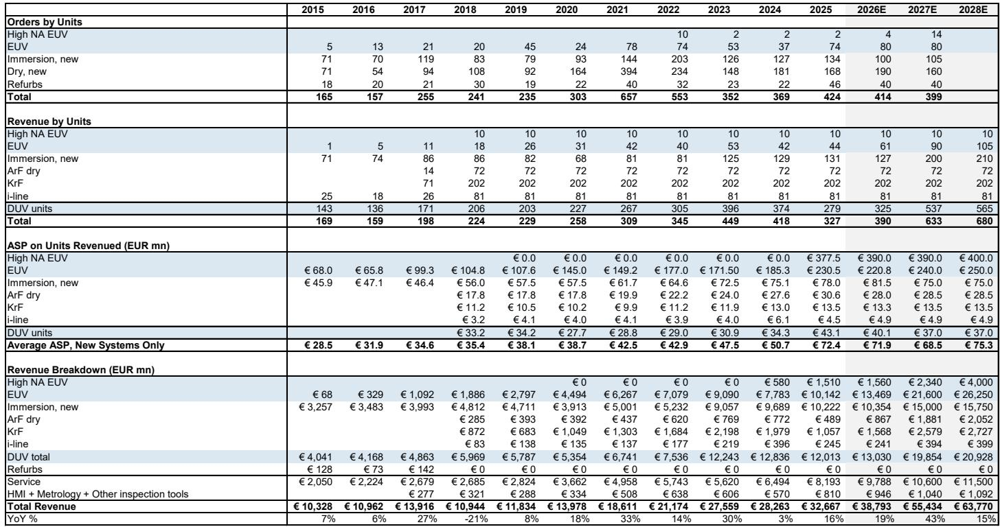
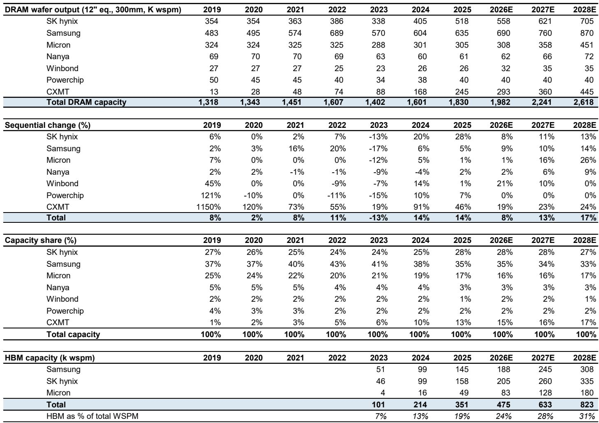

# JPM：半导体设备市场的下一个结构性拐点不在需求，而在供给侧的产能释放节奏

这份JPM刚刚发布的研报，核心判断只有一个：全球晶圆厂设备（WFE）市场正在经历一次被低估的上行重估。JPM将2026年WFE市场增速预测从21%大幅上调至28%，2027年从18%上调至29%，并首次给出2028年16%的增长指引。这不是一次温和的修正，而是一次系统性的预期上调。

但真正值得关注的，不是增速数字本身，而是驱动这一轮上调的结构性力量正在发生质变。AI需求从训练向推理的迁移，正在重塑整个半导体资本开支的分配逻辑——内存芯片的投资权重正在从过去的个位数至15%区间，跃升至2026年的约50%。这意味着，过去几年市场习惯的“AI=GPU+ASIC”叙事，正在被“AI=加速器+高带宽内存+先进封装”的全栈逻辑取代。

更关键的是，这份报告揭示了一个被多数投资者忽视的变量：洁净室产能的瓶颈正在缓解。此前市场对2026年设备交付的担忧，很大程度上源于芯片制造商洁净室建设进度滞后。但JPM的调研显示，通过工厂空间的创造性利用和洁净室扩建的正式启动，这一瓶颈正在被打破。从2027年开始，随着洁净室大规模投产，需求将迎来真正的释放窗口。

以下是我们从这份研报中提炼出的五个核心洞察，每一个都指向一个正在被重新定价的产业环节。

## 1. 云厂商资本开支的“超级周期”正在从预期走向现实，且规模远超历史任何时期

JPM对全球前四大美国云服务提供商（谷歌、亚马逊、微软、Meta）的资本开支预测，做了幅度惊人的上调：2026年增速从63%上调至80%，2027年从40%上调至50%。在绝对值上，这意味着2026年同比增量将超过2500亿美元，2027年超过2850亿美元——这是有史以来最大的年度增幅。

支撑这一判断的核心依据，是北美地区的规划电力容量。截至2026年第一季度末，规划电力容量已超过175GW，JPM预计到年底将突破205GW。与之对应，装机容量将从2025年的48GW，分别提升至2026年的65GW和2027年的85GW。

一个更值得警惕的财务信号是：到2027年，前四大云厂商的资本开支占经营现金流比例将从过去几年的25%-30%，飙升至94%。这意味着，这些公司几乎将全部经营现金流投入资本开支。这种极端配置在历史上从未持续过，但它也反过来说明，AI基础设施的投资回报预期已经强烈到足以让管理层做出如此激进的财务决策。

对于设备供应商而言，这意味着订单可见度正在进入一个前所未有的阶段。JPM在5月的TMT会议上调研发现，几乎所有半导体设备公司都表示，订单、积压和客户升级请求在财报发布后的几周内进一步加速。KLA明确指出，当前对2027年需求的可见度是过去十多年来最高的，并认为2027年的WFE市场将大于2026年。

## 2. 内存芯片正在成为AI资本开支的新主轴，其投资权重将发生数量级跃升

这是整份报告最反直觉、也最容易被忽视的判断。过去两年，市场讨论AI资本开支时，焦点几乎全部集中在逻辑芯片（GPU、ASIC）和先进封装上。但JPM的数据显示，内存芯片的投资权重正在从过去的个位数至15%区间，跃升至2026年的约50%。

这一变化的驱动力来自两个方向。第一，AI推理工作负载的兴起正在改变内存需求结构。推理阶段对内存带宽和容量的要求远高于训练阶段，这直接推动了对高带宽内存（HBM）和DRAM的强劲需求。第二，内存芯片价格正在经历历史级别的上涨——NAND和DRAM价格均出现三位数同比增长，这为芯片制造商提供了充足的现金流来进行产能扩张。

JPM预计，未来三年内存芯片行业的累计资本开支将达到4500亿美元，较此前预测的3000亿美元大幅上调。其中，DRAM资本开支为3640亿美元，NAND闪存为860亿美元。这一数字背后隐含的假设是：DRAM的晶圆月产能（WSPM）将从2025年底的约192万片，增加到2028年底的280万片；NAND则从127.5万片增加到144万片。

对于设备供应商而言，这意味着那些内存芯片业务敞口高的公司，将在未来几年获得持续的订单支撑。JPM明确指出，日本半导体设备企业中，东京电子（Tokyo Electron）因其在DRAM和代工业务中的高占比，以及自身具备定价能力，被列为首选股。爱德万测试（Advantest）则在后端测试领域持续受益于高需求。

## 3. 台积电的资本开支正在进入加速通道，先进制程短缺将延续至2028年

JPM将台积电2026年资本开支预测从此前的540亿美元上调至560亿美元（同比增长37%），2027年上调至650亿美元（同比增长16%），2028年首次给出720亿美元的预测（同比增长11%）。这一系列上调的核心逻辑是：先进制程（N5及以下）的供应短缺将持续到2027年甚至2028年初，台积电正在加速产能扩张以应对这一缺口。

具体来看，台积电N5及以下制程的产能预计将在2025-2028年间以25%的复合年增长率扩张，其中大部分增量集中在2027-2028年。N3制程方面，台积电计划从2027年上半年到2028年，启动三座新工厂的产能爬坡（台南Fab 18 P9、亚利桑那州二期、JASM第二工厂）。N2制程则拥有强劲的客户管线，包括iPhone处理器、AMD的Venice和MI450、谷歌的TPU以及英伟达的Feynman。

在定价方面，台积电已在2026年第一季度将先进制程芯片价格上调6-10%。JPM认为，关于2027年进一步涨价的讨论（预计N3及以下制程涨幅为5-10%）可能在2026年第二季度开始。这意味着，台积电的定价权正在从周期性的产能紧张，转变为结构性的技术领先溢价。

对于设备供应商而言，台积电的资本开支加速意味着两个机会：一是先进制程设备（尤其是光刻、刻蚀、沉积）的需求将持续旺盛；二是随着台积电将其CoWoS先进封装产能从2025年底的约8万片/月，扩张至2028年底的22万片/月（复合年增长率超过80%），封装设备市场将迎来新的增长极。

## 4. 先进封装正在经历一场被低估的产能军备竞赛，CoWoS和3D SoIC成为新战场

JPM对先进封装的预测，是整份报告中最具前瞻性的部分之一。台积电的CoWoS产能规划从2025年底的约8万片/月，扩张至2026年底的11.5万片、2027年底的17.5万片、2028年底的22万片。这一扩张速度远超此前市场预期。

更值得关注的是技术路线图的演进。JPM指出，CoPoS（面板级先进封装）的进展慢于预期，因此台积电将主要通过延长CoWoS生命周期和使用更大尺寸的光罩（2028年可达14倍）来吸收需求。同时，3D SoIC的采用将在2027年下半年开始加速，预计2027年底产能达到4万片/月，2028年底达到6.5万片/月。

在客户层面，英伟达的CoWoS需求因Blackwell GB300、Spectrum X和Vera CPU的强劲表现而上调，但对基于HBM4不确定性的Rubin架构保持相对保守。AMD的MI450和Venice则显著拉动了2027年的CoWoS需求。谷歌的TPU也处于上升趋势，其TPU v9架构的最终方向（EMIB或CoWoS-L+3D SoIC）将在年底确定。

一个尚未被市场充分定价的变量是：CPU、LPU（语言处理单元）和网络芯片（CPO/NPO）可能成为CoWoS需求的新驱动力。此外，WMCM（晶圆级多芯片模块）的产能预计将在2027年底扩张至7.5万片/月，2028年底至9万片/月——这意味着，除苹果之外的其他公司可能在2028年考虑类似方案。

对于设备供应商而言，先进封装的投资正在从“可选”变为“必选”。那些在先进封装设备领域有布局的公司，如ASMPT、东京电子和爱德万测试，将获得新的增长动能。

## 5. 报告尚未完全回答的关键问题：中国市场的波动、洁净室瓶颈的真实弹性、以及设备单位价格的可持续性

尽管JPM的报告提供了极为详尽的供需分析，但仍有几个关键问题尚未得到充分回答。

第一个问题是中国市场。目前中国占全球WFE市场的35-40%，但2025年同比略有下降，反映出前一年高基数后的回调。JPM在报告中并未对中国市场的未来走势给出明确判断，而是将其视为一个需要持续跟踪的变量。考虑到地缘政治的不确定性，中国市场的波动可能对全球WFE市场产生显著影响——尤其是在2027-2028年，当非中国市场的增长开始放缓时。

第二个问题是洁净室瓶颈的真实弹性。JPM认为，通过创造性利用工厂空间和加速洁净室扩建，供给瓶颈正在缓解。但这一判断建立在几个尚未验证的假设之上：洁净室建设进度能否如期推进？劳动力、材料和设备安装能力是否充足？如果这些假设出现偏差，设备交付延迟的风险仍然存在。

第三个问题是设备单位价格的可持续性。JPM预期，随着技术迁移驱动的棕地投资（而非绿地投资）成为主流，设备单位价格将持续上升。但这一趋势能否持续，取决于芯片制造商是否愿意持续为更高价值的设备支付溢价。如果内存芯片价格出现回调，或云厂商资本开支增速放缓，设备定价权可能面临压力。

这些问题，正是我们希望在社群中与读者继续深入探讨的方向。完整报告中包含了JPM对全球半导体设备市场更为细致的区域拆分、各主要设备公司的订单可见度分析，以及其对东京电子、爱德万测试、ASML等核心标的的最新评级和目标价。如果您对这些未解问题感兴趣，欢迎加入我们的星球微信群，与更多产业决策者和投资者一起讨论。

Personal reading notes and learning share only. Not investment advice.

