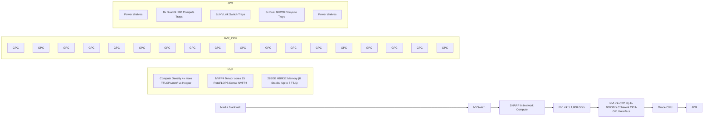

你是闲鱼资料类商品文案编辑，擅长把一份投研/行业/公司研报改写成适合闲鱼发布的商品说明。

【目标】
- 基于下面研报解析内容，生成一份可以复制到闲鱼商品详情里的中文文案。
- 风格参考用户提供的闲鱼对标笔记：标题直给、信息密度高、用途明确、适合人群明确、交付方式清楚。
- 语言要自然，像真实卖家发布，不要像公众号文章、小红书笔记或 AI 摘要。
- 不要使用太夸张的营销词，不要承诺收益，不要说“稳赚”“内幕”“必涨”。
- 可以适度口语化，但不要低俗。
- 硬性要求：全文不要使用任何 emoji 或符号表情。
- 硬性要求：全文必须低于 1500 字，宁可少写，也不要超长。

【必须输出结构】
1. `闲鱼标题：` 一行，控制在 30 字以内，适合商品标题。
2. `商品描述：` 正文，适合直接粘贴到闲鱼详情页。
3. `Hashtag：` 一行，给 6-10 个平台可用标签，用 `#` 开头，空格分隔。

【长度硬性要求】
- 输出总字数必须低于 1500 字，包括标题、商品描述、Hashtag。
- 商品描述控制在 900-1200 字以内，避免写成长文。
- 亮点 bullet 每条控制在 30 字以内。

【严禁输出】
- 不要输出 `建议价格：`。
- 不要输出 `搜索关键词：`。
- 不要输出“搜索词”“关键词”“搜索关键词”等栏目。
- 不要给具体价格区间、成交承诺或价格建议。
- 不要使用任何 emoji，例如 ✅、🔥、📌、👉、💰、⭐ 等。

【商品描述写法】
- 第一段：直接说明这是什么报告，页数/语言/主题/公司或行业。如果页数、日期、语言不确定，就不要编。
- 第二段：说明适合谁，比如投研、券商面试、PE/VC、行业研究、学习参考、写报告等。
- 第三段：用 3-5 个亮点 bullet，风格参考：
  - 三大情景框架：DCF、P/ARR、EV/Sales
  - 关键变量分析
  - 估值逻辑、假设、终值占比等核心内容覆盖
  - 适合准备 AI 相关面试、研究 AI 估值的同学
- 第四段：交付说明，参考：`资料为电子版 PDF，拍下后 24 小时内发网盘链接或邮箱。`
- 第五段：虚拟商品说明，参考：`电子类资料一经发货不退不换，有问题可以提前咨询。`
- 可以补一句：`需要其他报告也可以私聊，支持一站式咨询。`

【Hashtag 写法】
- 只输出平台相对安全、偏学习和资料属性的标签。
- 推荐从这些里选择：`#学习资料` `#研究笔记` `#学习笔记` `#行业研究` `#研报资料` `#资料整理` `#报告学习` `#案例研究`。
- 不要输出 `#财经` `#投资` `#股票` `#基金` `#理财` `#暴富` `#内幕` 等敏感标签。

【平台发布合规要求】
- 不要出现“投资建议”“买入”“卖出”“强烈推荐”“稳赚”“保本”“必涨”“抄底”“上车”“内幕”“翻倍”等金融操作或收益承诺表达。
- “投资”相关词尽量改成“投研”“研究”“观察”“学习参考”；如果必须保留，也要保持中性。
- 不要出现“独家”“原版”“内部”“无水印”“全网最低”“最全”“最强”“必看”等高风险或极限词。
- 不要写“关注”“点赞”“求关注”“评论区留言”等直接互动诱导。
- 不要承诺资料一定可用于获利、就业、通过面试或获得收益。

【合规与避坑】
- 默认避免出现具体投行品牌名，比如“GS”“GS”“MS”，统一写作“投行研报”或“投行研报”。
- 不要承诺研究或交易结果。
- 不要伪造页数、日期、作者、公司覆盖范围。研报未给出时就不写。
- 不要输出解释说明，只输出闲鱼文案本身。

【研报解析内容】
"""

text_image

JPM

# Semiconductors

# AI Drives Resurgence in Custom Chips (ASICs) - ASIC Market Overview/Update

Harlan Sur AC

415-315-6700

harlan.sur@JPM.com

JPM Securities LLC

Mayur Ramdhani

212-622-1664

mayur.ramdhani@JPM.com

JPM Securities LLC

See the end pages of this presentation for analyst certification and important disclosures.

## ASIC – Application Specific Integrated Circuit:

\- A chip that is designed for a specific CUSTOMER for a specific application or platform:

• Example: Apple iPhone A19 processor chip (Apple does complete design)  
• Example: Nokia Reef Shark BTS processor chip (Nokia, Marvell, Broadcom)  
• Example: Google TPU AI processor (Google, Broadcom)  
• Example: Amazon Trainium 3 AI processor (AWS, Marvell, Alchip)

## ASSP - Application Specific Standard Product (sometimes called “merchant”)

• A chip that is designed for multiple customers for a specific application:

• Example: Qualcomm snap-dragon mobile processor family  
• Example: NVIDIA AI GPU, AMD AI GPU

## GP - General Purpose products – multiple customers/multiple applications

• A chip that is designed for multiple customers for multiple applications

• Example: Intel/AMD PC or server CPU  
• Example: Infineon, STMicro, Onsemi – power semiconductors/Microcontrollers  
• Example: Samsung, Hynix, Micron – memory/storage

sankey diagram

| Category | Sub-category | Amount |
| -------- | ----------- | ------ |
| Total Semi Industry Revenues CY25 | $805B | $805B |
| Application Specific | $351B | $351B |
| General Purpose | $454B | $454B |
| Application Specific Standard Products (ASSPs) | $282B | $282B |
| Application Specific Integrated Circuits (ASICs) | $68B | $68B |
| Memory | - | - |
| Microprocessor | - | - |
| Analog | - | - |
| Power | - | - |
| AI GPUs (NVDA, AMD) | - | - |
| Qualcomm Snapdragon | - | - |
| In vehicle SDV Processor | - | - |
| Networking switch IC | - | - |
| Optical DSP IC | - | - |
| Google TPU AI Processor | - | - |
| Nokia Reef Shark 5G RAN | - | - |
| Amazon Trainium XPU | - | - |
| Apple A19 iPhone CPU | - | - |
| Apple iPhone wireless charging | - | - |
| Microsoft Maia AI processor | - | - |

## Value proposition of doing your own custom chip or ASIC:

- Customer OWNS the software stack  
- If you own the software stack, can custom tune the silicon to the specific software stack and driver better system level performance (compute performance/power)  
- The economics (high volume applications and /or high ASP infrastructure platforms lend themselves well to ASICs) – need to drive ROI/Justification of customer silicon chip design team:  
- Apple is the poster child for custom ASICs – they create/own the entire software stack/applications layer, they own the entire system design, they can differentiate on platform performance/low power and they ship 250M units per year (strong ROI on internal chip design R&D) – leverage investments into PC CPUs, watch CPUs, etc...  
- Game consoles (Sony/Microsoft) – same value prop as Apple – relative high volumes  
- Base station RAN processor ASICs – small volumes, but VERY HIGH ASPs, leverage across entire network/subscriber base drives ROI  
- Google TPU AI processor, Amazon Trainium AI processor, Meta MTIA processor, Microsoft Maia AI processor – low volumes, but VERY VERY HIGH ASPs – token generation/AI monetization will drive strong ROI

## Example: AI GPU Versus AI Custom ASIC Processor

AI ASICs/XPUs Offer Competitive Performance, Economics and Power Efficiency

<table><tr><td></td><td>NVIDIA B200 Blackwell</td><td>NVIDIA B300 Blackwell Ultra</td><td>Google/ Broadcom TPU7x Ironwood</td></tr><tr><td>Compute performance (FP8 TFLOPS)</td><td>4500</td><td>5000</td><td>4614</td></tr><tr><td>Memory capacity per chip (HBM3E)</td><td>192</td><td>288</td><td>192</td></tr><tr><td>HBM bandwidth per chip (TBps)</td><td>7.7</td><td>8.0</td><td>7.4</td></tr><tr><td>TDP (Watts)</td><td>1000</td><td>1200</td><td>1000</td></tr><tr><td>ASP</td><td>$35,000</td><td>$40,000</td><td>$13,000</td></tr><tr><td>TFLOPS per $</td><td>0.13</td><td>0.13</td><td>0.35</td></tr><tr><td>TFLOPS per Wattt</td><td>4.50</td><td>4.17</td><td>4.61</td></tr></table>

<table><tr><td>Compute Platform Partner</td><td>Scenario</td><td>DC Capex per GW</td><td>Compute Partner Revenue per GW</td><td>Compute Capex</td><td>Networking Capex</td></tr><tr><td rowspan="2">NVIDIA</td><td>Low case</td><td>$45</td><td>$20</td><td>$16</td><td>$4</td></tr><tr><td>High case</td><td>$55</td><td>$30</td><td>$24</td><td>$6</td></tr><tr><td rowspan="2">AMD</td><td>Low case</td><td>$35</td><td>$15</td><td>$14</td><td>$2</td></tr><tr><td>High case</td><td>$40</td><td>$20</td><td>$18</td><td>$2</td></tr><tr><td rowspan="2">Broadcom</td><td>Low case</td><td>$30</td><td>$10</td><td>$7</td><td>$3</td></tr><tr><td>High case</td><td>$40</td><td>$15</td><td>$11</td><td>$5</td></tr></table>

Source: Company reports, JPM

## Chip and Rack Architectures – TPU7x Ironwood ASIC vs. Nvidia Blackwell GPU

Chip Architecture  

```mermaid
graph TD
  A["Host"] --> B["TPU7x Ironwood"]
  C["gBMC"] --> D["PCIe Gen5 x16"]
  C --> E["PCIe Gen2 x1"]
  D --> F["Memory and DMA Interconnect"]
  E --> F
  F --> G["Chip Manager"]
  F --> H["HBM3 Ctrl"]
  F --> I["HBM3 Ctrl"]
  F --> J["HBM3 Ctrl"]
  F --> K["HBM3 Ctrl"]
  F --> L["Sparse Core"]
  F --> M["Sparse Core"]
  F --> N["HBM3 Stack"]
  F --> O["HBM3 Stack"]
  F --> P["HBM3 Stack"]
  F --> Q["HBM3 Stack"]
  F --> R["HBM3 Stack"]
  F --> S["HBM3 Stack"]
  F --> T["8-hi"]
    
  U["TensorCore"] --> V["VPU + Vmem"]
  V --> W["XLU"]
  V --> X["XLU"]
  V --> Y["MXU"]
  V --> Z["TCS"]
  Z --> AA["XLU"]
  Z --> AB["XLU"]
    
  AC["TensorCore"] --> AD["VPU + Vmem"]
  AD --> AE["XLU"]
  AD --> AF["MXU"]
  AD --> AG["TCS"]
  AG --> AH["XLU"]
  AG --> AI["MXU"]
    
  J --> AJ["Memory and DMA Interconnect"]
  AJ --> AK["Sparse Core"]
  AJ --> AL["Sparse Core"]
  AJ --> AM["HBM3 Ctrl"]
  AJ --> AN["HBM3 Ctrl"]
  AJ --> AO["HBM3 Ctrl"]
  AJ --> AP["HBM3 Ctrl"]
    
  AJ --> AQ["8-hi"]
    
  AR["ICR Router"] --> AS["6× Link stack"]
  AR --> AT["6×112G SerDes octals + PCS"]
    
  AU["CPU Host"] --> AV["Data Center Networking (DCN) Uplinks"]
  AV --> AW["Power In"]
    
  AX["Copper Intra-rack ICI Interconnects"] --> AY["Optical inter-rack ICI (Interchip Interconnect)"]
  AY --> AZ["Heat Out (Air & Liquid)"]
    
    style A fill:#f9f,stroke:#333
    style B fill:#ccf,stroke:#333
    style C fill:#cfc,stroke:#333
    style D fill:#fcc,stroke:#333
    style E fill:#fcc,stroke:#333
    style F fill:#cff,stroke:#333
    style AG fill:#fcc,stroke:#333
    style AH fill:#fcc,stroke:#333
    style AI fill:#fcc,stroke:#333
    style AJ fill:#fcc,stroke:#333
    style AK fill:#fcc,stroke:#333
    style AL fill:#fcc,stroke:#333
    style AM fill:#fcc,stroke:#333
    style AN fill:#fcc,stroke:#333
    style AO fill:#fcc,stroke:#333
    style AP fill:#fcc,stroke:#333
    style AQ fill:#fcc,stroke:#333
    style AR fill:#fcc,stroke:#333
```

flowchart

Rack Architecture

flowchart

<table><tr><td>AI accelerators units (MM)</td><td>2023</td><td>2024</td><td>2025</td><td>2026E</td><td>2027E</td></tr><tr><td>NVIDIA GPUs</td><td>1.7</td><td>4.5</td><td>6.2</td><td>8.9</td><td>9.9</td></tr><tr><td>AMD GPUs</td><td>0.1</td><td>0.5</td><td>0.7</td><td>0.6</td><td>1.0</td></tr><tr><td>Google TPUs</td><td>1.2</td><td>1.7</td><td>1.8</td><td>4.5</td><td>8.0</td></tr><tr><td>AWS Inferenta + Trainium</td><td>0.3</td><td>0.8</td><td>1.5</td><td>1.9</td><td>3.3</td></tr><tr><td>Meta MTIA</td><td>0.0</td><td>0.0</td><td>0.0</td><td>0.3</td><td>0.5</td></tr><tr><td>Microsoft MAIA</td><td>0.0</td><td>0.0</td><td>0.0</td><td>0.2</td><td>0.7</td></tr><tr><td>Total</td><td>3.3</td><td>7.4</td><td>10.1</td><td>16.3</td><td>23.3</td></tr><tr><td>Growth Y/Y%</td><td></td><td>128%</td><td>36%</td><td>62%</td><td>43%</td></tr><tr><td>GPU % total units</td><td>55%</td><td>67%</td><td>68%</td><td>58%</td><td>47%</td></tr><tr><td>ASIC/XPU % total units</td><td>45%</td><td>33%</td><td>32%</td><td>42%</td><td>53%</td></tr></table>

bar chart

| Year | GPU Units | ASIC/XPU Units |
| :--- | :--- | :--- |
| 2023 | 1.8 | 1.5 |
| 2024 | 5.0 | 2.5 |
| 2025 | 6.8 | 3.3 |
| 2026E | 9.5 | 6.8 |
| 2027E | 10.9 | 12.5 |

Source: Company reports, JPM

Demand is rising for custom ASICs because many of the large OEMs/CSPs/Hyperscalers are looking for more differentiation, better performance, lower power consumption, and overall lower cost of ownership versus off-the-shelf chip solutions (or ASSPs) – Broadcom (#1 80-85% share high-end ASIC mkt) and Marvell (#2 10-12% share high-end ASIC mkt) should continue to dominate this opportunity.  
These same customers do not have the capabilities to do large, complex system-on-a-chip (SOC) designs, nor do they have the broad IP portfolio of on-chip design blocks, like high-speed SERDES capabilities or high-speed memory interface technology. They need to engage with semiconductor companies that have the IP and chip design expertise.  
The digital custom AI ASIC market is a \~60-\$70B market opportunity in CY26 growing at a 40-50%+ CAGR over the next few years :

■ Cloud/Hyperscale ASICS (AI processors, SmartNICs, Security/Video processors, Networking/Storage acceleration)

We estimate Broadcom will drive \$60B+ in total AI revenue in FY26 (up significantly from \~\$20B in FY25) as new products/programs ramp (Meta MTIA 3nm ASIC programs, Google TPUv7/V8 3nm, Anthropic (TPU), OpenAI, and Softbank/ARM)....tracking \$150B+ AI revs in FY27  
We expect Marvell to drive \~\$9.3B of data center revenue in CY26 (up from \~\$6.1B in CY25), and \~\$14.6B in CY27 – strong optical DSP shipments (800G/1.6T, coherent lite, initial CPO ramp) and continued Amazon Trainium 3 and 4 ASIC engagement and start of Microsoft 3nm Maia ASIC ramp....overall 25+ XPU/XPU attach ASIC wins.

<table><tr><td>ASIC Customers</td><td>Programs</td><td>Technology</td><td>Status</td></tr><tr><td>Cloud Titan A</td><td>AI Chip</td><td>28nm Technology</td><td>Deployed</td></tr><tr><td>Cloud Titan A</td><td>AI Chip</td><td>16nm Technology</td><td>Deployed</td></tr><tr><td>Cloud Titan A</td><td>AI Chip</td><td>16nm Technology</td><td>Deployed</td></tr><tr><td>Cloud Titan A</td><td>AI Chip</td><td>7nm Technology</td><td>Deployed</td></tr><tr><td>Cloud Titan A</td><td>AI Chip</td><td>5nm Technology</td><td>Deployed</td></tr><tr><td>Cloud Titan A</td><td>AI Chip</td><td>3nm Technology v6</td><td>Ramping Now</td></tr><tr><td>Cloud Titan A</td><td>AI Chip</td><td>3nm/2nm Next Gen v7</td><td>Tape Out 1H25, Ramp 2H26</td></tr><tr><td>Cloud Titan A</td><td>AI Chip</td><td>2nm/sub-2nm Next Gen v8</td><td>CY27/CY28</td></tr><tr><td>Cloud Titan A</td><td>VCU Chip</td><td>12nm/5nm Technology</td><td>Deployed/In Design</td></tr><tr><td>Cloud Titan A</td><td>Switching</td><td>7nm technology</td><td>Deployed</td></tr><tr><td>Cloud Titan A</td><td>ARM CPU</td><td>5nm Technology</td><td>2024</td></tr><tr><td colspan="4"></td></tr><tr><td>Cloud Titan B</td><td>DPU</td><td>7nm/5nm/3nm</td><td>2021/2022/2023</td></tr><tr><td>Cloud Titan B</td><td>Video Trans</td><td>7nm technology</td><td>2021/2022</td></tr><tr><td>Cloud Titan B</td><td>Storage</td><td>5nm</td><td>2023</td></tr><tr><td>Cloud Titan B</td><td>Security</td><td>7nm technology</td><td>2021</td></tr><tr><td>Cloud Titan B</td><td>AI Chip</td><td>7nm and 5nm</td><td>Deploying</td></tr><tr><td>Cloud Titan B</td><td>AI Chip</td><td>3nm Technology</td><td>End CY25 ramp</td></tr><tr><td>Cloud Titan B</td><td>AI Chip</td><td>3nm Technology</td><td>Mid CY26 ramp</td></tr><tr><td>Cloud Titan B</td><td>AI Chip</td><td>2nm Technology</td><td>CY27 ramp</td></tr><tr><td colspan="4"></td></tr><tr><td>Cloud Titan C</td><td>Security</td><td>7nm technology</td><td>2020/2021</td></tr><tr><td>Cloud Titan C</td><td>DPU</td><td>7nm/5nm technology</td><td>2022/2024</td></tr><tr><td>Cloud Titan C</td><td>Storage</td><td>5nm technology</td><td>2023</td></tr><tr><td>Cloud Titan C</td><td>AI Chip</td><td>3nm Technology</td><td>CY26 ramp</td></tr><tr><td>Cloud Titan C</td><td>AI Chip</td><td>2nm Technology</td><td>CY27 ramp</td></tr><tr><td colspan="4"></td></tr><tr><td>Cloud Titan D</td><td>AI Chip</td><td>5nm technology</td><td>2024/2025</td></tr><tr><td>Cloud Titan D</td><td>AI Chip</td><td>3nm Technology</td><td>CY26 ramp</td></tr><tr><td>Cloud Titan D</td><td>AI Chip</td><td>2nm Technology</td><td>CY27 ramp</td></tr><tr><td>Cloud Titan D</td><td>Storage</td><td>5nm technology</td><td>2023/2024</td></tr><tr><td colspan="4"></td></tr><tr><td>AI Compute OEM (OpenAI)</td><td>AI Chip</td><td>3nm/2nm 3DSOIC</td><td>2026</td></tr><tr><td>SoftBank/Arm</td><td>AI Chip</td><td>3nm/2nm 3DSOIC</td><td>2026</td></tr><tr><td>Asia Hyperscaler#2</td><td>AI Chip</td><td>3nm</td><td>CY26 ramp</td></tr><tr><td>Asia Hyperscaler#3</td><td>AI Chip</td><td>3nm</td><td>CY27 ramp</td></tr></table>

Source: JPM Research

## Broadcom ASIC Pipeline:

100+ Cumulative 7nm/5nm/3nm/2nm Designs

Powerful 2nm/3nm ASIC platform (faster time to market):

\* 50-120B+ transistors per chip  
\* 2nm/3nm/5nm chiplet architecture  
\* 50/100/200G Proven SERDES I/O  
\* Broadest IP Portfolio  
\* Adv Pkg (HBM 3/4, 2.5/3D SOIC)  
\* Co-pkg Electro/Optical (CPO)

## Marvell ASIC Pipeline:

70+ Cumulative 12nm/5nm/3nm/2m Designs
Starting to Engage on <2nm

\* 50-120B+ transistors per chip  
\* 50/100G Proven SERDES I/O  
\* SRAM memory IP (LPU)  
\* Broad IP Portfolio  
\* Adv Pkg

Broadcom AI ASIC Pipeline

<table><tr><td></td><td>ASIC Supplier</td><td>Generations Won</td><td>Ramp Timing/Duration</td></tr><tr><td>Google TPU AI ASIC processor family</td><td>Broadcom 7nm, 5nm, 3nm, 2nm</td><td>V1, V2, V3, V4, V5, V6, V7, V8</td><td>Ramping now through CY28</td></tr><tr><td>Meta MTIA AI ASIC processor family</td><td>Broadcom 7nm, 5nm, 3nm, 2nm</td><td>Gen 1, Gen2, Gen 3 and follow-ons</td><td>Ramping now through CY28</td></tr><tr><td>Bytedance AI Video/AI Networking</td><td>Broadcom 5nm, 3nm</td><td>Gen 1, Gen2 and follow-ons</td><td>Ramping now through CY28</td></tr><tr><td>OpenAI XPU AI ASIC processor family</td><td>Broadcom 2nm and 3nm</td><td>Gen1 and Gen 2 on 3DSOIC pkging</td><td>Ramping CY26-CY29</td></tr><tr><td>SoftBa

[中间内容因长度限制已省略]

of market for the securities discussed, unless otherwise stated. Past performance is not indicative of future results. Accordingly, investors may receive back less than originally invested. This material is not intended as an offer or solicitation for the purchase or sale of any financial instrument. The opinions and recommendations herein do not take into account individual client circumstances, objectives, or needs and are not intended as recommendations of particular securities, financial instruments or strategies to particular clients. This material may include views on structured securities, options, futures and other derivatives. These are complex instruments, may involve a high degree of risk and may be appropriate investments only for sophisticated investors who are capable of understanding and assuming the risks involved. The recipients of this material must make their own independent decisions regarding any securities or financial instruments mentioned herein and should seek advice from such independent financial, legal, tax or other adviser as they deem necessary. JPM may trade as a principal on the basis of the Research Analysts' views and research, and it may also engage in transactions for its own account or for its clients' accounts in a manner inconsistent with the views taken in this material, and JPM is under no obligation to ensure that such other communication is brought to the attention of any recipient of this material. Others within JPM, including Strategists, Sales staff and other Research Analysts, may take views that are inconsistent with those taken in this material. Employees of JPM not involved in the preparation of this material may have investments in the securities (or derivatives of such securities) mentioned in this material and may trade them in ways different from those discussed in this material. This material is not an advertisement for or marketing of any issuer, its products or services, or its securities in any jurisdiction.

Confidentiality and Security Notice: This transmission may contain information that is privileged, confidential, legally privileged, and/or exempt from disclosure under applicable law. If you are not the intended recipient, you are hereby notified that any disclosure, copying, distribution, or use of the information contained herein (including any reliance thereon) is STRICTLY PROHIBITED. Although this transmission and any attachments are believed to be free of any virus or other defect that might affect any computer system into which it is received and opened, it is the responsibility of the recipient to ensure that it is virus free and no responsibility is accepted by JPM Chase & Co., its subsidiaries and affiliates, as applicable, for any loss or damage arising in any way from its use. If you received this transmission in error, please immediately contact the sender and destroy the material in its entirety, whether in electronic or hard copy format. This message is subject to electronic monitoring: https://www.JPM.com/disclosures/email

MSCI: Certain information herein (“Information”) is reproduced by permission of MSCI Inc., its affiliates and information providers (“MSCI”) ©2026. No reproduction or dissemination of the Information is permitted without an appropriate license. MSCI MAKES NO EXPRESS OR IMPLIED WARRANTIES (INCLUDING MERCHANTABILITY OR FITNESS) AS TO THE INFORMATION AND DISCLAIMS ALL LIABILITY TO THE EXTENT PERMITTED BY LAW. No Information constitutes investment advice, except for any applicable Information from MSCI ESG Research. Subject also to msci.com/disclaimer

Sustainalytics: Certain information, data, analyses and opinions contained herein are reproduced by permission of Sustainalytics and: (1) includes the proprietary information of Sustainalytics; (2) may not be copied or redistributed except as specifically authorized; (3) do not constitute investment advice nor an endorsement of any product or project; (4) are provided solely for informational purposes; and (5) are not warranted to be complete, accurate or timely. Sustainalytics is not responsible for any trading decisions, damages or other losses related to it or its use. The use of the data is subject to conditions available at https://www.sustainalytics.com/legal-disclaimers. ©2026 Sustainalytics. All Rights Reserved.

"Other Disclosures" last revised May 16, 2026.

Copyright 2026 JPM Chase & Co. All rights reserved. This material or any portion hereof may not be reprinted, sold or redistributed without the written consent of JPM. It is strictly prohibited to use or share without prior written consent from JPM any research material received from JPM or an authorized third-party (“JPM Data”) in any third-party artificial intelligence (“AI”) systems or models when such JPM Data is accessible by a third-party.
"""
