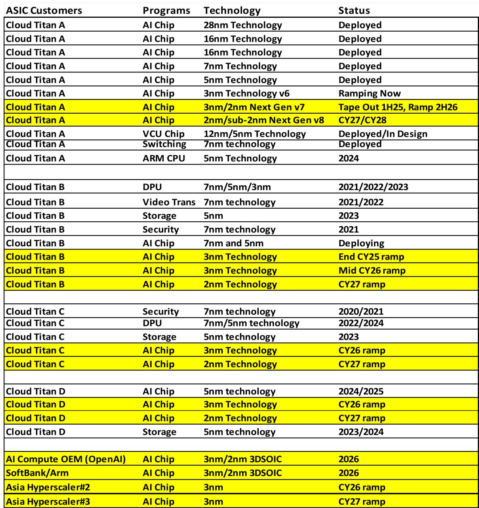
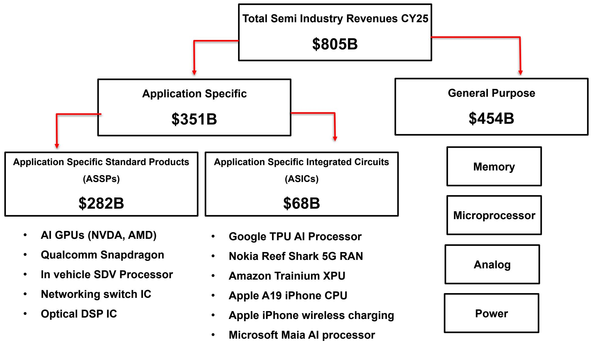

# The AI Chip Market Is Quietly Shifting From Merchant GPUs to Custom ASICs, and That Realignment Will Reshape the Entire Semiconductor Landscape

The prevailing narrative in artificial intelligence hardware has been dominated by a single name: NVIDIA. For the past two years, the story of AI compute has been the story of the merchant GPU, a general-purpose accelerator sold to any customer willing to pay the premium. That story, however, is entering its final act. The data now shows a structural shift that is already underway and will accelerate sharply over the next three years. By 2027, custom application-specific integrated circuits, or ASICs, are projected to account for a majority of AI accelerator unit volumes, surpassing merchant GPUs for the first time. This is not a marginal trend. It is a fundamental reordering of the semiconductor industry's center of gravity.

The logic behind this shift is not complicated, but its implications are profound. The largest consumers of AI compute—the hyperscale cloud providers—have reached a point where off-the-shelf silicon no longer serves their strategic interests. They need differentiation. They need control over their software stacks. They need better total cost of ownership. And they have the scale to justify the enormous upfront investment required to design their own chips. The transition from buying GPUs to building ASICs is a move from renting capability to owning the entire compute stack. That is a decision that changes everything about how value flows through the AI ecosystem.

What makes this moment particularly significant is that the economics are finally aligning. For years, custom chip design was reserved for ultra-high-volume applications like smartphone processors, where Apple's A-series chips became the textbook example of the model. Now, the same logic applies to AI infrastructure. The hyperscalers are shipping tens of millions of accelerators annually. The average selling prices for AI ASICs are extraordinarily high. The return on investment for internal chip design teams has become compelling. The report parsing makes this clear: Google's TPU, Amazon's Trainium, Meta's MTIA, and Microsoft's Maia are no longer experimental projects. They are core strategic assets that are ramping across multiple generations on leading-edge process nodes.

This article draws on a detailed research report from a global investment bank to unpack what this shift means for investors, strategists, and technology leaders. The argument is straightforward: the ASIC renaissance is real, it is accelerating, and it will create winners and losers that are not yet fully priced into the market. The following sections examine the structural forces driving the transition, the competitive dynamics among ASIC design partners, the unresolved questions about supply chain and execution risk, and the decision framework that leaders should use to navigate this new landscape.

## The Hyperscaler Economics of Custom Silicon Have Crossed the Threshold of Viability, Making ASICs a Strategic Imperative Rather Than an Option

The most important question in any capital-intensive industry is whether the return on investment justifies the expenditure. For hyperscale cloud providers, the answer regarding custom AI chips has shifted decisively from "maybe" to "yes." The report data shows that the total AI accelerator market is projected to grow from approximately 3.3 million units in 2023 to over 23 million units by 2027, a compound annual growth rate exceeding 60 percent. Within that growth, the ASIC share is expected to rise from 45 percent of units to 53 percent. But unit share understates the strategic importance, because ASICs are being deployed in the highest-value, highest-volume workloads.

The economics work because of three reinforcing factors. First, the hyperscalers own the software stack. When a company like Google designs its own TPU, it can optimize every transistor for its specific TensorFlow and JAX workloads. That optimization yields measurable performance per watt and performance per dollar advantages that merchant GPUs, designed for general-purpose AI, cannot match. The report compares the Google TPU7x Ironwood against the NVIDIA B200 Blackwell: the TPU delivers 0.35 TFLOPS per dollar versus 0.13 for the Blackwell, a nearly threefold improvement in cost efficiency. On power efficiency, the TPU achieves 4.61 TFLOPS per watt versus 4.50 for the Blackwell. These advantages compound at scale.

Second, the volumes have reached the point where the amortization of design costs is manageable. Apple ships over 250 million units per year, which makes its custom chip investment trivial on a per-unit basis. The hyperscalers are not at Apple's volume yet, but they are moving in that direction. Google alone is projected to ship 8 million TPU units by 2027. Amazon's Trainium and Inferentia combined are projected at 3.3 million units. When each chip carries an average selling price in the tens of thousands of dollars, the economics of a dedicated design team become not just viable but overwhelmingly favorable.

Third, the hyperscalers are not designing these chips in isolation. They are partnering with semiconductor companies that possess the IP, the design expertise, and the manufacturing relationships to execute at scale. Broadcom and Marvell have emerged as the dominant ASIC design partners, with Broadcom commanding an estimated 80 to 85 percent share of the high-end ASIC market and Marvell holding 10 to 12 percent. These partners bring pre-validated IP blocks, advanced packaging capabilities, and deep relationships with foundries like TSMC. The hyperscalers do not need to become semiconductor companies. They need to become intelligent specifiers and integrators, and the ASIC partners provide the missing capabilities.

The strategic implication is clear: the hyperscalers are building proprietary compute moats. Every generation of custom silicon deepens their advantage over competitors who rely on merchant silicon. This is not a cost-saving exercise. It is a competitive differentiation play that will determine who captures the economic value of AI inference and training at scale.

## Broadcom and Marvell Are the Primary Beneficiaries of the ASIC Surge, but Their Business Models and Risk Profiles Are Fundamentally Different

The ASIC design services market is not a commodity business. It is a high-barrier, high-relationship, high-repeat-revenue model that rewards incumbency and deep technical capability. The report parsing reveals that Broadcom has accumulated over 100 cumulative 7-nanometer, 5-nanometer, 3-nanometer, and 2-nanometer designs, with a pipeline that includes Google's TPU family across eight generations, Meta's MTIA across multiple generations, and new wins from OpenAI, SoftBank, and multiple Asian hyperscalers. Marvell's pipeline, while smaller at over 70 cumulative designs, includes Amazon's Trainium, Microsoft's Maia, and Google's ARM CPU processor, along with a growing attach rate for SmartNICs and other XPU-adjacent chips.

The difference between the two is not just scale but also strategic positioning. Broadcom has built what the report calls a "reference platform" for AI ASICs, a standardized architecture that includes compute dies, I/O dies, advanced packaging via 2.5D and 3D SOIC chip stacking, and a broad IP portfolio spanning SERDES, HBM memory interfaces, and chip-to-chip connectivity. This platform approach allows Broadcom to reduce time-to-market for its customers while maintaining high margins on the IP and design services. The company is also working with three of its five major AI ASIC customers on next-generation 3D SOIC chip stacking programs, indicating that its relationships are deepening into the most technically demanding areas of chip design.

Marvell, by contrast, is differentiating through memory IP. The report highlights Marvell's custom HBM architecture, which it claims delivers 33 percent more HBM stacks per package, 70 percent lower interface power, and 25 percent more XPU silicon area compared to standard HBM implementations. Marvell has also won multiple HBM4 ASIC logic base die programs with DRAM suppliers, positioning it at the intersection of memory and compute. This is a narrower but potentially high-value niche, especially as memory bandwidth becomes the primary bottleneck for AI inference workloads.

The risk profiles differ as well. Broadcom's concentration in a few large customers, particularly Google and Meta, means that any program delay or shift in customer strategy could have outsized revenue impacts. The report projects Broadcom will drive over $60 billion in AI revenue in fiscal 2026, up from approximately $20 billion in fiscal 2025, and over $150 billion in fiscal 2027. Those numbers are staggering, but they depend on flawless execution across multiple simultaneous tape-outs and ramps. Marvell's revenue projections are smaller—approximately $9.3 billion in data center revenue in calendar 2026 and $14.6 billion in calendar 2027—but its customer base is more diversified, and its attach-rate strategy for XPU-adjacent chips provides a buffer against any single program failure.

For investors, the key question is not which company is better. It is whether the total addressable market is large enough to support both, and whether the market is correctly pricing the execution risk embedded in these projections. The report's data suggests that the answer to the first question is yes, but the second question remains open.

## The Report Leaves Unanswered Questions About the Sustainability of Hyperscaler ASIC Programs and the Potential for a Capacity Constraint

No analysis is complete without acknowledging what it does not fully resolve. The report parsing provides an extraordinarily detailed view of the ASIC pipeline, including specific customers, technology nodes, and ramp timelines. What it does not fully address are the second-order risks that could derail even the most carefully planned programs.

The first unresolved question is about the sustainability of hyperscaler commitment. Building a custom ASIC program is not a one-time investment. It requires sustained engineering spending across multiple generations, with no guarantee that each generation will deliver the promised performance improvements. The report shows that Google, Amazon, Meta, and Microsoft are all committing to multi-generational roadmaps that extend through 2028 and beyond. But what happens if the return on investment for a particular generation falls short? What happens if a hyperscaler decides that the opportunity cost of internal chip design is too high relative to simply buying merchant GPUs? The report does not model a scenario in which any of these programs are scaled back or canceled.

The second unresolved question is about capacity. The ASIC supply chain depends on leading-edge foundry capacity at TSMC, advanced packaging capacity, and HBM memory supply from Samsung, SK Hynix, and Micron. The report projects that Broadcom alone will drive over $150 billion in AI revenue by fiscal 2027. That level of output requires an enormous allocation of wafer starts, packaging substrates, and memory stacks. Is the supply chain capable of supporting both the merchant GPU market and the ASIC market simultaneously? The report does not provide a capacity analysis, and this is a critical gap.

The third unresolved question is about the competitive response from NVIDIA and AMD. The report implicitly assumes that merchant GPUs will continue to lose share to ASICs, but it does not fully explore how NVIDIA might respond. Could NVIDIA develop its own custom chip program for hyperscale customers? Could it adjust its pricing and licensing model to make merchant GPUs more attractive for inference workloads? The report's data on performance-per-dollar advantages for ASICs is compelling, but it reflects a static comparison. NVIDIA is not standing still, and its next-generation architectures could narrow the gap.

These open questions do not invalidate the report's thesis. They simply mean that the thesis should be held with a healthy degree of skepticism and that investors should monitor execution metrics closely rather than assuming the projections will materialize as forecast.

## A Decision Framework for Navigating the ASIC Shift: Evaluate Customer Concentration, Technology Node Maturity, and Supply Chain Visibility

For institutional investors and corporate strategists, the ASIC shift demands a structured approach to analysis. The following framework is designed to cut through the complexity and focus on the variables that matter most.

The first dimension is customer concentration. The ASIC design services market is inherently concentrated, with a small number of hyperscale customers accounting for the vast majority of revenue. Investors should evaluate whether a given ASIC partner has a diversified customer base or is overly dependent on one or two programs. Broadcom's dependence on Google and Meta is a risk factor. Marvell's diversification across Amazon, Microsoft, and Google's ARM CPU program provides a more balanced profile. The report's pipeline tables are invaluable for this analysis, but they should be cross-referenced with customer-specific risk factors such as in-house chip design ambitions and procurement policies.

The second dimension is technology node maturity. The ASIC pipeline is heavily weighted toward 3-nanometer and 2-nanometer designs, with some programs reaching into sub-2-nanometer territory. These nodes are not yet fully mature, and the risk of yield issues, design rule complexity, and tape-out delays is significant. Investors should assess whether an ASIC partner has a track record of successful tape-outs on the relevant node and whether it has contingency plans for node transitions. The report's emphasis on Broadcom's reference platform and Marvell's memory IP is helpful, but it does not quantify the probability of node-related delays.

The third dimension is supply chain visibility. The ASIC market is not just about chip design; it is about packaging, testing, and memory integration. Investors should evaluate whether an ASIC partner has secured long-term capacity commitments from foundries, packaging suppliers, and memory vendors. The report mentions advanced packaging capabilities like 3D SOIC and custom HBM architectures, but it does not provide specific capacity allocations or supply agreements. This is a critical gap that should be addressed through additional due diligence.

The fourth dimension is total cost of ownership modeling. The report provides compelling data on performance per dollar and performance per watt for specific chip comparisons. But total cost of ownership for a hyperscaler includes not just chip cost but also system integration, networking, cooling, power infrastructure, and software optimization. Investors should build their own TCO models that incorporate these factors and stress-test the assumptions under different volume and pricing scenarios.

This framework is not exhaustive, but it provides a disciplined starting point for evaluating the ASIC opportunity. The key insight is that the ASIC shift is real, but its financial outcomes will vary significantly depending on execution, customer relationships, and supply chain positioning.

## The Full Report Contains Detailed Pipeline Tables, Chip Architecture Diagrams, and Revenue Projections That Are Essential for Building Conviction

The analysis in this article is based on a comprehensive research report that includes granular data on ASIC programs, customer roadmaps, and competitive positioning. The report contains pipeline tables that map out specific programs by customer, technology node, and ramp timeline, providing a level of detail that is difficult to find elsewhere. It also includes chip architecture diagrams that illustrate the design choices made by Broadcom and Marvell for their respective ASIC platforms, as well as revenue projections that quantify the opportunity at the company level.

For readers who want to build their own investment thesis or strategic plan, the full report is an indispensable resource. The charts and tables are not reproduced in this article, but they are available in the original document. Join the community to read the full report and review the original charts. The community provides access to the underlying data, the analytical frameworks, and the ongoing updates that are necessary for staying ahead of this rapidly evolving market.

The ASIC shift is one of the most important structural trends in the semiconductor industry today. It is not a speculative story. It is a data-driven reality that is already reshaping the competitive landscape. The hyperscalers are building their own compute moats. The ASIC design partners are scaling their capabilities. The supply chain is adapting. The only question is how quickly the market will price in the implications.

*This article is for learning and discussion only and does not constitute investment advice.*

Personal reading notes and learning share only. Not investment advice.

