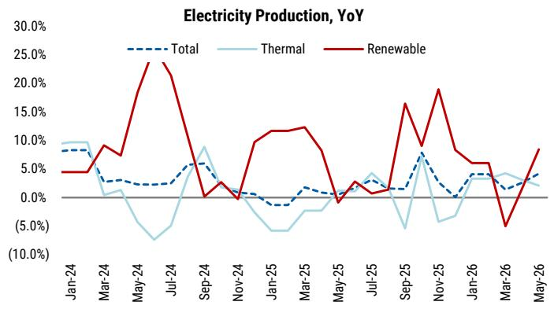
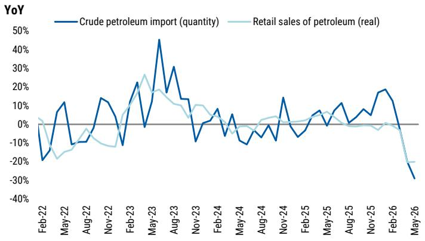
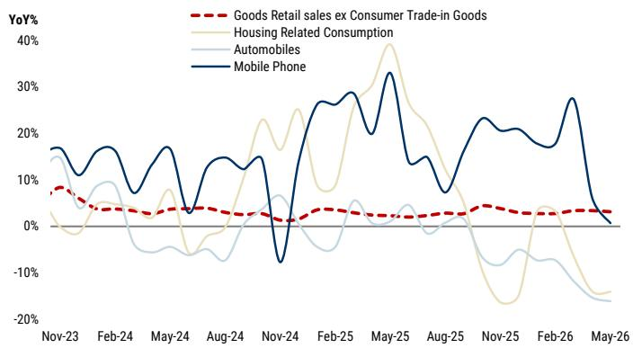

# China's Two-Speed Economy Is Not a Crisis—But It Is a Strategic Crossroads

The narrative around China’s economy has swung between two poles: either it is on the verge of a hard landing, or it is merely experiencing a temporary soft patch. Both interpretations miss the deeper structural reality. The April-May data reveal that China is operating a two-speed economy, where export-oriented manufacturing and production remain resilient while domestic demand—consumption, investment, and confidence—is clearly softening. This is not a signal for a dramatic policy pivot, but it does demand a deliberate fine-tuning of fiscal implementation. More importantly, the K-shaped pattern carries implications that extend far beyond GDP forecasts: it is reshaping China’s external trade relationships and intensifying the strategic calculus for global investors.

Why now? Because the data from the second quarter challenge the complacency that followed a strong first quarter. Second-quarter GDP is tracking around 4.4 percent, and if the current trajectory continues, full-year growth could approach or undershoot the lower end of the official 4.5-to-5 percent target range. The policy response, however, will not be a broad stimulus. Beijing will fine-tune, not pivot. The strategic choice is to accelerate spending on targeted infrastructure—specifically the "Six Networks" framework—rather than to boost private consumption or reverse the structural adjustments in property and local government finance.

For investors, the key question is not whether China will deliver a stimulus surprise. It is whether the fine-tuning will be enough to stabilize domestic demand, and whether the growing divergence between export strength and domestic weakness will trigger protectionist responses abroad. The answer to both questions will shape the risk-reward profile of China exposure for the rest of the year.

## The Slowdown in Domestic Demand Is Real, But the Headline YoY Figures Overstate the Pace

The April-May data show a clear softening in fixed asset investment and retail sales. But a careful reading suggests the magnitude of the deceleration is less alarming than the year-over-year numbers suggest. On fixed asset investment, the post-February slowdown appears partly policy-driven. Since late February, the central government has emphasized a "correct view of performance and achievements," which has pushed local governments away from new projects and toward resolving hidden debt. Some previously overstated and front-loaded FAI reporting may also be correcting. The direction of FAI matters more than the precise magnitude.

On consumption, the negative year-over-year retail sales figure for May largely reflects a high base from last year's trade-in subsidy program. On a two-year compound annual growth rate basis, May looks slightly better than April. Yet the slowdown is more than a base effect. The two-year CAGR in April-May still shows a visible step-down from the first quarter. A softer labor market, ongoing property market adjustment, and oil-related pressures are weighing on spending. Critically, export strength has had limited spillover into the job market due to automation and rising capital intensity. The NBS consumer confidence index has renewed its softening trend, confirming that the consumer mood remains fragile.

The implication is clear: the domestic demand weakness is not a temporary blip that will self-correct. It reflects structural forces—debt resolution, property adjustment, and labor market transformation—that require policy intervention. But the intervention will be calibrated, not sweeping.

## Oil and Energy Data Do Not Signal a Collapse; They Reinforce the K-Shaped Narrative

Investors have questioned whether the slump in crude imports, combined with limited evidence of strategic reserve drawdowns, signals a collapse in China's oil consumption and, by extension, broader economic activity. The data suggest a more nuanced story. Consumers are cutting back on non-essential oil consumption, including internal combustion engine vehicle usage and air travel. This is visible in the domestic flight and petroleum retail volume data.

However, overall industrial activity appears cushioned by several buffers: commercial crude inventories, resilient coal imports and domestic coal production, and still-robust electricity generation. The electricity generation data remain solid, indicating that industrial production continues to operate at a reasonable pace. The oil story, therefore, is not about a systemic collapse. It is about a shift in consumption patterns—a K-shaped divergence where industrial activity holds up while consumer-facing energy demand softens.

This reinforces the broader two-speed narrative. The economy is not uniformly weak. It is structurally divided between the export and industrial sectors, which remain resilient, and the domestic consumption and investment sectors, which are under pressure. For policymakers, this means the appropriate response is not a broad-based stimulus but a targeted fine-tuning that supports the weak leg without overheating the strong leg.

## Fiscal Fine-Tuning Will Accelerate, But It Will Focus on Strategic Infrastructure, Not Consumption

The softer April-May data raise policy urgency. Second-quarter GDP tracking around 4.4 percent means that without action, full-year growth could approach the lower end of the target range. The near-term response will likely focus on faster implementation of approved budgets, a stance that should be reaffirmed at the July Politburo meeting.

There is room for catch-up. Approximately 60 percent of the annual government bond quota remains unused. More importantly, the rollout of the 800 billion yuan in quasi-fiscal financing tools for infrastructure—as proxied by policy bank bond issuance—remains slow. The issuance data show a net contraction year-to-date, meaning the fiscal impulse has actually been negative so far this year.

The preferred demand support remains strategic infrastructure. Specifically, the focus is on projects that stabilize near-term growth while advancing longer-term goals around energy security, technology self-sufficiency, and supply-chain resilience. The "Six Networks" framework provides the clearest policy bridge: water management, new-type power grids, computing-power networks, next-generation communications, urban underground pipelines, and logistics infrastructure. Within this framework, AI computing networks, data centers, and smart grids are likely to see the most immediate support.

On the other hand, major pivotal policies targeting private consumption are unlikely. The economy will remain distinctly K-shaped even with additional domestic demand support. This is a deliberate policy choice. Beijing is prioritizing long-term strategic goals over short-term consumption stimulus. For investors, this means the consumption recovery will be gradual and uneven, while infrastructure and technology-related sectors will benefit from targeted fiscal support.

## The External Corollary: Weak Domestic Absorption Fuels Export Market Share Gains and Trade Frictions

The deepening two-speed economy has an external corollary that is often overlooked. Weak domestic absorption means more of China's manufacturing output is being directed toward export markets, accelerating market share gains abroad. This is most visible in the European Union, where the bilateral trade relationship has arguably become increasingly competitive rather than complementary.

China's share in steel, electric vehicles, batteries, solar, and chemicals has risen meaningfully over the past two years. Europe's response, if any, is likely to be targeted rather than systemic. Policy tools may include sector-specific tariffs, foreign-subsidy investigations, procurement restrictions, domestic content rules, and anti-dumping measures.

While this is unlikely to become a major macro shock—particularly given China's countermeasure leverage in areas such as rare earths and luxury goods imports—the direction of travel matters. If Europe progressively narrows access in high-value manufacturing segments, China's export engine risks being redirected toward lower-friction but lower-margin markets.

This creates a strategic dilemma for investors. On one hand, China's export machine remains powerful and is gaining market share. On the other hand, the very success of this export machine is generating pushback that could eventually erode its profitability. The K-shaped economy is not just a domestic phenomenon; it is reshaping global trade dynamics.

## What the Report Does Not Fully Answer: The Sustainability of the Export Engine and the Risk of a Policy Miscalculation

The report makes a compelling case for fine-tuning rather than pivoting, and it identifies the key sectors and policy tools that will be deployed. However, it leaves several meaningful open questions that readers should consider.

First, how sustainable is the export engine? The report notes that export strength has had limited spillover into the job market due to automation and rising capital intensity. If export growth does not translate into domestic income and consumption, the K-shaped pattern could become self-reinforcing. The export sector may continue to thrive, but if it does not generate sufficient domestic demand, the overall growth trajectory could remain fragile.

Second, what is the risk of a policy miscalculation? The report assumes that the fine-tuning will be sufficient to stabilize growth and that the July Politburo meeting will reaffirm this approach. But if the data continue to weaken, or if external headwinds intensify, the policy response may need to be more aggressive. The report does not fully explore the scenarios under which fine-tuning becomes insufficient and a pivot becomes necessary.

Third, how will the trade friction dynamic evolve? The report identifies the risk of targeted protectionist measures from Europe, but it does not fully quantify the potential impact on China's export growth or on the profitability of specific sectors. Investors need to monitor not just the policy announcements but also the implementation details and the corporate response.

These open questions are not weaknesses of the report. They are the natural boundaries of any forward-looking analysis. They point to the key variables that will determine whether the fine-tuning strategy succeeds or whether a more fundamental reassessment is required.

## A Decision Framework for Investors: How to Position for the Two-Speed Economy

Given the analysis, investors need a framework to assess their China exposure. The following questions can guide that assessment:

First, what is your time horizon? For the next six to twelve months, the fine-tuning narrative is likely to dominate. This means that infrastructure-related sectors—particularly those linked to the "Six Networks" framework—are likely to benefit from accelerated fiscal spending. Technology sectors such as AI computing, data centers, and smart grids should see the most immediate support. On the other hand, consumer-facing sectors are likely to remain under pressure unless there is a significant improvement in labor market conditions or a policy surprise on consumption.

Second, what is your risk tolerance for trade friction exposure? Sectors where China has gained significant market share in Europe—such as EVs, batteries, solar, and chemicals—face the highest risk of targeted protectionist measures. Investors should assess whether the potential upside from continued market share gains outweighs the downside risk from trade restrictions. For some sectors, the answer may be yes; for others, the risk-reward may be less attractive.

Third, how do you interpret the oil and energy data? The report suggests that the oil slump is not a systemic signal, but it does reflect a shift in consumer behavior. Investors should monitor the energy data as a leading indicator of domestic demand. If the oil weakness persists or deepens, it could signal that the consumer slowdown is more structural than the report assumes.

Fourth, what is your view on the policy response? The report argues that Beijing will fine-tune, not pivot. If you agree, then the investment focus should be on sectors that benefit from targeted fiscal spending. If you believe that the data will force a more aggressive response, then sectors that benefit from broad-based stimulus—such as consumer discretionary, real estate, and financials—could become more attractive.

Finally, do not overlook the external dimension. The K-shaped economy is not just a China story. It is reshaping global trade and investment flows. Investors with a global portfolio should consider how China's export strength and trade friction risks affect their exposure to other regions, particularly Europe and emerging markets that compete with China in manufacturing.

## The Unresolved Analytical Tension: Why This Moment Demands Deeper Scrutiny

The report provides a clear and coherent framework for understanding China's current economic trajectory. But the most valuable insight may be what it does not fully resolve: the tension between the export engine's resilience and the domestic demand weakness.

If the export engine continues to thrive, it could eventually pull the domestic economy along through higher corporate profits, investment, and eventually employment. This is the optimistic scenario. But if the export sector remains decoupled from the domestic economy—due to automation, capital intensity, or trade restrictions—then the K-shaped pattern could persist or even widen. In that scenario, the fine-tuning may not be enough, and the policy response would need to evolve.

This is the analytical tension that investors should monitor most closely. The data over the next few months will provide clues about which path the economy is on. The July Politburo meeting will be a key signal of policy direction. And the trade negotiations with Europe will test whether the external corollary of the two-speed economy becomes a manageable friction or a significant headwind.

Join the community to read the full report and review the original charts.

*This article is for learning and discussion only and does not constitute investment advice.*

Personal reading notes and learning share only. Not investment advice.

