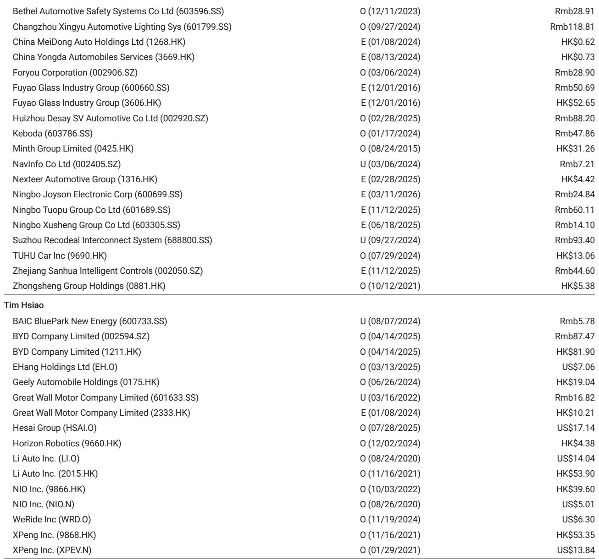
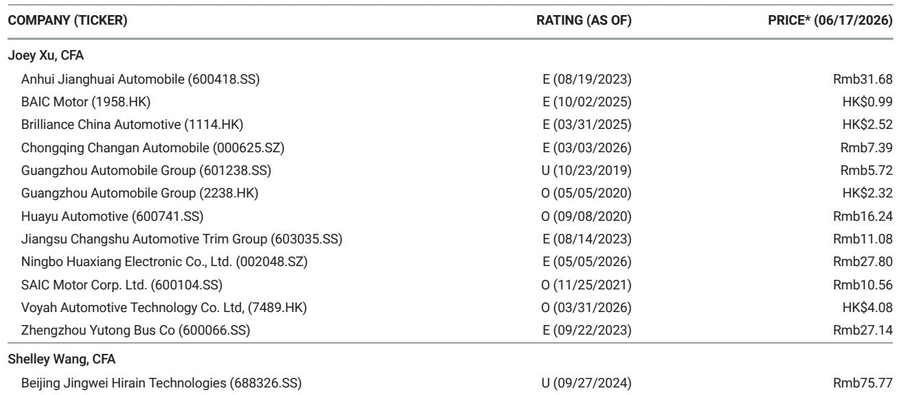
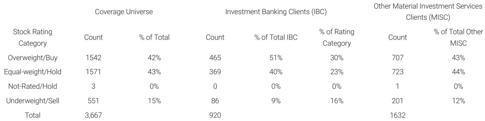

# 摩根斯坦利：中国电动车市场的份额洗牌远未结束，真正的分化才刚刚开始

5月的中国电动车市场，表面上是几家欢喜几家愁的月度排名更迭，但摩根斯坦利这份最新研报揭示的信号远比排名变化本身更值得深思：市场正在从一个“谁都能分一杯羹”的增量竞争阶段，转向一个“产品节奏、品牌势能与渠道效率必须同时在线”的存量博弈阶段。月度份额的波动，不再是随机扰动，而是企业战略执行力的压力测试结果。

这份报告的核心价值，不在于告诉你哪家品牌5月卖得好，而在于它提供了一套观察竞争格局的微观透镜：当比亚迪海洋/王朝系列份额出现年内首次环比下滑，当理想汽车在L系列改款前的阵痛期份额承压，当零跑汽车创下历史新高，当特斯拉在所有城市级市场实现份额扩张——这些碎片化信号叠加在一起，指向一个更本质的判断：中国电动车市场的份额洗牌，已经从“大厂吃肉、小厂喝汤”的粗放阶段，进入“产品周期管理能力决定季度排名”的精耕阶段。谁能在新旧产品切换的窗口期保持份额稳定甚至逆势增长，谁才真正具备穿越周期的能力。

## 1. 比亚迪的份额松动不是衰退信号，而是市场对“规模溢价”重新定价的开始

比亚迪海洋/王朝系列5月市场份额环比下降1.0个百分点至17.5%，与其年初至今的平均水平持平。这个数字本身并不令人恐慌——17.5%的市占率仍然是行业绝对龙头。但值得关注的是，这是否意味着比亚迪依靠冠军版、荣耀版等降价策略维持份额的边际效应正在递减？

摩根斯坦利在报告中并未直接给出这个判断，但数据本身提供了线索：1.0个百分点的环比降幅，在所有主流品牌中仅次于小米的0.9个百分点下滑，但小米的下滑是SU7改款后销量自然回落，而比亚迪的下滑发生在没有明显产品空窗期的背景下。这暗示，当竞争对手的产品迭代速度加快、新车型密集上市时，即便是比亚迪这样的规模王者，也需要更频繁地动用产品工具而非价格工具来维持份额。

这里的关键洞察是：规模优势正在从“自动转化为份额”变为“需要主动管理才能兑现”。比亚迪即将在6月17日发布的新款“大唐”，将是检验其能否重新激活王朝系列订单势能的关键节点。如果新款大唐无法在上市首月拉动份额回升，市场可能需要重新评估比亚迪在20万元以上价格带的竞争壁垒。

## 2. 零跑和特斯拉的逆势增长，揭示了两种截然不同的份额获取路径

零跑5月市场份额环比提升0.8个百分点至6.8%，再创历史新高。这是这份报告中最值得拆解的现象之一。零跑的增长并非依靠单款爆款车型，而是凭借C系列车型在10-15万元主力价格带的持续渗透。其份额从2025年全年3.7%跃升至2026年年初至今5.3%，说明其“平价智能”定位正在真正转化为稳定的客户认知。

与零跑形成对照的是特斯拉。特斯拉中国5月EV市场份额环比提升2.0个百分点至5.2%，与年初至今平均水平基本持平。更重要的是，报告特别指出特斯拉的份额增长是“all-city”的——在所有城市层级都实现了市占率提升。这意味着特斯拉的增长不是依赖某个区域市场的特殊补贴或渠道优势，而是品牌势能本身的全面扩散。

这两种路径的区别对投资者至关重要：零跑的增长依赖于精准的产品定位和性价比，但这种优势容易受到竞争对手跟进降价的侵蚀；特斯拉的增长依赖于品牌溢价和用户粘性，护城河更深但需要持续的技术领先来维持。两者都能在特定阶段实现份额扩张，但长期可持续性截然不同。

## 3. 理想和小鹏的份额承压，本质上是产品周期管理的“换挡阵痛”

理想汽车5月市场份额环比下降0.4个百分点至3.6%，低于年初至今4.5%的平均水平。报告给出的解释是L9订单增长被其他L系列车型在改款前的销售疲软所抵消。这实际上是一个经典的产品周期管理问题：当主力产品线处于生命周期末期、新车型尚未完全接棒时，企业必然要经历一段“青黄不接”的份额下滑期。

理想的应对策略是6月23日即将推出的新款L8。但问题的关键不在于新款L8能否提振销量，而在于理想能否在未来避免这种“改款前综合症”——即每次产品迭代都伴随着一到两个月的份额下滑。如果这种模式成为常态，理想的季度业绩将始终存在可预测的波动性，这对于追求稳定增长预期的长期投资者而言是一个需要定价的风险因子。

小鹏的情况略有不同。5月市场份额环比下降0.3个百分点至2.8%，但报告指出GX车型在5月中旬才开始交付，其完整月度贡献将在6月体现。这意味着小鹏的份额下滑更多是“交付节奏错位”而非“需求不足”。但这里同样存在一个未解问题：GX能否真正成为小鹏的“份额加速器”？如果GX在6月无法推动小鹏份额回升至3%以上，市场对小鹏产品线竞争力的质疑可能会重新抬头。

## 4. 蔚来的份额波动背后，是“多品牌战略”能否兑现为协同效应的关键验证期

蔚来5月市场份额环比下降0.2个百分点至3.9%，尽管批发销量环比增长28%。报告指出部分销量可能将在下月注册，这意味着实际交付数据可能优于批发数据。但更值得关注的不是单月波动，而是蔚来即将进入的一个密集产品投放期：L60的上市，以及L80和ES9的交付。

这是蔚来首次在同一个季度内同时推进三款新车型的上市和交付。从运营角度看，这意味着蔚来的生产爬坡、供应链管理、渠道培训和售后服务能力将同时面临三重压力测试。如果蔚来能够在这个季度实现份额的环比改善，那将证明其多品牌战略（NIO主品牌+ONVO子品牌+Firefly品牌）确实具有协同效应；反之，如果三款新车型的上市反而导致运营效率下降、交付延期，市场可能需要重新评估蔚来“品牌矩阵”战略的可行性。

报告没有给出这个判断，但它留下的数据线索足以让读者自己推导出这个分析框架。这也是为什么我们认为完整报告中的图表和数据细节比摘要本身更有价值——它们提供了自己动手验证假设的工具。

## 5. 豪华欧洲品牌的持续失血，是中国品牌份额扩张的“隐藏镜像”

报告最后简短提及了奔驰和宝马在中国乘用车市场的份额变化：奔驰环比下降0.1个百分点，宝马下降0.4个百分点。这个数字看似微不足道，但如果将其放在更长的周期中观察，趋势令人警惕：豪华欧洲品牌在中国市场的份额流失正在从“缓慢侵蚀”变为“加速滑落”。

这个现象与中国电动车品牌的份额扩张形成了镜像关系。当特斯拉、零跑、AITO等品牌在20-40万元价格带不断渗透时，传统豪华品牌的主力产品线（如宝马3系、5系，奔驰C级、E级）正面临前所未有的替代压力。而且，这种替代不仅仅是产品层面的——电动化正在改变豪华车的定义方式，从“发动机排量和内饰材质”转向“智能座舱和自动驾驶能力”，这恰恰是中国品牌的传统优势领域。

报告没有深入展开这个议题，但我们可以合理推断：如果豪华欧洲品牌无法在未来12-18个月内推出真正有竞争力的电动化产品，它们的市场份额流失可能从“每月0.1-0.4个百分点”加速到“每月0.5-1.0个百分点”。这对于持有相关股票或债券的投资者而言，是一个需要密切关注的风险敞口。

## 6. 报告尚未完全回答的关键问题：份额变化背后的盈利质量如何？

摩根斯坦利这份报告的核心贡献在于提供了精细化的月度份额追踪数据，但它有一个明确的边界：它回答的是“谁赢了份额”，而不是“谁赢得了利润”。这是一个关键的信息缺口。

例如，零跑份额创新高，但这是否意味着其单车毛利率也在改善？特斯拉在所有城市实现份额扩张，但这是否是以牺牲定价权为代价？理想在改款前的份额下滑，是否反而有助于清理库存、改善后续季度的现金流？这些问题都需要结合各家公司的季度财报数据才能回答。

更根本的问题是：在当前的竞争强度下，是否存在“份额增长与利润增长可以兼得”的玩家？还是说，市场正在进入一个“所有参与者都必须用利润换份额”的阶段？如果后者成立，那么当前的份额数据可能只是“虚假繁荣”，真正值得关注的指标应该是“可持续的份额”而非“任何份额”。

这些问题的答案，恰恰是完整报告最吸引人的部分。摩根斯坦利的分析师团队在完整版本中提供了更深入的估值框架和情景分析，包括各品牌在不同市场份额假设下的盈利敏感性测算。这些内容对于做出投资决策至关重要，但受限于篇幅，我们无法在这里全部展开。

---

如果你已经读到这里，说明你对这场份额洗牌背后的真实逻辑有着超出平均水平的兴趣。但正如我们刚才讨论的，月度份额数据只是冰山一角——真正影响投资决策的判断，往往隐藏在那些没有被写进摘要的图表和假设里。

例如，报告中的一张关键图表展示了各品牌2025年全年与2026年年初至今的EV市场份额对比，但它没有回答的是：哪些品牌的份额增长是可持续的趋势，哪些只是产品周期红利的一次性兑现？再比如，报告提到了比亚迪新款大唐和理想新款L8的发布时间，但没有展开的是：这些新车型的定价策略将如何影响整个价格带的竞争格局？

这些未解问题，正是我们在知识星球微信群里持续讨论的核心议题。我们会在社群中分享完整研报的原始图表、分析师电话会议的要点提炼，以及对这些关键问题的多空双方逻辑推演。如果你希望获得比这篇导读更深一层的分析框架，欢迎加入我们的讨论。

Personal reading notes and learning share only. Not investment advice.

