# Greater China Semiconductors | Asia Pacific

# Power Semis – Supply Driven Upcycle

Global power discrete sales returned to growth since 4Q25. On the back of limited capacity additions in the past two years, we expect power semi pricing to rise further in 2H26. We like Yangjie (OW) on auto localization, while staying UW on Silan Micro and CR Micro on hyped expectations.

Overall power discrete sales back to growth since 4Q25: Global power discrete revenue growth is now tracking at 16% YoY in April and the yoy growth was back to positive territory since 4Q25 (Exhibit 1). Many Greater China power discrete companies issued price hike notices in Feb 2026, citing higher raw material prices and foundry costs. Except for IGBT for automotive customers, distributors and other end-market customers were willing to accept the price hikes, given low inventory and fears of even higher pricing in 2H26. We think pricing power could support gross margin, with gradual improvement expected for the rest of the year.

Mixed demand picture: robust industrial demand, slower EV growth, and weak solar demand: Auto and industrial segments accounted for 72% of total demand in power discrete in 2025, so the power semi market is less affected by weak smartphone and PC sell-through this year due to memory price hikes. Industrial demand is strong, and leading industrial automation companies' revenue grew at 21% in 1Q26 (Exhibit 4). China EV wholesale growth (3MMA) was tracking at 7% yoy in May, up from zero in April (Exhibit 3). Solar demand was weak, with YTD capacity additions down 51% yoy.

Limited supply additions in the past two years: Global leading power discrete companies' capex declined for two consecutive years, and this year we saw a mild capex increase of around 11% (Exhibit 5). In China, we expect limited capacity additions in power discrete (IGBT, MOSFET etc.) in the next three years, as companies like Silan Micro and UNT (688469.SS, NC) shift focus to AI power management (PMIC, etc.). Given limited capacity additions and high utilization, we think if demand does not sharply deteriorate, the upward pricing trend could sustain into 2H26.

## We like Yangjie (OW), and raise PTs for Yangjie, Silan Micro and CR Micro:

Although we are positive on power discrete pricing, we think it is a supply-driven upcycle. We raise PTs for Yangjie, Silan Micro and CR Micro but make no rating changes. We remain OW on Yangjie Technology – auto is rising in its mix, and operating efficiency is strong. We remain UW on Silan Micro and CR Micro on hyped expectations. We are EW on Starpower due to depreciation concerns.

MS ASIA LIMITED+

## Daisy Dai, CFA

Equity Analyst

Daisy.Dai@morganstanley.com +852 2848-7310

MS TAIWAN LIMITED+

## Charlie Chan

Equity Analyst

Charlie.Chan@morganstanley.com +886 2 2730-1725

## Daniel Yen, CFA

Equity Analyst

Daniel.Yen@morganstanley.com +886 2 2730-2863

## Tiffany Yeh

Equity Analyst

Tiffany.Yeh@morganstanley.com +886 2 7712-3032

MS ASIA LIMITED+

## Henry Zhao

Research Associate

Henry.Zhao@morganstanley.com +852 2239-7731

## Ethan Jia

Research Associate

Ethan.Jia@morganstanley.com +852 3963-2287

## Asia Summer School 2026

GREATER CHINA TECHNOLOGY SEMICONDUCTORS

<table><tr><td colspan="2">Asia Pacific Industry View</td><td>Attractive</td></tr><tr><td colspan="3">WHAT&#x27;S CHANGED</td></tr><tr><td>Hangzhou Silan Microelectronics Co. Ltd. (600460.SS)Price Target</td><td>FromRmb20.00</td><td>ToRmb26.90</td></tr><tr><td>Yangjie Technology (300373.SZ)Price Target</td><td>FromRmb91.00</td><td>ToRmb136.00</td></tr><tr><td>China Resources Microelectronics Limited (688396.SS)Price Target</td><td>FromRmb43.00</td><td>ToRmb51.60</td></tr></table>

MS does and seeks to do business with companies covered in MS. As a result, investors should be aware that the firm may have a conflict of interest that could affect the objectivity of MS. Investors should consider MS as only a single factor in making their investment decision.

## For analyst certification and other important disclosures, refer to the Disclosure Section, located at the end of this report.

+= Analysts employed by non-U.S. affiliates are not registered with FINRA, may not be associated persons of the member and may not be subject to FINRA restrictions on communications with a subject company, public appearances and trading securities held by a research analyst account.

Earnings Estimates Revisions

<table><tr><td>Ticker</td><td>Company</td><td>Earnings estimates revision and price target change</td></tr><tr><td>300373.SZ</td><td>Yangjie Technology</td><td>We raise EPS estimates by 3%/6%/9% for 2026/27/28 respectively: We expect stronger sales growth, mainly from better industrial demand, and we also raise our gross margin assumption on better power discrete pricing. We expect Yangjie&#x27;s overseas business could also grow strongly on the back of its Vietnam packaging and foundry capacity ramp.We raise our price target by 50% to Rmb136 from Rmb91: We factor in earnings estimate changes and raise our intermediate growth rate to 18% from 15% previously, as the company decides to allocate more funding to automotive and AI infrastructure related power devices. We continue to derive our base case/price target from a residual income model. All other assumptions are unchanged, including an 8.4% cost of equity (beta 1.06, risk-free rate 2.0% and risk premium 6.0%) and a terminal growth rate of 5.5%, in line with other semiconductor companies we cover.Our base case value/price target implies 33x our 2027e EPS.Our bull and bear case values also rise 50% to Rmb173.8 and Rmb53.4, respectively, implying 42x and 13x our 2027e EPS, in line with our base case change.</td></tr><tr><td>688396.SS</td><td>CR Micro</td><td>We raise our EPS estimates by 9%/14%/14% for 2026/27/28: We raise our sales forecasts slightly on better industrial demand, and we also raise our margin assumptions. We expect CR Micro&#x27;s power semis prices could go up further on the back of full utilization. While the company continues to expand capacity in Shenzhen, it is mainly for YMTC&#x27;s outsourcing orders, with limited capacity additions in power semis.We raise our target price by 20% to Rmb51.6 from Rmb43.0: Our new price target reflects the changes in our earnings estimates. We derive our price target from a residual income model, which we believe best captures the stock&#x27;s long-term value. Our key assumptions include: an 8.2% cost of equity (beta 1.04, risk-free rate 2.0% and risk premium 6.0%; all unchanged), a medium-term growth rate of 19% and a terminal growth rate of 5.5%. We raise our bull case to Rmb109.7 from Rmb91.4, and our bear case to Rmb24.5 from Rmb20.4, both in line with our base case/price target adjustment.</td></tr><tr><td>600460.SS</td><td>Silan Micro</td><td>We raise our 2026/27/28 EPS forecasts by 4%/6%/9%: We raise our sales forecasts slightly on better industrial demand, and we also raise our margin assumptions. Silan Micro has a higher portion of sales through distributors. We think it would be easier for them to raise prices vs. peers, which have more direct sales.We raise our price target by 35% to Rmb26.9 from Rmb20: Our new price target reflects the changes in our earnings estimates. We also raise the payout ratio to 20% from 5%, as we expect the company to increase payout given higher net margin.We continue to derive our price target (base case scenario value) from a residual income model. Our key assumptions are unchanged: an 8.6% cost of equity (beta 1.1, risk-free rate 2.0%, and risk premium 6.0%), an intermediate growth rate of 18% and a terminal growth rate of 5.5%.We raise our bull case value by 70% to Rmb61.2 from Rmb36.1, the upward revision is higher than our base case change, considering higher operating leverage of Silan&#x27;s IDM model compared to its peers (design houses or fab-lite business model). Our bear case value is raised by 35% to Rmb16.8 from Rmb12.5, due to better pricing environment and margin improvement.</td></tr></table>

## Power Semi Industry Tracker

Exhibit 1: Total discrete revenue yoy growth turned positive since 4Q25  
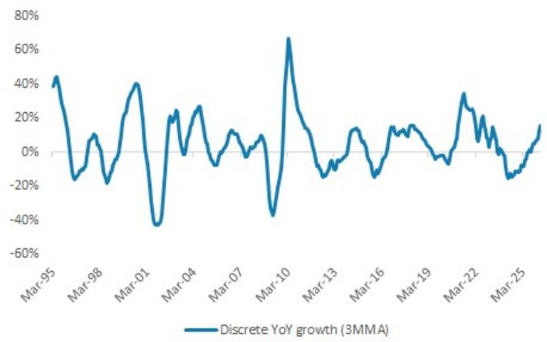

line chart

| Date   | Discrete YoY growth (3MMA) |
|--------|-----------------------------|
| Mar-95 | ~45%                        |
| Mar-98 | ~10%                        |
| Mar-01 | ~40%                        |
| Mar-04 | ~20%                        |
| Mar-07 | ~10%                        |
| Mar-10 | ~65%                        |
| Mar-13 | ~-20%                       |
| Mar-16 | ~15%                        |
| Mar-19 | ~10%                        |
| Mar-22 | ~35%                        |
| Mar-25 | ~15%                        |

Source: WSTS, MS

Exhibit 2: Auto and industrial accounted for 70% of end demand in discrete semiconductors (2025)  
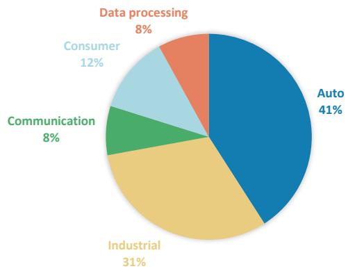

pie chart

| Category | Percentage (%) |
| :--- | :--- |
| Auto | 41 |
| Industrial | 31 |
| Consumer | 12 |
| Communication | 8 |
| Data processing | 8 |

Source: Gartner, MS

Exhibit 3: China EV wholesale growth is turning incrementally positive  
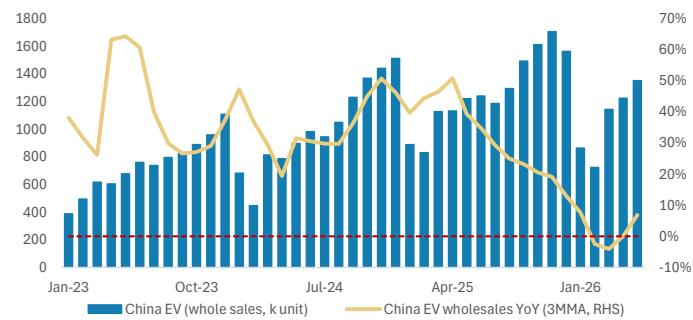

bar-line hybrid chart

| Month    | China EV (whole sales, k unit) | China EV wholesale YoY (3MMA, RHS) |
| -------- | ------------------------------ | ---------------------------------- |
| Jan-23   | 400                            | 10%                                |
| Feb-23   | 500                            | 8%                                 |
| Mar-23   | 600                            | 15%                                |
| Apr-23   | 700                            | 20%                                |
| May-23   | 800                            | 25%                                |
| Jun-23   | 900                            | 30%                                |
| Jul-23   | 1000                           | 35%                                |
| Aug-23   | 1100                           | 40%                                |
| Sep-23   | 1200                           | 45%                                |
| Oct-23   | 1300                           | 50%                                |
| Nov-23   | 1400                           | 55%                                |
| Dec-23   | 1500                           | 60%                                |
| Jan-24   | 1600                           | 65%                                |
| Feb-24   | 1700                           | 70%                                |
| Mar-24   | 1800                           | 75%                                |
| Apr-24   | 1900                           | 80%                                |
| May-24   | 2000                           | 85%                                |
| Jun-24   | 2100                           | 90%                                |
| Jul-24   | 2200                           | 95%                                |
| Aug-24   | 2300                           | 100%                               |
| Sep-24   | 2400                           | 105%                               |
| Oct-24   | 2500                           | 110%                               |
| Nov-24   | 2600                           | 115%                               |
| Dec-24   | 2700                           | 120%                               |
| Jan-25   | 2800                           | 125%                               |
| Feb-25   | 2900                           | 130%                               |
| Mar-25   | 3000                           | 135%                               |
| Apr-25   | 3100                           | 140%                               |
| May-25   | 3200                           | 145%                               |
| Jun-25   | 3300                           | 150%                               |
| Jul-25   | 3400                           | 155%                               |
| Aug-25   | 3500                           | 160%                               |
| Sep-25   | 3600                           | 165%                               |
| Oct-25   | 3700                           | 170%                               |
| Nov-25   | 3800                           | 175%                               |
| Dec-25   | 3900                           | 180%                               |
| Jan-26   | 4000                           | 185%                               |
| Feb-26   | 4100                           | 190%                               |
| Mar-26   | 4200                           | 195%                               |
| Apr-26   | 4300                           | 200%                               |
| May-26   | 4400                           | 205%                               |
| Jun-26   | 4500                           | 210%                               |
| Jul-26   | 4600                           | 215%                               |
| Aug-26   | 4700                           | 220%                               |
| Sep-26   | 4800                           | 225%                               |
| Oct-26   | 4900                           | 230%                               |
| Nov-26   | 5000                           | 235%                               |
| Dec-26   | 5100                           | 240%                               |
| Jan-27   | 5200                           | 245%                               |
| Feb-27   | 5300                           | 250%                               |
| Mar-27   | 5400                           | 255%                               |
| Apr-27   | 5500                           | 260%                               |
| May-27   | 5600                           | 265%                               |
| Jun-27   | 5700                           | 270%                               |
| Jul-27   | 5800                           | 275%                               |
| Aug-27   | 5900                           | 280%                               |
| Sep-27   | 6000                           | 285%                               |
| Oct-27   | 6100                           | 290%                               |
| Nov-27   | 6200                           | 295%                               |
| Dec-27   | 6300                           | 300%                               |
| Jan-28   | 6400                           | 305%                               |
| Feb-28   | 6500                           | 310%                               |
| Mar-28   | 6600                           | 315%                               |
| Apr-28   | 6700                           | 320%                               |
| May-28   | 6800                           | 325%                               |
| Jun-28   | 6900                           | 330%                               |
| Jul-28   | 7000                           | 335%                               |
| Aug-28   | 7100                           | 340%                               |
| Sep-28   | 7200                           | 345%                               |
| Oct-28   | 7300                           | 350%                               |
| Nov-28   | 7400                           | 355%                               |
| Dec-28   | 7500                           | 360%                               |
| Jan-29   | 7600                           | 365%                               |
| Feb-29   | 7700                           | 370%                               |
| Mar-29   | 7800                           | 375%                               |
| Apr-29   | 7900                           | 380%                               |
| May-29   | 8000                           | 385%                               |
| Jun-29   | 8100                           | 390%                               |
| Jul-29   | 8200                           | 395%                               |
| Aug-29   | 8300                           | 400%                               |
| Sep-29   | 8400                           | 405%                               |
| Oct-29   | 8500                           | 410%                               |
| Nov-29   | 8600                           | 415%                               |
| Dec-29   | 8700                           | 420%                               |
| Jan-30   | 8800                           | -1%                                |
| Feb-30   | 8900                           | -1%                                |
| Mar-31   | 9000                           | -1%                                |
| Apr-31   | 9100                           | -1%                                |
| May-31   | 9200                           | -1%                                |
| Jun-31   | 9300                           | -1%                                |
| Jul-31   | 9400                           | -1%                                |
| Aug-31   | 9500                           | -1%                                |
| Sep-31   | 9600                           | -1%                                |
| Oct-31   | 9700                           | -1%                                |
| Nov-31   | 9800                           | -1%                                |
| Dec-31   | 9900                           | -1%                                |
| Jan-32   | -1                   | -1%                                |
| Feb-32   | -1                   | -1%                                |
| Mar-32   | -1                   | -1%                                |
| Apr-32   | -1                   | -1%                                |
| May-32   | -1                   | -1%                                |
| Jun-32   | -1                   | -1%                                |
| Jul-32   | -1                   | -1%                                |
| Aug-32   | -1                   | -1%                                |
| Sep-32   | -1                   | -1%                                |
| Oct-32   | -1                   | -1%                                |
| Nov-32   | -1                   | -1%                                |
| Dec-32   | -1                   | -1%                                |
| Jan-33   | -1                   | -1%                                |
| Feb-33   | -1                   | -1%                                |
| Mar-33   | -1                   | -1%                                |
| Apr-33   | -1                   | -1%                                |
| May-33   | -1                   | -1%                                |
| Jun-33   | -1                   | -1%                                |
| Jul-33   | -1                   | -1%                                |
| Aug-33   | -1                   | -1%                                |
| Sep-33   | -1                   | -1%                                |
| Oct-33   | -1                   | -1%                                |
| Nov-33   | -1                   | -1%                                |
| Dec-33   | -1                   | -1%                                |
| Jan-34   | -1                   | -1%                                |
| Feb-34   | -1                   | -1%                                |
| Mar-34   | -1                   | -1%                                |
| Apr-34   | -1                   | -1%                                |
| May-34   | -1                   | -1%                                |
| Jun-34   | -1                   | -1%                                |
| Jul-34   | -1                   | -1%                                |
| Aug-34   | -1                   | -1%                                |
| Sep-34   | -1                   | -1%                                |
| Oct-34   | -1                   | -1%                                |
| Nov-34   | -1                   | -1%                                |
| Dec-34   | -1                   | -1%                                |
| Jan-35   | -1                   | -1%                                |
| Feb-35   | -1                   | -1%                                |
| Mar-35   | -1                   | -1%                                |
| Apr-35   | -1                   | -1%                                |
| May-35   | -1                   | -1%                                |
| Jun-35   | -1                   | -1%                                |
| Jul-35   | -1                   | -1%                                |
| Aug-35   | -1                   | -1%                                |
| Sep-35   | -1                   | -1%                                |
| Oct-35   | -1                   | -1%                                |
| Nov-35   | -1                   | -1%                                |
| Dec-35   | -1                   | -1%                                |
| Jan-36*  | -1                   | -1%                                |
| Feb-36*  | -1                   | -1%                                |
| Mar-36*  | -1                   | -1%                                |
| Apr-36*  | -1                   | -1%                                |
| May-36*  | -1                   | -1%                                |
| Jun-36*  | -1                   | -1%                                |
| Jul-36*  | -1                   | -1%                                |
| Aug-36*  | -1                   | -1%                                |
| Sep-36*  | -1                   | -1%                                |
| Oct-36*  | -1                   | -1%                                |
| Nov-36*  | -1                   | -1%                                |
| Dec-36*  | -1                   | -1%                                |
| Jan-37*  *|
| Feb-37* *|
| Mar-37* *|
| Apr-37* *|
| May-37* *|
| Jun-37* *|
| Jul-37* *|
| Aug-37* *|
| Sep-37* *|
| Oct-37* *|
| Nov-37* *|
| Dec-37* *|
| Jan-38* *|
| Feb-38* *|
| Mar-38* *|
| Apr-38* *|
| May-38* *|
| Jun-38* *|
| Jul-38* *|
| Aug-38* *|
| Sep-38* *|
| Oct-38* *|
| Nov-38* *|
| Dec-38* *|
| Jan-39* *|
|
| Feb-39* *|
|
| Mar-39* *|
|
| Apr-39* *|
|
| May-39* *|
|
| Jun-39* *|
|
| Jul-39* *|
|
| Aug-39* *|
|
| Sep-39* *|
|
| Oct-39* *|
|
| Nov-39* *|
|
| Dec-39* *|
|
| Jan-40* *|
|
| Feb-40* *|
|
| Mar-40* *|
|
| Apr-40* *|
|
| May-40* *|
|
| Jun-40* *|
|
| Jul-40* *|
|
| Aug-40* *|
|
| Sep-40* *|
|
| Oct-40* *|
|
| Nov-40* *|
|
| Dec-40* *|
|
| Jan-41* *|
|
| Feb-41* *|
|
| Mar-41* *|
|
| Apr-41* *|
|
| May-41* *|
|
| Jun-41* *|
|
| Jul-41* *|
|
| Aug-41* *|
|
| Sep-41* *|
|
| Oct-41* *|
|
| Nov-41* *|
|
| Dec-41* *|
|
| Jan-42* *|
|
| Feb-42* *|
|
| Mar-42* *|
|
| Apr-42* *|
|
| May-42* *|
|
| Jun-42* *|
|
| Jul-42* *|
|
| Aug-42* *|
|
| Sep-42* *|
|
| Oct-42* *|
|
| Nov-42* *|
|
| Dec-42* *|
|
<fcel>Jan-43* *|
|
<fcel>Feb-43* *|
|
<fcel>Mar-43* *|
|
<fcel>Apr-43* *|
|
<fcel>May-43* *|
|
<fcel>Jun-43* *|
|
<fcel>Jul-43* *|
|
<fcel>Aug-43* *|
|
<fcel>Sep-43* *|
|
<fcel>Oct-43* *|
|
<fcel>Nov-43* *|
|
<fcel>Dec-43* *|
|
<fcel>Jan-44* *|
|
<fcel>Feb-44* *|
|
<fcel>Mar-44* *|
|
<fcel>Apr-44* *|
|
<fcel>May-44* *|
|
<fcel>Jun-44* *|
|
<fcel>Jul-44* *|
|
<fcel>Aug-44* *|
|
<fcel>Sep-44* *|
|
<fcel>Oct-44* *|
|
<fcel>Nov-44* *|
|
<fcel>Dec+       +(-)=-(-)=-(-)=-(-)=-(-)=-(-)=-(-)=-(-)=-(-)=-(-)=-(-)=-(-)=-(-)=-(-)=-(-)=-(-)=-(-)=-(-)=-(-)=-(-)=-(-)=-(-)=-(-)=-(-)=-(-)=-(-)=-(-)=-(-)=-(-)=-(-)=-(-)=-(-)=-(-)=-(-)=- (-)=-(-)=-(-)=-(-)=-(-)=-(-)=-(-)=-(-)=-(-)=-(-)=-(-)=-(-)=-(-)=-(-)=-(-)=-(-)=-(-)=-(-)=-(-)=-(-)=-(-)=-(-)=-(-)=-(-)=-(-)=-(-)=-(-)=-(-)=-(-)=-(-)=-(-)=-(-)=-(-)=-(-)(-)=-(-)=-(-)-(-)(-)=-(-)(-)=-(-)(-)=-(-)(-)=-(-)(-)=-(-)(-)=-(-)(-)=-(-)(-)=-(-)(-)=-(-)(-)=-(-)(-)=-(-)(-)=-(-)(-)=-(-)(-)=-(-)(-)=-(-)(-)=-(-)(-)=-(-)(-)=-(-)(-)=-(-)(-)=-(-)(-)=-(-)(-)=-(-)(-)=-(-)(-)=-(-)(-)=-(-)(-) = (-)(-)<nl>

Source: CADA, MS

Exhibit 4: Industrial automation companies' revenue grew robustly at 21% YoY in 1Q26  
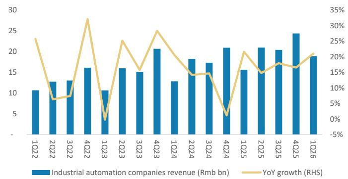

bar-line hybrid

| Quarter | Industrial automation companies revenue (Rmb bn) | YoY growth (%) |
| ------- | ----------------------------------------------- | -------------- |
| 1Q22    | 10.5                                            | 25.0           |
| 2Q22    | 12.8                                            | 8.0            |
| 3Q22    | 13.0                                            | 9.0            |
| 4Q22    | 16.0                                            | 30.0           |
| 1Q23    | 10.5                                            | -5.0           |
| 2Q23    | 16.0                                            | 25.0           |
| 3Q23    | 15.0                                            | 15.0           |
| 4Q23    | 20.5                                            | 25.0           |
| 1Q24    | 12.5                                            | 15.0           |
| 2Q24    | 18.0                                            | 14.0           |
| 3Q24    | 17.5                                            | 14.0           |
| 4Q24    | 20.5                                            | 5.0            |
| 1Q25    | 15.5                                            | 20.0           |
| 2Q25    | 21.0                                            | 15.0           |
| 3Q25    | 20.5                                            | 18.0           |
| 4Q25    | 24.5                                            | 17.0           |
| 1Q26    | 19.0                                            | 20.0           |

Source: NEA, MS

Exhibit 5: Global leading power semi companies' capex declined for 2 years  
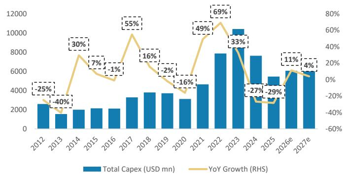

bar-line hybrid

| Year | Total Capex (USD mn) | YoY Growth (%) |
| :--- | :--- | :--- |
| 2012 | 2500 | -25 |
| 2013 | 1600 | -40 |
| 2014 | 2000 | 30 |
| 2015 | 2100 | 7 |
| 2016 | 2000 | -1 |
| 2017 | 3300 | 55 |
| 2018 | 3800 | 16 |
| 2019 | 3700 | -2 |
| 2020 | 3100 | -16 |
| 2021 | 4600 | 49 |
| 2022 | 7900 | 69 |
| 2023 | 10500 | 33 |
| 2024 | 7600 | -27 |
| 2025 | 5400 | -29 |
| 2026e | 6100 | 11 |
| 2027e | 6500 | 4 |

Source: Bloomberg estimates, MS. Note: Capex growth calculated using the sum of STM, On Semi, Infineon, Rohm and Vishay's capex.

Exhibit 6: Capacity additions likely to slow in 2026-28  
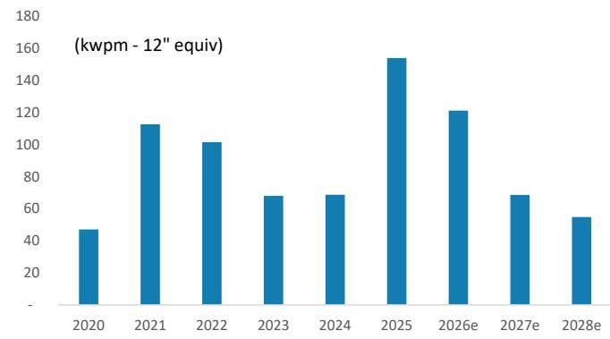

bar chart

(kwpm - 12" equiv)
| Year | Value (kwpm - 12" equiv) |
| :--- | :--- |
| 2020 | 47 |
| 2021 | 113 |
| 2022 | 102 |
| 2023 | 68 |
| 2024 | 69 |
| 2025 | 154 |
| 2026e | 122 |
| 2027e | 69 |
| 2028e | 55 |

Source: Company data, MS estimates

# MOSFET and IGBT monthly price and shipment trends

Exhibit 7: MOSFET: Prices up 1% Y/Y in Apr 2026  
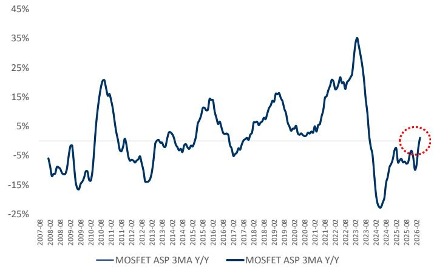

line chart

| Date     | MOSFET ASP 3MA Y/Y |
| -------- | ------------------ |
| 2026-02  | -                  |

Source: WSTS, MS

Exhibit 8: MOSFET: Shipments up 23% Y/Y in Apr 2026  
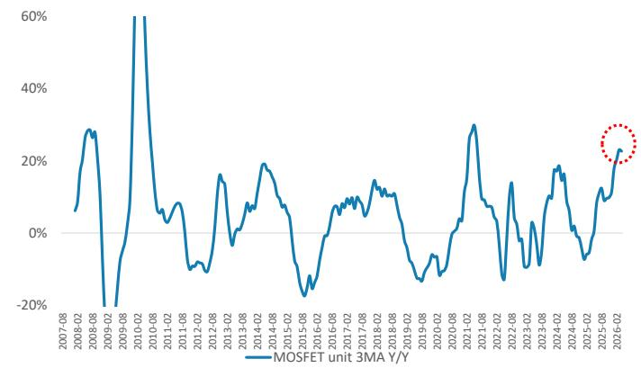

line chart

| Date     | MOSFET unit 3MA Y/Y |
| -------- | ------------------- |
| 2025-06  | ~25%                |

Source: WSTS, MS

Exhibit 9: IGBT: Prices up 1% Y/Y in Apr 2026  
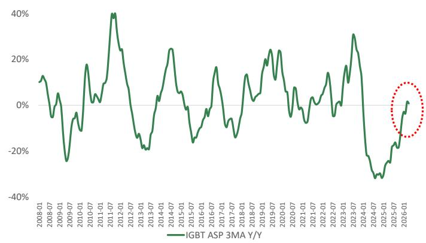

line chart

| Date       | IGBT ASP 3MA Y/Y |
| ---------- | ---------------- |
| 2026-01    | ~0%              |

Source: WSTS, MS

Exhibit 10: IGBT: Shipments increased 17% Y/Y in Apr 2026  
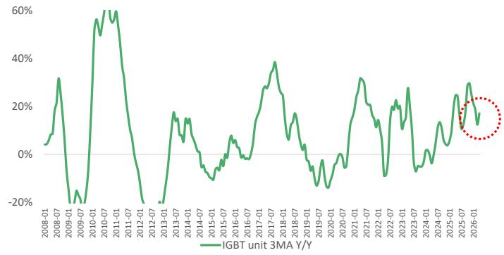

line chart

| Date       | IGBT unit 3MA Y/Y |
| ---------- | ----------------- |
| 2026-01    | ~15%              |

Source: WSTS, MS

## Power Semi Demand and Price Trends

Exhibit 11: We see power semi lead time extending and selective products' pricing up

<table><tr><td>MOSFET</td><td>Company</td><td>Lead time</td><td>Trend</td><td>Pricing</td></tr><tr><td>Small signal MOSFET</td><td>Diodes</td><td>20-42</td><td>+</td><td>+</td></tr><tr><td>Low voltage MOSFET</td><td>On Semi</td><td>10-52</td><td>+</td><td>+</td></tr><tr><td>Low voltage MOSFET</td><td>Infineon</td><td>12-52</td><td>+</td><td>+</td></tr><tr><td>Low voltage MOSFET</td><td>Nexperia</td><td>13-52</td><td>+</td><td>+</td></tr><tr><td>Low voltage MOSFET</td><td>STMicro</td><td>10-23</td><td>+</td><td>=</td></tr><tr><td>Low voltage MOSFET</td><td>Vishay</td><td>12-52</td><td>+</td><td>+</td></tr><tr><td>Low voltage MOSFET</td><td>MCC</td><td>20-36</td><td>+</td><td>=</td></tr><tr><td>High voltage MOSFET</td><td>On Semi</td><td>10-50</td><td>+</td><td>+</td></tr><tr><td>High voltage MOSFET</td><td>Infineon</td><td>12-52</td><td>+</td><td>+</td></tr><tr><td>High voltage MOSFET</td><td>Microchip</td><td>6-28</td><td>+</td><td>+</td></tr><tr><td>High voltage MOSFET</td><td>Rohm</td><td>12-36</td><td>+</td><td>+</td></tr><tr><td>High voltage MOSFET</td><td>STMicro</td><td>12-26</td><td>+</td><td>=</td></tr><tr><td>High voltage MOSFET</td><td>Vishay</td><td>12-52</td><td>+</td><td>+</td></tr><tr><td>High voltage MOSFET</td><td>MCC</td><td>24-52</td><td>+</td><td>=</td></tr></table>

<table><tr><td>IGBT</td><td>Company</td><td>Lead time</td><td>Trend</td><td>Pricing</td></tr><tr><td>IGBT</td><td>On Semi</td><td>12-41</td><td>+</td><td>+</td></tr><tr><td>IGBT</td><td>Infineon</td><td>12-52</td><td>+</td><td>+</td></tr><tr><td>IGBT</td><td>Microchip</td><td>12-26</td><td>=</td><td>=</td></tr><tr><td>IGBT</td><td>STMicro</td><td>12-24</td><td>+</td><td>=</td></tr></table>

Source: Future Electronics, MS

## Risk Reward – Yangjie Technology (300373.SZ)

Auto and overseas capacity expansion to be the dual engine for growth

## PRICE TARGET Rmb136.00

Base case, residual income model - we believe this methodology is best suited to capturing long-term value. We assume an 8.4% cost of equity (beta 1.06, risk-free rate 2.0%, and risk premium 6.0%), a medium-term growth rate of 18%, and a terminal growth rate of 5.5%.

RISK REWARD CHART  
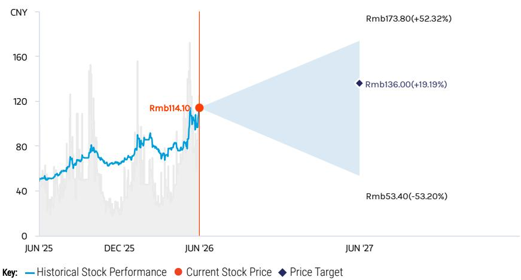

line chart

| Date     | Historical Stock Performance | Current Stock Price | Price Target |
| -------- | ----------------------------- | ------------------- | ------------ |
| JUN '25  | ~50                           | -                   | -            |
| DEC '25  | ~70                           | -                   | -            |
| JUN '26  | ~114.10                       | -                   | -            |
| JUN '27  | -                             | Rmb136.00           | Rmb136.00    |
| Rmb'173.80 | +52.32%                      | -                   | -            |
| Rmb'53.40 | -53.20%                      | -                   | -            |

Source: Refinitiv, MS

## OVERWEIGHT THESIS

■ Yangjie is a quality company that we expect to outperform relative to its power semi peers.  
■ Overseas packaging and foundry capacity expansion is ongoing. We expect its fab in Vietnam to add growth and gain orders from overseas customers.  
■ We expect Yangjie's GM to continue to improve as its product selling prices are stabilizing, auto business is increasing in the mix, and operational efficiency continues to improve.  
■ We view valuation as attractive.

Consensus Rating Distribution  
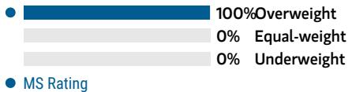

bar chart

| Metric       | Value |
| ------------ | ----- |
| Overweight   | 100%  |
| Equal-weight | 0%    |
| Underweight  | 0%    |
| MS Rating    | 100%  |

Source: Refinitiv, MS

## Risk Reward Themes

Electric Vehicles: Positive

Secular Growth: Positive

View descriptions of Risk Rewards Themes here

## BULL CASE

## 42x 2027e P/E

Yangjie achieves several breakthroughs in the auto end market and increases its exposure with margin improvement. Our assumptions include: 1) a revenue CAGR of 30% in 2025-28e and 2) GPM expanding to 40% in 2026-28e.

## Rmb173.80

## BASE CASE

## 33x 2027e P/E

Yangjie continues to gain share in existing markets and expand MOSFET and IGBT revenue. Our assumptions include: 1) a revenue CAGR of 24% in 2025-28e; 2) stable GPM of 36% in 2026-28e.

## Rmb136.00

## BEAR CASE

## Rmb53.40

## 13x 2027e P/E

The global economy heads into recession, resulting in slowing discrete content growth. Our assumptions include: 1) a revenue CAGR of 8% in 2025-28e and 2) GPM declining to 20-25% in 2026-28e.

## Risk Reward – Yangjie Technology (300373.SZ)

KEY EARNINGS INPUTS

<table><tr><td>Drivers</td><td>2025</td><td>2026e</td><td>2027e</td><td>2028e</td></tr><tr><td>Semi module revenue growth (%)</td><td>20.2</td><td>25.7</td><td>21.6</td><td>26.3</td></tr><tr><td>Semi module ASP growth (%)</td><td>(8.6)</td><td>3.6</td><td>4.1</td><td>4.1</td></tr><tr><td>Overall gross margin (%)</td><td>34.3</td><td>36.1</td><td>35.8</td><td>37.2</td></tr></table>

## INVESTMENT DRIVERS

- Structural demand from China's power semi localization  
• Power semi content growth  
• Auto and solar market demand

## GLOBAL REVENUE EXPOSURE

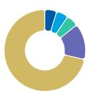

0-10%

APAC, ex Japan, Mainland China and India

0-10%

Japan

0-10%

North America

10-20°

Europe ex UK

70-80%

Mainland China

Source: MS Estimate

View explanation of regional hierarchies here

## RISKS TO PT/RATING

## RISKS TO UPSIDE

- Faster-than-expected share gains in China's discrete market  
- Launches of more auto discrete products with higher margins  
• Favorable pricing resulting from shortages

## RISKS TO DOWNSIDE

- Slower-than-expected market share gains in China's discrete market  
- Limited technology upgrades, falling behind local peers  
- Global economic recession, leading to a decline in discrete shipments

## OWNERSHIP POSITIONING

Inst. Owners, % Active

89.2%

Source: Refinitiv, MS

## MS ESTIMATES VS. CONSENSUS

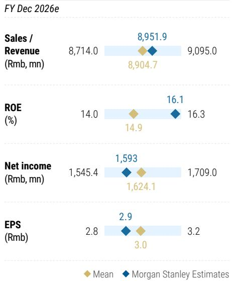

bar-line hybrid chart

FY Dec 2026e
| Metric | Mean (Rmb mn) | MS Estimates |
| :--- | :--- | :--- |
| Sales / Revenue | 8,714.0 | 8,951.9 |
| Sales / Revenue (Rmb, mn) | 8,904.7 | 9,095.0 |
| ROE (%) | 14.0 | 16.1 |
| ROE (%) | 14.9 | 16.3 |
| Net income (Rmb, mn) | 1,545.4 | 1,593 |
| Net income (Rmb, mn) | 1,624.1 | 1,709.0 |
| EPS (Rmb) | 2.8 | 2.9 |
| EPS (Rmb) | 3.0 | 3.2 |

Source: Refinitiv, MS

## Yangjie: Financial Summary

Exhibit 12: Yangjie: Financial Summary  
Income Statement

<table><tr><td>RMB$ mn (Years End Dec )</td><td>2025</td><td>2026E</td><td>2027E</td><td>2028E</td></tr><tr><td>Net sales</td><td>7,130</td><td>8,952</td><td>10,889</td><td>13,622</td></tr><tr><td>COGS</td><td>(4,686)</td><td>(5,718)</td><td>(6,990)</td><td>(8,548)</td></tr><tr><td>Gross profit</td><td>2,444</td><td>3,234</td><td>3,899</td><td>5,074</td></tr><tr><td>Operating expenses</td><td>(1,152)</td><td>(1,346)</td><td>(1,394)</td><td>(1,675)</td></tr><tr><td>Operating income</td><td>1,292</td><td>1,888</td><td>2,505</td><td>3,398</td></tr><tr><td>Non-operating income</td><td>128</td><td>(20)</td><td>120</td><td>120</td></tr><tr><td>Pre-tax income</td><td>1,420</td><td>1,869</td><td>2,625</td><td>3,518</td></tr><tr><td>Income tax</td><td>175</td><td>282</td><td>394</td><td>528</td></tr><tr><td>Minority Interest</td><td>(14)</td><td>(6)</td><td>0</td><td>0</td></tr><tr><td>Reported net Income</td><td>1,259</td><td>1,593</td><td>2,232</td><td>2,991</td></tr><tr><td>Adj.wtd. avg.shrs(m)</td><td>543.0</td><td>543.0</td><td>543.0</td><td>543.0</td></tr><tr><td>Reported EPS (Rmb)</td><td>2.32</td><td>2.93</td><td>4.11</td><td>5.51</td></tr><tr><td>EPS for consensus (Rmb)</td><td>2.32</td><td>2.93</td><td>4.11</td><td>5.51</td></tr></table>

Balance Sheet

<table><tr><td>RMB$mn (Years End Dec )</td><td>2025</td><td>2026E</td><td>2027E</td><td>2028E</td></tr><tr><td>Cash</td><td>4,162</td><td>3,946</td><td>4,634</td><td>5,466</td></tr><tr><td>Mkt Securities</td><td>561</td><td>561</td><td>561</td><td>561</td></tr><tr><td>AR/NR</td><td>1,873</td><td>2,367</td><td>2,879</td><td>3,602</td></tr><tr><td>Inventory</td><td>1,632</td><td>1,744</td><td>2,132</td><td>2,607</td></tr><tr><td>Other</td><td>483</td><td>483</td><td>483</td><td>483</td></tr><tr><td>Current Assets</td><td>8,711</td><td>9,101</td><td>10,689</td><td>12,719</td></tr><tr><td>Long-term investments</td><td>759</td><td>929</td><td>1,099</td><td>1,269</td></tr><tr><td>Fixed assets</td><td>6,038</td><td>7,024</td><td>7,794</td><td>8,892</td></tr><tr><td>Deferred assets</td><td>42</td><td>42</td><td>42</td><td>42</td></tr><tr><td>Other assets</td><td>1,133</td><td>1,133</td><td>1,133</td><td>1,133</td></tr><tr><td>Total Assets</td><td>16,684</td><td>18,229</td><td>20,757</td><td>24,055</td></tr><tr><td>S/T borrowings</td><td>2,075</td><td>2,075</td><td>2,075</td><td>2,075</td></tr><tr><td>AP/NP</td><td>2,541</td><td>2,766</td><td>3,381</td><td>4,134</td></tr><tr><td>Other ST liabilities</td><td>1,255</td><td>1,255</td><td>1,255</td><td>1,255</td></tr><tr><td>LT debt</td><td>358</td><td>358</td><td>358</td><td>358</td></tr><tr><td>Other LT liabilities</td><td>561</td><td>561</td><td>561</td><td>561</td></tr><tr><td>Common shares</td><td>543</td><td>543</td><td>543</td><td>543</td></tr><tr><td>Total Liabilities</td><td>6,791</td><td>7,015</td><td>7,630</td><td>8,384</td></tr><tr><td>Additional capital</td><td>3,963</td><td>3,963</td><td>3,963</td><td>3,963</td></tr><tr><td>Retained earning</td><td>4,761</td><td>6,082</td><td>7,395</td><td>10,539</td></tr><tr><td>Other shareholders&#x27; equity</td><td>625</td><td>625</td><td>625</td><td>625</td></tr><tr><td>Total Equity</td><td>9,893</td><td>11,214</td><td>13,127</td><td>15,671</td></tr><tr><td>Total Liab. &amp; Shrhldr&#x27;s Equity</td><td>16,684</td><td>18,229</td><td>20,757</td><td>24,055</td></tr></table>

E = MS Estimates  
Source: MS, Company Data

Cash Flow Statement

<table><tr><td>RMB$mn (Years End Dec )</td><td>2025</td><td>2026E</td><td>2027E</td><td>2028E</td></tr><tr><td>Cashflow from Operations</td><td>1,703</td><td>1,747</td><td>2,483</td><td>3,083</td></tr><tr><td>Net profits</td><td>1,259</td><td>1,593</td><td>2,232</td><td>2,991</td></tr><tr><td>Depreciation</td><td>603</td><td>521</td><td>521</td><td>521</td></tr><tr><td>Working Capital Change</td><td>(59)</td><td>(382)</td><td>(285)</td><td>(444)</td></tr><tr><td>Other adjustments</td><td>(100)</td><td>16</td><td>16</td><td>16</td></tr><tr><td>Cashflow from Investing</td><td>(1,862)</td><td>(1,692)</td><td>(1,477)</td><td>(1,805)</td></tr><tr><td>Capex</td><td>(1,019)</td><td>(1,522)</td><td>(1,307)</td><td>(1,635)</td></tr><tr><td>Change of LT Investment</td><td>0</td><td>(170)</td><td>(170)</td><td>(170)</td></tr><tr><td>Change of ST Investment</td><td>0</td><td>0</td><td>0</td><td>0</td></tr><tr><td>Other adjustments</td><td>(843)</td><td>0</td><td>0</td><td>0</td></tr><tr><td>Cashflow from financing</td><td>28</td><td>(272)</td><td>(319)</td><td>(446)</td></tr><tr><td>Increase in L/T debt</td><td>(166)</td><td>0</td><td>0</td><td>0</td></tr><tr><td>Increase in S/T debt</td><td>1,019</td><td>0</td><td>0</td><td>0</td></tr><tr><td>Cash Dividend Paid</td><td>(510)</td><td>(272)</td><td>(319)</td><td>(446)</td></tr><tr><td>Issuance of stock</td><td>0</td><td>0</td><td>0</td><td>0</td></tr><tr><td>Other adjustments</td><td>(316)</td><td>0</td><td>0</td><td>0</td></tr><tr><td>Exchange rate adjustment</td><td>351</td><td>0</td><td>0</td><td>0</td></tr><tr><td>Net change in cash</td><td>220</td><td>(216)</td><td>688</td><td>832</td></tr></table>

Financial Ratios

<table><tr><td></td><td>2025</td><td>2026E</td><td>2027E</td><td>2028E</td></tr><tr><td colspan="5">Growth(%)</td></tr><tr><td>Turnover</td><td>18.2</td><td>25.5</td><td>21.6</td><td>25.1</td></tr><tr><td>Operating profits</td><td>30.6</td><td>46.2</td><td>32.7</td><td>35.6</td></tr><tr><td>Pretax profits</td><td>21.4</td><td>31.6</td><td>40.5</td><td>34.0</td></tr><tr><td>Net profits</td><td>25.6</td><td>26.5</td><td>40.1</td><td>34.0</td></tr><tr><td>EPS</td><td>25.6</td><td>26.5</td><td>40.1</td><td>34.0</td></tr><tr><td colspan="5">Margins (%)</td></tr><tr><td>Gross Margin</td><td>34.3</td><td>36.1</td><td>35.8</td><td>37.2</td></tr><tr><td>Operating Margin</td><td>18.1</td><td>21.1</td><td>23.0</td><td>24.9</td></tr><tr><td>Pretax Margin</td><td>19.9</td><td>20.9</td><td>24.1</td><td>25.8</td></tr><tr><td>Net Profit</td><td>17.7</td><td>17.8</td><td>20.5</td><td>22.0</td></tr><tr><td colspan="5">Return (%)</td></tr><tr><td>ROAE</td><td>13.2</td><td>15.1</td><td>18.3</td><td>20.8</td></tr><tr><td>ROAA</td><td>8.1</td><td>9.1</td><td>11.4</td><td>13.3</td></tr><tr><td colspan="5">Gearing (%)</td></tr><tr><td>Net Debt/Equity</td><td>(21.1)</td><td>(16.7)</td><td>(19.5)</td><td>(21.6)</td></tr><tr><td>Liabilities/Equity</td><td>68.6</td><td>62.6</td><td>58.1</td><td>53.5</td></tr><tr><td colspan="5">Ratios (X)</td></tr><tr><td>Current ratio</td><td>1.5</td><td>1.5</td><td>1.6</td><td>1.7</td></tr><tr><td>Quick ratio</td><td>1.0</td><td>1.0</td><td>1.1</td><td>1.2</td></tr><tr><td colspan="5">Others</td></tr><tr><td>AR/INR Turnover (days)</td><td>97</td><td>97</td><td>97</td><td>97</td></tr><tr><td>Inventory Turnover (days)</td><td>111</td><td>111</td><td>111</td><td>111</td></tr><tr><td>AP Turnover (days)</td><td>177</td><td>177</td><td>177</td><td>177</td></tr><tr><td>Cash Conversion (days)</td><td>31</td><td>31</td><td>31</td><td>31</td></tr></table>

Source: Company data, MS estimates

## Risk Reward – China Resources Microelectronics Limited (688396.SS)

Demanding valuation and depreciation weigh on earnings

## PRICE TARGET Rmb51.60

Base case, residual income model - we believe this methodology best captures the stock's long-term value. We assume an 8.2% cost of equity (beta 1.04, risk-free rate 2.0% and risk premium 6.0%), a payout ratio of 20%, a medium-term growth rate of 19.0%, and a terminal growth rate of 5.5%.

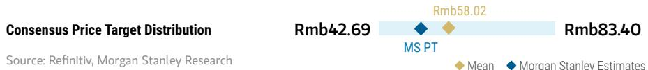

bar-line hybrid chart

| Consensus Price Target | Value   |
| ----------------------- | ------- |
| Rmb42.69                | Rmb42.69 |
| Rmb58.02                | Rmb58.02 |
| Rmb83.40                | Rmb83.40 |
Source: Refinitiv, MS

RISK REWARD CHART  
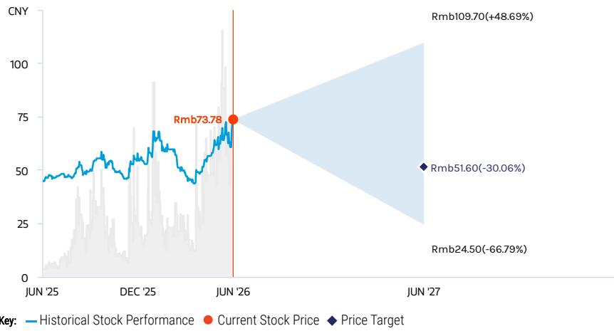

line chart

| Date    | Historical Stock Performance | Current Stock Price | Price Target |
|---------|-------------------------------|---------------------|--------------|
| JUN '25 | ~45                           | -                   | -            |
| DEC '25 | ~60                           | -                   | -            |
| JUN '26 | ~73.78                        | Rmb73.78            | -            |
| JUN '27 | -                             | Rmb109.70(+48.69%) | Rmb51.60(-30.06%) |

Source: Refinitiv, MS

## UNDERWEIGHT THESIS

We expect CR Micro to benefit from a favorable pricing environment for power semiconductors in 2026. The company also stands out as a key beneficiary of China's MOSFET localization trend.  
■ Investment losses from the Chongqing and Shenzhen fabs continue to weigh on earnings.  
■ While the company leads peers in the outsourcing order opportunity with YMTC, we expect profitability from this project to take time and view the current valuation as stretched.

Consensus Rating Distribution  
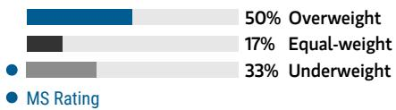

bar chart

| Category | Value (%) |
|---|---|
| Overweight | 50 |
| Equal-weight | 17 |
| Underweight | 33 |
| MS Rating | (not labeled but visually present in the image) |

Source: Refinitiv, MS

## Risk Reward Themes

Contrarian: Negative Pricing Power: Positive

View descriptions of Risk Rewards Themes here

## BULL CASE

## 62x 2027e base case EPS

Stronger sales growth with faster OPM improvement: 1) Revenue CAGR of 30% in 2025-28; 2) OPM expands to 20% in 2026-28 from 9% in 2025; 3) Potential M&A opportunities with support from CR Group.

## Rmb109.70

## BASE CASE

## 29x 2027e base case EPS

Steady revenue growth with OPM expansion: 1) Revenue CAGR of 19% in 2025-28; 2) OPM improves to 16% in 2026-28 from 9% in 2025.

## Rmb51.60

## BEAR CASE

## Rmb24.50

## 14x 2027e base case EPS

No sales growth with decreased OPM: 1) Revenue CAGR of 9% in 2025-28; 2) OPM falls to 7% in 2026-28 from 9% in 2025.

# Risk Reward – China Resources Microelectronics Limited (688396.SS)

KEY EARNINGS INPUTS

<table><tr><td>Drivers</td><td>2025</td><td>2026e</td><td>2027e</td><td>2028e</td></tr><tr><td>Production and service (Foundry + OSAT) (Rmb, mn)</td><td>4,793</td><td>5,948</td><td>7,834</td><td>10,416</td></tr><tr><td>Product and solution (Rmb, mn)</td><td>6,028</td><td>6,988</td><td>7,494</td><td>8,406</td></tr></table>

## INVESTMENT DRIVERS

- Better revenue momentum thanks to increasing demand  
• Structural demand from China's MOSFET market  
- Steady R&D investment results in product specifications similar to those of global IDM players

## GLOBAL REVENUE EXPOSURE

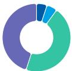

0-10% Latin America  
0-10% North America  
40-50% APAC, ex Japan, Mainland China and India  
40-50% Mainland China

Source: MS Estimate View explanation of regional hierarchies here

## MS ALPHA MODELS

4/5

MOST

3 Month

Horizon

Source: Refinitiv, FactSet, MS; 1 is the highest favored Quintile and 5 is the least favored Quintile

## RISKS TO PT/RATING

## RISKS TO UPSIDE

- China's MOSFET self-sufficiency rate is higher than expected.  
• MOSFET content per car for EVs rises.

## RISKS TO DOWNSIDE

- China's MOSFET self-sufficiency rate is lower than expected.  
- MOSFET content per car for EVs decreases.  
- Local peers exert pricing pressure.

## OWNERSHIP POSITIONING

Inst. Owners, % Active

88.4%

Source: Refinitiv, MS

## MS ESTIMATES VS. CONSENSUS

FY Dec 2027e

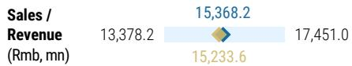

EBIT

(Rmb, mn) Note: There are not sufficient brokers supplying consensus data for this metric

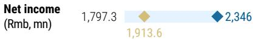

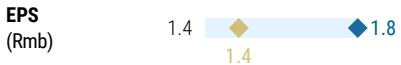

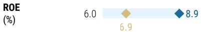

♦ MS Estimates

Source: Refinitiv, MS

## CR Microelectronics: Financial Summary

Exhibit 13: CR Micro: Financial Summary  
Income Statement

<table><tr><td>RMB mn (Years End Dec )</td><td>2025</td><td>2026E</td><td>2027E</td><td>2028E</td></tr><tr><td>Net sales</td><td>11,054</td><td>12,996</td><td>15,368</td><td>18,861</td></tr><tr><td>COGS</td><td>(8,137)</td><td>(9,313)</td><td>(10,535)</td><td>(12,807)</td></tr><tr><td>Gross profit</td><td>2,916</td><td>3,683</td><td>4,833</td><td>6,054</td></tr><tr><td>Operating expenses</td><td>(1,916)</td><td>(1,974)</td><td>(2,286)</td><td>(2,620)</td></tr><tr><td>Operating income</td><td>1,000</td><td>1,709</td><td>2,547</td><td>3,434</td></tr><tr><td>Non-operating income</td><td>(278)</td><td>(40)</td><td>(120)</td><td>(50)</td></tr><tr><td>Pre-tax income</td><td>722</td><td>1,669</td><td>2,427</td><td>3,384</td></tr><tr><td>Income tax</td><td>168</td><td>154</td><td>121</td><td>169</td></tr><tr><td>Minority Interest</td><td>(106)</td><td>(58)</td><td>(40)</td><td>(40)</td></tr><tr><td>Reported net Income</td><td>661</td><td>1,573</td><td>2,346</td><td>3,254</td></tr><tr><td>Adj. wtd. avg. shrs ( m)</td><td>1,327.5</td><td>1,328.2</td><td>1,328.2</td><td>1,328.2</td></tr><tr><td>Reported EPS (Rmb)</td><td>0.50</td><td>1.19</td><td>1.78</td><td>2.47</td></tr><tr><td>Modelware EPS (Rmb)</td><td>0.50</td><td>1.19</td><td>1.78</td><td>2.47</td></tr></table>

Balance Sheet

<table><tr><td>RMBmn (Years End Dec )</td><td>2025</td><td>2026E</td><td>2027E</td><td>2028E</td></tr><tr><td>Cash</td><td>9,552</td><td>8,722</td><td>8,225</td><td>8,193</td></tr><tr><td>Mkt Securities</td><td>1</td><td>1</td><td>1</td><td>1</td></tr><tr><td>AR/NR</td><td>2,975</td><td>3,157</td><td>3,733</td><td>4,581</td></tr><tr><td>Inventory</td><td>2,279</td><td>2,504</td><td>2,832</td><td>3,443</td></tr><tr><td>Other</td><td>227</td><td>227</td><td>227</td><td>227</td></tr><tr><td>Current Assets</td><td>15,035</td><td>14,612</td><td>15,019</td><td>16,446</td></tr><tr><td>Long-term investments</td><td>5,441</td><td>5,441</td><td>5,441</td><td>5,441</td></tr><tr><td>Fixed assets</td><td>8,106</td><td>10,106</td><td>12,106</td><td>14,106</td></tr><tr><td>Deferred assets</td><td>187</td><td>187</td><td>187</td><td>187</td></tr><tr><td>Other assets</td><td>1,820</td><td>1,820</td><td>1,820</td><td>1,820</td></tr><tr><td>Total Assets</td><td>30,590</td><td>32,167</td><td>34,574</td><td>38,001</td></tr><tr><td>S/T borrowings</td><td>68</td><td>68</td><td>68</td><td>68</td></tr><tr><td>AP/NP</td><td>1,604</td><td>1,676</td><td>1,895</td><td>2,304</td></tr><tr><td>Other ST liabilities</td><td>3,430</td><td>3,430</td><td>3,430</td><td>3,430</td></tr><tr><td>LT debt</td><td>0</td><td>0</td><td>0</td><td>0</td></tr><tr><td>Other LT liabilities</td><td>621</td><td>621</td><td>621</td><td>621</td></tr><tr><td>Common shares</td><td>1,225</td><td>1,225</td><td>1,225</td><td>1,225</td></tr><tr><td>Total Liabilities</td><td>5,723</td><td>5,795</td><td>6,014</td><td>6,423</td></tr><tr><td>Additional capital</td><td>14,474</td><td>14,474</td><td>14,474</td><td>14,474</td></tr><tr><td>Retained earning</td><td>6,960</td><td>8,465</td><td>10,653</td><td>13,671</td></tr><tr><td>Other shareholders&#x27; equity</td><td>2,209</td><td>2,209</td><td>2,209</td><td>2,209</td></tr><tr><td>Total Equity</td><td>24,867</td><td>26,372</td><td>28,559</td><td>31,578</td></tr><tr><td>Total Liab. &amp; Shrhldr&#x27;s Equity</td><td>30,590</td><td>32,167</td><td>34,574</td><td>38,001</td></tr></table>

E = MS Estimates  
Source: MS, Company Data

Cash Flow Statement

<table><tr><td>RMBmn (Years End Dec )</td><td>2025</td><td>2026E</td><td>2027E</td><td>2028E</td></tr><tr><td>Cashflow from Operations</td><td>2,085</td><td>1,238</td><td>1,661</td><td>2,204</td></tr><tr><td>Net profits</td><td>661</td><td>1,573</td><td>2,346</td><td>3,254</td></tr><tr><td>Depreciation</td><td>0</td><td>0</td><td>0</td><td>0</td></tr><tr><td>Working Capital Change</td><td>489</td><td>(335)</td><td>(685)</td><td>(1,051)</td></tr><tr><td>Other adjustments</td><td>935</td><td>0</td><td>0</td><td>0</td></tr><tr><td>Cashflow from Investing</td><td>(1,509)</td><td>(2,000)</td><td>(2,000)</td><td>(2,000)</td></tr><tr><td>Capex</td><td>(1,508)</td><td>(2,000)</td><td>(2,000)</td><td>(2,000)</td></tr><tr><td>Change of LT Investment</td><td>133</td><td>0</td><td>0</td><td>0</td></tr><tr><td>Change of ST Investment</td><td>4</td><td>0</td><td>0</td><td>0</td></tr><tr><td>Other adjustments</td><td>(138)</td><td>0</td><td>0</td><td>0</td></tr><tr><td>Cashflow from financing</td><td>236</td><td>(68)</td><td>(158)</td><td>(236)</td></tr><tr><td>Increase in L/T debt</td><td>224</td><td>0</td><td>0</td><td>0</td></tr><tr><td>Increase in S/T debt</td><td>160</td><td>0</td><td>0</td><td>0</td></tr><tr><td>Cash Dividend Paid</td><td>(115)</td><td>(68)</td><td>(158)</td><td>(236)</td></tr><tr><td>Issuance of stock</td><td>160</td><td>0</td><td>0</td><td>0</td></tr><tr><td>Other adjustments</td><td>(194)</td><td>0</td><td>0</td><td>0</td></tr><tr><td>Exchange rate adjustment</td><td>57</td><td>0</td><td>0</td><td>0</td></tr><tr><td>Net change in cash</td><td>869</td><td>(829)</td><td>(497)</td><td>(32)</td></tr></table>

Financial Ratios

<table><tr><td></td><td>2025</td><td>2026E</td><td>2027E</td><td>2028E</td></tr><tr><td colspan="5">Growth(%)</td></tr><tr><td>Turnover</td><td>9.2</td><td>17.6</td><td>18.2</td><td>22.7</td></tr><tr><td>Operating profits</td><td>10.8</td><td>70.8</td><td>49.0</td><td>34.8</td></tr><tr><td>Pretax profits</td><td>-9.1</td><td>131.0</td><td>45.4</td><td>39.4</td></tr><tr><td>Net profits</td><td>-13.4</td><td>138.1</td><td>49.1</td><td>38.8</td></tr><tr><td>EPS</td><td>-19.9</td><td>138.1</td><td>49.1</td><td>38.8</td></tr><tr><td colspan="5">Margins (%)</td></tr><tr><td>Gross Margin</td><td>26.4</td><td>28.3</td><td>31.5</td><td>32.1</td></tr><tr><td>Operating Margin</td><td>9.1</td><td>13.1</td><td>16.6</td><td>18.2</td></tr><tr><td>Pretax Margin</td><td>6.5</td><td>12.8</td><td>15.8</td><td>17.9</td></tr><tr><td>Net Profit</td><td>6.0</td><td>12.1</td><td>15.3</td><td>17.3</td></tr><tr><td colspan="5">Return (%)</td></tr><tr><td>ROAE</td><td>2.7</td><td>6.1</td><td>8.5</td><td>10.8</td></tr><tr><td>ROAA</td><td>2.2</td><td>5.0</td><td>7.0</td><td>9.0</td></tr><tr><td colspan="5">Gearing (%)</td></tr><tr><td>Net Debt/Equity</td><td>(38.1)</td><td>(32.8)</td><td>(28.6)</td><td>(25.7)</td></tr><tr><td>Liabilities/Equity</td><td>23.0</td><td>22.0</td><td>21.1</td><td>20.3</td></tr><tr><td colspan="5">Ratios (X)</td></tr><tr><td>Current ratio</td><td>2.9</td><td>2.8</td><td>2.8</td><td>2.8</td></tr><tr><td>Quick ratio</td><td>2.5</td><td>2.3</td><td>2.2</td><td>2.2</td></tr><tr><td colspan="5">Others</td></tr><tr><td>AR/NR Turnover (days)</td><td>89</td><td>89</td><td>89</td><td>89</td></tr><tr><td>Inventory Turnover (days)</td><td>98</td><td>98</td><td>98</td><td>98</td></tr><tr><td>AP Turnover (days)</td><td>66</td><td>66</td><td>66</td><td>66</td></tr><tr><td>Cash Conversion (days)</td><td>121</td><td>121</td><td>121</td><td>121</td></tr></table>

Source: Company data, MS estimates

## Risk Reward – Hangzhou Silan Microelectronics Co. Ltd. (600460.SS)

Valuation looks overpriced after rally

## PRICE TARGET Rmb26.90

Base case, residual income model. We believe this methodology best captures the stock's long-term value. We assume an 8.6% cost of equity (beta 1.1, risk-free rate 2.0% and risk premium 6.0%), a payout ratio of 20%, a medium-term growth rate of 18.0% and a terminal growth rate of 5.5%, all of which are in line with that of other Chinese power semi companies in our coverage.

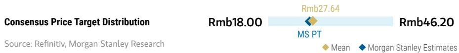

bar-line hybrid chart

| Category       | Value   |
| -------------- | ------- |
| Rmb18.00       | Rmb18.00 |
| Rmb27.64       | Rmb27.64 |
| Rmb46.20       | Rmb46.20 |
Source: Refinitiv, MS

RISK REWARD CHART  
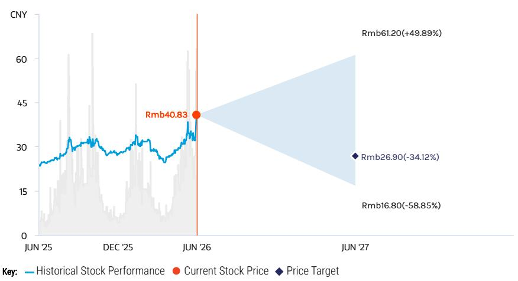

line chart

| Date    | Historical Stock Performance | Current Stock Price | Price Target |
|---------|-------------------------------|---------------------|--------------|
| JUN '25 | ~25                           | -                   | -            |
| DEC '25 | ~30                           | -                   | -            |
| JUN '26 | ~40.83                        | Rmb40.83            | -            |
| JUN '27 | -                             | Rmb61.20(+49.89%)   | Rmb26.90(-34.12%) |
|       | -                             | Rmb16.80(-58.85%)   | -            |

Source: Refinitiv, MS

## UNDERWEIGHT THESIS

■ We view Silan as a key beneficiary of China's power semi localization trend, but interest expense and depreciation costs weigh on earnings.  
■ We expect operating margin of around 10% for 2026, with limited operating leverage benefit despite full utilization.  
■ On our estimates, valuation looks demanding at 4.8x 2026 BVPS, vs. the past three year historical average of 3.3x.

Consensus Rating Distribution  
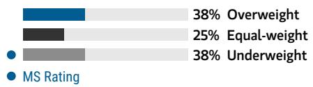

bar chart

| Category | Value (%) |
|---|---|
| Overweight | 38 |
| Equal-weight | 25 |
| Underweight | 38 |
| MS Rating | (not labeled) |

Source: Refinitiv, MS

## Risk Reward Themes

Self-help: Negative

View descriptions of Risk Rewards Themes here

## BULL CASE

## 50x 2027e base-case EPS

Stronger sales growth with faster GPM improvement: We assume: 1) a revenue CAGR of 28% in 2025-28e; 2) gross margin expands to 30% in 2026-28 from 19% in 2025. Chinese auto OEMs adopt Silan Micro's IGBT or SiC module, and inverter-type home appliances penetration rises more rapidly.

## Rmb61.20

## BASE CASE

## 22x 2027e base-case EPS

Modest sales growth with low GPM: We expect: 1) a revenue CAGR of 16% in 2025-28e; 2) gross margin stays at 23% in 2026-28. More Chinese auto OEMs adopt Silan Micro's IGBT and SiC module, and there is a gradual increase in penetration of inverter-type home appliances.

## Rmb26.90

## BEAR CASE

## Rmb16.80

## 14x 2027e base-case EPS

Slow sales growth with gross margin decline: We assume: 1) a revenue CAGR of 6% in 2025-28e; 2) gross margin falls to 15% due to price declines and strong competition in 2026. Chinese auto OEMs' adoption of Silan Micro's IGBT SiC module is limited, and penetration of inverter-type home appliances does not increase.

## Risk Reward – Hangzhou Silan Microelectronics Co. Ltd. (600460.SS)

KEY EARNINGS INPUTS

<table><tr><td>Drivers</td><td>2025</td><td>2026e</td><td>2027e</td><td>2028e</td></tr><tr><td>IPM revenue growth (%)</td><td>25.3</td><td>14.4</td><td>12.1</td><td>10.5</td></tr><tr><td>IPM shipment growth (%)</td><td>47.1</td><td>25.0</td><td>15.0</td><td>15.0</td></tr><tr><td>Discrete semis gross margin (%)</td><td>12.2</td><td>19.1</td><td>23.0</td><td>23.7</td></tr><tr><td>Power IC gross margin (%)</td><td>31.6</td><td>28.3</td><td>29.0</td><td>29.0</td></tr></table>

## INVESTMENT DRIVERS

• 8-inch and 12-inch capacity expansion  
- Technology improvement in IGBT modules and MOSFET  
- Customer wins among Chinese auto OEMs

## GLOBAL REVENUE EXPOSURE

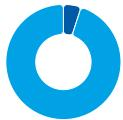

0-10%

APAC, ex Japan, Mainland China and India

90-100

% Mainland China

Source: MS Estimate View explanation of regional hierarchies here

## MS ALPHA MODELS

4/5

MOST

3 Month

Horizon

Source: Refinitiv, FactSet, MS; 1 is the highest favored Quintile and 5 is the least favored Quintile

## RISKS TO PT/RATING

## RISKS TO UPSIDE

• Stronger demand from faster-than-expected EV penetration increase  
- More market share gains from global peers in home appliance IPM  
- Faster-than-expected capacity expansion  
- Technology breakthrough in SiC and GaN that leads to cost reduction

## RISKS TO DOWNSIDE

- Weak demand due to economic recession  
- Slower-than-expected capacity expansion  
• No improvement in technology

## OWNERSHIP POSITIONING

Inst. Owners, % Active

92.1%

Source: Refinitiv, MS

## MS ESTIMATES VS. CONSENSUS

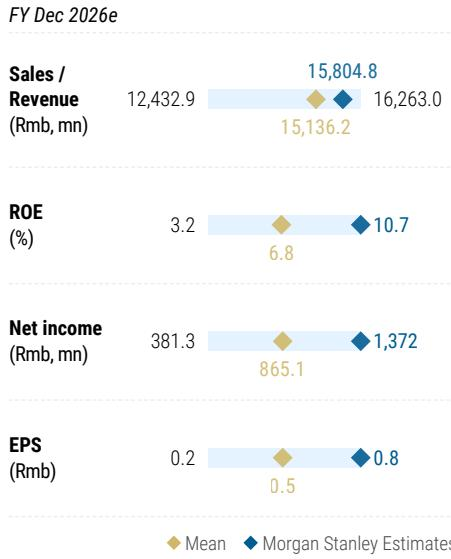

bar-line hybrid chart

FY Dec 2026e
| Metric | Mean (Rmb mn) | MS Estimates (Rmb mn) |
| :--- | :--- | :--- |
| Sales / Revenue | 12,432.9 | 15,804.8 |
| Sales / Revenue (ROE %) | 3.2 | 10.7 |
| Net income (Rmb mn) | 381.3 | 1,372 |
| Net income (Rmb mn) EPS (Rmb) | 0.2 | 0.8 |
| Sales / Revenue (Rmb, mn) | 15,136.2 | 16,263.0 |
| ROE (%) | 6.8 | 10.7 |
| Net income (Rmb, mn) | 865.1 | 1,372 |
| EPS (Rmb) | 0.5 | 0.8 |

Source: Refinitiv, MS

# Silan Micro: Financial Summary

Exhibit 14: Silan Micro: Financial Summary  
Income Statement

<table><tr><td>RMB$ mn (Years End Dec )</td><td>2025</td><td>2026E</td><td>2027E</td><td>2028E</td></tr><tr><td>Net sales</td><td>13,052</td><td>15,805</td><td>18,063</td><td>20,443</td></tr><tr><td>COGS</td><td>(10,593)</td><td>(12,414)</td><td>(13,710)</td><td>(15,402)</td></tr><tr><td>Gross profit</td><td>2,458</td><td>3,390</td><td>4,353</td><td>5,041</td></tr><tr><td>Operating expenses</td><td>(1,787)</td><td>(1,731)</td><td>(2,059)</td><td>(2,076)</td></tr><tr><td>Operating income</td><td>671</td><td>1,659</td><td>2,294</td><td>2,965</td></tr><tr><td>Non-operating income</td><td>(533)</td><td>(346)</td><td>(198)</td><td>(198)</td></tr><tr><td>Pre-tax income</td><td>138</td><td>1,313</td><td>2,096</td><td>2,767</td></tr><tr><td>Income tax</td><td>(1)</td><td>204</td><td>314</td><td>415</td></tr><tr><td>Minority Interest</td><td>260</td><td>262</td><td>262</td><td>262</td></tr><tr><td>Reported net Income</td><td>399</td><td>1,372</td><td>2,043</td><td>2,614</td></tr><tr><td>Adj. wtd. avg. shrs(m)</td><td>1,664.1</td><td>1,664.1</td><td>1,664.1</td><td>1,664.1</td></tr><tr><td>Reported EPS (Rmb)</td><td>0.24</td><td>0.82</td><td>1.23</td><td>1.57</td></tr><tr><td>Modelw are EPS (Rmb)</td><td>0.24</td><td>0.82</td><td>1.23</td><td>1.57</td></tr></table>

Balance Sheet

<table><tr><td>RMB$mn (Years End Dec )</td><td>2025</td><td>2026E</td><td>2027E</td><td>2028E</td></tr><tr><td>Cash</td><td>5,036</td><td>8,097</td><td>11,687</td><td>15,482</td></tr><tr><td>Mkt Securities</td><td>0</td><td>0</td><td>0</td><td>0</td></tr><tr><td>AR/NR</td><td>3,531</td><td>4,013</td><td>4,586</td><td>5,131</td></tr><tr><td>Inventory</td><td>3,882</td><td>4,559</td><td>5,036</td><td>5,657</td></tr><tr><td>Other</td><td>1,725</td><td>1,725</td><td>1,725</td><td>1,725</td></tr><tr><td>Current Assets</td><td>14,235</td><td>18,394</td><td>23,034</td><td>28,055</td></tr><tr><td>Long-term investments</td><td>1,729</td><td>1,729</td><td>1,729</td><td>1,729</td></tr><tr><td>Fixed assets</td><td>9,413</td><td>9,897</td><td>10,580</td><td>11,447</td></tr><tr><td>Deferred assets</td><td>151</td><td>151</td><td>151</td><td>151</td></tr><tr><td>Other assets</td><td>1,241</td><td>1,241</td><td>1,241</td><td>1,241</td></tr><tr><td>Total Assets</td><td>26,768</td><td>31,412</td><td>36,735</td><td>42,622</td></tr><tr><td>S/T borrowings</td><td>1,592</td><td>1,693</td><td>1,794</td><td>1,895</td></tr><tr><td>AP/NP</td><td>3,737</td><td>4,007</td><td>4,425</td><td>4,371</td></tr><tr><td>Other ST liabilities</td><td>2,068</td><td>2,068</td><td>2,068</td><td>2,068</td></tr><tr><td>LT debt</td><td>5,758</td><td>8,793</td><td>11,828</td><td>14,862</td></tr><tr><td>Other LT liabilities</td><td>792</td><td>792</td><td>792</td><td>792</td></tr><tr><td>Common shares</td><td>1,664</td><td>1,664</td><td>1,664</td><td>1,664</td></tr><tr><td>Total Liabilities</td><td>13,947</td><td>17,353</td><td>20,906</td><td>24,588</td></tr><tr><td>Additional capital</td><td>6,157</td><td>6,157</td><td>6,157</td><td>6,157</td></tr><tr><td>Retained earning</td><td>4,137</td><td>5,375</td><td>7,145</td><td>9,350</td></tr><tr><td>Other shareholders&#x27; equity</td><td>863</td><td>863</td><td>863</td><td>863</td></tr><tr><td>Total Equity</td><td>12,821</td><td>14,060</td><td>15,829</td><td>18,034</td></tr><tr><td>Total Liab. &amp; Shrhldr&#x27;s Equity</td><td>26,768</td><td>31,412</td><td>36,735</td><td>42,622</td></tr></table>

E = MS Estimates  
Source: MS, Company Data

Cash Flow Statement

<table><tr><td>RMB$mn (Years End Dec )</td><td>2025</td><td>2026E</td><td>2027E</td><td>2028E</td></tr><tr><td>Cashflow from Operations</td><td>1,498</td><td>1,955</td><td>2,897</td><td>3,521</td></tr><tr><td>Net profits</td><td>399</td><td>1,372</td><td>2,043</td><td>2,614</td></tr><tr><td>Depreciation</td><td>1,364</td><td>1,412</td><td>1,485</td><td>1,587</td></tr><tr><td>Working Capital Change</td><td>(553)</td><td>(829)</td><td>(631)</td><td>(680)</td></tr><tr><td>Other adjustments</td><td>288</td><td>0</td><td>0</td><td>0</td></tr><tr><td>Cashflow from Investing</td><td>(1,938)</td><td>(1,897)</td><td>(2,168)</td><td>(2,453)</td></tr><tr><td>Capex</td><td>(1,632)</td><td>(1,897)</td><td>(2,168)</td><td>(2,453)</td></tr><tr><td>Change of LT Investment</td><td>(450)</td><td>0</td><td>0</td><td>0</td></tr><tr><td>Change of ST Investment</td><td>0</td><td>0</td><td>0</td><td>0</td></tr><tr><td>Other adjustments</td><td>144</td><td>0</td><td>0</td><td>0</td></tr><tr><td>Cashflow from financing</td><td>979</td><td>3,002</td><td>2,861</td><td>2,727</td></tr><tr><td>Increase in L/T debt</td><td>3,035</td><td>3,035</td><td>3,035</td><td>3,035</td></tr><tr><td>Increase in S/T debt</td><td>101</td><td>101</td><td>101</td><td>101</td></tr><tr><td>Cash Dividend Paid</td><td>(252)</td><td>(133)</td><td>(274)</td><td>(409)</td></tr><tr><td>Issuance of stock</td><td>0</td><td>0</td><td>0</td><td>0</td></tr><tr><td>Other adjustments</td><td>(1,905)</td><td>0</td><td>0</td><td>0</td></tr><tr><td>Exchange rate adjustment</td><td>(23)</td><td>0</td><td>0</td><td>0</td></tr><tr><td>Net change in cash</td><td>516</td><td>3,061</td><td>3,590</td><td>3,795</td></tr></table>

Financial Ratios

<table><tr><td></td><td>2025</td><td>2026E</td><td>2027E</td><td>2028E</td></tr><tr><td colspan="5">Growth(%)</td></tr><tr><td>Turnover</td><td>16.3</td><td>21.1</td><td>14.3</td><td>13.2</td></tr><tr><td>Operating profits</td><td>43.3</td><td>147.2</td><td>38.3</td><td>29.2</td></tr><tr><td>Pretax profits</td><td>-228.4</td><td>854.0</td><td>59.6</td><td>32.0</td></tr><tr><td>Net profits</td><td>81.3</td><td>244.1</td><td>49.0</td><td>27.9</td></tr><tr><td>EPS</td><td>81.3</td><td>244.1</td><td>49.0</td><td>27.9</td></tr><tr><td colspan="5">Margins (%)</td></tr><tr><td>Gross Margin</td><td>18.8</td><td>21.5</td><td>24.1</td><td>24.7</td></tr><tr><td>Operating Margin</td><td>5.1</td><td>10.5</td><td>12.7</td><td>14.5</td></tr><tr><td>Pretax Margin</td><td>1.1</td><td>8.3</td><td>11.6</td><td>13.5</td></tr><tr><td>Net Profit</td><td>3.1</td><td>8.7</td><td>11.3</td><td>12.8</td></tr><tr><td colspan="5">Return (%)</td></tr><tr><td>ROAE</td><td>3.0</td><td>10.2</td><td>13.7</td><td>15.4</td></tr><tr><td>ROAA</td><td>1.5</td><td>4.7</td><td>6.0</td><td>6.6</td></tr><tr><td colspan="5">Gearing (%)</td></tr><tr><td>Net Debt/Equity</td><td>(26.8)</td><td>(45.5)</td><td>(62.4)</td><td>(75.3)</td></tr><tr><td>Liabilities/Equity</td><td>108.8</td><td>123.4</td><td>132.1</td><td>136.3</td></tr><tr><td colspan="5">Ratios (X)</td></tr><tr><td>Current ratio</td><td>1.9</td><td>2.4</td><td>2.8</td><td>3.1</td></tr><tr><td>Quick ratio</td><td>1.2</td><td>1.6</td><td>2.0</td><td>2.3</td></tr><tr><td colspan="5">Others</td></tr><tr><td>AR/NR Turnover (days)</td><td>93</td><td>93</td><td>93</td><td>93</td></tr><tr><td>Inventory Turnover (days)</td><td>134</td><td>134</td><td>134</td><td>134</td></tr><tr><td>AP Turnover (days)</td><td>118</td><td>118</td><td>118</td><td>118</td></tr><tr><td>Cash Conversion (days)</td><td>109</td><td>109</td><td>109</td><td>109</td></tr></table>

Source: Company data, MS estimates

## Valuation Methodology and Risks

## StarPower Semiconductor Ltd (603290.SS)

Base case, residual income model - we believe this methodology best captures a stock's long-term value. We assume an 8.2% cost of equity (beta 1.04, risk-free rate 2.0% and risk premium 6.0%), a payout ratio of 80%, a medium-term growth rate of 18.0% and a terminal growth rate of 5.5%, all of which are in line with other IC design companies that we cover.

## Risks to Upside

■ IGBT content per car for EVs rises.  
■ SiC MOS receives more design wins from auto OEMs  
■ Auto MCU receives more design wins from auto OEMs

## Risks to Downside

■ There is less IGBT content per car for EVs.  
■ Margins decline because revenue scale is not big enough to provide operating leverage.  
■ No technology breakthrough in auto MCU.

## Risk Reward Reference links

1. View explanation of Options Probabilities methodology -  
Options\_Probabilities\_Exhibit\_Link.pdf  
2. View descriptions of Risk Rewards Themes - RR\_Themes\_Exhibit\_Link.pdf  
3. View explanation of regional hierarchies - GEG\_Exhibit\_Link.pdf  
4. View explanation of Theme/Exposure methodology -  
ESG\_Sustainable\_Solutions\_External\_Link.pdf  
5. View explanation of HERS methodology - ESG\_HERS\_External\_Link.pdf

## Disclosure Section

The information and opinions in MS were prepared or are disseminated by MS Asia Limited (which accepts the responsibility for its contents) and/or MS Asia (Singapore) Pte. (Registration number 199206298Z) and/or MS Asia (Singapore) Securities Pte Ltd (Registration number 200008434H), regulated by the Monetary Authority of Singapore (which accepts legal responsibility for its contents and should be contacted with respect to any matters arising from, or in connection with, MS), and/or MS Taiwan Limited and/or MS & Co International plc, Seoul Branch, and/or MS Australia Limited (A.B.N. 67 003 734 576, holder of Australian financial services license No. 233742, which accepts responsibility for its contents), and/or MS Wealth Management Australia Pty Ltd (A.B.N. 19 009 145 555, holder of Australian financial services license No. 240813, which accepts responsibility for its contents), and/or MS India Company Private Limited having Corporate Identification No (CIN) U22990MH1998PTC115305, regulated by the Securities and Exchange Board of India ("SEBI") and holder of licenses as a Research Analyst (SEBI Registration No. INH000001105); Stock Broker (SEBI Stock Broker Registration No. INZ000244438), Merchant Banker (SEBI Registration No. INM000011203), and depository participant with National Securities Depository Limited (SEBI Registration No. IN-DP-NSDL-567-2021) having registered office at Altimus, Level 39 & 40, Pandurang Budhkar Marg, Worli, Mumbai 400018, India; Telephone no. +91-22-61181000; Compliance Officer Details: Mr. Tejarshi Hardas, Tel. No.: +91-22-61181000 or Email: tejarshi.hardas@morganstanley.com; Grievance officer details: Mr. Tejarshi Hardas, Tel. No.: +91-22-61181000 or Email: msic-compliance@morganstanley.com which accepts the responsibility for its contents and should be contacted with respect to any matters arising from, or in connection with, MS, and their affiliates (collectively, "MS"). MS India Company Private Limited (MSICPL) may use AI tools in providing research services. All recommendations contained herein are made by the duly qualified research analysts.

For important disclosures, stock price charts and equity rating histories regarding companies that are the subject of this report, please see the MS Disclosure Website at www.morganstanley.com/eqr/disclosures/webapp/generalresearch, or contact your investment representative or MS at 1585 Broadway, (Attention: Research Management), New York, NY, 10036 USA.

For valuation methodology and risks associated with any recommendation, rating or price target referenced in this research report, please contact the Client Support Team as follows: US/Canada +1 800 303-2495; Hong Kong +852 2848-5999; Latin America +1 718 754-5444 (U.S.); London +44 (0)20-7425-8169; Singapore +65 6834-6860; Sydney +61 (0)2-9770-1505; Tokyo +81 (0)3-6836-9000. Alternatively you may contact your investment representative or MS at 1585 Broadway, (Attention: Research Management), New York, NY 10036 USA.

## Analyst Certification

The following analysts hereby certify that their views about the companies and their securities discussed in this report are accurately expressed and that they have not received and will not receive direct or indirect compensation in exchange for expressing specific recommendations or views in this report: Charlie Chan; Daisy Dai, CFA; Tiffany Yeh; Daniel Yen, CFA.

## Global Research Conflict Management Policy

MS has been published in accordance with our conflict management policy, which is available at www.morganstanley.com/institutional/research/conflictpolicies. A Portuguese version of the policy can be found at www.morganstanley.com.br

## Important Regulatory Disclosures on Subject Companies

As of May 29, 2026, MS beneficially owned 1% or more of a class of common equity securities of the following companies covered in MS: ACM Research Inc, Advanced Micro-Fabrication Equipment Inc, Advanced Wireless Semiconductor Co, Alchip Technologies Ltd, AllRing Tech Co., AP Memory Technology Corp, ASE Technology Holding Co. Ltd., ASMPT Ltd, Aspeed Technology, Cambricon Technology Corporation, Dosilicon Co Ltd, FOCI Fiber Optic Communications Inc, GigaDevice Semiconductor Beijing Inc, Global Unichip Corp, GlobalWafers Co Ltd, Gudeng Precision, Hon Precision, Hua Hong Semiconductor Ltd, King Yuan Electronics Co Ltd, Macronix International Co Ltd, MediaTek, Montage Technology Co Ltd, Nanya Technology Corp., NAURA Technology Group Co Ltd, Nuvoton Technology Corporation, Parade Technologies Ltd, Phison Electronics Corp, Realtek Semiconductor, Shanghai Fudan Microelectronics, Silergy Corp., Silicon Motion, TSMC, UMC, Vanguard International Semiconductor, WIN Semiconductors Corp, Winbond Electronics Corp, WinWay Technology Co Ltd, WPG Holdings, WT Microelectronics Co. Ltd..

Within the last 12 months, MS managed or co-managed a public offering (or 144A offering) of securities of Montage Technology Co Ltd, Powerchip Semiconductor Manufacturing Co.

Within the last 12 months, MS has received compensation for investment banking services from ASMPT Ltd, Montage Technology Co Ltd, Powerchip Semiconductor Manufacturing Co.

In the next 3 months, MS expects to receive or intends to seek compensation for investment banking services from Advanced Micro-Fabrication Equipment Inc, Alchip Technologies Ltd, AP Memory Technology Corp, ASE Technology Holding Co. Ltd., ASMedia Technology Inc, ASMPT Ltd, Aspeed Technology, Espressif Systems, GigaDevice Semiconductor Beijing Inc, GlobalWafers Co Ltd, Gudeng Precision, Himax Technologies Inc, Hua Hong Semiconductor Ltd, Iluvatar CoreX Semiconductor Co., Ltd., Innoscience, King Yuan Electronics Co Ltd, Macronix International Co Ltd, MediaTek, Montage Technology Co Ltd, Novatek, Phison Electronics Corp, Powerchip Semiconductor Manufacturing Co, Realtek Semiconductor, Shenzhen Longsys Electronics Co Ltd, Silergy Corp., Silicon Motion, TSMC, UMC, Vanguard International Semiconductor, Winbond Electronics Corp, WinWay Technology Co Ltd, WPG Holdings, WT Microelectronics Co. Ltd..

Within the last 12 months, MS has received compensation for products and services other than investment banking services from ASE Technology Holding Co. Ltd., King Yuan Electronics Co Ltd, MediaTek, Nanya Technology Corp., Novatek, Nuvoton Technology Corporation, Realtek Semiconductor, Silicon Motion, SMIC, TSMC, UMC, Universal Scientific Ind. (Shanghai), Winbond Electronics Corp, WT Microelectronics Co. Ltd..

Within the last 12 months, MS has provided or is providing investment banking services to, or has an investment banking client relationship with, the following company: Advanced Micro-Fabrication Equipment Inc, Alchip Technologies Ltd, AP Memory Technology Corp, ASE Technology Holding Co. Ltd., ASMedia Technology Inc, ASMPT Ltd, Aspeed Technology, Espressif Systems, GigaDevice Semiconductor Beijing Inc, GlobalWafers Co Ltd, Gudeng Precision, Himax Technologies Inc, Hua Hong Semiconductor Ltd, Iluvatar CoreX Semiconductor Co., Ltd., Innoscience, King Yuan Electronics Co Ltd, Macronix International Co Ltd, MediaTek, Montage Technology Co Ltd, Novatek, Phison Electronics Corp, Powerchip Semiconductor Manufacturing Co, Realtek Semiconductor, Shenzhen Longsys Electronics Co Ltd, Silergy Corp., Silicon Motion, TSMC, UMC, Vanguard International Semiconductor, Winbond Electronics Corp, WinWay Technology Co Ltd, WPG Holdings, WT Microelectronics Co. Ltd..

Within the last 12 months, MS has either provided or is providing non-investment banking, securities-related services to and/or in the past has entered into an agreement to provide services or has a client relationship with the following company: ASE Technology Holding Co. Ltd., King Yuan Electronics Co Ltd, MediaTek, Montage Technology Co Ltd, Nanya Technology Corp., Novatek, Nuvoton Technology Corporation, Realtek Semiconductor, Silicon Motion, SMIC, TSMC, UMC, Universal Scientific Ind. (Shanghai), Winbond Electronics Corp, WT Microelectronics Co. Ltd..

MS & Co. LLC makes a market in the securities of ACM Research Inc, Himax Technologies Inc, Silicon Motion.

The equity research analysts or strategists principally responsible for the preparation of MS have received compensation based upon various factors, including quality of research, investor client feedback, stock picking, competitive factors, firm revenues and overall investment banking revenues. Equity Research analysts' or strategists' compensation is not linked to investment banking or capital markets transactions performed by MS or the profitability or revenues of particular trading desks.

MS and its affiliates do business that relates to companies/instruments covered in MS, including market making, providing liquidity, fund management, commercial banking, extension of credit, investment services and investment banking. MS sells to and buys from customers the securities/instruments of companies covered in MS on a principal basis. MS may have a position in the debt of the Company or instruments discussed in this report. MS trades or may trade as principal in the debt securities (or in related derivatives) that are the subject of the debt research report.

Certain disclosures listed above are also for compliance with applicable regulations in non-US jurisdictions.

## STOCK RATINGS

MS uses a relative rating system using terms such as Overweight, Equal-weight, Not-Rated or Underweight (see definitions below). MS does not assign ratings of Buy, Hold or Sell to the stocks we cover. Overweight, Equal-weight, Not-Rated and Underweight are not the equivalent of buy, hold and sell. Investors should carefully read the definitions of all ratings used in MS. In addition, since MS contains more complete information concerning the analyst's views, investors should carefully read MS, in its entirety, and not infer the contents from the rating alone. In any case, ratings (or research) should not be used or relied upon as investment advice. An investor's decision to buy or sell a stock should depend on individual circumstances (such as the investor's existing holdings) and other considerations.

## Global Stock Ratings Distribution

(as of May 31, 2026)

The Stock Ratings described below apply to MS's Fundamental Equity Research and do not apply to Debt Research produced by the Firm.

For disclosure purposes only (in accordance with FINRA requirements), we include the category headings of Buy, Hold, and Sell alongside our ratings of Overweight, Equal-weight, Not-Rated and Underweight. MS does not assign ratings of Buy, Hold or Sell to the stocks we cover. Overweight, Equal-weight, Not-Rated and Underweight are not the equivalent of buy, hold, and sell but represent recommended relative weightings (see definitions below). To satisfy regulatory requirements, we correspond Overweight, our most positive stock rating, with a buy recommendation; we correspond Equal-weight and Not-Rated to hold and Underweight to sell recommendations, respectively.

<table><tr><td></td><td colspan="2">Coverage Universe</td><td colspan="3">Investment Banking Clients (IBC)</td><td colspan="2">Other Material Investment ServicesClients (MISC)</td></tr><tr><td>Stock RatingCategory</td><td>Count</td><td>% of Total</td><td>Count</td><td>% of Total IBC</td><td>% of RatingCategory</td><td>Count</td><td>% of Total OtherMISC</td></tr><tr><td>Overweight/Buy</td><td>1542</td><td>42%</td><td>465</td><td>51%</td><td>30%</td><td>707</td><td>43%</td></tr><tr><td>Equal-weight/Hold</td><td>1571</td><td>43%</td><td>369</td><td>40%</td><td>23%</td><td>723</td><td>44%</td></tr><tr><td>Not-Rated/Hold</td><td>3</td><td>0%</td><td>0</td><td>0%</td><td>0%</td><td>1</td><td>0%</td></tr><tr><td>Underweight/Sell</td><td>551</td><td>15%</td><td>86</td><td>9%</td><td>16%</td><td>201</td><td>12%</td></tr><tr><td>Total</td><td>3,667</td><td></td><td>920</td><td></td><td></td><td>1632</td><td></td></tr></table>

Data include common stock and ADRs currently assigned ratings. Investment Banking Clients are companies from whom MS received investment banking compensation in the last 12 months. Due to rounding off of decimals, the percentages provided in the "% of total" column may not add up to exactly 100 percent.

## Analyst Stock Ratings

Overweight (O). The stock's total return is expected to exceed the average total return of the analyst's industry (or industry team's) coverage universe, on a risk-adjusted basis, over the next 12-18 months.

Equal-weight (E). The stock's total return is expected to be in line with the average total return of the analyst's industry (or industry team's) coverage universe, on a risk-adjusted basis, over the next 12-18 months.

Not-Rated (NR). Currently the analyst does not have adequate conviction about the stock's total return relative to the average total return of the analyst's industry (or industry team's) coverage universe, on a risk-adjusted basis, over the next 12-18 months.

Underweight (U). The stock's total return is expected to be below the average total return of the analyst's industry (or industry team's) coverage universe, on a risk-adjusted basis, over the next 12-18 months.

Unless otherwise specified, the time frame for price targets included in MS is 12 to 18 months.

## Analyst Industry Views

Attractive (A): The analyst expects the performance of his or her industry coverage universe over the next 12-18 months to be attractive vs. the relevant broad market benchmark, as indicated below.

In-Line (I): The analyst expects the performance of his or her industry coverage universe over the next 12-18 months to be in line with the relevant broad market benchmark, as indicated below. Cautious (C): The analyst views the performance of his or her industry coverage universe over the next 12-18 months with caution vs. the relevant broad market benchmark, as indicated below. Benchmarks for each region are as follows: North America - S&P 500; Latin America - relevant MSCI country index or MSCI Latin America Index; Europe - MSCI Europe; Japan - TOPIX; Asia - relevant MSCI country index or MSCI sub-regional index or MSCI AC Asia Pacific ex Japan Index.

## Stock Price, Price Target and Rating History (See Rating Definitions)

China Resources Microelectronics Limited (688396.SS) - As of 06/18/26 GMT in CNY Industry : Greater China Technology Semiconductors  
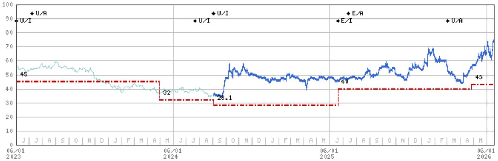

line chart

| Date       | Value |
| ---------- | ----- |
| 06/01 2023 | 45    |
| 06/01 2024 | 32    |
| 06/01 2025 | 26.1  |
| 06/01 2026 | 43    |

Stock Rating History: 6/1/21 : 0/I; 10/12/21 : 0/C; 7/8/22 : U/C; 10/4/22 : U/A; 2/22/23 : U/I; 7/7/23 : U/A; 7/21/24 : U/I; 9/2/24 : U/I; 6/19/25 : E/I; 7/14/25 : E/A; 3/2/26 : U/A  
Price Target History: 5/6/21 : 80; 7/21/21 : 98; 8/19/21 : 105; 10/8/21 : 95; 10/27/21 : 84; 4/25/22 : 80; 7/8/22 : 50; 10/27/22 : 45; 4/29/24 : 32; 9/2/24 : 28.1; 6/19/25 : 40; 4/27/26 : 43  
Source: MS Date Format : MM/DD/YY Price Target = No Price Target Assigned (NA)  
Stock Price (Not Covered by Current Analyst) — Stock Price (Covered by Current Analyst)  
Stock and Industry Ratings (abbreviations below) appear as ♦ Stock Rating/Industry View  
Stock Ratings: Overweight (O) Equal-weight (E) Underweight (U) Not-Rated (NR) No Rating Available (NA)  
Industry View: Attractive (A) In-line (I) Cautious (C) No Rating (NR)  
Effective January 13, 2014, the stocks covered by MS Asia Pacific will be rated relative to the analyst's industry (or industry team's) coverage.  
Effective January 13, 2014, the industry view benchmarks for MS Asia Pacific are as follows: relevant MSCI country index or MSCI sub-regional index or MSCI AC Asia Pacific ex Japan Index.

Hangzhou Silan Microelectronics Co. Ltd. (600460.SS) - As of 06/18/26 GMT in CNY Industry : Greater China Technology Semiconductors  
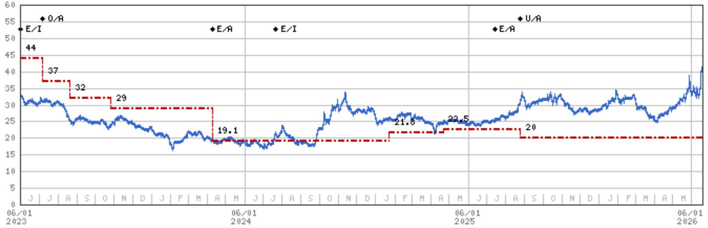

line chart

| Date       | Value |
| ---------- | ----- |
| 06/01 2023 | 44    |
|            | 37    |
|            | 32    |
|            | 29    |
|            | 19.1  |
|            | 21.6  |
|            | 22.5  |
|            | 20    |
|            | U/A   |

Stock Rating History: 10/8/21 : 0/I; 10/12/21 : 0/C; 6/10/22 : E/C; 10/4/22 : E/A; 2/22/23 : E/I; 7/7/23 : 0/A; 4/9/24 : E/A; 7/21/24 : E/I; 7/14/25 : E/A; 8/25/25 : U/A  
Price Target History: 10/8/21 : 71; 4/2/22 : 64; 6/10/22 : 50; 8/23/22 : 46; 11/7/22 : 40; 4/9/23 : 44; 7/7/23 : 37; 8/21/23 : 32; 10/27/23 : 29; 4/9/24 : 19.1; 1/23/25 : 21.8; 4/21/25 : 22.5; 8/25/25 : 20  
Source: MS Date Format : MM/DD/YY Price Target = No Price Target Assigned (NA)  
Stock Price (Not Covered by Current Analyst) — Stock Price (Covered by Current Analyst)  
Stock and Industry Ratings (abbreviations below) appear as ♦ Stock Rating/Industry View  
Stock Ratings: Overweight (O) Equal-weight (E) Underweight (U) Not-Rated (NR) No Rating Available (NA)  
Industry View: Attractive (A) In-line (I) Cautious (C) No Rating (NR)  
Effective January 13, 2014, the stocks covered by MS Asia Pacific will be rated relative to the analyst's industry (or industry team's) coverage.  
Effective January 13, 2014, the industry view benchmarks for MS Asia Pacific are as follows: relevant MSCI country index or MSCI sub-regional index or MSCI AC Asia Pacific ex Japan Index.

StarPower Semiconductor Ltd (603290.SS) - As of 06/18/26 GMT in CNY Industry : Greater China Technology Semiconductors  
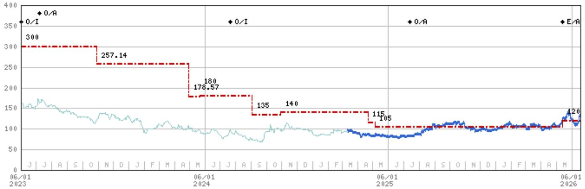

line chart

| Date       | Value   |
| ---------- | ------- |
| 06/01 2023 | 300     |
|            | 257.14  |
|            | 180     |
|            | 178.57  |
|            | 135     |
|            | 140     |
|            | 115     |
|            | 105     |
|            | 120     |

Stock Rating History: 6/1/21 : E/I; 10/12/21 : E/C; 3/1/22 : 0/C; 10/4/22 : 0/A; 2/22/23 : 0/I; 7/7/23 : 0/A; 7/21/24 : 0/I; 7/14/25 : 0/A; 5/14/26 : E/A  
Price Target History: 4/30/21 : 153.57; 7/21/21 : 250; 11/2/21 : 285.71; 3/1/22 : 300; 9/6/22 : 335.71; 10/27/22 : 342.86; 5/3/23 : 300; 10/30/23 : 257.14; 4/30/24 : 178.57; 5/21/24 : 180; 9/2/24 : 135; 10/30/24 : 140; 4/21/25 : 115; 5/5/25 : 105; 5/14/26 : 120  
Source: MS Date Format : MM/DD/YY Price Target = No Price Target Assigned (NA)  
Stock Price (Not Covered by Current Analyst) — Stock Price (Covered by Current Analyst)  
Stock and Industry Ratings (abbreviations below) appear as ♦ Stock Rating/Industry View  
Stock Ratings: Overweight (O) Equal-weight (E) Underweight (U) Not-Rated (NR) No Rating Available (NA)  
Industry View: Attractive (A) In-line (I) Cautious (C) No Rating (NR)  
Effective January 13, 2014, the stocks covered by MS Asia Pacific will be rated relative to the analyst's industry (or industry team's) coverage.  
Effective January 13, 2014, the industry view benchmarks for MS Asia Pacific are as follows: relevant MSCI country index or MSCI sub-regional index or MSCI AC Asia Pacific ex Japan Index.

Yangjie Technology (300373.SZ) - As of 06/18/26 GMT in CNY Industry : Greater China Technology Semiconductors  
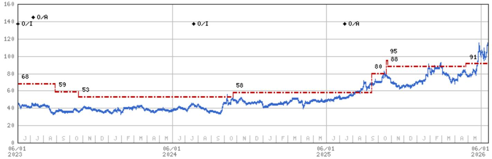

line chart

| Date       | Value |
| ---------- | ----- |
| 06/01 2023 | 68    |
|            | 59    |
|            | 53    |
|            | 58    |
|            | 80    |
|            | 95    |
|            | 88    |
|            | 91    |

Stock Rating History: 10/8/21 : E/I; 10/12/21 : E/C; 6/10/22 : 0/C; 10/4/22 : 0/A; 2/22/23 : 0/I; 7/7/23 : 0/A; 7/21/24 : 0/I; 7/14/25 : 0/A  
Price Target History: 10/8/21 : 46; 10/19/21 : 50; 1/7/22 : 68; 6/10/22 : 90; 10/12/22 : 77; 4/30/23 : 68; 8/28/23 : 59; 10/23/23 : 53; 10/22/24 : 58; 9/15/25 : 80; 10/20/25 : 95; 10/23/25 : 88; 4/27/26 : 91  
Source: MS Date Format : MM/DD/YY Price Target = No Price Target Assigned (NA)  
Stock Price (Not Covered by Current Analyst) — Stock Price (Covered by Current Analyst)  
Stock and Industry Ratings (abbreviations below) appear as ♦ Stock Rating/Industry View  
Stock Ratings: Overweight (O) Equal-weight (E) Underweight (U) Not-Rated (NR) No Rating Available (NA)  
Industry View: Attractive (A) In-line (I) Cautious (C) No Rating (NR)  
Effective January 13, 2014, the stocks covered by MS Asia Pacific will be rated relative to the analyst's industry (or industry team's) coverage.  
Effective January 13, 2014, the industry view benchmarks for MS Asia Pacific are as follows: relevant MSCI country index or MSCI sub-regional index or MSCI AC Asia Pacific ex Japan Index.

## Important Disclosures for MS Smith Barney LLC Customers

Important disclosures regarding any material conflict of interest that can reasonably be expected to have influenced MS Smith Barney LLC's choice of a third-party research provider or the subject company of a third-party research report, are available on the MS Wealth Management disclosure website at www.morganstanley.com/online/researchdisclosures. For MS specific disclosures, you may refer to https://www.morganstanley.com/eqr/disclosures/webapp/generalresearch.

Each MS report is reviewed and approved on behalf of MS Smith Barney LLC. This review and approval is conducted by the same person who reviews the research report on behalf of MS. This could create a conflict of interest.

## Other Important Disclosures

MS policy is to update research reports as and when the Research Analyst and Research Management deem appropriate, based on developments with the issuer, the sector, or the market that may have a material impact on the research views or opinions stated therein. In addition, certain Research publications are intended to be updated on a regular periodic basis (weekly/monthly/quarterly/annual) and will ordinarily be updated with that frequency, unless the Research Analyst and Research Management determine that a different publication schedule is appropriate based on current conditions.

MS is not acting as a municipal advisor and the opinions or views contained herein are not intended to be, and do not constitute, advice within the meaning of Section 975 of the Dodd-Frank Wall Street Reform and Consumer Protection Act.

MS produces an equity research product called a "Tactical Idea." Views contained in a "Tactical Idea" on a particular stock may be contrary to the recommendations or views expressed in research on the same stock. This may be the result of differing time horizons, methodologies, market events, or other factors. For all research available on a particular stock, please contact your sales representative or go to Matrix at http://www.morganstanley.com/matrix.

MS is provided to our clients through our proprietary research portal on Matrix and also distributed electronically by MS to clients. Certain, but not all, MS products are also made available to clients through third-party vendors or redistributed to clients through alternate electronic means as a convenience. For access to all available MS, please contact your sales representative or go to Matrix at http://www.morganstanley.com/matrix.

Any access and/or use of MS is subject to MS's Terms of Use (http://www.morganstanley.com/terms.html). By accessing and/or using MS, you are indicating that you have read and agree to be bound by our Terms of Use (http://www.morganstanley.com/terms.html). In addition you consent to MS processing your personal data and using cookies in accordance with our Privacy Policy and our Global Cookies Policy (http://www.morganstanley.com/privacy\_pledge.html), including for the purposes of setting your preferences and to collect readership data so that we can deliver better and more personalized service and products to you. To find out more information about how MS processes personal data, how we use cookies and how to reject cookies see our Privacy Policy and our Global Cookies Policy (http://www.morganstanley.com/privacy\_pledge.html). Please use the provided link to review the Terms and Conditions and Most Important Terms and Conditions for MS India Company Private Limited (https://www.morganstanley.com/assets/pdfs/about-us-global-offices/india/Terms\_and\_conditions.pdf) and the following link to review the audit report (https://ny.matrix.ms.com/eqr/research/webapp/researchdocs/MSICPL\_Morgan\_Stanley\_Research\_Audit\_Report.pdf).

If you do not agree to our Terms of Use and/or if you do not wish to provide your consent to MS processing your personal data or using cookies please do not access our research. MS does not provide individually tailored investment advice. MS has been prepared without regard to the circumstances and objectives of those who receive it. MS recommends that investors independently evaluate particular investments and strategies, and encourages investors to seek the advice of a financial adviser. The appropriateness of an investment or strategy will depend on an investor's circumstances and objectives. The securities, instruments, or strategies discussed in MS may not be suitable for all investors, and certain investors may not be eligible to purchase or participate in some or all of them. MS is not an offer to buy or sell or the solicitation of an offer to buy or sell any security/instrument or to participate in any particular trading strategy. The value of and income from your investments may vary because of changes in interest rates, foreign exchange rates, default rates, prepayment rates, securities/instruments prices, market indexes, operational or financial conditions of companies or other factors. There may be time limitations on the exercise of options or other rights in securities/instruments transactions. Past performance is not necessarily a guide to future performance. Estimates of future performance are based on assumptions that may not be realized. If provided, and unless otherwise stated, the closing price on the cover page is that of the primary exchange for the subject company's securities/instruments.

The fixed income research analysts, strategists or economists principally responsible for the preparation of MS have received compensation based upon various factors, including quality, accuracy and value of research, firm profitability or revenues (which include fixed income trading and capital markets profitability or revenues), client feedback and competitive factors. Fixed Income Research analysts', strategists' or economists' compensation is not linked to investment banking or capital markets transactions performed by MS or the profitability or revenues of particular trading desks.

The "Important Regulatory Disclosures on Subject Companies" section in MS lists all companies mentioned where MS owns 1% or more of a class of common equity securities of the companies. For all other companies mentioned in MS, MS may have an investment of less than 1% in securities/instruments or derivatives of securities/instruments of companies and may trade them in ways different from those discussed in MS. Employees of MS not involved in the preparation of MS may have investments in securities/instruments or derivatives of securities/instruments of companies mentioned and may trade them in ways different from those discussed in MS. Derivatives may be issued by MS or associated persons.

With the exception of information regarding MS, MS is based on public information. MS makes every effort to use reliable, comprehensive information, but we make no representation that it is accurate or complete. We have no obligation to tell you when opinions or information in MS change apart from when we intend to discontinue equity research coverage of a subject company. Facts and views presented in MS have not been reviewed by, and may not reflect information known to, professionals in other MS business areas, including investment banking personnel.

MS personnel may participate in company events such as site visits and are generally prohibited from accepting payment by the company of associated expenses unless pre-approved by authorized members of Research management.

MS may make investment decisions that are inconsistent with the recommendations or views in this report.

To our readers based in Taiwan or trading in Taiwan securities/instruments: Information on securities/instruments that trade in Taiwan is distributed by MS Taiwan Limited ("MSTL"). Such information is for your reference only. The reader should independently evaluate the investment risks and is solely responsible for their investment decisions. MS may not be distributed to the public media or quoted or used by the public media without the express written consent of MS. Any non-customer reader within the scope of Article 7-1 of the Taiwan Stock Exchange Recommendation Regulations accessing and/or receiving MS is not permitted to provide MS to any third party (including but not limited to related parties, affiliated companies and any other third parties) or engage in any activities regarding MS which may create or give the appearance of creating a conflict of interest. Information on securities/instruments that do not trade in Taiwan is for informational purposes only and is not to be construed as a recommendation or a solicitation to trade in such securities/instruments. MSTL may not execute transactions for clients in these securities/instruments.

Certain information in MS was sourced by employees of the Shanghai Representative Office of MS Asia Limited for the use of MS Asia Limited. MS is not incorporated under PRC law and the research in relation to this report is conducted outside the PRC. MS does not constitute an offer to sell or the solicitation of an offer to buy any securities in the PRC. PRC investors shall have the relevant qualifications to invest in such securities and shall be responsible for obtaining all relevant approvals, licenses, verifications and/or registrations from the relevant governmental authorities themselves. Neither this report nor any part of it is intended as, or shall constitute, provision of any consultancy or advisory service of securities investment as defined under PRC law. Such information is provided for your reference only.

MS is disseminated in Brazil by MS C.T.V.M. S.A. located at Av. Brigadeiro Faria Lima, 3600, 6th floor, São Paulo - SP, Brazil; and is regulated by the Comissão de Valores Mobiliários; in Mexico by MS México, Casa de Bolsa, S.A. de C.V which is regulated by Comision Nacional Bancaria y de Valores. Paseo de los Tamarindos 90, Torre 1, Col. Bosques de las Lomas Floor 29, 05120 Mexico City; in Japan by MS MUFG Securities Co., Ltd. and, for Commodities related research reports only, MS Capital Group Japan Co., Ltd; in Hong Kong by MS Asia Limited (which accepts responsibility for its contents) and by MS Bank Asia Limited; in Singapore by MS Asia (Singapore) Pte. (Registration number 199206298Z) and/or MS Asia (Singapore) Securities Pte Ltd (Registration number 200008434H), regulated by the Monetary Authority of Singapore (which accepts legal responsibility for its contents and should be contacted with respect to any matters arising from, or in connection with, MS) and by MS Bank Asia Limited, Singapore Branch (Registration number T14FC0118); in Australia to "wholesale clients" within the meaning of the Australian Corporations Act by MS Australia Limited A.B.N. 67 003 734 576, holder of Australian financial services license No. 233742, which accepts responsibility for its contents; in Australia to "wholesale clients" and "retail clients" within the meaning of the Australian Corporations Act by MS Wealth Management Australia Pty Ltd (A.B.N. 19 009 145 555, holder of Australian financial services license No. 240813, which accepts responsibility for its contents; in Korea by MS & Co International plc, Seoul Branch; in India by MS India Company Private Limited having Corporate Identification No (CIN) U22990MH1998PTC115305, regulated by the Securities and Exchange Board of India ("SEBI") and holder of licenses as a Research Analyst (SEBI Registration No. INH000001105); Stock Broker (SEBI Stock Broker Registration No. INZ000244438), Merchant Banker (SEBI Registration No. INM000011203), and depository participant with National Securities Depository Limited (SEBI Registration No. IN-DP-NSDL-567-2021) having registered office at Altimus, Level 39 & 40, Pandurang Budhkar Marg, Worli, Mumbai 400018, India; Telephone no. +91-22-61181000; Compliance Officer Details: Mr. Tejarshi Hardas, Tel. No.: +91-22-61181000 or Email: tejarshi.hardas@morganstanley.com; Grievance officer details: Mr. Tejarshi Hardas, Tel. No.: +91-22-61181000 or Email: msic-compliance@morganstanley.com. MS India Company Private Limited (MSICPL) may use AI tools in providing research services. All recommendations contained herein are made by the duly qualified research analysts; in Canada by MS Canada Limited; in Germany and the European Economic Area where required by MS Europe S.E., authorised and regulated by Bundesanstalt fuer Finanzdienstleistungsaufsicht (BaFin) under the reference number 149169; in the US by MS & Co. LLC, which accepts responsibility for its contents. MS & Co. International plc, authorized by the Prudential Regulation Authority and regulated by the Financial Conduct Authority and the Prudential Regulation Authority, disseminates in the UK research that it has prepared, and research which has been prepared by any of its affiliates, only to persons who (i) are investment professionals falling within Article 19(5) of the Financial Services and Markets Act 2000 (Financial Promotion) Order 2005 (as amended, the "Order"); (ii) are persons who are high net worth entities falling within Article 49(2)(a) to (d) of the Order; or (iii) are persons to whom an invitation or inducement to engage in investment activity (within the meaning of section 21 of the Financial Services and Markets Act 2000, as amended) may otherwise lawfully be communicated or caused to be communicated. RMB MS Proprietary Limited is a member of the JSE Limited and A2X (Pty) Ltd. RMB MS Proprietary Limited is a joint venture owned equally by MS International Holdings Inc. and RMB Investment Advisory (Proprietary) Limited, which is wholly owned by FirstRand Limited. The information in MS is being disseminated by MS Saudi Arabia, regulated by the Capital Market Authority in the Kingdom of Saudi Arabia, and is directed at Sophisticated investors only.

MS Hong Kong Securities Limited is the liquidity provider/market maker for securities of ASMPT Ltd, Hua Hong Semiconductor Ltd listed on the Stock Exchange of Hong Kong Limited. An updated list can be found on HKEx website: http://www.hkex.com.hk.

The information in MS is being communicated by MS & Co. International plc (DIFC Branch), regulated by the Dubai Financial Services Authority (the DFSA) or by MS & Co. International plc (ADGM Branch), regulated by the Financial Services Regulatory Authority Abu Dhabi (the FSRA), and is directed at Professional Clients only, as defined by the DFSA or the FSRA, respectively. The financial products or financial services to which this research relates will only be made available to a customer who we are satisfied meets the regulatory criteria of a Professional Client. A distribution of the different MS Research ratings or recommendations, in percentage terms for Investments in each sector covered, is available upon request from your sales representative.

The information in MS is being communicated by MS & Co. International plc (QFC Branch), regulated by the Qatar Financial Centre Regulatory Authority (the QFCRA), and is directed at business customers and market counterparties only and is not intended for Retail Customers as defined by the QFCRA.

As required by the Capital Markets Board of Turkey, investment information, comments and recommendations stated here, are not within the scope of investment advisory activity. Investment advisory service is provided exclusively to persons based on their risk and income preferences by the authorized firms. Comments and recommendations stated here are general in nature. These opinions may not fit to your financial status, risk and return preferences. For this reason, to make an investment decision by relying solely to this information stated here may not bring about outcomes that fit your expectations.

The trademarks and service marks contained in MS are the property of their respective owners. Third-party data providers make no warranties or representations relating to the accuracy, completeness, or timeliness of the data they provide and shall not have liability for any damages relating to such data. The Global Industry Classification Standard (GICS) was developed by and is the exclusive property of MSCI and S&P.

MS, or any portion thereof may not be reprinted, sold or redistributed without the written consent of MS.

Indicators and trackers referenced in MS may not be used as, or treated as, a benchmark under Regulation EU 2016/1011, or any other similar framework.

The issuers and/or fixed income products recommended or discussed in certain fixed income research reports may not be continuously followed. Accordingly, investors should regard those fixed income research reports as providing stand-alone analysis and should not expect continuing analysis or additional reports relating to such issuers and/or individual fixed income products. MS may hold, from time to time, material financial and commercial interests regarding the company subject to the Research report.

Registration granted by SEBI and certification from the National Institute of Securities Markets (NISM) in no way guarantee performance of the intermediary or provide any assurance of returns to investors. Investment in securities market are subject to market risks. Read all the related documents carefully before investing.

INDUSTRY COVERAGE: Greater China Technology Semiconductors

<table><tr><td>COMPANY (TICKER)</td><td>RATING (AS OF)</td><td>PRICE* (06/17/2026)</td></tr></table>

Charlie Chan

<table><tr><td>ACM Research Inc (ACMR.O)</td><td>O (03/07/2023)</td><td>US$96.19</td></tr><tr><td>Advanced Micro-Fabrication Equipment Inc (688012.SS)</td><td>O (11/06/2023)</td><td>Rmb351.00</td></tr><tr><td>Advanced Wireless Semiconductor Co (8086.TWO)</td><td>U (07/14/2025)</td><td>NT$162.50</td></tr><tr><td>Alchip Technologies Ltd (3661.TW)</td><td>O (05/14/2021)</td><td>NT$4,320.00</td></tr><tr><td>ASE Technology Holding Co. Ltd. (3711.TW)</td><td>O (09/15/2024)</td><td>NT$595.00</td></tr><tr><td>Cambricon Technology Corporation (688256.SS)</td><td>O (04/27/2026)</td><td>Rmb1,320.00</td></tr><tr><td>Global Unichip Corp (3443.TW)</td><td>E (05/28/2026)</td><td>NT$5,075.00</td></tr><tr><td>GlobalWafers Co Ltd (6488.TWO)</td><td>E (05/19/2026)</td><td>NT$1,100.00</td></tr><tr><td>Gudeng Precision (3680.TWO)</td><td>O (11/25/2025)</td><td>NT$517.00</td></tr><tr><td>Hua Hong Semiconductor Ltd (1347.HK)</td><td>E (03/12/2026)</td><td>HK$159.20</td></tr><tr><td>Iluvatar CoreX Semiconductor Co., Ltd. (9903.HK)</td><td>O (04/27/2026)</td><td>HK$520.00</td></tr><tr><td>King Yuan Electronics Co Ltd (2449.TW)</td><td>O (03/03/2023)</td><td>NT$280.50</td></tr><tr><td>Maxscend Microelectronics Co Ltd (300782.SZ)</td><td>U (01/11/2021)</td><td>Rmb99.80</td></tr><tr><td>MediaTek (2454.TW)</td><td>O (11/28/2025)</td><td>NT$4,460.00</td></tr><tr><td>MetaX Integrated Circuits (688802.SS)</td><td>E (04/27/2026)</td><td>Rmb732.50</td></tr><tr><td>Nanya Technology Corp. (2408.TW)</td><td>O (05/28/2026)</td><td>NT$437.00</td></tr><tr><td>NAURA Technology Group Co Ltd (002371.SZ)</td><td>O (11/06/2023)</td><td>Rmb704.22</td></tr><tr><td>OmniVision Integrated Circuits Group Inc (603501.SS)</td><td>E (11/17/2025)</td><td>Rmb90.12</td></tr><tr><td>Phison Electronics Corp (8299.TWO)</td><td>E (02/25/2026)</td><td>NT$2,330.00</td></tr><tr><td>SG Micro Corp. (300661.SZ)</td><td>E (11/03/2025)</td><td>Rmb131.55</td></tr><tr><td>Silergy Corp. (6415.TW)</td><td>U (05/19/2026)</td><td>NT$572.00</td></tr><tr><td>SMIC (0981.HK)</td><td>O (10/21/2025)</td><td>HK$75.75</td></tr><tr><td>TSMC (2330.TW)</td><td>O (02/07/2022)</td><td>NT$2,385.00</td></tr><tr><td>UMC (2303.TW)</td><td>O (05/19/2026)</td><td>NT$140.00</td></tr><tr><td>Vanguard International Semiconductor (5347.TWO)</td><td>E (01/14/2026)</td><td>NT$166.50</td></tr><tr><td>WIN Semiconductors Corp (3105.TWO)</td><td>U (07/14/2025)</td><td>NT$519.00</td></tr></table>

<table><tr><td colspan="3">Daisy Dai, CFA</td></tr><tr><td>ASMPT Ltd (0522.HK)</td><td>O (07/24/2025)</td><td>HK$210.00</td></tr><tr><td>China Resources Microelectronics Limited (688396.SS)</td><td>U (03/02/2026)</td><td>Rmb73.78</td></tr><tr><td>Elan Microelectronics Corp (2458.TW)</td><td>O (10/03/2025)</td><td>NT$156.50</td></tr><tr><td>Empyrean Technology Co Ltd (301269.SZ)</td><td>E (01/17/2025)</td><td>Rmb105.01</td></tr><tr><td>Hangzhou Silan Microelectronics Co. Ltd. (600460.SS)</td><td>U (08/25/2025)</td><td>Rmb40.83</td></tr><tr><td>Innoscience (2577.HK)</td><td>E (10/13/2025)</td><td>HK$63.05</td></tr><tr><td>JCET Group Co Ltd (600584.SS)</td><td>E (01/16/2026)</td><td>Rmb81.76</td></tr><tr><td>Shanghai Fudan Microelectronics (1385.HK)</td><td>O (03/07/2025)</td><td>HK$29.48</td></tr><tr><td>SICC Co Ltd (688234.SS)</td><td>O (03/20/2026)</td><td>Rmb149.66</td></tr><tr><td>StarPower Semiconductor Ltd (603290.SS)</td><td>E (05/14/2026)</td><td>Rmb130.98</td></tr><tr><td>Unigroup Guoxin Microelectronics Co Ltd (002049.SZ)</td><td>U (01/10/2023)</td><td>Rmb80.00</td></tr><tr><td>Universal Scientific Ind. (Shanghai) (601231.SS)</td><td>O (11/05/2025)</td><td>Rmb37.08</td></tr><tr><td>Yangjie Technology (300373.SZ)</td><td>O (06/10/2022)</td><td>Rmb114.10</td></tr></table>

<table><tr><td colspan="3">Daniel Yen, CFA</td></tr><tr><td>AP Memory Technology Corp (6531.TW)</td><td>O (07/11/2025)</td><td>NT$933.00</td></tr><tr><td>ASMedia Technology Inc (5269.TW)</td><td>U (10/03/2025)</td><td>NT$1,425.00</td></tr><tr><td>Aspeed Technology (5274.TWO)</td><td>O (06/09/2025)</td><td>NT$18,485.00</td></tr><tr><td>Egis Technology Inc (6462.TWO)</td><td>E (01/28/2026)</td><td>NT$112.50</td></tr><tr><td>Espressif Systems (688018.SS)</td><td>O (05/15/2023)</td><td>Rmb122.40</td></tr><tr><td>GigaDevice Semiconductor Beijing Inc (603986.SS)</td><td>O (05/15/2025)</td><td>Rmb586.04</td></tr><tr><td>Macronix International Co Ltd (2337.TW)</td><td>O (09/18/2025)</td><td>NT$161.50</td></tr><tr><td>Montage Technology Co Ltd (6809.HK)</td><td>O (03/18/2026)</td><td>HK$420.60</td></tr><tr><td>Montage Technology Co Ltd (688008.SS)</td><td>O (03/18/2026)</td><td>Rmb262.50</td></tr><tr><td>Novatek (3034.TW)</td><td>U (02/04/2026)</td><td>NT$515.00</td></tr><tr><td>Nuvoton Technology Corporation (4919.TW)</td><td>U (11/10/2025)</td><td>NT$187.50</td></tr><tr><td>Parade Technologies Ltd (4966.TWO)</td><td>O (05/27/2026)</td><td>NT$675.00</td></tr><tr><td>Powerchip Semiconductor Manufacturing Co (6770.TW)</td><td>O (10/27/2025)</td><td>NT$70.20</td></tr><tr><td>Realtek Semiconductor (2379.TW)</td><td>E (01/30/2026)</td><td>NT$745.00</td></tr><tr><td>Shenzhen Goodix Technology Co Ltd (603160.SS)</td><td>U (07/14/2025)</td><td>Rmb59.74</td></tr><tr><td>Winbond Electronics Corp (2344.TW)</td><td>O (05/28/2026)</td><td>NT$199.00</td></tr><tr><td>WPG Holdings (3702.TW)</td><td>O (03/16/2026)</td><td>NT$107.00</td></tr><tr><td>WT Microelectronics Co. Ltd. (3036.TW)</td><td>O (01/27/2026)</td><td>NT$224.00</td></tr><tr><td colspan="3">Duan Liu</td></tr><tr><td>Dosilicon Co Ltd (688110.SS)</td><td>U (09/06/2024)</td><td>Rmb152.91</td></tr><tr><td>Shenzhen Longsys Electronics Co Ltd (301308.SZ)</td><td>E (02/25/2026)</td><td>Rmb571.68</td></tr><tr><td colspan="3">Tiffany Yeh</td></tr><tr><td>AllRing Tech Co. (6187.TWO)</td><td>O (09/23/2025)</td><td>NT$1,155.00</td></tr><tr><td>FOCI Fiber Optic Communications Inc (3363.TWO)</td><td>O (01/15/2025)</td><td>NT$685.00</td></tr><tr><td>Himax Technologies Inc (HIMX.O)</td><td>E (02/04/2026)</td><td>US$16.95</td></tr><tr><td>Hon Precision (7769.TW)</td><td>O (04/17/2026)</td><td>NT$7,330.00</td></tr><tr><td>MPI Corporation (6223.TWO)</td><td>O (04/17/2026)</td><td>NT$6,420.00</td></tr><tr><td>Silicon Motion (SIMO.O)</td><td>O (05/06/2024)</td><td>US$307.12</td></tr><tr><td>WinWay Technology Co Ltd (6515.TW)</td><td>O (04/17/2026)</td><td>NT$9,450.00</td></tr></table>

Stock Ratings are subject to change. Please see latest research for each company.  
\* Historical prices are not split adjusted.

© 2026 MS