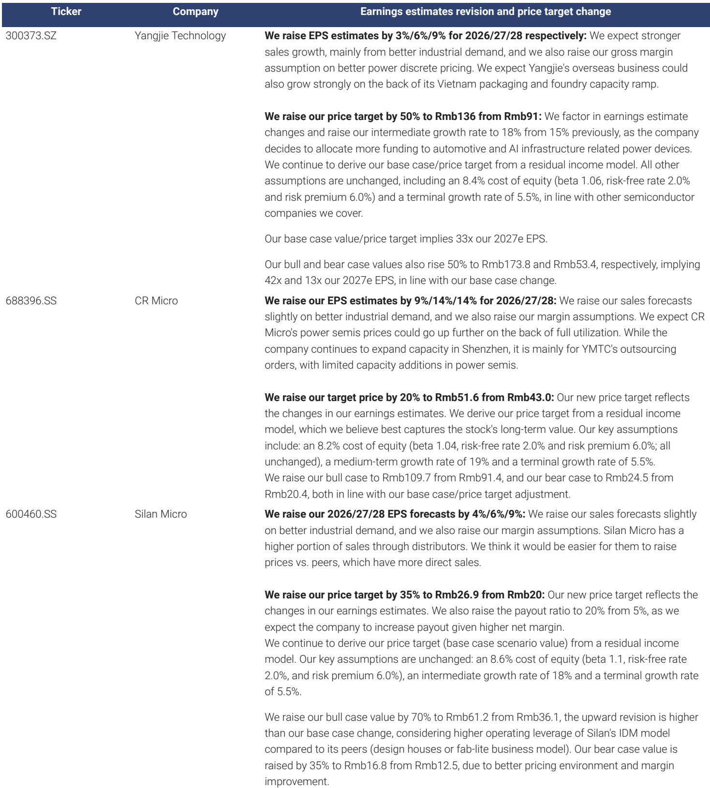
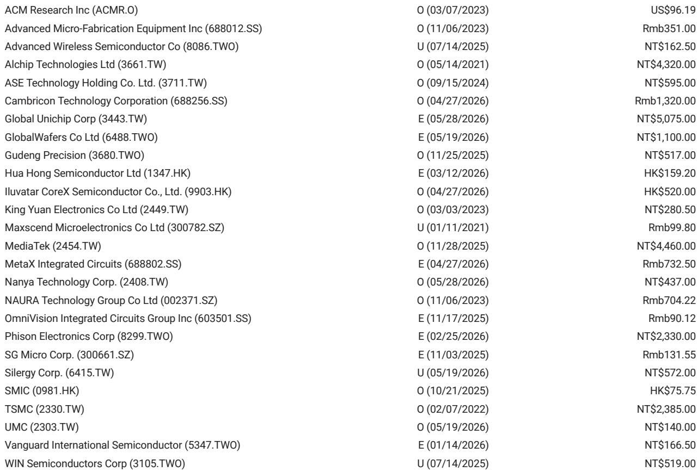
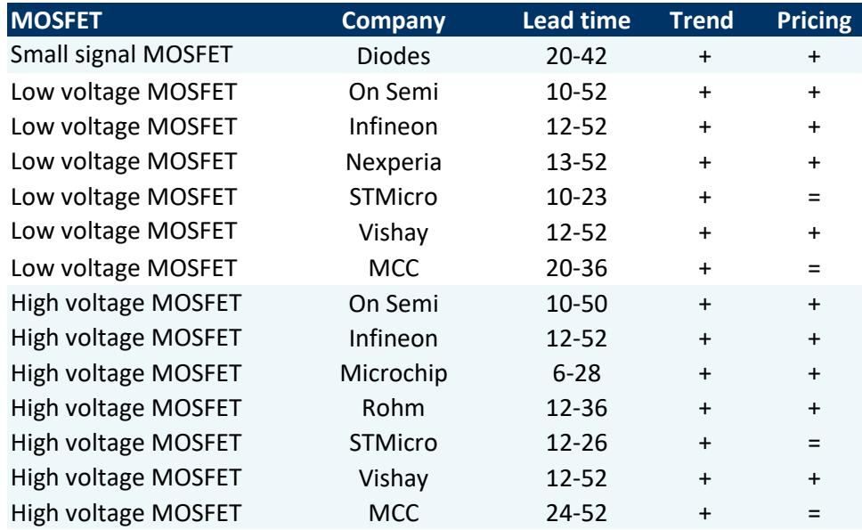

# The Power Semiconductor Upcycle Is Real, But It Is Supply-Driven, Not Demand-Led -- And That Changes Which Stocks Will Win

The global power discrete semiconductor market has returned to revenue growth since the fourth quarter of 2025, with year-on-year expansion tracking at 16 percent as of April 2026. Many investors will read this headline and assume a broad-based cyclical recovery is underway. That assumption is only half correct. The recovery is real, but its engine is not surging end-market demand. It is a supply-driven upcycle, born from two consecutive years of capital expenditure cuts by global leaders and a structural shift in Chinese foundry capacity away from power discretes and toward AI-related power management chips. This distinction matters enormously for portfolio construction. In a demand-driven cycle, nearly every player rises. In a supply-driven cycle, pricing power is concentrated, margins improve unevenly, and the stocks that benefit most are those with the right product mix, customer exposure, and cost structure. The report from a global investment bank makes this case with clarity, and its stock-level calls -- overweight on Yangjie Technology, underweight on Silan Micro and CR Micro -- are a direct reflection of this framework.

Why now? Because the window for action is narrowing. Price hike notices went out in February 2026, distributors accepted them given low inventory and fear of further increases in the second half of the year, and pricing momentum could sustain into the second half of 2026 if demand does not sharply deteriorate. But the sustainability of this cycle is fragile. It rests on continued supply discipline, not on a structural acceleration in electric vehicle sales or a solar renaissance. The report makes clear that EV wholesale growth in China, while turning incrementally positive, remains subdued, and solar capacity additions have fallen 51 percent year-onade. The bull case for power semis rests on industrial demand, which is genuinely strong, and on the fact that auto and industrial together account for 72 percent of end demand. But that is a narrow foundation. Investors who treat this as a simple cyclical bet risk owning the wrong names when the pricing tailwind fades.

## The recovery in power discretes is real, but its character is supply-constrained, not demand-pulled

The most important analytical distinction in this report is the nature of the cycle. Global power discrete revenue growth turned positive in the fourth quarter of 2025, and the trajectory has accelerated into 2026. But the driving force is not a synchronized rebound across end markets. It is a supply-side correction. Global leading power discrete companies cut capital expenditure for two consecutive years, and the mild increase of roughly 11 percent in 2026 does not reverse the cumulative underinvestment. In China, the situation is even more structural. Companies like Silan Micro and UNT are reallocating capacity toward AI power management chips, which means that new capacity for traditional power discretes -- IGBTs, MOSFETs -- will be limited for at least the next three years.

This is a classic setup for a pricing cycle. When supply is constrained and demand does not collapse, pricing power shifts to producers. The report confirms that distributors and most end-market customers accepted price hikes in early 2026, motivated by low inventory levels and the expectation that prices would rise further in the second half of the year. The only exception was IGBTs for automotive customers, where pricing power remains more limited. This pattern is consistent with a supply-driven upcycle: pricing improves, but the improvement is conditional on continued supply discipline and on demand not deteriorating. The so-what for investors is that gross margins should improve gradually through the remainder of 2026, but the improvement will be most pronounced for companies with high utilization, limited capacity additions, and exposure to industrial end markets.

## The demand picture is fragmented, and the strongest tailwind comes from industrial automation, not EVs or solar

A common mistake in cyclical semiconductor analysis is to assume that all end markets move together. They do not. The report provides a clear, if sobering, breakdown. Auto and industrial segments together accounted for 72 percent of power discrete demand in 2025. Within that, industrial demand is the standout. Leading industrial automation companies in China grew revenue at 21 percent in the first quarter of 2026. This is a genuine, data-backed tailwind. It reflects ongoing factory automation, reshoring trends, and infrastructure investment that are not dependent on consumer sentiment or EV adoption rates.

Electric vehicles, by contrast, are a mixed signal. China EV wholesale growth on a three-month moving average basis was tracking at 7 percent year-on-year in May 2026, up from zero in April. That is an improvement, but it is not a boom. The growth rate remains well below the levels seen in 2023 and early 2024, and it is not yet clear whether the uptick is sustainable or a temporary restocking effect. Solar demand is outright weak, with year-to-date capacity additions down 51 percent year-on-year. This is a meaningful headwind for power discrete companies with significant solar exposure, and it is one reason why the cycle is not as broad-based as some investors might hope.

The implication is clear. The pricing recovery is real, but it is not a tide that lifts all boats. Companies with high exposure to industrial automation and a diversified auto book are better positioned than those reliant on solar or on high-volume, low-differentiation IGBT sales to EV makers with pricing power.

## The supply-side story in China is structural, not cyclical, and it creates winners and losers among local players

The most strategically important insight in the report concerns the direction of Chinese capacity. It is not simply that Chinese foundries are adding less capacity for power discretes. It is that they are actively shifting capacity away from power discretes and toward AI power management chips. This is a structural decision, driven by the higher margins and strategic importance of AI-related chips. Silan Micro and UNT are explicitly cited as examples of companies making this pivot.

For the power discrete market, this means that the supply constraint is not a temporary pause but a multi-year reallocation. New capacity for IGBTs and MOSFETs in China will be limited for at least three years. This is bullish for pricing in the near term, but it also creates a two-tier market. Companies that can maintain or increase their power discrete output will benefit from higher prices and better margins. Companies that are shifting away from power discretes may see their power discrete revenue decline even as their overall revenue grows from AI chips.

This is precisely why the report's stock calls are so instructive. Yangjie Technology is rated overweight because it is leaning into auto localization and has strong operating efficiency. Its capacity expansion in Vietnam for packaging and foundry services also gives it a differentiated growth vector. Silan Micro and CR Micro, by contrast, are rated underweight despite having higher price targets, because the report judges that their current valuations already reflect overly optimistic expectations. Silan Micro's IDM model gives it higher operating leverage, which is a double-edged sword: it amplifies upside in a strong cycle but also amplifies downside if the cycle turns. The report's bull case for Silan is substantially higher than its base case, which itself signals that the stock is a high-beta, high-uncertainty name.

## What the report does not fully answer: how to distinguish between pricing power that is sustainable and pricing power that is ephemeral

The report is rigorous on the supply side and clear on the demand picture, but it leaves an important analytical question open. How long can a supply-driven pricing cycle last when the demand backdrop is mixed? The report's answer is conditional: if demand does not sharply deteriorate, pricing could sustain into the second half of 2026. That is a reasonable base case, but it is not a confident forecast.

The unresolved tension is between the structural nature of the supply constraint and the cyclical nature of demand. If industrial automation growth slows, or if EV wholesale growth stalls again, the pricing power that distributors accepted in early 2026 could quickly evaporate. The report does not model a demand shock scenario in detail. It does not tell us what level of demand deterioration would break the pricing cycle. It also does not fully address the risk that Chinese foundries might reverse their capacity reallocation if power discrete pricing remains elevated for an extended period. The three-year supply constraint is a forecast, not a guarantee.

For investors, this means that the bull case for power discretes is time-limited and condition-dependent. The most prudent approach is to own companies that can sustain margin improvement even if pricing peaks, because they have company-specific drivers such as product mix improvement, geographic expansion, or cost advantages. Yangjie's Vietnam capacity and auto localization strategy fit this profile. Silan Micro and CR Micro, with their higher exposure to market pricing and distributor channels, are more dependent on the cycle continuing.

## A decision framework for investors: three questions to determine which power semi stocks to own

Rather than treating the report as a set of stock tips, investors should extract the analytical framework it implies. Three questions separate the names that will compound returns from those that will give them back.

First, what is the company's exposure to the industrial automation cycle? Industrial demand is the strongest and most sustainable end market in this cycle. Companies with significant industrial revenue, direct sales channels to industrial customers, and a product portfolio aligned with factory automation and infrastructure will benefit most. The report's data on leading industrial automation companies growing at 21 percent in the first quarter of 2026 is a powerful signal.

Second, does the company have company-specific capacity or product mix drivers that are independent of the pricing cycle? The best investments in a supply-driven upcycle are those that have idiosyncratic growth stories. Yangjie's Vietnam ramp and auto localization are examples. These drivers provide a margin of safety if the pricing cycle peaks earlier than expected.

Third, is the company's valuation already discounting the cycle? The report raises price targets for all three covered names, but it maintains underweight ratings on Silan Micro and CR Micro precisely because their current valuations already reflect optimistic assumptions. The bull cases for these stocks are substantially higher than the base cases, which means the market is already pricing in a favorable outcome. The asymmetric risk is to the downside if the cycle disappoints.

The framework is simple but powerful. Own companies with industrial exposure, idiosyncratic growth drivers, and reasonable valuations. Avoid companies where the cycle is already priced in and where the business model depends on continued pricing momentum.

## The full report contains charts and data that make this argument visual and actionable

The analysis above is based on the report's core logic and data, but the full report includes exhibits that make the argument concrete. Exhibit 1 shows the trajectory of global discrete revenue growth turning positive in the fourth quarter of 2025. Exhibit 2 confirms the dominance of auto and industrial in end demand. Exhibit 3 tracks China EV wholesale growth and shows the incremental improvement. Exhibit 4 illustrates the strength of industrial automation revenue. Exhibit 5 documents the capex decline and mild recovery among global leaders. These charts are not decorative. They are the evidentiary backbone of the supply-driven upcycle thesis.

For investors who want to make their own assessment of the cycle's durability, these exhibits are essential. They allow you to track the key variables in real time: revenue growth momentum, end-market trends, capacity addition plans, and pricing behavior. The report also contains detailed earnings estimate revisions and price target methodologies for each covered stock, which provide a transparent view of the analysts' assumptions.

Join the community to read the full report and review the original charts.

*This article is for learning and discussion only and does not constitute investment advice.*

Personal reading notes and learning share only. Not investment advice.

