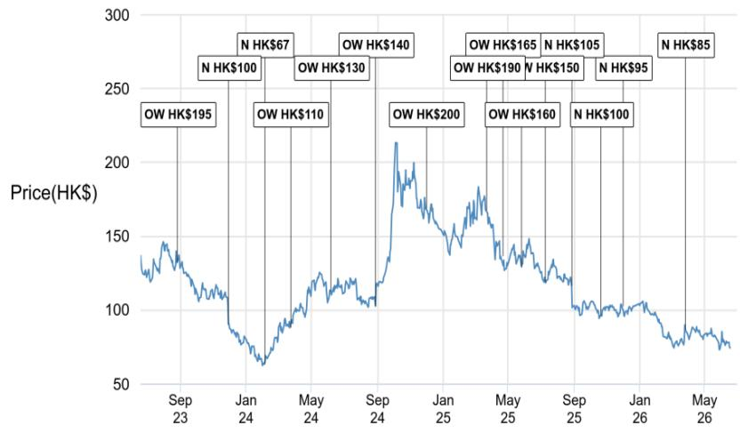
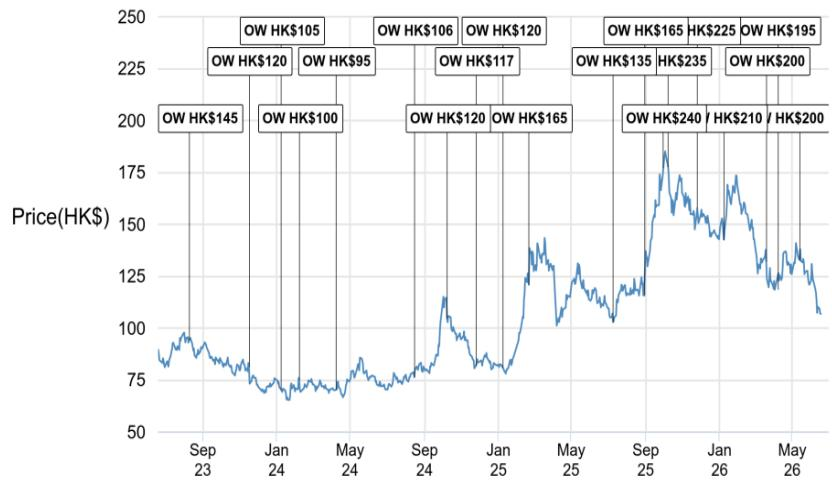
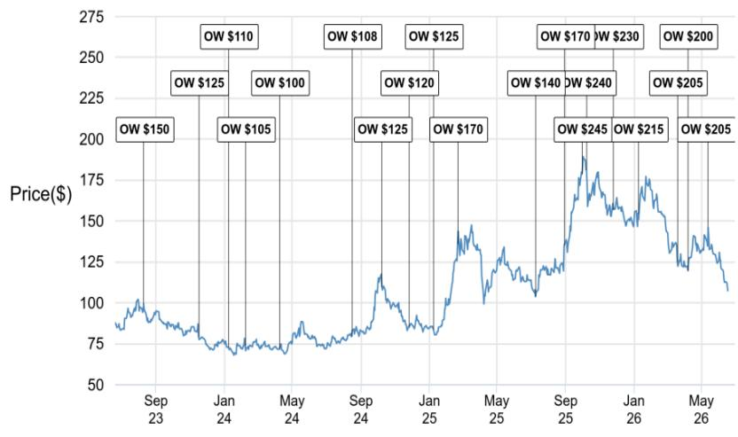
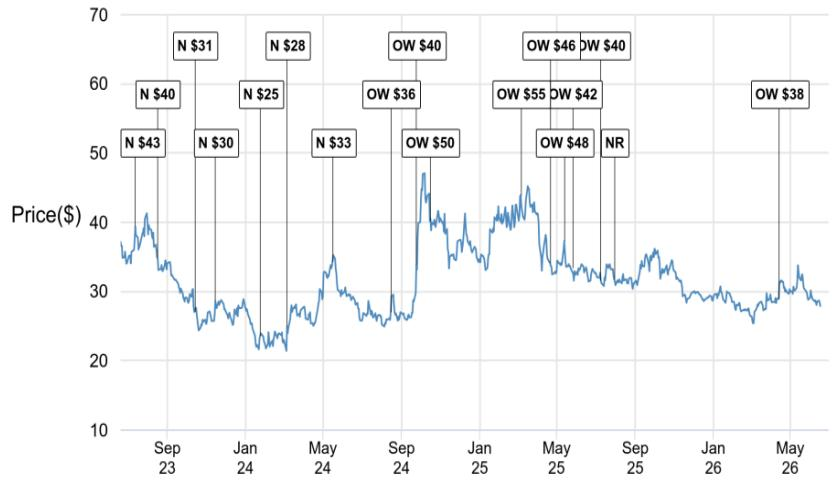
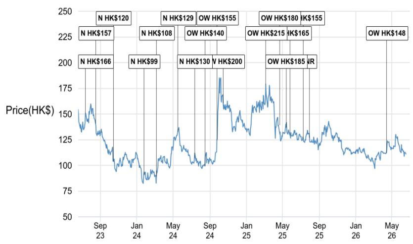

## China Food Delivery

Not Just a Soft Draft: Disclosure Rules Could Cool the Food Delivery Subsidy War

SAMR's draft food-delivery rules reduce Meituan's downside tail, but they do not yet turn regulatory relief into a positive earnings catalyst, in our view. We reiterate Neutral on Meituan with a Dec-26 PT of HK\$85, making no changes to our estimates considering the draft's scenario framework. The call rests on one load-bearing assumption: SAMR's funding-source language has real behavioral bite and limits capital-funded subsidy attacks on food delivery. If that premise holds, our reading of the draft lowers the probability of our bear case (Table 4), in which prolonged capital-funded competition weakens the delivery profit pool and Meituan's fair value falls to around HK\$51. If the premise does not hold, the rules become disclosure without much strategic value. We do not use the draft alone as the basis to change our estimates, but we see it as a near-term sentiment stabilizer ahead of the final text due after the July 17, 2026 consultation deadline, and considering 3Q26 subsidy evidence.

- The market appears to be pricing the absence of explicit subsidy caps as evidence that the draft lacks bite. In our view, that misreads the mechanism. The draft does not need to cap every campaign to matter; it needs to make the most aggressive campaigns slower, more visible, and easier to challenge. Seven-day pre-disclosure reduces surprise value, while funding-source reporting and competitive-impact self-assessment create an evidentiary trail for regulators, competitors, merchants, riders, and media to scrutinize extreme promotions.  
- The relative stock implication favors Meituan on this specific catalyst, although not enough for us to prefer it outright over Alibaba (9988 HK/BABA US, OW) at the portfolio level. Meituan's advantages lie in order density, routing efficiency, merchant coverage, rider management, and consumer habit formation. If the rules shift competition away from fast capital-funded cash subsidy toward operating execution, the battleground moves back onto Meituan's terrain.  
- We would change our view if the final rules explicitly allow group-level operating profit to satisfy the funding-source requirement, if platforms keep running aggressive disclosed campaigns without regulatory response, or if Alibaba redirects the fight into higher-AOV use cases where Meituan's profit pool is more exposed. The clearest falsification test is 3Q26 subsidy intensity: if reporting and industry checks show subsidies remain near 1H26 levels with no moderation, our interpretation weakens. Conversely, final wording that preserves Provision 3, first disclosures that force campaign economics into view, and evidence of easing subsidy intensity would support a shift of probability weight from the HKD51 bear case toward the HKD92 base and the HKD128 bull case.

Head of China Equity Research and Co-Head of Asia TMT Research

Alex Yao AC

(86 21) 6106 6505

alex.yao@JPM.com

SAC Registration Number: S1730523020001

Nancy Liu

(86 21) 6106 6343

nancy.liu@JPM.com

SAC Registration Number: S1730524090001

JPM Securities (China) Company Limited

## JPM view

The market is likely to read the draft as soft because it lacks hard caps. We think that misses the point. The draft does not try to regulate subsidies mainly by setting a price ceiling, in our view. It regulates them by making aggressive campaigns slower, more visible, and easier to challenge. In food delivery, that is meaningful. The most damaging form of competition

See page 7 for analyst certification and important disclosures, including non-US analyst disclosures.

is not ordinary promotion; it is fast, capital-funded subsidy escalation designed to change consumer and merchant behavior before the incumbent can respond. Seven-day disclosure and funding-source reporting directly target that mechanism.

Our view is therefore simple: disclosure, funding-source scrutiny, and competitive-impact self-assessment are the enforcement mechanism.

Stock implication: The draft is likely to reduce bear case probability of Meituan but this is not a reason to flip Meituan over Alibaba outright. Alibaba remains a broader AI/cloud/platform optionality story. The point is narrower: on this specific food-delivery catalyst, the relative value setup favors Meituan more than the market is likely to price.

## What has changed?

SAMR released the draft Food Delivery Platform Subsidy Conduct Rules for public consultation on June 17, with comments open through July 17, 2026. The draft is framed under China's anti-monopoly, anti-unfair competition, price, e-commerce, and food-safety regimes.

The draft has three elements that matter most for investors:

Table 1: Key details in Food Delivery Platform Subsidy Conduct Rules

<table><tr><td>Rule element</td><td>What it requires</td><td>Why it matters</td></tr><tr><td>Funding-source discipline</td><td>Subsidies should be funded from own operating profit, not capital advantage</td><td>Limits the ability of challengers to fund food-delivery losses with group-level capital</td></tr><tr><td>Seven-day pre-disclosure</td><td>Platforms must disclose campaigns before launch</td><td>Reduces speed and surprise in subsidy wars</td></tr><tr><td>Competitive-impact reporting</td><td>Platforms must disclose campaign design, funding source, and competitive impact</td><td>Creates a written record that can later support enforcement</td></tr></table>

Source: SAMR (link), JPM.

The timing also matters. The draft lands during the 618 promotional window, exactly when renewed subsidy escalation would have tested the bear case for Meituan.

## Why disclosure is enforcement

The first instinct is that “no caps” means “no bite.” We disagree.

The disclosure regime changes the economics of subsidy competition in three ways.

First, it slows the game down. Food-delivery subsidy wars are reactive. A challenger launches a promotion, the incumbent responds, and the market tests how far each side is willing to go. A seven-day public notice window reduces the value of surprise and weakens the tit-for-tat dynamic.

Second, it creates evidence. Funding-source disclosure and competitive-impact self-assessment force platforms to write down the facts that regulators would later need to evaluate whether a campaign relied on capital advantage or unfair competition.

Third, it raises the cost of aggression before penalties arrive. A campaign that must be disclosed in advance is easier for competitors, merchants, riders, media, and regulators to monitor. That reputational and enforcement risk should reduce the willingness to run extreme campaigns.

This is why we view the draft as more binding than it appears. It does not need to ban every subsidy to change platform behavior. It only needs to make the most aggressive campaigns harder to launch, justify, and repeat.

## The key interpretive issue: segment profit or group profit?

Provision 3 is the load-bearing clause, in our view. It requires subsidies to come from own operating profit rather than capital advantage.

The investment conclusion depends on how “own operating profit” is interpreted.

Table 2: Possible interpretations for 'own operating profit' term

<table><tr><td>Interpretation</td><td>Implication</td></tr><tr><td>Segment-level or near-segment-level profit</td><td>Strongly favors Meituan; challengers cannot easily fund delivery losses with group capital</td></tr><tr><td>Group-level profit</td><td>Weakens the asymmetry; Alibaba could argue that group profitability supports continued investment</td></tr><tr><td>Vague final wording</td><td>Keeps the issue alive; enforcement behavior becomes more important than the text itself</td></tr></table>

Source: JPM.

Our base interpretation is that the “capital advantage” language is intended to limit cross-subsidy and balance-sheet-funded share attacks. That is why the rule matters for Meituan. But this is also the biggest risk to our view. If the final text explicitly allows group-level profit to satisfy the requirement, the strategic benefit to Meituan would be materially smaller.

## How the rule changes competition

The draft shifts the battleground from cash subsidy toward operating quality.

Table 3: Changes in key dimensions post the SAMR draft

<table><tr><td>Dimension</td><td>Before the draft</td><td>After the draft</td><td>Relative beneficiary</td></tr><tr><td>Campaign speed</td><td>Flash promotions and rapid response</td><td>Seven-day pre-disclosure</td><td>Incumbent with scale and density</td></tr><tr><td>Funding source</td><td>Group capital can support delivery losses</td><td>Own operating profit becomes more important</td><td>Meituan</td></tr><tr><td>Competitive lever</td><td>Cash subsidy and user incentives</td><td>Fulfillment, routing, merchant depth, reliability</td><td>Meituan</td></tr><tr><td>Merchant/rider economics</td><td>More room for cost shifting</td><td>Cost-shifting restrictions</td><td>Sector-wide cost floor rises</td></tr><tr><td>Profit pool</td><td>Higher risk of multi-quarter loss-funded war</td><td>Lower probability of negative-profit tail</td><td>Meituan structurally</td></tr></table>

Source: JPM.

This does not mean food-delivery competition goes away. It means the easiest way to attack the incumbent, using capital to subsidize losses, becomes more expensive and more visible. Competition can still move into fulfillment quality, merchant selection, membership benefits, logistics, and high-AOV use cases. But those are precisely the areas where scale, density, and operating capability matter more than headline cash burn.

## Industry implications

## Competition: less cash burn, more operating execution

The rule reduces the value of capital-funded subsidy as a competitive shortcut. A challenger can still invest, but it becomes harder to disguise a share-buying campaign as ordinary promotion if the campaign must be disclosed in advance, justified publicly, and linked to a compliant funding source.

That matters because Meituan's moat is operational rather than financial. Its advantage sits in order density, routing efficiency, merchant coverage, rider network management, and consumer habit formation. If the competitive game moves back toward these variables, Meituan's relative position improves.

## Operations: subsidy relief, but a higher cost floor

The draft should reduce the probability of extreme promotional escalation. At the same time, it reinforces a higher sector cost floor. Rules against forcing merchants or riders to bear subsidy costs, combined with rider social-insurance pressure, make it harder for platforms to offset promotion through cost shifting.

For Meituan, this is a mixed but net constructive outcome. The subsidy line should face less tail risk, but delivery costs are unlikely to return cleanly to pre-2025 levels. Our model already assumes rider cost per order moving from around RMB5.0 toward RMB5.2–5.3. The draft reinforces that direction.

## Profit pool: the floor improves more than the ceiling

We retain our published industry profit-pool framework. In our base case, Meituan captures all or almost all positive food-delivery industry profit. In the fragmented bear case, the profit pool can turn negative.

The draft could reduce the probability of that negative-pool scenario. It does not restore the industry to a 2024-style profit ceiling. Redirected competition into service quality, logistics, and merchant support will still cost money. The more important change is that sustained loss-funded subsidy competition becomes harder to justify.

## Stock implications

## Meituan: the strategic beneficiary

Meituan is the stock most helped by the strategic logic of the draft. The rule reduces the probability of a prolonged capital-funded attack on its core delivery profit pool. It also arrives at the moment when subsidy reacceleration would have been the clearest bear-case trigger.

The caveat is that Meituan's own promotional toolkit is also constrained. It cannot rely on forced participation, below-cost pricing, discriminatory treatment, or surprise campaigns. The draft also does not directly stop Alibaba from attacking high-AOV delivery use cases, which remains our live falsification risk.

Still, the balance is favorable. The rule shifts the fight from capital subsidy back toward operating efficiency. That is Meituan's terrain.

We maintain Neutral. The draft does not yet justify an estimate change, but it modestly improves near term investor sentiment.

## Alibaba: near-term relief, but less instant-commerce optionality

For Alibaba, the P&L effect is positive. Less food-delivery subsidy intensity should reduce losses in Taobao Instant Commerce / Ele.me.

But the strategic effect is more complicated. Part of the Alibaba bull case assumes instant commerce can become a traffic-acquisition and user-frequency engine for Taobao. If the rule limits capital-funded delivery subsidies, that option becomes less valuable. Alibaba can still pursue the opportunity, but it may need to rely more on operating execution and less on balance-sheet-funded user acquisition. This is why the rule taxes the optionality leg, even if it helps near-term losses.

The key ambiguity is again Provision 3. If group-level profit is enough to satisfy the rule, Alibaba's flexibility remains much greater. If segment-level economics matter, the instant-commerce push becomes more constrained.

## JD: cleanest P&L relief, weaker strategic durability

JD has the cleanest near-term earnings read-through. Its food-delivery entry has been subsidy-intensive, and the draft gives management both regulatory cover and economic reason to rationalize spend.

That explains why the consensus trade favored JD. But the strategic read is less favorable. JD's delivery push is the most dependent on capital-funded subsidy among the three platforms. If Provision 3 is enforced with real bite, the durability of JD's food-delivery position becomes harder to underwrite.

The lasting impact of JD's entry may therefore be less about permanent share gain and more about a higher sector cost floor, especially on rider wages and fulfillment standards.

## Valuation: scenario skew improves, estimates unchanged

We keep ratings and estimates unchanged. The draft is still open for comment, and the final wording will matter.

Our Meituan scenario set remains:

Table 4: Meituan scenario analysis

<table><tr><td>Scenario</td><td>PT</td><td>Description</td></tr><tr><td>Bull</td><td>Around HKD128</td><td>Rationalized competition, stronger profit-pool recovery</td></tr><tr><td>Base</td><td>Around HKD92</td><td>Subsidy pressure eases, but cost floor remains higher</td></tr><tr><td>Bear</td><td>Around HKD51</td><td>Prolonged capital-funded competition and weaker delivery profit pool</td></tr></table>

Source: JPM.

The draft does not change the model mechanically today. It changes the probability distribution. A credible shift in the “binding vs cosmetic” debate would justify moving some weight out of the bear case and into the base and bull cases. Illustratively, moving around ten points of probability weight away from the bear case would lift our blended PT into the low-to-mid HKD90s.

That is a continuation of our prior framework, not a new valuation thesis. Bear-case probability had already declined from our April deep dive to the 1Q26 results update. The SAMR draft reinforces that direction but does not complete the argument. We would wait for final text and 3Q26 subsidy evidence before making formal estimate changes.

## What could make us wrong?

## Final wording allows group-level profit

This is the most important risk. If the final rule explicitly allows platforms to fund subsidies from group-level operating profit, the asymmetry weakens. Alibaba would retain greater flexibility to support food-delivery investment, and Meituan's strategic benefit would be smaller.

## Enforcement is soft

The draft could become a disclosure exercise without meaningful behavioral impact. If platforms continue aggressive subsidy campaigns after making formal disclosures, and regulators do not respond, the rule would be less binding than we expect.

## Alibaba shifts into high-AOV core attack

The rule targets subsidies, below-cost pricing, and cost shifting. It does not directly prevent competition through fulfillment quality, selection, membership, or logistics. Alibaba could still attack higher-AOV use cases where Meituan's profit pool is more exposed.

## 3Q26 data show no easing

The clearest falsification test is actual subsidy intensity. If 3Q26 reporting and industry checks show per-order subsidies continuing near 1H26 levels with no evidence of moderation, our interpretation would need to be revisited.

## What to watch next

The next catalysts include:

Table 5: Key catalysts to watch

<table><tr><td>Date / evidence</td><td>Why it matters</td></tr><tr><td>Final SAMR text after July 17, 2026</td><td>Determines whether Provision 3 keeps real bite</td></tr><tr><td>First seven-day campaign disclosures</td><td>Shows whether platforms must reveal funding source and campaign mechanics</td></tr><tr><td>3Q26 results and management commentary</td><td>Tests whether subsidy intensity is actually easing</td></tr><tr><td>Alibaba instant-commerce strategy</td><td>Determines whether competition shifts from broad subsidy to high-AOV core attack</td></tr><tr><td>JD reinvestment behavior</td><td>Tests whether subsidy savings flow to earnings or are redirected into new spending</td></tr></table>

Source: JPM.

The draft is not the end of the debate. It is the start of a more observable phase. If the final rules preserve the funding-source language and the first disclosures force platforms to explain campaign economics, the market may need to revisit the relative value setup across Meituan, Alibaba, and JD.

Companies Discussed in This Report (all prices in this report as of market close on 17 June 2026, unless otherwise indicated)

Alibaba Group Holding Limited(9988.HK/HK\$106.90/OW), Alibaba Group Holding Limited (BABA)(BABA/\$107.44/OW), JD.Com, Inc. (9618)(9618.HK/HK\$111.10/OW), JD.com, Inc.(JD/\$27.91/OW), Meituan (3690)(3690.HK/HK\$74.40/N)

Analyst Certification: The Research Analyst(s) denoted by an “AC” on the cover of this report certifies (or, where multiple Research Analysts are primarily responsible for this report, the Research Analyst denoted by an “AC” on the cover or within the document individually certifies, with respect to each security or issuer that the Research Analyst covers in this research) that: (1) all of the views expressed in this report accurately reflect the Research Analyst’s personal views about any and all of the subject securities or issuers; and (2) no part of any of the Research Analyst's compensation was, is, or will be directly or indirectly related to the specific recommendations or views expressed by the Research Analyst(s) in this report. For all Korea-based Research Analysts listed on the front cover, if applicable, they also certify, as per KOFIA requirements, that the Research Analyst’s analysis was made in good faith and that the views reflect the Research Analyst’s own opinion, without undue influence or intervention.

All authors named within this report are Research Analysts who produce independent research unless otherwise specified. In Europe, Sector Specialists (Sales and Trading) may be shown on this report as contacts but are not authors of the report or part of the Research Department.

## Important Disclosures

• Market Maker: JPM Securities LLC makes a market in the securities of JD.com, Inc. or related entities.  
- Market Maker/ Liquidity Provider: JPM is a market maker and/or liquidity provider in the financial instruments of/related to Alibaba Group Holding Limited, Alibaba Group Holding Limited (BABA), JD.com, Inc., JD.Com, Inc. (9618) or related entities.  
- Market Maker/ Liquidity Provider (Hong Kong): JPM Securities (Asia Pacific) Limited and/or JPM Broking (Hong Kong) Limited and/or an affiliate is a market maker and/or liquidity provider in the securities of Meituan (3690), Alibaba Group Holding Limited, Alibaba Group Holding Limited (BABA), JD.com, Inc., JD.Com, Inc. (9618) or related entities and/or warrants or options thereon, which are listed or traded on The Stock Exchange of Hong Kong Limited.  
- Manager or Co-manager: JPM acted as manager or co-manager in a public offering of securities or financial instruments (as such term is defined in Directive 2014/65/EU) of/for Alibaba Group Holding Limited, Alibaba Group Holding Limited (BABA) or related entities within the past 12 months.  
- Analyst Position: An analyst on the Equity or Credit coverage team, non-fundamental analyst who may produce trade recommendations, or a member of their respective household(s) has a financial interest in the debt or equity securities of Meituan (3690), Alibaba Group Holding Limited, Alibaba Group Holding Limited (BABA), JD.com, Inc., JD.Com, Inc. (9618) or related entities.  
- Beneficial Ownership (1% or more): JPM beneficially owns 1% or more of a class of common equity securities of Alibaba Group Holding Limited, Alibaba Group Holding Limited (BABA) or related entities.  
- Client: JPM currently has, or had within the past 12 months, the following entity(ies) as clients: Meituan (3690), Alibaba Group Holding Limited, Alibaba Group Holding Limited (BABA), JD.com, Inc., JD.Com, Inc. (9618) or related entities.  
- Client/Investment Banking: JPM currently has, or had within the past 12 months, the following entity(ies) as investment banking clients: Alibaba Group Holding Limited, Alibaba Group Holding Limited (BABA) or related entities.  
- Client/Non-Investment Banking, Securities-Related: JPM currently has, or had within the past 12 months, the following entity(ies) as clients, and the services provided were non-investment-banking, securities-related: Meituan (3690), Alibaba Group Holding Limited, Alibaba Group Holding Limited (BABA), JD.com, Inc., JD.Com, Inc. (9618) or related entities.  
- Client/Non-Securities-Related: JPM currently has, or had within the past 12 months, the following entity(ies) as clients, and the services provided were non-securities-related: Meituan (3690), Alibaba Group Holding Limited, Alibaba Group Holding Limited (BABA), JD.com, Inc., JD.Com, Inc. (9618) or related entities.  
- Investment Banking Compensation Received: JPM has received in the past 12 months compensation for investment banking services from Alibaba Group Holding Limited, Alibaba Group Holding Limited (BABA) or related entities.  
- Potential Investment Banking Compensation: JPM expects to receive, or intends to seek, compensation for investment banking services in the next three months from Meituan (3690), Alibaba Group Holding Limited, Alibaba Group Holding Limited (BABA), JD.com, Inc., JD.Com, Inc. (9618) or related entities.  
- Non-Investment Banking Compensation Received: JPM has received compensation in the past 12 months for products or services other than investment banking from Meituan (3690), Alibaba Group Holding Limited, Alibaba Group Holding Limited (BABA), JD.com, Inc., JD.Com, Inc. (9618) or related entities.

\- Debt Position: JPM may hold a position in the debt securities of Meituan (3690), Alibaba Group Holding Limited, Alibaba Group Holding Limited (BABA), JD.com, Inc., JD.Com, Inc. (9618) or related entities, if any.

Company-Specific Disclosures: JPM does and seeks to do business with companies covered in its research reports. As a result, investors should be aware that the firm may have a conflict of interest that could affect the objectivity of this report. Investors should consider this report as only a single factor in making their investment decision. Important disclosures, including price charts and credit opinion history tables (if applicable), are available for compendium reports and all JPM-covered companies, and certain non-covered companies, by visiting https://www.jpmm.com/research/disclosures, calling 1-800-477-0406, or e-mailing research.disclosure.inquiries@JPM.com with your request.

Meituan (3690) (3690.HK, 3690 HK) Price Chart  

line chart

| Date  | Price(HK$) |
|-------|------------|
| Sep 23 | 195        |
| Jan 24 | 100        |
| May 24 | 110        |
| Sep 24 | 130        |
| Jan 25 | 140        |
| May 25 | 165        |
| Sep 25 | 150        |
| Jan 26 | 100        |
| May 26 | 85         |

<table><tr><td>Date</td><td>Rating</td><td>Price (HK$)</td><td>Price Target (HK$)</td></tr><tr><td>27-Aug-23</td><td>OW</td><td>132.20</td><td>195</td></tr><tr><td>30-Nov-23</td><td>N</td><td>90.45</td><td>100</td></tr><tr><td>05-Feb-24</td><td>N</td><td>63.25</td><td>67</td></tr><tr><td>24-Mar-24</td><td>OW</td><td>88.25</td><td>110</td></tr><tr><td>07-Jun-24</td><td>OW</td><td>112.70</td><td>130</td></tr><tr><td>29-Aug-24</td><td>OW</td><td>102.80</td><td>140</td></tr><tr><td>01-Dec-24</td><td>OW</td><td>168.70</td><td>200</td></tr><tr><td>23-Mar-25</td><td>OW</td><td>167.60</td><td>190</td></tr><tr><td>22-Apr-25</td><td>OW</td><td>136.50</td><td>165</td></tr><tr><td>27-May-25</td><td>OW</td><td>129.40</td><td>160</td></tr><tr><td>10-Jul-25</td><td>OW</td><td>119.20</td><td>150</td></tr><tr><td>28-Aug-25</td><td>N</td><td>116.30</td><td>105</td></tr><tr><td>21-Oct-25</td><td>N</td><td>96.65</td><td>100</td></tr><tr><td>01-Dec-25</td><td>N</td><td>102.50</td><td>95</td></tr><tr><td>27-Mar-26</td><td>N</td><td>86.70</td><td>85</td></tr></table>

Source: Bloomberg Finance L.P. and JPM; price data adjusted for stock splits and dividends. Initiated coverage Oct 12, 2018. All share prices are as of market close on the previous business day.

Alibaba Group Holding Limited (9988.HK, 9988 HK) Price Chart  

line chart

| Date  | Price(HK$) |
|-------|------------|
| Sep 23 | OW HK$145  |
| Jan 24 | OW HK$120  |
| May 24 | OW HK$95   |
| Sep 24 | OW HK$106  |
| Jan 25 | OW HK$117  |
| May 25 | OW HK$165  |
| Sep 25 | OW HK$135  |
| Jan 26 | OW HK$240  |
| May 26 | OW HK$200  |
| Sep 26 | OW HK$195  |
| Jan 27 | OW HK$210 / HK$200 |
| May 27 | OW HK$225 / HK$235 |

Source: Bloomberg Finance L.P. and JPM; price data adjusted for stock splits and dividends. Initiated coverage May 11, 2021. All share prices are as of market close on the previous business day.

<table><tr><td>Date</td><td>Rating</td><td>Price (HK$)</td><td>Price Target (HK$)</td></tr><tr><td>11-Aug-23</td><td>OW</td><td>94.30</td><td>145</td></tr><tr><td>17-Nov-23</td><td>OW</td><td>81.35</td><td>120</td></tr><tr><td>09-Jan-24</td><td>OW</td><td>70.35</td><td>105</td></tr><tr><td>08-Feb-24</td><td>OW</td><td>74.90</td><td>100</td></tr><tr><td>09-Apr-24</td><td>OW</td><td>70.40</td><td>95</td></tr><tr><td>16-Aug-24</td><td>OW</td><td>76.40</td><td>106</td></tr><tr><td>09-Oct-24</td><td>OW</td><td>104.50</td><td>120</td></tr><tr><td>26-Nov-24</td><td>OW</td><td>81.95</td><td>117</td></tr><tr><td>09-Jan-25</td><td>OW</td><td>80.90</td><td>120</td></tr><tr><td>21-Feb-25</td><td>OW</td><td>120.90</td><td>165</td></tr><tr><td>10-Jul-25</td><td>OW</td><td>102.90</td><td>135</td></tr><tr><td>31-Aug-25</td><td>OW</td><td>115.70</td><td>165</td></tr><tr><td>01-Oct-25</td><td>OW</td><td>177.00</td><td>240</td></tr><tr><td>09-Oct-25</td><td>OW</td><td>177.60</td><td>235</td></tr><tr><td>26-Nov-25</td><td>OW</td><td>157.80</td><td>225</td></tr><tr><td>09-Jan-26</td><td>OW</td><td>142.60</td><td>210</td></tr><tr><td>20-Mar-26</td><td>OW</td><td>132.00</td><td>200</td></tr><tr><td>08-Apr-26</td><td>OW</td><td>118.50</td><td>195</td></tr><tr><td>14-May-26</td><td>OW</td><td>132.80</td><td>200</td></tr></table>

Alibaba Group Holding Limited (BABA) (BABA, BABA US) Price Chart  

line chart

| Date  | Price($) |
|-------|----------|
| Sep 23 | 150      |
| Jan 24 | 125      |
| May 24 | 105      |
| Sep 24 | 108      |
| Jan 25 | 125      |
| May 25 | 170      |
| Sep 25 | 140      |
| Jan 26 | 170      |
| May 26 | 205      |

Source: Bloomberg Finance L.P. and JPM; price data adjusted for stock splits and dividends. Initiated coverage Oct 29, 2014. All share prices are as of market close on the previous business day

JD.com, Inc. (JD, JD US) Price Chart  

line chart

| Date  | Label | Price($) |
|-------|-------|----------|
| Sep 23 | N $43 | 43       |
| Jan 24 | N $30 | 30       |
| Jan 24 | N $31 | 31       |
| Jan 24 | N $25 | 25       |
| May 24 | N $28 | 28       |
| May 24 | N $33 | 33       |
| Sep 24 | OW $36 | 36       |
| Sep 24 | OW $50 | 50       |
| Jan 25 | OW $40 | 40       |
| May 25 | OW $55 | 55       |
| May 25 | OW $42 | 42       |
| May 25 | OW $46 | 46       |
| Sep 25 | OW $40 | 40       |
| Sep 25 | NR    | NR       |
| Jan 26 | OW $38 | 38       |

Source: Bloomberg Finance L.P. and JPM; price data adjusted for stock splits and dividends. Initiated coverage Apr 26, 2015. All share prices are as of market close on the previous business day

<table><tr><td>Date</td><td>Rating</td><td>Price ($)</td><td>Price Target ($)</td></tr><tr><td>11-Aug-23</td><td>OW</td><td>99.21</td><td>150</td></tr><tr><td>17-Nov-23</td><td>OW</td><td>79.11</td><td>125</td></tr><tr><td>09-Jan-24</td><td>OW</td><td>72.88</td><td>110</td></tr><tr><td>08-Feb-24</td><td>OW</td><td>73.64</td><td>105</td></tr><tr><td>09-Apr-24</td><td>OW</td><td>71.71</td><td>100</td></tr><tr><td>16-Aug-24</td><td>OW</td><td>79.54</td><td>108</td></tr><tr><td>09-Oct-24</td><td>OW</td><td>109.68</td><td>125</td></tr><tr><td>26-Nov-24</td><td>OW</td><td>85.58</td><td>120</td></tr><tr><td>09-Jan-25</td><td>OW</td><td>83.69</td><td>125</td></tr><tr><td>21-Feb-25</td><td>OW</td><td>135.97</td><td>170</td></tr><tr><td>10-Jul-25</td><td>OW</td><td>103.83</td><td>140</td></tr><tr><td>31-Aug-25</td><td>OW</td><td>135.00</td><td>170</td></tr><tr><td>01-Oct-25</td><td>OW</td><td>178.73</td><td>245</td></tr><tr><td>09-Oct-25</td><td>OW</td><td>181.12</td><td>240</td></tr><tr><td>26-Nov-25</td><td>OW</td><td>157.01</td><td>230</td></tr><tr><td>09-Jan-26</td><td>OW</td><td>154.47</td><td>215</td></tr><tr><td>20-Mar-26</td><td>OW</td><td>124.90</td><td>205</td></tr><tr><td>08-Apr-26</td><td>OW</td><td>119.72</td><td>200</td></tr><tr><td>14-May-26</td><td>OW</td><td>145.81</td><td>205</td></tr></table>

<table><tr><td>Date</td><td>Rating</td><td>Price ($)</td><td>Price Target ($)</td></tr><tr><td>14-Jul-23</td><td>N</td><td>39.36</td><td>43</td></tr><tr><td>17-Aug-23</td><td>N</td><td>34.88</td><td>40</td></tr><tr><td>15-Oct-23</td><td>N</td><td>27.05</td><td>31</td></tr><tr><td>16-Nov-23</td><td>N</td><td>28.59</td><td>30</td></tr><tr><td>25-Jan-24</td><td>N</td><td>23.60</td><td>25</td></tr><tr><td>07-Mar-24</td><td>N</td><td>24.91</td><td>28</td></tr><tr><td>17-May-24</td><td>N</td><td>34.27</td><td>33</td></tr><tr><td>16-Aug-24</td><td>OW</td><td>27.00</td><td>36</td></tr><tr><td>25-Sep-24</td><td>OW</td><td>33.90</td><td>40</td></tr><tr><td>16-Oct-24</td><td>OW</td><td>40.16</td><td>50</td></tr><tr><td>07-Mar-25</td><td>OW</td><td>43.92</td><td>55</td></tr><tr><td>22-Apr-25</td><td>OW</td><td>34.06</td><td>46</td></tr><tr><td>14-May-25</td><td>OW</td><td>37.25</td><td>48</td></tr><tr><td>27-May-25</td><td>OW</td><td>33.35</td><td>42</td></tr><tr><td>10-Jul-25</td><td>OW</td><td>31.60</td><td>40</td></tr><tr><td>31-Jul-25</td><td>NR</td><td>31.75</td><td>--</td></tr><tr><td>14-Apr-26</td><td>OW</td><td>28.94</td><td>38</td></tr></table>

JD.Com, Inc. (9618) (9618.HK, 9618 HK) Price Chart  

line chart

| Date  | Label | Price(HK$) |
|-------|-------|------------|
| Sep 23 | N HK$166 | 166 |
| Jan 24 | N HK$99 | 99 |
| May 24 | N HK$108 | 108 |
| Sep 24 | N HK$130 | 130 |
| Sep 24 | N HK$129 | 129 |
| Sep 24 | OW HK$140 | 140 |
| Sep 24 | OW HK$155 | 155 |
| May 25 | OW HK$215 | 215 |
| May 25 | OW HK$180 | 180 |
| May 25 | OW HK$165 | 165 |
| May 25 | OW HK$185 | 185 |
| May 25 | OW HK$155 | 155 |
| May 26 | OW HK$148 | 148 |

Source: Bloomberg Finance L.P. and JPM; price data adjusted for stock splits and dividends.  
Initiated coverage May 11, 2021. All share prices are as of market close on the previous business day.

<table><tr><td>Date</td><td>Rating</td><td>Price (HK$)</td><td>Price Target (HK$)</td></tr><tr><td>14-Jul-23</td><td>N</td><td>150.70</td><td>166</td></tr><tr><td>17-Aug-23</td><td>N</td><td>140.60</td><td>157</td></tr><tr><td>15-Oct-23</td><td>N</td><td>104.20</td><td>120</td></tr><tr><td>25-Jan-24</td><td>N</td><td>90.40</td><td>99</td></tr><tr><td>07-Mar-24</td><td>N</td><td>89.20</td><td>108</td></tr><tr><td>17-May-24</td><td>N</td><td>132.40</td><td>129</td></tr><tr><td>12-Jul-24</td><td>N</td><td>106.80</td><td>130</td></tr><tr><td>16-Aug-24</td><td>OW</td><td>99.35</td><td>140</td></tr><tr><td>25-Sep-24</td><td>OW</td><td>124.60</td><td>155</td></tr><tr><td>16-Oct-24</td><td>OW</td><td>160.40</td><td>200</td></tr><tr><td>07-Mar-25</td><td>OW</td><td>179.00</td><td>215</td></tr><tr><td>22-Apr-25</td><td>OW</td><td>139.20</td><td>180</td></tr><tr><td>14-May-25</td><td>OW</td><td>137.00</td><td>185</td></tr><tr><td>27-May-25</td><td>OW</td><td>129.60</td><td>165</td></tr><tr><td>10-Jul-25</td><td>OW</td><td>125.30</td><td>155</td></tr><tr><td>31-Jul-25</td><td>NR</td><td>126.90</td><td>--</td></tr><tr><td>14-Apr-26</td><td>OW</td><td>112.30</td><td>148</td></tr></table>

The chart(s) show JPM's continuing coverage of the stocks; the current analysts may or may not have covered it over the entire period.

JPM ratings or designations: OW = Overweight, N = Neutral, UW = Underweight, NR = Not Rated

## Explanation of Equity Research Ratings, Designations and Analyst(s) Coverage Universe:

JPM uses the following rating system: Overweight (over the duration of the price target indicated in this report, we expect this stock will outperform the average total return of the stocks in the Research Analyst's, or the Research Analyst's team's, coverage universe); Neutral (over the duration of the price target indicated in this report, we expect this stock will perform in line with the average total return of the stocks in the Research Analyst's, or the Research Analyst's team's, coverage universe); and Underweight (over the duration of the price target indicated in this report, we expect this stock will underperform the average total return of the stocks in the Research Analyst's, or the Research Analyst's team's, coverage universe. NR is Not Rated. In this case, JPM has removed the rating and, if applicable, the price target, for this stock because of either a lack of a sufficient fundamental basis or for legal, regulatory or policy reasons. The previous rating and, if applicable, the price target, no longer should be relied upon. An NR designation is not a recommendation or a rating. Some stocks under coverage have a rating but no price target; in these cases, we expect the stock will outperform/perform in line/underperform the average total return of the stocks in the Research Analyst's, or the Research Analyst's team's, coverage universe of the relevant duration of the region. In our Asia (ex-Australia and ex-India) and U.K. small- and mid-cap Equity Research, each stock's expected total return is compared to the expected total return of a benchmark country market index, not to those Research Analysts' coverage universe. If it does not appear in the Important Disclosures section of this report, the certifying Research Analyst's coverage universe can be found on JPM's Research website, https://www.JPMmarkets.com.

Coverage Universe: Yao, Alex : Alibaba Group Holding Limited (9988.HK), Alibaba Group Holding Limited (BABA) (BABA), Alibaba Health (0241) (0241.HK), Autohome Inc (ATHM), Autohome Inc - H (2518.HK), Baidu.com (9888.HK), Baidu.com (BIDU) (BIDU), Damai Entertainment (1060.HK), DiDi Global Inc. (DIDIY), JD.Com, Inc. (9618) (9618.HK), JD.com, Inc. (JD), Kingsoft Cloud (KC), Kingsoft Cloud Holdings Ltd - H (3896.HK), Lianlian DigiTech - H (2598.HK), Maoyan Entertainment (1896.HK), Meituan (3690) (3690.HK), PDD HOLDINGS INC (PDD), Ping An Healthcare and Technology (1833) (1833.HK), Tencent (0700) (0700.HK), Tencent Music Entertainment (TME), Tencent Music Entertainment - H (1698.HK), Trip.com Group Ltd (TCOM), Trip.com Group Ltd - H (9961.HK), Vipshop (VIPS), WeRide - ADR (WRD), Weibo Corporation (WB), Weibo Corporation - H (9898.HK)

JPM Equity Research Ratings Distribution, as of April 04, 2026

<table><tr><td></td><td>Overweight (buy)</td><td>Neutral (hold)</td><td>Underweight (sell)</td></tr><tr><td>JPM Global Equity Research Coverage*</td><td>51%</td><td>37%</td><td>12%</td></tr><tr><td>IB clients**</td><td>83%</td><td>79%</td><td>74%</td></tr><tr><td>JPMS Equity Research Coverage*</td><td>49%</td><td>39%</td><td>13%</td></tr><tr><td>IB clients**</td><td>94%</td><td>93%</td><td>85%</td></tr></table>

\*Please note that the percentages may not add to 100% because of rounding.  
\*\*Percentage of subject companies within each of the "buy," "hold" and "sell" categories for which JPM has provided investment banking services within the previous 12 months.  
For purposes of FINRA ratings distribution rules only, our Overweight rating falls into a buy rating category; our Neutral rating falls into a hold rating category; and our Underweight rating falls into a sell rating category. Please note that stocks with an NR designation are not included in the table above. This information is current as of the end of the most recent calendar quarter.

Equity Valuation and Risks: For valuation methodology and risks associated with covered companies or price targets for covered companies, please see the most recent company-specific research report at http://www.JPMmarkets.com, contact the primary analyst or your JPM representative, or email research.disclosure.inquiries@JPM.com. For material information about the proprietary models used, please see the Summary of Financials in company-specific research reports and the Company Tearsheets, which are available to download on the company pages of our client website, http://www.JPMmarkets.com. This report also sets out within it the material underlying assumptions used.

## History of Investment Recommendations:

A history of JPM investment recommendations disseminated during the preceding 12 months can be accessed on the Research & Commentary page of http://www.JPMmarkets.com where you can also search by analyst name, sector or financial instrument.

Analysts' Compensation: The research analysts responsible for the preparation of this report receive compensation based upon various factors, including the quality and accuracy of research, client feedback, competitive factors, and overall firm revenues.

Registration of non-US Analysts: Unless otherwise noted, the non-US analysts listed on the front of this report are employees of non-US affiliates of JPM Securities LLC, may not be registered as research analysts under FINRA rules, may not be associated persons of JPM Securities LLC, and may not be subject to FINRA Rule 2241 or 2242 restrictions on communications with covered companies, public appearances, and trading securities held by a research analyst account.

## Other Disclosures

JPM is a marketing name for investment banking businesses of JPM Chase & Co. and its subsidiaries and affiliates worldwide.

UK MIFID FICC research unbundling exemption: UK clients should refer to UK MIFID Research Unbundling exemption for details of JPM's implementation of the FICC research exemption and guidance on relevant FICC research categorisation.

All research material made available to clients are simultaneously available on our client website, JPM Markets, unless specifically permitted by relevant laws. Not all research content is redistributed, e-mailed or made available to third-party aggregators. For all research material available on a particular stock, please contact your sales representative.

Any long form nomenclature for references to China; Hong Kong; Taiwan; and Macau within this research material are Mainland China; Hong Kong SAR (China); Taiwan (China); and Macau SAR (China).

JPM may, from time to time, write on issuers or securities targeted by economic or financial sanctions imposed or administered by the governmental authorities of the U.S., EU, UK or other relevant jurisdictions (Sanctioned Securities). Nothing in this report is intended to be read or construed as encouraging, facilitating, promoting or otherwise approving investment or dealing in such Sanctioned Securities. Clients should be aware of their own legal and compliance obligations when making investment decisions.

Any digital or crypto assets discussed in this research report are subject to a rapidly changing regulatory landscape. For relevant regulatory advisories on crypto assets, including bitcoin and ether, please see https://www.JPM.com/disclosures/cryptoasset-disclosure.

The author(s) of this research report may not be licensed to carry on regulated activities in your jurisdiction and, if not licensed, do not hold themselves out as being able to do so.

Exchange-Traded Funds (ETFs): JPM Securities LLC (“JPMS”) acts as authorized participant for substantially all U.S.-listed ETFs. To the extent that any ETFs are mentioned in this report, JPMS may earn commissions and transaction-based compensation in connection with the distribution of those ETF shares and may earn fees for performing other trade-related services, such as securities lending to short sellers of the ETF shares. JPMS may also perform services for the ETFs themselves, including acting as a broker or dealer to the ETFs. In addition, affiliates of JPMS may perform services for the ETFs, including trust, custodial, administration, lending, index calculation and/or maintenance and other services.

Options and Futures related research: If the information contained herein regards options- or futures-related research, such information is available only to persons who have received the proper options or futures risk disclosure documents. Please contact your JPM Representative or visit https://www.theocc.com/components/docs/riskstoc.pdf for a copy of the Option Clearing Corporation's Characteristics and Risks of Standardized Options or https://www.finra.org/sites/default/files/2020-08/Security\_Futures\_Risk\_Disclosure\_Statement\_2020.pdf for a copy of the Security Futures Risk Disclosure Statement.

Changes to Interbank Offered Rates (IBORs) and other benchmark rates: Certain interest rate benchmarks are, or may in the future become, subject to ongoing international, national and other regulatory guidance, reform and proposals for reform. For more information, please consult: https://www.JPM.com/global/disclosures/interbank\_offered\_rates

Private Bank Clients: Where you are receiving research as a client of the private banking businesses offered by JPM Chase & Co. and its subsidiaries (“JPM Private Bank”), research is provided to you by JPM Private Bank and not by any other division of JPM, including, but not limited to, the JPM Corporate and Investment Bank and its Global Research division.

Legal entity responsible for the production and distribution of research: The legal entity identified below the name of the Reg AC Research Analyst who authored this material is the legal entity responsible for the production of this research. Where multiple Reg AC Research Analysts authored this material with different legal entities identified below their names, these legal entities are jointly responsible for the production of this research. Where more than one legal entity is listed under an analyst's name, the first legal entity is responsible for the production unless stated otherwise. Research Analysts from various JPM affiliates may have contributed to the production of this material but may not be licensed to carry out regulated activities in your jurisdiction (and do not hold themselves out as being able to do so). Unless otherwise stated below in the legal entity disclosures, this material has been distributed by the legal entity responsible for production, or where more than one legal entity is listed under the analyst's name, the first legal entity will be responsible for distribution. If you have any queries, please contact the relevant Research Analyst in your jurisdiction or the entity in your jurisdiction that has distributed this research material.

## Legal Entities Disclosures and Country-/Region-Specific Disclosures:

Argentina: JPM Chase Bank N.A Sucursal Buenos Aires is regulated by Banco Central de la República Argentina (“BCRA”-Central Bank of Argentina) and Comisión Nacional de Valores (“CNV”- Argentinian Securities Commission - ALYC y AN Integral N°51).  
Australia: JPM Securities Australia Limited (“JPMSAL”) (ABN 61 003 245 234/AFS Licence No: 238066) is regulated by the Australian Securities and Investments Commission and is a Market Participant of ASX Limited, a Clearing and Settlement Participant of ASX Clear Pty Limited and a Clearing Participant of ASX Clear (Futures) Pty Limited. This material is issued and distributed in Australia by or on behalf of JPMSAL only to "wholesale clients" (as defined in section 761G of the Corporations Act 2001). A list of all financial products covered can be found by visiting https://www.jpmm.com/research/disclosures. JPM seeks to cover companies of relevance to the domestic and international investor base across all Global Industry Classification Standard (GICS) sectors, as well as across a range of market capitalisation sizes. If applicable, in the course of conducting public side due diligence on the subject company(ies), the Research Analyst team may at times perform such diligence through corporate engagements such as site visits, discussions with company representatives, management presentations, etc. Research issued by JPMSAL has been prepared in accordance with JPM Australia’s Research Independence Policy which can be found at the following link: JPM Australia - Research Independence Policy.  
Brazil: Banco JPM S.A. is regulated by the Comissao de Valores Mobiliarios (CVM) and by the Central Bank of Brazil. Ombudsman JPM: 0800-7700847 / 0800-7700810 (For Hearing Impaired) / ouvidoria.jp.morgan@jpmchase.com.  
Canada: JPM Securities Canada Inc. is a registered investment dealer, regulated by the Canadian Investment Regulatory Organization and the Ontario Securities Commission and is the participating member on Canadian exchanges. This material is distributed in Canada by or on behalf of JPM Securities Canada Inc.  
Chile: Inversiones JPM Limitada is an unregulated entity incorporated in Chile.  
China: JPM Securities (China) Company Limited has been approved by CSRC to conduct the securities investment consultancy business.  
Colombia: Banco JPM Colombia S.A. is supervised by the Superintendencia Financiera de Colombia (SFC). Any reference in this material to products or services offered abroad by entities other than the Bank in Colombia is included exclusively for descriptive purposes. Such references do not constitute, and should not be construed as, promotional activity or the provision of financial products or services within Colombian territory, as defined under applicable Colombian regulation.

Dubai International Financial Centre (DIFC): JPM Chase Bank, N.A., Dubai Branch is regulated by the Dubai Financial Services Authority (DFSA) and its registered address is Dubai International Financial Centre - The Gate, West Wing, Level 3 and 9 PO Box 506551, Dubai, UAE. This material has been distributed by JPM Chase Bank, N.A., Dubai Branch to persons regarded as professional clients or market counterparties as defined under the DFSA rules.

European Economic Area (EEA): Unless specified to the contrary, research is distributed in the EEA by JPM SE (“JPM SE”), which is authorised as a credit institution by the Federal Financial Supervisory Authority (Bundesanstalt für Finanzdienstleistungsaufsicht, BaFin) and jointly supervised by the BaFin, the German Central Bank (Deutsche Bundesbank) and the European Central Bank (ECB). JPM SE is a company headquartered in Frankfurt with registered address at TaunusTurm, Taunustor 1, Frankfurt am Main, 60310, Germany. The material has been distributed in the EEA to persons regarded as professional investors (or equivalent) pursuant to Art. 4 para. 1 no. 10 and Annex II of MiFID II and its respective implementation in their home jurisdictions (“EEA professional investors”). This material must not be acted on or relied on by persons who are not EEA professional investors. Any investment or investment activity to which this material relates is only available to EEA relevant persons and will be engaged in only with EEA relevant persons.

Hong Kong: JPM Securities (Asia Pacific) Limited (CE number AAJ321) is regulated by the Hong Kong Monetary Authority and the Securities and Futures Commission in Hong Kong, and JPM Broking (Hong Kong) Limited (CE number AAB027) is regulated by the Securities and Futures Commission in Hong Kong. JPM Chase Bank, N.A., Hong Kong Branch (CE Number AAL996) is regulated by the Hong Kong Monetary Authority and the Securities and Futures Commission, is organized under the laws of the United States with limited liability. Where the distribution of this material is a regulated activity in Hong Kong, the material is distributed in Hong Kong by or through JPM Securities (Asia Pacific) Limited and/or JPM Broking (Hong Kong) Limited. India: JPM India Private Limited (Corporate Identity Number - U67120MH1992FTC068724), having its registered office at JPM Tower, Off. C.S.T. Road, Kalina, Santacruz - East, Mumbai – 400098, is registered with the Securities and Exchange Board of India (SEBI) as a ‘Research Analyst’ having registration number INH000001873. JPM India Private Limited is also registered with SEBI as a member of the National Stock Exchange of India Limited and the Bombay Stock Exchange Limited (SEBI Registration Number – INZ000239730) and as a Merchant Banker (SEBI Registration Number - MB/INM000002970). Telephone: 91-22-6157 3000, Facsimile: 91-22-6157 3990 and Website: http://www.jpmipl.com. JPM Chase Bank, N.A. - Mumbai Branch is licensed by the Reserve Bank of India (RBI) (Licence No. 53/ Licence No. BY.4/94; SEBI - IN/CUS/014/ CDSL : IN-DP-CDSL-444-2008/ IN-DP-NSDL-285-2008/ INBI00000984/ INE231311239) as a Scheduled Commercial Bank in India, which is its primary license allowing it to carry on Banking business in India and other activities, which a Bank branch in India are permitted to undertake. For non-local research material, this material is not distributed in India by JPM India Private Limited. Compliance Officer: Ashutosh Sharma; ashutosh.j.sharma@jpmchase.com; +912261575002. Grievance Officer: Ramprasadh K, jpmipl.research.feedback@JPM.com; +912261573000. Registration granted by SEBI and certification from NISM in no way guarantee performance of the intermediary or provide any assurance of returns to investors. Please visit Terms and Conditions and Most Important Terms and Conditions (MITC). The annual Compliance audit report is available at http://www.jpmipl.com/#research.

Indonesia: PT JPM Sekuritas Indonesia is a member of the Indonesia Stock Exchange and is registered and supervised by the Otoritas Jasa Keuangan (OJK).

Korea: JPM Securities (Far East) Limited, Seoul Branch, is a member of the Korea Exchange (KRX). JPM Chase Bank, N.A., Seoul Branch, is licensed as a branch office of foreign bank (JPM Chase Bank, N.A.) in Korea. Both entities are regulated by the Financial Services Commission (FSC) and the Financial Supervisory Service (FSS). For non-macro research material, the material is distributed in Korea by or through JPM Securities (Far East) Limited, Seoul Branch.

Japan: JPM Securities Japan Co., Ltd. and JPM Chase Bank, N.A., Tokyo Branch are regulated by the Financial Services Agency in Japan.

Malaysia: This material is issued and distributed in Malaysia by JPM Securities (Malaysia) Sdn Bhd (18146-X), which is a Participating Organization of Bursa Malaysia Berhad and holds a Capital Markets Services License issued by the Securities Commission in Malaysia.

Mexico: JPM Casa de Bolsa, S.A. de C.V., JPM Grupo Financiero is member of the Mexican Stock Exchange (“Bolsa Mexicana de Valores”) and the Institutional Stock Exchange (“Bolsa Institucional de Valores”), and it is authorized to act as a broker dealer by the National Banking and Securities Exchange Commission (“Comisión Nacional Bancaria y de Valores”).

New Zealand: This material is issued and distributed by JPMSAL in New Zealand only to "wholesale clients" (as defined in the Financial Markets Conduct Act 2013). JPMSAL is registered as a Financial Service Provider under the Financial Service providers (Registration and Dispute Resolution) Act of 2008.

Philippines: JPM Securities Philippines Inc. is a Trading Participant of the Philippine Stock Exchange and a member of the Securities Clearing Corporation of the Philippines and the Securities Investor Protection Fund. It is regulated by the Securities and Exchange Commission.

Singapore: This material is issued and distributed in Singapore by or through JPM Securities Singapore Private Limited (JPMSS) [MDDI (P) 057/08/2025 and Co. Reg. No.: 199405335R], which is a member of the Singapore Exchange Securities Trading Limited, and/or JPM Chase Bank, N.A., Singapore branch (JPMCB Singapore), both of which are regulated by the Monetary Authority of Singapore. This material is issued and distributed in Singapore only to accredited investors, expert investors and institutional investors, as defined in Section 4A of the Securities and Futures Act, Cap. 289 (SFA). This material is not intended to be issued or distributed to any retail investors or any other investors that do not fall into the classes of “accredited investors,” “expert investors” or “institutional

investors," as defined under Section 4A of the SFA. Recipients of this material in Singapore are to contact JPMSS or JPMCB Singapore in respect of any matters arising from, or in connection with, the material.

South Africa: JPM Equities South Africa Proprietary Limited and JPM Chase Bank, N.A., Johannesburg Branch are members of the Johannesburg Securities Exchange and are regulated by the Financial Services Conduct Authority (FSCA).

Taiwan: JPM Securities (Taiwan) Limited is a participant of the Taiwan Stock Exchange (company-type) and regulated by the Taiwan Securities and Futures Bureau. Material relating to equity securities is issued and distributed in Taiwan by JPM Securities (Taiwan) Limited, subject to the license scope and the applicable laws and the regulations in Taiwan. To the extent that JPM Securities (Taiwan) Limited produces research materials on securities not listed on the Taiwan Stock Exchange or Taipei Exchange (“Non-Taiwan Listed Securities”), these materials shall not constitute securities recommendations for the purpose of applicable Taiwan regulations, and, for the avoidance of doubt, JPM Securities (Taiwan) Limited does not act as broker for Non-Taiwan Listed Securities. According to Paragraph 2, Article 7-1 of Operational Regulations Governing Securities Firms Recommending Trades in Securities to Customers (as amended or supplemented) and/or other applicable laws or regulations, please note that the recipient of this material is not permitted to engage in any activities in connection with the material that may give rise to conflicts of interests, unless otherwise disclosed in the “Important Disclosures” in this material.

Thailand: This material is issued and distributed in Thailand by JPM Securities (Thailand) Ltd., which is a member of the Stock Exchange of Thailand and is regulated by the Ministry of Finance and the Securities and Exchange Commission. The registered address is 548 One City Center Building, 50th Floor, Ploenchit Road, Lymphini, Pathum Wan, Bangkok 10330.

UK: Research is produced in the UK by JPM Securities plc (“JPMS plc”) which is a member of the London Stock Exchange and is authorised by the Prudential Regulation Authority and regulated by the Financial Conduct Authority and the Prudential Regulation Authority or JPM Markets Limited (“JPMML Ltd”) which is authorised and regulated by the Financial Conduct Authority. Unless specified to the contrary, this material is distributed in the UK by JPMS plc and is directed in the UK only to: (a) persons having professional experience in matters relating to investments falling within article 19(5) of the Financial Services and Markets Act 2000 (Financial Promotion) (Order) 2005 (“the FPO”); (b) persons outlined in article 49 of the FPO (high net worth companies, unincorporated associations or partnerships, the trustees of high value trusts, etc.); or (c) any persons to whom this communication may otherwise lawfully be made; all such persons being referred to as "UK relevant persons". This material must not be acted on or relied on by persons who are not UK relevant persons. Any investment or investment activity to which this material relates is only available to UK relevant persons and will be engaged in only with UK relevant persons. A description of JPM EMEA’s policy for prevention and avoidance of conflicts of interest related to the production of Research can be found at the following link: JPM EMEA - Research Independence Policy.

U.S.: JPM Securities LLC (“JPMS”) is a member of the NYSE, FINRA, SIPC, and the NFA. JPM Chase Bank, N.A. is a member of the FDIC. Material published by non-U.S. affiliates is distributed in the U.S. by JPMS who accepts responsibility for its content.

General: Additional information is available upon request. The information in this material has been obtained from sources believed to be reliable. While all reasonable care has been taken to ensure that the facts stated in this material are accurate and that the forecasts, opinions and expectations contained herein are fair and reasonable, JPM Chase & Co. or its affiliates and/or subsidiaries (collectively JPM) make no representations or warranties whatsoever to the completeness or accuracy of the material provided, except with respect to any disclosures relative to JPM and the Research Analyst's involvement with the issuer that is the subject of the material. Accordingly, no reliance should be placed on the accuracy, fairness or completeness of the information contained in this material. There may be certain discrepancies with data and/or limited content in this material as a result of calculations, adjustments, translations to different languages, and/or local regulatory restrictions, as applicable. These discrepancies should not impact the overall investment analysis, views and/or recommendations of the subject company(ies) that may be discussed in the material. Artificial intelligence tools may have been used in the preparation of this material, including assisting in data analysis, pattern recognition, and content drafting for research material. JPM accepts no liability whatsoever for any loss arising from any use of this material or its contents, and neither JPM nor any of its respective directors, officers or employees, shall be in any way responsible for the contents hereof, apart from the liabilities and responsibilities that may be imposed on them by the relevant regulatory authority in the jurisdiction in question, or the regulatory regime thereunder. Opinions, forecasts or projections contained in this material represent JPM's current opinions or judgment as of the date of the material only and are therefore subject to change without notice. Periodic updates may be provided on companies/industries based on company-specific developments or announcements, market conditions or any other publicly available information. There can be no assurance that future results or events will be consistent with any such opinions, forecasts or projections, which represent only one possible outcome. Furthermore, such opinions, forecasts or projections are subject to certain risks, uncertainties and assumptions that have not been verified, and future actual results or events could differ materially. The value of, or income from, any investments referred to in this material may fluctuate and/or be affected by changes in exchange rates. All pricing is indicative as of the close of market for the securities discussed, unless otherwise stated. Past performance is not indicative of future results. Accordingly, investors may receive back less than originally invested. This material is not intended as an offer or solicitation for the purchase or sale of any financial instrument. The opinions and recommendations herein do not take into account individual client circumstances, objectives, or needs and are not intended as recommendations of particular securities, financial instruments or strategies to particular clients. This material may include views on structured securities, options, futures and other derivatives. These are complex instruments, may involve a high degree of risk and may be appropriate investments only for sophisticated investors who are capable of understanding and assuming the risks involved. The recipients of this material must make their own

independent decisions regarding any securities or financial instruments mentioned herein and should seek advice from such independent financial, legal, tax or other adviser as they deem necessary. JPM may trade as a principal on the basis of the Research Analysts' views and research, and it may also engage in transactions for its own account or for its clients' accounts in a manner inconsistent with the views taken in this material, and JPM is under no obligation to ensure that such other communication is brought to the attention of any recipient of this material. Others within JPM, including Strategists, Sales staff and other Research Analysts, may take views that are inconsistent with those taken in this material. Employees of JPM not involved in the preparation of this material may have investments in the securities (or derivatives of such securities) mentioned in this material and may trade them in ways different from those discussed in this material. This material is not an advertisement for or marketing of any issuer, its products or services, or its securities in any jurisdiction.

Confidentiality and Security Notice: This transmission may contain information that is privileged, confidential, legally privileged, and/or exempt from disclosure under applicable law. If you are not the intended recipient, you are hereby notified that any disclosure, copying, distribution, or use of the information contained herein (including any reliance thereon) is STRICTLY PROHIBITED. Although this transmission and any attachments are believed to be free of any virus or other defect that might affect any computer system into which it is received and opened, it is the responsibility of the recipient to ensure that it is virus free and no responsibility is accepted by JPM Chase & Co., its subsidiaries and affiliates, as applicable, for any loss or damage arising in any way from its use. If you received this transmission in error, please immediately contact the sender and destroy the material in its entirety, whether in electronic or hard copy format. This message is subject to electronic monitoring: https://www.JPM.com/disclosures/email

MSCI: Certain information herein (“Information”) is reproduced by permission of MSCI Inc., its affiliates and information providers (“MSCI”) ©2026. No reproduction or dissemination of the Information is permitted without an appropriate license. MSCI MAKES NO EXPRESS OR IMPLIED WARRANTIES (INCLUDING MERCHANTABILITY OR FITNESS) AS TO THE INFORMATION AND DISCLAIMS ALL LIABILITY TO THE EXTENT PERMITTED BY LAW. No Information constitutes investment advice, except for any applicable Information from MSCI ESG Research. Subject also to msci.com/disclaimer

Sustainalytics: Certain information, data, analyses and opinions contained herein are reproduced by permission of Sustainalytics and: (1) includes the proprietary information of Sustainalytics; (2) may not be copied or redistributed except as specifically authorized; (3) do not constitute investment advice nor an endorsement of any product or project; (4) are provided solely for informational purposes; and (5) are not warranted to be complete, accurate or timely. Sustainalytics is not responsible for any trading decisions, damages or other losses related to it or its use. The use of the data is subject to conditions available at https://www.sustainalytics.com/legal-disclaimers. ©2026 Sustainalytics. All Rights Reserved.

"Other Disclosures" last revised May 16, 2026.

Copyright 2026 JPM Securities (China) Company Limited. All rights reserved. This material or any portion hereof may not be reprinted, sold or redistributed without the written consent of JPM. It is strictly prohibited to use or share without prior written consent from JPM any research material received from JPM or an authorized third-party (“JPM Data”) in any third-party artificial intelligence (“AI”) systems or models when such JPM Data is accessible by a third-party.