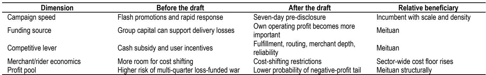
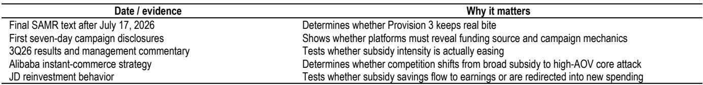
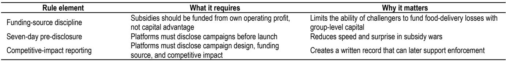

# JPM：外卖补贴新规的真正价值不在上限，而在让烧钱竞争变得“无法隐身”

市场正在用一个错误的框架解读中国外卖行业最重要的监管信号。当国家市场监管总局于6月17日发布《外卖平台补贴行为规范（征求意见稿）》时，主流反应是“没有硬性补贴上限，所以没有实质约束力”。这份JPM的深度研报提出了一个截然不同的判断：市场低估的不是规则的字面力度，而是信息披露作为一种执法机制的真实效力。

这份研报的核心主张清晰而克制：新规降低了美团的下行尾部风险，但尚未将监管缓和转化为正面的盈利催化剂。JPM维持美团中性评级，目标价85港元。这个判断建立在一个承重性假设之上——资金来源条款具有真实的行为约束力，能够限制以资本优势为弹药的外卖补贴攻击。如果这个前提成立，新规则降低了JPM此前给出的熊市情景（美团公允价值约51港元）的概率。

这不是一份宣告转折点的乐观报告，它更像一份情景概率的重新分配说明书。在监管信号密集、市场情绪反复的当下，这种克制恰恰是投资者最需要的东西。

---

## 1. 信息披露本身就是执法工具，市场误读了“没有上限”的含义

市场对新规的第一反应可以概括为：没有补贴上限，等于没有作用。JPM认为，这种解读忽略了规则设计的核心机制——新规不是通过设定价格上限来监管补贴，而是通过让激进的补贴行为变得更慢、更透明、更容易被挑战来发挥作用。

在外卖这个行业，最具有破坏力的竞争形式不是普通的促销，而是快速、以资本为后盾的补贴升级，其目的是在在位企业能够反应之前就改变消费者和商家的行为。七天的事前披露和资金来源报告，直接针对的就是这一机制。

研报提出了三个层面的逻辑链条。第一，信息披露降低了速度优势。外卖补贴战是反应式的——挑战者发起促销，在位者回应，市场测试双方的极限。七天公告窗口削弱了突袭的价值，破坏了针锋相对的动态循环。第二，信息披露创造了证据。资金来源披露和竞争影响自评估迫使平台写下监管者日后评估其补贴是否依赖资本优势或不正当竞争所需的事实。第三，信息披露在处罚到来之前就提高了攻击成本。一个必须提前披露的补贴活动，更容易被竞争对手、商户、骑手、媒体和监管者监控。这种声誉和执行风险，会降低平台发起极端补贴活动的意愿。

这个分析框架的实质是：规则不需要禁止每一项补贴来改变平台行为，它只需要让最激进的补贴活动变得更难发起、更难辩护、更难重复。对于投资者而言，这意味着需要调整的不是盈利模型中的数字，而是对竞争格局演变概率的判断。

---

## 2. 第三条是承重墙：补贴资金来源的界定将决定竞争格局的重新洗牌

研报中反复强调的“承重性条款”是第三条，即补贴应来自自身经营利润而非资本优势。投资结论的最终走向，取决于“自身经营利润”如何被解释。

JPM给出了三种可能的解释情景。如果最终解释为“分部级或接近分部级的利润”，这将强烈利好美团，因为挑战者无法轻易用集团资本来补贴外卖亏损。如果最终解释为“集团级利润”，则不对称性被削弱，阿里巴巴可以主张集团整体盈利足以支持持续投资。如果最终措辞模糊，这个问题将继续存在，执法行为将比文本本身更为重要。

研报的基准解读是，“资本优势”这一措辞意在限制交叉补贴和以资产负债表为后盾的份额攻击。这正是该规则对美团重要的原因。但这也是研报观点面临的最大风险——如果最终文本明确允许集团级利润满足要求，美团的战略优势将大幅缩水。

这一分析的价值在于，它为投资者提供了一个清晰的观察框架：最终规则的措辞选择，将成为判断竞争格局演变方向的关键路标。在7月17日征求意见截止之前，市场将围绕这一条款展开密集的解读和博弈。

---

## 3. 竞争战场从现金补贴转向运营质量，美团的护城河变得更宽

如果新规按预期发挥作用，竞争的维度将发生根本性转变。JPM从五个维度对比了规则前后的变化：活动速度从“闪电促销和快速反应”变为“七天事前披露”；资金来源从“集团资本可支持外卖亏损”变为“自身经营利润变得更加重要”；竞争杠杆从“现金补贴和用户激励”变为“履约、路线规划、商户深度和可靠性”；商户和骑手的经济学从“更大成本转嫁空间”变为“成本转嫁受限”；利润池从“多季度亏损资助战的高风险”变为“负利润尾部概率下降”。

这一转变的实质是：资本作为竞争捷径的价值被削弱了。挑战者仍然可以投资，但如果一个补贴活动必须提前披露、公开辩护、并与合规的资金来源挂钩，那么将份额争夺战伪装成普通促销就变得更加困难。

这对美团的意义在于，其护城河本质上是运营性的而非财务性的。美团的优势在于订单密度、路径效率、商户覆盖、骑手网络管理和消费者习惯养成。如果竞争游戏回归这些变量，美团的相对地位就会改善。

但这并不意味着外卖竞争消失了。竞争仍然可以转移到履约质量、商户选择、会员权益、物流和高客单价场景。然而，恰恰是这些领域，规模、密度和运营能力比单纯烧钱更为重要。

---

## 4. 利润池的地板在上升，但天花板并未被打开

研报对利润池的分析值得特别注意。JPM认为，新规降低了行业利润池变为负值的概率，但并未将行业恢复到2024年式的利润天花板。转向服务品质、物流和商户支持的竞争仍将消耗资金。更为重要的变化是，持续的亏损资助型补贴竞争将变得更加难以辩护。

对于美团而言，这是一个混合但净正面的结果。补贴线面临的尾部风险应该减小，但配送成本不太可能干净地回到2025年之前的水平。JPM的模型已经假设骑手单均成本从约5.0元向5.2-5.3元移动，新规强化了这一方向。

对于京东而言，情况更为复杂。研报指出，京东的外卖业务是最依赖资本补贴的。如果第三条被严格执行，京东外卖位置的可持续性将更难被支撑。京东进入外卖领域的持久影响，可能更多体现在提高了行业成本地板，尤其是骑手工资和履约标准方面，而非永久性的市场份额获取。

---

## 5. 估值情景概率在重置，但报告尚未回答的关键问题仍然悬而未决

JPM维持评级和盈利预测不变，因为新规仍处于征求意见阶段，最终措辞至关重要。但估值情景的概率分布正在发生变化。研报提供了一个说明性的计算：如果将约10个百分点的概率权重从熊市情景转移到基准和牛市情景，美团的混合目标价将升至90港元中段。

然而，报告也坦诚地列出了几个可能使其判断失效的关键风险。最终措辞允许集团级利润是最重要的风险。执法可能软化，使新规成为一项没有实质行为影响的披露练习。阿里巴巴可能转向高客单价的核心攻击，因为新规针对的是补贴、低于成本定价和成本转嫁，并不直接阻止通过履约质量、选品、会员或物流进行的竞争。而最清晰的验证测试是实际补贴强度——如果三季度数据显示补贴水平依然高企，研报的解读就需要重新审视。

这些未解问题恰恰构成了继续跟踪和讨论的价值。新规不是辩论的终点，而是进入一个更可观察阶段的起点。如果最终规则保留了资金来源条款，并且首批披露迫使平台解释补贴活动的经济学，市场可能需要重新审视美团、阿里巴巴和京东之间的相对价值配置。

---

对于关注中国互联网平台竞争的投资者而言，当前最需要建立的不是对某个方向的坚定信念，而是一个能够持续验证或推翻假设的观察框架。JPM这份研报的价值，正在于它提供了一个清晰的路标，而非一个简单的结论。

最终规则的措辞、首批补贴活动的披露内容、三季度的补贴强度数据、以及阿里巴巴即时零售战略的调整方向，将成为检验这份研报判断真伪的四个关键坐标。在这些证据出现之前，保持开放但警觉的观察姿态，可能是最理性的选择。

欢迎来星球微信群里继续讨论。我们将持续跟踪这份新规的最终版本及其竞争影响，并分享更多全球顶级投行的深度研报解读。如果你对美团、阿里巴巴或京东的竞争格局演变有自己的判断，也期待在讨论中碰撞出新的视角。

Personal reading notes and learning share only. Not investment advice.

